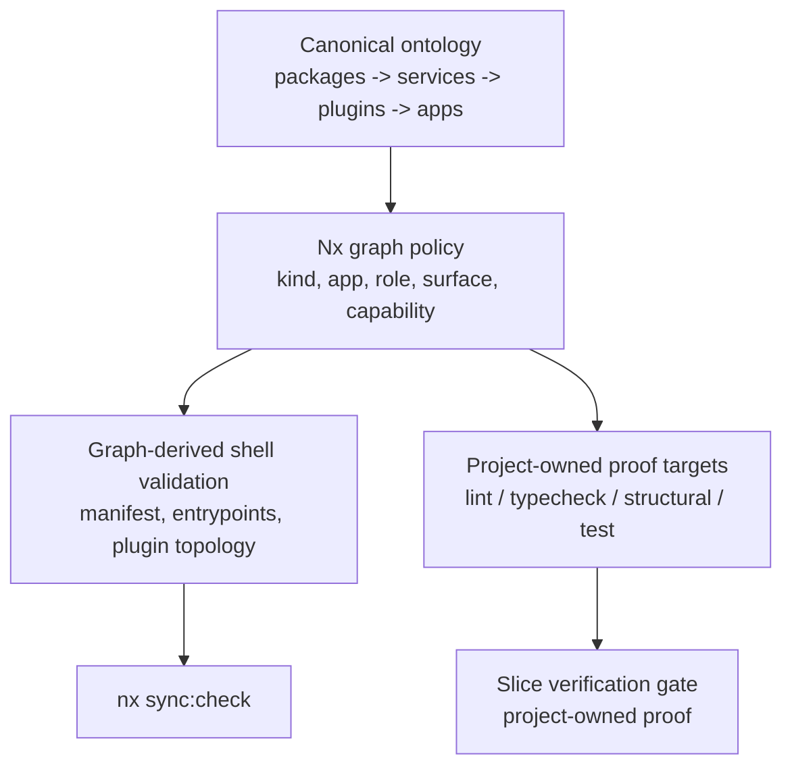

# V5 Enforcement Spec

Companion to:

- `.context/research/structural-migration-proposal-2026-03-20/proposals/PROPOSAL-V5.md`
- `.context/research/structural-migration-guardrails-2026-03-21/proposals/STRUCTURAL-MIGRATION-GUARDRAILS-PROPOSAL-DECISIVE.md`

## Purpose

This document defines the enforcement stack that makes the V5 target structure mechanically verifiable.

It is the companion enforcement contract for the migration packet:

- `STRUCTURAL-MIGRATION-GUARDRAILS-PROPOSAL-DECISIVE.md` defines the control-plane direction and the non-conservative Nx posture.
- `PROPOSAL-V5.md` defines the structural target shape and classification decisions.
- this document defines the proof map that makes those V5 decisions enforceable.

This document defines proof obligations and enforcement surfaces only. Rollout order, slice sequencing, and implementation mechanics live in the companion proposal documents.

The control plane is:

```text
canon -> graph -> proof -> ratchet
```

Where:

- canon fixes the nouns and authority seams
- the Nx graph encodes those seams as metadata and dependency law
- lint, structural checks, and tests prove what the graph cannot
- ratchets make each migration slice verifiable before the next slice moves

## Enforcement Model At A Glance



The stack divides responsibility cleanly:

- Nx proves graph shape, dependency direction, cohort ownership, and drift in graph-derived shell artifacts.
- Lint proves file-local architectural purity.
- Structural static checks prove declared shell shape where imports are insufficient.
- Runtime seam tests prove caller boundaries, projection correctness, and host composition.

## Front Door

### What this locks

- the canonical kind system
- the one-app, multi-role HQ shell
- the role-first plugin topology
- the proof layers that make V5 structurally enforceable

### What stays open

- exact tag spellings beyond the required axes
- exact `depConstraints` syntax
- exact generator and project-graph plugin implementation
- exact bootgraph public API and internal decomposition
- exact landing package for extracted Inngest auth support matter

### What to establish first

- canonical tags for kind, capability, app, role, and surface
- strict module-boundary policy, including removal of the `apps/server/src/rawr.ts` escape hatch
- project-owned `structural` and `sync` targets
- graph-derived shell validation with `nx sync:check`
- first shell-purity oracles:
  - manifest purity
  - entrypoint thinness
  - host-composition verification
  - route-family separation

## Enforcement Dependencies

The enforcement stack depends on a small number of prerequisites:

- graph policy depends on canonical tags for kind, capability, app, role, and surface
- graph-derived shell validation depends on the graph policy already describing the target shell
- lint purity depends on canonical manifest, entrypoint, and host seams being identifiable
- structural static checks depend on declared shell artifacts and durable evidence inputs
- runtime seam tests depend on the canonical caller surfaces and projection seams already being named
- slice ratchets depend on project-owned `structural` and `sync` targets rather than root-only orchestration

## What Must Be Enforced

### Canonical kinds

The only architectural kinds are:

- `packages`
- `services`
- `plugins`
- `apps`

`packages/bootgraph` is support infrastructure inside `packages`. It is not a fifth semantic layer.

### Canonical shell

The stable architecture is:

```text
app -> manifest -> role -> surface
```

The runtime realization is:

```text
entrypoint -> bootgraph -> process
```

### Canonical dependency direction

The semantic dependency direction is fixed:

```text
packages -> services -> plugins -> apps
```

### Canonical app and plugin shape

- `hq` is one app identity.
- `server`, `async`, `web`, `cli`, and `agent` are roles inside that app.
- The canonical plugin tree is `plugins/<role>/<surface>/<capability>`.
- The allowed role/surface matrix is:
  - `server -> api|internal`
  - `async -> workflows|consumers|schedules`
  - `web -> app`
  - `cli -> commands`
  - `agent -> tools`

## Enforcement Stack

### 1. Nx graph policy

Nx is the control plane for structural truth.

The required tag axes are:

- `type:*`
  - `type:package`
  - `type:service`
  - `type:plugin`
  - `type:app`
  - `type:tool` for non-architectural helpers and fixtures
- `capability:*`
  - one tag per semantic boundary, including the V5 service set
- `app:*`
  - `app:hq`
- `role:*`
  - `role:server`
  - `role:async`
  - `role:web`
  - `role:cli`
  - `role:agent`
- `surface:*`
  - `surface:api`
  - `surface:internal`
  - `surface:workflows`
  - `surface:consumers`
  - `surface:schedules`
  - `surface:app`
  - `surface:commands`
  - `surface:tools`
- `migration-slice:*`
  - transient only

The graph rules are:

- `type:package` may depend only on `type:package`.
- `type:service` may depend on `type:package` and `type:service`, but never on `type:plugin` or `type:app`.
- `type:plugin` may depend on `type:package` and `type:service`, but never on `type:plugin` or `type:app`.
- `type:app` may depend on `type:package`, `type:service`, and `type:plugin`, but never on another `type:app`.
- Every plugin project must carry exactly one `role:*`, exactly one `surface:*`, and one `capability:*`.
- Every app-owned runtime project must carry `type:app`, `app:hq`, and its role tag.

The boundary mechanism is `@nx/enforce-module-boundaries` with multi-axis constraints. `type:app -> *` is not allowed to remain effectively unconstrained.

### 2. Graph-derived shell validation

Imports are not sufficient to prove the app shell.

The graph-derived inventory must validate:

- one app identity: `app:hq`
- manifest ownership exists and is app-owned
- entrypoint-to-role mapping is explicit and coherent
- plugin path matches role, surface, and capability metadata
- dependency direction matches kind tags
- transitional exceptions are explicit and finite

`nx sync:check` is the hard-fail drift gate for that inventory.

This layer validates shell truth. It does not become a second manifest and it does not become a host-runtime oracle.

### 3. Lint purity layer

Lint proves file-local architectural purity.

Required lint rules:

- Manifest purity:
  - manifest may compose roles, surfaces, and boot contributions
  - manifest may not own host wiring, framework listener setup, env-driven placement logic, direct process boot, or ad hoc runtime assembly
- Entrypoint thinness:
  - entrypoints may select roles, derive boot input, start the bootgraph, and mount surfaces
  - entrypoints may not redefine app identity, discover plugins ad hoc, or bury role selection behind framework magic
- Host-shell purity:
  - host files must consume manifest-owned seams and runtime adapters explicitly
  - host files may not bypass the manifest with app-internal router construction or hidden route families
- Legacy metadata hard-delete:
  - forbidden historical metadata keys remain statically banned wherever they could affect active runtime behavior

`apps/server/src/rawr.ts` must be inside this first-line fence. The exemption cannot remain.

### 4. Structural static checks

Structural static checks prove architecture that imports alone cannot prove.

Required static verifiers:

- Manifest shell verifier:
  - the manifest declares required composition seams and only those seams
- Host composition verifier:
  - the host imports the manifest authority seam
  - the host mounts the required route families
  - the host preserves explicit mount order
  - the host avoids forbidden seams such as `/rpc/workflows`
- Route and harness declaration verifier:
  - the route-boundary matrix declares every required suite and negative assertion
- Artifact-integrity verifier:
  - structural proof depends only on durable artifacts, not scratchpads or ephemeral planning outputs
- Anti-duplication ownership verifier:
  - duplicated install or lifecycle truth in projection layers fails
  - split-brain service/plugin ownership fails

### 5. Runtime seam tests

Runtime seam tests prove actual boundary behavior.

Required test families:

- Route-family separation:
  - `/rpc` is not public
  - `/api/inngest` is ingress-only
  - `/api/workflows/<capability>` is capability-first
  - `/rpc/workflows` does not exist as a caller-facing family
- Manifest-owned composition:
  - server and async surfaces are mounted from manifest-owned seams rather than app-internal ad hoc wiring
- Projection correctness:
  - plugins remain projections on canonical surfaces and do not leak capability truth through wrong routes
- Ingress and auth:
  - ingress authentication rejects spoofing before runtime dispatch
- Host-context stability:
  - request-scoped context and runtime authority remain stable across host initialization seams
- Evidence durability:
  - closure and evidence gates remain deterministic and do not pass by consuming stale or scratch artifacts

### 6. Target ownership

The canonical target surface is:

- `lint`
- `typecheck` or `build`
- `test`
- `structural`
- `sync`

Ownership rules:

- participating projects and migration slices own these targets
- the root project may aggregate them
- the root project is not the primary owner of structural proof

Workflow mechanics such as cohort execution, blast-radius selection, and CI ratchets belong in the companion guardrails proposal. This spec fixes the ownership surface they operate on.

## Enforcement Consequences By Structural Decision

### Service promotions

The following capability boundaries must be enforceable as services:

- `coordination`
- `state`
- `journal`
- `security`
- `session-intelligence`
- `plugin-management`
- `agent-config-sync`
- `hq-operations`
- `support-example`
- `example-todo`

Enforcement consequence:

- these boundaries must be tagged and treated as `type:service`
- service truth may not remain in support packages or app-local seams once a slice claims convergence

### Support-matter residue

Allowed support residue remains in `packages/*` only if it does not own truth.

Enforcement consequence:

- support packages may not own contracts, policy engines, domain invariants, or authoritative writes
- mixed seams like `packages/hq` must be decomposed or retired rather than preserved

### Plugin projection structure

Plugins remain role/surface projections only.

Enforcement consequence:

- plugin paths and tags must match
- plugins may not own duplicated lifecycle or install truth
- projection code may depend on services and packages, but must not become a truth owner

### App shell

The app shell is one `app:hq` with explicit roles and a composition-only manifest.

Enforcement consequence:

- runtime projects carry `app:hq` plus role tags
- direct app-to-plugin imports outside manifest or entrypoint composition seams fail
- manifest purity and entrypoint thinness are first-class proof obligations

### Bootgraph reservation

`packages/bootgraph` is a protected downstream seam.

Enforcement consequence:

- current enforcement protects boundary and scope, not internal API shape
- app identity, manifest authority, plugin discovery, and repo policy cannot migrate into bootgraph

## Minimum Preconditions For Enforcement

Structural enforcement is not active until these are present:

- declare the canonical tag axes:
  - `type:*`
  - `capability:*`
  - `app:hq`
  - `role:*`
  - `surface:*`
- reclassify the first target cohort so Nx is enforcing target-state kinds rather than legacy kinds
- tighten `@nx/enforce-module-boundaries` so:
  - `type:app` is no longer unconstrained
  - `apps/server/src/rawr.ts` is no longer outside the fence
- create project-owned `structural` and `sync` targets for the first cohort
- introduce the graph-derived architecture inventory and make `nx sync:check` fail on shell drift
- turn on the first shell-purity oracles:
  - manifest purity
  - entrypoint thinness
  - host-composition verification
  - route-family separation

Execution sequencing for those preconditions belongs in the companion guardrails proposal.

## Implementation Flexibility

Only these items remain open for implementation planning:

- exact tag spellings beyond the required axes
- exact `depConstraints` syntax
- exact sync-generator and project-graph plugin implementation
- exact public API and internal decomposition of `packages/bootgraph`
- exact landing package for extracted Inngest auth support matter
- the threshold for promoting runtime-specific composition into a composed service

Everything else required to make V5 enforceable is already settled.
