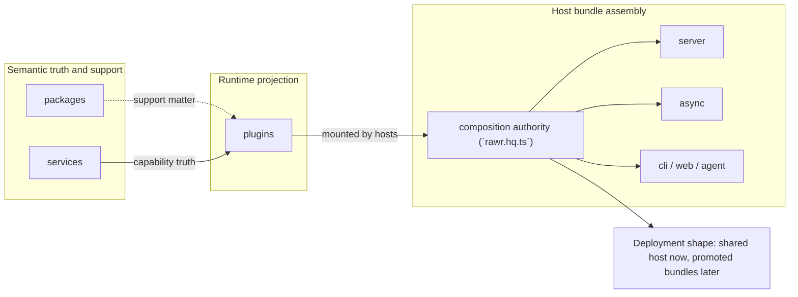
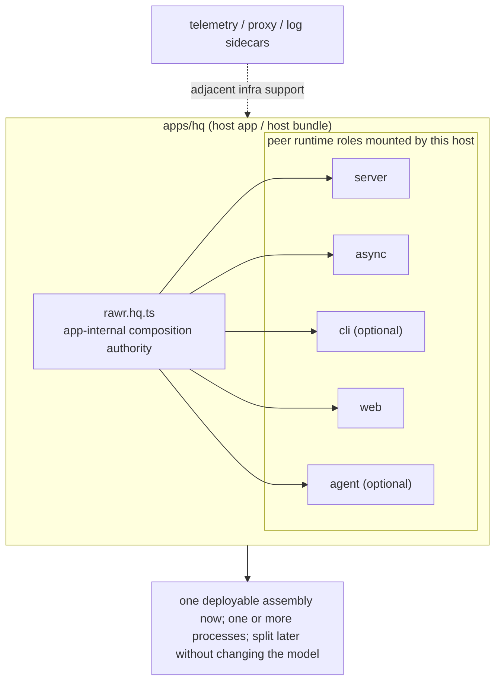
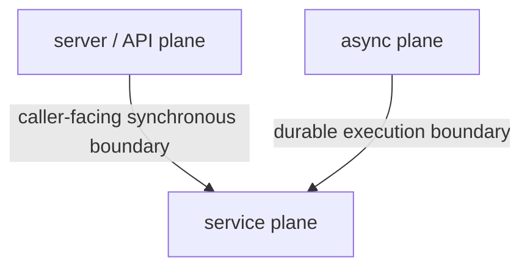
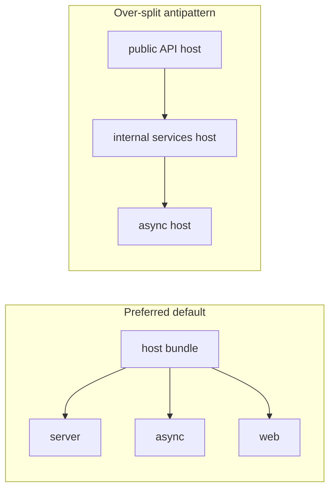
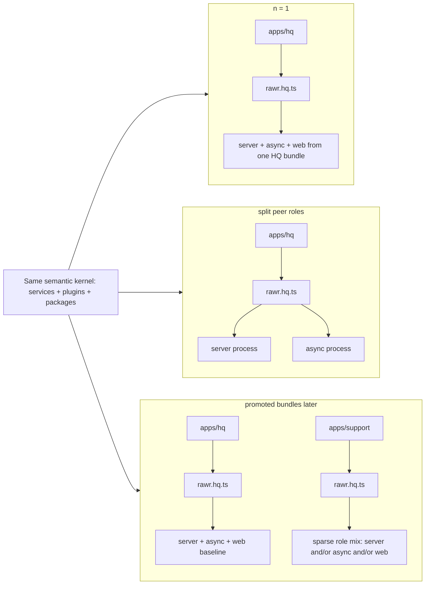
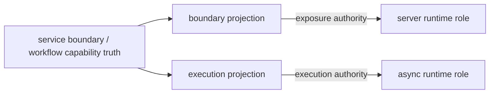
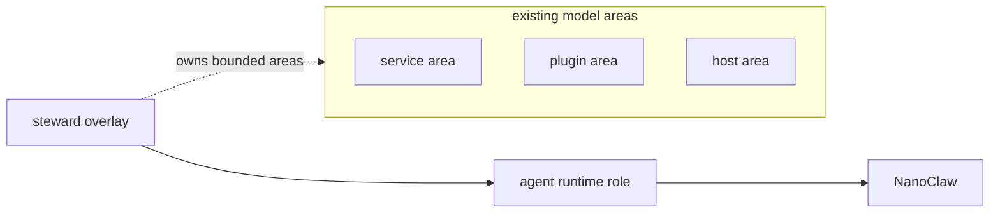

# RAWR Future Architecture

> This shell is parked as the current canonical destination artifact, not the final word. We will likely want to revisit and harden it as the architecture iterates, and may query back through the source JSON conversations to ensure nothing important was missed. The intent is to keep iterating until we have exhausted the source conversations that led to this point.

## Scope

This is the canonical destination architecture for RAWR HQ. It defines the durable ontology, host and runtime role model, default topology, and top-level responsibility splits.

Sequencing lives in the semantic architecture snapshot. Subsystem detail lives in supporting docs. This document changes only when the architecture itself changes.

## Architecture At A Glance

The architecture rests on one durable separation:

```text
semantic capability truth
  != runtime projection
  != host / boot / composition authority
```

`services` define capability truth (the authoritative definition of what a capability does, what contracts it exposes, and what invariants it owns). `packages` hold support matter (shared code, types, SDKs, helpers, and adapters that support other architectural kinds without themselves defining a first-class capability boundary). `plugins` project, adapt, expose, or mount capability into runtime surfaces. `apps/hosts` assemble runtime roles into host bundles through a composition authority (the manifest that decides which plugins mount into which runtime roles). Scale then changes placement, not semantic meaning.



The architecture keeps the system legible to both humans and agents while becoming more mechanically enforceable over time. The point is leverage, not tidiness.

## Core Ontology

The canonical top-level architectural kinds are:

```text
packages/   pure/shared/support matter
services/   semantic capability boundaries
plugins/    runtime-hosted projections and adapters
apps/       host implementations / boot authorities
```

These are not just folder labels. They are the minimum stable nouns that make the system understandable.

### `packages`

`packages` hold pure or shared support matter.

They may contain:

- shared types
- SDKs and helpers
- adapters and utilities
- lower-level primitives
- reusable support logic that does not itself define a first-class service boundary

What they do not define is semantic capability truth or host authority.

### `services`

`services` hold semantic capability truth.

A service is a contract-bearing in-process capability boundary. It owns:

- stable boundary contracts
- stable context lane structure
- service-wide middleware semantics
- service-wide assembly seams
- internal module/procedure decomposition
- business-capability truth for that boundary

A service is not merely a package, and it is not inherently a deployed microservice. It is a semantic unit first.

### `plugins`

`plugins` hold runtime-hosted projection.

A plugin exists to mount, expose, adapt, orchestrate, or otherwise project capability into a runtime surface. It owns:

- host integration
- transport and surface adaptation
- runtime middleware
- lifecycle participation
- runtime-specific orchestration

Plugins are not the default home of semantic truth. They project or adapt capability truth that lives elsewhere.

### `apps` / hosts

An app is a host implementation.

It owns:

- runtime boot
- lifecycle
- config and runtime identity
- composition and mounting
- transport wiring
- telemetry install and runtime participation

`apps` is the repo root kind. `host` is the architectural meaning of an app.

The composition manifest inside a host app, such as `rawr.hq.ts`, is not a fifth top-level ontology kind. It is an app-internal composition authority.

An app/host is not the business-logic center. It does not define semantic capability truth, and it is not a substitute for a service boundary. Its job is boot, lifecycle, runtime identity, transport wiring, and composition of runtime projections.

### Minimal repo topology

The following tree shows the current target-state direction at the level where composition behavior becomes architecturally meaningful. As far as the architecture work has currently converged, runtime projection groups first by runtime role and then by surface type within that role. That posture is load-bearing enough to illustrate here, but it is not a claim that every lower subtree, label, or naming choice has reached permanent final doctrine.

The second layer shows the kinds of distinctions that matter architecturally inside a runtime role. Exact subordinate taxonomy within each category remains open unless the architecture names it explicitly.

The important structural point is that first-level grouping follows runtime role, and second-level grouping follows real composition behavior inside that role. Exact labels may still evolve, but the grouping should reflect operationally different contribution shapes rather than arbitrary folder taste.

```text
packages/
  shared-types/
services/
  support/
plugins/
  server/
    api/
      <capability>
    <other-boundary-projection-kind>/
      <capability>
  async/
    <execution-projection-kind>/
      <capability>
  web/
    <web-projection-kind>/
      <capability>
  agent/
    <agent-projection-kind>/
      <capability>
  cli/
    <cli-projection-kind>/
      <capability>
apps/
  hq/
    rawr.hq.ts
```

At this level, the architectural differences stay visible:

- `packages` are support matter
- `services` are semantic homes
- `plugins` are runtime projections, grouped first by runtime role and then by surface-type distinctions that affect composition behavior
- `apps` are host homes with composition authority inside them

Composition behavior changes across these projection categories. The shell captures the current architectural direction without pretending that every subordinate category is permanently closed. Service internals, workflow-plugin internals, generated router surfaces, and other lower-level implementation shape are not governed at this level.

## Runtime Assembly Model

The runtime assembly model defines how one composition authority becomes one or more runtime roles inside a host bundle.

### Host bundle

A **host bundle** is a deployable runtime assembly built from one composition authority.

It is not inherently:

- one machine
- one process
- one service boundary

It is the deployable assembly that can run one or more roles together now and split them later without redefining the semantic model.

One minimal example:

```text
apps/hq/
  rawr.hq.ts
  <server role entrypoint>
  <async role entrypoint>
  <web role entrypoint>
  <cli role entrypoint optional>
  <other role entrypoints as needed>
```

The load-bearing facts:

- `rawr.hq.ts` is app-internal composition authority, not a new ontology kind
- one host app may mount several runtime roles
- composition shape is architectural; volatile filenames below it are not

One host bundle may be realized in a few stable ways without changing the model:

### Single-process mode

```text
1 host bundle
1 process
1 machine
server + async together
```

### Multi-process same-machine mode

```text
1 host bundle
2-3 processes
1 machine
process A = server
process B = async
process C = web
```

### Multi-machine / multi-service mode

```text
1 host bundle
2-3 deploy units
N machines/services
server on machine A
async on machine B
web on machine C
```

For the baseline HQ host bundle, the canonical posture is the split-surface form: `server`, `async`, and `web` are scaffolded as distinct long-running entrypoints and deployable surfaces from day one. The fully cohosted single-process form remains a valid generic realization mode, but it is not the baseline HQ posture.

### Runtime roles

A **runtime role** is the kind of process a host bundle runs.

It names a runtime responsibility, not a fixed deployable count. A role may be realized through its own entrypoint, may run alongside other roles inside one host bundle, and may later map to a separate process or deploy unit without changing its meaning.

The canonical top-level runtime roles are:

- `server`
- `async`
- `cli`
- `web`
- `agent`

These are peer runtime roles.

These are runtime-role names, not plugin subtype names. Labels such as `api`, `workflow`, `command`, and `steward` describe particular projection responsibilities within this runtime model; they do not replace it or create new ontology kinds.

#### `server`

Caller-facing boundary host.

`server` owns request/response boundary projection: public or host-callable APIs, transport and auth concerns, exposure policy, and trigger or control surfaces that must answer callers synchronously. It may call services in-process when caller and callee share a process and over RPC when remote, but it is not the semantic home of those capabilities.

#### `async`

Non-request execution host.

`async` is the umbrella runtime role for non-request execution: workflows, schedules, consumers, background jobs, and internal execution bridges. It covers any work whose caller does not wait for the full lifecycle to complete. `worker` names one execution posture inside this umbrella, not a peer runtime role; promoting it would collapse execution plane and subtype into the same layer.

For business-level async work that benefits from retries, durability, scheduling, timelines, and observability, Inngest is the default durability harness. That does not mean every tiny local side effect, hot internal path, or resident daemon loop must be forced through it.

The useful architectural test is whether the boundary performs work now or schedules work now. If caller latency tracks trigger latency while the real work continues on its own execution lifecycle, the responsibility belongs on `async`. If caller latency tracks total work latency, that is not the same architectural shape even if background machinery is involved.

Common async entry modes are:

- request-triggered work that returns an acknowledgement quickly
- schedule-triggered work
- event or consumer-triggered work
- long-lived resident loops or bridges where justified

#### `cli`

Command host for local or operator-facing execution.

`cli` owns its own entrypoint, lifecycle, and operator interaction model. It reuses the same underlying services and projections as other roles but runs in an interactive or scripted terminal context with its own argument parsing, output formatting, and error presentation. In practice, the CLI binary is the host for this role: it is the self-contained composition surface that mounts CLI-facing plugins and commands.

#### `web`

Frontend runtime role.

`web` is another assembled runtime surface over the same semantic capability truth. It owns its own entrypoint, build pipeline, and client-side lifecycle. It remains part of the host/runtime model rather than a separate ontology because it mounts the same plugins and consumes the same service contracts as other roles. In the baseline HQ host bundle, `web` is part of the default runtime set and is scaffolded as its own long-running surface rather than being folded into the backend `server`.

#### `agent`

Steward execution host.

`agent` is where bounded stewardship becomes runtime placement rather than static metadata alone. Stewards execute here; NanoClaw is the runtime backend for that execution, not a peer ontology kind. This is why `agent` belongs beside `server`, `async`, `cli`, and `web` as a real runtime role. In HQ, `agent` is not required for the core operational substrate to function, but it is a definitive future layer over that substrate rather than an optional afterthought.

An app host contains its composition authority. In a host such as `apps/hq`, `rawr.hq.ts` is the app-internal composition manifest that mounts one or more peer runtime roles for that host bundle. The manifest is part of the app host; it is not a separate top-level architectural kind and it does not sit above `apps` as an independent authority plane.



The runtime model is explicit:

- `server` and `async` are peers inside the same host model
- sidecars are adjacent infrastructure support, not peer application runtime roles

A shared host is a first-class architectural state:

```text
1 host bundle
  -> 1 composition authority
  -> server role
  -> async role
  -> web role optional
  -> services called in-process when caller and callee share a process
  -> sidecars optional, but not peer runtime roles
```

And splitting peer roles later does not change the model:

```text
1 host bundle
  -> process A = server
  -> process B = async
  -> same services, plugins, and packages model
  -> same composition authority
```

### Sidecar distinction

A sidecar is an infrastructure-support companion pattern, not a peer application runtime role.

Examples of sidecars:

- telemetry collector
- reverse proxy
- log shipper
- secrets agent

`async` is not a sidecar of `server`. It is a peer execution role that carries core product behavior.

## Boundary Laws

### Services define capability first

The key rule is:

```text
service boundary first
placement second
transport third
```

A service boundary is transport-neutral and placement-neutral.

The architecture should be read as three interacting planes:

```text
server/API plane = caller-facing synchronous boundaries
async plane      = durable/background execution
service plane    = private callable capability boundaries used by either one
```

At the shell level, these planes stay distinct in tooling as well:

- `oRPC` governs callable remote boundaries
- `Inngest` governs durable execution boundaries
- `Nx` governs graph, policy, and later mechanical enforcement

These roles are complementary. They should not be smeared into one another.

In particular:

- do not use Inngest as the general synchronous RPC layer
- do not use oRPC to fake durable execution
- do not expect Nx graph rules alone to define runtime semantics



That means:

- if caller and callee share a process, it should usually be called in-process
- if the service is remote, it can be called over RPC

The value of the service boundary is not forced remoting. The value is one canonical capability boundary that can be used locally first and remotely later without changing its semantic meaning.

### Projection and assembly laws

The ontology has a default direction:

```text
packages   -> support matter
services   -> capability truth
plugins    -> runtime projection of that truth
apps/hosts -> boot and composition authority downstream of projection
```

The enforceable dependency direction is:

- packages support services, plugins, and hosts but do not replace service truth or host authority
- service cores depend on packages but never on plugins or apps/hosts; dependency flows outward from capability truth, not inward
- plugins depend on service contracts, service clients, and support matter but do not become upstream semantic authorities over services
- apps/hosts compose runtime projection and host concerns but do not redefine capability truth

Plugins declare what they need or provide. Hosts decide how those declarations are mounted into runtime roles and bundles.

Detailed Nx tags, approved-scope policy, and lower-level import rules are governed in supporting docs.

### Plugin-service composition frontier

The governing principle:

- semantic composition belongs in services when it is part of service truth
- plugins compose only when the composition is genuinely runtime-specific

The unresolved frontier is when a multi-service runtime surface is still just runtime projection and when it should instead become a composed service that a plugin mounts thinly. That question remains in the pressure-test program described in the semantic architecture snapshot.

### Shared infrastructure is not shared semantic ownership

```text
shared infrastructure != shared semantic ownership
```

Multiple services may share:

- a host bundle
- a machine
- a process
- a database instance
- a connection pool

That does not mean they share semantic truth or write ownership.

| Shared infrastructure may be shared | Semantic ownership does not become shared |
| --- | --- |
| host bundle | service boundary |
| process | service contracts |
| machine | write authority |
| database instance | capability truth |
| connection pool | bounded ownership |

The architecture is intentionally trying to keep capability ownership crisp even when infrastructure is shared.

### Cross-service calls preserve service ownership

Cross-service interaction should go through a service boundary using its canonical contract or client shape. When caller and callee share a process, default to in-process calls. When the called service is remote, use RPC.

Shared hosts, shared processes, shared database instances, and shared pools do not create shared write authority. If two services require direct write authority over the same business tables or invariants, they are usually one service, or one is the canonical owner and the other goes through it or through explicitly governed projections.

## Default Topology And Scale

### Default topology stance

HQ defaults to one host bundle built from one composition authority, `rawr.hq.ts`.

Its baseline long-running runtime set is `server`, `async`, and `web`.

Those three roles are scaffolded as distinct entrypoints and distinct deployable surfaces from day one. `server` and `async` remain the primary backend execution roles. `web` is the default frontend surface for HQ and should not be folded into the backend `server` in this non-SSR architecture.

`cli` remains a peer runtime role in the architecture, but it is realized as a command entrypoint/host for operator or local execution rather than implying a continuously running deployed process. `agent` remains an optional role the same host bundle may also mount.

What the architecture should avoid as a baseline is:

```text
public API host + dedicated internal services host + async host
```

The preferred default mounts `server`, `async`, and `web` from one HQ host bundle while keeping them as separate runtime surfaces; the over-split antipattern introduces a dedicated internal services host before operational pressure earns it.



The architecture should introduce a dedicated internal services host only for concrete operational reasons. The baseline is to keep services transport-neutral, run them in-process when caller and callee share a process, use RPC when they are split across processes or hosts, and treat `server`, `async`, and `web` as the baseline HQ runtime surfaces.

The reason this is the default is practical, not aesthetic. Promoting an internal services host too early adds latency, failure modes, deploy/config surface, debugging burden, and distributed complexity before the architecture has earned it.

### Scale continuity from `n = 1` outward

The central scale-continuity goal:

start simple without misrepresenting the system's architecture.

At `n = 1`, one primary HQ assembly can run:

- one host bundle
- three baseline runtime surfaces: `server`, `async`, and `web`
- separate entrypoints and deployable surfaces for those roles

That is the same architecture at a smaller scale.

Later, the same model can separate:

- runtime roles into separate processes
- host bundles into separate deploy units
- domain-focused sub-assemblies into promoted peers of HQ

without redefining:

- service boundaries
- package meaning
- plugin meaning
- host/runtime role meaning

That is the core scale-out property:

```text
semantic truth stays stable
while runtime placement becomes more distributed
```



Continuity is the point: the baseline HQ bundle may carry a fuller runtime set, while promoted peer bundles may stay sparse. What changes is host-bundle count and runtime placement, not what a service, plugin, host bundle, or runtime role means.

## Specialized Interpretations

### Workflow responsibility split

Execution authority and exposure authority are distinct architectural responsibilities:

- durable workflow execution belongs to the async/runtime side of the system
- external exposure belongs to the boundary/API side of the system

The responsibility split is durable; the package shape that carries it is not normalized at this level. Workflow capability truth remains upstream of runtime packaging; boundary projection belongs on the server side, durable execution projection belongs on the async side, and one capability may contribute to both through host composition.

What remains durable at shell level is more than the split alone:

- a public or host-callable workflow surface may exist on the boundary side
- a separate durable execution bundle belongs on the async side
- a shared binding/composition layer may feed both without collapsing them into one concern
- host composition should be able to assemble workflow-facing boundary surfaces and durable execution bundles from descriptors and bindings without collapsing exposure authority and execution authority into one package shape by default

Whether that lands as a dual-surface workflow plugin, paired execution and API plugins, or another composed form remains below shell level in the pressure-test frontier.



This aligns with the host/runtime model and the workflow strategy. Packaging and operation detail are governed in supporting docs.

### Agent runtime and stewardship

The agent host is a first-class runtime role.

NanoClaw is not a peer ontology kind beside package, service, plugin, or app. It is the runtime backend used for steward execution on the `agent` role.

The durable stewardship commitments:

- stewards are real runtime concerns, not just future review metadata
- stewards execute on the `agent` host/runtime
- stewardship combines ownership and runtime placement
- stewardship overlays the existing ontology kinds rather than adding a new top-level kind



Stewardship does not create a new ontology root. It assigns bounded ownership across existing areas and executes through the `agent` runtime role. Future autonomous stewardship depends on real bounded runtime ownership, not just static file-level responsibility markers.

## Why This Shape Exists

These boundaries exist to reduce ambient ambiguity.

They make it easier to answer:

- where capability truth lives
- what is merely runtime projection
- what owns boot and composition
- what can be enforced later
- what an agent is actually allowed to operate over

Strong nouns reduce the number of bad architectural moves that are even thinkable.

When these boundaries hold, later systems become much easier to build coherently:

| Stable noun or seam | What it unlocks later |
| --- | --- |
| `services` | one capability boundary that can stay local first and remote later |
| `plugins` | runtime-specific projection without semantic drift |
| `apps/hosts` and host bundles | scale-out without ontology rewrite |
| runtime roles | clearer execution topology and observability attachment |
| steward ownership on `agent` | bounded autonomous operation |

The system needs to be legible enough to be reasoned about quickly, enforced mechanically, scaffolded safely, and operated by agents without constant ambiguity. That is the leverage these boundaries provide.

## What Remains Outside This Architecture

The following are **not** governed at this level:

- service-internal folder law and module structure
- `db` vs `repository` mechanics
- exact workflow operation sets or route shapes
- run-store details
- plugin-local control-surface generation details
- plugin-service composition threshold law beyond naming the frontier
- concrete Nx tag matrices
- generator specifics
- worktree harness implementation details
- observability plumbing details
- governance process details

Those belong in supporting docs or later implementation-phase work unless they rise to the level of canonical architecture.

Relationship to supporting docs:

| Supporting doc | What it should continue to own |
| --- | --- |
| semantic architecture snapshot | sequencing, next steps, pressure-test ordering |
| host model / runtime memo | source-history for host bundle language, runtime roles, NanoClaw placement, and scale framing |
| service internal structure doc | service-internal ownership law |
| workflow plugin strategy doc | workflow/plugin detail, except where this architecture explicitly locks top-level responsibility splits |

The durable kernel remains:

```text
packages   = support matter
services   = semantic capability truth
plugins    = runtime-hosted projection
apps/hosts = boot and composition authority
```

running through these peer runtime roles:

```text
server
async
cli
web
agent
```
