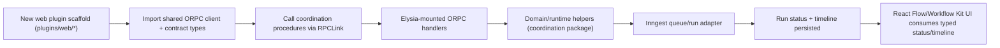

# ORPC Repo-Wide Migration Scope (Research Phase)

## Metadata

- Date: 2026-02-12
- Working state: top Graphite stack branch (`codex/coordination-design-data-v1-cutover`) via worktree
- Phase: research + scoped plan only (no production refactor in this document)
- Goal: replace manual internal API wiring with oRPC wherever the API surface is JSON/procedure-oriented, while preserving existing Inngest runtime behavior and micro-frontend plugin flows

## Executive Decision

Use a **contract-first oRPC architecture** as the repo API spine.

Why:

1. Domain schemas already exist and are strong (`packages/coordination/src/types.ts`, validation/storage helpers).
2. Manual duplication exists across server, CLI, and web clients and is best removed by a single contract artifact.
3. We need one source of truth that supports:
   - Elysia server exposure,
   - typed RPC clients for web/CLI/plugins,
   - optional OpenAPI exposure for compatibility and ecosystem consumption,
   - no-network procedure tests.

## Scope Boundaries

In scope for this migration plan:

1. Coordination JSON API surfaces currently implemented manually (`/rawr/coordination/*`).
2. CLI and web wrappers that hand-roll `fetch` + envelope parsing.
3. Elysia integration for oRPC handlers.
4. Inngest integration touchpoints (run queueing and status/timeline flows).
5. Testing harnesses, docs, runbooks, and skill updates needed to standardize ORPC workflows.

Out of scope for initial cutover:

1. `GET /health` (simple liveness endpoint).
2. `/api/inngest` transport endpoint itself (must remain a direct Inngest serve handler).
3. `/rawr/plugins/web/:dirName` module serving endpoint (serves JS module bytes, not procedure payloads).
4. External vendor APIs (`OpenAI`, `Voyage`) in package internals.

## Current State Audit

### Manual API surfaces and duplication

| Surface | Current implementation | Current consumers | Problem |
|---|---|---|---|
| `/rawr/coordination/*` | `apps/server/src/coordination.ts` manual Elysia routes | `apps/web/src/ui/coordination/adapters/api-client.ts`, `apps/cli/src/lib/coordination-api.ts` | Same procedure contracts implemented and parsed in 3 places |
| Run queue + timeline progression | `queueCoordinationRunWithInngest` + `processCoordinationRunEvent` in `packages/coordination-inngest/src/adapter.ts` | server routes and UI polling | Runtime logic is reusable, but transport layer around it is hand-wired |
| Envelope schema (`ok`, `error`) | `packages/coordination/src/http.ts` + duplicated client parsing logic | web + CLI | Repeated parsing/error translation logic across clients |
| Canvas polling/run state fetch | `useWorkflow`, `useRunStatus` using fetch wrappers | React Flow/Inngest workflow kit UI | Manual request lifecycle and backoff logic tied to raw HTTP paths |

### Existing strengths to preserve

1. Strong domain model and validation in `packages/coordination`.
2. Inngest execution pipeline and queue lock behavior in `packages/coordination-inngest`.
3. Elysia server/plugin mount model in `apps/server`.
4. Existing runbooks and operations for coordination + Inngest.

## Architecture Choice: Contract-First vs Router-First

### Option A: Contract-first (chosen)

- Define procedure contracts first (`@orpc/contract`), implement once, expose via RPC/OpenAPI handlers.
- Pros:
  - Single canonical API artifact.
  - Best fit for multi-consumer repo (web, CLI, future plugins).
  - Enables no-network contract-level tests and drift checks.
  - Clear agent-friendly navigation: contract -> implementation -> clients.
- Cons:
  - Initial setup overhead.
  - Requires staged migration for compatibility.

### Option B: Router-first (not chosen)

- Wrap current handlers first, formalize contracts later.
- Pros:
  - Faster short-term migration.
- Cons:
  - Preserves duplication and drift longer.
  - Weaker onboarding clarity.
  - Harder to guarantee API stability at scale.

## Target Architecture

### Contract spine

1. Introduce an ORPC contract module for coordination procedures (recommended location: inside `packages/coordination` under an explicit ORPC namespace such as `src/orpc/contract.ts`).
2. Map each existing manual route to one procedure:
   - `listWorkflows`
   - `saveWorkflow`
   - `getWorkflow`
   - `validateWorkflow`
   - `queueRun`
   - `getRunStatus`
   - `getRunTimeline`
3. Reuse existing domain types (`CoordinationWorkflowV1`, `RunStatusV1`, `ValidationResultV1`, `DeskRunEventV1`) in contract I/O shapes.

### Implementation boundary

1. Implement contract handlers against existing domain/runtime helpers:
   - storage/validation from `@rawr/coordination/node`
   - run queue and execution glue from `@rawr/coordination-inngest`
2. Keep `apps/server` thin: mount ORPC handlers and pass runtime context.
3. Preserve `/api/inngest` endpoint as direct Inngest serve adapter.

### Transport boundary

1. Expose **RPC transport** for first-party clients (web, CLI, internal plugins).
2. Expose **OpenAPI transport** for compatibility/tooling where helpful.
3. Keep legacy `/rawr/coordination/*` temporarily as shim during migration slices, then delete.

### Consumer boundary

1. Web canvas and hooks consume ORPC client procedures instead of manual fetch wrappers.
2. CLI coordination commands consume ORPC client instead of `coordinationFetch`.
3. Future web plugins consume the same typed client contract from shared package.

## Integration Lifecycle For New Web Plugin (ORPC + Inngest + Elysia + React Flow)

Step-by-step standard:

1. Scaffold plugin (`plugins/web/*`) and keep entrypoints thin.
2. Import shared ORPC client factory and coordination contract types.
3. Drive workflow CRUD/run/timeline via typed procedures.
4. Let server ORPC handlers delegate run execution to Inngest adapter.
5. Render React Flow/Workflow Kit UI from typed outputs.
6. Surface trace links/status from returned run payloads.

## Detailed File-Level Scope

### 1) Domain + contracts (`packages/`)

Create/update:

1. `packages/coordination/src/orpc/contract.ts` (new): canonical procedure contract.
2. `packages/coordination/src/orpc/schemas.ts` (new or merged): schema adapters for procedure I/O.
3. `packages/coordination/src/index.ts` and `packages/coordination/src/node.ts` exports: expose ORPC contract artifacts.
4. `packages/coordination/src/http.ts`: potentially retain envelope helpers only as temporary bridge layer.

Potential optional extraction if needed later (not required in first pass):

1. `packages/coordination-orpc-impl/*` if implementation footprint outgrows `apps/server`.

### 2) Server + network integration (`apps/server`)

Create/update:

1. `apps/server/src/coordination.ts`: move from manual route declarations to contract implementation wiring.
2. `apps/server/src/rawr.ts`: mount ORPC RPC/OpenAPI handlers; keep `/api/inngest`, `/rawr/state`, `/rawr/plugins/web/:dirName`.
3. `apps/server/src/index.ts`: pass context/runtime into ORPC handlers.

Delete after cutover:

1. Manual route registration blocks for `/rawr/coordination/*`.

### 3) Web frontend + canvas (`apps/web`)

Create/update:

1. `apps/web/src/ui/coordination/adapters/api-client.ts`: replace manual fetch with ORPC client wrapper.
2. `apps/web/src/ui/coordination/hooks/useWorkflow.ts`: use ORPC queries/mutations for workflows and queue run.
3. `apps/web/src/ui/coordination/hooks/useRunStatus.ts`: use ORPC for run status/timeline polling.
4. `apps/web/src/ui/coordination/components/CoordinationPage.tsx`: consume new typed hooks and trace links directly from run data.
5. `apps/web/src/ui/pages/MountsPage.tsx`: optional follow-up to move `/rawr/state` into ORPC if we standardize that endpoint in the same wave.

### 4) CLI wrappers (`apps/cli`)

Create/update:

1. `apps/cli/src/lib/coordination-api.ts`: replace with ORPC client-based transport helper.
2. `apps/cli/src/commands/workflow/coord/create.ts`
3. `apps/cli/src/commands/workflow/coord/run.ts`
4. `apps/cli/src/commands/workflow/coord/status.ts`
5. `apps/cli/src/commands/workflow/coord/trace.ts`
6. `apps/cli/src/commands/workflow/coord/validate.ts`

Delete after cutover:

1. Legacy envelope parsing glue that only exists to interpret manual REST responses.

### 5) Inngest integration

Keep core runtime logic:

1. `packages/coordination-inngest/src/adapter.ts` stays canonical for queueing/processing.

Update integration points:

1. Ensure ORPC `queueRun` procedure delegates to `queueCoordinationRunWithInngest` unchanged.
2. Ensure trace-link semantics remain stable in responses consumed by web/CLI.

### 6) Plugins + scaffolding

Create/update:

1. Plugin docs and scaffold behavior to show ORPC hookup for web plugins.
2. Keep plugin entrypoints thin; push domain/network details into shared packages.

Reference files:

1. `plugins/AGENTS.md`
2. `plugins/cli/plugins/src/commands/plugins/scaffold/web-plugin.ts`
3. `docs/system/PLUGINS.md`

## Testing Scope

### Target testing matrix

1. **Contract/procedure tests (no HTTP)**:
   - validate procedure inputs/outputs and error mapping in-process.
2. **Handler integration tests (minimal transport)**:
   - validate ORPC handler mounting and context wiring in Elysia.
3. **Runtime integration tests**:
   - confirm queue run path still reaches Inngest adapter semantics.
4. **Frontend integration + visual tests**:
   - verify hooks and UI flows against ORPC mocks.
5. **CLI integration tests**:
   - verify command outputs against ORPC responses.
6. **Contract drift tests**:
   - snapshot/minified contract shape to catch accidental breaking changes.

### Concrete test files expected to change

1. `apps/server/test/rawr.test.ts`
2. `apps/server/test/health.test.ts` (mostly unchanged; ensure no regression)
3. `packages/coordination/test/coordination.test.ts`
4. `packages/coordination-inngest/test/inngest-adapter.test.ts`
5. `apps/web/test/coordination.visual.test.ts`
6. CLI tests under `apps/cli/test/*` that currently only validate dry-run or command shell behavior

## Migration Slices (Prepare -> Cutover -> Cleanup)

### Slice 0: Decision + scaffolding

1. Approve contract-first architecture and procedure namespace.
2. Add ORPC contract module and baseline tests.
3. Document temporary bridge/deletion targets.

Deletion target set:

1. Manual `/rawr/coordination/*` route handlers.
2. `apps/web` manual coordination fetch adapter.
3. `apps/cli` manual coordination fetch helper.

### Slice 1: Parallel bridge

1. Mount ORPC handlers in server while keeping existing manual routes.
2. Add ORPC client wrappers in web/CLI behind minimal internal adapter layers.
3. Run dual-path verification in tests.

### Slice 2: Consumer cutover

1. Switch web hooks and CLI commands to ORPC client as primary path.
2. Keep temporary fallback only where needed for stabilization window.

### Slice 3: Legacy cleanup

1. Remove manual route/controller logic for coordination.
2. Remove duplicated envelope parsing adapters.
3. Update docs/runbooks/skills to ORPC-first only.

### Slice 4: Hardening

1. Enforce contract drift checks in CI.
2. Add new-plugin lifecycle guardrails and examples.
3. Audit for remaining manual JSON API seams in repo and plan next ORPC waves.

## Documentation + Runbook + Skill Scope

### Documentation updates required

1. `docs/SYSTEM.md`: add ORPC API spine and boundary contracts.
2. `docs/system/PLUGINS.md`: add ORPC client expectations for web plugins.
3. `docs/process/RUNBOOKS.md`: include ORPC migration and ORPC-first plugin wiring runbook entries.
4. `docs/process/runbooks/COORDINATION_CANVAS_OPERATIONS.md`: update endpoints and debugging flow to ORPC-first.
5. `docs/process/PLUGIN_E2E_WORKFLOW.md`: add ORPC-aware validation and test gates.

### Skills likely to update

1. `orpc` skill: add repo-specific canonical conventions and paths.
2. `plugin-architecture` skill: include ORPC contract/client expectations for runtime plugins.
3. `react-flow` skill notes (repo-local guidance): where canvas hooks live and how they consume typed ORPC outputs.
4. `inngest` skill notes (repo-local guidance): how queue/run procedures map through ORPC without replacing `/api/inngest`.

## Risks and Mitigations

1. **Input validation drift**:
   - Mitigation: enforce schema parity and explicit tests for ID validation.
2. **Error-shape compatibility breaks**:
   - Mitigation: bridge layer during cutover + client migration tests.
3. **Body parsing/transport integration bugs with Elysia**:
   - Mitigation: dedicated handler integration tests for RPC/OpenAPI mounts.
4. **Queue/runtime behavior regression**:
   - Mitigation: keep Inngest adapter as unchanged runtime core and test queue/run lifecycle invariants.
5. **Doc/process drift**:
   - Mitigation: require runbook/doc updates in same migration slices, not post-hoc.

## Open Decisions To Confirm Before Implementation

1. Should non-coordination JSON endpoints (for example `/rawr/state`) be included in this first ORPC wave, or follow-on wave?
2. Exact contract module location:
   - keep in `packages/coordination` initially (recommended),
   - or introduce dedicated package now.
3. OpenAPI exposure policy:
   - internal-only first,
   - or publish as first-class external contract from day one.

## Implementation Kickoff Checklist (for next phase)

1. Finalize decision packet for the 3 open decisions above.
2. Create implementation plan branch stack slices aligned to migration slices.
3. Build contract + procedure tests before transport refactor.
4. Wire server handlers in parallel mode (old + new).
5. Cut over web/CLI clients.
6. Remove legacy paths and finalize docs/runbooks/skills.

## External References Verified (2026-02-12)

1. oRPC docs: https://orpc.dev/docs
2. oRPC Elysia adapter: https://orpc.dev/docs/adapters/elysia
3. Elysia docs: https://elysiajs.com/
4. Inngest docs: https://www.inngest.com/docs
5. React Flow docs: https://reactflow.dev/

Current package version checks run in this workspace:

1. `@orpc/server` `1.13.5`
2. `@orpc/client` `1.13.5`
3. `@orpc/contract` `1.13.5`
4. `@orpc/openapi` `1.13.5`
5. `elysia` `1.4.25`
6. `inngest` `3.52.0`
7. `@inngest/workflow-kit` `0.1.3`
8. `@xyflow/react` `12.10.0`
