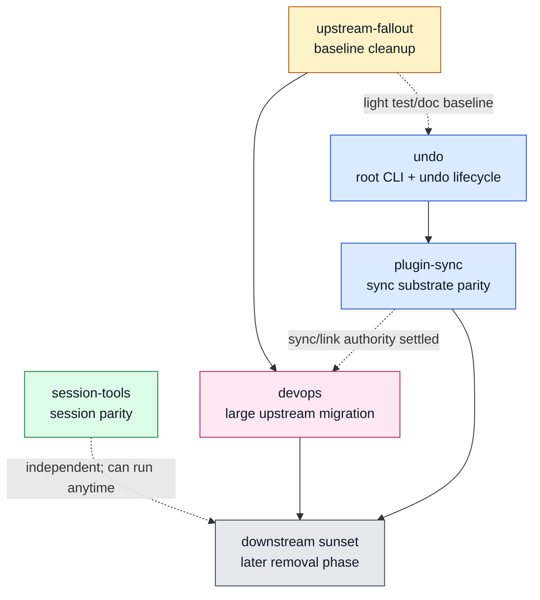

# Workstream B Next Packet

Continuation target: future lane-specific Workstream B implementation design
sessions.

Successor workstream, if any: pick one lane at a time from this packet. Do not
turn all lanes into one giant implementation session unless explicitly directed.

Why this is next: Workstream B preparation is review-repaired. The next step is
lane-specific implementation design for one migration/reconciliation lane using
the lane packet, authority map, review ledger, and lesson capture as the
starting authority.

Current branch/stack: preparation artifacts live on
`codex/workstream-b-preparation` in `RAWR HQ-Template`.

What changed: added durable Workstream B prep artifacts under
`docs/projects/workstream-b-preparation/`, then repaired them with actual
mapper/verifier provenance and accepted reviewer findings.

What is done:

- Authority map is written.
- Review ledger is written.
- Repair plan is captured verbatim.
- Removal/sunset lessons are captured.
- Lane packet template is written.
- Six lane packets are written and repaired.
- Each lane has discovery, spec, rough plan, and readiness.
- Current repo evidence and reviewer dispositions are recorded.

What is not done:

- No code migration.
- No package removal.
- No docs cleanup outside the preparation artifact tree.
- No downstream duplicate removal.
- No global plugin sync/link repair.

What to inspect first:

1. `docs/projects/workstream-b-preparation/AUTHORITY_MAP.md`
2. `docs/projects/workstream-b-preparation/REVIEW_LEDGER.md`
3. `docs/projects/workstream-b-preparation/LESSONS.md`
4. The target lane's `READINESS.md`
5. The target lane's `DISCOVERY.md`
6. The target lane's `SPEC.md`
7. The target lane's `ROUGH_PLAN.md`

Exact next action:

Open a lane-specific implementation design session and ask it to design the
implementation workstream for exactly one lane, using that lane's packet, the
authority map, the review ledger, and lesson capture as opening context.

## Execution Approach

Run Workstream B as a staged lane sequence that minimizes coordination cost.
Do not run every lane as a peer implementation branch unless the user explicitly
chooses speed over coordination simplicity.

Recommended sequence:

1. `upstream-fallout`: clean upstream baseline first by removing MFE demo and
   stale coordination guidance while preserving Inngest/runtime hooks.
2. `undo`: settle the narrow `agent-config-sync` undo public surface and root
   CLI behavior.
3. `plugin-sync`: consume the settled `agent-config-sync` surface and prove
   upstream sync/tooling parity.
4. `session-tools`: implement independent session parity. This may run earlier
   in parallel if a spare team is available because it does not share the
   `agent-config-sync` surface.
5. `devops`: run the large upstream migration after baseline cleanup and after
   sync/link authority assumptions are settled.
6. downstream sunset: remove downstream duplicates only in a later end-phase
   after upstream lane parity is proven and DRA approval is explicit.

Dependency graph:



Parallelism rule:

- Safe early parallel lane: `session-tools`.
- Best first lane: `upstream-fallout`.
- Shared-service sequence: `undo` before mutating `plugin-sync` service work.
- Largest lane: `devops`, preferably after upstream fallout and sync/link
  authority assumptions are settled.

Downstream hold:

- Keep downstream implementations and content in place for every lane during
  this upstream implementation phase.
- Downstream paths are behavior evidence and content/source inputs, not removal
  targets.
- Do not delete downstream duplicates lane-by-lane. Sunset belongs to the final
  downstream phase after all relevant upstream lanes are complete, parity is
  proven, lessons are preserved, and DRA approval is explicit.

Required first reads:

- `AGENTS.md`
- `AGENTS_SPLIT.md`
- `docs/AGENTS.md`
- `docs/process/GRAPHITE.md`
- `docs/projects/workstream-b-preparation/AUTHORITY_MAP.md`
- `docs/projects/workstream-b-preparation/REVIEW_LEDGER.md`
- `docs/projects/workstream-b-preparation/LESSONS.md`
- `docs/projects/workstream-b-preparation/LANE_PACKET_TEMPLATE.md`
- `docs/projects/workstream-b-preparation/lanes/<lane>/READINESS.md`
- `docs/projects/workstream-b-preparation/lanes/<lane>/DISCOVERY.md`
- `docs/projects/workstream-b-preparation/lanes/<lane>/SPEC.md`
- `docs/projects/workstream-b-preparation/lanes/<lane>/ROUGH_PLAN.md`

Important authority note: `AGENTS_SPLIT.md` is required for destination and repo
role grounding, but Workstream B's locked authority decision supersedes stale
DevOps split-model text. DevOps architecture migrates upstream; downstream
personal ownership remains content/customization ownership, not shared tooling
architecture authority.

First commands:

```bash
git status --short --branch
gt ls
bunx nx show projects
find docs/projects/workstream-b-preparation -type f | sort
```

Then run the lane-specific commands listed in that lane's `READINESS.md`.

Deferred items to consume:

- `session-tools`: upstream facets, Codex custom payload parsing, extract
  output parity, facet-only bounded search mode, limit/candidate semantics, and
  CLI tests.
- `undo`: root command wiring, narrow
  `@rawr/agent-config-sync/undo` lifecycle export, deterministic human/JSON
  failure behavior, dry-run preservation, and command-expiration tests.
- `devops`: upstream package/plugin migration, Graphite/worktree safety
  invariants, noninteractive behavior, template-safe opt-in convergence/link
  healing, JSON fixture contracts, and stale split docs ignored as authority.
- `plugin-sync`: downstream behavior inventory, bounded non-mutating
  `--source-workspace` drift/dry-run proof, and duplicate sync authority
  removal only after parity and content safety are proven.
- `upstream-fallout`: remove MFE demo and coordination docs/claims; preserve
  Inngest/runtime hooks; use a test-local web plugin fixture; update project
  lists, Vitest references, service tests, and lockfile state.

Agent: future lane DRA plus one Mapper/Verifier pair.

Workstream objective: design and then execute one lane's implementation plan,
depending on user instruction in that future session.

Authority order:

1. Current user decision in that future session.
2. `AUTHORITY_MAP.md`.
3. Current upstream code.
4. Current downstream code after Workstream A.
5. `REVIEW_LEDGER.md` accepted findings.
6. Lane packet evidence.
7. Old docs only as stale/evidence inputs.

Workstream record path: future lane should create its own workstream record on
its implementation branch, not edit this preparation record unless the
preparation packet itself needs correction.

Allowed edit surfaces: lane-specific. Start with the lane `READINESS.md`.

Forbidden files:

- Downstream `RAWR HQ` files. Downstream sunset is not part of the first
  upstream lane implementation pass; it waits for the final downstream phase.
- Inngest runtime files for the upstream-fallout lane, except preservation docs
  or references that distinguish Inngest from removed coordination canvas.
- Any generated provider home, global plugin install state, or link-repair
  output.

Evidence paths: lane-specific discovery files and accepted ledger findings.

Forbidden scope:

- Do not redesign future coordination.
- Do not remove Inngest.
- Do not preserve MapGen/Civ 7 unless explicitly redirected.
- Do not run global plugin sync/link repair as an incidental validation step.
- Do not delete material with hard-won lessons before preserving those lessons
  in `LESSONS.md` or a lane-local lesson artifact.

Output artifact path: future lane workstream should write a new lane execution
record or update a lane-specific implementation plan as instructed by the user.

Expected diff shape: lane-specific code/docs/test changes only, plus any
workstream record required by the lane.

Required output: implementation plan or implementation, depending on future
user instruction.

Required gates: lane-specific tests plus `git status --short --branch` and
`gt ls`.

Branch/Graphite constraints: Graphite required, `codex/...` branch, trunk
`main`, keep worktree clean at handoff.

Record section target: future lane record should include authority order,
evidence, tests, skipped checks, reviewer finding dispositions, lesson capture,
and downstream sunset conditions.

Lane done condition: defined in the lane `READINESS.md`.

DRA decision point: DRA must approve any deletion/sunset of downstream duplicate
authority only after upstream parity is proven and lessons are preserved.
