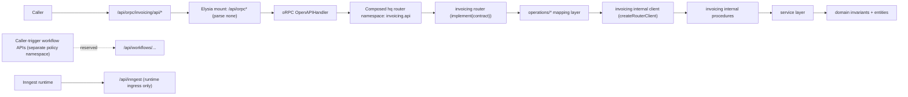

# E2E 01 — Basic Internal Package + API Boundary (TypeBox-First)

## 1) Goal and use-case framing

This walkthrough shows the smallest policy-compliant end-to-end path for:
1. one internal capability package,
2. one API boundary plugin that owns its own contract,
3. one host composition path from mounts to package execution.

Use-case: expose invoicing APIs to callers while keeping domain logic transport-neutral and reusable.

### Quick coordinates

| Concern | Canonical location / route |
| --- | --- |
| Hosting mount paths | `/rpc`, `/api/orpc`, `/api/inngest` |
| Internal package location | `packages/invoicing/src/*` |
| API plugin location | `plugins/api/invoicing/src/*` |
| Composition route | `rawr.hq.ts` -> `apps/server/src/rawr.ts` -> `apps/server/src/orpc.ts` -> `plugins/api/invoicing/src/router.ts` -> `packages/invoicing/src/client.ts` |

### Endpoint divergences included in this basic example

1. Start endpoint input divergence:
   - Boundary input: `{ invoiceId, requestedByUserId, requestSource? }`
   - Internal package input: `{ invoiceId, requestedBy }`
2. Status endpoint output divergence:
   - Internal package output: `{ runId, status }`
   - Boundary API output: `{ runId, phase, isTerminal }`

### Split semantics are preserved (even in this API-only walkthrough)

1. `/api/workflows/...` remains caller-trigger namespace by policy.
2. `/api/inngest` remains runtime ingress only.
3. This document implements API boundary only; it does not collapse or repurpose either workflow path.

## 2) E2E topology diagram



## 3) Canonical file tree

```text
.
├── rawr.hq.ts
├── apps/server/src/
│   ├── rawr.ts
│   └── orpc.ts
├── packages/
│   ├── orpc-standards/src/
│   │   ├── typebox-standard-schema.ts
│   │   └── index.ts
│   └── invoicing/src/
│       ├── domain/
│       │   ├── run.ts
│       │   └── status.ts
│       ├── service/
│       │   ├── lifecycle.ts
│       │   ├── status.ts
│       │   └── index.ts
│       ├── procedures/
│       │   ├── start.ts
│       │   ├── get-status.ts
│       │   └── index.ts
│       ├── context.ts
│       ├── router.ts
│       ├── client.ts
│       ├── errors.ts
│       └── index.ts
└── plugins/api/invoicing/src/
    ├── contract.ts
    ├── context.ts
    ├── operations/
    │   ├── start.ts
    │   └── get-status.ts
    ├── router.ts
    └── index.ts
```

## 4) Key files with concrete code

### 4.1 TypeBox Standard Schema adapter (shared contract bridge)

```text
packages/orpc-standards/src/
├── typebox-standard-schema.ts
└── index.ts
```

```ts
// packages/orpc-standards/src/typebox-standard-schema.ts
import type { Schema, SchemaIssue } from "@orpc/contract";
import type { Static, TSchema } from "typebox";
import { Value } from "typebox/value";

function parseIssuePath(instancePath: unknown): PropertyKey[] | undefined {
  if (typeof instancePath !== "string" || instancePath === "" || instancePath === "/") return undefined;
  return instancePath
    .split("/")
    .slice(1)
    .map((segment) => (/^\d+$/.test(segment) ? Number(segment) : segment));
}

export function typeBoxStandardSchema<T extends TSchema>(schema: T): Schema<Static<T>, Static<T>> {
  return {
    "~standard": {
      version: 1,
      vendor: "typebox",
      validate: (value) => {
        if (Value.Check(schema, value)) return { value: value as Static<T> };
        const issues = [...Value.Errors(schema, value)].map((issue) => {
          const path = parseIssuePath((issue as { instancePath?: unknown }).instancePath);
          return path
            ? ({ message: issue.message, path } satisfies SchemaIssue)
            : ({ message: issue.message } satisfies SchemaIssue);
        });
        return { issues: issues.length > 0 ? issues : [{ message: "Validation failed" }] };
      },
    },
    __typebox: schema,
  } as Schema<Static<T>, Static<T>>;
}
```

### 4.2 Internal package: domain + service + procedures + router/client

```text
packages/invoicing/src/
├── domain/{status.ts,run.ts}
├── service/{lifecycle.ts,status.ts}
├── procedures/{start.ts,get-status.ts}
├── context.ts
├── router.ts
└── client.ts
```

```ts
// packages/invoicing/src/domain/status.ts
import { Type, type Static } from "typebox";

export const StatusSchema = Type.Union([
  Type.Literal("queued"),
  Type.Literal("running"),
  Type.Literal("completed"),
  Type.Literal("failed"),
  Type.Literal("canceled"),
]);

export type Status = Static<typeof StatusSchema>;

export function isTerminalStatus(status: Status): boolean {
  return status === "completed" || status === "failed" || status === "canceled";
}
```

```ts
// packages/invoicing/src/domain/run.ts
import { Type, type Static } from "typebox";
import { StatusSchema } from "./status";

export const RunSchema = Type.Object({
  runId: Type.String(),
  invoiceId: Type.String(),
  requestedBy: Type.String(),
  status: StatusSchema,
});

export type Run = Static<typeof RunSchema>;
```

```ts
// packages/invoicing/src/service/lifecycle.ts
import type { Run } from "../domain/run";

export type InvoiceServiceDeps = {
  newRunId: () => string;
  saveRun: (run: Run) => Promise<void>;
  getRun: (runId: string) => Promise<Run | null>;
};

export async function startInvoice(
  deps: InvoiceServiceDeps,
  input: { invoiceId: string; requestedBy: string },
) {
  const runId = deps.newRunId();
  await deps.saveRun({
    runId,
    invoiceId: input.invoiceId,
    requestedBy: input.requestedBy,
    status: "queued",
  });
  return { runId, accepted: true as const };
}
```

```ts
// packages/invoicing/src/service/status.ts
import type { InvoiceServiceDeps } from "./lifecycle";

export async function getInvoiceStatus(deps: InvoiceServiceDeps, input: { runId: string }) {
  const run = await deps.getRun(input.runId);
  return run ? { runId: run.runId, status: run.status } : { runId: input.runId, status: "failed" as const };
}
```

```ts
// packages/invoicing/src/context.ts
import type { InvoiceServiceDeps } from "./service/lifecycle";

export type InvoiceProcedureContext = { deps: InvoiceServiceDeps };
```

```ts
// packages/invoicing/src/procedures/start.ts
import { ORPCError, os } from "@orpc/server";
import { Type } from "typebox";
import { typeBoxStandardSchema as std } from "@rawr/orpc-standards";
import { startInvoice } from "../service/lifecycle";
import type { InvoiceProcedureContext } from "../context";

const o = os.$context<InvoiceProcedureContext>();

export const startProcedure = o
  .input(std(Type.Object({
    invoiceId: Type.String(),
    requestedBy: Type.String(),
  })))
  .output(std(Type.Object({
    runId: Type.String(),
    accepted: Type.Boolean(),
  })))
  .handler(async ({ context, input }) => {
    try {
      return await startInvoice(context.deps, input);
    } catch {
      throw new ORPCError("INTERNAL_SERVER_ERROR", { message: "Failed to start invoice" });
    }
  });
```

```ts
// packages/invoicing/src/procedures/get-status.ts
import { os } from "@orpc/server";
import { Type } from "typebox";
import { typeBoxStandardSchema as std } from "@rawr/orpc-standards";
import { StatusSchema } from "../domain/status";
import { getInvoiceStatus } from "../service/status";
import type { InvoiceProcedureContext } from "../context";

const o = os.$context<InvoiceProcedureContext>();

export const getStatusProcedure = o
  .input(std(Type.Object({ runId: Type.String() })))
  .output(std(Type.Object({
    runId: Type.String(),
    status: StatusSchema,
  })))
  .handler(({ context, input }) => getInvoiceStatus(context.deps, input));
```

```ts
// packages/invoicing/src/router.ts
import { startProcedure } from "./procedures/start";
import { getStatusProcedure } from "./procedures/get-status";

export const invoiceInternalRouter = {
  start: startProcedure,
  getStatus: getStatusProcedure,
} as const;
```

```ts
// packages/invoicing/src/client.ts
import { createRouterClient } from "@orpc/server";
import { invoiceInternalRouter } from "./router";
import type { InvoiceProcedureContext } from "./context";

export function createInvoiceInternalClient(context: InvoiceProcedureContext) {
  return createRouterClient(invoiceInternalRouter, { context });
}
```

### 4.3 API boundary plugin: contract ownership + operation mapping

```text
plugins/api/invoicing/src/
├── contract.ts
├── context.ts
├── operations/{start.ts,get-status.ts}
├── router.ts
└── index.ts
```

```ts
// plugins/api/invoicing/src/contract.ts
import { oc } from "@orpc/contract";
import { Type } from "typebox";
import { typeBoxStandardSchema as std } from "@rawr/orpc-standards";

export const invoiceApiContract = oc.router({
  startInvoiceProcessing: oc
    .route({ method: "POST", path: "/invoices/processing/start" })
    .input(std(Type.Object({
      invoiceId: Type.String(),
      requestedByUserId: Type.String(),
      requestSource: Type.Optional(Type.String()),
    })))
    .output(std(Type.Object({
      runId: Type.String(),
      accepted: Type.Boolean(),
    }))),

  getInvoiceProcessingStatus: oc
    .route({ method: "GET", path: "/invoices/processing/{runId}" })
    .input(std(Type.Object({ runId: Type.String() })))
    .output(std(Type.Object({
      runId: Type.String(),
      phase: Type.Union([
        Type.Literal("queued"),
        Type.Literal("running"),
        Type.Literal("completed"),
        Type.Literal("failed"),
        Type.Literal("canceled"),
      ]),
      isTerminal: Type.Boolean(),
    }))),
});
```

```ts
// plugins/api/invoicing/src/context.ts
import { createInvoiceInternalClient } from "@rawr/invoicing";

export type InvoiceApiContext = {
  invoice: ReturnType<typeof createInvoiceInternalClient>;
};
```

```ts
// plugins/api/invoicing/src/operations/start.ts
import type { InvoiceApiContext } from "../context";

export async function startInvoiceOperation(
  context: InvoiceApiContext,
  input: { invoiceId: string; requestedByUserId: string; requestSource?: string },
) {
  // Divergence A: boundary input is adapted before package call.
  return context.invoice.start({
    invoiceId: input.invoiceId,
    requestedBy: input.requestedByUserId,
  });
}
```

```ts
// plugins/api/invoicing/src/operations/get-status.ts
import type { InvoiceApiContext } from "../context";

function isTerminal(status: "queued" | "running" | "completed" | "failed" | "canceled"): boolean {
  return status === "completed" || status === "failed" || status === "canceled";
}

export async function getStatusOperation(context: InvoiceApiContext, input: { runId: string }) {
  const internal = await context.invoice.getStatus({ runId: input.runId });

  // Divergence B: boundary output is an API-shaped projection.
  return {
    runId: internal.runId,
    phase: internal.status,
    isTerminal: isTerminal(internal.status),
  };
}
```

```ts
// plugins/api/invoicing/src/router.ts
import { implement } from "@orpc/server";
import { invoiceApiContract } from "./contract";
import type { InvoiceApiContext } from "./context";
import { getStatusOperation } from "./operations/get-status";
import { startInvoiceOperation } from "./operations/start";

const os = implement<typeof invoiceApiContract, InvoiceApiContext>(invoiceApiContract);

export function createInvoiceApiRouter() {
  return os.router({
    startInvoiceProcessing: os.startInvoiceProcessing.handler(({ context, input }) =>
      startInvoiceOperation(context, input),
    ),
    getInvoiceProcessingStatus: os.getInvoiceProcessingStatus.handler(({ context, input }) =>
      getStatusOperation(context, input),
    ),
  });
}
```

```ts
// plugins/api/invoicing/src/index.ts
import { invoiceApiContract } from "./contract";
import { createInvoiceApiRouter } from "./router";

export const invoiceApiSurface = {
  contract: invoiceApiContract,
  router: createInvoiceApiRouter(),
} as const;
```

### 4.4 Composition root and host mounting glue

```text
rawr.hq.ts
apps/server/src/rawr.ts
apps/server/src/orpc.ts
```

```ts
// rawr.hq.ts
import { oc } from "@orpc/contract";
import { Inngest } from "inngest";
import { invoiceApiSurface } from "./plugins/api/invoicing/src";

const inngest = new Inngest({ id: "rawr-hq" });

export const rawrHqManifest = {
  orpc: {
    contract: oc.router({
      invoicing: {
        api: invoiceApiSurface.contract,
      },
    }),
    router: {
      invoicing: {
        api: invoiceApiSurface.router,
      },
    },
  },
  // API-only basic example: keep runtime ingress wired, with no workflow functions in this walkthrough.
  inngest: { client: inngest, functions: [] as const },
} as const;
```

```ts
// apps/server/src/rawr.ts
import { createCoordinationRuntimeAdapter } from "./coordination";
import type { AnyElysia } from "./plugins";
import { createCoordinationInngestFunction, createInngestServeHandler } from "@rawr/coordination-inngest";
import { registerOrpcRoutes } from "./orpc";

export type RawrRoutesOptions = {
  repoRoot: string;
  baseUrl?: string;
};

export function registerRawrRoutes(app: AnyElysia, opts: RawrRoutesOptions) {
  const runtime = createCoordinationRuntimeAdapter({ repoRoot: opts.repoRoot, inngestBaseUrl: "http://localhost:8288" });
  const inngestBundle = createCoordinationInngestFunction({ runtime });
  const inngestHandler = createInngestServeHandler({
    client: inngestBundle.client,
    functions: inngestBundle.functions,
  });

  // Runtime ingress only.
  app.all("/api/inngest", async ({ request }) => inngestHandler(request));

  registerOrpcRoutes(app, {
    repoRoot: opts.repoRoot,
    baseUrl: opts.baseUrl ?? "http://localhost:3000",
    runtime,
    inngestClient: inngestBundle.client,
  });

  return app;
}
```

```ts
// apps/server/src/orpc.ts
import type { AnyElysia } from "./plugins";
import { OpenAPIHandler } from "@orpc/openapi/fetch";
import { RPCHandler } from "@orpc/server/fetch";
// Excerpt note: createOrpcRouter, RawrOrpcContext, and RegisterOrpcRoutesOptions
// are defined in the same file above this route-registration section.

export function registerOrpcRoutes(app: AnyElysia, options: RegisterOrpcRoutesOptions) {
  const router = createOrpcRouter();
  const rpcHandler = new RPCHandler<RawrOrpcContext>(router);
  const openapiHandler = new OpenAPIHandler<RawrOrpcContext>(router);

  app.all("/rpc/*", async (ctx) => {
    const request = ctx.request as Request;
    const result = await rpcHandler.handle(request, { prefix: "/rpc", context: options });
    return result.matched ? result.response : new Response("not found", { status: 404 });
  }, { parse: "none" });

  app.all("/api/orpc/*", async (ctx) => {
    const request = ctx.request as Request;
    const result = await openapiHandler.handle(request, { prefix: "/api/orpc", context: options });
    return result.matched ? result.response : new Response("not found", { status: 404 });
  }, { parse: "none" });

  return app;
}
```

## 5) Wiring steps (host -> composition -> plugin/package -> runtime)

1. Build TypeBox adapter once (`packages/orpc-standards/src/typebox-standard-schema.ts`) and reuse it across package and boundary contracts.
2. Build internal package layers under `packages/invoicing/src/*`:
   - domain (`run.ts`, `status.ts`) -> service -> `context.ts` -> procedures -> router -> client.
3. Build API plugin under `plugins/api/invoicing/src/*`:
   - boundary `contract.ts`,
   - shared boundary `context.ts` for operation/router contracts,
   - explicit `operations/*` mapping,
   - `router.ts` via `implement(contract)`.
4. Compose boundary surfaces in `rawr.hq.ts` into one boundary contract/router namespace (`invoicing.api`).
5. In host boot (`apps/server/src/rawr.ts`), create runtime adapter and mount `/api/inngest` for runtime ingress only.
6. In host boot, call `registerOrpcRoutes(...)` to mount `/rpc*` and `/api/orpc*` with `parse: "none"`.
7. At request time, boundary handler delegates to operation; operation uses package internal client (`createRouterClient`) for in-process call.
8. Package procedures execute service/domain logic and return typed output to boundary layer; boundary operation returns caller-facing shape.

## 6) Runtime sequence walkthrough

### Sequence A: `POST /api/orpc/invoicing/api/startInvoiceProcessing`

1. Caller sends boundary input `{ invoiceId, requestedByUserId, requestSource? }`.
2. Elysia route `/api/orpc/*` forwards request to `OpenAPIHandler`.
3. oRPC validates TypeBox-backed boundary input schema.
4. `startInvoiceProcessing` handler calls `startInvoiceOperation(...)`.
5. Operation maps boundary input to package input (`requestedByUserId -> requestedBy`).
6. Package internal client calls `invoiceInternalRouter.start`.
7. Package procedure validates internal schema and runs service logic.
8. Service persists queued run and returns `{ runId, accepted: true }`.
9. Response flows back through boundary handler to caller.

### Sequence B: `GET /api/orpc/invoicing/api/getInvoiceProcessingStatus`

1. Caller requests status by `runId`.
2. Boundary handler delegates to `getStatusOperation(...)`.
3. Operation calls package internal client `invoice.getStatus({ runId })`.
4. Package returns `{ runId, status }`.
5. Boundary operation projects to caller shape:
   - `phase = status`
   - `isTerminal = status in [completed, failed, canceled]`
6. Caller receives API-shaped response without exposing package internals directly.

## 7) Rationale and trade-offs

1. Boundary contract ownership keeps external semantics stable and independently evolvable.
2. Internal package remains transport-neutral and reusable for non-HTTP paths.
3. Explicit `operations/*` makes adaptation logic visible (no hidden glue).
4. TypeBox-first artifacts keep one schema strategy across validation and OpenAPI conversion, with domain files exporting both schema and `Static<typeof Schema>` types from one source of truth.
5. Trade-off: there is intentional duplication between internal and boundary shapes.
6. Payoff: boundary can diverge safely (policy, naming, response shape) without forcing package redesign.

## 8) What can go wrong + guardrails

| Failure mode | Why it happens | Guardrail |
| --- | --- | --- |
| Prefix mismatch (`/api/orpc` vs handler prefix) | Mount path and handler prefix drift | Keep route + handler prefix side-by-side in `registerOrpcRoutes` |
| Request body consumed before oRPC handler | Parser reads body first | Keep `{ parse: "none" }` on forwarded mounts |
| Type drift between boundary and package | Operation mapping omitted or ad hoc | Require explicit `operations/*` and test each divergence |
| Internal package leaks HTTP semantics | Boundary concerns moved into package | Keep package layers transport-neutral (`domain/service/procedures`) |
| Local HTTP self-calls for internal invocation | Shortcutting through `/api/orpc` | Default to `createRouterClient` in `packages/<capability>/src/client.ts` |
| `/api/inngest` treated as caller API | Runtime ingress semantics misunderstood | Document and enforce ingress-only policy in host and docs |
| `/api/workflows` and `/api/inngest` semantics blurred | Split policy ignored | Keep both path roles explicit, even when one is not used in this example |
| OpenAPI schema degradation | `__typebox` converter missing | Centralize TypeBox Standard Schema adapter and OpenAPI converter |

## 9) Explicit policy consistency checklist

- [x] TypeBox-first schemas are used for package and boundary I/O.
- [x] Domain type files are TypeBox-first (`schema + Static<typeof Schema>` in the same file), minimizing hand-written TS-only shape drift.
- [x] Internal package shape follows `domain/ service/ procedures/ context.ts router.ts client.ts errors.ts index.ts`.
- [x] Shared procedure/API context contracts are defined in explicit `context.ts` files, not convenience in-router type declarations.
- [x] Domain file names inside `domain/` avoid redundant capability prefixes (`status.ts`, `run.ts`).
- [x] API plugin shape follows `contract.ts + context.ts + operations/* + router.ts + index.ts`.
- [x] Capability naming stays concise (`packages/invoicing`, `plugins/api/invoicing`) while preserving boundary clarity.
- [x] Glue is explicit: composition root, host route mounts, and handler forwarding are shown concretely.
- [x] Internal default invocation path is in-process client, not local HTTP self-calls.
- [x] Boundary API and runtime ingress remain split semantics.
- [x] `/api/workflows/...` and `/api/inngest` role clarity is preserved explicitly, even though this example is API-only.
- [x] External boundary contract remains composed under one oRPC boundary surface.
