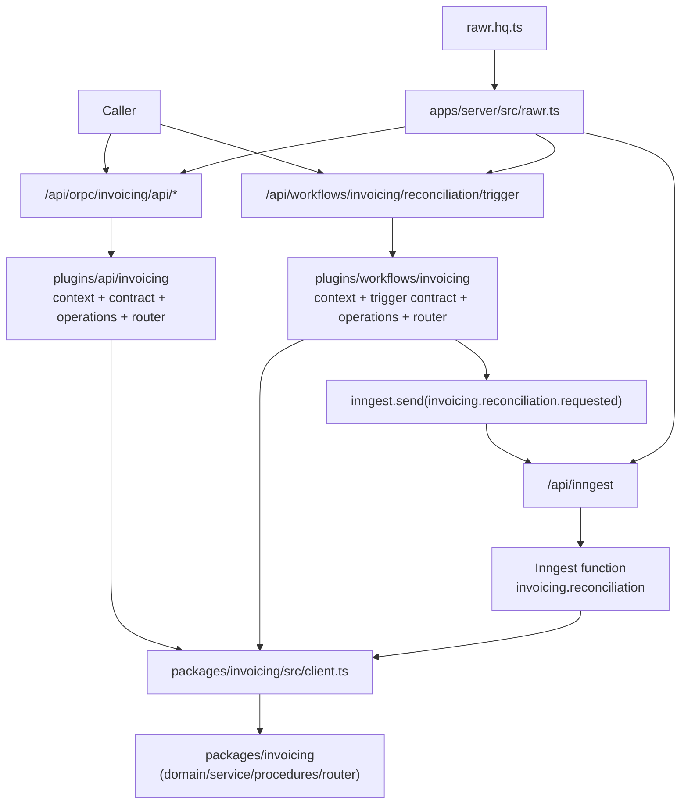

# E2E 02 — API + Workflows Composed Capability (TypeBox-First, Split Posture)

## 1) Goal and Use-Case Framing
This walkthrough shows one capability (`invoicing`) composed end to end with two caller-facing surfaces and one runtime ingress surface:
1. API surface for immediate request/response behavior (`start`, `get status`).
2. Workflow trigger surface for caller-triggered durable work (`trigger reconciliation`).
3. Inngest runtime ingress for durable execution only.

The target outcome is explicit composition where:
- API plugin and workflow plugin both call the same internal package client.
- Workflow trigger performs package preflight, then enqueues Inngest.
- Durable function executes and updates package state.
- Host keeps `/api/workflows/...` and `/api/inngest` explicitly split.

## 2) E2E Topology Diagram


## 3) Canonical File Tree
```text
rawr.hq.ts
apps/server/src/
  rawr.ts
  orpc/register-routes.ts
packages/orpc-standards/src/
  typebox-standard-schema.ts
  index.ts
packages/invoicing/src/
  context.ts
  domain/
    run.ts
    status.ts
  service/
    lifecycle.ts
    index.ts
  procedures/
    start.ts
    get-status.ts
    queue-reconciliation.ts
    mark-reconciliation-result.ts
    index.ts
  router.ts
  client.ts
  errors.ts
  index.ts
plugins/api/invoicing/src/
  context.ts
  contract.ts
  operations/
    start.ts
    get-status.ts
  router.ts
  index.ts
plugins/workflows/invoicing/src/
  context.ts
  contract.ts
  operations/
    trigger-reconciliation.ts
  router.ts
  functions/
    reconciliation.ts
  index.ts
```

## 4) Key Files With Concrete Code

### 4.1 Internal package: TypeBox-first domain models, procedures, and internal client
```text
packages/invoicing/src/
  context.ts
  domain/
    status.ts
    run.ts
  service/lifecycle.ts
  procedures/queue-reconciliation.ts
  router.ts
  client.ts
```

```ts
// packages/invoicing/src/domain/status.ts
import { Type, type Static } from "typebox";

export const InvoiceStatusSchema = Type.Union(
  [
    Type.Literal("queued"),
    Type.Literal("running"),
    Type.Literal("reconciling"),
    Type.Literal("completed"),
    Type.Literal("failed"),
    Type.Literal("canceled"),
  ],
  { $id: "InvoiceStatus" },
);

export type InvoiceStatus = Static<typeof InvoiceStatusSchema>;

export function canQueueReconciliation(status: InvoiceStatus) {
  return status === "queued" || status === "running";
}
```

```ts
// packages/invoicing/src/domain/run.ts
import { Type, type Static } from "typebox";
import { InvoiceStatusSchema } from "./status";

export const InvoiceRunSchema = Type.Object(
  {
    runId: Type.String(),
    invoiceId: Type.String(),
    requestedBy: Type.String(),
    status: InvoiceStatusSchema,
  },
  { $id: "InvoiceRun" },
);

export type InvoiceRun = Static<typeof InvoiceRunSchema>;

export function createQueuedRun(input: {
  runId: string;
  invoiceId: string;
  requestedBy: string;
}): InvoiceRun {
  return {
    runId: input.runId,
    invoiceId: input.invoiceId,
    requestedBy: input.requestedBy,
    status: "queued",
  };
}
```

```ts
// packages/invoicing/src/service/lifecycle.ts
import { canQueueReconciliation, type InvoiceStatus } from "../domain/status";
import { createQueuedRun, type InvoiceRun } from "../domain/run";

export type InvoicingServiceDeps = {
  newRunId: () => string;
  saveRun: (run: InvoiceRun) => Promise<void>;
  getRun: (runId: string) => Promise<InvoiceRun | null>;
  updateStatus: (runId: string, status: InvoiceStatus) => Promise<void>;
};

export async function startInvoice(
  deps: InvoicingServiceDeps,
  input: { invoiceId: string; requestedBy: string },
) {
  const runId = deps.newRunId();
  await deps.saveRun(
    createQueuedRun({
      runId,
      invoiceId: input.invoiceId,
      requestedBy: input.requestedBy,
    }),
  );
  return { runId, accepted: true as const };
}

export async function queueReconciliation(
  deps: InvoicingServiceDeps,
  input: { runId: string; requestedBy: string },
) {
  const run = await deps.getRun(input.runId);
  if (!run) return { accepted: false as const, reason: "not-found" as const };
  if (!canQueueReconciliation(run.status)) {
    return { accepted: false as const, reason: "invalid-state" as const };
  }

  await deps.updateStatus(run.runId, "reconciling");
  return { accepted: true as const, runId: run.runId };
}

export async function markReconciliationResult(
  deps: InvoicingServiceDeps,
  input: { runId: string; ok: boolean },
) {
  const status: InvoiceStatus = input.ok ? "completed" : "failed";
  await deps.updateStatus(input.runId, status);
  return { runId: input.runId, status } as const;
}
```

```ts
// packages/invoicing/src/context.ts
import type { InvoicingServiceDeps } from "./service/lifecycle";

export type InvoicingProcedureContext = {
  deps: InvoicingServiceDeps;
};
```

```ts
// packages/invoicing/src/procedures/queue-reconciliation.ts
import { ORPCError, os } from "@orpc/server";
import { Type } from "typebox";
import { typeBoxStandardSchema as std } from "@rawr/orpc-standards";
import { queueReconciliation } from "../service/lifecycle";
import type { InvoicingProcedureContext } from "../context";

const o = os.$context<InvoicingProcedureContext>();

export const queueReconciliationProcedure = o
  .input(
    std(
      Type.Object({
        runId: Type.String(),
        requestedBy: Type.String(),
      }),
    ),
  )
  .output(
    std(
      Type.Union([
        Type.Object({ accepted: Type.Literal(true), runId: Type.String() }),
        Type.Object({
          accepted: Type.Literal(false),
          reason: Type.Union([Type.Literal("not-found"), Type.Literal("invalid-state")]),
        }),
      ]),
    ),
  )
  .handler(async ({ context, input }) => {
    const result = await queueReconciliation(context.deps, input);
    if (!result.accepted && result.reason === "not-found") {
      throw new ORPCError("NOT_FOUND", { status: 404, message: `Run not found: ${input.runId}` });
    }
    return result;
  });
```

```ts
// packages/invoicing/src/router.ts
import type { InvoicingProcedureContext } from "./context";
import { startProcedure } from "./procedures/start";
import { getStatusProcedure } from "./procedures/get-status";
import { queueReconciliationProcedure } from "./procedures/queue-reconciliation";
import { markReconciliationResultProcedure } from "./procedures/mark-reconciliation-result";

export const invoicingInternalRouter = {
  start: startProcedure,
  getStatus: getStatusProcedure,
  queueReconciliation: queueReconciliationProcedure,
  markReconciliationResult: markReconciliationResultProcedure,
} as const;
```

```ts
// packages/invoicing/src/client.ts
import { createRouterClient } from "@orpc/server";
import { invoicingInternalRouter } from "./router";
import type { InvoicingProcedureContext } from "./context";

export function createInvoicingInternalClient(context: InvoicingProcedureContext) {
  return createRouterClient(invoicingInternalRouter, { context });
}
```

### 4.2 API plugin: boundary operations call internal package client
```text
plugins/api/invoicing/src/
  context.ts
  contract.ts
  operations/
    start.ts
    get-status.ts
  router.ts
```

```ts
// plugins/api/invoicing/src/contract.ts
import { oc } from "@orpc/contract";
import { Type } from "typebox";
import { typeBoxStandardSchema as std } from "@rawr/orpc-standards";

export const invoicingApiContract = oc.router({
  startInvoiceProcessing: oc
    .route({ method: "POST", path: "/invoicing/start" })
    .input(
      std(
        Type.Object({
          invoiceId: Type.String(),
          requestedBy: Type.String(),
        }),
      ),
    )
    .output(
      std(
        Type.Object({
          runId: Type.String(),
          accepted: Type.Boolean(),
        }),
      ),
    ),

  getInvoiceProcessingStatus: oc
    .route({ method: "GET", path: "/invoicing/{runId}" })
    .input(std(Type.Object({ runId: Type.String() })))
    .output(std(Type.Object({ runId: Type.String(), status: Type.String() }))),
});
```

```ts
// plugins/api/invoicing/src/operations/start.ts
import type { InvoicingApiContext } from "../context";

export async function startInvoiceOperation(
  context: InvoicingApiContext,
  input: { invoiceId: string; requestedBy: string },
) {
  return context.invoicing.start(input);
}
```

```ts
// plugins/api/invoicing/src/context.ts
import type { InvoicingProcedureContext } from "@rawr/invoicing";
import { createInvoicingInternalClient } from "@rawr/invoicing";

export type InvoicingApiContext = InvoicingProcedureContext & {
  invoicing: ReturnType<typeof createInvoicingInternalClient>;
};
```

```ts
// plugins/api/invoicing/src/router.ts
import { implement } from "@orpc/server";
import { invoicingApiContract } from "./contract";
import { startInvoiceOperation } from "./operations/start";
import { getStatusOperation } from "./operations/get-status";
import type { InvoicingApiContext } from "./context";

const os = implement<typeof invoicingApiContract, InvoicingApiContext>(invoicingApiContract);

export function createInvoicingApiRouter() {
  return os.router({
    startInvoiceProcessing: os.startInvoiceProcessing.handler(({ context, input }) =>
      startInvoiceOperation(context, input),
    ),
    getInvoiceProcessingStatus: os.getInvoiceProcessingStatus.handler(({ context, input }) =>
      getStatusOperation(context, input),
    ),
  });
}
```

### 4.3 Workflow plugin: trigger operation calls internal client, then enqueues Inngest
```text
plugins/workflows/invoicing/src/
  context.ts
  contract.ts
  operations/
    trigger-reconciliation.ts
  router.ts
  functions/
    reconciliation.ts
```

```ts
// plugins/workflows/invoicing/src/contract.ts
import { oc } from "@orpc/contract";
import { Type } from "typebox";
import { typeBoxStandardSchema as std } from "@rawr/orpc-standards";

export const invoicingWorkflowTriggerContract = oc.router({
  triggerReconciliation: oc
    .route({ method: "POST", path: "/invoicing/reconciliation/trigger" })
    .input(
      std(
        Type.Object({
          runId: Type.String(),
          requestedBy: Type.String(),
        }),
      ),
    )
    .output(
      std(
        Type.Object({
          accepted: Type.Literal(true),
          runId: Type.String(),
        }),
      ),
    ),
});
```

```ts
// plugins/workflows/invoicing/src/operations/trigger-reconciliation.ts
import { ORPCError } from "@orpc/server";
import type { InvoicingWorkflowTriggerContext } from "../context";

export const INVOICING_RECONCILIATION_EVENT = "invoicing.reconciliation.requested";

export async function triggerReconciliationOperation(
  context: InvoicingWorkflowTriggerContext,
  input: { runId: string; requestedBy: string },
) {
  // Internal package preflight before enqueue keeps domain ownership in package logic.
  const preflight = await context.invoicing.queueReconciliation(input);
  if (!preflight.accepted) {
    throw new ORPCError("FAILED_PRECONDITION", {
      status: 409,
      message: `Cannot queue reconciliation for run ${input.runId}`,
      data: { runId: input.runId },
    });
  }

  await context.inngest.send({
    name: INVOICING_RECONCILIATION_EVENT,
    data: {
      runId: preflight.runId,
      requestedBy: input.requestedBy,
    },
  });

  return { accepted: true as const, runId: preflight.runId };
}
```

```ts
// plugins/workflows/invoicing/src/context.ts
import type { Inngest } from "inngest";
import { createInvoicingInternalClient, type InvoicingProcedureContext } from "@rawr/invoicing";

export type InvoicingWorkflowTriggerContext = InvoicingProcedureContext & {
  inngest: Inngest;
  invoicing: ReturnType<typeof createInvoicingInternalClient>;
};
```

```ts
// plugins/workflows/invoicing/src/router.ts
import { implement } from "@orpc/server";
import { invoicingWorkflowTriggerContract } from "./contract";
import { triggerReconciliationOperation } from "./operations/trigger-reconciliation";
import type { InvoicingWorkflowTriggerContext } from "./context";

const os = implement<typeof invoicingWorkflowTriggerContract, InvoicingWorkflowTriggerContext>(
  invoicingWorkflowTriggerContract,
);

export function createInvoicingWorkflowTriggerRouter() {
  return os.router({
    triggerReconciliation: os.triggerReconciliation.handler(({ context, input }) =>
      triggerReconciliationOperation(context, input),
    ),
  });
}
```

```ts
// plugins/workflows/invoicing/src/functions/reconciliation.ts
import type { Inngest } from "inngest";
import { createInvoicingInternalClient, type InvoicingServiceDeps } from "@rawr/invoicing";
import { INVOICING_RECONCILIATION_EVENT } from "../operations/trigger-reconciliation";

export function createReconciliationFunction(inngest: Inngest, deps: InvoicingServiceDeps) {
  return inngest.createFunction(
    { id: "invoicing.reconciliation", retries: 2 },
    { event: INVOICING_RECONCILIATION_EVENT },
    async ({ event, step }) => {
      const invoicing = createInvoicingInternalClient({ deps });

      await step.run("invoicing/reconcile", async () => {
        // Reconciliation side effects go here.
        await invoicing.markReconciliationResult({ runId: event.data.runId, ok: true });
      });

      return { ok: true as const, runId: event.data.runId };
    },
  );
}
```

### 4.4 `rawr.hq.ts`: compose API + workflow trigger + Inngest functions
```text
rawr.hq.ts
plugins/api/invoicing/src/index.ts
plugins/workflows/invoicing/src/index.ts
```

```ts
// rawr.hq.ts
import { oc } from "@orpc/contract";
import { Inngest } from "inngest";
import { invoicingApiSurface } from "./plugins/api/invoicing/src";
import { createInvoicingWorkflowSurface } from "./plugins/workflows/invoicing/src";

const inngest = new Inngest({ id: "rawr-hq" });
const invoicingWorkflows = createInvoicingWorkflowSurface(inngest);

export const rawrHqManifest = {
  orpc: {
    contract: oc.router({
      invoicing: {
        api: invoicingApiSurface.contract,
        workflows: invoicingWorkflows.triggerContract,
      },
    }),
    router: {
      invoicing: {
        api: invoicingApiSurface.router,
        workflows: invoicingWorkflows.triggerRouter,
      },
    },
  },
  inngest: {
    client: inngest,
    functions: [...invoicingWorkflows.functions],
  },
} as const;
```

### 4.5 Host mounting: explicit `/api/workflows/...` vs `/api/inngest` split
```text
apps/server/src/
  rawr.ts
  orpc/register-routes.ts
  inngest/register-route.ts
```

```ts
// apps/server/src/rawr.ts
import { rawrHqManifest } from "../../rawr.hq";
import { registerOrpcRoutes } from "./orpc/register-routes";
import { registerInngestRoute } from "./inngest/register-route";

export function registerRawrRoutes(app: unknown, ctx: { repoRoot: string; baseUrl: string; runtime: unknown }) {
  registerOrpcRoutes(app, rawrHqManifest.orpc, {
    context: ctx,
    apiPrefix: "/api/orpc",
    workflowPrefix: "/api/workflows",
  });

  registerInngestRoute(app, rawrHqManifest.inngest, {
    path: "/api/inngest",
  });
}
```

```ts
// apps/server/src/orpc/register-routes.ts
import { OpenAPIHandler } from "@orpc/openapi/fetch";

function pickSurface<T extends Record<string, { api: unknown; workflows: unknown }>>(
  routers: T,
  key: "api" | "workflows",
) {
  return Object.fromEntries(Object.entries(routers).map(([capability, value]) => [capability, value[key]]));
}

export function registerOrpcRoutes(
  app: any,
  orpc: { contract: Record<string, { api: unknown; workflows: unknown }>; router: Record<string, any> },
  opts: { context: unknown; apiPrefix: string; workflowPrefix: string },
) {
  const apiHandler = new OpenAPIHandler(pickSurface(orpc.router, "api"));
  const workflowHandler = new OpenAPIHandler(pickSurface(orpc.router, "workflows"));

  app.all(
    `${opts.apiPrefix}/*`,
    async ({ request }: { request: Request }) =>
      (await apiHandler.handle(request, { prefix: opts.apiPrefix, context: opts.context })).response,
    { parse: "none" },
  );

  app.all(
    `${opts.workflowPrefix}/*`,
    async ({ request }: { request: Request }) =>
      (await workflowHandler.handle(request, { prefix: opts.workflowPrefix, context: opts.context })).response,
    { parse: "none" },
  );
}
```

## 5) Wiring Steps (Host -> Composition -> Plugin/Package -> Runtime)
1. Build internal capability package (`packages/invoicing`) with concise domain files (`domain/run.ts`, `domain/status.ts`), shared context contract in `context.ts`, domain/service/procedures, one exported internal router, and one exported internal client.
2. Build API plugin (`plugins/api/invoicing`) with TypeBox-first contract, shared context contract in `context.ts`, and explicit operations that call `context.invoicing.*`.
3. Build workflow plugin (`plugins/workflows/invoicing`) with trigger contract/router/operations, shared context contract in `context.ts`, and Inngest functions.
4. In workflow operation, call `context.invoicing.queueReconciliation(...)` before `context.inngest.send(...)`.
5. Compose both plugin surfaces in `rawr.hq.ts` under one capability namespace (`invoicing.api`, `invoicing.workflows`) and merge workflow functions into the single Inngest bundle.
6. In server host registration, mount:
   - `/api/orpc/*` for API boundary procedures.
   - `/api/workflows/*` for caller-trigger workflow procedures.
   - `/api/inngest` for runtime ingress only.
7. Pass one runtime-owned Inngest client bundle into both:
   - workflow trigger context (for enqueue),
   - Inngest serve handler (for function execution).

## 6) Runtime Sequence Walkthrough

### Flow A: API surface call (synchronous)
1. Caller sends `POST /api/orpc/invoicing/start`.
2. API plugin router resolves `startInvoiceProcessing`.
3. API operation calls `context.invoicing.start(...)` (internal package client).
4. Package service writes run as `queued`.
5. Caller gets immediate `{ runId, accepted: true }`.

### Flow B: Workflow trigger call (caller-triggered + durable)
1. Caller sends `POST /api/workflows/invoicing/reconciliation/trigger`.
2. Workflow trigger router resolves `triggerReconciliation`.
3. Trigger operation calls `context.invoicing.queueReconciliation(...)` for domain preflight/state transition.
4. Trigger operation emits `invoicing.reconciliation.requested` via `context.inngest.send(...)`.
5. Caller receives immediate accepted response.

### Flow C: Durable execution (runtime ingress)
1. Inngest calls `/api/inngest` with signed runtime event.
2. Inngest function `invoicing.reconciliation` starts and enters `step.run("invoicing/reconcile", ...)`.
3. Function calls package internal client `markReconciliationResult(...)`.
4. Package updates run status (`completed` or `failed`).
5. Inngest marks function run complete; status is now queryable from API surface.

## 7) Rationale and Trade-Offs
1. Split surfaces make caller semantics and runtime semantics explicit, which improves debuggability and policy control.
2. Reusing one internal package client for both API and workflow trigger paths prevents duplicated domain logic.
3. Trigger preflight in package logic avoids “enqueue first, fail later” drift.
4. Trade-off: composition and routing are more explicit and slightly more verbose.
5. Trade-off accepted: verbosity is intentional to avoid hidden coupling and policy ambiguity.

## 8) What Can Go Wrong + Guardrails
| Failure mode | Symptom | Guardrail |
| --- | --- | --- |
| Workflow trigger and runtime ingress collapse into one path | External callers hit `/api/inngest` directly | Keep `/api/workflows/*` and `/api/inngest` mounts separate with separate handlers |
| Trigger operation bypasses internal package client | Duplicate business rules in plugin operations | Require trigger operation preflight via `context.invoicing.*` |
| Plugin-to-plugin runtime coupling | API plugin imports workflow plugin (or reverse) | Import package surfaces only (`@rawr/invoicing`) in both plugins |
| TypeBox drift to ad hoc schema styles | OpenAPI mismatch or validator mismatch | Keep `std(Type.*)` (alias for `typeBoxStandardSchema`) for all contracts/procedures |
| Hidden glue in composition | Hard-to-debug route ownership | Keep `rawr.hq.ts` explicit with per-capability `api` and `workflows` nodes |
| Context mismatch between host and handlers | `undefined` runtime/inngest at runtime | Use one shared context object injected at mount registration |

## 9) Explicit Policy Consistency Checklist
- [x] TypeBox-first contract and procedure schemas are used everywhere.
- [x] Shared context contracts live in explicit `context.ts` snippets instead of being embedded in `router.ts`.
- [x] `typeBoxStandardSchema` is consistently imported as the readable short alias `std`.
- [x] Each 4.x subsection includes a mini file-tree snippet for local orientation.
- [x] Domain models are TypeBox-first and export static types from the same files.
- [x] Domain filenames are concise (`domain/run.ts`, `domain/status.ts`) with no repeated domain prefix.
- [x] Procedure and boundary I/O schemas are authored with procedures/contracts, not owned by domain modules.
- [x] Internal package shape includes `domain/ service/ procedures/ router.ts client.ts errors.ts index.ts`.
- [x] API plugin shape uses `contract.ts + operations/* + router.ts + index.ts`.
- [x] Workflow plugin keeps trigger authoring split from durable function authoring.
- [x] Workflow trigger path is explicit (`/api/workflows/...`).
- [x] Inngest runtime ingress path is explicit and separate (`/api/inngest`).
- [x] Both API and workflow trigger operations use the same internal package client.
- [x] No plugin-to-plugin direct runtime coupling is introduced.
- [x] Composition glue is concrete (`rawr.hq.ts` + host mount code), not implicit.
