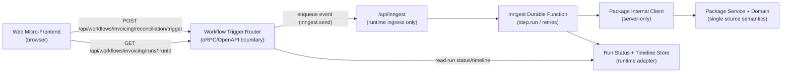

# E2E 03 — Micro-Frontend + Workflow Integration Without Semantic Duplication

## 1) Goal and Use-Case Framing

### Goal
Show one advanced, policy-consistent end-to-end pattern where a micro-frontend can:
1. trigger workflow work,
2. read workflow run status/timeline,
3. reuse capability logic from one canonical source,
without duplicating workflow/domain semantics across browser, plugin, and runtime layers.

### Chosen default path (for this walkthrough)
**Shared-package-first workflow integration**:
1. Canonical semantics live in `packages/<capability>`.
2. Workflow plugin implements trigger + durable execution using those package semantics.
3. Micro-frontend calls workflow trigger/status APIs (not `/api/inngest`) and reuses browser-safe package logic.
4. API plugin consumption is optional, not required for workflow invocation.

This is the recommended default because it satisfies no-duplication + dependency-direction constraints better than API-plugin-only or ingress-direct alternatives.

---

## 2) E2E Topology Diagram



Boundary meaning:
1. Browser never calls `/api/inngest`.
2. `/api/workflows/...` is caller-trigger/status surface.
3. Durable orchestration lives only inside Inngest functions.

---

## 3) Canonical File Tree

```text
packages/invoicing/src/
  domain/                                # shared semantic source (browser-safe + server-safe)
    reconciliation.ts                    # domain reconciliation state + invariants
    status.ts                            # domain run status/timeline schemas + static types
    view.ts                              # browser-safe status projection
  service/                               # server-only orchestration/business operations
    reconciliation.ts
    status.ts
  procedures/                            # internal server procedure boundary
    reconcile.ts
    status.ts
  context.ts                             # shared package context contract for internal client/procedures
  router.ts                              # internal router (server-only)
  client.ts                              # in-process internal client (server-only)
  errors.ts                              # typed capability errors
  workflows/
    contract.ts                          # shared workflow trigger/status contract artifact
  browser.ts                             # browser-safe exports only
  index.ts

plugins/workflows/invoicing/src/
  context.ts                             # shared workflow boundary context contract
  contract.ts                            # re-export shared package workflow contract
  operations/
    trigger.ts
    status.ts
    timeline.ts
  router.ts                              # boundary auth/visibility + trigger/status handlers
  functions/
    reconcile.ts                         # durable execution
  index.ts

rawr.hq.ts                               # composition authority
apps/server/src/
  workflows/
    context.ts                           # host boundary context contract + principal resolution
  rawr.ts                                # mounts /api/workflows + /api/inngest

plugins/web/invoicing-console/src/
  client.ts                              # browser client to workflow trigger/status surface
  web.ts                                 # mount(el, ctx) UI runtime
```

Naming note:
This walkthrough normalizes names to concise `invoicing` conventions for readability, but architecture choices remain non-prescriptive (see alternatives and unresolved gaps below).

---

## 4) Key Files With Concrete Code

### 4.1 Shared package semantics (TypeBox-first, browser-safe)

```text
packages/invoicing/src/
  domain/
    reconciliation.ts
    status.ts
    view.ts
  context.ts
  browser.ts
```

```ts
// packages/invoicing/src/domain/reconciliation.ts
import { Type, type Static } from "typebox";

export const ReconciliationStateSchema = Type.Union([
  Type.Literal("queued"),
  Type.Literal("running"),
  Type.Literal("completed"),
  Type.Literal("failed"),
]);
export type ReconciliationState = Static<typeof ReconciliationStateSchema>;

export function isTerminalReconciliationState(state: ReconciliationState): boolean {
  return state === "completed" || state === "failed";
}
```

```ts
// packages/invoicing/src/domain/status.ts
import { Type, type Static } from "typebox";
import { ReconciliationStateSchema } from "./reconciliation";

export const RunStatusSchema = Type.Object(
  {
    runId: Type.String({ minLength: 1 }),
    status: ReconciliationStateSchema,
    isTerminal: Type.Boolean(),
  },
  { additionalProperties: false },
);
export type RunStatus = Static<typeof RunStatusSchema>;

export const RunTimelineSchema = Type.Object(
  { runId: Type.String({ minLength: 1 }), events: Type.Array(Type.Any()) },
  { additionalProperties: false },
);
export type RunTimeline = Static<typeof RunTimelineSchema>;
```

```ts
// packages/invoicing/src/domain/view.ts
import type { RunStatus } from "./status";

export function toRunBadge(run: RunStatus): "neutral" | "warning" | "success" | "danger" {
  if (run.status === "completed") return "success";
  if (run.status === "failed") return "danger";
  if (run.status === "running") return "warning";
  return "neutral";
}
```

```ts
// packages/invoicing/src/browser.ts
export * from "./domain/reconciliation";
export * from "./domain/status";
export * from "./domain/view";
```

```ts
// packages/invoicing/src/context.ts
export type InvoicingProcedureContext = {
  deps: {
    queueReconciliation: (input: { invoiceId: string; requestedBy: string }) => Promise<{ accepted: true; runId: string }>;
    getRunStatus: (runId: string) => Promise<{ runId: string; status: string; isTerminal: boolean } | null>;
    getRunTimeline: (runId: string) => Promise<unknown[]>;
    reconcile: (input: { runId: string; invoiceId: string; requestedBy: string }) => Promise<void>;
  };
};
```

### 4.2 Shared workflow contract artifact (single source, reusable)

I/O ownership note: trigger/status route schemas are authored at the workflow contract boundary, while `domain/*` keeps domain concepts and invariants. Inline `.input/.output` schemas are the default; only truly shared/large route payloads should be extracted, and then as `{ input, output }` pairs.

```text
packages/invoicing/src/
  domain/
    reconciliation.ts
    status.ts
  workflows/
    contract.ts
```

```ts
// packages/invoicing/src/workflows/contract.ts
import { oc } from "@orpc/contract";
import { schema, typeBoxStandardSchema as std } from "@rawr/orpc-standards";
import { Type } from "typebox";
import { RunStatusSchema, RunTimelineSchema } from "../domain/status";

const tag = ["invoicing"] as const;

export const invoicingWorkflowContract = oc.router({
  triggerReconciliation: oc
    .route({
      method: "POST",
      path: "/invoicing/reconciliation/trigger",
      tags: tag,
      operationId: "invoicingTriggerReconciliation",
    })
    .input(
      schema(
        {
          invoiceId: Type.String({ minLength: 1 }),
          requestedBy: Type.String({ minLength: 1 }),
        },
        { additionalProperties: false },
      ),
    )
    .output(
      schema(
        {
          accepted: Type.Literal(true),
          runId: Type.String({ minLength: 1 }),
        },
        { additionalProperties: false },
      ),
    ),

  getRunStatus: oc
    .route({
      method: "GET",
      path: "/invoicing/runs/{runId}",
      tags: tag,
      operationId: "invoicingGetRunStatus",
    })
    .input(schema({ runId: Type.String({ minLength: 1 }) }, { additionalProperties: false }))
    .output(std(RunStatusSchema)),

  getRunTimeline: oc
    .route({
      method: "GET",
      path: "/invoicing/runs/{runId}/timeline",
      tags: tag,
      operationId: "invoicingGetRunTimeline",
    })
    .input(schema({ runId: Type.String({ minLength: 1 }) }, { additionalProperties: false }))
    .output(std(RunTimelineSchema)),
});
```

### 4.3 Workflow plugin router (auth + visibility + trigger semantics)

```text
plugins/workflows/invoicing/src/
  context.ts
  contract.ts
  router.ts
```

```ts
// plugins/workflows/invoicing/src/context.ts
import type { Inngest } from "inngest";

export type Principal = {
  subject: string;
  roles: string[];
  canCallInternal: boolean;
};

export type WorkflowRuntime = {
  getRunStatus: (runId: string) => Promise<{ runId: string; status: string } | null>;
  getRunTimeline: (runId: string) => Promise<unknown[]>;
};

export type InvoicingWorkflowContext = {
  principal: Principal;
  inngest: Inngest;
  runtime: WorkflowRuntime;
};
```

```ts
// plugins/workflows/invoicing/src/contract.ts
export { invoicingWorkflowContract } from "@rawr/invoicing/workflows/contract";
```

```ts
// plugins/workflows/invoicing/src/router.ts
import { implement, ORPCError } from "@orpc/server";
import { invoicingWorkflowContract } from "./contract";
import type { InvoicingWorkflowContext, Principal } from "./context";

const visibility = {
  triggerReconciliation: "internal",
  getRunStatus: "internal",
  getRunTimeline: "internal",
} as const;

function assertVisible(proc: keyof typeof visibility, principal: Principal) {
  if (visibility[proc] === "internal" && !principal.canCallInternal) {
    throw new ORPCError("FORBIDDEN", { status: 403, message: `Procedure ${String(proc)} is internal` });
  }
}

const os = implement<typeof invoicingWorkflowContract, InvoicingWorkflowContext>(invoicingWorkflowContract);

export function createInvoicingWorkflowRouter() {
  return os.router({
    triggerReconciliation: os.triggerReconciliation.handler(async ({ context, input }) => {
      assertVisible("triggerReconciliation", context.principal);

      const runId = `run-${Date.now()}-${Math.random().toString(36).slice(2, 10)}`;
      await context.inngest.send({
        name: "invoicing.reconciliation.requested",
        data: {
          runId,
          invoiceId: input.invoiceId,
          requestedBy: context.principal.subject,
        },
      });

      return { accepted: true, runId };
    }),

    getRunStatus: os.getRunStatus.handler(async ({ context, input }) => {
      assertVisible("getRunStatus", context.principal);
      const run = await context.runtime.getRunStatus(input.runId);
      if (!run) throw new ORPCError("RUN_NOT_FOUND", { status: 404, message: "Run not found" });
      return {
        runId: run.runId,
        status: run.status as "queued" | "running" | "completed" | "failed",
        isTerminal: run.status === "completed" || run.status === "failed",
      };
    }),

    getRunTimeline: os.getRunTimeline.handler(async ({ context, input }) => {
      assertVisible("getRunTimeline", context.principal);
      return { runId: input.runId, events: await context.runtime.getRunTimeline(input.runId) };
    }),
  });
}
```

### 4.4 Durable execution function (server-only)

```text
plugins/workflows/invoicing/src/
  context.ts
  functions/
    reconcile.ts
packages/invoicing/src/
  client.ts
```

```ts
// plugins/workflows/invoicing/src/functions/reconcile.ts
import type { Inngest } from "inngest";
import { createInvoicingInternalClient, type InvoicingProcedureContext } from "@rawr/invoicing";

export function createInvoicingReconciliationFunction(inngest: Inngest, packageContext: InvoicingProcedureContext) {
  return inngest.createFunction(
    { id: "invoicing.reconciliation", retries: 2 },
    { event: "invoicing.reconciliation.requested" },
    async ({ event, step }) => {
      const invoicing = createInvoicingInternalClient(packageContext);

      await step.run("invoicing/reconcile", async () => {
        await invoicing.reconcile({
          runId: event.data.runId,
          invoiceId: event.data.invoiceId,
          requestedBy: event.data.requestedBy,
        });
      });

      return { ok: true as const, runId: event.data.runId };
    },
  );
}
```

### 4.5 Host composition + mount glue (explicit, no black box)

```text
rawr.hq.ts
apps/server/src/
  workflows/
    context.ts
  rawr.ts
plugins/workflows/invoicing/src/
  context.ts
```

```ts
// rawr.hq.ts
import { oc } from "@orpc/contract";
import { implement } from "@orpc/server";
import { Inngest } from "inngest";
import { createInvoicingWorkflowRouter } from "./plugins/workflows/invoicing/src/router";
import { createInvoicingReconciliationFunction } from "./plugins/workflows/invoicing/src/functions/reconcile";
import { invoicingWorkflowContract } from "@rawr/invoicing/workflows/contract";

const inngest = new Inngest({ id: "rawr-hq" });
const triggerContract = oc.router({ invoicing: invoicingWorkflowContract });
const os = implement<typeof triggerContract, any>(triggerContract);
const triggerRouter = os.router({ invoicing: createInvoicingWorkflowRouter() });

export const rawrHqManifest = {
  workflows: {
    triggerContract,
    triggerRouter,
  },
  inngest: {
    client: inngest,
    functions: [createInvoicingReconciliationFunction(inngest, /* packageContext */ {} as any)],
  },
} as const;
```

```ts
// apps/server/src/workflows/context.ts
import type { Inngest } from "inngest";

export type WorkflowBoundaryPrincipal = {
  subject: string;
  roles: string[];
  canCallInternal: boolean;
};

export type WorkflowBoundaryRuntime = {
  getRunStatus: (runId: string) => Promise<{ runId: string; status: string } | null>;
  getRunTimeline: (runId: string) => Promise<unknown[]>;
};

export type WorkflowBoundaryContext = {
  principal: WorkflowBoundaryPrincipal;
  inngest: Inngest;
  runtime: WorkflowBoundaryRuntime;
};

export function requirePrincipal(_request: Request): WorkflowBoundaryPrincipal {
  // Session/cookie/JWT resolution lives at the host boundary.
  return { subject: "user-123", roles: ["operator"], canCallInternal: true };
}

export function createWorkflowBoundaryContext(args: {
  principal: WorkflowBoundaryPrincipal;
  inngest: Inngest;
  runtime: WorkflowBoundaryRuntime;
}): WorkflowBoundaryContext {
  return args;
}
```

```ts
// apps/server/src/rawr.ts (workflow-relevant excerpt)
import { OpenAPIHandler } from "@orpc/openapi/fetch";
import { createInngestServeHandler } from "@rawr/coordination-inngest";
import { rawrHqManifest } from "../../rawr.hq";
import { createWorkflowBoundaryContext, requirePrincipal } from "./workflows/context";

export function registerWorkflowAndInngestRoutes(app: any, runtime: any) {
  const workflowHandler = new OpenAPIHandler(rawrHqManifest.workflows.triggerRouter);
  const inngestHandler = createInngestServeHandler(rawrHqManifest.inngest);

  app.all(
    "/api/workflows/*",
    async ({ request }: { request: Request }) => {
      const principal = requirePrincipal(request);
      const context = createWorkflowBoundaryContext({
        principal,
        inngest: rawrHqManifest.inngest.client,
        runtime,
      });
      const result = await workflowHandler.handle(request, {
        prefix: "/api/workflows",
        context,
      });
      return result.matched ? result.response : new Response("not found", { status: 404 });
    },
    { parse: "none" },
  );

  app.all("/api/inngest", async ({ request }: { request: Request }) => {
    // Runtime ingress auth/signature check belongs here, never in browser.
    return inngestHandler(request);
  });
}
```

### 4.6 Micro-frontend client + mount (browser-safe)

```text
plugins/web/invoicing-console/src/
  client.ts
  web.ts
packages/invoicing/src/
  browser.ts
  workflows/
    contract.ts
```

```ts
// plugins/web/invoicing-console/src/client.ts
import { createORPCClient } from "@orpc/client";
import type { ContractRouterClient } from "@orpc/contract";
import { OpenAPILink } from "@orpc/openapi-client/fetch";
import { invoicingWorkflowContract } from "@rawr/invoicing/workflows/contract";

type InvoicingWorkflowClient = ContractRouterClient<typeof invoicingWorkflowContract>;

export function createInvoicingWorkflowClient(baseUrl: string) {
  return createORPCClient<InvoicingWorkflowClient>(
    new OpenAPILink({
      url: `${baseUrl.replace(/\/$/, "")}/api/workflows`,
      fetch: (request, init) => fetch(request, { ...init, credentials: "include" }),
    }),
  );
}
```

```ts
// plugins/web/invoicing-console/src/web.ts
import type { MountContext } from "@rawr/ui-sdk";
import { createInvoicingWorkflowClient } from "./client";
import { toRunBadge } from "@rawr/invoicing/browser";

export async function mount(el: HTMLElement, _ctx: MountContext) {
  const client = createInvoicingWorkflowClient(window.location.origin);

  const button = document.createElement("button");
  button.textContent = "Run reconciliation";
  const status = document.createElement("div");

  button.onclick = async () => {
    const trigger = await client.triggerReconciliation({
      invoiceId: "inv-001",
      requestedBy: "ui-user",
    });

    const runId = trigger.runId;
    const timer = window.setInterval(async () => {
      const run = await client.getRunStatus({ runId });
      status.textContent = `${run.status} (${toRunBadge(run)})`;
      if (run.isTerminal) window.clearInterval(timer);
    }, 1500);
  };

  el.append(button, status);

  return {
    unmount: () => {
      button.remove();
      status.remove();
    },
  };
}
```

Browser-safe vs server-only boundary in this implementation:
1. Browser-safe: `packages/invoicing/src/domain/*`, `packages/invoicing/src/browser.ts`, `plugins/web/**`.
2. Server-only: package/workflow/host `context.ts` boundary contracts, workflow router auth checks, Inngest functions, package `client.ts`, runtime adapter, ingress route.

---

## 5) Wiring Steps (host -> composition -> plugin/package -> runtime)

1. Define canonical workflow payload/result semantics in `packages/invoicing/src/domain/*` (TypeBox-first, schema + static type in the same file).
2. Define shared workflow trigger/status contract in `packages/invoicing/src/workflows/contract.ts`.
3. Implement explicit package/workflow/host context contracts in `context.ts`, then implement the workflow router using those contracts plus visibility/auth enforcement.
4. Implement durable function(s) in workflow plugin, using package internal client for server-only orchestration.
5. Compose workflows + functions in `rawr.hq.ts`.
6. Mount caller-trigger/status surface at `/api/workflows/*` with boundary auth context created from host `context.ts`.
7. Mount runtime ingress at `/api/inngest` for Inngest runtime callbacks only.
8. In web plugin, call workflow trigger/status procedures via typed client and render status with shared package view logic.

---

## 6) Runtime Sequence Walkthrough

### Trigger path
1. User action in micro-frontend calls `triggerReconciliation`.
2. Request hits `/api/workflows/invoicing/reconciliation/trigger`.
3. Workflow router resolves principal from boundary auth context and enforces visibility.
4. Router emits `invoicing.reconciliation.requested` via `inngest.send` and returns `{ accepted: true, runId }`.

### Durable path
1. Inngest receives event at `/api/inngest`.
2. Durable function executes `step.run` blocks and invokes package internal client/service.
3. Runtime adapter writes run state/timeline updates.

### Status/result path
1. Micro-frontend polls `getRunStatus` and optionally `getRunTimeline` on `/api/workflows/...`.
2. Workflow router reads runtime state and returns typed status/timeline.
3. UI uses shared package projection helpers for consistent status rendering.

---

## 7) Rationale and Trade-Offs

### Why this default
1. Single semantic source: shared package owns payload/status semantics consumed by workflow router, durable function, and micro-frontend.
2. API plugin remains optional: workflow-related integration does not require an API plugin layer unless the capability needs separate boundary concerns.
3. Boundary integrity: browser-facing workflow calls remain caller-trigger/status APIs, while `/api/inngest` stays runtime-only.

### Alternatives considered

| Alternative | Decision | Why |
| --- | --- | --- |
| API-plugin-centric only (MFE -> API plugin -> workflow) | Deferred as default | Valid for capabilities needing heavy boundary transformations, but not required for workflow-focused MFE and can add extra semantic mapping layers. |
| Host-injected capability gateway (MFE does not build own client) | Deferred (phase 2) | Good DX and auth centralization, but current mount context does not yet define a stable gateway contract. |
| Direct browser calls to `/api/inngest` | Rejected | Violates split semantics and breaks security/runtime ownership boundaries. |

---

## 8) What Can Go Wrong + Guardrails

1. **Semantic drift across layers**
- Risk: browser, workflow router, and durable function each define their own payload/status shape.
- Guardrail: keep canonical TypeBox schemas in package domain/workflow modules; import everywhere else.

2. **Boundary collapse (`/api/workflows` vs `/api/inngest`)**
- Risk: browser starts calling ingress route directly.
- Guardrail: enforce ingress signature checks and never expose ingress URLs in browser client modules.

3. **Visibility/auth bypass**
- Risk: internal workflow trigger procedures callable by unintended users.
- Guardrail: default `internal` visibility + explicit principal checks in workflow router context.

4. **Server-only code leaking into browser bundles**
- Risk: importing package internal `client.ts` from web plugin.
- Guardrail: maintain explicit browser-safe entrypoint (`browser.ts`) and lint rules that block server-only imports from web plugins.

5. **Route/mount mismatch**
- Risk: contract route paths and mount prefix diverge, causing 404/incorrect operation routing.
- Guardrail: integration tests for `/api/workflows/*` and `/api/inngest`, plus contract snapshot/OpenAPI checks.

---

## 9) Explicit Policy Consistency Checklist

| Policy | Status | Notes |
| --- | --- | --- |
| TypeBox-only contract/procedure schema authoring + static types in same file | Satisfied | Contract/procedure snippets remain TypeBox-authored (no Zod-authored contract/procedure snippets), and domain schema files co-locate `Type.*` artifacts with `Static<typeof Schema>` exports. |
| Inline-I/O default + paired extraction shape | Satisfied | Route/procedure snippets default to inline `.input/.output`; extracted I/O uses paired `{ input, output }` shape only when shared or large. |
| `context.ts` contract placement | Satisfied | Package, workflow plugin, and host boundary context contracts are explicit `context.ts` modules. |
| Procedure/boundary I/O ownership | Satisfied | Trigger/status route I/O schemas are defined in workflow contract snippets, not in `domain/*` files. |
| Object-root schema wrapper usage | Satisfied | Workflow contract snippet uses `schema({...})` for object-root I/O and keeps explicit `std(...)` for non-object roots. |
| Concise naming + non-redundant domain filenames | Satisfied | Capability naming stays `invoicing`; domain files are concise (`reconciliation.ts`, `status.ts`, `view.ts`). |
| Split semantics (`/api/workflows/*` vs `/api/inngest`) | Satisfied | Trigger/status is caller-facing; ingress is runtime-only. |
| Internal server calls use package internal client | Satisfied | Durable function calls package `client.ts` path server-side. |
| No plugin-to-plugin runtime imports | Satisfied | Shared artifacts move through `packages/*`; workflow plugin re-exports from package as needed. |
| Boundary auth/visibility in boundary layer | Satisfied | Router context enforces principal and visibility before enqueue/read operations. |
| No glue black boxes | Satisfied | Composition and mount code shown explicitly in `rawr.hq.ts` and host route registration. |
| API plugin mandatory for workflow path | Not required by design | API plugin is optional and only included when capability-specific boundary concerns justify it. |

---

## 10) Open Follow-Ups (Decision-Tracked, Non-D-005)

D-005 route convergence is locked for this packet and represented by capability-first `/api/workflows/<capability>/*` composition using `rawrHqManifest.workflows.triggerRouter`. The unresolved items below are the current packet-level open decisions only.

1. **D-006 — Shared workflow contract ownership location**
- Packet examples still show both plugin-owned and package-owned placement for workflow `contract.ts`.
- Why unresolved: both patterns are present in docs, and one canonical placement rule is not yet centrally locked.
- Lock target: codify one default ownership rule across `AXIS_01`, `AXIS_08`, and this walkthrough.

2. **D-008 — Extended traces middleware initialization order standard**
- Host/bootstrap snippets do not yet enforce one canonical early-init order for `extendedTracesMiddleware()`.
- Why unresolved: upstream guidance exists, but packet-level bootstrap ordering is not yet standardized.
- Lock target: lock a bootstrap-order pattern across `AXIS_05`, `AXIS_06`, `AXIS_07`, and `E2E_04`.

3. **D-009 — Required dedupe marker policy for heavy oRPC middleware**
- Heavy middleware snippets document dedupe caveats but do not yet lock explicit marker policy strength (`MUST` vs `SHOULD`).
- Why unresolved: built-in dedupe constraints are now documented, but the enforceable packet policy level is still open.
- Lock target: finalize marker policy and propagate across `AXIS_04`, `AXIS_06`, and `E2E_04`.

4. **D-010 — Inngest finished-hook side-effect guardrail**
- Lifecycle snippets discuss hook usage but do not yet lock side-effect constraints for `finished` hooks.
- Why unresolved: `finished` is not guaranteed exactly once, and packet-level enforcement language is still open.
- Lock target: lock idempotent/non-critical usage guardrails across `AXIS_05`, `AXIS_06`, and `E2E_04`.

Decision-state note: D-004 remains locked/deferred (not open), and D-007 remains proposed (not an open blocker in this final contradiction sweep).
