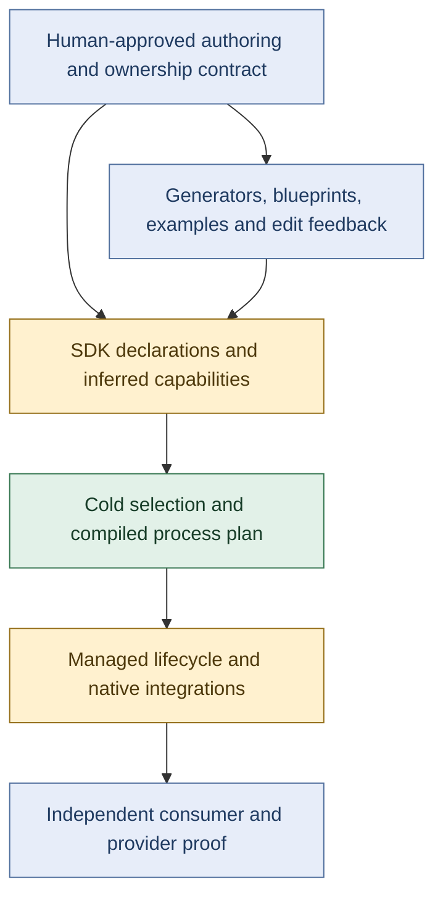

> **Preserved evidence, not current authority.** Original September 15 assessment, superseded by the repository assessment.
> Imported on 2026-09-15. Narrative retained; local links normalized where available.
> Unbundled local references are provenance text, not repository dependencies.
> See the [source register](../../SOURCES.md#current-assessment) and [current assessment](../../assessment.md).

# Habitat SDK: What Shipped, What Remains, And What To Preserve

Assessment date: 2026-09-15. This is a read-only reconciliation and proposed
recovery scope, not an implementation or release receipt.

## Decision In Brief

**Keep the foundation, repair two runtime boundaries, simplify the async
authoring model, and finish the developer-facing construction system.** The
evidence supports a bounded architectural correction, not merely cosmetic DX
work and not a wholesale substrate rewrite.

The linked conversation did not actually end with "everything is done." It
released the bounded runtime, then reopened authoring and identified defects.
Its last response explicitly left implementation and provider qualification
ahead. Those later findings were not carried into a tracked successor in the
platform repository. That missing handoff is now as important as any individual
technical bug.

My earlier comparison in this chat was too narrow for the SDK as a whole. Rawr
exposed inference, generation, dependency, and guardrail gaps. The recovered
conversation adds request-lifetime correctness, cancellation capability loss,
an async type-safety hole, and an unnecessary async abstraction. Fixing only the
three DX items would not finish this recovery.

## 1. Which "Complete" Was True?

The requested thread is [Assess Habitat substrate progress](codex://threads/01a06e3d-0085-79d2-99c7-683233b5938d).
[Selected final responses](habitat-sdk-thread-claims.md) preserve its actual
closure and subsequent reopening. Dates in that extract are UTC; the later
turns were still September 6 in the user's local timezone.

| Checkpoint | What it actually established | Current disposition |
| --- | --- | --- |
| September 4 recovery | Much of the live runtime was absent; cold planning and overly rigid policy needed correction | Historical starting point, not today's runtime state |
| September 4 realignment | Revised authority, scope, and executable policy; deferred optional integrations without deleting their promises | Real preparation, explicitly not runtime implementation |
| September 6 release | SDK/CLI 0.6.0 published; actual managed runtime and selected native hosts qualified; producer adoption and archive completed | Genuine bounded delivery |
| Later authoring review | Original SDK proposal only partly reconciled; public factory ceremony remained | Closure miss acknowledged, not repaired |
| Later boundary probes | Native client continuation and async capability typing fail supported-looking journeys | Known correctness work remained |
| Last async design turn | Remove the standalone step registry in favor of native function-local composition | Bounded design direction; not shipped |
| Persistent reference plan | One app with real Inngest, EVLog, HyperDX/ClickHouse, and PostHog readback | Reviewed scope, explicitly not implemented |

The release's 188-task and installed-package receipts are evidence for the cases
they exercised. They are not independent proof that every authoring proposal
was dispositioned, every supported composition worked, or provider dashboards
contained persisted results. The later defects do not make publication fake;
they limit the completeness claim.

Sources: [release checkpoint](habitat-runtime-release.md),
[boundary assessment](habitat-boundary-assessment.md),
[final async direction](habitat-async-function-design.md).

### The Current Artifact Baseline

Fresh registry queries still return SDK and CLI **0.6.0**, both with release
source `f52474a7abc232d881cd1cf272f1d063a265285d`; CLI depends on SDK 0.6.0.
Fresh `git ls-remote` returns accepted main
`29365b34cbfeca636606af0f6b5d4c4ac07c1066`.

The primary local checkout is `55ce5a7fb`, on
`codex/fluree-capability-reassessment`. Its difference from main is exclusively
Fluree documentation and probe artifacts. It has not shipped the SDK repairs.
Its preexisting untracked `.codex/config.toml` was left alone.

Rawr independently consumes 0.6.0. Its working CLI and capture/search behavior
provide useful downstream evidence, but exercise a narrower set of boundaries
than the full SDK. Neither Rawr's success nor its friction should be generalized
to untested native hosts.

## 2. What Kind Of Problem Each Gap Is

Green means preserve the demonstrated core, not certify every line. Amber means
specific contract or implementation repairs. Blue means unfinished authoring,
integration, or qualification. The point is to avoid one undifferentiated label
such as "DX" or "broken architecture."

### Runtime Correctness: Repair, Not Just Documentation

**Request-bound client continuation.** A client constructed in native middleware
can lose the already-admitted request's continuation. During drain, its call
fails with HTTP 500 while binding inside the Effect handler succeeds with 200.
The fresh rerun reproduces this against published 0.6.0. Resources still wait for
request settlement in the demonstrated case; premature provider release was
not established. The repair must preserve request ownership across both native
and Effect construction paths and reject use after the request ends.

**Native Promise cancellation.** The curated `Effect.tryPromise` facade narrows
the callback to zero arguments and invokes it without native Effect's
AbortSignal. Restore that capability and test cooperative cancellation at real
resource boundaries. An Effect timeout is not evidence that an arbitrary
underlying Promise stopped physical IO. Do not respond by inventing another
general cancellation engine.

**Declaration-to-capability type safety.** The published async API accepts a
step requiring an incompatible event and an undeclared client. A fresh probe
again produces no TypeScript diagnostics. This is more serious than excess
type annotations: the compiler is permitting an invalid relationship. Connect
the selected event, services, and resources to the body context, with negative
type tests that must fail compilation.

The earlier [boundary inventory](habitat-boundary-assessment.md)
records these separately from syntax concerns. Fresh runtime findings are
collected in [the runtime evidence pack](sdk-runtime-foundation.md).

### Async Architecture: Remove An Unnecessary Layer

Current Habitat registers individual managed-step descriptors and compiles
their membership/dispatch. That obstructs ordinary lexical flow from a previous
step, wait, or loop item. The initial proposal to add step arguments was
explicitly superseded by the last design turn.

The supported direction is **functions as the authoring unit, native steps
inside the function, and ordinary variables carrying results**. Keep Habitat's
selected capabilities and finite process-local lifecycle integration. Keep
Inngest's scheduling, serialization, memoization, replay, and waits. Current
Habitat already delegates those durable mechanics; no competing durable store
or scheduler was demonstrated.

This is an architectural repair because definitions, compilation, native
integration, typing, and policy must agree on the changed unit of composition.
It is bounded because it does not require replacing the service/resource model,
process planner, or native execution owners. Native inline/no-step/failure
handler experiments are feasibility evidence, not proof that the replacement
has been implemented in Habitat.

Two acceptance conditions are architectural, not implementation trivia. First,
native outer-handler Promises can remain pending after finite local work drains,
while an abandoned local Effect can outlive its callback. Neither outer-handler
settlement nor callback-only tracking defines process completion. No-step
functions, service-backed failure handlers, and unawaited local Effects and
finalizers must satisfy one bounded finite-work contract. Second, preserve
native function/step identities and persisted result shapes for in-flight runs,
or provide an explicit versioning/migration disposition. Successful newly
started runs alone do not establish replay compatibility.

### SDK Authoring: Complete And Simplify The Contract

The original proposal remains useful input, not a specification to restore
wholesale. Its twelve independent dispositions are preserved in the
[authoring evidence pack](sdk-authoring-provenance.md).

- Adopt direct lane builders instead of requiring ordinary authors to expose
  `.factory()`; preserve coldness, options, and named instances.
- Normalize maps and wrappers only when they add no information. Instance,
  binding, optionality, invocation authority, and provider selection still mean
  different things.
- Make selected declarations determine available clients/resources and their
  types. Fix portable declaration emission so ordinary reusable commands do
  not need nested return-type extraction around SDK-internal bundled names.
- Qualify one simple native-client calling journey. An official oRPC
  `createProcedureClient` delegation route already works; do not invent another
  runtime or make Effects implicitly thenable just to supply Promise syntax.
- Decide protocol versus API audience deliberately. Current `api`/`internal`
  selects OpenAPI/RPC and documentation behavior. `internal` explicitly does
  not mean authenticated or network-isolated; no authorization vulnerability
  was established. The concern is conflated semantics, not an automatic need
  for every possible transport/exposure combination.
- Explicitly retain or defer host-side web service access. Current web host
  authoring rejects services while allowing resources. The browser-to-API
  route works; adding a new web framework is not required for recovery.

Preserve native Effect and native host ownership. Do not reinstate the old
proposal's custom Effect representation, universal descriptor interpreter, or
ban on native handlers. Defer a new diagnostic renderer unless an actual
author-repair journey proves the existing messages inadequate.

### Construction Tooling: Finish The Downstream Path

These findings come from using Habitat, rather than merely inspecting its own
self-hosted application:

| Rawr observation | What should change | Correct owner |
| --- | --- | --- |
| Service generation produced a v3 shell, not the managed v4 shape; app/resource/provider/topic assembly remained manual; CLI command generator is core-only | Provide supported downstream managed generation and registration from the accepted semantic choices | Habitat CLI/Nx generators, not a Rawr framework |
| Reusable command exports require TS2742 workarounds | Make exported inference portable through the public SDK and emitted declarations | SDK source/declaration packaging |
| Producer migration proof did not cover Rawr's six package-level pins | Define and qualify workspace-wide compatible dependency migration | CLI migrations and package compatibility contract |
| Same oRPC versions loaded in distinct Bun realms through a different optional OTel resolution | Qualify the actual installed dependency closure and supported integration bootstrap | SDK/CLI packaging and consumer fixtures |
| Stop hook checks topology, not Grit source rules; no post-edit feedback | Provide fast, targeted structural and source-law feedback plus a reliable final gate | CLI hook/preset and host adapter |
| Hook failure exits 1 rather than the Codex blocking protocol | Translate failures into actual host continuation feedback and test it end to end | Hook integration, not the domain runtime |
| Projectless thread edited another worktree without loading its repo-local hooks | Verify or explicitly bind the actual worktree and expose active enforcement status | Agent host/workspace integration |

The declaration-emission failure was freshly reproduced with an in-memory
compiler probe: the annotated baseline passes; removing either an ordinary
command annotation or the command-tuple annotation produces TS2742 against an
SDK-private bundled declaration name. No consumer files were changed.

The oRPC realm split was also freshly reproduced. It is a risk to managed Effect
adoption, not a claim that existing ordinary-client services are currently
broken. The producer already tests shared module realpaths in a fixture with
supplemented dependencies. The missing qualification is the ordinary generated
Bun consumer with divergent optional-peer resolution, not the absence of all
module-identity tests.

The existing Stop hook explicitly advertises structural checking. There is no
need to pretend its release promised a complete post-edit gate. The gap is
between that limited integration and the desired authoring experience; define
the intended source selection and blocking contract before changing it.

Two corrections should not be charged to the SDK as unresolved architectural
defects: disabling unnecessary declaration emission in Rawr's private app fixed
our own consumer configuration choice; the missing generated Husky launcher in
this worktree is an installation/setup failure until its upstream cause is
established. Neither is a reason to weaken SDK types or redesign the runtime.

Checks are real, but invoking a validator manually is not an always-on authoring
loop. Also, passing source law cannot prove capture quality or data correctness.
Tests and independent behavioral review remain necessary.

Sources and owner-specific details: [consumer evidence pack](sdk-consumer-completion.md)
and Rawr's observed authoring experience (external source: `$HOME/Documents/.nosync/DEV/worktrees/wt-agent-root-rawr-source-library/openspec/changes/build-source-library-cli/WORKSTREAM.md:189`).

## 3. What Is Worth Preserving?

The core ownership model remains coherent: services own domain behavior;
resources declare capabilities; providers supply implementations; plugins
project behavior; apps select composition. Cold definitions become a selected
process plan, then native Effect owns local execution/scopes and vendors retain
their specialized behavior. That model has actual runtime and independent
consumer evidence, not only diagrams.

The takeover did real repair work before release: named service assignments,
selected-process provider coverage, complete service references, cold graph
normalization, and overly restrictive implementation policy. Do not reactivate
September 4 defects as current merely because they appear in the initial audit.
The fresh verification pass ran **68 focused tests** in the existing clean
accepted-main worktree, including named slots/instances, selected-process
coverage, bounded DAG traversal with divergence controls, malformed-surrogate
rejection, provider lifecycle, admitted descendants, and streaming cleanup.

The current concerns do require going **up one level to the public authoring and
ownership contracts**. They do not currently justify going back to the beginning
of the substrate. In particular, the request-lifetime specification itself
describes the overly narrow fiber-capture mechanism, and the step registry was
a chosen representation. These are not both reducible to typos in otherwise
perfect designs.

Confidence is moderate, not universal certification. This assessment is not an
exhaustive concurrency, security, or every-vendor audit. Revisit the foundation
if the repaired journeys require conflicting lifetime owners, a second durable
engine, pervasive ambient authority, or replacement of the core graph/resource
model. The observed failures have not established those conditions.

## 4. The Work To Resume, In Order

### First: Restore One Current, Human-Reviewable Contract

Admit a bounded successor that incorporates the existing boundary/async
decisions and the new consumer findings. Preserve the real release history.
Do not re-open the old 115-task sequence or let an investigation note count as
implementation. The current tracked `IMPLEMENTATION.md` says complete while
its late authorship section still contains only an initial disposition;
the later repair inventory lives outside that repository.

Review a small set of executable authoring examples before turning their shape
into generated code and enforced law:

1. One service exposed as a CLI command, with inferred input/output and portable
   declaration emission for its reusable topic.
2. A service depending on another service and a resource, including meaningful
   named-instance and explicit invocation differences.
3. A native server request that calls the same service through middleware and
   an Effect handler, including drain, abort, errors, and expired-client use.
4. One Inngest function with dependent inline steps, a wait, retry/re-entry,
   and a truthful failure-handling path using selected services.

These are the human review surface. Agents should own ordinary implementation
choices inside those contracts, not ask for approval of helper filenames.
Promote only accepted changes to canonical sections; evolve SDK, immutable
blueprint successors, generators, and examples together. Do not make code and
self-generated policy the only judges of the author's intended experience.

### Then: Three Coupled Delivery Outcomes

| Outcome | Completion evidence |
| --- | --- |
| Repair runtime and simplify async contracts | Native and Effect callers preserve the same admitted request lifetime; signal-aware interop is retained; invalid capability combinations fail types; function-local steps satisfy the finite-work, failure/abandonment, and persisted replay-compatibility conditions above |
| Finish and release authoring/tooling | Independent generated consumer builds, emits reusable declarations, runs, and upgrades without private imports, custom framework glue, or hidden pins; real edit/stop hook violations produce actionable feedback in the correct worktree |
| Qualify a persistent reference | One understandable multi-service app shows persisted business results, real Inngest history, EVLog operation logs, HyperDX/ClickHouse readback, and explicit PostHog product events, with recovery and shutdown proof |

Some work can run in parallel: runtime regressions and public-type tests can
advance while authoring examples are reviewed; generator and hook mechanics can
be designed in parallel. Final generation and source-law changes must follow
the accepted public contract, not independently invent it. Use installed public
artifacts in the final consumer qualification, not source-path shortcuts.

The existing batch-import reference plan is a useful bounded starting point.
Do not commandeer Civ7 or Magic as substrate test fixtures. Rawr's working source
library adds valuable proof but does not by itself cover server/async/provider
qualification. No proof requires keeping vendor dashboards running forever.

## 5. Keep Future Capabilities Separate

Semantic ledger, temporal inquiry, remaining product transfers, native
agent/desktop host qualification, and first-class niche admission remain
separate scopes. They are not all prerequisites for repairing the SDK.
Blueprint kinds and concrete instances exist; overlays are not complete niche
governance. The local September 15 Fluree reassessment is fresh evidence for its
own deferred lane, not a shipped SDK integration or a renewed global blocker.

Full observability is the one deferred lane deliberately exercised by the
reference: OTLP transmission is already qualified, but storage/queryability,
exception redaction, EVLog semantics, and PostHog readback require additional
work. These reusable integrations belong to their resource/provider owners;
the reference's domain behavior remains outside Habitat.

## Evidence And Limits

- Fresh: registry versions/release git heads, remote main, source continuity,
  repository routing, downstream source inspection, and selected published
  runtime/type/signal probes; 68 focused runtime/SDK regressions, declaration
  emission and Bun module-realm probes. Initial source-suite attempts in the
  primary checkout encountered stale/missing dependencies; using the existing
  clean accepted-main worktree resolved that environment issue without an
  install or source change. Details are recorded in the evidence packs.
- Historical, not rerun wholesale here: the 188-task release gate, multi-OS
  installed acceptance, and original native provider receipts.
- Not claimed: fixes implemented, a new release, a completed persistent
  reference, live backend readback, global hook activation, or exhaustive
  platform certification.
- Repositories were inspected read-only. Only this task's assessment artifacts
  were written. Existing user changes and held work were preserved.

Supporting material: [investigation brief](habitat-sdk-reconciliation-brief.md),
[takeover claims](habitat-sdk-thread-claims.md),
[authoring provenance](sdk-authoring-provenance.md),
[runtime findings](sdk-runtime-foundation.md),
[consumer completion](sdk-consumer-completion.md).

Skills used: investigation-design, information-design, habitat-platform-authority,
and nx-workspace. Independent readers separated authoring provenance, runtime
semantics, and consumer/tooling ownership before synthesis. A fresh synthesis
review added explicit finite-work ownership and in-flight replay compatibility
to the async acceptance boundary.
