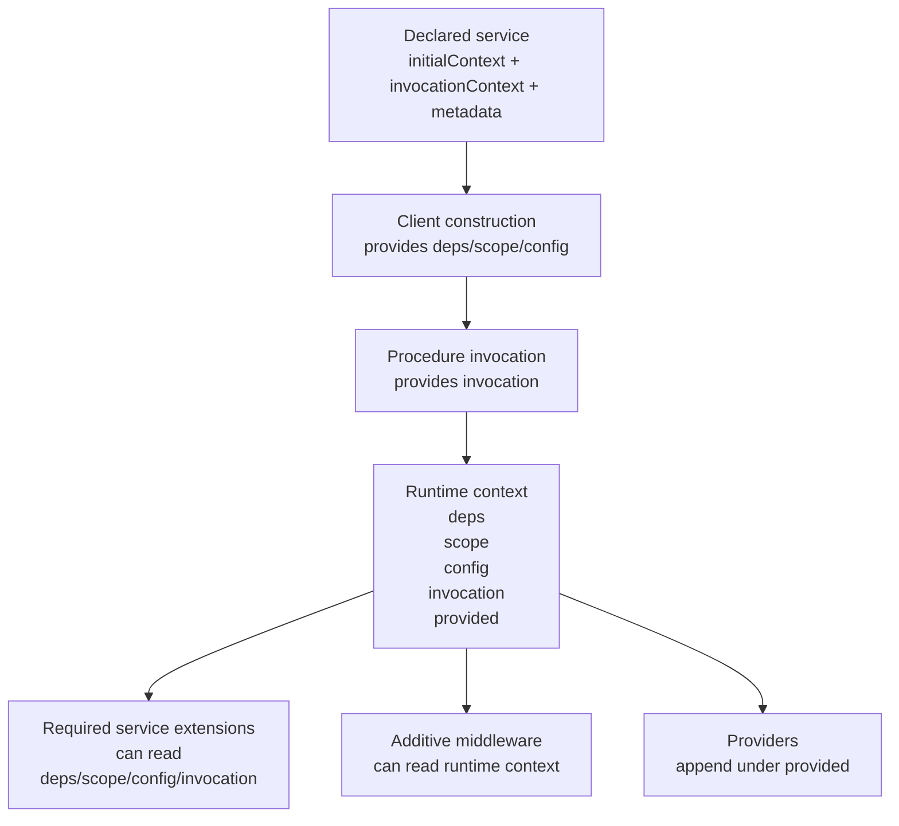

# Mini Spec: Service Context Semantics Cleanup

## Purpose

This mini spec defines the internal semantic and type-model cleanup needed
before the next middleware integration slices.

The goal is to make the distinction between:

- service-declared host input
- per-call invocation input
- runtime-provided execution resources

more explicit in the SDK/service factory layer without thrashing the
author-facing service definition surface.

This is a prerequisite semantic cleanup, not a middleware redesign.

## Decision Summary

Keep the current service authoring shape in
[`packages/example-todo/src/service/base.ts`](/Users/mateicanavra/Documents/.nosync/DEV/worktrees/wt-codex-example-todo-unified-golden/packages/example-todo/src/service/base.ts).

Do **not** make service authors import more internal helper types manually.
Do **not** redesign `defineService(...)` authoring just to improve internal
semantics.

Instead:

- keep ORPC-facing declaration terminology:
  - `initialContext`
  - `invocationContext`
  - `metadata`
- clarify the internal factory/type model so it explicitly distinguishes:
  - declared initial lanes
  - runtime context
  - required-extension runtime context
- keep provider output under `context.provided.*`
- do **not** flatten provider-derived resources to top-level runtime lanes

## Why This Slice Exists

Today, the service authoring site is already close to the right mental model.

At the service-definition seam, [`base.ts`](/Users/mateicanavra/Documents/.nosync/DEV/worktrees/wt-codex-example-todo-unified-golden/packages/example-todo/src/service/base.ts#L96) declares:

- `initialContext` for stable host-supplied lanes
- `invocationContext` for per-call input
- `metadata` for static procedure metadata

That part is good.

The semantic blur happens internally:

- [`base-foundation.ts`](/Users/mateicanavra/Documents/.nosync/DEV/worktrees/wt-codex-example-todo-unified-golden/packages/example-todo/src/orpc/base-foundation.ts#L27)
  defines `BaseContext` as the merged runtime object containing:
  - `deps`
  - `scope`
  - `config`
  - `invocation`
  - `provided`
- `InitialContext` is currently just an alias of that merged runtime object.
- `ServiceContextOf` is also an alias of that merged runtime object.

So internally the name `InitialContext` no longer means "declared service input
lanes." It means "fully merged runtime context." That is the main semantic
problem this slice fixes.

## Non-Goals

This slice does **not**:

- redesign middleware architecture
- change package posture around `context.provided.*`
- flatten provider outputs into top-level runtime fields
- move analytics to a provider-backed runtime capability
- change how module setup performs local ergonomic reshaping
- redesign `createClient(...)` callsite semantics
- introduce new authoring burdens in service modules

If implementation pressure suggests one of those changes is needed, that is a
separate slice.

## Current Behavior That Must Be Preserved

These behaviors are already encoded in tests and are not optional.

### Service declaration requirements

From
[`packages/example-todo/test/context-typing.ts`](/Users/mateicanavra/Documents/.nosync/DEV/worktrees/wt-codex-example-todo-unified-golden/packages/example-todo/test/context-typing.ts#L85):

- `defineService` requires `initialContext.deps`
- `defineService` requires `initialContext.scope`
- `defineService` requires `initialContext.config`
- `defineService` requires `invocationContext`
- `defineService` baseline does not accept observability/analytics config

### Client boundary semantics

From
[`packages/example-todo/test/context-typing.ts`](/Users/mateicanavra/Documents/.nosync/DEV/worktrees/wt-codex-example-todo-unified-golden/packages/example-todo/test/context-typing.ts#L173):

- `CreateClientOptions` contains stable host-supplied lanes only
- invocation input is not allowed at client construction time
- invocation input is required at procedure call time

### Required service extension semantics

From
[`packages/example-todo/test/context-typing.ts`](/Users/mateicanavra/Documents/.nosync/DEV/worktrees/wt-codex-example-todo-unified-golden/packages/example-todo/test/context-typing.ts#L254):

- required service observability/analytics middleware may read:
  - `deps`
  - `scope`
  - `config`
  - `invocation`
- required service extensions must **not** depend on `provided`
- `createImplementer(...)` must require required extensions
- additive middleware must not satisfy required-extension slots

### Provider semantics

From
[`packages/example-todo/test/context-typing.ts`](/Users/mateicanavra/Documents/.nosync/DEV/worktrees/wt-codex-example-todo-unified-golden/packages/example-todo/test/context-typing.ts#L368)
and
[`packages/example-todo/src/orpc/factory/middleware.ts`](/Users/mateicanavra/Documents/.nosync/DEV/worktrees/wt-codex-example-todo-unified-golden/packages/example-todo/src/orpc/factory/middleware.ts#L109):

- normal middleware must not add execution context
- providers may only add execution context under `provided`
- providers must not write reserved lane names
- providers must not write `provided` directly as a nested bucket
- providers must not overwrite existing provided keys

This slice must preserve all of the above.

## Naming and Semantic Rules

Because ORPC already gives `initialContext` and `invocationContext` specific
meaning at the declaration boundary, do not repurpose those terms internally in
a way that hides the distinction.

### Rule 1. Keep ORPC declaration terminology at the authoring seam

`defineService<{ initialContext, invocationContext, metadata }>(...)` stays as
the author-facing declaration model.

### Rule 2. Introduce explicit internal runtime terminology

Inside the SDK/service factory layer, use names that distinguish:

- **declared initial context**
- **runtime context**
- **required-extension context**

The important point is the distinction, not the exact spelling. Suitable names
include:

- `DeclaredInitialContextOf<T>`
- `RuntimeServiceContextOf<...>`
- `RequiredServiceExtensionContextOf<...>`

### Rule 3. Do not call the merged runtime object `InitialContext`

That is the semantic confusion to remove.

### Rule 4. Do not flatten provider resources package-wide

`context.provided.*` remains the canonical runtime bucket for provider-derived
execution resources.

If local ergonomic flattening is needed, it still belongs in module setup or
module-local middleware, not in the global context model.

## Proposed Composition Model

### 1. Declaration-time service categories

At service authoring time, the declaration remains:

```ts
defineService<{
  initialContext: {
    deps: { ... };
    scope: { ... };
    config: { ... };
  };
  invocationContext: {
    traceId: string;
  };
  metadata: {
    ...
  };
}>({...});
```

Interpretation:

- `initialContext` = stable host/client-construction input lanes
- `invocationContext` = per-call required input lane
- `metadata` = static procedure metadata

### 2. Runtime composition categories

At runtime, middleware and handlers operate against a merged runtime context
with these semantic lanes:

- `deps`
- `scope`
- `config`
- `invocation`
- `provided`

This can be illustrated as:



### 3. Required-extension context is a proper runtime subset

Required service extensions should operate on:

- `deps`
- `scope`
- `config`
- `invocation`

and should never see `provided`.

This should be modeled explicitly, not reconstructed ad hoc by "remove
provided from full context" if there is a clearer internal type available.

## Required Internal Type/Projection Changes

The exact final names are flexible, but the service type model must make these
semantic projections available.

### A. Declared service inputs

The service projection should retain the author-facing declared categories:

- `Deps`
- `Scope`
- `Config`
- `Invocation`
- `Metadata`

### B. Declared initial context

Add an explicit projection for the declared stable host-supplied lanes:

- `DeclaredInitialContext`

This should correspond to:

- `deps`
- `scope`
- `config`

and should not include `invocation` or `provided`.

### C. Runtime context

Add an explicit projection for the full runtime context:

- `RuntimeContext`

This should correspond to:

- `deps`
- `scope`
- `config`
- `invocation`
- `provided`

### D. Required-extension context

Add an explicit projection for required service middleware extension authoring:

- `RequiredExtensionContext`

This should correspond to:

- `deps`
- `scope`
- `config`
- `invocation`

and should exclude `provided`.

### E. Backward-compatibility aliasing

If keeping `Service["Context"]` is useful for compatibility, it should mean the
full runtime context and should be documented that way.

If old internal helper names remain temporarily, they should point at the new
semantics rather than preserve misleading names.

## What Needs To Change Inside `base.ts`

This slice must cover every service authoring surface exported from
[`packages/example-todo/src/service/base.ts`](/Users/mateicanavra/Documents/.nosync/DEV/worktrees/wt-codex-example-todo-unified-golden/packages/example-todo/src/service/base.ts).

### `Service`

`Service` should project the clearer service type model so downstream docs and
factory builders talk about runtime context honestly.

Expected outcome:

- stable host-supplied lanes are still visible as distinct categories
- runtime context remains the context used by handlers and additive middleware

### `ocBase`

No semantic change required.

It remains a contract authoring surface driven by metadata, not runtime context.

### `createServiceMiddleware`

No behavior change required.

It should remain the generic additive middleware builder for service-local
middleware that does not add execution context.

Its authoring docs should continue to tell authors not to restate the full
service runtime context when only a fragment is needed.

### `createServiceObservabilityMiddleware`

No behavior change required.

It should continue to default to additive runtime middleware semantics and may
depend on runtime context as currently allowed.

### `createRequiredServiceObservabilityMiddleware`

Its semantics should become clearer through typing, not broader.

It must remain pinned to required-extension context:

- may read `deps`
- may read `scope`
- may read `config`
- may read `invocation`
- may **not** read `provided`

### `createServiceAnalyticsMiddleware`

No behavior change required.

It remains additive middleware, not a required extension slot.

### `createRequiredServiceAnalyticsMiddleware`

Same as required observability:

- may read `deps`
- may read `scope`
- may read `config`
- may read `invocation`
- may **not** read `provided`

### `createServiceProvider`

No semantic broadening.

It should still author middleware that appends execution context under
`provided`.

The clearer context model should make it more obvious that providers add runtime
resources; they do not declare host input lanes.

### `createServiceImplementer`

This must keep the strongest distinction in the system:

- the returned implementer operates on full runtime context
- required extension slots are typed against required-extension context

The current shape already does this semantically; the cleanup should make that
model explicit and easier to understand.

## Proposed Implementation Moves

### 1. Refactor the internal context foundation types

In
[`packages/example-todo/src/orpc/base-foundation.ts`](/Users/mateicanavra/Documents/.nosync/DEV/worktrees/wt-codex-example-todo-unified-golden/packages/example-todo/src/orpc/base-foundation.ts):

- stop using `InitialContext` as the name for the merged runtime shape
- introduce explicit internal types for:
  - declared stable initial lanes
  - runtime context
  - required-extension runtime context

### 2. Refactor service type projection helpers

In
[`packages/example-todo/src/orpc/base.ts`](/Users/mateicanavra/Documents/.nosync/DEV/worktrees/wt-codex-example-todo-unified-golden/packages/example-todo/src/orpc/base.ts):

- update `ServiceTypesOf<T>` to project:
  - declared initial context
  - runtime context
  - required-extension context
- preserve `Deps`, `Scope`, `Config`, `Invocation`, and `Metadata`
- preserve or intentionally alias the current `Context` projection

### 3. Refactor service factory typing

In
[`packages/example-todo/src/orpc/factory/service.ts`](/Users/mateicanavra/Documents/.nosync/DEV/worktrees/wt-codex-example-todo-unified-golden/packages/example-todo/src/orpc/factory/service.ts):

- replace ad hoc context derivations with the clearer projections where
  possible
- keep `createImplementer(...)` typed over full runtime context
- keep required extension slots typed over required-extension context

### 4. Preserve provider builder behavior

In
[`packages/example-todo/src/orpc/factory/middleware.ts`](/Users/mateicanavra/Documents/.nosync/DEV/worktrees/wt-codex-example-todo-unified-golden/packages/example-todo/src/orpc/factory/middleware.ts):

- preserve current provider constraints
- preserve the cast-local workaround unless a cleaner fix falls out naturally
- do not use this slice to broaden provider write semantics

### 5. Tighten and clarify JSDoc/comments at service authoring seam

In
[`packages/example-todo/src/service/base.ts`](/Users/mateicanavra/Documents/.nosync/DEV/worktrees/wt-codex-example-todo-unified-golden/packages/example-todo/src/service/base.ts):

- explicitly state that only stable host-supplied lanes belong in
  `initialContext`
- explicitly state that provider-derived execution resources do not belong in
  the service declaration and instead arrive under `context.provided.*`
- keep the service authoring surface otherwise stable

## Acceptance Criteria

The slice is complete when:

1. service authoring in `src/service/base.ts` is still effectively the same
2. internal type names/projections no longer confuse declared initial input with
   merged runtime context
3. required service extensions are explicitly modeled as "runtime without
   provided"
4. provider semantics remain unchanged
5. `context-typing.ts` still enforces all current guardrails
6. any changed tests or docs make the declaration/runtime distinction easier for
   an implementation agent to understand

## Validation

At minimum:

- run the relevant type tests for service/middleware context typing
- run package tests that cover provider middleware and service telemetry typing
- verify there is no required code churn in service module authoring files

## Risks

### Risk 1. Semantic cleanup silently broadens runtime access

Bad outcome:

- required extensions accidentally gain access to `provided`

Mitigation:

- keep or strengthen the existing negative type tests

### Risk 2. Semantic cleanup thrashes the author-facing API

Bad outcome:

- `service/base.ts` authoring changes more than necessary
- module/service authors need to import new helper types manually

Mitigation:

- treat authoring stability as a hard requirement

### Risk 3. Internal rename without external clarity

Bad outcome:

- internal helper names change but the docs still fail to teach the distinction

Mitigation:

- update JSDoc/comments in `service/base.ts`
- keep the service type projections honest and explicit

## Handoff To Implementation Agent

The implementation agent should treat this as a semantic cleanup slice, not as
a chance to redesign middleware.

Implementation posture:

- preserve service authoring ergonomics
- improve internal semantic honesty
- preserve provider constraints
- preserve required-extension constraints
- keep ORPC terminology aligned at the declaration boundary

If the implementation seems to require flattening provider output or reworking
middleware architecture, stop and surface that as a separate slice rather than
forcing it into this one.
