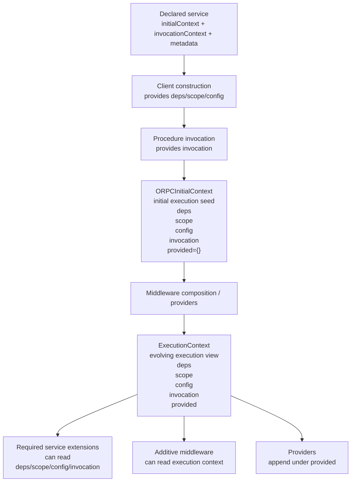

# Mini Spec: Service Context Semantics and Dependency Declaration

## Purpose

This mini spec defines the internal semantic and type-model cleanup needed
before the next middleware integration slices.

The goal is to make the distinction between:

- service-declared stable input lanes
- per-call invocation/client input
- execution-time provided resources

more explicit in the SDK/service factory layer without thrashing the
author-facing service definition surface.

This is a prerequisite semantic cleanup, not a middleware redesign.

## Status

This document captures the current working hypothesis from an exploratory
conversation.

It is now primarily a **supporting reference** for the earlier service-context
semantic cleanup, not the main active design map for the current adapter /
host / input-layer design problem. For the live unresolved design knot, prefer
`DESIGN.md` first.

It is **not locked in**.

It intentionally preserves disagreement and open tension, including the
possibility that some of the current direction here is wrong or incomplete.

In particular:

- this is **not** a finalized governance or enforcement system
- this is **not** the final dependency declaration model
- some floated enforcement examples from the conversation, especially
  package-specific allow/deny-list style approaches, are explicitly considered
  poor and unmaintainable and should **not** be treated as accepted direction

The likely next step after this document is a behind-the-scenes refactor to
simplify the service/context seam before deeper middleware design resumes.

## The Crux

The main ambiguity is not just "what is context?" but:

- where a package declares that it needs something
- whether that thing is a host-supplied prerequisite or a middleware-provided
  execution resource
- whether a value belongs in `deps`, `config`, or `provided`
- whether agents should construct runtime resources directly or consume a
  canonical provided form

The pressure point is that an agent often starts from a business-logic need:

- "I need analytics"
- "I need SQL"
- "I need a repo"

and then has to decide where that need should be declared.

Without a clear classification rule, multiple patterns look plausible:

- put a constructed client in `deps`
- put primitive infrastructure input in `config`
- add a provider that derives the client from a prerequisite
- bypass the provider and consume the prerequisite directly

That is the crux this document is trying to make explicit.

## Why The Crux Exists

The ambiguity exists because the codebase currently demonstrates multiple valid
layers, but does not yet teach one canonical classification rule strongly
enough.

Today the package already shows:

- stable host-supplied deps in the runtime boundary, such as
  `logger`, `analytics`, `clock`, and `dbPool`
- a provider pattern where a host-supplied prerequisite becomes a downstream
  execution resource, for example `deps.dbPool -> provided.sql`
- module-local provider composition where `provided.sql -> provided.repo`
- package behavior configuration under `config`
- host/framework-owned concrete integration outside the service seam, such as
  OpenTelemetry host adapters

One important live-code nuance matters here:

- the service authoring seam in `src/service/base.ts` does **not** declare
  `logger` or `analytics`
- those still arrive through the SDK baseline `BaseDeps` layer
- that means the current ambiguity is partly caused by the system teaching two
  different things at once:
  - service authors only declare package-local deps like `dbPool` and `clock`
  - but handlers/middleware still see additional baseline deps that were never
    declared in the service-local `initialContext`

So the ambiguity is **not** that there is literally no pattern.

The ambiguity is that there are several adjacent concepts:

- stable host prerequisite
- stable package behavior config
- runtime execution resource
- host/framework integration detail

and agents do not yet have a hard-enough way to classify a new need into one of
those buckets.

That ambiguity shows up most obviously when someone asks:

- "Should the host pass me the analytics client directly?"
- "Should SQL be a direct dependency or a provider output?"
- "Does a database URL belong in config or deps?"
- "If telemetry is baseline, why does it also feel provided?"

## Current Working Hypothesis

My current hypothesis is:

- there really are two valid layers:
  - host-supplied prerequisites/capabilities
  - middleware-provided execution resources
- the problem is not that we failed to choose a single layer
- the problem is that we have not yet encoded the classification rule that
  tells agents which layer a thing belongs to

The useful working distinction is:

- `deps` = stable host-owned prerequisites or baseline capabilities
- `config` = stable package behavior knobs, not infrastructure composition
- `scope` = stable business/client-instance identity
- `invocation` = required per-call input
- `provided` = runtime execution resources derived in the pipeline

In that model:

- a provider does not replace host dependencies
- a provider consumes host prerequisites and produces execution resources

So the question should not be:

- "host dependency or provider?"

It should be:

- "what is the host prerequisite?"
- "what is the derived runtime resource?"
- "which of those should business logic consume?"

## Examples Of The Ambiguity

### SQL / database

The current SQL provider already encodes the layered model:

- host supplies `dbPool`
- provider derives `sql`
- module middleware derives `repo`

This is materially different from directly passing a constructed SQL client
through the package boundary.

### Analytics

Analytics is currently ambiguous in the codebase because:

- the docs/posture increasingly treat provider-backed analytics as the target
  direction
- but the runtime baseline still carries `analytics` directly in `BaseDeps`
- required service analytics middleware and SDK baseline analytics emission both
  still type against `context.deps.analytics`

That makes analytics a transitional seam and a bad teaching example for agents
unless we describe it explicitly as transitional.

### Telemetry / logging

Telemetry also exposes the conceptual layering:

- OpenTelemetry binding is host/framework-owned
- logger is currently still an intentional stable host capability in the
  baseline SDK layer
- analytics currently behaves like a stable host capability in code, but may not
  remain that way architecturally

So "dependency" can sound overloaded even when the underlying roles are
different.

## Live-Code Clarification

The current code does **not** support the broad claim "baseline-injected
dependencies are categorically wrong."

The live system is more specific than that:

- baseline `logger` is still part of the intended SDK baseline capability model
- baseline `analytics` is the seam explicitly called transitional by the
  posture docs
- service-local declaration in `src/service/base.ts` is already narrower than
  the deeper runtime baseline and only declares package-local deps

So the cleanup target is not "remove all baseline injection."

The more accurate cleanup target is:

- clarify the semantic split between service-declared deps and deeper SDK
  baseline deps
- stop treating `analytics` and `logger` as if they are the same kind of
  dependency question
- avoid letting current transitional analytics behavior teach the general model

## What This Document Is Not Trying To Settle

This document does **not** settle:

- the final enforcement model
- the final analytics architecture
- whether every future capability should become provider-backed
- package-by-package allowlist or denylist policy structures
- broad governance machinery

It exists to capture the current version of the crux and the most useful
working distinctions before the next round of refactoring and design.

## Decision Summary

Keep the current service authoring shape in
[`services/example-todo/src/service/base.ts`](/Users/mateicanavra/Documents/.nosync/DEV/worktrees/wt-codex-example-todo-unified-golden/services/example-todo/src/service/base.ts).

Do **not** make service authors import more internal helper types manually.
Do **not** redesign `defineService(...)` authoring just to improve internal
semantics.

Instead:

- keep the current author-facing declaration shape:
  - `initialContext`
  - `invocationContext`
  - `metadata`
- use ORPC terminology more directly in the internal projection model where it
  actually applies:
  - `ORPCInitialContext`
  - `ExecutionContext`
  - explicit acknowledgement that oRPC itself talks about:
    - `initial context`
    - `execution context`
    - client-side `client context`
- clarify the internal factory/type model so it explicitly distinguishes:
  - `DeclaredContext`
  - the full oRPC initial context assembled at the boundary
  - execution context
  - required-extension execution context
- keep provider output under `context.provided.*`
- do **not** flatten provider-derived resources to top-level runtime lanes

## Explicit Exception Note (2026-03-24)

The canonical servicepackage boundary is still:

- `defineServicePackage(router)`
- boundary inputs on `deps`, `scope`, and `config`
- per-call input on `invocation`
- execution-time provider/module outputs under `context.provided.*`

One narrow local exception is currently accepted in
[`services/coordination/src/client.ts`](/Users/mateicanavra/conductor/workspaces/rawr-hq-template/guangzhou/services/coordination/src/client.ts):

- the coordination package seeds a package-specific runtime capability into
  `context.provided.*` at the package edge
- that seed exists only to bridge workflow/plugin runtime composition into the
  coordination runs execution path
- it is immediately normalized by local runs middleware rather than consumed as
  a free-form top-level host bag

This should be read as a **documented exception**, not as a new default rule.

The default classification still holds:

- if a stable host-owned prerequisite is ordinary package input, declare it on
  `deps`
- if middleware/module setup derives an execution resource, put it under
  `context.provided.*`
- only keep a package-edge `provided` seed when the capability is truly
  package-specific, runtime-specific, and not yet a proven cross-package SDK
  abstraction

## Why This Slice Exists

Today, the service authoring site is already close to the right mental model.

At the service-definition seam, [`base.ts`](/Users/mateicanavra/Documents/.nosync/DEV/worktrees/wt-codex-example-todo-unified-golden/services/example-todo/src/service/base.ts#L96) declares:

- `initialContext` for stable host-supplied lanes
- `invocationContext` for per-call input
- `metadata` for static procedure metadata

That part is good.

The semantic blur happened internally at the SDK layer and was concentrated in
the old pre-split catch-all files. The current split is now:

- [`context/types.ts`](/Users/mateicanavra/Documents/.nosync/DEV/worktrees/wt-codex-example-todo-unified-golden/services/example-todo/src/orpc/context/types.ts)
  defines the execution-context primitives:
  - `deps`
  - `scope`
  - `config`
  - `invocation`
  - `provided`
- [`service/types.ts`](/Users/mateicanavra/Documents/.nosync/DEV/worktrees/wt-codex-example-todo-unified-golden/services/example-todo/src/orpc/service/types.ts)
  now projects `DeclaredContext`, `ORPCInitialContext`, `ExecutionContext`, and
  `RequiredExtensionExecutionContext` explicitly.

That old naming confusion was the main semantic problem this slice fixed.

There is a second, related pressure point:

- `src/service/base.ts` authors only package-local deps/config/scope/invocation
- `src/orpc/baseline/types.ts` still widens the runtime dependency bag with
  baseline `logger`, `analytics`, and `telemetry`
- the logger, analytics, and telemetry contracts themselves now live under
  `src/orpc/ports/{logger,analytics,telemetry}.ts`

That split is not necessarily wrong, but it must become explicit enough that
agents do not mistake "visible at runtime" for "must be declared here by the
service author."

## ORPC Alignment

Official oRPC context docs use these terms:

- **Initial Context**: context provided explicitly when invoking a procedure
- **Execution Context**: context generated during procedure execution, usually
  via middleware

Official oRPC client docs also use:

- **Client Context**: the client-side context type passed when invoking a
  client

This means our current service-definition vocabulary is only **partly**
identical to oRPC's terminology.

### Where we should align directly

Use **Execution Context** for the full context seen by middleware/handlers.

That is a real semantic match with oRPC and is better than the older internal
term "runtime context".

### Where we intentionally keep an SDK convention

Keep the author-facing `invocationContext` property for now.

Reason:

- it tells service authors what this context is for in package semantics:
  per-call invocation input
- it is clearer inside package authoring than a more generic label like
  `clientContext`
- the actual oRPC client context is broader infrastructure terminology than the
  semantic lane we expose to service authors

### Where we must be explicit about divergence

Our author-facing `initialContext` property is **not** the full
`ORPCInitialContext`.

Instead, it is the service's **Declared Context**:

- `deps`
- `scope`
- `config`

At the package boundary, the SDK assembles the full `ORPCInitialContext` by
combining:

- `DeclaredContext`
- the per-call `invocationContext`
- the initial empty `provided` bucket

`ORPCInitialContext` is therefore the initial execution seed handed into oRPC,
not the final or fully evolved execution view seen after middleware runs.

So if we keep the property name `initialContext`, the docs and internal types
must explicitly state that it means:

- "Declared Context authored at the service-definition seam"

not:

- "the full concrete ORPC initial context object passed into execution"

## Proposed Projection Model

The projection model should distinguish four layers:

```ts
type DeclaredContext = {
  deps: ...;
  scope: ...;
  config: ...;
};

type InvocationContext = ...;

type ORPCInitialContext = DeclaredContext & {
  invocation: InvocationContext;
  provided: {};
};

type ExecutionContext<TProvided = {}> = DeclaredContext & {
  invocation: InvocationContext;
  provided: TProvided;
};

type RequiredExtensionExecutionContext =
  Omit<ExecutionContext, "provided">;
```

In this model:

- service authors declare `DeclaredContext` through the existing
  `initialContext` property
- the boundary assembles `ORPCInitialContext` as the initial execution seed
- middleware evolves that seed into `ExecutionContext`
- handlers and additive middleware run against `ExecutionContext`
- required service middleware runs against
  `RequiredExtensionExecutionContext`

## Authoring Confusion: Dependencies Vs Provided Resources

The current codebase does **not** yet make the distinction obvious enough at
procedure/module authoring time.

There is some help today:

- typed `context` tells authors whether a value is currently available under
  `deps` or `provided`
- provider middleware and module middleware already demonstrate the layering in
  concrete code such as:
  - `deps.dbPool -> provided.sql`
  - `provided.sql -> provided.repo`

But that is not enough to make discovery easy.

The author still has to answer:

- "should I ask for this as a stable dependency?"
- "should I consume it as a provided execution resource?"
- "where do I even look to find which one it is?"

So the current `provided` concept is useful, but not yet sufficient as the
authoring-story by itself.

## Exploratory Direction For Procedure Authoring

One important open question is whether procedure authors should keep reaching
into semantic bags directly, or whether we should create a narrower authoring
funnel before handlers are written.

Two viable directions remain open:

### Option A: keep the semantic bags, but clarify and strengthen the funnel

- keep:
  - `context.deps`
  - `context.scope`
  - `context.config`
  - `context.invocation`
  - `context.provided`
- make the projection model and docs explicit enough that authors know:
  - stable host capabilities/prerequisites live in `deps`
  - execution resources derived during the pipeline live in `provided`
- keep module setup as the supported place to reshape or alias execution values
  for module-local ergonomics

This is the more conservative path.

### Option B: add a narrower authoring surface above the bags

- keep the semantic bags internally
- but let service/module setup explicitly reshape the values procedures consume
- procedure handlers would then use a narrower execution-facing surface rather
  than reasoning directly about origin bags

If we take this path, the current best exploratory candidate is a dedicated
surface such as `context.resources`, not arbitrary package-wide top-level
spreading.

Reason:

- it gives procedure authors one obvious place to look for business-facing
  execution resources
- it preserves the lower-level distinction between stable deps and derived
  provider output beneath that authoring surface
- it avoids turning the top level of `context` into an unstructured namespace
  of mixed origins
- it can be shaped explicitly in service/module setup without pretending that
  all values share the same lifecycle

This could reduce author confusion, but it is a larger design step and should
not be conflated with the initial projection cleanup.

Current recommendation:

- do the projection-model cleanup first
- then revisit whether handler authoring still needs a stronger funnel

## Non-Goals

This slice does **not**:

- redesign middleware architecture
- change package posture around `context.provided.*`
- flatten provider outputs into top-level runtime fields
- move analytics to a provider-backed runtime capability
- change how module setup performs local ergonomic reshaping
- redesign `createClient(...)` callsite semantics
- introduce new authoring burdens in service modules

If implementation pressure suggests one of those changes is needed, that is a
separate slice.

## Current Behavior That Must Be Preserved

These behaviors are already encoded in tests and are not optional.

### Service declaration requirements

From
[`services/example-todo/test/context-typing.ts`](/Users/mateicanavra/Documents/.nosync/DEV/worktrees/wt-codex-example-todo-unified-golden/services/example-todo/test/context-typing.ts#L85):

- `defineService` requires `initialContext.deps`
- `defineService` requires `initialContext.scope`
- `defineService` requires `initialContext.config`
- `defineService` requires `invocationContext`
- `defineService` baseline does not accept observability/analytics config

### Client boundary semantics

From
[`services/example-todo/test/context-typing.ts`](/Users/mateicanavra/Documents/.nosync/DEV/worktrees/wt-codex-example-todo-unified-golden/services/example-todo/test/context-typing.ts#L173):

- `CreateClientOptions` contains stable host-supplied lanes only
- invocation input is not allowed at client construction time
- invocation input is required at procedure call time

### Required service extension semantics

From
[`services/example-todo/test/context-typing.ts`](/Users/mateicanavra/Documents/.nosync/DEV/worktrees/wt-codex-example-todo-unified-golden/services/example-todo/test/context-typing.ts#L254):

- required service observability/analytics middleware may read:
  - `deps`
  - `scope`
  - `config`
  - `invocation`
- required service extensions must **not** depend on `provided`
- `createImplementer(...)` must require required extensions
- additive middleware must not satisfy required-extension slots

### Provider semantics

From
[`services/example-todo/test/context-typing.ts`](/Users/mateicanavra/Documents/.nosync/DEV/worktrees/wt-codex-example-todo-unified-golden/services/example-todo/test/context-typing.ts#L368)
and
[`services/example-todo/src/orpc/factory/middleware.ts`](/Users/mateicanavra/Documents/.nosync/DEV/worktrees/wt-codex-example-todo-unified-golden/services/example-todo/src/orpc/factory/middleware.ts#L109):

- normal middleware must not add execution context
- providers may only add execution context under `provided`
- providers must not write reserved lane names
- providers must not write `provided` directly as a nested bucket
- providers must not overwrite existing provided keys

This slice must preserve all of the above.

## Naming and Semantic Rules

Because ORPC already gives `initial context`, `execution context`, and
client-side `client context` specific meanings, do not repurpose those terms
internally in a way that hides the distinction.

### Rule 1. Keep ORPC declaration terminology at the authoring seam

`defineService<{ initialContext, invocationContext, metadata }>(...)` stays as
the author-facing declaration model.

### Rule 2. Use the agreed internal projection names

Inside the SDK/service factory layer, use names that distinguish:

- **DeclaredContext**
- **ORPCInitialContext**
- **ExecutionContext**
- **RequiredExtensionExecutionContext**

### Rule 3. Do not call the merged execution object `InitialContext`

That is the semantic confusion to remove.

### Rule 4. Do not flatten provider resources package-wide

`context.provided.*` remains the canonical execution bucket for provider-derived
execution resources.

If local ergonomic flattening is needed, it still belongs in module setup or
module-local middleware, not in the global context model.

## Proposed Composition Model

### 1. Declaration-time service categories

At service authoring time, the declaration remains:

```ts
defineService<{
  initialContext: {
    deps: { ... };
    scope: { ... };
    config: { ... };
  };
  invocationContext: {
    traceId: string;
  };
  metadata: {
    ...
  };
}>({...});
```

Interpretation:

- `initialContext` = stable host/client-construction input lanes
- `invocationContext` = per-call required input lane
- `metadata` = static procedure metadata

### 2. Execution composition categories

At execution time, middleware and handlers operate against a merged execution
context with these semantic lanes:

- `deps`
- `scope`
- `config`
- `invocation`
- `provided`

This can be illustrated as:



### 3. Required-extension context is a proper execution subset

Required service extensions should operate on:

- `deps`
- `scope`
- `config`
- `invocation`

and should never see `provided`.

This should be modeled explicitly, not reconstructed ad hoc by "remove
provided from full context" if there is a clearer internal type available.

## Required Internal Type/Projection Changes

For this slice, the service type model must make these specific semantic
projections available.

### A. Declared service inputs

The service projection should retain the author-facing declared categories:

- `Deps`
- `Scope`
- `Config`
- `Invocation`
- `Metadata`

### B. Declared context

Add an explicit projection for the declared stable host-supplied lanes:

- `DeclaredContext`

This should correspond to:

- `deps`
- `scope`
- `config`

and should not include `invocation` or `provided`.

### C. ORPC initial context

Add an explicit projection for the assembled ORPC initial context:

- `ORPCInitialContext`

This should correspond to:

- `deps`
- `scope`
- `config`
- `invocation`
- `provided`

with `provided` initially empty at the package boundary.

### D. Execution context

Add an explicit projection for the full execution context:

- `ExecutionContext`

This should correspond to:

- `deps`
- `scope`
- `config`
- `invocation`
- `provided`

### E. Required-extension execution context

Add an explicit projection for required service middleware extension authoring:

- `RequiredExtensionExecutionContext`

This should correspond to:

- `deps`
- `scope`
- `config`
- `invocation`

and should exclude `provided`.

### F. Backward-compatibility aliasing

Do not preserve ambiguous `Context` aliases inside the SDK surface.

Use `ExecutionContext` explicitly instead of leaving `Service["Context"]` or
similar compatibility spellings in place.

## What Needs To Change Inside `base.ts`

This slice must cover every service authoring surface exported from
[`services/example-todo/src/service/base.ts`](/Users/mateicanavra/Documents/.nosync/DEV/worktrees/wt-codex-example-todo-unified-golden/services/example-todo/src/service/base.ts).

### `Service`

`Service` should project the clearer service type model so downstream docs and
factory builders talk about execution context honestly.

Expected outcome:

- stable host-supplied lanes are still visible as distinct categories
- execution context remains the context used by handlers and additive middleware

### `ocBase`

No semantic change required.

It remains a contract authoring surface driven by metadata, not execution
context.

### `createServiceMiddleware`

No behavior change required.

It should remain the generic additive middleware builder for service-local
middleware that does not add execution context.

Its authoring docs should continue to tell authors not to restate the full
service execution context when only a fragment is needed.

### `createServiceObservabilityMiddleware`

No behavior change required.

It should continue to default to additive execution middleware semantics and may
depend on execution context as currently allowed.

### `createRequiredServiceObservabilityMiddleware`

Its semantics should become clearer through typing, not broader.

It must remain pinned to required-extension execution context:

- may read `deps`
- may read `scope`
- may read `config`
- may read `invocation`
- may **not** read `provided`

### `createServiceAnalyticsMiddleware`

No behavior change required.

It remains additive middleware, not a required extension slot.

### `createRequiredServiceAnalyticsMiddleware`

Same as required observability:

- may read `deps`
- may read `scope`
- may read `config`
- may read `invocation`
- may **not** read `provided`

### `createServiceProvider`

No semantic broadening.

It should still author middleware that appends execution context under
`provided`.

The clearer context model should make it more obvious that providers add
execution-time resources; they do not declare host input lanes.

### `createServiceImplementer`

This must keep the strongest distinction in the system:

- the returned implementer operates on full execution context
- required extension slots are typed against required-extension execution
  context

The current shape already does this semantically; the cleanup should make that
model explicit and easier to understand.

## Proposed Implementation Moves

### 1. Refactor the internal context foundation types

In
[`services/example-todo/src/orpc/context/types.ts`](/Users/mateicanavra/Documents/.nosync/DEV/worktrees/wt-codex-example-todo-unified-golden/services/example-todo/src/orpc/context/types.ts):

- stop using `InitialContext` as the name for the merged execution shape
- introduce explicit internal types for:
  - `DeclaredContext`
  - `ORPCInitialContext`
  - `ExecutionContext`
  - `RequiredExtensionExecutionContext`

### 2. Refactor service type projection helpers

In
[`services/example-todo/src/orpc/service/types.ts`](/Users/mateicanavra/Documents/.nosync/DEV/worktrees/wt-codex-example-todo-unified-golden/services/example-todo/src/orpc/service/types.ts):

- update `ServiceTypesOf<T>` to project:
  - `DeclaredContext`
  - `ORPCInitialContext`
  - `ExecutionContext`
  - `RequiredExtensionExecutionContext`
- preserve `Deps`, `Scope`, `Config`, `Invocation`, and `Metadata`
- preserve or intentionally alias the current `Context` projection

### 3. Refactor service factory typing

In
[`services/example-todo/src/orpc/service/define.ts`](/Users/mateicanavra/Documents/.nosync/DEV/worktrees/wt-codex-example-todo-unified-golden/services/example-todo/src/orpc/service/define.ts):

- replace ad hoc context derivations with the clearer projections where
  possible
- keep `createImplementer(...)` typed over full execution context
- keep required extension slots typed over required-extension execution context

### 4. Preserve provider builder behavior

In
[`services/example-todo/src/orpc/factory/middleware.ts`](/Users/mateicanavra/Documents/.nosync/DEV/worktrees/wt-codex-example-todo-unified-golden/services/example-todo/src/orpc/factory/middleware.ts):

- preserve current provider constraints
- preserve the cast-local workaround unless a cleaner fix falls out naturally
- do not use this slice to broaden provider write semantics

### 5. Tighten and clarify JSDoc/comments at service authoring seam

In
[`services/example-todo/src/service/base.ts`](/Users/mateicanavra/Documents/.nosync/DEV/worktrees/wt-codex-example-todo-unified-golden/services/example-todo/src/service/base.ts):

- explicitly state that only stable host-supplied lanes belong in
  `initialContext`
- explicitly state that provider-derived execution resources do not belong in
  the service declaration and instead arrive under `context.provided.*`
- keep the service authoring surface otherwise stable

## Acceptance Criteria

The slice is complete when:

1. service authoring in `src/service/base.ts` is still effectively the same
2. internal type names/projections no longer confuse `DeclaredContext` with
   `ORPCInitialContext` or `ExecutionContext`
3. required service extensions are explicitly modeled as "execution context
   without provided"
4. provider semantics remain unchanged
5. `context-typing.ts` still enforces all current guardrails
6. any changed tests or docs make the declaration/execution distinction easier
   for an implementation agent to understand

## Validation

At minimum:

- run the relevant type tests for service/middleware context typing
- run package tests that cover provider middleware and service telemetry typing
- verify there is no required code churn in service module authoring files

## Risks

### Risk 1. Semantic cleanup silently broadens execution access

Bad outcome:

- required extensions accidentally gain access to `provided`

Mitigation:

- keep or strengthen the existing negative type tests

### Risk 2. Semantic cleanup thrashes the author-facing API

Bad outcome:

- `service/base.ts` authoring changes more than necessary
- module/service authors need to import new helper types manually

Mitigation:

- treat authoring stability as a hard requirement

### Risk 3. Internal rename without external clarity

Bad outcome:

- internal helper names change but the docs still fail to teach the distinction

Mitigation:

- update JSDoc/comments in `service/base.ts`
- keep the service type projections honest and explicit

## Handoff To Implementation Agent

The implementation agent should treat this as a semantic cleanup slice, not as
a chance to redesign middleware.

Implementation posture:

- preserve service authoring ergonomics
- improve internal semantic honesty
- preserve provider constraints
- preserve required-extension constraints
- keep ORPC terminology aligned at the declaration boundary

If the implementation seems to require flattening provider output or reworking
middleware architecture, stop and surface that as a separate slice rather than
forcing it into this one.
