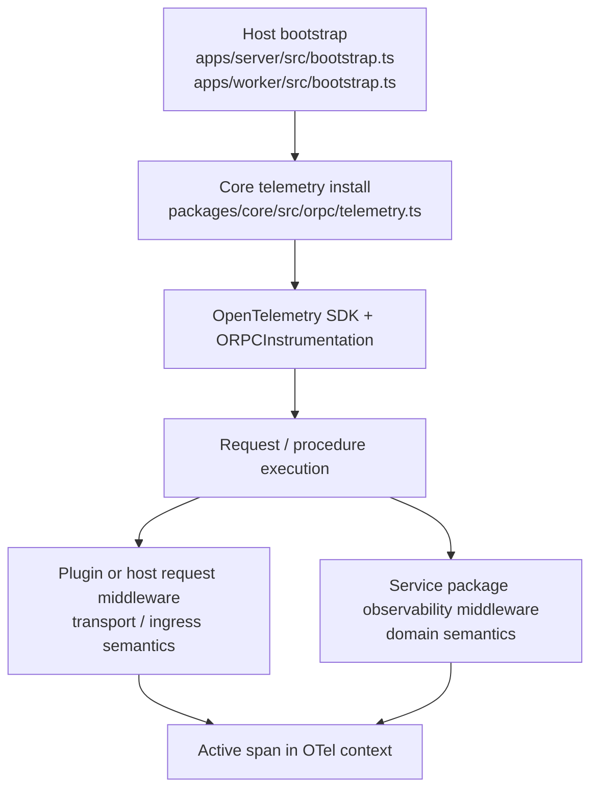

# Telemetry Design

Role: canonical telemetry architecture for oRPC + OpenTelemetry

## Status

This document specifies the target telemetry model for domain packages built on
the local oRPC stack.

It defines:

- where OpenTelemetry is bootstrapped
- how oRPC instrumentation participates
- how telemetry context reaches service packages and plugins
- what service packages and plugins are allowed to own
- which seams remain host-owned

This document is telemetry-specific. It does not replace the broader
architecture captured in `DECISIONS.md`, `guidance.md`, `examples.md`, and
`DESIGN.md`.

## Core Model

Telemetry is a host-owned runtime capability built from:

- host/runtime OpenTelemetry SDK bootstrap
- oRPC instrumentation registration
- OpenTelemetry active-context propagation

Service packages and plugins do not instantiate the OpenTelemetry SDK. They
consume the active span created by the host-owned runtime.

The canonical flow is:

```text
host bootstrap
  -> install OpenTelemetry SDK once
  -> register oRPC instrumentation
  -> request/procedure execution activates spans
  -> service/plugin code reads the active span from OpenTelemetry context
```

## End-To-End Wiring Snapshot



Read this diagram in two directions:

- **bootstrap direction**: host/runtime installs telemetry once
- **execution direction**: middleware and package code consume the active span
  during request/procedure execution

## Three-Layer Model

Telemetry in this system is split across three layers.

### 1. Host bootstrap layer

Lives in host/runtime bootstrap and core telemetry integration.

Responsibilities:

- install the OpenTelemetry SDK once per host/runtime
- register `ORPCInstrumentation` and other host-wide instrumentations
- configure exporters, resources, propagators, and sampling
- own lifecycle and shutdown

Canonical files:

- `packages/core/src/orpc/telemetry.ts`
- `apps/server/src/bootstrap.ts`
- future host example: `apps/worker/src/bootstrap.ts`

### 2. Plugin/host request middleware layer

Lives in host/plugin request-routing code, not in service packages.

Responsibilities:

- ingress/egress instrumentation
- request-level or transport-level attributes
- plugin-specific API/request telemetry that sits above any one composed
  service package

Canonical files:

- host route registration and plugin mount surfaces such as
  `apps/server/src/rawr.ts`
- future plugin/host request middleware surfaces

### 3. Service-package observability semantics layer

Lives in service-package middleware and package-local observability helpers.

Responsibilities:

- add package-specific attributes/events/log enrichment
- reflect domain semantics into the active span
- remain independent of SDK bootstrap and host request middleware

Canonical files:

- `services/example-todo/src/orpc/middleware/observability/*`
- `services/example-todo/src/service/middleware/observability.ts`

These layers are intentionally different:

- host bootstrap owns telemetry infrastructure
- plugin/host request middleware owns request and ingress concerns
- service packages own domain observability semantics

## Named Concepts

### Host/runtime telemetry bootstrap

Each host/runtime initializes its own OpenTelemetry SDK once.

This is the host-owned lifecycle seam.

Responsibilities:

- create and start the OpenTelemetry SDK
- configure exporters, resources, propagators, and sampling
- register shared instrumentations
- own shutdown lifecycle

Canonical files:

- `packages/core/src/orpc/telemetry.ts`
- `apps/server/src/bootstrap.ts`
- future host example: `apps/worker/src/bootstrap.ts`

### Core telemetry integration module

The core telemetry integration module is the canonical hookup point for:

- `NodeSDK`
- `ORPCInstrumentation`
- shared runtime instrumentation registration
- host-level telemetry options

Canonical file:

- `packages/core/src/orpc/telemetry.ts`

### oRPC instrumentation

oRPC instrumentation creates and activates spans during request/procedure
execution.

It is registered by the host bootstrap through the core telemetry integration
module.

It is not a service-package concern.

### OpenTelemetry context propagation

Service and plugin code read the active span from OpenTelemetry context.

The active span is not passed through service package dependency bags.

Canonical access shape:

```ts
import { trace } from "@opentelemetry/api";

const span = trace.getActiveSpan();
span?.addEvent("todo.task.create");
```

Optional tiny helper:

- `packages/core/src/orpc/active-span.ts`

Example helper shape:

```ts
import { trace } from "@opentelemetry/api";

export function getActiveTelemetrySpan() {
  return trace.getActiveSpan();
}
```

### What is automatic vs explicit

Explicit wiring:

- host bootstrap calls `installRawrOrpcTelemetry(...)`
- core telemetry integration registers `ORPCInstrumentation`
- service/plugin middleware authors span attributes/events intentionally

Automatic/runtime behavior after bootstrap:

- OpenTelemetry context propagation
- active span availability during instrumented execution
- oRPC span activation during request/procedure execution

Service packages should rely on the active span only after host bootstrap is in
place.

### Service package observability semantics

Service packages own observability semantics, not telemetry bootstrap.

Responsibilities:

- add service/package-specific span attributes
- add service/package-specific events
- emit service/package-specific log fields derived from the active span

Canonical files:

- `services/example-todo/src/orpc/middleware/observability/*`
- `services/example-todo/src/service/middleware/observability.ts`

## In-Package Observability Layering

Inside a service package, telemetry/observability normally layers like this:

1. **Framework baseline observability**
   - owned by the local oRPC kit seam
   - wraps every procedure execution
   - emits generic runtime attributes/events/log fields
   - should consume the active span from OTel runtime context

2. **Required service-wide observability**
   - owned by the service package
   - attached once at the package-wide assembly seam
   - adds service-global semantics the framework baseline cannot infer on its own

3. **Additive module-level observability**
   - owned by each module as needed
   - adds module-local attributes/events/log enrichment
   - typically attached in `modules/<name>/module.ts`

4. **Procedure handler code**
   - normally focuses on business logic
   - may emit ordinary structured logs
   - should not usually manipulate OpenTelemetry directly

The normal execution picture is:

```text
framework baseline
  -> required service-wide observability
  -> additive module observability
  -> handler business logic
```

Example surfaces in `example-todo`:

- framework baseline:
  - `services/example-todo/src/orpc/middleware/observability/index.ts`
- required service-wide observability:
  - `services/example-todo/src/service/middleware/observability.ts`
- additive module observability:
  - `services/example-todo/src/service/modules/tags/middleware.ts`
- handler business logic:
  - `services/example-todo/src/service/modules/tags/router.ts`

### What handlers usually do

Handler code should usually rely on the surrounding observability layers rather
than touching OpenTelemetry directly.

The normal handler behavior is:

- do business logic
- call repositories/services
- emit ordinary structured logs when useful

The normal handler behavior is **not**:

- fetch the active span
- add generic start/success/error events
- duplicate module/service observability middleware behavior

## Domain-Moment Telemetry

A **domain moment** is a specific business event inside a procedure that cannot
be expressed cleanly as framework, service-wide, or module-wide middleware.

This is rare. Most observability needs are better expressed in middleware
because they apply:

- to every procedure
- to every procedure in a service
- or to every procedure in a module

Use direct procedure-level telemetry only when the event is:

- tightly coupled to a specific branch of business logic
- important enough to deserve span-level visibility
- not a generic lifecycle concern already covered by middleware

Concrete `example-todo`-style example:

- a `tasks.create` procedure successfully creates the task but then detects that
  requested tags were partially unavailable and falls back to creating the task
  without some optional tag associations
- that fallback is a meaningful domain event
- it is not a generic start/success/error lifecycle event
- it may deserve a specific span event such as
  `todo.tasks.partial_tag_resolution`

That kind of event belongs to the **domain service package**, not to the host,
because it describes package/domain behavior rather than transport or ingress
behavior.

It is still the exception rather than the norm because:

- most procedures do not have uniquely meaningful sub-events
- generic runtime visibility is already supplied by the surrounding layers
- putting too much span logic into handlers makes business code noisy and
  duplicates the middleware model

### Plugin/host request and network instrumentation

Plugin and host request/network middleware may author their own telemetry
behavior outside service packages.

Responsibilities:

- ingress/egress spans
- request attributes
- plugin-specific network instrumentation

This remains outside service package boundaries.

## Single-Host Model

In the single-host model, one host/runtime initializes OpenTelemetry once and
all mounted plugins and service packages run within that runtime.

Example:

```text
apps/server bootstrap
  -> installRawrOrpcTelemetry(...)
  -> register routes and mount plugins
  -> oRPC instrumentation activates spans during execution
  -> service/plugin code reads the active span
```

The downstream type seen by packages remains stable:

- packages do not receive a telemetry dependency
- packages consume the active span that exists in the host runtime
- plugins mounted on the same host share the same host bootstrap but may add
  their own request-level telemetry on top

## Multi-Host Model

In the multi-host model, each host/runtime bootstraps OpenTelemetry
independently using the same core helper with host-specific options.

Example:

```text
apps/server bootstrap
  -> installRawrOrpcTelemetry({ serviceName: "@rawr/server", ... })

apps/worker bootstrap
  -> installRawrOrpcTelemetry({ serviceName: "@rawr/worker", ... })
```

Host-specific differences belong in host bootstrap options:

- `serviceName`
- `environment`
- `serviceVersion`
- exporter choice
- resource attributes
- propagators
- sampling

Downstream service packages and plugins remain type-stable:

- they continue to read the active span from runtime context
- they do not change shape when hosts change
- hosts vary by bootstrap configuration, not by package boundary shape

## Boundaries

### What happens

- hosts bootstrap OpenTelemetry
- oRPC instrumentation is registered at host bootstrap
- service/plugin code consumes active-span context
- service packages add telemetry semantics
- plugin/host middleware adds ingress/network telemetry semantics

### What does not happen

- the OpenTelemetry SDK is not instantiated inside service packages
- telemetry is not modeled as a service-package dependency
- telemetry does not travel through service package boundaries as
  `BaseDeps.telemetry`
- plugin call sites do not need to import and pass telemetry clients by
  default
- service packages do not own ingress/request middleware telemetry for the host
  or plugin shell

## Wiring Points

### Host/runtime layer

Files:

- `packages/core/src/orpc/telemetry.ts`
- `apps/server/src/bootstrap.ts`
- future host example: `apps/worker/src/bootstrap.ts`

Responsibilities:

- install and start the OpenTelemetry SDK
- register `ORPCInstrumentation`
- configure exporter/resource/propagator state
- own lifecycle and shutdown

The host bootstrap is the single source of truth for telemetry infrastructure in
that runtime.

### Service package layer

Files:

- `services/example-todo/src/orpc/middleware/observability/*`
- `services/example-todo/src/service/middleware/observability.ts`

Responsibilities:

- read active span from OpenTelemetry context
- attach service/package attributes and events
- remain independent of SDK bootstrap

### Plugin layer

Files:

- host/plugin request middleware and route wiring

Responsibilities:

- plugin-specific ingress/request/network telemetry
- plugin-specific attributes or naming
- no host SDK bootstrap ownership
- no service-package dependency injection seam for telemetry

## Import Direction

Import direction is one-way:

- hosts may import the core telemetry bootstrap helper
- hosts and plugins may import OpenTelemetry runtime APIs where they own
  request/ingress instrumentation
- service packages may import:
  - OpenTelemetry API directly
  - or a tiny helper such as `packages/core/src/orpc/active-span.ts`
- service packages must not import host bootstraps
- service packages must not own SDK/provider/exporter setup

This keeps telemetry infrastructure centralized while allowing domain
instrumentation to remain local.

## Per-Package And Per-Plugin Configuration

Telemetry configuration splits by ownership:

### Host-owned configuration

Belongs in host bootstrap:

- exporter configuration
- resource attributes
- environment and service identity
- propagators
- sampling

### Plugin-owned telemetry semantics

Belongs in plugin or host/plugin middleware:

- ingress naming
- plugin request attributes
- plugin-specific network instrumentation

### Service-package observability semantics

Belongs in service/package middleware:

- service/package span attributes
- service/package events
- service/package log enrichment

Service packages are not 1:1 with plugins. A plugin may compose multiple
service packages into a higher-level API. That plugin may also own telemetry
concerns that do not belong to any one composed package.

For that reason, service packages should not own the host bootstrap seam.

## File-Structure Example

```text
packages/core/src/orpc/telemetry.ts
  host/runtime bootstrap helper and instrumentation registration

apps/server/src/bootstrap.ts
  installs OpenTelemetry for the server host

apps/worker/src/bootstrap.ts
  installs OpenTelemetry for a future worker host

apps/server/src/rawr.ts
  host/plugin request and route wiring

services/example-todo/src/orpc/middleware/observability/*
  package-level observability semantics

services/example-todo/src/service/middleware/observability.ts
  required service-wide observability behavior
```

## Instrumentation Scope And Realism

Telemetry stacks across the three layers:

- host bootstrap instrumentation creates the runtime foundation
- plugin/host request middleware can add request and transport semantics
- service packages can enrich spans with domain semantics

That stacking is intentional.

A plugin that composes multiple service packages should still be able to:

- own request/ingress telemetry once at the plugin/host layer
- call into multiple service packages
- let each service package contribute its own domain attributes/events

Service packages should not try to replace the plugin/host layer. They should
only enrich the execution already in progress.

## Testing Guidance

The telemetry model needs lightweight confidence, not a large telemetry test
project.

Test these:

- host bootstrap installs telemetry once and registers expected
  instrumentations
- host bootstrap happens before route/app/plugin wiring that depends on it
- package observability enriches an active span correctly when one exists
- package observability degrades safely when no active span exists

Do not over-test these:

- exporter internals
- OpenTelemetry library correctness
- end-to-end collector behavior in package tests

The minimal credible health-check strategy is:

1. host bootstrap tests in `packages/core` / host apps
2. package observability tests against an active span context
3. a small number of host/plugin integration tests where ingress/request
   telemetry ordering matters

## Implementation Note

Migration execution details, cleanup targets, sequencing constraints, and phase
gates live in `TELEMETRY_MIGRATION_IMPLEMENTATION_PLAN.md`.
