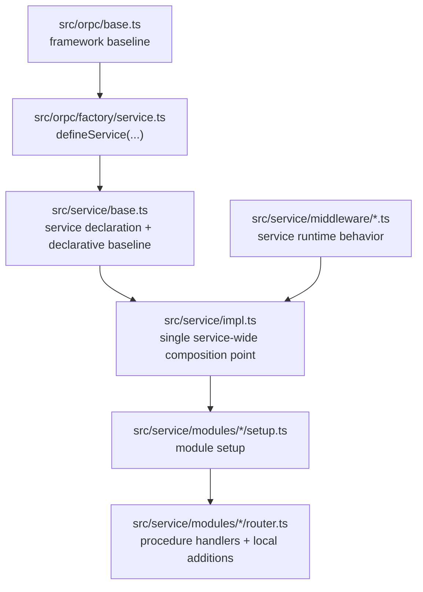

# Draft: Declarative Baseline vs Behavioral Middleware

## 1. Rationale and Design Choice

### Decision

Split service-wide baseline concerns into two categories:

- **Declarative baseline**
  - static service-owned declarations
  - no runtime branching
  - no context-dependent logic
  - safe to author in the service definition seam
- **Behavioral middleware**
  - runtime behavior over `context`, `procedure`, `path`, outcomes, errors, or events
  - real middleware logic
  - should live in `src/service/middleware/*`
  - should be attached once in `src/service/impl.ts`

### Mental model

The package should teach agents this topology directly:

- `src/orpc/*`
  - framework baseline
  - package-agnostic guarantees
  - things agents should not normally need to touch
- `src/service/base.ts`
  - service declaration
  - required static defaults and baseline declarations
  - the bound authoring surfaces exported to the rest of the package
- `src/service/impl.ts`
  - the single package-wide middleware composition point
  - the place where required service-wide runtime middleware is attached once
- `src/service/middleware/*`
  - service-authored runtime behavior
  - guards, runtime observability logic, runtime analytics logic, and similar cross-cutting behavior
- `src/service/modules/*`
  - bounded module setup and bounded module/procedure additions

This keeps the baseline guaranteed without hiding actual middleware behind a second abstraction layer.

### What “declarative baseline” means

Declarative baseline is service-owned information that should be present for every procedure but is not itself middleware behavior.

Examples:

- service metadata defaults
- policy event names
- static observability/analytics declarations, if they are truly constant
- any required service-wide identifiers or naming inputs that do not inspect runtime context

These belong in `src/service/base.ts` because they describe the service, not runtime control flow.

### What “behavioral middleware” means

Behavioral middleware is anything that needs to run during procedure execution or reason over runtime values.

Examples:

- read-only guards
- observability hooks that inspect `context`, `path`, or failures
- analytics payload logic that reads `context` or outcome
- any service-wide runtime branching or side effects

These should look like middleware, live in middleware files, and attach in `src/service/impl.ts`.

### Why this split is the clearest scalable path

This scales at both `N=1` and `N→∞` because it keeps ownership aligned with semantics:

- the SDK owns universal baseline behavior
- the service definition owns required static declarations
- middleware files own runtime behavior
- `impl.ts` remains the one obvious service-wide attachment point

It also preserves the ORPC-native model:

- middleware is still middleware
- contract/metadata remains declarative
- context-driven logic is not disguised as configuration

### Practical implications

- Agents do **not** need to remember to manually attach required service middleware all over the package.
  - required service-wide middleware is attached exactly once in `src/service/impl.ts`
- Agents can still tell where to make changes:
  - change declarations in `src/service/base.ts`
  - change service-wide behavior in `src/service/middleware/*`
  - change bounded additions in module `setup.ts` / `router.ts`
- The service definition file can stay smaller and more semantic.
  - it stops being a place where large callback logic accumulates
- The middleware layer becomes more honest.
  - if it reads runtime context and changes behavior, it is middleware

### Alternatives not chosen

#### A. Wrapper that injects service context into “baseline middleware”

Not chosen.

Why:

- it creates a second authoring model on top of ORPC
- it obscures where middleware is actually attached
- it teaches agents a local wrapper abstraction instead of the real ORPC flow
- it looks convenient at small scale but becomes a learning tax as services multiply

#### B. Keep dynamic observability/analytics hooks inline in `src/service/base.ts`

Not chosen.

Why:

- it mixes static declaration with runtime behavior
- it makes the service definition file heavier and semantically muddier
- it is the main reason `base.ts` currently feels too callback-heavy
- it weakens the “one place for service declaration, one place for middleware composition” story

#### C. Require every module or procedure author to remember baseline middleware manually

Not chosen.

Why:

- it is not robust for scaffolding
- it creates repetitive wiring pressure
- it makes baseline guarantees depend on author memory instead of topology

#### D. Reintroduce service-kit or other magical service wrappers

Not chosen.

Why:

- that path has already been explored and rejected
- it increases abstraction without improving the actual ORPC semantics
- it hides the attachment and execution story instead of clarifying it

## 2. Draft Design

### Target shape



### 2.1 Declarative baseline design

The SDK should keep a reserved declarative baseline slot in `defineService(...)`, but that slot should be explicitly limited to service-owned declarations, not runtime callbacks.

Target direction:

```ts
const service = defineService<...>({
  metadataDefaults: {
    idempotent: true,
    domain: "todo",
    audience: "internal",
    audit: "basic",
    entity: "service",
  },
  baseline: {
    policy: {
      events: {
        readOnlyRejected: "todo.policy.read_only_rejected",
        assignmentLimitReached: "todo.policy.assignment_limit_reached",
      },
    },
    observability: {
      // declarative only
    },
    analytics: {
      // declarative only
    },
  },
});
```

Concrete rule for that slot:

- `baseline.policy`
  - remains first-class
  - it already has clear declarative meaning
- `baseline.observability`
  - should contain only static declaration inputs, or be empty/omitted if metadata already gives enough baseline naming
  - should not accept `context` callbacks or outcome hooks
- `baseline.analytics`
  - should contain only static declaration inputs, or be empty/omitted if metadata already gives enough baseline naming
  - should not accept runtime payload callbacks

Current code evidence:

- [`src/orpc/middleware/policy.ts`](/Users/mateicanavra/Documents/.nosync/DEV/worktrees/wt-codex-example-todo-unified-golden/packages/example-todo/src/orpc/middleware/policy.ts) is already purely declarative.
- [`src/orpc/middleware/observability.ts`](/Users/mateicanavra/Documents/.nosync/DEV/worktrees/wt-codex-example-todo-unified-golden/packages/example-todo/src/orpc/middleware/observability.ts) currently mixes:
  - stable naming/derivation
  - runtime field callbacks
  - runtime hooks
- [`src/orpc/middleware/analytics.ts`](/Users/mateicanavra/Documents/.nosync/DEV/worktrees/wt-codex-example-todo-unified-golden/packages/example-todo/src/orpc/middleware/analytics.ts) currently mixes:
  - canonical baseline event emission
  - service callback payload logic

Draft adjustment:

- keep the automatic framework/service baseline shell
- narrow the declarative service slot to actual declaration
- move service runtime logic out of the service profile objects

### 2.2 `base.ts` under this model

`src/service/base.ts` should become the service declaration file, not the service runtime behavior file.

It should contain:

1. Support types
- `Clock`
- whatever other service support types are genuinely part of the service declaration seam

2. Service declaration types
- likely the final semantic shape we are still deciding
- whatever we choose, this file should show the service’s declared context/metadata categories clearly

3. Metadata defaults
- the concrete default metadata values

4. Declarative baseline
- policy event names
- any truly static observability/analytics declaration inputs
- no runtime callbacks

5. Bound exports
- `Service`
- `ocBase`
- `createServiceMiddleware`
- `createServiceObservabilityMiddleware`
- `createServiceAnalyticsMiddleware`
- `createServiceProvider`
- `createServiceImplementer`

It should **not** contain:

- large `onStarted` / `onFailed` / `payload` callback logic
- service-wide runtime guards
- service-wide behavioral middleware implementations

That logic should move to `src/service/middleware/*`.

### 2.3 Middleware placement and composition

The current single composition choke point in [`src/service/impl.ts`](/Users/mateicanavra/Documents/.nosync/DEV/worktrees/wt-codex-example-todo-unified-golden/packages/example-todo/src/service/impl.ts) is already the right place to attach required service-wide runtime middleware.

Target composition story:

1. SDK/framework baseline auto-attaches in the base implementer path
2. service declarative baseline auto-attaches through `createServiceImplementer(...)`
3. extra service-wide runtime behavior attaches in `src/service/impl.ts`
4. module/procedure-local additions attach lower in module `setup.ts` / `router.ts`

Draft `impl.ts` shape:

```ts
import { contract } from "./contract";
import { createServiceImplementer } from "./base";
import { sqlProvider } from "../orpc-sdk";
import { readOnlyMode } from "./middleware/read-only-mode";
import { serviceObservability } from "./middleware/observability";
import { serviceAnalytics } from "./middleware/analytics";

export const impl = createServiceImplementer(contract)
  .use(sqlProvider)
  .use(readOnlyMode)
  .use(serviceObservability)
  .use(serviceAnalytics);
```

Key property:

- required service-wide runtime middleware is still guaranteed
- but now it is guaranteed by the one official service-wide composition point, not buried inside a declarative profile callback object

### 2.4 Service observability middleware design

Service observability that inspects runtime context should be authored as middleware, not as part of the declarative service manifest.

Proposed file:

- `src/service/middleware/observability.ts`

Shape:

```ts
import { createServiceObservabilityMiddleware } from "../base";

export const serviceObservability = createServiceObservabilityMiddleware({
  onStarted: ({ span, context, pathLabel }) => {
    // service-wide runtime logic
  },
  onFailed: ({ span, context, pathLabel, error }) => {
    // service-wide runtime logic
  },
});
```

This should use the **same helper family** module/procedure authors already use.

Reason:

- the semantic difference is attach point, not helper kind
- service-wide runtime observability is still just additive observability middleware
- no new special service-only runtime wrapper is needed

### 2.5 Service analytics middleware design

Service analytics that derives runtime payload fields should follow the same rule.

Proposed file:

- `src/service/middleware/analytics.ts`

Shape:

```ts
import { createServiceAnalyticsMiddleware } from "../base";

export const serviceAnalytics = createServiceAnalyticsMiddleware({
  payload: ({ context, pathLabel, outcome }) => ({
    workspaceId: context.scope.workspaceId,
    traceId: context.invocation.traceId,
    path: pathLabel,
    outcome,
  }),
});
```

Again, same helper family, different attach point.

### 2.6 How service-level and module-level observability work together

Use one additive model at two levels:

- **service-level runtime observability**
  - attached once in `src/service/impl.ts`
  - applies to the whole service
  - owns service-wide runtime additions
- **module/procedure-level observability**
  - attached lower in module `setup.ts` or `router.ts`
  - contributes bounded local additions

This already matches the existing additive middleware model in files like:

- [`src/service/modules/assignments/router.ts`](/Users/mateicanavra/Documents/.nosync/DEV/worktrees/wt-codex-example-todo-unified-golden/packages/example-todo/src/service/modules/assignments/router.ts)

That means the architecture stays fractal:

- one helper family
- one additive model
- different attachment levels for different scopes

### 2.7 Should service and module observability share the same helper?

Yes.

Recommendation:

- keep `createServiceObservabilityMiddleware(...)`
- keep `createServiceAnalyticsMiddleware(...)`
- use them for:
  - service-wide runtime middleware in `src/service/middleware/*`
  - module-level additions in module `setup.ts`
  - procedure-level additions in module `router.ts`

Do **not** introduce a second helper just for service-level runtime observability unless a real type-shape mismatch forces it.

Current evidence suggests we do not need a new helper:

- the existing service-level helper already produces additive middleware
- the root difference is only where it is attached

### 2.8 SDK consequences

Likely SDK adjustments under this draft:

1. Narrow service declarative profile types
- remove or de-emphasize runtime callback slots from:
  - `ServiceObservabilityProfile`
  - `ServiceAnalyticsProfile`
- keep them focused on static declaration, if any remains necessary at all

2. Keep automatic baseline shell behavior
- framework baseline observability remains in [`src/orpc/base.ts`](/Users/mateicanavra/Documents/.nosync/DEV/worktrees/wt-codex-example-todo-unified-golden/packages/example-todo/src/orpc/base.ts)
- service baseline wiring still happens through `createServiceImplementer(...)`

3. Keep additive middleware builders unchanged if possible
- `createServiceObservabilityMiddleware(...)`
- `createServiceAnalyticsMiddleware(...)`
- `createServiceMiddleware(...)`
- `createServiceProvider(...)`

This is important because it means the refactor mostly changes placement and semantics, not the whole authoring surface.

### 2.9 Draft file layout

Target service surface:

- `src/service/base.ts`
  - service declaration
  - metadata defaults
  - declarative baseline
  - bound exports
- `src/service/impl.ts`
  - root implementer
  - one package-wide `.use(...)` stack
- `src/service/middleware/read-only-mode.ts`
  - zero-config service guard
- `src/service/middleware/observability.ts`
  - service-wide runtime observability additions
- `src/service/middleware/analytics.ts`
  - service-wide runtime analytics additions
- `src/service/modules/*/setup.ts`
  - module setup and module-wide providers/additions
- `src/service/modules/*/router.ts`
  - procedure handlers and procedure-local additions

### 2.10 What this draft does not decide yet

This draft is scoped to the baseline split only. It does **not** finalize:

- the final semantic shape of the service declaration categories in `base.ts`
- how far to fan back out `deps`, `scope`, and `config`
- whether service declaration types should be more independently authored again

Those remain the next decision thread after this baseline split is accepted.

## 3. Open questions and risks

### Open questions

- Do `baseline.observability` and `baseline.analytics` need explicit declarative slots at all, or should policy remain the only first-class declarative concern beyond metadata defaults until a real static need appears?
- If declarative observability/analytics remain, what static inputs are actually worth keeping there without reintroducing callback-heavy profiles?
- Do we want scaffolded service middleware files by default even if some services leave them empty?

### Risks

- If the declarative observability/analytics slots stay too rich, the split will collapse and runtime logic will drift back into `base.ts`.
- If the service middleware files are not scaffolded or referenced clearly, agents may still put runtime logic back into the service definition file.
- If the order in `src/service/impl.ts` is not documented carefully, service-wide runtime middleware may accidentally run in an unintended order relative to framework baseline or providers.

### Current recommendation

Adopt this split and then make the service-definition decision on top of it:

- `base.ts` for declaration
- `impl.ts` for guaranteed service-wide composition
- `service/middleware/*` for service runtime behavior

That is the cleanest ORPC-native baseline story currently visible in the codebase.
