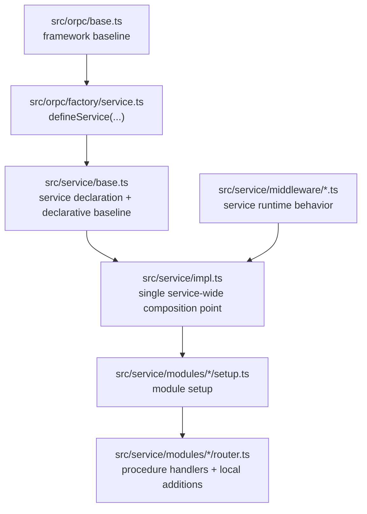

# Draft: Declarative Baseline vs Behavioral Middleware

## 1. Rationale and Design Choice

### Decision

Split service-wide baseline concerns into two categories:

- **Declarative baseline**
  - static service-owned declarations
  - no runtime branching
  - no context-dependent logic
  - safe to author in the service definition seam
- **Behavioral middleware**
  - runtime behavior over `context`, `procedure`, `path`, outcomes, errors, or events
  - real middleware logic
  - should live in `src/service/middleware/*`
  - should be attached once in `src/service/impl.ts`

### Mental model

The package should teach agents this topology directly:

- `src/orpc/*`
  - framework baseline
  - package-agnostic guarantees
  - things agents should not normally need to touch
- `src/service/base.ts`
  - service declaration
  - required static defaults and baseline declarations
  - the bound authoring surfaces exported to the rest of the package
- `src/service/impl.ts`
  - the single package-wide middleware composition point
  - the place where required service-wide runtime middleware is attached once
- `src/service/middleware/*`
  - service-authored runtime behavior
  - guards, runtime observability logic, runtime analytics logic, and similar cross-cutting behavior
- `src/service/modules/*`
  - bounded module setup and bounded module/procedure additions

This keeps the baseline guaranteed without hiding actual middleware behind a second abstraction layer.

### Two-layer telemetry contract

Service-wide observability and analytics are not one undifferentiated thing. Under this draft they have two layers:

- **Layer A: auto-attached baseline shell**
  - attached by `createServiceImplementer(...)`
  - owns canonical observability lifecycle wiring
  - owns canonical analytics emission
  - is not manually recreated in `src/service/impl.ts`
- **Layer B: explicit service-wide runtime additions**
  - attached once in `src/service/impl.ts`
  - owns extra service-wide runtime hooks, guards, and analytics payload contributors
  - must not recreate the baseline shell or emit a second canonical analytics event

This distinction matters because “service-wide” by itself is not enough to describe ownership. The baseline shell is automatic; additions are explicit.

### Enforcement direction

If the goal is to make required service-wide middleware impossible to forget, the strongest direction is:

- keep middleware behavior implemented in standalone files
- declare required service-wide middleware in the service definition seam
- auto-attach those declared middleware values inside `createServiceImplementer(...)`

That gives us:

- **behavior lives in middleware files**
- **required attachment lives in the service definition**
- **runtime composition still happens through the implementer seam**

This is stronger than scaffolding conventions or lint rules because the service definition becomes the registration point for required service-wide middleware.

### What “declarative baseline” means

Declarative baseline is service-owned information that should be present for every procedure but is not itself middleware behavior.

Examples:

- service metadata defaults
- policy event names
- narrow observability/analytics declarations that are truly constant
- any required service-wide identifiers or naming inputs that do not inspect runtime context

These belong in `src/service/base.ts` because they describe the service, not runtime control flow.

### What “behavioral middleware” means

Behavioral middleware is anything that needs to run during procedure execution or reason over runtime values.

Examples:

- read-only guards
- observability hooks that inspect `context`, `path`, or failures
- analytics payload logic that reads `context` or outcome
- any service-wide runtime branching or side effects

These should look like middleware, live in middleware files, and attach in `src/service/impl.ts`.

### What declarative observability/analytics can still mean

Observability and analytics are **not** “non-declarative by nature.” The important point is narrower:

- their rich runtime behavior does not belong in the service definition seam
- but they may still have narrow declarative inputs

Common declarative candidates that may exist at the service-definition level:

- service-wide telemetry naming or namespace overrides that cannot be derived from metadata defaults alone
- telemetry classification or redaction rules
- stable service-wide event catalogs or reserved field names
- explicit enablement/level choices when those are part of package semantics rather than deploy-time ops configuration

What should usually be derivable automatically:

- service/domain identity
- audience
- entity defaults
- path
- outcome
- stable context-lane values such as workspace or invocation trace IDs

So the right conclusion is not “observability/analytics have no declarative aspects.” It is:

- keep a narrow declarative slot available if a real static need exists
- do not use that slot for runtime hooks or context-driven branching

### Why this split is the clearest scalable path

This scales at both `N=1` and `N→∞` because it keeps ownership aligned with semantics:

- the SDK owns universal baseline behavior
- the service definition owns required static declarations
- middleware files own runtime behavior
- `impl.ts` remains the one obvious service-wide attachment point

It also preserves the ORPC-native model:

- middleware is still middleware
- contract/metadata remains declarative
- context-driven logic is not disguised as configuration

This also matches oRPC’s own framing:

- middleware is where you intercept execution, inject/guard context, and hook lifecycle behavior
- initial context and execution context are distinct concerns
- deduplication is an optimization for repeated identical middleware, not the primary architecture primitive

### Practical implications

- Agents do **not** need to remember to manually attach required service middleware all over the package.
  - the baseline shell remains automatic in `createServiceImplementer(...)`
  - explicit service-wide additions are attached exactly once in `src/service/impl.ts`
- Agents can still tell where to make changes:
  - change declarations in `src/service/base.ts`
  - change service-wide behavior in `src/service/middleware/*`
  - change bounded additions in module `setup.ts` / `router.ts`
- Agents do not have to remember to attach fundamental service-wide telemetry by hand if those middleware are registered as required in the service definition.
- The service definition file can stay smaller and more semantic.
  - it stops being a place where large callback logic accumulates
- The middleware layer becomes more honest.
  - if it reads runtime context and changes behavior, it is middleware

### Alternatives not chosen

#### A. Wrapper that injects service context into “baseline middleware”

Not chosen.

Why:

- it creates a second authoring model on top of ORPC
- it obscures where middleware is actually attached
- it teaches agents a local wrapper abstraction instead of the real ORPC flow
- it looks convenient at small scale but becomes a learning tax as services multiply

#### B. Keep dynamic observability/analytics hooks inline in `src/service/base.ts`

Not chosen.

Why:

- it mixes static declaration with runtime behavior
- it makes the service definition file heavier and semantically muddier
- it is the main reason `base.ts` currently feels too callback-heavy
- it weakens the “one place for service declaration, one place for middleware composition” story
- it makes the service definition seam carry both declaration and lifecycle behavior, which is not the right ORPC shape

#### C. Require every module or procedure author to remember baseline middleware manually

Not chosen.

Why:

- it is not robust for scaffolding
- it creates repetitive wiring pressure
- it makes baseline guarantees depend on author memory instead of topology

#### C.1 Enforce attachment through hidden context keys or ghost requirements

Not chosen.

Why:

- it abuses context requirements to prove middleware attachment
- it introduces fake runtime/context state just to satisfy type checks
- it couples unrelated middleware through invisible sentinel keys
- it is harder to explain, debug, and scale than explicit middleware registration
- it can prove that “some middleware set a marker,” but not that the right baseline behavior is registered in the right place

#### D. Reintroduce service-kit or other magical service wrappers

Not chosen.

Why:

- that path has already been explored and rejected
- it increases abstraction without improving the actual ORPC semantics
- it hides the attachment and execution story instead of clarifying it

## 2. Draft Design

### Target shape



### 2.1 Declarative baseline design

The SDK should keep a reserved declarative baseline slot in `defineService(...)`, but that slot should be explicitly limited to service-owned declarations, not runtime callbacks.

Target direction:

```ts
const service = defineService<...>({
  metadataDefaults: {
    idempotent: true,
    domain: "todo",
    audience: "internal",
    audit: "basic",
    entity: "service",
  },
  baseline: {
    policy: {
      events: {
        readOnlyRejected: "todo.policy.read_only_rejected",
        assignmentLimitReached: "todo.policy.assignment_limit_reached",
      },
    },
    observability: {
      // declarative only
    },
    analytics: {
      // declarative only
    },
  },
});
```

Concrete rule for that slot:

- `baseline.policy`
  - remains first-class
  - it already has clear declarative meaning
- `baseline.observability`
  - should be optional and narrowly declarative
  - should usually be omitted unless there is a real static service-wide need
  - should not accept `context` callbacks or outcome hooks
- `baseline.analytics`
  - should be optional and narrowly declarative
  - should usually be omitted unless there is a real static service-wide need
  - should not accept runtime payload callbacks

Current code evidence:

- [`src/orpc/middleware/policy.ts`](/Users/mateicanavra/Documents/.nosync/DEV/worktrees/wt-codex-example-todo-unified-golden/packages/example-todo/src/orpc/middleware/policy.ts) is already purely declarative.
- [`src/orpc/middleware/observability.ts`](/Users/mateicanavra/Documents/.nosync/DEV/worktrees/wt-codex-example-todo-unified-golden/packages/example-todo/src/orpc/middleware/observability.ts) currently mixes:
  - stable naming/derivation
  - runtime field callbacks
  - runtime hooks
- [`src/orpc/middleware/analytics.ts`](/Users/mateicanavra/Documents/.nosync/DEV/worktrees/wt-codex-example-todo-unified-golden/packages/example-todo/src/orpc/middleware/analytics.ts) currently mixes:
  - canonical baseline event emission
  - service callback payload logic

Draft adjustment:

- keep the automatic framework/service baseline shell
- narrow the declarative service slot to actual declaration
- do not treat `policy`, `observability`, and `analytics` as false declarative peers
- move service runtime logic out of the service profile objects
- use the service definition seam as the registration point for required service-wide middleware references

Current recommendation:

- `baseline.policy` is the only clearly justified first-class declarative concern today beyond `metadataDefaults`
- `baseline.observability` and `baseline.analytics` should not stay rich callback surfaces
- if they remain at all, they should be optional and narrowly declarative
- examples of acceptable future declarative inputs include:
  - redaction/classification rules
  - telemetry naming overrides that cannot be derived automatically
  - explicit stable event catalogs

### 2.1.1 Current state is still hybrid

The current codebase has not made this cut yet.

- [`src/service/base.ts`](/Users/mateicanavra/Documents/.nosync/DEV/worktrees/wt-codex-example-todo-unified-golden/packages/example-todo/src/service/base.ts) still contains runtime observability callbacks
- [`src/orpc/factory/service.ts`](/Users/mateicanavra/Documents/.nosync/DEV/worktrees/wt-codex-example-todo-unified-golden/packages/example-todo/src/orpc/factory/service.ts) still requires and auto-attaches service observability and analytics baseline profiles

That hybrid state is useful context for migration, but it should not be treated as the target model.

### 2.2 `base.ts` under this model

`src/service/base.ts` should become the service declaration file, not the service runtime behavior file.

It should contain:

1. Support types
- `Clock`
- whatever other service support types are genuinely part of the service declaration seam

2. Service declaration types
- likely the final semantic shape we are still deciding
- whatever we choose, this file should show the service’s declared context/metadata categories clearly

3. Metadata defaults
- the concrete default metadata values

4. Declarative baseline
- policy event names
- any truly static observability/analytics declaration inputs
- no runtime callbacks

5. Required middleware registration
- import required service-wide middleware values from `src/service/middleware/*`
- register them in the service definition
- do not inline their behavior here

6. Bound exports
- `Service`
- `ocBase`
- `createServiceMiddleware`
- `createServiceObservabilityMiddleware`
- `createServiceAnalyticsMiddleware`
- `createServiceProvider`
- `createServiceImplementer`

It should **not** contain:

- large `onStarted` / `onFailed` / `payload` callback logic
- service-wide runtime guards
- service-wide behavioral middleware implementations

That logic should move to `src/service/middleware/*`.

Concrete pattern:

```ts
import { observability } from "./middleware/observability";
import { analytics } from "./middleware/analytics";

const service = defineService<...>({
  metadataDefaults: { ... },
  baseline: {
    policy: { ... },
  },
  requiredMiddleware: {
    observability,
    analytics,
  },
});
```

Important distinction:

- `base.ts` may register required middleware
- `base.ts` should not contain their runtime hook logic

### 2.2.1 What “policy” means

`policy` is not the same thing as logging, analytics, or transport errors.

Short version:

- **policy** = the declarative vocabulary for service-wide rules and decisions
- **errors** = caller-facing boundary outcomes
- **observability** = operational traces/logs/events about execution
- **analytics** = structured product/domain signals

Why keep `policy` separate:

- a policy rule can surface as an error, but it is not identical to the error
- the same policy decision may need to be observed consistently across logs, traces, and analytics
- keeping policy names declarative gives the service one stable place to define the rule vocabulary

Example:

- `readOnlyRejected` is not “just logging”
- it names a service-level rule decision that can drive:
  - a caller-facing error
  - an observability event
  - an analytics signal

So `policy` is its own declarative category that other channels can consume.

### 2.3 Middleware placement and composition

The current single composition choke point in [`src/service/impl.ts`](/Users/mateicanavra/Documents/.nosync/DEV/worktrees/wt-codex-example-todo-unified-golden/packages/example-todo/src/service/impl.ts) is already the right place to attach required service-wide runtime middleware.

Target composition story:

1. SDK/framework baseline auto-attaches in the base implementer path
2. service baseline shell auto-attaches through `createServiceImplementer(...)`
3. service-declared required middleware auto-attach through `createServiceImplementer(...)`
4. explicit additional service-wide guards, providers, and runtime additions attach in `src/service/impl.ts`
5. module/procedure-local additions attach lower in module `setup.ts` / `router.ts`

Canonical `impl.ts` phase order:

1. automatic framework baseline shell
2. automatic service baseline shell
3. service-declared required middleware
4. service-wide providers and guards
5. service-wide optional/additional runtime middleware
6. module setup and lower-level additions

Draft `impl.ts` shape:

```ts
import { contract } from "./contract";
import { createServiceImplementer } from "./base";
import { sqlProvider } from "../orpc-sdk";
import { readOnlyMode } from "./middleware/read-only-mode";

export const impl = createServiceImplementer(contract)
  .use(sqlProvider)
  .use(readOnlyMode)
```

Key property:

- the baseline shell remains automatic
- required service-wide middleware can also be automatic once registered in the service definition
- explicit additional service-wide additions live in the one official service-wide composition point
- runtime logic is no longer buried inside declarative profile callback objects

### 2.4 Telemetry ownership split

To keep this model teachable, the ownership split must be explicit:

- **Auto baseline shell**
  - owns canonical observability lifecycle wiring
  - owns canonical `orpc.procedure` analytics emission
  - owns policy-event threading as long as that plumbing still lives in the baseline path
- **Explicit service-wide additions**
  - own additional service-wide runtime observability hooks
  - own service-wide analytics payload contributions
  - do not emit a second canonical analytics event
  - do not recreate the baseline shell

If this split is not made explicit, agents will misread `base.ts` and `impl.ts` as competing service-wide seams.

Recommended interpretation under this draft:

- the default service `observability` and `analytics` middleware files are expected to be registered as required service-wide middleware
- `impl.ts` stays reserved for extra service-wide concerns beyond that required baseline set

### 2.5 Service observability middleware design

Service observability that inspects runtime context should be authored as middleware, not as part of the declarative service manifest.

Proposed file:

- `src/service/middleware/observability.ts`

Shape:

```ts
import { createServiceObservabilityMiddleware } from "../base";

export const observability = createServiceObservabilityMiddleware({
  onStarted: ({ span, context, pathLabel }) => {
    // service-wide runtime logic
  },
  onFailed: ({ span, context, pathLabel, error }) => {
    // service-wide runtime logic
  },
});
```

This should use the **same helper family** module/procedure authors already use where that helper is truly additive.

Reason:

- the semantic difference is attach point, not helper kind
- service-wide runtime observability should be additive observability middleware
- no new special service-only runtime wrapper is needed

Constraint:

- the current additive observability helper does **not** yet cover full parity with the current service baseline profile
- today’s baseline profile also carries structured log enrichment, event field enrichment, and policy-aware failure hooks

Safe near-term options:

1. keep the current baseline observability shell automatic and move only truly additive observability behavior into `service/middleware/observability.ts`
2. make a small SDK adjustment so additive observability can also contribute:
   - `logFields`
   - started/succeeded/failed event fields
   - policy-aware failure hooks

Until one of those is true, the draft should not claim that `createServiceObservabilityMiddleware(...)` fully replaces the current service baseline profile.

Naming rule:

- scaffold `src/service/middleware/observability.ts`
- export `observability`
- register `observability` as required middleware in `src/service/base.ts`

This is clearer than names like “service observability additions” because the file path already provides the scope.

### 2.6 Service analytics middleware design

Service analytics that derives runtime payload fields should follow the same rule.

Proposed file:

- `src/service/middleware/analytics.ts`

Shape:

```ts
import { createServiceAnalyticsMiddleware } from "../base";

export const analytics = createServiceAnalyticsMiddleware({
  payload: ({ context, pathLabel, outcome }) => ({
    workspaceId: context.scope.workspaceId,
    traceId: context.invocation.traceId,
    path: pathLabel,
    outcome,
  }),
});
```

This helper is contributor-only.

- it contributes payload fields
- it does **not** emit analytics by itself
- it depends on the automatic service baseline analytics emitter

So the service-level story is:

- canonical analytics emission remains in the auto baseline shell
- `src/service/middleware/analytics.ts` contributes service-wide runtime payload additions

Naming rule:

- scaffold `src/service/middleware/analytics.ts`
- export `analytics`
- register `analytics` as required middleware in `src/service/base.ts`

### 2.7 How service-level and module-level observability work together

Use one additive model at two levels:

- **service-level runtime observability**
  - attached once in `src/service/impl.ts`
  - applies to the whole service
  - owns service-wide runtime additions
- **module/procedure-level observability**
  - attached lower in module `setup.ts` or `router.ts`
  - contributes bounded local additions

This already matches the existing additive middleware model in files like:

- [`src/service/modules/assignments/router.ts`](/Users/mateicanavra/Documents/.nosync/DEV/worktrees/wt-codex-example-todo-unified-golden/packages/example-todo/src/service/modules/assignments/router.ts)

That means the architecture stays fractal:

- one helper family
- one additive model
- different attachment levels for different scopes

### 2.8 Should service and module observability share the same helper?

Mostly.

Recommendation:

- keep `createServiceObservabilityMiddleware(...)`
- keep `createServiceAnalyticsMiddleware(...)`
- use them for:
  - service-wide runtime middleware in `src/service/middleware/*`
- module-level additions in module `setup.ts`
- procedure-level additions in module `router.ts`

Do **not** introduce a second helper just for service-level runtime observability unless a real type-shape mismatch forces it.

Current evidence suggests we do not need a new helper:

- the existing service-level helper already produces additive middleware
- the root difference is only where it is attached

Important caveat:

- analytics shares this helper model cleanly today
- observability does **not** yet reach full parity with the current service baseline profile
- if full parity is required, either extend the additive observability helper or preserve the current baseline observability helper while moving profile constants out of `base.ts`

### 2.8.1 Why the service middleware order changed

Required service observability and analytics middleware should attach **before** service-wide providers and guards.

Reason:

- service-wide telemetry should wrap the whole downstream service pipeline
- that lets it observe provider work, guard failures, and handler outcomes
- if it sits after a guard like `readOnlyMode`, a short-circuiting failure may bypass the service-level additions entirely

This does imply a discipline:

- service-wide telemetry should depend only on stable service lanes and baseline data
- if telemetry needs module/provider-specific values, that belongs lower in module or procedure middleware

So the intended order is:

1. automatic shells first
2. service-declared required middleware next
3. service-wide providers/guards after that
4. service-wide optional/additional runtime middleware after that
5. bounded lower-level additions last

### 2.9 SDK consequences

Likely SDK adjustments under this draft:

1. Narrow service declarative profile types
- remove or de-emphasize runtime callback slots from:
  - `ServiceObservabilityProfile`
  - `ServiceAnalyticsProfile`
- keep them focused on static declaration, if any remains necessary at all

2. Keep automatic baseline shell behavior
- framework baseline observability remains in [`src/orpc/base.ts`](/Users/mateicanavra/Documents/.nosync/DEV/worktrees/wt-codex-example-todo-unified-golden/packages/example-todo/src/orpc/base.ts)
- service baseline wiring still happens through `createServiceImplementer(...)`

3. Keep additive middleware builders unchanged if possible
- `createServiceObservabilityMiddleware(...)`
- `createServiceAnalyticsMiddleware(...)`
- `createServiceMiddleware(...)`
- `createServiceProvider(...)`

4. Add required middleware registration to `defineService(...)`
- the service definition should be able to register required service-wide middleware values
- `createServiceImplementer(...)` should auto-attach them in canonical order
- this should be the enforcement mechanism for “every package must have X”

This is important because it means the refactor mostly changes placement and semantics, not the whole authoring surface.

Likely minimum justified SDK adjustment:

- extend additive observability so it can contribute log fields, event fields, and policy-aware failure hooks
- add typed required-middleware registration so service-wide middleware attachment is enforced by the service definition seam rather than by memory or linting

Safe transitional fallback if we do **not** make that SDK change immediately:

- move current service observability/analytics profile constants into `src/service/middleware/*`
- import those constants into `src/service/base.ts`
- keep the automatic baseline shell behavior unchanged while still cleaning up the service-definition file

That transitional path is acceptable only while mechanics are being changed. It should not become the final steady-state if the SDK upgrade lands cleanly.

### 2.9.1 Policy event invariant

If policy event names stay declarative while runtime emission moves out of `base.ts`, the design must preserve one invariant:

- service-wide runtime observability must still receive policy event names from the declarative baseline seam, either through the baseline shell path or an equivalent typed handoff

Without that, `baseline.policy.events` and service-wide failure instrumentation will drift apart.

### 2.10 Draft file layout

Target service surface:

- `src/service/base.ts`
  - service declaration
  - metadata defaults
  - declarative baseline
  - bound exports
- `src/service/impl.ts`
  - root implementer
  - one package-wide `.use(...)` stack
- `src/service/middleware/read-only-mode.ts`
  - zero-config service guard
- `src/service/middleware/observability.ts`
  - service-wide runtime observability additions
- `src/service/middleware/analytics.ts`
  - service-wide runtime analytics additions
- `src/service/modules/*/setup.ts`
  - module setup and module-wide providers/additions
- `src/service/modules/*/router.ts`
  - procedure handlers and procedure-local additions

Scaffolding rule:

- scaffold `src/service/middleware/observability.ts` and `src/service/middleware/analytics.ts` by default
- empty files are acceptable when a service has no additions yet
- this is preferable to leaving the location ambiguous for future agents
- use the same middleware pattern at service, module, and procedure scope
- treat oRPC deduplication as an optimization, not as the primary design mechanism

### 2.11 What this draft does not decide yet

This draft is scoped to the baseline split only. It does **not** finalize:

- the final semantic shape of the service declaration categories in `base.ts`
- how far to fan back out `deps`, `scope`, and `config`
- whether service declaration types should be more independently authored again

Those remain the next decision thread after this baseline split is accepted.

## 3. Open questions and risks

### Open questions

- Do `baseline.observability` and `baseline.analytics` need explicit declarative slots at all, or should policy remain the only first-class declarative concern beyond metadata defaults until a real static need appears?
- If declarative observability/analytics remain, what static inputs are actually worth keeping there without reintroducing callback-heavy profiles?
- Do we want a small SDK upgrade for additive observability parity, or do we prefer the transitional “profile constants live in middleware files but are still imported by `base.ts`” path first?

### Risks

- If the declarative observability/analytics slots stay too rich, the split will collapse and runtime logic will drift back into `base.ts`.
- If the service middleware files are not scaffolded or referenced clearly, agents may still put runtime logic back into the service definition file.
- If the order in `src/service/impl.ts` is not documented carefully, service-wide runtime middleware may accidentally run in an unintended order relative to framework baseline or providers.
- If we claim helper parity before it exists, service-wide observability behavior will regress or analytics ownership will become ambiguous.

### Current recommendation

Adopt this split and then make the service-definition decision on top of it:

- `base.ts` for declaration
- automatic baseline shell in `createServiceImplementer(...)`
- `impl.ts` for explicit service-wide composition
- `service/middleware/*` for service runtime behavior

That is the cleanest ORPC-native baseline story currently visible in the codebase.
