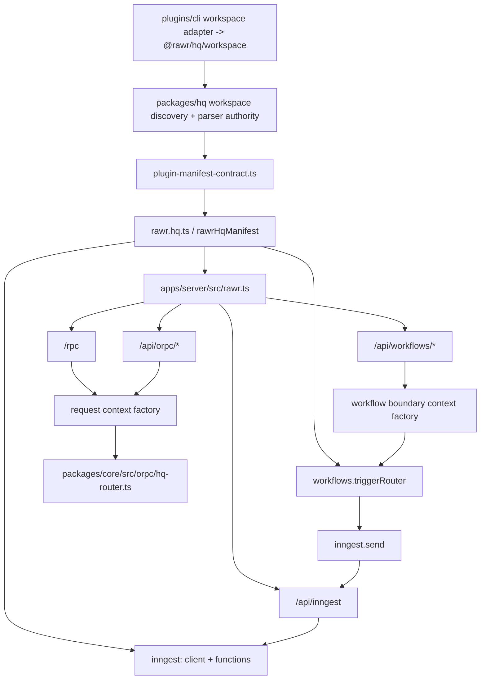

# Phase A Implementation Spec

## 0. Document Contract
This document is the deep implementation spec for Phase A. It is not a milestone checklist.

- Sequence entrypoint: `docs/projects/orpc-ingest-workflows-spec/PHASE_A_EXECUTION_PACKET.md`
- This spec: implementation depth for each slice (`A0`..`A9`): concrete code surfaces, seam contracts, and gate/test wiring.

## 1. Purpose, Non-Goals, Fixed Decisions

### 1.1 Purpose
Converge current runtime behavior in this repository to locked D-013, D-015, and D-016 seam-now policy by shipping a forward-only, slice-based implementation plan tied to real code paths.

### 1.2 Non-goals (Phase A)
- No rollback choreography, rollback matrices, or dual-track release strategy.
- No full D-016 UX/productization (instance lifecycle UX, packaging workflows).
- No broad refactors unrelated to metadata/runtime-route/harness convergence.
- No reopening of D-005..D-016 locked decisions.

### 1.3 Fixed Decisions (Must Hold)
1. `/api/workflows/<capability>/*` is in Phase A scope and ships additively.
2. `/api/inngest` remains runtime-ingress-only and caller-forbidden.
3. Ingress signature verification is host-enforced before runtime dispatch.
4. Runtime metadata behavior is keyed by `rawr.kind`, `rawr.capability`, and manifest registration only.
5. `templateRole`, `channel`, `publishTier`, and `published` are forbidden legacy keys and must be removed from non-archival runtime/tooling/scaffold metadata surfaces.
6. Metadata interpretation is centralized in one shared parser contract used by both discovery implementations.
7. Harness and negative-route gates are hard-fail by end of `A1`.
8. Legacy-metadata hard deletion is enforced as a blocking gate and must be complete by `A6`.

## 2. Relationship to `PHASE_A_EXECUTION_PACKET.md`

- `PHASE_A_EXECUTION_PACKET.md` is the operational run order and phase gate checklist.
- `PHASE_A_IMPLEMENTATION_SPEC.md` is the engineering depth reference:
  - exact file ownership and changes,
  - seam-level code shapes,
  - acceptance checks mapped to code/test surfaces,
  - unresolved implementation questions and defers.

Use both together:
1. Execute in packet order (`A0` -> ... -> `A9`).
2. Implement each slice using this spec’s detailed contracts.

## 3. Architecture Context

### 3.1 Current Runtime Reality (as-landed on 2026-02-21)
- Host mount order is explicit and active: `/api/inngest` -> `/api/workflows/*` -> `/rpc` + `/api/orpc/*`.
- `/api/inngest` enforces host-side signature verification before runtime dispatch and returns `403` on missing/invalid signatures.
- `/rpc` route access is caller-surface-gated in runtime; missing caller-surface defaults to deny.
- `rawr.hq.ts` is active manifest composition authority and is consumed by host runtime for:
  - `rawrHqManifest.orpc.router`
  - `rawrHqManifest.workflows.capabilities` + `rawrHqManifest.workflows.triggerRouter`
  - `rawrHqManifest.inngest.bundleFactory` + `rawrHqManifest.inngest.serveHandlerFactory`
- Discovery categories include `plugins/api/*` and `plugins/workflows/*`; those directories are optional per workspace and may be absent.
- Workspace/install authority consolidation is intentionally limited in Phase A landed state:
  - `plugins/cli/plugins/src/lib/workspace-plugins.ts` delegates to package-owned `@rawr/hq/workspace`
  - `plugins/cli/plugins/src/lib/install-state.ts` delegates to package-owned `@rawr/hq/install`
- Phase A gate wiring is present and executable; landed exit chain is green via `bun run phase-a:gates:exit`.

### 3.2 Target Runtime Composition (Phase A)
- Manifest-first composition via `rawr.hq.ts` (or generated equivalent) becomes runtime authority.
- Route families become explicit and policy-aligned:
  - `/api/inngest` runtime ingress (signed only)
  - `/api/workflows/<capability>/*` caller-facing workflow boundaries
  - `/rpc` first-party/internal
  - `/api/orpc/*` published OpenAPI boundaries
- Request context is request-scoped and split from durable runtime context.
- Metadata runtime semantics converge to `rawr.kind` + `rawr.capability` + manifest registration.

### 3.3 Composition Diagram


## 4. File Structure Map and Ownership Map

### 4.1 Path Roots
- `$ROOT`: repository root (`.`)
- `$SPEC`: `docs/projects/orpc-ingest-workflows-spec`

### 4.2 File Structure Map (Phase A)
```yaml
new_files:
  - path: "$ROOT/packages/hq/src/workspace/plugin-manifest-contract.ts"
    owner: "Plugin Lifecycle Owner"
    purpose: "Single metadata parser contract for runtime keys with forbidden-legacy-key rejection"
  - path: "$ROOT/apps/server/src/workflows/context.ts"
    owner: "Runtime/Host Composition Owner"
    purpose: "Request/workflow boundary context factories"
  - path: "$ROOT/rawr.hq.ts"
    owner: "Runtime/Host Composition Owner"
    purpose: "Manifest-first composition authority"
  - path: "$ROOT/apps/server/test/route-boundary-matrix.test.ts"
    owner: "Verification & Gates Owner"
    purpose: "Mandatory negative-route assertion suite"

modified_files:
  - path: "$ROOT/packages/hq/src/workspace/plugins.ts"
    owner: "Plugin Lifecycle Owner"
    purpose: "Consume shared parser; discovery root expansion"
  - path: "$ROOT/plugins/cli/plugins/src/lib/workspace-plugins.ts"
    owner: "Plugin Lifecycle Owner"
    purpose: "Thin adapter forwarding to package-owned @rawr/hq/workspace authority"
  - path: "$ROOT/apps/server/src/rawr.ts"
    owner: "Runtime/Host Composition Owner"
    purpose: "Mount order, ingress guard, manifest-driven workflow route mount"
  - path: "$ROOT/apps/server/src/orpc.ts"
    owner: "Runtime/Host Composition Owner"
    purpose: "Request-scoped context factory usage; workflow route composition integration"
  - path: "$ROOT/packages/core/src/orpc/hq-router.ts"
    owner: "Runtime/Host Composition Owner"
    purpose: "Capability namespace extensions for workflow trigger/status surfaces"
  - path: "$ROOT/apps/server/test/rawr.test.ts"
    owner: "Verification & Gates Owner"
    purpose: "Ingress signature + mount-order assertions"
  - path: "$ROOT/apps/server/test/orpc-handlers.test.ts"
    owner: "Verification & Gates Owner"
    purpose: "First-party/internal route behavior assertions"
  - path: "$ROOT/apps/server/test/orpc-openapi.test.ts"
    owner: "Verification & Gates Owner"
    purpose: "Published boundary + workflow OpenAPI checks"
  - path: "$ROOT/package.json"
    owner: "Verification & Gates Owner"
    purpose: "Gate scripts and CI runnable checks"
  - path: "$ROOT/turbo.json"
    owner: "Verification & Gates Owner"
    purpose: "Task graph inclusion for gate scripts"
  - path: "$ROOT/packages/hq/src/install/state.ts"
    owner: "Distribution/Lifecycle Contract Owner"
    purpose: "Remove legacy key-driven lifecycle/install decisions"
  - path: "$ROOT/plugins/cli/plugins/src/lib/install-state.ts"
    owner: "Distribution/Lifecycle Contract Owner"
    purpose: "Thin adapter forwarding to package-owned @rawr/hq/install authority"
  - path: "$ROOT/plugins/cli/plugins/src/commands/plugins/web/enable.ts"
    owner: "Distribution/Lifecycle Contract Owner"
    purpose: "Remove legacy template-role based enablement decisions"
  - path: "$ROOT/plugins/cli/plugins/src/commands/plugins/web/enable/all.ts"
    owner: "Distribution/Lifecycle Contract Owner"
    purpose: "Remove legacy channel-based enablement decisions"
  - path: "$ROOT/plugins/cli/plugins/src/commands/plugins/cli/install/all.ts"
    owner: "Distribution/Lifecycle Contract Owner"
    purpose: "Remove legacy channel-based install decisions"
  - path: "$ROOT/plugins/cli/plugins/src/commands/plugins/scaffold/web-plugin.ts"
    owner: "Distribution/Lifecycle Contract Owner"
    purpose: "Stop emitting forbidden legacy metadata keys in scaffolds"

optional_dirs:
  - path: "$ROOT/plugins/api"
    owner: "Plugin Lifecycle Owner"
    purpose: "Optional discovery root and capability surface namespace"
  - path: "$ROOT/plugins/workflows"
    owner: "Plugin Lifecycle Owner"
    purpose: "Optional workflow boundary surface namespace"
```

### 4.3 Ownership Map
| Role | Handle | Backup | Scope | Primary code areas |
| --- | --- | --- | --- | --- |
| Runtime/Host Composition Owner | `@rawr-runtime-host` | `@rawr-platform-duty` | Route family mounting, context seam, ingress verification, manifest integration | `$ROOT/apps/server/src/rawr.ts`, `$ROOT/apps/server/src/orpc.ts`, `$ROOT/apps/server/src/workflows/context.ts`, `$ROOT/rawr.hq.ts` |
| Plugin Lifecycle Owner | `@rawr-plugin-lifecycle` | `@rawr-architecture-duty` | Metadata parser contract, workspace discovery roots, and package-owned workspace authority adapters | `$ROOT/packages/hq/src/workspace/plugins.ts`, `$ROOT/packages/hq/src/workspace/plugin-manifest-contract.ts`, `$ROOT/plugins/cli/plugins/src/lib/workspace-plugins.ts` |
| Verification & Gates Owner | `@rawr-verification-gates` | `@rawr-release-duty` | Gate wiring, harness matrix, negative-route enforcement, observability checks | `$ROOT/apps/server/test/*`, `$ROOT/package.json`, `$ROOT/turbo.json` |
| Distribution/Lifecycle Contract Owner | `@rawr-distribution-lifecycle` | `@rawr-runtime-host` | Alias/instance seam assertions, no-singleton checks, legacy metadata hard-delete closure, and package-owned install authority adapters | `$ROOT/apps/server/test/*`, `$ROOT/packages/hq/src/install/state.ts`, `$ROOT/plugins/cli/plugins/src/lib/install-state.ts` |
| Review Closure Owner | `@rawr-review-closure` | `@rawr-verification-gates` | Full TypeScript + ORPC review closure, finding triage, fix-loop closure | Phase A changed runtime paths + `$SPEC/PHASE_A_EXECUTION_PACKET.md` + `$SPEC/PHASE_A_IMPLEMENTATION_SPEC.md` |
| Docs & Cleanup Owner | `@rawr-docs-maintainer` | `@rawr-release-duty` | Canonical docs/runbook sync and scratch/review cleanup | `$ROOT/docs/process/*`, `$ROOT/docs/process/runbooks/*`, `$SPEC/*` |
| Phase Sequencing Owner | `@rawr-phase-sequencing` | `@rawr-architecture-duty` | Post-Phase-A readjustment and next-phase (Phase B+) readiness hardening | `$SPEC/DECISIONS.md`, `$SPEC/ARCHITECTURE.md`, `$SPEC/axes/*` |

Failover rule: if primary owner is unavailable, backup becomes acting owner for that decision.

## 5. Slice-by-Slice Implementation Spec
Slices `A0`..`A8` are landed in current runtime pass; this section remains as both execution contract and as-built reference for the shipped seam behavior.

## 5.1 A0 - Baseline Gate Scaffold

### Inputs
- Current scripts in `$ROOT/package.json` and task graph in `$ROOT/turbo.json`.
- Existing server test suite in `$ROOT/apps/server/test`.

### Code changes
1. Add runnable gate entrypoints (scripts or TS scripts invoked by package scripts) for:
   - `metadata-contract`
   - `import-boundary`
   - `manifest-smoke-baseline`
   - `host-composition-guard`
   - `route-negative-assertions`
   - `harness-matrix`
   - `observability-contract`
2. Add deterministic static guard command for forbidden legacy metadata keys across non-archival runtime/tooling/scaffold metadata surfaces (pattern scan + tests).
3. Keep telemetry hooks optional and non-blocking (no completion gate dependency).
4. Wire gates into CI-invokable script(s) (single command or staged commands).

### Outputs
- All gate commands exist and execute.
- Static guard command is available for completion/exit checks.

### Acceptance checks
- Running gate command set completes without missing-command failures.
- Static guard command runs in CI.

## 5.2 A1 - Metadata Runtime Contract Shift (D-013)

### Inputs
- Duplicate parser logic in both discovery implementations.
- Existing plugin metadata fields in package manifests.

### Code changes
1. Introduce shared parser contract module at:
   - `$ROOT/packages/hq/src/workspace/plugin-manifest-contract.ts`
2. Move runtime-key interpretation to shared parser and consume from:
   - `$ROOT/packages/hq/src/workspace/plugins.ts`
   - `$ROOT/plugins/cli/plugins/src/lib/workspace-plugins.ts`
3. Expand parsed model to include canonical runtime keys:
   - `rawr.kind`
   - `rawr.capability`
4. Remove and forbid legacy keys (`templateRole`, `channel`, `publishTier`, `published`) in active parser/output contracts and metadata declarations.
5. Add explicit static guard coverage (pattern scan + tests) to prevent forbidden-key regressions.
6. Update runtime-kind validator/test surfaces for new `rawr.kind` values (`api`, `workflows`), including:
   - `packages/agent-sync/test/plugin-kinds.test.ts`
7. Replace legacy `templateRole`/`channel`-driven lifecycle selection semantics with explicit rules keyed by `rawr.kind`, `rawr.capability`, discovery root, and manifest-owned exports; Channel A/Channel B remain command surfaces only.

### Outputs
- One parser contract used in both discovery paths.
- No legacy metadata keys in active parser contracts, manifests, or runtime decision paths.

### Acceptance checks
- `metadata-contract` hard-fails when forbidden legacy keys are declared or consumed.
- `metadata-contract` hard-fails when forbidden legacy keys are declared/consumed or required `rawr.capability` is missing in active plugin manifests.
- Code search confirms shared parser import in both discovery modules.
- No duplicate runtime metadata parser implementation remains.
- Validator tests accept `rawr.kind` values `toolkit|agent|web|api|workflows`.

## 5.3 A2 - Plugin Discovery Surface Expansion

### Inputs
- Current split roots: `plugins/cli/*`, `plugins/agents/*`, `plugins/web/*`.

### Code changes
1. Expand discovery roots in both implementations to include:
   - `plugins/api/*`
   - `plugins/workflows/*`
2. Preserve existing category behavior for current roots.
3. Add fixtures/tests for API/workflow plugin directory discovery.
4. Update discovery validator/test coverage for new runtime kinds and roots, including:
   - `packages/agent-sync/test/plugin-kinds.test.ts`

### Outputs
- API/workflow roots discovered and returned in workspace plugin lists.
- Existing categories unchanged.
- Runtime-kind validation coverage includes `plugins/{cli,agents,web,api,workflows}` roots.

### Acceptance checks
- Discovery tests include `plugins/api` and `plugins/workflows` fixtures.
- Existing behavior tests remain green.
- Validator/tests covering `rawr.kind` and plugin roots are updated for `api` and `workflows`.

## 5.4 A3 - Host Context Seam + Ingress Hardening

### Inputs
- Current static `context` object in ORPC route registration.
- Current `/api/inngest` mount without explicit host-level signature gate.

### Code changes
1. Replace static process-level context usage with request-scoped factory usage in:
   - `$ROOT/apps/server/src/orpc.ts`
2. Add boundary context module:
   - `$ROOT/apps/server/src/workflows/context.ts`
3. Add ingress verification guard before `inngestHandler(request)` in:
   - `$ROOT/apps/server/src/rawr.ts`
4. Enforce explicit mount order:
   - `/api/inngest` -> `/api/workflows/*` -> `/rpc` + `/api/orpc/*`.

### Outputs
- Request-scoped boundary context factory in active path.
- Signed ingress required for runtime ingress route.

### Acceptance checks
- `host-composition-guard` verifies mount order and request-scoped context invocation.
- Unsigned ingress request tests fail with forbidden/unauthorized response.

## 5.5 A4 - Additive `/api/workflows/<capability>/*` Family

### Inputs
- A2 discovery expansion complete.
- A3 host/context seam complete.

### Code changes
1. Add manifest authority file:
   - `$ROOT/rawr.hq.ts`
2. Extend composition for workflow trigger routers under capability namespaces.
3. Mount `/api/workflows/*` in host from manifest-owned trigger router.
4. Keep `/rpc` internal and `/api/orpc/*` publication behavior unchanged.
5. Do not introduce `/rpc/workflows` dedicated mount.

### Outputs
- Four route families mounted and policy-distinct.
- Capability-first workflow boundary path active.

### Acceptance checks
- `manifest-smoke-completion` validates mounted families:
  - `/rpc`
  - `/api/orpc/*`
  - `/api/workflows/<capability>/*`
  - `/api/inngest`
- No `/rpc/workflows` path appears in route registration.
- Caller access to `/api/inngest` remains forbidden.

## 5.6 A5 - D-015 Harness Matrix + Negative Assertions

### Inputs
- A3/A4 route/context model active.

### Code changes
1. Add required suite identifiers and enforcement in test/gate wiring:
   - `suite:web:first-party-rpc`
   - `suite:web:published-openapi`
   - `suite:cli:in-process`
   - `suite:api:boundary`
   - `suite:workflow:trigger-status`
   - `suite:runtime:ingress`
   - `suite:cross-surface:metadata-import-boundary`
2. Implement mandatory negative-route assertions:
   - first-party/external callers reject `/api/inngest`
   - external callers reject `/rpc`
   - runtime-ingress suite does not claim caller-boundary semantics
   - in-process suite does not default to local HTTP self-calls
3. Add/extend route boundary matrix tests:
   - `$ROOT/apps/server/test/route-boundary-matrix.test.ts`

### Outputs
- Harness matrix coverage becomes hard-fail.
- Negative-route contract is executable.

### Acceptance checks
- `harness-matrix` fails when any required suite ID is missing.
- `route-negative-assertions` is fully green.

## 5.7 A6 - D-016 Seam Assertions + Legacy Metadata Hard-Delete Closure

### Inputs
- A1 parser bridge in place.
- A5 harness matrix and negative assertions enforced.

### Code changes
1. Add alias/instance seam assertions in lifecycle-relevant tests.
2. Add no-singleton-global negative assertions for runtime composition assumptions.
3. Remove all remaining legacy metadata key handling from active parser/runtime/tooling paths (`templateRole`, `channel`, `publishTier`, `published`).
   - `$ROOT/packages/hq/src/install/state.ts`
   - `$ROOT/plugins/cli/plugins/src/lib/install-state.ts`
   - `$ROOT/plugins/cli/plugins/src/commands/plugins/web/enable.ts`
   - `$ROOT/plugins/cli/plugins/src/commands/plugins/web/enable/all.ts`
   - `$ROOT/plugins/cli/plugins/src/commands/plugins/cli/install/all.ts`
   - `$ROOT/plugins/cli/plugins/src/commands/plugins/scaffold/web-plugin.ts`
4. Make instance-local workspace root the default lifecycle authority in canonical-root resolution paths; any global-owner fallback must be explicit and test-guarded.
5. Enforce deterministic completion checks: `metadata-contract` gate + static forbidden-key hard-delete guard check.

### Outputs
- Hard-delete conformance for legacy metadata keys across active metadata surfaces.
- Instance-safe seam assertions active.

### Acceptance checks
- `metadata-contract` gate is green.
- Static forbidden-key hard-delete guard check (pattern scan + tests) is green.
- Alias/instance + no-singleton assertions are green.
- No non-archival runtime/tooling/scaffold metadata surface declares or reads forbidden legacy keys.
- Canonical-root resolution assertions prove instance-local lifecycle isolation (no implicit singleton-global owner behavior).

## 5.8 A7 - Full Review Pass (TypeScript + ORPC) + Fix Closure

### Inputs
- Completed Phase A implementation changes from `A0`..`A6`.
- Canonical packet + execution context:
  - `$SPEC/README.md`
  - `$SPEC/ARCHITECTURE.md`
  - `$SPEC/DECISIONS.md`
  - `$SPEC/PHASE_A_EXECUTION_PACKET.md`
  - `$SPEC/PHASE_A_IMPLEMENTATION_SPEC.md`

### Code/process changes
1. Run full implementation review from both TypeScript and ORPC perspectives.
2. Review agents must be grounded before review:
   - introspect `~/.codex-rawr/skills/typescript/SKILL.md`
   - introspect `~/.codex-rawr/skills/orpc/SKILL.md`
3. Require each review agent to maintain:
   - review plan document
   - review scratchpad
   - severity-ranked review report with file/line evidence and concrete fixes
4. If an agent finished a large prior task and is being reassigned to review/fix, send `/compact` before assigning the new task.
5. Resolve review findings with dedicated fix cycles (new fix agents or reassigned implementation agents).
6. Re-run impacted gates/tests after fixes and perform a short re-review of touched areas.

### Outputs
- Closed review loop with explicit finding disposition and fixes merged.
- Verified post-fix gate status for impacted surfaces.
- Targeted consolidation landed for workspace/install authority seams (plugin-local adapter forwarding to package-owned modules).

### Acceptance checks
- Blocking/high findings are fixed.
- Any accepted medium findings are explicitly documented with owner + rationale + follow-up target.
- Re-review confirms no regression from fixes.

## 5.9 A8 - Guaranteed Docs + Cleanup Slice

### Inputs
- `A7` review/fix closure complete.
- Landed Phase A behavior from implementation branch/stack.

### Code/process changes
1. Update canonical docs and runbooks impacted by landed Phase A behavior.
2. Remove or archive Phase A scratch/review artifacts that are no longer needed post-merge.
3. Keep canonical decision/spec/runbook docs as authoritative references.
4. Produce a cleanup manifest that lists archived/deleted paths with rationale.

### Outputs
- Canonical docs reflect shipped behavior.
- Scratch/review clutter removed or archived intentionally.
- Canonical pass outputs include `A7_REVIEW_DISPOSITION.md` and `A8_CLEANUP_MANIFEST.md`.

### Acceptance checks
- Runbook and canonical doc deltas are complete and internally consistent.
- Cleanup manifest is present and readable.
- No stale Phase A scratch/review artifacts remain in active packet paths unless intentionally retained.

## 5.10 A9 - Post-Land Readjustment/Realignment (Phase B+ Prep)

### Inputs
- `A8` doc/cleanup closure complete.
- Final landed Phase A behavior and gate outcomes.

### Code/process changes
1. Review remaining packet docs (`ARCHITECTURE.md`, `DECISIONS.md`, `axes/*`) for next-phase readiness.
2. Tighten sequencing and scope boundaries for Phase B+ based on Phase A outcomes.
3. Update only what is needed for next-phase execution clarity (avoid speculative over-planning).
4. Produce Phase B readiness outcome with blockers (if any), owners, and suggested opening slices.

### Outputs
- Reconciled post-Phase-A spec for future phase execution.
- Explicit Phase B kickoff posture (`ready` or `not-ready`) and reasons.

### Acceptance checks
- Blocking vs non-blocking open questions for Phase B are explicit.
- Updated next-phase sequencing is concrete enough to start a new execution packet pass.

## 5.11 Landed Validation Snapshot (A0-A8)
- `bun run phase-a:gates:exit` is green in landed runtime state.
- `apps/server/test/route-boundary-matrix.test.ts` rerun is green for required suite IDs and negative assertions.
- A7 review closure reruns are green for:
  - `apps/server/test/rawr.test.ts`
  - `apps/server/test/route-boundary-matrix.test.ts`
  - `apps/cli/test/plugins-command-surface-cutover.test.ts`
- No forbidden legacy metadata key references are present in active scanned non-archival runtime/tooling/scaffold metadata surfaces.

## 6. Critical Seam Code-Shape Examples

### 6.1 Metadata Parser Contract (Shared)
```ts
// $ROOT/packages/hq/src/workspace/plugin-manifest-contract.ts
export const FORBIDDEN_LEGACY_RAWR_KEYS = ["templateRole", "channel", "publishTier", "published"] as const;

export type ParsedWorkspacePluginManifest = {
  name?: string;
  kind: WorkspacePluginKind;
  capability: string;
};

export function parseWorkspacePluginManifest(input: ManifestParseInput): ParsedWorkspacePluginManifest {
  // Required `rawr` object and discovery-root to kind matching are enforced.
  assertNoForbiddenLegacyKeys(rawr, input.pkgJsonPath);
  const kind = parseKind(rawr, input.pkgJsonPath);
  assertKindMatchesDiscoveryRoot(kind, input.discoveryRoot, input.pkgJsonPath);

  return {
    name: toOptionalString(input.manifest.name),
    kind,
    capability: parseCapability(rawr, input.pkgJsonPath),
  };
}
```

### 6.2 Request Context Factory
```ts
// $ROOT/apps/server/src/workflows/context.ts
export type RawrBoundaryContextDeps = {
  repoRoot: string;
  baseUrl: string;
  runtime: CoordinationRuntimeAdapter;
  inngestClient: Inngest;
};

export type RawrBoundaryContext = RawrBoundaryContextDeps & {
  requestId: string;
  correlationId: string;
};

export function createRequestScopedBoundaryContext(request: Request, deps: RawrBoundaryContextDeps): RawrBoundaryContext {
  const requestId = request.headers.get("x-request-id") ?? crypto.randomUUID();
  const correlationId = request.headers.get("x-correlation-id") ?? requestId;

  return {
    ...deps,
    requestId,
    correlationId,
  };
}

export function createWorkflowBoundaryContext(request: Request, deps: RawrBoundaryContextDeps): RawrBoundaryContext {
  return createRequestScopedBoundaryContext(request, deps);
}
```

### 6.3 Route Mount Registration (Manifest-Driven)
```ts
// $ROOT/apps/server/src/rawr.ts
const workflowOpenApiHandler = new OpenAPIHandler(rawrHqManifest.workflows.triggerRouter);

app.all("/api/inngest", async ({ request }) => {
  if (!(await verifyInngestIngressRequest(request))) {
    return new Response("forbidden", { status: 403 });
  }
  return inngestHandler(request);
});

app.all("/api/workflows/*", async ({ request }) => {
  const capability = resolveWorkflowCapability(new URL(request.url).pathname);
  if (!capability) {
    return new Response("not found", { status: 404 });
  }

  const context = createWorkflowBoundaryContext(request, deps);
  const result = await workflowOpenApiHandler.handle(request, {
    prefix: "/api/workflows",
    context,
  });
  return result.matched ? result.response : new Response("not found", { status: 404 });
}, { parse: "none" });

registerOrpcRoutes(app, {
  ...deps,
  router: rawrHqManifest.orpc.router,
});
```

### 6.4 Verification Gate Wiring
```json
{
  "scripts": {
    "phase-a:gate:metadata-contract": "bun scripts/phase-a/verify-gate-scaffold.mjs metadata-contract && bunx vitest run --project hq --project plugin-plugins --testNamePattern='metadata contract gate scaffold'",
    "phase-a:gate:import-boundary": "bun scripts/phase-a/verify-gate-scaffold.mjs import-boundary && bunx vitest run --project hq --project plugin-plugins --testNamePattern='import boundary gate scaffold'",
    "phase-a:gate:host-composition-guard": "bun scripts/phase-a/verify-gate-scaffold.mjs host-composition-guard && bunx vitest run --project server --testNamePattern='host composition guard gate scaffold'",
    "phase-a:gate:route-negative-assertions": "bunx vitest run --project server apps/server/test/route-boundary-matrix.test.ts",
    "phase-a:gate:harness-matrix": "bun scripts/phase-a/verify-harness-matrix.mjs",
    "phase-a:gate:manifest-smoke-baseline": "bun scripts/phase-a/manifest-smoke.mjs --mode=baseline",
    "phase-a:gate:manifest-smoke-completion": "bun scripts/phase-a/manifest-smoke.mjs --mode=completion",
    "phase-a:gate:observability-contract": "bun scripts/phase-a/verify-gate-scaffold.mjs observability-contract && bunx vitest run --project server --testNamePattern='observability contract gate scaffold'",
    "phase-a:gate:legacy-metadata-hard-delete-static-guard": "bun scripts/phase-a/check-forbidden-legacy-metadata-keys.mjs packages/hq/src/workspace/plugins.ts plugins/cli/plugins/src/lib/workspace-plugins.ts packages/hq/src/install/state.ts plugins/cli/plugins/src/lib/install-state.ts plugins/cli/plugins/src/commands/plugins/web/enable.ts plugins/cli/plugins/src/commands/plugins/web/enable/all.ts plugins/cli/plugins/src/commands/plugins/cli/install/all.ts plugins/cli/plugins/src/commands/plugins/scaffold/web-plugin.ts plugins/*/*/package.json && bunx vitest run --project hq --project plugin-plugins --testNamePattern='forbidden legacy metadata keys gate scaffold'",
    "phase-a:gates:baseline": "bun run phase-a:gate:metadata-contract && bun run phase-a:gate:import-boundary && bun run phase-a:gate:manifest-smoke-baseline && bun run phase-a:gate:host-composition-guard && bun run phase-a:gate:route-negative-assertions && bun run phase-a:gate:harness-matrix && bun run phase-a:gate:observability-contract && (bun run phase-a:telemetry:optional || true)",
    "phase-a:gates:completion": "bun run phase-a:gate:metadata-contract && bun run phase-a:gate:import-boundary && bun run phase-a:gate:manifest-smoke-completion && bun run phase-a:gate:host-composition-guard && bun run phase-a:gate:route-negative-assertions && bun run phase-a:gate:harness-matrix && bun run phase-a:gate:observability-contract && (bun run phase-a:telemetry:optional || true)",
    "phase-a:gates:exit": "bun run phase-a:gates:completion && bun run phase-a:gate:legacy-metadata-hard-delete-static-guard"
  }
}
```

## 7. Gate/Test Contract Mapped to Slices
| Gate | Primary slice(s) | Test surfaces | Expected fail mode |
| --- | --- | --- | --- |
| `metadata-contract` | `A1`, `A6` | `$ROOT/packages/hq/test`, `$ROOT/plugins/cli/plugins/test`, active manifest fixtures | Forbidden legacy metadata keys declared/consumed or missing required `rawr.capability` in active metadata surfaces |
| `import-boundary` | `A1`, `A2` | package/plugin import scanning + tests | Package layer imports plugin runtime modules |
| `manifest-smoke-baseline` | `A0` | manifest and route registration checks | Missing manifest authority wiring snapshot |
| `host-composition-guard` | `A3`, `A4` | `$ROOT/apps/server/test/rawr.test.ts` | Mount order drift, static context usage, unsigned ingress accepted |
| `route-negative-assertions` | `A5` | `$ROOT/apps/server/test/route-boundary-matrix.test.ts` | Caller path reaches forbidden route families |
| `harness-matrix` | `A5` | suite-id registry + test metadata scan | Required suite IDs missing |
| `observability-contract` | `A0`, `A5`, `A6` | gate scaffold check + server phase-a gate tests | Missing required observability gate scaffold/test coverage |
| `manifest-smoke-completion` | `A4`, Phase A exit | route family completeness check | Missing `/api/workflows/<capability>/*` family or pending markers |
| `legacy-metadata-hard-delete-static-guard` | `A1`, `A6`, Phase A exit | targeted pattern scan across runtime/tooling/scaffold + active manifests (`plugins/*/*/package.json`) + metadata contract tests | Forbidden legacy metadata keys reintroduced in active metadata surfaces |
| `review-closure` | `A7` | review findings + disposition + targeted reruns | High/blocking findings unresolved or unverified |
| `docs-sync-cleanup` | `A8` | canonical docs/runbooks + cleanup manifest | Landed behavior not reflected in docs or stale scratch artifacts retained |
| `phase-sequence-readjustment` | `A9` | packet reconciliation outputs for Phase B+ | Phase B kickoff ambiguity remains |

## 8. Unresolved Questions and Deferred Register

### 8.1 Deterministic Decision Table
| question | default_now | owner_handle | decision_by_slice | fallback_if_unresolved |
| --- | --- | --- | --- | --- |
| Ingress signature source of truth | Environment-backed signing config is authoritative in Phase A; host verifies signature before runtime dispatch. | `@rawr-runtime-host` | `A3` | If config source integration is incomplete, keep env-only verification and deny unsigned/unverifiable ingress requests. |
| Manifest generation mode | Checked-in `rawr.hq.ts` is the runtime composition authority in Phase A (no generated manifest artifact path). | `@rawr-runtime-host` | `A4` | If automation is not ready, continue with manual `rawr.hq.ts` updates gated by `manifest-smoke-completion`. |
| Workflow route behavior with zero capabilities | `/api/workflows/*` returns canonical 404 with explicit policy headers for the workflow family. | `@rawr-runtime-host` | `A4` | If policy header implementation slips, keep canonical 404 and block Phase A exit until headers are added. |
| Legacy metadata migration mode | Hard deletion in Phase A with no compatibility bridge for legacy metadata keys. | `@rawr-plugin-lifecycle` | `A1` | If any legacy key remains in active metadata surfaces, fail gate and block progression. |

### 8.2 Deferred Register (Inherited, unchanged)
| Defer ID | Deferred item | Why deferred | Unblock trigger | Target phase |
| --- | --- | --- | --- | --- |
| `DR-001` | D-016 UX/packaging product features | Not needed for Phase A seam safety | Phase A complete + hard-delete conformance closure | Phase D |
| `DR-002` | Cross-instance storage-backed lock redesign | Not required for immediate convergence | Evidence of cross-instance duplication risk after A6 | Phase C |
| `DR-003` | Expanded telemetry beyond gate diagnostics | Keep Phase A narrow | Post-Phase-A observability intake | Phase C |
| `DR-004` | Broad non-convergence refactors | Would dilute deterministic convergence | New scoped milestone post-Phase-A | Phase B |

## 9. Forward-Only Delivery Rules
1. Remediate failing slices in-place; do not introduce rollback branches.
2. Keep legacy metadata hard deletion mandatory by `A6`; do not retain compatibility-read key paths.
3. Treat gate failures as blocking until green.
4. Do not widen Phase A scope to absorb deferred lifecycle productization.
5. Run mandatory review/fix closure (`A7`) before docs/cleanup (`A8`).
6. Run post-land realignment (`A9`) before opening the next implementation phase.

## 10. Phase A Landing Criteria (Spec-Scoped)
1. Slices `A0`..`A8` implemented in dependency order.
2. All required gates green; none in warning-only mode.
3. `manifest-smoke-completion` confirms all four route families mounted.
4. `metadata-contract` gate is green.
5. Static forbidden-key hard-delete guard check (pattern scan + tests) is green.
6. Legacy metadata key handling and declarations are removed from non-archival runtime/tooling/scaffold metadata surfaces in `A6`.
7. No runtime branching on legacy metadata fields remains.
8. Lifecycle command semantics are keyed by `rawr.kind` + `rawr.capability` + manifest/discovery rules (not `templateRole`/`channel` semantics).
9. `/api/workflows/<capability>/*` is active and policy-correct.
10. `A7` review closure is complete with fixes applied.
11. `A8` docs/runbook updates and cleanup manifest are complete.

## 11. Post-Landing Realignment Criteria
1. `A9` is complete with explicit Phase B kickoff posture (`ready` or `not-ready`).
2. Remaining blockers (if any) are owner-assigned and ordered for next pass.
