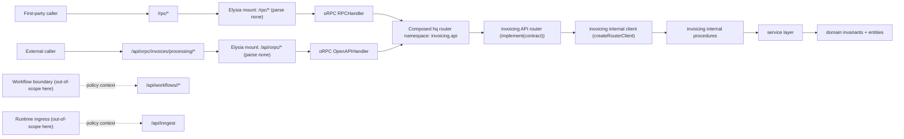

# E2E 01 — Basic Internal Package + API Boundary (TypeBox-First, API-Only Baseline)

## 1) Goal and Scope Boundary

This walkthrough is the minimal policy-aligned baseline for:
1. one internal capability package,
2. one API boundary plugin that owns caller-facing API contracts,
3. one explicit host boundary mount path for `/rpc` and `/api/orpc/*`.

Use-case: expose invoicing APIs while keeping package logic transport-neutral and reusable.

### In Scope
- TypeBox-first package domain/service/procedure/client flow.
- Plugin-owned API contract + direct router-bound procedures.
- Explicit host boundary route registration (`/rpc`, `/api/orpc/*`).

### Out of Scope (for E2E-01)
- Workflow trigger authoring and workflow plugin routing (`/api/workflows/<capability>/*`).
- Runtime ingress and durable execution wiring (`/api/inngest`, Inngest functions).

Those concerns are intentionally covered in later examples.

### Key Axes Covered
- AXIS_01: external publication boundary and contract ownership posture.
- AXIS_02: package internal client defaults and transport-neutral package layering.
- AXIS_07: explicit host composition/mount behavior for boundary APIs.

### Quick Coordinates

| Concern | Canonical location / route |
| --- | --- |
| Operational host routes in this example | `/rpc`, `/api/orpc/*` |
| Contract-backed external API paths shown in this example | `/api/orpc/invoices/processing/start`, `/api/orpc/invoices/processing/{runId}` |
| Policy-only routes not implemented here | `/api/workflows/<capability>/*`, `/api/inngest` |
| Internal package location | `packages/invoicing/src/*` |
| API plugin location | `plugins/api/invoicing/src/*` |
| Composition chain | `rawr.hq.ts` -> `apps/server/src/rawr.ts` -> `apps/server/src/orpc.ts` -> `plugins/api/invoicing/src/router.ts` -> `packages/invoicing/src/client.ts` |

### Endpoint divergence shown in this baseline
1. Start endpoint input divergence:
   - Boundary input: `{ invoiceId, requestedByUserId, requestSource? }`
   - Internal package input: `{ invoiceId, requestedBy }`
2. Status endpoint output divergence:
   - Internal package output: `{ runId, status }`
   - Boundary API output: `{ runId, phase, isTerminal }`

## 2) E2E Topology Diagram



## 3) Canonical File Tree (API-Only Baseline)

```text
.
├── rawr.hq.ts
├── apps/server/src/
│   ├── rawr.ts
│   └── orpc.ts
├── packages/
│   ├── orpc-standards/src/
│   │   ├── typebox-standard-schema.ts
│   │   └── index.ts
│   └── invoicing/src/
│       ├── domain/
│       │   ├── run.ts
│       │   └── status.ts
│       ├── service/
│       │   ├── lifecycle.ts
│       │   ├── status.ts
│       │   └── index.ts
│       ├── procedures/
│       │   ├── start.ts
│       │   ├── get-status.ts
│       │   └── index.ts
│       ├── context.ts
│       ├── router.ts
│       ├── client.ts
│       ├── errors.ts
│       └── index.ts
└── plugins/api/invoicing/src/
    ├── contract.ts
    ├── context.ts
    ├── router.ts
    └── index.ts
```

## 4) Key Files With Concrete Code

### 4.1 TypeBox Standard Schema adapter (shared contract bridge)

```text
packages/orpc-standards/src/
├── typebox-standard-schema.ts
└── index.ts
```

```ts
// packages/orpc-standards/src/typebox-standard-schema.ts
import type { Schema, SchemaIssue } from "@orpc/contract";
import type { Static, TSchema } from "typebox";
import { Value } from "typebox/value";

function parseIssuePath(instancePath: unknown): PropertyKey[] | undefined {
  if (typeof instancePath !== "string" || instancePath === "" || instancePath === "/") return undefined;
  return instancePath
    .split("/")
    .slice(1)
    .map((segment) => (/^\d+$/.test(segment) ? Number(segment) : segment));
}

export function typeBoxStandardSchema<T extends TSchema>(schema: T): Schema<Static<T>, Static<T>> {
  return {
    "~standard": {
      version: 1,
      vendor: "typebox",
      validate: (value) => {
        if (Value.Check(schema, value)) return { value: value as Static<T> };
        const issues = [...Value.Errors(schema, value)].map((issue) => {
          const path = parseIssuePath((issue as { instancePath?: unknown }).instancePath);
          return path
            ? ({ message: issue.message, path } satisfies SchemaIssue)
            : ({ message: issue.message } satisfies SchemaIssue);
        });
        return { issues: issues.length > 0 ? issues : [{ message: "Validation failed" }] };
      },
    },
    __typebox: schema,
  } as Schema<Static<T>, Static<T>>;
}
```

### 4.2 Internal package: domain + service + procedures + router/client

```text
packages/invoicing/src/
├── domain/{status.ts,run.ts}
├── service/{lifecycle.ts,status.ts}
├── procedures/{start.ts,get-status.ts}
├── context.ts
├── router.ts
└── client.ts
```

```ts
// packages/invoicing/src/domain/status.ts
import { Type, type Static } from "typebox";

export const StatusSchema = Type.Union([
  Type.Literal("queued"),
  Type.Literal("running"),
  Type.Literal("completed"),
  Type.Literal("failed"),
  Type.Literal("canceled"),
]);

export type Status = Static<typeof StatusSchema>;

export function isTerminalStatus(status: Status): boolean {
  return status === "completed" || status === "failed" || status === "canceled";
}
```

```ts
// packages/invoicing/src/domain/run.ts
import { Type, type Static } from "typebox";
import { StatusSchema } from "./status";

export const RunSchema = Type.Object({
  runId: Type.String(),
  invoiceId: Type.String(),
  requestedBy: Type.String(),
  status: StatusSchema,
});

export type Run = Static<typeof RunSchema>;
```

```ts
// packages/invoicing/src/service/lifecycle.ts
import type { Run } from "../domain/run";

export type InvoicingServiceDeps = {
  newRunId: () => string;
  saveRun: (run: Run) => Promise<void>;
  getRun: (runId: string) => Promise<Run | null>;
};

export async function startInvoice(
  deps: InvoicingServiceDeps,
  input: { invoiceId: string; requestedBy: string },
) {
  const runId = deps.newRunId();
  await deps.saveRun({
    runId,
    invoiceId: input.invoiceId,
    requestedBy: input.requestedBy,
    status: "queued",
  });
  return { runId, accepted: true as const };
}
```

```ts
// packages/invoicing/src/service/status.ts
import type { InvoicingServiceDeps } from "./lifecycle";

export async function getInvoiceStatus(deps: InvoicingServiceDeps, input: { runId: string }) {
  const run = await deps.getRun(input.runId);
  return run ? { runId: run.runId, status: run.status } : { runId: input.runId, status: "failed" as const };
}
```

```ts
// packages/invoicing/src/context.ts
import type { InvoicingServiceDeps } from "./service/lifecycle";

export type InvoicingProcedureContext = { deps: InvoicingServiceDeps };
```

```ts
// packages/invoicing/src/procedures/start.ts
import { ORPCError, os } from "@orpc/server";
import { Type } from "typebox";
import { schema } from "@rawr/orpc-standards";
import { startInvoice } from "../service/lifecycle";
import type { InvoicingProcedureContext } from "../context";

const o = os.$context<InvoicingProcedureContext>();

export const startProcedure = o
  .input(schema({
    invoiceId: Type.String(),
    requestedBy: Type.String(),
  }))
  .output(schema({
    runId: Type.String(),
    accepted: Type.Boolean(),
  }))
  .handler(async ({ context, input }) => {
    try {
      return await startInvoice(context.deps, input);
    } catch {
      throw new ORPCError("INTERNAL_SERVER_ERROR", { message: "Failed to start invoice" });
    }
  });
```

```ts
// packages/invoicing/src/procedures/get-status.ts
import { os } from "@orpc/server";
import { Type } from "typebox";
import { schema } from "@rawr/orpc-standards";
import { StatusSchema } from "../domain/status";
import { getInvoiceStatus } from "../service/status";
import type { InvoicingProcedureContext } from "../context";

const o = os.$context<InvoicingProcedureContext>();

export const getStatusProcedure = o
  .input(schema({ runId: Type.String() }))
  .output(schema({
    runId: Type.String(),
    status: StatusSchema,
  }))
  .handler(({ context, input }) => getInvoiceStatus(context.deps, input));
```

```ts
// packages/invoicing/src/router.ts
import { startProcedure } from "./procedures/start";
import { getStatusProcedure } from "./procedures/get-status";

export const invoicingInternalRouter = {
  start: startProcedure,
  getStatus: getStatusProcedure,
} as const;
```

```ts
// packages/invoicing/src/client.ts
import { createRouterClient } from "@orpc/server";
import { invoicingInternalRouter } from "./router";
import type { InvoicingProcedureContext } from "./context";

export function createInvoicingInternalClient(context: InvoicingProcedureContext) {
  return createRouterClient(invoicingInternalRouter, { context });
}
```

### 4.3 API boundary plugin: contract ownership + direct procedure exports

```text
plugins/api/invoicing/src/
├── contract.ts
├── context.ts
├── router.ts
└── index.ts
```

```ts
// plugins/api/invoicing/src/contract.ts
import { oc } from "@orpc/contract";
import { Type } from "typebox";
import { schema } from "@rawr/orpc-standards";

export const invoicingApiContract = oc.router({
  startInvoiceProcessing: oc
    .route({ method: "POST", path: "/invoices/processing/start" })
    .input(schema({
      invoiceId: Type.String(),
      requestedByUserId: Type.String(),
      requestSource: Type.Optional(Type.String()),
    }))
    .output(schema({
      runId: Type.String(),
      accepted: Type.Boolean(),
    })),

  getInvoiceProcessingStatus: oc
    .route({ method: "GET", path: "/invoices/processing/{runId}" })
    .input(schema({ runId: Type.String() }))
    .output(schema({
      runId: Type.String(),
      phase: Type.Union([
        Type.Literal("queued"),
        Type.Literal("running"),
        Type.Literal("completed"),
        Type.Literal("failed"),
        Type.Literal("canceled"),
      ]),
      isTerminal: Type.Boolean(),
    })),
});
```

```ts
// plugins/api/invoicing/src/context.ts
import { createInvoicingInternalClient } from "@rawr/invoicing";

export type InvoicingApiContext = {
  invoicing: ReturnType<typeof createInvoicingInternalClient>;
};
```

```ts
// plugins/api/invoicing/src/router.ts
import { implement } from "@orpc/server";
import { invoicingApiContract } from "./contract";
import type { InvoicingApiContext } from "./context";

const os = implement<typeof invoicingApiContract, InvoicingApiContext>(invoicingApiContract);

function isTerminal(status: "queued" | "running" | "completed" | "failed" | "canceled"): boolean {
  return status === "completed" || status === "failed" || status === "canceled";
}

// Canonical defaults often split `operations/*`; this baseline keeps direct procedure
// exports to remove unnecessary indirection for two small handlers.
export const startInvoiceProcessingProcedure = os.startInvoiceProcessing.handler(({ context, input }) =>
  context.invoicing.start({
    invoiceId: input.invoiceId,
    requestedBy: input.requestedByUserId,
  }),
);

export const getInvoiceProcessingStatusProcedure = os.getInvoiceProcessingStatus.handler(async ({ context, input }) => {
  const internal = await context.invoicing.getStatus({ runId: input.runId });
  return {
    runId: internal.runId,
    phase: internal.status,
    isTerminal: isTerminal(internal.status),
  };
});

export function createInvoicingApiRouter() {
  return os.router({
    startInvoiceProcessing: startInvoiceProcessingProcedure,
    getInvoiceProcessingStatus: getInvoiceProcessingStatusProcedure,
  });
}
```

```ts
// plugins/api/invoicing/src/index.ts
import { invoicingApiContract } from "./contract";
import { createInvoicingApiRouter } from "./router";

export const invoicingApiSurface = {
  contract: invoicingApiContract,
  router: createInvoicingApiRouter(),
} as const;
```

### 4.4 Composition root and host mounts (boundary-only in this baseline)

```text
rawr.hq.ts
apps/server/src/rawr.ts
apps/server/src/orpc.ts
```

```ts
// rawr.hq.ts
import { oc } from "@orpc/contract";
import { invoicingApiSurface } from "./plugins/api/invoicing/src";

export const rawrHqManifest = {
  orpc: {
    contract: oc.router({
      invoicing: {
        api: invoicingApiSurface.contract,
      },
    }),
    router: {
      invoicing: {
        api: invoicingApiSurface.router,
      },
    },
  },
} as const;
```

```ts
// apps/server/src/orpc.ts
import type { AnyElysia } from "./plugins";
import { OpenAPIHandler } from "@orpc/openapi/fetch";
import { RPCHandler } from "@orpc/server/fetch";
import type { createInvoicingInternalClient } from "@rawr/invoicing";

export type RegisterOrpcRoutesContext = {
  invoicing: ReturnType<typeof createInvoicingInternalClient>;
};

export function registerOrpcRoutes<TRouter>(app: AnyElysia, router: TRouter, context: RegisterOrpcRoutesContext) {
  const rpcHandler = new RPCHandler(router);
  const openapiHandler = new OpenAPIHandler(router);

  app.all(
    "/rpc/*",
    async (ctx) => {
      const request = ctx.request as Request;
      const result = await rpcHandler.handle(request, { prefix: "/rpc", context });
      return result.matched ? result.response : new Response("not found", { status: 404 });
    },
    { parse: "none" },
  );

  app.all(
    "/api/orpc/*",
    async (ctx) => {
      const request = ctx.request as Request;
      const result = await openapiHandler.handle(request, { prefix: "/api/orpc", context });
      return result.matched ? result.response : new Response("not found", { status: 404 });
    },
    { parse: "none" },
  );

  return app;
}
```

```ts
// apps/server/src/rawr.ts
import type { AnyElysia } from "./plugins";
import { createInvoicingInternalClient } from "@rawr/invoicing";
import { rawrHqManifest } from "../../rawr.hq";
import { registerOrpcRoutes } from "./orpc";

export function registerRoutes(
  app: AnyElysia,
  invoicingDeps: Parameters<typeof createInvoicingInternalClient>[0]["deps"],
) {
  const context = {
    invoicing: createInvoicingInternalClient({ deps: invoicingDeps }),
  } as const;

  return registerOrpcRoutes(app, rawrHqManifest.orpc.router, context);
}
```

## 5) Wiring Steps (Host -> Composition -> Plugin/Package)

1. Build TypeBox adapter once (`packages/orpc-standards/src/typebox-standard-schema.ts`) and reuse it for package and boundary contracts.
2. Build package layers in `packages/invoicing/src/*`:
   - `domain/*` -> `service/*` -> `context.ts` -> `procedures/*` -> `router.ts` -> `client.ts`.
3. Build API plugin in `plugins/api/invoicing/src/*`:
   - boundary `contract.ts`,
   - boundary `context.ts`,
   - direct procedure exports in `router.ts` via `implement(contract)`.
4. Compose the API surface in `rawr.hq.ts` (`invoicing.api` namespace).
5. In `apps/server/src/rawr.ts`, construct boundary context once (`invoicing` internal client) and call `registerOrpcRoutes(...)`.
6. Keep mount forwarding parse-safe (`{ parse: "none" }`) for `/rpc/*` and `/api/orpc/*`.
7. At request time, boundary handlers call the package internal client directly and package procedures execute service/domain logic.

## 6) Request Sequence Walkthrough

### Sequence A: `POST /api/orpc/invoices/processing/start`
1. Caller sends `{ invoiceId, requestedByUserId, requestSource? }`.
2. `/api/orpc/*` mount forwards to `OpenAPIHandler`.
3. Boundary input is validated.
4. `startInvoiceProcessing` procedure performs boundary-to-package input adaptation inline.
5. Procedure maps boundary input to package input (`requestedByUserId -> requestedBy`).
6. Package client calls `invoicingInternalRouter.start`.
7. Package service returns `{ runId, accepted: true }`.
8. Boundary returns typed API response.

### Sequence B: `GET /api/orpc/invoices/processing/{runId}`
1. Caller sends `runId` as the route path parameter.
2. Boundary procedure calls package `getStatus(...)`.
3. Procedure invokes package client `getStatus({ runId })`.
4. Package returns `{ runId, status }`.
5. Procedure projects boundary output `{ runId, phase, isTerminal }`.
6. Caller receives API-shaped response without coupling to internal package shape.

## 7) Rationale and Trade-Offs

1. Plugin-owned boundary contracts keep caller-facing semantics independently evolvable.
2. Package stays transport-neutral and reusable for internal call paths.
3. Direct procedure exports keep adaptation logic local and obvious in this small baseline.
4. TypeBox-first artifacts keep runtime validation and static typing aligned.
5. Trade-off: internal and boundary shapes may intentionally diverge.
6. Benefit: boundary evolution does not force package redesign.
7. Inline I/O remains the default for local readability and ownership clarity; extraction is exception-only for shared/large shapes.

## 8) What Can Go Wrong + Guardrails

| Failure mode | Why it happens | Guardrail |
| --- | --- | --- |
| Prefix mismatch (`/api/orpc` mount vs handler prefix) | Mount and handler config drift | Keep mount path and handler `prefix` adjacent in `registerOrpcRoutes` |
| Request body consumed before handler | parser consumes stream | Keep `{ parse: "none" }` on forwarded mounts |
| Boundary/package shape drift | implicit or ad hoc mapping | keep adaptation code explicit in direct procedure exports and test both divergent endpoints |
| Package leaks boundary semantics | boundary concerns moved into package | keep package transport-neutral (`domain/service/procedures`) |
| Server-internal calls routed over local HTTP | convenience shortcut | default to `createRouterClient` in package `client.ts` |
| Baseline example drifts into workflow/runtime implementation | scope boundary blurred | keep workflow/runtime as out-of-scope notes and route readers to E2E-02 |

## 9) Explicit Policy Consistency Checklist

- [x] TypeBox-only contract/procedure schema authoring is used for package and boundary I/O.
- [x] Domain schema files co-locate schema artifacts and `Static<typeof Schema>` exports.
- [x] Snippets default to inline procedure/contract schema callsites (`.input/.output`).
- [x] Internal package shape follows `domain/ service/ procedures/ context.ts router.ts client.ts errors.ts index.ts`.
- [x] API plugin shape in this minimal baseline is `contract.ts + context.ts + router.ts + index.ts` with direct procedure exports.
- [x] Procedure and boundary I/O schemas are owned by procedures/contracts, not by domain modules.
- [x] Domain file naming is concise and non-redundant (`status.ts`, `run.ts`).
- [x] Internal default invocation path is in-process package client, not local HTTP self-calls.
- [x] Host mounts are explicit and parse-safe for `/rpc/*` and `/api/orpc/*`.
- [x] Workflow/runtime implementation is intentionally out-of-scope in this baseline and deferred to E2E-02+.

## 10) Conformance Anchors

| Example segment | Canonical anchor(s) | Why this anchor applies |
| --- | --- | --- |
| Scope boundary and non-goals | `ARCHITECTURE.md` §2, §4; `axes/03-split-vs-collapse.md`; `axes/08-workflow-api-boundaries.md` | Keeps API-only baseline while preserving split posture correctness. |
| Plugin-owned API contract and direct boundary procedures | `DECISIONS.md` D-006, D-011, D-012; `axes/01-external-client-generation.md`; `axes/02-internal-clients.md`; `axes/11-core-infrastructure-packaging-and-composition-guarantees.md` | Preserves plugin contract ownership while keeping boundary adaptation logic explicit and local for this minimal case. |
| Internal package structure and in-process client path | `axes/02-internal-clients.md`; `axes/11-core-infrastructure-packaging-and-composition-guarantees.md` | Preserves transport-neutral package layering and internal client default. |
| Host boundary route registration (`/rpc`, `/api/orpc/*`) | `axes/07-host-composition.md`; `ARCHITECTURE.md` §2.1 | Keeps explicit mount semantics and first-party transport boundaries. |
| TypeBox-first schema bridge and snippet style | `ARCHITECTURE.md` §4 (TypeBox invariant); `DECISIONS.md` D-012; `axes/02-internal-clients.md` | Keeps schema-first authoring and inline-I/O default discipline. |
| Guardrails and negative-surface clarity | `axes/05-errors-observability.md`; `axes/06-middleware.md`; `axes/12-testing-harness-and-verification-strategy.md` | Prevents route misuse and baseline scope drift. |
| Canonical policy authority hierarchy | `ARCHITECTURE.md`; `DECISIONS.md`; `README.md` | Positions E2E-01 as a reference walkthrough under canonical policy authority. |

## 11) Bridge to E2E 02

Next step: `e2e-02-api-workflows-composed.md` adds caller-triggered workflow routing and runtime ingress/durable execution while preserving this package+API baseline and its ownership boundaries.
