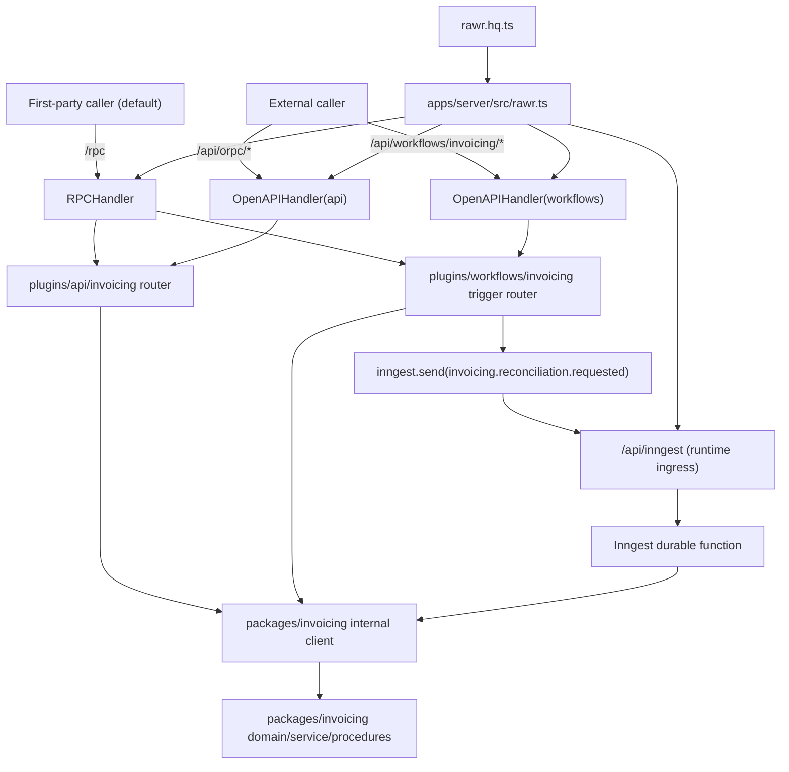

# E2E 02 — API + Workflow Capability Composition (TypeBox-First, Manifest-Driven)

## 1) Goal and Use-Case Framing
This walkthrough extends E2E-01 from API-only composition to full capability composition with:
1. API boundary routes (`plugins/api/invoicing/*`) for immediate request/response operations.
2. Workflow trigger/status boundary routes (`plugins/workflows/invoicing/*`) for caller-triggered durable orchestration.
3. Runtime ingress (`/api/inngest`) for durable execution only.

The target outcome is one capability (`invoicing`) with:
1. shared package-owned domain/service logic reused by API and workflow boundaries,
2. plugin-owned boundary contracts for API and workflow caller surfaces,
3. manifest-driven host wiring with explicit context injection seams and explicit mount/control-plane order.

### Key Axes Covered
- AXIS_02: Internal package client reuse across plugin boundaries.
- AXIS_03: Split posture (`/rpc` and published boundary routes vs runtime ingress).
- AXIS_04: Explicit context seam ownership at host boundary injection points.
- AXIS_05: Trigger-to-run correlation and runtime lifecycle semantics.
- AXIS_07: Host composition and mount/control-plane ordering.
- AXIS_08: Workflow trigger boundary vs durable function boundary separation.

### Caller/Auth Semantics (Canonical Projection)
| Caller type | Route family | Link type | Publication boundary | Auth expectation | Forbidden routes |
| --- | --- | --- | --- | --- | --- |
| First-party MFE/internal caller (default) | `/rpc` | `RPCLink` | internal only (never published) | first-party boundary session/auth or trusted service context | `/api/inngest` |
| External/third-party caller | `/api/orpc/*`, `/api/workflows/<capability>/*` | `OpenAPILink` | externally published OpenAPI clients | boundary auth/session/token | `/rpc`, `/api/inngest` |
| Runtime ingress (Inngest) | `/api/inngest` | Inngest callback transport | runtime-only | signed ingress verification | `/rpc`, `/api/orpc/*`, `/api/workflows/<capability>/*` |

Notes:
1. First-party default remains `/rpc`; first-party use of published OpenAPI routes is exception-only and must be explicitly documented.
2. `/api/inngest` is runtime ingress only and is never a caller SDK surface.

## 2) E2E Topology Diagram


## 3) File Tree Diff from E2E-01
```text
apps/server/src/
  rawr.ts
  workflows/context.ts
  orpc/register-routes.ts

packages/invoicing/src/procedures/
  queue-reconciliation.ts
  mark-reconciliation-result.ts

plugins/workflows/invoicing/src/
  context.ts
  contract.ts
  router.ts
  functions/reconciliation.ts
  index.ts
```

Baseline note: package/API baseline from `e2e-01-basic-package-api.md` remains in place.

## 4) Key Files With Concrete Code

### 4.1 Internal package: domain/service/procedures/internal client
```text
packages/invoicing/src/
  domain/{status.ts,run.ts}
  service/lifecycle.ts
  context.ts
  procedures/{start.ts,get-status.ts,queue-reconciliation.ts,mark-reconciliation-result.ts}
  router.ts
  client.ts
```

```ts
// packages/invoicing/src/domain/status.ts
import { Type, type Static } from "typebox";

export const InvoiceStatusSchema = Type.Union([
  Type.Literal("queued"),
  Type.Literal("running"),
  Type.Literal("reconciling"),
  Type.Literal("completed"),
  Type.Literal("failed"),
  Type.Literal("canceled"),
]);

export type InvoiceStatus = Static<typeof InvoiceStatusSchema>;

export function canQueueReconciliation(status: InvoiceStatus) {
  return status === "queued" || status === "running";
}
```

```ts
// packages/invoicing/src/domain/run.ts
import { Type, type Static } from "typebox";
import { InvoiceStatusSchema } from "./status";

export const InvoiceRunSchema = Type.Object({
  runId: Type.String(),
  invoiceId: Type.String(),
  requestedBy: Type.String(),
  status: InvoiceStatusSchema,
});

export type InvoiceRun = Static<typeof InvoiceRunSchema>;
```

```ts
// packages/invoicing/src/service/lifecycle.ts
import type { InvoiceRun } from "../domain/run";
import { canQueueReconciliation, type InvoiceStatus } from "../domain/status";

export type InvoicingServiceDeps = {
  newRunId: () => string;
  saveRun: (run: InvoiceRun) => Promise<void>;
  getRun: (runId: string) => Promise<InvoiceRun | null>;
  updateStatus: (runId: string, status: InvoiceStatus) => Promise<void>;
};

export async function startInvoice(
  deps: InvoicingServiceDeps,
  input: { invoiceId: string; requestedBy: string },
) {
  const runId = deps.newRunId();
  await deps.saveRun({
    runId,
    invoiceId: input.invoiceId,
    requestedBy: input.requestedBy,
    status: "queued",
  });
  return { runId, accepted: true as const };
}

export async function queueReconciliation(
  deps: InvoicingServiceDeps,
  input: { runId: string; requestedBy: string },
) {
  const run = await deps.getRun(input.runId);
  if (!run) return { accepted: false as const, reason: "not-found" as const };
  if (!canQueueReconciliation(run.status)) {
    return { accepted: false as const, reason: "invalid-state" as const };
  }

  await deps.updateStatus(run.runId, "reconciling");
  return { accepted: true as const, runId: run.runId };
}

export async function markReconciliationResult(
  deps: InvoicingServiceDeps,
  input: { runId: string; ok: boolean },
) {
  const status: InvoiceStatus = input.ok ? "completed" : "failed";
  await deps.updateStatus(input.runId, status);
  return { runId: input.runId, status } as const;
}
```

```ts
// packages/invoicing/src/context.ts
import type { InvoicingServiceDeps } from "./service/lifecycle";

export type InvoicingProcedureContext = {
  deps: InvoicingServiceDeps;
};
```

```ts
// packages/invoicing/src/procedures/queue-reconciliation.ts
import { ORPCError, os } from "@orpc/server";
import { Type } from "typebox";
import { schema, typeBoxStandardSchema as std } from "@rawr/orpc-standards";
import type { InvoicingProcedureContext } from "../context";
import { queueReconciliation } from "../service/lifecycle";

const o = os.$context<InvoicingProcedureContext>();

export const queueReconciliationProcedure = o
  .input(schema({ runId: Type.String(), requestedBy: Type.String() }))
  .output(std(Type.Union([
    Type.Object({ accepted: Type.Literal(true), runId: Type.String() }),
    Type.Object({
      accepted: Type.Literal(false),
      reason: Type.Union([Type.Literal("not-found"), Type.Literal("invalid-state")]),
    }),
  ])))
  .handler(async ({ context, input }) => {
    const result = await queueReconciliation(context.deps, input);
    if (!result.accepted && result.reason === "not-found") {
      throw new ORPCError("NOT_FOUND", { status: 404, message: `Run not found: ${input.runId}` });
    }
    return result;
  });
```

```ts
// packages/invoicing/src/router.ts
import { startProcedure } from "./procedures/start";
import { getStatusProcedure } from "./procedures/get-status";
import { queueReconciliationProcedure } from "./procedures/queue-reconciliation";
import { markReconciliationResultProcedure } from "./procedures/mark-reconciliation-result";

export const invoicingInternalRouter = {
  start: startProcedure,
  getStatus: getStatusProcedure,
  queueReconciliation: queueReconciliationProcedure,
  markReconciliationResult: markReconciliationResultProcedure,
} as const;
```

```ts
// packages/invoicing/src/client.ts
import { createRouterClient } from "@orpc/server";
import { invoicingInternalRouter } from "./router";
import type { InvoicingProcedureContext } from "./context";

export function createInvoicingInternalClient(context: InvoicingProcedureContext) {
  return createRouterClient(invoicingInternalRouter, { context });
}
```

### 4.2 API plugin: plugin-owned boundary contract + direct procedure exports
```text
plugins/api/invoicing/src/
  context.ts
  contract.ts
  router.ts
  index.ts
```

```ts
// plugins/api/invoicing/src/contract.ts
import { oc } from "@orpc/contract";
import { Type } from "typebox";
import { schema } from "@rawr/orpc-standards";

export const invoicingApiContract = oc.router({
  startInvoiceProcessing: oc
    .route({ method: "POST", path: "/invoicing/start" })
    .input(schema({
      invoiceId: Type.String(),
      requestedBy: Type.String(),
    }))
    .output(schema({ runId: Type.String(), accepted: Type.Boolean() })),

  getInvoiceProcessingStatus: oc
    .route({ method: "GET", path: "/invoicing/{runId}" })
    .input(schema({ runId: Type.String() }))
    .output(schema({ runId: Type.String(), status: Type.String() })),
});
```

```ts
// plugins/api/invoicing/src/context.ts
import { createInvoicingInternalClient } from "@rawr/invoicing";

export type InvoicingApiContext = {
  invoicing: ReturnType<typeof createInvoicingInternalClient>;
};
```

```ts
// plugins/api/invoicing/src/router.ts
import { implement } from "@orpc/server";
import { invoicingApiContract } from "./contract";
import type { InvoicingApiContext } from "./context";

const os = implement<typeof invoicingApiContract, InvoicingApiContext>(invoicingApiContract);

export const startInvoiceProcessingProcedure = os.startInvoiceProcessing.handler(({ context, input }) =>
  context.invoicing.start(input),
);

export const getInvoiceProcessingStatusProcedure = os.getInvoiceProcessingStatus.handler(({ context, input }) =>
  context.invoicing.getStatus(input),
);

export function createInvoicingApiRouter() {
  return os.router({
    startInvoiceProcessing: startInvoiceProcessingProcedure,
    getInvoiceProcessingStatus: getInvoiceProcessingStatusProcedure,
  });
}
```

### 4.3 Workflow plugin: plugin-owned trigger boundary + durable function
```text
plugins/workflows/invoicing/src/
  context.ts
  contract.ts
  router.ts
  functions/reconciliation.ts
  index.ts
```

```ts
// plugins/workflows/invoicing/src/contract.ts
import { oc } from "@orpc/contract";
import { Type } from "typebox";
import { schema } from "@rawr/orpc-standards";

export const invoicingWorkflowTriggerContract = oc.router({
  triggerReconciliation: oc
    .route({ method: "POST", path: "/invoicing/reconciliation/trigger" })
    .input(schema({ runId: Type.String(), requestedBy: Type.String() }))
    .output(schema({ accepted: Type.Literal(true), runId: Type.String() })),
});
```

```ts
// plugins/workflows/invoicing/src/context.ts
import type { Inngest } from "inngest";
import { createInvoicingInternalClient } from "@rawr/invoicing";

export type InvoicingWorkflowTriggerContext = {
  inngest: Inngest;
  invoicing: ReturnType<typeof createInvoicingInternalClient>;
};
```

```ts
// plugins/workflows/invoicing/src/router.ts
import { implement, ORPCError } from "@orpc/server";
import { invoicingWorkflowTriggerContract } from "./contract";
import type { InvoicingWorkflowTriggerContext } from "./context";

export const INVOICING_RECONCILIATION_EVENT = "invoicing.reconciliation.requested";

const os = implement<typeof invoicingWorkflowTriggerContract, InvoicingWorkflowTriggerContext>(
  invoicingWorkflowTriggerContract,
);

export const triggerReconciliationProcedure = os.triggerReconciliation.handler(async ({ context, input }) => {
  const preflight = await context.invoicing.queueReconciliation(input);
  if (!preflight.accepted) {
    throw new ORPCError("FAILED_PRECONDITION", {
      status: 409,
      message: `Cannot queue reconciliation for run ${input.runId}`,
      data: { runId: input.runId },
    });
  }

  await context.inngest.send({
    name: INVOICING_RECONCILIATION_EVENT,
    data: {
      runId: preflight.runId,
      requestedBy: input.requestedBy,
    },
  });

  return { accepted: true as const, runId: preflight.runId };
});

export function createInvoicingWorkflowTriggerRouter() {
  return os.router({
    triggerReconciliation: triggerReconciliationProcedure,
  });
}
```

```ts
// plugins/workflows/invoicing/src/functions/reconciliation.ts
import type { Inngest } from "inngest";
import { createInvoicingInternalClient, type InvoicingServiceDeps } from "@rawr/invoicing";
import { INVOICING_RECONCILIATION_EVENT } from "../router";

export function createReconciliationFunction(inngest: Inngest, deps: InvoicingServiceDeps) {
  return inngest.createFunction(
    { id: "invoicing.reconciliation", retries: 2 },
    { event: INVOICING_RECONCILIATION_EVENT },
    async ({ event, step }) => {
      const invoicing = createInvoicingInternalClient({ deps });

      await step.run("invoicing/reconcile", async () => {
        await invoicing.markReconciliationResult({ runId: event.data.runId, ok: true });
      });

      return { ok: true as const, runId: event.data.runId };
    },
  );
}
```

### 4.4 Manifest-driven composition (`rawr.hq.ts`)
```ts
// rawr.hq.ts
import { oc } from "@orpc/contract";
import { Inngest } from "inngest";
import type { InvoicingServiceDeps } from "@rawr/invoicing";
import { invoicingApiSurface } from "./plugins/api/invoicing/src";
import {
  createInvoicingWorkflowTriggerRouter,
  invoicingWorkflowTriggerContract,
  createReconciliationFunction,
} from "./plugins/workflows/invoicing/src";

export function createRawrHqManifest(invoicingDeps: InvoicingServiceDeps) {
  const inngest = new Inngest({ id: "rawr-hq" });
  const workflowTriggerRouter = createInvoicingWorkflowTriggerRouter();

  return {
    orpc: {
      contract: oc.router({
        invoicing: {
          api: invoicingApiSurface.contract,
          workflows: invoicingWorkflowTriggerContract,
        },
      }),
      router: {
        invoicing: {
          api: invoicingApiSurface.router,
          workflows: workflowTriggerRouter,
        },
      },
    },
    workflows: {
      triggerContract: oc.router({
        invoicing: invoicingWorkflowTriggerContract,
      }),
      triggerRouter: {
        invoicing: workflowTriggerRouter,
      },
    },
    inngest: {
      client: inngest,
      functions: [createReconciliationFunction(inngest, invoicingDeps)],
    },
  } as const;
}
```

### 4.5 Explicit context injection seams + host mount order
```text
apps/server/src/workflows/context.ts
apps/server/src/rawr.ts
apps/server/src/orpc/register-routes.ts
```

```ts
// apps/server/src/workflows/context.ts
import type { Inngest } from "inngest";
import { createInvoicingInternalClient, type InvoicingServiceDeps } from "@rawr/invoicing";

export type BoundaryPrincipal = {
  subject: string;
  tenantId: string;
  roles: string[];
};

export type BoundaryRequest = {
  requestId: string;
  correlationId: string;
  sourceIp?: string;
  userAgent?: string;
};

export type BoundaryDeps = {
  inngest: Inngest;
  invoicingDeps: InvoicingServiceDeps;
};

function resolvePrincipal(request: Request): BoundaryPrincipal {
  return {
    subject: request.headers.get("x-sub") ?? "system",
    tenantId: request.headers.get("x-tenant-id") ?? "default",
    roles: (request.headers.get("x-roles") ?? "").split(",").filter(Boolean),
  };
}

function resolveRequestMeta(request: Request): BoundaryRequest {
  const requestId = request.headers.get("x-request-id") ?? crypto.randomUUID();
  const correlationId = request.headers.get("x-correlation-id") ?? requestId;
  return {
    requestId,
    correlationId,
    sourceIp: request.headers.get("x-forwarded-for") ?? undefined,
    userAgent: request.headers.get("user-agent") ?? undefined,
  };
}

export function createBoundaryContext(request: Request, deps: BoundaryDeps) {
  const principal = resolvePrincipal(request);
  const req = resolveRequestMeta(request);
  const invoicing = createInvoicingInternalClient({ deps: deps.invoicingDeps });

  return {
    principal,
    request: req,
    inngest: deps.inngest,
    invoicing,
  };
}

export function createWorkflowBoundaryContext(request: Request, deps: BoundaryDeps) {
  // Keep a dedicated workflow seam even when envelope shape is currently shared.
  return createBoundaryContext(request, deps);
}
```

```ts
// apps/server/src/orpc/register-routes.ts
import { OpenAPIHandler } from "@orpc/openapi/fetch";
import { RPCHandler } from "@orpc/server/fetch";
import { createBoundaryContext, type BoundaryDeps } from "../workflows/context";

function pickSurface<T extends Record<string, { api: unknown; workflows: unknown }>>(
  routers: T,
  key: "api" | "workflows",
) {
  return Object.fromEntries(Object.entries(routers).map(([capability, value]) => [capability, value[key]]));
}

export function registerOrpcRoutes(
  app: any,
  orpc: { router: Record<string, { api: unknown; workflows: unknown }> },
  deps: BoundaryDeps,
) {
  const rpcHandler = new RPCHandler(orpc.router);
  const apiHandler = new OpenAPIHandler(pickSurface(orpc.router, "api"));

  app.all(
    "/rpc/*",
    async ({ request }: { request: Request }) => {
      const context = createBoundaryContext(request, deps);
      const result = await rpcHandler.handle(request, { prefix: "/rpc", context });
      return result.matched ? result.response : new Response("not found", { status: 404 });
    },
    { parse: "none" },
  );

  app.all(
    "/api/orpc/*",
    async ({ request }: { request: Request }) => {
      const context = createBoundaryContext(request, deps);
      const result = await apiHandler.handle(request, { prefix: "/api/orpc", context });
      return result.matched ? result.response : new Response("not found", { status: 404 });
    },
    { parse: "none" },
  );
}
```

```ts
// apps/server/src/rawr.ts
import { OpenAPIHandler } from "@orpc/openapi/fetch";
import { createInngestServeHandler } from "@rawr/coordination-inngest";
import { initializeExtendedTracesBaseline } from "@rawr/coordination-inngest/tracing";
import type { InvoicingServiceDeps } from "@rawr/invoicing";
import { createRawrHqManifest } from "../../rawr.hq";
import { registerOrpcRoutes } from "./orpc/register-routes";
import { createWorkflowBoundaryContext } from "./workflows/context";

export function registerRawrRoutes(app: any, deps: { invoicingDeps: InvoicingServiceDeps }) {
  initializeExtendedTracesBaseline();
  const rawrHqManifest = createRawrHqManifest(deps.invoicingDeps);

  const boundaryDeps = {
    inngest: rawrHqManifest.inngest.client,
    invoicingDeps: deps.invoicingDeps,
  } as const;

  const workflowHandler = new OpenAPIHandler(rawrHqManifest.workflows.triggerRouter);
  const inngestHandler = createInngestServeHandler(rawrHqManifest.inngest);

  // Canonical order: runtime ingress -> workflow boundaries -> rpc + api boundaries.
  app.all("/api/inngest", async ({ request }: { request: Request }) => {
    const isVerified = await verifyInngestSignature(request);
    if (!isVerified) return new Response("forbidden", { status: 403 });
    return inngestHandler(request);
  });

  app.all(
    "/api/workflows/*",
    async ({ request }: { request: Request }) => {
      const context = createWorkflowBoundaryContext(request, boundaryDeps);
      const result = await workflowHandler.handle(request, {
        prefix: "/api/workflows",
        context,
      });
      return result.matched ? result.response : new Response("not found", { status: 404 });
    },
    { parse: "none" },
  );

  registerOrpcRoutes(app, rawrHqManifest.orpc, boundaryDeps);
}
```

### 4.6 First-party default vs published external client transport
```ts
// plugins/web/invoicing-console/src/client.ts
import { createORPCClient } from "@orpc/client";
import { RPCLink } from "@orpc/client/fetch";
import { OpenAPILink } from "@orpc/openapi-client/fetch";

// Generated from composed first-party/public contract artifacts.
declare const capabilityClients: {
  invoicing: {
    api: Parameters<typeof createORPCClient>[0];
    workflows: Parameters<typeof createORPCClient>[0];
  };
};
declare const externalContracts: {
  invoicing: {
    api: Parameters<typeof createORPCClient>[0];
    workflows: Parameters<typeof createORPCClient>[0];
  };
};

// First-party default (internal transport)
export function createFirstPartyClients(baseUrl: string) {
  return {
    api: createORPCClient(capabilityClients.invoicing.api, {
      link: new RPCLink({ url: `${baseUrl}/rpc` }),
    }),
    workflows: createORPCClient(capabilityClients.invoicing.workflows, {
      link: new RPCLink({ url: `${baseUrl}/rpc` }),
    }),
  } as const;
}

// External/third-party publication path
export function createExternalClients(baseUrl: string) {
  return {
    api: createORPCClient(externalContracts.invoicing.api, {
      link: new OpenAPILink({ url: `${baseUrl}/api/orpc` }),
    }),
    workflows: createORPCClient(externalContracts.invoicing.workflows, {
      link: new OpenAPILink({ url: `${baseUrl}/api/workflows` }),
    }),
  } as const;
}
```

## 5) Wiring Steps (Host -> Composition -> Plugin/Package -> Runtime)
1. Keep package-owned domain/service/procedure logic under `packages/invoicing/src/*`.
2. Keep API boundary contract + direct procedure handlers in `plugins/api/invoicing/src/*`.
3. Keep workflow trigger boundary contract + direct trigger handler + durable functions in `plugins/workflows/invoicing/src/*`.
4. Compose capability surfaces in `rawr.hq.ts`:
   - `orpc` for first-party/internal route tree (`/rpc`) and API OpenAPI publication (`/api/orpc/*`),
   - `workflows.triggerRouter` for caller-facing workflow OpenAPI publication (`/api/workflows/*`),
   - one `inngest` runtime bundle for ingress and enqueue.
5. Build explicit context seams in host (`apps/server/src/workflows/context.ts`) and inject package client + Inngest client there.
6. Register host mounts in canonical order:
   - `/api/inngest`,
   - `/api/workflows/*`,
   - `/rpc/*` and `/api/orpc/*`.
7. Keep parse-safe forwarding (`{ parse: "none" }`) on forwarded route mounts.

## 6) Runtime Sequence Walkthrough

### Flow A: API boundary call (request/response)
1. Caller hits `POST /rpc/invoicing/api/startInvoiceProcessing` (first-party default) or `POST /api/orpc/invoicing/start` (external published path).
2. Host injects boundary context via `createBoundaryContext(...)`.
3. API direct procedure handler calls `context.invoicing.start(...)`.
4. Package logic persists queued run and returns typed response.

### Flow B: Workflow trigger call (caller-facing boundary)
1. Caller hits `POST /rpc/invoicing/workflows/triggerReconciliation` (first-party default) or `POST /api/workflows/invoicing/reconciliation/trigger` (external published path).
2. Host injects boundary context via `createWorkflowBoundaryContext(...)`.
3. Workflow direct procedure handler calls package preflight (`queueReconciliation`) then enqueues Inngest event.
4. Trigger returns `{ accepted, runId }` immediately.

### Flow C: Durable runtime execution
1. Inngest callback invokes `/api/inngest`.
2. Host verifies signature and dispatches to Inngest runtime handler.
3. Durable function executes `step.run(...)` and writes final status through package internal client.
4. Callers read final status via caller-facing boundary routes, not via `/api/inngest`.

## 7) Rationale and Trade-Offs
1. Split caller/runtime surfaces keep policy semantics explicit and auditable.
2. Shared package client eliminates semantic duplication across API and workflow plugins.
3. Plugin-owned boundary contracts prevent package-level boundary drift.
4. Manifest-driven composition keeps route ownership deterministic while preserving explicit host mount control.
5. Direct procedure exports remove thin operation wrappers when behavior is a simple boundary-to-package mapping.
6. Trade-off accepted: explicitness remains while reducing avoidable indirection.

## 8) What Can Go Wrong + Guardrails
| Failure mode | Symptom | Guardrail |
| --- | --- | --- |
| `/api/inngest` treated as caller API | Caller traffic reaches runtime ingress | keep signature checks + route policy tests + no SDK publication of ingress |
| OpenAPI-only host registration | first-party `/rpc` semantics drift | always register `RPCHandler` mount for `/rpc/*` and assert default caller path |
| Workflow/package ownership blur | workflow boundary I/O moves into package domain modules | keep workflow trigger/status I/O in `plugins/workflows/*/contract.ts` |
| Context seam ambiguity | handlers receive mixed/implicit context | keep explicit host context factories and typed context modules |
| Policy drift in mount order | control-plane side effects become unclear | enforce canonical order in host wiring and tests |
| Plugin-to-plugin coupling | API and workflow plugins import each other | both plugins consume package exports only |
| Local HTTP self-calls for internal paths | redundant network hops + behavior drift | use in-process package client (`createRouterClient`) for server-internal calls |

## 9) Explicit Policy Consistency Checklist
- [x] TypeBox-only contract/procedure schema authoring is used (no Zod-authored contract/procedure snippets).
- [x] Package logic remains transport-neutral and reusable via internal client.
- [x] API and workflow boundary contracts remain plugin-owned.
- [x] First-party caller default is `/rpc` with `RPCLink`.
- [x] External/third-party publication uses `/api/orpc/*` and `/api/workflows/<capability>/*` with `OpenAPILink`.
- [x] `/api/inngest` remains runtime ingress only.
- [x] Host mount/control-plane order is explicit and canonical.
- [x] Context injection seams are explicit (`createBoundaryContext`, `createWorkflowBoundaryContext`).
- [x] Workflow trigger preflight reuses package client before enqueue.
- [x] Durable function path remains Inngest-owned and updates package state through internal client.

## 10) Conformance Anchors
| Example segment | Canonical anchor(s) | Conformance statement |
| --- | --- | --- |
| Sections 1-2 (goal, caller matrix, topology) | `ARCHITECTURE.md` sections 2, 2.1, 4, 5 | Caller-mode and split-surface posture matches canonical matrix and global invariants. |
| Section 4.1 (package layer) | `axes/02-internal-clients.md`, `DECISIONS.md` D-011/D-012 | Package remains transport-neutral, internal-client-first, and keeps schema ownership boundaries intact. |
| Section 4.2 (API plugin boundary) | `axes/01-external-client-generation.md`, `DECISIONS.md` D-006 | API boundary contract ownership remains plugin-owned; direct oRPC procedure handlers map boundary input to package client behavior without extra indirection. |
| Section 4.3 (workflow trigger + durable function) | `axes/08-workflow-api-boundaries.md`, `axes/09-durable-endpoints.md`, `DECISIONS.md` D-005/D-006 | Caller-facing workflow trigger boundary remains separate from durable runtime execution. |
| Section 4.4 (manifest composition) | `ARCHITECTURE.md` sections 5-6, `axes/07-host-composition.md` | Manifest-driven composition authority is explicit and remains host-consumed, not implicit. |
| Section 4.5 (context seams + host mounts) | `axes/04-context-propagation.md`, `axes/07-host-composition.md`, `axes/11-core-infrastructure-packaging-and-composition-guarantees.md`, `DECISIONS.md` D-008/D-014 | Context factories and mount order are explicit; injected ports and one-way composition ownership are preserved. |
| Sections 6-8 (runtime flow + guardrails) | `axes/05-errors-observability.md`, `axes/06-middleware.md`, `axes/12-testing-harness-and-verification-strategy.md` | Runtime/caller semantics are separated, and negative-route guardrails are explicit. |
| Section 9 (checklist) | `DECISIONS.md` D-005..D-015, `CANONICAL_EXPANSION_NAV.md` | Example aligns to locked decision posture and concern-router obligations without introducing new policy. |

## 11) Bridge to E2E-03
Next step: continue with `e2e-03-microfrontend-integration.md` to layer in first-party browser UX integration details while preserving this same canonical caller-mode transport split and manifest-driven host composition.
