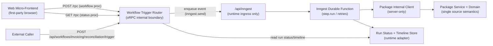

# E2E 03 — Micro-Frontend + Workflow Integration Without Semantic Duplication

## 1) Goal and Use-Case Framing

### Goal
Show one advanced, policy-consistent end-to-end pattern where a micro-frontend can:
1. trigger workflow work,
2. read workflow run status/timeline,
3. reuse capability logic from one canonical source,
without duplicating workflow/domain semantics across browser, plugin, and runtime layers.

### Key Axes Covered
- AXIS_01: External publication boundary stays OpenAPI-based.
- AXIS_02: Browser-safe package exports and internal-client separation.
- AXIS_03: Caller-mode boundaries (`/rpc` first-party vs published workflow/API routes).
- AXIS_04: Request/runtime context envelope split.
- AXIS_07: Multi-caller host composition.
- AXIS_08: Consumer model (MFE default path vs external path).

### Chosen default path (for this walkthrough)
**Plugin-boundary + package-domain workflow integration**:
1. Canonical API/workflow boundary contracts live in plugins.
2. Packages provide domain logic/domain schemas and browser-safe helpers.
3. Workflow plugin implements trigger + durable execution with plugin-local route I/O schemas.
4. First-party micro-frontends use `RPCLink` on `/rpc` by default and may reuse browser-safe package logic.
5. OpenAPI workflow/API routes (`/api/workflows/<capability>/*`, `/api/orpc/*`) are externally published surfaces for third-party callers; first-party use is explicit exception-only.
6. API plugin consumption is optional, not required for workflow invocation.

This default preserves boundary ownership while still preventing semantic duplication through package-level domain reuse.
Compared with E2E 02, this example adds browser-safe projection/use paths and multi-caller routing context while keeping the same policy ownership split and internal-client default.

### Caller/Auth Semantics
| Caller type | Route family | Link type | Publication boundary | Auth expectation | Forbidden routes |
| --- | --- | --- | --- | --- | --- |
| First-party MFE (default) | `/rpc` | `RPCLink` | internal only (RPC client never published) | first-party session/auth | `/api/inngest` |
| First-party internal service/CLI | in-process package client (default), optional `/rpc` | `createRouterClient` / `RPCLink` | internal only (RPC client never published) | trusted service context | `/api/inngest` |
| Third-party/external caller | `/api/orpc/*`, `/api/workflows/<capability>/*` | `OpenAPILink` | externally published OpenAPI clients | boundary auth/session/token | `/rpc`, `/api/inngest` |
| Runtime ingress (Inngest) | `/api/inngest` | Inngest callback transport | runtime-only | signed ingress verification | `/rpc`, `/api/orpc/*`, `/api/workflows/<capability>/*` |

---

## 2) E2E Topology Diagram



Boundary meaning:
1. Browser never calls `/api/inngest`.
2. First-party MFE defaults to `/rpc`; `/api/workflows/...` is the published external workflow boundary and first-party exception path only.
3. Durable orchestration lives only inside Inngest functions.

---

## 3) File Tree Diff from E2E 02

```text
packages/invoicing/src/domain/
  reconciliation.ts
  view.ts

packages/invoicing/src/
  browser.ts

plugins/workflows/invoicing/src/
  router.ts  # direct procedure exports (no thin operations wrappers)

apps/server/src/workflows/
  context.ts

plugins/web/invoicing-console/src/
  client.ts
  web.ts
```

Baseline note: existing package/API/workflow composition files remain present from `e2e-02-api-workflows-composed.md`; this walkthrough expands them for browser-facing and multi-caller usage.

Naming note:
This walkthrough normalizes names to concise `invoicing` conventions for readability, but architecture choices remain non-prescriptive (see alternatives and unresolved gaps below).

---

## 4) Key Files With Concrete Code

### 4.1 Shared package semantics (TypeBox-first, browser-safe)

```text
packages/invoicing/src/
  domain/
    reconciliation.ts
    status.ts
    view.ts
  context.ts
  browser.ts
```

```ts
// packages/invoicing/src/domain/reconciliation.ts
import { Type, type Static } from "typebox";

export const ReconciliationStateSchema = Type.Union([
  Type.Literal("queued"),
  Type.Literal("running"),
  Type.Literal("completed"),
  Type.Literal("failed"),
]);
export type ReconciliationState = Static<typeof ReconciliationStateSchema>;

export function isTerminalReconciliationState(state: ReconciliationState): boolean {
  return state === "completed" || state === "failed";
}
```

```ts
// packages/invoicing/src/domain/status.ts
import { Type, type Static } from "typebox";
import { ReconciliationStateSchema } from "./reconciliation";

// Browser projection model for shared UI helpers.
// Caller-facing workflow route I/O remains owned by workflow plugin contracts.
export const RunBadgeInputSchema = Type.Object(
  { status: ReconciliationStateSchema },
  { additionalProperties: false },
);
export type RunBadgeInput = Static<typeof RunBadgeInputSchema>;
```

```ts
// packages/invoicing/src/domain/view.ts
import type { RunBadgeInput } from "./status";

export function toRunBadge(run: RunBadgeInput): "neutral" | "warning" | "success" | "danger" {
  if (run.status === "completed") return "success";
  if (run.status === "failed") return "danger";
  if (run.status === "running") return "warning";
  return "neutral";
}
```

```ts
// packages/invoicing/src/browser.ts
export * from "./domain/reconciliation";
export * from "./domain/status";
export * from "./domain/view";
```

```ts
// packages/invoicing/src/context.ts
export type InvoicingProcedureContext = {
  deps: {
    queueReconciliation: (input: { invoiceId: string; requestedBy: string }) => Promise<{ accepted: true; runId: string }>;
    getRunStatus: (runId: string) => Promise<{ runId: string; status: string; isTerminal: boolean } | null>;
    getRunTimeline: (runId: string) => Promise<unknown[]>;
    reconcile: (input: { runId: string; invoiceId: string; requestedBy: string }) => Promise<void>;
  };
};
```

### 4.2 Workflow boundary contract I/O schemas (plugin-owned)

I/O ownership note: trigger/status route schemas are authored at the workflow contract boundary (`plugins/workflows/*/contract.ts`), while `domain/*` keeps transport-independent domain concepts and invariants. Inline `.input/.output` schemas are the default; only truly shared/large route payloads should be extracted, and then as `{ input, output }` pairs.

```text
plugins/workflows/invoicing/src/
  contract.ts
```

```ts
// plugins/workflows/invoicing/src/contract.ts
import { oc } from "@orpc/contract";
import { schema } from "@rawr/orpc-standards";
import { Type } from "typebox";
import { ReconciliationStateSchema } from "@rawr/invoicing/domain/reconciliation";

const tag = ["invoicing"] as const;

export const invoicingWorkflowContract = oc.router({
  triggerReconciliation: oc
    .route({ method: "POST", path: "/invoicing/reconciliation/trigger", tags: tag, operationId: "invoicingTriggerReconciliation" })
    .input(schema({ invoiceId: Type.String({ minLength: 1 }), requestedBy: Type.String({ minLength: 1 }) }))
    .output(schema({ accepted: Type.Literal(true), runId: Type.String({ minLength: 1 }) })),
  getRunStatus: oc
    .route({ method: "GET", path: "/invoicing/runs/{runId}", tags: tag, operationId: "invoicingGetRunStatus" })
    .input(schema({ runId: Type.String({ minLength: 1 }) }))
    .output(
      schema(
        {
          runId: Type.String({ minLength: 1 }),
          status: ReconciliationStateSchema,
          isTerminal: Type.Boolean(),
        },
        { additionalProperties: false },
      ),
    ),
  getRunTimeline: oc
    .route({ method: "GET", path: "/invoicing/runs/{runId}/timeline", tags: tag, operationId: "invoicingGetRunTimeline" })
    .input(schema({ runId: Type.String({ minLength: 1 }) }))
    .output(
      schema(
        {
          runId: Type.String({ minLength: 1 }),
          events: Type.Array(Type.Any()),
        },
        { additionalProperties: false },
      ),
    ),
});
```

### 4.3 Workflow plugin router (auth + visibility + trigger semantics)

Direct-procedure pattern note: this example exports oRPC procedure handlers directly from `router.ts` because the workflow boundary logic is local and does not need separate thin operation wrappers. When boundary/package shape adaptation is non-trivial, use explicit `operations/*` mapping (canonical default shape in `axes/01-external-client-generation.md`).

```text
plugins/workflows/invoicing/src/
  context.ts
  contract.ts
  router.ts
```

```ts
// plugins/workflows/invoicing/src/context.ts
import type { Inngest } from "inngest";

export type Principal = {
  subject: string;
  roles: string[];
  canCallInternal: boolean;
};

export type WorkflowRuntime = {
  getRunStatus: (runId: string) => Promise<{ runId: string; status: string } | null>;
  getRunTimeline: (runId: string) => Promise<unknown[]>;
};

export type InvoicingWorkflowContext = {
  principal: Principal;
  inngest: Inngest;
  runtime: WorkflowRuntime;
};
```

```ts
// plugins/workflows/invoicing/src/router.ts
import { implement, ORPCError } from "@orpc/server";
import { isTerminalReconciliationState, type ReconciliationState } from "@rawr/invoicing/domain/reconciliation";
import { invoicingWorkflowContract } from "./contract";
import type { InvoicingWorkflowContext, Principal } from "./context";

const visibility = {
  triggerReconciliation: "internal",
  getRunStatus: "internal",
  getRunTimeline: "internal",
} as const;

function assertVisible(proc: keyof typeof visibility, principal: Principal) {
  if (visibility[proc] === "internal" && !principal.canCallInternal) {
    throw new ORPCError("FORBIDDEN", { status: 403, message: `Procedure ${String(proc)} is internal` });
  }
}

function normalizeReconciliationState(status: string): ReconciliationState {
  if (status === "queued" || status === "running" || status === "completed" || status === "failed") {
    return status;
  }
  throw new ORPCError("INTERNAL_SERVER_ERROR", {
    status: 500,
    message: `Unsupported run status: ${status}`,
  });
}

const os = implement<typeof invoicingWorkflowContract, InvoicingWorkflowContext>(invoicingWorkflowContract);

export const triggerReconciliationProcedure = os.triggerReconciliation.handler(async ({ context, input }) => {
  assertVisible("triggerReconciliation", context.principal);

  const runId = `run-${Date.now()}-${Math.random().toString(36).slice(2, 10)}`;
  await context.inngest.send({
    name: "invoicing.reconciliation.requested",
    data: {
      runId,
      invoiceId: input.invoiceId,
      requestedBy: context.principal.subject,
    },
  });

  return { accepted: true, runId };
});

export const getRunStatusProcedure = os.getRunStatus.handler(async ({ context, input }) => {
  assertVisible("getRunStatus", context.principal);
  const run = await context.runtime.getRunStatus(input.runId);
  if (!run) throw new ORPCError("RUN_NOT_FOUND", { status: 404, message: "Run not found" });
  const status = normalizeReconciliationState(run.status);
  return {
    runId: run.runId,
    status,
    isTerminal: isTerminalReconciliationState(status),
  };
});

export const getRunTimelineProcedure = os.getRunTimeline.handler(async ({ context, input }) => {
  assertVisible("getRunTimeline", context.principal);
  return { runId: input.runId, events: await context.runtime.getRunTimeline(input.runId) };
});

export const invoicingWorkflowRouter = os.router({
  triggerReconciliation: triggerReconciliationProcedure,
  getRunStatus: getRunStatusProcedure,
  getRunTimeline: getRunTimelineProcedure,
});
```

### 4.4 Durable execution function (server-only)

```text
plugins/workflows/invoicing/src/
  context.ts
  functions/
    reconcile.ts
packages/invoicing/src/
  client.ts
```

```ts
// plugins/workflows/invoicing/src/functions/reconcile.ts
import type { Inngest } from "inngest";
import { createInvoicingInternalClient, type InvoicingProcedureContext } from "@rawr/invoicing";

export function createInvoicingReconciliationFunction(inngest: Inngest, packageContext: InvoicingProcedureContext) {
  return inngest.createFunction(
    { id: "invoicing.reconciliation", retries: 2 },
    { event: "invoicing.reconciliation.requested" },
    async ({ event, step }) => {
      const invoicing = createInvoicingInternalClient(packageContext);

      await step.run("invoicing/reconcile", async () => {
        await invoicing.reconcile({
          runId: event.data.runId,
          invoiceId: event.data.invoiceId,
          requestedBy: event.data.requestedBy,
        });
      });

      return { ok: true as const, runId: event.data.runId };
    },
  );
}
```

### 4.5 Host composition + mount glue (explicit, no black box)

```text
rawr.hq.ts
apps/server/src/
  workflows/
    context.ts
  rawr.ts
plugins/workflows/invoicing/src/
  context.ts
```

```ts
// rawr.hq.ts
import { oc } from "@orpc/contract";
import { Inngest } from "inngest";
import type { InvoicingProcedureContext } from "@rawr/invoicing";
import { invoicingWorkflowRouter } from "./plugins/workflows/invoicing/src/router";
import { createInvoicingReconciliationFunction } from "./plugins/workflows/invoicing/src/functions/reconcile";
import { invoicingWorkflowContract } from "./plugins/workflows/invoicing/src/contract";

export function createRawrHqManifest(packageContext: InvoicingProcedureContext) {
  const inngest = new Inngest({ id: "rawr-hq" });

  return {
    workflows: {
      triggerContract: oc.router({ invoicing: invoicingWorkflowContract }),
      triggerRouter: { invoicing: invoicingWorkflowRouter },
    },
    inngest: {
      client: inngest,
      functions: [createInvoicingReconciliationFunction(inngest, packageContext)],
    },
  } as const;
}
```

```ts
// apps/server/src/workflows/context.ts
import type { Inngest } from "inngest";

export type WorkflowBoundaryPrincipal = {
  subject: string;
  roles: string[];
  canCallInternal: boolean;
};

export type WorkflowBoundaryRuntime = {
  getRunStatus: (runId: string) => Promise<{ runId: string; status: string } | null>;
  getRunTimeline: (runId: string) => Promise<unknown[]>;
};

export type WorkflowBoundaryContext = {
  principal: WorkflowBoundaryPrincipal;
  inngest: Inngest;
  runtime: WorkflowBoundaryRuntime;
};

export function requirePrincipal(_request: Request): WorkflowBoundaryPrincipal {
  // Session/cookie/JWT resolution lives at the host boundary.
  return { subject: "user-123", roles: ["operator"], canCallInternal: true };
}

export function createWorkflowBoundaryContext(args: {
  principal: WorkflowBoundaryPrincipal;
  inngest: Inngest;
  runtime: WorkflowBoundaryRuntime;
}): WorkflowBoundaryContext {
  return args;
}
```

```ts
// apps/server/src/rawr.ts (workflow-relevant excerpt)
import { OpenAPIHandler } from "@orpc/openapi/fetch";
import { createInngestServeHandler, initializeExtendedTracesBaseline } from "@rawr/coordination-inngest";
import type { InvoicingProcedureContext } from "@rawr/invoicing";
import { createRawrHqManifest } from "../../rawr.hq";
import { registerOrpcRoutes } from "./orpc";
import { createWorkflowBoundaryContext, requirePrincipal } from "./workflows/context";

export function registerWorkflowAndInngestRoutes(
  app: any,
  runtime: any,
  packageContext: InvoicingProcedureContext,
  orpcOptions: any,
) {
  // Host bootstrap helper; initialize before composition/mount work.
  initializeExtendedTracesBaseline();

  const rawrHqManifest = createRawrHqManifest(packageContext);
  const workflowHandler = new OpenAPIHandler(rawrHqManifest.workflows.triggerRouter);
  const inngestHandler = createInngestServeHandler(rawrHqManifest.inngest);

  // 1) Runtime ingress first.
  app.all("/api/inngest", async ({ request }: { request: Request }) => {
    // Runtime ingress auth/signature check belongs here, never in browser.
    return inngestHandler(request);
  });

  // 2) Caller-facing workflow boundary second.
  app.all(
    "/api/workflows/*",
    async ({ request }: { request: Request }) => {
      const principal = requirePrincipal(request);
      const context = createWorkflowBoundaryContext({
        principal,
        inngest: rawrHqManifest.inngest.client,
        runtime,
      });
      const result = await workflowHandler.handle(request, {
        prefix: "/api/workflows",
        context,
      });
      return result.matched ? result.response : new Response("not found", { status: 404 });
    },
    { parse: "none" },
  );

  // 3) Register first-party/internal + published ORPC routes after ingress/workflow mounts.
  registerOrpcRoutes(app, orpcOptions);
}
```

### 4.6 Micro-frontend client + mount (browser-safe)

```text
plugins/web/invoicing-console/src/
  client.ts
  web.ts
packages/invoicing/src/browser.ts
packages/core/src/composition/manifest-generator.ts
```

```ts
// plugins/web/invoicing-console/src/client.ts
import { createORPCClient } from "@orpc/client";
import { RPCLink } from "@orpc/client/fetch";
import { OpenAPILink } from "@orpc/openapi-client/fetch";
import { capabilityClients, externalContracts } from "@rawr/composition/manifest-generator";

export function createFirstPartyInvoicingWorkflowClient(baseUrl: string) {
  const normalizedBaseUrl = baseUrl.replace(/\/$/, "");
  return createORPCClient(capabilityClients.invoicing.workflows, {
    link: new RPCLink({
      url: `${normalizedBaseUrl}/rpc`,
      fetch: (request, init) => fetch(request, { ...init, credentials: "include" }),
    }),
  });
}

// Published OpenAPI path for third-party callers (or explicit first-party exception).
export function createExternalInvoicingWorkflowClient(baseUrl: string) {
  const normalizedBaseUrl = baseUrl.replace(/\/$/, "");
  return createORPCClient(externalContracts.invoicing.workflows, {
    link: new OpenAPILink({
      url: `${normalizedBaseUrl}/api/workflows`,
      fetch: (request, init) => fetch(request, { ...init, credentials: "include" }),
    }),
  });
}
```

```ts
// plugins/web/invoicing-console/src/web.ts
import type { MountContext } from "@rawr/ui-sdk";
import { createFirstPartyInvoicingWorkflowClient } from "./client";
import { toRunBadge } from "@rawr/invoicing/browser";

export async function mount(el: HTMLElement, _ctx: MountContext) {
  const client = createFirstPartyInvoicingWorkflowClient(window.location.origin);

  const button = document.createElement("button");
  button.textContent = "Run reconciliation";
  const status = document.createElement("div");

  button.onclick = async () => {
    const trigger = await client.triggerReconciliation({
      invoiceId: "inv-001",
      requestedBy: "ui-user",
    });

    const runId = trigger.runId;
    const timer = window.setInterval(async () => {
      const run = await client.getRunStatus({ runId });
      status.textContent = `${run.status} (${toRunBadge(run)})`;
      if (run.isTerminal) window.clearInterval(timer);
    }, 1500);
  };

  el.append(button, status);

  return {
    unmount: () => {
      button.remove();
      status.remove();
    },
  };
}
```

Browser-safe vs server-only boundary in this implementation:
1. Browser-safe: `packages/invoicing/src/domain/*`, `packages/invoicing/src/browser.ts`, `plugins/web/**`.
2. Server-only: package/workflow/host `context.ts` boundary contracts, workflow router auth checks, Inngest functions, package `client.ts`, runtime adapter, ingress route.

---

## 5) Wiring Steps (host -> composition -> plugin/package -> runtime)

1. Define canonical workflow/domain semantics in `packages/invoicing/src/domain/*` (TypeBox-first, schema + static type in the same file).
2. Define workflow trigger/status boundary contract in `plugins/workflows/invoicing/src/contract.ts` (inline I/O by default).
3. Implement explicit package/workflow/host context contracts in `context.ts`, then export workflow procedures directly from `router.ts` when boundary logic is local (use `operations/*` only when mapping/adaptation needs are non-trivial).
4. Implement durable function(s) in workflow plugin, using package internal client for server-only orchestration.
5. Compose workflows + functions in `rawr.hq.ts`.
6. In host bootstrap, initialize baseline traces first.
7. Mount runtime ingress at `/api/inngest` for Inngest runtime callbacks only.
8. Mount `/api/workflows/*` for caller-facing workflow boundaries.
9. Register `/rpc*` (first-party/internal) and `/api/orpc/*` (published API boundary) after ingress/workflow mounts.
10. In web plugin, use `RPCLink` by default for first-party MFE workflow calls, and use `OpenAPILink` only for explicit external/public publication paths.
11. Render status with shared package view logic regardless of transport path.

---

## 6) Runtime Sequence Walkthrough

### Trigger path
1. User action in micro-frontend calls `triggerReconciliation`.
2. By default, request uses `RPCLink` and hits `/rpc` (workflow namespace procedure).
3. External/public clients use `/api/workflows/invoicing/reconciliation/trigger`.
4. Workflow router resolves principal from boundary auth context and enforces visibility.
5. Router emits `invoicing.reconciliation.requested` via `inngest.send` and returns `{ accepted: true, runId }`.

### Durable path
1. Inngest receives event at `/api/inngest`.
2. Durable function executes `step.run` blocks and invokes package internal client/service.
3. Runtime adapter writes run state/timeline updates.

### Status/result path
1. Micro-frontend polls `getRunStatus` and optionally `getRunTimeline` on `/rpc` by default.
2. External/public clients poll via `/api/workflows/...`.
3. Workflow router reads runtime state and returns typed status/timeline.
4. UI uses shared package projection helpers for consistent status rendering.

---

## 7) Rationale and Trade-Offs

### Why this default
1. Single semantic source for domain concepts: shared package owns domain status/state semantics consumed by workflow router, durable function, and micro-frontend; workflow trigger/status route I/O remains boundary-owned in the workflow plugin.
2. Internal transport is deterministic: first-party MFEs use internal `/rpc` + `RPCLink` by default, so internal callers do not couple to published OpenAPI packaging.
3. API plugin remains optional: workflow-related integration does not require an API plugin layer unless the capability needs separate boundary concerns.
4. Boundary integrity: published caller surfaces stay on `/api/workflows/*`/`/api/orpc/*`, while `/api/inngest` stays runtime-only.

### Alternatives considered

| Alternative | Decision | Why |
| --- | --- | --- |
| API-plugin-centric only (MFE -> API plugin -> workflow) | Not default | Valid for capabilities needing heavy boundary transformations, but not required for workflow-focused MFE and can add extra semantic mapping layers. |
| First-party MFE on OpenAPI workflow routes | Exception-only | Allowed only when explicitly documented; default stays internal RPC transport. |
| Host-injected capability gateway (MFE does not build own client) | Not default | Good DX and auth centralization, but requires a stable gateway contract before becoming baseline. |
| Direct browser calls to `/api/inngest` | Rejected | Violates split semantics and breaks security/runtime ownership boundaries. |

---

## 8) What Can Go Wrong + Guardrails

1. **Semantic drift across layers**
- Risk: browser, workflow router, and durable function each define their own payload/status shape.
- Guardrail: keep canonical TypeBox domain schemas in package `domain/*` and boundary I/O schemas in workflow plugin contracts; avoid a second workflow-schema source in packages.

2. **Boundary collapse (`/api/workflows` vs `/api/inngest`)**
- Risk: browser starts calling ingress route directly.
- Guardrail: enforce ingress signature checks and never expose ingress URLs in browser client modules.

3. **Visibility/auth bypass**
- Risk: internal workflow trigger procedures callable by unintended users.
- Guardrail: default `internal` visibility + explicit principal checks in workflow router context.

4. **Server-only code leaking into browser bundles**
- Risk: importing package internal `client.ts` from web plugin.
- Guardrail: maintain explicit browser-safe entrypoint (`browser.ts`) and lint rules that block server-only imports from web plugins.

5. **Route/mount mismatch**
- Risk: contract route paths and mount prefix diverge, causing 404/incorrect operation routing.
- Guardrail: integration tests for `/rpc*`, `/api/workflows/*`, and `/api/inngest`, plus contract snapshot/OpenAPI checks.

---

## 9) Explicit Policy Consistency Checklist

| Policy | Status | Notes |
| --- | --- | --- |
| TypeBox-only contract/procedure schema authoring + static types in same file | Satisfied | Contract/procedure snippets remain TypeBox-authored (no Zod-authored contract/procedure snippets), and domain schema files co-locate `Type.*` artifacts with `Static<typeof Schema>` exports. |
| Inline-I/O default + paired extraction shape | Satisfied | Route/procedure snippets default to inline `.input/.output`; extracted I/O uses paired `{ input, output }` shape only when shared or large. |
| `context.ts` contract placement | Satisfied | Package, workflow plugin, and host boundary context contracts are explicit `context.ts` modules. |
| Procedure/boundary I/O ownership | Satisfied | Trigger/status route I/O schemas are defined in workflow contract snippets, not in `domain/*` files. |
| Object-root schema wrapper usage | Satisfied | Workflow contract snippet uses `schema({...})` for object-root I/O and keeps explicit `std(...)` for non-object roots. |
| Concise naming + non-redundant domain filenames | Satisfied | Capability naming stays `invoicing`; domain files are concise (`reconciliation.ts`, `status.ts`, `view.ts`). |
| Split semantics (`/api/workflows/<capability>/*` vs `/api/inngest`) | Satisfied | Trigger/status is caller-facing; ingress is runtime-only. |
| First-party MFE default transport | Satisfied | First-party browser usage defaults to `/rpc` via `RPCLink`; OpenAPI path is explicit external/exception usage. |
| Internal server calls use package internal client | Satisfied | Durable function calls package `client.ts` path server-side. |
| No plugin-to-plugin runtime imports | Satisfied | Shared artifacts move through `packages/*`; workflow plugin owns boundary contract and may import package domain schemas only when transport-independent. |
| Boundary auth/visibility in boundary layer | Satisfied | Router context enforces principal and visibility before enqueue/read operations. |
| No glue black boxes | Satisfied | Composition and mount code shown explicitly in `rawr.hq.ts` and host route registration. |
| API plugin mandatory for workflow path | Not required by design | API plugin is optional and only included when capability-specific boundary concerns justify it. |

## 10) Conformance Anchors

| Example segment | Canonical authority | Alignment summary |
| --- | --- | --- |
| Goal, caller model, and route split | `ARCHITECTURE.md` (Section 2.1, global invariants), `axes/03-split-vs-collapse.md`, `axes/08-workflow-api-boundaries.md` | First-party MFE default is `/rpc`; external/public is OpenAPI; `/api/inngest` remains runtime ingress only. |
| Caller/Auth Semantics table | `ARCHITECTURE.md` canonical matrix, `axes/01-external-client-generation.md`, `axes/02-internal-clients.md` | Table mirrors caller/route/link/auth/forbidden constraints without adding new policy. |
| Workflow contract ownership and I/O posture | `DECISIONS.md` D-006, D-011, D-012, `axes/08-workflow-api-boundaries.md` | Workflow trigger/status boundary I/O is contract-owned in plugin boundary modules; package imports are domain reuse only. |
| Direct procedure exports in workflow router | `axes/08-workflow-api-boundaries.md`, `axes/11-core-infrastructure-packaging-and-composition-guarantees.md`, `ARCHITECTURE.md` integrative topology note | Direct procedure exports are used when logic is local/clear; `operations/*` remains optional for heavier mapping/adaptation and is not a blanket MUST. |
| MFE client transport defaults and exception path | `DECISIONS.md` D-007, `axes/01-external-client-generation.md`, `axes/12-testing-harness-and-verification-strategy.md` | `/rpc` + `RPCLink` is first-party default; OpenAPI client path is external/exception-only and explicit. |
| Host composition and mount ordering | `DECISIONS.md` D-008, `axes/07-host-composition.md` | Baseline traces initialized first; control-plane mount order stays explicit (`/api/inngest` -> `/api/workflows/*` -> `/rpc` + `/api/orpc/*`). |
| Durable execution semantics | `axes/08-workflow-api-boundaries.md`, `axes/09-durable-endpoints.md`, `axes/05-errors-observability.md` | Durable work stays in Inngest functions; ingress remains signed runtime path; status/timeline remains caller-facing through boundary routes. |
| Risks, guardrails, and checklist | `axes/05-errors-observability.md`, `axes/06-middleware.md`, `axes/12-testing-harness-and-verification-strategy.md` | Negative-route assertions and boundary/runtime separation remain explicit and testable. |

## 11) Bridge to E2E 04

Next step: continue with `e2e-04-context-middleware.md` to layer in production-scale principal metadata, request/correlation tracing, and explicit middleware control-plane separation across API, workflow, and durable runtime surfaces.

### Canonical File Tree (Direct-Procedure Variant)
```text
packages/invoicing/src/
  domain/                                # shared semantic source (browser-safe + server-safe)
    reconciliation.ts                    # domain reconciliation state + invariants
    status.ts                            # browser projection input schema + static type
    view.ts                              # browser-safe status projection
  service/                               # server-only orchestration/business operations
    reconciliation.ts
    status.ts
  procedures/                            # internal server procedure boundary
    reconcile.ts
    status.ts
  context.ts                             # shared package context contract for internal client/procedures
  router.ts                              # internal router (server-only)
  client.ts                              # in-process internal client (server-only)
  errors.ts                              # typed capability errors
  browser.ts                             # browser-safe exports only
  index.ts

plugins/workflows/invoicing/src/
  context.ts                             # shared workflow boundary context contract
  contract.ts                            # plugin-owned workflow boundary contract (owns workflow I/O schemas)
  router.ts                              # boundary auth/visibility + direct procedure exports
  functions/
    reconcile.ts                         # durable execution
  index.ts

plugins/api/invoicing/src/               # optional API boundary surface (also plugin-owned)
  contract.ts
  operations/*
  router.ts
  index.ts

rawr.hq.ts                               # composition authority
apps/server/src/
  workflows/
    context.ts                           # host boundary context contract + principal resolution
  rawr.ts                                # mounts /api/inngest -> /api/workflows/* -> /rpc + /api/orpc/*

plugins/web/invoicing-console/src/
  client.ts                              # browser client to workflow trigger/status surface
  web.ts                                 # mount(el, ctx) UI runtime
```
