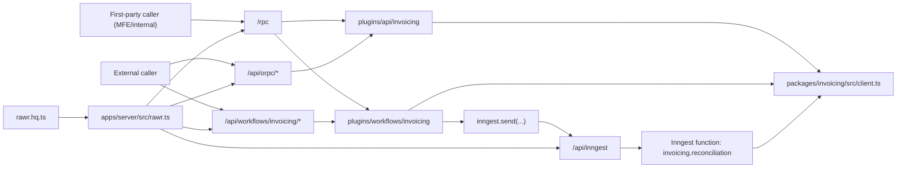

# E2E 04 — Golden Example: Context + Middleware Across Package, API, and Workflows

## 1) Goal and Golden Scope
This walkthrough is the **golden full-picture example** for this packet. It demonstrates one capability (`invoicing`) under production-like context and middleware constraints while staying fully aligned with canonical policy.

What this example covers end to end:
1. Boundary context (principal, request metadata, network policy).
2. Package-internal middleware and in-process client usage.
3. API boundary + workflow trigger boundary, both plugin-owned.
4. Durable runtime execution via Inngest ingress only.
5. Explicit host mount/control-plane ordering and trace bootstrap.
6. Route-aware testing harness expectations.

This file is a reference walkthrough, not policy authority; canonical policy remains in `ARCHITECTURE.md`, `DECISIONS.md`, and `axes/*.md`.

## 2) Locked Route and Ownership Contract

### 2.1 Non-negotiable route semantics
1. `/rpc` is first-party/internal transport only.
2. First-party callers (including MFEs by default) use `RPCLink` on `/rpc` unless an explicit exception is documented.
3. External/third-party callers use published OpenAPI boundaries on `/api/orpc/*` and `/api/workflows/<capability>/*` via `OpenAPILink`.
4. `/api/inngest` is signed runtime ingress only, never a caller-facing API route.
5. No dedicated `/rpc/workflows` mount is required by default; first-party workflow procedures compose under existing `/rpc`.

### 2.2 Canonical caller/auth matrix (contextual projection)
| Caller type | Route family | Link type | Publication boundary | Auth expectation | Forbidden routes |
| --- | --- | --- | --- | --- | --- |
| First-party MFE/internal caller | `/rpc` | `RPCLink` | internal-only (never published) | first-party boundary session/auth or trusted service context | `/api/inngest` |
| External/third-party caller | `/api/orpc/*`, `/api/workflows/<capability>/*` | `OpenAPILink` | externally published OpenAPI clients | boundary auth/session/token | `/rpc`, `/api/inngest` |
| Runtime ingress (Inngest) | `/api/inngest` | Inngest callback transport | runtime-only | signed ingress verification + allow-listing | `/rpc`, `/api/orpc/*`, `/api/workflows/<capability>/*` |

### 2.3 Ownership split (D-006, D-011, D-014 compatible)
1. Workflow/API boundary contracts are plugin-owned (`plugins/api/*/contract.ts`, `plugins/workflows/*/contract.ts`).
2. Packages own transport-neutral domain logic/domain schemas/internal procedures/internal clients.
3. Host composition owns concrete adapter assembly and route mounting.
4. Plugins/packages consume injected ports/context; they do not bootstrap concrete host adapters.

## 3) End-to-End Topology


## 4) Canonical File Map (Adaptable Skeleton)
```text
rawr.hq.ts
apps/server/src/
  rawr.ts
  workflows/context.ts
packages/invoicing/src/
  domain/
    reconciliation.ts
  context.ts
  middleware.ts
  procedures/
    preflight-reconciliation.ts
    get-reconciliation-status.ts
    mark-reconciliation-result.ts
  router.ts
  client.ts
  browser.ts
plugins/api/invoicing/src/
  context.ts
  contract.ts
  router.ts
plugins/workflows/invoicing/src/
  context.ts
  contract.ts
  router.ts
  inngest-middleware.ts
  functions/reconciliation.ts
```

## 5) Implementation Walkthrough (Code-Specific)

### 5.1 Package layer: domain + context + middleware + internal procedures
I/O ownership note:
1. `domain/*` keeps transport-independent domain concepts.
2. Procedure/route I/O is owned in procedures/contracts.
3. Snippets default to inline `.input/.output` schemas; extracted shapes are exception-only.

```ts
// packages/invoicing/src/domain/reconciliation.ts
import { Type, type Static } from "typebox";

export const ReconciliationScopeSchema = Type.Object(
  {
    accountId: Type.String({ minLength: 1 }),
    invoiceIds: Type.Array(Type.String({ minLength: 1 }), { minItems: 1 }),
    dryRun: Type.Boolean({ default: false }),
  },
  { additionalProperties: false, $id: "ReconciliationScope" },
);
export type ReconciliationScope = Static<typeof ReconciliationScopeSchema>;

export const ReconciliationStateSchema = Type.Union(
  [
    Type.Literal("queued"),
    Type.Literal("running"),
    Type.Literal("completed"),
    Type.Literal("failed"),
  ],
  { $id: "ReconciliationState" },
);
export type ReconciliationState = Static<typeof ReconciliationStateSchema>;

export const ReconciliationStatusSchema = Type.Object(
  {
    runId: Type.String({ minLength: 1 }),
    tenantId: Type.String({ minLength: 1 }),
    status: ReconciliationStateSchema,
    isTerminal: Type.Boolean(),
    updatedAt: Type.String({ format: "date-time" }),
  },
  { additionalProperties: false, $id: "ReconciliationStatus" },
);
export type ReconciliationStatus = Static<typeof ReconciliationStatusSchema>;
```

```ts
// packages/invoicing/src/context.ts
import type { ReconciliationScope, ReconciliationStatus } from "./domain/reconciliation";

export type InvoicingPrincipal = {
  subject: string;
  tenantId: string;
  roles: string[];
};

export type InvoicingRequest = {
  requestId: string;
  correlationId: string;
  sourceIp?: string;
  userAgent?: string;
};

export type InvoicingDeps = {
  preflightReconciliation: (args: {
    tenantId: string;
    requestedBy: string;
    input: { requestId: string; scope: ReconciliationScope };
  }) => Promise<{ accepted: true; runId: string; correlationId: string }>;
  getStatus: (args: { tenantId: string; runId: string }) => Promise<ReconciliationStatus | null>;
  markResult: (args: { tenantId: string; input: { runId: string; ok: boolean } }) => Promise<ReconciliationStatus>;
};

export type InvoicingMiddlewareState = {
  roleChecked?: true;
  depsHydrated?: true;
};

export type InvoicingProcedureContext = {
  principal: InvoicingPrincipal;
  request: InvoicingRequest;
  deps: InvoicingDeps;
  middlewareState?: InvoicingMiddlewareState;
};
```

```ts
// packages/invoicing/src/middleware.ts
import { ORPCError, os } from "@orpc/server";
import type { InvoicingProcedureContext } from "./context";

const base = os.$context<InvoicingProcedureContext>();

export const requireFinanceWriteMiddleware = base.middleware(async ({ context, next }) => {
  // D-009 guidance: explicit context marker for heavy checks.
  if (context.middlewareState?.roleChecked) return next();

  if (!context.principal.roles.includes("finance:write")) {
    throw new ORPCError("FORBIDDEN", {
      status: 403,
      message: "finance:write role is required",
    });
  }

  return next({
    context: {
      middlewareState: {
        ...context.middlewareState,
        roleChecked: true,
      },
    },
  });
});

export const hydrateDepsMiddleware = base.middleware(async ({ context, next }) => {
  if (context.middlewareState?.depsHydrated) return next();

  return next({
    context: {
      deps: context.deps,
      middlewareState: {
        ...context.middlewareState,
        depsHydrated: true,
      },
    },
  });
});
```

```ts
// packages/invoicing/src/procedures/preflight-reconciliation.ts
import { os } from "@orpc/server";
import { Type } from "typebox";
import { schema } from "@rawr/orpc-standards";
import { ReconciliationScopeSchema } from "../domain/reconciliation";
import type { InvoicingProcedureContext } from "../context";
import { hydrateDepsMiddleware, requireFinanceWriteMiddleware } from "../middleware";

const base = os.$context<InvoicingProcedureContext>();

export const preflightReconciliationProcedure = base
  .use(requireFinanceWriteMiddleware)
  .use(hydrateDepsMiddleware)
  .input(
    schema(
      {
        requestId: Type.String({ minLength: 1 }),
        scope: ReconciliationScopeSchema,
      },
      { additionalProperties: false },
    ),
  )
  .output(
    schema(
      {
        accepted: Type.Literal(true),
        runId: Type.String({ minLength: 1 }),
        correlationId: Type.String({ minLength: 1 }),
      },
      { additionalProperties: false },
    ),
  )
  .handler(({ context, input }) => {
    return context.deps.preflightReconciliation({
      tenantId: context.principal.tenantId,
      requestedBy: context.principal.subject,
      input,
    });
  });
```

```ts
// packages/invoicing/src/procedures/get-reconciliation-status.ts
import { ORPCError, os } from "@orpc/server";
import { Type } from "typebox";
import { schema, typeBoxStandardSchema as std } from "@rawr/orpc-standards";
import { ReconciliationStatusSchema } from "../domain/reconciliation";
import type { InvoicingProcedureContext } from "../context";
import { hydrateDepsMiddleware, requireFinanceWriteMiddleware } from "../middleware";

const base = os.$context<InvoicingProcedureContext>();

export const getReconciliationStatusProcedure = base
  .use(requireFinanceWriteMiddleware)
  .use(hydrateDepsMiddleware)
  .input(schema({ runId: Type.String({ minLength: 1 }) }))
  // Exception: shared domain status schema reused across package/API/workflow boundaries.
  .output(std(ReconciliationStatusSchema))
  .handler(async ({ context, input }) => {
    const status = await context.deps.getStatus({
      tenantId: context.principal.tenantId,
      runId: input.runId,
    });

    if (!status) {
      throw new ORPCError("NOT_FOUND", {
        status: 404,
        message: `Run not found: ${input.runId}`,
      });
    }

    return status;
  });
```

```ts
// packages/invoicing/src/procedures/mark-reconciliation-result.ts
import { os } from "@orpc/server";
import { Type } from "typebox";
import { schema, typeBoxStandardSchema as std } from "@rawr/orpc-standards";
import { ReconciliationStatusSchema } from "../domain/reconciliation";
import type { InvoicingProcedureContext } from "../context";
import { hydrateDepsMiddleware, requireFinanceWriteMiddleware } from "../middleware";

const base = os.$context<InvoicingProcedureContext>();

export const markReconciliationResultProcedure = base
  .use(requireFinanceWriteMiddleware)
  .use(hydrateDepsMiddleware)
  .input(
    schema(
      {
        runId: Type.String({ minLength: 1 }),
        ok: Type.Boolean(),
      },
      { additionalProperties: false },
    ),
  )
  .output(std(ReconciliationStatusSchema))
  .handler(({ context, input }) => {
    return context.deps.markResult({
      tenantId: context.principal.tenantId,
      input,
    });
  });
```

```ts
// packages/invoicing/src/router.ts
import { os } from "@orpc/server";
import { preflightReconciliationProcedure } from "./procedures/preflight-reconciliation";
import { getReconciliationStatusProcedure } from "./procedures/get-reconciliation-status";
import { markReconciliationResultProcedure } from "./procedures/mark-reconciliation-result";

export const invoicingRouter = os.router({
  preflightReconciliation: preflightReconciliationProcedure,
  getReconciliationStatus: getReconciliationStatusProcedure,
  markReconciliationResult: markReconciliationResultProcedure,
});
```

```ts
// packages/invoicing/src/client.ts
import { createRouterClient } from "@orpc/server";
import { invoicingRouter } from "./router";
import type { InvoicingProcedureContext } from "./context";

export function createInvoicingInternalClient(context: InvoicingProcedureContext) {
  return createRouterClient(invoicingRouter, { context });
}

export type InvoicingClient = ReturnType<typeof createInvoicingInternalClient>;
```

### 5.2 API boundary plugin: boundary-owned contract + direct procedure exports
This example uses direct ORPC procedure exports in `router.ts` for cleaner flow when handler logic is local and readable. `operations/*` remains a valid optional split for larger mapping logic, but it is not required by canonical policy.
```ts
// plugins/api/invoicing/src/context.ts
import type { InvoicingClient } from "@rawr/invoicing";

export type ApiPrincipal = {
  subject: string;
  tenantId: string;
  roles: string[];
  canCallInternal: boolean;
};

export type ApiRequestMeta = {
  requestId: string;
  correlationId: string;
  sourceIp?: string;
  userAgent?: string;
  forwardedFor?: string;
};

export type ApiNetworkPolicy = {
  trustedCidrs: string[];
  enforceInternalOnly: boolean;
  egressPolicyTag: string;
};

export type InvoicingApiContext = {
  principal: ApiPrincipal;
  request: ApiRequestMeta;
  networkPolicy: ApiNetworkPolicy;
  invoicing: InvoicingClient;
};
```

```ts
// plugins/api/invoicing/src/contract.ts
import { oc } from "@orpc/contract";
import { Type } from "typebox";
import { schema, typeBoxStandardSchema as std } from "@rawr/orpc-standards";
import {
  ReconciliationScopeSchema,
  ReconciliationStatusSchema,
} from "@rawr/invoicing/domain/reconciliation";

const tag = ["invoicing-api"] as const;

export const invoicingApiContract = oc.router({
  startReconciliation: oc
    .route({
      method: "POST",
      path: "/invoicing/reconciliation/start",
      tags: tag,
      operationId: "invoicingStartReconciliation",
    })
    .input(
      schema(
        {
          requestId: Type.String({ minLength: 1 }),
          scope: ReconciliationScopeSchema,
        },
        { additionalProperties: false },
      ),
    )
    .output(
      schema(
        {
          accepted: Type.Literal(true),
          runId: Type.String({ minLength: 1 }),
          correlationId: Type.String({ minLength: 1 }),
        },
        { additionalProperties: false },
      ),
    ),

  getReconciliationStatus: oc
    .route({
      method: "GET",
      path: "/invoicing/reconciliation/{runId}",
      tags: tag,
      operationId: "invoicingGetReconciliationStatus",
    })
    .input(schema({ runId: Type.String({ minLength: 1 }) }))
    .output(std(ReconciliationStatusSchema)),
});
```

```ts
// plugins/api/invoicing/src/router.ts
import { implement, ORPCError } from "@orpc/server";
import type { ReconciliationStatus } from "@rawr/invoicing/domain/reconciliation";
import { invoicingApiContract } from "./contract";
import type { InvoicingApiContext } from "./context";

const os = implement<typeof invoicingApiContract, InvoicingApiContext>(invoicingApiContract);

function assertNetworkPolicy(context: InvoicingApiContext) {
  if (!context.networkPolicy.enforceInternalOnly) return;

  const trusted = context.networkPolicy.trustedCidrs;
  const source = context.request.sourceIp ?? "";
  const allowed = trusted.some((cidr) => source.startsWith(cidr.replace("/32", "")));

  if (!allowed) {
    throw new ORPCError("FORBIDDEN", {
      status: 403,
      message: "Source IP is not allowed by boundary policy",
    });
  }
}

function assertRole(context: InvoicingApiContext) {
  if (!context.principal.canCallInternal) {
    throw new ORPCError("FORBIDDEN", {
      status: 403,
      message: "Caller is not allowed to invoke internal invoicing procedures",
    });
  }
}

export const startReconciliationProcedure = os.startReconciliation.handler(
  async ({ context, input }): Promise<{ accepted: true; runId: string; correlationId: string }> => {
    assertNetworkPolicy(context);
    assertRole(context);

    return context.invoicing.preflightReconciliation({
      ...input,
      requestId: context.request.requestId,
    });
  },
);

export const getReconciliationStatusProcedure = os.getReconciliationStatus.handler(
  ({ context, input }): Promise<ReconciliationStatus> => {
    assertNetworkPolicy(context);
    assertRole(context);
    return context.invoicing.getReconciliationStatus(input);
  },
);

export function createInvoicingApiRouter() {
  return os.router({
    startReconciliation: startReconciliationProcedure,
    getReconciliationStatus: getReconciliationStatusProcedure,
  });
}
```

### 5.3 Workflow boundary plugin: trigger/status API separated from runtime ingress (direct procedure exports)
```ts
// plugins/workflows/invoicing/src/context.ts
import type { Inngest } from "inngest";
import type { InvoicingClient } from "@rawr/invoicing";
import type { ReconciliationState } from "@rawr/invoicing/domain/reconciliation";

export type WorkflowPrincipal = {
  subject: string;
  tenantId: string;
  roles: string[];
  canTriggerWorkflows: boolean;
};

export type WorkflowRequest = {
  requestId: string;
  correlationId: string;
};

export type WorkflowRuntime = {
  getRunStatus: (
    runId: string,
    tenantId: string,
  ) => Promise<{ runId: string; status: ReconciliationState; updatedAt: string } | null>;
};

export type InvoicingWorkflowContext = {
  principal: WorkflowPrincipal;
  request: WorkflowRequest;
  runtime: WorkflowRuntime;
  inngest: Inngest;
  invoicing: InvoicingClient;
};
```

```ts
// plugins/workflows/invoicing/src/contract.ts
import { oc } from "@orpc/contract";
import { Type } from "typebox";
import { schema, typeBoxStandardSchema as std } from "@rawr/orpc-standards";
import {
  ReconciliationScopeSchema,
  ReconciliationStatusSchema,
} from "@rawr/invoicing/domain/reconciliation";

const tag = ["invoicing-workflows"] as const;

export const invoicingWorkflowContract = oc.router({
  triggerReconciliation: oc
    .route({
      method: "POST",
      path: "/invoicing/reconciliation/trigger",
      tags: tag,
      operationId: "invoicingTriggerReconciliation",
    })
    .input(
      schema(
        {
          requestId: Type.String({ minLength: 1 }),
          scope: ReconciliationScopeSchema,
        },
        { additionalProperties: false },
      ),
    )
    .output(
      schema(
        {
          accepted: Type.Literal(true),
          runId: Type.String({ minLength: 1 }),
          correlationId: Type.String({ minLength: 1 }),
        },
        { additionalProperties: false },
      ),
    ),

  getRunStatus: oc
    .route({
      method: "GET",
      path: "/invoicing/runs/{runId}",
      tags: tag,
      operationId: "invoicingWorkflowGetRunStatus",
    })
    .input(schema({ runId: Type.String({ minLength: 1 }) }))
    .output(std(ReconciliationStatusSchema)),
});
```

```ts
// plugins/workflows/invoicing/src/router.ts
import { implement, ORPCError } from "@orpc/server";
import { invoicingWorkflowContract } from "./contract";
import type { InvoicingWorkflowContext } from "./context";

const os = implement<typeof invoicingWorkflowContract, InvoicingWorkflowContext>(invoicingWorkflowContract);

function assertWorkflowRole(context: InvoicingWorkflowContext) {
  if (!context.principal.canTriggerWorkflows) {
    throw new ORPCError("FORBIDDEN", {
      status: 403,
      message: "Caller cannot trigger workflows",
    });
  }
}

export const triggerReconciliationProcedure = os.triggerReconciliation.handler(
  async ({ context, input }) => {
    assertWorkflowRole(context);

    const preflight = await context.invoicing.preflightReconciliation({
      ...input,
      requestId: context.request.requestId,
    });

    await context.inngest.send({
      name: "invoicing.reconciliation.requested",
      data: {
        tenantId: context.principal.tenantId,
        runId: preflight.runId,
        requestId: context.request.requestId,
        correlationId: context.request.correlationId,
        requestedBy: context.principal.subject,
        scope: input.scope,
      },
    });

    return preflight;
  },
);

export const getRunStatusProcedure = os.getRunStatus.handler(
  async ({ context, input }) => {
    assertWorkflowRole(context);

    const run = await context.runtime.getRunStatus(input.runId, context.principal.tenantId);

    if (!run) {
      throw new ORPCError("NOT_FOUND", {
        status: 404,
        message: `Run not found: ${input.runId}`,
      });
    }

    return {
      runId: run.runId,
      tenantId: context.principal.tenantId,
      status: run.status,
      isTerminal: run.status === "completed" || run.status === "failed",
      updatedAt: run.updatedAt,
    };
  },
);

export function createInvoicingWorkflowRouter() {
  return os.router({
    triggerReconciliation: triggerReconciliationProcedure,
    getRunStatus: getRunStatusProcedure,
  });
}
```

### 5.4 Durable runtime middleware + function (Inngest control plane)
```ts
// plugins/workflows/invoicing/src/inngest-middleware.ts
import { InngestMiddleware } from "inngest";

export const invoicingRunContextMiddleware = new InngestMiddleware({
  name: "invoicing-run-context",
  init() {
    return {
      onFunctionRun() {
        return {
          transformInput({ ctx }) {
            return {
              ctx: {
                runTrace: {
                  requestId: ctx.event?.data?.requestId ?? "unknown",
                  correlationId: ctx.event?.data?.correlationId ?? "unknown",
                },
              },
            };
          },
        };
      },
    };
  },
});
```

```ts
// plugins/workflows/invoicing/src/functions/reconciliation.ts
import type { Inngest } from "inngest";
import type { InvoicingClient } from "@rawr/invoicing";

export function createInvoicingReconciliationFunction(args: {
  inngest: Inngest;
  invoicing: InvoicingClient;
}) {
  return args.inngest.createFunction(
    {
      id: "invoicing.reconciliation",
      retries: 2,
      concurrency: { limit: 10, key: "event.data.tenantId" },
    },
    { event: "invoicing.reconciliation.requested" },
    async ({ event, step, logger, attempt, runTrace }) => {
      logger.info("invoicing reconciliation started", {
        runId: event.data.runId,
        tenantId: event.data.tenantId,
        attempt,
        correlationId: runTrace.correlationId,
      });

      await step.run("invoicing/reconcile", async () => {
        // External reconciliation side-effects omitted.
        return { ok: true as const };
      });

      const status = await step.run("invoicing/mark-result", async () => {
        return args.invoicing.markReconciliationResult({
          runId: event.data.runId,
          ok: true,
        });
      });

      return {
        ok: true as const,
        runId: status.runId,
        status: status.status,
      };
    },
  );
}
```

### 5.5 Manifest composition and host mounts (D-008 and D-014 explicit)
```ts
// rawr.hq.ts
import { oc } from "@orpc/contract";
import { Inngest } from "inngest";
import type { InvoicingClient } from "@rawr/invoicing";
import { createInvoicingApiRouter, invoicingApiContract } from "./plugins/api/invoicing/src";
import {
  createInvoicingWorkflowRouter,
  createInvoicingReconciliationFunction,
  invoicingWorkflowContract,
  invoicingRunContextMiddleware,
} from "./plugins/workflows/invoicing/src";

export function createRawrHqManifest(args: { invoicing: InvoicingClient }) {
  const inngest = new Inngest({
    id: "rawr-hq",
    middleware: [invoicingRunContextMiddleware],
  });

  const workflowTriggerRouter = createInvoicingWorkflowRouter();
  const apiRouter = createInvoicingApiRouter();

  return {
    // Internal composed surface for /rpc first-party calls.
    orpc: {
      contract: oc.router({
        invoicing: {
          api: invoicingApiContract,
          workflows: invoicingWorkflowContract,
        },
      }),
      router: {
        invoicing: {
          api: apiRouter,
          workflows: workflowTriggerRouter,
        },
      },
    },

    // Published workflow boundary surface for /api/workflows/<capability>/*.
    workflows: {
      triggerContract: oc.router({ invoicing: invoicingWorkflowContract }),
      triggerRouter: { invoicing: workflowTriggerRouter },
    },

    // Single runtime-owned ingress bundle.
    inngest: {
      client: inngest,
      functions: [
        createInvoicingReconciliationFunction({
          inngest,
          invoicing: args.invoicing,
        }),
      ],
    },
  } as const;
}
```

```ts
// apps/server/src/workflows/context.ts
import type { Inngest } from "inngest";
import { createInvoicingInternalClient, type InvoicingDeps } from "@rawr/invoicing";

export type BoundaryContextDeps = {
  inngest: Inngest;
  invoicingDeps: InvoicingDeps;
  trustedCidrs: string[];
};

export function createBoundaryContext(request: Request, deps: BoundaryContextDeps) {
  const requestId = request.headers.get("x-request-id") ?? crypto.randomUUID();
  const correlationId = request.headers.get("x-correlation-id") ?? requestId;

  const principal = {
    subject: request.headers.get("x-sub") ?? "anonymous",
    tenantId: request.headers.get("x-tenant-id") ?? "default",
    roles: (request.headers.get("x-roles") ?? "").split(",").filter(Boolean),
    canCallInternal: true,
    canTriggerWorkflows: true,
  };

  const sourceIp = request.headers.get("x-forwarded-for") ?? undefined;
  const userAgent = request.headers.get("user-agent") ?? undefined;

  const invoicing = createInvoicingInternalClient({
    principal: {
      subject: principal.subject,
      tenantId: principal.tenantId,
      roles: principal.roles,
    },
    request: { requestId, correlationId, sourceIp, userAgent },
    deps: deps.invoicingDeps,
    middlewareState: {},
  });

  return {
    principal,
    request: {
      requestId,
      correlationId,
      sourceIp,
      userAgent,
      forwardedFor: request.headers.get("x-forwarded-for") ?? undefined,
    },
    networkPolicy: {
      trustedCidrs: deps.trustedCidrs,
      enforceInternalOnly: true,
      egressPolicyTag: "invoicing-internal",
    },
    runtime: {
      getRunStatus: async (_runId: string, _tenantId: string) => null,
    },
    inngest: deps.inngest,
    invoicing,
  };
}

export function createWorkflowBoundaryContext(request: Request, deps: BoundaryContextDeps) {
  // Intentional alias: workflow boundary uses the same context contract as API boundary.
  return createBoundaryContext(request, deps);
}
```

```ts
// apps/server/src/rawr.ts
import { OpenAPIHandler } from "@orpc/openapi/fetch";
import { RPCHandler } from "@orpc/server/fetch";
import { createInngestServeHandler } from "@rawr/coordination-inngest";
import { createInvoicingInternalClient, type InvoicingDeps } from "@rawr/invoicing";
import { createRawrHqManifest } from "../../rawr.hq";
import { createBoundaryContext, createWorkflowBoundaryContext } from "./workflows/context";

type RouteApp = {
  all: (
    path: string,
    handler: (ctx: { request: Request }) => Promise<Response> | Response,
    options?: { parse: "none" },
  ) => void;
};

type RouteDeps = {
  invoicingDeps: InvoicingDeps;
  trustedCidrs: string[];
};

export function registerRoutes(app: RouteApp, deps: RouteDeps) {
  // D-008: baseline traces initialized before Inngest bundle usage and route registration.
  initializeExtendedTracesBaseline();

  const runtimeInvoicingClient = createInvoicingInternalClient({
    principal: {
      subject: "runtime",
      tenantId: "system",
      roles: ["system:runtime", "finance:write"],
    },
    request: {
      requestId: "runtime-bootstrap",
      correlationId: "runtime-bootstrap",
    },
    deps: deps.invoicingDeps,
    middlewareState: {},
  });

  const rawrHqManifest = createRawrHqManifest({
    invoicing: runtimeInvoicingClient,
  });

  const rpcHandler = new RPCHandler(rawrHqManifest.orpc.router);
  const apiHandler = new OpenAPIHandler(rawrHqManifest.orpc.router.invoicing.api);
  const workflowHandler = new OpenAPIHandler(rawrHqManifest.workflows.triggerRouter);
  const inngestHandler = createInngestServeHandler(rawrHqManifest.inngest);
  const contextDeps = {
    inngest: rawrHqManifest.inngest.client,
    invoicingDeps: deps.invoicingDeps,
    trustedCidrs: deps.trustedCidrs,
  } as const;

  // 1) Runtime ingress first.
  app.all("/api/inngest", async ({ request }: { request: Request }) => {
    const isVerified = await verifyInngestSignature(request);
    if (!isVerified) return new Response("forbidden", { status: 403 });
    return inngestHandler(request);
  });

  // 2) Caller-facing workflow boundary routes.
  app.all(
    "/api/workflows/*",
    async ({ request }: { request: Request }) => {
      const context = createWorkflowBoundaryContext(request, contextDeps);

      const result = await workflowHandler.handle(request, {
        prefix: "/api/workflows",
        context,
      });

      return result.matched ? result.response : new Response("not found", { status: 404 });
    },
    { parse: "none" },
  );

  // 3) First-party internal /rpc and published /api/orpc/*.
  app.all(
    "/rpc/*",
    async ({ request }: { request: Request }) => {
      const context = createBoundaryContext(request, contextDeps);

      const result = await rpcHandler.handle(request, {
        prefix: "/rpc",
        context,
      });

      return result.matched ? result.response : new Response("not found", { status: 404 });
    },
    { parse: "none" },
  );

  app.all(
    "/api/orpc/*",
    async ({ request }: { request: Request }) => {
      const context = createBoundaryContext(request, contextDeps);

      const result = await apiHandler.handle(request, {
        prefix: "/api/orpc",
        context,
      });

      return result.matched ? result.response : new Response("not found", { status: 404 });
    },
    { parse: "none" },
  );
}
```

### 5.6 First-party default vs external published client transport
```ts
import { createORPCClient } from "@orpc/client";
import { RPCLink } from "@orpc/client/fetch";
import { OpenAPILink } from "@orpc/openapi-client/fetch";

// First-party default (including MFE by default): /rpc
const firstPartyWorkflowClient = createORPCClient(capabilityClients.invoicing.workflows, {
  link: new RPCLink({ url: `${baseUrl}/rpc` }),
});

// Published external boundary: /api/workflows/<capability>/*
const externalWorkflowClient = createORPCClient(externalContracts.invoicing.workflows, {
  link: new OpenAPILink({ url: `${baseUrl}/api/workflows` }),
});

// Published API boundary: /api/orpc/*
const externalApiClient = createORPCClient(externalContracts.invoicing.api, {
  link: new OpenAPILink({ url: `${baseUrl}/api/orpc` }),
});
```

## 6) Middleware and Context Boundaries (Control-Plane Split)

### 6.1 Boundary vs runtime control-plane matrix
| Concern | Boundary control plane (oRPC/Elysia) | Runtime control plane (Inngest) |
| --- | --- | --- |
| Auth/role/network policy | yes | no |
| Caller route access policy | yes | no |
| Request context hydration (`requestId`, `correlationId`, principal) | yes | no |
| Durable retries/concurrency/step lifecycle | no | yes |
| Runtime trace enrichment (`runTrace`) | no | yes |
| `finished` hook side-effects | n/a | idempotent/non-critical guidance (D-010 open) |

### 6.2 Dedupe boundaries
| Layer | Runs once | Can repeat | Guidance |
| --- | --- | --- | --- |
| Host context factory | once per request | every request | keep deterministic and pure |
| oRPC middleware | often once per chain | can repeat in nested calls | use explicit context markers for heavy checks (D-009 guidance) |
| Inngest middleware hooks | per run/phase | can rerun on retries | avoid exactly-once assumptions |
| `step.run` blocks | per successful step-id state | retried on failure | keep step handlers retry-safe |

## 7) Runtime Sequence Walkthrough

### 7.1 API path (`/api/orpc/*`)
1. Host creates boundary context from request headers and injected deps.
2. API route enforces boundary role/network policy.
3. API procedure handler calls package internal client in-process.
4. Package middleware validates role + hydrates deps.
5. Procedure returns typed boundary output.

### 7.2 Workflow trigger/status path (first-party `/rpc`, external `/api/workflows/<capability>/*`)
1. Host creates boundary context.
2. Workflow router checks trigger permissions.
3. Trigger procedure handler preflights through package internal client.
4. Trigger procedure handler enqueues `invoicing.reconciliation.requested` via `inngest.send`.
5. Caller receives `{ accepted, runId, correlationId }` immediately.

### 7.3 Runtime ingress path (`/api/inngest` only)
1. Host verifies signed runtime callback.
2. Inngest middleware enriches runtime context (`runTrace`).
3. Durable function executes `step.run` blocks.
4. Function writes final status through package internal client.
5. Caller polls status via `/rpc` (first-party default) or `/api/workflows/*` (published boundary).

## 8) Harness Verification Blueprint (Axis 12 Aligned)

### 8.1 Surface-to-harness map
| Surface context | Primary harness | Route family | Required positives | Required negatives |
| --- | --- | --- | --- | --- |
| Web first-party | `RPCLink` | `/rpc` | trigger/status behavior, typed errors, correlation continuity | reject `/api/inngest` |
| Web external/published | `OpenAPILink` | `/api/orpc/*`, `/api/workflows/<capability>/*` | published contract + auth boundaries | reject `/rpc`; reject `/api/inngest` |
| CLI internal | `createRouterClient` | in-process | package flow correctness, dedupe behavior, context contracts | no local HTTP self-call default |
| API plugin boundary | `createRouterClient` + `OpenAPILink` | in-process + `/api/orpc/*` | boundary procedure mapping + boundary middleware behavior | reject `/api/inngest` |
| Workflow trigger/status | `RPCLink` + `OpenAPILink` + `createRouterClient` | `/rpc` + `/api/workflows/<capability>/*` + in-process preflight | preflight -> enqueue -> status continuity | caller suites reject `/api/inngest`; external suites reject `/rpc` |
| Runtime ingress | signed callback transport | `/api/inngest` | signature, durable lifecycle, step behavior | do not assert caller-route semantics |

### 8.2 Mandatory negative-route tests
```ts
it("keeps /api/inngest out of caller-route surfaces", () => {
  const callerRouteFamilies = getCallerRouteFamiliesFromManifest(rawrHqManifest);
  expect(callerRouteFamilies).toEqual(
    expect.arrayContaining(["/rpc", "/api/orpc/*", "/api/workflows/<capability>/*"]),
  );
  expect(callerRouteFamilies).not.toContain("/api/inngest");
});

it("rejects external caller access to /rpc", async () => {
  const response = await fetch(`${externalBaseUrl}/rpc/invoicing/workflows/getRunStatus`, {
    method: "POST",
    headers: { "content-type": "application/json" },
    body: JSON.stringify({ input: { runId: "run-1" } }),
  });
  expect([401, 403, 404]).toContain(response.status);
});

it("keeps runtime ingress verification isolated from caller-route assertions", async () => {
  const ingressResponse = await signedInngestCallback(baseUrl, payload);
  expect(ingressResponse.status).toBe(200);
  // Caller-route assertions belong in separate /rpc and /api/* suites.
});
```

### 8.3 Suite IDs for downstream tracking
1. `suite:web:first-party-rpc`
2. `suite:web:published-openapi`
3. `suite:cli:in-process`
4. `suite:api:boundary`
5. `suite:workflow:trigger-status`
6. `suite:runtime:ingress`
7. `suite:cross-surface:metadata-import-boundary`

## 9) D-013 / D-014 / D-015 Compatibility Notes
1. Runtime identity and composition checks are keyed to manifest-owned surfaces and `rawr.kind` + `rawr.capability` (D-013).
2. Legacy metadata fields (`templateRole`, `channel`, `publishTier`, `published`) are not runtime behavior keys (D-013).
3. Reusable harness and infrastructure helpers remain package-first; plugin suites may import package helpers, not vice versa (D-014/D-015).
4. Verification stays route-aware and layer-specific per Axis 12 (D-015).

## 10) Policy Consistency Checklist
- [x] Route split and caller/auth semantics match canonical matrix.
- [x] `/api/inngest` remains runtime-only and signed.
- [x] Workflow/API boundary contracts are plugin-owned.
- [x] Package remains transport-neutral and internal-client-first.
- [x] Context envelopes remain split (boundary request context vs runtime function context).
- [x] Middleware control planes remain split (boundary vs durable runtime).
- [x] D-008 bootstrap order is explicit and host-owned.
- [x] D-009 remains guidance-level (`SHOULD`) for heavy middleware dedupe markers.
- [x] D-010 remains guidance-level (idempotent/non-critical `finished` side effects).
- [x] D-013 compatibility is explicit (manifest + capability/kind keys only).
- [x] D-014 compatibility is explicit (host-owned adapter assembly + one-way import direction).
- [x] D-015 harness/negative-route expectations are explicit.

## Conformance Anchors
| Example segment | Canonical anchors |
| --- | --- |
| Sections 2.1-2.3 (route, caller, ownership contract) | `ARCHITECTURE.md` sections 2, 2.1, 4, 5; `DECISIONS.md` D-005, D-006, D-007 |
| Sections 3-4 (topology + file map) | `ARCHITECTURE.md` sections 6-9; `axes/07-host-composition.md`; `axes/08-workflow-api-boundaries.md` |
| Section 5.1 (package context/middleware/procedures) | `axes/02-internal-clients.md`; `axes/04-context-propagation.md`; `axes/06-middleware.md`; `DECISIONS.md` D-011, D-012 |
| Sections 5.2-5.3 (plugin-owned contracts/direct procedures) | `axes/01-external-client-generation.md`; `axes/08-workflow-api-boundaries.md`; `DECISIONS.md` D-006, D-011, D-012 |
| Sections 5.4-5.5 (runtime middleware + host bootstrap/mount order) | `axes/05-errors-observability.md`; `axes/06-middleware.md`; `axes/07-host-composition.md`; `DECISIONS.md` D-008, D-009, D-010 |
| Section 5.6 (transport split by caller mode) | `axes/01-external-client-generation.md`; `axes/03-split-vs-collapse.md`; `ARCHITECTURE.md` caller/auth matrix |
| Sections 6-7 (control-plane split + runtime sequences) | `axes/04-context-propagation.md`; `axes/05-errors-observability.md`; `axes/06-middleware.md`; `axes/08-workflow-api-boundaries.md` |
| Section 8 (harness blueprint) | `axes/12-testing-harness-and-verification-strategy.md`; `IMPLEMENTATION_ADJACENT_DOC_UPDATES_SPEC.md`; `DECISIONS.md` D-015 |
| Section 9 (metadata + infrastructure seam compatibility) | `axes/10-legacy-metadata-and-lifecycle-simplification.md`; `axes/11-core-infrastructure-packaging-and-composition-guarantees.md`; `DECISIONS.md` D-013, D-014 |
| Section 10 (consistency checklist) | `README.md` authority split + all canonical docs above |
