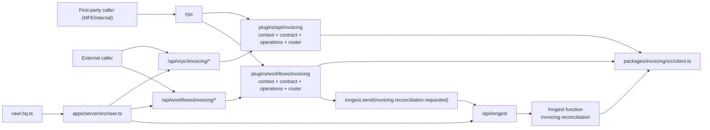

# E2E 04 — Real-World Context and Middleware Across Package, API, and Workflows

## Authority and Usage
> This walkthrough is **non-normative** reference material. Canonical policy authority remains in `README.md`, `ARCHITECTURE.md`, `DECISIONS.md`, and `axes/*.md`. If any example detail appears to conflict with those sources, follow the canonical packet policy docs.

## 1) Goal and Real-World Framing
This walkthrough shows one capability (`invoicing`) under realistic context scale:
1. Multi-tenant principal + role checks.
2. Request metadata (`requestId`, `correlationId`, IP, UA).
3. Network policy (trusted ingress + egress policy tagging).
4. Internal package orchestration via in-process client.
5. Workflow trigger API that enqueues durable execution.
6. Inngest runtime execution with run-level middleware context.

This is intentionally not a toy single-parameter example.

### Key Axes Covered
- AXIS_04: Full context envelope scope (principal, request metadata, correlation, network hints).
- AXIS_05: Error handling, timeline recording, and trace correlation continuity.
- AXIS_06: Middleware placement split (boundary vs durable runtime) and dedupe guidance.
- AXIS_07: Baseline traces bootstrap order and explicit mount/control-plane order.
- Prior example axes remain in force; this walkthrough composes them under production-like constraints.

## 2) Non-Negotiable Route Semantics
1. `/rpc` is first-party/internal transport only (`RPCLink`) and is never externally published.
2. First-party callers (including MFEs by default) use `/rpc`; external callers use published OpenAPI routes.
3. `/api/workflows/<capability>/*` is caller-facing trigger/status publication surface (mounted at host via `/api/workflows/*` wildcard).
4. `/api/orpc/*` is the caller-facing OpenAPI publication surface for non-workflow API boundaries.
5. `/api/inngest` is runtime ingress only and never a caller-facing API.
6. API/workflow boundary contracts are plugin-owned; workflow trigger/status I/O schemas stay at the workflow plugin boundary.
7. Package layer remains transport-neutral and does not own caller-facing workflow boundary contracts/schemas.
8. No dedicated `/rpc/workflows` mount is required by default.

### 2.1 Caller/Auth Semantics
| Caller type | Route family | Link type | Publication boundary | Auth expectation | Forbidden routes |
| --- | --- | --- | --- | --- | --- |
| First-party MFE/internal caller | `/rpc` | `RPCLink` | internal only (RPC never published) | first-party session/auth or trusted service context | `/api/inngest` |
| External/third-party caller | `/api/orpc/*`, `/api/workflows/<capability>/*` | `OpenAPILink` | externally published OpenAPI clients | boundary auth/session/token | `/rpc`, `/api/inngest` |
| Runtime ingress (Inngest) | `/api/inngest` | Inngest callback transport | runtime-only | signed ingress verification + gateway allow-listing | `/rpc`, `/api/orpc/*`, `/api/workflows/<capability>/*` |

### 2.2 Runtime Ingress Enforcement Minimum
1. Verify Inngest request signatures before handing requests to runtime handlers.
2. Deny non-runtime traffic to `/api/inngest` at gateway/proxy and route middleware.
3. Keep `/api/inngest` out of published SDK/docs; publish only `/api/orpc/*` and `/api/workflows/<capability>/*`.

### 2.3 D-008 Bootstrap Baseline
1. Host bootstrap initializes `extendedTracesMiddleware()` before composing the Inngest client/functions or route registration helpers.
2. One runtime-owned Inngest bundle is reused across `/api/inngest` ingress and workflow trigger enqueue paths.
3. Plugin middleware can extend runtime instrumentation context but does not replace/reorder the host baseline traces middleware.
4. Mount/control-plane order is explicit: `/api/inngest`, then `/api/workflows/*`, then `/rpc` and `/api/orpc/*`.

## 3) Topology Diagram


## 4) File Tree Diff from E2E 03
```text
packages/invoicing/src/
  middleware.ts

packages/invoicing/src/procedures/
  preflight-reconciliation.ts
  get-reconciliation-status.ts
  mark-reconciliation-result.ts

plugins/api/invoicing/src/operations/
  start-reconciliation.ts
  get-reconciliation-status.ts

plugins/workflows/invoicing/src/
  inngest-middleware.ts

plugins/workflows/invoicing/src/operations/
  trigger-reconciliation.ts
  get-run-status.ts
```

Baseline note: core topology, composition root, and browser/multi-caller integration remain as established in `e2e-03-microfrontend-integration.md`; this walkthrough adds context-depth and middleware control details.

## 5) Key Files and Concrete Code

### 5.1 Package layer: shared domain, context contract, and idempotent middleware

I/O ownership note: domain modules keep domain concepts only; procedure and boundary route schemas are defined beside procedures/contracts. Inline `.input/.output` is default for route/procedure I/O, and extracted I/O schemas are reserved for truly shared/large payloads using `{ input, output }` pairing.

```ts
// packages/invoicing/src/domain/reconciliation.ts
import { Type, type Static } from "typebox";

export const ReconciliationScopeSchema = Type.Object(
  {
    accountId: Type.String({ minLength: 1 }),
    invoiceIds: Type.Array(Type.String({ minLength: 1 }), { minItems: 1 }),
    dryRun: Type.Boolean({ default: false }),
  },
  { additionalProperties: false, $id: "ReconciliationScope" },
);
export type ReconciliationScope = Static<typeof ReconciliationScopeSchema>;

export const ReconciliationStateSchema = Type.Union(
  [
    Type.Literal("queued"),
    Type.Literal("running"),
    Type.Literal("completed"),
    Type.Literal("failed"),
  ],
  { $id: "ReconciliationState" },
);
export type ReconciliationState = Static<typeof ReconciliationStateSchema>;

export function isTerminalReconciliationState(status: ReconciliationState): boolean {
  return status === "completed" || status === "failed";
}

export const ReconciliationStatusSchema = Type.Object(
  {
    runId: Type.String({ minLength: 1 }),
    tenantId: Type.String({ minLength: 1 }),
    status: ReconciliationStateSchema,
    isTerminal: Type.Boolean(),
    updatedAt: Type.String({ format: "date-time" }),
  },
  { additionalProperties: false, $id: "ReconciliationStatus" },
);
export type ReconciliationStatus = Static<typeof ReconciliationStatusSchema>;
```

```ts
// packages/invoicing/src/context.ts
import type { ReconciliationScope, ReconciliationStatus } from "./domain/reconciliation";

export type InvoicingPrincipal = {
  subject: string;
  tenantId: string;
  roles: string[];
};

export type InvoicingRequest = {
  // Request metadata is boundary/context-owned, not a domain concept.
  requestId: string;
  correlationId: string;
  sourceIp?: string;
  userAgent?: string;
};

export type InvoicingDeps = {
  newRunId: () => string;
  nowIso: () => string;
  preflightReconciliation: (args: {
    tenantId: string;
    requestedBy: string;
    input: { requestId: string; scope: ReconciliationScope };
  }) => Promise<{ accepted: true; runId: string; correlationId: string }>;
  getStatus: (args: { tenantId: string; runId: string }) => Promise<ReconciliationStatus | null>;
  markResult: (args: { tenantId: string; input: { runId: string; ok: boolean } }) => Promise<ReconciliationStatus>;
};

export type InvoicingMiddlewareState = {
  roleChecked?: true;
  depsHydrated?: true;
};

export type InvoicingProcedureContext = {
  principal: InvoicingPrincipal;
  request: InvoicingRequest;
  deps: InvoicingDeps;
  middlewareState?: InvoicingMiddlewareState;
};
```

```ts
// packages/invoicing/src/middleware.ts
import { ORPCError, os } from "@orpc/server";
import type { InvoicingProcedureContext } from "./context";

const base = os.$context<InvoicingProcedureContext>();

export const requireFinanceWriteMiddleware = base.middleware(async ({ context, next }) => {
  // Manual dedupe: avoid repeating expensive or noisy checks in nested internal calls.
  if (context.middlewareState?.roleChecked) return next();

  if (!context.principal.roles.includes("finance:write")) {
    throw new ORPCError("FORBIDDEN", {
      status: 403,
      message: "finance:write role is required",
    });
  }

  return next({
    context: {
      middlewareState: {
        ...context.middlewareState,
        roleChecked: true,
      },
    },
  });
});

export const hydrateDepsMiddleware = base.middleware(async ({ context, next }) => {
  if (context.middlewareState?.depsHydrated) return next();

  return next({
    context: {
      deps: context.deps,
      middlewareState: {
        ...context.middlewareState,
        depsHydrated: true,
      },
    },
  });
});
```

```ts
// packages/invoicing/src/procedures/preflight-reconciliation.ts
import { os } from "@orpc/server";
import { Type } from "typebox";
import { schema, typeBoxStandardSchema as std } from "@rawr/orpc-standards";
import { ReconciliationScopeSchema } from "../domain/reconciliation";
import type { InvoicingProcedureContext } from "../context";
import { hydrateDepsMiddleware, requireFinanceWriteMiddleware } from "../middleware";

const base = os.$context<InvoicingProcedureContext>();

export const preflightReconciliationProcedure = base
  .use(requireFinanceWriteMiddleware)
  .use(hydrateDepsMiddleware)
  .input(
    schema(
      {
        requestId: Type.String({ minLength: 1 }),
        scope: ReconciliationScopeSchema,
      },
      { additionalProperties: false },
    ),
  )
  .output(
    schema(
      {
        accepted: Type.Literal(true),
        runId: Type.String({ minLength: 1 }),
        correlationId: Type.String({ minLength: 1 }),
      },
      { additionalProperties: false },
    ),
  )
  .handler(async ({ context, input }) => {
    return context.deps.preflightReconciliation({
      tenantId: context.principal.tenantId,
      requestedBy: context.principal.subject,
      input,
    });
  });
```

```ts
// packages/invoicing/src/procedures/get-reconciliation-status.ts
import { ORPCError, os } from "@orpc/server";
import { Type } from "typebox";
import { typeBoxStandardSchema as std } from "@rawr/orpc-standards";
import { ReconciliationStatusSchema } from "../domain/reconciliation";
import type { InvoicingProcedureContext } from "../context";
import { hydrateDepsMiddleware, requireFinanceWriteMiddleware } from "../middleware";

const base = os.$context<InvoicingProcedureContext>();

export const getReconciliationStatusProcedure = base
  .use(requireFinanceWriteMiddleware)
  .use(hydrateDepsMiddleware)
  .input(schema({ runId: Type.String({ minLength: 1 }) }))
  .output(std(ReconciliationStatusSchema))
  .handler(async ({ context, input }) => {
    const status = await context.deps.getStatus({
      tenantId: context.principal.tenantId,
      runId: input.runId,
    });

    if (!status) {
      throw new ORPCError("NOT_FOUND", {
        status: 404,
        message: `Run not found: ${input.runId}`,
      });
    }

    return status;
  });
```

```ts
// packages/invoicing/src/procedures/mark-reconciliation-result.ts
import { os } from "@orpc/server";
import { Type } from "typebox";
import { schema, typeBoxStandardSchema as std } from "@rawr/orpc-standards";
import { ReconciliationStatusSchema } from "../domain/reconciliation";
import type { InvoicingProcedureContext } from "../context";
import { hydrateDepsMiddleware, requireFinanceWriteMiddleware } from "../middleware";

const base = os.$context<InvoicingProcedureContext>();

export const markReconciliationResultProcedure = base
  .use(requireFinanceWriteMiddleware)
  .use(hydrateDepsMiddleware)
  .input(
    schema(
      {
        runId: Type.String({ minLength: 1 }),
        ok: Type.Boolean(),
      },
      { additionalProperties: false },
    ),
  )
  .output(std(ReconciliationStatusSchema))
  .handler(async ({ context, input }) => {
    return context.deps.markResult({
      tenantId: context.principal.tenantId,
      input,
    });
  });
```

```ts
// packages/invoicing/src/router.ts
import { os } from "@orpc/server";
import { preflightReconciliationProcedure } from "./procedures/preflight-reconciliation";
import { getReconciliationStatusProcedure } from "./procedures/get-reconciliation-status";
import { markReconciliationResultProcedure } from "./procedures/mark-reconciliation-result";

export const invoicingRouter = os.router({
  preflightReconciliation: preflightReconciliationProcedure,
  getReconciliationStatus: getReconciliationStatusProcedure,
  markReconciliationResult: markReconciliationResultProcedure,
});
```

```ts
// packages/invoicing/src/client.ts
import { createRouterClient } from "@orpc/server";
import { invoicingRouter } from "./router";
import type { InvoicingProcedureContext } from "./context";

export type InvoicingClient = ReturnType<typeof createInvoicingInternalClient>;

export function createInvoicingInternalClient(context: InvoicingProcedureContext) {
  return createRouterClient(invoicingRouter, { context });
}
```

### 5.2 API plugin: boundary context and middleware concerns (auth/role/network)

```ts
// plugins/api/invoicing/src/context.ts
import type { InvoicingClient } from "@rawr/invoicing";

export type ApiPrincipal = {
  subject: string;
  tenantId: string;
  roles: string[];
  canCallInternal: boolean;
};

export type ApiRequestMeta = {
  requestId: string;
  correlationId: string;
  sourceIp?: string;
  userAgent?: string;
  forwardedFor?: string;
};

export type ApiNetworkPolicy = {
  trustedCidrs: string[];
  enforceInternalOnly: boolean;
  egressPolicyTag: string;
};

export type InvoicingApiContext = {
  principal: ApiPrincipal;
  request: ApiRequestMeta;
  networkPolicy: ApiNetworkPolicy;
  invoicing: InvoicingClient;
};
```

```ts
// plugins/api/invoicing/src/contract.ts
import { oc } from "@orpc/contract";
import { Type } from "typebox";
import { schema, typeBoxStandardSchema as std } from "@rawr/orpc-standards";
import {
  ReconciliationScopeSchema,
  ReconciliationStatusSchema,
} from "@rawr/invoicing/domain/reconciliation";

const tag = ["invoicing-api"] as const;

export const invoicingApiContract = oc.router({
  startReconciliation: oc
    .route({
      method: "POST",
      path: "/invoicing/reconciliation/start",
      tags: tag,
      operationId: "invoicingStartReconciliation",
    })
    .input(
      schema(
        {
          requestId: Type.String({ minLength: 1 }),
          scope: ReconciliationScopeSchema,
        },
        { additionalProperties: false },
      ),
    )
    .output(
      schema(
        {
          accepted: Type.Literal(true),
          runId: Type.String({ minLength: 1 }),
          correlationId: Type.String({ minLength: 1 }),
        },
        { additionalProperties: false },
      ),
    ),

  getReconciliationStatus: oc
    .route({
      method: "GET",
      path: "/invoicing/reconciliation/{runId}",
      tags: tag,
      operationId: "invoicingGetReconciliationStatus",
    })
    .input(schema({ runId: Type.String({ minLength: 1 }) }))
    .output(std(ReconciliationStatusSchema)),
});
```

```ts
// plugins/api/invoicing/src/operations/start-reconciliation.ts
import { ORPCError } from "@orpc/server";
import type { ReconciliationScope } from "@rawr/invoicing/domain/reconciliation";
import type { InvoicingApiContext } from "../context";

function assertNetworkPolicy(context: InvoicingApiContext) {
  if (!context.networkPolicy.enforceInternalOnly) return;

  const trusted = context.networkPolicy.trustedCidrs;
  const source = context.request.sourceIp ?? "";
  const allowed = trusted.some((cidr) => source.startsWith(cidr.replace("/32", "")));

  if (!allowed) {
    throw new ORPCError("FORBIDDEN", {
      status: 403,
      message: "Source IP is not allowed by boundary policy",
    });
  }
}

function assertRole(context: InvoicingApiContext) {
  if (!context.principal.canCallInternal) {
    throw new ORPCError("FORBIDDEN", {
      status: 403,
      message: "Caller is not allowed to invoke internal invoicing procedures",
    });
  }
}

export async function startReconciliationOperation(
  context: InvoicingApiContext,
  input: { requestId: string; scope: ReconciliationScope },
): Promise<{ accepted: true; runId: string; correlationId: string }> {
  assertNetworkPolicy(context);
  assertRole(context);

  return context.invoicing.preflightReconciliation({
    ...input,
    // boundary-owned trace key propagation
    requestId: context.request.requestId,
  });
}
```

```ts
// plugins/api/invoicing/src/operations/get-reconciliation-status.ts
import type { ReconciliationStatus } from "@rawr/invoicing/domain/reconciliation";
import type { InvoicingApiContext } from "../context";

export async function getReconciliationStatusOperation(
  context: InvoicingApiContext,
  input: { runId: string },
): Promise<ReconciliationStatus> {
  return context.invoicing.getReconciliationStatus(input);
}
```

```ts
// plugins/api/invoicing/src/router.ts
import { implement } from "@orpc/server";
import { invoicingApiContract } from "./contract";
import type { InvoicingApiContext } from "./context";
import { getReconciliationStatusOperation } from "./operations/get-reconciliation-status";
import { startReconciliationOperation } from "./operations/start-reconciliation";

const os = implement<typeof invoicingApiContract, InvoicingApiContext>(invoicingApiContract);

export function createInvoicingApiRouter() {
  return os.router({
    startReconciliation: os.startReconciliation.handler(async ({ context, input }) =>
      startReconciliationOperation(context, input),
    ),
    getReconciliationStatus: os.getReconciliationStatus.handler(async ({ context, input }) =>
      getReconciliationStatusOperation(context, input),
    ),
  });
}
```

### 5.3 Workflow plugin: trigger boundary and Inngest runtime relationship

```ts
// plugins/workflows/invoicing/src/context.ts
import type { Inngest } from "inngest";
import type { InvoicingClient } from "@rawr/invoicing";

export type WorkflowPrincipal = {
  subject: string;
  tenantId: string;
  roles: string[];
  canTriggerWorkflows: boolean;
};

export type WorkflowRequest = {
  requestId: string;
  correlationId: string;
};

export type WorkflowRuntime = {
  getRunStatus: (runId: string, tenantId: string) => Promise<{ runId: string; status: string; updatedAt: string } | null>;
};

export type InvoicingWorkflowContext = {
  principal: WorkflowPrincipal;
  request: WorkflowRequest;
  runtime: WorkflowRuntime;
  inngest: Inngest;
  invoicing: InvoicingClient;
};
```

```ts
// plugins/workflows/invoicing/src/contract.ts
import { oc } from "@orpc/contract";
import { Type } from "typebox";
import { schema, typeBoxStandardSchema as std } from "@rawr/orpc-standards";
import {
  ReconciliationScopeSchema,
  ReconciliationStatusSchema,
} from "@rawr/invoicing/domain/reconciliation";

const tag = ["invoicing-workflows"] as const;

export const invoicingWorkflowContract = oc.router({
  triggerReconciliation: oc
    .route({
      method: "POST",
      path: "/invoicing/reconciliation/trigger",
      tags: tag,
      operationId: "invoicingTriggerReconciliation",
    })
    .input(
      schema(
        {
          requestId: Type.String({ minLength: 1 }),
          scope: ReconciliationScopeSchema,
        },
        { additionalProperties: false },
      ),
    )
    .output(
      schema(
        {
          accepted: Type.Literal(true),
          runId: Type.String({ minLength: 1 }),
          correlationId: Type.String({ minLength: 1 }),
        },
        { additionalProperties: false },
      ),
    ),

  getRunStatus: oc
    .route({
      method: "GET",
      path: "/invoicing/runs/{runId}",
      tags: tag,
      operationId: "invoicingWorkflowGetRunStatus",
    })
    .input(schema({ runId: Type.String({ minLength: 1 }) }))
    .output(std(ReconciliationStatusSchema)),
});
```

```ts
// plugins/workflows/invoicing/src/operations/trigger-reconciliation.ts
import { ORPCError } from "@orpc/server";
import type { ReconciliationScope } from "@rawr/invoicing/domain/reconciliation";
import type { InvoicingWorkflowContext } from "../context";

function assertWorkflowRole(context: InvoicingWorkflowContext) {
  if (!context.principal.canTriggerWorkflows) {
    throw new ORPCError("FORBIDDEN", {
      status: 403,
      message: "Caller cannot trigger workflows",
    });
  }
}

export async function triggerReconciliationOperation(
  context: InvoicingWorkflowContext,
  input: { requestId: string; scope: ReconciliationScope },
): Promise<{ accepted: true; runId: string; correlationId: string }> {
  assertWorkflowRole(context);

  // Reuse package preflight before durable enqueue.
  const preflight = await context.invoicing.preflightReconciliation({
    ...input,
    requestId: context.request.requestId,
  });

  await context.inngest.send({
    name: "invoicing.reconciliation.requested",
    data: {
      tenantId: context.principal.tenantId,
      runId: preflight.runId,
      requestId: context.request.requestId,
      correlationId: context.request.correlationId,
      requestedBy: context.principal.subject,
      scope: input.scope,
    },
  });

  return preflight;
}
```

```ts
// plugins/workflows/invoicing/src/operations/get-run-status.ts
import { ORPCError } from "@orpc/server";
import type { ReconciliationStatus } from "@rawr/invoicing/domain/reconciliation";
import type { InvoicingWorkflowContext } from "../context";

export async function getRunStatusOperation(
  context: InvoicingWorkflowContext,
  input: { runId: string },
): Promise<ReconciliationStatus> {
  const run = await context.runtime.getRunStatus(input.runId, context.principal.tenantId);

  if (!run) {
    throw new ORPCError("NOT_FOUND", {
      status: 404,
      message: `Run not found: ${input.runId}`,
    });
  }

  return {
    runId: run.runId,
    tenantId: context.principal.tenantId,
    status: run.status as "queued" | "running" | "completed" | "failed",
    isTerminal: run.status === "completed" || run.status === "failed",
    updatedAt: run.updatedAt,
  };
}
```

```ts
// plugins/workflows/invoicing/src/router.ts
import { implement } from "@orpc/server";
import { invoicingWorkflowContract } from "./contract";
import type { InvoicingWorkflowContext } from "./context";
import { getRunStatusOperation } from "./operations/get-run-status";
import { triggerReconciliationOperation } from "./operations/trigger-reconciliation";

const os = implement<typeof invoicingWorkflowContract, InvoicingWorkflowContext>(invoicingWorkflowContract);

export function createInvoicingWorkflowRouter() {
  return os.router({
    triggerReconciliation: os.triggerReconciliation.handler(async ({ context, input }) =>
      triggerReconciliationOperation(context, input),
    ),
    getRunStatus: os.getRunStatus.handler(async ({ context, input }) => getRunStatusOperation(context, input)),
  });
}
```

```ts
// plugins/workflows/invoicing/src/inngest-middleware.ts
import { InngestMiddleware } from "inngest";

export const invoicingRunContextMiddleware = new InngestMiddleware({
  name: "invoicing-run-context",
  init() {
    return {
      onFunctionRun() {
        return {
          transformInput({ ctx }) {
            return {
              ctx: {
                runTrace: {
                  requestId: ctx.event?.data?.requestId ?? "unknown",
                  correlationId: ctx.event?.data?.correlationId ?? "unknown",
                },
              },
            };
          },
        };
      },
    };
  },
});
```

```ts
// plugins/workflows/invoicing/src/functions/reconciliation.ts
import type { Inngest } from "inngest";
import type { InvoicingClient } from "@rawr/invoicing";

export function createInvoicingReconciliationFunction(args: {
  inngest: Inngest;
  invoicing: InvoicingClient;
}) {
  return args.inngest.createFunction(
    {
      id: "invoicing.reconciliation",
      retries: 2,
      concurrency: { limit: 10, key: "event.data.tenantId" },
    },
    { event: "invoicing.reconciliation.requested" },
    async ({ event, step, logger, attempt, runTrace }) => {
      logger.info("invoicing reconciliation started", {
        runId: event.data.runId,
        tenantId: event.data.tenantId,
        attempt,
        correlationId: runTrace.correlationId,
      });

      await step.run("invoicing/reconcile", async () => {
        // External reconciliation work omitted for brevity.
        return { ok: true as const };
      });

      const status = await step.run("invoicing/mark-result", async () => {
        return args.invoicing.markReconciliationResult({
          runId: event.data.runId,
          ok: true,
        });
      });

      return {
        ok: true as const,
        runId: status.runId,
        status: status.status,
      };
    },
  );
}
```

### 5.4 Host wiring: composition root and route mounts

```ts
// rawr.hq.ts
import { Inngest } from "inngest";
import { createInvoicingApiRouter, invoicingApiContract } from "./plugins/api/invoicing/src";
import {
  createInvoicingWorkflowRouter,
  createInvoicingReconciliationFunction,
  invoicingWorkflowContract,
  invoicingRunContextMiddleware,
} from "./plugins/workflows/invoicing/src";

initializeExtendedTracesBaseline();
const inngest = new Inngest({
  id: "rawr-hq",
  middleware: [invoicingRunContextMiddleware],
});

export const rawrHqManifest = {
  api: {
    contract: invoicingApiContract,
    router: createInvoicingApiRouter(),
  },
  workflows: {
    triggerContract: invoicingWorkflowContract,
    triggerRouter: createInvoicingWorkflowRouter(),
  },
  inngest: {
    client: inngest,
    functions: [
      createInvoicingReconciliationFunction({
        inngest,
        // host injects context-bound package client at runtime
        invoicing: {} as any,
      }),
    ],
  },
} as const;
```

```ts
// apps/server/src/workflows/context.ts
import type { Inngest } from "inngest";
import { createInvoicingInternalClient, type InvoicingDeps } from "@rawr/invoicing";

export type BoundaryContextDeps = {
  inngest: Inngest;
  invoicingDeps: InvoicingDeps;
  trustedCidrs: string[];
};

export function createBoundaryContext(request: Request, deps: BoundaryContextDeps) {
  const requestId = request.headers.get("x-request-id") ?? crypto.randomUUID();
  const correlationId = request.headers.get("x-correlation-id") ?? requestId;

  const principal = {
    subject: request.headers.get("x-sub") ?? "anonymous",
    tenantId: request.headers.get("x-tenant-id") ?? "default",
    roles: (request.headers.get("x-roles") ?? "").split(",").filter(Boolean),
    canCallInternal: true,
    canTriggerWorkflows: true,
  };

  const sourceIp = request.headers.get("x-forwarded-for") ?? undefined;
  const userAgent = request.headers.get("user-agent") ?? undefined;

  const invoicing = createInvoicingInternalClient({
    principal: {
      subject: principal.subject,
      tenantId: principal.tenantId,
      roles: principal.roles,
    },
    request: { requestId, correlationId, sourceIp, userAgent },
    deps: deps.invoicingDeps,
    middlewareState: {},
  });

  return {
    principal,
    request: {
      requestId,
      correlationId,
      sourceIp,
      userAgent,
      forwardedFor: request.headers.get("x-forwarded-for") ?? undefined,
    },
    networkPolicy: {
      trustedCidrs: deps.trustedCidrs,
      enforceInternalOnly: true,
      egressPolicyTag: "invoicing-internal",
    },
    runtime: {
      getRunStatus: async (_runId: string, _tenantId: string) => null,
    },
    inngest: deps.inngest,
    invoicing,
  };
}

export function createWorkflowBoundaryContext(request: Request, deps: BoundaryContextDeps) {
  return createBoundaryContext(request, deps);
}
```

```ts
// apps/server/src/rawr.ts
import { OpenAPIHandler } from "@orpc/openapi/fetch";
import { RPCHandler } from "@orpc/server/fetch";
import { createInngestServeHandler } from "@rawr/coordination-inngest";
import { rawrHqManifest } from "../../rawr.hq";
import { createBoundaryContext, createWorkflowBoundaryContext } from "./workflows/context";

export function registerRoutes(app: any, deps: { invoicingDeps: any; trustedCidrs: string[] }) {
  initializeExtendedTracesBaseline();

  const internalRpcRouter = {
    invoicing: {
      api: rawrHqManifest.api.router,
      workflows: rawrHqManifest.workflows.triggerRouter,
    },
  };
  const rpcHandler = new RPCHandler(internalRpcRouter);
  const apiHandler = new OpenAPIHandler(rawrHqManifest.api.router);
  const workflowHandler = new OpenAPIHandler(rawrHqManifest.workflows.triggerRouter);
  const inngestHandler = createInngestServeHandler(rawrHqManifest.inngest);

  app.all("/api/inngest", async ({ request }: { request: Request }) => {
    // Runtime ingress only: verify signature before dispatch.
    const isVerified = await verifyInngestSignature(request);
    if (!isVerified) return new Response("forbidden", { status: 403 });
    return inngestHandler(request);
  });

  app.all(
    "/api/workflows/*",
    async ({ request }: { request: Request }) => {
      const context = createWorkflowBoundaryContext(request, {
        inngest: rawrHqManifest.inngest.client,
        invoicingDeps: deps.invoicingDeps,
        trustedCidrs: deps.trustedCidrs,
      });

      const result = await workflowHandler.handle(request, {
        prefix: "/api/workflows",
        context,
      });

      return result.matched ? result.response : new Response("not found", { status: 404 });
    },
    { parse: "none" },
  );

  app.all(
    "/rpc/*",
    async ({ request }: { request: Request }) => {
      const context = createBoundaryContext(request, {
        inngest: rawrHqManifest.inngest.client,
        invoicingDeps: deps.invoicingDeps,
        trustedCidrs: deps.trustedCidrs,
      });

      const result = await rpcHandler.handle(request, {
        prefix: "/rpc",
        context,
      });

      return result.matched ? result.response : new Response("not found", { status: 404 });
    },
    { parse: "none" },
  );

  app.all(
    "/api/orpc/invoicing/*",
    async ({ request }: { request: Request }) => {
      const context = createBoundaryContext(request, {
        inngest: rawrHqManifest.inngest.client,
        invoicingDeps: deps.invoicingDeps,
        trustedCidrs: deps.trustedCidrs,
      });

      const result = await apiHandler.handle(request, {
        prefix: "/api/orpc/invoicing",
        context,
      });

      return result.matched ? result.response : new Response("not found", { status: 404 });
    },
    { parse: "none" },
  );
}
```

### 5.5 First-party default vs published client transport
```ts
import { createORPCClient } from "@orpc/client";
import { RPCLink } from "@orpc/client/fetch";
import { OpenAPILink } from "@orpc/openapi-client/fetch";

// First-party default (MFE/internal): internal RPC surface
const firstPartyWorkflowClient = createORPCClient(capabilityClients.invoicing.workflows, {
  link: new RPCLink({ url: `${baseUrl}/rpc` }),
});

// Published external OpenAPI surface
const externalWorkflowClient = createORPCClient(externalContracts.invoicing.workflows, {
  link: new OpenAPILink({ url: `${baseUrl}/api/workflows` }),
});
```

## 6) Middleware Deduplication Boundaries (Run Once vs Repeated)
| Boundary | Runs Once | Can Repeat | Dedup Strategy |
| --- | --- | --- | --- |
| Host boundary context creation | Once per HTTP request | Every request | Keep pure/idempotent request hydration in one host helper. |
| oRPC package middleware | Once per call chain when deduped | Can repeat via nested internal calls | Use context flags (`middlewareState`) for manual dedupe; rely on built-in dedupe only when leading-subset ordering conditions match. |
| API/workflow boundary checks | Once per boundary request | Every boundary request | Keep auth/network enforcement at boundary, not package runtime. |
| Inngest middleware hooks | Once per function execution phase | Can run again on retries/parallel branches | Restrict side effects to idempotent operations; avoid exactly-once assumptions in hooks like `finished`. |
| `step.run` durable steps | Once per successful step ID state | Retried independently on failure | Use stable step IDs; keep step handler logic retry-safe. |

## 7) Runtime Sequence Walkthrough

### 7.1 API-start path (`/api/orpc/invoicing/*`)
1. Host creates boundary context from request.
2. API router enforces network/role concerns.
3. Operation calls package internal client (`preflightReconciliation`).
4. Package middleware validates role, hydrates deps, and returns typed output.

### 7.2 Workflow-trigger path (first-party default `/rpc`, external `/api/workflows/<capability>/*`)
1. First-party callers hit workflow procedures through `/rpc`; external callers use `/api/workflows/<capability>/*`.
2. Host creates boundary context.
3. Workflow router enforces trigger permissions.
4. Trigger operation calls package preflight and then sends `invoicing.reconciliation.requested`.
5. Trigger route returns immediately with `{ accepted, runId, correlationId }`.

### 7.3 Durable runtime path (`/api/inngest`)
1. Host bootstrap has already initialized baseline traces and mounted runtime ingress before boundary route families.
2. Inngest invokes `serve` ingress with signed callback payload.
3. Host verifies ingress signature before dispatch.
4. Inngest middleware injects run trace context.
5. Function executes `step.run` durable blocks.
6. Function writes final status through package internal client.
7. Caller polls workflow status route for updates.

## 8) Source-Backed Rationale
1. oRPC separates initial/execution context and supports middleware-based context injection, matching explicit package + boundary context layering.
- https://orpc.dev/docs/context
- https://orpc.dev/docs/middleware
2. Contract-first + handler mounts + per-request context injection support explicit host composition and mount split.
- https://orpc.dev/docs/contract-first/implement-contract
- https://orpc.dev/docs/openapi/openapi-handler
- https://orpc.dev/docs/adapters/elysia
3. Server-side client calls are first-class in oRPC, matching package-internal client usage.
- https://orpc.dev/docs/client/server-side
4. Inngest `serve` is runtime ingress, while `createFunction` + `step.run` own durable control-plane semantics.
- https://www.inngest.com/docs/reference/serve
- https://www.inngest.com/docs/reference/functions/create
- https://www.inngest.com/docs/reference/functions/step-run
5. Inngest middleware lifecycle and tracing docs support explicit runtime middleware layer and observability caveats.
- https://www.inngest.com/docs/reference/middleware/lifecycle
- https://www.inngest.com/docs/reference/typescript/extended-traces

## 9) Decision Status Notes
1. D-008 is closed: host bootstrap initializes `extendedTracesMiddleware()` first, host composition keeps one runtime-owned Inngest bundle, mount/control-plane ordering is explicit, and plugin middleware extends (but does not replace/reorder) baseline traces middleware.
2. D-009 remains open and non-blocking: keep heavy middleware dedupe at `SHOULD` with explicit context markers and constrained built-in dedupe assumptions.
3. D-010 remains open and non-blocking: keep `finished` hook effects idempotent/non-critical without adding stricter packet-level enforcement language.

## 10) Policy Consistency Checklist
| Policy | Status | Notes |
| --- | --- | --- |
| D-008 baseline traces bootstrap + single runtime bundle + explicit mount order | Satisfied | Snippets lock initialization and mount ordering (`/api/inngest`, `/api/workflows/*`, then `/rpc` + `/api/orpc/*`) while preserving split control planes. |
| D-005/D-006/D-007 invariants | Satisfied | Caller route split, plugin-owned boundary contracts, and caller transport/publication boundaries are unchanged in this walkthrough. |
| TypeBox-only contract/procedure schema authoring + static types in same file | Satisfied | Contract/procedure snippets remain TypeBox-authored (no Zod-authored contract/procedure snippets), and domain schemas with `Static<typeof Schema>` remain co-located. |
| Inline-I/O default + paired extraction shape | Satisfied | Contract/procedure snippets default to inline `.input/.output`; extracted I/O remains exception-only and uses paired `{ input, output }`. |
| `context.ts` contract placement | Satisfied | Package/API/workflow context contracts are explicit modules. |
| Procedure/boundary I/O ownership | Satisfied | Procedure and boundary contract snippets own trigger/mark/status route I/O schemas; domain module stays concept-only. |
| Request metadata ownership | Satisfied | `requestId`/`correlationId`/network request metadata live in context-layer request types, not domain schema ownership. |
| Object-root schema wrapper usage | Satisfied | Snippets use `schema({...})` for object-root I/O and keep explicit `std(...)` for non-object roots. |
| First-party default workflow transport | Satisfied | First-party callers default to `/rpc` via `RPCLink`; OpenAPI workflow routes remain published external boundaries (or explicit exception use). |
| Split semantics (`/api/workflows/<capability>/*` vs `/api/inngest`) | Satisfied | Trigger/status and runtime ingress are explicitly separate mounts. |
| Runtime ingress enforcement | Satisfied | `/api/inngest` path is treated as signed runtime ingress with explicit signature verification before dispatch. |
| Boundary vs runtime middleware separation | Satisfied | API/workflow boundary checks stay outside durable function internals. |
| Middleware dedupe guidance | Satisfied | Explicit table documents once/repeated semantics and caveats. |
| D-013 metadata runtime simplification compatibility | Satisfied | Test blueprint keys runtime assertions by manifest-owned surfaces and `rawr.kind` + `rawr.capability`; legacy metadata fields are excluded from runtime-behavior assertions. |
| D-014 package-first/import-direction compatibility | Satisfied | Blueprint keeps reusable in-process helpers package-first and preserves one-way import direction (`plugins/*` tests -> `packages/*` helpers only). |

## 11) Harness Verification Blueprint (Axis 12 Alignment)

### 11.0 Package-first ownership and DX contract
1. Treat this blueprint as a design contract, not implementation prescription.
2. Keep reusable in-process harness helpers package-first (`packages/*`) and keep plugin suites surface-specific.
3. Keep test import direction clean: plugin suites may consume package helpers; package suites do not depend on plugin runtime modules.
4. Prefer deterministic helper entrypoints and typed TS factories to keep plugin/package author wiring low-friction.

### 11.1 Surface-to-harness suite map
| Surface context | Primary suite type | Harness + route | Core assertions | Forbidden route assertions |
| --- | --- | --- | --- | --- |
| Web plugin (first-party default) | boundary/network integration | `RPCLink` -> `/rpc` | trigger + status behavior, boundary auth, typed errors | browser path never targets `/api/inngest` |
| Web plugin (published external mode) | boundary/network integration | `OpenAPILink` -> `/api/orpc/*` and `/api/workflows/<capability>/*` | published OpenAPI contract shape and auth semantics | external mode never uses `/rpc`; never uses `/api/inngest` |
| CLI plugin (internal command flow) | in-process integration | `createRouterClient` (no local HTTP self-call default) | operation/package flow, middleware dedupe markers, context contract usage | CLI caller-style tests do not call `/api/inngest` |
| API plugin | in-process + boundary/network integration | `createRouterClient` + `OpenAPILink` on `/api/orpc/*` | operation mapping, boundary policy enforcement, error shape | API caller harness does not use `/api/inngest` |
| Workflow plugin trigger/status | in-process + boundary/network integration | `createRouterClient`, `RPCLink` on `/rpc`, `OpenAPILink` on `/api/workflows/<capability>/*` | preflight->enqueue mapping, trigger/status contract behavior | trigger/status caller harness does not use `/api/inngest` |
| Workflow runtime function | runtime ingress verification | signed callback -> `/api/inngest` | signature enforcement, runtime middleware lifecycle, durable step/run status continuity | runtime ingress suite does not claim caller-boundary behavior for `/rpc` or published OpenAPI routes |

### 11.2 Verification layers (purpose boundaries)
| Layer | What this E2E stack should verify | What this layer must not claim |
| --- | --- | --- |
| Unit | domain invariants, operation mapping, explicit middleware helper behavior | route publication/auth/mount correctness |
| In-process integration | package internal client flow, middleware dedupe markers, trigger preflight internals | boundary-network route behavior |
| Boundary/network integration | `/rpc` first-party behavior, published OpenAPI boundary behavior, typed boundary errors | runtime ingress callback semantics |
| Runtime ingress verification | signed `/api/inngest` handling, durable middleware + `step.run` lifecycle behavior | caller-facing boundary contract guarantees |
| Full E2E | trigger -> enqueue -> durable execution -> status polling with correlation continuity | policy shortcuts that bypass route/caller split |

### 11.3 Canonical negative route tests
```ts
it(\"blocks browser-style caller use of /api/inngest\", async () => {
  const response = await fetch(`${baseUrl}/api/inngest`, {
    method: \"POST\",
    headers: { \"content-type\": \"application/json\" },
    body: JSON.stringify({}),
  });
  expect([401, 403, 404]).toContain(response.status);
});

it(\"rejects external caller access to /rpc\", async () => {
  const response = await fetch(`${externalBaseUrl}/rpc/invoicing/workflows/getRunStatus`, {
    method: \"POST\",
    headers: { \"content-type\": \"application/json\" },
    body: JSON.stringify({ input: { runId: \"run-1\" } }),
  });
  expect([401, 403, 404]).toContain(response.status);
});

it(\"keeps runtime ingress verification isolated from caller-route assertions\", async () => {
  const ingressResponse = await signedInngestCallback(baseUrl, payload);
  expect(ingressResponse.status).toBe(200);
  // Caller-route assertions happen in separate /rpc or /api/* boundary suites.
});
```

### 11.4 What changes vs unchanged for this blueprint
- **Changes:** This example now includes a reusable, route-aware testing harness blueprint mapped to caller contexts and verification layers.
- **Unchanged:** D-005 route split, D-006 plugin ownership, D-007 caller transport/publication boundaries, and D-008 bootstrap ordering remain exactly as already locked.

### 11.5 Execution-Ready Acceptance Checklist (Copy/Paste)
Use this checklist verbatim when applying downstream docs/runbook updates:

1. **Web first-party suite (`RPCLink` on `/rpc`)**
   - Assert typed boundary errors and correlation continuity on workflow trigger/status calls.
   - Assert browser/web caller path rejects `/api/inngest`.
2. **Web published-external suite (`OpenAPILink` on `/api/orpc/*` and `/api/workflows/<capability>/*`)**
   - Assert published OpenAPI contract behavior and auth boundaries.
   - Assert external suite rejects `/rpc`.
   - Assert external suite rejects `/api/inngest`.
3. **CLI internal suite (`createRouterClient`)**
   - Assert in-process package flow, dedupe markers, and context contract usage.
   - Assert no local HTTP self-call default replaces in-process verification.
4. **API plugin suite (in-process + published boundary)**
   - Assert operation mapping + boundary middleware behavior.
   - Assert API caller path rejects `/api/inngest`.
5. **Workflow trigger/status suite (`RPCLink` first-party + `OpenAPILink` published)**
   - Assert preflight -> enqueue -> status-read continuity and route-family correctness.
   - Assert caller paths reject `/api/inngest`.
6. **Runtime-ingress suite (signed callback `/api/inngest`)**
   - Assert signature verification and durable middleware/step lifecycle behavior.
   - Assert runtime-ingress suite does not claim caller-boundary guarantees for `/rpc`, `/api/orpc/*`, or `/api/workflows/<capability>/*`.
7. **Cross-suite metadata/composition checks**
   - Assert runtime identity keys are `rawr.kind` + `rawr.capability` on manifest-owned surfaces.
   - Assert no suite uses `templateRole`, `channel`, `publishTier`, or `published` as runtime behavior keys.
   - Assert helper imports keep one-way direction (`plugins/*` suites may import `packages/*` helpers; package suites do not import plugin runtime modules).

### 11.6 Mandatory Suite IDs for Downstream Tracking
The downstream docs/runbooks must track these suite IDs explicitly:
1. `suite:web:first-party-rpc`
2. `suite:web:published-openapi`
3. `suite:cli:in-process`
4. `suite:api:boundary`
5. `suite:workflow:trigger-status`
6. `suite:runtime:ingress`
7. `suite:cross-surface:metadata-import-boundary`

### Source-Parity Canonical File Tree (verbatim legacy tree block)
```text
rawr.hq.ts
apps/server/src/
  rawr.ts
  workflows/
    context.ts
packages/orpc-standards/src/
  typebox-standard-schema.ts
  index.ts
packages/invoicing/src/
  context.ts
  domain/
    reconciliation.ts
  middleware.ts
  procedures/
    preflight-reconciliation.ts
    get-reconciliation-status.ts
    mark-reconciliation-result.ts
    index.ts
  router.ts
  client.ts
  errors.ts
  index.ts
plugins/api/invoicing/src/
  context.ts
  contract.ts
  operations/
    start-reconciliation.ts
    get-reconciliation-status.ts
  router.ts
  index.ts
plugins/workflows/invoicing/src/
  context.ts
  contract.ts
  operations/
    trigger-reconciliation.ts
    get-run-status.ts
  router.ts
  inngest-middleware.ts
  functions/
    reconciliation.ts
  index.ts
```
