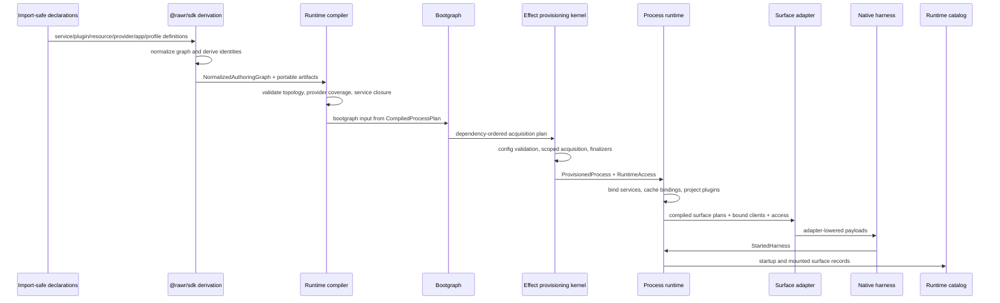

# RAWR Runtime Realization System

Status: Canonical
Scope: Runtime realization, SDK derivation, runtime compilation, Effect-backed provisioning, process runtime binding, adapter lowering, harness mounting, diagnostics, and deterministic shutdown

## 1. Purpose and scope

The RAWR Runtime Realization System turns selected app composition into one started, typed, observable, stoppable process per `startApp(...)` invocation.

It realizes this chain:

File: `specification://runtime-realization/lifecycle.txt`
Layer: runtime realization lifecycle
Exactness: normative lifecycle order and phase ownership.

```text
definition -> selection -> derivation -> compilation -> provisioning -> mounting -> observation
```

Runtime realization exists below semantic composition and above native host frameworks. It makes execution explicit without creating a second public semantic architecture.

A RAWR app may define multiple entrypoints or process shapes. Runtime realization starts one selected process shape. Multi-process placement, platform services, replicas, and machine-level deployment policy are deployment/control-plane concerns. They may consume runtime catalog records and process-boundary metadata, but they do not change service truth, plugin identity, app membership, role meaning, or surface meaning.

The broader platform composition law is:

File: `specification://runtime-realization/platform-chain.txt`
Layer: platform cohesion frame
Exactness: normative semantic-to-runtime ordering.

```text
bind -> project -> compose -> realize -> observe
```

Inside runtime realization, the normative lifecycle remains:

File: `specification://runtime-realization/runtime-chain.txt`
Layer: runtime lifecycle
Exactness: normative runtime realization lifecycle.

```text
definition -> selection -> derivation -> compilation -> provisioning -> mounting -> observation
```

Runtime realization owns compilation, provisioning, process runtime assembly, service binding, adapter lowering, harness handoff, diagnostics, and shutdown.

Runtime realization does not own service domain truth, plugin semantic meaning, app product identity, deployment placement, public API meaning, durable workflow semantics, CLI command semantics, shell governance, desktop-native behavior, or web framework semantics.

## 2. Fixed outcome

Each `startApp(...)` invocation produces exactly one started process runtime assembly.

The started process owns:

| Runtime result | Owner | Meaning |
| --- | --- | --- |
| One root managed runtime | Runtime / Effect provisioning kernel | Process-local execution root and disposal owner |
| One process runtime assembly | Runtime / process runtime | Bound services, role access, mounted surface records, harness handoff |
| Zero or more mounted roles | App-selected process shape | Selected role slices from the app composition |
| Zero or more mounted surfaces | Process runtime and harnesses | Runtime-ready surface payloads mounted into native hosts |
| One runtime catalog stream/record set | Diagnostics | Redacted read model of selected, derived, provisioned, mounted, observed, and stopped runtime state |
| One deterministic shutdown path | Runtime | Reverse-order harness stop, role finalizers, process finalizers, managed runtime disposal |

A cohosted development process and a split production process use the same semantic app and plugin definitions. Cohosting changes placement and resource sharing. It does not change species.

## 3. Ownership laws

Runtime realization is stable only when each layer owns one job.

| Layer | Owns | Does not own |
| --- | --- | --- |
| Services | Semantic truth, callable contracts, schemas, repositories, migrations, domain policy, stable service config, service-to-service dependency declarations | Public API publication, app membership, provider selection, harness mounting, process placement |
| Plugins | Projection into one role/surface/capability lane, topology-implied caller classification, native builder facts, projection-local boundary policy, service-use declarations | Service truth, provider acquisition, app selection, public/internal reclassification |
| Apps | App membership, selected projections, runtime profiles, provider selections, config source selection, entrypoints, process defaults, selected publication artifacts | Service truth, plugin species, provider implementation, runtime acquisition |
| Resources | Provisionable capability contracts, consumed value shape, lifetime requirement, public resource identity | Provider implementation, semantic truth, app selection |
| Providers | Implementation, acquisition, release, validation, native client construction, health, refresh, provider config | Resource identity, app selection, service truth |
| SDK | Normalized authoring graph, canonical identities, resource requirements, normalized `ProviderSelection`, service binding plans, surface runtime plan descriptors, portable plan artifacts | Resource acquisition, provider execution, managed runtime construction, harness mounting |
| Runtime | Compiler, compiled process plan, bootgraph, Effect provisioning kernel, process runtime, runtime access, service binding cache, adapter lowering, diagnostics, shutdown | Service truth, app membership, plugin meaning, caller-facing API semantics, deployment placement |
| Harnesses | Native mounting into Elysia, Inngest, OCLIF, web, agent/OpenShell, desktop, and other host frameworks | SDK graph consumption, runtime compilation, provider acquisition, service truth |
| Diagnostics | Observation, redacted catalog records, lifecycle findings, topology read models, telemetry | Composition authority, live runtime access, state mutation, provider selection |

The strongest practical rule is:

File: `specification://runtime-realization/ownership-rule.txt`
Layer: ownership law
Exactness: normative.

```text
Services own truth.
Plugins project.
Apps select.
Resources declare capability contracts.
Providers implement capability contracts.
The SDK derives.
The runtime realizes.
Harnesses mount.
Diagnostics observe.
```

## 4. Canonical topology and package authority

The physical topology is locked.

File: `specification://runtime-realization/canonical-topology.txt`
Layer: repository topology
Exactness: normative for roots and ownership placement.

```text
packages/
  core/
    sdk/                         # publishes @rawr/sdk
    runtime/                     # compiler, bootgraph, substrate, process runtime, harnesses, topology
      compiler/
      bootgraph/
      substrate/
        effect/
      process-runtime/
      harnesses/
        elysia/
        inngest/
        oclif/
        web/
        agent/
        desktop/
      topology/
      standard/                  # RAWR-owned standard providers and internal runtime machinery

resources/
  <capability>/                  # authored provisionable capability catalog

services/
  <service>/                     # semantic truth

plugins/
  server/
    api/
      <capability>/              # public server API projection
    internal/
      <capability>/              # trusted first-party/internal server API projection
  async/
    workflows/
      <capability>/              # durable workflow projection
    schedules/
      <capability>/              # durable scheduled projection
    consumers/
      <capability>/              # durable consumer projection
  cli/
    commands/
      <capability>/              # OCLIF command projection
  web/
    app/
      <capability>/              # web app projection
  agent/
    channels/
      <capability>/              # agent channel projection
    shell/
      <capability>/              # OpenShell projection
    tools/
      <capability>/              # agent tool projection
  desktop/
    menubar/
      <capability>/              # desktop menubar projection
    windows/
      <capability>/              # desktop window projection
    background/
      <capability>/              # desktop background projection

apps/
  <app>/
    rawr.<app>.ts                # app composition
    server.ts                    # entrypoint
    async.ts                     # entrypoint
    web.ts                       # entrypoint
    agent.ts                     # entrypoint
    cli.ts                       # entrypoint
    desktop.ts                   # entrypoint
    dev.ts                       # cohosted development entrypoint
    runtime/
      profiles/
      config.ts
      processes.ts
```

There is no root-level `core/` authoring root. There is no root-level `runtime/` authoring root. Platform machinery lives under `packages/core/*`. Authored provisionable capability contracts live under `resources/*`.

The public SDK is published as `@rawr/sdk` from `packages/core/sdk`.

Canonical public import surfaces include:

| Public surface | Owner |
| --- | --- |
| `@rawr/sdk/app` | App and entrypoint authoring |
| `@rawr/sdk/service` | Service authoring |
| `@rawr/sdk/plugins/server` | Server projection authoring |
| `@rawr/sdk/plugins/async` | Async projection authoring |
| `@rawr/sdk/plugins/cli` | CLI projection authoring |
| `@rawr/sdk/plugins/web` | Web projection authoring |
| `@rawr/sdk/plugins/agent` | Agent projection authoring |
| `@rawr/sdk/plugins/desktop` | Desktop projection authoring |
| `@rawr/sdk/runtime/resources` | Runtime resource declarations |
| `@rawr/sdk/runtime/providers` | Runtime provider declarations |
| `@rawr/sdk/runtime/profiles` | Runtime profile declarations |
| `@rawr/sdk/runtime/schema` | `RuntimeSchema` facade |

Ordinary services, plugins, apps, and entrypoints import public SDK surfaces, service boundary exports, plugin factories, resource descriptors, provider selectors, and app-owned profile helpers.

They do not import Effect layer internals, concrete managed runtime handles, process runtime internals, harness mount code, adapter-lowered payload constructors, or raw provider acquisition machinery.

## 5. Import safety and declaration discipline

All declarations are import-safe.

A service, plugin, resource, provider, app, or profile module declares facts, factories, descriptors, selectors, schemas, and contracts. Importing a declaration does not acquire resources, read secrets, connect providers, start processes, register globals, mutate app composition, or mount native hosts.

This rule applies to:

| Module kind | Import-safe content |
| --- | --- |
| Service modules | Boundary schemas, service declarations, service contracts, router factories, module contracts |
| Plugin modules | One plugin factory, lane-specific definitions, oRPC routers/contracts, workflow definitions, command definitions, web/agent/desktop surface definitions |
| Resource modules | `RuntimeResource` descriptors, requirement helpers, value types |
| Provider modules | Cold `RuntimeProvider` descriptors and acquisition plans |
| App modules | App membership declarations and runtime profile selection |
| Entrypoints | `startApp(...)` invocation and selected process shape |

A provider may contain Effect-native acquisition code, but it remains cold until provisioning. A plugin may contain native oRPC, Inngest-shaped, OCLIF, web, OpenShell, or desktop declarations, but those declarations remain cold until the runtime compiler, process runtime, surface adapters, and harnesses realize them.

## 6. Layered naming and artifact ownership

Names remain layer-specific. Similar concepts in different layers use different terms because they have different owners.

| Layer | Canonical terms | Consumer |
| --- | --- | --- |
| App authoring | `defineApp(...)`, `startApp(...)`, `AppDefinition`, `Entrypoint`, `RuntimeProfile` | SDK derivation and runtime compiler |
| Service authoring | `defineService(...)`, `resourceDep(...)`, `serviceDep(...)`, `semanticDep(...)`, `deps`, `scope`, `config`, `invocation`, `provided` | SDK derivation and service binding |
| Plugin authoring | `PluginFactory`, `PluginDefinition`, `useService(...)`, lane-specific builders, lane-native definitions | SDK derivation and surface runtime plans |
| Resource/provider/profile authoring | `RuntimeResource`, `ResourceRequirement`, `ResourceLifetime`, `RuntimeProvider`, `ProviderSelection`, `RuntimeProfile` | SDK derivation, runtime compiler, provisioning kernel |
| SDK derivation | `NormalizedAuthoringGraph`, `ServiceBindingPlan`, `SurfaceRuntimePlan`, portable plan artifacts | Runtime compiler |
| Runtime compilation | `CompiledProcessPlan`, compiled resource plan, compiled service binding plan, compiled surface plan | Bootgraph, process runtime, surface adapters |
| Provisioning | `Bootgraph`, boot resource keys/modules, `ProvisionedProcess`, `ManagedRuntimeHandle` | Process runtime |
| Live access | `RuntimeAccess`, `ProcessRuntimeAccess`, `RoleRuntimeAccess` | Service binding, plugin projection, harness adapters |
| Runtime binding | `ServiceBindingCache`, `ServiceBindingCacheKey`, `bindService(...)` | Process runtime and plugin projection |
| Adapter lowering | `SurfaceAdapter`, adapter-lowered payloads, `FunctionBundle` | Harnesses |
| Harness/native boundary | `HarnessDescriptor`, `StartedHarness`, native host payloads | Native host framework |
| Observation | `RuntimeCatalog`, `RuntimeDiagnostic`, `RuntimeTelemetry` | Diagnostics, topology tools, control-plane touchpoints |

The excluded drift names are not target names: `startAppRole(...)`, `startAppRoles(...)`, `RuntimeView`, `ProcessView`, `RoleView`, root `core/`, root `runtime/`, and public generic exposure fields for plugin classification.

## 7. Schema ownership and `RuntimeSchema`

`RuntimeSchema` is the canonical SDK-facing schema facade for runtime-owned and runtime-carried boundary schema declarations.

It appears where the runtime must derive validation, type projection, config decoding, redaction, diagnostics, or harness payload contracts from an authored declaration. That includes resource config, provider config, runtime profile config, service boundary `scope`, service boundary `config`, service boundary `invocation`, diagnostics payloads, and harness-facing runtime payloads.

`RuntimeSchema` has this minimum contract.

File: `packages/core/sdk/src/runtime/schema/runtime-schema.ts`
Layer: SDK runtime schema facade
Exactness: normative for required capabilities; illustrative for generic spelling.

```ts
export interface RuntimeSchema<TValue = unknown> {
  readonly kind: "runtime.schema";
  readonly serializable: unknown;
  readonly description?: string;
  readonly redaction?: RuntimeRedactionPolicy;

  decode(input: unknown): RuntimeSchemaResult<TValue>;
  validate(input: unknown): RuntimeSchemaResult<TValue>;
  toDiagnosticShape(): RuntimeDiagnosticSchemaShape;
  toStaticType?: unknown;
}
```

`RuntimeSchema` does not transfer service semantic schema ownership to the runtime. Service procedure payloads, plugin API payloads, plugin-native contracts, and workflow payloads remain schema-backed contracts owned by their service or plugin boundary.

The ownership split is:

| Schema-bearing boundary | Schema owner | Schema form |
| --- | --- | --- |
| Runtime resource config | Resource/provider boundary | `RuntimeSchema` |
| Provider config | Provider boundary | `RuntimeSchema` |
| Runtime profile config | App/runtime profile boundary | `RuntimeSchema` |
| Service `scope`, `config`, `invocation` lanes | Service boundary as runtime-carried lanes | `RuntimeSchema` |
| Service callable procedure input/output/errors | Service package | Service-owned schema-backed oRPC-compatible contracts |
| Public server API input/output/errors | Server API plugin | Plugin-owned schema-backed oRPC-compatible contracts |
| Server internal API input/output/errors | Server internal plugin | Plugin-owned schema-backed oRPC-compatible contracts |
| Workflow payloads read from event data | Async plugin or projected service boundary | Schema-backed payload contract |
| Harness-facing runtime payloads | Runtime adapter/harness boundary | `RuntimeSchema` |
| Diagnostics payloads | Runtime diagnostics | `RuntimeSchema` |

Plain string labels may name capabilities, routes, ids, triggers, cron expressions, policies, and event names. They must not stand in for data schemas.

## 8. App and entrypoint authoring contract

### 8.1 AppDefinition

`defineApp(...)` declares app identity and selected plugin membership. It may reference runtime profile definitions, process defaults, and selected publication artifacts through app-owned runtime modules. It does not acquire resources or start a process.

File: `apps/hq/rawr.hq.ts`
Layer: app authoring
Exactness: normative for app membership, plugin selection, and separation from process shape; illustrative for plugin names.

```ts
import { defineApp } from "@rawr/sdk/app";

import { createPlugin as workItemsPublicApi } from "@rawr/plugins/server/api/work-items";
import { createPlugin as workItemsInternalApi } from "@rawr/plugins/server/internal/work-items-ops";
import { createPlugin as workItemsSyncWorkflow } from "@rawr/plugins/async/workflows/work-items-sync";
import { createPlugin as workItemsDigestSchedule } from "@rawr/plugins/async/schedules/work-items-digest";
import { createPlugin as workItemsCli } from "@rawr/plugins/cli/commands/work-items";

export const hqApp = defineApp({
  id: "hq",
  plugins: [
    workItemsPublicApi(),
    workItemsInternalApi(),
    workItemsSyncWorkflow(),
    workItemsDigestSchedule(),
    workItemsCli(),
  ],
});
```

The app owns membership. The SDK derives role/surface indexes from the selected plugin definitions.

### 8.2 RuntimeProfile and process defaults

Runtime profiles live under `apps/<app>/runtime/profiles/*`. They select providers and config sources for the app. The profile field that holds provider choices is `providers` or `providerSelections`, never `resources`.

File: `apps/hq/runtime/profiles/production.ts`
Layer: app-owned runtime profile selection
Exactness: normative for provider-selection field names and app ownership; illustrative for provider selector names.

```ts
import { defineRuntimeProfile } from "@rawr/sdk/runtime/profiles";
import { clock } from "@rawr/resources/clock/select";
import { email } from "@rawr/resources/email/select";
import { inngest } from "@rawr/resources/inngest/select";
import { logger } from "@rawr/resources/logger/select";
import { sql } from "@rawr/resources/sql/select";

export const productionProfile = defineRuntimeProfile({
  id: "hq.production",
  providers: [
    clock.system(),
    logger.openTelemetry({ configKey: "telemetry" }),
    sql.postgres({ configKey: "sql.primary" }),
    email.resend({ configKey: "email.primary" }),
    inngest.cloud({ configKey: "inngest.primary" }),
  ],
  configSources: [
    { kind: "env" },
    { kind: "file", path: "runtime.production.json", optional: true },
  ],
});
```

What consumes this: the SDK derives normalized `ProviderSelection` artifacts from the profile; the runtime compiler validates provider coverage; the provisioning kernel loads config and acquires selected providers.

### 8.3 Entrypoint

`startApp(...)` is the canonical app start operation. It receives selected app definition, runtime profile, process roles, and optional process/harness selection facts. It starts one process.

File: `apps/hq/server.ts`
Layer: entrypoint authoring
Exactness: normative for `startApp(...)` as the only start verb and for process-role selection.

```ts
import { startApp } from "@rawr/sdk/app";
import { hqApp } from "./rawr.hq";
import { productionProfile } from "./runtime/profiles/production";

await startApp(hqApp, {
  entrypointId: "hq.server",
  profile: productionProfile,
  roles: ["server"],
});
```

File: `apps/hq/dev.ts`
Layer: cohosted entrypoint authoring
Exactness: normative for cohosted process shape as selection, not semantic reclassification.

```ts
import { startApp } from "@rawr/sdk/app";
import { hqApp } from "./rawr.hq";
import { localProfile } from "./runtime/profiles/local";

await startApp(hqApp, {
  entrypointId: "hq.dev",
  profile: localProfile,
  roles: ["server", "async", "web", "agent"],
});
```

The entrypoint does not redefine what belongs to the app. It selects which role slices start in this process.

## 9. Service authoring contract

### 9.1 Service ownership

A service is the semantic capability boundary. It owns contracts, context lanes, stable config, domain policy, schemas, migrations, repositories, service-internal modules, and write authority over its invariants.

A service does not own public API exposure, internal API exposure, async workflow execution, command projection, web projection, agent projection, desktop projection, app membership, provider selection, process placement, or harness mounting.

### 9.2 Service placement

File: `specification://runtime-realization/service-placement.txt`
Layer: service topology
Exactness: normative for placement and scale-continuous internal structure.

```text
services/<service>/
  src/
    index.ts
    client.ts
    router.ts
    service/
      base.ts
      contract.ts
      impl.ts
      router.ts
      middleware/
      shared/
      modules/
        <module>/
          schemas.ts
          contract.ts
          module.ts
          middleware.ts
          repository.ts
          router.ts
```

The service package root exports boundary surfaces only. It does not export repositories, migrations, module internals, service-private schemas, service-private middleware, or runtime provider internals by default.

### 9.3 Context lanes

The canonical service lanes are:

| Lane | Owner | Runtime status |
| --- | --- | --- |
| `deps` | Service declaration, satisfied by runtime binding | Construction-time |
| `scope` | Service declaration, supplied by app/plugin binding policy | Construction-time |
| `config` | Service declaration, supplied by runtime config/profile | Construction-time |
| `invocation` | Service declaration, supplied per call by caller/harness | Per-call |
| `provided` | Service middleware/module composition | Execution-derived |

Service binding is construction-time over `deps`, `scope`, and `config`. Invocation does not participate in construction-time binding and never participates in `ServiceBindingCacheKey`.

### 9.4 defineService

`defineService(...)` declares service identity, dependency lanes, runtime-carried schemas for scope/config/invocation, metadata defaults, service-owned policy vocabulary, and service-local oRPC authoring helpers.

File: `services/work-items/src/service/base.ts`
Layer: service authoring, semantic truth
Exactness: normative for lane names, dependency helpers, and `RuntimeSchema` use for runtime-carried lanes; illustrative for exact generic spelling.

```ts
import {
  defineService,
  resourceDep,
  serviceDep,
  semanticDep,
  type ServiceOf,
} from "@rawr/sdk/service";
import { RuntimeSchema } from "@rawr/sdk/runtime/schema";

import { ClockResource } from "@rawr/resources/clock";
import { LoggerResource } from "@rawr/resources/logger";
import { SqlPoolResource } from "@rawr/resources/sql";

export const WorkItemsScopeSchema = RuntimeSchema.struct({
  workspaceId: RuntimeSchema.string({ minLength: 1 }),
});

export const WorkItemsConfigSchema = RuntimeSchema.struct({
  readOnly: RuntimeSchema.boolean(),
  limits: RuntimeSchema.struct({
    maxAllocationsPerItem: RuntimeSchema.number({ min: 1 }),
  }),
});

export const WorkItemsInvocationSchema = RuntimeSchema.struct({
  traceId: RuntimeSchema.string(),
  actorId: RuntimeSchema.optional(RuntimeSchema.string()),
});

export const service = defineService({
  id: "work-items",

  deps: {
    dbPool: resourceDep(SqlPoolResource),
    clock: resourceDep(ClockResource),
    logger: resourceDep(LoggerResource),
  },

  scope: WorkItemsScopeSchema,
  config: WorkItemsConfigSchema,
  invocation: WorkItemsInvocationSchema,

  metadataDefaults: {
    idempotent: true,
    domain: "work-items",
    audience: "internal",
    audit: "basic",
  },

  baseline: {
    policy: {
      events: {
        readOnlyRejected: "work-items.policy.read_only_rejected",
        allocationLimitReached: "work-items.policy.allocation_limit_reached",
      },
    },
  },
});

export type WorkItemsService = ServiceOf<typeof service>;

export const ocBase = service.oc;
export const createServiceMiddleware = service.createMiddleware;
export const createServiceImplementer = service.createImplementer;
```

What consumes this: the SDK normalizes resource dependencies, service dependencies, runtime-carried schemas, metadata, and boundary identity into the normalized authoring graph. The runtime compiler uses the normalized dependencies to produce `ServiceBindingPlan` and resource requirements. The process runtime uses the binding plan to construct live service clients.

### 9.5 Service procedure contracts

Service callable contracts are service-owned schema-backed contracts. They may be expressed through oRPC primitives. oRPC owns procedure and transport mechanics; the service owns the meaning.

File: `services/work-items/src/service/modules/items/schemas.ts`
Layer: service-owned schema-backed procedure data
Exactness: normative that procedure data has concrete schema artifacts; illustrative for schema facade spelling.

```ts
import { schema } from "@rawr/sdk/service/schema";

export const WorkItemSchema = schema.object({
  id: schema.uuid(),
  workspaceId: schema.string({ minLength: 1 }),
  title: schema.string({ minLength: 1, maxLength: 500 }),
  description: schema.nullable(schema.string({ maxLength: 2000 })),
  status: schema.union([
    schema.literal("open"),
    schema.literal("blocked"),
    schema.literal("done"),
  ]),
  createdAt: schema.isoDateTime(),
  updatedAt: schema.isoDateTime(),
});

export const CreateWorkItemInputSchema = schema.object({
  title: schema.string({ minLength: 1, maxLength: 500 }),
  description: schema.optional(schema.string({ maxLength: 2000 })),
});

export const InvalidTitleErrorDataSchema = schema.object({
  title: schema.optional(schema.string()),
});
```

File: `services/work-items/src/service/modules/items/contract.ts`
Layer: service-owned callable contract
Exactness: normative for schema-backed input, output, and error-data contracts; illustrative for exact oRPC chaining syntax.

```ts
import { ocBase } from "../../base";
import {
  CreateWorkItemInputSchema,
  InvalidTitleErrorDataSchema,
  WorkItemSchema,
} from "./schemas";
import { READ_ONLY_MODE, RESOURCE_NOT_FOUND } from "../../shared/errors";

export const contract = {
  create: ocBase
    .meta({ idempotent: false, entity: "item", audit: "full" })
    .input(CreateWorkItemInputSchema)
    .output(WorkItemSchema)
    .errors({
      READ_ONLY_MODE,
      INVALID_WORK_ITEM_TITLE: {
        status: 400,
        message: "Invalid work item title",
        data: InvalidTitleErrorDataSchema,
      },
    }),

  get: ocBase
    .meta({ idempotent: true, entity: "item", audit: "basic" })
    .input(schema.object({ id: schema.uuid() }))
    .output(WorkItemSchema)
    .errors({ RESOURCE_NOT_FOUND }),
};
```

### 9.6 N > 1 service module shape

A realistic service has more than one module without changing species.

File: `services/work-items/src/service/modules/_tree.txt`
Layer: service-internal module topology
Exactness: normative for N > 1 module organization; illustrative for module names.

```text
services/work-items/src/service/modules/
  items/
    schemas.ts
    contract.ts
    module.ts
    middleware.ts
    repository.ts
    router.ts
  labels/
    schemas.ts
    contract.ts
    module.ts
    middleware.ts
    repository.ts
    router.ts
  allocations/
    schemas.ts
    contract.ts
    module.ts
    middleware.ts
    repository.ts
    router.ts
```

The root service contract composes module contracts. The root service router composes module routers.

File: `services/work-items/src/service/contract.ts`
Layer: service root contract composition
Exactness: normative for root contract composition role; illustrative for module names.

```ts
import { contract as allocations } from "./modules/allocations/contract";
import { contract as items } from "./modules/items/contract";
import { contract as labels } from "./modules/labels/contract";

export const contract = {
  items,
  labels,
  allocations,
};

export type WorkItemsContract = typeof contract;
```

File: `services/work-items/src/service/router.ts`
Layer: service root router composition
Exactness: normative for final router assembly role; illustrative for exact attach syntax.

```ts
import { impl } from "./impl";
import { router as allocations } from "./modules/allocations/router";
import { router as items } from "./modules/items/router";
import { router as labels } from "./modules/labels/router";

export const router = impl.router({
  items,
  labels,
  allocations,
});

export type WorkItemsRouter = typeof router;
```

A module `contract.ts` owns caller-visible shape. A module `module.ts` composes module-local middleware and context preparation. A module `router.ts` implements behavior. Repositories remain service-internal persistence mechanics under the service’s write authority.

### 9.7 Service-to-service dependency through `serviceDep(...)`

A service may depend on a sibling service by declaring a service dependency. A service dependency is not a runtime resource and is not selected through a runtime profile.

File: `services/user-accounts/src/service/base.ts`
Layer: service authoring with sibling service dependencies
Exactness: normative for `serviceDep(...)` and construction-time service dependency lane; illustrative for service names.

```ts
import { defineService, resourceDep, serviceDep } from "@rawr/sdk/service";
import { RuntimeSchema } from "@rawr/sdk/runtime/schema";

import { SqlPoolResource } from "@rawr/resources/sql";
import { service as BillingService } from "@rawr/services/billing";
import { service as EntitlementsService } from "@rawr/services/entitlements";

export const service = defineService({
  id: "user-accounts",

  deps: {
    dbPool: resourceDep(SqlPoolResource),
    billing: serviceDep(BillingService),
    entitlements: serviceDep(EntitlementsService),
  },

  scope: RuntimeSchema.struct({
    workspaceId: RuntimeSchema.string(),
  }),

  config: RuntimeSchema.struct({
    allowSelfService: RuntimeSchema.boolean(),
  }),

  invocation: RuntimeSchema.struct({
    traceId: RuntimeSchema.string(),
  }),
});
```

What consumes this: the SDK derives service dependency edges. The runtime compiler constructs an acyclic service binding DAG. The process runtime binds billing and entitlements clients before constructing the user-accounts binding. The user-accounts handler receives sibling clients through `context.deps.billing` and `context.deps.entitlements`.

A service does not import sibling repositories, module routers, module schemas, migrations, or service-private middleware.

## 10. Plugin authoring contract

### 10.1 PluginDefinition and PluginFactory

A plugin projects service truth or host capability into exactly one role/surface/capability lane.

A plugin package exports one canonical `PluginFactory`. That factory is import-safe, runs at app composition time, acquires no resources, and returns exactly one `PluginDefinition`.

File: `packages/core/sdk/src/plugins/plugin-definition.ts`
Layer: SDK plugin authoring type shape
Exactness: normative for owner, producer/consumer, and fields; illustrative for generic spelling.

```ts
export interface PluginFactory<TOptions = void> {
  (options: TOptions): PluginDefinition;
}

export interface PluginDefinition<
  TRole extends AppRole = AppRole,
  TSurface extends string = string,
  TCapability extends string = string,
> {
  readonly kind: "plugin.definition";
  readonly id: string;
  readonly role: TRole;
  readonly surface: TSurface;
  readonly capability: TCapability;
  readonly instance?: string;
  readonly serviceUses: readonly ServiceUse[];
  readonly resourceRequirements: readonly ResourceRequirement[];
  readonly project: PluginProjectionFunction;
}
```

Most authors use lane-specific builders. The generic shape is SDK/runtime internal scaffolding, not normal plugin DX.

### 10.2 Topology and builder agreement

Public/internal/async/CLI/web/agent/desktop projection status is implied by topology plus matching builder. No generic `exposure`, `visibility`, `public`, `internal`, `kind`, or adapter-kind field declares projection status.

| Topology | Matching builder family | Projection |
| --- | --- | --- |
| `plugins/server/api/<capability>` | `defineServerApiPlugin(...)` | Public server API projection |
| `plugins/server/internal/<capability>` | `defineServerInternalPlugin(...)` | Trusted first-party/internal server API projection |
| `plugins/async/workflows/<capability>` | Workflow projection builder | Durable workflow projection |
| `plugins/async/schedules/<capability>` | Schedule projection builder | Durable scheduled projection |
| `plugins/async/consumers/<capability>` | Consumer projection builder | Durable consumer projection |
| `plugins/cli/commands/<capability>` | CLI command projection builder | OCLIF command projection |
| `plugins/web/app/<capability>` | Web app projection builder | Web surface projection |
| `plugins/agent/channels/<capability>` | Agent channel projection builder | Agent channel projection |
| `plugins/agent/shell/<capability>` | Agent shell projection builder | OpenShell projection |
| `plugins/agent/tools/<capability>` | Agent tool projection builder | Agent tool projection |
| `plugins/desktop/menubar/<capability>` | Desktop menubar projection builder | Desktop menubar projection |
| `plugins/desktop/windows/<capability>` | Desktop window projection builder | Desktop window projection |
| `plugins/desktop/background/<capability>` | Desktop background projection builder | Desktop background projection |

Path and builder mismatch is a structural error.

### 10.3 `useService(...)`

Plugin authoring uses `useService(...)` to declare projected service clients. The SDK turns `useService(...)` into service binding requirements. The runtime constructs the right service client and passes it to the plugin projection function.

File: `plugins/server/api/work-items/src/plugin.ts`
Layer: public server API plugin authoring
Exactness: normative for `plugins/server/api/*` plus `defineServerApiPlugin(...)` classification and `useService(...)`; illustrative for route base and function names.

```ts
import { defineServerApiPlugin, useService } from "@rawr/sdk/plugins/server";
import { service as WorkItemsService } from "@rawr/services/work-items";

import { createWorkItemsPublicRouter } from "./router";
import { workItemsPublicApiContract } from "./contract";

export const createPlugin = defineServerApiPlugin.factory()({
  capability: "work-items",
  routeBase: "/work-items",

  services: {
    workItems: useService(WorkItemsService),
  },

  api({ clients, request }) {
    return createWorkItemsPublicRouter({
      contract: workItemsPublicApiContract,
      workItems: clients.workItems,
      request,
    });
  },
});
```

The plugin owns public API projection. The service owns work-item truth. Elysia owns HTTP host mechanics. oRPC owns procedure mechanics.

### 10.4 Public server API plugin with concrete schemas

A `plugins/server/api/<capability>` package uses `defineServerApiPlugin(...)`. Its public status comes from topology and builder, not a field.

File: `plugins/server/api/work-items/src/contract.ts`
Layer: public server API plugin contract
Exactness: normative for concrete input, output, and error-data schemas at plugin API boundary; illustrative for schema facade spelling.

```ts
import { schema } from "@rawr/sdk/plugins/schema";
import { createPublicApiContract } from "@rawr/sdk/plugins/server/orpc";

export const PublicCreateWorkItemInputSchema = schema.object({
  title: schema.string({ minLength: 1, maxLength: 500 }),
  description: schema.optional(schema.string({ maxLength: 2000 })),
});

export const PublicWorkItemOutputSchema = schema.object({
  id: schema.uuid(),
  title: schema.string(),
  status: schema.union([
    schema.literal("open"),
    schema.literal("blocked"),
    schema.literal("done"),
  ]),
  createdAt: schema.isoDateTime(),
});

export const PublicWorkItemErrorDataSchema = schema.object({
  code: schema.union([
    schema.literal("READ_ONLY_MODE"),
    schema.literal("INVALID_TITLE"),
    schema.literal("NOT_FOUND"),
  ]),
  detail: schema.optional(schema.string()),
});

export const workItemsPublicApiContract = createPublicApiContract({
  create: {
    method: "POST",
    path: "/",
    input: PublicCreateWorkItemInputSchema,
    output: PublicWorkItemOutputSchema,
    errors: {
      PUBLIC_WORK_ITEM_ERROR: {
        status: 400,
        data: PublicWorkItemErrorDataSchema,
      },
    },
  },
});
```

File: `plugins/server/api/work-items/src/router.ts`
Layer: public server API projection router
Exactness: normative for projection calling a service boundary; illustrative for procedure syntax.

```ts
export function createWorkItemsPublicRouter(input: {
  contract: typeof workItemsPublicApiContract;
  workItems: WorkItemsClient;
  request: PublicRequestContext;
}) {
  return input.contract.router({
    create: async ({ input: payload, errors }) => {
      const result = await input.workItems.items.create({
        title: payload.title,
        description: payload.description,
      });

      if (result.status === "rejected") {
        throw errors.PUBLIC_WORK_ITEM_ERROR({
          data: {
            code: result.reason,
            detail: result.message,
          },
        });
      }

      return {
        id: result.item.id,
        title: result.item.title,
        status: result.item.status,
        createdAt: result.item.createdAt,
      };
    },
  });
}
```

The public API plugin may redact, transform, authenticate, authorize, rate-limit, and publish public contracts. It does not own the domain invariant that determines whether a work item may be created.

### 10.5 Trusted server internal plugin with concrete oRPC schemas

A `plugins/server/internal/<capability>` package uses `defineServerInternalPlugin(...)`. It is eligible for trusted first-party RPC mounting and internal-client generation. It is not a public API projection.

File: `plugins/server/internal/work-items-ops/src/contract.ts`
Layer: server internal plugin contract
Exactness: normative for concrete input, output, and error-data schemas at internal API boundary; illustrative for schema facade spelling.

```ts
import { schema } from "@rawr/sdk/plugins/schema";
import { createInternalApiContract } from "@rawr/sdk/plugins/server/orpc";

export const TriggerSyncInputSchema = schema.object({
  workspaceId: schema.string({ minLength: 1 }),
  syncId: schema.uuid(),
  requestedBy: schema.string({ minLength: 1 }),
});

export const TriggerSyncOutputSchema = schema.object({
  dispatchId: schema.string(),
  acceptedAt: schema.isoDateTime(),
});

export const TriggerSyncErrorDataSchema = schema.object({
  code: schema.union([
    schema.literal("WORKFLOW_NOT_SELECTED"),
    schema.literal("SYNC_ALREADY_RUNNING"),
    schema.literal("WORKSPACE_NOT_FOUND"),
  ]),
  workspaceId: schema.optional(schema.string()),
});

export const workItemsOpsInternalContract = createInternalApiContract({
  triggerSync: {
    method: "POST",
    path: "/sync",
    input: TriggerSyncInputSchema,
    output: TriggerSyncOutputSchema,
    errors: {
      TRIGGER_SYNC_FAILED: {
        status: 409,
        data: TriggerSyncErrorDataSchema,
      },
    },
  },
});
```

File: `plugins/server/internal/work-items-ops/src/plugin.ts`
Layer: server internal plugin authoring
Exactness: normative for `plugins/server/internal/*` plus `defineServerInternalPlugin(...)` classification and workflow dispatcher wrapping.

```ts
import { defineServerInternalPlugin, useService } from "@rawr/sdk/plugins/server";
import { service as WorkItemsService } from "@rawr/services/work-items";
import { SyncWorkspaceWorkItemsWorkflow } from "@rawr/plugins/async/workflows/work-items-sync";

import { workItemsOpsInternalContract } from "./contract";
import { createWorkItemsOpsInternalRouter } from "./router";

export const createPlugin = defineServerInternalPlugin.factory()({
  capability: "work-items-ops",

  services: {
    workItems: useService(WorkItemsService),
  },

  workflows: [SyncWorkspaceWorkItemsWorkflow],

  internalApi({ clients, workflows, request }) {
    return createWorkItemsOpsInternalRouter({
      contract: workItemsOpsInternalContract,
      workItems: clients.workItems,
      workflows,
      request,
    });
  },
});
```

File: `plugins/server/internal/work-items-ops/src/router.ts`
Layer: server internal plugin router
Exactness: normative for internal projection wrapping `WorkflowDispatcher`; illustrative for syntax.

```ts
export function createWorkItemsOpsInternalRouter(input: {
  contract: typeof workItemsOpsInternalContract;
  workItems: WorkItemsClient;
  workflows: WorkflowDispatcher;
  request: InternalRequestContext;
}) {
  return input.contract.router({
    triggerSync: async ({ input: payload, errors }) => {
      const status = await input.workItems.workspaces.ensureSyncAllowed({
        workspaceId: payload.workspaceId,
      });

      if (!status.allowed) {
        throw errors.TRIGGER_SYNC_FAILED({
          data: {
            code: status.reason,
            workspaceId: payload.workspaceId,
          },
        });
      }

      const dispatch = await input.workflows.send(
        SyncWorkspaceWorkItemsWorkflow,
        {
          workspaceId: payload.workspaceId,
          syncId: payload.syncId,
          requestedBy: payload.requestedBy,
        },
      );

      return {
        dispatchId: dispatch.id,
        acceptedAt: dispatch.acceptedAt,
      };
    },
  });
}
```

The internal API owns trusted caller-facing trigger/status/cancel surfaces. The workflow plugin owns durable execution definitions. The dispatcher is a derived runtime/SDK integration artifact.

### 10.6 Async workflow plugin with schema-backed event payload

Workflow, schedule, and consumer metadata is authored once in RAWR async projection definitions. `FunctionBundle` is the harness-facing lowered artifact. It is not public authoring.

File: `plugins/async/workflows/work-items-sync/src/workflows/sync-workspace.ts`
Layer: async workflow projection authoring
Exactness: normative for schema-backed payload when event data is read; illustrative for exact workflow helper names.

```ts
import { defineWorkflow, event } from "@rawr/sdk/plugins/async";
import { schema } from "@rawr/sdk/plugins/schema";

export const SyncWorkspaceWorkItemsPayloadSchema = schema.object({
  workspaceId: schema.string({ minLength: 1 }),
  syncId: schema.uuid(),
  requestedBy: schema.string({ minLength: 1 }),
});

export const SyncWorkspaceWorkItemsWorkflow = defineWorkflow({
  id: "work-items.sync-workspace",
  trigger: event("work-items/sync.requested", {
    payload: SyncWorkspaceWorkItemsPayloadSchema,
  }),
  flow: {
    idempotency: "event.data.syncId",
    concurrency: { key: "event.data.workspaceId", limit: 1 },
  },

  async handler({ event, step, clients }) {
    const items = await step.run("load-items", () =>
      clients.workItems.items.listForWorkspace({
        workspaceId: event.data.workspaceId,
      }),
    );

    await step.run("sync-items", () =>
      clients.remoteWorkItems.syncWorkspace({
        workspaceId: event.data.workspaceId,
        syncId: event.data.syncId,
        items,
      }),
    );
  },
});
```

File: `plugins/async/workflows/work-items-sync/src/plugin.ts`
Layer: async workflow plugin authoring
Exactness: normative for async workflow projection package and service-use declaration.

```ts
import { defineAsyncWorkflowPlugin, useService } from "@rawr/sdk/plugins/async";

import { service as RemoteWorkItemsService } from "@rawr/services/remote-work-items";
import { service as WorkItemsService } from "@rawr/services/work-items";
import { SyncWorkspaceWorkItemsWorkflow } from "./workflows/sync-workspace";

export const createPlugin = defineAsyncWorkflowPlugin.factory()({
  capability: "work-items-sync",

  services: {
    workItems: useService(WorkItemsService),
    remoteWorkItems: useService(RemoteWorkItemsService),
  },

  workflows: [SyncWorkspaceWorkItemsWorkflow],
});
```

Event names identify triggers. The payload schema defines event data. The workflow plugin does not expose product APIs and does not manually acquire the native Inngest client.

### 10.7 Async schedule and consumer examples

File: `plugins/async/schedules/work-items-digest/src/schedules/weekly-digest.ts`
Layer: async schedule projection authoring
Exactness: normative for schedule facts and service client use; illustrative for schedule helper syntax.

```ts
import { defineSchedule } from "@rawr/sdk/plugins/async";

export const WeeklyDigestSchedule = defineSchedule({
  id: "work-items.weekly-digest",
  cron: "0 9 * * MON",
  timezone: "America/New_York",

  async handler({ step, clients }) {
    const workspaces = await step.run("load-workspaces", () =>
      clients.workItems.workspaces.listForDigest(),
    );

    for (const workspace of workspaces) {
      await step.run(`send-digest-${workspace.id}`, () =>
        clients.notifications.sendWeeklyDigest({
          workspaceId: workspace.id,
        }),
      );
    }
  },
});
```

Cron strings identify triggers. They are not payload schemas.

File: `plugins/async/consumers/work-item-events/src/consumers/external-item-observed.ts`
Layer: async consumer projection authoring
Exactness: normative for schema-backed event data read by consumer; illustrative for consumer helper names.

```ts
import { defineConsumer, event } from "@rawr/sdk/plugins/async";
import { schema } from "@rawr/sdk/plugins/schema";

export const ExternalItemObservedPayloadSchema = schema.object({
  workspaceId: schema.string({ minLength: 1 }),
  externalId: schema.string({ minLength: 1 }),
  observedAt: schema.isoDateTime(),
  title: schema.string({ minLength: 1 }),
});

export const ExternalItemObservedConsumer = defineConsumer({
  id: "work-items.external-item-observed",
  trigger: event("external-work-items/item.observed", {
    payload: ExternalItemObservedPayloadSchema,
  }),

  async handler({ event, step, clients }) {
    await step.run("record-observation", () =>
      clients.workItems.items.recordExternalObservation(event.data),
    );
  },
});
```

### 10.8 CLI, web, agent, and desktop projection boundaries

CLI command plugins live under `plugins/cli/commands/<capability>` and lower to OCLIF commands. OCLIF owns command dispatch semantics. The plugin owns projection.

Web app plugins live under `plugins/web/app/<capability>` and project service clients or generated API clients into web surfaces. Web hosts own native rendering and bundling behavior. The plugin does not own server API publication.

Agent plugins live under `plugins/agent/channels/*`, `plugins/agent/shell/*`, and `plugins/agent/tools/*`. Agent tools call service boundaries, internal APIs, or runtime-authorized machine resources. They do not bypass service contracts for domain mutation.

Desktop plugins live under `plugins/desktop/menubar/*`, `plugins/desktop/windows/*`, and `plugins/desktop/background/*`. Desktop background loops are process-local. Durable business workflows remain on `async`.

## 11. Resource, provider, and profile model

### 11.1 RuntimeResource

A `RuntimeResource` names a provisionable capability contract consumed by services, plugins, harnesses, or runtime plans.

It owns stable identity, consumed value shape, default and allowed lifetimes, optional config schema, and diagnostic-safe export shape.

File: `packages/core/sdk/src/runtime/resources/runtime-resource.ts`
Layer: SDK resource authoring type shape
Exactness: normative for fields and owner; illustrative for TypeScript details.

```ts
export type ResourceLifetime = "process" | "role";

export interface RuntimeResource<
  TId extends string = string,
  TValue = unknown,
  TConfig = unknown,
> {
  readonly kind: "runtime.resource";
  readonly id: TId;
  readonly title: string;
  readonly purpose: string;
  readonly defaultLifetime: ResourceLifetime;
  readonly allowedLifetimes: readonly ResourceLifetime[];
  readonly configSchema?: RuntimeSchema<TConfig>;
  readonly diagnosticView?: RuntimeDiagnosticContributor<TValue>;
}

export function defineRuntimeResource<
  const TId extends string,
  TValue,
  TConfig = never,
>(input: {
  id: TId;
  title: string;
  purpose: string;
  defaultLifetime?: ResourceLifetime;
  allowedLifetimes?: readonly ResourceLifetime[];
  configSchema?: RuntimeSchema<TConfig>;
  diagnosticView?: RuntimeDiagnosticContributor<TValue>;
}): RuntimeResource<TId, TValue, TConfig>;
```

Process and role are acquisition/scoping semantics on requirements and compiled plans. They are not separate public resource-definition species.

### 11.2 ResourceRequirement

A `ResourceRequirement` states that a service, plugin, harness, provider, or runtime plan needs a resource.

File: `packages/core/sdk/src/runtime/resources/resource-requirement.ts`
Layer: SDK requirement shape
Exactness: normative for requirement fields.

```ts
export interface ResourceRequirement<
  TResource extends RuntimeResource = RuntimeResource,
> {
  readonly resource: TResource;
  readonly lifetime?: ResourceLifetime;
  readonly role?: AppRole;
  readonly optional?: boolean;
  readonly instance?: string;
  readonly reason: string;
}
```

Multiple resource instances require instance keys. Optional resources are explicitly optional and produce diagnostics when a consumer requires a path that was declared optional.

### 11.3 RuntimeProvider

A `RuntimeProvider` implements acquisition, validation, health, refresh, and release for a `RuntimeResource`.

File: `packages/core/sdk/src/runtime/providers/runtime-provider.ts`
Layer: SDK provider authoring type shape
Exactness: normative for provider responsibilities and fields; illustrative for Effect hook spelling.

```ts
export interface RuntimeProvider<
  TResource extends RuntimeResource = RuntimeResource,
  TConfig = unknown,
> {
  readonly kind: "runtime.provider";
  readonly id: string;
  readonly title: string;
  readonly provides: TResource;
  readonly requires: readonly ResourceRequirement[];
  readonly configSchema?: RuntimeSchema<TConfig>;
  readonly defaultConfigKey?: string;
  readonly health?: RuntimeProviderHealthDescriptor;

  build(input: {
    config: TConfig;
    resources: RuntimeResourceMap;
    scope: ProvisioningScope;
  }): EffectProvisioningPlan<TResource>;
}
```

The provider build hook is Effect-backed inside provider/runtime implementation. It is not ordinary service/plugin/app authoring.

### 11.4 ProviderSelection

A `ProviderSelection` is the app-owned normalized selection of a provider for a resource at a lifetime, role, and optional instance.

File: `packages/core/sdk/src/runtime/profiles/provider-selection.ts`
Layer: SDK/provider profile derivation
Exactness: normative for selected-provider fields.

```ts
export interface ProviderSelection<
  TProvider extends RuntimeProvider = RuntimeProvider,
> {
  readonly provider: TProvider;
  readonly resource: RuntimeResource;
  readonly lifetime?: ResourceLifetime;
  readonly role?: AppRole;
  readonly instance?: string;
  readonly config?: RuntimeConfigBinding;
  readonly diagnostics?: readonly RuntimeDiagnostic[];
}
```

Every required resource has exactly one selected provider at the relevant lifetime and instance unless the requirement is explicitly optional. Provider dependencies close before provisioning. Ambiguous provider coverage requires explicit app-owned selection.

### 11.5 Resource catalog and standard provider stock

Authored provisionable capability contracts live under `resources/*`.

File: `resources/email/_tree.txt`
Layer: authored resource catalog topology
Exactness: normative for top-level resource catalog role; illustrative for provider names.

```text
resources/email/
  resource.ts
  providers/
    resend.ts
    smtp.ts
    noop.ts
  select.ts
  index.ts
```

RAWR-owned standard provider implementations and internal standard runtime machinery live under `packages/core/runtime/standard/*`.

File: `packages/core/runtime/standard/_tree.txt`
Layer: RAWR-owned standard runtime provider stock
Exactness: normative for standard provider stock placement; illustrative for families.

```text
packages/core/runtime/standard/
  resources/
    clock/
    logger/
    config/
    filesystem/
    telemetry/
  providers/
    system-clock/
    console-logger/
    local-filesystem/
    open-telemetry/
```

Public authoring still flows through `resources/*` and `@rawr/sdk`.

### 11.6 External provider resource example

File: `resources/email/resource.ts`
Layer: authored runtime resource contract
Exactness: normative for `RuntimeSchema` on resource/provider config; illustrative for capability fields.

```ts
import { defineRuntimeResource } from "@rawr/sdk/runtime/resources";
import { RuntimeSchema } from "@rawr/sdk/runtime/schema";

export interface EmailSender {
  send(input: {
    to: string;
    subject: string;
    html?: string;
    text?: string;
  }): Promise<{ providerMessageId: string }>;
}

export const EmailSenderConfigSchema = RuntimeSchema.struct({
  apiKey: RuntimeSchema.redactedString(),
  from: RuntimeSchema.string(),
});

export const EmailSenderResource = defineRuntimeResource<
  "rawr.email.sender",
  EmailSender,
  typeof EmailSenderConfigSchema
>({
  id: "rawr.email.sender",
  title: "Email sender",
  purpose: "Process-scoped outbound email sender capability",
  defaultLifetime: "process",
  allowedLifetimes: ["process"],
  configSchema: EmailSenderConfigSchema,
});
```

File: `resources/email/select.ts`
Layer: provider selector surface
Exactness: normative for app-facing provider selection through selectors; illustrative for names.

```ts
import { providerSelection } from "@rawr/sdk/runtime/profiles";
import { EmailSenderResource } from "./resource";
import { noopEmailProvider } from "./providers/noop";
import { resendEmailProvider } from "./providers/resend";
import { smtpEmailProvider } from "./providers/smtp";

export const email = {
  resend(input: { configKey: string }) {
    return providerSelection(EmailSenderResource, resendEmailProvider(input));
  },

  smtp(input: { configKey: string }) {
    return providerSelection(EmailSenderResource, smtpEmailProvider(input));
  },

  noop() {
    return providerSelection(EmailSenderResource, noopEmailProvider({}));
  },
};
```

A notifications service may declare `email: resourceDep(EmailSenderResource)`. The app profile decides whether the provider is Resend, SMTP, or no-op. The service does not import provider internals.

## 12. SDK derivation and portable plan artifacts

The SDK derives explicit artifacts from compact authoring declarations. The runtime compiler consumes SDK-derived artifacts, not arbitrary shorthand.

### 12.1 NormalizedAuthoringGraph

File: `packages/core/sdk/src/derivation/normalized-authoring-graph.ts`
Layer: SDK-derived artifact
Exactness: normative for producer, consumer, and graph sections; illustrative for exact type names.

```ts
export interface NormalizedAuthoringGraph {
  readonly app: NormalizedAppDefinition;
  readonly plugins: readonly NormalizedPluginDefinition[];
  readonly roleSurfaceIndex: DerivedRoleSurfaceIndex;
  readonly serviceUses: readonly NormalizedServiceUse[];
  readonly serviceDependencies: readonly NormalizedServiceDependency[];
  readonly resourceRequirements: readonly ResourceRequirement[];
  readonly providerSelections: readonly ProviderSelection[];
  readonly runtimeProfiles: readonly NormalizedRuntimeProfile[];
  readonly serviceBindingPlans: readonly ServiceBindingPlan[];
  readonly surfaceRuntimePlans: readonly SurfaceRuntimePlan[];
  readonly portableArtifacts: readonly PortableRuntimePlanArtifact[];
  readonly diagnostics: readonly RuntimeDiagnostic[];
}
```

Producer: `@rawr/sdk` derivation.

Consumer: runtime compiler.

Lifecycle phase: derivation.

Forbidden responsibility: it does not acquire resources, construct native harness payloads, start processes, or mutate app membership.

### 12.2 Identity derivation

The SDK derives canonical identities for plugin, service binding, resource instance, surface runtime plan, and service binding cache inputs.

File: `packages/core/sdk/src/topology/identity-policy.ts`
Layer: SDK identity derivation
Exactness: normative for identity ingredients; illustrative for string format.

```ts
export interface IdentityPolicy {
  pluginId(input: {
    role: AppRole;
    surface: string;
    capability: string;
    instance?: string;
  }): string;

  serviceBindingId(input: {
    appId: string;
    role: AppRole;
    surface: string;
    capability: string;
    serviceId: string;
    instance?: string;
  }): string;

  serviceBindingCacheSeed(input: {
    processId: string;
    role: AppRole;
    surface: string;
    capability: string;
    serviceId: string;
    serviceInstance?: string;
    dependencyInstances: readonly ServiceDependencyInstanceRef[];
    scopeHash: string;
    configHash: string;
  }): ServiceBindingCacheKeyInput;
}
```

Authors may supply explicit instance identity when multiple real instances of the same capability are selected. Cosmetic identity overrides are not app authoring authority.

### 12.3 ServiceBindingPlan

`ServiceBindingPlan` is the derived recipe for constructing a service client from provisioned resources, sibling service clients, semantic adapters, scope, and config.

File: `packages/core/sdk/src/service/service-binding-plan.ts`
Layer: SDK-derived service binding artifact
Exactness: normative for construction-time inputs and exclusion of invocation.

```ts
export interface ServiceBindingPlan {
  readonly bindingId: string;
  readonly serviceId: string;
  readonly serviceInstance?: string;

  readonly role: AppRole;
  readonly surface: string;
  readonly capability: string;

  readonly resourceDeps: readonly BoundResourceDependency[];
  readonly serviceDeps: readonly BoundServiceDependency[];
  readonly semanticDeps: readonly BoundSemanticDependency[];

  readonly scopeSchema: RuntimeSchema;
  readonly configSchema: RuntimeSchema;
  readonly invocationSchema: RuntimeSchema;

  readonly scopeBinding: RuntimeValueBinding;
  readonly configBinding: RuntimeValueBinding;

  readonly cacheKeyInput: ServiceBindingCacheKeyInput;
}
```

What consumes this: the runtime compiler validates closure and emits compiled service binding plans; the process runtime uses them to call `bindService(...)`.

### 12.4 SurfaceRuntimePlan

`SurfaceRuntimePlan` describes the selected role/surface/capability projection before native adapter lowering.

File: `packages/core/sdk/src/plugins/surface-runtime-plan.ts`
Layer: SDK-derived surface runtime plan descriptor
Exactness: normative for plan owner and downstream consumer; illustrative for payload detail.

```ts
export interface SurfaceRuntimePlan {
  readonly surfacePlanId: string;
  readonly pluginId: string;
  readonly role: AppRole;
  readonly surface: string;
  readonly capability: string;
  readonly instance?: string;

  readonly serviceBindingRefs: readonly string[];
  readonly resourceRequirements: readonly ResourceRequirement[];
  readonly nativeDefinitionRefs: readonly NativeDefinitionRef[];
  readonly adapterInput: SurfaceAdapterInputDescriptor;
  readonly diagnostics: readonly RuntimeDiagnostic[];
}
```

What consumes this: the runtime compiler turns it into compiled surface plans; surface adapters lower compiled surface plans to native payloads.

### 12.5 PortableRuntimePlanArtifact

Portable plan artifacts allow inspection, control-plane handoff, and reproducible runtime planning without live resources.

File: `packages/core/sdk/src/derivation/portable-runtime-plan-artifact.ts`
Layer: SDK-derived portable artifact
Exactness: normative for artifact role; illustrative for exact fields.

```ts
export interface PortableRuntimePlanArtifact {
  readonly kind: "portable.runtime-plan-artifact";
  readonly artifactId: string;
  readonly appId: string;
  readonly entrypointId?: string;
  readonly profileId?: string;
  readonly graphHash: string;
  readonly derivedAt: string;
  readonly roleSurfaceIndex: DerivedRoleSurfaceIndex;
  readonly resourceRequirements: readonly ResourceRequirement[];
  readonly providerSelections: readonly ProviderSelection[];
  readonly serviceBindingPlans: readonly ServiceBindingPlan[];
  readonly surfaceRuntimePlans: readonly SurfaceRuntimePlan[];
  readonly diagnostics: readonly RuntimeDiagnostic[];
}
```

What consumes this: runtime compiler, diagnostic tooling, topology export, and deployment/control-plane touchpoints. It is not live access and not a manifest.

## 13. Runtime compiler and compiled process plan

The runtime compiler turns a normalized authoring graph plus entrypoint selection into one `CompiledProcessPlan`.

File: `packages/core/runtime/compiler/_tree.txt`
Layer: runtime compiler placement
Exactness: normative placement and component role; illustrative for file names.

```text
packages/core/runtime/compiler/
  src/
    compile-process-plan.ts
    collect-resource-requirements.ts
    collect-service-bindings.ts
    collect-surface-runtime-plans.ts
    validate-provider-coverage.ts
    validate-role-surface-selection.ts
    validate-topology-builder-agreement.ts
    emit-bootgraph-input.ts
```

Compiler inputs:

| Input | Producer |
| --- | --- |
| `NormalizedAuthoringGraph` | SDK |
| Selected `AppDefinition` | App authoring |
| Entrypoint selection | `startApp(...)` |
| `RuntimeProfile` | App runtime profile |
| Runtime environment descriptor | Entrypoint/runtime |
| Harness selection/defaults | App/runtime profile and runtime defaults |

Compiler outputs:

File: `packages/core/runtime/compiler/src/compiled-process-plan.ts`
Layer: runtime-compiled artifact
Exactness: normative for process plan sections.

```ts
export interface CompiledProcessPlan {
  readonly kind: "compiled.process-plan";
  readonly appId: string;
  readonly entrypointId: string;
  readonly profileId: string;
  readonly processId: string;

  readonly roles: readonly AppRole[];

  readonly resourceRequirements: readonly ResourceRequirement[];
  readonly providerSelections: readonly ProviderSelection[];
  readonly compiledResources: readonly CompiledResourcePlan[];

  readonly serviceBindings: readonly CompiledServiceBindingPlan[];
  readonly surfaces: readonly CompiledSurfacePlan[];
  readonly harnesses: readonly HarnessPlan[];

  readonly bootgraphInput: BootgraphInput;
  readonly topologySeed: RuntimeTopologySeed;
  readonly diagnostics: readonly RuntimeDiagnostic[];
}
```

What consumes this:

| Plan section | Consumer |
| --- | --- |
| `compiledResources` | Bootgraph and Effect provisioning kernel |
| `serviceBindings` | Process runtime and service binding cache |
| `surfaces` | Process runtime and surface adapters |
| `harnesses` | Process runtime and harness manager |
| `bootgraphInput` | Bootgraph |
| `topologySeed` | Runtime catalog and diagnostics |
| `diagnostics` | Runtime diagnostics and startup policy |

The runtime compiler does not acquire resources, bind live services, construct native functions, mount harnesses, or write runtime catalog final status. It emits a plan and diagnostics.

Provider coverage validation is locked:

| Rule | Diagnostic when violated |
| --- | --- |
| Every required resource has a selected provider at the relevant lifetime and instance | `provider.coverage.missing` |
| Provider dependencies close before provisioning | `provider.dependency.unclosed` |
| Ambiguous provider coverage requires app-owned selection | `provider.coverage.ambiguous` |
| Optional resources remain explicitly optional | `resource.optional.required-by-consumer` |
| Multiple instances require instance keys | `resource.instance.missing-key` |

## 14. Bootgraph and Effect-backed provisioning kernel

### 14.1 Bootgraph

`Bootgraph` is the RAWR lifecycle graph above Effect layer composition. It owns stable lifecycle identity, deterministic ordering, dedupe, rollback, reverse shutdown, and typed context assembly for process and role lifetimes.

File: `packages/core/runtime/bootgraph/_tree.txt`
Layer: runtime lifecycle placement
Exactness: normative package placement and owner.

```text
packages/core/runtime/bootgraph/
  src/
    bootgraph.ts
    boot-resource-key.ts
    boot-resource-module.ts
    ordering.ts
    start.ts
    rollback.ts
    shutdown.ts
    diagnostics.ts
```

Bootgraph does not own service truth, app membership, public API meaning, durable workflow semantics, native harness behavior, or Effect replacement.

### 14.2 Boot resource key and module

File: `packages/core/runtime/bootgraph/src/boot-resource-module.ts`
Layer: runtime bootgraph internal shape
Exactness: normative for key/module ingredients and lifecycle hooks; illustrative for exact TypeScript details.

```ts
export interface BootResourceKey {
  readonly resourceId: string;
  readonly lifetime: ResourceLifetime;
  readonly role?: AppRole;
  readonly surface?: string;
  readonly capability?: string;
  readonly instance?: string;
}

export interface BootResourceModule<TValue = unknown> {
  readonly key: BootResourceKey;
  readonly dependencies: readonly BootResourceKey[];
  readonly configSchema?: RuntimeSchema;

  start(input: BootResourceStartInput): RuntimeEffect<TValue>;
  stop?(input: BootResourceStopInput<TValue>): RuntimeEffect<void>;

  diagnostics?: RuntimeDiagnosticContributor<TValue>;
}
```

Startup follows dependency order. Shutdown and finalizers run in reverse dependency order. Startup failure triggers rollback for successfully acquired earlier modules.

### 14.3 Effect provisioning kernel

The Effect provisioning kernel is the runtime-owned substrate beneath bootgraph. Effect is public to runtime-resource authors, provider authors, substrate authors, process-runtime authors, and harness-integration authors. It is private to ordinary service, plugin, app, and entrypoint authoring.

File: `packages/core/runtime/substrate/effect/_tree.txt`
Layer: Effect-backed runtime substrate
Exactness: normative placement and responsibilities; illustrative for file names.

```text
packages/core/runtime/substrate/effect/
  src/
    managed-runtime-handle.ts
    provision-process.ts
    layers.ts
    scopes.ts
    config.ts
    secrets.ts
    errors.ts
    observability.ts
    coordination.ts
    runtime-services.ts
```

The kernel owns:

| Responsibility | Locked behavior |
| --- | --- |
| Managed runtime | One root managed runtime per started process |
| Scope management | Process scope and role child scopes |
| Resource acquisition | Effect-backed acquisition/release from compiled provider plans |
| Config | Load once per process unless provider declares refresh; validate through `RuntimeSchema`; redact secrets |
| Errors | Structured runtime errors for config, provider selection, acquisition, release, service binding, projection, mount, startup, shutdown |
| Coordination | Process-local queues, pubsub, refs, schedules, caches, fibers, semaphores as runtime mechanics |
| Observability | Runtime annotations, spans, lifecycle telemetry, provider acquisition telemetry |
| Finalizers | Reverse-order deterministic disposal |

Effect local fibers, queues, schedules, pubsub, refs, and caches are process-local runtime mechanics. They do not become durable workflow ownership.

### 14.4 ProvisionedProcess and ManagedRuntimeHandle

File: `packages/core/runtime/substrate/effect/src/provisioned-process.ts`
Layer: runtime provisioning artifact
Exactness: normative for provisioning output and shutdown owner.

```ts
export interface ProvisionedProcess {
  readonly managedRuntime: ManagedRuntimeHandle;
  readonly processScope: ProcessScopeHandle;
  readonly processAccess: ProcessRuntimeAccess;
  readonly roleAccess: ReadonlyMap<AppRole, RoleRuntimeAccess>;
  readonly topologyRecords: readonly RuntimeTopologyRecord[];
  readonly startupRecords: readonly RuntimeStartupRecord[];

  stop(): Promise<void>;
}

export interface ManagedRuntimeHandle {
  readonly kind: "managed-runtime.handle";
  run<T>(effect: RuntimeEffect<T>): Promise<T>;
  dispose(): Promise<void>;
}
```

`ManagedRuntimeHandle` is internal runtime machinery. It is not a workflow, service, plugin, harness, app, diagnostic view, or public authoring surface.

`ProvisionedProcess.stop()` owns shutdown orchestration in cooperation with process runtime: stop mounted harnesses, stop surface assemblies, run role-scope finalizers, run process-scope finalizers, dispose the managed runtime, and emit shutdown records.

## 15. Process runtime, runtime access, and service binding

### 15.1 RuntimeAccess

`RuntimeAccess` is live operational access to provisioned values and runtime services. It is not diagnostics and not a read model.

File: `packages/core/runtime/process-runtime/src/runtime-access.ts`
Layer: live runtime access
Exactness: normative for live access surfaces and forbidden raw internals.

```ts
export interface RuntimeAccess {
  readonly process: ProcessRuntimeAccess;
  readonly roles: ReadonlyMap<AppRole, RoleRuntimeAccess>;
}

export interface ProcessRuntimeAccess {
  readonly appId: string;
  readonly processId: string;
  readonly entrypointId: string;
  readonly profileId: string;
  readonly roles: readonly AppRole[];

  resource<TResource extends RuntimeResource>(
    resource: TResource,
    input?: { instance?: string },
  ): RuntimeResourceValue<TResource>;

  optionalResource<TResource extends RuntimeResource>(
    resource: TResource,
    input?: { instance?: string },
  ): RuntimeResourceValue<TResource> | undefined;

  emitTopology(record: RuntimeTopologyRecord): void;
  emitDiagnostic(diagnostic: RuntimeDiagnostic): void;
}

export interface RoleRuntimeAccess {
  readonly role: AppRole;
  readonly process: ProcessRuntimeAccess;

  resource<TResource extends RuntimeResource>(
    resource: TResource,
    input?: { instance?: string },
  ): RuntimeResourceValue<TResource>;

  optionalResource<TResource extends RuntimeResource>(
    resource: TResource,
    input?: { instance?: string },
  ): RuntimeResourceValue<TResource> | undefined;
}
```

Runtime access never exposes raw Effect `Layer`, `Context.Tag`, `Scope`, `ManagedRuntime`, provider internals, or unredacted config secrets.

Service handlers do not receive broad `RuntimeAccess`. They receive declared `deps`, `scope`, `config`, per-call `invocation`, and execution-derived `provided`.

### 15.2 ProcessRuntime

`ProcessRuntime` consumes `CompiledProcessPlan` plus `ProvisionedProcess` and produces mounted surface runtime records plus started harness handles.

File: `packages/core/runtime/process-runtime/_tree.txt`
Layer: process runtime placement
Exactness: normative placement and runtime ownership.

```text
packages/core/runtime/process-runtime/
  src/
    create-process-runtime.ts
    runtime-access.ts
    bind-service.ts
    service-binding-cache.ts
    mount-surfaces.ts
    surface-runtime-record.ts
    harness-manager.ts
    shutdown.ts
```

Process runtime owns:

| Responsibility | Input | Output |
| --- | --- | --- |
| Runtime access construction | `ProvisionedProcess`, `CompiledProcessPlan` | `ProcessRuntimeAccess`, `RoleRuntimeAccess` |
| Service binding | Compiled service binding plans, runtime access | Live service clients |
| Service binding cache | Binding inputs | Cached live service clients |
| Plugin projection | Compiled surface plans, bound clients, role access | Mounted surface runtime records |
| Adapter lowering coordination | Compiled surface plans | Adapter-lowered payloads |
| Harness handoff | Mounted surface runtimes and harness plans | `StartedHarness` handles |
| Catalog emission | Topology seed and runtime events | `RuntimeCatalog` records |
| Shutdown | Started harnesses and provisioned process | Deterministic stop sequence |

### 15.3 ServiceBindingCache and ServiceBindingCacheKey

Service binding is construction-time over `deps`, `scope`, and `config`. `invocation` is supplied per call and does not participate in `ServiceBindingCacheKey`.

File: `packages/core/runtime/process-runtime/src/service-binding-cache.ts`
Layer: runtime service binding cache
Exactness: normative for cache key ingredients and invocation exclusion.

```ts
export interface ServiceBindingCacheKey {
  readonly processId: string;
  readonly role: AppRole;
  readonly surface: string;
  readonly capability: string;
  readonly serviceId: string;
  readonly serviceInstance?: string;
  readonly dependencyInstances: readonly ServiceDependencyInstanceRef[];
  readonly scopeHash: string;
  readonly configHash: string;
}
```

`ServiceBindingCacheKey` excludes invocation. Call-local memoization is separate from `ServiceBindingCache`.

`bindService(...)` constructs a live service binding from provisioned resource values, sibling service clients, semantic adapters, scope, and config.

File: `packages/core/runtime/process-runtime/src/bind-service.ts`
Layer: runtime service binding
Exactness: normative for construction-time binding; illustrative for function signature.

```ts
export function bindService(input: {
  plan: CompiledServiceBindingPlan;
  resources: RuntimeResourceMap;
  serviceClients: ServiceClientMap;
  semanticAdapters: SemanticAdapterMap;
  scope: unknown;
  config: unknown;
  cache: ServiceBindingCache;
}): BoundServiceClient;
```

## 16. Surface adapter lowering

Surface adapters lower runtime-compiled `SurfaceRuntimePlan` or compiled surface plan artifacts into native harness-facing payloads. They do not lower raw authoring declarations or SDK graphs directly.

File: `packages/core/runtime/process-runtime/src/surface-adapter.ts`
Layer: runtime adapter lowering contract
Exactness: normative for adapter input and forbidden sources.

```ts
export interface SurfaceAdapter<
  TPlan extends CompiledSurfacePlan = CompiledSurfacePlan,
  TPayload = unknown,
> {
  readonly role: AppRole;
  readonly surface: string;
  readonly harness: string;

  lower(input: {
    plan: TPlan;
    processAccess: ProcessRuntimeAccess;
    roleAccess: RoleRuntimeAccess;
    serviceBindings: BoundServiceBindingMap;
  }): AdapterLoweringResult<TPayload>;
}

export interface AdapterLoweringResult<TPayload> {
  readonly payload: TPayload;
  readonly diagnostics: readonly RuntimeDiagnostic[];
  readonly topologyRecords: readonly RuntimeTopologyRecord[];
}
```

### 16.1 FunctionBundle

`FunctionBundle` is the async harness-facing derived/lowered artifact consumed by the Inngest harness. It is not public authoring, not service API, not product invocation contract, and not a parallel metadata source.

File: `packages/core/runtime/harnesses/inngest/src/function-bundle.ts`
Layer: async harness-facing lowered artifact
Exactness: normative for role as lowered artifact; illustrative for native function fields.

```ts
export interface FunctionBundle {
  readonly kind: "harness.inngest.function-bundle";
  readonly appId: string;
  readonly processId: string;
  readonly functions: readonly InngestNativeFunctionPayload[];
  readonly dispatcher: WorkflowDispatcher;
  readonly diagnostics: readonly RuntimeDiagnostic[];
  readonly topologyRecords: readonly RuntimeTopologyRecord[];
}
```

Producer: async `SurfaceAdapter`.

Consumer: Inngest harness.

Lifecycle phase: adapter lowering during mounting.

Forbidden responsibility: it does not classify projection status, own workflow semantics, or expose product APIs.

## 17. Harness and native boundary contracts

Harnesses own native mounting after runtime realization and adapter lowering. They do not consume SDK graphs or compiler plans directly.

File: `packages/core/runtime/harnesses/harness-descriptor.ts`
Layer: runtime harness contract
Exactness: normative for harness handoff, start, and stop.

```ts
export interface HarnessDescriptor<TPayload = unknown> {
  readonly id: string;
  readonly roles: readonly AppRole[];
  readonly surfaces: readonly string[];

  mount(input: {
    processAccess: ProcessRuntimeAccess;
    mountedSurfaces: readonly MountedSurfaceRuntimeRecord<TPayload>[];
    telemetry: RuntimeTelemetry;
  }): Promise<StartedHarness>;
}

export interface StartedHarness {
  readonly id: string;
  readonly mountedAt: string;
  readonly topologyRecords: readonly RuntimeTopologyRecord[];
  stop?(): Promise<void>;
}
```

Harness startup records every successful mount. Startup rollback and normal shutdown stop harnesses in reverse mount order before releasing role and process scopes.

### 17.1 Elysia harness

Placement: `packages/core/runtime/harnesses/elysia`.

Input: mounted server API and server internal surface runtimes, adapter-lowered oRPC/Elysia route payloads, server harness config, process access for host-level needs.

Output: mounted Elysia routes, mounted oRPC handlers, public OpenAPI publication for selected public API projections, internal RPC handlers for selected internal projections, `StartedHarness`.

Boundary rule: Elysia owns HTTP host lifecycle and request routing. It does not own public API meaning, service construction, provider selection, app membership, or runtime provisioning.

### 17.2 Inngest harness

Placement: `packages/core/runtime/harnesses/inngest`.

Input: `FunctionBundle`, selected Inngest runtime resource, async harness mode, process access, runtime telemetry.

Output: connected worker or serve-mode runtime ingress, native Inngest functions, dispatcher support, `StartedHarness`.

Boundary rule: Inngest owns durable async execution semantics. It does not own workflow meaning, service truth, caller-facing API semantics, app membership, provider selection, or runtime provisioning.

### 17.3 OCLIF harness

Placement: `packages/core/runtime/harnesses/oclif`.

Input: adapter-lowered command payloads from `plugins/cli/commands/*`, role access, process access.

Output: native OCLIF command registration/materialization, `StartedHarness`.

Boundary rule: OCLIF owns command execution semantics. It does not own plugin management truth, service semantics, runtime provisioning, or app selection.

### 17.4 Web harness

Placement: `packages/core/runtime/harnesses/web`.

Input: web app surface payloads, client publication metadata, process profile, web host config.

Output: web app mount/build/serve handoff appropriate to the selected web host.

Boundary rule: web hosts own rendering, bundling, routing, and browser-native behavior inside their boundary. They do not own service truth, server API publication classification, or provider acquisition.

### 17.5 Agent/OpenShell harness

Placement: `packages/core/runtime/harnesses/agent`.

Input: agent channel/shell/tool surface payloads, OpenShell-related runtime resources, process access, policy hooks.

Output: channel mounts, shell mounts, tool mounts, OpenShell host payloads, `StartedHarness`.

Boundary rule: OpenShell and agent hosts own native shell behavior inside their harness boundary. Agent governance remains a reserved boundary with locked integration hooks. Agent plugins do not move service truth or runtime access into agent-local semantics.

### 17.6 Desktop harness

Placement: `packages/core/runtime/harnesses/desktop`.

Input: desktop menubar/window/background surface payloads, desktop host config, process access.

Output: native desktop mount payloads and `StartedHarness`.

Boundary rule: desktop hosts own native desktop interiors. Menubar, window, and background surfaces are process-local projections. Durable business execution remains on `async`.

## 18. Diagnostics, catalog, and observation

### 18.1 RuntimeDiagnostic

`RuntimeDiagnostic` is a structured runtime finding, violation, status, or lifecycle event.

File: `packages/core/runtime/topology/src/runtime-diagnostic.ts`
Layer: runtime diagnostics
Exactness: normative for diagnostic sections.

```ts
export interface RuntimeDiagnostic<TPayload = unknown> {
  readonly id: string;
  readonly severity: "info" | "warning" | "error" | "fatal";
  readonly phase:
    | "definition"
    | "selection"
    | "derivation"
    | "compilation"
    | "provisioning"
    | "mounting"
    | "observation"
    | "shutdown";

  readonly boundary:
    | "service"
    | "plugin"
    | "app"
    | "resource"
    | "provider"
    | "sdk"
    | "runtime-compiler"
    | "bootgraph"
    | "provisioning-kernel"
    | "process-runtime"
    | "surface-adapter"
    | "harness"
    | "diagnostics";

  readonly code: string;
  readonly message: string;
  readonly payloadSchema?: RuntimeSchema<TPayload>;
  readonly payload?: TPayload;
  readonly redaction: RuntimeDiagnosticRedaction;
  readonly source?: RuntimeSourceRef;
}
```

Diagnostics name the violated boundary or failed lifecycle phase. They explain; they do not compose.

### 18.2 RuntimeTelemetry

`RuntimeTelemetry` is the runtime-owned spans, events, annotations, and lifecycle telemetry chain.

It carries correlation through:

File: `specification://runtime-realization/telemetry-chain.txt`
Layer: runtime telemetry flow
Exactness: normative telemetry order.

```text
entrypoint
  -> SDK derivation diagnostics
  -> runtime compiler diagnostics
  -> bootgraph lifecycle spans/events
  -> Effect runtime annotations
  -> provider acquisition spans/events
  -> service binding spans/events
  -> plugin projection spans/events
  -> adapter lowering spans/events
  -> harness ingress/egress spans/events
  -> service oRPC middleware spans/events
  -> async workflow spans/events
  -> shutdown spans/events
```

Runtime telemetry provides process and provisioning context. Service semantic observability remains service-owned and oRPC-native inside the service boundary.

### 18.3 RuntimeCatalog

`RuntimeCatalog` is a diagnostic read model. It does not retrieve live values and does not become a second manifest.

The minimum record shape is locked.

File: `packages/core/runtime/topology/src/runtime-catalog.ts`
Layer: runtime diagnostic catalog
Exactness: normative minimum catalog sections; illustrative for exact nested field spelling.

```ts
export interface RuntimeCatalog {
  readonly processIdentity: RuntimeProcessIdentity;
  readonly appIdentity: RuntimeAppIdentity;
  readonly entrypointIdentity: RuntimeEntrypointIdentity;

  readonly roles: readonly RuntimeCatalogRole[];
  readonly derivedAuthoring: RuntimeCatalogDerivedAuthoring;

  readonly resources: readonly RuntimeCatalogResource[];
  readonly providers: readonly RuntimeCatalogProvider[];
  readonly plugins: readonly RuntimeCatalogPlugin[];
  readonly serviceAttachments: readonly RuntimeCatalogServiceAttachment[];
  readonly surfaces: readonly RuntimeCatalogSurface[];
  readonly harnesses: readonly RuntimeCatalogHarness[];

  readonly lifecycleTimestamps: RuntimeLifecycleTimestamps;
  readonly lifecycleStatus: RuntimeLifecycleStatus;

  readonly diagnostics: readonly RedactedRuntimeDiagnostic[];
  readonly topologyRecords: readonly RuntimeTopologyRecord[];
  readonly startupRecords: readonly RuntimeStartupRecord[];
  readonly shutdownRecords: readonly RuntimeShutdownRecord[];
}
```

Storage backend, indexing, retention, and exact persistence format are reserved. The record sections are not reserved.

### 18.4 Diagnostic failure classes

Runtime diagnostics cover at least:

| Failure class | Example diagnostic code |
| --- | --- |
| Topology and builder mismatch | `plugin.topology.builder_mismatch` |
| Unsupported role, surface, or harness lane | `surface.unsupported_lane` |
| Invalid plugin export or plugin factory shape | `plugin.factory.invalid` |
| Missing service, resource, provider, profile, or workflow-dispatcher target | `reference.target_missing` |
| Provider/resource mismatch | `provider.resource_mismatch` |
| Invalid lifetime or scope request | `resource.lifetime.invalid` |
| Duplicate runtime identity or duplicate provisioned instance | `identity.duplicate` |
| Service dependency cycle | `service.dependency.cycle` |
| Service binding cache collision | `service.binding.cache_collision` |
| Config, secret, or redaction coverage failure | `config.redaction.coverage_failure` |
| Runtime compiler coverage failure | `compiler.coverage.failure` |
| Bootgraph startup, rollback, finalizer, or shutdown ordering failure | `bootgraph.lifecycle.failure` |
| Harness mount failure | `harness.mount.failure` |
| Diagnostic catalog emission failure | `catalog.emission.failure` |

## 19. Cross-cutting runtime components

### 19.1 Config and secrets

Config and secrets use app runtime profiles for source selection and runtime substrate components for loading, validation, redaction, provider access, diagnostics hygiene, and process-local availability.

Locked behavior:

| Rule | Owner |
| --- | --- |
| Config loads once per process unless a provider declares refresh behavior | Runtime substrate |
| Config validates through `RuntimeSchema` | Runtime substrate |
| Secrets redact at config boundary | Runtime substrate |
| Supported source kinds include environment, dotenv, file, memory, and test | Runtime config component |
| Provider config flows through app-owned runtime profiles | App profile and runtime compiler |
| Raw environment reads are forbidden in plugin and service handlers | Enforcement and diagnostics |
| Config is not a global untyped bag | Runtime schema and access rules |

### 19.2 Provider dependency graph

Provider dependency graphs use compiler coverage, bootgraph ordering, scoped acquisition, refresh hooks, rollback, and finalizers.

Provider dependencies are resource requirements. They close before provisioning. Provider-specific refresh strategy, retry policy, and refresh mechanics are reserved behind the provider/runtime integration hook.

### 19.3 Caching taxonomy

Caching is separated by owner.

| Cache kind | Owner | Scope |
| --- | --- | --- |
| `ServiceBindingCache` | Process runtime | Live service binding reuse across matching construction-time inputs |
| Runtime-local cache primitives | Runtime substrate | Process-local runtime mechanics |
| `CacheResource` | Resource/provider model | App-selected cache capability |
| Semantic service read-model cache | Service | Domain-owned data/cache truth |
| Call-local memoization | Handler/call-local layer | One invocation or call chain |

Call-local memoization is not `ServiceBindingCache`.

### 19.4 Telemetry

Telemetry separates runtime telemetry, optional telemetry resources, native framework instrumentation, and service semantic enrichment.

| Telemetry layer | Owner |
| --- | --- |
| Runtime startup/provisioning/binding/mount/shutdown telemetry | Runtime |
| Telemetry provider resources | Resources/providers |
| oRPC middleware traces | Service/plugin oRPC boundary |
| Inngest workflow spans | Async harness/native runtime |
| Elysia HTTP instrumentation | Server harness |
| Service semantic events | Service |

Runtime telemetry outside oRPC is a reserved detail boundary, but the integration hook and runtime ownership are locked.

### 19.5 Policy primitives

Policy separates app membership and process policy, plugin boundary policy, service invariants, and runtime enforcement primitives.

| Policy kind | Owner |
| --- | --- |
| App membership and publication policy | App |
| Process defaults and provider selection policy | App runtime profile |
| Projection boundary policy | Plugin |
| Domain invariants and write authority | Service |
| Runtime enforcement primitives | Runtime |
| Native host policy | Harness/native host boundary |

Runtime policy enforcement primitives are reserved, but they must consume compiled process plan, runtime access metadata, topology records, and diagnostics.

### 19.6 Service dependency adapters

`semanticDep(...)` is service-authoring language for explicit semantic adapter dependencies. Semantic dependency adapters attach service-to-service dependency semantics to SDK derivation, compiler binding plans, and process-runtime binding.

They are not runtime resources and not provider selections. Their detailed adapter taxonomy is reserved, but the ownership and binding hook are locked.

### 19.7 Key and KMS resources

Key and KMS capabilities are resource families only where a service, plugin, harness, or provider consumes live key-management capability values.

Key/KMS resources live under `resources/<capability>` and providers implement acquisition. Service domain meaning does not move into key providers.

### 19.8 Control-plane touchpoints

Runtime realization defines local process semantics and emits or consumes topology, health, profile, process identity, provider coverage, startup, and shutdown records at control-plane boundaries.

Deployment and control-plane architecture own multi-process placement policy. Runtime realization emits the records that allow placement systems to reason; it does not decide placement.

## 20. End-to-end assembly flows

### 20.1 Dynamic lifecycle sequence

File: `specification://runtime-realization/end-to-end-sequence.mmd`
Layer: runtime realization sequence diagram
Exactness: normative for handoff order; illustrative for participant labels.



### 20.2 Simple public API example

Simple authoring surface:

File: `plugins/server/api/work-items/src/plugin.ts`
Layer: simple public API authoring example
Exactness: normative for layer handoff; illustrative for names.

```ts
export const createPlugin = defineServerApiPlugin.factory()({
  capability: "work-items",
  services: {
    workItems: useService(WorkItemsService),
  },
  api({ clients }) {
    return createWorkItemsRouter({ workItems: clients.workItems });
  },
});
```

The backend realization is explicit:

| Layer | Artifact |
| --- | --- |
| Authoring declaration | `PluginFactory` returning server API `PluginDefinition` |
| SDK-derived graph | `NormalizedPluginDefinition`, `ServiceUse`, `SurfaceRuntimePlan` |
| Runtime-compiled artifact | `CompiledSurfacePlan`, `CompiledServiceBindingPlan` |
| Binding/provisioning artifact | `ServiceBindingPlan`, `ServiceBindingCacheKey`, `ProcessRuntimeAccess` |
| Adapter-lowered artifact | server API oRPC/Elysia route payload |
| Consuming integration point | Elysia harness mounts routes and OpenAPI publication |

### 20.3 Realistic public API with N > 1 service and provider selection

File: `specification://runtime-realization/work-items-public-api-flow.txt`
Layer: end-to-end assembly flow
Exactness: normative for handoff sequence.

```text
services/work-items
  owns modules: items, labels, allocations
  declares dbPool, clock, logger resource deps
  owns service contracts and repository writes

plugins/server/api/work-items
  uses workItems service
  owns public oRPC API schemas and public route policy

apps/hq/rawr.hq.ts
  selects workItems public API plugin

apps/hq/runtime/profiles/production.ts
  selects sql.postgres, clock.system, logger.openTelemetry

apps/hq/server.ts
  calls startApp(hqApp, { profile: productionProfile, roles: ["server"] })

SDK derivation
  derives service binding plan and surface runtime plan

Runtime compiler
  validates provider coverage and emits compiled process plan

Bootgraph / Effect provisioning kernel
  acquires SQL pool, clock, logger

Process runtime
  binds workItems service client with deps/scope/config
  projects API plugin with bound client

Surface adapter
  lowers server API compiled plan to oRPC/Elysia payload

Elysia harness
  mounts public routes and optional OpenAPI publication

RuntimeCatalog
  records app, entrypoint, selected profile, resources, providers,
  service attachment, surface, harness, diagnostics, startup status
```

### 20.4 Realistic workflow trigger through internal API

File: `specification://runtime-realization/workflow-internal-api-flow.txt`
Layer: end-to-end async dispatcher flow
Exactness: normative for workflow dispatcher and async boundary.

```text
plugins/async/workflows/work-items-sync
  owns SyncWorkspaceWorkItemsWorkflow
  defines schema-backed event payload
  does not expose product API

plugins/server/internal/work-items-ops
  wraps WorkflowDispatcher for trigger/status/cancel style operations
  uses defineServerInternalPlugin(...)
  owns trusted internal oRPC input/output/error schemas

apps/hq/rawr.hq.ts
  selects both projection packages

apps/hq/runtime/profiles/production.ts
  selects inngest.cloud plus required service/provider resources

apps/hq/server.ts
  realizes trusted internal API surface

apps/hq/async.ts
  realizes async workflow surface

Runtime compiler
  derives WorkflowDispatcher from selected workflow definitions and process async client
  derives FunctionBundle lowering input for async harness

Process runtime
  injects dispatcher into server internal projection
  binds workflow plugin service clients

Surface adapter
  lowers workflow compiled surface plan to FunctionBundle

Inngest harness
  mounts native functions or connect worker

Server internal harness path
  mounts trusted internal RPC procedure that calls dispatcher.send(...)
```

Workflow plugin identity and internal API identity remain separate. The internal API can trigger the workflow; the workflow plugin does not become an API.

### 20.5 Service depending on sibling services

File: `specification://runtime-realization/service-dependency-flow.txt`
Layer: service binding assembly flow
Exactness: normative for `serviceDep(...)` binding order.

```text
services/user-accounts
  declares serviceDep(BillingService)
  declares serviceDep(EntitlementsService)
  declares resourceDep(SqlPoolResource)

SDK derivation
  records service dependency edges and resource requirements

Runtime compiler
  validates acyclic service binding DAG
  produces compiled binding plans

Bootgraph
  provisions SQL and any required process resources

Process runtime
  binds BillingService and EntitlementsService first
  supplies those clients into UserAccounts deps
  caches binding using deps/scope/config cache key

UserAccounts handler
  calls context.deps.billing and context.deps.entitlements
  never imports sibling repositories or module internals
```

## 21. Load-bearing foundation and flexible extension matrix

| Area | Load-bearing foundation | Flexible extension boundary |
| --- | --- | --- |
| Ownership | Services own truth, plugins project, apps select, runtime realizes | New service domains, plugin capabilities, provider families |
| Topology | Locked roots and projection lanes | Additional files inside package boundaries |
| Lifecycle | `definition -> selection -> derivation -> compilation -> provisioning -> mounting -> observation` | Additional diagnostics and derived artifacts within phases |
| App start | `defineApp(...)`, `startApp(...)` | Entrypoint count and selected role combinations |
| Service lanes | `deps`, `scope`, `config`, `invocation`, `provided` | Service-specific schemas and middleware |
| Service dependencies | `serviceDep(...)`; no sibling internals | Semantic adapters via `semanticDep(...)` |
| Plugin classification | Topology plus lane-specific builder | Surface-local route, command, workflow, shell, desktop facts |
| Resources/providers/profiles | Resource contract, provider implementation, app profile selection | New resource families and providers |
| Runtime compiler | Coverage, closure, topology validation, compiled process plan | Additional plan diagnostics and optimization |
| Bootgraph | Ordered acquisition, rollback, finalizers, reverse shutdown | Provider-specific refresh and retry strategies |
| Runtime access | `RuntimeAccess`, `ProcessRuntimeAccess`, `RoleRuntimeAccess` live access only | Additional sanctioned redacted handles |
| Service binding | `ServiceBindingCacheKey` excludes invocation | Call-local memoization and service-local caches |
| Adapter lowering | Adapters lower compiled plans, not raw authoring | Native payload details |
| Harnesses | Harnesses mount already-lowered payloads | Native host implementation details |
| Diagnostics | RuntimeCatalog minimum shape and redaction | Storage backend, indexing, retention |

## 22. Reserved detail boundaries

Reserved boundaries are named architecture surfaces with locked owners and integration hooks. They are not omissions.

| Boundary | Owner and package | Integration hook | Required input | Required output | Diagnostics | Enforcement rule | Dedicated specification condition |
| --- | --- | --- | --- | --- | --- | --- | --- |
| Config and secret precedence algorithms | Runtime substrate, `packages/core/runtime/substrate/effect/config.ts` and `secrets.ts` | Runtime config loader before provider acquisition | Profile config sources, provider config schemas, app config bindings | Validated redacted config map | Config source, validation, missing secret, redaction diagnostics | No raw environment reads in services/plugins/handlers | Required when source precedence, override, or conflict rules become product-visible |
| Provider refresh, retry, and refresh mechanics | Providers and runtime substrate | Provider health/refresh hooks on `RuntimeProvider` | Provider config, provisioned dependency resources, refresh policy descriptor | Refreshed resource value or diagnostic | Refresh failure, retry exhaustion, stale value | Refresh never mutates service truth or app selection | Required when provider refresh affects live production behavior |
| Call-local memoization | Service/procedure or runtime call-local helper | Invocation-local execution context | Invocation identity, handler-local inputs | Memoized call-local values | Memoization hit/miss/failure where observable | Never shares across `ServiceBindingCacheKey` boundaries | Required when call-local memoization becomes a shared helper |
| Generic `CacheResource` | Resource catalog and providers | `resources/cache` descriptor and selected provider | Cache config, key schema, lifetime requirement | Provisioned cache client | Cache provider coverage, key collision | Cache resource is substrate, not service read-model truth | Required before canonical cache provider families ship |
| Runtime telemetry outside oRPC | Runtime telemetry component, `packages/core/runtime/substrate/effect/observability.ts` | `RuntimeTelemetry` spans/events | Process identity, topology metadata, lifecycle events | Runtime telemetry stream | Missing correlation, export failure | Does not replace service semantic observability | Required when telemetry backend or export protocol is fixed |
| `RuntimeCatalog` storage backend/indexing/retention/persistence | Runtime topology, `packages/core/runtime/topology` | Catalog writer interface | Runtime catalog records | Persisted/indexed/readable catalog | Storage failure, retention violation | Minimum record shape remains locked | Required when catalog persistence becomes a product feature |
| Runtime policy enforcement primitives | Runtime compiler/process runtime | Policy hook descriptors in compiled plan | App/process/plugin/service policy refs | Allow/deny/diagnostic decisions | Policy missing, denied action, unclear owner | Policy cannot reclassify plugin public/internal status | Required when policy primitives are implemented beyond diagnostics |
| Semantic service dependency adapters | SDK service derivation and process runtime binding | `semanticDep(...)` adapter plan | Adapter declaration, service boundary refs, runtime access | Bound semantic adapter value | Adapter missing, cycle, incompatible scope | Adapter is not a runtime resource or service truth owner | Required when `semanticDep(...)` supports more than explicit placeholder adapters |
| Key/KMS resources | Resource catalog and providers | `resources/key-*` or `resources/kms-*` descriptors | Key/KMS provider config, resource requirement | Provisioned key-management client/value | Secret exposure, provider mismatch, key policy failure | KMS provider does not own domain truth | Required before key rotation or crypto policy is standardized |
| Multi-process placement policy | Deployment/control-plane architecture | Runtime catalog/control-plane touchpoints | Process plan metadata, topology records, health records | Placement decision outside runtime realization | Placement mismatch, unsupported topology | Runtime realization owns one process only | Required when platform service mapping policy is specified |
| Agent/OpenShell governance | Agent harness, OpenShell resource boundary, app policy hooks | Agent harness policy hook and runtime resource access | Agent surfaces, shell policy, process access | Mounted shell/channel/tool payloads | Policy violation, tool denied, governance handoff failure | Agent plugins do not bypass services or own runtime access broadly | Required when agent governance is specified beyond mount boundary |
| Desktop native interiors | Desktop harness | Desktop surface adapter payloads | Menubar/window/background compiled plans | Native desktop mount payloads | IPC, bridge, lifecycle, permission diagnostics | Desktop native internals do not become RAWR roles | Required when desktop native APIs, IPC, or security policy are standardized |
| Lane-specific native implementation details | Owning plugin package and harness | Lane-specific adapter interface | Compiled surface plan and bound clients | Native route/function/command/window/tool payload | Adapter-specific lowering diagnostics | Native details do not classify projection status | Required when a lane needs deeper public authoring rules |

## 23. Enforcement rules and forbidden patterns

The following patterns are invalid.

### 23.1 Topology and naming violations

A root-level `core/` authoring root is invalid. A root-level `runtime/` authoring root is invalid. Platform machinery lives under `packages/core/*`. Authored provisionable capability contracts live under `resources/*`.

`@rawr/sdk` is the public SDK. Superseded SDK package names are invalid target names.

`startApp(...)` is the canonical start verb. Role-specific public start verbs are invalid.

### 23.2 Projection classification violations

Plugin public/internal status is not declared through `exposure`, `visibility`, `public`, `internal`, `kind`, or adapter-kind fields.

A plugin under `plugins/server/api/*` must use `defineServerApiPlugin(...)`. A plugin under `plugins/server/internal/*` must use `defineServerInternalPlugin(...)`. Equivalent topology/builder agreement is required for async, CLI, web, agent, and desktop lanes.

A capability needing both public and internal callable surfaces authors two projection packages.

App selection and harness publication policy may select, mount, publish, or generate artifacts for already-classified projections. They cannot reclassify projection status.

### 23.3 Service boundary violations

Services use `resourceDep(...)` for provisionable host capabilities, `serviceDep(...)` for service-to-service dependencies, and `semanticDep(...)` for explicit semantic adapters.

Plugins use `useService(...)`.

Service-to-service clients are not runtime resources. They are service dependencies materialized by service binding.

Plugins and apps must not import service repositories, migrations, module routers, module schemas, service-private middleware, or service-private providers.

Multiple services may share a database instance or pool. They do not share table write authority or migration authority by accident.

### 23.4 Resource/provider/profile violations

Services and plugins declare resource requirements. Apps select providers through `RuntimeProfile` using `providers` or `providerSelections`.

A profile field named `resources` is not the provider-selection field.

Providers do not select themselves. Resources do not acquire themselves. Runtime profiles do not acquire anything.

Provider implementations do not become service truth.

### 23.5 Runtime/provisioning violations

No component acquires live runtime values before provisioning.

The SDK does not acquire resources, execute providers, construct managed runtime roots, construct native harness payloads, mount harnesses, or define native framework semantics.

The runtime compiler does not acquire resources or mount harnesses.

Bootgraph owns lifecycle ordering and rollback. Effect owns process-local provisioning mechanics inside the kernel. Neither owns service truth.

Each started process owns one root managed runtime and one process runtime assembly.

### 23.6 Service binding violations

`ServiceBindingCacheKey` excludes invocation.

Invocation context is supplied per call through invocation-aware clients, oRPC context, workflow context, command context, shell/tool context, or equivalent native caller context.

`provided.*` is service middleware output. Runtime and package boundaries do not seed `provided` by default.

Local HTTP self-calls are not the canonical path for trusted same-process callers. Same-process trusted callers use service clients. First-party remote callers use selected server internal projections. External callers use selected server API projections.

### 23.7 Async violations

Workflow, schedule, and consumer plugins do not expose public product APIs directly.

Workflow trigger, status, cancel, and dispatcher-facing APIs belong in `plugins/server/api/*` or `plugins/server/internal/*`.

Workflow, schedule, and consumer metadata is authored once in RAWR async definitions and lowered once.

`FunctionBundle` is harness-facing and internal. Ordinary async plugin authoring does not construct `FunctionBundle`, manually acquire native async clients, or bypass adapter lowering.

Event names, cron strings, and function ids identify triggers only. Any read event data must have a schema-backed payload contract.

### 23.8 Harness/framework violations

Effect, oRPC, Elysia, Inngest, OCLIF, web hosts, desktop hosts, OpenShell, and agent hosts are native interiors behind RAWR-shaped boundaries. They are not peer semantic owners.

Harnesses consume mounted surface runtimes or adapter-lowered payloads. They do not consume SDK graphs or compiler plans directly.

Surface adapters lower compiled surface plans. They do not lower raw authoring declarations or SDK graphs directly.

### 23.9 Diagnostics violations

`RuntimeCatalog` is a diagnostic read model, not a second manifest and not live access.

Diagnostics do not compose app membership, acquire live values, mutate runtime state, or choose providers.

Diagnostic payloads are schema-backed and redacted. Secrets do not appear in catalog records.

## 24. Runtime realization component contract summary

| Component/artifact | Owner | Placement | Produced by | Consumed by | Phase |
| --- | --- | --- | --- | --- | --- |
| `RuntimeSchema` | SDK/runtime schema facade | `packages/core/sdk/src/runtime/schema` | SDK/runtime schema authoring | Compiler, config, diagnostics, harness payload validators | Definition through observation |
| `AppDefinition` | App | `apps/<app>/rawr.<app>.ts` | `defineApp(...)` | SDK derivation | Definition |
| `Entrypoint` | App | `apps/<app>/<entrypoint>.ts` | `startApp(...)` call | SDK derivation/runtime compiler | Selection |
| `RuntimeProfile` | App | `apps/<app>/runtime/profiles/*` | `defineRuntimeProfile(...)` | SDK derivation/runtime compiler | Selection |
| `RuntimeResource` | Resource catalog | `resources/<capability>` | `defineRuntimeResource(...)` | SDK derivation/compiler/provider coverage | Definition |
| `RuntimeProvider` | Provider | `resources/<capability>/providers/*` or `packages/core/runtime/standard/*` | `defineRuntimeProvider(...)` | Provider selection/compiler/provisioning | Definition/provisioning |
| `ProviderSelection` | App profile / SDK | `apps/<app>/runtime/profiles/*`, normalized by SDK | Provider selectors | Compiler/provisioning | Selection/derivation |
| `ServiceDefinition` | Service | `services/<service>` | `defineService(...)` | SDK derivation/service binding | Definition |
| `ServiceBindingPlan` | SDK | `packages/core/sdk/src/service` | SDK derivation | Runtime compiler/process runtime | Derivation/compilation |
| `PluginDefinition` | Plugin | `plugins/<role>/<surface>/<capability>` | `PluginFactory` | SDK derivation/compiler | Definition |
| `SurfaceRuntimePlan` | SDK | `packages/core/sdk/src/plugins` | SDK derivation | Runtime compiler/surface adapter | Derivation/compilation |
| `CompiledProcessPlan` | Runtime compiler | `packages/core/runtime/compiler` | Runtime compiler | Bootgraph/process runtime | Compilation |
| `BootgraphInput` | Runtime compiler | `packages/core/runtime/compiler` | Runtime compiler | Bootgraph | Compilation/provisioning |
| `BootResourceModule` | Bootgraph | `packages/core/runtime/bootgraph` | Bootgraph from compiled resource plans | Effect provisioning kernel | Provisioning |
| `ProvisionedProcess` | Runtime substrate | `packages/core/runtime/substrate/effect` | Effect provisioning kernel | Process runtime | Provisioning/mounting |
| `RuntimeAccess` | Process runtime | `packages/core/runtime/process-runtime` | Process runtime/provisioning | Service binding, plugin projection, adapters | Mounting |
| `ServiceBindingCache` | Process runtime | `packages/core/runtime/process-runtime` | Process runtime | Service binding | Mounting |
| `MountedSurfaceRuntimeRecord` | Process runtime | `packages/core/runtime/process-runtime` | Process runtime | Harness manager/catalog | Mounting/observation |
| `FunctionBundle` | Async adapter/harness | `packages/core/runtime/harnesses/inngest` | Async surface adapter | Inngest harness | Mounting |
| `StartedHarness` | Harness | `packages/core/runtime/harnesses/*` | Harness mount | Process runtime shutdown/catalog | Mounting/shutdown |
| `RuntimeCatalog` | Diagnostics/topology | `packages/core/runtime/topology` | Runtime/compiler/provisioning/process/harness diagnostics | Diagnostic readers/control-plane touchpoints | Observation |
| `RuntimeDiagnostic` | Diagnostics | `packages/core/runtime/topology` | All lifecycle components | Catalog, telemetry, startup policy | All phases |

## 25. Canonical runtime realization picture

File: `specification://runtime-realization/canonical-picture.txt`
Layer: final assembly model
Exactness: normative.

```text
services
  own capability truth

plugins
  project service truth or host capability
  into exactly one role/surface/capability lane

apps
  select plugins, profiles, publication artifacts, and entrypoints

@rawr/sdk
  normalizes app composition
  derives identities
  derives provider selections
  derives service binding plans
  derives surface runtime plans
  emits portable plan artifacts

runtime compiler
  validates selection, topology, provider coverage, service closure
  emits one compiled process plan

bootgraph
  orders resource acquisition
  rolls back startup failures
  registers finalizers
  prepares process and role lifecycle

Effect provisioning kernel
  creates one root managed runtime
  validates config and secrets
  acquires providers and resources
  exposes process and role runtime access

process runtime
  binds services
  caches bindings
  projects plugins
  assembles mounted surface runtime records

surface adapters
  lower compiled surface plans
  to harness-facing native payloads

harnesses
  mount native hosts
  return StartedHarness handles

diagnostics
  observe selected, derived, provisioned, bound, mounted, stopped runtime state
```

RAWR stays scale-continuous because semantic identity and runtime placement remain separate. A capability does not change species when it changes process, machine, platform service, app boundary, repository boundary, harness, provider, or substrate. Runtime realization makes execution explicit, typed, observable, and stoppable while preserving the semantic ownership laws that make the system legible.
