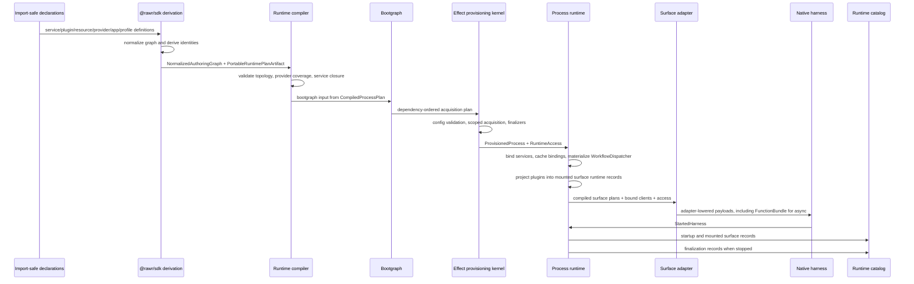

# RAWR Runtime Realization System

Status: Canonical
Scope: Runtime realization, selected authoring declarations, SDK derivation, runtime compilation, bootgraph ordering, Effect-backed provisioning, process runtime binding, adapter lowering, harness mounting, diagnostics, telemetry, and deterministic finalization

## 1. Purpose and scope

The RAWR Runtime Realization System turns selected app composition into one started, typed, observable, stoppable process per `startApp(...)` invocation.

Runtime realization makes execution explicit without creating a second public semantic architecture. Runtime realization owns only the bridge from selected declarations to a running process.

File: `specification://runtime-realization/lifecycle.txt`
Layer: runtime realization lifecycle
Exactness: normative lifecycle order and phase ownership.

```text
definition -> selection -> derivation -> compilation -> provisioning -> mounting -> observation
```

Runtime realization exists below semantic composition and above native host frameworks. It shows how authored declarations become derived artifacts, compiled artifacts, provisioned runtime values, bound services, adapter-lowered payloads, mounted harnesses, catalog records, telemetry, and finalization records.

A RAWR app may define multiple entrypoints or process shapes. Runtime realization starts one selected process shape. Multi-process placement, platform services, replicas, and machine-level deployment policy are deployment and control-plane concerns. They may consume runtime catalog records and process-boundary metadata, but they do not change service truth, plugin identity, app membership, role meaning, or surface meaning.

The broader platform composition law is:

File: `specification://runtime-realization/platform-chain.txt`
Layer: platform cohesion frame
Exactness: normative semantic-to-runtime ordering.

```text
bind -> project -> compose -> realize -> observe
```

Inside runtime realization, the normative lifecycle remains:

File: `specification://runtime-realization/runtime-chain.txt`
Layer: runtime lifecycle
Exactness: normative runtime realization lifecycle.

```text
definition -> selection -> derivation -> compilation -> provisioning -> mounting -> observation
```

Runtime realization owns compilation, provisioning, process runtime assembly, service binding, adapter lowering, harness handoff, diagnostics, telemetry, and deterministic finalization.

Runtime realization does not own service domain truth, plugin semantic meaning, app product identity, deployment placement, public API meaning, durable workflow semantics, CLI command semantics, shell governance, desktop-native behavior, or web framework semantics.

Shutdown, rollback, provider release, harness stop order, finalizers, managed runtime disposal, and final catalog records are deterministic runtime finalization and observation behavior. They are not an eighth top-level lifecycle phase.

## 2. Fixed outcome

Each `startApp(...)` invocation produces exactly one started process runtime assembly.

The started process owns:

| Runtime result | Owner | Meaning |
| --- | --- | --- |
| One root managed runtime | Runtime / Effect provisioning kernel | Process-local execution root and disposal owner |
| One process runtime assembly | Runtime / process runtime | Bound services, role access, mounted surface records, harness handoff |
| Zero or more mounted roles | App-selected process shape | Selected role slices from the app composition |
| Zero or more mounted surfaces | Process runtime and harnesses | Runtime-ready surface payloads mounted into native hosts |
| One runtime catalog stream or record set | Diagnostics | Redacted read model of selected, derived, provisioned, bound, projected, mounted, observed, and stopped runtime state |
| One deterministic finalization path | Runtime | Reverse-order harness stop, surface assembly stop, role finalizers, process finalizers, managed runtime disposal, final records |

A cohosted development process and a split production process use the same semantic app and plugin definitions. Cohosting changes placement and resource sharing. It does not change species.

## 3. Ownership laws

Runtime realization is stable only when each layer owns one job.

| Layer | Owns | Does not own |
| --- | --- | --- |
| Services | Semantic truth, callable contracts, schemas, repositories, migrations, domain policy, stable service config, service-to-service dependency declarations | Public API projection, app membership, provider selection, harness mounting, process placement |
| Plugins | Projection into one role/surface/capability lane, topology-implied caller classification, native builder facts, projection-local caller and boundary policy, service-use declarations | Service truth, provider acquisition, app selection, projection reclassification |
| Apps | App membership, selected projections, runtime profiles, provider selections, config source selection, entrypoints, process defaults, selected publication artifacts | Service truth, plugin species, provider implementation, runtime acquisition |
| Resources | Provisionable capability contracts, consumed value shape, lifetime requirement, public resource identity | Provider implementation, semantic truth, app selection |
| Providers | Implementation, acquisition, release, validation, native client construction, health, refresh, provider config | Resource identity, app selection, service truth |
| SDK | Normalized authoring graph, canonical identities, resource requirements, normalized `ProviderSelection`, service binding plans, surface runtime plan descriptors, portable plan artifacts | Resource acquisition, provider execution, managed runtime construction, harness mounting |
| Runtime | Compiler, compiled process plan, bootgraph, Effect provisioning kernel, process runtime, runtime access, service binding cache, adapter lowering, diagnostics, deterministic finalization | Service truth, app membership, plugin meaning, caller-facing API semantics, deployment placement |
| Harnesses | Native mounting into Elysia, Inngest, OCLIF, web, agent/OpenShell, desktop, and other host frameworks | SDK graph consumption, runtime compilation, provider acquisition, service truth |
| Diagnostics | Observation, redacted catalog records, lifecycle findings, topology read models, telemetry | Composition authority, live value acquisition, state mutation, provider selection |

The strongest practical rule is:

File: `specification://runtime-realization/ownership-rule.txt`
Layer: ownership law
Exactness: normative.

```text
Services own truth.
Plugins project.
Apps select.
Resources declare capability contracts.
Providers implement capability contracts.
The SDK derives.
The runtime realizes.
Harnesses mount.
Diagnostics observe.
```

Shared infrastructure does not transfer schema ownership, write authority, service truth, plugin identity, or app membership. Multiple services may share a process, machine, database instance, connection pool, telemetry installation, cache infrastructure, or host runtime. That sharing is infrastructure. It is not shared semantic ownership.

RAWR owns boundaries and runtime handoffs. Native framework interiors own native execution semantics after RAWR hands them runtime-realized payloads.

## 4. Canonical topology and package authority

The physical topology is locked.

File: `specification://runtime-realization/canonical-topology.txt`
Layer: repository topology
Exactness: normative for roots, package authority, and ownership placement.

```text
packages/
  core/
    sdk/                         # publishes @rawr/sdk
    runtime/                     # compiler, bootgraph, substrate, process runtime, harnesses, topology
      compiler/
      bootgraph/
      substrate/
        effect/
      process-runtime/
      harnesses/
        elysia/
        inngest/
        oclif/
        web/
        agent/
        desktop/
      topology/
      standard/                  # RAWR-owned standard providers and internal runtime machinery

resources/
  <capability>/                  # authored provisionable capability catalog

services/
  <service>/                     # semantic truth

plugins/
  server/
    api/
      <capability>/              # public server API projection
    internal/
      <capability>/              # trusted first-party/internal server API projection
  async/
    workflows/
      <capability>/              # durable workflow projection
    schedules/
      <capability>/              # durable scheduled projection
    consumers/
      <capability>/              # durable consumer projection
  cli/
    commands/
      <capability>/              # OCLIF command projection
  web/
    app/
      <capability>/              # web app projection
  agent/
    channels/
      <capability>/              # agent channel projection
    shell/
      <capability>/              # OpenShell projection
    tools/
      <capability>/              # agent tool projection
  desktop/
    menubar/
      <capability>/              # desktop menubar projection
    windows/
      <capability>/              # desktop window projection
    background/
      <capability>/              # desktop background projection

apps/
  <app>/
    rawr.<app>.ts                # app composition
    server.ts                    # entrypoint
    async.ts                     # entrypoint
    web.ts                       # entrypoint
    agent.ts                     # entrypoint
    cli.ts                       # entrypoint
    desktop.ts                   # entrypoint
    dev.ts                       # cohosted development entrypoint
    runtime/
      profiles/
      config.ts
      processes.ts
```

There is no root-level `core/` authoring root. There is no root-level `runtime/` authoring root. Platform machinery lives under `packages/core/*`. Authored provisionable capability contracts live under `resources/*`.

The public SDK is published as `@rawr/sdk` from `packages/core/sdk`.

Canonical public import surfaces include:

| Public surface | Owner |
| --- | --- |
| `@rawr/sdk/app` | App and entrypoint authoring |
| `@rawr/sdk/service` | Service authoring |
| `@rawr/sdk/plugins/server` | Server projection authoring |
| `@rawr/sdk/plugins/async` | Async projection authoring |
| `@rawr/sdk/plugins/cli` | CLI projection authoring |
| `@rawr/sdk/plugins/web` | Web projection authoring |
| `@rawr/sdk/plugins/agent` | Agent projection authoring |
| `@rawr/sdk/plugins/desktop` | Desktop projection authoring |
| `@rawr/sdk/runtime/resources` | Runtime resource declarations |
| `@rawr/sdk/runtime/providers` | Runtime provider declarations |
| `@rawr/sdk/runtime/profiles` | Runtime profile declarations |
| `@rawr/sdk/runtime/schema` | `RuntimeSchema` facade |

Ordinary services, plugins, apps, and entrypoints import public SDK surfaces, service boundary exports, plugin factories, resource descriptors, provider selectors, and app-owned profile helpers.

They do not import Effect layer internals, concrete managed runtime handles, process runtime internals, harness mount code, adapter-lowered payload constructors, raw provider acquisition machinery, or unredacted provider config.

Only `@rawr/sdk` public imports are locked public package export conventions in this document. Non-`@rawr/sdk` imports shown in examples are illustrative package aliases unless a code block labels them otherwise.

## 5. Import safety and declaration discipline

All declarations are import-safe.

A service, plugin, resource, provider, app, or profile module declares facts, factories, descriptors, selectors, schemas, and contracts. Importing a declaration does not acquire resources, read secrets, connect providers, start processes, register globals, mutate app composition, or mount native hosts.

This rule applies to:

| Module kind | Import-safe content |
| --- | --- |
| Service modules | Boundary schemas, service declarations, service contracts, router factories, module contracts |
| Plugin modules | One plugin factory, lane-specific definitions, oRPC routers/contracts, workflow definitions, command definitions, web/agent/desktop surface definitions |
| Resource modules | `RuntimeResource` descriptors, requirement helpers, value types |
| Provider modules | Cold `RuntimeProvider` descriptors and acquisition plans |
| App modules | App membership declarations and runtime profile selection |
| Entrypoints | `startApp(...)` invocation and selected process shape |

A provider may contain Effect-native acquisition code, but it remains cold until provisioning. A plugin may contain native oRPC, Inngest-shaped, OCLIF, web, OpenShell, or desktop declarations, but those declarations remain cold until the SDK derives, the runtime compiler compiles, the provisioning kernel provisions, the process runtime binds, the surface adapters lower, and the harnesses mount.

## 6. Layered naming and artifact ownership

Names remain layer-specific. Similar concepts in different layers use different terms because they have different owners.

| Layer | Canonical terms | Consumer |
| --- | --- | --- |
| App authoring | `defineApp(...)`, `startApp(...)`, `AppDefinition`, `Entrypoint`, `RuntimeProfile` | SDK derivation and runtime compiler |
| Service authoring | `defineService(...)`, `resourceDep(...)`, `serviceDep(...)`, `semanticDep(...)`, `deps`, `scope`, `config`, `invocation`, `provided` | SDK derivation and service binding |
| Plugin authoring | `PluginFactory`, `PluginDefinition`, `useService(...)`, lane-specific builders, lane-native definitions | SDK derivation and surface runtime plans |
| Resource/provider/profile authoring | `RuntimeResource`, `ResourceRequirement`, `ResourceLifetime`, `RuntimeProvider`, `ProviderSelection`, `RuntimeProfile` | SDK derivation, runtime compiler, provisioning kernel |
| SDK derivation | `NormalizedAuthoringGraph`, `ServiceBindingPlan`, `SurfaceRuntimePlan`, `PortableRuntimePlanArtifact` | Runtime compiler |
| Runtime compilation | `CompiledProcessPlan`, `CompiledResourcePlan`, `CompiledServiceBindingPlan`, `CompiledSurfacePlan`, `ProviderDependencyGraph` | Bootgraph, process runtime, surface adapters |
| Provisioning | `Bootgraph`, `BootResourceKey`, `BootResourceModule`, `ProvisionedProcess`, `ManagedRuntimeHandle` | Process runtime |
| Live access | `RuntimeAccess`, `ProcessRuntimeAccess`, `RoleRuntimeAccess` | Service binding, plugin projection, harness adapters |
| Runtime binding | `ServiceBindingCache`, `ServiceBindingCacheKey`, `bindService(...)` | Process runtime and plugin projection |
| Adapter lowering | `SurfaceAdapter`, `AdapterLoweringResult`, adapter-lowered payloads, `FunctionBundle` | Harnesses |
| Dispatcher integration | `WorkflowDispatcherDescriptor`, `WorkflowDispatcher` | Server API/internal projections and async harness integration |
| Harness/native boundary | `HarnessDescriptor`, `StartedHarness`, native host payloads | Native host framework |
| Observation | `RuntimeCatalog`, `RuntimeDiagnostic`, `RuntimeTelemetry`, `RuntimeDiagnosticContributor` | Diagnostics, topology tools, control-plane touchpoints |

`startApp(...)` is the canonical app start operation. Roles, surfaces, harnesses, profiles, and process hosts are selected data passed to the entrypoint operation. There is no role-specific public start verb.

## 7. Code block exactness rule

Every illustrated code block in this specification includes `File:`, `Layer:`, and `Exactness:` labels immediately before it.

Code and type blocks are normative for locked names, ownership boundaries, required fields, producer/consumer shape, lifecycle handoff, and layer handoff. They are illustrative for overloads, generic parameters, helper placement, and non-`@rawr/sdk` import paths unless a block states otherwise.

## 8. Schema ownership and `RuntimeSchema`

`RuntimeSchema` is the canonical SDK-facing schema facade for runtime-owned and runtime-carried boundary schema declarations.

It appears where the runtime must derive validation, type projection, config decoding, redaction, diagnostics, or harness payload contracts from an authored declaration. That includes resource config, provider config, runtime profile config, service boundary `scope`, service boundary `config`, service boundary `invocation`, runtime diagnostics payloads, and harness-facing runtime payloads.

`RuntimeSchema` has this minimum contract.

File: `packages/core/sdk/src/runtime/schema/runtime-schema.ts`
Layer: SDK runtime schema facade
Exactness: normative for required capabilities; illustrative for generic spelling.

```ts
export interface RuntimeSchema<TValue = unknown> {
  readonly kind: "runtime.schema";
  readonly serializable: unknown;
  readonly description?: string;
  readonly redaction?: RuntimeRedactionPolicy;

  decode(input: unknown): RuntimeSchemaResult<TValue>;
  validate(input: unknown): RuntimeSchemaResult<TValue>;
  toDiagnosticShape(): RuntimeDiagnosticSchemaShape;
  toStaticType?: unknown;
}
```

`RuntimeSchema` does not transfer service semantic schema ownership to the runtime. Service procedure payloads, plugin API payloads, plugin-native contracts, and workflow payloads remain schema-backed contracts owned by their service or plugin boundary.

The ownership split is:

| Schema-bearing boundary | Schema owner | Schema form |
| --- | --- | --- |
| Runtime resource config | Resource/provider boundary | `RuntimeSchema` |
| Provider config | Provider boundary | `RuntimeSchema` |
| Runtime profile config | App/runtime profile boundary | `RuntimeSchema` |
| Service `scope`, `config`, `invocation` lanes | Service boundary as runtime-carried lanes | `RuntimeSchema` |
| Service callable procedure input/output/errors | Service package | Service-owned schema-backed oRPC-compatible contracts |
| Public server API input/output/errors | Server API plugin | Plugin-owned schema-backed oRPC-compatible contracts |
| Server internal API input/output/errors | Server internal plugin | Plugin-owned schema-backed oRPC-compatible contracts |
| Workflow payloads read from event data | Async plugin or projected service boundary | Schema-backed payload contract |
| Harness-facing runtime payloads | Runtime adapter/harness boundary | `RuntimeSchema` |
| Diagnostics payloads | Runtime diagnostics | `RuntimeSchema` |

Plain string labels may name capabilities, routes, ids, triggers, cron expressions, policies, event names, and diagnostic codes. They must not stand in for data schemas.

## 9. App and entrypoint authoring contract

### 9.1 AppDefinition

`defineApp(...)` declares app identity and selected plugin membership. It may reference runtime profile definitions, process defaults, and selected publication artifacts through app-owned runtime modules. It does not acquire resources or start a process.

File: `apps/hq/rawr.hq.ts`
Layer: app authoring
Exactness: normative for app membership, plugin selection, and separation from process shape; illustrative for non-`@rawr/sdk` imports and plugin names.

```ts
import { defineApp } from "@rawr/sdk/app";

import { createPlugin as workItemsPublicApi } from "@rawr/plugins/server/api/work-items";
import { createPlugin as workItemsInternalApi } from "@rawr/plugins/server/internal/work-items-ops";
import { createPlugin as workItemsSyncWorkflow } from "@rawr/plugins/async/workflows/work-items-sync";
import { createPlugin as workItemsDigestSchedule } from "@rawr/plugins/async/schedules/work-items-digest";
import { createPlugin as workItemsCli } from "@rawr/plugins/cli/commands/work-items";
import { createPlugin as workItemsWeb } from "@rawr/plugins/web/app/work-items-board";
import { createPlugin as workItemsAgentTools } from "@rawr/plugins/agent/tools/work-items";
import { createPlugin as diskStatusDesktop } from "@rawr/plugins/desktop/menubar/disk-status";

export const hqApp = defineApp({
  id: "hq",
  plugins: [
    workItemsPublicApi(),
    workItemsInternalApi(),
    workItemsSyncWorkflow(),
    workItemsDigestSchedule(),
    workItemsCli(),
    workItemsWeb(),
    workItemsAgentTools(),
    diskStatusDesktop(),
  ],
});
```

The app owns membership. The SDK derives role/surface indexes from the selected plugin definitions.

### 9.2 RuntimeProfile and process defaults

Runtime profiles live under `apps/<app>/runtime/profiles/*`. They select providers and config sources for the app. The profile field that holds provider choices is `providers` or `providerSelections`, never `resources`.

Resources, providers, and profiles are separate layers.

A resource declares a capability contract. A provider implements that capability contract. A profile selects which provider implementation satisfies the contract for an app, environment, lifetime, role, and optional instance.

File: `apps/hq/runtime/profiles/production.ts`
Layer: app-owned runtime profile selection
Exactness: normative for provider-selection field names, app ownership, config-source binding, and selector shape; illustrative for non-`@rawr/sdk` imports and provider selector names.

```ts
import { defineRuntimeProfile } from "@rawr/sdk/runtime/profiles";
import { clock } from "@rawr/resources/clock/select";
import { email } from "@rawr/resources/email/select";
import { inngest } from "@rawr/resources/inngest/select";
import { logger } from "@rawr/resources/logger/select";
import { sql } from "@rawr/resources/sql/select";

export const productionProfile = defineRuntimeProfile({
  id: "hq.production",
  providers: [
    clock.system(),
    logger.openTelemetry({ configKey: "telemetry" }),
    sql.postgres({ configKey: "sql.primary" }),
    email.resend({ configKey: "email.primary" }),
    inngest.cloud({ configKey: "inngest.primary" }),
  ],
  configSources: [
    { kind: "env" },
    { kind: "file", path: "runtime.production.json", optional: true },
  ],
});
```

What consumes this: the SDK derives normalized `ProviderSelection` artifacts from the profile; the runtime compiler validates provider coverage and provider dependency closure; the bootgraph receives provider ordering input; the provisioning kernel loads config, redacts secrets, and acquires selected providers.

### 9.3 Entrypoint

`startApp(...)` is the canonical app start operation. It receives selected app definition, runtime profile, process roles, and optional process/harness selection facts. It starts one process.

File: `apps/hq/server.ts`
Layer: entrypoint authoring
Exactness: normative for `startApp(...)` as the only start verb and for process-role selection.

```ts
import { startApp } from "@rawr/sdk/app";
import { hqApp } from "./rawr.hq";
import { productionProfile } from "./runtime/profiles/production";

await startApp(hqApp, {
  entrypointId: "hq.server",
  profile: productionProfile,
  roles: ["server"],
});
```

File: `apps/hq/dev.ts`
Layer: cohosted entrypoint authoring
Exactness: normative for cohosted process shape as selection, not semantic reclassification.

```ts
import { startApp } from "@rawr/sdk/app";
import { hqApp } from "./rawr.hq";
import { localProfile } from "./runtime/profiles/local";

await startApp(hqApp, {
  entrypointId: "hq.dev",
  profile: localProfile,
  roles: ["server", "async", "web", "agent"],
});
```

The entrypoint does not redefine what belongs to the app. It selects which role slices start in this process. App membership, provider selection, and process shape remain distinct facts.

## 10. Service authoring contract

### 10.1 Service ownership

A service is the semantic capability boundary. It owns contracts, context lanes, stable config, domain policy, schemas, migrations, repositories, service-internal modules, and write authority over its invariants.

Services are transport-neutral and placement-neutral. API, workflow, process, CLI, web, agent, or desktop placement does not change service species.

A service does not own public API projection, internal API projection, async workflow execution, command projection, web projection, agent projection, desktop projection, app membership, provider selection, process placement, or harness mounting.

### 10.2 Service placement

File: `specification://runtime-realization/service-placement.txt`
Layer: service topology
Exactness: normative for placement and scale-continuous internal structure.

```text
services/<service>/
  src/
    index.ts
    client.ts
    router.ts
    service/
      base.ts
      contract.ts
      impl.ts
      router.ts
      middleware/
      shared/
      modules/
        <module>/
          schemas.ts
          contract.ts
          module.ts
          middleware.ts
          repository.ts
          router.ts
```

The service package root exports boundary surfaces only. It must not export repositories, migrations, module internals, service-private schemas, service-private middleware, or runtime provider internals.

### 10.3 Context lanes

The canonical service lanes are:

| Lane | Owner | Runtime status |
| --- | --- | --- |
| `deps` | Service declaration, satisfied by runtime binding | Construction-time |
| `scope` | Service declaration, supplied by app/plugin binding policy | Construction-time |
| `config` | Service declaration, supplied by runtime config/profile | Construction-time |
| `invocation` | Service declaration, supplied per call by caller/harness | Per-call |
| `provided` | Service middleware/module composition | Execution-derived |

Service binding is construction-time over `deps`, `scope`, and `config`. Invocation does not participate in construction-time binding and never participates in `ServiceBindingCacheKey`.

`provided.*` is service middleware output. The runtime and package boundaries must not seed `provided.*`; service middleware is the only source unless a named service-middleware contract explicitly changes this rule.

### 10.4 Dependency helper rules

`resourceDep(...)` declares a dependency on a provisionable host capability. It does not construct providers.

`serviceDep(...)` declares a service-to-service client dependency. It does not import sibling service internals and is not selected through a runtime profile.

`semanticDep(...)` names an explicit semantic adapter dependency. It is not a runtime resource, not a provider selection, and not a sibling repository import.

### 10.5 defineService

`defineService(...)` declares service identity, dependency lanes, runtime-carried schemas for scope/config/invocation, metadata defaults, service-owned policy vocabulary, and service-local oRPC authoring helpers.

File: `services/work-items/src/service/base.ts`
Layer: service authoring, semantic truth
Exactness: normative for lane names, dependency helpers, and `RuntimeSchema` use for runtime-carried lanes; illustrative for exact generic spelling and non-`@rawr/sdk` imports.

```ts
import {
  defineService,
  resourceDep,
  serviceDep,
  semanticDep,
  type ServiceOf,
} from "@rawr/sdk/service";
import { RuntimeSchema } from "@rawr/sdk/runtime/schema";

import { ClockResource } from "@rawr/resources/clock";
import { LoggerResource } from "@rawr/resources/logger";
import { SqlPoolResource } from "@rawr/resources/sql";

export const WorkItemsScopeSchema = RuntimeSchema.struct({
  workspaceId: RuntimeSchema.string({ minLength: 1 }),
});

export const WorkItemsConfigSchema = RuntimeSchema.struct({
  readOnly: RuntimeSchema.boolean(),
  limits: RuntimeSchema.struct({
    maxAllocationsPerItem: RuntimeSchema.number({ min: 1 }),
  }),
});

export const WorkItemsInvocationSchema = RuntimeSchema.struct({
  traceId: RuntimeSchema.string(),
  actorId: RuntimeSchema.optional(RuntimeSchema.string()),
});

export const service = defineService({
  id: "work-items",

  deps: {
    dbPool: resourceDep(SqlPoolResource),
    clock: resourceDep(ClockResource),
    logger: resourceDep(LoggerResource),
  },

  scope: WorkItemsScopeSchema,
  config: WorkItemsConfigSchema,
  invocation: WorkItemsInvocationSchema,

  metadataDefaults: {
    idempotent: true,
    domain: "work-items",
    audience: "internal",
    audit: "basic",
  },

  baseline: {
    policy: {
      events: {
        readOnlyRejected: "work-items.policy.read_only_rejected",
        allocationLimitReached: "work-items.policy.allocation_limit_reached",
      },
    },
  },
});

export type WorkItemsService = ServiceOf<typeof service>;

export const ocBase = service.oc;
export const createServiceMiddleware = service.createMiddleware;
export const createServiceImplementer = service.createImplementer;
```

What consumes this: the SDK normalizes resource dependencies, service dependencies, semantic dependencies, runtime-carried schemas, metadata, and boundary identity into the normalized authoring graph. The runtime compiler uses the normalized dependencies to produce `ServiceBindingPlan` and resource requirements. The process runtime uses the binding plan to construct live service clients.

### 10.6 Service procedure contracts

Service callable contracts are service-owned schema-backed contracts. They may be expressed through oRPC primitives. oRPC owns procedure and transport mechanics; the service owns the meaning.

File: `services/work-items/src/service/modules/items/schemas.ts`
Layer: service-owned schema-backed procedure data
Exactness: normative that procedure data has concrete schema artifacts; illustrative for schema facade spelling.

```ts
import { schema } from "@rawr/sdk/service/schema";

export const WorkItemSchema = schema.object({
  id: schema.uuid(),
  workspaceId: schema.string({ minLength: 1 }),
  title: schema.string({ minLength: 1, maxLength: 500 }),
  description: schema.nullable(schema.string({ maxLength: 2000 })),
  status: schema.union([
    schema.literal("open"),
    schema.literal("blocked"),
    schema.literal("done"),
  ]),
  createdAt: schema.isoDateTime(),
  updatedAt: schema.isoDateTime(),
});

export const CreateWorkItemInputSchema = schema.object({
  title: schema.string({ minLength: 1, maxLength: 500 }),
  description: schema.optional(schema.string({ maxLength: 2000 })),
});

export const InvalidTitleErrorDataSchema = schema.object({
  title: schema.optional(schema.string()),
});
```

File: `services/work-items/src/service/modules/items/contract.ts`
Layer: service-owned callable contract
Exactness: normative for schema-backed input, output, and error-data contracts; illustrative for exact oRPC chaining syntax.

```ts
import { ocBase } from "../../base";
import {
  CreateWorkItemInputSchema,
  InvalidTitleErrorDataSchema,
  WorkItemSchema,
} from "./schemas";
import { READ_ONLY_MODE, RESOURCE_NOT_FOUND } from "../../shared/errors";

export const contract = {
  create: ocBase
    .meta({ idempotent: false, entity: "item", audit: "full" })
    .input(CreateWorkItemInputSchema)
    .output(WorkItemSchema)
    .errors({
      READ_ONLY_MODE,
      INVALID_WORK_ITEM_TITLE: {
        status: 400,
        message: "Invalid work item title",
        data: InvalidTitleErrorDataSchema,
      },
    }),

  get: ocBase
    .meta({ idempotent: true, entity: "item", audit: "basic" })
    .input(schema.object({ id: schema.uuid() }))
    .output(WorkItemSchema)
    .errors({ RESOURCE_NOT_FOUND }),
};
```

### 10.7 N > 1 service module shape

A realistic service has more than one module without changing species.

File: `services/work-items/src/service/modules/_tree.txt`
Layer: service-internal module topology
Exactness: normative for N > 1 module organization; illustrative for module names.

```text
services/work-items/src/service/modules/
  items/
    schemas.ts
    contract.ts
    module.ts
    middleware.ts
    repository.ts
    router.ts
  labels/
    schemas.ts
    contract.ts
    module.ts
    middleware.ts
    repository.ts
    router.ts
  allocations/
    schemas.ts
    contract.ts
    module.ts
    middleware.ts
    repository.ts
    router.ts
```

The root service contract composes module contracts. The root service router composes module routers.

File: `services/work-items/src/service/contract.ts`
Layer: service root contract composition
Exactness: normative for root contract composition role; illustrative for module names.

```ts
import { contract as allocations } from "./modules/allocations/contract";
import { contract as items } from "./modules/items/contract";
import { contract as labels } from "./modules/labels/contract";

export const contract = {
  items,
  labels,
  allocations,
};

export type WorkItemsContract = typeof contract;
```

File: `services/work-items/src/service/router.ts`
Layer: service root router composition
Exactness: normative for final router assembly role; illustrative for exact attach syntax.

```ts
import { impl } from "./impl";
import { router as allocations } from "./modules/allocations/router";
import { router as items } from "./modules/items/router";
import { router as labels } from "./modules/labels/router";

export const router = impl.router({
  items,
  labels,
  allocations,
});

export type WorkItemsRouter = typeof router;
```

The responsibility split is fixed:

| File | Responsibility | Forbidden responsibility |
| --- | --- | --- |
| `schemas.ts` | Module-owned data schemas and error-data schemas | App/runtime config, provider selection |
| `contract.ts` | Caller-visible procedure contract for the module | Repository implementation, public API route policy |
| `module.ts` | Module-local middleware and context preparation | Root service composition authority |
| `middleware.ts` | Module-specific execution decoration and provided values | Provider acquisition |
| `repository.ts` | Service-internal persistence mechanics under service write authority | Cross-service table writes by accident |
| `router.ts` | Module behavior and procedure implementation | Sibling service internals, app membership |

Repositories remain service-internal persistence mechanics under the service’s write authority. A service may share a database pool with another service. It does not share table write authority, migration authority, repository ownership, or semantic truth by accident.

### 10.8 Service-to-service dependency through `serviceDep(...)`

A service may depend on a sibling service by declaring a service dependency. A service dependency is not a runtime resource and is not selected through a runtime profile.

File: `services/user-accounts/src/service/base.ts`
Layer: service authoring with sibling service dependencies
Exactness: normative for `serviceDep(...)` and construction-time service dependency lane; illustrative for service names and non-`@rawr/sdk` imports.

```ts
import { defineService, resourceDep, serviceDep } from "@rawr/sdk/service";
import { RuntimeSchema } from "@rawr/sdk/runtime/schema";

import { SqlPoolResource } from "@rawr/resources/sql";
import { service as BillingService } from "@rawr/services/billing";
import { service as EntitlementsService } from "@rawr/services/entitlements";

export const service = defineService({
  id: "user-accounts",

  deps: {
    dbPool: resourceDep(SqlPoolResource),
    billing: serviceDep(BillingService),
    entitlements: serviceDep(EntitlementsService),
  },

  scope: RuntimeSchema.struct({
    workspaceId: RuntimeSchema.string(),
  }),

  config: RuntimeSchema.struct({
    allowSelfService: RuntimeSchema.boolean(),
  }),

  invocation: RuntimeSchema.struct({
    traceId: RuntimeSchema.string(),
  }),
});
```

What consumes this: the SDK derives service dependency edges. The runtime compiler constructs an acyclic service binding DAG. The process runtime binds billing and entitlements clients before constructing the user-accounts binding. The user-accounts handler receives sibling clients through `context.deps.billing` and `context.deps.entitlements`.

A service does not import sibling repositories, module routers, module schemas, migrations, service-private middleware, or service-private provider helpers.

## 11. Plugin authoring contract

### 11.1 PluginDefinition and PluginFactory

A plugin projects service truth or host capability into exactly one role/surface/capability lane.

A plugin package exports one canonical `PluginFactory`. That factory is import-safe, runs at app composition time, acquires no resources, and returns exactly one `PluginDefinition`.

Grouped plugin helpers may exist for ergonomics. Grouped plugins are not a runtime architecture kind. They are not used for identity, topology, diagnostics, app composition authority, service binding, or harness mounting.

File: `packages/core/sdk/src/plugins/plugin-definition.ts`
Layer: SDK plugin authoring type shape
Exactness: normative for owner, producer/consumer, and fields; illustrative for generic spelling.

```ts
export interface PluginFactory<TOptions = void> {
  (options: TOptions): PluginDefinition;
}

export interface PluginDefinition<
  TRole extends AppRole = AppRole,
  TSurface extends string = string,
  TCapability extends string = string,
> {
  readonly kind: "plugin.definition";
  readonly id: string;
  readonly role: TRole;
  readonly surface: TSurface;
  readonly capability: TCapability;
  readonly instance?: string;
  readonly serviceUses: readonly ServiceUse[];
  readonly resourceRequirements: readonly ResourceRequirement[];
  readonly project: PluginProjectionFunction;
}
```

Most authors use lane-specific builders. The generic shape is SDK/runtime internal scaffolding, not normal plugin DX.

### 11.2 Topology and builder agreement

Public server API, trusted server internal, async, CLI, web, agent, desktop, and shell projection status is implied by topology plus matching builder. No generic projection-classification object declares status.

| Topology | Matching builder family | Projection |
| --- | --- | --- |
| `plugins/server/api/<capability>` | `defineServerApiPlugin(...)` | Public server API projection |
| `plugins/server/internal/<capability>` | `defineServerInternalPlugin(...)` | Trusted first-party/internal server API projection |
| `plugins/async/workflows/<capability>` | Workflow projection builder | Durable workflow projection |
| `plugins/async/schedules/<capability>` | Schedule projection builder | Durable scheduled projection |
| `plugins/async/consumers/<capability>` | Consumer projection builder | Durable consumer projection |
| `plugins/cli/commands/<capability>` | CLI command projection builder | OCLIF command projection |
| `plugins/web/app/<capability>` | Web app projection builder | Web surface projection |
| `plugins/agent/channels/<capability>` | Agent channel projection builder | Agent channel projection |
| `plugins/agent/shell/<capability>` | Agent shell projection builder | OpenShell projection |
| `plugins/agent/tools/<capability>` | Agent tool projection builder | Agent tool projection |
| `plugins/desktop/menubar/<capability>` | Desktop menubar projection builder | Desktop menubar projection |
| `plugins/desktop/windows/<capability>` | Desktop window projection builder | Desktop window projection |
| `plugins/desktop/background/<capability>` | Desktop background projection builder | Desktop background projection |

Path and builder mismatch is a structural error.

Route, command, function, shell, and native mount facts are builder-specific surface facts. They do not encode public/internal projection status. App selection and harness publication policy may select, mount, publish, or generate artifacts for already-classified projections. They do not reclassify a plugin projection.

Plugin authoring fields named `exposure`, `visibility`, `publication`, `public`, `internal`, `kind`, or `adapter.kind` are invalid when used to declare or reclassify projection status. A `kind` field remains valid only for non-projection discriminants such as `kind: "plugin.definition"`; values such as `kind: "public"` or `kind: "internal"` are not valid projection-classification authority.

A capability that needs both public and trusted internal callable surfaces authors two projection packages.

### 11.3 `useService(...)`

Plugin authoring uses `useService(...)` to declare projected service clients. The SDK turns `useService(...)` into service binding requirements. The runtime constructs the right service client and passes it to the plugin projection function.

File: `plugins/server/api/work-items/src/plugin.ts`
Layer: public server API plugin authoring
Exactness: normative for `plugins/server/api/*` plus `defineServerApiPlugin(...)` classification and `useService(...)`; illustrative for route base, function names, and non-`@rawr/sdk` imports.

```ts
import { defineServerApiPlugin, useService } from "@rawr/sdk/plugins/server";
import { service as WorkItemsService } from "@rawr/services/work-items";

import { createWorkItemsPublicRouter } from "./router";
import { workItemsPublicApiContract } from "./contract";

export const createPlugin = defineServerApiPlugin.factory()({
  capability: "work-items",
  routeBase: "/work-items",

  services: {
    workItems: useService(WorkItemsService),
  },

  api({ clients, request }) {
    return createWorkItemsPublicRouter({
      contract: workItemsPublicApiContract,
      workItems: clients.workItems,
      request,
    });
  },
});
```

The plugin owns public API projection. The service owns work-item truth. Elysia owns HTTP host mechanics. oRPC owns procedure mechanics.

### 11.4 Public server API plugin with concrete schemas

A `plugins/server/api/<capability>` package uses `defineServerApiPlugin(...)`. Its public server API projection status comes from topology and builder, not a field.

File: `plugins/server/api/work-items/src/contract.ts`
Layer: public server API plugin contract
Exactness: normative for concrete input, output, and error-data schemas at plugin API boundary; illustrative for schema facade spelling.

```ts
import { schema } from "@rawr/sdk/plugins/schema";
import { createPublicApiContract } from "@rawr/sdk/plugins/server/orpc";

export const PublicCreateWorkItemInputSchema = schema.object({
  title: schema.string({ minLength: 1, maxLength: 500 }),
  description: schema.optional(schema.string({ maxLength: 2000 })),
});

export const PublicWorkItemOutputSchema = schema.object({
  id: schema.uuid(),
  title: schema.string(),
  status: schema.union([
    schema.literal("open"),
    schema.literal("blocked"),
    schema.literal("done"),
  ]),
  createdAt: schema.isoDateTime(),
});

export const PublicWorkItemErrorDataSchema = schema.object({
  code: schema.union([
    schema.literal("READ_ONLY_MODE"),
    schema.literal("INVALID_TITLE"),
    schema.literal("NOT_FOUND"),
  ]),
  detail: schema.optional(schema.string()),
});

export const workItemsPublicApiContract = createPublicApiContract({
  create: {
    method: "POST",
    path: "/",
    input: PublicCreateWorkItemInputSchema,
    output: PublicWorkItemOutputSchema,
    errors: {
      PUBLIC_WORK_ITEM_ERROR: {
        status: 400,
        data: PublicWorkItemErrorDataSchema,
      },
    },
  },
});
```

File: `plugins/server/api/work-items/src/router.ts`
Layer: public server API projection router
Exactness: normative for projection calling a service boundary; illustrative for procedure syntax.

```ts
export function createWorkItemsPublicRouter(input: {
  contract: typeof workItemsPublicApiContract;
  workItems: WorkItemsClient;
  request: PublicRequestContext;
}) {
  return input.contract.router({
    create: async ({ input: payload, errors }) => {
      const result = await input.workItems.items.create({
        title: payload.title,
        description: payload.description,
      });

      if (result.status === "rejected") {
        throw errors.PUBLIC_WORK_ITEM_ERROR({
          data: {
            code: result.reason,
            detail: result.message,
          },
        });
      }

      return {
        id: result.item.id,
        title: result.item.title,
        status: result.item.status,
        createdAt: result.item.createdAt,
      };
    },
  });
}
```

The public API plugin may redact, transform, authenticate, authorize, rate-limit, and publish public contracts. It does not own the domain invariant that determines whether a work item may be created.

### 11.5 Trusted server internal plugin wrapping `WorkflowDispatcher`

A `plugins/server/internal/<capability>` package uses `defineServerInternalPlugin(...)`. It is eligible for trusted first-party RPC mounting and internal-client generation. It is not a public server API projection.

File: `plugins/server/internal/work-items-ops/src/contract.ts`
Layer: server internal plugin contract
Exactness: normative for concrete input, output, and error-data schemas at internal API boundary; illustrative for schema facade spelling.

```ts
import { schema } from "@rawr/sdk/plugins/schema";
import { createInternalApiContract } from "@rawr/sdk/plugins/server/orpc";

export const TriggerSyncInputSchema = schema.object({
  workspaceId: schema.string({ minLength: 1 }),
  syncId: schema.uuid(),
  requestedBy: schema.string({ minLength: 1 }),
});

export const TriggerSyncOutputSchema = schema.object({
  dispatchId: schema.string(),
  workflowId: schema.string(),
  acceptedAt: schema.isoDateTime(),
});

export const TriggerSyncErrorDataSchema = schema.object({
  code: schema.union([
    schema.literal("WORKFLOW_NOT_SELECTED"),
    schema.literal("WORKFLOW_DISPATCH_FAILED"),
    schema.literal("SYNC_ALREADY_RUNNING"),
    schema.literal("WORKSPACE_NOT_FOUND"),
  ]),
  workflowId: schema.optional(schema.string()),
  workspaceId: schema.optional(schema.string()),
  reason: schema.optional(schema.string()),
});

export const workItemsOpsInternalContract = createInternalApiContract({
  triggerSync: {
    method: "POST",
    path: "/sync",
    input: TriggerSyncInputSchema,
    output: TriggerSyncOutputSchema,
    errors: {
      TRIGGER_SYNC_FAILED: {
        status: 409,
        data: TriggerSyncErrorDataSchema,
      },
    },
  },
});
```

File: `plugins/server/internal/work-items-ops/src/plugin.ts`
Layer: server internal plugin authoring
Exactness: normative for `plugins/server/internal/*` plus `defineServerInternalPlugin(...)` classification and workflow dispatcher wrapping; illustrative for non-`@rawr/sdk` imports.

```ts
import { defineServerInternalPlugin, useService } from "@rawr/sdk/plugins/server";
import { service as WorkItemsService } from "@rawr/services/work-items";
import { SyncWorkspaceWorkItemsWorkflow } from "@rawr/plugins/async/workflows/work-items-sync";

import { workItemsOpsInternalContract } from "./contract";
import { createWorkItemsOpsInternalRouter } from "./router";

export const createPlugin = defineServerInternalPlugin.factory()({
  capability: "work-items-ops",

  services: {
    workItems: useService(WorkItemsService),
  },

  workflows: [SyncWorkspaceWorkItemsWorkflow],

  internalApi({ clients, workflows, request }) {
    return createWorkItemsOpsInternalRouter({
      contract: workItemsOpsInternalContract,
      workItems: clients.workItems,
      workflows,
      request,
    });
  },
});
```

File: `plugins/server/internal/work-items-ops/src/router.ts`
Layer: server internal plugin router
Exactness: normative for internal projection wrapping `WorkflowDispatcher`; illustrative for method names and syntax.

```ts
export function createWorkItemsOpsInternalRouter(input: {
  contract: typeof workItemsOpsInternalContract;
  workItems: WorkItemsClient;
  workflows: WorkflowDispatcher;
  request: InternalRequestContext;
}) {
  return input.contract.router({
    triggerSync: async ({ input: payload, errors }) => {
      const status = await input.workItems.workspaces.ensureSyncAllowed({
        workspaceId: payload.workspaceId,
      });

      if (!status.allowed) {
        throw errors.TRIGGER_SYNC_FAILED({
          data: {
            code: status.reason,
            workspaceId: payload.workspaceId,
          },
        });
      }

      const dispatch = await input.workflows.send(
        SyncWorkspaceWorkItemsWorkflow,
        {
          workspaceId: payload.workspaceId,
          syncId: payload.syncId,
          requestedBy: payload.requestedBy,
        },
      );

      if (!dispatch.ok) {
        throw errors.TRIGGER_SYNC_FAILED({
          data: {
            code: "WORKFLOW_DISPATCH_FAILED",
            workflowId: SyncWorkspaceWorkItemsWorkflow.id,
            reason: dispatch.reason,
          },
        });
      }

      return {
        dispatchId: dispatch.dispatchId,
        workflowId: SyncWorkspaceWorkItemsWorkflow.id,
        acceptedAt: dispatch.acceptedAt,
      };
    },
  });
}
```

The internal API owns trusted caller-facing trigger/status/cancel style surfaces. The workflow plugin owns durable execution definitions. The dispatcher is a derived runtime/SDK integration artifact and live materialization boundary.

### 11.6 Async workflow plugin with schema-backed event payload

Workflow, schedule, and consumer metadata is authored once in RAWR async projection definitions. `FunctionBundle` is the harness-facing lowered artifact. It is not public authoring.

File: `plugins/async/workflows/work-items-sync/src/workflows/sync-workspace.ts`
Layer: async workflow projection authoring
Exactness: normative for schema-backed payload when event data is read; illustrative for exact workflow helper names.

```ts
import { defineWorkflow, event } from "@rawr/sdk/plugins/async";
import { schema } from "@rawr/sdk/plugins/schema";

export const SyncWorkspaceWorkItemsPayloadSchema = schema.object({
  workspaceId: schema.string({ minLength: 1 }),
  syncId: schema.uuid(),
  requestedBy: schema.string({ minLength: 1 }),
});

export const SyncWorkspaceWorkItemsWorkflow = defineWorkflow({
  id: "work-items.sync-workspace",
  trigger: event("work-items/sync.requested", {
    payload: SyncWorkspaceWorkItemsPayloadSchema,
  }),
  flow: {
    idempotency: "event.data.syncId",
    concurrency: { key: "event.data.workspaceId", limit: 1 },
  },

  async handler({ event, step, clients }) {
    const items = await step.run("load-items", () =>
      clients.workItems.items.listForWorkspace({
        workspaceId: event.data.workspaceId,
      }),
    );

    await step.run("sync-items", () =>
      clients.remoteWorkItems.syncWorkspace({
        workspaceId: event.data.workspaceId,
        syncId: event.data.syncId,
        items,
      }),
    );
  },
});
```

File: `plugins/async/workflows/work-items-sync/src/plugin.ts`
Layer: async workflow plugin authoring
Exactness: normative for async workflow projection package and service-use declaration; illustrative for non-`@rawr/sdk` imports.

```ts
import { defineAsyncWorkflowPlugin, useService } from "@rawr/sdk/plugins/async";

import { service as RemoteWorkItemsService } from "@rawr/services/remote-work-items";
import { service as WorkItemsService } from "@rawr/services/work-items";
import { SyncWorkspaceWorkItemsWorkflow } from "./workflows/sync-workspace";

export const createPlugin = defineAsyncWorkflowPlugin.factory()({
  capability: "work-items-sync",

  services: {
    workItems: useService(WorkItemsService),
    remoteWorkItems: useService(RemoteWorkItemsService),
  },

  workflows: [SyncWorkspaceWorkItemsWorkflow],
});
```

Event names identify triggers. The payload schema defines event data. The workflow plugin does not expose product APIs and does not manually acquire the native Inngest client.

### 11.7 Async schedule and consumer examples

File: `plugins/async/schedules/work-items-digest/src/schedules/weekly-digest.ts`
Layer: async schedule projection authoring
Exactness: normative for schedule facts and service client use; illustrative for schedule helper syntax.

```ts
import { defineSchedule } from "@rawr/sdk/plugins/async";

export const WeeklyDigestSchedule = defineSchedule({
  id: "work-items.weekly-digest",
  cron: "0 9 * * MON",
  timezone: "America/New_York",

  async handler({ step, clients }) {
    const workspaces = await step.run("load-workspaces", () =>
      clients.workItems.workspaces.listForDigest(),
    );

    for (const workspace of workspaces) {
      await step.run(`send-digest-${workspace.id}`, () =>
        clients.notifications.sendWeeklyDigest({
          workspaceId: workspace.id,
        }),
      );
    }
  },
});
```

Cron strings identify triggers. They are not payload schemas.

File: `plugins/async/consumers/work-item-events/src/consumers/external-item-observed.ts`
Layer: async consumer projection authoring
Exactness: normative for schema-backed event data read by consumer; illustrative for consumer helper names.

```ts
import { defineConsumer, event } from "@rawr/sdk/plugins/async";
import { schema } from "@rawr/sdk/plugins/schema";

export const ExternalItemObservedPayloadSchema = schema.object({
  workspaceId: schema.string({ minLength: 1 }),
  externalId: schema.string({ minLength: 1 }),
  observedAt: schema.isoDateTime(),
  title: schema.string({ minLength: 1 }),
});

export const ExternalItemObservedConsumer = defineConsumer({
  id: "work-items.external-item-observed",
  trigger: event("external-work-items/item.observed", {
    payload: ExternalItemObservedPayloadSchema,
  }),

  async handler({ event, step, clients }) {
    await step.run("record-observation", () =>
      clients.workItems.items.recordExternalObservation(event.data),
    );
  },
});
```

Schedules and consumers do not become caller-facing dispatcher APIs.

### 11.8 CLI command projection contract

CLI command plugins live under `plugins/cli/commands/<capability>` and lower to OCLIF commands. OCLIF owns command dispatch semantics. The plugin owns projection.

File: `plugins/cli/commands/work-items/src/plugin.ts`
Layer: CLI command projection authoring
Exactness: normative for CLI lane, `useService(...)`, and projection boundary; illustrative for command object names and non-`@rawr/sdk` imports.

```ts
import { defineCliCommandPlugin, useService } from "@rawr/sdk/plugins/cli";
import { service as WorkItemsService } from "@rawr/services/work-items";

import { CreateWorkItemCommand } from "./commands/create";
import { ListWorkItemsCommand } from "./commands/list";

export const createPlugin = defineCliCommandPlugin.factory()({
  capability: "work-items",

  services: {
    workItems: useService(WorkItemsService),
  },

  commands({ clients, invocation }) {
    return [
      CreateWorkItemCommand({ workItems: clients.workItems, invocation }),
      ListWorkItemsCommand({ workItems: clients.workItems, invocation }),
    ];
  },
});
```

File: `plugins/cli/commands/work-items/src/commands/create.ts`
Layer: CLI command native interior
Exactness: normative that CLI commands use schema-backed argument contracts and call service clients; illustrative for OCLIF details.

```ts
import { cliSchema } from "@rawr/sdk/plugins/cli/schema";

export const CreateWorkItemArgsSchema = cliSchema.object({
  title: cliSchema.string({ minLength: 1 }),
  description: cliSchema.optional(cliSchema.string()),
});

export function CreateWorkItemCommand(input: {
  workItems: WorkItemsClient;
  invocation: CliInvocationContext;
}) {
  return {
    id: "work-items.create",
    args: CreateWorkItemArgsSchema,
    async run(args: cliSchema.Infer<typeof CreateWorkItemArgsSchema>) {
      return input.workItems.items.create({
        title: args.title,
        description: args.description,
      });
    },
  };
}
```

### 11.9 Web app projection contract

Web app plugins live under `plugins/web/app/<capability>` and project service clients or generated API clients into web surfaces. Web hosts own native rendering and bundling behavior. The plugin does not own server API publication.

File: `plugins/web/app/work-items-board/src/plugin.ts`
Layer: web app projection authoring
Exactness: normative for web lane and web projection boundary; illustrative for route module shape and non-`@rawr/sdk` imports.

```ts
import { defineWebAppPlugin } from "@rawr/sdk/plugins/web";

export const createPlugin = defineWebAppPlugin.factory()({
  capability: "work-items-board",

  routes: [
    {
      id: "work-items-board.index",
      path: "/work-items",
      module: () => import("./routes/work-items-board"),
    },
  ],
});
```

File: `plugins/web/app/work-items-board/src/routes/work-items-board.tsx`
Layer: web native interior
Exactness: normative that web projection consumes generated clients or service-facing surface contracts without owning server API publication; illustrative for framework details.

```tsx
export function WorkItemsBoardRoute(input: {
  api: WorkItemsPublicApiClient;
  runtime: WebRouteRuntimeContext;
}) {
  return {
    async load() {
      return input.api.list({ workspaceId: input.runtime.workspaceId });
    },

    component(props: { items: WorkItemView[] }) {
      return <WorkItemsBoard items={props.items} />;
    },
  };
}
```

### 11.10 Agent/OpenShell projection contract

Agent plugins live under `plugins/agent/channels/*`, `plugins/agent/shell/*`, and `plugins/agent/tools/*`. Agent tools call service boundaries, internal APIs, or runtime-authorized machine resources. They do not bypass service contracts for domain mutation and do not receive broad runtime access.

File: `plugins/agent/tools/work-items/src/plugin.ts`
Layer: agent tool projection authoring
Exactness: normative for agent tool lane, `useService(...)`, and no broad runtime access; illustrative for tool construction names and non-`@rawr/sdk` imports.

```ts
import { defineAgentToolPlugin, useService } from "@rawr/sdk/plugins/agent";
import { service as WorkItemsService } from "@rawr/services/work-items";

import { createWorkItemTools } from "./tools";

export const createPlugin = defineAgentToolPlugin.factory()({
  capability: "work-items",

  services: {
    workItems: useService(WorkItemsService),
  },

  tools({ clients, shell }) {
    return createWorkItemTools({
      workItems: clients.workItems,
      shell,
    });
  },
});
```

File: `plugins/agent/tools/work-items/src/tools.ts`
Layer: OpenShell-facing agent tool native interior
Exactness: normative that tool input is schema-backed and domain mutation uses service clients; illustrative for tool framework details.

```ts
import { toolSchema } from "@rawr/sdk/plugins/agent/schema";

export const CreateWorkItemToolInputSchema = toolSchema.object({
  title: toolSchema.string({ minLength: 1 }),
  description: toolSchema.optional(toolSchema.string()),
});

export function createWorkItemTools(input: {
  workItems: WorkItemsClient;
  shell: AgentShellContext;
}) {
  return [
    {
      id: "work-items.create",
      description: "Create a work item through the work-items service boundary.",
      input: CreateWorkItemToolInputSchema,
      async run(payload: toolSchema.Infer<typeof CreateWorkItemToolInputSchema>) {
        return input.workItems.items.create(payload);
      },
    },
  ];
}
```

Agent/OpenShell governance is a reserved boundary with locked integration hooks. Agent plugins do not acquire providers, do not expose unredacted runtime internals, and do not become a second business execution plane.

### 11.11 Desktop projection contract

Desktop plugins live under `plugins/desktop/menubar/*`, `plugins/desktop/windows/*`, and `plugins/desktop/background/*`. Desktop background loops are process-local. Durable business workflows remain on `async`.

File: `plugins/desktop/menubar/disk-status/src/plugin.ts`
Layer: desktop menubar projection authoring
Exactness: normative for desktop menubar lane and resource requirement declaration; illustrative for non-`@rawr/sdk` imports and native payload shape.

```ts
import { defineDesktopMenubarPlugin } from "@rawr/sdk/plugins/desktop";
import { FilesystemResource } from "@rawr/resources/filesystem";

export const createPlugin = defineDesktopMenubarPlugin.factory()({
  capability: "disk-status",

  resources: [
    {
      resource: FilesystemResource,
      lifetime: "role",
      reason: "Menubar status reads local filesystem capacity.",
    },
  ],

  menubar({ resources }) {
    const filesystem = resources.resource(FilesystemResource);

    return {
      id: "disk-status.menubar",
      async readStatus() {
        return filesystem.diskUsageSummary();
      },
      menuItems: [
        { id: "disk-status.refresh", label: "Refresh Disk Status" },
      ],
    };
  },
});
```

File: `plugins/desktop/background/work-items-sync-status/src/plugin.ts`
Layer: desktop background projection authoring
Exactness: normative that desktop background loops are process-local and not durable business workflows; illustrative for host details.

```ts
import { defineDesktopBackgroundPlugin } from "@rawr/sdk/plugins/desktop";

export const createPlugin = defineDesktopBackgroundPlugin.factory()({
  capability: "work-items-sync-status",

  background({ host }) {
    return {
      id: "work-items-sync-status.background",
      intervalMs: 60_000,
      async tick() {
        await host.refreshLocalStatusIndicator();
      },
    };
  },
});
```

## 12. Resource, provider, and profile model

### 12.1 System model

Resources, providers, and profiles are separate layers.

A `RuntimeResource` names a provisionable capability contract consumed by services, plugins, harnesses, providers, or runtime plans. A `RuntimeProvider` implements that contract. A `RuntimeProfile` is app-owned selection of provider implementations, config sources, process defaults, harness choices, and environment-shaped wiring.

Profiles select providers through `providers` or `providerSelections`. A profile field named `resources` is reserved for required capabilities, not provider selection.

Resources do not acquire themselves. Providers do not select themselves. Runtime profiles do not acquire anything. Plugins do not acquire providers.

### 12.2 RuntimeResource

A `RuntimeResource` owns stable identity, consumed value shape, default and allowed lifetimes, optional config schema, and diagnostic-safe contributor hooks.

File: `packages/core/sdk/src/runtime/resources/runtime-resource.ts`
Layer: SDK resource authoring type shape
Exactness: normative for fields, owner, and diagnostic contributor naming; illustrative for TypeScript details.

```ts
export type ResourceLifetime = "process" | "role";

export interface RuntimeDiagnosticContributor<TValue = unknown> {
  toDiagnosticSnapshot(input: {
    value: TValue;
    redaction: RuntimeDiagnosticRedaction;
  }): RuntimeDiagnosticSnapshot;
}

export interface RuntimeResource<
  TId extends string = string,
  TValue = unknown,
  TConfig = unknown,
> {
  readonly kind: "runtime.resource";
  readonly id: TId;
  readonly title: string;
  readonly purpose: string;
  readonly defaultLifetime: ResourceLifetime;
  readonly allowedLifetimes: readonly ResourceLifetime[];
  readonly configSchema?: RuntimeSchema<TConfig>;
  readonly diagnosticContributor?: RuntimeDiagnosticContributor<TValue>;
}

export function defineRuntimeResource<
  const TId extends string,
  TValue,
  TConfig = never,
>(input: {
  id: TId;
  title: string;
  purpose: string;
  defaultLifetime?: ResourceLifetime;
  allowedLifetimes?: readonly ResourceLifetime[];
  configSchema?: RuntimeSchema<TConfig>;
  diagnosticContributor?: RuntimeDiagnosticContributor<TValue>;
}): RuntimeResource<TId, TValue, TConfig>;
```

Diagnostic contributor hooks produce redacted diagnostic read-model snapshots. They do not expose live values, raw provider internals, raw Effect handles, or unredacted secrets.

Process and role are acquisition/scoping semantics on requirements and compiled plans. They are not separate public resource-definition species.

### 12.3 ResourceRequirement

A `ResourceRequirement` states that a service, plugin, harness, provider, or runtime plan needs a resource.

File: `packages/core/sdk/src/runtime/resources/resource-requirement.ts`
Layer: SDK requirement shape
Exactness: normative for requirement fields.

```ts
export interface ResourceRequirement<
  TResource extends RuntimeResource = RuntimeResource,
> {
  readonly resource: TResource;
  readonly lifetime?: ResourceLifetime;
  readonly role?: AppRole;
  readonly optional?: boolean;
  readonly instance?: string;
  readonly reason: string;
}
```

Multiple resource instances require instance keys. Optional resources are explicitly optional and produce diagnostics when a consumer requires a path that was declared optional.

### 12.4 RuntimeProvider

A `RuntimeProvider` implements acquisition, validation, health, refresh, and release for a `RuntimeResource`.

File: `packages/core/sdk/src/runtime/providers/runtime-provider.ts`
Layer: SDK provider authoring type shape
Exactness: normative for provider responsibilities, acquisition input, telemetry input, and fields; illustrative for Effect hook spelling.

```ts
export interface RuntimeProvider<
  TResource extends RuntimeResource = RuntimeResource,
  TConfig = unknown,
> {
  readonly kind: "runtime.provider";
  readonly id: string;
  readonly title: string;
  readonly provides: TResource;
  readonly requires: readonly ResourceRequirement[];
  readonly configSchema?: RuntimeSchema<TConfig>;
  readonly defaultConfigKey?: string;
  readonly health?: RuntimeProviderHealthDescriptor;

  build(input: {
    config: TConfig;
    resources: RuntimeResourceMap;
    scope: ProvisioningScope;
    telemetry: RuntimeTelemetry;
  }): EffectProvisioningPlan<TResource>;
}
```

The provider build hook is Effect-backed inside provider/runtime implementation. It is not ordinary service/plugin/app authoring.

Provider descriptors remain cold until provisioning. Secret access is provider-acquisition-local and redacted before diagnostics and catalog emission. Runtime telemetry in provider acquisition is runtime telemetry, not service semantic observability.

### 12.5 ProviderSelection

A `ProviderSelection` is the app-owned normalized selection of a provider for a resource at a lifetime, role, and optional instance.

File: `packages/core/sdk/src/runtime/profiles/provider-selection.ts`
Layer: SDK/provider profile derivation
Exactness: normative for selected-provider fields and object-shaped selector result.

```ts
export interface ProviderSelection<
  TProvider extends RuntimeProvider = RuntimeProvider,
> {
  readonly provider: TProvider;
  readonly resource: RuntimeResource;
  readonly lifetime?: ResourceLifetime;
  readonly role?: AppRole;
  readonly instance?: string;
  readonly config?: RuntimeConfigBinding;
  readonly diagnostics?: readonly RuntimeDiagnostic[];
}

export function providerSelection(input: {
  resource: RuntimeResource;
  provider: RuntimeProvider;
  lifetime?: ResourceLifetime;
  role?: AppRole;
  instance?: string;
  config?: RuntimeConfigBinding;
}): ProviderSelection;
```

Every required resource has exactly one selected provider at the relevant lifetime and instance unless the requirement is explicitly optional. Provider dependencies close before provisioning. Ambiguous provider coverage requires explicit app-owned selection.

### 12.6 Resource catalog and standard provider stock

Authored provisionable capability contracts live under `resources/*`.

File: `resources/email/_tree.txt`
Layer: authored resource catalog topology
Exactness: normative for top-level resource catalog role; illustrative for provider names.

```text
resources/email/
  resource.ts
  providers/
    resend.ts
    smtp.ts
    noop.ts
  select.ts
  index.ts
```

RAWR-owned standard provider implementations and internal standard runtime machinery live under `packages/core/runtime/standard/*`.

File: `packages/core/runtime/standard/_tree.txt`
Layer: RAWR-owned standard runtime provider stock
Exactness: normative for standard provider stock placement; illustrative for families.

```text
packages/core/runtime/standard/
  resources/
    clock/
    logger/
    config/
    filesystem/
    telemetry/
  providers/
    system-clock/
    console-logger/
    local-filesystem/
    open-telemetry/
```

Public authoring still flows through `resources/*` and `@rawr/sdk`.

### 12.7 External provider resource and selector example

File: `resources/email/resource.ts`
Layer: authored runtime resource contract
Exactness: normative for `RuntimeSchema` on resource/provider config; illustrative for capability fields.

```ts
import { defineRuntimeResource } from "@rawr/sdk/runtime/resources";
import { RuntimeSchema } from "@rawr/sdk/runtime/schema";

export interface EmailSender {
  send(input: {
    to: string;
    subject: string;
    html?: string;
    text?: string;
  }): Promise<{ providerMessageId: string }>;
}

export const EmailSenderConfigSchema = RuntimeSchema.struct({
  apiKey: RuntimeSchema.redactedString(),
  from: RuntimeSchema.string(),
});

export const EmailSenderResource = defineRuntimeResource<
  "rawr.email.sender",
  EmailSender,
  typeof EmailSenderConfigSchema
>({
  id: "rawr.email.sender",
  title: "Email sender",
  purpose: "Process-scoped outbound email sender capability",
  defaultLifetime: "process",
  allowedLifetimes: ["process"],
  configSchema: EmailSenderConfigSchema,
});
```

File: `resources/email/select.ts`
Layer: provider selector surface
Exactness: normative for app-facing provider selection through selectors and object-shaped provider selection; illustrative for provider names and non-`@rawr/sdk` imports.

```ts
import { providerSelection } from "@rawr/sdk/runtime/profiles";
import { EmailSenderResource } from "./resource";
import { noopEmailProvider } from "./providers/noop";
import { resendEmailProvider } from "./providers/resend";
import { smtpEmailProvider } from "./providers/smtp";

export const email = {
  resend(input: { configKey: string }) {
    return providerSelection({
      resource: EmailSenderResource,
      provider: resendEmailProvider,
      config: { from: "runtime-config", key: input.configKey },
    });
  },

  smtp(input: { configKey: string }) {
    return providerSelection({
      resource: EmailSenderResource,
      provider: smtpEmailProvider,
      config: { from: "runtime-config", key: input.configKey },
    });
  },

  noop() {
    return providerSelection({
      resource: EmailSenderResource,
      provider: noopEmailProvider,
    });
  },
};
```

A notifications service may declare `email: resourceDep(EmailSenderResource)`. The app profile decides whether the provider is Resend, SMTP, or no-op. The service does not import provider internals.

### 12.8 Provider acquire/release example

File: `resources/email/providers/resend.ts`
Layer: provider implementation authoring
Exactness: normative for cold provider descriptor, config validation input, `scope.acquireRelease(...)`, telemetry, and redaction; illustrative for native client construction and non-`@rawr/sdk` imports.

```ts
import { defineRuntimeProvider } from "@rawr/sdk/runtime/providers";
import { EmailSenderResource, EmailSenderConfigSchema } from "../resource";

export const resendEmailProvider = defineRuntimeProvider({
  id: "rawr.provider.email.resend",
  title: "Resend email provider",
  provides: EmailSenderResource,
  requires: [],
  configSchema: EmailSenderConfigSchema,
  defaultConfigKey: "email.primary",

  build({ config, scope, telemetry }) {
    return scope.acquireRelease({
      acquire: async () => {
        telemetry.event("provider.acquire.start", {
          providerId: "rawr.provider.email.resend",
          resourceId: EmailSenderResource.id,
        });

        const client = createResendClient({
          apiKey: config.apiKey.value,
        });

        return {
          async send(input) {
            const result = await client.emails.send({
              from: config.from,
              to: input.to,
              subject: input.subject,
              html: input.html,
              text: input.text,
            });

            return { providerMessageId: result.id };
          },
        };
      },

      release: async () => {
        telemetry.event("provider.release", {
          providerId: "rawr.provider.email.resend",
          resourceId: EmailSenderResource.id,
        });
      },
    });
  },
});
```

Provider acquisition receives validated provider-local config with redaction metadata; already-provisioned dependency resources; provisioning scope; and runtime telemetry. Secret-bearing fields are usable only inside provider acquisition and release hooks. Diagnostic, telemetry, and catalog projections receive redacted snapshots. Providers may construct native clients. They do not become service truth and do not select themselves.

## 13. SDK derivation and portable plan artifacts

The SDK derives explicit artifacts from compact authoring declarations. The runtime compiler consumes SDK-derived artifacts, not arbitrary shorthand.

### 13.1 NormalizedAuthoringGraph

File: `packages/core/sdk/src/derivation/normalized-authoring-graph.ts`
Layer: SDK-derived artifact
Exactness: normative for producer, consumer, and graph sections; illustrative for exact type names.

```ts
export interface NormalizedAuthoringGraph {
  readonly app: NormalizedAppDefinition;
  readonly plugins: readonly NormalizedPluginDefinition[];
  readonly roleSurfaceIndex: DerivedRoleSurfaceIndex;
  readonly serviceUses: readonly NormalizedServiceUse[];
  readonly serviceDependencies: readonly NormalizedServiceDependency[];
  readonly semanticDependencies: readonly NormalizedSemanticDependency[];
  readonly resourceRequirements: readonly ResourceRequirement[];
  readonly providerSelections: readonly ProviderSelection[];
  readonly runtimeProfiles: readonly NormalizedRuntimeProfile[];
  readonly serviceBindingPlans: readonly ServiceBindingPlan[];
  readonly surfaceRuntimePlans: readonly SurfaceRuntimePlan[];
  readonly workflowDispatcherDescriptors: readonly WorkflowDispatcherDescriptor[];
  readonly portableArtifacts: readonly PortableRuntimePlanArtifact[];
  readonly diagnostics: readonly RuntimeDiagnostic[];
}
```

Producer: `@rawr/sdk` derivation.

Consumer: runtime compiler.

Lifecycle phase: derivation.

Forbidden responsibility: it does not acquire resources, construct native harness payloads, start processes, or mutate app membership.

### 13.2 Identity derivation

The SDK derives canonical identities for plugin, service binding, resource instance, surface runtime plan, workflow dispatcher descriptor, and service binding cache inputs.

File: `packages/core/sdk/src/topology/identity-policy.ts`
Layer: SDK identity derivation
Exactness: normative for identity ingredients; illustrative for string format.

```ts
export interface IdentityPolicy {
  pluginId(input: {
    role: AppRole;
    surface: string;
    capability: string;
    instance?: string;
  }): string;

  serviceBindingId(input: {
    appId: string;
    role: AppRole;
    surface: string;
    capability: string;
    serviceId: string;
    instance?: string;
  }): string;

  workflowDispatcherDescriptorId(input: {
    appId: string;
    role: AppRole;
    surface: string;
    capability: string;
    workflowIds: readonly string[];
  }): string;

  serviceBindingCacheSeed(input: {
    processId: string;
    role: AppRole;
    surface: string;
    capability: string;
    serviceId: string;
    serviceInstance?: string;
    dependencyInstances: readonly ServiceDependencyInstanceRef[];
    scopeHash: string;
    configHash: string;
  }): ServiceBindingCacheKeyInput;
}
```

Authors may supply explicit instance identity when multiple real instances of the same capability are selected. Cosmetic identity overrides are not app authoring authority.

### 13.3 ServiceBindingPlan

`ServiceBindingPlan` is the derived recipe for constructing a service client from provisioned resources, sibling service clients, semantic adapters, scope, and config.

File: `packages/core/sdk/src/service/service-binding-plan.ts`
Layer: SDK-derived service binding artifact
Exactness: normative for construction-time inputs and exclusion of invocation from binding cache identity.

```ts
export interface ServiceBindingPlan {
  readonly bindingId: string;
  readonly serviceId: string;
  readonly serviceInstance?: string;

  readonly role: AppRole;
  readonly surface: string;
  readonly capability: string;

  readonly resourceDeps: readonly BoundResourceDependency[];
  readonly serviceDeps: readonly BoundServiceDependency[];
  readonly semanticDeps: readonly BoundSemanticDependency[];

  readonly scopeSchema: RuntimeSchema;
  readonly configSchema: RuntimeSchema;
  readonly invocationSchema: RuntimeSchema;

  readonly scopeBinding: RuntimeValueBinding;
  readonly configBinding: RuntimeValueBinding;

  readonly cacheKeyInput: ServiceBindingCacheKeyInput;
}
```

`invocationSchema` is preserved because invocation remains required per call. Invocation does not participate in construction-time service binding and does not participate in `ServiceBindingCacheKey`.

What consumes this: the runtime compiler validates closure and emits compiled service binding plans; the process runtime uses them to call `bindService(...)`.

### 13.4 SurfaceRuntimePlan

`SurfaceRuntimePlan` describes the selected role/surface/capability projection before native adapter lowering.

File: `packages/core/sdk/src/plugins/surface-runtime-plan.ts`
Layer: SDK-derived surface runtime plan descriptor
Exactness: normative for plan owner and downstream consumer; illustrative for payload detail.

```ts
export interface SurfaceRuntimePlan {
  readonly surfacePlanId: string;
  readonly pluginId: string;
  readonly role: AppRole;
  readonly surface: string;
  readonly capability: string;
  readonly instance?: string;

  readonly serviceBindingRefs: readonly string[];
  readonly resourceRequirements: readonly ResourceRequirement[];
  readonly nativeDefinitionRefs: readonly NativeDefinitionRef[];
  readonly adapterInput: SurfaceAdapterInputDescriptor;
  readonly diagnostics: readonly RuntimeDiagnostic[];
}
```

What consumes this: the runtime compiler turns it into compiled surface plans; surface adapters lower compiled surface plans to native payloads.

### 13.5 WorkflowDispatcherDescriptor

`WorkflowDispatcherDescriptor` is the SDK/runtime integration descriptor for selected workflow definitions that may be wrapped by server API or server internal projections.

File: `packages/core/sdk/src/plugins/async/workflow-dispatcher-descriptor.ts`
Layer: SDK-derived dispatcher descriptor
Exactness: normative for descriptor role and producer/consumer split; illustrative for dependent type spelling.

```ts
export interface WorkflowDispatcherDescriptor {
  readonly kind: "workflow.dispatcher-descriptor";
  readonly descriptorId: string;
  readonly appId: string;
  readonly role: AppRole;
  readonly surface: string;
  readonly capability: string;
  readonly workflowRefs: readonly WorkflowDefinitionRef[];
  readonly operations: readonly WorkflowDispatcherOperationDescriptor[];
  readonly diagnostics: readonly RuntimeDiagnostic[];
}
```

Producer: SDK derivation from selected workflow definitions and projections that request dispatcher access.

Consumer: runtime compiler and process runtime.

Forbidden responsibility: it is not a product API, not native workflow execution, not a live dispatcher, and not a second source of async metadata.

### 13.6 PortableRuntimePlanArtifact

Portable plan artifacts allow inspection, control-plane handoff, and reproducible runtime planning without live resources.

File: `packages/core/sdk/src/derivation/portable-runtime-plan-artifact.ts`
Layer: SDK-derived portable artifact
Exactness: normative for artifact role; illustrative for exact fields.

```ts
export interface PortableRuntimePlanArtifact {
  readonly kind: "portable.runtime-plan-artifact";
  readonly artifactId: string;
  readonly appId: string;
  readonly entrypointId?: string;
  readonly profileId?: string;
  readonly graphHash: string;
  readonly derivedAt: string;
  readonly roleSurfaceIndex: DerivedRoleSurfaceIndex;
  readonly resourceRequirements: readonly ResourceRequirement[];
  readonly providerSelections: readonly ProviderSelection[];
  readonly serviceBindingPlans: readonly ServiceBindingPlan[];
  readonly surfaceRuntimePlans: readonly SurfaceRuntimePlan[];
  readonly workflowDispatcherDescriptors: readonly WorkflowDispatcherDescriptor[];
  readonly diagnostics: readonly RuntimeDiagnostic[];
}
```

What consumes this: runtime compiler, diagnostic tooling, topology export, and deployment/control-plane touchpoints. It is not live access and not a manifest.

## 14. Runtime compiler and compiled process plan

The runtime compiler turns a normalized authoring graph plus entrypoint selection into one `CompiledProcessPlan`.

File: `packages/core/runtime/compiler/_tree.txt`
Layer: runtime compiler placement
Exactness: normative placement and component role; illustrative for file names.

```text
packages/core/runtime/compiler/
  src/
    compile-process-plan.ts
    collect-resource-requirements.ts
    collect-provider-dependency-graph.ts
    collect-service-bindings.ts
    collect-surface-runtime-plans.ts
    collect-workflow-dispatchers.ts
    validate-provider-coverage.ts
    validate-provider-dependency-closure.ts
    validate-role-surface-selection.ts
    validate-topology-builder-agreement.ts
    emit-bootgraph-input.ts
```

Compiler inputs:

| Input | Producer |
| --- | --- |
| `NormalizedAuthoringGraph` | SDK |
| Selected `AppDefinition` | App authoring |
| Entrypoint selection | `startApp(...)` |
| `RuntimeProfile` | App runtime profile |
| Runtime environment descriptor | Entrypoint/runtime |
| Harness selection/defaults | App/runtime profile and runtime defaults |

Compiler outputs:

File: `packages/core/runtime/compiler/src/compiled-process-plan.ts`
Layer: runtime-compiled artifact
Exactness: normative for process plan sections.

```ts
export interface CompiledProcessPlan {
  readonly kind: "compiled.process-plan";
  readonly appId: string;
  readonly entrypointId: string;
  readonly profileId: string;
  readonly processId: string;

  readonly roles: readonly AppRole[];

  readonly resourceRequirements: readonly ResourceRequirement[];
  readonly providerSelections: readonly ProviderSelection[];
  readonly providerDependencyGraph: ProviderDependencyGraph;
  readonly compiledResources: readonly CompiledResourcePlan[];

  readonly serviceBindings: readonly CompiledServiceBindingPlan[];
  readonly surfaces: readonly CompiledSurfacePlan[];
  readonly workflowDispatchers: readonly CompiledWorkflowDispatcherPlan[];
  readonly harnesses: readonly HarnessPlan[];

  readonly bootgraphInput: BootgraphInput;
  readonly topologySeed: RuntimeTopologySeed;
  readonly diagnostics: readonly RuntimeDiagnostic[];
}
```

The compiled process plan carries these load-bearing compiled artifacts:

| Artifact | Contract |
| --- | --- |
| `CompiledServiceBindingPlan` | Wraps `ServiceBindingPlan` with resolved resource dependency refs, service dependency refs, semantic dependency refs, scope/config bindings, and `ServiceBindingCacheKey` ingredients. |
| `CompiledSurfacePlan` | Wraps `SurfaceRuntimePlan` with resolved service binding refs, adapter target, harness target, payload schema refs, topology records, and diagnostics. |
| `CompiledWorkflowDispatcherPlan` | Wraps `WorkflowDispatcherDescriptor` with selected workflow refs, async provider refs, dispatcher operation policy, and diagnostics. |
| `HarnessPlan` | Records harness id, selected roles, selected surfaces, required lowered payload kinds, process access needs, and harness config refs. |
| `BootgraphInput` | Records dependency-ordered resource/provider/service/runtime acquisition modules plus rollback/finalizer metadata. |
| `MountedSurfaceRuntimeRecord` | Records surface identity, compiled surface plan ref, bound service refs, adapter-lowered payload ref, topology records, diagnostics, and finalization ownership. |

Provider dependency graph is a visible compiled artifact and bootgraph input.

File: `packages/core/runtime/compiler/src/provider-dependency-graph.ts`
Layer: runtime compiler provider coverage artifact
Exactness: normative for provider dependency graph role; illustrative for exact fields.

```ts
export interface ProviderDependencyGraph {
  readonly kind: "provider.dependency-graph";
  readonly nodes: readonly ProviderDependencyNode[];
  readonly edges: readonly ProviderDependencyEdge[];
  readonly closure: readonly ProviderDependencyClosureRecord[];
  readonly diagnostics: readonly RuntimeDiagnostic[];
}

export interface ProviderDependencyNode {
  readonly providerId: string;
  readonly resourceId: string;
  readonly lifetime: ResourceLifetime;
  readonly role?: AppRole;
  readonly instance?: string;
}

export interface ProviderDependencyEdge {
  readonly fromProviderId: string;
  readonly toResourceId: string;
  readonly reason: string;
}
```

What consumes this:

| Plan section | Consumer |
| --- | --- |
| `providerDependencyGraph` | Provider coverage diagnostics, bootgraph ordering |
| `compiledResources` | Bootgraph and Effect provisioning kernel |
| `serviceBindings` | Process runtime and service binding cache |
| `surfaces` | Process runtime and surface adapters |
| `workflowDispatchers` | Process runtime dispatcher materialization |
| `harnesses` | Process runtime and harness manager |
| `bootgraphInput` | Bootgraph |
| `topologySeed` | Runtime catalog and diagnostics |
| `diagnostics` | Runtime diagnostics and startup policy |

The runtime compiler does not acquire resources, bind live services, construct native functions, mount harnesses, or write runtime catalog final status. It emits a plan and diagnostics.

Provider coverage validation is locked:

| Rule | Diagnostic when violated |
| --- | --- |
| Every required resource has a selected provider at the relevant lifetime and instance | `provider.coverage.missing` |
| Provider dependencies close before provisioning | `provider.dependency.unclosed` |
| Provider dependency cycle is detected before bootgraph execution | `provider.dependency.cycle` |
| Ambiguous provider coverage requires app-owned selection | `provider.coverage.ambiguous` |
| Optional resources remain explicitly optional | `resource.optional.required-by-consumer` |
| Multiple instances require instance keys | `resource.instance.missing-key` |
| Invalid lifetime or role scope request is rejected | `resource.lifetime.invalid` |

## 15. Bootgraph and Effect-backed provisioning kernel

### 15.1 Bootgraph

`Bootgraph` is the RAWR lifecycle graph above Effect layer composition. It owns stable lifecycle identity, deterministic ordering, dedupe, rollback, reverse finalization order, and typed context assembly for process and role lifetimes.

File: `packages/core/runtime/bootgraph/_tree.txt`
Layer: runtime lifecycle placement
Exactness: normative package placement and owner.

```text
packages/core/runtime/bootgraph/
  src/
    bootgraph.ts
    boot-resource-key.ts
    boot-resource-module.ts
    ordering.ts
    start.ts
    rollback.ts
    finalization.ts
    diagnostics.ts
```

Bootgraph does not own service truth, app membership, public API meaning, durable workflow semantics, native harness behavior, or Effect replacement.

### 15.2 Boot resource key and module

File: `packages/core/runtime/bootgraph/src/boot-resource-module.ts`
Layer: runtime bootgraph internal shape
Exactness: normative for key/module ingredients, acquisition inputs, diagnostics, telemetry, and lifecycle hooks; illustrative for exact TypeScript details.

```ts
export interface BootResourceKey {
  readonly resourceId: string;
  readonly lifetime: ResourceLifetime;
  readonly role?: AppRole;
  readonly surface?: string;
  readonly capability?: string;
  readonly instance?: string;
}

export interface BootResourceStartInput {
  readonly key: BootResourceKey;
  readonly providerSelection: ProviderSelection;
  readonly validatedConfig: unknown;
  readonly dependencies: RuntimeResourceMap;
  readonly scope: ProvisioningScope;
  readonly telemetry: RuntimeTelemetry;
  readonly diagnostics: RuntimeDiagnosticSink;
}

export interface BootResourceStopInput<TValue = unknown> {
  readonly key: BootResourceKey;
  readonly value: TValue;
  readonly scope: ProvisioningScope;
  readonly telemetry: RuntimeTelemetry;
  readonly diagnostics: RuntimeDiagnosticSink;
}

export interface BootResourceModule<TValue = unknown> {
  readonly key: BootResourceKey;
  readonly dependencies: readonly BootResourceKey[];
  readonly configSchema?: RuntimeSchema;

  start(input: BootResourceStartInput): RuntimeEffect<TValue>;
  stop?(input: BootResourceStopInput<TValue>): RuntimeEffect<void>;

  diagnostics?: RuntimeDiagnosticContributor<TValue>;
}
```

Startup follows dependency order. Startup failure triggers rollback for successfully acquired earlier modules. Finalizers run in reverse dependency order. Boot resource diagnostic contributors produce redacted diagnostic snapshots; they do not retrieve arbitrary live values for diagnostics.

### 15.3 Effect provisioning kernel

The Effect provisioning kernel is the runtime-owned substrate beneath bootgraph. Effect is public to runtime-resource authors, provider authors, substrate authors, process-runtime authors, and harness-integration authors. It is private to ordinary service, plugin, app, and entrypoint authoring.

File: `packages/core/runtime/substrate/effect/_tree.txt`
Layer: Effect-backed runtime substrate
Exactness: normative placement and responsibilities; illustrative for file names.

```text
packages/core/runtime/substrate/effect/
  src/
    managed-runtime-handle.ts
    provision-process.ts
    layers.ts
    scopes.ts
    config.ts
    secrets.ts
    errors.ts
    observability.ts
    coordination.ts
    runtime-services.ts
```

The kernel owns:

| Responsibility | Locked behavior |
| --- | --- |
| Managed runtime | One root managed runtime per started process |
| Scope management | Process scope and role child scopes |
| Resource acquisition | Effect-backed acquisition/release from compiled provider plans |
| Config | Load once per process unless provider declares refresh; validate through `RuntimeSchema`; redact secrets |
| Errors | Structured runtime errors for config, provider selection, acquisition, release, service binding, projection, mount, startup, finalization |
| Coordination | Process-local queues, pubsub, refs, schedules, caches, fibers, semaphores as runtime mechanics |
| Observability | Runtime annotations, spans, lifecycle telemetry, provider acquisition telemetry |
| Finalizers | Reverse-order deterministic disposal |

Effect local fibers, queues, schedules, pubsub, refs, and caches are process-local runtime mechanics. They do not become durable workflow ownership.

### 15.4 ProvisionedProcess and ManagedRuntimeHandle

File: `packages/core/runtime/substrate/effect/src/provisioned-process.ts`
Layer: runtime provisioning artifact
Exactness: normative for provisioning output, access producer, and finalization owner.

```ts
export interface ProvisionedProcess {
  readonly managedRuntime: ManagedRuntimeHandle;
  readonly processScope: ProcessScopeHandle;
  readonly processAccess: ProcessRuntimeAccess;
  readonly roleAccess: ReadonlyMap<AppRole, RoleRuntimeAccess>;
  readonly topologyRecords: readonly RuntimeTopologyRecord[];
  readonly startupRecords: readonly RuntimeStartupRecord[];

  stop(): Promise<void>;
}

export interface ManagedRuntimeHandle {
  readonly kind: "managed-runtime.handle";
  run<T>(effect: RuntimeEffect<T>): Promise<T>;
  dispose(): Promise<void>;
}
```

`ManagedRuntimeHandle` is internal runtime machinery. It is not a workflow, service, plugin, harness, app, or public authoring surface.

Provisioning produces process and role access handles. The process runtime consumes and scopes those handles for binding, projection, adapter handoff, harness mounting, diagnostics, telemetry, and catalog emission.

`ProvisionedProcess.stop()` owns deterministic finalization in cooperation with process runtime:

File: `specification://runtime-realization/finalization-order.txt`
Layer: runtime finalization behavior
Exactness: normative stop/finalization order; not a lifecycle phase.

```text
normal finalization:
  1. stop mounted harnesses in reverse mount order
  2. stop process runtime surface assemblies
  3. run role-scope finalizers in reverse dependency order
  4. run process-scope finalizers in reverse dependency order
  5. dispose root ManagedRuntimeHandle
  6. emit finalization records into RuntimeCatalog
```

Startup rollback uses the same ordering for already-started components in the failed startup subset and emits rollback/finalization diagnostics.

## 16. Process runtime, runtime access, and service binding

### 16.1 RuntimeAccess

`RuntimeAccess` is live operational access to provisioned values and runtime services. It is not diagnostics and not a read model.

File: `packages/core/runtime/process-runtime/src/runtime-access.ts`
Layer: live runtime access
Exactness: normative for live access surfaces, identity metadata, sanctioned hooks, and forbidden raw internals.

```ts
export interface RuntimeAccess {
  readonly process: ProcessRuntimeAccess;
  readonly roles: ReadonlyMap<AppRole, RoleRuntimeAccess>;
}

export interface ProcessRuntimeAccess {
  readonly appId: string;
  readonly processId: string;
  readonly entrypointId: string;
  readonly profileId: string;
  readonly roles: readonly AppRole[];

  resource<TResource extends RuntimeResource>(
    resource: TResource,
    input?: { instance?: string },
  ): RuntimeResourceValue<TResource>;

  optionalResource<TResource extends RuntimeResource>(
    resource: TResource,
    input?: { instance?: string },
  ): RuntimeResourceValue<TResource> | undefined;

  telemetry(): RuntimeTelemetry;
  emitTopology(record: RuntimeTopologyRecord): void;
  emitDiagnostic(diagnostic: RuntimeDiagnostic): void;
}

export interface RoleRuntimeAccess {
  readonly role: AppRole;
  readonly process: ProcessRuntimeAccess;
  readonly selectedSurfaces: readonly RoleSurfaceIdentity[];

  resource<TResource extends RuntimeResource>(
    resource: TResource,
    input?: { instance?: string },
  ): RuntimeResourceValue<TResource>;

  optionalResource<TResource extends RuntimeResource>(
    resource: TResource,
    input?: { instance?: string },
  ): RuntimeResourceValue<TResource> | undefined;

  forSurface(input: {
    surface: string;
    capability: string;
    instance?: string;
  }): SurfaceRuntimeAccess;
}

export interface SurfaceRuntimeAccess {
  readonly role: AppRole;
  readonly surface: string;
  readonly capability: string;
  readonly instance?: string;
  readonly roleAccess: RoleRuntimeAccess;
}
```

Runtime access may expose sanctioned redacted topology and diagnostic emission hooks. Those hooks cannot mutate app composition, acquire resources, retrieve live values for diagnostics, or expose raw Effect/provider/config internals.

Runtime access never exposes raw Effect `Layer`, `Context.Tag`, `Scope`, `ManagedRuntime`, provider internals, or unredacted config secrets.

Service handlers do not receive broad `RuntimeAccess`. They receive declared `deps`, `scope`, `config`, per-call `invocation`, and execution-derived `provided`.

### 16.2 ProcessRuntime

`ProcessRuntime` consumes `CompiledProcessPlan` plus `ProvisionedProcess` and produces mounted surface runtime records plus started harness handles.

File: `packages/core/runtime/process-runtime/_tree.txt`
Layer: process runtime placement
Exactness: normative placement and runtime ownership.

```text
packages/core/runtime/process-runtime/
  src/
    create-process-runtime.ts
    runtime-access.ts
    bind-service.ts
    service-binding-cache.ts
    workflow-dispatcher.ts
    mount-surfaces.ts
    surface-runtime-record.ts
    harness-manager.ts
    finalization.ts
```

Process runtime owns:

| Responsibility | Input | Output |
| --- | --- | --- |
| Runtime access scoping | `ProvisionedProcess`, `CompiledProcessPlan` | Process, role, and surface runtime access |
| Service binding | Compiled service binding plans, runtime access | Live service clients |
| Service binding cache | Binding inputs | Cached live service clients |
| Workflow dispatcher materialization | Dispatcher plans, selected workflow definitions, provisioned async client | Live `WorkflowDispatcher` |
| Plugin projection | Compiled surface plans, bound clients, role access | Mounted surface runtime records |
| Adapter lowering coordination | Compiled surface plans | Adapter-lowered payloads |
| Harness handoff | Mounted surface runtimes and harness plans | `StartedHarness` handles |
| Catalog emission | Topology seed and runtime events | `RuntimeCatalog` records |
| Finalization | Started harnesses and provisioned process | Deterministic stop sequence |

### 16.3 ServiceBindingCache and ServiceBindingCacheKey

Service binding is construction-time over `deps`, `scope`, and `config`. `invocation` is supplied per call and does not participate in `ServiceBindingCacheKey`.

File: `packages/core/runtime/process-runtime/src/service-binding-cache.ts`
Layer: runtime service binding cache
Exactness: normative for cache key ingredients, invocation exclusion, and `getOrCreate(...)` behavior.

```ts
export interface ServiceBindingCacheKey {
  readonly processId: string;
  readonly role: AppRole;
  readonly surface: string;
  readonly capability: string;
  readonly serviceId: string;
  readonly serviceInstance?: string;
  readonly dependencyInstances: readonly ServiceDependencyInstanceRef[];
  readonly scopeHash: string;
  readonly configHash: string;
}

export interface ServiceBindingCache {
  getOrCreate(input: {
    key: ServiceBindingCacheKey;
    plan: CompiledServiceBindingPlan;
    create: () => BoundServiceClient;
  }): BoundServiceClient;
}
```

`ServiceBindingCacheKey` excludes invocation. Call-local memoization is separate from `ServiceBindingCache`.

`bindService(...)` constructs a live service binding from provisioned resource values, sibling service clients, semantic adapters, scope, and config.

File: `packages/core/runtime/process-runtime/src/bind-service.ts`
Layer: runtime service binding
Exactness: normative for construction-time binding; illustrative for function signature.

```ts
export function bindService(input: {
  plan: CompiledServiceBindingPlan;
  resources: RuntimeResourceMap;
  serviceClients: ServiceClientMap;
  semanticAdapters: SemanticAdapterMap;
  scope: unknown;
  config: unknown;
  cache: ServiceBindingCache;
}): BoundServiceClient;
```

Trusted same-process callers use package-local service clients or runtime-bound service clients. First-party remote callers use selected server internal projections. External callers use selected server API projections. Local HTTP self-calls are not the canonical path for same-process trusted callers.

## 17. WorkflowDispatcher and async runtime integration

### 17.1 WorkflowDispatcher component

`WorkflowDispatcher` is a live runtime/SDK integration artifact materialized by the process runtime from selected workflow definitions plus the provisioned process async client.

The SDK and runtime derive dispatcher descriptors and compiled dispatcher plans. The live dispatcher materializes only after provisioning. Server API and server internal projections may wrap dispatcher capabilities for trigger, status, cancel, or dispatcher-facing caller surfaces. Workflow plugins do not expose caller-facing product APIs.

File: `packages/core/runtime/process-runtime/src/workflow-dispatcher.ts`
Layer: live runtime dispatcher integration
Exactness: normative for producer/consumer boundary and live materialization role; illustrative for method names.

```ts
export interface WorkflowDispatcher {
  send<TPayload>(
    workflow: WorkflowDefinition<TPayload>,
    payload: TPayload,
    options?: WorkflowDispatchOptions,
  ): Promise<WorkflowDispatchResult>;

  status(input: {
    workflowId: string;
    runId: string;
  }): Promise<WorkflowStatusResult>;

  cancel(input: {
    workflowId: string;
    runId: string;
    reason?: string;
  }): Promise<WorkflowCancelResult>;
}

export interface WorkflowDispatchResult {
  readonly ok: boolean;
  readonly dispatchId: string;
  readonly acceptedAt: string;
  readonly reason?: string;
}
```

Normative role: `WorkflowDispatcher` is the producer/consumer boundary between server projections and selected async workflow definitions. Method names and overloads are illustrative unless exported by the SDK.

Forbidden responsibilities: it does not own workflow semantics, does not expose product APIs by itself, does not construct native functions, does not classify projection status, and does not acquire the async provider.

### 17.2 Async lowering chain

Workflow, schedule, and consumer definitions lower through the runtime chain into `FunctionBundle`.

File: `specification://runtime-realization/async-lowering-chain.txt`
Layer: async lowering sequence
Exactness: normative for producer/consumer order.

```text
WorkflowDefinition / ScheduleDefinition / ConsumerDefinition
  -> SDK normalized async surface plan
  -> runtime compiled async surface plan
  -> async SurfaceAdapter
  -> FunctionBundle
  -> Inngest harness
```

Ordinary async plugin authoring returns RAWR workflow, schedule, or consumer definitions. It does not manually acquire the Inngest client, call runtime access directly to construct native functions, or construct the harness-facing bundle.

### 17.3 FunctionBundle

`FunctionBundle` is the async harness-facing derived/lowered artifact consumed by the Inngest harness. It is not public authoring, not service API, not product invocation contract, and not a parallel metadata source.

File: `packages/core/runtime/harnesses/inngest/src/function-bundle.ts`
Layer: async harness-facing lowered artifact
Exactness: normative for role as lowered artifact, dispatcher descriptor boundary, and no live dispatcher field; illustrative for native function payload fields.

```ts
export interface FunctionBundle {
  readonly kind: "harness.inngest.function-bundle";
  readonly appId: string;
  readonly processId: string;
  readonly functions: readonly InngestNativeFunctionPayload[];
  readonly dispatcherDescriptor?: WorkflowDispatcherDescriptor;
  readonly runtimePayloadSchemas: readonly RuntimeSchema[];
  readonly diagnostics: readonly RuntimeDiagnostic[];
  readonly topologyRecords: readonly RuntimeTopologyRecord[];
}
```

Producer: async `SurfaceAdapter`.

Consumer: Inngest harness.

Lifecycle phase: adapter lowering during mounting.

Forbidden responsibility: it does not classify projection status, own workflow semantics, expose product APIs, or carry a live `WorkflowDispatcher`.

## 18. Surface adapter lowering

Surface adapters lower `CompiledSurfacePlan` artifacts emitted by the runtime compiler into native harness-facing payloads. They do not lower SDK-derived `SurfaceRuntimePlan` descriptors, raw authoring declarations, or SDK graphs directly.

File: `packages/core/runtime/process-runtime/src/surface-adapter.ts`
Layer: runtime adapter lowering contract
Exactness: normative for adapter input, lowered result, observability, and forbidden sources.

```ts
export interface SurfaceAdapter<
  TPlan extends CompiledSurfacePlan = CompiledSurfacePlan,
  TPayload = unknown,
> {
  readonly role: AppRole;
  readonly surface: string;
  readonly harness: string;

  lower(input: {
    plan: TPlan;
    processAccess: ProcessRuntimeAccess;
    roleAccess: RoleRuntimeAccess;
    serviceBindings: BoundServiceBindingMap;
    telemetry: RuntimeTelemetry;
  }): AdapterLoweringResult<TPayload>;
}

export interface AdapterLoweringResult<TPayload> {
  readonly payload: TPayload;
  readonly payloadSchemas: readonly RuntimeSchema[];
  readonly diagnostics: readonly RuntimeDiagnostic[];
  readonly topologyRecords: readonly RuntimeTopologyRecord[];
  readonly telemetryAnnotations: readonly RuntimeTelemetryAnnotation[];
}
```

Adapter identity does not classify public/internal projection status. Topology plus builder does that before adapter lowering.

Surface adapters are the only runtime layer that translates compiled surface plans into harness-facing native payloads. Harnesses consume mounted surface runtimes or adapter-lowered payloads. Harnesses never consume raw authoring declarations, SDK graphs, or compiler plans directly.

## 19. Harness and native boundary contracts

Harnesses own native mounting after runtime realization and adapter lowering. They do not consume SDK graphs or compiler plans directly.

File: `packages/core/runtime/harnesses/harness-descriptor.ts`
Layer: runtime harness contract
Exactness: normative for harness handoff, start, stop, telemetry, and native ownership boundary.

```ts
export interface HarnessDescriptor<TPayload = unknown> {
  readonly id: string;
  readonly roles: readonly AppRole[];
  readonly surfaces: readonly string[];

  mount(input: {
    processAccess: ProcessRuntimeAccess;
    mountedSurfaces: readonly MountedSurfaceRuntimeRecord<TPayload>[];
    telemetry: RuntimeTelemetry;
  }): Promise<StartedHarness>;
}

export interface StartedHarness {
  readonly id: string;
  readonly mountedAt: string;
  readonly topologyRecords: readonly RuntimeTopologyRecord[];
  stop?(): Promise<void>;
}
```

Harness startup records every successful mount. Startup rollback and normal finalization stop harnesses in reverse mount order before releasing role and process scopes.

### 19.1 Elysia harness

Placement: `packages/core/runtime/harnesses/elysia`.

Input: mounted server API and server internal surface runtimes, adapter-lowered oRPC/Elysia route payloads, server harness config, process access for host-level needs.

Output: mounted Elysia routes, mounted oRPC handlers, public OpenAPI publication for selected public API projections, internal RPC handlers for selected internal projections, `StartedHarness`.

Boundary rule: Elysia owns HTTP host lifecycle and request routing. It does not own public API meaning, service construction, provider selection, app membership, or runtime provisioning.

### 19.2 Inngest harness

Placement: `packages/core/runtime/harnesses/inngest`.

Input: `FunctionBundle`, selected Inngest runtime resource, async harness mode, process access, runtime telemetry.

Output: connected worker or serve-mode runtime ingress, native Inngest functions, native async handles used by runtime dispatcher integration, `StartedHarness`. The harness does not produce or own `WorkflowDispatcher`.

Boundary rule: Inngest owns durable async execution semantics. It does not own workflow meaning, service truth, caller-facing API semantics, app membership, provider selection, or runtime provisioning.

### 19.3 OCLIF harness

Placement: `packages/core/runtime/harnesses/oclif`.

Input: adapter-lowered command payloads from `plugins/cli/commands/*`, role access, process access.

Output: native OCLIF command registration/materialization, `StartedHarness`.

Boundary rule: OCLIF owns command execution semantics. It does not own plugin management truth, service semantics, runtime provisioning, or app selection.

### 19.4 Web harness

Placement: `packages/core/runtime/harnesses/web`.

Input: web app surface payloads, client publication metadata, process profile, web host config.

Output: web app mount/build/serve handoff appropriate to the selected web host.

Boundary rule: web hosts own rendering, bundling, routing, and browser-native behavior inside their boundary. They do not own service truth, server API projection classification, or provider acquisition.

### 19.5 Agent/OpenShell harness

Placement: `packages/core/runtime/harnesses/agent`.

Input: agent channel/shell/tool surface payloads, OpenShell-related runtime resources, process access, policy hooks.

Output: channel mounts, shell mounts, tool mounts, OpenShell host payloads, `StartedHarness`.

Boundary rule: OpenShell and agent hosts own native shell behavior inside their harness boundary. Agent governance remains a reserved boundary with locked integration hooks. Agent plugins do not move service truth or broad runtime access into agent-local semantics.

### 19.6 Desktop harness

Placement: `packages/core/runtime/harnesses/desktop`.

Input: desktop menubar/window/background surface payloads, desktop host config, process access.

Output: native desktop mount payloads and `StartedHarness`.

Boundary rule: desktop hosts own native desktop interiors. Menubar, window, and background surfaces are process-local projections. Durable business execution remains on `async`.

## 20. Diagnostics, telemetry, catalog, and observation

### 20.1 RuntimeDiagnostic

`RuntimeDiagnostic` is a structured runtime finding, violation, status, or lifecycle event.

File: `packages/core/runtime/topology/src/runtime-diagnostic.ts`
Layer: runtime diagnostics
Exactness: normative for diagnostic sections and canonical phase enum.

```ts
export type RuntimeLifecyclePhase =
  | "definition"
  | "selection"
  | "derivation"
  | "compilation"
  | "provisioning"
  | "mounting"
  | "observation";

export interface RuntimeDiagnostic<TPayload = unknown> {
  readonly id: string;
  readonly severity: "info" | "warning" | "error" | "fatal";
  readonly phase: RuntimeLifecyclePhase;
  readonly recordKind?: "finding" | "status" | "finalization" | "rollback";

  readonly boundary:
    | "service"
    | "plugin"
    | "app"
    | "resource"
    | "provider"
    | "sdk"
    | "runtime-compiler"
    | "bootgraph"
    | "provisioning-kernel"
    | "process-runtime"
    | "surface-adapter"
    | "harness"
    | "diagnostics";

  readonly code: string;
  readonly message: string;
  readonly payloadSchema?: RuntimeSchema<TPayload>;
  readonly payload?: TPayload;
  readonly redaction: RuntimeDiagnosticRedaction;
  readonly source?: RuntimeSourceRef;
}
```

Diagnostics name the violated boundary or failed lifecycle phase. They explain; they do not compose.

Finalization and rollback diagnostics use phase `observation` with `recordKind` set to `finalization` or `rollback`, or use phase `provisioning`/`mounting` when describing the failure that caused rollback. They do not create another lifecycle phase.

### 20.2 RuntimeTelemetry

`RuntimeTelemetry` is the runtime-owned spans, events, annotations, and lifecycle telemetry chain.

File: `packages/core/runtime/topology/src/runtime-telemetry.ts`
Layer: runtime telemetry interface
Exactness: normative for interface shape, phase restriction, and service-observability boundary; illustrative for payload types.

```ts
export interface RuntimeTelemetry {
  span<T>(
    input: RuntimeTelemetrySpanInput,
    run: () => Promise<T>,
  ): Promise<T>;

  event(
    name: string,
    payload?: RuntimeTelemetryPayload,
  ): void;

  annotate(input: RuntimeTelemetryAnnotation): void;
}

export interface RuntimeTelemetrySpanInput {
  readonly name: string;
  readonly phase: RuntimeLifecyclePhase;
  readonly boundary: RuntimeDiagnostic["boundary"];
  readonly attributes?: RuntimeTelemetryPayload;
}

export type RuntimeTelemetryPayload =
  | RuntimeTelemetryPrimitive
  | readonly RuntimeTelemetryPayload[]
  | { readonly [key: string]: RuntimeTelemetryPayload };

export type RuntimeTelemetryPrimitive =
  | string
  | number
  | boolean
  | null;

export interface RuntimeTelemetryAnnotation {
  readonly key: string;
  readonly value: RuntimeTelemetryPayload;
  readonly redaction?: RuntimeDiagnosticRedaction;
}
```

Runtime telemetry carries correlation through:

File: `specification://runtime-realization/telemetry-chain.txt`
Layer: runtime telemetry flow
Exactness: normative telemetry order.

```text
entrypoint
  -> SDK derivation diagnostics
  -> runtime compiler diagnostics
  -> bootgraph lifecycle spans/events
  -> Effect runtime annotations
  -> provider acquisition spans/events
  -> service binding spans/events
  -> plugin projection spans/events
  -> adapter lowering spans/events
  -> harness ingress/egress spans/events
  -> service oRPC middleware spans/events
  -> async workflow spans/events
  -> finalization spans/events
```

Runtime telemetry provides process and provisioning context. Service semantic observability remains service-owned and oRPC-native inside the service boundary.

### 20.3 RuntimeCatalog

`RuntimeCatalog` is a diagnostic read model. It does not retrieve live values and does not become a second manifest.

`RuntimeCatalog` records selected, derived, provisioned, bound, projected, mounted, observed, and stopped topology.

The minimum record shape is locked.

File: `packages/core/runtime/topology/src/runtime-catalog.ts`
Layer: runtime diagnostic catalog
Exactness: normative minimum catalog sections; illustrative for exact nested field spelling.

```ts
export interface RuntimeCatalog {
  readonly processIdentity: RuntimeProcessIdentity;
  readonly appIdentity: RuntimeAppIdentity;
  readonly entrypointIdentity: RuntimeEntrypointIdentity;

  readonly roles: readonly RuntimeCatalogRole[];
  readonly derivedAuthoring: RuntimeCatalogDerivedAuthoring;

  readonly resources: readonly RuntimeCatalogResource[];
  readonly providers: readonly RuntimeCatalogProvider[];
  readonly providerDependencyGraph: RuntimeCatalogProviderDependencyGraph;
  readonly plugins: readonly RuntimeCatalogPlugin[];
  readonly serviceAttachments: readonly RuntimeCatalogServiceAttachment[];
  readonly workflowDispatchers: readonly RuntimeCatalogWorkflowDispatcher[];
  readonly surfaces: readonly RuntimeCatalogSurface[];
  readonly harnesses: readonly RuntimeCatalogHarness[];

  readonly lifecycleTimestamps: RuntimeLifecycleTimestamps;
  readonly lifecycleStatus: RuntimeLifecycleStatus;

  readonly diagnostics: readonly RedactedRuntimeDiagnostic[];
  readonly topologyRecords: readonly RuntimeTopologyRecord[];
  readonly startupRecords: readonly RuntimeStartupRecord[];
  readonly finalizationRecords: readonly RuntimeFinalizationRecord[];
}
```

Storage backend, indexing, retention, and exact persistence format are reserved. The record sections are not reserved.

### 20.4 Diagnostic failure classes

Runtime diagnostics cover at least:

| Failure class | Example diagnostic code |
| --- | --- |
| Topology and builder mismatch | `plugin.topology.builder_mismatch` |
| Unsupported role, surface, or harness lane | `surface.unsupported_lane` |
| Invalid plugin export or plugin factory shape | `plugin.factory.invalid` |
| Missing service, resource, provider, profile, or workflow-dispatcher target | `reference.target_missing` |
| Provider/resource mismatch | `provider.resource_mismatch` |
| Missing provider coverage | `provider.coverage.missing` |
| Ambiguous provider coverage | `provider.coverage.ambiguous` |
| Unclosed provider dependency | `provider.dependency.unclosed` |
| Provider dependency cycle | `provider.dependency.cycle` |
| Invalid lifetime or scope request | `resource.lifetime.invalid` |
| Duplicate runtime identity or duplicate provisioned instance | `identity.duplicate` |
| Service dependency cycle | `service.dependency.cycle` |
| Service binding cache collision | `service.binding.cache_collision` |
| Config, secret, or redaction coverage failure | `config.redaction.coverage_failure` |
| Runtime compiler coverage failure | `compiler.coverage.failure` |
| Bootgraph startup, rollback, finalizer, or ordering failure | `bootgraph.lifecycle.failure` |
| Harness mount failure | `harness.mount.failure` |
| Diagnostic catalog emission failure | `catalog.emission.failure` |
| Finalization record failure | `catalog.finalization_record.failure` |

## 21. Cross-cutting runtime components

This section locks cross-cutting runtime rules. Only the details explicitly named as reserved in §25 remain outside this specification.

### 21.1 Config and secrets

Config and secrets use app runtime profiles for source selection and runtime substrate components for loading, validation, redaction, provider access, diagnostics hygiene, and process-local availability.

Locked behavior:

| Rule | Owner |
| --- | --- |
| Config loads once per process unless a provider declares refresh behavior | Runtime substrate |
| Config validates through `RuntimeSchema` | Runtime substrate |
| Secrets redact at config boundary | Runtime substrate |
| Supported source kinds include environment, dotenv, file, memory, and test | Runtime config component |
| Provider config flows through app-owned runtime profiles | App profile and runtime compiler |
| Raw environment reads are forbidden in plugin and service handlers | Enforcement and diagnostics |
| Config is not a global untyped bag | Runtime schema and access rules |

Config precedence algorithms, provider-specific refresh strategy, retry policy, and refresh mechanics are reserved details.

Executable multi-source profile support requires the config precedence boundary to be locked first. Single-source or test-only loaders may land before that lock only when they preserve the runtime config-loader hook and diagnostics contract.

### 21.2 Provider dependency graph

Provider dependency graphs use compiler coverage, bootgraph ordering, scoped acquisition, refresh hooks, rollback, and finalizers.

Provider dependencies are resource requirements. They close before provisioning. Provider-specific refresh strategy, retry policy, and refresh mechanics are reserved behind the provider/runtime integration hook.

Provider dependency closure is validated before provisioning. Provider dependency graph output becomes bootgraph ordering input. Provider coverage diagnostics name missing providers, ambiguous providers, dependency cycles, unclosed dependencies, invalid lifetimes, and missing instance keys.

### 21.3 Caching taxonomy

Caching is separated by owner.

| Cache kind | Owner | Scope |
| --- | --- | --- |
| `ServiceBindingCache` | Process runtime | Live service binding reuse across matching construction-time inputs |
| Runtime-local cache primitives | Runtime substrate | Process-local runtime mechanics |
| `CacheResource` | Resource/provider model | App-selected cache capability |
| Semantic service read-model cache | Service | Domain-owned data/cache truth |
| Call-local memoization | Handler/call-local layer | One invocation or call chain |

Call-local memoization is not `ServiceBindingCache`.

### 21.4 Telemetry

Telemetry separates runtime telemetry, optional telemetry resources, native framework instrumentation, and service semantic enrichment.

| Telemetry layer | Owner |
| --- | --- |
| Runtime startup/provisioning/binding/mount/finalization telemetry | Runtime |
| Telemetry provider resources | Resources/providers |
| oRPC middleware traces | Service/plugin oRPC boundary |
| Inngest workflow spans | Async harness/native runtime |
| Elysia HTTP instrumentation | Server harness |
| Service semantic events | Service |

Runtime telemetry outside oRPC is a reserved detail boundary, but the integration hook and runtime ownership are locked.

### 21.5 Policy primitives

Policy separates app membership and process policy, plugin boundary policy, service invariants, and runtime enforcement primitives.

| Policy kind | Owner |
| --- | --- |
| App membership and publication policy | App |
| Process defaults and provider selection policy | App runtime profile |
| Projection boundary policy | Plugin |
| Domain invariants and write authority | Service |
| Runtime enforcement primitives | Runtime |
| Native host policy | Harness/native host boundary |

Runtime policy enforcement primitives are reserved, but they must consume compiled process plan, runtime access metadata, topology records, and diagnostics.

### 21.6 Service dependency adapters

`semanticDep(...)` is service-authoring language for explicit semantic adapter dependencies. Semantic dependency adapters attach service-to-service dependency semantics to SDK derivation, compiler binding plans, and process-runtime binding.

They are not runtime resources and not provider selections. Their detailed adapter taxonomy is reserved, but the ownership and binding hook are locked.

### 21.7 Key and KMS resources

Key and KMS capabilities are resource families only where a service, plugin, harness, or provider consumes live key-management capability values.

Key/KMS resources live under `resources/<capability>` and providers implement acquisition. Service domain meaning does not move into key providers.

### 21.8 Control-plane touchpoints

Runtime realization defines local process semantics and emits or consumes topology, health, profile, process identity, provider coverage, startup, and finalization records at control-plane boundaries.

Deployment and control-plane architecture own multi-process placement policy. Runtime realization emits the records that allow placement systems to reason; it does not decide placement.

## 22. End-to-end assembly flows

### 22.1 Dynamic lifecycle sequence

File: `specification://runtime-realization/end-to-end-sequence.mmd`
Layer: runtime realization sequence diagram
Exactness: normative for handoff order; illustrative for participant labels.



### 22.2 Seven-phase realization checklist

| Phase | Required output | Producer | Consumer | Gate |
| --- | --- | --- | --- | --- |
| Definition | Import-safe declarations for services, plugins, resources, providers, apps, profiles | Authors | SDK derivation | Declaration import safety and topology/builder check |
| Selection | App membership, profile, provider choices, process roles, selected harnesses | App/entrypoint | SDK/runtime compiler | App/profile/entrypoint snapshot |
| Derivation | `NormalizedAuthoringGraph`, `ServiceBindingPlan`, `SurfaceRuntimePlan`, `WorkflowDispatcherDescriptor`, `PortableRuntimePlanArtifact` | SDK | Runtime compiler | Derivation artifact snapshot |
| Compilation | `CompiledProcessPlan`, provider dependency graph, compiled service/surface/harness plans | Runtime compiler | Bootgraph/process runtime/adapters | Compiler validation and provider coverage |
| Provisioning | `ProvisionedProcess`, `ProcessRuntimeAccess`, `RoleRuntimeAccess`, startup records | Bootgraph/provisioning kernel | Process runtime | Bootgraph ordering and scoped acquisition |
| Mounting | Bound services, service binding cache records, mounted surface runtime records, adapter-lowered payloads, `StartedHarness` | Process runtime/adapters/harnesses | Native hosts/catalog | Service binding cache, adapter lowering, harness mount |
| Observation | `RuntimeCatalog`, diagnostics, telemetry, topology records, finalization records | Runtime and diagnostics | Diagnostic readers/control-plane touchpoints | Catalog/diagnostic/telemetry/finalization record |

### 22.3 Simple public API example

Simple authoring surface:

File: `plugins/server/api/work-items/src/plugin.ts`
Layer: simple public API authoring example
Exactness: normative for layer handoff; illustrative for names.

```ts
export const createPlugin = defineServerApiPlugin.factory()({
  capability: "work-items",
  services: {
    workItems: useService(WorkItemsService),
  },
  api({ clients }) {
    return createWorkItemsRouter({ workItems: clients.workItems });
  },
});
```

The backend realization is explicit:

| Layer | Artifact |
| --- | --- |
| Authoring declaration | `PluginFactory` returning server API `PluginDefinition` |
| SDK-derived graph | `NormalizedPluginDefinition`, `ServiceUse`, `SurfaceRuntimePlan` |
| Runtime-compiled artifact | `CompiledSurfacePlan`, `CompiledServiceBindingPlan` |
| Binding/provisioning artifact | `ServiceBindingPlan`, `ServiceBindingCacheKey`, `ProcessRuntimeAccess` |
| Adapter-lowered artifact | server API oRPC/Elysia route payload |
| Consuming integration point | Elysia harness mounts routes and selected publication artifacts |

### 22.4 Realistic public API with N > 1 service module and provider selection

File: `specification://runtime-realization/work-items-public-api-flow.txt`
Layer: end-to-end assembly flow
Exactness: normative for handoff sequence.

```text
services/work-items
  owns modules: items, labels, allocations
  declares dbPool, clock, logger resource deps
  owns service contracts and repository writes

plugins/server/api/work-items
  uses workItems service
  owns public oRPC API schemas and public route policy

apps/hq/rawr.hq.ts
  selects workItems public API plugin

apps/hq/runtime/profiles/production.ts
  selects sql.postgres, clock.system, logger.openTelemetry

apps/hq/server.ts
  calls startApp(hqApp, { profile: productionProfile, roles: ["server"] })

SDK derivation
  derives service binding plan and surface runtime plan

Runtime compiler
  validates provider coverage
  validates provider dependency closure
  emits provider dependency graph and compiled process plan

Bootgraph / Effect provisioning kernel
  orders and acquires SQL pool, clock, logger

Process runtime
  binds workItems service client with deps/scope/config
  caches binding by ServiceBindingCacheKey
  projects API plugin with bound client

Surface adapter
  lowers server API compiled plan to oRPC/Elysia payload

Elysia harness
  mounts public routes and selected publication artifacts

RuntimeCatalog
  records app, entrypoint, selected profile, resources, providers,
  service attachment, surface, harness, diagnostics, startup status,
  and finalization records when stopped
```

### 22.5 Realistic workflow trigger through internal API

File: `specification://runtime-realization/workflow-internal-api-flow.txt`
Layer: end-to-end async dispatcher flow
Exactness: normative for workflow dispatcher and async boundary.

```text
plugins/async/workflows/work-items-sync
  owns SyncWorkspaceWorkItemsWorkflow
  defines schema-backed event payload
  does not expose product API

plugins/server/internal/work-items-ops
  wraps WorkflowDispatcher for trigger/status/cancel style operations
  uses defineServerInternalPlugin(...)
  owns trusted internal oRPC input/output/error schemas

apps/hq/rawr.hq.ts
  selects both projection packages

apps/hq/runtime/profiles/production.ts
  selects inngest.cloud plus required service/provider resources

apps/hq/server.ts
  realizes trusted internal API surface

apps/hq/async.ts
  realizes async workflow surface

SDK derivation
  derives WorkflowDispatcherDescriptor
  derives async SurfaceRuntimePlan

Runtime compiler
  compiles dispatcher plan
  compiles async surface plan
  emits FunctionBundle lowering input for async harness

Process runtime
  materializes WorkflowDispatcher from selected workflow definitions
  and provisioned process async client
  injects dispatcher into server internal projection
  binds workflow plugin service clients

Surface adapter
  lowers workflow compiled surface plan to FunctionBundle

Inngest harness
  mounts native functions or connect worker

Server internal harness path
  mounts trusted internal RPC procedure that calls dispatcher.send(...)
```

Workflow plugin identity and internal API identity remain separate. The internal API can trigger the workflow; the workflow plugin does not become an API.

### 22.6 Service depending on sibling services

File: `specification://runtime-realization/service-dependency-flow.txt`
Layer: service binding assembly flow
Exactness: normative for `serviceDep(...)` binding order.

```text
services/user-accounts
  declares serviceDep(BillingService)
  declares serviceDep(EntitlementsService)
  declares resourceDep(SqlPoolResource)

SDK derivation
  records service dependency edges and resource requirements

Runtime compiler
  validates acyclic service binding DAG
  produces compiled binding plans

Bootgraph
  provisions SQL and any required process resources

Process runtime
  binds BillingService and EntitlementsService first
  supplies those clients into UserAccounts deps
  caches binding using deps/scope/config cache key

UserAccounts handler
  calls context.deps.billing and context.deps.entitlements
  never imports sibling repositories or module internals
```

### 22.7 Async lowering into `FunctionBundle`

File: `specification://runtime-realization/function-bundle-flow.txt`
Layer: async adapter lowering flow
Exactness: normative for async derived/compiled/lowered/harness boundary.

```text
Definition
  plugins/async/workflows/work-items-sync defines SyncWorkspaceWorkItemsWorkflow
  with schema-backed payload

Selection
  apps/hq/rawr.hq.ts selects work-items-sync plugin
  apps/hq/async.ts selects role ["async"]
  runtime profile selects async provider

Derivation
  SDK emits SurfaceRuntimePlan and WorkflowDispatcherDescriptor

Compilation
  runtime compiler emits CompiledSurfacePlan and CompiledWorkflowDispatcherPlan

Provisioning
  bootgraph/provisioning kernel acquires async provider/client resource

Mounting
  process runtime binds service clients for workflow plugin
  async SurfaceAdapter lowers CompiledSurfacePlan to FunctionBundle
  FunctionBundle includes native function payloads and dispatcher descriptor metadata
  Inngest harness mounts native functions

Observation
  RuntimeCatalog records function bundle, selected workflow ids, harness mount,
  diagnostics, telemetry, startup status, and finalization outcome
```

## 23. Examples-as-gates acceptance mapping

Examples in this specification define acceptance evidence gates for the runtime realization architecture. Each example that starts or mounts runtime components must produce derivation, compilation, provisioning, mounting, observation, normal finalization, and startup rollback evidence.

| Example | Derivation artifact snapshot | Compiler validation | Provider coverage | Bootgraph ordering | Service binding cache | Adapter lowering | Harness mount | Catalog/diagnostic/telemetry record | Finalization / rollback record |
| --- | --- | --- | --- | --- | --- | --- | --- | --- | --- |
| N > 1 service module shape | Service graph with module contracts and root contract/router | Service boundary and dependency closure | SQL/clock/logger as required | SQL before service binding | Work-items binding cached by deps/scope/config | Static service topology/import gate until projected | Static service topology/import gate until projected | Service topology and diagnostics | Not applicable unless process started |
| Public server API projection | Server API `SurfaceRuntimePlan` | Topology/builder agreement | Service resource providers selected | Required resources before process runtime | Work-items client cached | oRPC/Elysia payload | Elysia routes mounted | Public API surface and route records | Harness stop record |
| Trusted server internal dispatcher wrapper | Internal API `SurfaceRuntimePlan`, dispatcher descriptor | Internal topology and workflow target resolution | Async provider selected if dispatcher used | Async client resource before dispatcher materialization | Work-items client cached | oRPC/Elysia internal payload | Internal RPC mounted | Dispatcher wrap diagnostics and telemetry | Harness stop and dispatcher finalization record |
| Sibling `serviceDep(...)` | Service dependency graph | Acyclic binding DAG | Sibling services’ resource providers selected | Resource dependencies before services | Parent service cache key includes dependency instances | Static service topology/import gate until projected | Static service topology/import gate until projected | Service attachment records | Service binding disposal record if applicable |
| App profile and entrypoint selection | Portable plan artifact with selected roles/profile | Role selection and provider coverage | Exactly one provider per required resource/instance | Provider dependency graph ordered | Not applicable before mounting | Not applicable before mounting | Selected role harnesses only | Process identity, profile, role records | Process finalization outcome |
| Provider acquire/release | Provider selection artifact | Provider/resource/lifetime validation | Provider dependencies close | Acquire order and rollback path | Not applicable | Not applicable | Not applicable | Provider acquisition telemetry | Provider release telemetry and record |
| CLI command projection | CLI surface runtime plan | CLI topology/builder agreement | Service/resource providers selected | Resources before command binding | Service client cached | OCLIF command payload | OCLIF harness registers commands | CLI command surface records | OCLIF stop record |
| Web app projection | Web surface runtime plan | Web topology/builder agreement | API/client resources as selected | Web resources before mount | Service/API client binding where applicable | Web host payload | Web harness handoff | Web route/build records | Web harness stop record |
| Agent/OpenShell projection | Agent tool/shell/channel surface plans | Agent topology/builder agreement and policy hook presence | OpenShell/tool resources selected | Machine/shell resources before tool mount | Service client cached for tools | Agent/OpenShell payload | Agent harness mounts tools/channels/shell | Tool policy and mount diagnostics | Tool/harness stop record |
| Desktop projection | Desktop menubar/window/background surface plans | Desktop topology/builder agreement | Filesystem/desktop resources selected | Role resource before desktop mount | Service client cached where applicable | Desktop native payload | Desktop harness mounts menubar/window/background | Desktop lifecycle records | Desktop harness stop record |
| Async lowering into `FunctionBundle` | Async surface plan and dispatcher descriptor | Workflow target and payload schema validation | Async provider selected | Async client before function bundle mount | Service clients cached for workflow handlers | `FunctionBundle` produced | Inngest harness mounts functions | Function bundle diagnostics and telemetry | Inngest harness stop and finalization record |

## 24. Load-bearing foundation and flexible extension matrix

Locked foundation behavior is not reserved. Flexible areas still expose owners, hooks, inputs, outputs, diagnostics, enforcement, and dedicated specification triggers.

| Area | Load-bearing foundation | Flexible extension boundary |
| --- | --- | --- |
| Ownership | Services own truth, plugins project, apps select, runtime realizes | New service domains, plugin capabilities, provider families |
| Topology | Locked roots and projection lanes | Additional files inside package boundaries |
| Lifecycle | `definition -> selection -> derivation -> compilation -> provisioning -> mounting -> observation` | Additional diagnostics and derived artifacts within phases |
| App start | `defineApp(...)`, `startApp(...)` | Entrypoint count and selected role combinations |
| Service lanes | `deps`, `scope`, `config`, `invocation`, `provided` | Service-specific schemas and middleware |
| Service dependencies | `serviceDep(...)`; no sibling internals | Semantic adapters via `semanticDep(...)` |
| Plugin classification | Topology plus lane-specific builder | Surface-local route, command, workflow, shell, desktop facts |
| Resources/providers/profiles | Resource contract, provider implementation, app profile selection | New resource families and providers |
| Runtime compiler | Coverage, closure, topology validation, provider dependency graph, compiled process plan | Additional plan diagnostics and optimization |
| Bootgraph | Ordered acquisition, rollback, finalizers, reverse finalization | Provider-specific refresh and retry strategies |
| Runtime access | `RuntimeAccess`, `ProcessRuntimeAccess`, `RoleRuntimeAccess` live access only | Additional sanctioned redacted handles |
| Service binding | `ServiceBindingCacheKey` excludes invocation | Call-local memoization and service-local caches |
| Workflow dispatcher | Descriptor derived before runtime; live dispatcher materialized after provisioning | Additional dispatcher operations defined by SDK |
| Adapter lowering | Adapters lower compiled plans, not raw authoring | Native payload details |
| Harnesses | Harnesses mount already-lowered payloads | Native host implementation details |
| Diagnostics | RuntimeCatalog minimum shape and redaction | Storage backend, indexing, retention |

## 25. Reserved detail boundaries

Reserved boundaries are named architecture surfaces with locked owners and integration hooks. They are not omissions.

A reserved boundary must be locked no later than the first implementation slice that makes its dedicated specification trigger true. Before that slice, only the named integration hook, input/output contract, diagnostics, and enforcement rule may land.

| Boundary | Owner and package | Integration hook | Required input | Required output | Diagnostics | Enforcement rule | Dedicated specification trigger |
| --- | --- | --- | --- | --- | --- | --- | --- |
| Config and secret precedence algorithms | Runtime substrate, `packages/core/runtime/substrate/effect/config.ts` and `secrets.ts` | Runtime config loader before provider acquisition | Profile config sources, provider config schemas, app config bindings | Validated redacted config map | Config source, validation, missing secret, redaction diagnostics | No raw environment reads in services/plugins/handlers | Dedicated specification required when source precedence, override, or conflict rules become product-visible |
| Provider refresh, retry, and refresh mechanics | Providers and runtime substrate | Provider health/refresh hooks on `RuntimeProvider` | Provider config, provisioned dependency resources, refresh policy descriptor | Refreshed resource value or diagnostic | Refresh failure, retry exhaustion, stale value | Refresh never mutates service truth or app selection | Dedicated specification required when provider refresh affects live production behavior |
| Call-local memoization | Service/procedure or runtime call-local helper | Invocation-local execution context | Invocation identity, handler-local inputs | Memoized call-local values | Memoization hit/miss/failure where observable | Never shares across `ServiceBindingCacheKey` boundaries | Dedicated specification required when call-local memoization becomes a shared helper |
| Generic `CacheResource` | Resource catalog and providers | `resources/cache` descriptor and selected provider | Cache config, key schema, lifetime requirement | Provisioned cache client | Cache provider coverage, key collision | Cache resource is substrate, not service read-model truth | Dedicated specification required before canonical cache provider families ship |
| Runtime telemetry backend/export | Runtime telemetry component, `packages/core/runtime/substrate/effect/observability.ts` | `RuntimeTelemetry` spans/events | Process identity, topology metadata, lifecycle events | Runtime telemetry stream | Missing correlation, export failure | Does not replace service semantic observability | Dedicated specification required when telemetry backend or export protocol is fixed |
| `RuntimeCatalog` storage backend/indexing/retention/persistence | Runtime topology, `packages/core/runtime/topology` | Catalog writer interface | Runtime catalog records | Persisted/indexed/readable catalog | Storage failure, retention violation | Minimum record shape remains locked | Dedicated specification required when catalog persistence becomes a product feature |
| Runtime policy enforcement primitives | Runtime compiler/process runtime | Policy hook descriptors in compiled plan | App/process/plugin/service policy refs | Allow/deny/diagnostic decisions | Policy missing, denied action, unclear owner | Policy cannot reclassify plugin projection status | Dedicated specification required when policy primitives are implemented beyond diagnostics |
| Semantic service dependency adapters | SDK service derivation and process runtime binding | `semanticDep(...)` adapter plan | Adapter declaration, service boundary refs, runtime access | Bound semantic adapter value | Adapter missing, cycle, incompatible scope | Adapter is not a runtime resource or service truth owner | Dedicated specification required when `semanticDep(...)` supports more than explicit placeholder adapters |
| Key/KMS resources | Resource catalog and providers | `resources/key-*` or `resources/kms-*` descriptors | Key/KMS provider config, resource requirement | Provisioned key-management client/value | Secret exposure, provider mismatch, key policy failure | KMS provider does not own domain truth | Dedicated specification required before key rotation or crypto policy is standardized |
| Multi-process placement policy | Deployment/control-plane architecture | Runtime catalog/control-plane touchpoints | Process plan metadata, topology records, health records | Placement decision outside runtime realization | Placement mismatch, unsupported topology | Runtime realization owns one process only | Dedicated specification required when platform service mapping policy is specified |
| Agent/OpenShell governance | Agent harness, OpenShell resource boundary, app policy hooks | Agent harness policy hook and runtime resource access | Agent surfaces, shell policy, process access | Mounted shell/channel/tool payloads | Policy violation, tool denied, governance handoff failure | Agent plugins do not bypass services or own runtime access broadly | Dedicated specification required when agent governance is specified beyond mount boundary |
| Desktop native interiors | Desktop harness | Desktop surface adapter payloads | Menubar/window/background compiled plans | Native desktop mount payloads | IPC, bridge, lifecycle, permission diagnostics | Desktop native internals do not become RAWR roles | Dedicated specification required when desktop native APIs, IPC, or security policy are standardized |
| Lane-specific native implementation details | Owning plugin package and harness | Lane-specific adapter interface | Compiled surface plan and bound clients | Native route/function/command/window/tool payload | Adapter-specific lowering diagnostics | Native details do not classify projection status | Dedicated specification required when a lane needs deeper public authoring rules |

## 26. Enforcement rules and forbidden patterns

The following patterns are invalid.

### 26.1 Topology and naming violations

A root-level `core/` authoring root is invalid. A root-level `runtime/` authoring root is invalid. Platform machinery lives under `packages/core/*`. Authored provisionable capability contracts live under `resources/*`.

`@rawr/sdk` is the public SDK. Superseded SDK package names are invalid target names.

`startApp(...)` is the canonical start verb. Role-specific public start verbs are invalid.

### 26.2 Projection classification violations

Plugin projection identity is classified by topology plus lane-specific builder.

A plugin under `plugins/server/api/*` must use `defineServerApiPlugin(...)`. A plugin under `plugins/server/internal/*` must use `defineServerInternalPlugin(...)`. Equivalent topology/builder agreement is required for async, CLI, web, agent, and desktop lanes.

A capability needing both public and trusted internal callable surfaces authors two projection packages.

App selection and harness publication policy may select, mount, publish, or generate artifacts for already-classified projections. They cannot reclassify projection status.

Plugin authoring fields named `exposure`, `visibility`, `publication`, `public`, `internal`, `kind`, or `adapter.kind` are invalid when used to declare or reclassify projection status. A `kind` field remains valid only for non-projection discriminants such as `kind: "plugin.definition"`; values such as `kind: "public"` or `kind: "internal"` are not valid projection-classification authority.

### 26.3 Service boundary violations

Services use `resourceDep(...)` for provisionable host capabilities, `serviceDep(...)` for service-to-service dependencies, and `semanticDep(...)` for explicit semantic adapters.

Plugins use `useService(...)`.

Service-to-service clients are not runtime resources. They are service dependencies materialized by service binding.

Plugins and apps must not import service repositories, migrations, module routers, module schemas, service-private middleware, or service-private providers.

Multiple services may share a database instance or pool. They do not share table write authority or migration authority by accident.

### 26.4 Resource/provider/profile violations

Services and plugins declare resource requirements. Apps select providers through `RuntimeProfile` using `providers` or `providerSelections`.

A profile field named `resources` is not the provider-selection field.

Providers do not select themselves. Resources do not acquire themselves. Runtime profiles do not acquire anything.

Provider implementations do not become service truth.

### 26.5 Runtime/provisioning violations

No component acquires live runtime values before provisioning.

The SDK does not acquire resources, execute providers, construct managed runtime roots, construct native harness payloads, mount harnesses, or define native framework semantics.

The runtime compiler does not acquire resources or mount harnesses.

Bootgraph owns lifecycle ordering and rollback. Effect owns process-local provisioning mechanics inside the kernel. Neither owns service truth.

Each started process owns one root managed runtime and one process runtime assembly.

### 26.6 Service binding violations

`ServiceBindingCacheKey` excludes invocation.

Invocation context is supplied per call through invocation-aware clients, oRPC context, workflow context, command context, shell/tool context, or equivalent native caller context.

`provided.*` is service middleware output. Runtime and package boundaries must not seed `provided.*`; service middleware is the only source unless a named service-middleware contract explicitly changes this rule.

Local HTTP self-calls are not the canonical path for trusted same-process callers. Same-process trusted callers use service clients. First-party remote callers use selected server internal projections. External callers use selected server API projections.

### 26.7 Async violations

Workflow, schedule, and consumer plugins do not expose public product APIs directly.

Workflow trigger, status, cancel, and dispatcher-facing APIs belong in `plugins/server/api/*` or `plugins/server/internal/*`.

Workflow, schedule, and consumer metadata is authored once in RAWR async definitions and lowered once.

`FunctionBundle` is harness-facing and internal. Ordinary async plugin authoring does not construct `FunctionBundle`, manually acquire native async clients, or bypass adapter lowering.

Event names, cron strings, and function ids identify triggers only. Any read event data must have a schema-backed payload contract.

Schedules and consumers do not become caller-facing dispatcher APIs.

### 26.8 Harness/framework violations

Effect, oRPC, Elysia, Inngest, OCLIF, web hosts, desktop hosts, OpenShell, and agent hosts are native interiors behind RAWR-shaped boundaries. They are not peer semantic owners.

Harnesses consume mounted surface runtimes or adapter-lowered payloads. They do not consume SDK graphs or compiler plans directly.

Surface adapters lower compiled surface plans. They do not lower raw authoring declarations or SDK graphs directly.

### 26.9 Diagnostics violations

`RuntimeCatalog` is a diagnostic read model, not a second manifest and not live access.

Diagnostics do not compose app membership, acquire live values, mutate runtime state, or choose providers.

Diagnostic payloads are schema-backed and redacted. Secrets do not appear in catalog records.

Runtime access hooks may emit topology and diagnostics. They do not acquire resources, retrieve live values for diagnostics, expose raw Effect/provider/config internals, or mutate running composition.

## 27. Runtime realization component contract summary

| Component/artifact | Owner | Placement | Produced by | Consumed by | Phase | Diagnostics emitted or consumed | Enforcement / acceptance gate |
| --- | --- | --- | --- | --- | --- | --- | --- |
| `RuntimeSchema` | SDK/runtime schema facade | `packages/core/sdk/src/runtime/schema` | SDK/runtime schema authoring | Compiler, config, diagnostics, harness payload validators | Definition through observation | Schema decode/validation/redaction findings | Schema-backed boundary gate |
| `AppDefinition` | App | `apps/<app>/rawr.<app>.ts` | `defineApp(...)` | SDK derivation | Definition | App identity and plugin membership findings | App composition snapshot |
| `Entrypoint` | App | `apps/<app>/<entrypoint>.ts` | `startApp(...)` call | SDK derivation/runtime compiler | Selection | Entrypoint/process shape findings | Entrypoint selection gate |
| `RuntimeProfile` | App | `apps/<app>/runtime/profiles/*` | `defineRuntimeProfile(...)` | SDK derivation/runtime compiler | Selection | Provider selection/config source findings | Profile provider/config gate |
| `RuntimeResource` | Resource catalog | `resources/<capability>` | `defineRuntimeResource(...)` | SDK derivation/compiler/provider coverage | Definition | Resource config/lifetime/diagnostic snapshot findings | Resource contract gate |
| `RuntimeProvider` | Provider | `resources/<capability>/providers/*` or `packages/core/runtime/standard/*` | `defineRuntimeProvider(...)` | Provider selection/compiler/provisioning | Definition/provisioning | Provider coverage/acquire/release/health findings | Provider acquire/release gate |
| `ProviderSelection` | App profile / SDK | `apps/<app>/runtime/profiles/*`, normalized by SDK | Provider selectors | Compiler/provisioning | Selection/derivation | Ambiguous/missing provider findings | Provider coverage gate |
| `ProviderDependencyGraph` | Runtime compiler | `packages/core/runtime/compiler` | Runtime compiler | Bootgraph/provisioning | Compilation/provisioning | Missing/ambiguous/cyclic/unclosed dependency diagnostics | Provider dependency closure gate |
| `ServiceDefinition` | Service | `services/<service>` | `defineService(...)` | SDK derivation/service binding | Definition | Service dependency and lane diagnostics | Service boundary gate |
| `ServiceBindingPlan` | SDK | `packages/core/sdk/src/service` | SDK derivation | Runtime compiler/process runtime | Derivation/compilation | Invocation schema preservation, dependency closure findings | Binding plan snapshot |
| `PluginDefinition` | Plugin | `plugins/<role>/<surface>/<capability>` | `PluginFactory` | SDK derivation/compiler | Definition | Plugin factory and topology/builder findings | Plugin topology gate |
| `SurfaceRuntimePlan` | SDK | `packages/core/sdk/src/plugins` | SDK derivation | Runtime compiler | Derivation | Surface plan diagnostics | Surface plan snapshot |
| `WorkflowDispatcherDescriptor` | SDK | `packages/core/sdk/src/plugins/async` | SDK derivation | Runtime compiler/process runtime | Derivation/mounting | Workflow target findings | Dispatcher descriptor gate |
| `CompiledProcessPlan` | Runtime compiler | `packages/core/runtime/compiler` | Runtime compiler | Bootgraph/process runtime | Compilation | Compiler coverage findings | Compiled plan gate |
| `CompiledSurfacePlan` | Runtime compiler | `packages/core/runtime/compiler` | Runtime compiler | Process runtime/surface adapter | Compilation/mounting | Surface compilation and adapter-target findings | Compiled surface plan gate |
| `BootgraphInput` | Runtime compiler | `packages/core/runtime/compiler` | Runtime compiler | Bootgraph | Compilation/provisioning | Bootgraph input coverage findings | Bootgraph input gate |
| `BootResourceModule` | Bootgraph | `packages/core/runtime/bootgraph` | Bootgraph from compiled resource plans | Effect provisioning kernel | Provisioning | Startup/rollback/finalizer diagnostics | Bootgraph ordering gate |
| `ProvisionedProcess` | Runtime substrate | `packages/core/runtime/substrate/effect` | Effect provisioning kernel | Process runtime | Provisioning/mounting | Provisioning, startup, finalization records | Scoped acquisition gate |
| `RuntimeAccess` | Process runtime/provisioning | `packages/core/runtime/process-runtime` | Provisioning and process runtime scoping | Service binding, plugin projection, adapters | Mounting | Topology/diagnostic emission only | Runtime access boundary gate |
| `ServiceBindingCache` | Process runtime | `packages/core/runtime/process-runtime` | Process runtime | Service binding | Mounting | Cache collision diagnostics | Binding cache gate |
| `WorkflowDispatcher` | Process runtime | `packages/core/runtime/process-runtime` | Process runtime | Server API/internal projections | Mounting | Dispatch/status/cancel diagnostics | Dispatcher materialization gate |
| `MountedSurfaceRuntimeRecord` | Process runtime | `packages/core/runtime/process-runtime` | Process runtime | Harness manager/catalog | Mounting/observation | Surface mount records | Mounted surface gate |
| `FunctionBundle` | Async adapter/harness | `packages/core/runtime/harnesses/inngest` | Async surface adapter | Inngest harness | Mounting | Async lowering diagnostics | Function bundle lowering gate |
| `StartedHarness` | Harness | `packages/core/runtime/harnesses/*` | Harness mount | Process runtime finalization/catalog | Mounting/observation | Harness mount/finalization records | Harness mount gate |
| `RuntimeCatalog` | Diagnostics/topology | `packages/core/runtime/topology` | Runtime/compiler/provisioning/process/harness diagnostics | Diagnostic readers/control-plane touchpoints | Observation | Redacted catalog records | Catalog emission gate |
| `RuntimeDiagnostic` | Diagnostics | `packages/core/runtime/topology` | All lifecycle components | Catalog, telemetry, startup policy | All phases | Boundary/phase/finalization findings | Diagnostic coverage gate |
| `RuntimeTelemetry` | Runtime topology/observability | `packages/core/runtime/topology` and `packages/core/runtime/substrate/effect/observability.ts` | Runtime and harness integrations | Diagnostics, observability exporters | All phases | Runtime spans/events/annotations | Telemetry correlation gate |

## 28. Canonical runtime realization picture

File: `specification://runtime-realization/canonical-picture.txt`
Layer: final assembly model
Exactness: normative.

```text
services
  own capability truth

plugins
  project service truth or host capability
  into exactly one role/surface/capability lane

apps
  select plugins, profiles, publication artifacts, and entrypoints

@rawr/sdk
  normalizes app composition
  derives identities
  derives provider selections
  derives service binding plans
  derives surface runtime plans
  derives workflow dispatcher descriptors
  emits portable plan artifacts

runtime compiler
  validates selection, topology, provider coverage, provider dependency closure, service closure
  emits one compiled process plan and provider dependency graph

bootgraph
  orders resource acquisition
  rolls back startup failures
  registers finalizers
  prepares process and role lifecycle

Effect provisioning kernel
  creates one root managed runtime
  validates config and secrets
  acquires providers and resources
  produces process and role runtime access

process runtime
  scopes runtime access
  binds services
  caches bindings
  materializes WorkflowDispatcher
  projects plugins
  assembles mounted surface runtime records

surface adapters
  lower compiled surface plans
  to harness-facing native payloads

async surface adapter
  lowers workflow, schedule, and consumer plans
  into FunctionBundle

harnesses
  mount native hosts
  return StartedHarness handles

diagnostics
  observe selected, derived, provisioned, bound, projected, mounted, stopped runtime state
```

RAWR stays scale-continuous because semantic identity and runtime placement remain separate. A capability does not change species when it changes process, machine, platform service, app boundary, repository boundary, harness, provider, or substrate. Runtime realization makes execution explicit, typed, observable, and stoppable while preserving the semantic ownership laws that make the system legible.
