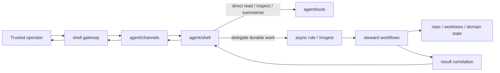

# RAWR Canonical Architecture and Runtime Specification

Status: Canonical

## 1. Scope

This specification defines the canonical architecture and runtime model for RAWR HQ and for later apps built on the same shell.

It fixes:

- the durable ontology;
- the semantic authoring model;
- the service, resource, provider, plugin, app, SDK, runtime, bootgraph, process runtime, adapter, harness, diagnostics, and observation seams;
- the role and surface model;
- the process-local runtime realization model;
- the service-boundary provisioning model;
- the relationship between stable semantic architecture and runtime realization;
- the relationship between the human-facing `agent` role and durable steward execution on `async`;
- the default repository topology and growth model;
- the resource and ownership model;
- the operational mapping on service-centric platforms;
- the canonical public SDK family;
- the enforcement orientation.

This specification is the canonical plug-and-play architecture layer. Subsystem specifications attach to it at explicit integration boundaries. It defines the whole system, the vocabulary the system uses, the architectural laws that keep it coherent, and the integration points where deeper subsystem blueprints attach.

The architecture is organized around three durable separations.

The first is the semantic separation:

```text
support matter
  != runtime capability contracts
  != semantic capability truth
  != runtime projection
  != app-level composition authority
```

The second is the realization separation:

```text
stable architecture
  != runtime realization
```

The third is the authority separation for the human-facing agent subsystem:

```text
human-facing shell authority
  != durable steward execution authority
```

The stable architecture is:

```text
app -> app composition file (manifest) -> role -> surface
```

`manifest` is a broad architecture alias for the app composition file `apps/<app>/rawr.<app>.ts`. The app composition file is authored through `defineApp(...)`. It is not a second runtime artifact, not a bootgraph input authority, and not an authority above `AppDefinition`.

The runtime realization lifecycle is:

```text
definition -> selection -> derivation -> compilation -> provisioning -> mounting -> observation
```

The broader platform composition chain is:

```text
bind -> project -> compose -> realize -> observe
```

On service-centric platforms there is one additional operational mapping:

```text
entrypoint -> platform service -> replica(s)
```

That mapping is operational placement. It is not a core ontology layer.

The point of the shell is simple:

```text
scale changes placement, not semantic meaning
```

The point of the realization chain is equally simple:

```text
make runtime explicit
without introducing a second public architecture
```

The canonical system preserves the public RAWR shell, keeps services as capability truth, keeps resources as provisionable capability contracts, keeps providers as implementations of those contracts, keeps plugins as runtime projection, keeps apps as selection and composition authority, keeps oRPC as the service/callable boundary, keeps Inngest as the durable async harness, keeps Effect as the hidden process-local provisioning substrate, and integrates OpenShell beneath the human-facing `agent` role while durable steward execution remains on `async`.

---

## 2. Architectural posture

RAWR is a bounded software foundry.

A system begins as capability truth inside one or more services. Services declare the resources and sibling service clients they need. Plugins project that truth into runtime surfaces. Apps select plugins, runtime profiles, provider selections, entrypoints, and process shapes into one product/runtime identity. The SDK derives explicit runtime plans. The runtime realizes one selected process shape per `startApp(...)` invocation.

The load-bearing operational chain is:

```text
bind    -> connect capability truth to declared dependencies and provisioned resources
project -> shape that truth for one role/surface/capability lane
compose -> select projections into one app identity
realize -> derive, compile, provision, bind, lower, and mount one process shape
observe -> emit diagnostics, telemetry, catalog records, and finalization records
```

Those are not preferences. They are operations. They happen whether they are named or not. The purpose of this architecture is to make them explicit, stable, and enforceable.

The critical result is scale continuity:

- a capability can begin inside one app;
- earn multiple projections over time;
- promote to its own app when independence is earned;
- move across processes, machines, platform services, repositories, providers, or harnesses without changing species.

The architecture may change placement. It may not corrupt meaning.

### 2.1 Universal shape

The same capability can be realized across multiple output shapes without changing what the capability means.

| Output | Bind | Project | Compose and realize |
| --- | --- | --- | --- |
| Public server API | service + declared resource and service dependencies | `plugins/server/api/<capability>` | app selects plugin, profile, entrypoint, and `server` role; runtime mounts Elysia/oRPC payloads |
| Trusted server internal API | service + optional `WorkflowDispatcher` access | `plugins/server/internal/<capability>` | app selects internal projection; runtime mounts trusted first-party RPC surface |
| Durable workflow | service clients + async provider resource | `plugins/async/workflows/<capability>` | app selects async projection and profile; runtime lowers to `FunctionBundle`; Inngest mounts |
| Durable schedule | service clients + schedule definition | `plugins/async/schedules/<capability>` | app selects schedule projection; runtime lowers and mounts through async harness |
| Durable consumer | service clients + schema-backed event data | `plugins/async/consumers/<capability>` | app selects consumer projection; runtime lowers and mounts through async harness |
| Human-facing shell | service clients, machine resources, policy resources | `plugins/agent/channels/*`, `plugins/agent/shell/*`, `plugins/agent/tools/*` | app selects `agent` projections; runtime mounts through agent/OpenShell harness |
| Governed steward work | service clients, worktree resources, governance resources | async workflow projections and steward activation surfaces | durable execution stays on `async`; shell routes durable work into that plane |
| CLI command | service clients and invocation context | `plugins/cli/commands/<capability>` | app selects CLI projection; runtime lowers to OCLIF command payloads |
| Web app | generated clients, route modules, web runtime facts | `plugins/web/app/<capability>` | app selects web projection; web harness owns native rendering and bundling |
| Desktop product | service clients or host resources | `plugins/desktop/menubar/*`, `plugins/desktop/windows/*`, `plugins/desktop/background/*` | app selects desktop projection; desktop harness owns native desktop interior |

The binding concern is nearly identical across output shapes. What varies is projection, app selection, adapter lowering, and harness mounting.

The service stays the service. The projections multiply. The app selects which projections belong together. The runtime realizes a selected process shape.

### 2.2 Truth, surfaces, and selection

At the bottom, three facts matter.

Truth exists independently of how it is consumed.
Surfaces are projections, not owners.
Composition is selection, not creation.

That means:

- a service boundary remains the owner of business capability truth;
- a resource declares a provisionable runtime capability contract, not business truth;
- a provider implements a runtime capability contract, not app membership;
- a plugin projection does not become a new truth owner;
- an app selects which plugins, profiles, providers, roles, surfaces, entrypoints, and publication artifacts belong to one product/runtime identity;
- runtime placement changes process shape, not semantic species.

This matters most where systems become more autonomous.

An API that violates a service boundary creates bugs. An agent or shell that violates a service boundary creates unpredictable autonomous behavior with compounding consequences. The shell therefore follows the same law as every other surface. It does not bypass service boundaries. It does not become a shadow orchestrator. It does not become a new ontology.

---

## 3. Core ontology

### 3.1 Canonical repository roots

The canonical roots are:

```text
packages/   support matter and platform machinery
resources/  provisionable runtime capability contracts and provider catalog
services/   semantic capability boundaries
plugins/    runtime projections
apps/       app identities, app composition, runtime profiles, and entrypoints
```

These are not merely folder labels. They are the durable nouns the system is built around.

`packages/`, `services/`, `plugins/`, and `apps/` carry the stable architecture. `resources/` is the runtime realization catalog for provisionable capability contracts and provider selection surfaces. Resources do not become service truth; they define what host capability values may be provisioned for services, plugins, providers, harnesses, and runtime plans.

### 3.2 Stable semantic nouns

```text
service               = semantic capability boundary
service family        = optional namespace grouping under services/, not a service or owner
resource              = provisionable runtime capability contract
provider              = implementation of a resource capability contract
runtime profile       = app-owned provider/config/process selection
plugin                = runtime projection package
app                   = top-level product/runtime identity
app composition file  = apps/<app>/rawr.<app>.ts, the app's plugin-membership declaration
manifest              = broad alias for the app composition file
role                  = semantic execution class inside an app
surface               = what a role exposes or runs
entrypoint            = executable file that calls startApp(...) for one process shape
repository            = service-internal persistence mechanic under semantic ownership
```

### 3.3 Runtime realization nouns

```text
Runtime Realization System = subsystem that turns selected app composition into one started process runtime assembly
SDK derivation             = @rawr/sdk normalization and plan derivation from import-safe declarations
runtime compiler           = compiler that turns derived app/profile/entrypoint selection into one compiled process plan
bootgraph                  = RAWR-owned deterministic lifecycle graph above provisioning
Effect provisioning kernel = Effect-backed acquisition, release, config, scope, and managed-runtime substrate
process runtime            = process-local realization layer for access, service binding, projection, adapter coordination, harness handoff, and catalog emission
surface adapter            = runtime component that lowers compiled surface plans to harness-facing payloads
harness                    = native host boundary for Elysia, Inngest, OCLIF, web, agent/OpenShell, desktop, or another host
diagnostics                = runtime findings, redacted catalog records, telemetry, and topology read models
process                   = one running program
machine                   = the computer or node running one or more processes
platform service          = operational platform unit on service-centric platforms
```

The hidden execution substrate beneath bootgraph and process runtime is implemented on Effect. Effect is process-local runtime machinery. It is not a peer public ontology layer.

### 3.4 Runtime access nouns

Live runtime access uses these nouns:

```text
RuntimeAccess
ProcessRuntimeAccess
RoleRuntimeAccess
SurfaceRuntimeAccess
```

`RuntimeAccess` is live operational access to provisioned values and runtime services. It is not diagnostics and not a read model.

`RuntimeCatalog` is a diagnostic read model. It records selected, derived, provisioned, bound, projected, mounted, observed, and stopped runtime state. It does not retrieve live values and does not become a second manifest.

### 3.5 Resource and boundary nouns

```text
RuntimeResource       = provisionable capability contract
ResourceRequirement   = declared need for a resource
ResourceLifetime      = process or role
RuntimeProvider       = cold implementation plan for a resource
ProviderSelection     = app-owned normalized provider choice
RuntimeProfile        = app-owned provider/config/process-selection profile
RuntimeSchema         = SDK-facing runtime-carried schema facade
process resource      = long-lived resource shared within one process
role resource         = long-lived resource owned by one role inside one process
invocation context    = per-request / per-call / per-execution values
call-local value      = temporary value created inside one handler or execution chain
```

### 3.6 Service-boundary lanes

```text
deps       = stable dependencies satisfied by runtime binding
scope      = stable business or client-instance identity
config     = stable service behavior/configuration supplied through runtime config/profile
invocation = required per-call input supplied by caller or harness
provided   = execution resources derived during the service pipeline
```

Service binding is construction-time over `deps`, `scope`, and `config`. `invocation` is per-call. `provided.*` is service middleware output unless a named service-middleware contract explicitly changes that rule.

### 3.7 Agent subsystem nouns

```text
channel surface           = human-facing ingress/egress surface for trusted operator channels
shell surface             = session-level shell runtime that interprets intent, inspects context, and routes work
tool surface              = machine-facing or capability-facing tool surface used by the shell
steward                   = durable async actor that owns governed implementation inside one bounded domain
trusted operator boundary = the trust boundary within which broad shell read authority is acceptable
shell gateway             = trusted-operator ingress and reply-delivery boundary
```

### 3.8 Core definitions

#### `packages`

`packages` hold shared or lower-level support matter and platform machinery.

They may contain:

- shared types;
- SDKs and helpers;
- adapters and utilities;
- lower-level primitives;
- reusable support logic that does not itself define a first-class service boundary;
- public SDK machinery under `packages/core/sdk`;
- runtime internals under `packages/core/runtime`;
- generic persistence support such as SQL helpers, codecs, migration utilities, or repository primitives;
- test support and other support packages when earned.

`packages` support other kinds. They do not own semantic capability truth, resource identity, provider selection, plugin identity, or app-level composition authority.

#### `resources`

`resources` declare provisionable runtime capability contracts and app-facing provider selectors.

A resource owns:

- stable public resource identity;
- consumed value shape;
- allowed lifetimes;
- optional runtime-carried config schema;
- diagnostic-safe snapshot hooks where needed.

A resource does not acquire itself. It does not own business semantics. It does not select providers. It does not own app membership.

Provider implementations for a resource may live under `resources/<capability>/providers/*`. RAWR-owned standard provider stock and internal standard runtime machinery may live under `packages/core/runtime/standard/*`.

#### `providers`

Providers implement resource capability contracts.

A provider owns:

- implementation;
- acquisition;
- release;
- validation;
- native client construction;
- health;
- refresh behavior where declared;
- provider-local config.

A provider is cold until provisioning. A provider does not select itself. Apps select providers through runtime profiles. Services and plugins do not import provider internals.

#### `services`

`services` hold semantic capability truth.

A service is a contract-bearing, transport-neutral capability boundary. It owns:

- stable callable contracts;
- stable context lane structure;
- runtime-carried `scope`, `config`, and `invocation` schemas;
- service-wide metadata and policy vocabulary;
- service-wide assembly seams;
- internal module and procedure decomposition;
- business-capability truth for that boundary;
- authoritative write ownership for its invariants;
- schema ownership, migrations, repositories, and policy seams for the capability it owns;
- service-to-service dependency declarations.

A service is semantic first. It may be called in-process when caller and callee share a process and later over RPC when remote without changing what the service means.

#### `plugins`

`plugins` hold runtime projection.

A plugin projects service truth or host capability into exactly one role/surface/capability lane. It owns:

- topology-implied projection lane;
- matching lane-specific builder facts;
- projection-local caller and boundary policy;
- service-use declarations;
- resource requirements;
- lane-native definitions;
- projection into native surface facts.

A plugin does not own service truth, provider acquisition, app selection, projection reclassification, or process placement.

#### `apps`

An app is the top-level product/runtime identity and code home.

It owns:

- app identity;
- app composition through `defineApp(...)`;
- selected plugin membership;
- runtime profile references;
- provider selections through profiles;
- config source selection through profiles;
- entrypoints;
- process defaults;
- selected publication artifacts;
- selected roles and process shapes at entrypoint time.

Inside an app, the app composition file and entrypoints matter. They are app-internal constructs, not additional top-level ontology kinds.

#### `@rawr/sdk`

The public SDK is published as `@rawr/sdk` from `packages/core/sdk`.

The SDK owns:

- normalized authoring graphs;
- canonical identities;
- resource requirements;
- normalized `ProviderSelection` artifacts;
- service binding plans;
- surface runtime plan descriptors;
- workflow dispatcher descriptors;
- portable runtime plan artifacts.

The SDK derives. It does not acquire resources, execute providers, construct managed runtime handles, mount harnesses, or mutate app composition.

#### Runtime internals

Runtime internals live under `packages/core/runtime/*`.

The runtime owns:

- compiler;
- compiled process plans;
- bootgraph;
- Effect provisioning kernel;
- process runtime;
- runtime access;
- service binding cache;
- adapter lowering;
- diagnostics;
- deterministic finalization.

Runtime internals do not own service truth, app membership, plugin meaning, caller-facing API semantics, durable workflow semantics, deployment placement, or shell governance.

#### `bootgraph`

The bootgraph is RAWR-owned deterministic lifecycle infrastructure above Effect provisioning.

It owns:

- stable lifecycle identity;
- dependency graph ordering;
- dedupe;
- rollback for startup failure;
- reverse finalization order;
- typed process and role lifecycle assembly;
- boot resource keys and modules as runtime internals.

Bootgraph does not own service truth, app membership, public API meaning, durable workflow semantics, native harness behavior, or app composition authority.

#### `process runtime`

The process runtime is the hidden process-local realization layer after provisioning.

It owns:

- runtime access scoping;
- service binding;
- service binding cache;
- workflow dispatcher materialization;
- plugin projection;
- adapter lowering coordination;
- harness handoff;
- catalog emission;
- deterministic finalization coordination.

It does not own service truth, public API meaning, durable workflow semantics, or a second business execution model.

#### `harnesses`

Harnesses own native mounting after runtime realization and adapter lowering.

A harness consumes mounted surface runtimes or adapter-lowered payloads and returns started native host handles. Native framework interiors own native execution semantics after RAWR hands them runtime-realized payloads.

Harnesses do not consume SDK graphs or compiler plans directly. Harnesses do not define the ontology.

#### `diagnostics`

Diagnostics observe.

Diagnostics own:

- redacted runtime catalog records;
- lifecycle findings;
- topology read models;
- telemetry;
- finalization and rollback records.

Diagnostics do not compose app membership, acquire live values, mutate runtime state, choose providers, or become live access.

#### `shell gateway`

The shell gateway is a trusted-operator ingress and delivery boundary above the shell runtime.

It owns:

- channel socket and session integration;
- channel-specific normalization;
- channel-specific delivery;
- access policy at the channel edge;
- trusted sender routing.

It does not own domain correctness, durable orchestration, steward implementation, or broad app composition.

---

## 4. Canonical laws

### 4.1 Ownership law

The strongest practical law is:

```text
Services own truth.
Plugins project.
Apps select.
Resources declare capability contracts.
Providers implement capability contracts.
The SDK derives.
The runtime realizes.
Harnesses mount.
Diagnostics observe.
```

Each layer owns one job.

| Layer | Owns | Does not own |
| --- | --- | --- |
| Services | Semantic truth, callable contracts, schemas, repositories, migrations, domain policy, stable service config, service-to-service dependency declarations | Public API projection, app membership, provider selection, harness mounting, process placement |
| Plugins | Projection into one role/surface/capability lane, topology-implied caller classification, native builder facts, projection-local caller and boundary policy, service-use declarations | Service truth, provider acquisition, app selection, projection reclassification |
| Apps | App membership, selected projections, runtime profiles, provider selections, config source selection, entrypoints, process defaults, selected publication artifacts | Service truth, plugin species, provider implementation, runtime acquisition |
| Resources | Provisionable capability contracts, consumed value shape, lifetime requirement, public resource identity | Provider implementation, semantic truth, app selection |
| Providers | Implementation, acquisition, release, validation, native client construction, health, refresh, provider config | Resource identity, app selection, service truth |
| SDK | Normalized authoring graph, canonical identities, resource requirements, normalized `ProviderSelection`, service binding plans, surface runtime plan descriptors, portable plan artifacts | Resource acquisition, provider execution, managed runtime construction, harness mounting |
| Runtime | Compiler, compiled process plan, bootgraph, Effect provisioning kernel, process runtime, runtime access, service binding cache, adapter lowering, diagnostics, deterministic finalization | Service truth, app membership, plugin meaning, caller-facing API semantics, deployment placement |
| Harnesses | Native mounting into Elysia, Inngest, OCLIF, web, agent/OpenShell, desktop, and other host frameworks | SDK graph consumption, runtime compilation, provider acquisition, service truth |
| Diagnostics | Observation, redacted catalog records, lifecycle findings, topology read models, telemetry | Composition authority, live value acquisition, state mutation, provider selection |

### 4.2 Semantic direction

The canonical semantic direction is fixed:

```text
packages support
resources declare host capability contracts
services own truth
plugins project
apps select
```

The practical dependency posture follows:

- packages may support resources, services, plugins, apps, SDK, and runtime internals;
- resources declare provisionable contracts and provider selectors;
- services may declare resource dependencies and service dependencies;
- plugins depend on service boundaries, resource descriptors, and SDK builder surfaces;
- apps select plugins, profiles, provider selections, and process shapes;
- runtime internals consume SDK-derived and compiler-emitted artifacts.

Services never depend on plugins or apps. Plugins do not become truth owners. Apps do not redefine service truth.

### 4.3 Stable architecture versus runtime realization

The stable architecture is:

```text
app -> app composition file (manifest) -> role -> surface
```

The runtime realization lifecycle is:

```text
definition -> selection -> derivation -> compilation -> provisioning -> mounting -> observation
```

Runtime realization bridges selected semantic composition to running software. It does not create a second public semantic architecture.

### 4.4 Service boundary first

The governing rule is:

```text
service boundary first
projection second
composition third
runtime realization fourth
placement fifth
transport and native host details downstream
```

A service boundary is transport-neutral and placement-neutral.

### 4.5 Bind, project, compose, realize, observe law

The governing operational chain is:

```text
bind(service truth, declared dependencies, provisioned resources) -> live capability
project(live capability, role/surface/capability lane) -> runtime projection
compose(selected projections, profile, entrypoint) -> one app process shape
realize(selected process shape) -> running process runtime assembly
observe(runtime state) -> catalog, diagnostics, telemetry, topology, finalization records
```

These are the mechanical operations by which capability becomes running software.

### 4.6 Projection and assembly law

The assembly law is:

- packages support without becoming capability truth;
- resources declare provisionable capability contracts without implementing or selecting themselves;
- providers implement resource contracts without becoming service truth;
- service cores depend on packages and resource descriptors but never on plugins or apps;
- services declare resource dependencies through `resourceDep(...)`;
- services declare sibling service dependencies through `serviceDep(...)`;
- services declare explicit semantic adapter dependencies through `semanticDep(...)`;
- plugins declare projected service use through `useService(...)`;
- plugins may declare resource requirements, but they do not acquire providers;
- apps select plugins, runtime profiles, provider selections, config sources, entrypoints, process defaults, and publication artifacts;
- the SDK derives normalized plans from selected declarations;
- the runtime compiler emits one compiled process plan for one `startApp(...)` invocation;
- bootgraph orders resource acquisition but does not own app-level composition;
- the process runtime binds services, coordinates adapter lowering, and hands off to harnesses;
- harnesses consume mounted surface runtimes or adapter-lowered payloads and do not define the ontology.

### 4.7 Shared infrastructure is not shared semantic ownership

```text
shared infrastructure != shared semantic ownership
```

Multiple services may share:

- an app;
- a process;
- a machine;
- a platform service;
- a database instance;
- a connection pool;
- telemetry installation;
- cache infrastructure;
- host runtime.

That sharing is infrastructure. It does not transfer schema ownership, write authority, service truth, plugin identity, or app membership.

### 4.8 Namespace is not ownership

Namespace layers may exist below the canonical top-level kinds when they improve navigation, stewardship, and scale continuity.

Namespace layers do not create new authority.

The governing rule is:

```text
namespace != owner
```

An optional `services/<family>/...` layer is allowed when it groups related services. The leaf service remains the actual service boundary and owner.

### 4.9 Harness and substrate choice are downstream

The governing rules are:

```text
harness choice   != semantic meaning
substrate choice != semantic meaning
```

The stack is fixed beneath the shell, but those choices remain downstream of semantics.

Effect owns provisioning mechanics inside the runtime. oRPC owns service/callable procedure mechanics. Elysia owns HTTP host mechanics. Inngest owns durable async execution semantics. OCLIF owns command dispatch semantics. Web hosts own rendering and bundling interiors. Agent/OpenShell hosts own native shell behavior inside their harness boundary. Desktop hosts own native desktop interiors.

RAWR owns boundaries and runtime handoffs.

### 4.10 Import safety and declaration discipline

All declarations are import-safe.

A service, plugin, resource, provider, app, profile, or entrypoint module declares facts, factories, descriptors, selectors, schemas, and contracts. Importing a declaration does not acquire resources, read secrets, connect providers, start processes, register globals, mutate app composition, or mount native hosts.

Import-safe declarations include:

| Module kind | Import-safe content |
| --- | --- |
| Service modules | Boundary schemas, service declarations, service contracts, router factories, module contracts |
| Plugin modules | One plugin factory, lane-specific definitions, oRPC routers/contracts, workflow definitions, command definitions, web/agent/desktop surface definitions |
| Resource modules | `RuntimeResource` descriptors, requirement helpers, value types |
| Provider modules | Cold `RuntimeProvider` descriptors and acquisition plans |
| App modules | App membership declarations and runtime profile selection |
| Entrypoints | `startApp(...)` invocation and selected process shape |

A provider may contain Effect-native acquisition code, but it remains cold until provisioning. A plugin may contain native oRPC, Inngest-shaped, OCLIF, web, OpenShell, or desktop declarations, but those declarations remain cold until the SDK derives, the runtime compiler compiles, the provisioning kernel provisions, the process runtime binds, the surface adapters lower, and the harnesses mount.

### 4.11 Schema ownership

`RuntimeSchema` is the canonical SDK-facing schema facade for runtime-owned and runtime-carried boundary schema declarations.

It appears where the runtime must derive validation, type projection, config decoding, redaction, diagnostics, or harness payload contracts from an authored declaration. That includes:

- resource config;
- provider config;
- runtime profile config;
- service boundary `scope`;
- service boundary `config`;
- service boundary `invocation`;
- runtime diagnostics payloads;
- harness-facing runtime payloads.

`RuntimeSchema` does not transfer service semantic schema ownership to the runtime. Service procedure payloads, plugin API payloads, plugin-native contracts, and workflow payloads remain schema-backed contracts owned by their service or plugin boundary.

The split is:

| Schema-bearing boundary | Schema owner | Schema form |
| --- | --- | --- |
| Runtime resource config | Resource/provider boundary | `RuntimeSchema` |
| Provider config | Provider boundary | `RuntimeSchema` |
| Runtime profile config | App/runtime profile boundary | `RuntimeSchema` |
| Service `scope`, `config`, `invocation` lanes | Service boundary as runtime-carried lanes | `RuntimeSchema` |
| Service callable procedure input/output/errors | Service package | Service-owned schema-backed oRPC-compatible contracts |
| Public server API input/output/errors | Server API plugin | Plugin-owned schema-backed oRPC-compatible contracts |
| Server internal API input/output/errors | Server internal plugin | Plugin-owned schema-backed oRPC-compatible contracts |
| Workflow payloads read from event data | Async plugin or projected service boundary | Schema-backed payload contract |
| Harness-facing runtime payloads | Runtime adapter/harness boundary | `RuntimeSchema` |
| Diagnostics payloads | Runtime diagnostics | `RuntimeSchema` |

Plain string labels may name capabilities, routes, ids, triggers, cron expressions, policies, event names, and diagnostic codes. They must not stand in for data schemas.

### 4.12 Ingress and execution law

The canonical ingress split is:

```text
external product ingress enters through server
external conversational ingress enters through agent
durable system work runs on async
```

That means:

- public and trusted callable request/response ingress belongs on `server` by default;
- human-facing shell and channel ingress belong on `agent`;
- durable background, governed execution, schedules, consumers, and steward work belong on `async`.

### 4.13 Shell versus steward authority law

The governing rule is:

```text
the shell drives what
the stewards drive how
governance decides whether
```

The shell may inspect, summarize, route, ask clarifying questions, and perform allowed lightweight direct actions.

The shell does not directly implement governed repo mutation in governed scopes.

The stewards remain the authoritative implementers for governed domain work.

### 4.14 Extension seam

The current role and plugin structure must be concrete enough to implement and enforce.

Additional second-level contribution classes may be earned only when the host or runtime genuinely composes them differently.

### 4.15 Scale continuity

The following meanings must not change as the system grows:

- what a package is;
- what a resource is;
- what a provider is;
- what a service is;
- what a service family is;
- what a plugin is;
- what an app is;
- what an app composition file is;
- what a role is;
- what a surface is;
- what an entrypoint is;
- what the SDK derives;
- what the runtime realizes;
- what the bootgraph is;
- what the process runtime is;
- what a harness does;
- what diagnostics observe.

The system may change placement. It may not rename the ontology every time placement changes.

---

## 5. Canonical repo topology

The file tree prioritizes stable semantic and realization layers. It does not primarily encode machine placement, process count, deployment layout, or current platform topology.

The canonical topology is:

```text
packages/
  core/
    sdk/                         # publishes @rawr/sdk
    runtime/                     # compiler, bootgraph, substrate, process runtime, harnesses, topology
      compiler/
      bootgraph/
      substrate/
        effect/
      process-runtime/
      harnesses/
        elysia/
        inngest/
        oclif/
        web/
        agent/
        desktop/
      topology/

resources/
  <capability>/                  # authored provisionable capability contracts and provider selectors

services/
  <service>/                     # semantic truth
  <family>/<service>/            # optional family namespace; leaf remains service

plugins/
  server/
    api/
      <capability>/              # public server API projection
    internal/
      <capability>/              # trusted first-party/internal server API projection
  async/
    workflows/
      <capability>/              # durable workflow projection
    schedules/
      <capability>/              # durable scheduled projection
    consumers/
      <capability>/              # durable consumer projection
  cli/
    commands/
      <capability>/              # OCLIF command projection
  web/
    app/
      <capability>/              # web app projection
  agent/
    channels/
      <capability>/              # agent channel projection
    shell/
      <capability>/              # OpenShell projection
    tools/
      <capability>/              # agent tool projection
  desktop/
    menubar/
      <capability>/              # desktop menubar projection
    windows/
      <capability>/              # desktop window projection
    background/
      <capability>/              # desktop background projection

apps/
  <app>/
    rawr.<app>.ts                # app composition
    server.ts                    # entrypoint
    async.ts                     # entrypoint
    web.ts                       # entrypoint
    agent.ts                     # entrypoint
    cli.ts                       # entrypoint
    desktop.ts                   # entrypoint
    dev.ts                       # cohosted development entrypoint
    runtime/
      profiles/
      config.ts
      processes.ts
```

There is no root-level `core/` authoring root. There is no root-level `runtime/` authoring root. Platform machinery lives under `packages/core/*`. Authored provisionable capability contracts live under `resources/*`.

The public SDK is published as `@rawr/sdk` from `packages/core/sdk`.

Canonical public import surfaces include:

| Public surface | Owner |
| --- | --- |
| `@rawr/sdk/app` | App and entrypoint authoring |
| `@rawr/sdk/service` | Service authoring |
| `@rawr/sdk/plugins/server` | Server projection authoring |
| `@rawr/sdk/plugins/async` | Async projection authoring |
| `@rawr/sdk/plugins/cli` | CLI projection authoring |
| `@rawr/sdk/plugins/web` | Web projection authoring |
| `@rawr/sdk/plugins/agent` | Agent projection authoring |
| `@rawr/sdk/plugins/desktop` | Desktop projection authoring |
| `@rawr/sdk/runtime/resources` | Runtime resource declarations |
| `@rawr/sdk/runtime/providers` | Runtime provider declarations |
| `@rawr/sdk/runtime/profiles` | Runtime profile declarations |
| `@rawr/sdk/runtime/schema` | `RuntimeSchema` facade |

Ordinary services, plugins, apps, and entrypoints import public SDK surfaces, service boundary exports, plugin factories, resource descriptors, provider selectors, and app-owned profile helpers.

They do not import Effect layer internals, concrete managed runtime handles, process runtime internals, harness mount code, adapter-lowered payload constructors, raw provider acquisition machinery, or unredacted provider config.

### 5.1 Services may be flat or family-nested

Both of these are valid:

```text
services/
  billing-ledger/
  billing-invoicing/
```

```text
services/
  billing/
    ledger/
    invoicing/
```

The semantics are identical.

The leaf is the service. The parent family, if present, is a namespace only.

### 5.2 Service family rules

A service family directory may contain:

- `README.md`;
- diagrams;
- family-level docs;
- metadata or tooling files.

A service family directory must not own:

- contracts;
- procedures;
- routers;
- migrations;
- repositories;
- canonical business policies;
- canonical writes;
- bootgraph authority;
- runtime authority;
- agent authority.

If the parent directory starts owning those things, it has become a covert service.

### 5.3 Repositories are not a top-level architectural kind

There is no top-level `repositories/` root in the canonical architecture.

Repositories are persistence mechanics under service ownership.

The default shape is service-internal:

```text
services/
  billing/
    ledger/
      src/
        db/
          schema/
          migrations/
          repositories/
        policies/
        modules/

    invoicing/
      src/
        db/
          schema/
          migrations/
          repositories/
        policies/
        modules/
```

Generic persistence support may live in `packages/`, but domain repositories and migrations remain under the owning service.

### 5.4 Resources and providers are runtime realization authoring matter

Resource roots are organized by provisionable capability:

```text
resources/
  email/
    resource.ts
    providers/
      resend.ts
      smtp.ts
      noop.ts
    select.ts
    index.ts
```

The resource owns the capability contract. Providers implement it. Selectors produce app-facing provider selections. Apps select provider implementations through runtime profiles.

RAWR-owned standard runtime providers and internal standard runtime machinery may live under `packages/core/runtime/standard/*`. That standard stock remains runtime machinery. Public authoring still flows through `resources/*` and `@rawr/sdk`.

### 5.5 Plugin roots are role-first and surface-explicit

The plugin tree is grouped by role first and by contribution shape second.

The second-level split exists only when the role composes different contribution shapes differently.

That is why:

- `server` splits into `api` and `internal`;
- `async` splits into `workflows`, `schedules`, and `consumers`;
- `cli` uses `commands`;
- `web` uses `app`;
- `agent` splits into `channels`, `shell`, and `tools`;
- `desktop` splits into `menubar`, `windows`, and `background`.

Those splits are earned because the hosts compose those contribution classes differently.

### 5.6 Hidden infrastructure stays under `packages/core`

The following are infrastructure packages, not new semantic ontology kinds:

- `packages/core/sdk`;
- `packages/core/runtime/compiler`;
- `packages/core/runtime/bootgraph`;
- `packages/core/runtime/substrate/*`;
- `packages/core/runtime/process-runtime`;
- `packages/core/runtime/harnesses/*`;
- `packages/core/runtime/topology`.

The hidden Effect-backed implementation beneath bootgraph and process runtime remains inside runtime support layers. It does not become a peer semantic root.

### 5.7 No file-tree encoding of operational topology

The file tree does not primarily encode:

- how many platform services exist;
- how many processes run today;
- which entrypoints are cohosted;
- which machine or VM runs a process;
- which trusted shell gateway runs on which host;
- which platform replicates which service.

Those are runtime and operational facts. The repo prioritizes semantic architecture and explicit realization seams.

---

## 6. Service model

### 6.1 Service posture

The service layer is the semantic capability plane.

The preferred posture is:

```text
services are transport-neutral semantic capability boundaries
with oRPC as the default local-first callable boundary
```

A service may use oRPC primitives for procedure definition, callable contract shape, local invocation, and remote transport projection when placement changes. oRPC owns procedure and transport mechanics. The service owns meaning.

### 6.2 What services own

Services own:

- contracts;
- procedures;
- service-wide context lanes;
- runtime-carried `scope`, `config`, and `invocation` schemas;
- service-wide metadata and policy vocabulary;
- service-wide assembly seams;
- service-internal module and procedure decomposition;
- business invariants;
- capability truth;
- authoritative write ownership;
- repository seams;
- schema and migration authority for their bounded truth;
- service-to-service dependency declarations.

### 6.3 What services do not own

Services do not own:

- public API route trees;
- trusted internal route trees;
- app membership;
- provider selection;
- process boot;
- HTTP listener details;
- async runtime harness selection;
- platform placement;
- topology or catalog export;
- hidden runtime-resource realization;
- shell session logic;
- channel gateway logic;
- desktop-native behavior.

### 6.4 Canonical service-boundary lanes

A service boundary uses these lanes:

| Lane | Owner | Runtime status |
| --- | --- | --- |
| `deps` | Service declaration, satisfied by runtime binding | Construction-time |
| `scope` | Service declaration, supplied by app/plugin binding policy | Construction-time |
| `config` | Service declaration, supplied by runtime config/profile | Construction-time |
| `invocation` | Service declaration, supplied per call by caller/harness | Per-call |
| `provided` | Service middleware/module composition | Execution-derived |

Service binding is construction-time over `deps`, `scope`, and `config`. `invocation` does not participate in construction-time binding and never participates in `ServiceBindingCacheKey`.

`provided.*` is service middleware output. The runtime and package boundaries do not seed `provided.*` unless a named service-middleware contract explicitly changes the rule.

### 6.5 Service authoring contract

`defineService(...)` declares:

- service identity;
- dependency lanes;
- runtime-carried schemas for `scope`, `config`, and `invocation`;
- metadata defaults;
- service-owned policy vocabulary;
- service-local oRPC authoring helpers.

Resource dependencies use `resourceDep(...)`.

Service dependencies use `serviceDep(...)`.

Explicit semantic adapter dependencies use `semanticDep(...)`.

`resourceDep(...)` declares a dependency on a provisionable host capability. It does not construct providers.

`serviceDep(...)` declares a service-to-service client dependency. It does not import sibling service internals and is not selected through a runtime profile.

`semanticDep(...)` names an explicit semantic adapter dependency. It is not a runtime resource, not a provider selection, and not a sibling repository import.

The service declaration is consumed by SDK derivation. The SDK normalizes resource dependencies, service dependencies, semantic dependencies, runtime-carried schemas, metadata, and boundary identity. The runtime compiler uses normalized dependencies to produce service binding plans and resource requirements. The process runtime uses compiled binding plans to construct live service clients.

### 6.6 Canonical service placement

A service package follows this broad structure:

```text
services/<service>/
  src/
    index.ts
    client.ts
    router.ts
    service/
      base.ts
      contract.ts
      impl.ts
      router.ts
      middleware/
      shared/
      modules/
        <module>/
          schemas.ts
          contract.ts
          module.ts
          middleware.ts
          repository.ts
          router.ts
```

The service package root exports boundary surfaces only. It must not export repositories, migrations, module internals, service-private schemas, service-private middleware, or runtime provider internals.

### 6.7 Service procedure contracts

Service callable contracts are service-owned schema-backed contracts.

A service module owns its schemas, callable contract, middleware, repository, and router for its local capability slice. The root service contract composes module contracts. The root service router composes module routers.

The responsibility split is fixed:

| File | Responsibility | Forbidden responsibility |
| --- | --- | --- |
| `schemas.ts` | Module-owned data schemas and error-data schemas | App/runtime config, provider selection |
| `contract.ts` | Caller-visible procedure contract for the module | Repository implementation, public API route policy |
| `module.ts` | Module-local middleware and context preparation | Root service composition authority |
| `middleware.ts` | Module-specific execution decoration and provided values | Provider acquisition |
| `repository.ts` | Service-internal persistence mechanics under service write authority | Cross-service table writes by accident |
| `router.ts` | Module behavior and procedure implementation | Sibling service internals, app membership |

A realistic service may have more than one module without changing species.

### 6.8 Service-internal ownership law

Service-internal structure follows these rules:

- module-local by default;
- `service/shared` is an earned exception;
- repositories live under the owning module unless sharing has been earned within the service;
- policy engines live under the owning module or service, not in generic support packages unless truly infrastructural;
- procedure handlers are the semantic locus;
- authored capability flow must not disappear into repositories or generic helpers.

Two small services that deeply share entities, policies, and write invariants are often one service with multiple modules, not two services.

### 6.9 Repository, DB, and policy seams

Within a service, the canonical persistence split is:

```text
src/
  db/
    schema/
    migrations/
    repositories/
  policies/
  modules/
```

This split is not cosmetic.

- `schema/` and `migrations/` define persistence ownership;
- `repositories/` encode persistence mechanics for the service’s truth;
- `policies/` encode semantic invariants and decision logic;
- `modules/` decompose the service without changing the service boundary.

### 6.10 Shared DB versus shared ownership

The important questions are not merely whether services share a database instance.

The important questions are:

```text
1. do they share storage infrastructure?
2. do they share schema ownership?
3. do they share write authority over the same tables/entities?
4. do they share semantic truth, or only physical persistence?
```

The default policy is:

- multiple services may share one physical Postgres instance and one host-provided SQL pool resource;
- each service owns its own tables, migrations, repositories, and write invariants;
- direct co-ownership of business tables across service boundaries is not the default.

### 6.11 Cross-service calls preserve service ownership

A service may depend on a sibling service by declaring `serviceDep(...)`.

A service dependency is not a runtime resource. It is not selected through a runtime profile. The SDK derives service dependency edges. The runtime compiler constructs an acyclic service binding DAG. The process runtime binds dependency clients before constructing the depending service binding.

A service does not import sibling repositories, module routers, module schemas, migrations, service-private middleware, or service-private provider helpers.

Shared apps, shared processes, shared database instances, and shared pools do not create shared semantic ownership.

### 6.12 Service truth versus machine capabilities

Services remain the owners of business capability truth.

Some agent, desktop, or CLI projections may expose machine capabilities mediated through runtime resources, harnesses, and explicit policy boundaries. Those machine capabilities are not business capability truth. They are not a reason to bypass service law for governed domain work.

---

## 7. Resource, provider, and runtime profile model

### 7.1 Resource posture

Resources are provisionable runtime capability contracts.

A `RuntimeResource` names a capability value that may be consumed by services, plugins, harnesses, providers, or runtime plans.

Examples include:

- clock;
- logger;
- telemetry;
- config;
- database pool;
- filesystem;
- path;
- command execution;
- workspace root;
- repo root;
- cache;
- queue;
- pubsub hub;
- email provider client;
- SMS provider client;
- browser automation handle;
- OpenShell machine capability root;
- desktop host capability.

A resource is not a service. It does not own business truth. A resource is not a plugin. It does not project capability into a surface. A resource is not an app. It does not select app membership.

### 7.2 What resources own

Resources own:

- stable identity;
- typed consumed value shape;
- default and allowed lifetimes;
- optional runtime-carried config schema;
- diagnostic-safe contributor hooks;
- public resource identity.

Resources do not acquire themselves, implement themselves, select themselves, or own semantic truth.

Process and role are acquisition/scoping semantics on requirements and compiled plans. They are not separate public resource-definition species.

### 7.3 Resource requirements

A `ResourceRequirement` states that a service, plugin, harness, provider, or runtime plan needs a resource.

A requirement may specify:

- resource identity;
- lifetime;
- role;
- optionality;
- instance key;
- reason.

Multiple resource instances require instance keys. Optional resources remain explicitly optional and produce diagnostics when a consumer requires a path that was declared optional.

### 7.4 Provider posture

Providers implement runtime resources.

A `RuntimeProvider` implements acquisition, validation, health, refresh, and release for a `RuntimeResource`.

A provider:

- is cold until provisioning;
- declares the resource it provides;
- declares dependencies on other runtime resources;
- declares config requirements;
- uses `RuntimeSchema` for provider config where needed;
- is Effect-backed inside provider/runtime implementation;
- uses scoped acquisition for resources with release semantics;
- emits tagged runtime errors and runtime telemetry;
- redacts secrets before diagnostics and catalog emission;
- does not read environment variables directly from plugin or service code;
- does not select itself.

Providers may construct native clients. They do not become service truth.

### 7.5 Provider selection

A `ProviderSelection` is the app-owned normalized selection of a provider for a resource at a lifetime, role, and optional instance.

Every required resource has exactly one selected provider at the relevant lifetime and instance unless the requirement is explicitly optional. Provider dependencies close before provisioning. Ambiguous provider coverage requires explicit app-owned selection.

### 7.6 Runtime profile posture

Runtime profiles live under:

```text
apps/<app>/runtime/profiles/*
```

A runtime profile is app-owned selection of provider implementations, config sources, process defaults, harness choices, and environment-shaped wiring.

Runtime profiles select providers through `providers` or `providerSelections`.

A profile field named `resources` is reserved for required capabilities, not provider selection.

A runtime profile:

- is cold;
- selects providers;
- selects config sources;
- may provide app-level static runtime options;
- may define process-shape defaults;
- does not acquire resources;
- does not call provider constructors;
- does not run Effect;
- does not mount harnesses;
- does not redefine service truth or plugin meaning.

### 7.7 Config and secrets

Config and secrets use app runtime profiles for source selection and runtime substrate components for loading, validation, redaction, provider access, diagnostics hygiene, and process-local availability.

The locked behavior is:

| Rule | Owner |
| --- | --- |
| Config loads once per process unless a provider declares refresh behavior | Runtime substrate |
| Config validates through `RuntimeSchema` | Runtime substrate |
| Secrets redact at config boundary | Runtime substrate |
| Supported source kinds include environment, dotenv, file, memory, and test | Runtime config component |
| Provider config flows through app-owned runtime profiles | App profile and runtime compiler |
| Raw environment reads are forbidden in plugin and service handlers | Enforcement and diagnostics |
| Config is not a global untyped bag | Runtime schema and access rules |

### 7.8 Provider dependency graph

Provider dependencies are resource requirements. They close before provisioning.

The runtime compiler validates provider coverage and dependency closure before bootgraph execution. Provider dependency graph output becomes bootgraph ordering input.

Provider coverage diagnostics name missing providers, ambiguous providers, dependency cycles, unclosed dependencies, invalid lifetimes, and missing instance keys.

---

## 8. Plugin model

### 8.1 Plugin posture

Plugins are runtime projection.

A plugin projects service truth or host capability into exactly one role/surface/capability lane.

A plugin is not:

- a service;
- a provider;
- a bootgraph;
- a process runtime;
- an app composition file;
- a process-wide authority object;
- a mini-framework;
- a projection reclassification authority.

### 8.2 Plugin factory law

A plugin package exports one canonical `PluginFactory`.

That factory is import-safe, runs at app composition time, acquires no resources, and returns exactly one `PluginDefinition`.

Grouped plugin helpers may exist for ergonomics. Grouped plugins are not a runtime architecture kind. They are not used for identity, topology, diagnostics, app composition authority, service binding, or harness mounting.

Most authors use lane-specific builders. Generic plugin definition shape is SDK/runtime scaffolding, not normal plugin authoring experience.

### 8.3 Topology and builder classify projection identity

Public server API, trusted server internal, async, CLI, web, agent, desktop, and shell projection status is implied by topology plus matching builder. No generic projection-classification object declares status.

| Topology | Matching builder family | Projection |
| --- | --- | --- |
| `plugins/server/api/<capability>` | `defineServerApiPlugin(...)` | Public server API projection |
| `plugins/server/internal/<capability>` | `defineServerInternalPlugin(...)` | Trusted first-party/internal server API projection |
| `plugins/async/workflows/<capability>` | Workflow projection builder | Durable workflow projection |
| `plugins/async/schedules/<capability>` | Schedule projection builder | Durable scheduled projection |
| `plugins/async/consumers/<capability>` | Consumer projection builder | Durable consumer projection |
| `plugins/cli/commands/<capability>` | CLI command projection builder | OCLIF command projection |
| `plugins/web/app/<capability>` | Web app projection builder | Web surface projection |
| `plugins/agent/channels/<capability>` | Agent channel projection builder | Agent channel projection |
| `plugins/agent/shell/<capability>` | Agent shell projection builder | OpenShell projection |
| `plugins/agent/tools/<capability>` | Agent tool projection builder | Agent tool projection |
| `plugins/desktop/menubar/<capability>` | Desktop menubar projection builder | Desktop menubar projection |
| `plugins/desktop/windows/<capability>` | Desktop window projection builder | Desktop window projection |
| `plugins/desktop/background/<capability>` | Desktop background projection builder | Desktop background projection |

Path and builder mismatch is a structural error.

Route, command, function, shell, and native mount facts are builder-specific surface facts. They do not encode public/internal projection status. App selection and harness publication policy may select, mount, publish, or generate artifacts for already-classified projections. They do not reclassify a plugin projection.

A capability that needs both public and trusted internal callable surfaces authors two projection packages.

### 8.4 Plugin service use

Plugin authoring uses `useService(...)` to declare projected service clients.

The SDK turns `useService(...)` into service binding requirements. The runtime constructs the right service client and passes it to the plugin projection function.

The plugin owns projection. The service owns truth. The native framework owns native mechanics.

### 8.5 Plugin resource requirements

A plugin may declare resource requirements when its projection needs host capability values.

The plugin declares what it needs. It does not acquire providers. The app profile selects providers. The runtime compiler validates coverage. Bootgraph and the provisioning kernel acquire resources. The process runtime passes role- or process-scoped access to projection and adapter code under sanctioned access rules.

### 8.6 Public server API projection

`plugins/server/api/<capability>` owns public server API projection.

It may own:

- public input/output/error schemas;
- route base;
- redaction or transformation;
- authentication and authorization policy at the API boundary;
- rate limits and caller-facing policy;
- selected publication artifacts.

It does not own the domain invariant that determines whether the operation is valid. That remains in the service.

### 8.7 Trusted server internal projection

`plugins/server/internal/<capability>` owns trusted first-party/internal callable projection.

It is eligible for trusted RPC mounting and internal-client generation. It is not a public server API projection.

Server internal projections may wrap `WorkflowDispatcher` for trigger, status, cancel, or dispatcher-facing caller surfaces. The internal API owns the trusted caller-facing boundary. The workflow plugin owns durable execution definitions. The dispatcher is a derived runtime/SDK integration artifact and live materialization boundary.

### 8.8 Async projection

Async workflow, schedule, and consumer plugins own durable async definitions.

- Workflow plugins define durable workflow projections.
- Schedule plugins define durable scheduled projections.
- Consumer plugins define durable consumer projections.

Workflow, schedule, and consumer metadata is authored once in RAWR async projection definitions and lowered through the runtime chain.

Event names identify triggers. Cron strings identify schedules. Function ids identify native execution units. Any read event data must have a schema-backed payload contract.

Workflow plugins do not expose caller-facing product APIs. Trigger/status/cancel style surfaces belong in server API or server internal projections, unless a trusted shell handoff emits durable work directly into the async plane under shell policy.

### 8.9 CLI projection

CLI command plugins live under `plugins/cli/commands/<capability>` and lower to OCLIF commands.

OCLIF owns command dispatch semantics. The plugin owns projection. CLI commands use schema-backed argument contracts and call service clients or sanctioned host resources through their projected boundary.

### 8.10 Web projection

Web app plugins live under `plugins/web/app/<capability>` and project service-facing or generated API clients into web surfaces.

Web hosts own rendering, bundling, routing, and browser-native behavior inside their boundary. The web plugin does not own server API publication and does not own service truth.

### 8.11 Agent/OpenShell projection

Agent plugins live under:

```text
plugins/agent/channels/*
plugins/agent/shell/*
plugins/agent/tools/*
```

Agent tools call service boundaries, internal APIs, or runtime-authorized machine resources. They do not bypass service contracts for domain mutation and do not receive broad runtime access.

Agent/OpenShell governance remains a reserved boundary with locked integration hooks. Agent plugins do not acquire providers, do not expose unredacted runtime internals, and do not become a second business execution plane.

### 8.12 Desktop projection

Desktop plugins live under:

```text
plugins/desktop/menubar/*
plugins/desktop/windows/*
plugins/desktop/background/*
```

Desktop background loops are process-local. Durable business workflows remain on `async`.

Desktop plugins may consume service clients or runtime-authorized desktop host resources. They do not own business truth, durable orchestration semantics, or raw desktop host authority outside sanctioned harness boundaries.

### 8.13 Plugin authoring invariants

- Plugins project service truth or host capability; they do not replace service truth.
- A plugin belongs to exactly one role/surface/capability lane.
- Topology plus builder classifies projection identity.
- Plugin code may declare service use and resource requirements.
- Provider acquisition stays out of plugin code.
- Actual business truth stays in `services/*`.
- Plugin trees are grouped by role first and contribution shape second.
- Domain logic stays out of plugin roots; plugin roots stay adapters and registrations only.
- Agent plugins do not bypass service or steward law for governed domain work.
- Desktop plugins do not turn process-local loops into durable business workflows.

---

## 9. App model

### 9.1 App posture

An app is the top-level product/runtime identity.

The default HQ app is:

```text
apps/hq/
```

An app owns selection. It does not own service truth, plugin species, provider implementation, runtime acquisition, or native framework internals.

### 9.2 AppDefinition

`defineApp(...)` declares app identity and selected plugin membership.

It may reference runtime profile definitions, process defaults, and selected publication artifacts through app-owned runtime modules. It does not acquire resources or start a process.

The app composition file is:

```text
apps/<app>/rawr.<app>.ts
```

The broad architecture may call this file the manifest. The canonical app authoring operation is `defineApp(...)`, and the resulting app identity is an `AppDefinition`.

The app owns membership. The SDK derives role/surface indexes from selected plugin definitions.

### 9.3 App composition law

The app composition file declares:

- app identity;
- selected plugin membership;
- selected role/surface/capability projections through plugin selection;
- app-owned publication artifacts where applicable;
- references to app runtime modules where applicable.

It does not declare:

- service truth;
- provider implementation;
- provider acquisition;
- bootgraph ordering algorithms;
- rollback behavior;
- harness listener internals;
- deployment placement;
- manual materialized runtime plan arrays;
- raw Effect runtime construction.

### 9.4 Runtime profiles and process defaults

Runtime profiles live under:

```text
apps/<app>/runtime/profiles/*
```

They select providers and config sources for the app. The profile field that holds provider choices is `providers` or `providerSelections`, never `resources`.

Resources, providers, and profiles are separate layers.

```text
resource = capability contract
provider = implementation of that contract
profile  = app-owned selection of provider implementation, config source, and process defaults
```

The SDK derives normalized `ProviderSelection` artifacts from profiles. The runtime compiler validates provider coverage and provider dependency closure. Bootgraph receives provider ordering input. The provisioning kernel loads config, redacts secrets, and acquires selected providers.

### 9.5 Entrypoints

`startApp(...)` is the canonical app start operation.

An entrypoint is the concrete executable file that calls `startApp(...)` for one selected process shape.

It receives:

- selected app definition;
- runtime profile;
- process roles;
- optional process and harness selection facts.

It starts one process.

An entrypoint answers:

```text
Which selected role slices from this app start in this process?
```

An entrypoint does not:

- redefine service truth;
- redefine app membership;
- invent a second app composition file;
- hide role selection behind harness magic;
- manually bind plugins;
- manually flatten derived module arrays;
- manually merge surface families;
- manually instantiate raw Effect runtimes.

Each `startApp(...)` invocation produces exactly one started process runtime assembly.

A cohosted development process and a split production process use the same semantic app and plugin definitions. Cohosting changes placement and resource sharing. It does not change species.

### 9.6 App selection and process shape remain distinct

The app owns what belongs. Runtime profiles own provider/config selection. Entrypoints own which selected role slices start in one process.

These facts must not collapse into one another.

```text
app membership
  != runtime profile
  != provider implementation
  != process shape
  != platform placement
```

### 9.7 Why `surface` stays explicit

`surface` is a stable semantic layer:

```text
app -> app composition file -> role -> surface
```

If the app composition file stops expressing selected surface membership through plugin selection, it loses real semantic information.

The app must be able to select, explicitly, whether it includes:

- public server API projections;
- trusted server internal projections;
- durable workflows;
- durable schedules;
- durable consumers;
- web app mounts;
- CLI commands;
- agent channels;
- agent shell projections;
- agent tools;
- desktop menubar projections;
- desktop window projections;
- desktop background projections.

That is composition meaning.

---

## 10. Runtime realization

### 10.1 Runtime realization stance

The canonical runtime stance is:

```text
RAWR owns semantic meaning.
Effect owns provisioning mechanics.
Boundary frameworks keep their jobs.
```

The Runtime Realization System turns selected app composition into one started, typed, observable, stoppable process per `startApp(...)` invocation.

Runtime realization exists below semantic composition and above native host frameworks. It shows how import-safe authored declarations become derived artifacts, compiled artifacts, provisioned runtime values, bound services, adapter-lowered payloads, mounted harnesses, catalog records, telemetry, and finalization records.

Runtime realization owns:

- SDK plan consumption;
- runtime compilation;
- provider coverage validation;
- provider dependency graph validation;
- bootgraph ordering;
- Effect-backed provisioning;
- process runtime assembly;
- service binding;
- service binding cache;
- workflow dispatcher materialization;
- plugin projection;
- adapter lowering;
- harness handoff;
- diagnostics;
- telemetry;
- deterministic finalization.

Runtime realization does not own:

- service domain truth;
- plugin semantic meaning;
- app product identity;
- deployment placement;
- public API meaning;
- durable workflow semantics;
- CLI command semantics;
- shell governance;
- desktop-native behavior;
- web framework semantics.

### 10.2 Runtime realization lifecycle

The canonical lifecycle is:

```text
definition -> selection -> derivation -> compilation -> provisioning -> mounting -> observation
```

| Phase | Meaning | Primary owner |
| --- | --- | --- |
| Definition | Import-safe declarations for services, plugins, resources, providers, apps, profiles | Authors through `@rawr/sdk` |
| Selection | App membership, profile, provider choices, process roles, selected harnesses | App and entrypoint |
| Derivation | Normalized graph, service binding plans, surface runtime plans, workflow dispatcher descriptors, portable artifacts | SDK |
| Compilation | Compiled process plan, provider dependency graph, compiled service/surface/harness plans | Runtime compiler |
| Provisioning | Resource acquisition, config validation, one root managed runtime, process and role runtime access | Bootgraph and Effect provisioning kernel |
| Mounting | Service binding, adapter lowering, mounted surface records, harness start | Process runtime, adapters, harnesses |
| Observation | Runtime catalog, diagnostics, telemetry, topology records, rollback/finalization records | Runtime and diagnostics |

Shutdown, rollback, provider release, harness stop order, finalizers, managed runtime disposal, and final catalog records are deterministic runtime finalization and observation behavior. They are not an eighth top-level lifecycle phase.

### 10.3 Runtime assembly sequence

The architecture-level sequence is:

```text
import-safe declarations
  -> @rawr/sdk derivation
  -> runtime compiler
  -> bootgraph
  -> Effect provisioning kernel
  -> process runtime
  -> surface adapters
  -> native harnesses
  -> runtime catalog and telemetry
```

In more explicit terms:

```text
services, plugins, resources, providers, app, profile
  -> SDK normalizes graph and derives identities
  -> SDK emits service binding plans, surface runtime plans, dispatcher descriptors, portable artifacts
  -> runtime compiler validates topology, provider coverage, service closure
  -> runtime compiler emits one compiled process plan
  -> bootgraph orders resource acquisition and finalizers
  -> Effect provisioning kernel validates config and acquires selected providers/resources
  -> provisioning produces ProcessRuntimeAccess and RoleRuntimeAccess
  -> process runtime binds services and caches construction-time bindings
  -> process runtime materializes WorkflowDispatcher where selected
  -> process runtime projects plugins into mounted surface runtime records
  -> surface adapters lower compiled surface plans to harness-facing payloads
  -> harnesses mount native hosts
  -> diagnostics observe selected, derived, provisioned, bound, projected, mounted, stopped runtime state
```

### 10.4 SDK derivation

The SDK derives explicit artifacts from compact authoring declarations. The runtime compiler consumes SDK-derived artifacts, not arbitrary shorthand.

The SDK derives:

- `NormalizedAuthoringGraph`;
- canonical identities;
- resource requirements;
- normalized `ProviderSelection` artifacts;
- `ServiceBindingPlan`;
- `SurfaceRuntimePlan`;
- `WorkflowDispatcherDescriptor`;
- `PortableRuntimePlanArtifact`;
- diagnostics.

The SDK does not acquire resources, construct native harness payloads, start processes, or mutate app membership.

### 10.5 Runtime compiler

The runtime compiler turns a normalized authoring graph plus entrypoint selection into one `CompiledProcessPlan`.

Compiler inputs include:

- normalized authoring graph;
- selected `AppDefinition`;
- entrypoint selection from `startApp(...)`;
- selected `RuntimeProfile`;
- runtime environment descriptor;
- harness selection/defaults.

The compiler emits:

- one compiled process plan;
- provider dependency graph;
- compiled resource plans;
- compiled service binding plans;
- compiled surface plans;
- compiled workflow dispatcher plans;
- harness plans;
- bootgraph input;
- topology seed;
- diagnostics.

The runtime compiler does not acquire resources, bind live services, construct native functions, mount harnesses, or write final runtime catalog status. It emits a plan and diagnostics.

Provider coverage validation is locked:

| Rule | Diagnostic class |
| --- | --- |
| Every required resource has a selected provider at the relevant lifetime and instance | Missing provider coverage |
| Provider dependencies close before provisioning | Unclosed dependency |
| Provider dependency cycle is detected before bootgraph execution | Dependency cycle |
| Ambiguous provider coverage requires app-owned selection | Ambiguous coverage |
| Optional resources remain explicitly optional | Optional required by consumer |
| Multiple instances require instance keys | Missing instance key |
| Invalid lifetime or role scope request is rejected | Invalid lifetime |

### 10.6 Bootgraph and provisioning

Bootgraph is the RAWR lifecycle graph above Effect layer composition. It owns stable lifecycle identity, deterministic ordering, dedupe, rollback, reverse finalization order, and typed context assembly for process and role lifetimes.

The Effect provisioning kernel is the runtime-owned substrate beneath bootgraph.

Effect is public to runtime-resource authors, provider authors, substrate authors, process-runtime authors, and harness-integration authors. It is private to ordinary service, plugin, app, and entrypoint authoring.

The kernel owns:

| Responsibility | Locked behavior |
| --- | --- |
| Managed runtime | One root managed runtime per started process |
| Scope management | Process scope and role child scopes |
| Resource acquisition | Effect-backed acquisition/release from compiled provider plans |
| Config | Load once per process unless provider declares refresh; validate through `RuntimeSchema`; redact secrets |
| Errors | Structured runtime errors for config, provider selection, acquisition, release, service binding, projection, mount, startup, finalization |
| Coordination | Process-local queues, pubsub, refs, schedules, caches, fibers, semaphores as runtime mechanics |
| Observability | Runtime annotations, spans, lifecycle telemetry, provider acquisition telemetry |
| Finalizers | Reverse-order deterministic disposal |

Effect local fibers, queues, schedules, pubsub, refs, and caches are process-local runtime mechanics. They do not become durable workflow ownership.

### 10.7 Deterministic finalization

Normal finalization runs in this order:

```text
1. stop mounted harnesses in reverse mount order
2. stop process runtime surface assemblies
3. run role-scope finalizers in reverse dependency order
4. run process-scope finalizers in reverse dependency order
5. dispose root managed runtime handle
6. emit finalization records into RuntimeCatalog
```

Startup rollback uses the same ordering for already-started components in the failed startup subset and emits rollback/finalization diagnostics.

Finalization is deterministic runtime behavior. It is recorded during observation.

### 10.8 Runtime-owned lifetimes

The runtime owns four distinct lifetimes.

```text
process
role
invocation
call-local
```

A process resource is acquired once per started process and is shared by all mounted roles in that process.

A role resource is acquired once per mounted role inside a process.

Invocation context is per request, per call, or per execution and is supplied at the harness edge.

Call-local values exist only inside one handler, one effect chain, or one step of execution.

The canonical rule is:

```text
process resources may flow down
role resources may flow down
invocation values may not flow up
call-local values may not escape their execution chain
```

`provided.*` remains execution-time service middleware output. It is not a process resource bag, not a role resource bag, and not a package-boundary construction bag.

### 10.9 Runtime access

Provisioning produces process and role access handles. The process runtime consumes and scopes those handles for binding, projection, adapter handoff, harness mounting, diagnostics, telemetry, and catalog emission.

`RuntimeAccess`, `ProcessRuntimeAccess`, `RoleRuntimeAccess`, and `SurfaceRuntimeAccess` expose sanctioned operational access to provisioned resources and runtime telemetry.

Runtime access may expose sanctioned redacted topology and diagnostic emission hooks. Those hooks cannot mutate app composition, acquire resources, retrieve live values for diagnostics, or expose raw Effect/provider/config internals.

Runtime access never exposes raw Effect `Layer`, `Context.Tag`, `Scope`, managed runtime internals, provider internals, or unredacted config secrets.

Service handlers do not receive broad runtime access. They receive declared `deps`, `scope`, `config`, per-call `invocation`, and execution-derived `provided`.

### 10.10 Service binding and cache

Service binding is construction-time over `deps`, `scope`, and `config`.

`invocation` is supplied per call and does not participate in `ServiceBindingCacheKey`.

The process runtime uses compiled service binding plans to construct live service clients from:

- provisioned resource values;
- sibling service clients;
- semantic adapters;
- scope values;
- config values.

`ServiceBindingCache` reuses live service bindings across matching construction-time inputs. Call-local memoization is separate from `ServiceBindingCache`.

Trusted same-process callers use package-local service clients or runtime-bound service clients. First-party remote callers use selected server internal projections. External callers use selected server API projections. Local HTTP self-calls are not the canonical path for same-process trusted callers.

### 10.11 WorkflowDispatcher and async integration

`WorkflowDispatcher` is a live runtime/SDK integration artifact materialized by the process runtime from selected workflow definitions plus the provisioned process async client.

The SDK and runtime derive dispatcher descriptors and compiled dispatcher plans. The live dispatcher materializes only after provisioning. Server API and server internal projections may wrap dispatcher capabilities for trigger, status, cancel, or dispatcher-facing caller surfaces. Workflow plugins do not expose caller-facing product APIs.

The async lowering chain is:

```text
WorkflowDefinition / ScheduleDefinition / ConsumerDefinition
  -> SDK normalized async surface plan
  -> runtime compiled async surface plan
  -> async SurfaceAdapter
  -> FunctionBundle
  -> Inngest harness
```

`FunctionBundle` is the async harness-facing derived/lowered artifact consumed by the Inngest harness. It is not public authoring, not service API, not product invocation contract, and not a parallel metadata source.

### 10.12 Surface adapter lowering

Surface adapters lower compiled surface plans into native harness-facing payloads.

They do not lower SDK-derived surface runtime plan descriptors, raw authoring declarations, or SDK graphs directly.

Surface adapters are the only runtime layer that translates compiled surface plans into harness-facing native payloads. Harnesses consume mounted surface runtimes or adapter-lowered payloads. Harnesses never consume raw authoring declarations, SDK graphs, or compiler plans directly.

Adapter identity does not classify public/internal projection status. Topology plus builder does that before adapter lowering.

### 10.13 Diagnostics, telemetry, and catalog

Runtime diagnostics are structured runtime findings, violations, statuses, or lifecycle events.

Diagnostics name the violated boundary or failed lifecycle phase. They explain; they do not compose.

Runtime telemetry carries correlation through:

```text
entrypoint
  -> SDK derivation diagnostics
  -> runtime compiler diagnostics
  -> bootgraph lifecycle spans/events
  -> Effect runtime annotations
  -> provider acquisition spans/events
  -> service binding spans/events
  -> plugin projection spans/events
  -> adapter lowering spans/events
  -> harness ingress/egress spans/events
  -> service oRPC middleware spans/events
  -> async workflow spans/events
  -> finalization spans/events
```

Runtime telemetry provides process and provisioning context. Service semantic observability remains service-owned and oRPC-native inside the service boundary.

`RuntimeCatalog` is a diagnostic read model. It does not retrieve live values and does not become a second manifest. It records at least:

- process identity;
- app identity;
- entrypoint identity;
- selected roles;
- derived authoring facts;
- resources;
- providers;
- provider dependency graph;
- plugins;
- service attachments;
- workflow dispatchers;
- surfaces;
- harnesses;
- lifecycle timestamps and status;
- diagnostics;
- topology records;
- startup records;
- finalization records.

### 10.14 Caching taxonomy

Caching is separated by owner.

| Cache kind | Owner | Scope |
| --- | --- | --- |
| `ServiceBindingCache` | Process runtime | Live service binding reuse across matching construction-time inputs |
| Runtime-local cache primitives | Runtime substrate | Process-local runtime mechanics |
| Cache resource | Resource/provider model | App-selected cache capability |
| Semantic service read-model cache | Service | Domain-owned data/cache truth |
| Call-local memoization | Handler/call-local layer | One invocation or call chain |

Call-local memoization is not `ServiceBindingCache`.

### 10.15 Control-plane touchpoints

Runtime realization defines local process semantics and emits or consumes topology, health, profile, process identity, provider coverage, startup, and finalization records at control-plane boundaries.

Deployment and control-plane architecture own multi-process placement policy. Runtime realization emits the records that allow placement systems to reason. It does not decide placement.

---

## 11. Runtime roles and surfaces

### 11.1 Canonical runtime roles

The canonical runtime roles are:

```text
server
async
web
cli
agent
desktop
```

These are peer runtime roles.

These are role names, not plugin subtype names. Labels such as `api`, `internal`, `workflow`, `schedule`, `consumer`, `command`, `app`, `channel`, `shell`, `tool`, `menubar`, `window`, or `background` describe surfaces or contribution shapes within a role.

### 11.2 `server`

`server` is the caller-facing synchronous boundary role.

It owns request/response ingress surfaces:

- public synchronous APIs;
- trusted internal synchronous APIs when earned;
- transport and auth concerns at the server boundary;
- trigger surfaces that must answer callers synchronously;
- health and readiness endpoints where needed.

Typical server surfaces include:

- public oRPC APIs;
- trusted internal oRPC APIs;
- workflow trigger/status/cancel surfaces that acknowledge quickly and hand off execution.

### 11.3 `async`

`async` is the durable and non-request execution role.

It covers:

- workflows;
- schedules;
- consumers;
- background jobs;
- durable steward activation;
- event-driven internal feedback loops.

For business-level async work that benefits from retries, durability, scheduling, and execution timelines, Inngest is the default durability harness.

The async role owns durable execution. It does not make individual workflow plugins caller-facing product APIs.

### 11.4 `web`

`web` is the browser-facing runtime role.

It owns:

- the web entrypoint;
- the web build and runtime pipeline;
- client-side lifecycle;
- web-facing surface projection over shared semantic truth.

`web` is not a folder under `server`. It is its own role.

### 11.5 `cli`

`cli` is the command execution role.

It hosts:

- operator-facing commands;
- local command execution;
- terminal presentation;
- argument parsing and command dispatch.

`cli` is a runtime role even when it is not a long-running deployed service.

### 11.6 `agent`

`agent` is the human-facing shell runtime role.

It is not the durable steward execution role.

It owns:

- trusted conversational ingress;
- shell session continuity;
- read-side inspection;
- lightweight direct action under policy;
- routing between direct answer and durable delegation;
- operator-facing result delivery.

The canonical `agent` surfaces are:

```text
channels
shell
tools
```

`channels` own ingress and egress for trusted human-facing channels.

`shell` owns intent interpretation, context gathering, routing between direct answer and steward delegation, and mapping results back to the conversation.

`tools` own machine-facing or capability-facing tools used by the shell under explicit shell policy.

### 11.7 `desktop`

`desktop` is the installable user-local runtime role.

It owns:

- installable desktop product identity;
- user-session lifecycle;
- local UI shell surfaces;
- local app window lifecycle;
- menu bar / tray lifecycle;
- user-local settings and caches;
- user-visible desktop notifications;
- safe local machine-adjacent behavior where earned;
- process-local loops and subscriptions that are not durable domain workflows.

The canonical `desktop` surfaces are:

```text
menubar
windows
background
```

`menubar` contributes persistent menu bar or tray presence and native menu model.

`windows` contributes visible window surfaces and typed renderer bridges.

`background` contributes resident local behavior without a required visible shell.

Desktop background loops are process-local. Durable business workflows remain on `async`.

### 11.8 Shell versus stewards

The shell is the human-facing client runtime.

The stewards are durable domain runtime authorities.

The shell owns:

- intake;
- continuity;
- roaming inspection;
- direct lightweight read-side answers;
- deciding whether to answer directly or delegate.

The stewards own:

- correctness inside governed domains;
- domain boundary law;
- blast-radius assessment;
- governed repo mutation;
- durable work execution;
- act / propose / escalate decisions.

### 11.9 One orchestrator, two ingress classes

The existence of two activation paths does not mean two orchestrators.

The shell is an ingress and client runtime. The async plane is the durable execution authority.

The shell may trigger stewards, but it does so by emitting durable work into the same orchestration plane used by product triggers, observations, schedules, consumers, and internal feedback loops.

### 11.10 Trusted operator boundary rule

A broad-read shell is a trusted operator surface.

The canonical rule is:

```text
one trusted operator boundary per shell gateway
```

If multiple mutually untrusted users need shell access, they must be split into separate trust boundaries with separate gateways and appropriately reduced capability policy.

---

## 12. Agent shell and steward activation

### 12.1 OpenShell posture

OpenShell is the default runtime substrate and policy envelope beneath the shell-facing part of the `agent` role.

It provides the shell with:

- a local execution environment;
- a machine-facing capability layer;
- a shell policy boundary;
- a substrate for channel, shell, and tool runtime composition.

It does not replace:

- app composition;
- `@rawr/sdk`;
- runtime compiler;
- bootgraph;
- Effect-backed provisioning;
- process runtime;
- `async`;
- Inngest;
- domain stewards;
- repo governance;
- service ownership.

OpenShell lives behind RAWR-owned runtime harness, resource, and policy boundaries. Agent/OpenShell integration belongs at `packages/core/runtime/harnesses/agent`, `plugins/agent/*`, resource capability contracts, and reserved governance hooks.

### 12.2 Canonical runtime binding

| Concern | Canonical binding |
| --- | --- |
| process boot and lifecycle | Runtime compiler, bootgraph, Effect provisioning kernel, process runtime |
| human-facing shell substrate | OpenShell-backed agent harness and resources |
| messaging ingress and reply delivery | shell gateway through `agent/channels/*` |
| shell decisioning | `agent/shell/*` projection |
| machine read and selected special actions | `agent/tools/*` through runtime-authorized resources and shell policy |
| durable steward orchestration | Inngest on `async` |
| governed repo execution | steward-scoped tools and worktrees on `async` |
| public product triggers | `server` role surfaces |

### 12.3 Shell activation flow

When a message arrives from a trusted operator:

1. the channel surface normalizes the message and identifies the session;
2. the shell loads relevant conversation and system context;
3. the shell classifies the request;
4. the shell either answers directly or emits a durable steward activation request;
5. the shell tracks correlation between the human conversation and the durable work;
6. durable execution reports results back to the shell for delivery.

### 12.4 Internal and product-triggered activation

When an internal signal arrives, it enters the async event plane, triggers steward workflows, loads scoped orientation data, and activates stewards through the async role.

When a product request needs durable work, the request enters through `server`, the server validates and acknowledges as needed, and the server emits durable work into the async plane.

The shell may also emit durable work directly into the async plane without a fake server hop. That path is a trusted operator handoff, not a public product API.

### 12.5 Direct work versus delegated work

The shell may directly handle:

- summarization;
- machine inspection;
- local context gathering;
- repo inspection without governed mutation;
- business clarification;
- cross-domain nudging;
- asking for approval or narrowing scope;
- selected special actions under explicit policy.

The shell must delegate:

- governed repo edits;
- changes to service contracts;
- migrations;
- worktree-local implementation;
- domain refactors;
- changes that cross ownership boundaries;
- changes that affect gates, tensions, RFD state, or durable governance state;
- anything requiring act / propose / escalate decisioning.

### 12.6 Default shell posture

The shell’s default capability posture is:

```text
broad read
narrow write
no direct governed repo mutation
selected special actions only by policy
```

### 12.7 Shell and steward flow



### 12.8 The shell is not the devplane

The shell is an operator-facing runtime surface. It is not the generic control plane or devplane.

The shell may inspect and route. The shell may ask for work. The shell may expose trusted operator capabilities.

Durable orchestration, governance, and system-wide control remain outside the shell.

### 12.9 The shell is not a public concierge

A broad-access shell must remain private to a trusted operator boundary.

If lower-trust audiences are introduced, they use separate shell or gateway profiles with sharply reduced capabilities and isolated workspaces or hosts.

---

## 13. Stack binding

The runtime stack is downstream of the semantic shell.

The canonical stack binding is:

- `@rawr/sdk` from `packages/core/sdk` for public authoring and derivation;
- `packages/core/runtime/compiler` for runtime compilation;
- `packages/core/runtime/bootgraph` for deterministic lifecycle ordering;
- `packages/core/runtime/substrate/effect` for the hidden Effect-backed provisioning kernel;
- `packages/core/runtime/process-runtime` for runtime access, service binding, projection, adapter coordination, harness handoff, and finalization coordination;
- `packages/core/runtime/harnesses/elysia` for Elysia server mounting;
- `packages/core/runtime/harnesses/inngest` for Inngest async mounting;
- `packages/core/runtime/harnesses/oclif` for OCLIF command mounting;
- `packages/core/runtime/harnesses/web` for web host handoff;
- `packages/core/runtime/harnesses/agent` for agent/OpenShell mounting;
- `packages/core/runtime/harnesses/desktop` for desktop mounting;
- `packages/core/runtime/topology` for runtime catalog, diagnostics, topology, and telemetry shapes.

None of those technologies becomes a peer ontology kind beside packages, resources, services, plugins, or apps.

The canonical boundary rule is:

```text
Effect stays underneath public boundaries.
oRPC, Elysia, Inngest, OCLIF, web hosts, OpenShell, and desktop hosts keep their jobs.
RAWR owns the handoff.
```

### 13.1 Server harness posture

The server process stack is:

```text
services/*
  -> plugins/server/api/* and plugins/server/internal/*
  -> apps/<app>/rawr.<app>.ts
  -> startApp(... roles: ["server"] ...)
  -> @rawr/sdk derivation
  -> runtime compiler
  -> bootgraph / Effect provisioning kernel
  -> process runtime
  -> surface adapters
  -> Elysia harness
  -> oRPC handlers and HTTP host
```

oRPC remains the callable boundary within server surfaces. Elysia owns HTTP host lifecycle and request routing. Neither owns service truth.

### 13.2 Async harness posture

The async process stack is:

```text
services/*
  -> plugins/async/workflows/*, schedules/*, consumers/*
  -> apps/<app>/rawr.<app>.ts
  -> startApp(... roles: ["async"] ...)
  -> @rawr/sdk derivation
  -> runtime compiler
  -> bootgraph / Effect provisioning kernel
  -> process runtime
  -> async surface adapter
  -> FunctionBundle
  -> Inngest harness
```

Inngest owns durable async execution semantics. It does not own workflow meaning, service truth, app membership, provider selection, or runtime provisioning.

The steward plane lives on this role.

### 13.3 CLI harness posture

The CLI process stack is:

```text
services/*
  -> plugins/cli/commands/*
  -> apps/<app>/rawr.<app>.ts
  -> startApp(... roles: ["cli"] ...)
  -> @rawr/sdk derivation
  -> runtime compiler
  -> bootgraph / Effect provisioning kernel
  -> process runtime
  -> CLI surface adapter
  -> OCLIF harness
```

OCLIF owns native command dispatch semantics. The plugin owns projection. Services own truth.

### 13.4 Web harness posture

The web process stack is:

```text
services/* and generated clients
  -> plugins/web/app/*
  -> apps/<app>/rawr.<app>.ts
  -> startApp(... roles: ["web"] ...)
  -> @rawr/sdk derivation
  -> runtime compiler
  -> bootgraph / Effect provisioning kernel
  -> process runtime
  -> web surface adapter
  -> web harness
```

Web hosts own rendering, bundling, routing, and browser-native behavior inside their boundary. They do not own server API projection classification or service truth.

### 13.5 Agent harness posture

The agent process stack is:

```text
services/*, resources/*, and runtime-authorized machine capabilities
  -> plugins/agent/channels/*, shell/*, tools/*
  -> apps/<app>/rawr.<app>.ts
  -> startApp(... roles: ["agent"] ...)
  -> @rawr/sdk derivation
  -> runtime compiler
  -> bootgraph / Effect provisioning kernel
  -> process runtime
  -> agent surface adapter
  -> agent/OpenShell harness
  -> shell gateway
```

Agent hosts own native shell behavior inside their harness boundary. Agent governance remains a reserved boundary with locked integration hooks. The agent role does not become durable steward execution.

### 13.6 Desktop harness posture

The desktop process stack is:

```text
services/*, resources/*, and desktop host capability contracts
  -> plugins/desktop/menubar/*, windows/*, background/*
  -> apps/<app>/rawr.<app>.ts
  -> startApp(... roles: ["desktop"] ...)
  -> @rawr/sdk derivation
  -> runtime compiler
  -> bootgraph / Effect provisioning kernel
  -> process runtime
  -> desktop surface adapter
  -> desktop harness
```

Desktop hosts own native desktop interiors. Menubar, window, and background surfaces are process-local projections. Durable business execution remains on `async`.

### 13.7 Harness law

Harnesses consume mounted surface runtimes or adapter-lowered payloads. They do not define ontology.

Harness-edge wrappers may normalize host-specific invocation context, correlation propagation, or mount behavior. They remain wrappers only.

---

## 14. Operational mapping and growth model

### 14.1 Default topology stance

HQ defaults to one app:

```text
apps/hq/
```

with one app composition file:

```text
apps/hq/rawr.hq.ts
```

Its baseline long-running runtime set is:

```text
server
async
web
agent
```

Those roles are commonly scaffolded as distinct entrypoints and distinct long-running process shapes from day one. That baseline is HQ-specific. The canonical role set also includes `cli` and `desktop`.

### 14.2 Baseline local posture

The baseline local posture is split processes on one machine or one trusted local environment:

```text
machine / trusted local environment:

apps/hq/server.ts -> startApp(... roles: ["server"] ...) -> process 1
apps/hq/async.ts  -> startApp(... roles: ["async"] ...)  -> process 2
apps/hq/web.ts    -> startApp(... roles: ["web"] ...)    -> process 3
apps/hq/agent.ts  -> startApp(... roles: ["agent"] ...)  -> process 4
```

A CLI entrypoint may start a short-lived command process. A desktop entrypoint may start a user-local desktop process.

### 14.3 Optional cohosted development shape

A cohosted development entrypoint may start multiple roles in one process:

```text
apps/hq/dev.ts -> startApp(... roles: ["server", "async", "web", "agent"] ...) -> one cohosted process
```

The app, services, resources, providers, and plugins do not change species when cohosted.

Cohosting changes process shape and resource sharing. It does not change app membership, plugin identity, service truth, role meaning, or surface meaning.

### 14.4 Trusted shell placement posture

A broad-access shell may run on a trusted local machine, but a dedicated or isolated host or OS user boundary is preferred for always-on use.

The more machine authority the shell gets, the more strongly isolation matters.

The shell’s trusted operator boundary remains explicit regardless of placement.

### 14.5 Service-centric platform mapping

On a service-centric platform, the operational mapping is:

```text
entrypoint -> platform service -> replica(s)
```

The platform service chooses which entrypoint to run. The entrypoint chooses one process shape through `startApp(...)`. Replicas multiply that same shape.

The platform does not decide role composition. RAWR decides valid process shapes through explicit entrypoints.

### 14.6 Production placement default

For long-running service-centric deployment, the default placement is one platform service per long-running role:

```text
platform service: hq-server -> apps/hq/server.ts -> roles ["server"]
platform service: hq-async  -> apps/hq/async.ts  -> roles ["async"]
platform service: hq-web    -> apps/hq/web.ts    -> roles ["web"]
platform service: hq-agent  -> apps/hq/agent.ts  -> roles ["agent"] when trusted placement is appropriate
```

A cohosted entrypoint can run on a platform service, but every replica then runs the full cohosted role set. That is valid, but it couples scaling and failure domains.

### 14.7 Desktop operational mapping

Desktop placement is not service-centric replication.

The desktop operational mapping is:

```text
entrypoint -> desktop bundle -> installed app instance -> user session -> machine
```

A desktop app instance is user-local and machine-local. Host-managed internal sub-processes are desktop harness internals. They do not become peer RAWR roles.

### 14.8 Growth model

The growth model is:

```text
one app, many services, many projections
  -> one app, split processes
  -> one app, service-centric deployment
  -> selected capabilities earn standalone apps
  -> selected apps may move repository or platform boundary
```

At every stage:

- services keep their identity;
- plugins keep their projection lanes;
- apps keep selection authority;
- entrypoints keep process-shape authority;
- runtime placement changes without corrupting semantic meaning.

### 14.9 Scale continuity

The system is allowed to change placement.

It is not allowed to change meaning because placement changed.

```text
same service
same resource contract
same plugin projection
same app selection
same role
same surface
different profile
different provider
different process shape
different harness
different machine
different platform service
```

That is scale continuity.

---

## 15. Mechanical enforcement orientation

The architecture is enforced through structure, derivation, diagnostics, and gates.

The enforcement posture is:

- public SDK surfaces encode canonical authoring;
- repo topology makes ownership legible;
- topology plus builder agreement classifies plugin projection identity;
- service declarations encode dependency lanes;
- resources and providers keep capability contract separate from implementation;
- runtime profiles make provider selection app-owned;
- SDK derivation emits normalized plans;
- runtime compiler validates coverage and closure;
- bootgraph orders acquisition and finalization deterministically;
- process runtime scopes live access and service binding;
- adapters lower compiled plans only;
- harnesses mount only runtime-realized payloads;
- diagnostics report boundary and phase violations;
- `RuntimeCatalog` records selected, derived, provisioned, bound, projected, mounted, observed, and stopped state.

The architecture should make wrong composition difficult, visible, and diagnosable.

---

## 16. Canonical invariants

### 16.1 Ontology invariants

- `packages/` support; they do not own semantic truth.
- `resources/` declare provisionable runtime capability contracts.
- Providers implement resource contracts; they do not select themselves.
- `services/` own semantic capability truth.
- `plugins/` own runtime projection.
- `apps/` own product/runtime identity and selection.
- Service families are namespaces, not owners.
- Repositories are service-internal persistence mechanics under semantic ownership.
- App composition is authored through `defineApp(...)`.
- Entrypoints start processes through `startApp(...)`.

### 16.2 Ownership invariants

- Services own truth.
- Plugins project.
- Apps select.
- Resources declare capability contracts.
- Providers implement capability contracts.
- The SDK derives.
- The runtime realizes.
- Harnesses mount.
- Diagnostics observe.
- Native framework interiors own native execution semantics after RAWR hands them runtime-realized payloads.

### 16.3 Dependency invariants

- Services never depend on plugins or apps.
- Services declare host capability dependencies through `resourceDep(...)`.
- Services declare sibling service dependencies through `serviceDep(...)`.
- Semantic adapter dependencies use `semanticDep(...)`.
- Service dependencies are not runtime resources and are not selected through runtime profiles.
- Plugins use `useService(...)` for projected service clients.
- Plugins may declare resource requirements but do not acquire providers.
- Apps may depend on services, plugins, resources, providers, and packages but do not redefine service truth.
- Runtime internals remain under `packages/core/runtime/*`.

### 16.4 App and entrypoint invariants

- The app composition file is upstream of process start.
- The app composition file is not a runtime artifact above `defineApp(...)`.
- The app selects plugin membership.
- Runtime profiles select providers and config sources.
- Entrypoints select one process shape.
- Each `startApp(...)` invocation starts exactly one process runtime assembly.
- Entry points remain thin.
- Role selection remains explicit.
- Runtime placement changes process shape, not semantic species.

### 16.5 Resource, provider, and profile invariants

- Resources do not acquire themselves.
- Providers do not select themselves.
- Profiles do not acquire resources.
- Profiles use `providers` or `providerSelections` for provider choices.
- Every required resource has one selected provider at the relevant lifetime and instance unless optional.
- Provider dependencies close before provisioning.
- Multiple resource instances require instance keys.
- Resource and provider config uses `RuntimeSchema`.
- Secrets redact before diagnostics and catalog emission.

### 16.6 Service ownership invariants

- Shared database infrastructure is normal.
- Shared business-table ownership across service boundaries is not the default.
- One service owns canonical writes for one invariant set.
- Repositories, migrations, and schema truth remain under the leaf owning service.
- Service family parents never own repositories or migrations.
- The service package root exports boundary surfaces only.
- Service handlers receive declared lanes, not broad runtime access.

### 16.7 Plugin invariants

- Plugins are not services.
- Plugins are not mini-frameworks.
- Plugins are not provider acquisition code.
- A plugin projects exactly one role/surface/capability lane.
- Topology plus builder classifies projection identity.
- Path and builder mismatch is a structural error.
- Actual domain logic stays out of plugin roots.
- Async workflow, schedule, and consumer plugins do not expose caller-facing product APIs directly.
- Agent plugins do not bypass service or steward law for governed domain work.
- Desktop background loops remain process-local.

### 16.8 Runtime realization invariants

- The runtime realization lifecycle is `definition -> selection -> derivation -> compilation -> provisioning -> mounting -> observation`.
- Shutdown, rollback, finalizers, and stop order are deterministic finalization and observation behavior, not a top-level lifecycle phase.
- The live process-local runtime subsystem is Effect-backed.
- One started process owns one root managed runtime.
- Runtime access uses `RuntimeAccess`, `ProcessRuntimeAccess`, `RoleRuntimeAccess`, and `SurfaceRuntimeAccess`.
- `RuntimeCatalog` is a diagnostic read model, not live access and not a second manifest.
- Runtime access does not expose raw Effect internals, provider internals, or unredacted config secrets.
- Runtime-owned config loads once per process unless provider refresh is declared.
- Runtime errors are structured and phase/boundary-associated.
- Process-local caches, queues, pubsub, schedules, refs, semaphores, and fibers do not become durable cross-process systems.
- The runtime subsystem does not become the public owner of HTTP, RPC, workflow, cluster, CLI, web, agent, or desktop boundary semantics.

### 16.9 Harness invariants

- Harnesses mount native hosts.
- Harnesses consume mounted surface runtimes or adapter-lowered payloads.
- Harnesses do not consume SDK graphs or compiler plans directly.
- Surface adapters lower compiled surface plans.
- Surface adapters do not lower raw declarations or SDK graphs directly.
- Native host frameworks keep their jobs.

### 16.10 Shell and steward invariants

- The `agent` role is the shell-facing runtime role.
- The `async` role is the durable steward execution role.
- The shell may directly inspect and summarize within policy.
- The shell does not directly mutate governed repo state in governed scopes.
- Governed domain work routes through async steward activation.
- One broad-read shell gateway equals one trusted operator boundary.
- The shell is not a second orchestrator, public concierge, or general control plane.

### 16.11 Control-plane invariant

There is no fake generic control-plane layer by default.

The shell is not the control plane. Runtime topology, diagnostics, catalog records, and control-plane touchpoints expose enough process-boundary state for placement systems and diagnostic tooling. Deployment and control-plane systems own multi-process placement policy.

---

## 17. Forbidden patterns

The following patterns are forbidden in the canonical architecture:

- top-level `repositories/` as a peer semantic root;
- root-level `core/` as an authoring root;
- root-level `runtime/` as an authoring root;
- app composition that manually curates derived runtime plan arrays;
- entrypoints that manually bind plugins or manually merge surfaces;
- public plugin authoring based on generic registration wrappers rather than role/surface builders;
- plugin-owned business truth;
- plugin-owned provider acquisition;
- services depending on plugins or apps;
- services importing sibling repositories, module routers, migrations, or service-private provider helpers;
- service dependencies selected through runtime profiles;
- provider construction in service implementation;
- resource/provider/profile layers collapsed into one object;
- profile provider selection stored under a `resources` field;
- bootgraph APIs that pretend to own app identity or app composition authority;
- shared direct write ownership across service boundaries as the default database model;
- service family directories that own migrations, repositories, or business invariants;
- file trees that make deployment shape the primary organizing principle;
- broad-access shell treated as a public concierge across untrusted users;
- shell-owned governed repo mutation in governed scopes;
- shell becoming a second orchestrator or shadow control plane;
- public raw `Layer`, `Context.Tag`, `Effect.Service`, managed runtime handles, `Scope`, or `FiberRef` authoring for ordinary service, plugin, app, or entrypoint work;
- re-merging `deps` and `provided`;
- seeding `provided` at the package boundary as a general pattern;
- introducing a generic DI-container vocabulary as public architecture;
- direct environment reads in ordinary plugins or services;
- unredacted runtime secrets in topology export, runtime diagnostics, telemetry, or runtime errors;
- using runtime-local `Cache`, `Queue`, `PubSub`, or `Schedule` as durable cross-process systems;
- promoting Effect HTTP, RPC, workflow, cluster, or CLI families into public boundary ownership without changing the architecture;
- introducing a second peer runtime engine inside one started process;
- treating `RuntimeCatalog` as live access or as app composition authority;
- treating `FunctionBundle` as public async authoring;
- treating `WorkflowDispatcher` as workflow semantics or as a product API by itself;
- allowing harnesses to consume raw declarations, SDK graphs, or compiler plans directly;
- using adapter identity to classify projection status.

---

## 18. What remains flexible

These details may vary without changing the architecture:

- exact helper filenames under `apps/<app>/*`;
- exact internal structure of individual service packages after preserving service boundary law;
- exact internal structure of individual plugin packages after preserving topology/builder agreement;
- exact internal structure of individual resource/provider packages after preserving resource/provider/profile separation;
- exact internal structure of `packages/core/runtime/*`;
- exact runtime harness wrappers around Elysia, Inngest, OCLIF, web tooling, OpenShell, or desktop tooling;
- exact shell gateway implementation;
- exact channel vendor implementations;
- exact OpenShell policy adapters;
- exact desktop host implementation internals behind the desktop harness boundary;
- exact code generation around route, contract, command, workflow, tool, or registry collection;
- exact bootgraph internal file decomposition;
- exact runtime-owned schema module decomposition and export helpers;
- exact names for optional support packages outside `packages/core/*`;
- exact service nesting style, as long as the leaf service remains the owner;
- exact structural-check implementation;
- exact runtime catalog storage backend, indexing, retention, and persistence format;
- exact provider-specific refresh strategy and retry policy behind locked hooks;
- exact web framework interior after RAWR handoff;
- exact desktop native interior after RAWR handoff;
- exact control-plane consumer of runtime catalog records.

The architecture is about nouns, boundaries, ownership, and responsibility split. Not every subordinate filename is part of the contract.

---

## 19. Final canonical picture

```mermaid
flowchart LR
  subgraph Support["Support and runtime capability contracts"]
    P["packages"]
    R["resources"]
    V["providers"]
  end

  subgraph Truth["Semantic truth"]
    S["services"]
  end

  subgraph Projection["Runtime projection"]
    G["plugins"]
  end

  subgraph App["App selection"]
    A["apps/<app>"]
    M["rawr.<app>.ts
defineApp(...)"]
    RP["runtime profiles
provider selections / config sources"]
    E["entrypoints
startApp(...)"]
  end

  subgraph SDK["SDK derivation"]
    D["@rawr/sdk
normalized graph / binding plans / surface plans / portable artifacts"]
  end

  subgraph Runtime["Runtime realization"]
    C["runtime compiler"]
    B["bootgraph"]
    K["Effect provisioning kernel"]
    X["RuntimeAccess
ProcessRuntimeAccess
RoleRuntimeAccess"]
    PR["process runtime
service binding / dispatcher / projection"]
    AD["surface adapters"]
    TC["RuntimeCatalog
diagnostics / telemetry / topology"]
  end

  subgraph Harnesses["Harness and native interiors"]
    EH["Elysia + oRPC"]
    IH["Inngest"]
    OH["OCLIF"]
    WH["web host"]
    AG["agent/OpenShell"]
    DH["desktop host"]
  end

  P -. "support matter" .-> R
  R -->|"capability contract"| V
  R -->|"resourceDep declarations"| S
  S -->|"capability truth"| G
  G -->|"plugin factories"| M
  V -->|"provider selectors"| RP
  A --> M
  A --> RP
  M --> E
  RP --> E
  E --> D
  D --> C
  C --> B
  B --> K
  K --> X
  X --> PR
  PR --> AD
  AD --> EH
  AD --> IH
  AD --> OH
  AD --> WH
  AD --> AG
  AD --> DH
  PR --> TC
  AG -. "durable steward handoff" .-> IH
```



Every running process should be read as:

```text
entrypoint
  -> startApp(...)
  -> SDK derivation
  -> runtime compiler
  -> bootgraph
  -> Effect provisioning kernel
  -> ProcessRuntimeAccess / RoleRuntimeAccess
  -> service binding and ServiceBindingCache
  -> plugin projection
  -> surface adapter lowering
  -> harness mounting
  -> one running process
  -> deterministic finalization
  -> RuntimeCatalog observation
```

The full system should always be interpreted as:

```text
semantic architecture:
  app -> app composition file (manifest) -> role -> surface

runtime realization:
  definition -> selection -> derivation -> compilation -> provisioning -> mounting -> observation

operational placement:
  entrypoint -> platform service -> replica(s) on service-centric platforms
```

The canonical shell is:

```text
packages support
resources declare capability contracts
providers implement capability contracts
services own capability truth
plugins project service truth or host capability
apps select projections, profiles, publication artifacts, and entrypoints
@rawr/sdk derives runtime plans
runtime compiler emits one compiled process plan
bootgraph orders provisioning and finalization
Effect provisioning kernel acquires resources and owns process-local runtime mechanics
process runtime binds services, materializes dispatchers, projects plugins, and coordinates mounting
surface adapters lower compiled surface plans
harnesses mount native hosts
diagnostics observe runtime state
```

The canonical public SDK family is:

```text
app:
  defineApp(...)
  startApp(...)

service:
  defineService(...)
  resourceDep(...)
  serviceDep(...)
  semanticDep(...)

plugins:
  defineServerApiPlugin(...)
  defineServerInternalPlugin(...)
  defineAsyncWorkflowPlugin(...)
  defineAsyncSchedulePlugin(...)
  defineAsyncConsumerPlugin(...)
  defineCliCommandPlugin(...)
  defineWebAppPlugin(...)
  defineAgentChannelPlugin(...)
  defineAgentShellPlugin(...)
  defineAgentToolPlugin(...)
  defineDesktopMenubarPlugin(...)
  defineDesktopWindowPlugin(...)
  defineDesktopBackgroundPlugin(...)
  useService(...)

runtime resources:
  defineRuntimeResource(...)
  defineRuntimeProvider(...)
  defineRuntimeProfile(...)
  providerSelection(...)
  RuntimeSchema
```

That is the canonical system.
