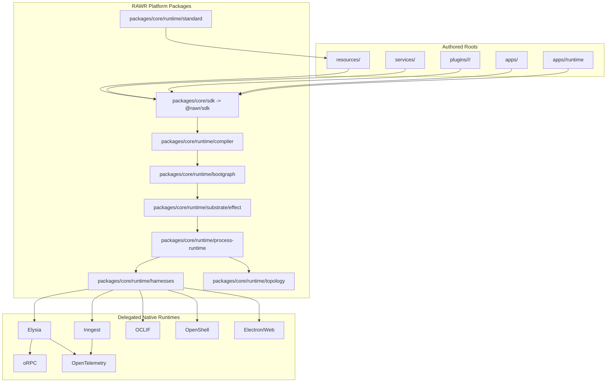
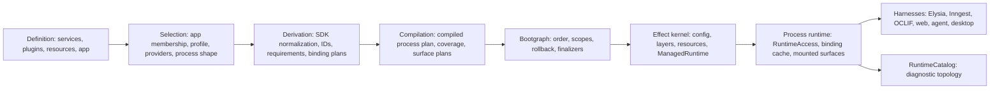

# Runtime Realization Target-Authority Reframe

This document is a sibling refinement of `integration-runtime-realization-forward-evaluation.md`. It does not replace the first spike's evidence. It corrects the first spike's conservative posture under the target-authority frame:

- Alt-X-1 and Alt-X-2 are target architecture inputs.
- Current repo reality is migration substrate, not architecture authority.
- Compatibility is allowed only when it is slice-local, named, verified, and already scheduled for removal.
- The runtime realization system should be laid down in the target geometry now, not in a current-topology shape that we already know will move.

## Direct Verdict

The first spike was right about synthesis and runtime mechanics. It was wrong to recommend preserving `packages/runtime/*`, `@rawr/hq-sdk`, and `startAppRole(...)` as the M2 default just because current docs/gates already name them.

The corrected target is:

```text
packages/
  core/
    sdk/                 # platform SDK; publishes @rawr/sdk
    runtime/             # compiler, bootgraph, substrate, process runtime, harnesses, topology
      standard/          # RAWR-owned standard providers/resources where implementation is platform-owned

resources/
  <capability>/          # authored provisionable capability catalog

apps/
  <app>/
    runtime/             # app-owned profiles, config source selection, process defaults

services/                # semantic truth
plugins/                 # role/surface/capability projections
```

Do not create top-level `core/`. Do not create top-level `runtime/`. Do not treat `packages/runtime/*` as target. Keep packages in `packages/`, but segment platform packages from downstream/user-authored roots.

The prior M2 domino order still holds, but U00 must become the first target-foundation cut. It should not be a compatibility-shaped cut under `packages/runtime/*` and `@rawr/hq-sdk`.

## Prior Spike Corrections

| Prior conclusion | New status | Correction |
| --- | --- | --- |
| Synthesize Alt-X-1 and Alt-X-2. | keep | Still correct. Use Alt-X-2 as the law/DX spine; carry Alt-X-1 lifecycle, flexibility, and `RuntimeCatalog` language. |
| Keep M2-U00 through M2-U06 macro order. | keep/revise | The order survives, but U00-U02 must lock target geometry and target runtime semantics earlier. |
| Preserve `packages/runtime/*` for M2. | reverse | Use `packages/core/runtime` as target. Existing `packages/runtime/*` wording is transition debt. |
| Preserve `@rawr/hq-sdk` for M2. | reverse | Target public SDK is `@rawr/sdk` from `packages/core/sdk`. `@rawr/hq-sdk` is current-substrate naming only. |
| Keep `startAppRole(...)` as U00 seam. | reverse | Canonical entrypoint API is `startApp(...)`. Roles/harnesses/profile are selected data. |
| Treat resource/provider/profile catalog as mostly contingent. | revise | The model must be locked now; implementation can be sliced. |
| Treat caching, telemetry, config, diagnostics as later runtime details. | reverse | They are named runtime components or explicit negative-space entries with lock points. |
| Use current repo reality as a topology constraint. | reverse | Use it to mine behavior, tests, and transition risks. Do not let it choose target paths. |

## Target Topology

The strongest synthesis is not top-level `core/`, not top-level `runtime/`, and not current `packages/runtime/*`.

Alt-X-2 is correct that RAWR platform machinery and authored resources are separate categories. The physical correction for this repo is to put platform machinery under `packages/core/*` and keep the developer/app-authored provisionable capability catalog at top-level `resources/`.



This implies the next doc/gate update must also decide what happens to the existing `packages/core` package. It should not remain an ambiguous platform catch-all beside `packages/core/sdk` and `packages/core/runtime`. Either fold its useful pieces into the new platform zone or rename/split it into a specific support package.

## Resources Versus Runtime Roots

Use top-level `resources/`, not `runtime/resources/`.

Do not add top-level siblings such as `runtime/storage`, `runtime/config`, `runtime/keys`, `runtime/policies`, `runtime/cache`, or `runtime/telemetry`. Those categories are real, but they are not all authored roots. Place them by ownership and lifecycle:

| Concern | Target home | Rule |
| --- | --- | --- |
| SQL, object storage, filesystem, email, queue, pubsub, browser handles, cache clients, telemetry exporters, keyring/KMS clients | `resources/<capability>` | Provisionable capabilities selected by app profiles and acquired by runtime providers. |
| Standard built-in providers/resources | `packages/core/runtime/standard/*` | RAWR-owned implementation stock; public authoring still flows through `resources/*` and `@rawr/sdk`. |
| Config loading, validation, redaction, runtime schema, provider config access | `packages/core/runtime/substrate` or `packages/core/runtime/config` | Runtime-internal mechanics. |
| App profile, provider selection, config source selection, process defaults | `apps/<app>/runtime/*` | App boundary chooses final wiring. |
| Service schemas, repositories, migrations, write authority, domain policy | `services/<service>` | Storage use does not move semantic truth into resources or runtime. |
| Plugin exposure/auth/rate/caller policy | `plugins/<role>/<surface>/<capability>` plus app selection | Projection policy belongs at the surface boundary. |
| Runtime enforcement primitives | `packages/core/runtime/policy` if needed | Enforcement API only; no domain/publication meaning. |

The criterion is simple: if authors declare a provisionable capability contract and apps select how it is satisfied, it belongs under `resources/`. If it is the runtime's machinery for loading, validating, acquiring, scoping, caching, observing, or shutting down, it belongs under `packages/core/runtime/*`. If it is final instance selection, it belongs under `apps/<app>/runtime/*`.

## Layered Terminology Locks

Different terms may coexist only when different layers own different concepts.

| Layer | Canonical terms | Do not canonicalize |
| --- | --- | --- |
| App/entrypoint authoring | `defineApp(...)`, `startApp(...)`, `AppDefinition`, `Entrypoint`, `RuntimeProfile` | `startAppRole(...)`, `startAppRoles(...)` |
| Service authoring | `defineService(...)`, `resourceDep(...)`, `serviceDep(...)`, `semanticDep(...)`, `deps`, `scope`, `config`, `provided` | treating service deps as runtime resources |
| Plugin authoring | `PluginDefinition`, `PluginFactory`, `useService(...)`, role/surface builders | `bindService(...)` as public plugin-authoring API |
| SDK/lowering | `ServiceBindingPlan`, `ProviderSelection`, `ResourceRequirement`, `SurfaceRuntimePlan`, `FunctionBundle` | exposing lowering nouns as normal app authoring concepts |
| Runtime internals | `runtime compiler`, `compiled process plan`, `bootgraph`, `Effect provisioning kernel`, `process runtime`, `RuntimeAccess`, `ProcessRuntimeAccess`, `RoleRuntimeAccess`, `ServiceBindingCache` | `ProcessView`, `RoleView`, `RuntimeView` as live access |
| Harness/native boundary | `Harness`, `HarnessAdapter`, `SurfaceAdapter`, native terms like Elysia route or Inngest function bundle where appropriate | making harness vocabulary app/service truth |
| Diagnostics/control plane | `RuntimeCatalog`, `RuntimeDiagnostic`, diagnostic/read-model views | using `RuntimeAccess` as a diagnostic noun |

Specific locks:

- `startApp(...)` is canonical. A `startAppRole(...)` wrapper is allowed only if it expires inside M2, preferably no later than U02.
- `useService(...)` is plugin-authoring language.
- `serviceDep(...)` is service dependency language.
- `resourceDep(...)` is service resource requirement language.
- `bindService(...)` is runtime/SDK lowering language.
- Runtime profiles should use `providers` or `providerSelections` when the values are provider selections. Do not call that field `resources`.
- `RuntimeAccess` retrieves live provisioned values. `RuntimeCatalog` records what happened. Do not blur those.

## Runtime Realization Component Map



The ownership gradient is `definition -> selection -> derivation -> compilation -> provisioning -> mounting -> observation`. A component that acquires live handles before provisioning is in the wrong layer. A diagnostic component that composes app membership is in the wrong layer.

### Component Inventory

| Component | Status | Owner | M2 lock point |
| --- | --- | --- | --- |
| `@rawr/sdk` public authoring layer | designed | `packages/core/sdk` | U00 |
| Runtime compiler | designed | `packages/core/runtime/compiler` | U00 minimal, U02 generalized |
| Bootgraph | designed | `packages/core/runtime/bootgraph` | U01 |
| Effect provisioning kernel | designed | `packages/core/runtime/substrate/effect` | U00 minimal, U01 hardened |
| Process runtime | designed | `packages/core/runtime/process-runtime` | U00 minimal, U02 generalized |
| Runtime resource catalog | designed | `resources/*` plus SDK descriptors | U00 minimal, U02 complete grammar |
| Standard runtime providers | designed | `packages/core/runtime/standard/*` | U00 minimal, U01 lifecycle |
| App runtime profiles | designed | `apps/<app>/runtime/*` | U00 |
| `RuntimeAccess` | designed | process runtime | U00 minimal, U02 canonical |
| `RuntimeCatalog` | partial | `packages/core/runtime/topology` | U02 minimal schema, U06 ratchet |
| Service binding cache | partial | process runtime | U00 for server binding, U02 generalized |
| Runtime telemetry | partial | runtime substrate, harnesses, `resources/telemetry` when app-selected | U00 baseline, U03 async, U06 ratchet |
| Config/secrets/redaction | partial | app profile + runtime config/kernel | U00 minimal, U01 hardened |
| Service dependency adapters | partial | SDK/compiler/process runtime | U02 |
| Async consumers | partial | async plugins + Inngest harness | U03 plan grammar |
| Runtime policy primitives | negative-space | runtime internals, with meaning owned by apps/plugins/services | before public/internal policy hardening |
| Key/KMS resource families | negative-space | `resources/keyring` or `resources/kms` only when needed | before first key-managed capability |
| Multi-process placement | future known unknown | deployment/control-plane layer, not runtime semantics | after local server/async proof |
| Agent/OpenShell governance | future known unknown | agent harness/OpenShell resource/governance hooks | before agent role |

## Cross-Cutting Component Placement

```mermaid
flowchart TD
  CFG["Config and secrets"] --> CFG_APP["apps/<app>/runtime: source selection"]
  CFG --> CFG_RT["packages/core/runtime: load, validate, redact"]
  CFG --> CFG_SVC["services: stable service config lane"]

  STORE["Storage"] --> STORE_RES["resources/sql, resources/filesystem, resources/object-storage"]
  STORE --> STORE_SVC["services: repos, schemas, migrations, invariants"]

  CACHE["Caching"] --> CACHE_BIND["process runtime: ServiceBindingCache"]
  CACHE --> CACHE_EFF["Effect kernel: local runtime cache primitives"]
  CACHE --> CACHE_RES["resources/cache when app-selected"]
  CACHE --> CACHE_SVC["services: semantic read-model cache"]

  TEL["Telemetry"] --> TEL_RT["runtime: process spans, annotations, lifecycle"]
  TEL --> TEL_RES["resources/telemetry when selected"]
  TEL --> TEL_NATIVE["oRPC, Elysia, Inngest native instrumentation"]
  TEL --> TEL_SVC["services: semantic enrichment"]

  POLICY["Policy"] --> POL_APP["apps: membership, exposure, process policy"]
  POLICY --> POL_PLUGIN["plugins: boundary auth/rate/caller policy"]
  POLICY --> POL_SVC["services: domain invariants"]
  POLICY --> POL_RT["runtime: enforcement primitives"]
```



This is the core answer to the `runtime/resources` question: runtime-adjacent concerns do not justify a top-level `runtime/` root unless they form a new authored category that is neither resource, app selection, service truth, plugin projection, nor platform runtime implementation. Today they do not.

## Revised M2 Domino Ledger

| Domino | Corrected responsibility | Temporary tolerance | Off-ramp |
| --- | --- | --- | --- |
| U00 | First target-foundation cut: `packages/core/sdk`, `packages/core/runtime`, `@rawr/sdk`, minimal `resources/`, app runtime profile, server boot through `startApp(...)`, bridge deletion. | Mine legacy host code for behavior/tests only. Avoid aliases; if one is unavoidable, it expires in U00. | No live `legacy-cutover`; no server path through host-composition; no target code under `packages/runtime/*`. |
| U01 | Bootgraph lifecycle and Effect kernel hardening under target roots. | U00-minimal lifecycle shortcuts. | No second lifecycle engine; errors/scopes/finalizers are target-owned. |
| U02 | Compiler/process runtime generalization: `CompiledProcessPlan`, `RuntimeAccess`, `serviceDep(...)`, `resourceDep(...)`, provider coverage, service binding plans, minimal `RuntimeCatalog`. | Minimal catalog persistence/export. | No undefined service-dependency model; no live `ProcessView`/`RoleView`; no SDK-local binding cache. |
| U03 | Async runtime lane: workflows, schedules, consumers, Inngest harness, async trigger boundary. | Thin consumer proof if no real consumer exists. | Consumers either proved by U05 or ledgered as Phase 3 entry condition before U06 closes. |
| U04 | Public builder cleanup: server API/internal, async workflow/schedule/consumer, layer-correct service/resource terminology. | Private migration adapters only. | Transitional public builders and any `@rawr/hq-sdk` facade expire. |
| U05 | Proof slices through target geometry: server, internal if active, async, resource/profile/provider coverage, cache/telemetry/catalog proof. | Inactive roles outside M2. | No active-lane proof remains transitional. |
| U06 | Ratchet and freeze: gates/docs/imports, Effect quarantine, no transition seams, negative-space ledger. | No live compatibility path. | Phase 3 starts from target truth, not M2 leftovers. |

## Transition Debt Policy

Every compatibility path must be approved as transition debt with these fields:

```text
bridge/shim:
why it exists:
allowed scope:
owner:
latest removal slice:
verification gate:
risk if kept longer:
```

The following transition positions are locked:

| Transition item | Policy | Latest removal |
| --- | --- | --- |
| `apps/hq/legacy-cutover.ts` | Mine only; no active runtime path after server cut. | U00 |
| `apps/server/src/host-*` runtime authority | Mine behavior/tests; do not wrap as hidden fallback. | U00 active path, U05/U06 residual tests/docs |
| `packages/runtime/*` | Not target. Use only as explicit alias if unavoidable. | Prefer none; absolute latest U02 |
| `@rawr/hq-sdk` | Not target. Alias only if needed while moving imports to `@rawr/sdk`. | U04 latest |
| `startAppRole(...)` | Not canonical. Thin wrapper only if required during first server cut. | U02 latest |
| `ProcessView`/`RoleView` | Transition names only. | U02 |
| SDK-local service cache | Replace with runtime-owned `ServiceBindingCache`. | U00/U02 depending first binding scope |
| `runtime-context` | Absorb into target `RuntimeAccess` and descriptors. | U02 if touched; U06 absolute latest |
| `--allow-findings` phase gates | Diagnostic only, never proof. | Per-slice ratchet |

No implicit dual path is allowed. If a shim cannot be detected by a verifier or removed by a named slice, it is not approved.

## Negative-Space Ledger

These are not generic future tasks. They are named spaces in the target architecture that must be filled before the relevant edge becomes load-bearing.

| Negative space | Why it matters | Integration hook | Latest lock point |
| --- | --- | --- | --- |
| Config/secret precedence and redaction | Provider config and diagnostics must not leak secrets. | `apps/<app>/runtime/config.ts`, runtime config loader, catalog redaction. | U00 minimal, U01 hardened |
| Provider dependency graph and refresh/finalizers | Resource acquisition order and shutdown depend on it. | compiler provider coverage + bootgraph scopes. | U01 |
| Service binding cache taxonomy | Binding lifecycle and correctness depend on stable cache keys. | process runtime `ServiceBindingCache`. | U02 |
| Generic `CacheResource` | Shared app/service cache is distinct from binding cache. | `resources/cache`, provider selectors. | Before first cache-dependent proof; ledger by U02 |
| Runtime telemetry outside oRPC | Async/CLI/web/agent/desktop cannot rely on oRPC telemetry. | `RuntimeTelemetry`, harness instrumentation, optional `resources/telemetry`. | U03 for async, later per role |
| RuntimeCatalog schema/storage/retention | Diagnostics need a stable read model without composition authority. | `packages/core/runtime/topology`. | U02 minimal, U06 ratchet |
| Runtime policy enforcement API | Enforcement primitives must not steal meaning from apps/plugins/services. | `packages/core/runtime/policy` if needed. | Before public/internal policy hardening |
| Semantic service dependency adapters | Cross-service dependencies are not resources and need explicit semantics. | `serviceDep(...)`, compiler binding plan. | U02 |
| Key/KMS resource family | Live key management is a resource only when needed. | `resources/kms` or `resources/keyring`. | Before first key-managed capability |
| Multi-process placement | Local process proof does not answer deployment placement. | later deployment/control-plane spec. | After server/async local proof |

## Component Reports Kept

The target-reframe reports are worth keeping as standalone provenance:

- `reports/target-reframe/agent-target-authority.report.md`
- `reports/target-reframe/agent-migration-domino.report.md`
- `reports/target-reframe/agent-terminology-layer.report.md`
- `reports/target-reframe/agent-component-map.report.md`
- `reports/target-reframe/agent-transition-offramps.report.md`

Scratch files were only working notes and should be deleted after this integration is committed.

## Next Documentation Edits

The next doc update should not merely append this reframe. It should update the active M2/spec docs before implementation:

1. Revise the synthesized runtime realization spec to use `packages/core/sdk`, `packages/core/runtime`, top-level `resources/`, app runtime profiles, `@rawr/sdk`, `startApp(...)`, `RuntimeAccess`, and `RuntimeCatalog`.
2. Rewrite M2-U00 so the first production cut lays target roots and public imports, not current `packages/runtime/*` / `@rawr/hq-sdk` names.
3. Update M2-U01/U02 to pull bootgraph, RuntimeAccess, service/resource deps, provider coverage, binding cache, and minimal RuntimeCatalog into the milestone container.
4. Update M2-U03 to include async consumers in the active async family, even if the first proof is thin.
5. Add transition-debt and negative-space ledgers to M2 milestone docs and guardrails.
6. Update verifiers so agents build toward target geometry and cannot accidentally preserve current runtime authority.

## Final Position

Start runtime implementation only after this target-authority doc/spec update lands.

Once it lands, M2 can start immediately. The runtime shape is stable enough. The remaining work is not more architectural exploration; it is target-aligned spec cleanup followed by U00 implementation in the corrected geometry.

The runtime system should be implemented as a coherent platform/runtime architecture under `packages/core/*`, with authored `resources/`, app runtime profiles, canonical `@rawr/sdk`, canonical `startApp(...)`, runtime-owned access/cache/telemetry/catalog components, and no hidden compatibility path that survives without an explicit removal gate.
