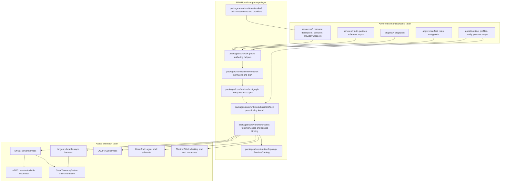
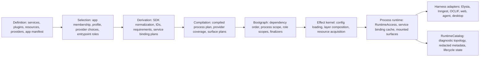
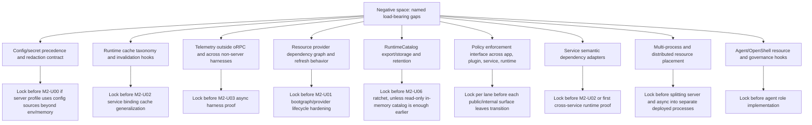

# Component Map: Runtime Realization Target Authority

Component-map architect report for the target-authority reframe.

Inputs read:

- `/Users/mateicanavra/Downloads/RAWR_Runtime_Realization_System-Alt-X-1.md`
- `/Users/mateicanavra/Downloads/RAWR_Runtime_Realization_System-Alt-X-2.md`
- `docs/projects/rawr-final-architecture-migration/resources/spec/RAWR_Effect_Runtime_Realization_System_Canonical_Spec.md`
- `docs/projects/rawr-final-architecture-migration/.context/M2-runtime-realization-lock-spike/integration-runtime-realization-forward-evaluation.md`
- `docs/system/TELEMETRY.md`
- `docs/system/telemetry/orpc.md`
- `docs/system/telemetry/hq-runtime.md`
- current migration seams in `packages/hq-sdk`, `packages/core`, `packages/runtime-context`, `packages/bootgraph`, `apps/server/src`, and `apps/hq`

## Topology Recommendation

Use **top-level `resources/`**, not `runtime/resources/`.

Do **not** create top-level `runtime/storage`, `runtime/config`, `runtime/keys`, `runtime/policies`, `runtime/telemetry`, or `runtime/cache` roots. Those categories are real, but they are not sibling authoring roots. They land by ownership:

| Concern | Target location | Reason |
| --- | --- | --- |
| Generic provisionable capability interface | `resources/<family>/` | It is developer/app-visible substrate capability. Services/plugins can declare requirements. Apps can select providers. |
| Reusable standard platform implementations | `packages/core/runtime/standard/*` | RAWR-owned implementation foundation remains platform package code, not downstream authored code. |
| Runtime compiler/substrate/process internals | `packages/core/runtime/*` | This is platform-owned realization machinery. It should not be mixed with service/plugin/app authoring roots. |
| Public SDK helpers | `packages/core/sdk/*` | SDK is RAWR platform API, not app/service/plugin truth. |
| App-specific selection | `apps/<app>/runtime/*` | Profiles, config source choices, process defaults, harness selection, and provider selection are app-boundary decisions. |
| Service semantic ports, repos, migrations, invariants | `services/<service>/src/*` | Storage usage does not move schema/write authority out of the owning service. |
| Plugin projection policy | `plugins/<role>/<surface>/<capability>/` | Projection and surface policy belong to the plugin lane. |

The geometry is:

```text
packages/core/runtime/*   platform-owned realization engine
packages/core/sdk/*       platform-owned public authoring API
resources/*               developer-authored provisionable capability catalog
apps/*/runtime/*          app-owned provider/config/profile/process selection
services/*                semantic ownership and invariant-preserving writes
plugins/*                 role/surface/capability projections
```

The specs are right that runtime realization is first-class. The correction is physical placement: first-class does not require top-level `runtime/`. In this repo, platform-owned code should remain package-shaped under `packages/core/*`, while first-class authored resources should be visible at the repo root because they are not ordinary helper packages and not service truth.

## Whole System Map



## Layered Runtime Realization Map



Key rule: `definition -> selection -> derivation -> provisioning` is not just sequencing. It is the architecture's ownership gradient. Anything that acquires live handles before provisioning is in the wrong layer.

## Cross-Cutting Concern Map

```mermaid
flowchart TD
  CFG["Config"] --> CFG_CORE["packages/core/runtime/config: load, validate, redact"]
  CFG --> CFG_APP["apps/<app>/runtime/config.ts: select sources and bindings"]
  CFG --> CFG_SERVICE["services/* config lane: stable service behavior after binding"]

  KEYS["Keys and secrets"] --> KEYS_CFG["runtime config redaction and secret references"]
  KEYS --> KEYS_RES["resources/keyring or resources/kms when a live key capability is needed"]
  KEYS --> KEYS_SERVICE["service policy when key usage has domain meaning"]

  STORE["Storage"] --> STORE_RES["resources/sql, resources/object-storage, resources/filesystem"]
  STORE --> STORE_SERVICE["services/* repos, schemas, migrations, write authority"]

  CACHE["Caching"] --> CACHE_PROC["packages/core/runtime/process: binding cache and local Effect Cache"]
  CACHE --> CACHE_RES["resources/cache when shared external cache is provisioned"]
  CACHE --> CACHE_SERVICE["services/* when cache preserves domain read-model semantics"]

  TEL["Telemetry"] --> TEL_RES["resources/telemetry: runtime telemetry capability"]
  TEL --> TEL_CORE["packages/core/runtime/standard/providers/telemetry-*"]
  TEL --> TEL_NATIVE["oRPC/Elysia/Inngest/native instrumentation"]
  TEL --> TEL_SERVICE["services/* semantic span enrichment"]

  POLICY["Policy"] --> POLICY_APP["apps/* manifest/profile publication and process policy"]
  POLICY --> POLICY_PLUGIN["plugins/* boundary auth/exposure/rate policy"]
  POLICY --> POLICY_SERVICE["services/* invariant and domain policy"]
  POLICY --> POLICY_CORE["packages/core/runtime/policy: enforcement primitives only"]
```



Interpretation:

- Storage is usually a resource, but service-owned schemas, migrations, repositories, and write invariants are not resources.
- Config is a runtime system plus app selection concern; a config backend can be a resource only when it is a live capability, not because every config value is a resource.
- Keys/secrets are config-layer values until the system needs a live key management capability, such as KMS, signing, encryption, or keyring access.
- Telemetry is split: runtime owns installation/provisioning, native frameworks own instrumentation semantics, services own semantic enrichment.
- Caching is three distinct things: internal runtime memoization, provisioned cache capability, and service semantic read-model caching.
- Policies live where meaning is owned. Runtime policy internals enforce, they do not invent domain or publication meaning.

## Negative-Space Ledger Map



## Component Inventory

| Component | Layer | Status | Owner | Integration point | Latest acceptable lock point |
| --- | --- | --- | --- | --- | --- |
| App manifest | Public authoring | designed | `apps/<app>` | SDK normalization and compiler input | M2-U00 |
| Entrypoint/process selection | Public authoring | designed | `apps/<app>` | `startApp`/entrypoint runtime call | M2-U00 |
| Runtime profiles | Public authoring | designed | `apps/<app>/runtime` | provider/config/process selection | M2-U00 for server-local profile |
| Runtime config system | Runtime internals plus app selection | partial | `packages/core/runtime/config`, `apps/<app>/runtime/config.ts` | provider config, redaction, process defaults | M2-U00 minimal; full before M2-U01 |
| Public SDK authoring layer | Platform API | designed | `packages/core/sdk` | `defineApp`, service/plugin/resource/profile helpers | M2-U00 |
| Runtime resource descriptor | Public resource catalog | designed | `resources/<family>` | service/plugin requirements and provider selectors | M2-U00 minimal; full before M2-U02 |
| Runtime provider descriptor | Resource/provider catalog | designed | `resources/<family>/providers` plus `packages/core/runtime/standard/providers` | provider selection and Effect lowering | M2-U00 minimal; full before M2-U01 |
| Standard platform resources | Platform implementation | designed | `packages/core/runtime/standard` | public wrappers in `resources/*` | M2-U01 |
| Resource provider dependency graph | Runtime compiler/bootgraph | partial | `packages/core/runtime/compiler`, `packages/core/runtime/bootgraph` | provider coverage and acquisition order | M2-U01 |
| Service package boundary | Service semantic layer | designed | `services/<service>` | SDK-derived service binding plan | M2-U00 |
| Resource dependencies | Service/plugin declaration | designed | services/plugins through SDK | compiler derives resource requirements | M2-U00 minimal |
| Semantic service dependencies | Service declaration | partial | services plus SDK adapters | explicit service dependency adapters | M2-U02 or first cross-service proof |
| Plugin factory/projection | Public projection layer | designed | `plugins/<role>/<surface>/<capability>` | SDK normalization and surface runtime derivation | M2-U00 for server lanes |
| Server API projection | Native surface | delegated | oRPC plugin internals, Elysia harness | server harness mounts public routes | M2-U00 |
| Server internal projection | Native surface | delegated | oRPC plugin internals, Elysia harness | server harness mounts trusted routes | M2-U00 or M2-U02 if not in first cut |
| Async workflow/schedule/consumer projection | Native durable async | delegated/partial | Inngest harness plus async plugins | function bundles and `serve`/`connect` | M2-U03 |
| CLI command projection | Native surface | delegated | OCLIF harness | materialized CLI command packages | post-M2, before CLI lane |
| Web projection | Native surface | delegated | web harness | mounted browser/web app surfaces | post-M2, before web lane |
| Agent/OpenShell projection | Native governed shell | negative-space | agent harness/OpenShell | tool/resource governance and shell channels | before agent role |
| Desktop projection | Native surface | delegated/negative-space | Electron/desktop harness | desktop windows/background/menu surfaces | before desktop lane |
| Runtime compiler | Runtime internals | designed | `packages/core/runtime/compiler` | compiled process plan | M2-U00 minimal; M2-U02 generalized |
| Bootgraph | Runtime internals | designed | `packages/core/runtime/bootgraph` | lifecycle order, scopes, finalizers | M2-U01 |
| Effect provisioning kernel | Runtime internals | designed | `packages/core/runtime/substrate/effect` | resource acquisition, layers, ManagedRuntime | M2-U00 minimal; M2-U01 hardened |
| Process runtime | Runtime internals | designed | `packages/core/runtime/process` | RuntimeAccess, service binding, surface assembly | M2-U00 minimal; M2-U02 generalized |
| RuntimeAccess | Runtime live access | designed | `packages/core/runtime/access` or process package | service binding, plugin projection, harness adapters | M2-U00 |
| RuntimeCatalog | Diagnostics/read model | designed/partial | `packages/core/runtime/topology` | diagnostic topology export | M2-U01 in-memory; M2-U06 retention/export |
| Service binding cache | Runtime internals | partial | `packages/core/runtime/process` | cache keys from process/role/surface/service/scope/config | M2-U02 |
| Runtime errors | Runtime internals | partial | `packages/core/runtime/errors` | provider/compiler/bootgraph diagnostics | M2-U01 |
| Config/secret redaction | Cross-cutting runtime | partial | `packages/core/runtime/config` | RuntimeCatalog, telemetry, provider config | M2-U00 minimal; full before M2-U01 |
| Telemetry installation | Cross-cutting runtime resource | partial | `resources/telemetry`, `packages/core/runtime/standard/providers` | runtime profile selects provider; harness emits spans | M2-U03 for async coverage; M2-U06 ratchet |
| oRPC telemetry | Native delegated surface | delegated/partial | oRPC/Elysia harness | route spans/metrics and service enrichment | already partial; align during M2-U00 |
| Non-oRPC telemetry | Cross-cutting runtime | negative-space | harness adapters and telemetry resource | CLI/web/agent/desktop/async spans/logs/metrics | before each non-server lane |
| Runtime local cache | Runtime internals | partial | `packages/core/runtime/process` and Effect kernel | binding cache, local provider refresh, invalidation | M2-U02 |
| Provisioned cache resource | Runtime resource | negative-space | `resources/cache` | Redis/memory/cache provider selection | before first service/plugin requires shared cache |
| Storage resources | Runtime resource | designed/partial | `resources/sql`, `resources/filesystem`, future storage families | service resource deps and app provider selection | M2-U00 minimal SQL/memory; expand as needed |
| Key management resource | Runtime resource | negative-space | `resources/keyring` or `resources/kms` | signing/encryption/secret-manager access | before first key-managed capability |
| Runtime policy primitives | Runtime internals | negative-space | `packages/core/runtime/policy` | enforcement hooks for app/plugin/service policy | before public surface policy hardening |
| Service/domain policy | Semantic layer | designed | services/plugins/apps | service invariants, API exposure, auth/rate/caller policy | per lane before exposure |
| Runtime control plane | Operations/control | negative-space | future `packages/core/runtime/control` or app-local ops | start/stop/status/catalog/process inspection | M2-U06 if needed for proof |
| Deployment/provider mapping | Outside runtime realization | negative-space | later infra/deployment layer | maps process shapes to Railway/local/etc. | after runtime substrate proves local process |

## Topology Decision Details

### Why `resources/` wins

`resources/` is not a generic bucket. It is the authored provisionable capability catalog. It deserves first-viewport root visibility because services, plugins, and apps all need to reason about provisionable host capabilities without thinking about compiler internals. Alt-X-1 and Alt-X-2 both preserve this concept: resources are not service truth, not plugin projection, and not app selection. They are the substrate capabilities the runtime provisions.

Putting public resource descriptors under `runtime/resources` would make authors pass through the runtime implementation namespace to declare normal host capabilities. That muddies the layer: authors need resources as capability vocabulary; only the platform needs runtime internals.

### Why top-level `runtime/` does not win

The in-repo realization spec correctly noticed that runtime realization is load-bearing and should not be buried as incidental support matter. The better translation is not a top-level `runtime/` root. It is a platform package zone:

```text
packages/core/sdk
packages/core/runtime
packages/core/test-support
```

This keeps platform-only code visible as platform-owned while preserving the repo's clean separation between platform packages and authored app/service/plugin/resource roots.

### How storage fits

Storage has two meanings and they must not be collapsed:

- Infrastructure handles are resources: SQL pool, Drizzle handle, object/blob storage, filesystem, workspace root, repo root.
- Domain persistence authority is service-owned: schemas, migrations, repositories, write invariants, and read-model semantics.

So the target needs `resources/sql`, likely `resources/object-storage` or `resources/blob-storage` when earned, and `resources/filesystem`. It should not introduce `runtime/storage` as an authoring root.

### How config and keys fit

Runtime config is a runtime system because it loads, validates, redacts, and supplies provider/process/harness configuration. App runtime profiles choose config sources and bindings. Services receive stable service config only after binding.

Keys/secrets are not automatically resources. A redacted secret value is config. A live KMS, keyring, signing, encryption, or secret-manager capability is a resource. That implies:

```text
packages/core/runtime/config       runtime config, redaction, source loading
apps/<app>/runtime/config.ts       app config-source selection
resources/kms or resources/keyring live key capability when needed
```

No top-level `runtime/keys` is needed.

### How policies fit

Policy follows meaning:

- Service domain policy belongs in services.
- Public/internal exposure, auth, caller class, and rate-limit policy belongs in plugin/app surface declarations.
- Runtime policy primitives can exist under `packages/core/runtime/policy` when the runtime needs a common enforcement API.
- An external policy engine can be a resource if the process provisions a live policy client.

No top-level `runtime/policies` root is needed.

### How telemetry fits

Current telemetry is already split in the right direction:

- host owns OpenTelemetry bootstrap and exporters
- oRPC/Elysia own route-boundary spans and metrics
- services enrich active spans without installing their own SDK

The target should turn this into:

```text
resources/telemetry
packages/core/runtime/standard/providers/telemetry-otel
packages/core/runtime/telemetry or packages/core/runtime/observability
harness-specific native instrumentation
services/* semantic enrichment
```

This is not fully designed for non-oRPC lanes. It is named negative space before async, CLI, web, agent, and desktop hardening.

### How caching fits

Caching is not one component:

- Service binding cache is runtime-internal and derives from canonical process/role/surface/service/scope/config inputs.
- Effect Cache and local invalidation loops are runtime-local mechanics.
- Redis/memory/external cache clients are resources when provisioned for services/plugins.
- Service semantic caching belongs inside the service if it changes read-model correctness or invalidation policy.

The target needs a cache taxonomy before M2-U02 generalizes binding and process runtime. It does not need a `runtime/cache` public root.

## Known Blocks

These blocks are designed enough to implement in the runtime realization milestone:

- `resources/` catalog as provisionable capability vocabulary.
- `packages/core/sdk` as public authoring/derivation API.
- `packages/core/runtime/compiler` as import-safe plan derivation.
- `packages/core/runtime/bootgraph` as lifecycle and scope ordering.
- `packages/core/runtime/substrate/effect` as hidden provisioning kernel.
- `packages/core/runtime/process` as RuntimeAccess, service binding, surface assembly, and harness handoff.
- `packages/core/runtime/topology` as RuntimeCatalog/read-model.
- Elysia/oRPC and Inngest as delegated native execution planes.
- App runtime profiles as provider/config/process selection.

## Known Unknowns

These must be designed inside the milestone container, not silently deferred:

- Exact SDK import names after moving from `@rawr/hq-sdk` to the target platform SDK package.
- Minimal server-lane config source contract and secret redaction rules.
- Provider dependency graph and refresh/finalizer behavior.
- Service binding cache key canonicalization and invalidation hooks.
- RuntimeCatalog schema depth, storage, retention, and redaction.
- Telemetry propagation outside oRPC, especially async and agent surfaces.
- Runtime policy enforcement hooks that do not steal semantic ownership from services/plugins/apps.
- Semantic service dependency adapter grammar.

## Future Known Unknowns

These can be packaged for later thresholds because they become load-bearing only when those lanes are opened:

- Multi-process and distributed placement policy once server and async split across deployments.
- Agent/OpenShell governance, resource access, and human/steward control channels.
- Desktop/Electron lifecycle and resource scoping.
- Web/browser resource projection and browser-safe runtime config exposure.
- Marketplace/package distribution rules for third-party resources/providers.
- Long-lived control-plane status and runtime catalog persistence beyond local proof.

## Implementation Consequence

For M2, the migration should not preserve `packages/runtime/*` as a target just because it is current plan language. It should update the plan toward:

```text
packages/core/runtime/*
packages/core/sdk/*
resources/*
apps/hq/runtime/*
```

The first server slice can still be small, but its smallness should be geometric, not conservative:

- create the final platform package zone even if most modules are minimal
- move legacy host-satisfier behavior into runtime-owned binding/provisioning shapes
- expose only the server-lane resources/providers/profile needed to delete `legacy-cutover`
- record every missing runtime-deep component in the negative-space ledger with a milestone lock point

That lets M2-U00 be a real target-architecture domino instead of a temporary bridge with better names.
