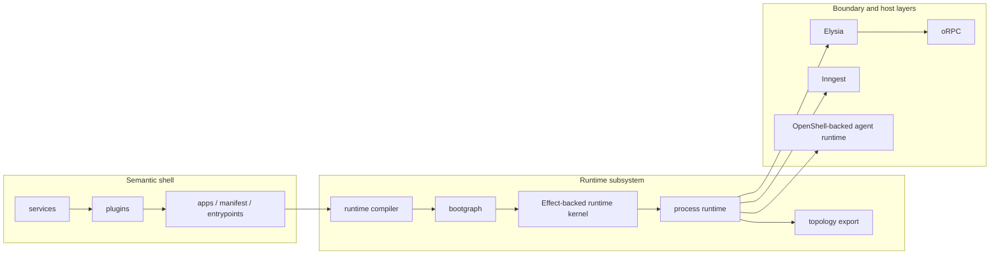
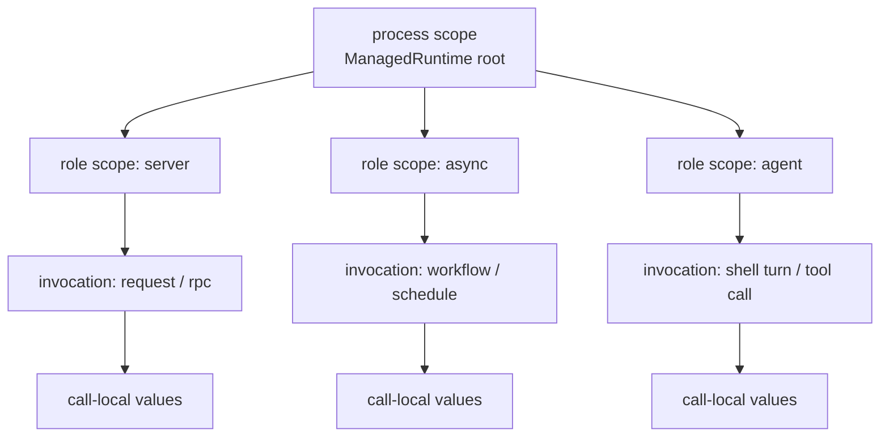
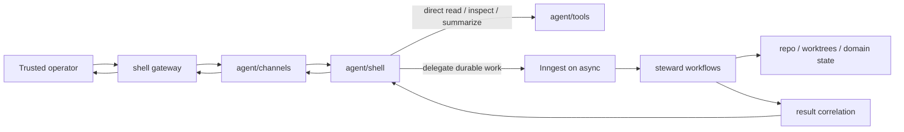
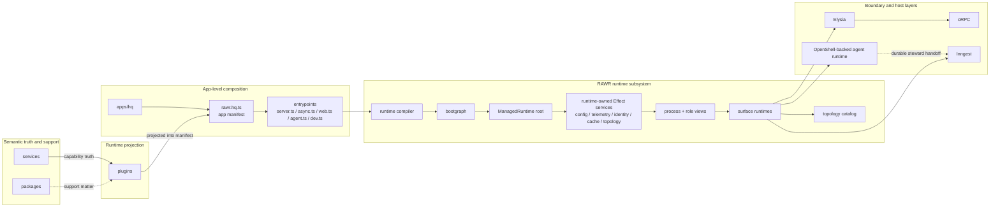

# RAWR Canonical Architecture and Runtime Specification

## 1. Scope

This specification defines the canonical architecture and runtime model for RAWR HQ and for later apps built on the same shell.

It fixes:

- the durable ontology
- the semantic authoring model
- the service, plugin, app, manifest, compiler, bootgraph, process runtime, and harness seams
- the process-local runtime substrate
- the runtime-owned config, schema, observability, and error model
- the runtime and boot model
- the service-boundary provisioning model
- the hidden realization chain beneath the public shell
- the role and surface model
- the relationship between the `agent` role and the `async` role
- the default topology and growth model
- the resource and ownership model
- the operational mapping on service-centric platforms
- the canonical public SDK family
- the enforcement orientation

The architecture is organized around three durable separations.

The first is the semantic separation:

```text
support matter
  != semantic capability truth
  != runtime projection
  != app-level composition authority
```

The second is the realization separation:

```text
stable architecture
  != runtime realization
```

The third is the authority separation for the human-facing agent subsystem:

```text
human-facing shell authority
  != durable steward execution authority
```

The stable architecture is:

```text
app -> manifest -> role -> surface
```

The runtime realization is:

```text
entrypoint -> runtime compiler -> bootgraph -> process runtime -> harness -> process -> machine
```

On service-centric platforms there is one additional operational mapping:

```text
entrypoint -> platform service -> replica(s)
```

That last line is an operational mapping, not a core ontology layer.

The point of the shell is simple:

```text
scale changes placement, not semantic meaning
```

The point of the realization chain is equally simple:

```text
make runtime explicit
without introducing a second public architecture
```

The canonical system preserves the public RAWR shell, keeps services as capability truth, keeps plugins as runtime projection, keeps apps as composition authority, keeps oRPC as the service/callable boundary, keeps Inngest as the durable async harness, fixes the hidden process-local substrate beneath bootgraph and process runtime as Effect-backed, and integrates the OpenShell runtime beneath the human-facing `agent` role while durable steward execution remains on `async`.

---

## 2. Architectural posture

RAWR is a bounded software foundry.

A system begins as capability truth inside one or more services. That truth is projected into runtime surfaces by plugins. An app manifest composes those projections into one product/runtime identity. Entrypoints realize chosen slices of that identity into running processes.

The load-bearing operational chain is:

```text
bind    -> connect capability truth to the resources it needs
project -> shape that truth for a specific runtime surface
compose -> assemble projections into one deployable identity
```

Those are not preferences. They are operations. They happen whether they are named or not. The purpose of this architecture is to make them explicit, stable, and enforceable.

The critical result is scale continuity:

- a capability can begin inside one app
- earn multiple projections over time
- promote to its own app when independence is earned
- later move without changing species

The architecture is allowed to change placement.
It is not allowed to corrupt meaning.

### 2.1 Universal shape

The same capability can be realized across multiple output shapes without changing what the capability means.

| Output | Bind | Project | Compose |
| --- | --- | --- | --- |
| REST API | service + db pool | HTTP route adapter | server manifest + server harness |
| Durable workflow | service + db pool | workflow adapter | async manifest + async harness |
| Human-facing shell | service clients + machine/policy resources | channel / shell / tool adapters | agent manifest + agent runtime |
| Governed steward work | service + db pool + steward/worktree resources | durable steward workflow adapter | async manifest + durable steward plane |
| CLI tool | service + config | command adapter | cli manifest + CLI harness |
| Installable product | service + tenant config | multi-surface adapter | product manifest + platform |

The bind column is nearly identical every time. What varies is projection and composition.

This means a single capability can be deployed in multiple runtime forms without being rewritten, re-architected, or re-understood. The service stays the service. The projections multiply. The manifest chooses which projections ship together.

### 2.2 Truth, surfaces, and selection

At the very bottom, three facts matter.

Truth exists independently of how it is consumed.
Surfaces are projections, not owners.
Composition is selection, not creation.

That means:

- a service boundary remains the owner of business capability truth
- a plugin projection does not become a new truth owner
- a manifest selects which capabilities, projected into which surfaces, belong to one deployable identity

This matters most where systems become more autonomous.

An API that violates a service boundary creates bugs.
An agent or shell that violates a service boundary creates unpredictable autonomous behavior with compounding consequences.

The shell therefore benefits from the same law as every other surface. It does not bypass service boundaries. It does not become a shadow orchestrator. It does not become a new ontology.

---

## 3. Core ontology

### 3.1 Top-level architectural kinds

The canonical top-level architectural kinds are:

```text
packages/   support matter
services/   semantic capability boundaries
plugins/    runtime projections
apps/       app identities, manifests, and entrypoints
```

These are not folder labels. They are the durable nouns the system is built around.

### 3.2 Stable semantic nouns

```text
service         = semantic capability boundary
service family  = optional namespace grouping under services/, not a service or owner
plugin          = runtime projection package
app             = top-level product/runtime identity
manifest        = app-level composition file
role            = semantic execution class inside an app
surface         = what a role exposes or runs
repository      = service-internal persistence mechanic under semantic ownership
```

### 3.3 Runtime realization nouns

```text
entrypoint       = executable file that chooses one process shape
runtime compiler = hidden compiler that turns app/manifest selection into one process plan
bootgraph        = RAWR-owned process-local resource lifecycle engine
process runtime  = hidden process-local realization layer below bootgraph
harness          = concrete runtime host or execution backend for one surface family
shell gateway    = trusted-operator ingress/egress adapter for human-facing channels
process          = one running program
machine          = the computer or node running one or more processes
platform service = operational platform unit on service-centric platforms
```

The hidden execution substrate beneath bootgraph and process runtime is implemented on Effect. It is process-local and it is not a peer ontology layer.

### 3.4 Resource and boundary nouns

```text
process resource   = long-lived resource shared within one process
role resource      = long-lived resource owned by one role inside one process
invocation context = per-request / per-call / per-execution values
call-local value   = temporary value created inside one handler or execution
```

### 3.5 Service-boundary lanes

```text
deps       = stable host-owned prerequisites or baseline capabilities
scope      = stable business or client-instance identity
config     = stable package behavior and configuration
invocation = required per-call input
provided   = execution resources derived during the service pipeline
```

### 3.6 Agent subsystem nouns

```text
channel surface           = human-facing ingress/egress surface for trusted operator channels
shell surface             = session-level shell runtime that interprets intent, inspects context, and routes work
tool surface              = machine-facing or capability-facing tool surface used by the shell
steward                   = durable async actor that owns governed implementation inside one bounded domain
trusted operator boundary = the trust boundary within which broad shell read authority is acceptable
```

### 3.7 Core definitions

#### `packages`

`packages` hold shared or lower-level support matter.

They may contain:

- shared types
- SDKs and helpers
- adapters and utilities
- lower-level primitives
- reusable support logic that does not itself define a first-class service boundary
- process-local lifecycle infrastructure such as `packages/bootgraph`
- hidden runtime compiler and harness infrastructure
- generic persistence support such as SQL helpers, codecs, migration utilities, or repository primitives
- agent runtime infrastructure such as OpenShell adapters, shell gateways, shell policy layers, and channel adapters

`packages` support other kinds. They do not own semantic capability truth, and they do not own app-level composition authority.

#### `services`

`services` hold semantic capability truth.

A service is a contract-bearing, transport-neutral capability boundary. It owns:

- stable boundary contracts
- stable context lane structure
- service-wide middleware semantics
- service-wide assembly seams
- internal module and procedure decomposition
- business-capability truth for that boundary
- authoritative write ownership for its invariants
- schema ownership, migrations, repositories, and policy seams for the capability it owns

A service is semantic first. It may be called in-process when caller and callee share a process, and later over RPC when remote, without changing what the service means.

#### `plugins`

`plugins` hold runtime projection.

A plugin exists to mount, expose, adapt, orchestrate, or otherwise project capability into a runtime surface. It owns:

- role-specific integration
- transport and surface adaptation
- runtime middleware
- runtime-specific exposure policy
- role-local binding from process resources into mounted surface input

Plugins project capability truth that lives in services. They do not replace service ownership.

#### `apps`

An app is the top-level product/runtime identity and code home.

It owns:

- manifest definition
- entrypoints
- runtime identity and config roots
- app-level composition authority
- role selection for each process shape
- transport and surface mounting at the process boundary

Inside an app, two app-internal constructs matter:

- the manifest
- the entrypoints

The manifest and entrypoints are app-internal. They are not additional top-level ontology kinds.

#### `bootgraph`

`packages/bootgraph` is RAWR-owned process-local resource lifecycle infrastructure.

It owns:

- module identity
- dependency graph resolution
- deterministic startup ordering
- rollback on startup failure
- reverse shutdown ordering
- typed context assembly
- process and role lifetimes
- lowering public resource modules into the hidden substrate

It does not own app identity, manifest membership, harness semantics, or service-boundary meaning.

#### `process runtime`

The process runtime is a hidden realization layer below bootgraph.

It owns:

- process and role runtime views
- mounted surface assembly
- topology metadata accumulation
- catalog export
- handoff into harness adapters

It does not own service truth, public API meaning, or a second business execution model.

#### `shell gateway`

The shell gateway is a trusted-operator ingress and delivery boundary above the shell runtime.

It owns:

- channel socket and session integration
- channel-specific normalization
- channel-specific delivery
- access policy at the channel edge
- trusted sender routing

It does not own domain correctness, durable orchestration, or steward implementation.

---

## 4. Canonical laws

### 4.1 Semantic direction

The canonical semantic direction is fixed:

```text
packages -> services -> plugins -> apps
```

### 4.2 Stable architecture versus runtime realization

The stable architecture is:

```text
app -> manifest -> role -> surface
```

The runtime realization is:

```text
entrypoint -> runtime compiler -> bootgraph -> process runtime -> harness -> process -> machine
```

`bootgraph` and the `process runtime` bridge the semantic shell to running software. They are not additional top-level semantic layers.

### 4.3 Service boundary first

The governing rule is:

```text
service boundary first
projection second
composition third
placement fourth
transport fifth
```

A service boundary is transport-neutral and placement-neutral.

### 4.4 Bind, project, compose law

The governing operational chain is:

```text
bind(service, resources) -> live capability
project(bound capability, surface shape) -> runtime contribution
compose(contributions, manifest, entrypoint) -> running process shape
```

These are not stylistic preferences. They are the mechanical operations by which capability becomes running software.

### 4.5 Projection and assembly law

The assembly law is:

- packages support services, plugins, and apps without becoming capability truth
- service cores depend on packages but never on plugins or apps
- plugins depend on service contracts, service clients, and support matter but do not become truth owners
- apps compose plugins into roles and surfaces but do not redefine service truth
- bootgraph receives process-local inputs from the compiler and does not own app-level composition policy
- the process runtime receives compiled surface and resource plans and does not own semantic meaning
- harnesses consume booted context and compiled surfaces but do not define the ontology

### 4.6 Shared infrastructure is not shared semantic ownership

```text
shared infrastructure != shared semantic ownership
```

Multiple services may share:

- an app
- a process
- a machine
- a platform service
- a database instance
- a connection pool
- telemetry installation

That does not mean they share semantic truth or write ownership.

### 4.7 Namespace is not ownership

Namespace layers may exist below the canonical top-level kinds when they improve navigation, stewardship, and scale continuity.

Namespace layers do not create new authority.

The governing rule is:

```text
namespace != owner
```

An optional `services/<family>/...` layer is allowed when it groups related services. The leaf service remains the actual service boundary and owner.

### 4.8 Harness and substrate choice are downstream

The governing rules are:

```text
harness choice   != semantic meaning
substrate choice != semantic meaning
```

The stack is fixed beneath the shell, but those choices remain downstream of semantics.

### 4.9 Ingress and execution law

The canonical ingress split is:

```text
external product ingress enters through server
external conversational ingress enters through agent
durable system work runs on async
```

That means:

- public and trusted callable request/response ingress belongs on `server` by default
- human-facing shell and channel ingress belong on `agent`
- durable background and governed execution belong on `async`

### 4.10 Shell versus steward authority law

The governing rule is:

```text
the shell drives what
the stewards drive how
governance decides whether
```

The shell may inspect, summarize, route, ask clarifying questions, and perform allowed lightweight direct actions.

The shell does not directly implement governed repo mutation in governed scopes.

The stewards remain the authoritative implementers for governed domain work.

### 4.11 Future refinement seam

The current role and plugin structure must be concrete enough to implement now.

At the same time, the architecture preserves one explicit rule:

```text
additional second-level contribution classes may later be earned
only when the host or runtime genuinely composes them differently
```

### 4.12 Scale continuity

The following meanings must not change as the system grows:

- what a service is
- what a service family is
- what a plugin is
- what an app is
- what a manifest is
- what a role is
- what a surface is
- what an entrypoint is
- what the bootgraph is
- what the process runtime is

The system is allowed to change placement. It is not allowed to rename the ontology every time placement changes.

---

## 5. Canonical repo topology

The file tree should prioritize the stable semantic layers:

```text
app -> role -> surface
```

The file tree should not primarily encode:

- machine placement
- process count
- deployment layout
- current platform topology

The canonical target-state topology is:

```text
packages/
  bootgraph/
  runtime-compiler/
  runtime-substrate/
  runtime-harnesses/
    elysia/
    inngest/
    web/
    cli/
  topology-catalog/
  agent-runtime/
    openshell/
    gateway/
    policy/
    adapters/
  hq-sdk/
  shared-types/
  db-support/          # optional support package when earned
  ... support packages ...

services/
  <service>/
  <family>/<service>/

plugins/
  server/
    api/
      <capability>/
    internal/
      <capability>/      # only if earned
  async/
    workflows/
      <capability>/
    consumers/
      <capability>/
    schedules/
      <capability>/
  web/
    app/
      <capability>/
  cli/
    commands/
      <capability>/
  agent/
    channels/
      <capability>/
    shell/
      <capability>/
    tools/
      <capability>/

apps/
  hq/
    rawr.hq.ts
    server.ts
    async.ts
    web.ts
    agent.ts
    dev.ts
    cli.ts            # optional
```

### 5.1 Services may be flat or family-nested

Both of these are valid:

```text
services/
  billing-ledger/
  billing-invoicing/
```

```text
services/
  billing/
    ledger/
    invoicing/
```

The semantics are identical.

The leaf is the service. The parent family, if present, is a namespace only.

### 5.2 Service family rules

A service family directory may contain:

- `README.md`
- diagrams
- family-level docs
- metadata or tooling files

A service family directory must not own:

- contracts
- procedures
- routers
- migrations
- repositories
- canonical business policies
- canonical writes
- bootgraph authority
- agent-runtime authority

If the parent directory starts owning those things, it is no longer a namespace. It has become a covert service.

### 5.3 Repositories are not a top-level architectural kind

There is no top-level `repositories/` root in the canonical architecture.

Repositories are persistence mechanics under service ownership.

The default shape is service-internal:

```text
services/
  billing/
    ledger/
      src/
        db/
          schema/
          migrations/
          repositories/
        policies/
        modules/

    invoicing/
      src/
        db/
          schema/
          migrations/
          repositories/
        policies/
        modules/
```

Generic persistence support may live in `packages/`, but domain repositories and migrations remain under the owning service.

### 5.4 Plugin roots are role-first and surface-explicit

The plugin tree is grouped by role first and by contribution shape second.

The second-level split exists only when the role composes different contribution shapes differently.

That is why `async` is split into:

- `workflows`
- `consumers`
- `schedules`

why `server` may also split into:

- `api`
- `internal`

and why `agent` is explicitly split into:

- `channels`
- `shell`
- `tools`

That `agent` split is earned because the host composes those contribution classes differently.

### 5.5 Hidden infrastructure stays under `packages/`

The following are infrastructure packages, not new ontology kinds:

- `packages/bootgraph`
- `packages/runtime-compiler`
- `packages/runtime-substrate`
- `packages/runtime-harnesses/*`
- `packages/topology-catalog`
- `packages/agent-runtime/*`

The hidden Effect-backed implementation beneath bootgraph and process runtime remains inside those support layers. It does not become a peer semantic root.

### 5.6 No file-tree encoding of operational topology

The file tree does not primarily encode:

- how many platform services exist
- how many processes run today
- which entrypoints are cohosted
- which machine or VM runs a process
- which trusted shell gateway runs on which host

Those are runtime facts. The repo prioritizes semantic architecture.

---

## 6. Service model

### 6.1 Service posture

The service layer is the semantic capability plane.

The preferred posture is:

```text
services are transport-neutral semantic capability boundaries
with oRPC as the default local-first callable boundary
```

That means a service may use oRPC primitives for:

- procedure definition
- callable contract shape
- context lanes
- local invocation
- eventual remote transport projection when placement changes later

### 6.2 What services own

Services own:

- contracts
- procedures
- service-wide context lanes
- service-wide metadata and policy vocabulary
- service-wide assembly seams
- business invariants
- capability truth
- authoritative write ownership
- repository seams
- schema and migration authority for their bounded truth

### 6.3 What services do not own

Services do not own:

- public API route trees
- trusted internal route trees
- app manifest membership
- process boot
- HTTP listener details
- async runtime harness selection
- platform placement
- topology or catalog export
- hidden runtime-resource realization
- shell session logic
- channel gateway logic

### 6.4 Canonical service-boundary lanes

A service boundary uses these lanes:

- `deps` for stable host-owned prerequisites or baseline capabilities
- `scope` for stable business or client-instance identity
- `config` for stable package behavior and configuration
- `invocation` for required per-call input
- `provided` for execution resources derived during the service pipeline

The ownership split is fixed:

- the process runtime and plugin binding layer provide `deps`, `scope`, and `config`
- the harness provides `invocation`
- service middleware and providers derive `provided.*`
- package boundaries do not seed `provided` by default

### 6.5 Golden service shell

`services/example-todo` is the canonical service shell.

Its package shape establishes the authoring standard:

```text
services/example-todo/
  src/
    service/
      base.ts
      contract.ts
      impl.ts
      router.ts
      shared/
      modules/
    client.ts
    router.ts
    index.ts
```

The semantic split of those files is load-bearing:

```text
service/base.ts   = what the service means
service/impl.ts   = one package-wide runtime assembly seam
service/router.ts = one package-wide router composition seam
client.ts         = one canonical package-boundary client seam
index.ts          = one thin public export seam
```

### 6.6 Canonical service authoring shape

```ts
// services/<capability>/src/service/base.ts
import { defineService } from "@rawr/hq-sdk/service";

const service = defineService<{
  initialContext: {
    deps: Record<string, unknown>;
    scope: Record<string, unknown>;
    config: Record<string, unknown>;
  };
  invocationContext: Record<string, unknown>;
  metadata: Record<string, unknown>;
}>({
  metadataDefaults: {
    domain: "<capability>",
  },
  baseline: {
    policy: {},
  },
});

export const ocBase = service.oc;
export const createServiceMiddleware = service.createMiddleware;
export const createServiceImplementer = service.createImplementer;
```

```ts
// services/<capability>/src/service/impl.ts
import { contract } from "./contract";
import { createServiceImplementer } from "./base";

export const impl = createServiceImplementer(contract, {
  observability,
  analytics,
})
  .use(providerA)
  .use(providerB);
```

```ts
// services/<capability>/src/client.ts
import { defineServicePackage } from "@rawr/hq-sdk/boundary";
import { router } from "./router";

const servicePackage = defineServicePackage(router);

export function createClient(boundary: ServicePackageBoundary<typeof router>) {
  return servicePackage.createClient(boundary);
}
```

### 6.7 Service-internal ownership law

Service-internal structure follows these rules:

- module-local by default
- `service/shared` is an earned exception
- repositories live under the owning module unless sharing has been earned
- policy engines live under the owning module or service, not in generic support packages unless truly infrastructural

Two small services that deeply share entities, policies, and write invariants are often one service with multiple modules, not two services.

### 6.8 Repository, DB, and policy seams

Within a service, the canonical persistence split is:

```text
src/
  db/
    schema/
    migrations/
    repositories/
  policies/
  modules/
```

This split is not cosmetic.

- `schema/` and `migrations/` define persistence ownership
- `repositories/` encode persistence mechanics for the service's truth
- `policies/` encode semantic invariants and decision logic
- `modules/` decompose the service without changing the service boundary

### 6.9 Shared DB versus shared ownership

The important questions are not merely whether services share a database instance.

The important questions are:

```text
1. do they share storage infrastructure?
2. do they share schema ownership?
3. do they share write authority over the same tables/entities?
4. do they share semantic truth, or only physical persistence?
```

The default policy is:

- multiple services may share one physical Postgres instance and one host-provided `dbPool`
- each service owns its own tables, migrations, repositories, and write invariants
- direct co-ownership of business tables across service boundaries is not the default

### 6.10 Cross-service calls preserve service ownership

Cross-service interaction should go through the owning service boundary using its canonical contract or client shape.

When caller and callee share a process, default to in-process calls.
When the called service is remote, use RPC.

Shared apps, shared processes, shared DB instances, and shared pools do not create shared semantic ownership.

### 6.11 Service truth versus machine capabilities

Services remain the owners of business capability truth.

Some agent or tool projections may also expose infrastructural machine capabilities mediated through `packages/agent-runtime/*` under explicit shell policy.

Those machine capabilities are not business capability truth.
They are not a reason to bypass service law for governed domain work.

---

## 7. Plugin model

### 7.1 Plugin posture

Plugins are runtime projection.

A plugin translates service truth into role- and surface-specific runtime contributions.

A plugin is not:

- a service
- a bootgraph
- a process runtime
- an app manifest
- a process-wide authority object
- a mini-framework

### 7.2 Canonical plugin roots

The canonical role-first plugin roots are:

```text
plugins/server/api/*
plugins/server/internal/*     # optional, only if earned
plugins/async/workflows/*
plugins/async/consumers/*
plugins/async/schedules/*
plugins/web/app/*
plugins/cli/commands/*
plugins/agent/channels/*
plugins/agent/shell/*
plugins/agent/tools/*
```

### 7.3 Plugin authoring law

The plugin shell should feel like the service shell feels.

A plugin author should know exactly:

- what capability is being projected
- what surface family it belongs to
- what exposure authority it owns when applicable
- what role-local bindings it derives
- what runtime projection it emits

A normal plugin author should not need to think in:

- generic registration wrappers
- hidden graph materialization
- manual module arrays derived from surface composition
- manual surface merging
- raw channel gateway internals
- raw OpenShell APIs
- raw Effect `Layer`, `Context.Tag`, or `ManagedRuntime`

### 7.4 Authoritative plugin seam

Every plugin has one authoritative file:

```text
src/plugin.ts
```

That file is the plugin equivalent of `service/base.ts`.

### 7.5 Public builder families

The public plugin builders are semantic, not generic.

```ts
export const defineServerApiPlugin = ...
export const defineServerInternalPlugin = ...
export const defineAsyncWorkflowPlugin = ...
export const defineAsyncConsumerPlugin = ...
export const defineAsyncSchedulePlugin = ...
export const defineWebAppPlugin = ...
export const defineCliCommandPlugin = ...
export const defineAgentChannelPlugin = ...
export const defineAgentShellPlugin = ...
export const defineAgentToolPlugin = ...
```

### 7.6 Common plugin semantic lanes

Every plugin family uses the same semantic ideas:

- `capability`
- `exposure` when the plugin owns a callable or visible surface contract
- `policy` when the plugin owns trusted ingress or machine capability boundaries
- `bind` for role-local long-lived bindings derived from process resources
- one shape-specific projection lane

### 7.7 Shape-specific projection lanes

| Builder | Semantic lanes |
| --- | --- |
| `defineServerApiPlugin` | `capability`, `exposure`, `bind`, `routes` |
| `defineServerInternalPlugin` | `capability`, `exposure`, `bind`, `routes` |
| `defineAsyncWorkflowPlugin` | `capability`, `exposure?`, `bind`, `workflows` |
| `defineAsyncConsumerPlugin` | `capability`, `bind`, `consumers` |
| `defineAsyncSchedulePlugin` | `capability`, `bind`, `schedules` |
| `defineWebAppPlugin` | `capability`, `bind`, `app` |
| `defineCliCommandPlugin` | `capability`, `bind`, `command` or `commands` |
| `defineAgentChannelPlugin` | `capability`, `policy`, `bind`, `channel` |
| `defineAgentShellPlugin` | `capability`, `bind`, `shell` |
| `defineAgentToolPlugin` | `capability`, `policy?`, `bind`, `tool` or `tools` |

### 7.8 Exposure semantics

`exposure` is the public noun.

For callable surfaces the canonical shape is:

```ts
exposure: {
  internal: {
    contract: ...,
  },
  published?: {
    contract: ...,
    routeBase?: ...,
  },
}
```

`exposure` answers surface authority questions.
It does not answer boot or substrate questions.

### 7.9 Binding is the common path

Most plugins should not author raw modules.

The common authoring path is:

```ts
bind({ process }) {
  return {
    someLongLivedThing: ...
  };
}
```

The runtime compiler turns that into role-lifetime boot material and bound runtime views.

### 7.10 `bindService(...)`

The canonical helper for binding a service boundary from booted resources is:

```ts
bindService(createClient, {
  deps({ process, role }) {
    return { ... };
  },
  scope({ process, role }) {
    return { ... };
  },
  config({ process, role }) {
    return { ... };
  },
})
```

That says exactly what matters:

```text
this plugin binds one service boundary
from booted process and role resources
```

The helper hides:

- lowering into role resources
- binding and caching details
- boundary resolver plumbing
- substrate-specific mechanics

The helper does not hide service-boundary meaning. It still produces the canonical `{ deps, scope, config }` boundary expected by the service package.

### 7.11 Canonical server plugin example

```ts
// plugins/server/api/example-todo/src/plugin.ts
import { defineServerApiPlugin, bindService } from "@rawr/hq-sdk/plugins";
import { createClient as createExampleTodoClient } from "@rawr/services/example-todo";

export const exampleTodoApi = defineServerApiPlugin({
  capability: "example-todo",

  exposure: {
    internal: { contract: internalContract },
    published: { contract: publishedContract, routeBase: "/example-todo" },
  },

  bind({ process }) {
    return {
      exampleTodo: bindService(createExampleTodoClient, {
        deps: ({ process }) => ({
          dbPool: process.dbPool,
          clock: process.clock,
          logger: process.logger,
          analytics: process.analytics,
        }),
        scope: ({ process }) => ({
          workspaceId: process.workspaceId,
        }),
        config: () => ({
          readOnly: false,
          limits: { maxAssignmentsPerTask: 2 },
        }),
      }),
    };
  },

  routes({ resources }) {
    return createExampleTodoRoutes({
      exampleTodo: resources.exampleTodo,
    });
  },
});
```

### 7.12 Advanced module escape hatch

An advanced escape hatch remains for unusual cases.

It is explicit and secondary:

```ts
modules: [...]
```

The common case remains semantic plugin authoring.
The advanced case is direct module authoring.

### 7.13 Workflow authoring clarification

Workflow plugins define durable execution bundles and their execution semantics.
They do not own mounted internal routers by default.

Caller-facing request/response trigger surfaces remain server surfaces by default.
Durable workflow execution remains on the async role.

The one explicit exception is the shell-facing durable handoff:

- the shell may emit durable steward activation directly into the async orchestration plane
- it does not need a fake synchronous server hop merely to create work

That exception exists because the shell is already a trusted operator runtime surface, not a generic product API boundary.

### 7.14 Agent plugin clarification

Agent plugins are split because the `agent` host composes three materially different contribution shapes:

- channels
- shell
- tools

That split is earned.

`agent/channels/*` own human-facing ingress and egress adaptation.

`agent/shell/*` own session-level shell decisioning.

`agent/tools/*` own machine-facing or capability-facing tools used by the shell.

### 7.15 Canonical agent shell plugin example

```ts
// plugins/agent/shell/main/src/plugin.ts
import { defineAgentShellPlugin } from "@rawr/hq-sdk/plugins";

export const mainShell = defineAgentShellPlugin({
  capability: "hq-shell",

  bind({ process }) {
    return {
      machineRead: process.agentRuntime.machineRead,
      specialActions: process.agentRuntime.specialActions,
      stewardActivation: process.asyncActivation,
      topologyCatalog: process.topologyCatalog,
    };
  },

  shell({ resources }) {
    return createMainShell({
      machineRead: resources.machineRead,
      specialActions: resources.specialActions,
      stewardActivation: resources.stewardActivation,
      topologyCatalog: resources.topologyCatalog,
    });
  },
});
```

### 7.16 Plugin authoring invariants

- plugins project service truth; they do not replace it
- plugin code may derive long-lived role resources from process resources
- actual business truth stays in `services/*`
- plugin trees are grouped by role first and contribution shape second
- actual domain logic stays out of plugin roots; plugin roots stay adapters and registrations only
- agent plugins do not bypass service or steward law for governed domain work

---

## 8. App model

### 8.1 App posture

An app is the top-level product/runtime identity.

The default HQ app is:

```text
apps/hq/
```

### 8.2 Manifest posture

In the target-state HQ topology, the manifest is:

```text
apps/hq/rawr.hq.ts
```

It answers one question:

```text
What process resources, roles, and surfaces belong to this app?
```

It is:

- the canonical runtime definition of the app
- the upstream source for every app entrypoint
- the stable place where role and surface membership live

It is not:

- the bootgraph
- a process
- a platform service definition
- a machine placement definition
- a control plane

### 8.3 Manifest authoring law

The manifest must author:

- app identity
- shared process modules
- role membership
- explicit surface membership within each role

The manifest must not author:

- boot ordering algorithms
- rollback semantics
- harness listener internals
- platform placement decisions
- manual role-module arrays derived from plugin binding
- manual materialized surface arrays
- direct substrate wiring

### 8.4 Manifest shape

The manifest explicitly authors:

```text
role -> surface -> plugin membership
```

It does not collapse all composition into generic role-only `use` arrays.

### 8.5 Canonical manifest shape

```ts
// apps/hq/rawr.hq.ts
import { defineApp } from "@rawr/hq-sdk/app";
import {
  configModule,
  telemetryModule,
  postgresPoolModule,
  workspaceModule,
  identityModule,
} from "./boot/modules";
import { stateApi } from "@rawr/plugins/server/api/state";
import { exampleTodoApi } from "@rawr/plugins/server/api/example-todo";
import { stateProjectionRefreshWorkflow } from "@rawr/plugins/async/workflows/state/projection-refresh";
import { stewardActivationWorkflow } from "@rawr/plugins/async/workflows/steward/activation";
import { stewardReviewWorkflow } from "@rawr/plugins/async/workflows/steward/review";
import { shellResultCorrelationWorkflow } from "@rawr/plugins/async/workflows/shell/result-correlation";
import { controlUiChannel } from "@rawr/plugins/agent/channels/control-ui";
import { mainShell } from "@rawr/plugins/agent/shell/main";
import { machineReadTools } from "@rawr/plugins/agent/tools/machine-read";
import { specialActionTools } from "@rawr/plugins/agent/tools/special-actions";

export const rawrHq = defineApp({
  id: "hq",

  process: [
    configModule,
    telemetryModule,
    postgresPoolModule,
    workspaceModule,
    identityModule,
  ],

  roles: {
    server: {
      api: [stateApi, exampleTodoApi],
      internal: [],
    },

    async: {
      workflows: [
        stateProjectionRefreshWorkflow,
        stewardActivationWorkflow,
        stewardReviewWorkflow,
        shellResultCorrelationWorkflow,
      ],
      consumers: [],
      schedules: [],
    },

    web: {
      app: [],
    },

    cli: {
      commands: [],
    },

    agent: {
      channels: [controlUiChannel],
      shell: [mainShell],
      tools: [machineReadTools, specialActionTools],
    },
  },
});
```

### 8.6 Why `surface` stays explicit

`surface` is a stable semantic layer:

```text
app -> role -> surface
```

If the manifest stops expressing surface membership, it loses real semantic information.

The app must be able to say, explicitly, whether it is composing:

- public API
- trusted internal API
- durable workflows
- consumers
- schedules
- web app mounts
- CLI commands
- agent channels
- agent shell
- agent tools

That is not derived noise. That is composition meaning.

---

## 9. Runtime realization

### 9.1 Runtime subsystem stance

The canonical runtime stance is:

```text
RAWR owns semantic meaning.
Effect owns execution mechanics.
Boundary frameworks keep their jobs.
```

That means:

- the public authoring language remains RAWR-shaped
- the hidden process-local runtime subsystem is Effect-backed
- oRPC remains the canonical service and callable boundary
- Inngest remains the canonical durable async boundary
- Elysia remains the default server harness
- OpenShell remains the shell/runtime substrate beneath the `agent` role

The runtime subsystem begins at runtime compilation and ends at harness handoff.



The public shell must not require ordinary service, plugin, or app authors to write raw:

- `Layer`
- `Context.Tag`
- `ManagedRuntime`
- `Scope`
- `Effect.Service`
- `FiberRef`
- `Cache`
- `Queue`
- `PubSub`
- `Schedule`

Those are internal runtime-subsystem tools.

### 9.2 Entrypoints

An entrypoint is the concrete file that boots one or more roles from the app manifest.

It answers:

```text
Which roles from this app become this process?
```

An entrypoint authors one thing only:

```text
process shape
```

An entrypoint does three things:

1. reads the app manifest
2. selects one or more roles from that manifest
3. starts the runtime for that process shape and mounts the selected surfaces

An entrypoint does not:

- redefine service truth
- redefine role membership
- invent a second manifest
- hide role selection behind harness magic
- manually bind plugins
- manually flatten derived module arrays
- manually merge surface families
- manually instantiate raw Effect runtimes

The canonical entrypoint shape is:

```ts
// apps/hq/server.ts
import { startAppRole } from "@rawr/hq-sdk/app-runtime";
import { rawrHq } from "./rawr.hq";
import { createServerHarness } from "@rawr/runtime-harnesses/elysia";

await startAppRole({
  app: rawrHq,
  role: "server",
  harness: createServerHarness(),
});
```

```ts
// apps/hq/async.ts
import { startAppRole } from "@rawr/hq-sdk/app-runtime";
import { rawrHq } from "./rawr.hq";
import { createAsyncHarness } from "@rawr/runtime-harnesses/inngest";

await startAppRole({
  app: rawrHq,
  role: "async",
  harness: createAsyncHarness(),
});
```

```ts
// apps/hq/agent.ts
import { startAppRole } from "@rawr/hq-sdk/app-runtime";
import { rawrHq } from "./rawr.hq";
import { createAgentHarness } from "@rawr/agent-runtime/adapters";

await startAppRole({
  app: rawrHq,
  role: "agent",
  harness: createAgentHarness(),
});
```

```ts
// apps/hq/dev.ts
import { startAppRoles } from "@rawr/hq-sdk/app-runtime";
import { rawrHq } from "./rawr.hq";
import { createDevHarness } from "./dev-harness";

await startAppRoles({
  app: rawrHq,
  roles: ["server", "async", "web", "agent"],
  harness: createDevHarness(),
});
```

### 9.3 Runtime compiler

A runtime compiler exists.
It must stay hidden.

Its job is:

```text
manifest
  -> select role(s)
  -> collect process modules
  -> collect advanced plugin modules
  -> derive role resources from plugin bind(...)
  -> derive surface descriptors from plugin projection lanes
  -> stamp topology metadata
  -> emit one compiled process plan
  -> hand modules to bootgraph
  -> hand compiled surfaces to the process runtime and harness adapters
```

Compiler helpers and manifest compilation types may exist internally.
They are compiler words, not author words.

The canonical internal plan is small and explicit.

```ts
export interface CompiledProcessPlan {
  appId: string;
  roles: AppRole[];
  processModules: readonly ResourceModule<any, any>[];
  roleModules: readonly ResourceModule<any, any>[];
  surfaces: {
    server?: ServerSurfacePlan;
    async?: AsyncSurfacePlan;
    web?: WebSurfacePlan;
    cli?: CliSurfacePlan;
    agent?: AgentSurfacePlan;
  };
  topology: RuntimeTopology;
}
```

The compiler does not invent a second domain model.
It simply makes the realization chain explicit.

The full realization chain is:

```text
manifest (cold, declarative)
  -> select roles
  -> collect modules
  -> derive role resources and surfaces
  -> boot the graph
  -> build surfaces from booted context
  -> mount into runtime harness
  -> running process
```

### 9.4 Bootgraph

`packages/bootgraph` is the RAWR-owned process-local resource lifecycle engine.

It owns:

- module identity
- dependency graph resolution
- module dedupe by canonical identity
- deterministic startup ordering
- rollback on startup failure
- reverse shutdown ordering
- typed context assembly
- process and role lifetimes
- lowering public resource modules into the hidden substrate

It does not own:

- app identity
- manifest definition
- role membership
- plugin discovery
- surface composition
- transport or routing policy
- platform topology
- repo or workspace policy logic

The bootgraph owns only these lifetimes:

```ts
export type BootLifetime = "process" | "role";
```

`process` means one instance shared inside the current running process.

`role` means one instance owned by one mounted role inside the current running process.

That is the complete public boot lifetime model.

The common public module shape is resource-oriented and minimal.

```ts
export type AppRole = "server" | "async" | "web" | "cli" | "agent";

export interface ResourceKey {
  id: string;
  lifetime: "process" | "role";
  role?: AppRole;
  purpose: string;
  capability?: string;
  surface?: string;
  instance?: string;
}

export interface ModuleStartContext<ReadCtx extends object, OwnSlice extends object = {}> {
  readonly current: ReadCtx;
  set(slice: OwnSlice): void;
}

export interface ModuleStopContext<ReadCtx extends object> {
  readonly current: ReadCtx;
}

export interface ResourceModule<ReadCtx extends object, OwnSlice extends object = {}> {
  key: ResourceKey;
  dependsOn?: readonly ResourceModule<any, any>[];
  start(ctx: ModuleStartContext<ReadCtx, OwnSlice>): Promise<OwnSlice | void> | OwnSlice | void;
  stop?(ctx: ModuleStopContext<ReadCtx & OwnSlice>): Promise<void> | void;
}

export interface StartBootGraphInput {
  modules: readonly ResourceModule<any, any>[];
  hooks?: BootGraphHooks;
}

export interface StartedBootGraph<Ctx extends object = {}> {
  ctx: Ctx;
  stop(): Promise<void>;
}
```

The canonical public bootgraph API is:

```ts
export const defineProcessModule = ...
export const defineRoleModule = ...
export const startBootGraph = ...
```

The bootgraph may expose internal helpers for testing, graph inspection, or plan export.
It should not expose manifest-level abstractions or raw Effect primitives.

The bootgraph guarantees:

- dependency-first startup
- canonical identity dedupe
- fatal startup on failure
- rollback of successfully started modules if later startup fails
- reverse-order shutdown
- typed context assembly for both process and role resources

Internally, each public `ResourceModule` lowers into Effect-managed acquisition and release work.
The control split is fixed:

```text
RAWR plans identity, order, and lifetime policy.
Effect executes acquisition, scoping, finalization, and runtime ownership.
```

### 9.5 Runtime-owned lifetimes

The runtime subsystem owns four distinct lifetimes.

```text
process
role
invocation
call-local
```

A process resource is acquired once per started process and is shared by all mounted roles in that process.

A role resource is acquired once per mounted role inside a process.

Invocation context is per request, per call, or per execution and is supplied at the harness edge.

Call-local values exist only inside one handler, one effect chain, or one step of execution.



The canonical rule is:

```text
process resources may flow down
role resources may flow down
invocation values may not flow up
call-local values may not escape their execution chain
```

`provided.*` remains execution-time provider output.
It is not a process resource bag, not a role resource bag, and not a package-boundary construction bag.

### 9.6 Resource binding and service-boundary realization

The canonical runtime question is not merely how modules start.

The canonical runtime question is:

```text
who constructs long-lived resources
who owns their lifetime
and where service-boundary input is materialized
```

The answer is fixed.

The ownership split is:

- the app manifest chooses shared process modules and role/surface membership
- the runtime compiler derives role resources from plugin `bind(...)`
- the bootgraph boots process resources and role resources
- the process runtime exposes stable process and role views
- plugins bind service clients from those views using `{ deps, scope, config }`
- harnesses attach `invocation`
- service middleware and providers derive `provided.*` during execution

The lane ownership is:

| Lane | Canonical owner | Lifetime |
| --- | --- | --- |
| `deps` | process runtime / plugin binding layer | process or role |
| `scope` | process runtime / plugin binding layer | process or role |
| `config` | app / plugin / process runtime provisioning | process or role |
| `invocation` | harness adapter | request / call / execution |
| `provided` | service middleware and providers | execution pipeline only |

Typical process resources include:

- config roots and validated runtime config
- telemetry installation and logger roots
- database pools
- clocks or schedulers
- workspace or repo identity
- topology catalog handles
- async activation handles
- agent-runtime handles where applicable
- boundary caches and runtime coordination hubs where earned

Typical role resources include:

- bound service clients
- role-local policy or config selections
- route or workflow-local shared helpers
- role-local caches or channels
- shell-local tools or adapters

Invocation context is per-call input supplied by the harness.

Examples include:

- auth or session claims
- request identifiers
- correlation ids
- repo root or workspace target chosen by the caller
- route parameters or workflow-trigger input

The process runtime must expose stable runtime views to plugins and harnesses.

```ts
export interface ProcessView {
  appId: string;
  config: AppRuntimeConfig;
  telemetry: TelemetryRuntime;
  identity: ProcessIdentity;
  topologyCatalog: RuntimeCatalogHandle;
  asyncActivation?: AsyncActivationHandle;
  agentRuntime?: AgentRuntimeHandle;
  [resource: string]: unknown;
}

export interface RoleView<TRole extends AppRole = AppRole> {
  role: TRole;
  process: ProcessView;
  [resource: string]: unknown;
}
```

These views are RAWR-shaped.
They do not expose raw Effect internals.

The public service binding shape is:

```ts
export interface ServiceBinding<TBoundary> {
  deps(input: { process: ProcessView; role: RoleView }): TBoundary["deps"];
  scope(input: { process: ProcessView; role: RoleView }): TBoundary["scope"];
  config(input: { process: ProcessView; role: RoleView }): TBoundary["config"];
}
```

`bindService(...)` is the common public bridge from booted runtime views to service-boundary clients.
Its result is memoized per role scope unless explicitly stated otherwise.
It must not:

- turn `deps` and `provided` into one merged bag again
- let plugin authors bypass service-boundary shape
- seed `provided` at the package boundary by default
- create a generic DI container as a new public runtime model
- expose raw Effect vocabulary as the normal authoring seam
- hide service-boundary ownership behind unnamed global registries

### 9.7 Hidden process runtime

The process runtime is the small hidden realization layer below bootgraph.

It exists to coordinate:

- process and role runtime views
- lifecycle staging once boot is complete
- mounted surface assembly
- topology metadata accumulation
- catalog export
- handoff into harness adapters

It is not:

- a second public business execution model
- a universal task-dispatch layer for ordinary service invocation
- a workflow engine replacement
- a control plane
- a second ontology

The process runtime is responsible for:

- receiving a compiled process plan and a started bootgraph context
- exposing process and role resource resolvers to harness adapters
- assembling mountable surface input objects for each selected role
- carrying topology metadata through to inspection and catalog export
- exposing a stable stop and export seam for the started process

The canonical started process shape is:

```ts
export interface StartedProcess<Ctx extends object = {}> {
  ctx: Ctx;
  surfaces: {
    server?: ServerSurfaceRuntime;
    async?: AsyncSurfaceRuntime;
    web?: WebSurfaceRuntime;
    cli?: CliSurfaceRuntime;
    agent?: AgentSurfaceRuntime;
  };
  topology: RuntimeTopology;
  exportCatalog(): Promise<RuntimeCatalog>;
  stop(): Promise<void>;
}
```

If a harness needs a tiny wrapper for context bootstrap, correlation propagation, or adapter-specific normalization, that wrapper may exist at the harness edge.

It must remain small, local, and harness-specific.
It must not become a generalized second execution plane.

### 9.8 Hidden Effect-backed substrate

The hidden process-local substrate is implemented in `packages/runtime-substrate`.

It owns:

- runtime-owned long-lived services
- layer construction and memoization
- one managed runtime root per process
- scope creation and child-scope management
- tagged runtime errors
- runtime-owned config loading and secret redaction
- runtime-owned schema export and diagnostics payloads
- process-local caches, queues, pub-sub channels, schedules, refs, and related coordination primitives
- runtime annotations, logging, metrics, and tracing
- internal helpers used by the process runtime

The canonical internal Effect capabilities are:

- `ManagedRuntime` for root process ownership and disposal
- `Layer` for runtime-owned service construction
- `Effect.Service` for runtime-owned long-lived providers
- `Scope` / `acquireRelease` for lifecycle and finalization
- `Data.TaggedError` for structured runtime failures
- `Config` and redaction for runtime-owned config
- `Schema` for runtime-owned data plus Standard Schema and JSON Schema export where earned
- `Cache` for memoized service binding and other expensive runtime lookups
- `FiberRefs` for runtime annotations
- logging, metrics, and tracing for process-level observability
- `Queue`, `PubSub`, `Schedule`, `Ref`, `SynchronizedRef`, and `Semaphore` for local-only coordination when earned

Inside the hidden substrate:

- prefer `Effect.Service` for long-lived runtime-owned providers
- use `Context.Tag` only for low-level tokens that do not deserve a generated layer and default constructor

The runtime subsystem does not promote the following Effect families into the canonical boundary stack:

- Effect HTTP API as the public server contract layer
- Effect HTTP Server as the primary server harness
- Effect RPC as the primary service boundary
- Effect workflow or cluster as the durable workflow engine
- Effect CLI as the primary CLI boundary abstraction

Those may exist in the ecosystem.
They are not the canonical owners of those jobs in RAWR.

Each started process owns exactly one root `ManagedRuntime`.
That runtime owns process-lifetime resources, runtime-level context and annotations, and process disposal. It may create role-local child scopes and may host multiple roles in a cohosted process shape. There is no second peer runtime engine inside the same process.

A small internal sketch is canonical enough to fix the shape:

```ts
// internal only
export class RuntimeConfig extends Effect.Service<RuntimeConfig>()(
  "rawr/runtime/RuntimeConfig",
  {
    scoped: Effect.gen(function* () {
      return yield* loadRuntimeConfig();
    }),
  },
) {}
```

```ts
// internal only
const rootLayer = Layer.mergeAll(...plan.ordered.map(lowerModule));
const runtime = ManagedRuntime.make(rootLayer);
const ctx = await runtime.runPromise(buildBootContext(plan));

return {
  ctx,
  stop: () => runtime.dispose(),
};
```

These sketches are internal.
They are not the public authoring model.

### 9.9 Runtime-owned config, schema, observability, and errors

Runtime-owned config includes process identity config, harness config, observability config, database or infrastructure connection config, and other runtime-owned behavior settings.

The runtime config rules are:

1. runtime config is loaded once per process
2. runtime config is validated once per process
3. secrets are redacted at the config layer
4. plugins and services do not read env vars directly
5. runtime config becomes a process resource and is distributed downward
6. role-local config selection derives from process config, not the other way around

Runtime-owned data uses Effect Schema.
That includes:

- runtime config shapes
- harness config shapes
- topology-node shapes
- runtime catalog export shapes
- bootgraph diagnostic payloads
- health and readiness payloads
- local queue and pub-sub message envelopes owned by the runtime subsystem

The runtime subsystem may emit Standard Schema v1 or JSON Schema for runtime-owned artifacts when tooling, diagnostics, control-plane UIs, or downstream consumers need it.

Service-owned schemas remain service-owned.
The runtime subsystem does not take service schema ownership away from services.

Runtime errors are canonical tagged errors.
The minimum family includes boot failure, dependency-cycle, role-binding, surface-build, harness-mount, config, and catalog-export failures.

The runtime subsystem owns a common process-level observability substrate.
It owns:

- logger root
- tracer root
- metrics registry
- process, role, and surface annotations
- boot, start, and stop spans
- resource acquisition and release spans
- role binding spans
- harness mount spans
- health and diagnostic export metrics

Runtime annotations are internal per-execution labels carried through the hidden runtime context so that runtime-owned logs, spans, and metrics are consistently labeled without exposing a new public authoring model.

Process-local coordination primitives remain process-local.
They must not become a shadow durable queue, a cross-process pub-sub system, or a replacement for Inngest or other explicit cross-process systems.

---

## 10. Runtime roles and surfaces

### 10.1 Canonical runtime roles

The canonical runtime roles are:

- `server`
- `async`
- `web`
- `cli`
- `agent`

These are peer runtime roles.

These are role names, not plugin subtype names.
Labels such as `api`, `workflow`, `consumer`, `command`, `tool`, `internal`, `channels`, or `shell` describe surface or contribution shape within a role.

### 10.2 `server`

`server` is the caller-facing synchronous boundary role.

It owns request/response ingress surfaces:

- public synchronous APIs
- trusted internal synchronous APIs when earned
- transport and auth concerns
- exposure policy
- trigger surfaces that must answer callers synchronously

Typical server surfaces include:

- public oRPC APIs
- internal or trusted oRPC APIs
- workflow trigger surfaces that acknowledge quickly and hand off execution
- health and readiness endpoints where needed

### 10.3 `async`

`async` is the non-request execution role.

It covers:

- workflows
- schedules
- consumers
- background jobs
- internal execution bridges
- resident loops where justified

For business-level async work that benefits from retries, durability, scheduling, and execution timelines, Inngest is the default durability harness.

### 10.4 `web`

`web` is the frontend runtime role.

It owns:

- the web entrypoint
- the web build and runtime pipeline
- client-side lifecycle
- web-facing surface projection over shared semantic truth

`web` is not a folder under `server`.
It is its own role.

### 10.5 `cli`

`cli` is the command execution role.

It hosts:

- operator-facing commands
- local command execution
- terminal presentation
- argument parsing and command dispatch

`cli` is a runtime role even though it is not usually a long-running deployed service.

### 10.6 `agent`

`agent` is the human-facing shell runtime role.

It is not the durable steward execution role.

It owns:

- trusted conversational ingress
- shell session continuity
- read-side inspection
- lightweight direct action under policy
- routing between direct answer and durable delegation
- operator-facing result delivery

### 10.7 Agent surfaces

The canonical `agent` surfaces are:

- `channels`
- `shell`
- `tools`

`channels` own ingress and egress for trusted human-facing channels.

`shell` owns intent interpretation, context gathering, routing between direct answer and steward delegation, and mapping results back to the conversation.

`tools` own machine-facing capabilities used by the shell under explicit shell policy.

### 10.8 Shell versus stewards

The shell is the human-facing client runtime.

The stewards are the durable domain runtime authorities.

The shell owns:

- intake
- continuity
- roaming inspection
- direct lightweight read-side answers
- deciding whether to answer directly or delegate

The stewards own:

- correctness inside governed domains
- domain boundary law
- blast-radius assessment
- governed repo mutation
- durable work execution
- act / propose / escalate decisions

### 10.9 One orchestrator, two ingress classes

The existence of two activation paths does not mean two orchestrators.

The shell is an ingress and client runtime.
The async plane is the durable execution authority.

The shell may trigger stewards, but it does so by emitting durable work into the same orchestration plane used by product triggers, observations, schedules, and internal feedback loops.

### 10.10 Trusted operator boundary rule

A broad-read shell is a trusted operator surface.

The canonical rule is:

```text
one trusted operator boundary per shell gateway
```

If multiple mutually untrusted users need shell access, they must be split into separate trust boundaries with separate gateways and appropriately reduced capability policy.

---

## 11. Agent shell and steward activation

### 11.1 OpenShell posture

OpenShell is the default runtime substrate and policy envelope beneath the shell-facing part of the `agent` role.

It provides the shell with:

- a local execution environment
- a machine-facing capability layer
- a policy boundary for shell actions
- a substrate for channel, shell, and tool runtime composition

It does not replace:

- the app manifest
- the bootgraph
- the Effect-backed process-local substrate
- the `async` role
- Inngest
- domain stewards
- repo governance
- service ownership

### 11.2 Canonical runtime binding

| Concern | Canonical binding |
| --- | --- |
| process boot and lifecycle | RAWR bootgraph on Effect-backed substrate |
| human-facing shell substrate | OpenShell-backed agent runtime |
| messaging ingress and reply delivery | shell gateway |
| durable steward orchestration | Inngest on `async` |
| governed repo execution | steward-scoped tools and worktrees on `async` |
| machine read and special actions | `agent/tools/*` through `packages/agent-runtime/*` |
| public product triggers | `server` role surfaces |

### 11.3 Shell activation flow

When a message arrives from a trusted operator:

1. the channel surface normalizes the message and identifies the session
2. the shell loads the relevant conversation context
3. the shell classifies the request
4. the shell either answers directly or emits a durable steward activation request
5. the shell tracks the correlation between the human conversation and the durable work

### 11.4 Internal and product-triggered activation

When an internal signal arrives, it enters the Inngest event plane, triggers steward workflows, loads scoped orientation data, and activates stewards through the async role.

When a product request needs durable work, the request enters through `server`, the server validates and acknowledges as needed, and the server emits durable work into Inngest.

The shell may also emit durable work directly into Inngest without a fake server hop.

### 11.5 Direct work versus delegated work

The shell may directly handle:

- summarization
- machine inspection
- local context gathering
- repo inspection without governed mutation
- business clarification
- cross-domain nudging
- asking for approval or narrowing scope
- selected special actions under explicit policy

The shell must delegate:

- governed repo edits
- changes to service contracts
- migrations
- worktree-local implementation
- domain refactors
- changes that cross ownership boundaries
- changes that affect gates, tensions, or RFD state
- anything requiring act / propose / escalate decisioning

### 11.6 Default shell posture

The shell’s default capability posture is:

```text
broad read
narrow write
no direct governed repo mutation
selected special actions only by policy
```

### 11.7 Shell and steward flow



### 11.8 The shell is not the devplane

The shell is an operator-facing runtime surface.
It is not the generic control plane or devplane.

The shell may inspect and route.
The shell may ask for work.
The shell may expose trusted operator capabilities.

But durable orchestration, governance, and system-wide control remain elsewhere.

### 11.9 The shell is not a public concierge

A broad-access shell must remain private to a trusted operator boundary.

If lower-trust audiences are ever introduced, they must use separate shell or gateway profiles with sharply reduced capabilities and isolated workspaces or hosts.

---

## 12. Stack binding

The runtime stack is downstream of the semantic shell.

The canonical stack is:

- `packages/runtime-substrate` as the hidden Effect-backed runtime kernel beneath bootgraph and process runtime
- oRPC as the local-first callable boundary for services and synchronous callable surfaces
- Elysia as the default HTTP harness for server runtime composition
- Inngest as the default durability harness for async workflow execution and steward activation
- OpenShell-backed agent runtime as the shell/runtime substrate for the `agent` role
- shell gateway as the channel/session ingress and reply delivery layer for trusted human-facing channels

None of those technologies becomes a peer ontology kind beside packages, services, plugins, or apps.

The canonical boundary rule is:

```text
Effect stays underneath public boundaries.
oRPC, Elysia, Inngest, and OpenShell keep their jobs.
```

### 12.1 Server harness posture

The server process stack is:

```text
services/*
  -> plugins/server/api/* and plugins/server/internal/*
  -> app manifest
  -> entrypoint
  -> runtime compiler
  -> bootgraph
  -> process runtime
  -> mounted server surfaces
  -> Elysia HTTP runtime
```

oRPC remains the callable boundary within those server surfaces.

### 12.2 Async harness posture

The async process stack is:

```text
services/*
  -> plugins/async/workflows/*, consumers/*, schedules/*
  -> app manifest
  -> entrypoint
  -> runtime compiler
  -> bootgraph
  -> process runtime
  -> mounted async surfaces
  -> Inngest and async worker runtime
```

The steward plane lives here.

### 12.3 Agent harness posture

The agent process stack is:

```text
services/* and packages/agent-runtime/*
  -> plugins/agent/channels/*, shell/*, tools/*
  -> app manifest
  -> entrypoint
  -> runtime compiler
  -> bootgraph
  -> process runtime
  -> mounted agent surfaces
  -> OpenShell-backed agent runtime + shell gateway
```

### 12.4 Harness law

Harnesses consume booted resources and mounted surfaces.
They do not define the ontology.

Harness-edge wrappers may normalize host-specific invocation context, correlation propagation, or mount behavior.
They must remain wrappers only.

---

## 13. Operational mapping and growth model

### 13.1 Default topology stance

HQ defaults to one app:

```text
apps/hq/
```

with one manifest:

```text
apps/hq/rawr.hq.ts
```

Its baseline long-running runtime set is:

- `server`
- `async`
- `web`
- `agent`

Those roles are scaffolded as distinct entrypoints and distinct long-running process shapes from day one.

### 13.2 Baseline local posture

The baseline local posture is split processes on one machine or one trusted local environment:

```text
machine / trusted local environment:

apps/hq/server.ts -> process 1
apps/hq/async.ts  -> process 2
apps/hq/web.ts    -> process 3
apps/hq/agent.ts  -> process 4
```

### 13.3 Trusted shell placement posture

A broad-access shell may run on a trusted local machine, but a dedicated or isolated host or OS user boundary is preferred for always-on use.

The more machine authority the shell gets, the more strongly isolated placement is preferred.

That means `agent.ts` does not have to share the same deployment posture as `server`, `async`, or `web`.

### 13.4 Optional cohosted dev mode

A dedicated local entrypoint may boot multiple roles together:

```text
apps/hq/dev.ts -> one process containing server + async + web + agent
```

This is allowed because the entrypoint is the explicit mount decision for one process.

In both local modes the semantic model is unchanged:

- HQ is still one app
- `rawr.hq.ts` is still the manifest
- `server`, `async`, `web`, and `agent` are still roles
- surfaces are still role-local projections

Only process shape changes.

### 13.5 Service-centric platform mapping

The semantic architecture remains:

```text
app -> manifest -> role -> surface
```

The service-centric platform mapping becomes:

```text
entrypoint -> platform service -> replica(s)
```

The control split is:

- the app controls identity, roles, surfaces, and valid process shapes through explicit entrypoints
- the platform controls which entrypoint a service runs, build/start behavior, networking, supervision, and replica count

### 13.6 Railway-oriented default

The correct production default on service-centric platforms such as Railway is:

```text
one platform service per long-running role
```

For HQ that means:

```text
hq-server -> apps/hq/server.ts
hq-async  -> apps/hq/async.ts
hq-web    -> apps/hq/web.ts
```

`hq-agent` is allowed as a private service when its trust and machine-policy posture make that appropriate.

It is also valid for `agent` to remain on a dedicated trusted host outside the public service-centric topology when that is the better operator-boundary fit.

### 13.7 Growth model

Start with one app.
Split only at the app boundary.

When a domain earns an independent environment, trust, or ownership boundary, it becomes a new app.

Example:

```text
apps/billing/
  rawr.billing.ts
  server.ts
  async.ts
  web.ts
```

The split happens at the app boundary, not by mutating the role, entrypoint, process, or machine vocabulary.

### 13.8 Scale continuity

The scale-out property is:

```text
semantic truth stays stable
while runtime placement becomes more distributed
```

That means the system can change:

- app count
- process count
- platform placement
- service boundaries on service-centric platforms
- replica count
- service family namespace depth

without changing what a service, plugin, app, role, surface, entrypoint, or bootgraph means.

---

## 14. Mechanical enforcement orientation

The architecture is designed to become mechanically enforceable.

The enforcement direction is:

```text
canon -> graph -> proof -> ratchet
```

Where:

- canon fixes the nouns and authority seams
- the Nx graph encodes those seams as kind, app, role, surface, and capability law
- lint, structural checks, and tests prove what the graph cannot
- ratchets make each structural slice verifiable before the next slice moves

The graph is the control plane for structural truth.
It is not a second manifest.

The important enforcement consequences are:

- services never depend on plugins or apps
- plugins never become truth owners
- apps compose but do not redefine service truth
- plugin paths and tags must match `role -> surface -> capability`
- manifest purity and entrypoint thinness are first-class proof obligations
- bootgraph remains downstream and narrow
- service family directories remain namespace-only and may not accumulate covert ownership
- repositories remain service-internal by default
- shell-facing agent tooling may not acquire governed repo mutation authority outside steward law
- raw Effect vocabulary stays quarantined inside support and runtime layers

Exact tag spellings, `depConstraints` syntax, sync-generator implementation, and structural test mechanics remain implementation details.

---

## 15. Canonical invariants

These invariants are load-bearing.

### 15.1 Ontology invariants

```text
app != manifest != role != surface
entrypoint != process != machine
bootgraph bridges the two
```

### 15.2 Ownership invariants

- services own semantic truth
- plugins own runtime projection
- apps own composition authority
- bootgraph owns process-local resource lifecycle only
- service families are namespaces, not owners
- repositories are service-internal persistence mechanics under semantic ownership

### 15.3 Dependency invariants

- services never depend on plugins or apps
- plugins may depend on services and packages but do not become truth owners
- apps may depend on services, plugins, and packages but do not redefine service truth
- hidden runtime infrastructure remains under `packages/`

### 15.4 Manifest and entrypoint invariants

- manifest is upstream of process boot
- manifest authors explicit `role -> surface -> plugin membership`
- manifest does not own runtime realization
- entrypoint decides which roles boot in one process
- role selection remains explicit
- entrypoints stay thin

### 15.5 Bootgraph and provisioning invariants

- bootgraph is process-local only
- bootgraph owns only `process` and `role` boot lifetimes
- startup failure is fatal for the selected process shape
- `deps`, `scope`, and `config` are construction-time boundary inputs
- `invocation` is per-call input
- `provided` is execution-time provider output
- `provided` is not seeded at the package boundary by default
- providers write execution context only under `provided.*`
- process, role, invocation, and call-local remain distinct runtime lifetimes

### 15.6 Runtime subsystem invariants

- the live process-local runtime subsystem is Effect-backed
- raw Effect vocabulary is hidden beneath bootgraph and process runtime
- one started process owns one root `ManagedRuntime`
- process runtime exposes RAWR-shaped process and role views only
- runtime-owned long-lived providers use `Effect.Service` by default
- runtime-owned config loads once per process and secrets are redacted at the config layer
- runtime-owned schemas use Effect Schema and may emit Standard Schema v1 or JSON Schema for runtime-owned artifacts
- runtime errors are tagged and structured
- runtime annotations label logs, traces, and metrics consistently
- `Cache`, `Queue`, `PubSub`, `Schedule`, `Ref`, `SynchronizedRef`, and related primitives are process-local only unless explicitly bridged by a different system
- the runtime subsystem does not become the public owner of HTTP, RPC, workflow, cluster, or CLI boundary semantics

### 15.7 Plugin invariants

- plugins are not services
- plugins are not mini-frameworks
- plugins are not raw module authoring by default
- plugin authoring is role-first and surface-explicit
- the common public shell is semantic: `capability`, `exposure`, `policy`, `bind`, and shape-specific projection lanes

### 15.8 Service ownership invariants

- shared database infrastructure is normal
- shared business-table ownership across service boundaries is not the default
- one service owns canonical writes for one invariant set
- repositories, migrations, and schema truth remain under the leaf owning service
- service family parents never own repositories or migrations

### 15.9 Shell and steward invariants

- the `agent` role is the shell-facing runtime role
- the `async` role is the durable steward execution role
- the shell may directly inspect and summarize within policy
- the shell does not directly mutate governed repo state in governed scopes
- governed domain work routes through async steward activation
- one broad-read shell gateway equals one trusted operator boundary

### 15.10 Control-plane invariant

There is no fake generic control-plane layer by default.

The shell is not the control plane.
The future diagnostic/control seam lives in topology/catalog infrastructure, not in a second public architecture.

---

## 16. Forbidden patterns

The following patterns are forbidden in the canonical architecture:

- top-level `repositories/` as a peer semantic root
- manifest-owned runtime realization
- plugin-owned business truth
- services depending on plugins or apps
- app manifests that manually curate derived module arrays from plugin binding
- entrypoints that manually bind plugins or manually merge surfaces
- public plugin authoring based on generic registration wrappers rather than role/surface builders
- bootgraph APIs that pretend to own app identity or manifest authority
- shared direct write ownership across service boundaries as the default database model
- service family directories that own migrations, repositories, or business invariants
- file trees that make deployment shape the primary organizing principle
- a broad-access shell treated as a public concierge across untrusted users
- shell-owned governed repo mutation in governed scopes
- a shell that becomes a second orchestrator or shadow control plane
- public raw `Layer`, `Context.Tag`, `Effect.Service`, `ManagedRuntime`, `Scope`, or `FiberRef` authoring for ordinary plugin or app work
- re-merging `deps` and `provided`
- seeding `provided` at the package boundary as a general pattern
- introducing a generic DI-container vocabulary as public architecture
- direct env-var reads in ordinary plugins or services
- unredacted runtime secrets in topology export, runtime diagnostics, or tagged runtime errors
- using `Cache`, `Queue`, `PubSub`, or `Schedule` as if they were canonical durable cross-process systems
- promoting Effect HTTP, RPC, workflow, cluster, or CLI families into public boundary ownership without reopening the architecture
- introducing a second peer runtime engine inside one started process

---

## 17. What remains flexible

These details may vary without reopening the architecture:

- exact helper filenames under `apps/hq/*`
- exact internal structure of individual service packages
- exact internal structure of individual plugin packages
- exact internal structure of `packages/runtime-substrate` and its subfolders
- exact internal shape of runtime-owned Effect services and low-level tags
- exact runtime harness wrappers around Elysia, Inngest, OpenShell, or web tooling
- exact shell gateway implementation
- exact channel vendor implementations
- exact OpenShell policy adapters
- exact codegen around route or registry collection
- exact bootgraph internal file decomposition
- exact runtime-owned schema module decomposition and export helpers
- whether a service is stored flat at `services/<service>` or nested at `services/<family>/<service>`
- exact names for optional support packages such as `db-support`
- exact Nx tag spellings and structural-check implementations
- exact threshold for promoting runtime-specific multi-service composition into a composed service
- whether a later server harness uses Elysia or a thinner direct oRPC HTTP adapter
- whether Effect Schema later expands beyond runtime-owned artifacts into a broader shared schema backbone

The architecture is about nouns, boundaries, and responsibility split.
Not every subordinate filename is part of the contract.

---

## 18. Final canonical picture



Every running process should be read as:

```text
entrypoint
  -> compile selected process intent from the manifest
  -> boot process and role resources through the bootgraph
  -> expose RAWR-shaped runtime views from the Effect-backed runtime subsystem
  -> bind service boundaries from booted resources
  -> build mounted surface runtimes
  -> attach those surfaces to the concrete runtime harness
  -> run one process
  -> dispose deterministically
```

The full system should always be interpreted as:

```text
semantic architecture:  app -> manifest -> role -> surface
runtime realization:    entrypoint -> runtime compiler -> bootgraph -> process runtime -> harness -> process -> machine
operational placement:  entrypoint -> platform service -> replica(s) on service-centric platforms
```

The canonical shell is:

```text
services own capability truth
plugins own runtime projection
manifests own app membership by role and surface
entrypoints own process shape
bootgraph owns process-local resource lifecycle only
process runtime owns runtime views and harness handoff
Effect owns the hidden process-local execution mechanics
oRPC owns the service boundary
Inngest owns durable async execution
OpenShell owns shell/runtime execution beneath the agent role
shell owns intake and lightweight direct action
async stewards own governed implementation
```

The canonical public SDK family is:

```text
service:
  defineService(...)
  defineServicePackage(...)

plugin:
  define<role><surface>Plugin({
    capability,
    exposure?,
    policy?,
    bind?,
    <shape-specific projection lane>
  })
  bindService(...)

app:
  defineApp({
    id,
    process,
    roles: {
      <role>: {
        <surface>: [plugins...]
      }
    }
  })
  startAppRole(...)
  startAppRoles(...)

bootgraph:
  defineProcessModule(...)
  defineRoleModule(...)
  startBootGraph(...)
```

That is the canonical system.
