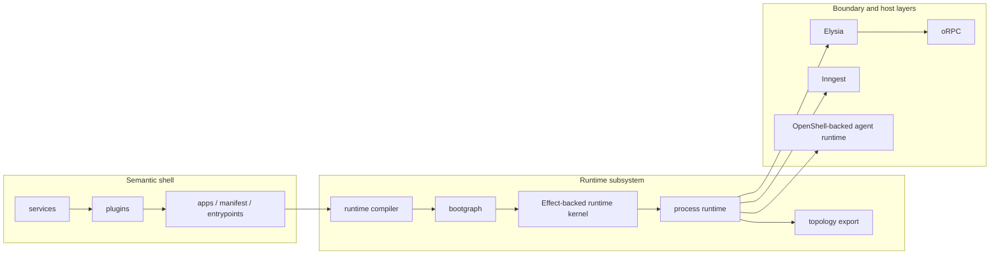
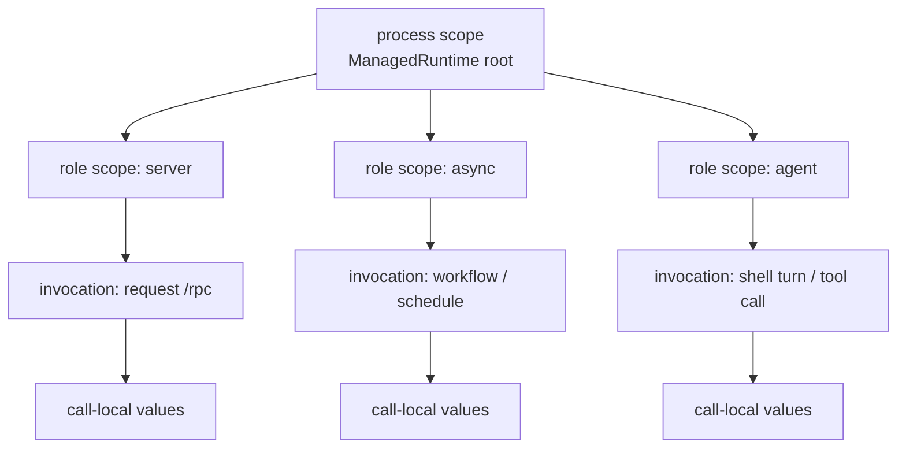
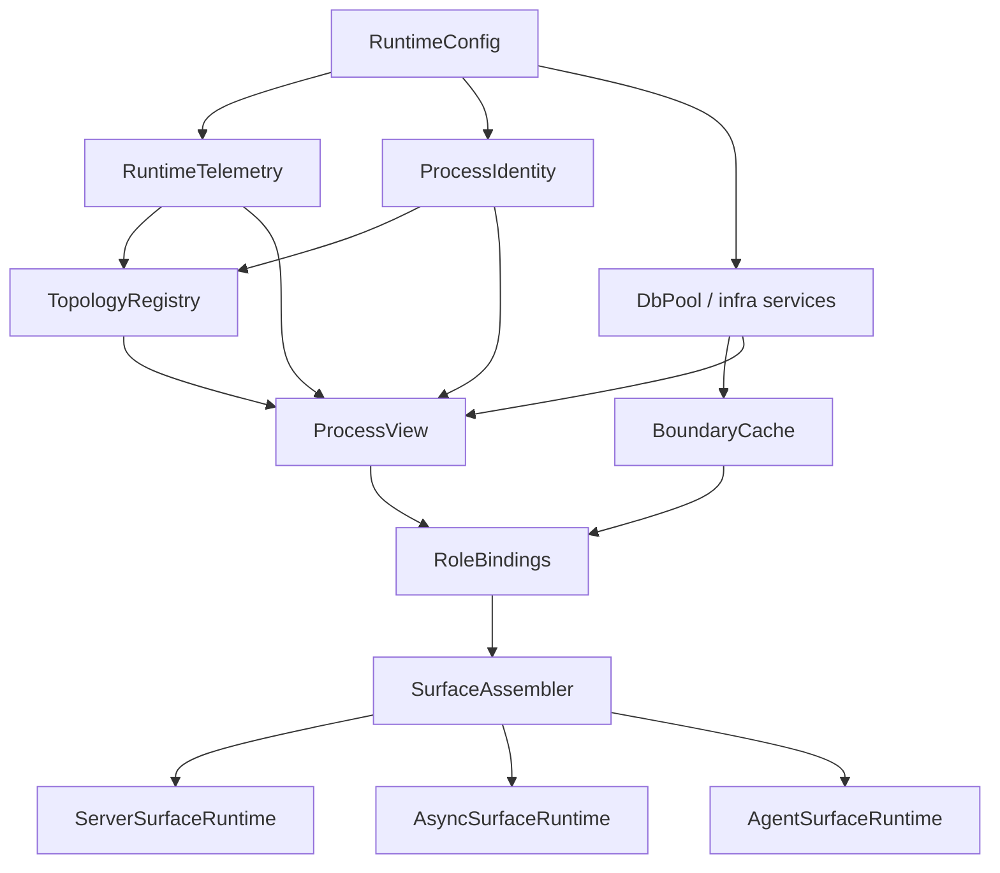
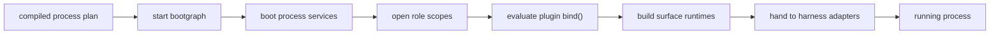
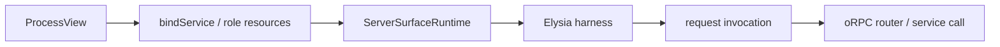
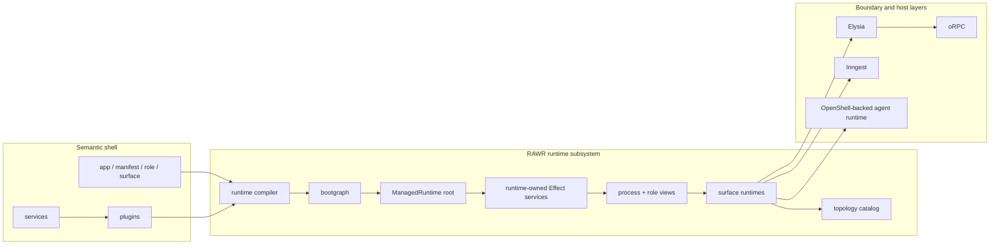

# RAWR Effect Runtime Subsystem Specification

## 1. Scope

This specification defines the canonical runtime subsystem for RAWR.

It fixes:

- the role of the runtime subsystem within the platform
- the ownership boundary between semantic architecture and process-local execution
- the package topology for runtime realization
- the process, role, invocation, and call-local lifetime model
- the canonical use of Effect inside the runtime subsystem
- the resource, config, schema, observability, and error model for runtime-owned concerns
- the bootgraph lowering model
- the process-runtime model
- the service-boundary provisioning model at the runtime edge
- the integration seams with plugins, apps, oRPC, Elysia, Inngest, OpenShell, and topology export
- the canonical public and internal APIs for the subsystem
- the invariants and forbidden patterns that keep the subsystem narrow, durable, and legible

The runtime subsystem is the hidden process-local execution kernel beneath the public RAWR shell.

The stable architecture remains:

```text
app -> manifest -> role -> surface
```

The runtime subsystem exists to realize that architecture into running software through the following operational chain:

```text
entrypoint
  -> runtime compiler
  -> bootgraph
  -> process runtime
  -> harness
  -> process
```

The runtime subsystem is implemented on Effect.

That implementation choice is canonical inside the subsystem.
It is not a peer public ontology layer beside packages, services, plugins, or apps.

---

## 2. Runtime subsystem role

The runtime subsystem has one job:

```text
turn a selected app role-set into one started, typed, observable, stoppable process
```

It does that by taking compiled process intent from the semantic shell and turning it into:

- acquired process resources
- acquired role resources
- stable process and role runtime views
- mounted surface runtimes
- harness inputs
- topology metadata
- deterministic shutdown

The runtime subsystem exists because there is a real difference between:

```text
what belongs to an app
```

and

```text
what must be acquired, assembled, mounted, and later disposed inside one process
```

The runtime subsystem solves the following platform problems:

1. deterministic process-local resource lifecycle
2. typed dependency and context realization
3. shared process resources versus role-local resources
4. service-boundary provisioning from booted resources
5. surface assembly and harness handoff
6. process-level logging, metrics, tracing, and diagnostic export
7. safe startup failure and safe shutdown
8. local concurrency coordination that does not leak into business semantics

The runtime subsystem does not solve:

- business capability truth
- plugin meaning
- manifest authority
- public API semantics
- durable workflow semantics
- repo governance
- agent governance
- platform deployment topology

Those remain outside the subsystem.

---

## 3. Canonical stance

The canonical stance is:

```text
RAWR owns semantic meaning.
Effect owns execution mechanics.
Boundary frameworks keep their jobs.
```

That becomes the following rules.

### 3.1 What stays public and RAWR-shaped

The public authoring language remains:

- service
- plugin
- app
- manifest
- role
- surface
- process module
- role module
- bind
- bindService

The public bootgraph shell remains RAWR-shaped.

The runtime subsystem must not require ordinary service, plugin, or app authors to write raw:

- `Layer`
- `Context.Tag`
- `ManagedRuntime`
- `Scope`
- `FiberRef`
- `Cache`
- `Queue`
- `PubSub`
- `Schedule`

Those are internal subsystem tools.

### 3.2 What becomes Effect-backed

The runtime subsystem uses Effect for:

- runtime ownership
- resource acquisition and release
- dependency provision
- lifecycle scoping
- internal service construction
- config loading
- schema-backed runtime data
- tagged runtime errors
- process-local caching and coordination primitives
- logging, metrics, tracing, and runtime annotations

### 3.3 What does not move into Effect right now

The runtime subsystem does not use Effect as the canonical owner for:

- service boundaries
- public callable API contracts
- durable workflow orchestration
- server HTTP boundary semantics
- cross-process execution semantics

That means:

- oRPC remains the canonical service and callable boundary
- Inngest remains the canonical durable async harness
- Elysia remains the default server harness
- OpenShell remains the shell/runtime substrate beneath the `agent` role

Effect stays underneath those seams.

### 3.4 One managed runtime per process

Each started process owns exactly one root `ManagedRuntime`.

That runtime:

- owns process-lifetime resources
- owns runtime-level context and annotations
- owns process disposal
- may create role-local child scopes
- may host multiple roles in a cohosted process shape

There is no second peer runtime engine inside the same process.

---

## 4. Ownership boundary

### 4.1 What the runtime subsystem owns

The runtime subsystem owns:

- process-local lifecycle execution
- runtime-owned config loading and validation
- runtime-owned schema and diagnostics payloads
- process and role scope management
- process and role runtime views
- bootgraph execution policy
- resource dedupe and deterministic start/stop
- internal binding caches
- process-local coordination primitives
- topology metadata accumulation
- surface runtime assembly
- harness handoff
- process stop semantics

### 4.2 What the runtime subsystem does not own

The runtime subsystem does not own:

- service contract design
- service business logic
- plugin capability meaning
- app membership decisions
- role naming
- surface naming
- public HTTP contract shape
- durable workflow semantics
- external queue durability
- multi-process control-plane logic
- platform service configuration
- repo worktree governance
- shell-level policy decisions

### 4.3 Canonical system boundary



The runtime subsystem begins at the runtime compiler input and ends at harness handoff.

---

## 5. Package topology

The runtime subsystem is one subsystem with multiple packages.
Its execution family is consolidated under `packages/runtime/*`.
Public authoring and app-runtime APIs remain in `packages/hq-sdk` above that execution family.

The canonical topology is:

```text
packages/
  runtime/
    bootgraph/               public RAWR lifecycle shell
    compiler/                manifest -> compiled process plan
    substrate/               hidden Effect-backed kernel
      src/
        effect/
        services/
        config/
        schema/
        errors/
        observability/
        coordination/
        process-runtime/
    harnesses/
      elysia/
      inngest/
      web/
      cli/
    topology/                runtime topology and export shapes
```

### 5.1 `packages/runtime/bootgraph`

`packages/runtime/bootgraph` is the public lifecycle shell.

It owns:

- process and role module definitions
- canonical module identity
- dependency declaration
- deterministic start order
- fatal startup failure policy
- rollback policy
- reverse shutdown policy
- lowering from RAWR-shaped modules to the hidden substrate plan

It does not expose raw Effect types in its public shell.

### 5.2 `packages/runtime/compiler`

`packages/runtime/compiler` is the hidden compiler from semantic composition to runtime plan.

It owns:

- role selection
- process-module collection
- role-module derivation
- lowering of plugin `bind(...)` output into role-resource plans
- surface plan derivation
- topology stamping
- compiled process plan output

It does not own acquisition, resource cleanup, or runtime disposal.

### 5.3 `packages/runtime/substrate`

`packages/runtime/substrate` is the hidden Effect-backed kernel.

It owns:

- Effect service definitions for runtime-owned concerns
- layer construction and memoization
- managed-runtime creation and disposal
- scope creation and child-scope management
- tagged runtime errors
- runtime-owned schemas and config loading
- process-local cache, queue, pubsub, and scheduling utilities
- internal resource stores and registries
- process-runtime assembly helpers

This package is the deepest runtime package.

### 5.4 `packages/runtime/harnesses/*`

The harness packages are adapters that consume booted runtime views and mounted surface runtimes.

They own:

- host-specific mounting
- ingress wiring
- host-specific normalization
- lifecycle hooks at the host edge

They do not own runtime semantics or process resource acquisition.

### 5.5 `packages/runtime/topology`

The topology package owns:

- topology-node schemas
- runtime-catalog schemas
- export helpers
- stable diagnostic and inspection payload shapes

The runtime subsystem writes topology.
The topology package gives that topology a stable exported shape.

---

## 6. Runtime-owned nouns

The following nouns are canonical inside the runtime subsystem.

```text
runtime service      = internal Effect-backed service owned by the runtime subsystem
process scope        = the lifetime enclosing one started process
role scope           = the lifetime enclosing one mounted role inside one process
runtime view         = RAWR-shaped stable view exposed to plugins and harnesses
resource module      = public RAWR lifecycle module lowered into runtime acquisition work
surface runtime      = mounted role-specific runtime object consumed by a harness
runtime catalog      = exported topology and runtime metadata snapshot
runtime annotation   = internal per-execution contextual metadata carried through FiberRefs
```

These are runtime-subsystem nouns.
They are not new top-level architecture kinds.

---

## 7. Effect adoption model

The runtime subsystem adopts Effect deeply enough that the subsystem genuinely uses Effect as its execution kernel rather than as a thin helper library.

### 7.1 Mandatory Effect capabilities

| Effect capability | Adoption level | Canonical role in the subsystem |
| --- | --- | --- |
| `ManagedRuntime` | mandatory | root process runtime ownership and disposal |
| `Layer` | mandatory | construction graph for runtime-owned services |
| `Effect.Service` | mandatory | primary form for runtime-owned long-lived services |
| `Scope` / `acquireRelease` | mandatory | resource lifetime and finalization |
| `Data.TaggedError` | mandatory | structured runtime errors |
| `Config` / `ConfigProvider` / `Config.redacted` | mandatory | runtime-owned config loading and secrets |
| `Schema` / `Schema.Config` | mandatory | runtime-owned schemas and typed config decoding |
| `Schema.standardSchemaV1` | mandatory | runtime-owned Standard Schema bridge |
| `JSONSchema.make` | mandatory | runtime-owned JSON Schema export |
| `Cache` | mandatory | memoized service binding and expensive runtime-owned lookups |
| `FiberRefs` | mandatory | correlation, role, surface, and topology annotations |
| Logging / Metrics / Tracing | mandatory | process-level observability substrate |

### 7.2 Standard internal Effect capabilities

| Effect capability | Adoption level | Canonical role in the subsystem |
| --- | --- | --- |
| `Queue` | standard | process-local point-to-point work handoff |
| `PubSub` | standard | process-local broadcast of runtime state |
| `Schedule` | standard | bounded retry, refresh, heartbeat, and local loop cadence |
| `Ref` / `SynchronizedRef` | standard | runtime-owned registries and mutable state |
| `Semaphore` | standard | local concurrency caps for runtime-owned flows |
| `Layer.memoize` | standard | explicit memoization where process-sharing matters |

### 7.3 Allowed platform capabilities

Platform modules such as filesystem, terminal, command, key-value, path, or platform-specific integrations may be wrapped by runtime-owned services where they are genuinely process resources.

They remain downstream helpers.
They do not become public architecture.

### 7.4 Capabilities that are not canonical subsystem owners

The runtime subsystem does not promote the following Effect families into the canonical boundary stack:

- Effect HTTP API as the public server contract layer
- Effect HTTP Server as the primary server harness
- Effect RPC as the primary service boundary
- Effect workflow or cluster as the durable workflow engine
- Effect CLI as the primary CLI boundary abstraction

Those families may still exist in the ecosystem.
They are not the canonical owners of those jobs in RAWR.

### 7.5 `Effect.Service` versus `Context.Tag`

Inside the runtime subsystem:

- prefer `Effect.Service` for long-lived runtime-owned services
- use `Context.Tag` only for low-level tokens or abstractions that do not deserve a generated layer and default constructor

`Effect.Service` is canonical for runtime-owned providers because it combines:

- service identity
- default layer construction
- dependency declaration
- optional accessors
- optional scoped lifetime

That is exactly what the runtime subsystem needs for process resources and runtime-owned infrastructure.

---

## 8. Resource and lifetime model

The runtime subsystem owns four distinct lifetimes.

```text
process
role
invocation
call-local
```

### 8.1 Process lifetime

A process resource is acquired once per started process and is shared by all mounted roles in that process.

Typical process resources:

- validated runtime config
- logger root
- tracer root
- metrics registry
- process identity
- database pool
- workspace or repo root
- topology registry
- boundary cache
- runtime queue hub
- runtime pubsub hub
- async activation handle
- agent runtime handle

### 8.2 Role lifetime

A role resource is acquired once per mounted role inside a process.

Typical role resources:

- bound service clients
- role-local policy/config selections
- role-local caches
- surface-specific helpers
- role-local machine tools
- role-local route builders
- role-local workflow bundles

### 8.3 Invocation lifetime

Invocation context is per request, per call, or per execution.

Typical invocation values:

- auth claims
- request identifiers
- correlation ids
- route parameters
- workflow trigger input
- user-selected target identity

Invocation context is not a process resource and not a role resource.
It is supplied at the harness edge.

### 8.4 Call-local lifetime

Call-local values exist only inside one handler, one effect chain, or one step of execution.

Typical call-local values:

- a decoded payload
- a derived repository instance built from `provided.sql`
- a temporary capability handle
- a transaction-local object

### 8.5 Scope nesting



The canonical rule is:

```text
process resources may flow down
role resources may flow down
invocation values may not flow up
call-local values may not escape their execution chain
```

### 8.6 `provided.*` stays execution-local

The runtime subsystem preserves the service-boundary rule that `provided.*` is execution-time middleware output.

It is not:

- a process resource bag
- a role resource bag
- a package-boundary construction bag

The runtime subsystem constructs `deps`, `scope`, and `config`.
Service middleware constructs `provided.*`.

---

## 9. Runtime-owned services

The runtime subsystem defines a standard set of runtime-owned services.

### 9.1 Foundation services

| Service | Lifetime | Purpose |
| --- | --- | --- |
| `RuntimeConfig` | process | validated runtime configuration root |
| `ProcessIdentity` | process | app id, entrypoint, role set, instance identifiers |
| `RuntimeTelemetry` | process | logger root, tracer root, metrics registry |
| `RuntimeAnnotations` | process + FiberRefs | per-execution correlation and structural labels |
| `TopologyRegistry` | process | topology node accumulation and export |
| `BoundaryCache` | process | memoized service binding and client construction |

### 9.2 Process infrastructure services

These are app-selected and only exist when the process plan requires them.

| Service | Lifetime | Purpose |
| --- | --- | --- |
| `DbPool` | process | database pool or equivalent SQL capability |
| `WorkspaceRoot` | process | workspace root and related identity |
| `RepoRoot` | process | repo root where required |
| `FileSystemRuntime` | process | process-local filesystem capability when needed |
| `CommandRuntime` | process | process-local command execution capability when needed |
| `AsyncActivation` | process | activation handle into the durable async plane |
| `AgentRuntimeHandle` | process | machine-facing capability root for agent role |

### 9.3 Role services

Role services are derived from process services after the selected role set is known.

| Service | Lifetime | Purpose |
| --- | --- | --- |
| `RoleIdentity` | role | role name and role-local structural identity |
| `RoleBindings` | role | bound service clients and role-local resources |
| `SurfaceAssembler` | role | build mounted surface runtime from bound role resources |
| `RoleQueueHub` | role | role-local queue resources where needed |
| `RolePubSubHub` | role | role-local broadcasts where needed |

### 9.4 Canonical dependency graph



The graph is illustrative, not exhaustive.
The canonical direction is still the same:

```text
foundation services
  -> process infrastructure services
  -> process view
  -> role bindings
  -> surface assembly
  -> harness mount
```

### 9.5 Registry and state services

When runtime-owned mutable state is needed, the canonical tools are:

- `Ref` for simple state
- `SynchronizedRef` when coordinated updates are needed
- `Cache` for lazy memoized results
- `Queue` for point-to-point handoff
- `PubSub` for broadcasts

The runtime subsystem must not create ad hoc module-level global singletons.

### 9.6 Canonical runtime-service declaration pattern

Illustrative shape:

```ts
import { Config, Data, Effect, Schema } from "effect"

class RuntimeConfigError extends Data.TaggedError("RuntimeConfigError")<{
  readonly reason: string
}> {}

export class RuntimeConfig extends Effect.Service<RuntimeConfig>()(
  "rawr/runtime/RuntimeConfig",
  {
    scoped: Effect.gen(function* () {
      const config = yield* Config.all({
        env: Schema.Config("NODE_ENV", Schema.Literal("development", "test", "production")),
        port: Schema.Config("PORT", Schema.NumberFromString),
        databaseUrl: Config.redacted("DATABASE_URL")
      }).pipe(
        Effect.mapError((cause) =>
          new RuntimeConfigError({ reason: String(cause) })
        )
      )

      return config
    })
  }
) {}
```

The canonical properties of this pattern are:

- runtime-owned service identity
- one default layer
- structured config loading
- structured error type
- scoped lifetime when needed

---

## 10. Configuration and schema system

The runtime subsystem owns runtime configuration and runtime-owned schemas.

### 10.1 Runtime config ownership

Runtime-owned config includes:

- process identity config
- harness config
- observability config
- database or infrastructure connection config
- internal retry / refresh / timeout config
- feature flags for runtime-owned behavior

Runtime-owned config does not include service business config unless the app explicitly chooses to derive that service config from runtime config during plugin binding.

### 10.2 Canonical config rules

1. runtime config is loaded once per process
2. runtime config is validated once per process
3. secrets are redacted at the config layer
4. plugins and services do not read env vars directly
5. runtime config becomes a process resource and is distributed downward
6. role-local config selection derives from process config, not the other way around

### 10.3 Effect Schema inside the subsystem

Effect Schema is canonical for runtime-owned data.

That includes:

- runtime config shapes
- harness config shapes
- topology-node shapes
- runtime catalog export shapes
- bootgraph diagnostic payloads
- health and readiness payloads
- local queue and pubsub message envelopes owned by the runtime subsystem

The runtime subsystem uses Effect Schema for three jobs:

1. runtime validation and decoding
2. type projection for internal TypeScript safety
3. external export of Standard Schema v1 and JSON Schema when tooling, diagnostics, or downstream consumers need it

### 10.4 Schema ownership split

The runtime subsystem owns schemas for runtime-owned concerns.

Service packages still own schemas for service semantics.
The runtime subsystem does not take service schema ownership away from services.

### 10.5 Standard Schema and JSON Schema export

The runtime subsystem may export runtime-owned schemas as:

- Standard Schema v1 for interoperable schema consumers
- JSON Schema for docs, diagnostics, control-plane UIs, or validation tooling

That export is especially useful for:

- runtime config editors
- topology inspectors
- health/readiness viewers
- generated diagnostic tooling

### 10.6 Canonical schema modules

The runtime subsystem should maintain explicit schema modules such as:

```text
packages/runtime/substrate/src/schema/
  runtime-config.ts
  harness-config.ts
  bootgraph.ts
  topology-node.ts
  runtime-catalog.ts
  health.ts
```

### 10.7 Runtime config and service config relationship

The runtime subsystem does not merge runtime config and service config into one undifferentiated bag.

The correct flow is:

```text
runtime config -> process resource
process resource -> plugin bind() / bindService()
plugin bind() / bindService() -> service config lane
service middleware -> provided.*
```

That keeps ownership legible.

### 10.8 Secrets and redaction

Secrets handled by the runtime subsystem must be redacted at the config layer.

They may be revealed only inside the specific acquisition effect that needs them.
They must not be serialized into topology export, logs, tagged runtime errors, or health payloads.

---

## 11. Error, observability, and runtime annotations

### 11.1 Tagged runtime errors

Runtime errors are canonical tagged errors.

The minimum error family includes:

- `RuntimeConfigError`
- `BootModuleConflictError`
- `BootDependencyCycleError`
- `BootModuleStartError`
- `RoleBindingError`
- `SurfaceBuildError`
- `HarnessMountError`
- `CatalogExportError`

Illustrative shape:

```ts
import { Data } from "effect"

export class BootModuleStartError extends Data.TaggedError("BootModuleStartError")<{
  readonly key: ResourceKey
  readonly reason: string
}> {}
```

### 11.2 Error translation rule

The runtime subsystem keeps its internal errors structured and typed.

At subsystem boundaries:

- harness adapters translate runtime errors into host-appropriate startup failures or diagnostics
- the runtime subsystem does not leak raw internal error causes into public service contracts

### 11.3 Canonical observability posture

The runtime subsystem provides a common process-level observability substrate.

It owns:

- logger root
- tracer root
- metrics registry
- process/role/surface annotations
- boot/start/stop spans
- resource acquisition/release spans
- role binding spans
- harness mount spans
- health/diagnostic export metrics

### 11.4 Runtime annotations and FiberRefs

The runtime subsystem uses internal per-execution annotations to carry:

- app id
- selected role
- surface family
- capability when known
- process instance id
- correlation id
- topology node id when relevant

Those annotations are carried through internal `FiberRefs` so that runtime-owned logs, spans, and metrics can be consistently labeled without exposing a new public authoring model.

### 11.5 Metrics and logging rules

The runtime subsystem must emit metrics and logs for:

- process boot success/failure
- module start/stop latency
- resource acquisition failure
- role binding cache hits/misses
- queue depth where queues are used
- pubsub subscriber counts where relevant
- harness mount success/failure
- shutdown completion

The subsystem must not require services to know about its internal metric names.

---

## 12. Bootgraph and lowering model

### 12.1 Public bootgraph shell

The public bootgraph shell is resource-oriented and minimal.

```ts
export type AppRole = "server" | "async" | "web" | "cli" | "agent"

export interface ResourceKey {
  id: string
  lifetime: "process" | "role"
  role?: AppRole
  purpose: string
  capability?: string
  surface?: string
  instance?: string
}

export interface ModuleStartContext<ReadCtx extends object, OwnSlice extends object = {}> {
  readonly current: ReadCtx
  set(slice: OwnSlice): void
}

export interface ModuleStopContext<ReadCtx extends object> {
  readonly current: ReadCtx
}

export interface ResourceModule<ReadCtx extends object, OwnSlice extends object = {}> {
  key: ResourceKey
  dependsOn?: readonly ResourceModule<any, any>[]
  start(ctx: ModuleStartContext<ReadCtx, OwnSlice>): Promise<OwnSlice | void> | OwnSlice | void
  stop?(ctx: ModuleStopContext<ReadCtx & OwnSlice>): Promise<void> | void
}
```

The public APIs remain:

```ts
export const defineProcessModule = ...
export const defineRoleModule = ...
export const startBootGraph = ...
```

### 12.2 Bootgraph responsibilities

Bootgraph owns:

- module identity
- dependency graph resolution
- deterministic ordering
- dedupe by canonical identity
- fatal startup failure policy
- rollback of successfully started resources on later failure
- reverse shutdown order
- lowering to the hidden Effect-backed plan

Bootgraph does not own:

- manifest authority
- plugin discovery
- surface meaning
- harness semantics
- public boundary semantics

### 12.3 Lowering principle

The lowering principle is:

```text
RAWR plans.
Effect executes.
```

RAWR still decides:

- which modules exist
- how identity is represented
- how siblings are ordered
- what constitutes a process versus role resource
- when startup failure is fatal

Effect handles:

- actual acquisition
- actual release
- scope ownership
- dependency provision
- runtime disposal

### 12.4 Canonical internal lowering

Each `ResourceModule` lowers into one internal runtime node whose acquisition is implemented with Effect-managed lifecycle.

Illustrative shape:

```ts
import { Data, Effect, Layer } from "effect"

class BootModuleFailed extends Data.TaggedError("BootModuleFailed")<{
  readonly key: ResourceKey
  readonly reason: string
}> {}

function lowerModule(module: ResourceModule<any, any>) {
  return Layer.scoped(
    moduleTag(module.key),
    Effect.acquireRelease(
      Effect.gen(function* () {
        const ctx = yield* CurrentBootContext
        const mutable = createMutableBootContext(ctx)

        const slice = yield* Effect.tryPromise({
          try: () => Promise.resolve(module.start(mutable)),
          catch: (error) =>
            new BootModuleFailed({
              key: module.key,
              reason: String(error)
            })
        })

        if (slice) mutable.set(slice)
        return readonlySliceFor(module.key, mutable.current)
      }),
      () =>
        Effect.gen(function* () {
          if (module.stop) {
            const ctx = yield* CurrentBootContext
            yield* Effect.tryPromise({
              try: () => Promise.resolve(module.stop!(createReadonlyBootContext(ctx))),
              catch: (error) =>
                new BootModuleFailed({
                  key: module.key,
                  reason: String(error)
                })
            })
          }
        })
    )
  )
}
```

The exact internal helpers may vary.
The invariants may not.

### 12.5 Deterministic order and memoization

The runtime subsystem may use `Layer` composition and memoization internally.
It still must preserve RAWR’s explicit deterministic boot policy.

That means:

- do not treat evaluation order as an accidental property of layer merging
- do not allow implicit construction order to replace the bootgraph plan
- do not rely on import order or object key order for module sequencing

### 12.6 Fatal startup remains canonical

If the selected process shape cannot start correctly, the process does not become partially live.

Bounded retries for a specific resource are allowed inside that resource’s acquisition logic.
Once the acquisition has finally failed, startup fails and the runtime subsystem tears down already-started resources.

---

## 13. Binding and service-boundary realization

### 13.1 The key seam

The most important seam in the runtime subsystem is the boundary between:

- booted process/role resources
- role-local bound service clients
- mounted surface code

The canonical rule is:

```text
plugins describe binding
runtime subsystem performs binding
services receive canonical boundary bags
```

### 13.2 Canonical lane ownership

| Lane | Owner | Lifetime |
| --- | --- | --- |
| `deps` | runtime subsystem | process or role |
| `scope` | runtime subsystem | process or role |
| `config` | runtime subsystem + app/plugin decisions | process or role |
| `invocation` | harness adapter | invocation |
| `provided` | service middleware and providers | execution only |

### 13.3 `bind(...)`

Plugin `bind(...)` is the common public authoring path for role-local long-lived resources derived from process resources.

Canonical shape:

```ts
bind({ process, role }) {
  return {
    someResource: ...
  }
}
```

The runtime compiler lowers `bind(...)` output into role-resource acquisition work.

### 13.4 `bindService(...)`

`bindService(...)` is the canonical bridge from booted runtime views to service-boundary clients.

Canonical shape:

```ts
bindService(createClient, {
  deps({ process, role }) {
    return { ... }
  },
  scope({ process, role }) {
    return { ... }
  },
  config({ process, role }) {
    return { ... }
  }
})
```

`bindService(...)` must:

- produce the canonical `{ deps, scope, config }` boundary
- construct the service client from the service package’s `createClient(...)`
- memoize the result per role scope unless explicitly stated otherwise
- never seed `provided` at boundary-construction time
- never bypass service package boundaries

### 13.5 Canonical binding cache

Bound service clients and other expensive role-local bindings are cached with `Effect.Cache` or equivalent scoped memoization.

The canonical cache key includes enough identity to prevent accidental aliasing.

At minimum that means:

- capability
- role
- process instance identity
- binding identity when multiple distinct instances exist

The cache is process-local.
It is not a cross-process registry.

### 13.6 Stable process and role views

The runtime subsystem exposes RAWR-shaped views.

```ts
export interface ProcessView {
  appId: string
  config: AppRuntimeConfig
  telemetry: RuntimeTelemetryView
  identity: ProcessIdentityView
  topologyCatalog: RuntimeCatalogHandle
  [resource: string]: unknown
}

export interface RoleView<TRole extends AppRole = AppRole> {
  role: TRole
  process: ProcessView
  [resource: string]: unknown
}
```

These views are what plugins and harnesses consume.

They must not expose:

- raw `Layer`
- raw `Scope`
- raw `ManagedRuntime`
- raw internal caches
- raw internal registries

### 13.7 Canonical binding implementation sketch

Illustrative shape:

```ts
import { Cache, Effect } from "effect"

export function bindService<TClient>(
  createClient: (boundary: {
    deps: object
    scope: object
    config: object
  }) => TClient,
  binding: ServiceBinding<any>
) {
  return defineRoleBinding({
    kind: "service-client",

    scoped: Effect.gen(function* () {
      const process = yield* ProcessViewService
      const role = yield* RoleViewService
      const cache = yield* BoundaryCache

      return yield* Cache.get(cache.serviceClients, {
        capability: binding.capability,
        role: role.role,
        processId: process.identity.instanceId
      }).pipe(
        Effect.orElseSucceed(() =>
          createClient({
            deps: binding.deps({ process, role }),
            scope: binding.scope({ process, role }),
            config: binding.config({ process, role })
          })
        )
      )
    })
  })
}
```

The exact helpers may vary.
The semantics may not.

### 13.8 Execution-time provider rule

The runtime subsystem must never collapse the service-boundary distinction and re-merge:

- construction-time `deps`
- execution-time `provided`

That line stays hard.

---

## 14. Process runtime and surface assembly

### 14.1 Purpose

The process runtime is the thin RAWR layer above the Effect-backed kernel and below the harness adapters.

It receives:

- compiled process plan
- started bootgraph context
- started process and role services

It produces:

- stable process and role views
- mounted surface runtimes
- topology export
- started-process handle with `stop()`

### 14.2 Canonical started-process shape

```ts
export interface StartedProcess<Ctx extends object = {}> {
  ctx: Ctx
  surfaces: {
    server?: ServerSurfaceRuntime
    async?: AsyncSurfaceRuntime
    web?: WebSurfaceRuntime
    cli?: CliSurfaceRuntime
    agent?: AgentSurfaceRuntime
  }
  topology: RuntimeTopology
  exportCatalog(): Promise<RuntimeCatalog>
  stop(): Promise<void>
}
```

### 14.3 Process-runtime responsibilities

The process runtime owns:

- exposing process view
- creating role views
- evaluating plugin bindings in role scope
- assembling surface runtime inputs
- turning compiled surface plans into mounted runtime objects
- carrying topology through to export
- exposing one stop seam that tears down the process root runtime

### 14.4 What it does not own

The process runtime does not own:

- business routes
- workflow business logic
- shell semantics
- command semantics
- service procedure logic
- durable orchestration semantics

### 14.5 Canonical assembly sequence



### 14.6 Surface assembly rule

Surface runtimes are built from role-local bindings and role-local surface plans.

The canonical direction is:

```text
process resources
  -> role resources
  -> surface runtime
  -> harness mount
```

Not the reverse.

---

## 15. Harness integration

### 15.1 Server harness

The server harness consumes `ServerSurfaceRuntime` and mounts:

- published routes
- internal routes
- health/readiness where earned

The runtime subsystem provides booted resources and surface runtime.
The harness provides request-shaped invocation context.



### 15.2 Async harness

The async harness consumes `AsyncSurfaceRuntime` and mounts:

- workflow functions
- schedules
- consumers

The runtime subsystem provides booted resources, workflow bundles, and stable role resources.
Inngest remains the owner of durable scheduling, retries, and step persistence.

### 15.3 Agent harness

The agent harness consumes `AgentSurfaceRuntime` and mounts:

- channels
- shell
- tools

The runtime subsystem provides booted resources such as:

- topology catalog
- async activation handle
- agent runtime handle
- any machine-facing process resources selected by the app

OpenShell-backed runtime remains the owner of shell-specific execution semantics.

### 15.4 Web and CLI harnesses

Web and CLI harnesses follow the same runtime-subsystem contract:

- runtime subsystem boots resources
- runtime subsystem builds surface runtime
- harness mounts and provides invocation input where needed

### 15.5 Harness-edge wrappers only

A harness may add a small wrapper for:

- context bootstrap
- correlation propagation
- host-specific normalization

It must not become a second execution plane or a shadow runtime subsystem.

---

## 16. Local coordination and in-memory primitives

The runtime subsystem is allowed to use process-local coordination primitives where they solve local process problems.

### 16.1 `Queue`

Use `Queue` for:

- local ingress buffering
- local bounded handoff between runtime-owned loops
- host-adapter backpressure inside one process

Do not use `Queue` for:

- durable business workflows
- cross-process orchestration
- replacing Inngest

### 16.2 `PubSub`

Use `PubSub` for:

- topology update broadcasts
- runtime state changes
- config-reload notifications
- health-state fanout inside one process

Do not use `PubSub` as a cross-process message bus.

### 16.3 `Schedule`

Use `Schedule` for:

- bounded acquisition retries
- token refresh cadence
- local heartbeat loops
- health poll cadence
- cache refresh or warmup policies

Do not use `Schedule` as a substitute for durable domain scheduling.

### 16.4 `Cache`

Use `Cache` for:

- bound service client memoization
- expensive role-local helper construction
- runtime-owned remote handle reuse

Cache entries remain process-local unless a narrower role-local cache is required.

### 16.5 `Ref` and `SynchronizedRef`

Use `Ref` or `SynchronizedRef` for runtime-owned registries and mutable runtime state.

Do not use ambient module globals.

---

## 17. Scaling and topology

### 17.1 Process-local scope of authority

The runtime subsystem is process-local.

Its in-memory primitives, caches, registries, and scopes are authoritative only inside one started process.

That means:

- one process = one root runtime
- no cross-process cache coherence promise
- no cross-process topology registry authority
- no cross-process pubsub semantics

### 17.2 Cohosted roles

When multiple roles are cohosted in one process shape, they share:

- process root runtime
- process resources
- process identity
- runtime telemetry root
- boundary cache where shared

They do not share:

- role-local resource identity
- role-local caches when scoped separately
- role-specific surface runtime objects

### 17.3 Platform mapping

The runtime subsystem does not define platform placement.
It supports platform placement.

The mapping remains:

```text
entrypoint -> platform service -> replica(s)
```

Each replica hosts one process-local runtime subsystem instance.

### 17.4 Topology export

The subsystem must be able to export a runtime catalog describing:

- app id
- selected roles
- mounted surfaces
- booted process resources
- booted role resources
- harness bindings
- selected diagnostic metadata

The exported catalog is a snapshot.
It is not a distributed control plane.

---

## 18. Public and internal APIs

### 18.1 Public APIs owned by the subsystem

The public RAWR-facing APIs are:

```ts
// bootgraph
export const defineProcessModule = ...
export const defineRoleModule = ...
export const startBootGraph = ...

// packages/hq-sdk app-runtime seam
export const startAppRole = ...
export const startAppRoles = ...

// packages/hq-sdk runtime-facing plugin helpers
export const bindService = ...
```

These APIs remain RAWR-shaped.
`packages/hq-sdk` is the public authoring and app-runtime seam; `packages/runtime/*` remains the execution family beneath it.

### 18.2 Internal APIs owned by the subsystem

The subsystem may expose internal-only APIs such as:

```ts
// packages/runtime/compiler
compileAppToProcessPlan(...)
compileRoleBindings(...)
compileSurfacePlans(...)

// packages/runtime/substrate
createManagedRuntime(...)
createProcessScope(...)
createRoleScope(...)
lowerModule(...)
createBoundaryCache(...)
createTopologyRegistry(...)
loadRuntimeConfig(...)

// process-runtime
createStartedProcess(...)
buildProcessView(...)
buildRoleView(...)
buildServerSurfaceRuntime(...)
buildAsyncSurfaceRuntime(...)
```

These are not public authoring seams.

### 18.3 No public generic DI container

The runtime subsystem must not surface a public generic DI container API.

The public shell already exists.
That shell is:

- app
- plugin
- service
- bootgraph module
- bind
- bindService

The runtime subsystem may internally use Effect’s service/context model as deeply as needed.
It may not re-export that as a competing public architecture.

---

## 19. Code sketches

### 19.1 Process resource with `Effect.Service`

```ts
import { Effect, Layer } from "effect"

export class DbPool extends Effect.Service<DbPool>()("rawr/runtime/DbPool", {
  scoped: Effect.gen(function* () {
    const config = yield* RuntimeConfig
    const telemetry = yield* RuntimeTelemetry

    const pool = yield* acquireDbPool({
      url: config.databaseUrl,
      logger: telemetry.logger
    })

    return {
      connect: () => pool.connect(),
      end: () => pool.end()
    }
  }),
  dependencies: [RuntimeConfig.Default, RuntimeTelemetry.Default]
}) {}
```

### 19.2 Runtime-owned schema export

```ts
import { JSONSchema, Schema } from "effect"

export const TopologyNodeSchema = Schema.Struct({
  app: Schema.String,
  role: Schema.String,
  surface: Schema.String,
  capability: Schema.NullOr(Schema.String),
  kind: Schema.String,
  ownerPackage: Schema.String
})

export const TopologyNodeStandard = Schema.standardSchemaV1(TopologyNodeSchema)
export const TopologyNodeJsonSchema = JSONSchema.make(TopologyNodeSchema)
```

### 19.3 Bootgraph start using `ManagedRuntime`

```ts
import { Effect, Layer, ManagedRuntime } from "effect"

export async function startBootGraph(input: StartBootGraphInput) {
  const plan = compileBootPlan(input.modules)
  const rootLayer = buildRootLayer(plan)
  const runtime = ManagedRuntime.make(rootLayer)

  try {
    const ctx = await runtime.runPromise(buildBootContext(plan))

    return {
      ctx,
      async stop() {
        await runtime.dispose()
      }
    } satisfies StartedBootGraph
  } catch (error) {
    await runtime.dispose()
    throw error
  }
}
```

### 19.4 Creating one started process

```ts
export async function startAppRole(input: {
  app: DefinedApp
  role: AppRole
  harness: RuntimeHarness
}) {
  const compiled = compileAppToProcessPlan({
    app: input.app,
    roles: [input.role]
  })

  const boot = await startBootGraph({
    modules: [...compiled.processModules, ...compiled.roleModules]
  })

  const process = await createStartedProcess({
    compiled,
    boot
  })

  await input.harness.mount(process)
  return process
}
```

### 19.5 `bindService(...)` at the plugin edge

```ts
export const exampleTodoApi = defineServerApiPlugin({
  capability: "example-todo",

  exposure: {
    internal: { contract: internalContract },
    published: { contract: publishedContract, routeBase: "/example-todo" }
  },

  bind({ process, role }) {
    return {
      exampleTodo: bindService(createExampleTodoClient, {
        deps: () => ({
          dbPool: process.dbPool,
          logger: process.telemetry.logger,
          analytics: process.telemetry.analytics,
          clock: process.clock
        }),
        scope: () => ({
          workspaceId: process.workspaceId
        }),
        config: () => ({
          readOnly: false,
          limits: { maxAssignmentsPerTask: 2 }
        })
      })
    }
  },

  routes({ resources }) {
    return createExampleTodoRoutes({
      exampleTodo: resources.exampleTodo
    })
  }
})
```

The plugin author remains in RAWR vocabulary.
The runtime subsystem performs the Effect-backed work underneath.

---

## 20. Canonical invariants

The following invariants are load-bearing.

### 20.1 Ownership invariants

- the runtime subsystem is process-local
- the runtime subsystem is implemented on Effect
- Effect remains hidden beneath RAWR-shaped public seams
- one process owns one root `ManagedRuntime`
- process resources and role resources are distinct lifetimes
- invocation context is supplied at the harness edge
- `provided.*` remains execution-time provider output

### 20.2 Boundary invariants

- oRPC remains the service boundary
- Inngest remains the durable async boundary
- harnesses consume mounted surface runtimes
- harnesses do not own process resource acquisition
- runtime subsystem does not become public API semantics

### 20.3 Schema and config invariants

- runtime-owned data uses Effect Schema
- runtime-owned config uses Effect config loading
- secrets are redacted at the config layer
- runtime subsystem may emit Standard Schema and JSON Schema for runtime-owned artifacts
- service-owned schemas remain service-owned

### 20.4 Observability invariants

- every process has one telemetry root
- runtime logs, metrics, and spans carry runtime annotations
- topology export is runtime-owned and process-local
- runtime subsystem errors are tagged and structured

### 20.5 Coordination invariants

- `Cache`, `Queue`, `PubSub`, `Schedule`, `Ref`, and related primitives are local-only unless explicitly bridged by a different system
- no in-process primitive becomes a durable business queue or durable workflow system

---

## 21. Forbidden patterns

The following are forbidden in the canonical runtime subsystem.

- exposing raw `Layer`, `Scope`, `Context.Tag`, or `ManagedRuntime` as ordinary public authoring primitives
- building a second custom lifecycle engine under bootgraph while also using Effect for lifecycle
- keeping Arc or TSDKArc as a live peer runtime engine
- replacing oRPC with runtime-subsystem service binding
- replacing Inngest with in-process queues or schedules
- re-merging `deps` and `provided`
- seeding `provided` at service-package boundary creation time
- reading env vars directly from plugins or service handlers
- using ad hoc global singletons for runtime state
- treating `Queue` or `PubSub` as durable orchestration infrastructure
- allowing harness wrappers to become a second execution plane
- exposing a public generic DI-container vocabulary as a peer architecture
- letting runtime-owned schemas become covert owners of service semantics

---

## 22. Final canonical picture



The runtime subsystem should always be read as:

```text
compile selected process intent
  -> acquire process resources
  -> acquire role resources
  -> expose RAWR-shaped runtime views
  -> bind service boundaries from booted resources
  -> build mounted surface runtimes
  -> hand them to harness adapters
  -> run one process
  -> dispose deterministically
```

The final rule is:

```text
RAWR names the world.
Effect runs the world.
The runtime subsystem is where that split becomes real.
```
