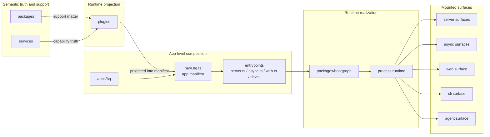
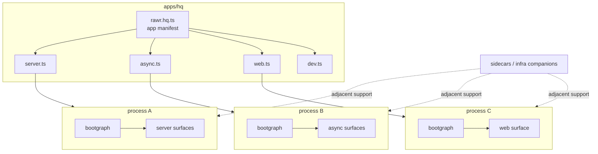
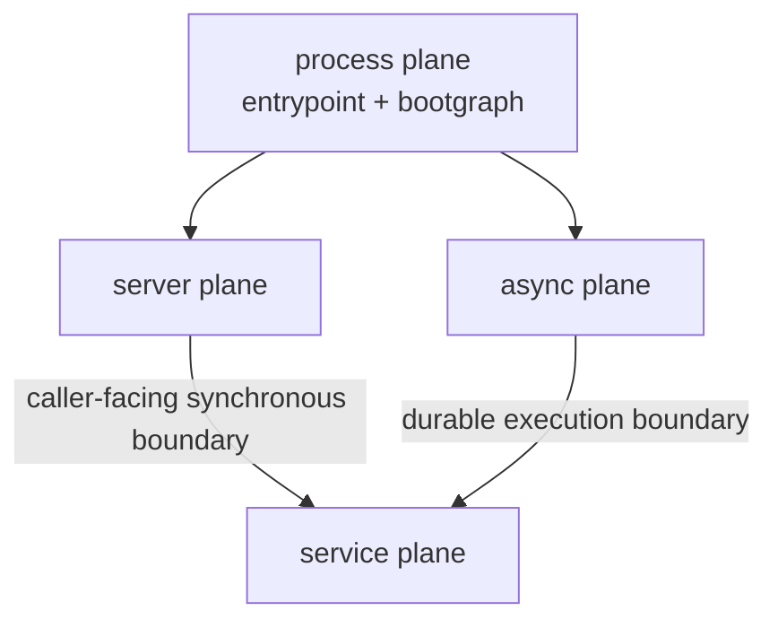
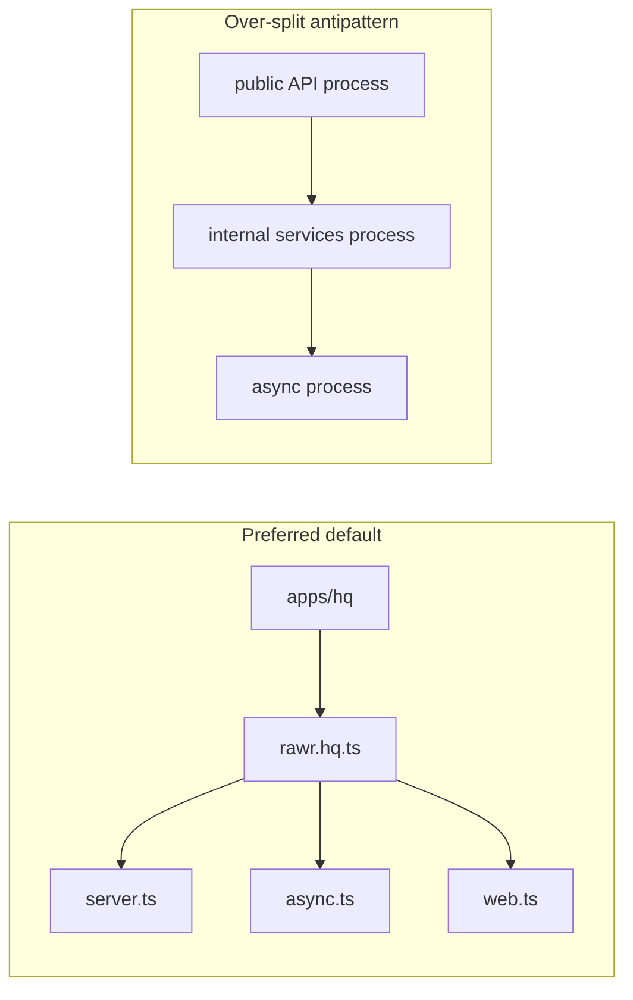
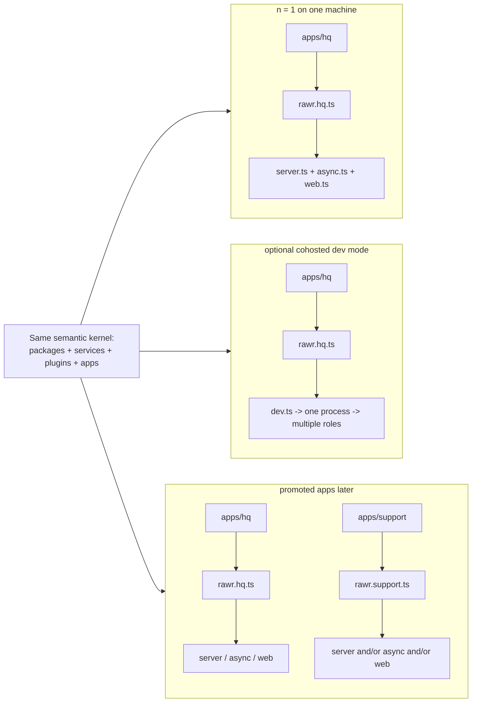
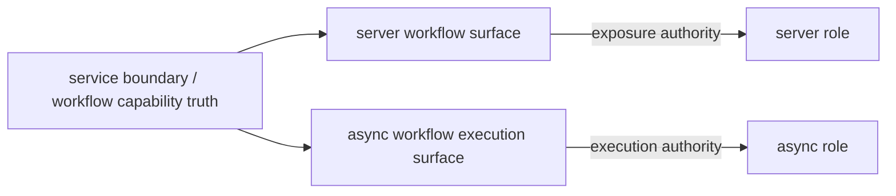
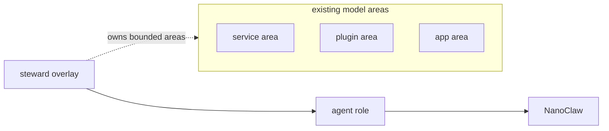

THIS DOCUMENT IS ARCHIVED. DO NOT USE IT AS A REFERENCE FOR CURRENT DECISIONS OR CONTEXT. THIS IS SOLELY A HISTORICAL OR COMPARATIVE REFERENCE.

-----

# RAWR Future Architecture

## Scope

This is the canonical future architecture for RAWR HQ and the platform shape it establishes for later apps.

It defines:

- the durable ontology
- the semantic mental model
- the app / manifest / role / surface model
- the runtime and boot model
- the default topology and scale path
- the top-level responsibility splits between `packages`, `services`, `plugins`, and `apps`

## Architecture At A Glance

The architecture rests on two durable separations.

The first is the semantic separation:

```text
support matter
  != semantic capability truth
  != runtime projection
  != app-level composition authority
```

The second is the realization separation:

```text
stable architecture
  != runtime realization
```

The stable architecture is organized as:

```text
app -> manifest -> role -> surface
```

The runtime realization that brings that architecture to life is:

```text
entrypoint -> bootgraph -> process -> machine
```

On service-centric platforms, there is one more operational mapping:

```text
entrypoint -> service -> replica(s)
```

That last line is operational mapping, not core ontology.

The point of the shell is simple: scale changes placement, not semantic meaning.



The architecture keeps the system legible to both humans and agents while becoming more mechanically enforceable over time. The point is leverage, not tidiness.

## Core Ontology

The canonical top-level architectural kinds are:

```text
packages/   pure/shared/support matter
services/   semantic capability boundaries
plugins/    runtime projections and adapters
apps/       app identities, manifests, and entrypoints
```

These are not just folder labels. They are the stable nouns that make the system understandable.

### `packages`

`packages` hold pure or shared support matter.

They may contain:

- shared types
- SDKs and helpers
- adapters and utilities
- lower-level primitives
- reusable support logic that does not itself define a first-class service boundary
- process-local lifecycle infrastructure such as `packages/bootgraph`

`packages` support other kinds. They do not own semantic capability truth, and they do not own app-level composition.

### `services`

`services` hold semantic capability truth.

A service is a contract-bearing in-process capability boundary. It owns:

- stable boundary contracts
- stable context lane structure
- service-wide middleware semantics
- service-wide assembly seams
- internal module/procedure decomposition
- business-capability truth for that boundary
- authoritative write ownership for its invariants

A service is a semantic unit first. It can be called in-process when caller and callee share a process, and it can later be called over RPC when remote, without changing what the service means.

### `plugins`

`plugins` hold runtime projection.

A plugin exists to mount, expose, adapt, orchestrate, or otherwise project capability into a runtime surface. It owns:

- role-specific integration
- transport and surface adaptation
- runtime middleware
- lifecycle participation within a booted runtime
- runtime-specific orchestration
- registration and contribution into app manifests and entrypoints

Plugins project capability truth that lives in services. They do not replace service ownership.

### `apps`

An app is the top-level product/runtime identity and code home.

It owns:

- manifest definition
- entrypoints
- runtime identity and config roots
- app-level composition authority
- role selection for each process shape
- transport and surface mounting at the process boundary

In the target-state HQ app topology:

```text
apps/hq/ = the HQ app
```

Inside an app, two app-internal constructs matter:

- the **manifest**
- the **entrypoints**

The manifest is the app-level composition file. It defines what roles and surfaces belong to the app and what shared wiring exists between them.

In the target-state HQ app topology:

```text
apps/hq/rawr.hq.ts = the HQ app manifest
```

Entrypoints are concrete executable files that boot one or more roles from the manifest.

Examples:

```text
apps/hq/server.ts
apps/hq/async.ts
apps/hq/web.ts
apps/hq/dev.ts
```

The manifest and entrypoints are app-internal. They are not new top-level ontology kinds.

### Minimal repo topology

The following tree shows the canonical target-state topology at the level where composition behavior becomes architecturally meaningful.

The important structural point is that first-level grouping follows stable semantic layers. Within `plugins`, first-level grouping follows runtime role and second-level grouping follows surface or contribution shape that changes composition behavior. Within `apps`, the structure follows app identity first and then the app's manifest and entrypoints.

```text
packages/
  bootgraph/
  shared-types/
services/
  support/
plugins/
  server/
    api/
      <capability>
    internal/
      <capability>      # only if earned
  async/
    workflows/
      <capability>
    consumers/
      <capability>
    schedules/
      <capability>
  web/
    app/
      <capability>
  agent/
    tools/
      <capability>
  cli/
    commands/
      <capability>
apps/
  hq/
    rawr.hq.ts
    server.ts
    async.ts
    web.ts
    dev.ts            # optional cohosted development entrypoint
```

At this level, the architectural differences stay visible:

- `packages` are support matter
- `services` are semantic homes
- `plugins` are runtime projections, grouped first by role and then by composition-relevant surface shape
- `apps` are app homes, with manifest and entrypoints inside them

The file tree should prioritize the stable semantic layers:

```text
app -> role -> surface
```

The file tree should not try to encode machine placement, process count, or platform topology directly. Those are runtime concerns handled by entrypoints, runtime configuration, and the bootgraph.

## Runtime and Boot Model

The runtime and boot model defines how one app manifest becomes one or more entrypoint shapes and one or more running processes.

### App manifest

An **app manifest** is the app-level composition file.

It answers:

```text
What belongs to this app?
Which roles exist in it?
Which surfaces belong to those roles?
Which shared wiring and contributions do those roles rely on?
```

In the target-state HQ app topology, that definition lives in:

```text
apps/hq/rawr.hq.ts
```

The manifest defines the app's stable semantic composition. It is the source of truth for role membership and surface composition inside that app.

The manifest should define:

- app identity
- runtime roles
- shared wiring and shared support registrations
- role contributions and mounted surfaces
- the role shapes that entrypoints are allowed to boot

The mounting runtime may still add runtime-owned adapters, context factories, or execution bridges when mounting manifest-owned surfaces at the process boundary. That does not move app-level composition authority out of the manifest.

The manifest should not define machine placement as a core architectural fact. Machine and service placement are operational mappings applied to entrypoints.

### Runtime roles

A **runtime role** is a semantic execution class inside an app.

It names a runtime responsibility, not a fixed deployable count. A role may be booted by its own entrypoint, may run alongside other roles inside one process, and may later map to its own service or machine without changing its meaning.

The canonical top-level runtime roles are:

- `server`
- `async`
- `cli`
- `web`
- `agent`

These are peer runtime roles.

These are role names, not plugin subtype names. Labels such as `api`, `workflow`, `consumer`, `command`, `tool`, or `internal` describe surface or contribution shape within a role.

#### `server`

Caller-facing synchronous boundary role.

`server` owns request/response boundary projection: public or trusted synchronous APIs, transport and auth concerns, exposure policy, and control or trigger surfaces that must answer callers synchronously.

For callable boundaries, oRPC is the default boundary harness. It shapes server-facing callable surfaces and can also be used in-process when caller and callee share a process. That does not make oRPC the boot system or the service itself; it makes oRPC the default callable harness used by `server` surfaces.

Typical server surfaces include:

- public oRPC APIs
- internal or trusted oRPC APIs when the app has genuinely earned them
- workflow trigger surfaces that acknowledge quickly and hand off execution
- health, readiness, and operator-facing server endpoints where needed

#### `async`

Non-request execution role.

`async` is the umbrella runtime role for non-request execution: workflows, schedules, consumers, background jobs, and internal execution bridges. It covers work whose caller does not wait for the full lifecycle to complete.

For business-level async work that benefits from retries, durability, scheduling, timelines, and observability, Inngest is the default durability harness. That does not mean every tiny local side effect or hot internal path must be forced through it.

The useful architectural test is whether the boundary performs work now or schedules work now. If caller latency tracks trigger latency while the real work continues on its own execution lifecycle, the responsibility belongs on `async`.

Common async surfaces include:

- durable workflow execution bundles
- consumers and event bridges
- schedules
- resident loops where justified

#### `cli`

Command execution role.

`cli` owns local or operator-facing command execution. It runs the same underlying service and plugin model in a terminal context with its own argument parsing, output formatting, and error presentation.

`cli` is a runtime role even though it does not imply a long-running network service. The CLI entrypoint is the concrete executable surface for this role.

#### `web`

Frontend runtime role.

`web` is the frontend runtime surface over the same semantic capability truth. It owns its own entrypoint, build pipeline, and client-side lifecycle. It remains part of the shared app/runtime model because it consumes the same service contracts and plugin projections as other roles.

In the baseline HQ app, `web` is part of the default runtime set and is scaffolded as its own long-running surface rather than being folded into `server`.

#### `agent`

Steward execution role.

`agent` is where bounded stewardship becomes runtime placement. Stewards execute here; NanoClaw is the runtime backend used for that execution, not a peer ontology kind. `agent` belongs beside `server`, `async`, `cli`, and `web` as a real runtime role.

In HQ, `agent` is not required for the core operational runtime stack to function, but it is a definitive future layer over that runtime stack.

### Entrypoints

An **entrypoint** is a concrete executable file that boots one or more roles from the app manifest.

It answers:

```text
Which roles from this app are being booted in this process?
```

An entrypoint should do three things:

1. read the app manifest
2. select one or more roles from that manifest
3. build and start one process-local boot input, then mount the selected surfaces

Baseline HQ entrypoints are:

```text
apps/hq/server.ts   -> boots server
apps/hq/async.ts    -> boots async
apps/hq/web.ts      -> boots web
apps/hq/dev.ts      -> boots server + async + web together
```

Additional role entrypoints such as `cli.ts` and `agent.ts` are valid when those roles are present in the app.

The durable idea is not the exact helper name under an app. The durable idea is that entrypoints select roles from the manifest and turn that role selection into one process-local boot plan.

### Bootgraph

The **bootgraph** is the process-local lifecycle engine.

It is a RAWR support package derived from Arc/`tsdkarc` core lifecycle ideas that makes runtime realization concrete.

Its home is:

```text
packages/bootgraph/
```

The bootgraph answers:

```text
Inside this one process,
what resources and runtime modules boot,
in what order,
with what lifetime,
and how do they stop safely?
```

The bootgraph owns:

- boot-module identity
- dependency graph resolution
- deterministic boot ordering
- rollback on startup failure
- reverse shutdown ordering
- typed process context assembly
- process-local and role-local lifetime semantics
- lifecycle hooks

Those lifetime and identity semantics are RAWR bootgraph policy. They should not be read as inherited Arc terminology.

The bootgraph is process-local. That is load-bearing.

It should model only these lifetimes:

```text
process
role
```

`process` means one instance shared within the current running process.
`role` means one instance owned by one mounted runtime role within the current running process.

Bundle-level or app-level intent belongs in the app manifest. Process-level instances belong in the bootgraph.

The bootgraph is infrastructure. It is not another top-level semantic layer.

### Process and machine

A **process** is the running program created by an entrypoint.

A **machine** is the physical or virtual computer/node running one or more processes.

On local development machines, `server.ts`, `async.ts`, and `web.ts` may run as separate processes on one machine. On a cohosted development entrypoint such as `dev.ts`, one process may boot multiple roles.

This yields the runtime chain:

```text
entrypoint
  -> bootgraph
  -> started role runtime
  -> mounted surfaces
  -> running process
  -> machine
```

### Operational mapping on service-centric platforms

Service-centric platforms are an operational mapping, not a core ontology kind.

On those platforms, the useful mapping is:

```text
entrypoint -> service -> replica(s)
```

The app manifest defines what the app can be.
Entrypoints define the valid process shapes.
The platform chooses which entrypoint a service runs and how many replicas of that service exist.

That means the control split is:

- the app controls roles, surfaces, manifests, and valid process shapes through entrypoints
- the platform controls build, placement, supervision, networking, and replica count

This is why service-centric platforms such as Railway fit the model cleanly rather than distorting it.

### Sidecar distinction

A sidecar is an infrastructure-support companion process, not a peer runtime role.

Examples of sidecars include:

- telemetry collectors
- reverse proxies
- log shippers
- secrets agents

`async` is not a sidecar of `server`. It is a peer application role that carries core product behavior.



## Boundary Laws

### Services define capability first

The key rule is:

```text
service boundary first
placement second
transport third
```

A service boundary is transport-neutral and placement-neutral.

The architecture should be read as four interacting planes:

```text
server plane   = caller-facing synchronous surfaces
async plane    = durable/background execution surfaces
service plane  = private callable capability boundaries used by either one
process plane  = entrypoint + bootgraph + process-local lifecycle
```

At the shell level, these planes stay distinct in tooling as well:

- `oRPC` governs caller-facing or trusted callable boundaries and may be used locally or remotely
- `Inngest` governs durable execution boundaries
- `bootgraph` governs process-local lifecycle and long-lived resource boot/shutdown
- `Nx` governs graph, policy, and mechanical enforcement

These roles are complementary. They should not be smeared into one another.

That means:

- if caller and callee share a process, they should usually be called in-process
- if the called service is remote, it can be called over RPC
- if the work is durable/background execution, it belongs on `async`
- if the concern is process-local resource lifetime, it belongs in the bootgraph



The value of the service boundary is not forced remoting. The value is one canonical capability boundary that stays semantically stable while placement changes.

### Projection and assembly laws

The ontology has a default direction:

```text
packages   -> support matter
services   -> capability truth
plugins    -> runtime projection of that truth
apps       -> app identity, manifest, entrypoints, and mount decisions
bootgraph  -> process-local lifecycle downstream of entrypoints
```

The enforceable dependency direction is:

- packages support services, plugins, and apps but do not replace service truth or app-level composition authority
- service cores depend on packages but never on plugins or apps; dependency flows outward from capability truth, not inward
- plugins depend on service contracts, service clients, and support matter but do not become upstream semantic authorities over services
- apps compose plugin projection into manifests and entrypoints but do not redefine service truth
- the bootgraph receives process-local boot inputs from entrypoints and does not own app-level composition policy

Plugins declare what they need or provide. Apps decide how those declarations are mounted into roles and surfaces. Entrypoints decide which roles boot in one process. The bootgraph realizes that process safely.

Detailed Nx tags, approved-scope policy, and lower-level import rules are downstream implementation policy, not part of this architecture.

### Plugin-service composition frontier

The governing principle is unchanged:

- semantic composition belongs in services when it is part of service truth
- plugins compose only when the composition is genuinely runtime-specific

This shell does not further specify the exact threshold for promoting a multi-service runtime composition into a composed service. That seam remains downstream unless it rises to canonical architectural significance.

### Shared infrastructure is not shared semantic ownership

```text
shared infrastructure != shared semantic ownership
```

Multiple services may share:

- an app
- a process
- a machine
- a database instance
- a connection pool
- telemetry install

That does not mean they share semantic truth or write ownership.

| Shared infrastructure may be shared | Semantic ownership remains specific |
| --- | --- |
| app | service boundary |
| process | service contracts |
| machine | write authority |
| database instance | capability truth |
| connection pool | bounded ownership |
| telemetry install | invariant ownership |

The architecture is intentionally trying to keep capability ownership crisp even when infrastructure is shared.

### Cross-service calls preserve service ownership

Cross-service interaction should go through the owning service boundary using its canonical contract or client shape.

When caller and callee share a process, default to in-process calls. When the called service is remote, use RPC.

Shared apps, shared processes, shared database instances, and shared pools do not create shared write authority. If two services require direct write authority over the same business tables or invariants, they are usually one service, or one is the canonical owner and the other goes through it or through explicitly governed projections.

## Default Topology And Scale

### Default topology stance

HQ defaults to one app:

```text
apps/hq/
```

with one manifest:

```text
apps/hq/rawr.hq.ts
```

Its baseline long-running runtime set is `server`, `async`, and `web`.

Those three roles are scaffolded as distinct entrypoints and distinct long-running process shapes from day one.

What the target-state baseline should look like:

```text
apps/hq/server.ts
apps/hq/async.ts
apps/hq/web.ts
```

Additional entrypoints remain valid for:

- `apps/hq/dev.ts` for an intentionally cohosted development process
- `apps/hq/cli.ts` for CLI execution
- `apps/hq/agent.ts` for steward execution

What the architecture should avoid as a baseline is a prematurely over-split internal-services process tier.

The preferred default mounts `server`, `async`, and `web` from one HQ app manifest while keeping them as distinct runtime roles and distinct entrypoint shapes.



The architecture should introduce a dedicated internal server surface only for concrete operational reasons. The baseline is to keep services transport-neutral, run them in-process when caller and callee share a process, use RPC when they are split across processes, and treat `server`, `async`, and `web` as the baseline HQ surfaces.

The reason this is the default is practical, not aesthetic. Promoting an internal services process too early adds latency, failure modes, config surface, debugging burden, and distributed complexity before the architecture has earned it.

### Runtime shapes from `n = 1` outward

The central scale-continuity goal is:

start simple without misrepresenting the system's architecture.

At `n = 1`, HQ can run in either of two healthy shapes:

#### Split local development shape

```text
one app
one manifest
three entrypoints
three processes
one machine
```

Example:

```text
machine: your MacBook
process 1: apps/hq/server.ts
process 2: apps/hq/async.ts
process 3: apps/hq/web.ts
```

#### Cohosted development shape

```text
one app
one manifest
one entrypoint
one process
one machine
roles booted together: server + async + web
```

Example:

```text
machine: your MacBook
process 1: apps/hq/dev.ts
```

The split local shape is the default baseline posture. The cohosted development shape remains a valid deliberate mode.

Later, the same model can separate:

- roles into separate services or machines
- apps into multiple app identities
- domain-focused apps into promoted peers of HQ

without redefining:

- service boundaries
- package meaning
- plugin meaning
- app meaning
- role meaning
- entrypoint meaning
- bootgraph meaning

That is the core scale-out property:

```text
semantic truth stays stable
while runtime placement becomes more distributed
```



Continuity is the point: the baseline HQ app may carry a fuller runtime set, while promoted peer apps may stay sparse. What changes is app count and runtime placement, not what a service, plugin, app, role, or surface means.

### Operational mapping on service-centric platforms

On service-centric platforms, the pragmatic default is one service per long-running role.

That means the common production mapping is:

```text
hq-server service -> apps/hq/server.ts
hq-async  service -> apps/hq/async.ts
hq-web    service -> apps/hq/web.ts
```

Replica scaling multiplies that exact entrypoint shape. That is why cohosted entrypoints are valid but intentionally coupled: if `dev.ts` were used as a service shape, every replica would run `server + async + web` together.

The platform should not decide role composition. The manifest and entrypoints decide that. The platform chooses which entrypoint to run and how many copies of it exist.

## Specialized Interpretations

### Workflow responsibility split

Execution authority and exposure authority are distinct architectural responsibilities:

- caller-facing workflow exposure belongs on server surfaces
- durable workflow execution belongs on async surfaces

The durable split is architectural even when the exact package or helper structure below it evolves.

What remains durable at shell level:

- a public or trusted workflow trigger surface may exist on `server`
- a separate durable execution bundle belongs on `async`
- a shared service or binding layer may feed both without collapsing exposure authority and execution authority into one concern
- the app manifest and entrypoints should be able to assemble workflow-facing server surfaces and durable async surfaces from the same upstream capability truth without collapsing them into one package shape by default



This aligns with the role model and the workflow strategy. Packaging and operation detail remain downstream of the responsibility split locked here.

### Agent runtime and stewardship

The `agent` role is a first-class runtime role.

NanoClaw is not a peer ontology kind beside package, service, plugin, or app. It is the runtime backend used for steward execution on the `agent` role.

The durable stewardship commitments are:

- stewards are real runtime concerns, not just dormant ownership labels
- stewards execute on the `agent` role
- stewardship combines ownership and runtime placement
- stewardship overlays the existing ontology kinds rather than adding a new top-level kind



Stewardship does not create a new ontology root. It assigns bounded ownership across existing areas and executes through the `agent` role.

## Why This Shape Exists

These boundaries exist to reduce ambient ambiguity.

They make it easier to answer:

- where capability truth lives
- what is runtime projection
- what the app manifest defines
- which roles and surfaces belong to an app
- what an entrypoint boots
- what the bootgraph owns
- what the running process actually is
- what an agent is actually allowed to operate over

Strong nouns reduce the number of bad architectural moves that are even thinkable.

When these boundaries hold, the system becomes much easier to build coherently:

| Stable noun or seam | What it supports |
| --- | --- |
| `services` | one capability boundary that can stay local first and remote later |
| `plugins` | runtime-specific projection without semantic drift |
| `apps` + manifests + entrypoints | scale-out without ontology rewrite |
| runtime roles | clearer execution topology and observability attachment |
| `bootgraph` | safe process-local boot, rollback, and shutdown |
| steward ownership on `agent` | bounded autonomous operation |

The system needs to be legible enough to be reasoned about quickly, enforced mechanically, scaffolded safely, and operated by agents without constant ambiguity. That is the leverage these boundaries provide.

## What Remains Outside This Architecture

The following are not governed at this level:

- service-internal folder law and module structure
- `db` vs `repository` mechanics
- exact workflow operation sets or route shapes
- run-store details
- plugin-local control-surface generation details
- plugin-service composition threshold law beyond naming the frontier
- concrete Nx tag matrices
- generator specifics
- worktree harness implementation details
- observability plumbing details
- exact platform-by-platform service configuration
- exact helper filenames below the manifest/entrypoint/bootgraph seam

Those remain downstream implementation concerns unless they rise to the level of canonical architecture.

The durable kernel remains:

```text
packages = support matter
services = semantic capability truth
plugins  = runtime projection
apps     = app identity, manifest, and entrypoints
```

running through these peer runtime roles:

```text
server
async
cli
web
agent
```

and realized at runtime through:

```text
entrypoint
bootgraph
process
machine
```
