# RAWR Canonical Architecture Specification

Status: Canonical

## 1. Scope

This specification defines the canonical integrated architecture for RAWR HQ and for apps built on the same shell.

It fixes:

- the durable ontology;
- the semantic authoring model;
- the package, resource, service, plugin, app, SDK, compiler, bootgraph, process runtime, adapter, harness, diagnostics, and topology seams;
- the role and surface model;
- the service-boundary and runtime-resource ownership model;
- the public SDK posture;
- the app composition and entrypoint model;
- the runtime realization lifecycle;
- the process-local runtime substrate;
- the relationship between the `agent` role and the `async` role;
- the operational mapping on service-centric platforms;
- the default topology and growth model;
- the enforcement orientation.

This specification is the canonical integrated plug-and-play architecture layer. Subsystem specifications attach to it at explicit integration boundaries. It defines the whole system, the vocabulary the system uses, the architectural laws that keep it coherent, and the integration points where deeper subsystem blueprints attach.

The architecture is organized around three durable separations.

The first is the semantic separation:

```text
support matter
  != provisionable capability contract
  != semantic capability truth
  != runtime projection
  != app-level composition authority
```

The second is the realization separation:

```text
stable architecture
  != runtime realization
```

The third is the authority separation for the human-facing agent subsystem:

```text
human-facing shell authority
  != durable steward execution authority
```

The stable architecture is:

```text
app -> app composition -> role -> surface
```

The app composition file at `apps/<app>/rawr.<app>.ts` is the manifest in broad architectural language. In runtime authoring, the concrete authority is `AppDefinition` produced by `defineApp(...)`. The manifest is not a second runtime artifact, not a public SDK object above `defineApp(...)`, and not a bootgraph input authority by itself.

Runtime realization follows this lifecycle:

```text
definition -> selection -> derivation -> compilation -> provisioning -> mounting -> observation
```

On service-centric platforms there is one additional operational mapping:

```text
entrypoint -> platform service -> replica(s)
```

That last line is an operational mapping, not a core ontology layer.

The point of the shell is simple:

```text
scale changes placement, not semantic meaning
```

The point of runtime realization is equally simple:

```text
make execution explicit
without introducing a second public semantic architecture
```

The canonical system preserves the public RAWR shell, keeps services as capability truth, keeps plugins as runtime projection, keeps apps as composition authority, keeps resources as runtime capability contracts, keeps providers as capability implementations, keeps oRPC as the service and callable boundary, keeps Inngest as the durable async harness, keeps Effect as the process-local provisioning substrate under RAWR runtime boundaries, and integrates OpenShell beneath the human-facing `agent` role while durable steward execution remains on `async`.

---

## 2. Architectural posture

RAWR is a bounded software foundry.

A system begins as capability truth inside one or more services. Runtime resources declare the host capabilities that truth may need. Providers implement those resource contracts. Plugins project service truth or host capability into runtime surfaces. Apps select projections, profiles, entrypoints, providers, and process shape into one product/runtime identity. The SDK derives. The runtime realizes. Harnesses mount. Diagnostics observe.

The load-bearing platform chain is:

```text
bind -> project -> compose -> realize -> observe
```

Inside runtime realization, the lifecycle is:

```text
definition -> selection -> derivation -> compilation -> provisioning -> mounting -> observation
```

Those are not preferences. They are operations. They happen whether they are named or not. The purpose of this architecture is to make them explicit, stable, and enforceable.

The critical result is scale continuity:

- a capability can begin inside one app;
- earn multiple projections over time;
- gain independent runtime profiles or entrypoints;
- promote to its own app when independence is earned;
- move without changing species.

The architecture may change placement. It may not corrupt meaning.

### 2.1 Universal shape

The same capability can be realized across multiple output shapes without changing what the capability means.

| Output | Capability truth | Projection | Composition and realization |
| --- | --- | --- | --- |
| Public server API | Service + declared resource and service dependencies | `plugins/server/api/<capability>` | App selects plugin, profile, entrypoint, and `server` role; server harness mounts the callable surface |
| Trusted server internal API | Service clients or dispatcher-facing service operations | `plugins/server/internal/<capability>` | App selects internal projection and `server` role; trusted first-party callable surface stays distinct from public API |
| Durable workflow | Service clients + async resource requirements | `plugins/async/workflows/<capability>` | App selects workflow projection and `async` role; durable execution mounts through the async harness |
| Durable schedule | Service clients + schedule definition | `plugins/async/schedules/<capability>` | App selects schedule projection and `async` role; scheduled durable work mounts through the async harness |
| Durable consumer | Service clients + schema-backed event payload | `plugins/async/consumers/<capability>` | App selects consumer projection and `async` role; durable event consumption mounts through the async harness |
| Human-facing shell | Service clients, machine resources, policy hooks | `plugins/agent/channels/*`, `plugins/agent/shell/*`, `plugins/agent/tools/*` | App selects `agent` projections; agent/OpenShell harness mounts the human-facing shell surfaces |
| Governed steward work | Service truth + worktree, steward, and governance resources | Async workflow projection and steward activation surface | Durable steward execution stays on `async`; the shell routes governed durable work into that plane |
| CLI command | Service clients + command schema | `plugins/cli/commands/<capability>` | App selects CLI projection; command harness mounts terminal-facing execution |
| Web app | Generated clients or surface contracts | `plugins/web/app/<capability>` | App selects web projection; web host owns native rendering and bundling |
| Desktop product | Service clients or host resources | `plugins/desktop/menubar/*`, `plugins/desktop/windows/*`, `plugins/desktop/background/*` | App selects desktop projection; desktop harness owns native desktop interior |

The binding concern is nearly identical across output shapes. What varies is projection, app selection, runtime realization, adapter lowering, and harness mounting. The service stays the service. The projections multiply. The app selects which projections ship together. The entrypoint selects which role slices start in one process. The process shape changes; the semantic species does not.

### 2.2 Truth, surfaces, and selection

At the bottom, three facts matter.

Truth exists independently of how it is consumed.
Surfaces are projections, not owners.
Composition is selection, not creation.

That means:

- a service boundary remains the owner of business capability truth;
- a runtime resource declares provisionable host capability, not business truth;
- a provider implements a resource contract, not a semantic service;
- a plugin projection does not become a new truth owner;
- an app selects which capabilities, projected into which surfaces, belong to one product/runtime identity.

This matters most where systems become more autonomous.

An API that violates a service boundary creates bugs. An agent or shell that violates a service boundary creates unpredictable autonomous behavior with compounding consequences. The shell therefore benefits from the same law as every other surface. It does not bypass service boundaries. It does not become a shadow orchestrator. It does not become a new ontology.

---

## 3. Core ontology

### 3.1 Canonical repository roots

RAWR has five canonical repository roots.

```text
packages/    support matter and platform machinery
resources/   provisionable runtime capability contracts and provider selectors
services/    semantic capability boundaries
plugins/     runtime projections
apps/        app identities, app composition, profiles, and entrypoints
```

Four of those roots are the durable semantic/foundry roots: `packages`, `services`, `plugins`, and `apps`. The `resources` root is the runtime-realization authoring root for provisionable capability contracts. It is first-class because runtime resource truth must have a stable address, but it is not a business-capability owner.

These are not folder labels. They are the durable nouns the system is built around.

### 3.2 Stable semantic nouns

```text
package          = support matter or platform machinery
resource         = provisionable capability contract consumed by runtime plans
provider         = implementation of a resource contract
service          = semantic capability boundary
service family   = optional namespace grouping under services/, not a service or owner
plugin           = runtime projection package
app              = top-level product/runtime identity
app composition  = app-owned selection file at apps/<app>/rawr.<app>.ts
manifest         = broad architecture alias for the app composition file
role             = semantic execution class inside an app
surface          = what a role exposes or runs
repository       = service-internal persistence mechanic under semantic ownership
entrypoint       = executable file that calls startApp(...) for one process shape
```

### 3.3 Runtime realization nouns

```text
SDK derivation        = @rawr/sdk normalization and plan derivation
runtime compiler      = compiler that turns selected app composition into one compiled process plan
bootgraph             = RAWR-owned lifecycle graph above provider acquisition
provisioning kernel   = Effect-backed process-local acquisition and release substrate
process runtime       = process-local binding, projection, adapter coordination, and harness handoff layer
surface adapter       = runtime adapter that lowers compiled surface plans to harness-facing payloads
harness               = native host or execution backend for one surface family
RuntimeAccess         = live process-plus-role runtime access wrapper
ProcessRuntimeAccess  = live process runtime access
RoleRuntimeAccess     = live role runtime access
RuntimeCatalog        = diagnostic read model of runtime state
process               = one running program
machine               = the computer or node running one or more processes
platform service      = operational unit on service-centric platforms
```

The hidden execution substrate beneath bootgraph and process runtime is Effect-backed. It is process-local runtime machinery and not a peer public ontology layer.

### 3.4 Resource and boundary nouns

```text
RuntimeResource       = provisionable capability contract
ResourceRequirement  = declaration that a boundary needs a resource
ResourceLifetime     = process or role lifetime
RuntimeProvider      = cold implementation plan for a resource contract
ProviderSelection    = app-owned normalized provider choice
RuntimeProfile       = app-owned provider, config-source, process-default, and harness-default selection
process resource     = resource acquired once per started process
role resource        = resource acquired once per mounted role in a process
invocation context   = per-request / per-call / per-execution values
call-local value     = temporary value created inside one handler or execution chain
```

### 3.5 Service-boundary lanes

```text
deps       = construction-time dependencies declared by the service and satisfied by runtime binding
scope      = construction-time business or client-instance identity
config     = construction-time service behavior configuration
invocation = required per-call input supplied by caller or harness
provided   = execution-derived values produced by service middleware/module composition
```

Service binding is construction-time over `deps`, `scope`, and `config`. Invocation does not participate in construction-time binding and never participates in `ServiceBindingCacheKey`. `provided.*` is service middleware output. Runtime and package boundaries do not seed `provided.*` unless a named service-middleware contract explicitly changes the rule.

### 3.6 Agent subsystem nouns

```text
channel surface           = human-facing ingress/egress surface for trusted operator channels
shell surface             = session-level shell runtime that interprets intent, inspects context, and routes work
tool surface              = machine-facing or capability-facing tool surface used by the shell
steward                   = durable async actor that owns governed implementation inside one bounded domain
trusted operator boundary = trust boundary within which broad shell read authority is acceptable
shell gateway             = trusted-operator ingress and delivery boundary above shell runtime
```

### 3.7 Core definitions

#### `packages`

`packages` hold shared support matter and platform machinery.

They may contain:

- the public SDK under `packages/core/sdk`, published as `@rawr/sdk`;
- runtime internals under `packages/core/runtime/*`;
- shared types and helpers;
- adapters and utilities;
- lower-level primitives;
- generic persistence support such as SQL helpers, codecs, migration utilities, or repository primitives;
- reusable support logic that does not itself define a first-class service boundary.

`packages` support other kinds. They do not own semantic capability truth, resource capability contract truth, provider selection, or app-level composition authority.

#### `resources`

`resources` declare provisionable runtime capability contracts.

A resource owns:

- stable public resource identity;
- consumed value shape;
- allowed lifetimes;
- optional runtime config schema;
- diagnostic-safe snapshot contribution rules where needed;
- provider selector surfaces for app runtime profiles.

A resource does not acquire itself. A resource does not implement itself. A resource does not own semantic service truth. A resource does not choose app membership.

#### `providers`

Providers implement resource contracts.

A provider owns:

- native client construction;
- validation;
- acquisition;
- release;
- health and refresh hooks where earned;
- provider-local config requirements;
- provider dependency requirements.

A provider remains cold until the runtime provisions it. A provider does not select itself. A provider does not become service truth.

#### `services`

`services` hold semantic capability truth.

A service is a contract-bearing, transport-neutral capability boundary. It owns:

- stable boundary contracts;
- callable procedure contracts;
- service-wide context lanes;
- runtime-carried `scope`, `config`, and `invocation` schemas;
- service-wide metadata and policy vocabulary;
- service-wide assembly seams;
- internal module and procedure decomposition;
- business invariants;
- authoritative write ownership;
- schema ownership, migrations, repositories, and policy seams for its bounded truth;
- service-to-service dependency declarations.

A service is semantic first. It may be called in-process when caller and callee share a process, and over RPC when remote, without changing what the service means.

#### `plugins`

`plugins` hold runtime projection.

A plugin projects service truth or host capability into exactly one role/surface/capability lane. It owns:

- role-specific integration;
- topology-implied projection classification;
- lane-native builder facts;
- transport and surface adaptation;
- projection-local caller and boundary policy;
- service-use declarations through `useService(...)`;
- resource requirements for the projection.

Plugins project capability truth that lives in services. They do not replace service ownership, acquire providers, select app membership, or reclassify themselves outside their topology and builder lane.

#### `apps`

An app is the top-level product/runtime identity and code home.

It owns:

- app composition through `defineApp(...)`;
- selected plugin membership;
- runtime profiles;
- provider selections;
- config source selection;
- entrypoints;
- process defaults;
- selected runtime artifacts that belong to the app identity.

Inside an app, two app-internal constructs matter:

- the app composition file at `apps/<app>/rawr.<app>.ts`;
- entrypoint files such as `server.ts`, `async.ts`, `web.ts`, `agent.ts`, `cli.ts`, `desktop.ts`, and `dev.ts`.

The app composition file and entrypoints are app-internal. They are not additional top-level ontology kinds.

#### `bootgraph`

Bootgraph is RAWR-owned runtime lifecycle infrastructure under `packages/core/runtime/bootgraph`.

It owns:

- stable lifecycle identity;
- dependency graph resolution;
- deterministic ordering;
- dedupe;
- rollback on failed startup subsets;
- reverse finalization order;
- typed context assembly for process and role lifetimes;
- bootgraph input to the Effect-backed provisioning kernel.

It does not own app identity, app composition membership, service truth, plugin meaning, public API meaning, durable workflow semantics, native harness behavior, or deployment placement.

#### `process runtime`

The process runtime is a hidden realization layer under `packages/core/runtime/process-runtime`.

It owns:

- runtime access scoping;
- service binding;
- service binding cache;
- workflow dispatcher materialization;
- plugin projection into mounted surface runtime records;
- adapter lowering coordination;
- harness handoff;
- catalog emission;
- deterministic finalization coordination.

It does not own service truth, public API meaning, app membership, provider selection, durable workflow semantics, or a second business execution model.

#### `shell gateway`

The shell gateway is a trusted-operator ingress and delivery boundary above the shell runtime.

It owns:

- channel socket and session integration;
- channel-specific normalization;
- channel-specific delivery;
- access policy at the channel edge;
- trusted sender routing.

It does not own domain correctness, durable orchestration, service truth, or steward implementation.

---

## 4. Canonical laws

### 4.1 Ownership law

The strongest practical rule is:

```text
Services own truth.
Plugins project.
Apps select.
Resources declare capability contracts.
Providers implement capability contracts.
The SDK derives.
The runtime realizes.
Harnesses mount.
Diagnostics observe.
```

Shared infrastructure does not transfer schema ownership, write authority, service truth, resource identity, plugin identity, or app membership. Multiple services may share a process, machine, database instance, connection pool, telemetry installation, cache infrastructure, or host runtime. That sharing is infrastructure. It is not shared semantic ownership.

RAWR owns boundaries and runtime handoffs. Native framework interiors own native execution semantics after RAWR hands them runtime-realized payloads.

### 4.2 Semantic direction

The canonical semantic direction remains fixed:

```text
packages -> services -> plugins -> apps
```

`resources/*` is a first-class runtime capability-contract root that participates in authoring and runtime realization without becoming semantic capability truth. Services and plugins may declare requirements on resource contracts. Apps select providers for those contracts through runtime profiles. The semantic direction remains: support matter below service truth, service truth below projection, and projection below app selection.

### 4.3 Stable architecture versus runtime realization

The stable architecture is:

```text
app -> app composition -> role -> surface
```

Runtime realization follows:

```text
definition -> selection -> derivation -> compilation -> provisioning -> mounting -> observation
```

A concrete process can be read as:

```text
entrypoint
  -> @rawr/sdk derivation
  -> runtime compiler
  -> bootgraph
  -> Effect provisioning kernel
  -> process runtime
  -> surface adapters
  -> harnesses
  -> process
  -> machine
```

Bootgraph, provisioning, process runtime, adapters, harnesses, and diagnostics bridge the semantic shell to running software. They are not additional top-level semantic layers.

### 4.4 Service boundary first

The governing rule is:

```text
service boundary first
projection second
composition third
runtime realization fourth
placement fifth
transport and native host details downstream
```

A service boundary is transport-neutral and placement-neutral.

### 4.5 Bind, project, compose, realize, observe law

The governing operational chain is:

```text
bind service truth to declared resources and dependencies
project bound capability into a role/surface lane
compose selected projections into app identity
realize selected process shape through runtime realization
observe the selected, derived, provisioned, bound, projected, mounted, and finalized state
```

These are the mechanical operations by which capability becomes running software.

### 4.6 Projection and assembly law

The assembly law is:

- packages support resources, services, plugins, apps, and runtime internals without becoming capability truth;
- resources declare capability contracts but do not implement or acquire themselves;
- providers implement resource contracts but do not become service truth;
- service cores depend on packages and resource descriptors but never on plugins or apps;
- plugins depend on service contracts, service boundary exports, resource descriptors, and support matter but do not become truth owners;
- apps select plugins, profiles, provider selections, and entrypoints but do not redefine service truth;
- the SDK derives normalized authoring graphs and plan artifacts but does not acquire live values;
- the runtime compiler emits compiled process plans but does not mount harnesses;
- bootgraph receives compiled lifecycle input and does not own app-level composition policy;
- the process runtime receives compiled plans and provisioned values and does not own semantic meaning;
- harnesses consume mounted surface runtime records or adapter-lowered payloads and do not define ontology;
- diagnostics record and explain; they do not compose, acquire, or mutate.

### 4.7 Shared infrastructure is not shared semantic ownership

```text
shared infrastructure != shared semantic ownership
```

Multiple services may share:

- an app;
- a process;
- a machine;
- a platform service;
- a database instance;
- a connection pool;
- telemetry installation;
- cache infrastructure;
- host runtime.

That does not mean they share semantic truth, table write authority, migration authority, repository ownership, or service identity.

### 4.8 Namespace is not ownership

Namespace layers may exist below canonical top-level roots when they improve navigation, stewardship, and scale continuity.

Namespace layers do not create new authority.

The governing rule is:

```text
namespace != owner
```

An optional `services/<family>/...` layer is allowed when it groups related services. The leaf service remains the actual service boundary and owner.

### 4.9 Harness and substrate choice are downstream

The governing rules are:

```text
harness choice   != semantic meaning
substrate choice != semantic meaning
```

Effect, oRPC, Elysia, Inngest, OCLIF, web hosts, desktop hosts, OpenShell, and agent hosts are native interiors behind RAWR-shaped boundaries. They are not peer semantic owners.

### 4.10 Ingress and execution law

The canonical ingress split is:

```text
external product ingress enters through server
external conversational ingress enters through agent
durable system work runs on async
```

That means:

- public and trusted callable request/response ingress belongs on `server` by default;
- human-facing shell and channel ingress belongs on `agent`;
- durable background work and governed execution belongs on `async`;
- desktop-local loops remain process-local `desktop` behavior and do not become durable orchestration;
- business-level durable work remains on `async`.

### 4.11 Shell versus steward authority law

The governing rule is:

```text
the shell drives what
the stewards drive how
governance decides whether
```

The shell may inspect, summarize, route, ask clarifying questions, and perform allowed lightweight direct actions.

The shell does not directly implement governed repo mutation in governed scopes.

The stewards remain the authoritative implementers for governed domain work, and durable steward execution remains on `async`.

### 4.12 Extension seam

The current role and plugin structure must be concrete enough to implement now.

The architecture preserves one explicit rule:

```text
Additional second-level contribution classes are allowed only when a host or runtime composes them differently enough to create a real architectural boundary. A naming preference is not enough.
```

### 4.13 Scale continuity

The following meanings must not change as the system grows:

- what a package is;
- what a resource is;
- what a provider is;
- what a service is;
- what a service family is;
- what a plugin is;
- what an app is;
- what an app composition file is;
- what a role is;
- what a surface is;
- what an entrypoint is;
- what the bootgraph is;
- what the process runtime is;
- what runtime diagnostics are.

The system may change placement. It may not rename the ontology every time placement changes.

---

## 5. Canonical repo topology

The file tree prioritizes semantic and runtime-authoring roots, not deployment placement.

The canonical topology is:

```text
packages/
  core/
    sdk/       # publishes @rawr/sdk
    runtime/
      compiler/
      bootgraph/
      substrate/
      process-runtime/
      harnesses/
      topology/

resources/
  <capability>/

services/
  <service>/
  <family>/<service>/

plugins/
  server/
    api/
      <capability>/
    internal/
      <capability>/
  async/
    workflows/
      <capability>/
    schedules/
      <capability>/
    consumers/
      <capability>/
  cli/
    commands/
      <capability>/
  web/
    app/
      <capability>/
  agent/
    channels/
      <capability>/
    shell/
      <capability>/
    tools/
      <capability>/
  desktop/
    menubar/
      <capability>/
    windows/
      <capability>/
    background/
      <capability>/

apps/
  <app>/
    rawr.<app>.ts
    server.ts
    async.ts
    web.ts
    agent.ts
    cli.ts
    desktop.ts
    dev.ts
    runtime/
      profiles/
      config.ts
      processes.ts
```

There is no root-level `core/` authoring root. There is no root-level `runtime/` authoring root. Platform machinery lives under `packages/core/*`. Authored provisionable capability contracts live under `resources/*`.

The public SDK is published as `@rawr/sdk` from `packages/core/sdk`.

### 5.1 Public SDK surfaces

Canonical public imports are SDK-shaped:

| Public surface | Owner |
| --- | --- |
| `@rawr/sdk/app` | App and entrypoint authoring |
| `@rawr/sdk/service` | Service authoring |
| `@rawr/sdk/plugins/server` | Server projection authoring |
| `@rawr/sdk/plugins/async` | Async projection authoring |
| `@rawr/sdk/plugins/cli` | CLI projection authoring |
| `@rawr/sdk/plugins/web` | Web projection authoring |
| `@rawr/sdk/plugins/agent` | Agent projection authoring |
| `@rawr/sdk/plugins/desktop` | Desktop projection authoring |
| `@rawr/sdk/runtime/resources` | Runtime resource declarations |
| `@rawr/sdk/runtime/providers` | Runtime provider declarations |
| `@rawr/sdk/runtime/profiles` | Runtime profile declarations |
| `@rawr/sdk/runtime/schema` | `RuntimeSchema` facade |

Ordinary services, plugins, apps, and entrypoints import public SDK surfaces, service boundary exports, plugin factories, resource descriptors, provider selectors, and app-owned profile helpers.

They do not import Effect layer internals, concrete managed runtime handles, process runtime internals, harness mount code, adapter-lowered payload constructors, raw provider acquisition machinery, or unredacted provider config.

### 5.2 Services may be flat or family-nested

Both of these are valid:

```text
services/
  billing-ledger/
  billing-invoicing/
```

```text
services/
  billing/
    ledger/
    invoicing/
```

The semantics are identical.

The leaf is the service. The parent family, if present, is a namespace only.

### 5.3 Service family rules

A service family directory may contain:

- `README.md`;
- diagrams;
- family-level docs;
- metadata or tooling files.

A service family directory must not own:

- contracts;
- procedures;
- routers;
- migrations;
- repositories;
- canonical business policies;
- canonical writes;
- runtime authority;
- agent or shell authority.

If the parent directory starts owning those things, it is no longer a namespace. It has become a covert service.

### 5.4 Repositories are not a top-level architectural kind

There is no top-level `repositories/` root in the canonical architecture.

Repositories are persistence mechanics under service ownership.

The default shape is service-internal:

```text
services/
  billing/
    ledger/
      src/
        db/
          schema/
          migrations/
          repositories/
        policies/
        modules/

    invoicing/
      src/
        db/
          schema/
          migrations/
          repositories/
        policies/
        modules/
```

Generic persistence support may live in `packages/`, but domain repositories and migrations remain under the owning service.

### 5.5 Plugin roots are role-first and surface-explicit

The plugin tree is grouped by role first and by contribution shape second.

The second-level split exists only when the role composes different contribution shapes differently.

That is why:

- `server` splits into `api` and `internal`;
- `async` splits into `workflows`, `schedules`, and `consumers`;
- `cli` uses `commands`;
- `web` uses `app`;
- `agent` splits into `channels`, `shell`, and `tools`;
- `desktop` splits into `menubar`, `windows`, and `background`.

Topology plus the matching lane-specific builder classifies projection identity. Path and builder mismatch is a structural error.

### 5.6 Runtime internals stay under `packages/core/runtime/*`

The following are runtime infrastructure, not new semantic roots:

- `packages/core/runtime/compiler`;
- `packages/core/runtime/bootgraph`;
- `packages/core/runtime/substrate`;
- `packages/core/runtime/process-runtime`;
- `packages/core/runtime/harnesses/*`;
- `packages/core/runtime/topology`.

The hidden Effect-backed implementation beneath bootgraph and process runtime remains inside those support layers. It does not become a peer semantic root.

### 5.7 No file-tree encoding of operational topology

The file tree does not primarily encode:

- how many platform services exist;
- how many processes run today;
- which entrypoints are cohosted;
- which machine or VM runs a process;
- which trusted shell gateway runs on which host.

Those are runtime and operational facts. The repo prioritizes semantic architecture and explicit runtime-authoring boundaries.

---

## 6. Service model

### 6.1 Service posture

The service layer is the semantic capability plane.

The preferred posture is:

```text
services are transport-neutral semantic capability boundaries
with oRPC as the default local-first callable boundary
```

That means a service may use oRPC primitives for:

- procedure definition;
- callable contract shape;
- context lanes;
- local invocation;
- remote transport projection when placement changes.

A service does not know whether it will be projected as a public API, trusted internal API, workflow, schedule, consumer, CLI command, web client, agent tool, desktop window, or local process call. The service owns what the capability means.

### 6.2 What services own

Services own:

- service identity;
- contracts;
- procedures;
- service-wide context lanes;
- service-wide metadata and policy vocabulary;
- service-wide assembly seams;
- business invariants;
- capability truth;
- authoritative write ownership;
- repository seams;
- schema and migration authority for their bounded truth;
- service-to-service dependency declarations;
- explicit semantic adapter dependency declarations.

### 6.3 What services do not own

Services do not own:

- public API projection;
- trusted first-party API projection;
- async workflow execution;
- command projection;
- web projection;
- agent projection;
- desktop projection;
- app membership;
- provider selection;
- provider implementation;
- process placement;
- harness mounting;
- topology or catalog export;
- shell session logic;
- channel gateway logic.

### 6.4 Canonical service-boundary lanes

The canonical service lanes are:

| Lane | Owner | Runtime status |
| --- | --- | --- |
| `deps` | Service declaration, satisfied by runtime binding | Construction-time |
| `scope` | Service declaration, supplied by app/plugin binding policy | Construction-time |
| `config` | Service declaration, supplied by runtime config/profile | Construction-time |
| `invocation` | Service declaration, supplied per call by caller/harness | Per-call |
| `provided` | Service middleware/module composition | Execution-derived |

Service binding is construction-time over `deps`, `scope`, and `config`. Invocation does not participate in construction-time binding. `provided.*` is service middleware output.

### 6.5 Service dependency helpers

Services declare dependencies through explicit helper lanes.

```text
resourceDep(...)  = dependency on a provisionable host capability
serviceDep(...)   = service-to-service client dependency
semanticDep(...)  = explicit semantic adapter dependency
```

`resourceDep(...)` does not construct providers.

`serviceDep(...)` does not import sibling service internals and is not selected through a runtime profile.

`semanticDep(...)` is not a runtime resource, not a provider selection, and not a sibling repository import.

### 6.6 `defineService(...)`

`defineService(...)` declares:

- service identity;
- dependency lanes;
- runtime-carried `scope`, `config`, and `invocation` schemas through `RuntimeSchema`;
- metadata defaults;
- service-owned policy vocabulary;
- service-local oRPC authoring helpers.

The SDK normalizes resource dependencies, service dependencies, semantic dependencies, runtime-carried schemas, metadata, and boundary identity into the normalized authoring graph. The runtime compiler uses normalized dependencies to produce service binding plans and resource requirements. The process runtime uses compiled binding plans to construct live service clients.

A service declaration may depend on resource contracts from `resources/*`. It must not import provider internals.

### 6.7 Service procedure contracts

Service callable contracts are service-owned schema-backed contracts. They may be expressed through oRPC primitives. oRPC owns procedure and transport mechanics; the service owns the meaning.

Service procedure schemas belong to the service package. Runtime-carried lane schemas use `RuntimeSchema`. Plugin API payloads, workflow payloads, command arguments, agent tool inputs, and desktop host payloads belong to their owning projection or harness boundary.

Plain string labels may name capabilities, routes, ids, triggers, cron expressions, policies, event names, and diagnostic codes. They must not stand in for data schemas.

### 6.8 Golden service shell

A realistic service has more than one module without changing species.

The canonical shape is:

```text
services/<service>/
  src/
    index.ts
    client.ts
    router.ts
    service/
      base.ts
      contract.ts
      impl.ts
      router.ts
      middleware/
      shared/
      modules/
        <module>/
          schemas.ts
          contract.ts
          module.ts
          middleware.ts
          repository.ts
          router.ts
```

The service package root exports boundary surfaces only. It must not export repositories, migrations, module internals, service-private schemas, service-private middleware, or runtime provider internals.

The responsibility split is fixed:

| File | Responsibility | Forbidden responsibility |
| --- | --- | --- |
| `schemas.ts` | Module-owned data schemas and error-data schemas | App/runtime config, provider selection |
| `contract.ts` | Caller-visible procedure contract for the module | Repository implementation, API route policy |
| `module.ts` | Module-local middleware and context preparation | Root service composition authority |
| `middleware.ts` | Module-specific execution decoration and provided values | Provider acquisition |
| `repository.ts` | Service-internal persistence mechanics under service write authority | Cross-service table writes by accident |
| `router.ts` | Module behavior and procedure implementation | Sibling service internals, app membership |

The root service contract composes module contracts. The root service router composes module routers.

### 6.9 Service-internal ownership law

Service-internal structure follows these rules:

- module-local by default;
- `service/shared` is an earned exception;
- repositories live under the owning module unless sharing has been earned inside the service boundary;
- policy engines live under the owning module or service, not in generic support packages unless truly infrastructural;
- procedure handlers are the semantic locus; do not hide authored capability flow inside repositories or generic helpers.

Two small services that deeply share entities, policies, and write invariants are often one service with multiple modules, not two services.

### 6.10 Repository, DB, and policy seams

Within a service, the canonical persistence split is:

```text
src/
  db/
    schema/
    migrations/
    repositories/
  policies/
  modules/
```

This split is not cosmetic.

- `schema/` and `migrations/` define persistence ownership;
- `repositories/` encode persistence mechanics for the service's truth;
- `policies/` encode semantic invariants and decision logic;
- `modules/` decompose the service without changing the service boundary.

### 6.11 Shared DB versus shared ownership

The important questions are not merely whether services share a database instance.

The important questions are:

```text
1. do they share storage infrastructure?
2. do they share schema ownership?
3. do they share write authority over the same tables/entities?
4. do they share semantic truth, or only physical persistence?
```

The default policy is:

- multiple services may share one physical database instance and one host-provided pool;
- each service owns its own tables, migrations, repositories, and write invariants;
- direct co-ownership of business tables across service boundaries is not the default.

### 6.12 Cross-service calls preserve service ownership

A service may depend on a sibling service by declaring `serviceDep(...)`. A service dependency is not a runtime resource and is not selected through a runtime profile.

The SDK derives service dependency edges. The runtime compiler constructs an acyclic service binding DAG. The process runtime binds dependency clients before constructing the dependent service binding.

A service does not import sibling repositories, module routers, module schemas, migrations, service-private middleware, or service-private provider helpers.

### 6.13 Service truth versus machine capabilities

Services remain the owners of business capability truth.

Some agent or desktop projections may expose infrastructural machine capabilities mediated through runtime resources, harness policy, and role-local surface adapters.

Those machine capabilities are not business capability truth. They are not a reason to bypass service law for governed domain work.

---

## 7. Resource, provider, and profile model

### 7.1 Resource posture

Resources declare provisionable capability contracts.

A `RuntimeResource` names a capability value that runtime realization can provision and pass into service binding, plugin projection, harness integration, provider dependencies, or process runtime plans.

Examples include:

- clock;
- logger;
- telemetry;
- config;
- database pool;
- filesystem;
- workspace root;
- repo root;
- cache;
- queue;
- pubsub hub;
- email sender;
- SMS sender;
- browser automation handle;
- OpenShell machine capability root;
- desktop host capability.

These are separate facts:

```text
runtime resource = typed capability contract + consumed value shape + lifetime rules + config schema
runtime provider = cold implementation plan for that resource contract
runtime profile  = app-owned provider, config-source, process-default, and harness-default selection
```

Resources do not implement or acquire themselves. Providers implement resource contracts. Profiles select providers and config sources for an app.

Entrypoints select process shape. Runtime profiles may provide defaults and provider/config/harness selections, but they do not redefine process shape.

A runtime resource is not a service. It does not own business truth. A runtime resource is not a plugin. It does not project capability into a surface. A runtime resource is not an app. It does not select app membership.

### 7.2 What resources own

Resources own:

- stable public resource identity;
- typed consumed value shape;
- default and allowed lifetimes;
- optional runtime-carried config schema;
- diagnostic-safe snapshot contribution hooks where needed;
- provider selector surfaces for app runtime profiles.

Diagnostic hooks contribute redacted read-model snapshots. They do not expose live values, raw provider internals, raw Effect handles, or unredacted secrets.

Process and role are acquisition/scoping semantics on requirements and compiled plans. They are not separate public resource-definition species.

### 7.3 Resource requirements

A `ResourceRequirement` states that a service, plugin, harness, provider, or runtime plan needs a resource.

A requirement may specify:

- resource identity;
- lifetime;
- role;
- optionality;
- instance key;
- reason.

Multiple resource instances require instance keys. Optional resources remain explicitly optional and produce diagnostics when a consumer requires a path that was declared optional.

### 7.4 Provider posture

A `RuntimeProvider` is a cold implementation plan for satisfying a resource contract.

It maps:

```text
resource contract
  + config schema
  + dependency requirements
  + acquisition/release implementation
  -> provisioned runtime resource value
```

A provider:

- is cold until provisioning;
- declares the resource contract it provides;
- declares dependencies on other runtime resources;
- declares config requirements;
- owns implementation, acquisition, release, validation, and native client construction;
- owns health checks where earned and refresh behavior where declared;
- owns provider-local config requirements and provider dependency requirements;
- uses `RuntimeSchema` for provider config where needed;
- may use Effect directly inside provider/runtime implementation;
- uses scoped acquisition for resources with release semantics;
- emits runtime diagnostics and telemetry where needed;
- redacts secrets before diagnostics and catalog emission;
- does not read environment variables directly from plugin or service code;
- does not select itself.

Effect use inside provider/runtime implementation is public to resource authors, provider authors, substrate authors, process-runtime authors, and harness-integration authors. It is private to ordinary service, plugin, app, and entrypoint authoring.

Providers may construct native clients. They remain cold until provisioning. They do not select themselves. They do not become service truth.

### 7.5 Provider selection

A `ProviderSelection` is the app-owned normalized selection of a provider for a resource at a lifetime, role, and optional instance.

Every required resource has exactly one selected provider at the relevant lifetime and instance unless the requirement is explicitly optional. Provider dependencies close before provisioning. Ambiguous provider coverage requires explicit app-owned selection.

### 7.6 RuntimeProfile posture

Runtime profiles live under:

```text
apps/<app>/runtime/profiles/*
```

A `RuntimeProfile` is app-owned selection of provider implementations, config sources, process defaults, harness choices, and environment-shaped wiring.

A runtime profile answers:

```text
For this app, in this environment, when this entrypoint starts these roles,
which providers satisfy which runtime resources?
```

Profiles select providers through `providers` or `providerSelections`. A profile field named `resources` is not the provider-selection field.

A runtime profile:

- is cold;
- selects providers;
- selects config sources;
- may provide app-level static runtime options;
- may define process-shape defaults;
- may select harness defaults;
- does not acquire resources;
- does not call provider constructors;
- does not run Effect;
- does not mount harnesses;
- does not redefine service truth, plugin meaning, role meaning, or surface meaning.

### 7.7 Resource/provider/profile laws

The laws are:

- resources do not acquire themselves;
- providers do not select themselves;
- runtime profiles do not acquire anything;
- plugins do not acquire providers;
- apps select providers through runtime profiles;
- entrypoints select process role sets;
- the SDK derives normalized `ProviderSelection` artifacts;
- the runtime compiler validates provider coverage and provider dependency closure;
- bootgraph receives provider ordering input;
- the provisioning kernel loads config, redacts secrets, and acquires selected providers.

Every required resource has exactly one selected provider at the relevant lifetime and instance unless the requirement is explicitly optional. Provider dependencies close before provisioning. Ambiguous provider coverage requires explicit app-owned selection.

### 7.8 Resource catalog topology

Authored provisionable capability contracts live under `resources/*`.

A typical resource family may contain:

```text
resources/<capability>/
  resource.ts
  providers/
    <provider>.ts
  select.ts
  index.ts
```

Public authoring flows through `@rawr/sdk` and through resource descriptors/selector surfaces. Provider internals are not service, plugin, or app authoring surfaces.

## 8. Plugin model

### 8.1 Plugin posture

Plugins are runtime projection.

A plugin projects service truth or host capability into exactly one role/surface/capability lane.

A plugin is not:

- a service;
- a resource;
- a provider;
- a bootgraph;
- a process runtime;
- an app composition file;
- a process-wide authority object;
- a mini-framework;
- a projection reclassification authority.

### 8.2 Plugin definition

A plugin package exports one canonical `PluginFactory`. That factory is import-safe, runs at app composition time, acquires no resources, and returns exactly one `PluginDefinition`.

Grouped plugin helpers may exist for ergonomics. Grouped plugins are not a runtime architecture kind. They are not used for identity, topology, diagnostics, app composition authority, service binding, or harness mounting.

Most authors use lane-specific builders. Generic plugin definition shape is SDK/runtime scaffolding, not the normal plugin authoring experience.

### 8.3 Lane index: topology and builder agreement

Projection identity comes from topology plus matching lane-specific builder.
No generic projection-classification field declares projection identity.

| Topology | Matching builder family | Projection |
| --- | --- | --- |
| `plugins/server/api/<capability>` | `defineServerApiPlugin(...)` | Public server API projection |
| `plugins/server/internal/<capability>` | `defineServerInternalPlugin(...)` | Trusted first-party server internal API projection |
| `plugins/async/workflows/<capability>` | Workflow projection builder | Durable workflow projection |
| `plugins/async/schedules/<capability>` | Schedule projection builder | Durable scheduled projection |
| `plugins/async/consumers/<capability>` | Consumer projection builder | Durable consumer projection |
| `plugins/cli/commands/<capability>` | CLI command projection builder | OCLIF command projection |
| `plugins/web/app/<capability>` | Web app projection builder | Web surface projection |
| `plugins/agent/channels/<capability>` | Agent channel projection builder | Agent channel projection |
| `plugins/agent/shell/<capability>` | Agent shell projection builder | OpenShell projection |
| `plugins/agent/tools/<capability>` | Agent tool projection builder | Agent tool projection |
| `plugins/desktop/menubar/<capability>` | Desktop menubar projection builder | Desktop menubar projection |
| `plugins/desktop/windows/<capability>` | Desktop window projection builder | Desktop window projection |
| `plugins/desktop/background/<capability>` | Desktop background projection builder | Desktop background projection |

Path and builder mismatch is a structural error.

Route, command, function, shell, desktop, and native mount facts are builder-specific surface facts. They do not classify projection identity. App selection and harness policy may select, mount, generate artifacts for, or withhold already-classified projections. They do not reclassify a plugin projection.

A capability that needs both public and trusted first-party callable surfaces authors two projection packages.

### 8.4 Service use and resource requirements inside plugins

Plugin authoring uses `useService(...)` to declare projected service clients. The SDK turns `useService(...)` into service binding requirements. The runtime constructs the right service client and passes it to the plugin projection function.

Plugins may also declare resource requirements. Resource requirements state what the projection or harness needs. They do not acquire providers. The app profile selects providers. The runtime compiler validates coverage. Bootgraph and the provisioning kernel acquire resources. The process runtime passes role- or process-scoped access to projection and adapter code under sanctioned access rules.

The plugin owns projection. The service owns truth. The harness owns native host mechanics.

### 8.5 Public server API projection

`plugins/server/api/<capability>` owns public server API projection.

It may own:

- public oRPC input/output/error schemas;
- route base facts;
- caller-facing transformation;
- authentication and authorization policy at the API boundary;
- rate limiting and caller-facing error mapping;
- selected public generated artifacts.

It does not own service invariants.

### 8.6 Trusted server internal projection

`plugins/server/internal/<capability>` owns trusted first-party callable surfaces. It may wrap `WorkflowDispatcher` for trigger, status, cancel, or dispatcher-facing caller operations. It is not a public API projection.

### 8.7 Async projection

Workflow, schedule, and consumer metadata is authored once in RAWR async projection definitions and lowered once.

Async plugins do not expose caller-facing product APIs directly.

Workflow trigger, status, cancel, and dispatcher-facing APIs belong in `plugins/server/api/*` or `plugins/server/internal/*`.

Workflow, schedule, and consumer definitions lower through this chain:

```text
WorkflowDefinition / ScheduleDefinition / ConsumerDefinition
  -> SDK normalized async surface plan
  -> runtime compiled async surface plan
  -> async SurfaceAdapter
  -> FunctionBundle
  -> Inngest harness
```

`FunctionBundle` is harness-facing and internal. Ordinary async plugin authoring does not construct it, manually acquire native async clients, or bypass adapter lowering.

Event names, cron strings, and function ids identify triggers. Any read event data must have a schema-backed payload contract.

### 8.8 CLI projection

CLI command plugins live under `plugins/cli/commands/<capability>` and lower to OCLIF commands.

OCLIF owns command dispatch semantics. The plugin owns projection. The service owns capability truth.

CLI commands use schema-backed argument contracts and call service clients or sanctioned resource-backed host operations.

### 8.9 Web projection

Web app plugins live under `plugins/web/app/<capability>`.

They project generated clients, surface contracts, route modules, and web-native payloads into the web host.

Web hosts own rendering, bundling, browser routing, and browser-native behavior inside their boundary. Web plugins do not own server API publication, service truth, or provider acquisition.

### 8.10 Agent projection

Agent plugins live under:

```text
plugins/agent/channels/<capability>
plugins/agent/shell/<capability>
plugins/agent/tools/<capability>
```

Agent tools call service boundaries, trusted first-party APIs, or runtime-authorized machine resources. They do not bypass service contracts for domain mutation and do not receive broad runtime access.

Agent/OpenShell governance is a reserved boundary with locked integration hooks. Agent plugins do not acquire providers, do not expose unredacted runtime internals, and do not become a second business execution plane.

### 8.11 Desktop projection

Desktop plugins live under:

```text
plugins/desktop/menubar/<capability>
plugins/desktop/windows/<capability>
plugins/desktop/background/<capability>
```

Desktop background loops are process-local. Durable business workflows remain on `async`.

Desktop native interiors do not become RAWR roles. A desktop harness may own native host sub-processes or internal execution details, but those are harness internals.

### 8.12 Plugin authoring invariants

- plugins project service truth or host capability; they do not replace it;
- plugins declare service use through `useService(...)`;
- plugins declare resource requirements without acquiring providers;
- plugins stay role-first and surface-explicit;
- actual business truth stays in `services/*`;
- actual provider implementation stays in `resources/*` provider internals or runtime standard provider internals;
- agent plugins do not bypass service or steward law for governed domain work;
- desktop plugins do not become a second async plane;
- native framework details stay inside owning plugin packages, adapters, or harnesses.

---

## 9. App model

### 9.1 App posture

An app is the top-level product/runtime identity.

The default HQ app is:

```text
apps/hq/
```

### 9.2 App composition posture

The app composition file is:

```text
apps/<app>/rawr.<app>.ts
```

It declares app identity and selected plugin membership through `defineApp(...)`.

It answers one question:

```text
What projections belong to this app identity?
```

It is:

- the app-owned composition authority;
- the upstream source for role/surface indexes derived by the SDK;
- the stable place where selected projection membership lives.

It is not:

- a bootgraph;
- a process;
- a platform service definition;
- a machine placement definition;
- a provider acquisition plan;
- a control plane;
- a second runtime artifact above `AppDefinition`.

### 9.3 App authoring law

`defineApp(...)` declares:

- app identity;
- selected plugin membership;
- app-owned runtime profile references where needed;
- process defaults through app-owned runtime modules where needed;
- selected generated artifacts through app-owned runtime modules where needed.

The app owns membership. The SDK derives role/surface indexes from selected plugin definitions.

The app composition file must not author:

- boot ordering algorithms;
- rollback semantics;
- harness listener internals;
- platform placement decisions;
- manual materialized surface arrays;
- direct substrate wiring;
- provider acquisition;
- raw native harness construction.

### 9.4 Runtime profiles and process defaults

Runtime profiles live under:

```text
apps/<app>/runtime/profiles/*
```

They select providers and config sources for the app.

Resources, providers, and profiles are separate layers:

```text
resource declares capability contract
provider implements capability contract
profile selects provider implementation, config source, process defaults, and harness defaults
```

The SDK derives normalized `ProviderSelection` artifacts from the profile. The runtime compiler validates provider coverage and provider dependency closure. Bootgraph receives provider ordering input. The provisioning kernel loads config, redacts secrets, and acquires selected providers.

### 9.5 Entrypoints

`startApp(...)` is the canonical app start operation.

An entrypoint is the concrete file that selects one app definition, one runtime profile, one process role set, and optional process/harness selection facts.

It answers:

```text
Which roles from this app start in this process?
```

Each `startApp(...)` invocation starts exactly one process runtime assembly.

An entrypoint does not:

- redefine service truth;
- redefine app membership;
- invent a second app composition file;
- manually bind plugins;
- manually merge surface families;
- manually instantiate raw Effect runtimes;
- manually mount native harnesses from raw declarations.

Canonical entrypoints look like:

```ts
import { startApp } from "@rawr/sdk/app";
import { hqApp } from "./rawr.hq";
import { productionProfile } from "./runtime/profiles/production";

await startApp(hqApp, {
  entrypointId: "hq.server",
  profile: productionProfile,
  roles: ["server"],
});
```

A cohosted development entrypoint is still one process shape:

```ts
await startApp(hqApp, {
  entrypointId: "hq.dev",
  profile: localProfile,
  roles: ["server", "async", "web", "agent", "desktop"],
});
```

The entrypoint does not redefine what belongs to the app. It selects which role slices start in this process. App membership, provider selection, and process shape remain distinct facts.

### 9.6 App selection, process shape, and surface remain distinct

App membership, runtime profile, provider implementation, process shape, platform placement, role, and surface are distinct facts.

The app owns what belongs. Runtime profiles select provider and config behavior. Entrypoints select which role slices start in one process. Platform placement decides where that process runs. None of those choices changes service truth, plugin identity, role meaning, or surface meaning.

`surface` stays explicit because it is the stable name for how a role is exposed. Server API, server internal API, workflow, schedule, consumer, CLI command, web app, agent channel, agent shell, agent tool, desktop menubar, desktop window, and desktop background are not interchangeable runtime decorations.

---

## 10. Runtime realization

### 10.1 Runtime realization stance

The canonical runtime stance is:

```text
RAWR owns semantic meaning.
Effect owns provisioning mechanics inside runtime.
Boundary frameworks keep their jobs.
```

Runtime realization turns selected app composition into one started, typed, observable, stoppable process per `startApp(...)` invocation.

Runtime realization exists below semantic composition and above native host frameworks. It owns only the bridge from selected declarations to a running process.

Runtime realization owns:

- SDK handoff into runtime compilation;
- compiled process planning;
- provider coverage validation;
- provider dependency closure;
- bootgraph ordering;
- Effect-backed provisioning;
- process runtime assembly;
- service binding;
- service binding cache;
- workflow dispatcher materialization;
- adapter lowering;
- harness handoff;
- diagnostics;
- telemetry;
- deterministic finalization.

Runtime realization does not own:

- service domain truth;
- plugin semantic meaning;
- app product identity;
- deployment placement;
- public API meaning;
- durable workflow semantics;
- CLI command semantics;
- shell governance;
- desktop-native behavior;
- web framework semantics.

Finalizers, provider release, harness stop order, rollback of already-started subsets, managed runtime disposal, and final catalog records are deterministic runtime finalization and observation behavior. They are not an eighth top-level lifecycle phase.

### 10.2 Runtime realization lifecycle

The lifecycle is:

```text
definition -> selection -> derivation -> compilation -> provisioning -> mounting -> observation
```

| Phase | Required output | Producer | Consumer |
| --- | --- | --- | --- |
| Definition | Import-safe service, plugin, resource, provider, app, and profile declarations | Authors | SDK derivation |
| Selection | App membership, runtime profile, provider selections, process roles, selected harnesses | App/entrypoint | SDK/runtime compiler |
| Derivation | Normalized authoring graph, service binding plans, surface runtime plans, workflow dispatcher descriptors, portable plan artifacts | `@rawr/sdk` | Runtime compiler |
| Compilation | Compiled process plan, provider dependency graph, compiled service/surface/harness plans | Runtime compiler | Bootgraph, process runtime, adapters |
| Provisioning | Provisioned process, live process access, live role access, startup records | Bootgraph and provisioning kernel | Process runtime |
| Mounting | Bound services, cache records, mounted surface runtime records, adapter-lowered payloads, started harness handles | Process runtime, adapters, harnesses | Native hosts and catalog |
| Observation | Runtime catalog, diagnostics, telemetry, topology records, finalization records | Runtime and diagnostics | Diagnostic readers and control-plane touchpoints |

### 10.3 Import safety and declaration discipline

All declarations are import-safe.

A service, plugin, resource, provider, app, or profile module declares facts, factories, descriptors, selectors, schemas, and contracts. Importing a declaration does not acquire resources, read secrets, connect providers, start processes, register globals, mutate app composition, or mount native hosts.

A provider may contain Effect-native acquisition code, but it remains cold until provisioning. A plugin may contain native oRPC, Inngest-shaped, OCLIF, web, OpenShell, desktop, or host declarations, but those declarations remain cold until the SDK derives, the runtime compiler compiles, the provisioning kernel provisions, the process runtime binds, the surface adapters lower, and the harnesses mount.

### 10.4 SDK derivation

The SDK derives explicit artifacts from compact authoring declarations.

The SDK owns:

- normalized authoring graph;
- canonical identities;
- resource requirements;
- normalized provider selections;
- service binding plans;
- surface runtime plan descriptors;
- workflow dispatcher descriptors;
- portable plan artifacts;
- derivation diagnostics.

The SDK does not acquire resources, execute providers, construct managed runtime roots, construct native harness payloads, mount harnesses, or define native framework semantics.

### 10.5 Runtime compiler

The runtime compiler turns a normalized authoring graph plus entrypoint selection into one `CompiledProcessPlan`.

It validates:

- selected roles and surfaces;
- topology and builder agreement;
- provider coverage;
- provider dependency closure;
- service dependency closure;
- service binding DAG shape;
- harness targets;
- surface adapter targets.

It emits:

- compiled process plan;
- provider dependency graph;
- compiled resource plans;
- compiled service binding plans;
- compiled surface plans;
- compiled workflow dispatcher plans;
- harness plans;
- bootgraph input;
- topology seed;
- runtime diagnostics.

The runtime compiler does not acquire resources, bind live services, construct native functions, mount harnesses, or write final runtime catalog state.

### 10.6 Bootgraph and provisioning kernel

Bootgraph is the RAWR lifecycle graph above Effect layer composition. It owns stable lifecycle identity, deterministic ordering, dedupe, rollback, reverse finalization order, and typed context assembly for process and role lifetimes.

The Effect provisioning kernel is the runtime-owned substrate beneath bootgraph.

The control split is fixed:

```text
RAWR plans identity, order, dependency, lifetime, and boundary policy.
Effect executes scoped acquisition, release, runtime ownership, and process-local coordination.
```

The provisioning kernel owns:

- one root managed runtime per started process;
- process scope and role child scopes;
- resource acquisition and release from compiled provider plans;
- config loading, validation, and redaction;
- structured runtime errors;
- runtime-local queues, pubsub, refs, schedules, caches, fibers, and semaphores as process-local mechanics;
- runtime annotations, spans, lifecycle telemetry, and provider acquisition telemetry;
- reverse-order deterministic disposal.

Process-local coordination primitives do not become durable workflow ownership.

### 10.7 Runtime-owned lifetimes

Runtime realization owns four distinct lifetimes.

```text
process
role
invocation
call-local
```

A process resource is acquired once per started process and is shared by all mounted roles in that process.

A role resource is acquired once per mounted role inside a process.

Invocation context is per request, per call, or per execution and is supplied at the harness edge.

Call-local values exist only inside one handler, one effect chain, or one step of execution.

The canonical rule is:

```text
process resources may flow down
role resources may flow down
invocation values may not flow up
call-local values may not escape their execution chain
```

### 10.8 Runtime access

Runtime access is live operational access to provisioned values and runtime services. It is not diagnostics and not a read model.

The canonical live access nouns are:

```text
RuntimeAccess
ProcessRuntimeAccess
RoleRuntimeAccess
```

Runtime access may expose sanctioned redacted topology and diagnostic emission hooks. Those hooks cannot mutate app composition, acquire resources, retrieve live values for diagnostics, or expose raw Effect/provider/config internals.

Runtime access never exposes raw Effect `Layer`, `Context.Tag`, `Scope`, `ManagedRuntime`, provider internals, or unredacted config secrets.

Service handlers do not receive broad runtime access. They receive declared `deps`, `scope`, `config`, per-call `invocation`, and execution-derived `provided`.

### 10.9 Service binding

Service binding is construction-time over `deps`, `scope`, and `config`.

The process runtime owns:

- compiled service binding plan consumption;
- resource dependency resolution;
- sibling service client resolution;
- semantic adapter resolution;
- service binding cache;
- live service client construction.

`ServiceBindingCacheKey` excludes invocation.

Trusted same-process callers use service clients. First-party remote callers use selected server internal projections. External callers use selected server API projections. Local HTTP self-calls are not the canonical path for trusted same-process callers.

### 10.10 Workflow dispatcher and async integration

`WorkflowDispatcher` is a live runtime/SDK integration artifact materialized by the process runtime from selected workflow definitions plus the provisioned process async client.

Server API and server internal projections may wrap dispatcher capabilities for trigger, status, cancel, or dispatcher-facing caller surfaces. Workflow plugins do not expose caller-facing product APIs.

The dispatcher does not own workflow semantics, expose product APIs by itself, construct native functions, classify projection identity, or acquire the async provider.

### 10.11 Surface adapter lowering

Surface adapters lower compiled surface plans into native harness-facing payloads.

They do not lower raw authoring declarations, SDK graphs, or uncompiled surface plan descriptors directly.

Surface adapters are the only runtime layer that translates compiled surface plans into harness-facing native payloads. Harnesses consume mounted surface runtimes or adapter-lowered payloads. Harnesses never consume raw authoring declarations, SDK graphs, or compiler plans directly.

### 10.12 Harness and native boundary

Harnesses own native mounting after runtime realization and adapter lowering.

They consume mounted surface runtime records and adapter-lowered payloads, then return started harness handles.

Harness startup records every successful mount. Startup rollback and normal finalization stop harnesses in reverse mount order before releasing role and process scopes.

Native framework interiors own native execution semantics after RAWR hands them runtime-realized payloads.

### 10.13 RuntimeCatalog, diagnostics, and telemetry

`RuntimeCatalog` is a diagnostic read model. It does not retrieve live values and does not become a second app composition file.

It records selected, derived, provisioned, bound, projected, mounted, observed, and stopped topology.

Runtime diagnostics are structured findings, violations, statuses, and lifecycle events. They name the violated boundary or failed lifecycle phase. They explain; they do not compose.

Runtime telemetry carries process and provisioning context through entrypoint, SDK derivation, runtime compiler, bootgraph, provisioning, service binding, plugin projection, adapter lowering, harness ingress/egress, native execution boundaries, service middleware, async workflows, and finalization.

Service semantic observability remains service-owned and oRPC-native inside the service boundary.

---

## 11. Runtime roles and surfaces

### 11.1 Canonical runtime roles

The canonical runtime roles are:

```text
server
async
web
cli
agent
desktop
```

These are peer runtime roles.

These are role names, not plugin subtype names. Labels such as `api`, `internal`, `workflow`, `consumer`, `schedule`, `command`, `app`, `channel`, `shell`, `tool`, `menubar`, `window`, or `background` describe surfaces or contribution shape inside a role.

### 11.2 `server`

`server` is the caller-facing synchronous boundary role.

It owns request/response ingress surfaces:

- public synchronous APIs;
- trusted first-party synchronous APIs;
- transport and auth concerns at the caller boundary;
- trigger surfaces that must answer callers synchronously.

Typical server surfaces include:

- public oRPC APIs;
- trusted first-party oRPC APIs;
- workflow trigger/status/cancel surfaces that acknowledge quickly and hand off durable execution;
- health and readiness endpoints where needed.

### 11.3 `async`

`async` is the durable and non-request execution role.

It covers:

- workflows;
- schedules;
- consumers;
- background jobs;
- durable steward execution;
- observation-driven activation;
- internal feedback loops where durable orchestration is required.

For business-level async work that benefits from retries, durability, scheduling, and execution timelines, Inngest is the default durability harness.

### 11.4 `web`

`web` is the frontend runtime role.

It owns:

- the web entrypoint;
- the web build and runtime pipeline;
- client-side lifecycle;
- web-facing projection over shared semantic truth.

`web` is not a folder under `server`. It is its own role.

### 11.5 `cli`

`cli` is the command execution role.

It hosts:

- operator-facing commands;
- local command execution;
- terminal presentation;
- argument parsing;
- command dispatch.

`cli` is a runtime role even when it is not a long-running deployed service.

### 11.6 `agent`

`agent` is the human-facing shell runtime role.

It is not the durable steward execution role.

It owns:

- trusted conversational ingress;
- shell session continuity;
- read-side inspection;
- lightweight direct action under policy;
- routing between direct answer and durable delegation;
- operator-facing result delivery.

The canonical `agent` surfaces are:

```text
channels
shell
tools
```

`channels` own ingress and egress for trusted human-facing channels.

`shell` owns intent interpretation, context gathering, routing between direct answer and steward delegation, and mapping results back to the conversation.

`tools` own machine-facing or capability-facing tools used by the shell under explicit shell policy.

### 11.7 `desktop`

`desktop` is the installable user-local runtime role.

It owns:

- desktop product identity at the app instance boundary;
- user-session lifecycle;
- local UI shell surfaces;
- local app window lifecycle;
- menu bar or tray lifecycle;
- user-local settings and caches;
- user-visible desktop notifications;
- safe local machine-adjacent behavior where earned;
- local process loops and event subscriptions that are not durable domain workflows.

The canonical `desktop` surfaces are:

```text
menubar
windows
background
```

`menubar` contributes persistent menu bar or tray presence and native menu model.

`windows` contributes visible window surfaces and typed renderer bridges.

`background` contributes resident local behavior without a primary visible shell.

The desktop role does not own business truth, durable orchestration semantics, async retry/replay ownership, agent shell policy, repo governance, or the meaning of machine capabilities.

The canonical desktop rule is:

```text
process-local desktop cadence stays on desktop
business-level durable work stays on async
```

### 11.8 Shell versus stewards

The shell is the human-facing client runtime.

The stewards are durable domain runtime authorities.

The shell owns:

- intake;
- continuity;
- roaming inspection;
- direct lightweight read-side answers;
- deciding whether to answer directly or delegate.

The stewards own:

- correctness inside governed domains;
- domain boundary law;
- blast-radius assessment;
- governed repo mutation;
- durable work execution;
- act / propose / escalate decisions.

### 11.9 One orchestrator, two ingress classes

The existence of two activation paths does not mean two orchestrators.

The shell is an ingress and client runtime. The async plane is the durable execution authority.

The shell may trigger stewards, but it does so by emitting durable work into the same orchestration plane used by product triggers, observations, schedules, and internal feedback loops.

### 11.10 Trusted operator boundary rule

A broad-read shell is a trusted operator surface.

The canonical rule is:

```text
one trusted operator boundary per shell gateway
```

If multiple mutually untrusted users need shell access, they must be split into separate trust boundaries with separate gateways and appropriately reduced capability policy.

---

## 12. Agent shell and steward activation

### 12.1 OpenShell posture

OpenShell is the default runtime substrate and policy envelope beneath the shell-facing part of the `agent` role.

It provides the shell with:

- a local execution environment;
- a machine-facing capability layer;
- a shell policy boundary;
- a substrate for shell/session/tool runtime composition.

It does not replace:

- the app composition file;
- `@rawr/sdk` derivation;
- the runtime compiler;
- the bootgraph;
- the Effect-backed provisioning kernel;
- the process runtime;
- the `async` role;
- Inngest;
- domain stewards;
- repo governance;
- service ownership.

### 12.2 Canonical runtime binding

| Concern | Canonical binding |
| --- | --- |
| process boot and lifecycle | RAWR bootgraph and Effect-backed provisioning kernel |
| hidden realization chain | SDK derivation, runtime compiler, bootgraph, process runtime, adapters, harnesses |
| human-facing shell substrate | OpenShell-backed agent runtime behind `packages/core/runtime/harnesses/agent` |
| messaging ingress and reply delivery | shell gateway and `plugins/agent/channels/*` |
| durable steward orchestration | Inngest on `async` |
| governed repo execution | steward-scoped workflows, tools, and worktrees on `async` |
| machine read and special actions | `plugins/agent/tools/*` through runtime resource and policy boundaries |
| public product triggers | `server` role surfaces |
| topology and static inspection | runtime topology and `RuntimeCatalog` diagnostics seam |

### 12.3 Shell activation flow

When a message arrives from a trusted operator:

1. the channel surface normalizes the message and identifies the session;
2. the shell loads relevant conversation and orientation context;
3. the shell classifies the request;
4. the shell either answers directly or emits a durable steward activation request;
5. the shell tracks correlation between the human conversation and the durable work;
6. results return through the shell/channel surface.

### 12.4 Internal and product-triggered activation

When an internal signal arrives, it enters the async event plane, triggers steward workflows, loads scoped orientation data, and activates stewards through the async role.

When a product request needs durable work, the request enters through `server`, the server validates and acknowledges as needed, and the server emits durable work into the async plane.

The shell may also emit durable work directly into the async plane without a fake synchronous server hop.

### 12.5 Direct work versus delegated work

The shell may directly handle:

- summarization;
- machine inspection;
- local context gathering;
- repo inspection without governed mutation;
- business clarification;
- cross-domain nudging;
- asking for approval or narrowing scope;
- selected special actions under explicit policy.

The shell must delegate:

- governed repo edits;
- changes to service contracts;
- migrations;
- worktree-local implementation;
- domain refactors;
- changes that cross ownership boundaries;
- changes that affect gates, tensions, or RFD state;
- anything requiring act / propose / escalate decisioning.

### 12.6 Default shell posture

The shell’s default capability posture is:

```text
broad read
narrow write
no direct governed repo mutation
selected special actions only by policy
```

### 12.7 The shell is not the devplane

The shell is an operator-facing runtime surface. It is not the generic control plane or devplane.

The shell may inspect and route. The shell may ask for work. The shell may expose trusted operator capabilities.

Durable orchestration, governance, and system-wide control remain elsewhere.

### 12.8 The shell is not a public concierge

A broad-access shell must remain private to a trusted operator boundary.

If lower-trust audiences are introduced, they must use separate shell or gateway profiles with sharply reduced capabilities and isolated workspaces or hosts.

---

## 13. Stack binding

The runtime stack is downstream of the semantic shell.

The canonical stack is:

- `packages/core/runtime/substrate` as the hidden Effect-backed provisioning substrate beneath bootgraph and process runtime;
- oRPC as the local-first callable boundary for services and synchronous callable surfaces;
- Elysia as the default HTTP harness for server runtime composition;
- Inngest as the default durable async harness for workflow execution and steward activation;
- OCLIF as the default CLI command harness;
- web hosts as native web interiors behind web projections;
- OpenShell-backed agent runtime as the shell/runtime substrate for the `agent` role;
- desktop hosts as native desktop interiors behind desktop projections;
- shell gateway as the channel/session ingress and reply delivery layer for trusted human-facing channels.

None of those technologies becomes a peer ontology kind beside packages, resources, services, plugins, or apps.

The canonical boundary rule is:

```text
Effect stays inside runtime realization.
oRPC, Elysia, Inngest, OCLIF, web hosts, desktop hosts, and OpenShell keep their jobs.
```

### 13.1 Server harness posture

The server process stack is:

```text
services/*
  -> plugins/server/api/* and plugins/server/internal/*
  -> AppDefinition
  -> startApp(...)
  -> @rawr/sdk derivation
  -> runtime compiler
  -> bootgraph and provisioning kernel
  -> process runtime and surface adapters
  -> mounted server surfaces
  -> Elysia HTTP runtime and oRPC handlers
```

Elysia owns HTTP host lifecycle and request routing. It does not own public API meaning, service construction, provider selection, app membership, or runtime provisioning.

### 13.2 Async harness posture

The async process stack is:

```text
services/*
  -> plugins/async/workflows/*, schedules/*, consumers/*
  -> AppDefinition
  -> startApp(...)
  -> @rawr/sdk derivation
  -> runtime compiler
  -> bootgraph and provisioning kernel
  -> process runtime and async surface adapter
  -> FunctionBundle
  -> Inngest harness
```

Inngest owns durable async execution semantics. It does not own workflow meaning, service truth, caller-facing API semantics, app membership, provider selection, or runtime provisioning.

### 13.3 CLI harness posture

The CLI process stack is:

```text
services/*
  -> plugins/cli/commands/*
  -> AppDefinition
  -> startApp(...)
  -> @rawr/sdk derivation
  -> runtime compiler
  -> bootgraph and provisioning kernel
  -> process runtime and surface adapters
  -> OCLIF command payloads
  -> OCLIF harness
```

OCLIF owns command execution semantics. It does not own plugin management truth, service semantics, runtime provisioning, or app selection.

### 13.4 Web harness posture

The web process stack is:

```text
services/* and selected API/client surfaces
  -> plugins/web/app/*
  -> AppDefinition
  -> startApp(...)
  -> @rawr/sdk derivation
  -> runtime compiler
  -> bootgraph and provisioning kernel
  -> process runtime and web adapters
  -> web host payloads
  -> selected web host
```

Web hosts own rendering, bundling, routing, and browser-native behavior inside their boundary. They do not own service truth, server API projection classification, or provider acquisition.

### 13.5 Agent harness posture

The agent process stack is:

```text
services/*, resources/*, and agent policy hooks
  -> plugins/agent/channels/*, shell/*, tools/*
  -> AppDefinition
  -> startApp(...)
  -> @rawr/sdk derivation
  -> runtime compiler
  -> bootgraph and provisioning kernel
  -> process runtime and agent adapters
  -> mounted agent surfaces
  -> OpenShell-backed agent runtime and shell gateway
```

OpenShell and agent hosts own native shell behavior inside their harness boundary. Agent governance remains a reserved boundary with locked integration hooks. Agent plugins do not move service truth or broad runtime access into agent-local semantics.

### 13.6 Desktop harness posture

The desktop process stack is:

```text
services/*, resources/*, and desktop host resources
  -> plugins/desktop/menubar/*, windows/*, background/*
  -> AppDefinition
  -> startApp(...)
  -> @rawr/sdk derivation
  -> runtime compiler
  -> bootgraph and provisioning kernel
  -> process runtime and desktop adapters
  -> mounted desktop surfaces
  -> desktop harness
```

Desktop hosts own native desktop interiors. Menubar, window, and background surfaces are process-local projections. Durable business execution remains on `async`.

### 13.7 Harness law

Harnesses consume mounted surface runtimes or adapter-lowered payloads. They do not consume SDK graphs or compiler plans directly.

Harness-edge wrappers may normalize host-specific invocation context, correlation propagation, or mount behavior. They must remain wrappers only.

---

## 14. Operational mapping and growth model

### 14.1 Default topology stance

HQ defaults to one app:

```text
apps/hq/
```

with one app composition file:

```text
apps/hq/rawr.hq.ts
```

Its baseline long-running runtime set is:

```text
server
async
web
agent
```

`cli` and `desktop` are canonical peer roles, but an HQ baseline may omit them until selected. A list that omits `cli` or `desktop` is a baseline runtime set, not the exhaustive canonical role set.

### 14.2 Baseline local posture

The baseline local posture is split processes on one machine or one trusted local environment:

```text
machine / trusted local environment:

apps/hq/server.ts -> process 1
apps/hq/async.ts  -> process 2
apps/hq/web.ts    -> process 3
apps/hq/agent.ts  -> process 4
```

Optional role entrypoints add processes when selected:

```text
apps/hq/cli.ts     -> command process shape
apps/hq/desktop.ts -> desktop app process shape
```

### 14.3 Trusted shell placement posture

A broad-access shell may run on a trusted local machine, but a dedicated or isolated host or OS user boundary is preferred for always-on use.

The more machine authority the shell gets, the more strongly isolated placement is preferred.

That means `agent.ts` does not have to share the same deployment posture as `server`, `async`, or `web`.

### 14.4 Optional cohosted dev mode

A dedicated local entrypoint may boot multiple roles together:

```text
apps/hq/dev.ts -> one process containing server + async + web + agent + optional desktop
```

This is allowed because the entrypoint is the explicit selection for one process.

In both local modes the semantic model is unchanged:

- HQ is still one app;
- `rawr.hq.ts` is still the app composition file;
- roles remain roles;
- surfaces are still role-local projections;
- each call to `startApp(...)` still starts one process runtime assembly.

Only process shape changes.

### 14.5 Service-centric platform mapping

The semantic architecture remains:

```text
app -> app composition -> role -> surface
```

The service-centric platform mapping becomes:

```text
entrypoint -> platform service -> replica(s)
```

The control split is:

- the app controls identity, roles, surfaces, valid process shapes, runtime profiles, and selected providers;
- the platform controls which entrypoint a service runs, build/start behavior, networking, supervision, and replica count.

### 14.6 Service-centric production default

The correct production default on service-centric platforms is:

```text
one platform service per long-running role
```

For HQ that means:

```text
hq-server -> apps/hq/server.ts
hq-async  -> apps/hq/async.ts
hq-web    -> apps/hq/web.ts
```

`hq-agent` is allowed as a private service when its trust and machine-policy posture make that appropriate.

It is also valid for `agent` to remain on a dedicated trusted host outside the public service-centric topology when that is the better operator-boundary fit.

### 14.7 Desktop operational mapping

The operational mapping for desktop is:

```text
entrypoint -> desktop bundle -> installed app instance -> user session -> machine
```

A desktop app instance is user-local and machine-local. It is not replicated like a server role.

### 14.8 Growth model

Start with one app. Split only at the app boundary.

When a domain earns an independent environment, trust, or ownership boundary, it becomes a new app.

Example:

```text
apps/billing/
  rawr.billing.ts
  server.ts
  async.ts
  web.ts
  runtime/
    profiles/
```

The split happens at the app boundary, not by mutating the role, entrypoint, process, or machine vocabulary.

### 14.9 Scale continuity

The scale-out property is:

```text
semantic truth stays stable
while runtime placement becomes more distributed
```

That means the system can change:

- app count;
- process count;
- platform placement;
- provider selections;
- resource implementations;
- replica count;
- service family namespace depth;
- repository boundary;
- harness implementation;
- desktop packaging;
- shell placement;

without changing what a service, plugin, app, role, surface, entrypoint, resource, provider, bootgraph, process runtime, or diagnostic catalog means.

---

## 15. Schema, config, diagnostics, and policy boundaries

### 15.1 `RuntimeSchema`

`RuntimeSchema` is the canonical SDK-facing schema facade for runtime-owned and runtime-carried boundary schema declarations.

It appears where the runtime must derive validation, type projection, config decoding, redaction, diagnostics, or harness payload contracts from an authored declaration.

That includes:

- resource config;
- provider config;
- runtime profile config;
- service boundary `scope`, `config`, and `invocation` lanes;
- runtime diagnostics payloads;
- harness-facing runtime payloads.

`RuntimeSchema` does not transfer service semantic schema ownership to the runtime. Service procedure payloads, plugin API payloads, plugin-native contracts, and workflow payloads remain schema-backed contracts owned by their service or plugin boundary.

### 15.2 Schema ownership split

| Schema-bearing boundary | Schema owner | Schema form |
| --- | --- | --- |
| Runtime resource config | Resource/provider boundary | `RuntimeSchema` |
| Provider config | Provider boundary | `RuntimeSchema` |
| Runtime profile config | App/runtime profile boundary | `RuntimeSchema` |
| Service `scope`, `config`, `invocation` lanes | Service boundary as runtime-carried lanes | `RuntimeSchema` |
| Service callable procedure input/output/errors | Service package | Service-owned schema-backed oRPC-compatible contracts |
| Public server API input/output/errors | Server API plugin | Plugin-owned schema-backed oRPC-compatible contracts |
| Trusted server API input/output/errors | Server internal plugin | Plugin-owned schema-backed oRPC-compatible contracts |
| Workflow payloads read from event data | Async plugin or projected service boundary | Schema-backed payload contract |
| Harness-facing runtime payloads | Runtime adapter/harness boundary | `RuntimeSchema` |
| Diagnostics payloads | Runtime diagnostics | `RuntimeSchema` |

### 15.3 Config and secrets

Config and secrets use app runtime profiles for source selection and runtime substrate components for loading, validation, redaction, provider access, diagnostics hygiene, and process-local availability.

The locked behavior is:

- config loads once per process unless a provider declares refresh behavior;
- config validates through `RuntimeSchema`;
- secrets redact at the config boundary;
- supported source kinds include environment, dotenv, file, memory, and test;
- provider config flows through app-owned runtime profiles;
- raw environment reads are forbidden in plugin and service handlers;
- config is not a global untyped bag.

### 15.4 Diagnostics

Runtime diagnostics cover at least:

- topology and builder mismatch;
- unsupported role, surface, or harness lane;
- invalid plugin export or plugin factory shape;
- missing service, resource, provider, profile, or workflow-dispatcher target;
- provider/resource mismatch;
- missing provider coverage;
- ambiguous provider coverage;
- unclosed provider dependency;
- provider dependency cycle;
- invalid lifetime or scope request;
- duplicate runtime identity or duplicate provisioned instance;
- service dependency cycle;
- service binding cache collision;
- config, secret, or redaction coverage failure;
- runtime compiler coverage failure;
- bootgraph startup, rollback, finalizer, or ordering failure;
- harness mount failure;
- diagnostic catalog emission failure;
- finalization record failure.

Diagnostics name the violated boundary or failed lifecycle phase. Finalization and rollback records do not create another lifecycle phase.

### 15.5 Telemetry

Telemetry separates runtime telemetry, telemetry resources, native framework instrumentation, and service semantic enrichment.

| Telemetry layer | Owner |
| --- | --- |
| Runtime startup/provisioning/binding/mount/finalization telemetry | Runtime |
| Telemetry provider resources | Resources/providers |
| oRPC middleware traces | Service/plugin oRPC boundary |
| Inngest workflow spans | Async harness/native runtime |
| Elysia HTTP instrumentation | Server harness |
| Service semantic events | Service |

Runtime telemetry provides process and provisioning context. Service semantic observability remains service-owned.

### 15.6 Policy primitives

Policy separates app membership and process policy, plugin boundary policy, service invariants, and runtime enforcement primitives.

| Policy kind | Owner |
| --- | --- |
| App membership and process policy | App |
| Process defaults and provider selection policy | App runtime profile |
| Projection boundary policy | Plugin |
| Domain invariants and write authority | Service |
| Runtime enforcement primitives | Runtime |
| Native host policy | Harness/native host boundary |

Runtime policy enforcement primitives consume compiled process plans, runtime access metadata, topology records, and diagnostics. They cannot reclassify plugin projection identity.

### 15.7 Cache and control-plane boundaries

Caching is separated by owner. `ServiceBindingCache`, runtime-local cache primitives, cache resources, semantic service read-model caches, and call-local memoization are different mechanisms with different authority.

| Cache kind | Owner | Scope |
| --- | --- | --- |
| `ServiceBindingCache` | Process runtime | Live service binding reuse across matching construction-time inputs |
| Runtime-local cache primitives | Runtime substrate | Process-local runtime mechanics |
| Cache resource | Resource/provider model | App-selected cache capability |
| Semantic service read-model cache | Service | Domain-owned data/cache truth |
| Call-local memoization | Handler or call-local layer | One invocation or call chain |

Call-local memoization is not `ServiceBindingCache`; a service-owned read-model cache is not a runtime-local cache primitive; a `CacheResource` is an app-selected host capability, not semantic truth.

Runtime emits or consumes topology, health, profile, process identity, provider coverage, startup, finalization, diagnostics, telemetry, and catalog records at control-plane boundaries. Deployment and control-plane architecture own multi-process placement policy. Runtime realization emits the records that allow placement systems to reason; it does not decide placement.

---

## 16. Mechanical enforcement orientation

The architecture is designed to become mechanically enforceable.

The enforcement direction is:

```text
canon -> graph -> proof -> ratchet
```

Where:

- canon fixes the nouns and authority seams;
- graph and topology encode those seams as kind, app, role, surface, capability, resource, provider, and process law;
- lint, structural checks, diagnostics, and tests prove what graph alone cannot;
- ratchets make each structural slice verifiable before the next slice moves.

The graph is a control surface for structural truth. It is not a second app composition file.

The important enforcement consequences are:

- services never depend on plugins or apps;
- resources do not acquire themselves;
- providers do not select themselves;
- plugins never become truth owners;
- apps compose but do not redefine service truth;
- plugin paths and builders must match `role -> surface -> capability`;
- app composition purity and entrypoint thinness are first-class proof obligations;
- bootgraph remains downstream and narrow;
- service family directories remain namespace-only and may not accumulate covert ownership;
- repositories remain service-internal by default;
- shell-facing agent tooling may not acquire governed repo mutation authority outside steward law;
- raw Effect vocabulary stays quarantined inside runtime/provider/harness implementation boundaries;
- runtime diagnostics and catalog records remain redacted read models.

Exact tag spellings, dependency-constraint syntax, generator implementation, and structural test mechanics remain implementation details.

---

## 17. Canonical invariants

These invariants are load-bearing.

### 17.1 Ontology invariants

```text
package != resource != provider != service != plugin != app
app != app composition != role != surface
entrypoint != process != machine
RuntimeCatalog != app composition
RuntimeAccess != diagnostics
```

### 17.2 Ownership invariants

- services own semantic truth;
- plugins own runtime projection;
- apps own composition and selection authority;
- resources own provisionable capability contracts;
- providers own resource implementation;
- the SDK owns derivation;
- runtime owns realization;
- harnesses own native mounting;
- diagnostics own observation;
- service families are namespaces, not owners;
- repositories are service-internal persistence mechanics under semantic ownership.

### 17.3 Dependency invariants

- services never depend on plugins or apps;
- plugins may depend on services, resource descriptors, and packages but do not become truth owners;
- apps may depend on services, plugins, resources, provider selectors, and packages but do not redefine service truth;
- provider implementations stay behind resource/provider boundaries;
- hidden runtime infrastructure remains under `packages/core/runtime/*`.

### 17.4 App and entrypoint invariants

- `defineApp(...)` produces the app definition;
- app composition is upstream of process start;
- app composition selects plugin membership;
- app composition does not own runtime realization;
- runtime profiles select providers, config sources, process defaults, and harness defaults;
- `startApp(...)` starts exactly one process runtime assembly;
- role selection remains explicit;
- entrypoints stay thin.

### 17.5 Resource/provider/profile invariants

- `RuntimeResource` declares capability contract;
- `RuntimeProvider` implements capability contract;
- `RuntimeProfile` selects provider implementations, config sources, process defaults, and harness defaults;
- `ProviderSelection` is app-owned normalized selection;
- provider coverage is validated before provisioning;
- provider dependency closure is validated before provisioning;
- provider acquisition receives validated redacted config;
- secret-bearing fields do not appear in diagnostics or catalog records.

### 17.6 Bootgraph and provisioning invariants

- bootgraph is process-local only;
- bootgraph owns process and role acquisition ordering;
- startup failure is fatal for the selected process shape;
- rollback applies to already-started components in the failed startup subset;
- finalizers run deterministically in reverse order;
- each started process owns one root managed runtime;
- process, role, invocation, and call-local remain distinct runtime lifetimes;
- runtime-local queues, pubsub, schedules, refs, fibers, and caches are process-local mechanics.

### 17.7 Service binding invariants

- `deps`, `scope`, and `config` are construction-time boundary inputs;
- `invocation` is per-call input;
- `provided` is execution-time service middleware output;
- `ServiceBindingCacheKey` excludes invocation;
- call-local memoization is not service binding cache;
- same-process trusted callers use service clients;
- first-party remote callers use selected server internal projections;
- external callers use selected server API projections.

### 17.8 Runtime subsystem invariants

- runtime realization follows `definition -> selection -> derivation -> compilation -> provisioning -> mounting -> observation`;
- finalization and rollback records are observation behavior, not a new lifecycle phase;
- live runtime access nouns are `RuntimeAccess`, `ProcessRuntimeAccess`, and `RoleRuntimeAccess`;
- runtime access never exposes raw Effect internals, provider internals, or unredacted config secrets;
- runtime compiler emits one compiled process plan for one start selection;
- surface adapters lower compiled surface plans, not raw authoring declarations;
- harnesses consume mounted surface records or adapter-lowered payloads;
- `RuntimeCatalog` is a diagnostic read model, not live access and not app composition.

### 17.9 Plugin invariants

- plugins are not services;
- plugins are not mini-frameworks;
- plugin projection identity is topology plus matching builder;
- plugins declare service use through `useService(...)`;
- plugins do not acquire providers;
- route, command, function, shell, desktop, and native mount facts are surface facts, not projection reclassification facts;
- async workflow/schedule/consumer plugins do not expose product APIs directly;
- agent plugins do not bypass service or steward law;
- desktop plugins do not become durable business workflow owners.

### 17.10 Service ownership invariants

- shared database infrastructure is normal;
- shared business-table ownership across service boundaries is not the default;
- one service owns canonical writes for one invariant set;
- repositories, migrations, and schema truth remain under the leaf owning service;
- service family parents never own repositories or migrations;
- service dependencies are declared through `serviceDep(...)`;
- resource dependencies are declared through `resourceDep(...)`;
- semantic adapters are declared through `semanticDep(...)`.

### 17.11 Shell and steward invariants

- the `agent` role is the shell-facing runtime role;
- the `async` role is the durable steward execution role;
- the shell may directly inspect and summarize within policy;
- the shell does not directly mutate governed repo state in governed scopes;
- governed domain work routes through async steward activation;
- one broad-read shell gateway equals one trusted operator boundary.

### 17.12 Control-plane invariant

There is no generic shadow control-plane layer by default.

The shell is not the control plane. The diagnostic/control seam lives in runtime topology, catalog, diagnostics, telemetry, and explicitly owned control-plane touchpoints.

---

## 18. Forbidden patterns

The following patterns are forbidden in the canonical architecture:

- top-level `repositories/` as a peer semantic root;
- root-level `core/` as an authoring root;
- root-level `runtime/` as an authoring root;
- services depending on plugins or apps;
- plugin-owned business truth;
- provider-owned service truth;
- resources acquiring themselves;
- providers selecting themselves;
- runtime profiles acquiring resources;
- plugins acquiring providers;
- apps redefining service truth;
- app composition owned runtime realization;
- entrypoints that manually bind plugins or manually merge surfaces;
- public plugin authoring based on generic registration wrappers rather than role/surface builders;
- plugin path and builder mismatch;
- app selection or harness policy reclassifying plugin projection identity;
- workflow, schedule, or consumer plugins exposing product APIs directly;
- ordinary async plugin authoring constructing `FunctionBundle` or manually acquiring native async clients;
- event names, cron strings, or function ids standing in for payload schemas when event data is read;
- bootgraph APIs that pretend to own app identity or app membership;
- shared direct write ownership across service boundaries as the default database model;
- service family directories that own migrations, repositories, or business invariants;
- service-to-service clients treated as runtime resources;
- service dependencies selected through runtime profiles;
- plugins or apps importing service repositories, migrations, module routers, module schemas, service-private middleware, or service-private providers;
- file trees that make deployment shape the primary organizing principle;
- a broad-access shell treated as a public concierge across untrusted users;
- shell-owned governed repo mutation in governed scopes;
- a shell that becomes a second orchestrator or shadow control plane;
- public raw `Layer`, `Context.Tag`, `Effect.Service`, `ManagedRuntime`, `Scope`, or `FiberRef` authoring for ordinary service, plugin, app, or entrypoint work;
- re-merging `deps` and `provided`;
- seeding `provided` at the package boundary as a general pattern;
- introducing a generic DI-container vocabulary as public architecture;
- direct environment-variable reads in ordinary plugins or services;
- unredacted runtime secrets in topology export, runtime diagnostics, telemetry, or catalog records;
- using process-local `Cache`, `Queue`, `PubSub`, `Schedule`, `Ref`, fibers, or semaphores as durable cross-process systems;
- promoting Effect HTTP, RPC, workflow, cluster, or CLI families into public boundary ownership;
- introducing a second peer runtime engine inside one started process;
- diagnostics that compose app membership, acquire live values, mutate runtime state, or choose providers;
- harnesses consuming SDK graphs or compiler plans directly;
- surface adapters lowering raw authoring declarations directly.

---

## 19. What remains flexible

These details may vary without reopening the architecture:

- exact helper filenames under `apps/<app>/*`;
- exact internal structure of individual service packages;
- exact internal structure of individual plugin packages;
- exact internal structure of resource provider packages;
- exact internal structure of `packages/core/runtime/substrate` and its subfolders;
- exact internal shape of runtime-owned Effect services and low-level tags;
- exact runtime harness wrappers around Elysia, Inngest, OCLIF, OpenShell, desktop, or web tooling;
- exact shell gateway implementation;
- exact channel vendor implementations;
- exact OpenShell policy adapters;
- exact code generation around route or registry collection;
- exact bootgraph internal file decomposition;
- exact runtime-owned schema module decomposition and export helpers;
- whether a service is stored flat at `services/<service>` or nested at `services/<family>/<service>`;
- exact names for optional support packages;
- exact graph tag spellings and structural-check implementations;
- exact thresholds for splitting, promoting, or composing app and service boundaries, while preserving service ownership law;
- provider refresh strategy, retry policy, and refresh mechanics;
- config source precedence algorithms;
- RuntimeCatalog storage backend, indexing, retention, and persistence format;
- runtime telemetry backend/export protocol;
- desktop native API, IPC, and security-policy details beyond the harness boundary;
- deeper lane-specific native implementation details inside owning plugin and harness boundaries.

The architecture is about nouns, boundaries, ownership, and responsibility split. Not every subordinate filename is part of the contract.

---

## 20. Final canonical picture

```mermaid
flowchart LR
  subgraph Support["Support and runtime capability contracts"]
    P["packages"]
    R["resources"]
    V["providers"]
  end

  subgraph Truth["Semantic truth"]
    S["services"]
  end

  subgraph Projection["Runtime projection"]
    G["plugins"]
  end

  subgraph App["App-level selection"]
    A["apps/<app>"]
    M["rawr.<app>.ts\nAppDefinition"]
    RP["runtime profiles\nProviderSelection + config sources"]
    E["entrypoints\nstartApp(...)"]
  end

  subgraph SDK["SDK derivation"]
    D["@rawr/sdk\nnormalized graph + plan artifacts"]
  end

  subgraph Runtime["Runtime realization"]
    C["runtime compiler"]
    B["bootgraph"]
    K["Effect provisioning kernel"]
    RA["RuntimeAccess\nProcessRuntimeAccess\nRoleRuntimeAccess"]
    PR["process runtime"]
    AD["surface adapters"]
    TC["RuntimeCatalog"]
  end

  subgraph Harnesses["Native host boundaries"]
    EH["Elysia + oRPC"]
    IH["Inngest"]
    CH["OCLIF"]
    WH["web host"]
    AG["OpenShell / agent host"]
    DH["desktop host"]
  end

  P -. "support" .-> R
  R -->|"capability contract"| V
  R -->|"resourceDep declarations"| S
  S -->|"capability truth"| G
  G -->|"projection packages"| M
  V -->|"provider selectors"| RP
  A --> M
  A --> RP
  M --> D
  RP --> D
  E --> D
  D --> C
  C --> B
  B --> K
  K --> RA
  RA --> PR
  PR --> AD
  AD --> EH
  AD --> IH
  AD --> CH
  AD --> WH
  AD --> AG
  AD --> DH
  PR --> TC
  AG -. "durable steward handoff" .-> IH
```



Every running process is read as:

```text
definition
  service / plugin / resource / provider / app / profile declarations

selection
  AppDefinition + runtime profile + provider selections + process roles + entrypoint

derivation
  @rawr/sdk normalizes graph, derives identities, service binding plans,
  surface runtime plans, workflow dispatcher descriptors, and portable artifacts

compilation
  runtime compiler validates topology, provider coverage, provider dependency closure,
  service closure, harness targets, and emits one compiled process plan

provisioning
  bootgraph orders acquisition, Effect provisioning kernel creates one managed runtime,
  validates config and secrets, acquires providers and resources, and produces runtime access

mounting
  process runtime binds services, caches bindings, materializes WorkflowDispatcher,
  projects plugins, assembles mounted surface records, adapters lower compiled plans,
  and harnesses mount native hosts

observation
  diagnostics observe selected, derived, provisioned, bound, projected, mounted,
  stopped, finalized, and rolled-back runtime state
```

The canonical public SDK family is:

```text
app: defineApp(...), startApp(...)
service: defineService(...), resourceDep(...), serviceDep(...), semanticDep(...)
plugins: role/surface builders plus useService(...)
runtime resources: defineRuntimeResource(...), defineRuntimeProvider(...), defineRuntimeProfile(...), providerSelection(...), RuntimeSchema
```

The canonical system is:

```text
services own capability truth
plugins project service truth or host capability
apps select projections, runtime profiles, provider selections, entrypoints, and process shape
resources declare runtime capability contracts
providers implement runtime capability contracts
@rawr/sdk derives normalized graph and portable runtime plan artifacts
runtime compiler emits one compiled process plan
bootgraph orders acquisition and deterministic finalization
Effect provisioning kernel acquires resources and owns one managed runtime per process
process runtime binds services, materializes dispatchers, coordinates adapters, and hands off to harnesses
surface adapters lower compiled plans into native payloads
harnesses mount native hosts
diagnostics observe runtime state through RuntimeCatalog, RuntimeDiagnostic, and RuntimeTelemetry
```

RAWR stays scale-continuous because semantic identity and runtime placement remain separate. A capability does not change species when it changes process, machine, platform service, app boundary, repository boundary, harness, provider, or substrate. Runtime realization makes execution explicit, typed, observable, and stoppable while preserving the semantic ownership laws that make the system legible.
