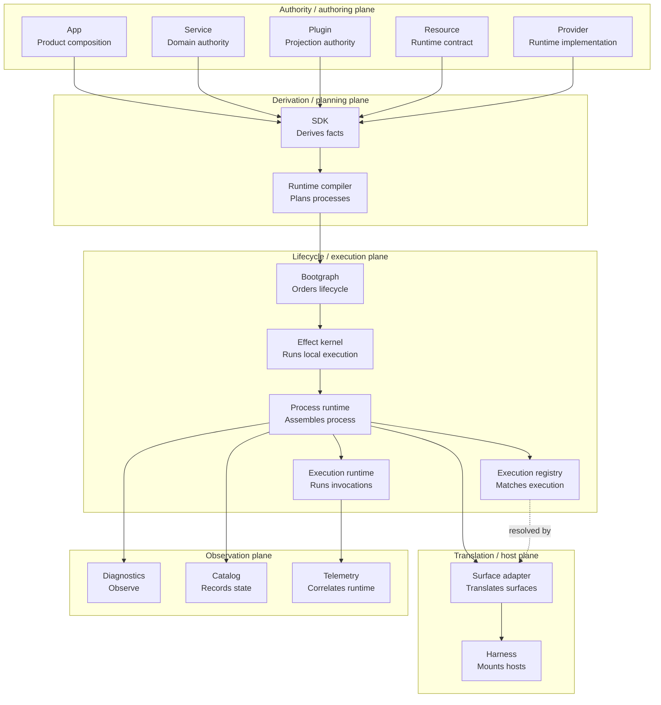
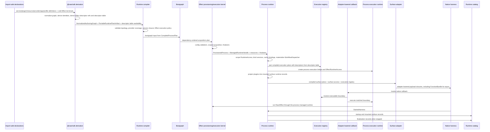

# RAWR Runtime Realization System

Status: Canonical  
Scope: Runtime realization, selected authoring declarations, SDK derivation, runtime compilation, bootgraph ordering, Effect-backed provisioning and process-local execution, process runtime binding, process execution, adapter lowering, harness mounting, diagnostics, telemetry, and deterministic finalization

Authority note: once locked, this document supersedes older indexed runtime/effect documents for runtime realization. Archived or quarantined documents that still call themselves canonical are provenance only unless explicitly subordinated and routed from this spec or `RAWR_Canonical_Architecture_Spec.md`.

## 1. Purpose and scope

The RAWR Runtime Realization System turns selected app composition into one started, typed, observable, stoppable process per `startApp(...)` invocation.

Runtime realization makes execution explicit without creating a second public semantic architecture. It owns the bridge from selected declarations to a running process. It does not own service domain authority, projection meaning, app identity, deployment placement, public API semantics, durable workflow semantics, shell governance, desktop-native behavior, web framework semantics, or native host interiors.

File: `specification://runtime-realization/lifecycle.txt`  
Layer: runtime realization lifecycle  
Exactness: normative lifecycle order and phase ownership.

```text
definition -> selection -> derivation -> compilation -> provisioning -> mounting -> observation
```

The broader platform chain is:

File: `specification://runtime-realization/platform-chain.txt`  
Layer: platform cohesion frame  
Exactness: normative semantic-to-runtime ordering.

```text
bind -> project -> compose -> realize -> observe
```

The execution ownership law is:

File: `specification://runtime-realization/execution-ownership-law.txt`  
Layer: execution ownership  
Exactness: normative grammar split.

```text
RAWR owns semantic/runtime boundaries.
oRPC owns callable contract mechanics.
Effect owns local execution mechanics.
Inngest owns durable async.
Native hosts own host interiors after RAWR adapter lowering.
The SDK derives.
The runtime realizes.
Harnesses mount.
Diagnostics observe.
```

Effect is the execution layer for all RAWR-owned local execution. Services, server API/internal plugins, CLI commands, agent tools, desktop background logic, web-local RAWR execution, resource operations, provider acquisition/release, process-local coordination resources, and async step-local execution use Effect through RAWR-owned authoring and runtime surfaces.

There is one RAWR execution terminal:

File: `specification://runtime-realization/single-execution-terminal.txt`  
Layer: execution terminal law  
Exactness: normative.

```text
One authoring interface.
One RAWR execution terminal.
One runtime owner.
```

The service/plugin executable boundary spine is:

File: `specification://runtime-realization/service-plugin-execution-spine.txt`  
Layer: runtime execution spine  
Exactness: normative handoff sequence for service/plugin executable boundaries.

```text
service/plugin executable authoring
  -> EffectExecutionDescriptor
  -> SDK normalized authoring graph
  -> runtime compiler
  -> CompiledExecutionPlan
  -> ExecutionRegistry
  -> ProcessExecutionRuntime
  -> EffectRuntimeAccess
  -> ManagedRuntimeHandle
  -> result / exit / diagnostics / telemetry / finalization
```

The provider spine is:

File: `specification://runtime-realization/provider-effect-spine.txt`  
Layer: runtime provider acquisition spine  
Exactness: normative provider handoff sequence.

```text
RuntimeResource
  -> RuntimeProvider.build(...)
  -> ProviderEffectPlan
  -> runtime provider lowering
  -> BootResourceModule
  -> bootgraph
  -> Effect-backed acquisition/release
  -> provisioned resource value
```

The resource operation spine is:

File: `specification://runtime-realization/resource-operation-spine.txt`  
Layer: runtime resource operation spine  
Exactness: normative relation between provisioned resource values and enclosing execution boundaries.

```text
provisioned RuntimeResource value
  -> RawrEffect-returning operation
  -> composed inside an enclosing EffectExecutionDescriptor or ProviderEffectPlan
  -> executed by the enclosing boundary's runtime path
```

When a `RawrEffect`-returning resource operation is composed inside a service, plugin, CLI command, agent tool, desktop background body, web-local execution body, or async step-local body, it executes as part of the enclosing `EffectExecutionDescriptor` through `ProcessExecutionRuntime`.

When a `RawrEffect`-returning resource operation is composed inside provider acquisition or release, it executes as part of the enclosing `ProviderEffectPlan` through bootgraph/provider lowering, not through `CompiledExecutionPlan` or `ProcessExecutionRuntime`.

Resource operations are not compiled into `CompiledExecutionPlan` merely because they return `RawrEffect`.

The durable async spine remains separate:

File: `specification://runtime-realization/durable-async-spine.txt`  
Layer: durable async handoff  
Exactness: normative async ownership split.

```text
WorkflowDefinition / ScheduleDefinition / ConsumerDefinition
  -> SDK normalized async surface plan
  -> runtime compiled async surface plan
  -> async SurfaceAdapter
  -> FunctionBundle
  -> Inngest harness
```

Effect may appear inside durable async steps only as local execution. Inngest remains the durable owner of workflow run identity, retry, replay, history, schedules, durable queues, and durable async semantics.

Native hosts may require Promise-compatible callbacks. Those callbacks are adapter-generated, harness-owned, or SDK-internal interop functions that call `ProcessExecutionRuntime`. They are not RAWR-owned business or capability execution terminals.

Shutdown, rollback, provider release, harness stop order, finalizers, managed runtime disposal, and final catalog records are deterministic runtime finalization and observation behavior. They are not an eighth lifecycle phase.

## 2. Fixed outcome

Each `startApp(...)` invocation produces exactly one started process runtime assembly.

| Runtime result | Owner | Meaning |
| --- | --- | --- |
| One root managed runtime | Runtime substrate / Effect provisioning and execution kernel | Process-local provisioning, `RawrEffect` execution, process-local coordination, and disposal owner |
| One process execution runtime | Runtime / process runtime | Executes Effect descriptors through the process-owned runtime bridge |
| One execution registry | Runtime / process runtime | Pairs compiled execution plans with their matching descriptors for adapter invocation |
| One process runtime assembly | Runtime / process runtime | Bound services, role access, mounted surface records, adapter lowering, harness handoff |
| Zero or more mounted roles | App-selected process shape | Selected role slices from the app composition |
| Zero or more mounted surfaces | Process runtime and harnesses | Runtime-ready surface payloads mounted into native hosts |
| One runtime catalog stream or record set | Diagnostics | Redacted read model of selected, derived, compiled, provisioned, bound, projected, executed, mounted, observed, and stopped runtime state |
| One deterministic finalization path | Runtime | Reverse-order harness stop, surface assembly stop, role finalizers, process finalizers, managed runtime disposal, final records |

A cohosted development process and a split production process use the same semantic app and plugin definitions. Cohosting changes placement and resource sharing. It does not change species.

Effect-backed is an execution posture. It does not create a second public ontology. There are no public architecture kinds named `EffectService`, `EffectPlugin`, `EffectApp`, `EffectWorkflow`, `EffectProvider`, `EffectResource`, `EffectWorkstream`, or `EffectReviewLoop`.

A runtime that executes RAWR-owned service/plugin/resource/provider bodies as ordinary Promise-only business callbacks is not compliant.

## 3. Authority planes and ownership laws

Runtime realization is stable only when each noun owns one authority and each layer knows which plane it occupies.

The compact ownership law is:

File: `specification://runtime-realization/compact-ownership-law.txt`  
Layer: ownership law  
Exactness: normative.

```text
Services govern domains.
Plugins project capabilities.
Apps compose products.
Resources define runtime contracts.
Providers implement runtime contracts.
The SDK derives facts.
The compiler plans processes.
Bootgraph orders lifecycle.
The Effect kernel runs local execution.
The process runtime assembles processes.
The registry matches execution.
The execution runtime runs invocations.
Adapters translate surfaces.
Harnesses mount hosts.
Diagnostics observe.
```

### 3.1 Plane model

File: `specification://runtime-realization/authority-plane-model.txt`  
Layer: authority plane model  
Exactness: normative classification of load-bearing nouns.

```text
Authority / authoring plane:
  Service
  Plugin
  App
  Resource
  Provider

Selection and demand plane:
  RuntimeProfile
  ProviderSelection
  ResourceRequirement
  Entrypoint

Derivation and planning plane:
  SDK
  Runtime compiler

Lifecycle and execution plane:
  Bootgraph
  Effect provisioning/execution kernel
  Process runtime
  Execution registry
  Process execution runtime
  EffectRuntimeAccess

Translation and native-host plane:
  Surface adapter
  Harness

Observation plane:
  Diagnostics
  RuntimeCatalog
  RuntimeTelemetry

Durable async integration plane:
  WorkflowDispatcher
  FunctionBundle

Classification axes:
  Role
  Surface
  Capability
```

The plane model is not a new ontology. It is a reading map. It answers which kind of authority a noun exercises before implementation detail is considered.

File: `specification://runtime-realization/authority-plane-diagram.mmd`  
Layer: authority plane diagram  
Exactness: illustrative diagram; normative direction of ownership handoff.



### 3.2 Long authority definitions

A service is a domain capability boundary. It owns the domain contracts, invariants, schemas, migrations, repositories, domain policy, and authoritative write access for the domain state it governs. It may declare dependencies on runtime resources, sibling services, semantic adapters, config, scope, and invocation context. Those dependencies may have runtime lifecycle, but the service does not provision or release them. The runtime binds and provisions them from app-selected providers and compiled plans. It does not own public API projection, internal API projection, workflow execution, command projection, web projection, agent projection, desktop projection, app membership, provider selection, process placement, harness mounting, raw Effect runtime construction, or raw effect-oRPC adapter wiring.

A plugin is a lane projection boundary. It projects underlying capabilities into exactly one role/surface/capability lane. The underlying capability may be service-owned domain capability, workflow dispatch capability, host/native capability, agent/shell capability, desktop capability, web/client capability, or another runtime-authorized capability. A plugin owns the lane-native contract, caller shape, boundary policy, authentication/authorization/redaction/transformation, service/resource use declarations, executable boundary, and native mount facts for that lane. It does not own the underlying domain authority, provider implementation, app membership, provider selection, runtime acquisition, or native host runtime.

An app is a product composition boundary. It owns app identity, selected plugin projections, runtime profiles, provider selections, config source selection, entrypoints, process role shapes, publication artifacts, and product-level composition defaults. It composes by selection. It does not acquire resources or run effects. It does not own service domain authority, plugin projection meaning, resource contracts, provider implementation, runtime acquisition, local execution, harness behavior, or deployment placement.

A resource is a runtime capability contract. It declares the identity, value shape, lifetime requirements, config schema, and diagnostic-safe snapshot rules for a provisionable runtime capability. It may expose effectful operations on provisioned values, including operations that return `RawrEffect`. It does not implement itself, select a provider, own domain authority, acquire runtime values, or become app composition.

A provider is a runtime capability implementation plan. It implements a resource contract through provider-local config, native client construction, acquisition, release, health, refresh, dependency requirements, telemetry, and diagnostics. It returns `ProviderEffectPlan` through `providerFx` and remains cold until provisioning. It does not select itself, redefine resource identity, own domain authority, compose app membership, or construct a local managed runtime.

The SDK is the derivation boundary. It converts import-safe authoring declarations into normalized, typed, runtime-consumable artifacts: canonical identities, dependency edges, service binding plans, surface runtime plans, workflow dispatcher descriptors, execution descriptor refs, non-portable execution descriptor tables, provider selections, runtime-carried schema references, diagnostics, and portable plan artifacts. It owns public authoring facades, import-safe descriptor construction, type-level inference, and SDK-internal adapter hooks. It does not acquire resources, execute providers, construct managed runtimes, bind live services, mount harnesses, run `RawrEffect`, or own domain/projection/app meaning.

The runtime compiler is the planning boundary. It consumes the normalized authoring graph plus selected app, entrypoint, profile, environment, descriptor table reference, and harness facts, then emits one compiled process plan. It owns provider coverage validation, provider dependency closure, service closure, topology/builder agreement, execution boundary policy validation, compiled service/surface/dispatcher/execution plans, provider dependency graph, bootgraph input, execution registry input, topology seed, and compilation diagnostics. It does not acquire resources, bind live services, execute `RawrEffect`, mount harnesses, mutate app membership, or own service/plugin/app meaning.

Bootgraph is the lifecycle ordering boundary. It turns compiled provider/resource lifecycle inputs into a deterministic acquisition and release order. It owns dependency ordering, dedupe, startup rollback, finalizer registration, reverse finalization, and process/role lifecycle assembly. It consumes provider effect plans and compiled bootgraph input. It produces provisioned process resources and finalizer state for the process runtime. It does not own provider implementation, service domain authority, app membership, plugin projection, execution descriptors, durable workflow semantics, or native host behavior.

The Effect provisioning/execution kernel is the process-local execution substrate. It owns the single process managed runtime, raw Effect lowering, scoped acquisition/release mechanics, process-local coordination primitives, interruption, timeout, retry mechanics, and `RawrEffect` execution under runtime-owned policy. It consumes `ProviderEffectPlan` and `RawrEffect` only through sanctioned runtime/SDK bridges. It does not own service domain authority, plugin projection, app selection, provider selection, durable async, native host semantics, or public authoring grammar.

The process runtime is the live process assembly boundary. It turns a compiled process plan, non-portable execution descriptor table, and provisioned process into bound service clients, role/surface runtime access, workflow dispatchers, execution registry, process execution runtime, mounted surface runtime records, adapter-lowered payloads, harness handoff, catalog events, and finalization coordination. It owns service binding, service binding cache, invocation-bound client views, execution registry assembly, process execution runtime assembly, workflow dispatcher materialization, plugin projection, adapter lowering coordination, harness handoff, and process-level runtime observation. It does not own service domain authority, plugin projection meaning, app membership, provider selection, provider acquisition, durable workflow semantics, or native host interiors.

The execution registry is the executable-boundary matching boundary. It pairs each compiled execution plan with exactly one matching Effect execution descriptor before adapter invocation. It owns execution identity matching, descriptor/plan boundary agreement, duplicate/missing executable detection, and lookup of matched executable boundaries for adapters. It does not execute `RawrEffect`, lower Effect, own execution policy, create descriptors, compile plans, or contain business logic.

The process execution runtime is the invocation execution boundary. It receives a matched executable boundary plus an explicit procedure execution context, resolves error and telemetry bridges, invokes the Effect descriptor, receives `RawrEffect`, runs it through `EffectRuntimeAccess`, applies execution policy, and returns a host-compatible result or structured exit. It owns invocation-time execution of RAWR-owned executable boundaries. It does not bind services, acquire providers, mount harnesses, choose apps, project plugins, own domain authority, or run native host logic.

A surface adapter is the native-payload translation boundary. It lowers compiled surface plans into harness-facing native payloads and callbacks. It resolves executable boundaries through the execution registry and produces host-compatible closures that delegate to `ProcessExecutionRuntime` at invocation time. It owns translation from RAWR compiled surface shape into native host payload shape. It does not execute business logic, run `RawrEffect`, construct managed runtimes, acquire providers, consume raw authoring declarations, consume SDK graphs directly, or own native host lifecycle.

A harness is the native host mounting boundary. It receives adapter-lowered payloads and mounts them into a native host such as Elysia, Inngest, OCLIF, web, agent/OpenShell, or desktop. It owns native host lifecycle after RAWR lowering: registering routes, functions, commands, tools, windows, background callbacks, workers, or host-native handles. It does not consume SDK graphs, compile plans, acquire providers, bind services, lower `RawrEffect`, own service/plugin/app meaning, or create managed runtimes.

Diagnostics is the observation boundary. It produces redacted runtime findings, topology records, catalog records, telemetry annotations, startup records, execution records, rollback records, and finalization records. It owns visibility into selected, derived, compiled, provisioned, bound, projected, executed, mounted, observed, and stopped runtime state. It does not compose app membership, mutate runtime state, acquire live values, select providers, expose secrets, or become a control plane by itself.

`RuntimeCatalog` is the runtime diagnostic read model. It records process identity, app identity, selected roles, derived authoring facts, resources, providers, provider dependency graph, service attachments, workflow dispatchers, execution plans, execution registry, surfaces, harnesses, lifecycle status, diagnostics, topology records, execution records, startup records, and finalization records. It is not live access, not a manifest, not app composition, not provider selection, and not mutable runtime authority.

`RuntimeTelemetry` is the correlation boundary for runtime spans, events, and annotations. It carries process, provisioning, binding, execution, adapter, harness, and finalization correlation across runtime realization. It does not own product analytics, service semantic events, app selection, service domain authority, or provider selection.

`WorkflowDispatcher` is the durable-async interop boundary. It is materialized by the process runtime from selected workflow definitions and the provisioned async provider. It lets server API/internal projections dispatch, inspect, or cancel selected durable workflow runs. It owns live dispatch interop between selected server projections and selected async definitions. It does not own workflow definitions, durable workflow semantics, product API meaning, service domain authority, native Inngest functions, provider acquisition, or projection classification.

`FunctionBundle` is the async harness-facing lowered artifact. It packages selected workflow, schedule, and consumer definitions into native Inngest-compatible payloads for the Inngest harness. It owns no product API meaning, no workflow semantics, no live dispatcher authority, and no app selection. It is an adapter output consumed by the async harness.

An entrypoint is a selected process-start boundary. It chooses one app, one runtime profile, one entrypoint id, and one role set for a single `startApp(...)` invocation. It owns process-start selection facts. It does not redefine app membership, service domain authority, plugin projection, provider implementation, execution grammar, harness internals, or deployment placement.

A runtime profile is an app-owned runtime selection boundary. It selects provider implementations, config sources, process defaults, and environment-shaped wiring for an app. It does not acquire resources, construct providers, execute `RawrEffect`, mount harnesses, own service domain authority, or become deployment placement.

`ProviderSelection` is the app/profile-owned binding between a runtime capability contract and a provider implementation for a lifetime, role, and optional instance. It is selection data, not acquisition. It does not construct the provider, validate live config by itself, acquire resources, or become provider implementation.

`ResourceRequirement` is a demand declaration for a runtime capability contract. It states that a service, plugin, provider, harness, or runtime plan needs a resource at a lifetime, role, optionality, and instance. It is not provider selection, not acquisition, and not live access.

A role is a selected process responsibility slice, such as server, async, web, agent, CLI, or desktop. A surface is a lane-specific projection target within a role, such as server API, server internal, workflow, schedule, command, tool, window, menubar, or background. A plugin capability is the named projection capability within one role/surface lane. It is not automatically the same thing as a service domain capability or a runtime resource capability.

Short law:

File: `specification://runtime-realization/lane-classification-law.txt`  
Layer: role/surface/capability classification  
Exactness: normative.

```text
Roles slice processes.
Surfaces target lanes.
Capabilities name projections.
```

### 3.3 Ownership matrix

| Layer | Owns | Does not own |
| --- | --- | --- |
| Services | Domain contracts, invariants, schemas, repositories, migrations, domain policy, stable service config, service-to-service dependency declarations, authoritative write access, service procedure implementation through Effect execution bodies | Public API projection, app membership, provider selection, harness mounting, process placement, raw Effect runtime construction, raw effect-oRPC adapter wiring |
| Plugins | One role/surface/capability projection, topology-implied caller classification, native builder facts, lane-native contract, boundary policy, service-use declarations, resource-use declarations, projection-local Effect execution bodies | Service domain authority, provider acquisition, app selection, projection reclassification, raw Effect runtime construction, raw effect-oRPC adapter wiring |
| Apps | Product identity, selected projections, runtime profiles, provider selections, config source selection, entrypoints, process role shapes, process defaults, selected publication artifacts | Service domain authority, plugin species, provider implementation, runtime acquisition, `RawrEffect` execution, managed runtime construction |
| Resources | Runtime capability contract, consumed value shape, lifetime requirement, public resource identity, config schema, diagnostic-safe snapshot contribution rules, `RawrEffect`-returning value operations where effectful | Provider implementation, domain authority, app selection, raw Effect runtime construction |
| Providers | Runtime capability implementation plan, acquisition/release plan, validation, native client construction, health, refresh, provider config, telemetry, diagnostics | Resource identity, app selection, service domain authority, raw managed runtime construction |
| SDK | Normalized facts, canonical identities, dependency edges, resource requirements, normalized `ProviderSelection`, service binding plans, surface runtime plan descriptors, execution descriptor refs, non-portable execution descriptor tables, portable plan artifacts, curated `Effect` facade, `RawrEffect`, Effect execution descriptors, SDK-internal adapters | Resource acquisition, provider execution, managed runtime construction, harness mounting, service/plugin/app meaning |
| Runtime compiler | Compiled process plan, provider coverage validation, provider dependency graph, service closure, topology agreement, compiled service/surface/dispatcher/execution/harness plans, registry input | Live resource acquisition, live service binding, harness mounting, app membership mutation |
| Bootgraph | Lifecycle identity, dependency ordering, dedupe, rollback, reverse finalization, bootgraph module execution | Service domain authority, app composition, durable workflow semantics, native host behavior |
| Effect kernel | Single process managed runtime, Effect lowering, provider plan execution, process-local coordination, interruption, timeout, retry, `RawrEffect` execution under runtime-owned bridges | Service domain authority, plugin projection, app selection, provider selection, durable async, native host semantics |
| Process runtime | Runtime access scoping, service binding, binding cache, invocation-bound client views, workflow dispatcher materialization, execution registry assembly, process execution runtime assembly, plugin projection, adapter lowering coordination, harness handoff, catalog emission, finalization coordination | Service domain authority, public API meaning, app membership, provider selection, durable workflow semantics, second business execution model |
| Execution registry | Matching compiled execution plans to Effect descriptors, identity/boundary agreement, executable boundary lookup | `RawrEffect` execution, Effect lowering, plan compilation, descriptor construction, business logic |
| Process execution runtime | Invocation-time execution through `EffectRuntimeAccess`, bridge resolution, policy application, result/exit mapping | Service binding, provider acquisition, harness mounting, app selection, plugin projection, domain authority |
| Surface adapters | Lowering compiled surface plans to host payloads, resolving executable boundaries through registry, producing native callbacks | Business logic, `RawrEffect` execution, managed runtime construction, provider acquisition, raw authoring consumption |
| Harnesses | Native host mounting and native lifecycle after adapter lowering | SDK graph consumption, runtime compilation, provider acquisition, service domain authority, `RawrEffect` lowering, managed runtime construction |
| Diagnostics | Observation, redacted catalog records, lifecycle findings, topology read models, telemetry, execution-layer findings | Composition authority, live value acquisition, state mutation, provider selection |

Shared infrastructure does not transfer schema ownership, write authority, service domain authority, resource identity, plugin identity, or app membership. Multiple services may share a process, machine, database instance, connection pool, telemetry installation, cache infrastructure, or host runtime. That sharing is infrastructure. It is not shared domain authority.

RAWR owns boundaries and runtime handoffs. Native framework interiors own native execution semantics after RAWR hands them runtime-realized payloads.

## 4. Canonical topology and package authority

The physical topology is locked.

File: `specification://runtime-realization/canonical-topology.txt`  
Layer: repository topology  
Exactness: normative for roots, package authority, and ownership placement.

```text
packages/
  core/
    sdk/                         # publishes @rawr/sdk
    runtime/                     # compiler, bootgraph, substrate, process runtime, harnesses, topology
      compiler/
      bootgraph/
      substrate/
        effect/
      process-runtime/
      harnesses/
        elysia/
        inngest/
        oclif/
        web/
        agent/
        desktop/
      topology/
      standard/                  # RAWR-owned standard providers and internal runtime machinery

resources/
  <capability>/                  # authored provisionable capability catalog

services/
  <service>/                     # domain capability boundary

plugins/
  server/
    api/
      <capability>/              # public server API projection
    internal/
      <capability>/              # trusted first-party/internal server API projection
  async/
    workflows/
      <capability>/              # durable workflow projection
    schedules/
      <capability>/              # durable scheduled projection
    consumers/
      <capability>/              # durable consumer projection
  cli/
    commands/
      <capability>/              # OCLIF command projection
  web/
    app/
      <capability>/              # web app projection
  agent/
    channels/
      <capability>/              # agent channel projection
    shell/
      <capability>/              # OpenShell projection
    tools/
      <capability>/              # agent tool projection
  desktop/
    menubar/
      <capability>/              # desktop menubar projection
    windows/
      <capability>/              # desktop window projection
    background/
      <capability>/              # desktop background projection

apps/
  <app>/
    rawr.<app>.ts                # app composition
    server.ts                    # entrypoint
    async.ts                     # entrypoint
    web.ts                       # entrypoint
    agent.ts                     # entrypoint
    cli.ts                       # entrypoint
    desktop.ts                   # entrypoint
    dev.ts                       # cohosted development entrypoint
    runtime/
      profiles/
      config.ts
      processes.ts
```

Platform machinery lives under `packages/core/*`. Authored provisionable capability contracts live under `resources/*`.

The public SDK is published as `@rawr/sdk` from `packages/core/sdk`.

The SDK topology is:

File: `packages/core/sdk/src/_topology.txt`  
Layer: SDK topology  
Exactness: normative for SDK modules and internal adapter locations.

```text
packages/core/sdk/src/
  app/
    index.ts

  effect/
    index.ts
    errors.ts
    policy.ts
    internal/
      lower-rawr-effect.ts
      effect-runtime-access.ts
      managed-runtime-bridge.ts
      public-type-guards.ts

  execution/
    index.ts
    descriptor.ts
    descriptor-table.ts
    context.ts
    policy.ts
    error-bridge.ts
    telemetry-bridge.ts

  service/
    index.ts
    define-service.ts
    implement-service.ts
    procedure-context.ts
    service-client.ts
    service-binding-types.ts
    schema.ts
    effect/
      index.ts
      internal/
        effect-orpc-adapter.ts
        service-error-bridge.ts
        service-telemetry-bridge.ts

  plugins/
    server/
      index.ts
      implement-server-api-plugin.ts
      implement-server-internal-plugin.ts
      effect/
        index.ts
        internal/
          effect-orpc-adapter.ts
          server-plugin-error-bridge.ts
          server-plugin-telemetry-bridge.ts

    async/
      index.ts
      define-workflow-plugin.ts
      define-schedule-plugin.ts
      define-consumer-plugin.ts
      effect/
        index.ts
        internal/
          inngest-step-effect-adapter.ts
          async-error-bridge.ts
          async-telemetry-bridge.ts

    cli/
      index.ts
      define-command-plugin.ts
      schema.ts
      effect/
        index.ts
        internal/
          oclif-effect-adapter.ts

    web/
      index.ts
      define-web-app-plugin.ts
      effect/
        index.ts
        internal/
          web-effect-adapter.ts

    agent/
      index.ts
      define-agent-plugin.ts
      define-tool.ts
      schema.ts
      effect/
        index.ts
        internal/
          agent-effect-adapter.ts

    desktop/
      index.ts
      define-desktop-plugin.ts
      effect/
        index.ts
        internal/
          desktop-effect-adapter.ts

  runtime/
    resources/
      index.ts
      define-runtime-resource.ts
      resource-requirement.ts
    providers/
      index.ts
      define-runtime-provider.ts
      provider-effect-plan.ts
      effect/
        index.ts
        internal/
          provider-effect-lowering.ts
    profiles/
      index.ts
      define-runtime-profile.ts
      provider-selection.ts
    schema/
      index.ts
```

The execution registry itself is process-runtime authority and lives in `packages/core/runtime/process-runtime/execution-registry.ts`. The SDK owns descriptor refs and the non-portable descriptor table produced during derivation. It does not import runtime compiler types into public SDK authoring surfaces.

Canonical public import surfaces include:

| Public surface | Owner |
| --- | --- |
| `@rawr/sdk/app` | App and entrypoint authoring |
| `@rawr/sdk/effect` | Curated native-shaped Effect authoring facade |
| `@rawr/sdk/execution` | Execution descriptor and boundary-policy types where public |
| `@rawr/sdk/service` | Service authoring |
| `@rawr/sdk/service/schema` | Service-owned callable data schema facade |
| `@rawr/sdk/plugins/server` | Server projection authoring |
| `@rawr/sdk/plugins/server/effect` | Server projection executable authoring helpers |
| `@rawr/sdk/plugins/async` | Async projection authoring |
| `@rawr/sdk/plugins/async/effect` | Async step-local executable authoring helpers |
| `@rawr/sdk/plugins/cli` | CLI projection authoring |
| `@rawr/sdk/plugins/cli/effect` | CLI command executable authoring helpers |
| `@rawr/sdk/plugins/cli/schema` | CLI command schema facade |
| `@rawr/sdk/plugins/web` | Web projection authoring |
| `@rawr/sdk/plugins/web/effect` | Web-local executable authoring helpers |
| `@rawr/sdk/plugins/agent` | Agent projection authoring |
| `@rawr/sdk/plugins/agent/effect` | Agent tool executable authoring helpers |
| `@rawr/sdk/plugins/agent/schema` | Agent tool schema facade |
| `@rawr/sdk/plugins/desktop` | Desktop projection authoring |
| `@rawr/sdk/plugins/desktop/effect` | Desktop-local executable authoring helpers |
| `@rawr/sdk/runtime/resources` | Runtime resource declarations |
| `@rawr/sdk/runtime/providers` | Runtime provider declarations |
| `@rawr/sdk/runtime/providers/effect` | Runtime provider Effect plan authoring |
| `@rawr/sdk/runtime/profiles` | Runtime profile declarations |
| `@rawr/sdk/runtime/schema` | `RuntimeSchema` facade |

The `/effect` SDK submodules do not denote optional terminal modes. They contain the executable authoring helpers for RAWR-owned local execution in their lanes. Non-`/effect` plugin modules declare projection facts, contracts, service uses, resource requirements, topology, and other cold facts. Any RAWR-owned executable body for a lane is authored through that lane’s executable Effect helpers.

Only `@rawr/sdk` public imports are locked public package export conventions in this document. Non-`@rawr/sdk` imports shown in examples are illustrative package aliases unless a code block labels them otherwise.

## 5. Import safety and declaration discipline

All declarations are import-safe.

A service, plugin, resource, provider, app, or profile module declares facts, factories, descriptors, selectors, schemas, contracts, and cold execution plans. Importing a declaration does not acquire resources, read secrets, connect providers, start processes, register globals, mutate app composition, execute `RawrEffect`, or mount native hosts.

| Module kind | Import-safe content |
| --- | --- |
| Service modules | Boundary schemas, service declarations, service contracts, router factories, Effect execution descriptors |
| Plugin modules | One plugin factory, lane-specific definitions, oRPC routers/contracts, workflow definitions, command definitions, web/agent/desktop surface definitions, Effect execution descriptors |
| Resource modules | `RuntimeResource` descriptors, requirement helpers, provider selector helpers, value types |
| Provider modules | Cold `RuntimeProvider` descriptors and `ProviderEffectPlan` acquisition/release plans |
| App modules | App membership declarations and runtime profile selection |
| Entrypoints | `startApp(...)` invocation and selected process shape |

`RawrEffect` values are lazy execution descriptions. They are not running work.

Ordinary authoring modules must not import raw Effect or effect-oRPC.

File: `specification://runtime-realization/raw-effect-import-ban.txt`  
Layer: import law  
Exactness: normative.

```text
Raw Effect imports are forbidden in authored service, plugin, app,
ordinary resource, provider implementation, profile, and entrypoint modules.

This includes:

services/**
plugins/**
apps/**
apps/*/runtime/profiles/**
resources/**
entrypoints
```

Forbidden ordinary authoring imports:

File: `specification://runtime-realization/forbidden-imports.ts`  
Layer: import law  
Exactness: normative for ordinary authoring.

```ts
import { Effect } from "effect";
import { Layer } from "effect";
import { ManagedRuntime } from "effect";
import { makeEffectORPC } from "effect-orpc";
```

Canonical public Effect import:

File: `specification://runtime-realization/canonical-effect-import.ts`  
Layer: public SDK import law  
Exactness: normative.

```ts
import { Effect, TaggedError, type RawrEffect } from "@rawr/sdk/effect";
```

Provider plan authoring remains specialized because provider acquisition returns `ProviderEffectPlan`, not general `RawrEffect`.

File: `specification://runtime-realization/canonical-provider-effect-import.ts`  
Layer: provider authoring import law  
Exactness: normative for provider effect plan authoring.

```ts
import { defineRuntimeProvider } from "@rawr/sdk/runtime/providers";
import { providerFx } from "@rawr/sdk/runtime/providers/effect";
```

Provider implementations use `providerFx` for acquisition/release plans. They may use the curated `@rawr/sdk/effect` facade for returned resource value operations. They must not import raw `effect`, `@effect/*`, or construct `ManagedRuntime`.

Raw Effect imports are allowed only in:

File: `specification://runtime-realization/raw-effect-import-allowlist.txt`  
Layer: import law  
Exactness: normative.

```text
packages/core/runtime/substrate/effect/**
packages/core/runtime/process-runtime/**
packages/core/runtime/standard/**
packages/core/sdk/src/**/internal/**
```

Raw effect-oRPC imports are allowed only in:

File: `specification://runtime-realization/effect-orpc-import-allowlist.txt`  
Layer: import law  
Exactness: normative.

```text
packages/core/sdk/src/service/effect/internal/**
packages/core/sdk/src/plugins/server/effect/internal/**
```

Service and plugin packages do not import effect-oRPC directly.

No service, plugin, resource, provider, app, or entrypoint creates or receives its own `ManagedRuntime`. Runtime substrate owns `ManagedRuntimeHandle`. Runtime/process execution owns `EffectRuntimeAccess`. SDK internal adapters may receive sanctioned access. Ordinary authoring does not.

## 6. Layered naming and artifact ownership

Names remain layer-specific. Similar concepts in different layers use different terms because they have different owners.

| Layer | Canonical terms | Consumer |
| --- | --- | --- |
| App authoring | `defineApp(...)`, `startApp(...)`, `AppDefinition`, `Entrypoint`, `RuntimeProfile` | SDK derivation and runtime compiler |
| Service authoring | `defineService(...)`, `resourceDep(...)`, `serviceDep(...)`, `semanticDep(...)`, `deps`, `scope`, `config`, `invocation`, `provided` | SDK derivation and service binding |
| Plugin authoring | `PluginFactory`, `PluginDefinition`, `useService(...)`, lane-specific builders, lane-native definitions, `.effect(...)` terminal bodies | SDK derivation and surface runtime plans |
| Author-facing Effect facade | `Effect`, `RawrEffect`, `TaggedError`, `RawrRetryPolicy`, `RawrTimeoutPolicy`, `RawrConcurrencyPolicy` | Services, plugins, resources, providers, repositories where allowed |
| Resource/provider/profile authoring | `RuntimeResource`, `ResourceRequirement`, `ResourceLifetime`, `RuntimeProvider`, `ProviderSelection`, `RuntimeProfile`, `ProviderEffectPlan`, `providerFx` | SDK derivation, runtime compiler, provisioning kernel |
| SDK derivation | `NormalizedAuthoringGraph`, `ExecutionDescriptorRef`, `ExecutionDescriptorTable`, `ServiceBindingPlan`, `SurfaceRuntimePlan`, `PortableRuntimePlanArtifact` | Runtime compiler and process runtime |
| SDK execution model | `ExecutionDescriptor`, `EffectExecutionDescriptor`, `ExecutionBoundaryKind`, `ProviderEffectBoundaryKind`, `RuntimeEffectBoundaryKind`, `EffectExecutionPolicy`, `BoundaryTelemetry`, `BoundaryErrors` | SDK derivation, runtime compiler, process execution runtime, provider lowering |
| Runtime compilation | `CompiledProcessPlan`, `CompiledResourcePlan`, `CompiledServiceBindingPlan`, `CompiledSurfacePlan`, `CompiledExecutionPlan`, `CompiledExecutableBoundary`, `ProviderDependencyGraph` | Bootgraph, process runtime, surface adapters |
| Provisioning | `Bootgraph`, `BootResourceKey`, `BootResourceModule`, `ProvisionedProcess`, `ManagedRuntimeHandle` | Process runtime |
| Runtime execution bridge | `ExecutionRegistry`, `ProcessExecutionRuntime`, `EffectRuntimeAccess`, `ErrorBridge`, `TelemetryBridge` | Process runtime and SDK internal adapters |
| Live access | `RuntimeAccess`, `ProcessRuntimeAccess`, `RoleRuntimeAccess`, `SurfaceRuntimeAccess` | Service binding, plugin projection, harness adapters |
| Runtime binding | `ServiceBindingCache`, `ServiceBindingCacheKey`, `bindService(...)` | Process runtime and plugin projection |
| Adapter lowering | `SurfaceAdapter`, `AdapterLoweringResult`, adapter-lowered payloads, `FunctionBundle` | Harnesses |
| Dispatcher integration | `WorkflowDispatcherDescriptor`, `WorkflowDispatcher` | Server API/internal projections and async harness integration |
| Harness/native boundary | `HarnessDescriptor`, `StartedHarness`, native host payloads | Native host framework |
| Observation | `RuntimeCatalog`, `RuntimeDiagnostic`, `RuntimeTelemetry`, `RuntimeDiagnosticContributor` | Diagnostics, topology tools, control-plane touchpoints |

`RawrEffect`, `ExecutionDescriptor`, `CompiledExecutionPlan`, `ExecutionDescriptorTable`, `ExecutionRegistry`, `ProcessExecutionRuntime`, `EffectRuntimeAccess`, and `ProviderEffectPlan` are operational execution nouns. They are not top-level ontology kinds.

`startApp(...)` is the canonical app start operation. Roles, surfaces, harnesses, profiles, and process hosts are selected data passed to the entrypoint operation. There is no role-specific public start verb.

## 7. Code block exactness rule

Every illustrated code or type block in this specification includes `File:`, `Layer:`, and `Exactness:` labels immediately before it.

Code and type blocks are normative for locked names, ownership boundaries, required fields, producer/consumer shape, lifecycle handoff, layer handoff, public `RawrEffect`/`Effect` import surfaces, forbidden raw Effect/effect-oRPC import locations, Effect terminal ownership, execution descriptor producer/consumer shape, `ExecutionDescriptorTable`, `ExecutionRegistry` matching, `ProcessExecutionRuntime` ownership, process-local coordination semantics, and bridge ownership. They are illustrative for overloads, generic parameters, helper placement, and non-`@rawr/sdk` import paths unless a block states otherwise.

Where this document shows public facade helper generics, the public helper name, public import path, export/forbidden-export law, and architectural authority are normative. Exact generic spellings and overloads are illustrative unless explicitly labeled implementation-proven.

## 8. Schema ownership and `RuntimeSchema`

`RuntimeSchema` is the canonical SDK-facing schema facade for runtime-owned and runtime-carried boundary schema declarations.

It appears where the runtime must derive validation, type projection, config decoding, redaction, diagnostics, or harness payload contracts from an authored declaration. That includes resource config, provider config, runtime profile config, service boundary `scope`, service boundary `config`, service boundary `invocation`, runtime diagnostics payloads, and harness-facing runtime payloads.

`RuntimeSchema` has this minimum contract.

File: `packages/core/sdk/src/runtime/schema/runtime-schema.ts`  
Layer: SDK runtime schema facade  
Exactness: normative for required capabilities; illustrative for generic spelling.

```ts
export interface RuntimeSchema<TValue = unknown> {
  readonly kind: "runtime.schema";
  readonly serializable: unknown;
  readonly description?: string;
  readonly redaction?: RuntimeRedactionPolicy;

  decode(input: unknown): RuntimeSchemaResult<TValue>;
  validate(input: unknown): RuntimeSchemaResult<TValue>;
  toDiagnosticShape(): RuntimeDiagnosticSchemaShape;
}

export type RuntimeSchemaValue<TSchema extends RuntimeSchema<unknown>> =
  TSchema extends RuntimeSchema<infer TValue> ? TValue : never;

export namespace RuntimeSchema {
  export type Infer<TSchema extends RuntimeSchema<unknown>> =
    RuntimeSchemaValue<TSchema>;
}
```

`RuntimeSchema` does not transfer service domain schema ownership to the runtime. Service procedure payloads, plugin API payloads, plugin-native contracts, and workflow payloads remain schema-backed contracts owned by their service or plugin boundary.

When an SDK generic needs the decoded value type of a runtime-carried schema, it uses `RuntimeSchema.Infer<typeof Schema>` or the equivalent `RuntimeSchemaValue<typeof Schema>`. `typeof Schema` names the schema value itself, not the decoded config, scope, invocation, diagnostic, or harness payload value. Static type projection is a TypeScript helper, not a runtime field on the schema object.

`RawrEffect` is not a schema form. A `RawrEffect`-returning operation still uses the existing schema owner for input, output, and error data. `RuntimeSchema` remains for runtime-carried config, diagnostics, and harness-facing runtime payloads.

| Schema-bearing boundary | Schema owner | Schema form |
| --- | --- | --- |
| Runtime resource config | Resource/provider boundary | `RuntimeSchema` |
| Provider config | Provider boundary | `RuntimeSchema` |
| Runtime profile config | App/runtime profile boundary | `RuntimeSchema` |
| Service `scope`, `config`, `invocation` lanes | Service boundary as runtime-carried lanes | `RuntimeSchema` |
| Service callable procedure input/output/errors | Service package | Service-owned schema-backed oRPC-compatible contracts |
| Public server API input/output/errors | Server API plugin | Plugin-owned schema-backed oRPC-compatible contracts |
| Server internal API input/output/errors | Server internal plugin | Plugin-owned schema-backed oRPC-compatible contracts |
| Workflow payloads read from event data | Async plugin or projected service boundary | Schema-backed payload contract |
| Harness-facing runtime payloads | Runtime adapter/harness boundary | `RuntimeSchema` |
| Diagnostics payloads | Runtime diagnostics | `RuntimeSchema` |

Plain string labels may name capabilities, routes, ids, triggers, cron expressions, policies, event names, and diagnostic codes. They must not stand in for data schemas.

## 9. Effect execution components

### 9.1 `RawrEffect` and curated `Effect`

`RawrEffect` is the author-facing execution value type. It represents a lazy effectful program without exposing raw Effect runtime ownership.

`Effect` is the curated SDK-owned facade for constructing and composing `RawrEffect` values with native-shaped Effect names. It is not raw Effect. It does not export runtime authority.

`RawrEffect` is generator-yield-compatible. Generator-native `.effect(function*)` bodies are lowered by the SDK, and yielded `RawrEffect` values are interpreted by SDK-owned generator lowering. Authors may use `yield*` with `RawrEffect` values inside sanctioned generator-native bodies and helper functions. The public type must preserve success, failure, and requirement inference through generator-native `.effect(function*)` bodies. The exact iterator implementation is SDK-owned.

File: `packages/core/sdk/src/effect/index.ts`  
Layer: SDK author-facing Effect facade  
Exactness: normative for public import path, public names, yieldability contract, inference preservation, and forbidden raw runtime construction; illustrative for exact generic spelling, overloads, and iterator implementation.

```ts
export interface RawrEffect<
  TSuccess,
  TError = never,
  TRequirements = never,
> extends RawrYieldable<TSuccess, TError, TRequirements> {
  readonly kind: "rawr.effect";
  readonly __success?: TSuccess;
  readonly __error?: TError;
  readonly __requirements?: TRequirements;
}

export interface RawrYieldable<
  TSuccess,
  TError = never,
  TRequirements = never,
> {
  [Symbol.iterator](): RawrEffectYieldIterator<TSuccess, TError, TRequirements>;
}

export interface RawrEffectYieldIterator<
  TSuccess,
  TError = never,
  TRequirements = never,
> extends Generator<unknown, TSuccess, unknown> {
  readonly __error?: TError;
  readonly __requirements?: TRequirements;
}

export const Effect: RawrEffectFacade = createRawrEffectFacade();

export interface RawrEffectFacade {
  succeed<T>(value: T): RawrEffect<T>;

  fail<E>(error: E): RawrEffect<never, E>;

  gen<TSuccess, TError = never, TRequirements = never>(
    body: () => Generator<unknown, TSuccess, unknown>,
  ): RawrEffect<TSuccess, TError, TRequirements>;

  tryPromise<TSuccess, TError>(input: {
    try: () => Promise<TSuccess> | TSuccess;
    catch: (cause: unknown) => TError;
  }): RawrEffect<TSuccess, TError>;

  all<T extends Record<string, RawrEffect<any, any, any>>>(
    effects: T,
    options?: {
      concurrency?: number | "unbounded";
      discard?: boolean;
    },
  ): RawrEffect<
    RawrEffectSuccessRecord<T>,
    RawrEffectErrorUnion<T>,
    RawrEffectRequirementUnion<T>
  >;

  timeout<TSuccess, TError, TRequirements>(
    effect: RawrEffect<TSuccess, TError, TRequirements>,
    duration: RawrDurationInput,
  ): RawrEffect<TSuccess, TError | RawrTimeoutError, TRequirements>;

  retry<TSuccess, TError, TRequirements>(
    effect: RawrEffect<TSuccess, TError, TRequirements>,
    policy: RawrRetryPolicy,
  ): RawrEffect<TSuccess, TError, TRequirements>;

  mapError<TSuccess, TError, TNextError, TRequirements>(
    effect: RawrEffect<TSuccess, TError, TRequirements>,
    map: (error: TError) => TNextError,
  ): RawrEffect<TSuccess, TNextError, TRequirements>;

  catchTag<TSuccess, TError, TTag extends string, TNextSuccess, TNextError, TRequirements>(
    effect: RawrEffect<TSuccess, TError, TRequirements>,
    tag: TTag,
    handler: (error: Extract<TError, { readonly _tag: TTag }>) =>
      RawrEffect<TNextSuccess, TNextError, TRequirements>,
  ): RawrEffect<TSuccess | TNextSuccess, Exclude<TError, { readonly _tag: TTag }> | TNextError, TRequirements>;

  catchTags<TSuccess, TError, TNextSuccess, TNextError, TRequirements>(
    effect: RawrEffect<TSuccess, TError, TRequirements>,
    handlers: RawrCatchTagsHandlers<TError, TNextSuccess, TNextError, TRequirements>,
  ): RawrEffect<TSuccess | TNextSuccess, TNextError, TRequirements>;

  orElse<TSuccess, TError, TNextSuccess, TNextError, TRequirements>(
    effect: RawrEffect<TSuccess, TError, TRequirements>,
    fallback: (error: TError) => RawrEffect<TNextSuccess, TNextError, TRequirements>,
  ): RawrEffect<TSuccess | TNextSuccess, TNextError, TRequirements>;

  match<TSuccess, TError, TNextSuccess, TRequirements>(
    effect: RawrEffect<TSuccess, TError, TRequirements>,
    handlers: {
      onSuccess: (value: TSuccess) => TNextSuccess;
      onFailure: (error: TError) => TNextSuccess;
    },
  ): RawrEffect<TNextSuccess, never, TRequirements>;

  withSpan<TSuccess, TError, TRequirements>(
    name: string,
    effect: RawrEffect<TSuccess, TError, TRequirements>,
    attributes?: RawrTelemetryAttributes,
  ): RawrEffect<TSuccess, TError, TRequirements>;

  interruptible<TSuccess, TError, TRequirements>(
    effect: RawrEffect<TSuccess, TError, TRequirements>,
  ): RawrEffect<TSuccess, TError, TRequirements>;
}
```

Exact `catchTags` generic spelling is illustrative. The implementation must preserve residual unhandled error members unless handlers are exhaustive.

`@rawr/sdk/effect` must not export:

File: `specification://runtime-realization/forbidden-effect-exports.txt`  
Layer: SDK author-facing Effect facade  
Exactness: normative forbidden public exports.

```text
ManagedRuntime
ManagedRuntime.make
Runtime.run*
Effect.runPromise
Layer.launch
Context.Tag
raw Scope construction
raw Queue constructors
raw PubSub constructors
raw Fiber constructors
raw Stream constructors
raw Schedule constructors
raw Cache constructors
unsafe daemon/fork constructors
```

The global `fx` authoring spelling is not canonical. Canonical examples use `Effect`.

File: `packages/core/sdk/src/effect/errors.ts`  
Layer: SDK author-facing error facade  
Exactness: normative for public tagged error helper location and public tagged-error role; illustrative for exact class-extension generic spelling.

```ts
export type TaggedErrorConstructor<TTag extends string> =
  new <const TFields extends Record<string, unknown> = {}>(
    fields: keyof TFields extends never ? void : TFields,
  ) => TFields & { readonly _tag: TTag };

export function TaggedError<const TTag extends string>(
  tag: TTag,
): TaggedErrorConstructor<TTag>;
```

`TaggedError` is an SDK-owned facade that preserves the Effect-style `class X extends TaggedError("X")<Fields> {}` authoring shape and `_tag` discriminant. It does not export raw Effect `Data.TaggedError` or transfer raw Effect runtime authority to ordinary authoring.

File: `packages/core/sdk/src/effect/policy.ts`  
Layer: SDK author-facing execution policy descriptors  
Exactness: normative for policy categories.

```ts
export interface RawrRetryPolicy {
  readonly times?: number;
  readonly backoff?: "fixed" | "exponential" | "none";
  readonly delay?: RawrDurationInput;
}

export interface RawrTimeoutPolicy {
  readonly duration: RawrDurationInput;
}

export interface RawrConcurrencyPolicy {
  readonly concurrency: number | "unbounded";
}
```

Internal lowering remains non-public.

File: `packages/core/sdk/src/effect/internal/lower-rawr-effect.ts`  
Layer: SDK internal Effect lowering  
Exactness: normative for raw Effect import location and non-public status; illustrative for exact raw Effect API spelling.

```ts
import { Effect as RawEffect } from "effect";

import type { RawrEffect } from "../index";

export function lowerRawrEffect<TSuccess, TError, TRequirements>(
  effect: RawrEffect<TSuccess, TError, TRequirements>,
): RawEffect.Effect<TSuccess, TError, TRequirements> {
  return internalRawrEffectLowering.lower(effect);
}
```

This function is not exported from public SDK surfaces.

### 9.2 Execution descriptors

Execution descriptors are the SDK operational representation of RAWR-owned executable service/plugin bodies. They are Effect-only.

Provider acquisition and release are not ordinary procedure execution descriptors. Provider acquisition/release use `ProviderEffectPlan` and provider bootgraph lowering. Provider boundaries may share policy and telemetry vocabulary with execution boundaries, but provider acquire/release are not service/plugin procedure descriptors and do not pass through `CompiledExecutionPlan`.

File: `packages/core/sdk/src/execution/descriptor.ts`  
Layer: SDK operational execution model  
Exactness: normative for descriptor kind, identity, provider separation, and boundary separation.

```ts
export type ExecutionDescriptor<TInput, TOutput, TError, TContext> =
  EffectExecutionDescriptor<TInput, TOutput, TError, TContext>;

export interface EffectExecutionDescriptor<TInput, TOutput, TError, TContext> {
  readonly kind: "execution.effect";
  readonly executionId: string;
  readonly boundary: ExecutionBoundaryKind;
  readonly policy: EffectExecutionPolicy;

  run(
    input: ProcedureExecutionContext<TInput, TContext>,
  ): RawrEffect<TOutput, TError, any>;
}

export interface ExecutionDescriptorRefBase {
  readonly kind: "execution.descriptor-ref";
  readonly executionId: string;
  readonly ownerId: string;
}

export type AsyncExecutionOwnerIdentity =
  | {
      readonly workflowId: string;
      readonly scheduleId?: never;
      readonly consumerId?: never;
    }
  | {
      readonly workflowId?: never;
      readonly scheduleId: string;
      readonly consumerId?: never;
    }
  | {
      readonly workflowId?: never;
      readonly scheduleId?: never;
      readonly consumerId: string;
    };

export type ExecutionDescriptorRef =
  | (ExecutionDescriptorRefBase & {
      readonly boundary: "service.procedure";
      readonly procedurePath: string;
    })
  | (ExecutionDescriptorRefBase & {
      readonly boundary: "plugin.server-api";
      readonly routePath: string;
    })
  | (ExecutionDescriptorRefBase & {
      readonly boundary: "plugin.server-internal";
      readonly routePath: string;
    })
  | (ExecutionDescriptorRefBase & {
      readonly boundary: "plugin.async-step";
      readonly stepId: string;
    } & AsyncExecutionOwnerIdentity)
  | (ExecutionDescriptorRefBase & {
      readonly boundary: "plugin.cli-command";
      readonly commandId: string;
    })
  | (ExecutionDescriptorRefBase & {
      readonly boundary: "plugin.web-surface";
      readonly routePath: string;
    })
  | (ExecutionDescriptorRefBase & {
      readonly boundary: "plugin.agent-tool";
      readonly toolId: string;
    })
  | (ExecutionDescriptorRefBase & {
      readonly boundary: "plugin.desktop-background";
      readonly backgroundId: string;
    });

export type DistributiveOmit<T, K extends PropertyKey> =
  T extends unknown ? Omit<T, K> : never;

export type ExecutionDescriptorIdentityInput =
  DistributiveOmit<ExecutionDescriptorRef, "kind" | "executionId">;

export type ExecutionBoundaryKind =
  | "service.procedure"
  | "plugin.server-api"
  | "plugin.server-internal"
  | "plugin.async-step"
  | "plugin.cli-command"
  | "plugin.web-surface"
  | "plugin.agent-tool"
  | "plugin.desktop-background";

export type ProviderEffectBoundaryKind =
  | "provider.acquire"
  | "provider.release";

export type RuntimeEffectBoundaryKind =
  | ExecutionBoundaryKind
  | ProviderEffectBoundaryKind
  | "resource.operation";
```

`ExecutionDescriptorRef` is a discriminated union keyed by `boundary`, not an optional-field bag. The SDK derives refs from lane-native authoring facts; authors do not construct refs manually. For `plugin.async-step` refs, exactly one of `workflowId`, `scheduleId`, or `consumerId` identifies the enclosing async definition, and `stepId` identifies the step-local executable body. `executionId` remains the canonical derived id, but the boundary-specific fields are required identity ingredients for diagnostics, descriptor lookup, and registry matching.

`RuntimeEffectBoundaryKind` is policy and telemetry vocabulary. It does not mean every resource operation or provider operation has a compiled execution plan.

`resource.operation` is policy and telemetry vocabulary for resource-value operations. It does not create an independent compiled execution plan. Resource operations inherit the execution path and policy of their enclosing `EffectExecutionDescriptor` or `ProviderEffectPlan` unless a resource facade explicitly narrows local policy.

The public executable service/plugin terminal is `.effect(...)`. It accepts generator-native bodies as canonical procedure, route, tool, command, and local execution syntax. `Effect.gen(...)` remains valid for helpers, repositories, resource operations, provider-local composition where appropriate, generated code, and lower-level composition.

File: `packages/core/sdk/src/execution/context.ts`  
Layer: SDK operational execution context  
Exactness: normative for common invocation fields and execution-context relation.

```ts
export interface ProcedureExecutionContext<TInput, TBoundaryContext> {
  readonly input: TInput;
  readonly context: TBoundaryContext;
  readonly telemetry: BoundaryTelemetry;
  readonly errors: BoundaryErrors;
  readonly execution: EffectBoundaryContext;
}

export interface EffectBoundaryContext {
  readonly appId: string;
  readonly processId: string;
  readonly entrypointId: string;
  readonly profileId: string;
  readonly role: AppRole;
  readonly surface?: string;
  readonly capability?: string;
  readonly ownerId: string;
  readonly executionId: string;
  readonly requestId?: string;
  readonly traceId: string;
  readonly caller?: RuntimeCallerRef;
}

export interface BoundaryTelemetry {
  span<TSuccess, TError, TRequirements>(
    name: string,
    effect: RawrEffect<TSuccess, TError, TRequirements>,
    attributes?: Record<string, string | number | boolean>,
  ): RawrEffect<TSuccess, TError, TRequirements>;

  event(
    name: string,
    attributes?: Record<string, string | number | boolean | null>,
  ): RawrEffect<void>;
}

export interface BoundaryErrors {
  runtime(error: unknown): RuntimeBoundaryError;
  domain(error: unknown): DomainBoundaryError;
}
```

`EffectBoundaryContext.traceId` is required for RAWR-owned executable invocation boundaries. If the native host does not supply a trace, the adapter or process execution runtime must mint one before invoking `descriptor.run(...)`. `requestId` remains optional host correlation; `traceId` is the required runtime correlation field passed into invocation schemas and telemetry. Lane-specific invocation facades such as CLI `invocation.traceId` and agent `shell.traceId` expose the same required trace identity guarantee when they feed required invocation schemas.

### 9.3 Execution descriptor table

`ExecutionDescriptorTable` is the non-portable SDK-derived table of live descriptor values.

Portable plan artifacts carry descriptor refs only. They do not serialize executable closures. The process runtime receives the descriptor table in-process and uses it to assemble `ExecutionRegistry`.

Executable descriptor values are cold, statically declarable values. The SDK may import declarations and collect descriptor refs plus the non-portable descriptor table during derivation, but it must not acquire resources, bind services, materialize workflow dispatchers, execute workflow bodies, or statically parse arbitrary user code to discover executable bodies. Descriptor bodies may close over import-time constants, schemas, and SDK helper values. They must not close over runtime-bound clients, request objects, dispatcher handles, resource instances, `RuntimeAccess`, or `EffectRuntimeAccess`.

File: `packages/core/sdk/src/execution/descriptor-table.ts`  
Layer: SDK-derived non-portable execution descriptor table  
Exactness: normative for descriptor table role and non-portable status; illustrative for exact generic spelling.

```ts
export interface ExecutionDescriptorTable {
  readonly kind: "execution.descriptor-table";

  get(
    ref: ExecutionDescriptorRef,
  ): ExecutionDescriptor<any, any, any, any>;

  entries(): Iterable<ExecutionDescriptorTableEntry>;
}

export interface ExecutionDescriptorTableEntry {
  readonly ref: ExecutionDescriptorRef;
  readonly descriptor: ExecutionDescriptor<any, any, any, any>;
}
```

Producer: SDK derivation.  
Consumer: process runtime execution registry assembly.  
Portable artifact status: non-portable; refs only are portable.

The descriptor table is import-safe and lazy. It contains executable descriptors but does not execute them.

Live invocation values are supplied later through `ProcedureExecutionContext`. Bound clients, request context, dispatcher access, resources, telemetry, and execution metadata enter executable bodies through that invocation context, not through descriptor-time closure capture.

### 9.4 Execution registry

`ExecutionRegistry` is process-runtime authority. It is the live process runtime artifact that pairs each compiled execution plan with its matching Effect descriptor. Adapters use the registry to obtain matched executable boundaries.

Registry matches execution.

File: `packages/core/runtime/process-runtime/execution-registry.ts`  
Layer: process runtime execution registry contract  
Exactness: normative for matching plan and descriptor before invocation; illustrative for generic spelling.

```ts
export interface ExecutionRegistry {
  readonly kind: "execution.registry";

  get<TInput, TSuccess, TError, TContext>(
    ref: ExecutionDescriptorRef,
  ): CompiledExecutableBoundary<TInput, TSuccess, TError, TContext>;
}

export interface CompiledExecutableBoundary<TInput, TSuccess, TError, TContext> {
  readonly kind: "compiled.executable-boundary";
  readonly ref: ExecutionDescriptorRef;
  readonly plan: CompiledExecutionPlan;
  readonly descriptor: ExecutionDescriptor<TInput, TSuccess, TError, TContext>;
}
```

The process runtime constructs `ExecutionRegistry` after compilation and provisioning and before adapter lowering. It validates that every `CompiledExecutionPlan.executionId` matches the `EffectExecutionDescriptor.executionId` of the descriptor it is paired with. A mismatched pair is a runtime compilation or registry assembly failure and must not be invoked.

### 9.5 `EffectRuntimeAccess`

`EffectRuntimeAccess` is the runtime-owned handle that sanctioned SDK adapters use to execute `RawrEffect` programs against the single process managed runtime.

It is not app authoring, service dependency declaration, plugin projection fact, provider selection, or a public runtime handle.

File: `packages/core/sdk/src/effect/internal/effect-runtime-access.ts`  
Layer: SDK internal runtime bridge  
Exactness: normative for process-owned execution bridge and forbidden public export.

```ts
export interface EffectRuntimeAccess {
  readonly kind: "effect-runtime.access";
  readonly appId: string;
  readonly processId: string;
  readonly entrypointId: string;
  readonly profileId: string;
  readonly roles: readonly AppRole[];

  run<TSuccess, TError, TRequirements>(
    input: {
      effect: RawrEffect<TSuccess, TError, TRequirements>;
      context: EffectBoundaryContext;
      policy: EffectExecutionPolicy;
      telemetry: EffectTelemetryBridge;
      errors: EffectErrorBridge;
    },
  ): Promise<TSuccess>;

  runExit<TSuccess, TError, TRequirements>(
    input: {
      effect: RawrEffect<TSuccess, TError, TRequirements>;
      context: EffectBoundaryContext;
      policy: EffectExecutionPolicy;
      telemetry: EffectTelemetryBridge;
      errors: EffectErrorBridge;
    },
  ): Promise<EffectExecutionExit<TSuccess, TError>>;
}
```

Services and plugins do not receive `EffectRuntimeAccess` directly. SDK internal adapters receive it when the process runtime has mounted the relevant boundary.

`CompiledExecutionPlan` bridge references are resolved by `ProcessExecutionRuntime` before `EffectRuntimeAccess` is called. The resolution path is:

File: `specification://runtime-realization/effect-bridge-resolution.txt`  
Layer: process runtime execution bridge  
Exactness: normative bridge resolution order.

```text
CompiledExecutionPlan.errorBridge
  -> ProcessExecutionRuntime resolves ErrorBridgeRef
  -> resolved EffectErrorBridge
  -> EffectRuntimeAccess.run(...) or runExit(...)
  -> boundary error mapping
  -> caller/native host response or structured exit

CompiledExecutionPlan.telemetryLabels
  -> ProcessExecutionRuntime resolves runtime telemetry context
  -> resolved EffectTelemetryBridge
  -> EffectRuntimeAccess.run(...) or runExit(...)
  -> runtime execution spans/events
  -> service/plugin semantic enrichment where present
```

File: `packages/core/runtime/substrate/effect/managed-runtime-handle.ts`  
Layer: runtime-owned raw Effect managed runtime  
Exactness: normative for single owner of raw managed runtime construction; illustrative for exact raw Effect API.

```ts
import { ManagedRuntime } from "effect";

export interface ManagedRuntimeHandle {
  readonly kind: "managed-runtime.handle";
  readonly processId: string;

  run<TSuccess, TError, TRequirements>(
    effect: Effect.Effect<TSuccess, TError, TRequirements>,
  ): Promise<TSuccess>;

  runExit<TSuccess, TError, TRequirements>(
    effect: Effect.Effect<TSuccess, TError, TRequirements>,
  ): Promise<EffectExit<TSuccess, TError>>;

  dispose(): Promise<void>;
}

export function createManagedRuntimeHandle(input: {
  processId: string;
  layer: RuntimeLayerGraph;
}): ManagedRuntimeHandle {
  const runtime = ManagedRuntime.make(input.layer.rawEffectLayer);

  return {
    kind: "managed-runtime.handle",
    processId: input.processId,

    run(effect) {
      return runtime.runPromise(effect);
    },

    runExit(effect) {
      return runtime.runPromiseExit(effect);
    },

    dispose() {
      return runtime.dispose();
    },
  };
}
```

Only runtime substrate code creates `ManagedRuntimeHandle`.

### 9.6 Effect execution policy

Execution policy applies to Effect-only RAWR-owned execution. It does not differentiate terminal modes.

File: `specification://runtime-realization/effect-execution-policy.txt`  
Layer: runtime execution policy  
Exactness: normative policy defaults.

```text
service.procedure:
  retry: none by default
  timeout: request default
  interruption: interrupt-on-request-close
  detachedFibers: forbidden
  telemetry labels: serviceId, procedurePath, requestId, traceId

plugin.server-api:
  retry: none by default
  timeout: public request default
  interruption: interrupt-on-request-close
  detachedFibers: forbidden

plugin.server-internal:
  retry: explicit only
  timeout: internal request default
  interruption: interrupt-on-request-close
  detachedFibers: forbidden

plugin.async-step:
  durable retry: Inngest first
  local Effect retry: explicit transient only
  interruption: interrupt-on-step-cancel
  detachedFibers: forbidden

plugin.cli-command:
  retry: explicit only
  timeout: command policy
  interruption: interrupt-on-process-stop

plugin.web-surface:
  retry: explicit only
  timeout: host/local policy
  interruption: interrupt-on-host-cancel

plugin.agent-tool:
  retry: explicit only
  timeout: strict tool policy
  interruption: interrupt-on-request-close
  telemetry labels: actorId, traceId, pluginId

plugin.desktop-background:
  retry: explicit only
  cadence: desktop-local
  interruption: interrupt-on-process-stop
  durable semantics: none

provider.acquire:
  retry: provider policy / transient only
  timeout: provider policy
  interruption: complete-before-stop
  detachedFibers: runtime-owned-only

provider.release:
  retry: provider policy / transient only
  timeout: provider policy
  interruption: finalizer policy
  detachedFibers: runtime-owned-only
```

No retries are hidden by default. Timeouts are boundary defaults, not hidden business retries. Detached fibers are forbidden in ordinary authoring. Effect interruption is cooperative and runtime-owned. Async durable retries belong to Inngest unless explicitly modeled as transient step-local Effect retry.

## 10. App and entrypoint authoring contract

### 10.1 `AppDefinition`

Apps compose products.

`defineApp(...)` declares app identity and selected plugin membership. It may reference runtime profile definitions, process defaults, and selected publication artifacts through app-owned runtime modules. It does not acquire resources or start a process.

File: `apps/hq/rawr.hq.ts`  
Layer: app authoring  
Exactness: normative for app membership, plugin selection, and separation from process shape; illustrative for non-`@rawr/sdk` imports and plugin names.

```ts
import { defineApp } from "@rawr/sdk/app";

import { createPlugin as workItemsPublicApi } from "@rawr/plugins/server/api/work-items";
import { createPlugin as workItemsInternalApi } from "@rawr/plugins/server/internal/work-items-ops";
import { createPlugin as workItemsSyncWorkflow } from "@rawr/plugins/async/workflows/work-items-sync";
import { createPlugin as workItemsDigestSchedule } from "@rawr/plugins/async/schedules/work-items-digest";
import { createPlugin as workItemsCli } from "@rawr/plugins/cli/commands/work-items";
import { createPlugin as workItemsWeb } from "@rawr/plugins/web/app/work-items-board";
import { createPlugin as workItemsAgentTools } from "@rawr/plugins/agent/tools/work-items";
import { createPlugin as diskStatusDesktop } from "@rawr/plugins/desktop/menubar/disk-status";

export const hqApp = defineApp({
  id: "hq",
  plugins: [
    workItemsPublicApi(),
    workItemsInternalApi(),
    workItemsSyncWorkflow(),
    workItemsDigestSchedule(),
    workItemsCli(),
    workItemsWeb(),
    workItemsAgentTools(),
    diskStatusDesktop(),
  ],
});
```

The app owns membership. The SDK derives role/surface indexes from the selected plugin definitions.

### 10.2 `RuntimeProfile` and process defaults

Profiles select supply.

Runtime profiles live under `apps/<app>/runtime/profiles/*`. They select providers and config sources for the app. The profile field that holds provider choices is `providers` or `providerSelections`, never `resources`.

Resources, providers, and profiles are separate layers.

A resource declares a capability contract. A provider implements that capability contract. A profile selects which provider implementation satisfies the contract for an app, environment, lifetime, role, and optional instance.

File: `apps/hq/runtime/profiles/production.ts`  
Layer: app-owned runtime profile selection  
Exactness: normative for provider-selection field names, app ownership, config-source binding, and selector shape; illustrative for non-`@rawr/sdk` imports and provider selector names.

```ts
import { defineRuntimeProfile } from "@rawr/sdk/runtime/profiles";
import { clock } from "@rawr/resources/clock/select";
import { email } from "@rawr/resources/email/select";
import { inngest } from "@rawr/resources/inngest/select";
import { logger } from "@rawr/resources/logger/select";
import { sql } from "@rawr/resources/sql/select";

export const productionProfile = defineRuntimeProfile({
  id: "hq.production",
  providers: [
    clock.system(),
    logger.openTelemetry({ configKey: "telemetry" }),
    sql.postgres({ configKey: "sql.primary" }),
    email.resend({ configKey: "email.primary" }),
    inngest.cloud({ configKey: "inngest.primary" }),
  ],
  configSources: [
    { kind: "env" },
    { kind: "file", path: "runtime.production.json", optional: true },
  ],
});
```

The SDK derives normalized `ProviderSelection` artifacts from the profile. The runtime compiler validates provider coverage and provider dependency closure. The bootgraph receives provider ordering input. The provisioning kernel loads config, redacts secrets, and acquires selected providers.

### 10.3 Entrypoint

Entrypoints start processes.

`startApp(...)` is the canonical app start operation. It receives selected app definition, runtime profile, process roles, and optional process/harness selection facts. It starts one process.

File: `apps/hq/server.ts`  
Layer: entrypoint authoring  
Exactness: normative for `startApp(...)` as the only start verb and for process-role selection.

```ts
import { startApp } from "@rawr/sdk/app";
import { hqApp } from "./rawr.hq";
import { productionProfile } from "./runtime/profiles/production";

await startApp(hqApp, {
  entrypointId: "hq.server",
  profile: productionProfile,
  roles: ["server"],
});
```

File: `apps/hq/dev.ts`  
Layer: cohosted entrypoint authoring  
Exactness: normative for cohosted process shape as selection, not semantic reclassification.

```ts
import { startApp } from "@rawr/sdk/app";
import { hqApp } from "./rawr.hq";
import { localProfile } from "./runtime/profiles/local";

await startApp(hqApp, {
  entrypointId: "hq.dev",
  profile: localProfile,
  roles: ["server", "async", "web", "agent", "desktop"],
});
```

The entrypoint does not redefine what belongs to the app. It selects which role slices start in this process. App membership, provider selection, execution ownership, and process shape remain distinct facts.

An entrypoint must not construct `ManagedRuntime`, call raw Effect runtime APIs, run `RawrEffect` programs directly, construct effect-oRPC adapters, or bypass `startApp(...)` to mount service/plugin execution manually.

## 11. Service runtime boundary contract

### 11.1 Service ownership

Services govern domains.

A service is a domain capability boundary. It owns the domain contracts, invariants, schemas, migrations, repositories, domain policy, and authoritative write access for the domain state it governs.

Services are transport-neutral and placement-neutral. API, workflow, process, CLI, web, agent, or desktop placement does not change service species.

A service may declare dependencies on runtime resources, sibling services, semantic adapters, config, scope, and invocation context. Those dependencies may have runtime lifecycle, but the service does not provision or release them. The runtime binds and provisions them from app-selected providers and compiled plans.

A service does not own public API projection, internal API projection, async workflow execution, command projection, web projection, agent projection, desktop projection, app membership, provider selection, process placement, harness mounting, raw Effect runtime construction, or raw effect-oRPC adapter wiring.

### 11.2 Service package boundary

The Runtime Realization System owns the runtime-visible service boundary and handoff. It does not own service-private implementation detail.

A service package produces:

File: `specification://runtime-realization/service-package-produces.txt`  
Layer: service/runtime boundary  
Exactness: normative for runtime-visible service outputs.

```text
service definitions
callable contracts
dependency declarations
runtime-carried lane schemas
service binding inputs
Effect execution descriptors
service boundary exports
```

Runtime realization owns:

File: `specification://runtime-realization/runtime-owns-service-handoff.txt`  
Layer: service/runtime boundary  
Exactness: normative for runtime-owned responsibilities.

```text
derivation consumption
runtime compilation
provider acquisition
service binding
service binding cache
compiled execution plans
execution registry
ProcessExecutionRuntime
EffectRuntimeAccess
ManagedRuntimeHandle
adapter lowering
harness handoff
diagnostics
telemetry correlation
deterministic finalization
```

The companion service-package specification owns service-private files, repository implementation, provided-context middleware API, service observability middleware, analytics middleware, module-local context projection, and service-internal gates.

The service package root exports boundary surfaces only. It must not export repositories, migrations, module internals, service-private schemas, service-private middleware, Effect internals, or runtime provider internals.

A realistic service may have multiple internal modules without changing species. Runtime sees boundary contracts, dependency declarations, lane schemas, and Effect execution descriptors.

File: `specification://runtime-realization/service-boundary-reference.txt`  
Layer: service package boundary reference  
Exactness: normative for runtime-visible boundary outputs; illustrative for service-internal file names, module names, repository placement, and implementation details owned by the companion service-package specification.

```text
services/<service>/
  src/
    index.ts
    client.ts
    router.ts
    service/
      base.ts
      impl.ts
      contract.ts
      router.ts
      middleware/
      shared/
      modules/
        <module>/
          schemas.ts
          contract.ts
          middleware.ts
          module.ts
          repository.ts
          router.ts
```

### 11.3 Context lanes and service context projection

The canonical service lanes are:

| Lane | Owner | Runtime status |
| --- | --- | --- |
| `deps` | Service declaration, satisfied by runtime binding | Construction-time |
| `scope` | Service declaration, supplied by app/plugin binding policy | Construction-time |
| `config` | Service declaration, supplied by runtime config/profile | Construction-time |
| `invocation` | Service declaration, supplied per call by caller/harness | Per-call |
| `provided` | Service middleware/module composition | Execution-derived |

Service binding is construction-time over `deps`, `scope`, and `config`. Invocation does not participate in construction-time binding and never participates in `ServiceBindingCacheKey`.

Runtime and package boundaries may initialize the empty `provided` carrier. Only service middleware may add semantic `provided.*` values.

File: `specification://runtime-realization/provided-carrier.ts`  
Layer: service context lane law  
Exactness: normative for boundary initialization and semantic provided ownership.

```ts
const serviceBoundaryContext = {
  deps,
  scope,
  config,
  invocation,
  provided: {},
};
```

The following is invalid at runtime/package boundary because it seeds semantic `provided.*` values outside service middleware:

File: `specification://runtime-realization/invalid-provided-seeding.ts`  
Layer: service context lane law  
Exactness: normative invalid example.

```ts
const serviceBoundaryContext = {
  deps,
  scope,
  config,
  invocation,
  provided: {
    repo,
    sql,
    actor,
  },
};
```

Runtime depends on `ServiceBoundaryContext`. Procedure bodies may receive a service-projected context after service/module middleware. Projection is service-internal ergonomics. It does not alter runtime binding identity.

File: `packages/core/sdk/src/service/procedure-context.ts`  
Layer: SDK service procedure context  
Exactness: normative for boundary/projected context split; illustrative for generic spelling.

```ts
export interface ServiceBoundaryContext<TDeps, TScope, TConfig, TInvocation, TProvided> {
  readonly deps: TDeps;
  readonly scope: TScope;
  readonly config: TConfig;
  readonly invocation: TInvocation;
  readonly provided: TProvided;
}

export interface ServiceProcedureExecutionContext<
  TInput,
  TProjectedContext,
  TServiceBoundaryContext extends ServiceBoundaryContext<any, any, any, any, any>,
  TErrors,
> {
  readonly input: TInput;

  readonly context: TProjectedContext & {
    readonly serviceBoundary: TServiceBoundaryContext;
  };

  readonly telemetry: BoundaryTelemetry;
  readonly errors: TErrors;
  readonly execution: EffectBoundaryContext;
}
```

Canonical lanes are stable boundary truth. Module projection is service-internal Effect ergonomics. Projection may not overwrite reserved lane names. Projection may not become a package boundary input. Projection belongs to service/package middleware composition, not runtime binding.

The term `RuntimeProvider` is reserved for runtime resources. Service-side middleware that adds values under `context.serviceBoundary.provided.*` is provided-context middleware.

### 11.4 Dependency helper rules

`resourceDep(...)` declares a dependency on a provisionable host capability. It does not construct providers.

`serviceDep(...)` declares a service-to-service client dependency. It does not import sibling service internals and is not selected through a runtime profile.

`semanticDep(...)` names an explicit semantic adapter dependency. It is not a runtime resource, not a provider selection, and not a sibling repository import.

### 11.5 `defineService(...)`

`defineService(...)` declares service identity, dependency lanes, runtime-carried schemas for scope/config/invocation, metadata defaults, service-owned policy vocabulary, and service-local oRPC authoring helpers.

File: `services/work-items/src/service/base.ts`  
Layer: service authoring, domain authority  
Exactness: normative for lane names, dependency helpers, and `RuntimeSchema` use for runtime-carried lanes; illustrative for exact generic spelling and non-`@rawr/sdk` imports.

```ts
import {
  defineService,
  resourceDep,
  serviceDep,
  semanticDep,
  type ServiceOf,
} from "@rawr/sdk/service";
import { RuntimeSchema } from "@rawr/sdk/runtime/schema";

import { ClockResource } from "@rawr/resources/clock";
import { LoggerResource } from "@rawr/resources/logger";
import { SqlPoolResource } from "@rawr/resources/sql";

export const WorkItemsScopeSchema = RuntimeSchema.struct({
  workspaceId: RuntimeSchema.string({ minLength: 1 }),
});

export const WorkItemsConfigSchema = RuntimeSchema.struct({
  readOnly: RuntimeSchema.boolean(),
  limits: RuntimeSchema.struct({
    maxAllocationsPerItem: RuntimeSchema.number({ min: 1 }),
  }),
});

export const WorkItemsInvocationSchema = RuntimeSchema.struct({
  traceId: RuntimeSchema.string(),
  actorId: RuntimeSchema.optional(RuntimeSchema.string()),
});

export const service = defineService({
  id: "work-items",

  deps: {
    dbPool: resourceDep(SqlPoolResource),
    clock: resourceDep(ClockResource),
    logger: resourceDep(LoggerResource),
  },

  scope: WorkItemsScopeSchema,
  config: WorkItemsConfigSchema,
  invocation: WorkItemsInvocationSchema,

  metadataDefaults: {
    idempotent: true,
    domain: "work-items",
    audience: "internal",
    audit: "basic",
  },

  baseline: {
    policy: {
      events: {
        readOnlyRejected: "work-items.policy.read_only_rejected",
        allocationLimitReached: "work-items.policy.allocation_limit_reached",
      },
    },
  },
});

export type WorkItemsService = ServiceOf<typeof service>;

export const ocBase = service.oc;
export const createServiceMiddleware = service.createMiddleware;
export const createServiceImplementer = service.createImplementer;
```

The SDK normalizes resource dependencies, service dependencies, semantic dependencies, runtime-carried schemas, metadata, and boundary identity into the normalized authoring graph. The runtime compiler uses the normalized dependencies to produce `ServiceBindingPlan` and resource requirements. The process runtime uses the binding plan to construct live service clients.

### 11.6 Service procedure implementation terminal

Service procedures expose one RAWR execution terminal: `.effect(...)`.

File: `packages/core/sdk/src/service/implement-service.ts`  
Layer: SDK service implementer  
Exactness: normative for Effect-only service procedure terminal; illustrative for exact generic spelling.

```ts
export function implementService<const TContract>(
  contract: TContract,
  options: ServiceImplementerOptions,
): RawrServiceImplementer<TContract>;

export interface RawrServiceImplementer<TContract> {
  readonly kind: "service.implementer";

  use<TNextContext>(
    middleware: ServiceMiddleware<TNextContext>,
  ): RawrServiceImplementer<TContract>;

  router<TImplementation extends ServiceRouterImplementation<TContract>>(
    implementation: TImplementation,
  ): ServiceRouter<TContract, TImplementation>;
}

export interface RawrServiceProcedureImplementer<
  TInput,
  TOutput,
  TProjectedContext,
  TServiceBoundaryContext,
  TErrors,
> {
  effect<TEffectError, TRequirements>(
    fn: (
      ctx: ServiceProcedureExecutionContext<
        TInput,
        TProjectedContext,
        TServiceBoundaryContext,
        TErrors
      >,
    ) =>
      | Generator<unknown, TOutput, unknown>
      | RawrEffect<TOutput, TEffectError, TRequirements>,
  ): ServiceProcedureImplementation<TInput, TOutput>;
}
```

Canonical examples prefer generator-native terminal bodies. Returning an already-built `RawrEffect` directly is allowed for helper reuse, generated code, and lower-level composition.

File: `services/work-items/src/service/modules/items/router.ts`  
Layer: service module procedure implementation  
Exactness: normative for generator-native `.effect(function*)` terminal and yielded `RawrEffect`; illustrative for service-internal context projection, repository shape, module names, and business body.

```ts
import { Effect } from "@rawr/sdk/effect";
import { module } from "./module";

export const router = module.router({
  create: module.create.effect(function* ({ input, context, errors }) {
    if (input.title.trim().length === 0) {
      return yield* Effect.fail(
        errors.INVALID_WORK_ITEM_TITLE({
          data: { title: input.title },
        }),
      );
    }

    return yield* context.repo.insert({
      workspaceId: context.workspaceId,
      title: input.title.trim(),
      description: input.description,
      createdAt: context.clock.nowIso(),
    });
  }),
});
```

Read-only or cross-cutting service policy should be middleware-driven from metadata. Procedure-local checks are allowed when they represent procedure-specific behavior, not duplicated global policy.

### 11.7 Service callable contracts

Service callable contracts are service-owned schema-backed contracts. They may be expressed through oRPC primitives. oRPC owns procedure and transport mechanics; the service owns the meaning.

File: `services/work-items/src/service/modules/items/contract.ts`  
Layer: service-owned callable contract  
Exactness: normative for schema-backed input, output, and error-data contracts; illustrative for exact oRPC chaining syntax and module placement.

```ts
import { schema } from "@rawr/sdk/service/schema";
import { ocBase } from "../../base";
import { WorkItemSchema, CreateWorkItemInputSchema, InvalidTitleErrorDataSchema } from "./schemas";
import { READ_ONLY_MODE, RESOURCE_NOT_FOUND } from "../../shared/errors";

export const contract = {
  create: ocBase
    .meta({ idempotent: false, entity: "item", audit: "full" })
    .input(CreateWorkItemInputSchema)
    .output(WorkItemSchema)
    .errors({
      READ_ONLY_MODE,
      INVALID_WORK_ITEM_TITLE: {
        status: 400,
        message: "Invalid work item title",
        data: InvalidTitleErrorDataSchema,
      },
    }),

  get: ocBase
    .meta({ idempotent: true, entity: "item", audit: "basic" })
    .input(schema.object({ id: schema.uuid() }))
    .output(WorkItemSchema)
    .errors({ RESOURCE_NOT_FOUND }),
};
```

The SDK may lower RAWR service lanes into oRPC initial context and oRPC execution context. That lowering is SDK/runtime machinery. It does not transfer service domain authority to oRPC or runtime.

### 11.8 Service clients

Inside RAWR-owned execution, injected service clients are Effect-facing. Promise-facing clients are for external/generated clients, adapter internals, tests that deliberately cross external boundaries, or other non-RAWR execution contexts.

The service binding cache remains construction-time over `deps`, `scope`, and `config`. Invocation-bound Effect clients are per-call views over construction-bound service bindings.

File: `packages/core/sdk/src/service/service-client.ts`  
Layer: SDK service client execution shape  
Exactness: normative for separation between internal Effect execution and external Promise interop.

```ts
export interface ConstructionBoundServiceClient<TContract> {
  readonly kind: "service.client.construction-bound";
  readonly serviceId: string;

  withInvocation(input: {
    invocation: unknown;
  }): InvocationBoundEffectServiceClient<TContract>;
}

export type InvocationBoundEffectServiceClient<TContract> = ServiceClientMapped<
  TContract,
  "effect"
>;

export interface ServiceUse<TContract = unknown> {
  readonly kind: "service.use";
  readonly serviceId: string;
  readonly __contract?: TContract;
}

export type ServiceUses = Record<string, ServiceUse<unknown>>;

export type ServiceContractOf<TUse> =
  TUse extends ServiceUse<infer TContract> ? TContract : never;

export type ConstructionBoundServiceClients<
  TServiceUses extends ServiceUses,
> = {
  readonly [K in keyof TServiceUses]: ConstructionBoundServiceClient<
    ServiceContractOf<TServiceUses[K]>
  >;
};

export type InvocationBoundEffectServiceClients<
  TServiceUses extends ServiceUses,
> = {
  readonly [K in keyof TServiceUses]: InvocationBoundEffectServiceClient<
    ServiceContractOf<TServiceUses[K]>
  >;
};

export interface ExternalPromiseServiceClient<TContract> {
  readonly kind: "service.client.external-promise";
  readonly serviceId: string;
  readonly procedures: ExternalPromiseProcedureMap<TContract>;
}
```

`ServiceClientsOf`-style lane context types are SDK-derived from the plugin `services` map authored with `useService(...)`. Contexts that still need to supply per-call invocation data receive `ConstructionBoundServiceClients<TServiceUses>` and call `.withInvocation(...)`. Contexts whose bridge has already applied invocation data receive `InvocationBoundEffectServiceClients<TServiceUses>` and call service procedures directly. This is type-level backing for `context.clients.workItems`; it is not dynamic service lookup and does not expose broader runtime access.

RAWR-owned execution bodies compose Effect-facing service clients:

File: `specification://runtime-realization/internal-effect-client-example.ts`  
Layer: service client execution law  
Exactness: normative for internal RAWR-owned execution.

```ts
const item = yield* context.deps.workItems.items.get({
  id: input.itemId,
});
```

External/generated Promise clients may exist outside RAWR-owned execution:

File: `specification://runtime-realization/external-promise-client-example.ts`  
Layer: external client interop  
Exactness: normative as external/client interop only.

```ts
const item = await externalWorkItemsClient.procedures.items.get(
  { id: input.itemId },
  { invocation: { traceId } },
);
```

A Promise-facing client must not be injected as a peer execution choice inside RAWR-owned service/plugin/resource/provider execution bodies.

### 11.9 Service-to-service dependency through `serviceDep(...)`

A service may depend on a sibling service by declaring a service dependency. A service dependency is not a runtime resource and is not selected through a runtime profile.

File: `services/user-accounts/src/service/base.ts`  
Layer: service authoring with sibling service dependencies  
Exactness: normative for `serviceDep(...)` and construction-time service dependency lane; illustrative for service names and non-`@rawr/sdk` imports.

```ts
import { defineService, resourceDep, serviceDep } from "@rawr/sdk/service";
import { RuntimeSchema } from "@rawr/sdk/runtime/schema";

import { SqlPoolResource } from "@rawr/resources/sql";
import { service as BillingService } from "@rawr/services/billing";
import { service as EntitlementsService } from "@rawr/services/entitlements";

export const service = defineService({
  id: "user-accounts",

  deps: {
    dbPool: resourceDep(SqlPoolResource),
    billing: serviceDep(BillingService),
    entitlements: serviceDep(EntitlementsService),
  },

  scope: RuntimeSchema.struct({
    workspaceId: RuntimeSchema.string(),
  }),

  config: RuntimeSchema.struct({
    allowSelfService: RuntimeSchema.boolean(),
  }),

  invocation: RuntimeSchema.struct({
    traceId: RuntimeSchema.string(),
  }),
});
```

The SDK derives service dependency edges. The runtime compiler constructs an acyclic service binding DAG. The process runtime binds billing and entitlements clients before constructing the user-accounts binding.

A service does not import sibling repositories, module routers, module schemas, migrations, service-private middleware, or service-private provider helpers.

### 11.10 Boundary errors and telemetry

oRPC owns declared caller errors. Effect owns the local failure channel. RAWR owns the bridge and diagnostics.

Expected business states may remain values. Procedures convert caller-actionable states into declared boundary errors. Unexpected internals are not typed caller errors by default. Internal failures produce diagnostics and internal/undefined caller errors unless explicitly mapped.

File: `services/work-items/src/service/modules/items/router-error-example.ts`  
Layer: service boundary error bridge  
Exactness: normative for declared error failure through Effect; illustrative for service-internal module placement.

```ts
import { Effect } from "@rawr/sdk/effect";

export const get = module.get.effect(function* ({ input, context, errors }) {
  const item = yield* context.repo.findById({
    workspaceId: context.workspaceId,
    id: input.id,
  });

  if (!item) {
    return yield* Effect.fail(
      errors.RESOURCE_NOT_FOUND({
        data: { entity: "WorkItem", id: input.id },
      }),
    );
  }

  return item;
});
```

Runtime/host owns telemetry bootstrap and correlation. Service/plugin packages own semantic observability enrichment. Product analytics is explicit resource/sink dependency when needed, not a hidden universal baseline.

## 12. Plugin authoring contract

### 12.1 Plugin ownership

Plugins project capabilities.

A plugin is a lane projection boundary. It projects underlying capabilities into exactly one role/surface/capability lane. The underlying capability may be service-owned domain capability, workflow dispatch capability, host/native capability, agent/shell capability, desktop capability, web/client capability, or another runtime-authorized capability.

A plugin owns the lane-native contract, caller shape, boundary policy, authentication/authorization/redaction/transformation, service/resource use declarations, executable boundary, and native mount facts for that lane.

A plugin does not own the underlying domain authority, provider implementation, app membership, provider selection, runtime acquisition, or native host runtime.

### 12.2 `PluginDefinition` and `PluginFactory`

A plugin package exports one canonical `PluginFactory`. That factory is import-safe, runs at app composition time, acquires no resources, and returns exactly one `PluginDefinition`.

Grouped plugin helpers may exist for ergonomics. Grouped plugins are not a runtime architecture kind. They are not used for identity, topology, diagnostics, app composition authority, service binding, or harness mounting.

File: `packages/core/sdk/src/plugins/plugin-definition.ts`  
Layer: SDK plugin authoring type shape  
Exactness: normative for owner, producer/consumer, and fields; illustrative for generic spelling.

```ts
export type PluginFactoryArgs<TOptions> =
  [TOptions] extends [void] ? [] : [options: TOptions];

export interface PluginFactory<
  TOptions = void,
  TDefinition extends PluginDefinition = PluginDefinition,
> {
  (...args: PluginFactoryArgs<TOptions>): TDefinition;
}

export interface PluginDefinition<
  TRole extends AppRole = AppRole,
  TSurface extends string = string,
  TCapability extends string = string,
> {
  readonly kind: "plugin.definition";
  readonly id: string;
  readonly role: TRole;
  readonly surface: TSurface;
  readonly capability: TCapability;
  readonly instance?: string;
  readonly serviceUses: readonly ServiceUse[];
  readonly resourceRequirements: readonly ResourceRequirement[];
  readonly project: PluginProjectionFunction;
}
```

Most authors use lane-specific builders. The generic shape is SDK/runtime internal scaffolding, not normal plugin DX.

A plugin exports one `createPlugin` factory, is import-safe, declares service uses through `useService(...)`, declares resource requirements where needed, owns lane-native projection facts, owns projection-local caller and boundary policy, never owns service domain authority, never acquires providers, never selects app membership, and never constructs raw runtime objects. No-option plugin factories are invoked as `createPlugin()`. Optioned plugin factories are invoked as `createPlugin(options)`.

Plugin declarations may produce Effect execution descriptors. They do not execute effects at declaration time.

### 12.3 Topology and builder agreement

Public server API, trusted server internal, async, CLI, web, agent, desktop, and shell projection status is implied by topology plus matching builder. No generic projection-classification object declares status.

| Topology | Matching builder family | Projection |
| --- | --- | --- |
| `plugins/server/api/<capability>` | `defineServerApiPlugin(...)` | Public server API projection |
| `plugins/server/internal/<capability>` | `defineServerInternalPlugin(...)` | Trusted first-party/internal server API projection |
| `plugins/async/workflows/<capability>` | Workflow projection builder | Durable workflow projection |
| `plugins/async/schedules/<capability>` | Schedule projection builder | Durable scheduled projection |
| `plugins/async/consumers/<capability>` | Consumer projection builder | Durable consumer projection |
| `plugins/cli/commands/<capability>` | CLI command projection builder | OCLIF command projection |
| `plugins/web/app/<capability>` | Web app projection builder | Web surface projection |
| `plugins/agent/channels/<capability>` | Agent channel projection builder | Agent channel projection |
| `plugins/agent/shell/<capability>` | Agent shell projection builder | OpenShell projection |
| `plugins/agent/tools/<capability>` | Agent tool projection builder | Agent tool projection |
| `plugins/desktop/menubar/<capability>` | Desktop menubar projection builder | Desktop menubar projection |
| `plugins/desktop/windows/<capability>` | Desktop window projection builder | Desktop window projection |
| `plugins/desktop/background/<capability>` | Desktop background projection builder | Desktop background projection |

Path and builder mismatch is a structural error.

Route, command, function, shell, and native mount facts are builder-specific surface facts. They do not encode public/internal projection status. App selection and harness publication policy may select, mount, publish, or generate artifacts for already-classified projections. They do not reclassify a plugin projection.

Plugin authoring fields named `exposure`, `visibility`, `publication`, `public`, `internal`, `kind`, or `adapter.kind` are invalid when used to declare or reclassify projection status. A `kind` field remains valid only for non-projection discriminants such as `kind: "plugin.definition"`.

A capability that needs both public and trusted internal callable surfaces authors two projection packages.

### 12.4 `useService(...)`

Plugin authoring uses `useService(...)` to declare projected service clients. The SDK turns `useService(...)` into service binding requirements and uses the same services map to derive lane context client types. The plugin projection function returns cold route, command, tool, or async descriptors. The process runtime constructs service clients later and supplies them through the executable invocation context. Server, CLI, agent, and similar request contexts receive construction-bound clients when the author must call `.withInvocation(...)`; async step contexts receive invocation-bound clients after the step bridge has applied invocation identity.

File: `plugins/server/api/work-items/src/plugin.ts`  
Layer: public server API plugin authoring  
Exactness: normative for `plugins/server/api/*` plus `defineServerApiPlugin(...)` classification and `useService(...)`; illustrative for route base, function names, and non-`@rawr/sdk` imports.

```ts
import {
  defineServerApiPlugin,
  useService,
} from "@rawr/sdk/plugins/server";

import { service as WorkItemsService } from "@rawr/services/work-items";
import { createWorkItemsPublicRouter } from "./router";

export const createPlugin = defineServerApiPlugin.factory()({
  capability: "work-items",
  routeBase: "/work-items",

  services: {
    workItems: useService(WorkItemsService),
  },

  api() {
    return createWorkItemsPublicRouter();
  },
});
```

The plugin owns public API projection. The service owns work-item domain authority. Elysia owns HTTP host mechanics. oRPC owns procedure mechanics.

### 12.5 Server API plugin

A `plugins/server/api/<capability>` package uses `defineServerApiPlugin(...)`. Its public server API projection status comes from topology and builder, not a field.

File: `plugins/server/api/work-items/src/_tree.txt`  
Layer: public server API topology  
Exactness: normative for N > 1 plugin file shape as realistic scale reference; illustrative for exact file names.

```text
plugins/server/api/work-items/
  src/
    index.ts
    plugin.ts
    contract.ts
    router.ts
```

Server API routes use `.effect(...)`.

File: `packages/core/sdk/src/plugins/server/implement-server-api-plugin.ts`  
Layer: SDK server API implementer  
Exactness: normative for Effect-only server API route terminal; illustrative for exact generic spelling.

```ts
export function implementServerApiPlugin<const TContract>(
  contract: TContract,
  options: ServerApiImplementerOptions,
): RawrServerApiPluginImplementer<TContract>;

export interface ServerApiExecutionContext<
  TInput,
  TContext,
  TErrors,
  TServiceUses extends ServiceUses = ServiceUses,
> {
  readonly input: TInput;
  readonly context: ServerApiInvocationContext<TContext, TServiceUses>;
  readonly telemetry: BoundaryTelemetry;
  readonly errors: TErrors;
  readonly execution: EffectBoundaryContext;
}

export interface ServerApiInvocationContext<
  TContext,
  TServiceUses extends ServiceUses = ServiceUses,
> {
  readonly route: TContext;
  readonly request: PublicServerRequestContext;
  readonly clients: ConstructionBoundServiceClients<TServiceUses>;
  readonly resources: RuntimeResourceAccess;
  readonly workflows: WorkflowDispatcher;
}

export interface RawrServerApiRouteImplementer<
  TInput,
  TOutput,
  TContext,
  TErrors,
  TServiceUses extends ServiceUses = ServiceUses,
> {
  effect<TEffectError, TRequirements>(
    fn: (
      ctx: ServerApiExecutionContext<TInput, TContext, TErrors, TServiceUses>,
    ) =>
      | Generator<unknown, TOutput, unknown>
      | RawrEffect<TOutput, TEffectError, TRequirements>,
  ): ServerApiRouteImplementation<TInput, TOutput>;
}
```

File: `plugins/server/api/work-items/src/router.ts`  
Layer: public server API projection router  
Exactness: normative for `.effect(function*)` route terminal, invocation-bound service client creation, declared plugin error mapping, and Effect-facing service boundary calls; illustrative for public API body details.

```ts
import { Effect } from "@rawr/sdk/effect";
import { implementServerApiPlugin } from "@rawr/sdk/plugins/server/effect";

import { workItemsPublicApiContract } from "./contract";

const os = implementServerApiPlugin(workItemsPublicApiContract, {
  pluginId: "server.api.work-items",
});

export function createWorkItemsPublicRouter() {
  return os.router({
    create: os.create.effect(function* ({ input: payload, context, execution, errors }) {
      const actor = yield* context.request.requireActor();

      if (!actor.canCreateWorkItems) {
        return yield* Effect.fail(
          errors.FORBIDDEN({
            data: { reason: "actor_cannot_create_work_items" },
          }),
        );
      }

      const workItems = context.clients.workItems.withInvocation({
        invocation: {
          traceId: execution.traceId,
          actorId: actor.id,
        },
      });

      return yield* workItems.items.create({
        title: payload.title,
        description: payload.description,
      });
    }),

    get: os.get.effect(function* ({ input: payload, context, execution }) {
      const workItems = context.clients.workItems.withInvocation({
        invocation: {
          traceId: execution.traceId,
        },
      });

      return yield* workItems.items.get({
        id: payload.id,
      });
    }),
  });
}
```

The public API plugin may redact, transform, authenticate, authorize, rate-limit, and publish public contracts. It does not own the domain invariant that determines whether a work item may be created.

Raw effect-oRPC remains SDK-internal. RAWR uses a descriptor-first posture:

File: `specification://runtime-realization/descriptor-first-orpc-posture.txt`  
Layer: oRPC/effect-oRPC boundary law  
Exactness: normative.

```text
.effect(function*) authoring
  -> SDK captures EffectExecutionDescriptor
  -> oRPC route/procedure wrapper remains contract-shaped
  -> invocation calls ProcessExecutionRuntime
  -> ProcessExecutionRuntime runs RawrEffect through EffectRuntimeAccess
```

### 12.6 Trusted server internal plugin wrapping `WorkflowDispatcher`

A `plugins/server/internal/<capability>` package uses `defineServerInternalPlugin(...)`. It is eligible for trusted first-party RPC mounting and internal-client generation. It is not a public server API projection.

`WorkflowDispatcher` is runtime integration. When used inside a RAWR-owned executable body, dispatcher interop is supplied through invocation context and wrapped in Effect or a dispatcher Effect facade.

File: `plugins/server/internal/work-items-ops/src/router.ts`  
Layer: server internal plugin router  
Exactness: normative for internal projection wrapping `WorkflowDispatcher` through `.effect(...)`; illustrative for exact workflow names.

```ts
import { Effect } from "@rawr/sdk/effect";
import { implementServerInternalPlugin } from "@rawr/sdk/plugins/server/effect";

import { workItemsOpsInternalContract } from "./contract";
import { WorkItemsSyncWorkflow } from "@rawr/plugins/async/workflows/work-items-sync";

const os = implementServerInternalPlugin(workItemsOpsInternalContract, {
  pluginId: "server.internal.work-items-ops",
});

export function createWorkItemsOpsRouter() {
  return os.router({
    triggerSync: os.triggerSync.effect(function* ({ input: payload, context }) {
      return yield* Effect.tryPromise({
        try: () =>
          context.workflows.send(WorkItemsSyncWorkflow, {
            itemId: payload.itemId,
            requestedBy: payload.actorId,
          }),
        catch: (cause) =>
          new WorkflowDispatchBoundaryError({
            workflowId: WorkItemsSyncWorkflow.id,
            cause,
          }),
      });
    }),
  });
}
```

The dispatcher remains durable async integration, not local Effect orchestration.

### 12.7 Async workflow plugin with step-local Effect execution

Workflow, schedule, and consumer plugins project durable async definitions. They do not expose caller-facing product APIs by themselves. Server API/internal projections may wrap dispatcher operations.

File: `plugins/async/workflows/work-items-sync/src/plugin.ts`  
Layer: async workflow plugin authoring  
Exactness: normative for async workflow projection package and service-use declaration.

```ts
import {
  defineAsyncWorkflowPlugin,
  useService,
} from "@rawr/sdk/plugins/async";

import { service as WorkItemsService } from "@rawr/services/work-items";
import { WorkItemsSyncWorkflow } from "./workflows/sync-work-item";

export const createPlugin = defineAsyncWorkflowPlugin.factory()({
  capability: "work-items-sync",

  services: {
    workItems: useService(WorkItemsService),
  },

  workflows: [
    WorkItemsSyncWorkflow,
  ],
});
```

Async step-local Effect execution must be mounted through the Inngest step boundary. Step-local executable bodies are declared as cold descriptors at module scope; the native workflow `run` function only invokes selected descriptors through the step bridge.

File: `plugins/async/workflows/work-items-sync/src/workflows/sync-work-item.ts`  
Layer: async step-local Effect execution  
Exactness: normative for Inngest durability and Effect local execution split; illustrative for helper spelling and workflow payload names.

```ts
import {
  defineAsyncStepEffect,
  stepEffect,
} from "@rawr/sdk/plugins/async/effect";

export const SyncWorkItemStep = defineAsyncStepEffect({
  id: "sync-work-item",

  effect: function* ({ event, clients }) {
    const item = yield* clients.workItems.items.get({
      id: event.data.itemId,
    });

    if (item.status === "done") {
      return { skipped: true as const };
    }

    return yield* clients.workItems.items.sync({
      id: event.data.itemId,
      requestedBy: event.data.requestedBy,
    });
  },
});

export const WorkItemsSyncWorkflow = defineWorkflow({
  id: "work-items.sync",

  async run(ctx) {
    return await stepEffect(ctx).run(SyncWorkItemStep);
  },
});
```

The outer async function is native host interop. The step-local body is Effect and is derivable before runtime mounting. Inngest owns durability, retries, replay, schedules, workflow history, and workflow semantics.

Schedules and consumers keep the same async ownership law. Cron strings and event names identify triggers only. Any read event data must have a schema-backed payload contract.

### 12.8 CLI command plugin

CLI command plugins live under `plugins/cli/commands/<capability>` and lower to OCLIF commands. OCLIF owns command dispatch semantics. The plugin owns projection.

File: `plugins/cli/commands/work-items/src/commands/create.ts`  
Layer: CLI command Effect authoring  
Exactness: normative for `defineCommand(...).effect(function*)`, invocation-bound service client creation, and service invocation lane separation; illustrative for command body.

```ts
import { defineCommand } from "@rawr/sdk/plugins/cli/effect";
import { cliSchema } from "@rawr/sdk/plugins/cli/schema";

export const CreateWorkItemArgsSchema = cliSchema.object({
  title: cliSchema.string({ minLength: 1 }),
  description: cliSchema.optional(cliSchema.string()),
});

export const CreateWorkItemCommand = defineCommand({
  id: "work-items.create",
  args: CreateWorkItemArgsSchema,

  effect: function* ({ args, clients, invocation }) {
    const actor = yield* invocation.requireOperator();

    const workItems = clients.workItems.withInvocation({
      invocation: {
        traceId: invocation.traceId,
        actorId: actor.id,
      },
    });

    return yield* workItems.items.create({
      title: args.title,
      description: args.description,
    });
  },
});
```

CLI commands do not import repositories, mutate databases directly, or acquire providers.

### 12.9 Agent tool plugin

Agent plugins live under `plugins/agent/channels/*`, `plugins/agent/shell/*`, and `plugins/agent/tools/*`. Agent tools call service boundaries, internal APIs, or runtime-authorized machine resources. They do not bypass service contracts for domain mutation and do not receive broad runtime access.

File: `plugins/agent/tools/work-items/src/tools.ts`  
Layer: agent tool Effect authoring  
Exactness: normative for `defineTool(...).effect(function*)`, invocation-bound service client creation, and service invocation lane separation; illustrative for tool body.

```ts
import { defineTool } from "@rawr/sdk/plugins/agent/effect";
import { toolSchema } from "@rawr/sdk/plugins/agent/schema";

export const CreateWorkItemToolInputSchema = toolSchema.object({
  title: toolSchema.string({ minLength: 1 }),
  description: toolSchema.optional(toolSchema.string()),
});

export const CreateWorkItemTool = defineTool({
  id: "work-items.create",
  description: "Create a work item through the work-items service.",
  input: CreateWorkItemToolInputSchema,

  effect: function* ({ input, clients, shell }) {
    const actor = yield* shell.requireTrustedOperator();

    const workItems = clients.workItems.withInvocation({
      invocation: {
        traceId: shell.traceId,
        actorId: actor.id,
      },
    });

    return yield* workItems.items.create({
      title: input.title,
      description: input.description,
    });
  },
});
```

Agent/OpenShell governance is a reserved boundary with locked integration hooks. Agent plugins do not acquire providers, do not expose unredacted runtime internals, and do not become a second business execution plane.

### 12.10 Desktop background plugin

Desktop plugins live under `plugins/desktop/menubar/*`, `plugins/desktop/windows/*`, and `plugins/desktop/background/*`. Desktop background loops are process-local. Durable business workflows remain on `async`.

File: `plugins/desktop/background/disk-status/src/background.ts`  
Layer: desktop background Effect authoring  
Exactness: normative for process-local pubsub and process-local desktop background execution; illustrative for disk-status body.

```ts
import { defineDesktopBackground } from "@rawr/sdk/plugins/desktop/effect";

export const DiskStatusBackground = defineDesktopBackground({
  id: "disk-status.refresh",
  cadence: "60 seconds",

  effect: function* ({ resources, host }) {
    const filesystem = yield* resources.require(FileSystemResource);
    const pubsubHub = yield* resources.require(ProcessPubSubHubResource);

    const usage = yield* filesystem.diskUsageSummary();

    const diskStatusTopic = yield* pubsubHub.topic<typeof usage>({
      id: "desktop.disk-status",
      replay: "latest",
    });

    yield* diskStatusTopic.publish(usage);

    yield* host.setMenubarBadge({
      text: usage.percentUsed > 90 ? "!" : "",
    });
  },
});
```

Desktop background loops are process-local. They do not become durable async schedules. If status must survive restart or trigger durable work, it is routed to `async`.

### 12.11 Web app projection contract

Web app plugins live under `plugins/web/app/<capability>` and project generated clients or surface contracts into web surfaces. Web hosts own native rendering and bundling behavior. The plugin does not own server API publication.

File: `plugins/web/app/work-items-board/src/plugin.ts`  
Layer: web app projection authoring  
Exactness: normative for web lane and web projection boundary; illustrative for route module shape and non-`@rawr/sdk` imports.

```ts
import { defineWebAppPlugin } from "@rawr/sdk/plugins/web";

export const createPlugin = defineWebAppPlugin.factory()({
  capability: "work-items-board",

  routes: [
    {
      id: "work-items-board.index",
      path: "/work-items",
      module: () => import("./routes/work-items-board"),
    },
  ],
});
```

Web-local RAWR execution uses Effect where the SDK provides web-local execution bodies. Browser rendering, bundling, framework routing, and client-side host behavior remain web host concerns.

## 13. Resource, provider, and profile model

### 13.1 System model

Resources define runtime contracts. Providers implement runtime contracts. Profiles select supply.

Resources declare provisionable capability contracts. Providers implement those capability contracts. Profiles select providers and config sources. The SDK derives resource requirements and provider selections. The runtime compiler validates coverage and dependency closure. The bootgraph provisions selected providers in deterministic order.

Resources may expose value operations that return `RawrEffect`. Raw Effect imports remain forbidden in ordinary resource descriptor modules.

A `RuntimeResource` names a provisionable capability contract consumed by services, plugins, harnesses, providers, or runtime plans. A `RuntimeProvider` implements that contract. A `RuntimeProfile` is app-owned selection of provider implementations, config sources, process defaults, harness choices, and environment-shaped wiring.

Profiles select providers through `providers` or `providerSelections`. A profile field named `resources` is reserved for required capabilities, not provider selection.

Resources do not acquire themselves. Providers do not select themselves. Runtime profiles do not acquire anything. Plugins do not acquire providers.

### 13.2 `RuntimeResource`

A `RuntimeResource` owns stable identity, consumed value shape, default and allowed lifetimes, optional config schema, and diagnostic-safe contributor hooks.

File: `packages/core/sdk/src/runtime/resources/define-runtime-resource.ts`  
Layer: SDK resource authoring type shape  
Exactness: normative for fields, owner, and diagnostic contributor naming; illustrative for TypeScript details.

```ts
export type ResourceLifetime = "process" | "role";

export interface RuntimeDiagnosticContributor<TValue = unknown> {
  toDiagnosticSnapshot(input: {
    value: TValue;
    redaction: RuntimeDiagnosticRedaction;
  }): RuntimeDiagnosticSnapshot;
}

export interface RuntimeResource<
  TId extends string = string,
  TValue = unknown,
  TConfig = unknown,
> {
  readonly kind: "runtime.resource";
  readonly id: TId;
  readonly title: string;
  readonly purpose: string;
  readonly defaultLifetime: ResourceLifetime;
  readonly allowedLifetimes: readonly ResourceLifetime[];
  readonly configSchema?: RuntimeSchema<TConfig>;
  readonly diagnosticContributor?: RuntimeDiagnosticContributor<TValue>;
}

export function defineRuntimeResource<
  const TId extends string,
  TValue,
  TConfig = never,
>(input: {
  id: TId;
  title: string;
  purpose: string;
  defaultLifetime?: ResourceLifetime;
  allowedLifetimes?: readonly ResourceLifetime[];
  configSchema?: RuntimeSchema<TConfig>;
  diagnosticContributor?: RuntimeDiagnosticContributor<TValue>;
}): RuntimeResource<TId, TValue, TConfig>;
```

Diagnostic contributor hooks produce redacted diagnostic read-model snapshots. They do not expose live values, raw provider internals, raw Effect handles, or unredacted secrets.

Process and role are acquisition/scoping semantics on requirements and compiled plans. They are not separate public resource-definition species.

### 13.3 `ResourceRequirement`

Requirements declare need.

A `ResourceRequirement` states that a service, plugin, harness, provider, or runtime plan needs a resource.

File: `packages/core/sdk/src/runtime/resources/resource-requirement.ts`  
Layer: SDK requirement shape  
Exactness: normative for requirement fields.

```ts
export interface ResourceRequirement<
  TResource extends RuntimeResource = RuntimeResource,
> {
  readonly resource: TResource;
  readonly lifetime?: ResourceLifetime;
  readonly role?: AppRole;
  readonly optional?: boolean;
  readonly instance?: string;
  readonly reason: string;
}
```

Multiple resource instances require instance keys. Optional resources are explicitly optional and produce diagnostics when a consumer requires a path that was declared optional.

### 13.4 `RuntimeProvider` and `ProviderEffectPlan`

A `RuntimeProvider` implements acquisition, validation, health, refresh, and release for a `RuntimeResource`.

File: `packages/core/sdk/src/runtime/providers/define-runtime-provider.ts`  
Layer: SDK provider authoring type shape  
Exactness: normative for provider responsibilities, build return, telemetry input, and fields.

```ts
export interface RuntimeProvider<
  TResource extends RuntimeResource = RuntimeResource,
  TConfig = unknown,
> {
  readonly kind: "runtime.provider";
  readonly id: string;
  readonly title: string;
  readonly provides: TResource;
  readonly requires: readonly ResourceRequirement[];
  readonly configSchema?: RuntimeSchema<TConfig>;
  readonly defaultConfigKey?: string;
  readonly health?: RuntimeProviderHealthDescriptor;

  build(input: ProviderBuildContext<TConfig>): ProviderEffectPlan<
    RuntimeResourceValue<TResource>
  >;
}

export interface ProviderBuildContext<TConfig> {
  readonly config: TConfig;
  readonly resources: RuntimeResourceMap;
  readonly scope: ProviderScope;
  readonly telemetry: RuntimeTelemetry;
  readonly diagnostics: RuntimeDiagnosticSink;
}

export function defineRuntimeProvider<
  const TResource extends RuntimeResource,
  TConfig = never,
>(
  input: RuntimeProvider<TResource, TConfig>,
): RuntimeProvider<TResource, TConfig>;
```

Provider descriptors remain cold until provisioning. Secret access is provider-acquisition-local and redacted before diagnostics and catalog emission. Runtime telemetry in provider acquisition is runtime telemetry, not service semantic observability.

File: `packages/core/sdk/src/runtime/providers/effect/index.ts`  
Layer: SDK provider Effect plan facade  
Exactness: normative for provider acquisition/release authoring and `providerFx` name; illustrative for exact generic spelling.

```ts
export const providerFx: ProviderFx = createProviderFxFacade();

export interface ProviderFx {
  acquireRelease<TValue>(input: {
    acquire: ProviderAcquire<TValue>;
    release?: ProviderRelease<TValue>;
  }): ProviderEffectPlan<TValue>;

  tryAcquire<TValue, TError>(input: {
    acquire: () => Promise<TValue> | TValue;
    catch: (cause: unknown) => TError;
  }): ProviderEffectPlan<TValue, TError>;

  withSpan<TValue, TError>(
    name: string,
    plan: ProviderEffectPlan<TValue, TError>,
    attributes?: Record<string, string | number | boolean>,
  ): ProviderEffectPlan<TValue, TError>;
}
```

`providerFx` is provider-plan-specific. It does not make the global `fx` authoring spelling canonical.

Provider acquire/release plans carry `ProviderEffectBoundaryKind` labels for policy and telemetry. They are lowered into bootgraph modules and the Effect provisioning kernel. They are not `EffectExecutionDescriptor` procedure descriptors.

### 13.5 `ProviderSelection`

Selections choose supply.

A `ProviderSelection` is the app-owned normalized selection of a provider for a resource at a lifetime, role, and optional instance.

File: `packages/core/sdk/src/runtime/profiles/provider-selection.ts`  
Layer: SDK/provider profile derivation  
Exactness: normative for selected-provider fields and object-shaped selector result.

```ts
export interface ProviderSelection<
  TProvider extends RuntimeProvider = RuntimeProvider,
> {
  readonly provider: TProvider;
  readonly resource: RuntimeResource;
  readonly lifetime?: ResourceLifetime;
  readonly role?: AppRole;
  readonly instance?: string;
  readonly config?: RuntimeConfigBinding;
  readonly diagnostics?: readonly RuntimeDiagnostic[];
}

export function providerSelection(input: {
  resource: RuntimeResource;
  provider: RuntimeProvider;
  lifetime?: ResourceLifetime;
  role?: AppRole;
  instance?: string;
  config?: RuntimeConfigBinding;
}): ProviderSelection;
```

Every required resource has exactly one selected provider at the relevant lifetime and instance unless the requirement is explicitly optional. Provider dependencies close before provisioning. Ambiguous provider coverage requires explicit app-owned selection.

### 13.6 Resource catalog and standard provider stock

Authored provisionable capability contracts live under `resources/*`.

File: `resources/email/_tree.txt`  
Layer: authored resource catalog topology  
Exactness: normative for top-level resource catalog role; illustrative for provider names.

```text
resources/email/
  index.ts
  resource.ts
  select.ts
  providers/
    resend.ts
    smtp.ts
    noop.ts
```

RAWR-owned standard provider implementations and internal standard runtime machinery live under `packages/core/runtime/standard/*`.

File: `packages/core/runtime/standard/_tree.txt`  
Layer: RAWR-owned standard runtime provider stock  
Exactness: normative for standard provider stock placement; illustrative for families.

```text
packages/core/runtime/standard/
  resources/
    clock/
    logger/
    config/
    filesystem/
    telemetry/
  providers/
    system-clock/
    console-logger/
    local-filesystem/
    open-telemetry/
```

Public authoring still flows through `resources/*` and `@rawr/sdk`.

### 13.7 Resource value example

File: `resources/email/resource.ts`  
Layer: authored runtime resource contract  
Exactness: normative for `RawrEffect`-returning resource value operation and `RuntimeSchema` on config; illustrative for exact resource family.

```ts
import { TaggedError, type RawrEffect } from "@rawr/sdk/effect";
import { defineRuntimeResource } from "@rawr/sdk/runtime/resources";
import { RuntimeSchema } from "@rawr/sdk/runtime/schema";

export class EmailSendError extends TaggedError("EmailSendError")<{
  readonly provider: string;
  readonly cause: unknown;
}> {}

export interface EmailSender {
  send(input: {
    to: string;
    subject: string;
    html?: string;
    text?: string;
  }): RawrEffect<{ providerMessageId: string }, EmailSendError>;
}

export const EmailSenderConfigSchema = RuntimeSchema.struct({
  apiKey: RuntimeSchema.redactedString(),
  from: RuntimeSchema.string(),
});

export type EmailSenderConfig =
  RuntimeSchema.Infer<typeof EmailSenderConfigSchema>;

export const EmailSenderResource = defineRuntimeResource<
  "rawr.email.sender",
  EmailSender,
  EmailSenderConfig
>({
  id: "rawr.email.sender",
  title: "Email sender",
  purpose: "Process-scoped outbound email sender capability.",
  defaultLifetime: "process",
  allowedLifetimes: ["process"],
  configSchema: EmailSenderConfigSchema,
});
```

### 13.8 Provider selector example

File: `resources/email/select.ts`  
Layer: provider selector surface  
Exactness: normative for app-facing provider selection through selectors and object-shaped provider selection; illustrative for provider names and non-`@rawr/sdk` imports.

```ts
import { providerSelection } from "@rawr/sdk/runtime/profiles";

import { EmailSenderResource } from "./resource";
import { noopEmailProvider } from "./providers/noop";
import { resendEmailProvider } from "./providers/resend";
import { smtpEmailProvider } from "./providers/smtp";

export const email = {
  resend(input: { configKey: string }) {
    return providerSelection({
      resource: EmailSenderResource,
      provider: resendEmailProvider,
      config: { from: "runtime-config", key: input.configKey },
    });
  },

  smtp(input: { configKey: string }) {
    return providerSelection({
      resource: EmailSenderResource,
      provider: smtpEmailProvider,
      config: { from: "runtime-config", key: input.configKey },
    });
  },

  noop() {
    return providerSelection({
      resource: EmailSenderResource,
      provider: noopEmailProvider,
    });
  },
};
```

A notifications service may declare `email: resourceDep(EmailSenderResource)`. The app profile decides whether the provider is Resend, SMTP, or no-op. The service does not import provider internals.

### 13.9 Provider acquire/release example

File: `resources/email/providers/resend.ts`  
Layer: provider implementation authoring  
Exactness: normative for cold provider descriptor, `providerFx.acquireRelease(...)`, telemetry, curated Effect use on returned resource operations, and redaction; illustrative for native client construction and non-`@rawr/sdk` imports.

```ts
import { Effect } from "@rawr/sdk/effect";
import { defineRuntimeProvider } from "@rawr/sdk/runtime/providers";
import { providerFx } from "@rawr/sdk/runtime/providers/effect";

import {
  EmailSenderConfigSchema,
  EmailSenderResource,
  EmailSendError,
} from "../resource";

export const resendEmailProvider = defineRuntimeProvider({
  id: "rawr.provider.email.resend",
  title: "Resend email provider",
  provides: EmailSenderResource,
  requires: [],
  configSchema: EmailSenderConfigSchema,
  defaultConfigKey: "email.primary",

  build({ config, telemetry }) {
    return providerFx.acquireRelease({
      acquire: async () => {
        telemetry.event("provider.acquire.start", {
          providerId: "rawr.provider.email.resend",
          resourceId: EmailSenderResource.id,
        });

        const client = createResendClient({
          apiKey: config.apiKey.value,
        });

        return {
          send(input) {
            return Effect.tryPromise({
              try: async () => {
                const result = await client.emails.send({
                  from: config.from,
                  to: input.to,
                  subject: input.subject,
                  html: input.html,
                  text: input.text,
                });

                return {
                  providerMessageId: result.id,
                };
              },
              catch: (cause) =>
                new EmailSendError({
                  provider: "resend",
                  cause,
                }),
            });
          },
        };
      },

      release: async () => {
        telemetry.event("provider.release", {
          providerId: "rawr.provider.email.resend",
          resourceId: EmailSenderResource.id,
        });
      },
    });
  },
});
```

Provider acquisition receives validated provider-local config with redaction metadata, already-provisioned dependency resources, provider scope, and runtime telemetry. Secret-bearing fields are usable only inside provider acquisition and release hooks. Diagnostic, telemetry, and catalog projections receive redacted snapshots. Providers may construct native clients. They do not become service domain authority and do not select themselves.

Provider acquisition and release callbacks shown inside `providerFx.acquireRelease(...)` are provider-plan authoring, not Promise business execution terminals. The public provider authoring result is `ProviderEffectPlan`.

## 14. Process-local coordination resources

Process-local queue, pubsub, cache, and concurrency limiting are explicit runtime resources with process/role lifetime. They may return `RawrEffect`. They are process-local coordination resources, not durable coordination systems.

### 14.1 `ProcessQueueHubResource`

File: `resources/process-queue-hub/resource.ts`  
Layer: process-local coordination resource  
Exactness: normative for process-local queue semantics.

```ts
import { TaggedError, type RawrEffect } from "@rawr/sdk/effect";
import { defineRuntimeResource } from "@rawr/sdk/runtime/resources";

export class ProcessQueueOfferError extends TaggedError("ProcessQueueOfferError")<{
  readonly queueId: string;
  readonly cause: unknown;
}> {}

export class ProcessQueueTakeError extends TaggedError("ProcessQueueTakeError")<{
  readonly queueId: string;
  readonly cause: unknown;
}> {}

export interface ProcessQueue<T> {
  offer(value: T): RawrEffect<void, ProcessQueueOfferError>;
  take(): RawrEffect<T, ProcessQueueTakeError>;
}

export interface ProcessQueueHub {
  queue<T>(input: {
    id: string;
    capacity: number;
  }): RawrEffect<ProcessQueue<T>>;
}

export const ProcessQueueHubResource = defineRuntimeResource<
  "rawr.process.queue-hub",
  ProcessQueueHub
>({
  id: "rawr.process.queue-hub",
  title: "Process queue hub",
  purpose: "Process-local queue registry for bounded local handoff.",
  defaultLifetime: "process",
  allowedLifetimes: ["process", "role"],
});
```

`ProcessQueueHubResource` provides bounded local handoff inside one started process or role.

### 14.2 `ProcessPubSubHubResource`

File: `resources/process-pubsub-hub/resource.ts`  
Layer: process-local coordination resource  
Exactness: normative for process-local pubsub semantics.

```ts
import { defineRuntimeResource } from "@rawr/sdk/runtime/resources";
import type { RawrEffect } from "@rawr/sdk/effect";

export interface ProcessPubSub<T> {
  publish(value: T): RawrEffect<void>;
  subscribe(): RawrEffect<AsyncIterable<T>>;
}

export interface ProcessPubSubHub {
  topic<T>(input: {
    id: string;
    replay?: "none" | "latest";
  }): RawrEffect<ProcessPubSub<T>>;
}

export const ProcessPubSubHubResource = defineRuntimeResource<
  "rawr.process.pubsub-hub",
  ProcessPubSubHub
>({
  id: "rawr.process.pubsub-hub",
  title: "Process PubSub hub",
  purpose: "Process-local broadcast of runtime state and progress.",
  defaultLifetime: "process",
  allowedLifetimes: ["process", "role"],
});
```

`ProcessPubSubHubResource` broadcasts runtime-local state/progress to in-process participants. Optional latest-value replay is process-local.

### 14.3 `ProcessConcurrencyLimiterResource`

File: `resources/process-concurrency-limiter/resource.ts`  
Layer: process-local coordination resource  
Exactness: normative for process-local concurrency semantics.

```ts
import { defineRuntimeResource } from "@rawr/sdk/runtime/resources";
import type { RawrEffect } from "@rawr/sdk/effect";

export interface ProcessConcurrencyLimiter {
  withPermit<TSuccess, TError, TRequirements>(
    input: {
      key: string;
      permits: number;
      effect: RawrEffect<TSuccess, TError, TRequirements>;
    },
  ): RawrEffect<TSuccess, TError, TRequirements>;
}

export const ProcessConcurrencyLimiterResource = defineRuntimeResource<
  "rawr.process.concurrency-limiter",
  ProcessConcurrencyLimiter
>({
  id: "rawr.process.concurrency-limiter",
  title: "Process concurrency limiter",
  purpose: "Process-local concurrency caps for expensive or rate-limited work.",
  defaultLifetime: "process",
  allowedLifetimes: ["process", "role"],
});
```

Allowed uses include external API fanout limits, browser automation caps, local import transforms, and host-local work caps.

### 14.4 `ProcessCacheHubResource`

File: `resources/process-cache-hub/resource.ts`  
Layer: process-local coordination resource  
Exactness: normative for process-local cache semantics.

```ts
import { defineRuntimeResource } from "@rawr/sdk/runtime/resources";
import type { RawrEffect } from "@rawr/sdk/effect";

export interface ProcessCache<TKey, TValue> {
  get(key: TKey): RawrEffect<TValue>;
  refresh(key: TKey): RawrEffect<TValue>;
  invalidate(key: TKey): RawrEffect<void>;
  invalidateAll(): RawrEffect<void>;
}

export interface ProcessCacheHub {
  cache<TKey, TValue>(input: {
    id: string;
    capacity: number;
    ttl: RawrDurationInput;
    lookup: (key: TKey) => RawrEffect<TValue>;
  }): RawrEffect<ProcessCache<TKey, TValue>>;
}

export const ProcessCacheHubResource = defineRuntimeResource<
  "rawr.process.cache-hub",
  ProcessCacheHub
>({
  id: "rawr.process.cache-hub",
  title: "Process cache hub",
  purpose: "Process-local cache registry for request, role, and process scoped caching.",
  defaultLifetime: "process",
  allowedLifetimes: ["process", "role"],
});
```

`ProcessCacheHubResource` caches computed values within one process/role lifetime.

### 14.5 Runtime-owned primitives

Raw Effect `Fiber`, `Ref`, `Schedule`, `Stream`, `Queue`, `PubSub`, and `Cache` APIs remain runtime-internal unless wrapped by a RAWR resource or facade with explicit process-local semantics.

Durable async execution, durable schedules, workflow history, cross-process eventing, and system-of-record state remain outside these process-local coordination resources.

## 15. SDK derivation and portable plan artifacts

The SDK derives explicit artifacts from compact authoring declarations. The runtime compiler consumes SDK-derived artifacts, not arbitrary shorthand.

### 15.1 `NormalizedAuthoringGraph`

File: `packages/core/sdk/src/derivation/normalized-authoring-graph.ts`  
Layer: SDK-derived artifact  
Exactness: normative for producer, consumer, and graph sections; illustrative for exact type names.

```ts
export interface NormalizedAuthoringGraph {
  readonly app: NormalizedAppDefinition;
  readonly plugins: readonly NormalizedPluginDefinition[];
  readonly roleSurfaceIndex: DerivedRoleSurfaceIndex;
  readonly serviceUses: readonly NormalizedServiceUse[];
  readonly serviceDependencies: readonly NormalizedServiceDependency[];
  readonly semanticDependencies: readonly NormalizedSemanticDependency[];
  readonly resourceRequirements: readonly ResourceRequirement[];
  readonly providerSelections: readonly ProviderSelection[];
  readonly runtimeProfiles: readonly NormalizedRuntimeProfile[];
  readonly serviceBindingPlans: readonly ServiceBindingPlan[];
  readonly surfaceRuntimePlans: readonly SurfaceRuntimePlan[];
  readonly workflowDispatcherDescriptors: readonly WorkflowDispatcherDescriptor[];
  readonly executionDescriptors: readonly ExecutionDescriptorRef[];
  readonly portableArtifacts: readonly PortableRuntimePlanArtifact[];
  readonly diagnostics: readonly RuntimeDiagnostic[];
}
```

Producer: `@rawr/sdk` derivation. Consumer: runtime compiler. Lifecycle phase: derivation.

Forbidden responsibility: it does not acquire resources, execute providers, construct managed runtime roots, construct native harness payloads, start processes, mount harnesses, or mutate app membership.

If an `effectExecutionDescriptors` index is produced for diagnostics, it is a derived view over `executionDescriptors`. It is not parallel authority.

### 15.2 `ExecutionDescriptorTable`

The SDK derivation phase produces a non-portable execution descriptor table alongside portable descriptor refs. Portable artifacts carry refs only. The process runtime receives the descriptor table in-process and uses it to assemble `ExecutionRegistry`.

File: `packages/core/sdk/src/derivation/derive-execution-descriptor-table.ts`  
Layer: SDK-derived non-portable execution descriptor table  
Exactness: normative for producer/consumer split and non-portability.

```ts
export interface DerivedExecutionArtifacts {
  readonly refs: readonly ExecutionDescriptorRef[];
  readonly table: ExecutionDescriptorTable;
}
```

`ExecutionDescriptorTable` is not written to `PortableRuntimePlanArtifact`. It is passed through the in-process runtime realization path. If a runtime consumes only a portable artifact, it must also be supplied with the matching non-portable descriptor table before mounting executable surfaces.

### 15.3 Identity derivation

The SDK derives canonical identities for plugin, service binding, resource instance, surface runtime plan, workflow dispatcher descriptor, execution descriptor, and service binding cache inputs.

File: `packages/core/sdk/src/topology/identity-policy.ts`  
Layer: SDK identity derivation  
Exactness: normative for identity ingredients; illustrative for string format.

```ts
export interface IdentityPolicy {
  pluginId(input: {
    role: AppRole;
    surface: string;
    capability: string;
    instance?: string;
  }): string;

  serviceBindingId(input: {
    appId: string;
    role: AppRole;
    surface: string;
    capability: string;
    serviceId: string;
    instance?: string;
  }): string;

  workflowDispatcherDescriptorId(input: {
    appId: string;
    role: AppRole;
    surface: string;
    capability: string;
    workflowIds: readonly string[];
  }): string;

  executionDescriptorId(input: ExecutionDescriptorIdentityInput): string;

  serviceBindingCacheSeed(input: {
    processId: string;
    role: AppRole;
    surface: string;
    capability: string;
    serviceId: string;
    serviceInstance?: string;
    dependencyInstances: readonly ServiceDependencyInstanceRef[];
    scopeHash: string;
    configHash: string;
  }): ServiceBindingCacheKeyInput;
}
```

`executionDescriptorId(...)` consumes the same boundary-discriminated identity input used to derive `ExecutionDescriptorRef`, excluding only `kind` and the derived `executionId`. It must not accept a looser optional-field bag that can describe impossible boundary/id combinations.

Authors may supply explicit instance identity when multiple real instances of the same capability are selected. Cosmetic identity overrides are not app authoring authority.

### 15.4 `ServiceBindingPlan`

`ServiceBindingPlan` is the derived recipe for constructing a service client from provisioned resources, sibling service clients, semantic adapters, scope, and config.

File: `packages/core/sdk/src/service/service-binding-plan.ts`  
Layer: SDK-derived service binding artifact  
Exactness: normative for construction-time inputs and exclusion of invocation from binding cache identity.

```ts
export interface ServiceBindingPlan {
  readonly bindingId: string;
  readonly serviceId: string;
  readonly serviceInstance?: string;

  readonly role: AppRole;
  readonly surface: string;
  readonly capability: string;

  readonly resourceDeps: readonly BoundResourceDependency[];
  readonly serviceDeps: readonly BoundServiceDependency[];
  readonly semanticDeps: readonly BoundSemanticDependency[];

  readonly scopeSchema: RuntimeSchema;
  readonly configSchema: RuntimeSchema;
  readonly invocationSchema: RuntimeSchema;

  readonly scopeBinding: RuntimeValueBinding;
  readonly configBinding: RuntimeValueBinding;

  readonly cacheKeyInput: ServiceBindingCacheKeyInput;
}
```

`invocationSchema` is preserved because invocation remains required per call. Invocation does not participate in construction-time service binding and does not participate in `ServiceBindingCacheKey`.

### 15.5 `SurfaceRuntimePlan`

`SurfaceRuntimePlan` describes the selected role/surface/capability projection before native adapter lowering.

File: `packages/core/sdk/src/plugins/surface-runtime-plan.ts`  
Layer: SDK-derived surface runtime plan descriptor  
Exactness: normative for plan owner, executable refs, and downstream consumer; illustrative for payload detail.

```ts
export interface SurfaceRuntimePlan {
  readonly surfacePlanId: string;
  readonly pluginId: string;
  readonly role: AppRole;
  readonly surface: string;
  readonly capability: string;
  readonly instance?: string;

  readonly serviceBindingRefs: readonly string[];
  readonly resourceRequirements: readonly ResourceRequirement[];
  readonly nativeDefinitionRefs: readonly NativeDefinitionRef[];
  readonly executableBoundaryRefs: readonly ExecutionDescriptorRef[];
  readonly adapterInput: SurfaceAdapterInputDescriptor;
  readonly diagnostics: readonly RuntimeDiagnostic[];
}
```

The runtime compiler turns `SurfaceRuntimePlan` into compiled surface plans. Surface adapters lower compiled surface plans to native payloads. Executable boundary refs are resolved through `ExecutionRegistry`.

### 15.6 `WorkflowDispatcherDescriptor`

`WorkflowDispatcherDescriptor` is the SDK/runtime integration descriptor for selected workflow definitions that may be wrapped by server API or server internal projections.

File: `packages/core/sdk/src/plugins/async/workflow-dispatcher-descriptor.ts`  
Layer: SDK-derived dispatcher descriptor  
Exactness: normative for descriptor role and producer/consumer split; illustrative for dependent type spelling.

```ts
export interface WorkflowDispatcherDescriptor {
  readonly kind: "workflow.dispatcher-descriptor";
  readonly descriptorId: string;
  readonly appId: string;
  readonly role: AppRole;
  readonly surface: string;
  readonly capability: string;
  readonly workflowRefs: readonly WorkflowDefinitionRef[];
  readonly operations: readonly WorkflowDispatcherOperationDescriptor[];
  readonly diagnostics: readonly RuntimeDiagnostic[];
}
```

Producer: SDK derivation from selected workflow definitions and projections that request dispatcher access. Consumer: runtime compiler and process runtime.

It is not a product API, not native workflow execution, not a live dispatcher, and not a second source of async metadata.

### 15.7 `PortableRuntimePlanArtifact`

Portable plan artifacts allow inspection, control-plane handoff, and reproducible runtime planning without live resources or executable closures.

File: `packages/core/sdk/src/derivation/portable-runtime-plan-artifact.ts`  
Layer: SDK-derived portable artifact  
Exactness: normative for artifact role and descriptor-ref-only rule; illustrative for exact fields.

```ts
export interface PortableRuntimePlanArtifact {
  readonly kind: "portable.runtime-plan-artifact";
  readonly artifactId: string;
  readonly appId: string;
  readonly entrypointId?: string;
  readonly profileId?: string;
  readonly graphHash: string;
  readonly derivedAt: string;
  readonly roleSurfaceIndex: DerivedRoleSurfaceIndex;
  readonly resourceRequirements: readonly ResourceRequirement[];
  readonly providerSelections: readonly ProviderSelection[];
  readonly serviceBindingPlans: readonly ServiceBindingPlan[];
  readonly surfaceRuntimePlans: readonly SurfaceRuntimePlan[];
  readonly workflowDispatcherDescriptors: readonly WorkflowDispatcherDescriptor[];
  readonly executionDescriptors: readonly ExecutionDescriptorRef[];
  readonly diagnostics: readonly RuntimeDiagnostic[];
}
```

This artifact is consumed by runtime compiler, diagnostic tooling, topology export, and deployment/control-plane touchpoints. It is not live access, not a manifest, and not an executable descriptor table.

## 16. Runtime compiler and compiled process plan

The compiler plans processes.

The runtime compiler turns a normalized authoring graph plus entrypoint selection into one `CompiledProcessPlan`.

File: `packages/core/runtime/compiler/_tree.txt`  
Layer: runtime compiler placement  
Exactness: normative placement and component role; illustrative for file names.

```text
packages/core/runtime/compiler/
  src/
    compile-process-plan.ts
    collect-resource-requirements.ts
    collect-provider-dependency-graph.ts
    collect-service-bindings.ts
    collect-surface-runtime-plans.ts
    collect-workflow-dispatchers.ts
    collect-execution-descriptors.ts
    compile-execution-plans.ts
    compile-execution-registry-input.ts
    validate-provider-coverage.ts
    validate-provider-dependency-closure.ts
    validate-role-surface-selection.ts
    validate-topology-builder-agreement.ts
    validate-execution-boundary-policy.ts
    validate-effect-import-law.ts
    validate-effect-local-coordination.ts
    emit-bootgraph-input.ts
```

Compiler inputs:

| Input | Producer |
| --- | --- |
| `NormalizedAuthoringGraph` | SDK |
| `ExecutionDescriptorTable` availability metadata | SDK derivation |
| Selected `AppDefinition` | App authoring |
| Entrypoint selection | `startApp(...)` |
| `RuntimeProfile` | App runtime profile |
| Runtime environment descriptor | Entrypoint/runtime |
| Harness selection/defaults | App/runtime profile and runtime defaults |

Compiler outputs:

File: `packages/core/runtime/compiler/src/compiled-process-plan.ts`  
Layer: runtime-compiled artifact  
Exactness: normative for process plan sections.

```ts
export interface CompiledProcessPlan {
  readonly kind: "compiled.process-plan";
  readonly appId: string;
  readonly entrypointId: string;
  readonly profileId: string;
  readonly processId: string;

  readonly roles: readonly AppRole[];

  readonly resourceRequirements: readonly ResourceRequirement[];
  readonly providerSelections: readonly ProviderSelection[];
  readonly providerDependencyGraph: ProviderDependencyGraph;
  readonly compiledResources: readonly CompiledResourcePlan[];

  readonly serviceBindings: readonly CompiledServiceBindingPlan[];
  readonly surfaces: readonly CompiledSurfacePlan[];
  readonly workflowDispatchers: readonly CompiledWorkflowDispatcherPlan[];
  readonly harnesses: readonly HarnessPlan[];
  readonly executionPlans: readonly CompiledExecutionPlan[];
  readonly executionRegistryInput: CompiledExecutionRegistryInput;

  readonly bootgraphInput: BootgraphInput;
  readonly topologySeed: RuntimeTopologySeed;
  readonly diagnostics: readonly RuntimeDiagnostic[];
}
```

File: `packages/core/runtime/compiler/src/compiled-execution-plan.ts`  
Layer: runtime compiled execution plan  
Exactness: normative for compiled execution plan fields and absence of execution mode.

```ts
export interface CompiledExecutionPlan {
  readonly executionId: string;
  readonly boundary: ExecutionBoundaryKind;
  readonly policy: EffectExecutionPolicy;
  readonly telemetryLabels: readonly RuntimeTelemetryLabel[];
  readonly errorBridge: ErrorBridgeRef;
}

export interface CompiledExecutionRegistryInput {
  readonly executableBoundaries: readonly CompiledExecutableBoundaryInput[];
}

export interface CompiledExecutableBoundaryInput {
  readonly ref: ExecutionDescriptorRef;
  readonly planRef: {
    readonly executionId: string;
  };
}
```

The compiler compiles Effect execution descriptor refs into execution plans. It validates boundary, policy, telemetry labels, and error bridges. It does not execute execution descriptors and does not own live descriptor values.

Provider acquire/release policy and telemetry are compiled through provider lowering and bootgraph module metadata, not through `CompiledExecutionPlan`.

The compiled process plan carries these load-bearing compiled artifacts:

| Artifact | Contract |
| --- | --- |
| `CompiledServiceBindingPlan` | Wraps `ServiceBindingPlan` with resolved resource dependency refs, service dependency refs, semantic dependency refs, scope/config bindings, and `ServiceBindingCacheKey` ingredients. |
| `CompiledSurfacePlan` | Wraps `SurfaceRuntimePlan` with resolved service binding refs, executable boundary refs, adapter target, harness target, payload schema refs, topology records, and diagnostics. |
| `CompiledWorkflowDispatcherPlan` | Wraps `WorkflowDispatcherDescriptor` with selected workflow refs, async provider refs, dispatcher operation policy, and diagnostics. |
| `CompiledExecutionPlan` | Wraps `ExecutionDescriptor` refs with boundary kind, Effect execution policy, telemetry labels, and error bridge refs. |
| `CompiledExecutionRegistryInput` | Records the pairings required to assemble the live `ExecutionRegistry`. |
| `HarnessPlan` | Records harness id, selected roles, selected surfaces, required lowered payload kinds, process access needs, and harness config refs. |
| `BootgraphInput` | Records dependency-ordered resource/provider/service/runtime acquisition modules plus rollback/finalizer metadata. |
| `MountedSurfaceRuntimeRecord` | Records surface identity, compiled surface plan ref, bound service refs, adapter-lowered payload ref, topology records, diagnostics, and finalization ownership. |

Provider dependency graph is a visible compiled artifact and bootgraph input.

File: `packages/core/runtime/compiler/src/provider-dependency-graph.ts`  
Layer: runtime compiler provider coverage artifact  
Exactness: normative for provider dependency graph role; illustrative for exact fields.

```ts
export interface ProviderDependencyGraph {
  readonly kind: "provider.dependency-graph";
  readonly nodes: readonly ProviderDependencyNode[];
  readonly edges: readonly ProviderDependencyEdge[];
  readonly closure: readonly ProviderDependencyClosureRecord[];
  readonly diagnostics: readonly RuntimeDiagnostic[];
}

export interface ProviderDependencyNode {
  readonly providerId: string;
  readonly resourceId: string;
  readonly lifetime: ResourceLifetime;
  readonly role?: AppRole;
  readonly instance?: string;
}

export interface ProviderDependencyEdge {
  readonly fromProviderId: string;
  readonly toResourceId: string;
  readonly reason: string;
}
```

Plan consumers:

| Plan section | Consumer |
| --- | --- |
| `providerDependencyGraph` | Provider coverage diagnostics, bootgraph ordering |
| `compiledResources` | Bootgraph and Effect provisioning/execution kernel |
| `serviceBindings` | Process runtime and service binding cache |
| `surfaces` | Process runtime and surface adapters |
| `workflowDispatchers` | Process runtime dispatcher materialization |
| `executionPlans` | Process execution runtime, execution registry, and surface adapters |
| `executionRegistryInput` | Process runtime execution registry assembly |
| `harnesses` | Process runtime and harness manager |
| `bootgraphInput` | Bootgraph |
| `topologySeed` | Runtime catalog and diagnostics |
| `diagnostics` | Runtime diagnostics and startup policy |

Provider coverage validation is locked:

| Rule | Diagnostic when violated |
| --- | --- |
| Every required resource has a selected provider at the relevant lifetime and instance | `provider.coverage.missing` |
| Provider dependencies close before provisioning | `provider.dependency.unclosed` |
| Provider dependency cycle is detected before bootgraph execution | `provider.dependency.cycle` |
| Ambiguous provider coverage requires app-owned selection | `provider.coverage.ambiguous` |
| Optional resources remain explicitly optional | `resource.optional.required-by-consumer` |
| Multiple instances require instance keys | `resource.instance.missing-key` |
| Invalid lifetime or role scope request is rejected | `resource.lifetime.invalid` |

The runtime compiler does not acquire resources, bind live services, construct native functions, mount harnesses, or write runtime catalog final status. It emits a plan and diagnostics.

## 17. Bootgraph and Effect-backed provisioning/execution kernel

### 17.1 Bootgraph

Bootgraph orders lifecycle.

`Bootgraph` is the RAWR lifecycle graph above provider acquisition. It receives `BootgraphInput` from the compiler and produces a provisioned process for the process runtime.

Bootgraph owns stable lifecycle identity, dependency graph resolution, deterministic ordering, dedupe, rollback on failed startup subsets, reverse finalization order, and typed context assembly for process and role lifetimes.

File: `packages/core/runtime/bootgraph/_tree.txt`  
Layer: runtime lifecycle placement  
Exactness: normative package placement and owner.

```text
packages/core/runtime/bootgraph/
  src/
    bootgraph.ts
    boot-resource-key.ts
    boot-resource-module.ts
    ordering.ts
    start.ts
    rollback.ts
    finalization.ts
    diagnostics.ts
```

Bootgraph does not own app identity, app composition membership, service domain authority, plugin meaning, public API meaning, durable workflow semantics, native harness behavior, execution descriptor meaning, or deployment placement.

### 17.2 Boot resource key and module

File: `packages/core/runtime/bootgraph/src/boot-resource-module.ts`  
Layer: bootgraph module input  
Exactness: normative for bootgraph module responsibilities.

```ts
export interface BootResourceKey {
  readonly kind: "boot.resource-key";
  readonly resourceId: string;
  readonly lifetime: ResourceLifetime;
  readonly instanceKey?: string;
  readonly owner: RuntimeRequirementOwnerRef;
}

export interface BootResourceModule<TValue = unknown> {
  readonly key: BootResourceKey;
  readonly providerId: string;
  readonly dependencies: readonly BootResourceKey[];
  readonly plan: ProviderEffectPlan<TValue>;
  readonly boundary: ProviderEffectBoundaryKind;
  readonly telemetryLabels: readonly RuntimeTelemetryLabel[];
}
```

Bootgraph modules are runtime inputs. Provider authors do not author `BootResourceModule` directly. Startup follows dependency order. Startup failure triggers rollback for successfully acquired earlier modules. Finalizers run in reverse dependency order.

### 17.3 Effect provisioning/execution kernel

The Effect kernel runs local execution.

The Effect provisioning/execution kernel creates one root managed runtime per started process. That managed runtime is used both for provisioning/finalization and for runtime execution of `RawrEffect` programs through `EffectRuntimeAccess`.

File: `packages/core/runtime/substrate/effect/_tree.txt`  
Layer: Effect-backed runtime substrate  
Exactness: normative placement and responsibilities; illustrative for file names.

```text
packages/core/runtime/substrate/effect/
  src/
    managed-runtime-handle.ts
    provision-process.ts
    layers.ts
    scopes.ts
    config.ts
    secrets.ts
    errors.ts
    observability.ts
    coordination.ts
    runtime-services.ts
```

Bootgraph owns lifecycle identity, deterministic ordering, dedupe, rollback, reverse finalization order, and typed context assembly for process and role lifetimes.

Effect owns scoped acquisition, release, runtime ownership, process-local coordination, structured runtime execution, typed local failure, interruption, retry, timeout, and finalization mechanics inside runtime boundaries.

Effect local fibers, queues, schedules, pubsub, refs, streams, and caches are process-local runtime mechanics. They do not become durable workflow ownership.

### 17.4 `ProvisionedProcess`

File: `packages/core/runtime/substrate/effect/src/provisioned-process.ts`  
Layer: runtime provisioning artifact  
Exactness: normative for provisioning output, access producer, and finalization owner.

```ts
export interface ProvisionedProcess {
  readonly kind: "provisioned.process";
  readonly appId: string;
  readonly processId: string;
  readonly entrypointId: string;
  readonly profileId: string;
  readonly roles: readonly AppRole[];
  readonly managedRuntime: ManagedRuntimeHandle;
  readonly processResources: RuntimeResourceMap;
  readonly roleResources: RoleRuntimeResourceMap;
  readonly finalizers: RuntimeFinalizerRegistry;
  readonly diagnostics: readonly RuntimeDiagnostic[];
}
```

If provider acquisition fails during startup, bootgraph rolls back already-started providers in reverse order, disposes the managed runtime, emits provider and rollback diagnostics with redacted data, and does not mount harnesses.

Provisioning produces `ProvisionedProcess`, `ManagedRuntimeHandle`, process resources, role resources, finalizer registry, and provisioning diagnostics. Runtime access scoping, `EffectRuntimeAccess`, `ExecutionRegistry`, `ProcessExecutionRuntime`, bound service clients, mounted surface runtime records, adapter-lowered payloads, and harness handles are mounting/process-runtime outputs, not provisioning outputs.

## 18. Process runtime, runtime access, and service binding

### 18.1 Runtime access

`RuntimeAccess` is live operational access to provisioned values and runtime services. It is not diagnostics and not a read model.

File: `packages/core/runtime/process-runtime/src/runtime-access.ts`  
Layer: live runtime access  
Exactness: normative for live access surfaces, identity metadata, sanctioned hooks, and forbidden raw internals.

```ts
export interface RuntimeAccess {
  readonly process: ProcessRuntimeAccess;
  readonly roles: ReadonlyMap<AppRole, RoleRuntimeAccess>;
}

export interface ProcessRuntimeAccess {
  readonly appId: string;
  readonly processId: string;
  readonly entrypointId: string;
  readonly profileId: string;
  readonly roles: readonly AppRole[];

  resource<TResource extends RuntimeResource>(
    resource: TResource,
    input?: { instance?: string },
  ): RuntimeResourceValue<TResource>;

  optionalResource<TResource extends RuntimeResource>(
    resource: TResource,
    input?: { instance?: string },
  ): RuntimeResourceValue<TResource> | undefined;

  telemetry(): RuntimeTelemetry;
  emitTopology(record: RuntimeTopologyRecord): void;
  emitDiagnostic(diagnostic: RuntimeDiagnostic): void;
}

export interface RoleRuntimeAccess {
  readonly role: AppRole;
  readonly process: ProcessRuntimeAccess;
  readonly selectedSurfaces: readonly RoleSurfaceIdentity[];

  resource<TResource extends RuntimeResource>(
    resource: TResource,
    input?: { instance?: string },
  ): RuntimeResourceValue<TResource>;

  optionalResource<TResource extends RuntimeResource>(
    resource: TResource,
    input?: { instance?: string },
  ): RuntimeResourceValue<TResource> | undefined;

  forSurface(input: {
    surface: string;
    capability: string;
    instance?: string;
  }): SurfaceRuntimeAccess;
}

export interface SurfaceRuntimeAccess {
  readonly role: AppRole;
  readonly surface: string;
  readonly capability: string;
  readonly instance?: string;
  readonly roleAccess: RoleRuntimeAccess;
}
```

Runtime access may expose sanctioned redacted topology and diagnostic emission hooks. Those hooks cannot mutate app composition, acquire resources, retrieve live values for diagnostics, or expose raw Effect/provider/config internals.

Runtime access never exposes raw Effect `Layer`, `Context.Tag`, `Scope`, `ManagedRuntime`, provider internals, or unredacted config secrets. `EffectRuntimeAccess` is supplied only to sanctioned SDK internal adapters through the process execution runtime.

Service procedures do not receive broad `RuntimeAccess`. They receive declared `deps`, `scope`, `config`, per-call `invocation`, and execution-derived `provided`.

### 18.2 Process runtime

The process runtime assembles processes.

`ProcessRuntime` consumes `CompiledProcessPlan`, `ExecutionDescriptorTable`, plus `ProvisionedProcess` and produces mounted surface runtime records plus started harness handles.

File: `packages/core/runtime/process-runtime/_tree.txt`  
Layer: process runtime placement  
Exactness: normative placement and runtime ownership.

```text
packages/core/runtime/process-runtime/
  src/
    create-process-runtime.ts
    runtime-access.ts
    bind-service.ts
    service-binding-cache.ts
    workflow-dispatcher.ts
    execution-registry.ts
    mount-surfaces.ts
    surface-runtime-record.ts
    harness-manager.ts
    execution-runtime.ts
    finalization.ts
```

Process runtime owns:

| Responsibility | Input | Output |
| --- | --- | --- |
| Runtime access scoping | `ProvisionedProcess`, `CompiledProcessPlan` | Process, role, and surface runtime access |
| Service binding | Compiled service binding plans, runtime access | Live service clients |
| Service binding cache | Binding inputs | Cached live service clients |
| Invocation-bound client view creation | Cached construction-bound binding, invocation context | Effect-facing per-call client views |
| Workflow dispatcher materialization | Dispatcher plans, selected workflow definitions, provisioned async client | Live `WorkflowDispatcher` |
| Execution registry assembly | Compiled execution plans, descriptor refs, descriptor table | Live `ExecutionRegistry` |
| Plugin projection | Compiled surface plans, bound clients, role access | Mounted surface runtime records |
| Adapter lowering coordination | Compiled surface plans | Adapter-lowered payloads |
| Harness handoff | Mounted surface runtimes and harness plans | `StartedHarness` handles |
| Process execution runtime | Execution registry, execution plans, execution descriptors, Effect runtime access | Centralized Effect execution bridge |
| Catalog emission | Topology seed and runtime events | `RuntimeCatalog` records |
| Finalization | Started harnesses and provisioned process | Deterministic stop sequence |

### 18.3 `ExecutionRegistry`

The registry matches execution.

`ExecutionRegistry` is assembled once per started process after provisioning and before adapter lowering. It maps every executable boundary ref used by compiled surfaces to exactly one matched `CompiledExecutionPlan` and `EffectExecutionDescriptor`.

File: `packages/core/runtime/process-runtime/execution-registry.ts`  
Layer: process runtime execution registry  
Exactness: normative for descriptor/plan matching, descriptor table consumption, and validation.

```ts
export function createExecutionRegistry(input: {
  processId: string;
  registryInput: CompiledExecutionRegistryInput;
  executionPlans: readonly CompiledExecutionPlan[];
  descriptorTable: ExecutionDescriptorTable;
}): ExecutionRegistry;
```

Registry assembly must validate:

File: `specification://runtime-realization/execution-registry-validation.txt`  
Layer: process runtime execution registry  
Exactness: normative.

```text
descriptor table is present
every registry input ref resolves to exactly one descriptor
every registry input planRef resolves to exactly one compiled execution plan
descriptor.executionId === plan.executionId
descriptor.boundary === plan.boundary
duplicate execution ids are rejected
missing executable boundaries are rejected
```

Adapters do not independently pair plans and descriptors. They resolve executable boundaries through `ExecutionRegistry`.

### 18.4 `ProcessExecutionRuntime`

The execution runtime runs invocations.

Runtime invocation of Effect descriptors is centralized. Harnesses and adapters do not independently lower or run `RawrEffect`.

File: `packages/core/runtime/process-runtime/execution-runtime.ts`  
Layer: process runtime execution bridge  
Exactness: normative for centralized Effect descriptor execution and explicit invocation input; illustrative for generic spelling.

```ts
export interface ProcessExecutionRuntime {
  execute<TInput, TSuccess, TError, TContext>(input: {
    boundary: CompiledExecutableBoundary<TInput, TSuccess, TError, TContext>;
    invocation: ProcedureExecutionContext<TInput, TContext>;
  }): Promise<TSuccess>;

  executeExit<TInput, TSuccess, TError, TContext>(input: {
    boundary: CompiledExecutableBoundary<TInput, TSuccess, TError, TContext>;
    invocation: ProcedureExecutionContext<TInput, TContext>;
  }): Promise<EffectExecutionExit<TSuccess, TError>>;
}
```

Execution rules:

File: `specification://runtime-realization/process-execution-runtime-rules.txt`  
Layer: process runtime execution bridge  
Exactness: normative.

```text
execution.effect
  -> receive matched CompiledExecutableBoundary
  -> validate boundary.plan.executionId equals boundary.descriptor.executionId
  -> receive explicit ProcedureExecutionContext
  -> resolve CompiledExecutionPlan.errorBridge into EffectErrorBridge
  -> resolve CompiledExecutionPlan.telemetryLabels into EffectTelemetryBridge
  -> call descriptor.run(invocation)
  -> receive RawrEffect
  -> run through EffectRuntimeAccess
  -> apply Effect execution policy
  -> bridge errors/telemetry through compiled plan
  -> return Promise result or structured exit to adapter/native host interop
```

The process runtime supplies `EffectRuntimeAccess`. Services and plugins do not.

### 18.5 `ServiceBindingCache` and `ServiceBindingCacheKey`

Service binding is construction-time over `deps`, `scope`, and `config`. `invocation` is supplied per call and does not participate in `ServiceBindingCacheKey`.

File: `packages/core/runtime/process-runtime/src/service-binding-cache.ts`  
Layer: runtime service binding cache  
Exactness: normative for cache key ingredients, invocation exclusion, and `getOrCreate(...)` behavior.

```ts
export interface ServiceBindingCacheKey {
  readonly processId: string;
  readonly role: AppRole;
  readonly surface: string;
  readonly capability: string;
  readonly serviceId: string;
  readonly serviceInstance?: string;
  readonly dependencyInstances: readonly ServiceDependencyInstanceRef[];
  readonly scopeHash: string;
  readonly configHash: string;
}

export interface ServiceBindingCache {
  getOrCreate(input: {
    key: ServiceBindingCacheKey;
    plan: CompiledServiceBindingPlan;
    create: () => ConstructionBoundServiceClient<any>;
  }): ConstructionBoundServiceClient<any>;
}
```

`ServiceBindingCacheKey` excludes invocation. Call-local memoization is separate from `ServiceBindingCache`.

`bindService(...)` constructs a live service binding from provisioned resource values, sibling service clients, semantic adapters, scope, and config.

File: `packages/core/runtime/process-runtime/src/bind-service.ts`  
Layer: runtime service binding  
Exactness: normative for construction-time binding; illustrative for function signature.

```ts
export function bindService(input: {
  plan: CompiledServiceBindingPlan;
  resources: RuntimeResourceMap;
  serviceClients: ServiceClientMap;
  semanticAdapters: SemanticAdapterMap;
  scope: unknown;
  config: unknown;
  cache: ServiceBindingCache;
}): ConstructionBoundServiceClient<any>;
```

Trusted same-process RAWR-owned callers use runtime-supplied invocation-aware Effect clients. External or deliberately boundary-crossing callers may use generated Promise clients.

## 19. WorkflowDispatcher and async runtime integration

### 19.1 `WorkflowDispatcher`

Dispatcher bridges workflows.

`WorkflowDispatcher` is a live runtime/SDK integration artifact materialized by the process runtime from selected workflow definitions plus the provisioned process async client.

The SDK and runtime derive dispatcher descriptors and compiled dispatcher plans. The live dispatcher materializes only after provisioning. Server API and server internal projections may wrap dispatcher capabilities for trigger, status, cancel, or dispatcher-facing caller surfaces. Workflow plugins do not expose caller-facing product APIs.

File: `packages/core/runtime/process-runtime/src/workflow-dispatcher.ts`  
Layer: live runtime dispatcher integration  
Exactness: normative for producer/consumer boundary and live materialization role; illustrative for method names.

```ts
export interface WorkflowDispatcher {
  send<TPayload>(
    workflow: WorkflowDefinition<TPayload>,
    payload: TPayload,
    options?: WorkflowDispatchOptions,
  ): Promise<WorkflowDispatchResult>;

  status(input: {
    workflowId: string;
    runId: string;
  }): Promise<WorkflowStatusResult>;

  cancel(input: {
    workflowId: string;
    runId: string;
    reason?: string;
  }): Promise<WorkflowCancelResult>;
}

export interface WorkflowDispatchResult {
  readonly ok: boolean;
  readonly dispatchId: string;
  readonly acceptedAt: string;
  readonly reason?: string;
}
```

`WorkflowDispatcher` is durable async interop. When used inside a RAWR-owned executable body, dispatcher operations are wrapped by `Effect.tryPromise(...)` or by a sanctioned dispatcher Effect facade. The dispatcher does not own workflow semantics, does not expose product APIs by itself, does not construct native functions, does not classify projection status, and does not acquire the async provider.

### 19.2 Async lowering chain

Workflow, schedule, and consumer definitions lower through the runtime chain into `FunctionBundle`.

File: `specification://runtime-realization/async-lowering-chain.txt`  
Layer: async lowering sequence  
Exactness: normative for producer/consumer order.

```text
WorkflowDefinition / ScheduleDefinition / ConsumerDefinition
  -> SDK normalized async surface plan
  -> runtime compiled async surface plan
  -> async SurfaceAdapter
  -> FunctionBundle
  -> Inngest harness
```

Ordinary async plugin authoring returns RAWR workflow, schedule, or consumer definitions. It does not manually acquire the Inngest client, call runtime access directly to construct native functions, or construct the harness-facing bundle.

### 19.3 `FunctionBundle`

FunctionBundle carries async payloads.

`FunctionBundle` is the async harness-facing derived/lowered artifact consumed by the Inngest harness. It is not public authoring, not service API, not product invocation contract, and not a parallel metadata source.

File: `packages/core/runtime/harnesses/inngest/src/function-bundle.ts`  
Layer: async harness-facing lowered artifact  
Exactness: normative for role as lowered artifact, dispatcher descriptor boundary, and no live dispatcher field; illustrative for native function payload fields.

```ts
export interface FunctionBundle {
  readonly kind: "harness.inngest.function-bundle";
  readonly appId: string;
  readonly processId: string;
  readonly functions: readonly InngestNativeFunctionPayload[];
  readonly dispatcherDescriptor?: WorkflowDispatcherDescriptor;
  readonly runtimePayloadSchemas: readonly RuntimeSchema[];
  readonly diagnostics: readonly RuntimeDiagnostic[];
  readonly topologyRecords: readonly RuntimeTopologyRecord[];
}
```

Producer: async `SurfaceAdapter`. Consumer: Inngest harness. Lifecycle phase: adapter lowering during mounting.

It does not classify projection status, own workflow semantics, expose product APIs, or carry a live `WorkflowDispatcher`.

### 19.4 Async step-local Effect facade

Async step-local Effect execution must be mounted through the Inngest step boundary.

File: `packages/core/sdk/src/plugins/async/effect/index.ts`  
Layer: async step-local Effect facade  
Exactness: normative for step-local ownership and Promise boundary; illustrative for exact generic spelling.

```ts
export interface AsyncStepEffectFacade {
  run<TOutput, TError, TRequirements>(
    descriptor: AsyncStepEffectDescriptor<TOutput, TError, TRequirements>,
  ): Promise<TOutput>;
}

export interface AsyncStepEffectDescriptor<
  TOutput,
  TError,
  TRequirements,
  TServiceUses extends ServiceUses = ServiceUses,
> {
  readonly kind: "async.step-effect";
  readonly id: string;
  readonly effect: (
    ctx: AsyncStepExecutionContext<TServiceUses>,
  ) =>
    | Generator<unknown, TOutput, unknown>
    | RawrEffect<TOutput, TError, TRequirements>;
}

export interface AsyncStepBridgeInput<
  TServiceUses extends ServiceUses = ServiceUses,
> {
  readonly step: InngestStepApi;
  readonly event: AsyncEventContext;
  readonly clients: InvocationBoundEffectServiceClients<TServiceUses>;
  readonly resources: RuntimeResourceAccess;
  readonly telemetry: BoundaryTelemetry;
  readonly execution: EffectBoundaryContext;
}

export interface AsyncStepExecutionContext<
  TServiceUses extends ServiceUses = ServiceUses,
> {
  readonly event: AsyncEventContext;
  readonly clients: InvocationBoundEffectServiceClients<TServiceUses>;
  readonly resources: RuntimeResourceAccess;
  readonly telemetry: BoundaryTelemetry;
  readonly execution: EffectBoundaryContext;
}

export function defineAsyncStepEffect<
  TOutput,
  TError,
  TRequirements,
  TServiceUses extends ServiceUses = ServiceUses,
>(input: {
  readonly id: string;
  readonly effect: AsyncStepEffectDescriptor<
    TOutput,
    TError,
    TRequirements,
    TServiceUses
  >["effect"];
}): AsyncStepEffectDescriptor<TOutput, TError, TRequirements, TServiceUses>;

export function stepEffect<TServiceUses extends ServiceUses>(
  input: AsyncStepBridgeInput<TServiceUses>,
): AsyncStepEffectFacade;
```

The SDK derives async step execution descriptors from `defineAsyncStepEffect(...)`. `stepEffect(input).run(descriptor)` binds a pre-derived descriptor to the native step invocation. `stepEffect(...)` does not accept inline executable bodies and does not make descriptor discovery depend on executing workflow `run(...)` or parsing workflow source code.

Effect retries inside async steps are local/transient unless explicitly coordinated with Inngest policy. Inngest owns durability, step replay, schedules, event history, workflow run identity, and durable async semantics.

## 20. Surface adapter lowering

Adapters translate surfaces.

Surface adapters lower `CompiledSurfacePlan` artifacts emitted by the runtime compiler into native harness-facing payloads. They do not lower SDK-derived `SurfaceRuntimePlan` descriptors, raw authoring declarations, or SDK graphs directly. They may produce native payload closures that call `ProcessExecutionRuntime` at invocation time. They do not execute descriptors during lowering.

File: `packages/core/runtime/process-runtime/src/surface-adapter.ts`  
Layer: runtime adapter lowering contract  
Exactness: normative for adapter input, execution registry, lowered result, observability, and forbidden sources.

```ts
export interface SurfaceAdapter<
  TPlan extends CompiledSurfacePlan = CompiledSurfacePlan,
  TPayload = unknown,
> {
  readonly role: AppRole;
  readonly surface: string;
  readonly harness: string;

  lower(input: {
    plan: TPlan;
    processAccess: ProcessRuntimeAccess;
    roleAccess: RoleRuntimeAccess;
    serviceBindings: BoundServiceBindingMap;
    executionRegistry: ExecutionRegistry;
    executionRuntime: ProcessExecutionRuntime;
    telemetry: RuntimeTelemetry;
  }): AdapterLoweringResult<TPayload>;
}

export interface AdapterLoweringResult<TPayload> {
  readonly payload: TPayload;
  readonly payloadSchemas: readonly RuntimeSchema[];
  readonly diagnostics: readonly RuntimeDiagnostic[];
  readonly topologyRecords: readonly RuntimeTopologyRecord[];
  readonly telemetryAnnotations: readonly RuntimeTelemetryAnnotation[];
}
```

Adapter identity does not classify public/internal projection status. Topology plus builder does that before adapter lowering.

Surface adapters are the only runtime layer that translates compiled surface plans into harness-facing native payloads. Harnesses consume mounted surface runtimes or adapter-lowered payloads. Harnesses never consume raw authoring declarations, SDK graphs, or compiler plans directly.

Adapter rules:

File: `specification://runtime-realization/adapter-rules.txt`  
Layer: adapter lowering law  
Exactness: normative.

```text
Adapters may produce native payload closures that call ProcessExecutionRuntime at invocation time.
Adapters resolve plan/descriptor pairs through ExecutionRegistry.
Adapters do not execute descriptors during lowering.
Adapters do not construct raw Effect runtimes.
Adapters do not import raw Effect unless they are SDK/runtime internal adapter code.
Adapters do not contain RAWR business/capability execution logic.
```

A native host callback is conceptually:

File: `specification://runtime-realization/native-host-callback.ts`  
Layer: native host interop  
Exactness: illustrative shape; normative registry resolution and delegation rule.

```ts
async function nativeHostCallback(nativeInput: unknown) {
  const boundary = executionRegistry.get(route.executionRef);

  return processExecutionRuntime.execute({
    boundary,
    invocation: buildProcedureExecutionContext(nativeInput),
  });
}
```

The Promise returned by a native callback is host interop. The RAWR-owned execution body remains Effect.

Raw effect-oRPC adapter code is contained in:

File: `specification://runtime-realization/effect-orpc-adapter-containment.txt`  
Layer: adapter import law  
Exactness: normative.

```text
packages/core/sdk/src/service/effect/internal/**
packages/core/sdk/src/plugins/server/effect/internal/**
```

Service and plugin authors never construct effect-oRPC adapters directly.

## 21. Harness and native boundary contracts

Harnesses mount hosts.

Harnesses own native mounting after runtime realization and adapter lowering. They do not consume SDK graphs or compiler plans directly.

File: `packages/core/runtime/harnesses/harness-descriptor.ts`  
Layer: runtime harness contract  
Exactness: normative for harness handoff, start, stop, telemetry, and native ownership boundary.

```ts
export interface HarnessDescriptor<TPayload = unknown> {
  readonly id: string;
  readonly roles: readonly AppRole[];
  readonly surfaces: readonly string[];

  mount(input: {
    processAccess: ProcessRuntimeAccess;
    mountedSurfaces: readonly MountedSurfaceRuntimeRecord<TPayload>[];
    telemetry: RuntimeTelemetry;
  }): Promise<StartedHarness>;
}

export interface StartedHarness {
  readonly id: string;
  readonly mountedAt: string;
  readonly topologyRecords: readonly RuntimeTopologyRecord[];
  stop?(): Promise<void>;
}
```

Harness startup records every successful mount. Startup rollback and normal finalization stop harnesses in reverse mount order before releasing role and process scopes.

### 21.1 Elysia harness

Placement: `packages/core/runtime/harnesses/elysia`.

Input: mounted server API and server internal surface runtimes, adapter-lowered oRPC/Elysia route payloads, server harness config, process access for host-level needs.

Output: mounted Elysia routes, mounted oRPC callbacks that delegate to `ProcessExecutionRuntime`, public OpenAPI publication for selected public API projections, internal RPC handlers for selected internal projections, `StartedHarness`.

Boundary rule: Elysia owns HTTP host lifecycle and request routing. It does not own public API meaning, service construction, provider selection, app membership, or runtime provisioning.

### 21.2 Inngest harness

Placement: `packages/core/runtime/harnesses/inngest`.

Input: `FunctionBundle`, selected Inngest runtime resource, async harness mode, process access, runtime telemetry.

Output: connected worker or serve-mode runtime ingress, native Inngest functions, native async handles used by runtime dispatcher integration, `StartedHarness`. The harness does not produce or own `WorkflowDispatcher`.

Boundary rule: Inngest owns durable async execution semantics. It does not own workflow meaning, service domain authority, caller-facing API semantics, app membership, provider selection, or runtime provisioning.

### 21.3 OCLIF harness

Placement: `packages/core/runtime/harnesses/oclif`.

Input: adapter-lowered command payloads from `plugins/cli/commands/*`, role access, process access.

Output: native OCLIF command registration/materialization, native command callbacks that delegate to `ProcessExecutionRuntime`, `StartedHarness`.

Boundary rule: OCLIF owns command execution semantics. It does not own plugin management authority, service semantics, runtime provisioning, or app selection.

### 21.4 Web harness

Placement: `packages/core/runtime/harnesses/web`.

Input: web app surface payloads, client publication metadata, process profile, web host config.

Output: web app mount/build/serve handoff appropriate to the selected web host.

Boundary rule: web hosts own rendering, bundling, routing, and browser-native behavior inside their boundary. They do not own service domain authority, server API projection classification, or provider acquisition.

### 21.5 Agent/OpenShell harness

Placement: `packages/core/runtime/harnesses/agent`.

Input: agent channel/shell/tool surface payloads, OpenShell-related runtime resources, process access, policy hooks.

Output: channel mounts, shell mounts, tool mounts, OpenShell host payloads, native tool callbacks that delegate to `ProcessExecutionRuntime`, `StartedHarness`.

Boundary rule: OpenShell and agent hosts own native shell behavior inside their harness boundary. Agent governance remains a reserved boundary with locked integration hooks. Agent plugins do not move service domain authority or broad runtime access into agent-local semantics.

### 21.6 Desktop harness

Placement: `packages/core/runtime/harnesses/desktop`.

Input: desktop menubar/window/background surface payloads, desktop host config, process access.

Output: native desktop mount payloads, host callbacks that delegate to `ProcessExecutionRuntime`, and `StartedHarness`.

Boundary rule: desktop hosts own native desktop interiors. Menubar, window, and background surfaces are process-local projections. Durable business execution remains on `async`.

## 22. Diagnostics, telemetry, catalog, and observation

### 22.1 `RuntimeDiagnostic`

Diagnostics observe.

`RuntimeDiagnostic` is a structured runtime finding, violation, status, or lifecycle event.

File: `packages/core/runtime/topology/src/runtime-diagnostic.ts`  
Layer: runtime diagnostics  
Exactness: normative for diagnostic sections and canonical phase enum.

```ts
export type RuntimeLifecyclePhase =
  | "definition"
  | "selection"
  | "derivation"
  | "compilation"
  | "provisioning"
  | "mounting"
  | "observation";

export interface RuntimeDiagnostic<TPayload = unknown> {
  readonly id: string;
  readonly severity: "info" | "warning" | "error" | "fatal";
  readonly phase: RuntimeLifecyclePhase;
  readonly recordKind?: "finding" | "status" | "finalization" | "rollback";

  readonly boundary:
    | "service"
    | "plugin"
    | "app"
    | "resource"
    | "provider"
    | "sdk"
    | "runtime-compiler"
    | "bootgraph"
    | "provisioning-kernel"
    | "process-runtime"
    | "execution-registry"
    | "execution-runtime"
    | "surface-adapter"
    | "harness"
    | "diagnostics";

  readonly code: string;
  readonly message: string;
  readonly payloadSchema?: RuntimeSchema<TPayload>;
  readonly payload?: TPayload;
  readonly redaction: RuntimeDiagnosticRedaction;
  readonly source?: RuntimeSourceRef;
}
```

Diagnostics name the violated boundary or failed lifecycle phase. They explain; they do not compose.

Finalization and rollback diagnostics use phase `observation` with `recordKind` set to `finalization` or `rollback`, or use phase `provisioning`/`mounting` when describing the failure that caused rollback. They do not create another lifecycle phase.

### 22.2 `RuntimeTelemetry`

Telemetry correlates runtime.

`RuntimeTelemetry` is the runtime-owned spans, events, annotations, and lifecycle telemetry chain.

File: `packages/core/runtime/topology/src/runtime-telemetry.ts`  
Layer: runtime telemetry interface  
Exactness: normative for interface shape, phase restriction, and service-observability boundary; illustrative for payload types.

```ts
export interface RuntimeTelemetry {
  span<T>(
    input: RuntimeTelemetrySpanInput,
    run: () => Promise<T>,
  ): Promise<T>;

  event(
    name: string,
    payload?: RuntimeTelemetryPayload,
  ): void;

  annotate(input: RuntimeTelemetryAnnotation): void;
}

export interface RuntimeTelemetrySpanInput {
  readonly name: string;
  readonly phase: RuntimeLifecyclePhase;
  readonly boundary: RuntimeDiagnostic["boundary"];
  readonly attributes?: RuntimeTelemetryPayload;
}

export type RuntimeTelemetryPayload =
  | RuntimeTelemetryPrimitive
  | readonly RuntimeTelemetryPayload[]
  | { readonly [key: string]: RuntimeTelemetryPayload };

export type RuntimeTelemetryPrimitive =
  | string
  | number
  | boolean
  | null;

export interface RuntimeTelemetryAnnotation {
  readonly key: string;
  readonly value: RuntimeTelemetryPayload;
  readonly redaction?: RuntimeDiagnosticRedaction;
}
```

Runtime telemetry carries correlation through:

File: `specification://runtime-realization/telemetry-chain.txt`  
Layer: runtime telemetry flow  
Exactness: normative telemetry order.

```text
entrypoint
  -> SDK derivation diagnostics
  -> Effect execution descriptor derivation diagnostics
  -> runtime compiler diagnostics
  -> compiled execution plan diagnostics
  -> execution registry diagnostics
  -> bootgraph lifecycle spans/events
  -> Effect runtime annotations
  -> provider acquisition spans/events
  -> RawrEffect execution spans/events
  -> service binding spans/events
  -> plugin projection spans/events
  -> adapter lowering spans/events
  -> harness ingress/egress spans/events
  -> service oRPC middleware spans/events
  -> async workflow spans/events
  -> finalization spans/events
```

Runtime telemetry provides process, provisioning, execution, and correlation context. Service semantic observability enriches semantic spans and events. Product analytics requires explicit service/resource ownership.

### 22.3 `RuntimeCatalog`

Catalog records state.

`RuntimeCatalog` is the diagnostic read model of selected, derived, compiled, provisioned, bound, projected, executed, mounted, observed, and stopped topology.

File: `packages/core/runtime/topology/src/runtime-catalog.ts`  
Layer: runtime diagnostic catalog  
Exactness: normative minimum catalog sections; illustrative for exact nested field spelling.

```ts
export interface RuntimeCatalog {
  readonly processIdentity: RuntimeProcessIdentity;
  readonly appIdentity: RuntimeAppIdentity;
  readonly entrypointIdentity: RuntimeEntrypointIdentity;

  readonly roles: readonly RuntimeCatalogRole[];
  readonly derivedAuthoring: RuntimeCatalogDerivedAuthoring;

  readonly resources: readonly RuntimeCatalogResource[];
  readonly providers: readonly RuntimeCatalogProvider[];
  readonly providerDependencyGraph: RuntimeCatalogProviderDependencyGraph;
  readonly plugins: readonly RuntimeCatalogPlugin[];
  readonly serviceAttachments: readonly RuntimeCatalogServiceAttachment[];
  readonly workflowDispatchers: readonly RuntimeCatalogWorkflowDispatcher[];
  readonly executionPlans: readonly RuntimeCatalogExecutionPlan[];
  readonly executionRegistry: RuntimeCatalogExecutionRegistry;
  readonly surfaces: readonly RuntimeCatalogSurface[];
  readonly harnesses: readonly RuntimeCatalogHarness[];

  readonly lifecycleTimestamps: RuntimeLifecycleTimestamps;
  readonly lifecycleStatus: RuntimeLifecycleStatus;

  readonly diagnostics: readonly RedactedRuntimeDiagnostic[];
  readonly topologyRecords: readonly RuntimeTopologyRecord[];
  readonly startupRecords: readonly RuntimeStartupRecord[];
  readonly executionRecords: readonly RuntimeExecutionRecord[];
  readonly finalizationRecords: readonly RuntimeFinalizationRecord[];
}
```

Storage backend, indexing, retention, and exact persistence format are reserved. The minimum record sections are not reserved.

### 22.4 Diagnostic failure classes

Runtime diagnostics cover at least:

| Failure class | Example diagnostic code |
| --- | --- |
| Topology and builder mismatch | `plugin.topology.builder_mismatch` |
| Unsupported role, surface, or harness lane | `surface.unsupported_lane` |
| Invalid plugin export or plugin factory shape | `plugin.factory.invalid` |
| Missing service, resource, provider, profile, workflow-dispatcher, or execution target | `reference.target_missing` |
| Provider/resource mismatch | `provider.resource_mismatch` |
| Missing provider coverage | `provider.coverage.missing` |
| Ambiguous provider coverage | `provider.coverage.ambiguous` |
| Unclosed provider dependency | `provider.dependency.unclosed` |
| Provider dependency cycle | `provider.dependency.cycle` |
| Invalid lifetime or scope request | `resource.lifetime.invalid` |
| Duplicate runtime identity or duplicate provisioned instance | `identity.duplicate` |
| Service dependency cycle | `service.dependency.cycle` |
| Service binding cache collision | `service.binding.cache_collision` |
| Config, secret, or redaction coverage failure | `config.redaction.coverage_failure` |
| Runtime compiler coverage failure | `compiler.coverage.failure` |
| Bootgraph startup, rollback, finalizer, or ordering failure | `bootgraph.lifecycle.failure` |
| Harness mount failure | `harness.mount.failure` |
| Diagnostic catalog emission failure | `catalog.emission.failure` |
| Finalization record failure | `catalog.finalization_record.failure` |
| Missing execution descriptor | `execution.descriptor.missing` |
| Duplicate execution descriptor | `execution.descriptor.duplicate` |
| Missing compiled execution plan | `execution.plan.missing` |
| Missing descriptor table | `execution.registry.descriptor-table.missing` |
| Unresolved descriptor ref | `execution.registry.ref_unresolved` |
| Unresolved plan ref | `execution.registry.plan_ref_unresolved` |
| Missing executable boundary | `execution.registry.boundary_missing` |
| Duplicate executable boundary | `execution.registry.boundary_duplicate` |
| Mismatched compiled plan and descriptor | `execution.registry.identity_mismatch` |
| Invalid execution policy | `execution.policy.invalid` |
| Forbidden public handler terminal | `execution.handler-terminal.forbidden` |
| Forbidden handler descriptor | `execution.handler-descriptor.forbidden` |
| Forbidden execution mode branch | `execution.mode-branch.forbidden` |
| Forbidden noncanonical global `fx` authoring import | `execution.fx-canonical-import.forbidden` |
| Forbidden raw Effect import | `execution.raw-effect-import.forbidden` |
| Forbidden raw Effect run call | `execution.raw-effect-run.forbidden` |
| Forbidden raw effect-oRPC import | `execution.effect-orpc-import.forbidden` |
| Managed runtime construction in authoring | `execution.managed-runtime.authoring-forbidden` |
| Missing process execution bridge | `execution.bridge.missing` |
| Missing error bridge | `execution.error-bridge.missing` |
| Missing telemetry labels | `execution.telemetry-labels.missing` |
| Invalid `RawrEffect` yieldability | `execution.rawr-effect-yieldability.invalid` |
| Provider boundary misclassified as ordinary descriptor | `execution.provider-boundary-kind.misclassified` |
| Detached fiber use in authoring | `execution.detached-fiber.forbidden` |
| Promise business execution in RAWR-owned body | `execution.promise-business-terminal.forbidden` |
| Process-local coordination used as durable architecture | `coordination.process-local-used-as-durable` |
| Process queue used across process boundary | `coordination.process-queue.cross-process-forbidden` |
| Process PubSub used as durable event bus | `coordination.process-pubsub.durable-event-bus-forbidden` |
| Process cache used as durable business truth | `coordination.process-cache.durable-truth-forbidden` |
| Missing provider effect plan | `provider.effect-plan.missing` |
| Forbidden raw Effect import in provider authoring | `provider.raw-effect-import.forbidden` |

Execution diagnostics are emitted during derivation, compilation, execution registry assembly, adapter lowering, runtime invocation, and observation. Provider/resource diagnostics remain valid and are not replaced by execution diagnostics.

Execution registry findings use boundary `"execution-registry"`.

## 23. Cross-cutting runtime components

### 23.1 Config and secrets

Config and secrets use app runtime profiles for source selection and runtime substrate components for loading, validation, redaction, provider access, diagnostics hygiene, and process-local availability.

Locked behavior:

| Rule | Owner |
| --- | --- |
| Config loads once per process unless a provider declares refresh behavior | Runtime substrate |
| Config validates through `RuntimeSchema` | Runtime substrate |
| Secrets redact at config boundary | Runtime substrate |
| Supported source kinds include environment, dotenv, file, memory, and test | Runtime config component |
| Provider config flows through app-owned runtime profiles | App profile and runtime compiler |
| Raw environment reads are forbidden in service/plugin execution bodies | Enforcement and diagnostics |
| Config is not a global untyped bag | Runtime schema and access rules |

Config precedence algorithms, provider-specific refresh strategy, retry policy, and refresh mechanics are reserved details.

### 23.2 Caching taxonomy

Caching is separated by owner.

| Cache kind | Owner | Scope |
| --- | --- | --- |
| `ServiceBindingCache` | Process runtime | Live service binding reuse across matching construction-time inputs |
| Runtime-local cache primitives | Runtime substrate | Process-local runtime mechanics |
| `ProcessCacheHubResource` | Resource/provider model | Process-local cache capability |
| Semantic service read-model cache | Service | Domain-owned data/cache truth |
| Call-local memoization | Procedure/call-local layer | One invocation or call chain |

Call-local memoization is not `ServiceBindingCache`.

### 23.3 Telemetry

Telemetry separates runtime telemetry, optional telemetry resources, native framework instrumentation, service semantic enrichment, and product analytics.

| Telemetry layer | Owner |
| --- | --- |
| Runtime startup/provisioning/binding/execution/mount/finalization telemetry | Runtime |
| Telemetry provider resources | Resources/providers |
| oRPC middleware traces | Service/plugin oRPC boundary |
| Inngest workflow spans | Async harness/native runtime |
| Elysia HTTP instrumentation | Server harness |
| Service semantic events | Service |
| Product analytics | Explicit service/resource/sink owner |

### 23.4 Policy primitives

Policy separates app membership and process policy, plugin boundary policy, service invariants, runtime enforcement primitives, and native host policy.

| Policy kind | Owner |
| --- | --- |
| App membership and publication policy | App |
| Process defaults and provider selection policy | App runtime profile |
| Projection boundary policy | Plugin |
| Domain invariants and write authority | Service |
| Runtime enforcement primitives | Runtime |
| Native host policy | Harness/native host boundary |

Runtime policy enforcement primitives are reserved, but they must consume compiled process plan, runtime access metadata, topology records, and diagnostics.

### 23.5 Reserved detail boundaries

Reserved boundaries are named architecture surfaces with locked owners and integration hooks. They are not omissions.

A reserved boundary must be locked no later than the first implementation slice that makes its dedicated specification trigger true. Before that slice, only the named integration hook, input/output contract, diagnostics, and enforcement rule may land.

Reserved boundaries include config and secret precedence algorithms, provider refresh and retry mechanics, call-local memoization, generic cache resources, process-local coordination provider details, runtime-owned raw primitive public facades, runtime telemetry backend/export, `RuntimeCatalog` storage backend/indexing/retention/persistence, runtime policy enforcement primitives, semantic service dependency adapters, key/KMS resources, multi-process placement policy, Agent/OpenShell governance, desktop native host security, and lane-specific native implementation details.

## 24. End-to-end assembly flows

### 24.1 Dynamic lifecycle sequence

File: `specification://runtime-realization/end-to-end-sequence.mmd`  
Layer: runtime realization sequence diagram  
Exactness: normative for handoff order; illustrative for participant labels.



### 24.2 Seven-phase realization checklist

| Phase | Required output | Producer | Consumer | Gate |
| --- | --- | --- | --- | --- |
| Definition | Import-safe declarations for services, plugins, resources, providers, apps, profiles, cold Effect executable bodies | Authors | SDK derivation | Declaration import safety, topology/builder check, Effect-only terminal gate |
| Selection | App membership, profile, provider choices, process roles, selected harnesses | App/entrypoint | SDK/runtime compiler | App/profile/entrypoint snapshot |
| Derivation | `NormalizedAuthoringGraph`, `ExecutionDescriptorRef`, non-portable `ExecutionDescriptorTable`, `ServiceBindingPlan`, `SurfaceRuntimePlan`, `WorkflowDispatcherDescriptor`, `PortableRuntimePlanArtifact` | SDK | Runtime compiler and process runtime | Derivation artifact snapshot |
| Compilation | `CompiledProcessPlan`, provider dependency graph, compiled service/surface/harness plans, `CompiledExecutionPlan[]`, `CompiledExecutionRegistryInput` | Runtime compiler | Bootgraph/process runtime/adapters | Compiler validation and provider coverage |
| Provisioning | `ProvisionedProcess`, `ManagedRuntimeHandle`, process resources, role resources, finalizer registry, startup/provisioning diagnostics | Bootgraph/provisioning kernel | Process runtime | Bootgraph ordering and scoped acquisition |
| Mounting | `RuntimeAccess`, `ProcessRuntimeAccess`, `RoleRuntimeAccess`, `SurfaceRuntimeAccess`, bound services, service binding cache records, `EffectRuntimeAccess`, `ExecutionRegistry`, `ProcessExecutionRuntime`, mounted surface runtime records, adapter-lowered payloads, `StartedHarness` | Process runtime/adapters/harnesses | Native hosts/catalog | Service binding cache, registry matching, adapter lowering, harness mount |
| Observation | `RuntimeCatalog`, diagnostics, telemetry, topology records, execution records, finalization records | Runtime and diagnostics | Diagnostic readers/control-plane touchpoints | Catalog/diagnostic/telemetry/finalization record |

### 24.3 Realistic public API with N > 1 service module and provider selection

File: `specification://runtime-realization/work-items-public-api-flow.txt`  
Layer: end-to-end assembly flow  
Exactness: normative for handoff sequence; illustrative for service/module names.

```text
services/work-items
  owns modules: items, labels, allocations
  declares dbPool, clock, logger resource deps
  owns domain contracts and repository writes
  produces Effect execution descriptors at procedure boundaries

plugins/server/api/work-items
  uses workItems service
  owns public oRPC API schemas and public route policy
  produces cold Effect route descriptors

apps/hq/rawr.hq.ts
  selects workItems public API plugin

apps/hq/runtime/profiles/production.ts
  selects sql.postgres, clock.system, logger.openTelemetry

apps/hq/server.ts
  calls startApp(hqApp, { profile: productionProfile, roles: ["server"] })

SDK derivation
  derives service binding plan, surface runtime plan, Effect descriptor refs, and execution descriptor table

Runtime compiler
  validates provider coverage
  validates provider dependency closure
  validates Effect execution boundary policy and import law
  emits provider dependency graph, compiled execution plans, registry input, and compiled process plan

Bootgraph / Effect provisioning/execution kernel
  orders and acquires SQL pool, clock, logger

Process runtime
  creates RuntimeAccess, ExecutionRegistry, ProcessExecutionRuntime, and EffectRuntimeAccess
  binds workItems service client with deps/scope/config
  caches binding by ServiceBindingCacheKey
  projects API plugin into mounted surface runtime records

Surface adapter
  lowers server API compiled plan to oRPC/Elysia payload closure
  resolves executable boundaries through ExecutionRegistry
  supplies invocation context with request and invocation-bound clients at call time

Elysia harness
  mounts public routes and selected publication artifacts
  invokes adapter-lowered closure, which executes Effect descriptors through ProcessExecutionRuntime

RuntimeCatalog
  records app, entrypoint, selected profile, resources, providers,
  service attachment, surface, harness, execution plan, execution registry,
  diagnostics, startup status, and finalization records when stopped
```

### 24.4 Realistic workflow trigger through internal API

File: `specification://runtime-realization/workflow-internal-api-flow.txt`  
Layer: end-to-end async dispatcher flow  
Exactness: normative for workflow dispatcher and async boundary; illustrative for capability names.

```text
plugins/async/workflows/work-items-sync
  owns WorkItemsSyncWorkflow
  defines schema-backed event payload with itemId and requestedBy
  uses step-local Effect for local execution
  does not expose product API

plugins/server/internal/work-items-ops
  wraps WorkflowDispatcher for trigger/status/cancel style operations
  uses defineServerInternalPlugin(...)
  owns trusted internal oRPC input/output/error schemas
  wraps dispatcher Promise interop inside Effect execution

apps/hq/rawr.hq.ts
  selects both projection packages

apps/hq/runtime/profiles/production.ts
  selects inngest.cloud plus required service/provider resources

apps/hq/server.ts
  realizes trusted internal API surface

apps/hq/async.ts
  realizes async workflow surface

SDK derivation
  derives WorkflowDispatcherDescriptor
  derives async SurfaceRuntimePlan
  derives Effect descriptor refs and descriptor table

Runtime compiler
  compiles dispatcher plan
  compiles async surface plan
  emits FunctionBundle lowering input for async harness

Process runtime
  materializes WorkflowDispatcher from selected workflow definitions
  and provisioned process async client
  injects dispatcher into server internal projection
  binds workflow plugin service clients
  creates ExecutionRegistry for executable boundaries

Surface adapter
  lowers workflow compiled surface plan to FunctionBundle

Inngest harness
  mounts native functions or connect worker

Server internal harness path
  mounts trusted internal RPC procedure that calls dispatcher through ProcessExecutionRuntime
```

Workflow plugin identity and internal API identity remain separate. The internal API can trigger the workflow; the workflow plugin does not become an API.

### 24.5 Service depending on sibling services

File: `specification://runtime-realization/service-dependency-flow.txt`  
Layer: service binding assembly flow  
Exactness: normative for `serviceDep(...)` binding order.

```text
services/user-accounts
  declares serviceDep(BillingService)
  declares serviceDep(EntitlementsService)
  declares resourceDep(SqlPoolResource)

SDK derivation
  records service dependency edges and resource requirements

Runtime compiler
  validates acyclic service binding DAG
  produces compiled binding plans

Bootgraph
  provisions SQL and any required process resources

Process runtime
  binds BillingService and EntitlementsService first
  supplies those clients into UserAccounts deps
  caches binding using deps/scope/config cache key

UserAccounts Effect body
  yields calls to context.deps.billing and context.deps.entitlements
  never imports sibling repositories or module internals
```

### 24.6 Async lowering into `FunctionBundle`

File: `specification://runtime-realization/function-bundle-flow.txt`  
Layer: async adapter lowering flow  
Exactness: normative for async derived/compiled/lowered/harness boundary.

```text
Definition
  plugins/async/workflows/work-items-sync defines WorkItemsSyncWorkflow
  with schema-backed payload and SyncWorkItemStep = defineAsyncStepEffect(...)

Selection
  apps/hq/rawr.hq.ts selects work-items-sync plugin

Derivation
  SDK derives async SurfaceRuntimePlan, workflow dispatcher metadata,
  async step ExecutionDescriptorRef, and non-portable descriptor table entry

Compilation
  runtime compiler emits CompiledSurfacePlan, CompiledWorkflowDispatcherPlan,
  and CompiledExecutionPlan for the step descriptor

Adapter lowering
  async SurfaceAdapter lowers compiled async plan to FunctionBundle

Harness
  Inngest harness mounts FunctionBundle into native durable async runtime

Invocation
  Inngest invokes native callback
  callback enters stepEffect(ctx).run(SyncWorkItemStep)
  pre-derived step descriptor runs through ProcessExecutionRuntime / EffectRuntimeAccess
```

## 25. Enforcement rules and forbidden patterns

The following rules prevent likely architectural drift.

### 25.1 Projection classification

Plugin projection identity is classified by topology plus lane-specific builder.

A plugin under `plugins/server/api/*` must use `defineServerApiPlugin(...)`. A plugin under `plugins/server/internal/*` must use `defineServerInternalPlugin(...)`. Equivalent topology/builder agreement is required for async, CLI, web, agent, and desktop lanes.

A capability needing both public and trusted internal callable surfaces authors two projection packages.

App selection and harness publication policy may select, mount, publish, or generate artifacts for already-classified projections. They cannot reclassify projection status.

Plugin authoring fields named `exposure`, `visibility`, `publication`, `public`, `internal`, `kind`, or `adapter.kind` are invalid when used to declare or reclassify projection status.

### 25.2 Service boundary

Services use `resourceDep(...)` for provisionable host capabilities, `serviceDep(...)` for service-to-service dependencies, and `semanticDep(...)` for explicit semantic adapters.

Plugins use `useService(...)`.

Service-to-service clients are not runtime resources. They are service dependencies materialized by service binding.

Plugins and apps must not import service repositories, migrations, module routers, module schemas, service-private middleware, or service-private providers.

Multiple services may share a database instance or pool. They do not share table write authority or migration authority by accident.

Runtime and package boundaries may initialize `provided: {}` only. Only service middleware may add semantic `provided.*` values.

### 25.3 Resource/provider/profile

Services and plugins declare resource requirements. Apps select providers through `RuntimeProfile` using `providers` or `providerSelections`.

A profile field named `resources` is not the provider-selection field.

Providers do not select themselves. Resources do not acquire themselves. Runtime profiles do not acquire anything.

Provider implementations do not become service domain authority.

### 25.4 Runtime/provisioning

No component acquires live runtime values before provisioning.

The SDK does not acquire resources, execute providers, construct managed runtime roots, construct native harness payloads, mount harnesses, or define native framework semantics.

The runtime compiler does not acquire resources or mount harnesses.

Bootgraph owns lifecycle ordering and rollback. Effect owns process-local provisioning, process-local coordination, and structured execution mechanics inside the kernel. Neither owns service domain authority.

Each started process owns one root managed runtime, one execution registry, one process execution runtime, and one process runtime assembly.

### 25.5 Service binding

`ServiceBindingCacheKey` excludes invocation.

Invocation context is supplied per call through invocation-aware Effect clients, oRPC context, workflow context, command context, shell/tool context, or equivalent native caller context.

Trusted same-process RAWR-owned callers use runtime-supplied invocation-aware Effect clients. External or deliberately boundary-crossing callers may use generated Promise clients.

Promise-facing generated clients are external/client interop. They are not a RAWR-owned execution-body choice.

### 25.6 Async

Workflow, schedule, and consumer plugins do not expose public product APIs directly.

Workflow trigger, status, cancel, and dispatcher-facing APIs belong in `plugins/server/api/*` or `plugins/server/internal/*`.

Workflow, schedule, and consumer metadata is authored once in RAWR async definitions and lowered once.

Async step-local executable bodies are authored once as cold `defineAsyncStepEffect(...)` descriptors. Inline `stepEffect(...).effect(...)` executable bodies are invalid because descriptor-table derivation must not execute workflow `run(...)` or parse arbitrary workflow source code.

`FunctionBundle` is harness-facing and internal. Ordinary async plugin authoring does not construct `FunctionBundle`, manually acquire native async clients, or bypass adapter lowering.

Event names, cron strings, and function ids identify triggers only. Any read event data must have a schema-backed payload contract.

Effect local retry, timeout, process queue, process pubsub, process cache, schedule, fiber, stream, and concurrency primitives do not become durable async ownership.

### 25.7 Harness/framework

Effect, oRPC, Elysia, Inngest, OCLIF, web hosts, desktop hosts, OpenShell, and agent hosts are native interiors behind RAWR-shaped boundaries. They are not peer semantic owners.

Harnesses consume mounted surface runtimes or adapter-lowered payloads. They do not consume SDK graphs or compiler plans directly.

Surface adapters lower compiled surface plans. They do not lower raw authoring declarations or SDK graphs directly.

Native Promise callbacks are adapter/harness/external-client interop only. They delegate to `ProcessExecutionRuntime`.

### 25.8 Diagnostics

`RuntimeCatalog` is a diagnostic read model, not a second manifest and not live access.

Diagnostics do not compose app membership, acquire live values, mutate runtime state, or choose providers.

Diagnostic payloads are schema-backed and redacted. Secrets do not appear in catalog records.

Runtime access hooks may emit topology and diagnostics. They do not acquire resources, retrieve live values for diagnostics, expose raw Effect/provider/config internals, or mutate running composition.

### 25.9 Effect-only execution

Raw Effect imports are forbidden in ordinary authoring.

File: `specification://runtime-realization/ordinary-authoring-raw-effect-forbidden.txt`  
Layer: enforcement law  
Exactness: normative.

```text
services/**
plugins/**
apps/**
apps/*/runtime/profiles/**
resources/**
entrypoints
```

Raw effect-oRPC imports are forbidden outside:

File: `specification://runtime-realization/effect-orpc-forbidden-boundary.txt`  
Layer: enforcement law  
Exactness: normative.

```text
packages/core/sdk/src/service/effect/internal/**
packages/core/sdk/src/plugins/server/effect/internal/**
```

`ManagedRuntime.make(...)` is forbidden outside runtime substrate code.

Raw Effect `runPromise`, `runSync`, `runFork`, or equivalent runtime execution calls are forbidden in ordinary authoring.

Provider `build(...)` must return `ProviderEffectPlan`. Ad hoc Promise acquisition as the public provider authoring result is invalid.

A public `.handler(...)` terminal is invalid for canonical service/plugin authoring. Native host handlers may exist only as adapter/harness interop callbacks that delegate to `ProcessExecutionRuntime`.

`HandlerExecutionDescriptor` is invalid.

`execution.handler` is invalid.

`CompiledExecutionPlan.mode` is invalid.

A Promise/handler execution branch is invalid.

A server route implementation must not use raw effect-oRPC builders.

Executable descriptor bodies must not close over runtime-bound clients, request objects, dispatcher handles, resource instances, `RuntimeAccess`, or `EffectRuntimeAccess`. Those values arrive only through invocation context supplied by process runtime and adapter-lowered callbacks.

An entrypoint must not manually run `RawrEffect`, construct `EffectRuntimeAccess`, construct `ManagedRuntime`, call raw Effect runtime APIs, or manually mount service/plugin execution.

A harness must not lower `RawrEffect`, construct `EffectRuntimeAccess`, import raw Effect, consume raw authoring declarations, consume SDK graphs, or consume compiler plans directly.

The global `fx` authoring spelling is noncanonical. Canonical authoring imports `Effect`, `TaggedError`, and `RawrEffect` from `@rawr/sdk/effect`.

### 25.10 Process-local coordination

`ProcessQueueHubResource`, `ProcessPubSubHubResource`, `ProcessCacheHubResource`, and `ProcessConcurrencyLimiterResource` are process-local or role-local runtime resources.

They do not provide cross-process durability, workflow run identity, workflow history, distributed locks, durable queues, durable schedules, durable event logs, or service-owned business truth.

Desktop background cadence is process-local desktop behavior. Business-level durable work belongs on `async`.

### 25.11 Acceptance gates

Gate families are:

| Gate family | Required coverage |
| --- | --- |
| Static/import gates | no raw Effect imports in ordinary authoring, no effect-oRPC imports outside SDK internals, no managed runtime construction outside runtime substrate, no raw Effect run calls in ordinary authoring, contracts/providers cold, no sibling service internals |
| Type gates | `defineService` lane inference, runtime-carried schema inference, `provided` carrier rule, generator-native `.effect(function*)` inference, `RawrEffect` yieldability, contract errors, `RawrEffect` composition |
| Runtime behavior gates | Effect execution through `ProcessExecutionRuntime`, `EffectRuntimeAccess` internal-only, declared boundary error bridging, internal error diagnostics, service binding cache invocation exclusion, provider acquire/release finalization |
| Registry gates | descriptor table is present; descriptors are derivable without runtime-bound closure capture; every executable boundary ref resolves to one descriptor and one compiled plan; descriptor and plan identities match before invocation |
| Fixture/plan gates | `NormalizedAuthoringGraph`, `ServiceBindingPlan`, `CompiledExecutionPlan`, `CompiledExecutionRegistryInput`, provider dependency graph, `RuntimeCatalog`, telemetry labels, startup rollback, finalization records |
| Effect-only terminal gates | no public `.handler(...)` terminal in normalized graphs, compiled plans, fixtures, examples, or public SDK implementers; no inline async step executable body hidden inside workflow invocation |
| Provider separation gates | provider acquire/release represented as `ProviderEffectPlan` and bootgraph module metadata, not as ordinary `EffectExecutionDescriptor` procedure plans |

## 26. Load-bearing foundation and flexible extension matrix

Locked foundation behavior is not reserved. Flexible areas still expose owners, hooks, inputs, outputs, diagnostics, enforcement, and dedicated specification triggers.

| Area | Load-bearing foundation | Flexible extension boundary |
| --- | --- | --- |
| Ownership | Services govern domains, plugins project capabilities, apps compose products, runtime realizes | New service domains, plugin capabilities, provider families |
| Topology | Locked roots and projection lanes | Additional files inside package boundaries |
| Lifecycle | `definition -> selection -> derivation -> compilation -> provisioning -> mounting -> observation` | Additional diagnostics and derived artifacts within phases |
| App start | `defineApp(...)`, `startApp(...)` | Entrypoint count and selected role combinations |
| Service lanes | `deps`, `scope`, `config`, `invocation`, `provided` | Service-specific schemas and middleware |
| Service dependencies | `serviceDep(...)`; no sibling internals | Semantic adapters via `semanticDep(...)` |
| Plugin classification | Topology plus lane-specific builder | Surface-local route, command, workflow, shell, desktop facts |
| Execution | cold `.effect(...)` bodies, `defineAsyncStepEffect(...)`, `EffectExecutionDescriptor`, `ExecutionDescriptorTable`, `ExecutionRegistry`, `ProcessExecutionRuntime`, `EffectRuntimeAccess` | Additional Effect policies and SDK-internal adapters |
| Resources/providers/profiles | Resource contract, provider implementation, app profile selection | New resource families and providers |
| Runtime compiler | Coverage, closure, topology validation, provider dependency graph, compiled process plan | Additional plan diagnostics and optimization |
| Bootgraph | Ordered acquisition, rollback, finalizers, reverse finalization | Provider-specific refresh and retry strategies |
| Runtime access | `RuntimeAccess`, `ProcessRuntimeAccess`, `RoleRuntimeAccess` live access only | Additional sanctioned redacted handles |
| Service binding | `ServiceBindingCacheKey` excludes invocation | Call-local memoization and service-local caches |
| Workflow dispatcher | Descriptor derived before runtime; live dispatcher materialized after provisioning | Additional dispatcher operations defined by SDK |
| Adapter lowering | Adapters lower compiled plans, not raw authoring | Native payload details |
| Harnesses | Harnesses mount already-lowered payloads | Native host implementation details |
| Diagnostics | RuntimeCatalog minimum shape and redaction | Storage backend, indexing, retention |

## 27. Runtime realization component contract summary

| Component/artifact | Owner | Placement | Produced by | Consumed by | Phase | Diagnostics emitted or consumed | Enforcement / acceptance gate |
| --- | --- | --- | --- | --- | --- | --- | --- |
| `RuntimeSchema` | SDK/runtime schema facade | `packages/core/sdk/src/runtime/schema` | SDK/runtime schema authoring | Compiler, config, diagnostics, harness payload validators | Definition through observation | Schema decode/validation/redaction findings | Schema-backed boundary gate |
| `AppDefinition` | App | `apps/<app>/rawr.<app>.ts` | `defineApp(...)` | SDK derivation | Definition | App identity and plugin membership findings | App composition snapshot |
| `Entrypoint` | App | `apps/<app>/<entrypoint>.ts` | `startApp(...)` call | SDK derivation/runtime compiler | Selection | Entrypoint/process shape findings | Entrypoint selection gate |
| `RuntimeProfile` | App runtime profile | `apps/<app>/runtime/profiles/*` | `defineRuntimeProfile(...)` | SDK derivation/runtime compiler | Selection/compilation | Provider/config findings | Profile snapshot |
| `RuntimeResource` | Resource catalog | `resources/<capability>` | `defineRuntimeResource(...)` | SDK derivation/compiler/providers | Definition through provisioning | Resource coverage, lifetime, diagnostic contributor findings | Resource contract gate |
| `RuntimeProvider` | Provider package | `resources/<capability>/providers/*` or standard provider package | `defineRuntimeProvider(...)` | SDK derivation/compiler/bootgraph | Definition through provisioning | Provider coverage, dependency, config, acquisition, release findings | Provider coverage gate |
| `ProviderSelection` | App/runtime profile | profile selector helpers | `providerSelection(...)` | SDK derivation/compiler | Selection/compilation | Ambiguity/missing provider findings | Provider selection gate |
| `ProviderEffectPlan` | SDK provider execution model | `packages/core/sdk/src/runtime/providers/provider-effect-plan.ts` | `providerFx` | Runtime provider lowering/bootgraph | Definition/provisioning | `provider.effect-plan.missing` | Provider effect plan gate |
| `RawrEffect` | SDK Effect facade | `packages/core/sdk/src/effect` | Curated `Effect` facade and sanctioned SDK facades | Execution descriptors, resource values, runtime lowering | Definition through invocation | Raw import, yieldability, and runtime execution diagnostics | `rawr-effect.execution` gate |
| `EffectExecutionDescriptor` | SDK execution model | `packages/core/sdk/src/execution/descriptor.ts` | Cold `.effect(...)` terminal bodies and `defineAsyncStepEffect(...)` descriptors | Runtime compiler/process execution runtime | Derivation through invocation | Effect descriptor diagnostics | Effect descriptor gate |
| `ExecutionDescriptorRef` | SDK derivation | SDK normalized graph | SDK derivation | Runtime compiler / execution registry | Derivation/compilation/mounting | Missing/duplicate/under-identified async step descriptor diagnostics | Descriptor ref gate |
| `ExecutionDescriptorTable` | SDK derivation | SDK derivation / `packages/core/sdk/src/execution/descriptor-table.ts` | SDK derivation | Process runtime / execution registry | Derivation/mounting | Descriptor table diagnostics | Descriptor table gate |
| `CompiledExecutionPlan` | Runtime compiler | `packages/core/runtime/compiler` | `compile-execution-plans.ts` | Execution registry / process execution runtime / adapters | Compilation/mounting/invocation | Missing plan/policy/bridge diagnostics | Execution plan gate |
| `CompiledExecutionRegistryInput` | Runtime compiler | `packages/core/runtime/compiler` | Runtime compiler | Process runtime | Compilation/mounting | Registry input diagnostics | Registry input gate |
| `ExecutionRegistry` | Process runtime | `packages/core/runtime/process-runtime/execution-registry.ts` | Process runtime | Adapters and process execution runtime | Mounting/invocation | Identity mismatch and missing executable boundary diagnostics | Registry matching gate |
| `ProcessExecutionRuntime` | Process runtime | `packages/core/runtime/process-runtime/execution-runtime.ts` | Process runtime | SDK internal adapters/adapter-lowered closures | Mounting/invocation | Execution bridge diagnostics | Execution bridge gate |
| `EffectRuntimeAccess` | Runtime-owned SDK internal bridge | SDK internal type supplied by process runtime | Process runtime | SDK internal adapters only | Mounting/invocation | RawrEffect execution diagnostics | Effect runtime access gate |
| `ManagedRuntimeHandle` | Runtime substrate | `packages/core/runtime/substrate/effect` | Runtime substrate | `EffectRuntimeAccess`, provisioning/finalization | Provisioning/invocation/finalization | Managed runtime diagnostics | Managed runtime ownership gate |
| `NormalizedAuthoringGraph` | SDK derivation | SDK | `@rawr/sdk` derivation | Runtime compiler | Derivation | Derivation diagnostics | Normalized graph snapshot |
| `ServiceBindingPlan` | SDK derivation | SDK service binding types | SDK derivation | Runtime compiler/process runtime | Derivation/compilation/mounting | Binding closure diagnostics | Service binding plan snapshot |
| `SurfaceRuntimePlan` | SDK derivation | SDK plugin plan types | SDK derivation | Runtime compiler | Derivation/compilation | Surface plan diagnostics | Surface plan snapshot |
| `WorkflowDispatcherDescriptor` | SDK derivation | SDK async plugin types | SDK derivation | Runtime compiler/process runtime | Derivation/mounting | Dispatcher diagnostics | Dispatcher descriptor gate |
| `PortableRuntimePlanArtifact` | SDK derivation | SDK derivation | SDK derivation | Compiler/diagnostics/control-plane touchpoints | Derivation | Artifact diagnostics | Portable plan snapshot |
| `CompiledProcessPlan` | Runtime compiler | `packages/core/runtime/compiler` | Runtime compiler | Bootgraph/process runtime/adapters | Compilation through mounting | Compiler diagnostics | Compiled process plan gate |
| `Bootgraph` | Runtime bootgraph | `packages/core/runtime/bootgraph` | Runtime compiler input | Provisioning kernel/process runtime | Provisioning | Lifecycle/rollback/finalizer diagnostics | Bootgraph ordering gate |
| `BootResourceKey` | Bootgraph | `packages/core/runtime/bootgraph` | Runtime compiler/bootgraph | Bootgraph/provisioning kernel | Provisioning | Resource identity diagnostics | Boot resource key gate |
| `BootResourceModule` | Bootgraph | `packages/core/runtime/bootgraph` | Runtime compiler/provider lowering | Bootgraph/provisioning kernel | Provisioning | Module dependency diagnostics | Boot module gate |
| `ProvisionedProcess` | Runtime substrate | `packages/core/runtime/substrate/effect` | Bootgraph/provisioning kernel | Process runtime | Provisioning/mounting/finalization | Provisioning diagnostics | Provisioned process gate |
| `RuntimeAccess` | Process runtime | `packages/core/runtime/process-runtime` | Process runtime | Adapters/harnesses | Mounting | Access diagnostics | Runtime access gate |
| `ServiceBindingCache` | Process runtime | `packages/core/runtime/process-runtime` | Process runtime | `bindService(...)` | Mounting/invocation | Cache collision diagnostics | Cache key gate |
| `WorkflowDispatcher` | Process runtime | `packages/core/runtime/process-runtime` | Process runtime | Server API/internal projections | Mounting/invocation | Dispatcher diagnostics | Dispatcher materialization gate |
| `SurfaceAdapter` | Runtime adapter | `packages/core/runtime/process-runtime` / harness adapter packages | Runtime | Harnesses | Mounting | Adapter lowering diagnostics | Adapter lowering gate |
| `FunctionBundle` | Async adapter/harness boundary | `packages/core/runtime/harnesses/inngest` | Async surface adapter | Inngest harness | Mounting | Async lowering diagnostics | Function bundle gate |
| `HarnessDescriptor` | Harness package | `packages/core/runtime/harnesses/*` | Runtime/harness implementation | Process runtime | Mounting/finalization | Harness diagnostics | Harness mount gate |
| `StartedHarness` | Harness package | `packages/core/runtime/harnesses/*` | Harness mount | Process runtime/finalization | Mounting/finalization | Start/stop diagnostics | Harness finalization gate |
| `RuntimeCatalog` | Diagnostics/topology | `packages/core/runtime/topology` | Runtime and diagnostics | Diagnostic readers/control-plane touchpoints | Observation | Catalog diagnostics | Catalog snapshot gate |
| `RuntimeDiagnostic` | Diagnostics/topology | `packages/core/runtime/topology` | Runtime layers | Diagnostics/catalog | All phases | Boundary/phase/finalization findings | Diagnostic coverage gate |
| `RuntimeTelemetry` | Runtime topology/observability | runtime topology/substrate | Runtime and harness integrations | Diagnostics/observability exporters | All phases | Runtime spans/events/annotations | Telemetry correlation gate |
| `RuntimeDiagnosticContributor` | Resource/runtime diagnostics | resource descriptors/runtime topology | Resources/providers | Runtime catalog | Provisioning/observation | Redacted snapshots | Diagnostic contributor gate |

## 28. Canonical runtime realization picture

File: `specification://runtime-realization/canonical-picture.txt`  
Layer: final assembly model  
Exactness: normative.

```text
services
  govern domains
  own domain authority and authoritative writes
  declare service dependencies and resource dependencies
  declare runtime-carried lane schemas
  produce callable contracts
  produce Effect execution descriptors

plugins
  project capabilities
  into exactly one role/surface/capability lane
  declare service uses and resource requirements
  produce Effect execution descriptors for RAWR-owned local execution

apps
  compose products
  select plugins, profiles, publication artifacts, providers, and entrypoints

resources
  define runtime contracts
  expose RawrEffect-returning operations where effectful

providers
  implement runtime contracts
  return ProviderEffectPlan through providerFx
  remain cold until provisioning

@rawr/sdk
  derives facts
  normalizes app composition
  derives identities
  derives provider selections
  derives service binding plans
  derives surface runtime plans
  derives workflow dispatcher descriptors
  derives Effect descriptor refs
  derives non-portable execution descriptor tables
  owns RawrEffect, curated Effect, TaggedError, providerFx, and SDK internal adapter facades
  emits portable plan artifacts carrying refs, not executable closures

runtime compiler
  plans processes
  validates selection, topology, provider coverage, provider dependency closure, service closure
  validates Effect execution boundary policy
  validates raw Effect and effect-oRPC import law
  emits one compiled process plan
  emits provider dependency graph
  emits compiled execution plans without terminal modes
  emits execution registry input

bootgraph
  orders lifecycle
  orders resource acquisition
  rolls back startup failures
  registers finalizers
  prepares process and role lifecycle

Effect provisioning/execution kernel
  runs local execution
  creates one root managed runtime
  validates config and secrets
  lowers ProviderEffectPlan into scoped acquisition/release
  acquires providers and resources
  owns process-local coordination substrate
  supplies the managed runtime used for RawrEffect execution

process runtime
  assembles processes
  scopes runtime access
  creates ExecutionRegistry from compiled registry input and non-portable descriptor table
  creates ProcessExecutionRuntime
  supplies EffectRuntimeAccess to sanctioned SDK internal adapters
  binds services
  caches bindings
  creates invocation-bound Effect client views
  materializes WorkflowDispatcher
  projects plugins
  assembles mounted surface runtime records

execution registry
  matches execution
  pairs compiled execution plans with matching descriptors
  validates execution identity and boundary agreement
  gives adapters matched executable boundaries

process execution runtime
  runs invocations
  executes Effect descriptors at invocation time
  receives explicit ProcedureExecutionContext
  resolves error and telemetry bridge refs from CompiledExecutionPlan
  runs RawrEffect through EffectRuntimeAccess
  emits execution diagnostics, errors, and telemetry

surface adapters
  translate surfaces
  lower compiled surface plans
  resolve executable boundaries through ExecutionRegistry
  produce harness-facing native payload closures that delegate to ProcessExecutionRuntime

async surface adapter
  lowers workflow, schedule, and consumer plans
  into FunctionBundle
  mounts step-local RawrEffect execution through the Inngest step boundary

harnesses
  mount hosts
  invoke adapter-lowered payloads
  return StartedHarness handles
  own native interiors only after RAWR adapter lowering

diagnostics
  observe selected, derived, compiled, provisioned, bound, projected, executed, mounted, stopped runtime state

RuntimeCatalog
  records state

RuntimeTelemetry
  correlates runtime
```

RAWR stays scale-continuous because semantic identity and runtime placement remain separate. A capability does not change species when it changes process, machine, platform service, app boundary, repository boundary, harness, provider, or substrate. Runtime realization makes execution explicit, typed, observable, and stoppable while preserving the authority laws that make the system legible.

## 29. Lock authority and stale source handling

This document is the canonical runtime realization authority once locked. Older indexed runtime/effect documents that still self-identify as canonical or still describe superseded `.handler(...)`, Promise/handler execution branches, global `fx` authoring, or runtime-bound descriptor closure patterns must be updated, renamed as superseded, moved to the appropriate archive/quarantine location, or explicitly subordinated to this spec before migration-planning agents rely on indexed docs.

That cross-document containment work is not a new runtime architecture decision. It is a migration-readiness gate that prevents future agents from finding two apparent canonical execution models.
