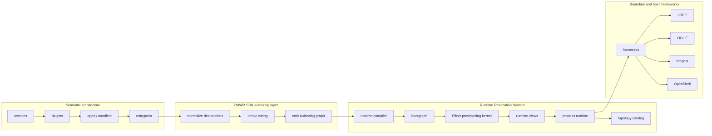
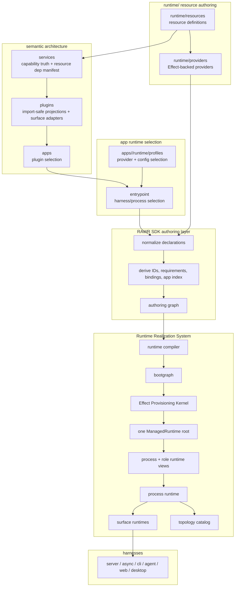

# RAWR Runtime Realization System

Status: Canonical  
Scope: Runtime realization, resource provisioning, Effect-backed execution, service attachment, plugin boundaries, native surface adapters, app runtime profiles, and SDK authoring derivation

## 1. Scope

This specification defines the canonical Runtime Realization System for RAWR.

The Runtime Realization System turns selected app composition into one started, typed, observable, stoppable process by using Effect as the provisioning substrate for resources, providers, layers, config, scopes, and process-local execution.

It fixes:

- the role of Effect inside RAWR
- the public/private boundary between Effect and the rest of the architecture
- the canonical runtime resource model
- resource, provider, layer, config, and managed-runtime authorship
- the RAWR SDK authoring layer that removes unnecessary manual wiring
- service-boundary attachment from provisioned runtime resources
- import-safe plugin definitions and plugin factories
- native surface adapter boundaries for API, CLI, async, web, agent, and desktop surfaces
- the app runtime profile and provisioning-selection model
- the runtime compiler, bootgraph, process runtime, and harness seams
- feed-forward wiring across resources, services, plugins, apps, entrypoints, and harnesses
- topology and observability emission from runtime realization
- canonical file topology for runtime authoring
- enforcement rules and forbidden patterns

This specification does not redefine:

- the full RAWR semantic architecture
- the complete service ontology outside runtime attachment
- the complete app/manifest ontology outside runtime realization
- oRPC semantics
- Inngest durable async semantics
- OCLIF command semantics
- OpenShell agent semantics
- Elysia or any other concrete harness internals
- desktop harness internals
- workstream, steward, tension, or governance semantics

Those systems remain owned by their own canonical specifications.

The stable semantic architecture is:

```text
app -> manifest -> role -> surface
```

The runtime realization chain is:

```text
entrypoint -> runtime compiler -> bootgraph -> Effect provisioning kernel -> process runtime -> harness -> process
```

The stable architectural rule is:

```text
scale changes placement, not semantic meaning
```

The runtime rule is:

```text
runtime realization makes execution explicit
without creating a second public semantic architecture
```

The authoring rule is:

```text
authors declare semantic variation
RAWR SDK derives mechanical wiring
runtime realizes the derived plan
```

---

## 2. Canonical thesis

The canonical thesis is:

```text
RAWR owns semantic meaning.
Effect owns provisioning mechanics.
RAWR SDK owns authoring derivation.
Boundary frameworks keep their jobs.
```

Effect is the canonical provisioning substrate for runtime realization.

Effect owns, inside the runtime layer:

- typed dependency construction
- resource acquisition and release
- layer composition
- scoped lifetime management
- config provisioning
- runtime-local services
- structured runtime errors
- process-local coordination
- managed process runtime ownership

Effect does not own, above the runtime layer:

- service truth
- callable service contracts
- plugin meaning
- app membership
- role/surface meaning
- public API semantics
- CLI command semantics
- durable workflow semantics
- domain governance

The first-principles cut is:

```text
Effect is public to runtime.
Effect is private to semantic architecture.
```

“Public to runtime” means runtime-resource authors, provider authors, substrate authors, process-runtime authors, and harness-integration authors may use Effect directly and idiomatically.

“Private to semantic architecture” means ordinary service, plugin, app, and entrypoint authors do not use raw Effect concepts as public RAWR authoring concepts. Services, plugins, and apps declare requirements and projections through RAWR-shaped APIs. The RAWR SDK normalizes those declarations. The runtime lowers the normalized plan into Effect.

Effect is visible where provisioning is the problem. It is not visible upward as a second service model, second app model, second plugin model, second command model, or second workflow model.

Effect’s runtime model executes an `Effect` against a `Runtime` containing the required resources in a `Context`; Effect describes `Runtime<R>` as the system that executes effects with a `Context<R>`, `FiberRefs`, and `RuntimeFlags`. citeturn907893view13 Effect layers and `Effect.Service` are the correct internal provider mechanics because they construct services and their dependency graph inside the runtime layer. citeturn907893view14

---

## 3. System boundary

The Runtime Realization System begins when an entrypoint asks to start one or more harnesses for an app.

It ends when each concrete harness receives mounted surface runtimes and the process is running.



The system owns process-local runtime realization, resource definitions and provider lowering, provider selection validation, Effect layer composition, managed runtime ownership, process and role scopes, runtime views, service-boundary attachment, mounted surface runtime assembly, harness handoff, runtime topology export, and deterministic shutdown.

The system does not own service contracts, business invariants, plugin capability truth, app composition authority, public HTTP route meaning, OCLIF command semantics, durable async orchestration semantics, shell governance, cross-process control-plane policy, or deployment-provider semantics.

The RAWR SDK authoring layer sits at the seam between public authoring and runtime realization. It owns mechanical derivation from declared facts. It does not own provisioning execution.

---

## 4. Naming and topology

### 4.1 Canonical names

The subsystem name is:

```text
Runtime Realization System
```

The public authoring seam is:

```text
RAWR SDK
```

The deepest Effect-backed execution component is:

```text
Effect Provisioning Kernel
```

The canonical top-level authoring root for runtime realization is:

```text
runtime/
```

The canonical public SDK package is:

```text
@rawr/sdk
```

HQ is one app built with the RAWR SDK. HQ is not a special application category. Examples may use `apps/hq` because it is the first app, not because the architecture privileges it.

### 4.2 Naming principles

Use standard engineering vocabulary wherever possible. Use the familiar noun, then narrow it in prose and invariants.

Canonical names:

- `PluginDefinition`, not `ColdProjectionDefinition`
- `PluginFactory`, not `ColdProjectionFactory`
- `PluginSet`, not a custom term when the concept is a grouped export of plugins
- `SurfaceAdapter`, not `NativeSurfaceAdapterDeclaration`
- `FunctionBundle`, not a custom async bundle term when the payload is an Inngest function bundle
- `RuntimeResource`, not special-case names such as `DbPoolThing`, `ClockThing`, or `InfrastructureDependency`
- `RuntimeProvider`, not `LayerFactoryWrapper`
- `RuntimeProfile`, not `InfrastructureBucket`

A plugin factory is import-safe and must not acquire resources. That constraint is defined by the plugin model. The word “cold” is not part of the public type name because it is a property of the factory, not the thing the factory is.

### 4.3 Canonical repo topology

```text
packages/
  rawr-sdk/
  shared-types/
  test-support/
  ... ordinary support packages ...

runtime/
  resources/
  providers/
  profiles/
  compiler/
  bootgraph/
  substrate/
    effect/
  process-runtime/
  harnesses/
    elysia/
    inngest/
    oclif/
    web/
    cli/
    agent/
    desktop/
  topology/

services/
  <service>/
  <family>/<service>/

plugins/
  server/
    api/
      <capability>/
    internal/
      <capability>/
  async/
    workflows/
      <capability>/
    schedules/
      <capability>/
    consumers/
      <capability>/
  cli/
    commands/
      <capability>/
  web/
    app/
      <capability>/
  agent/
    channels/
      <capability>/
    shell/
      <capability>/
    tools/
      <capability>/
  desktop/
    menubar/
      <capability>/
    windows/
      <capability>/
    background/
      <capability>/

apps/
  <app>/
    rawr.<app>.ts
    server.ts
    async.ts
    agent.ts
    web.ts
    cli.ts
    desktop.ts
    dev.ts
    runtime/
      profiles/
      resources.ts
      processes.ts
      config.ts
```

### 4.4 Why `runtime/` is top-level

`packages/` means support matter. Runtime realization is not only reusable support matter. It is the first-class place where process-local reality is defined: resource interfaces, resource providers, provider selection rules, Effect substrate composition, managed runtime ownership, bootgraph lifecycle, role/process scopes, harness handoff, and topology export.

Putting this under `packages/runtime/` hides that provisioning topology is a primary authoring location in the system.

`infrastructure/` or `infra/` is rejected because it commonly mixes deployment, networking, cloud resources, secrets, platform wiring, provider clients, local runtime modules, and environment config.

The invariant is:

```text
runtime/ owns process-local realization and provisioning authorship
apps/<app>/runtime/ owns app-specific runtime profile selection
```

### 4.5 Runtime root dependency posture

Services and plugins may import stable public runtime descriptor types through the RAWR SDK. They must not import Effect substrate internals, provider implementations, compiler internals, bootgraph internals, or harness internals.

The public resource descriptor seam is allowed because a service must be able to say what host-owned capability it needs.

The raw provisioning seam is not allowed because a service must not choose how the host satisfies that need.

---

## 5. External technology bindings

Effect is the canonical provisioning substrate for runtime resources, layers, config, scoped acquisition, managed runtime ownership, runtime-local services, and process-local coordination.

Effect Config is used for runtime-owned configuration because Effect’s config model describes configuration data with typed `Config<A>` values and supports redacted sensitive values through `Config.redacted`. citeturn907893view15

oRPC remains the canonical service/callable boundary and the API projection framework for server callable surfaces. oRPC context distinguishes initial context, supplied explicitly when invoking a procedure, from execution context, usually generated during procedure execution by middleware. citeturn907893view0 oRPC middleware can intercept execution and inject or guard execution context. citeturn907893view1 oRPC also separates RPC and OpenAPI handlers, which lets RAWR mount distinct API exposure lanes without changing service truth. citeturn907893view2turn907893view3

OCLIF remains the canonical CLI command framework. OCLIF plugins can contain commands and hooks like a CLI, OCLIF plugin loading resolves user, dev, and core plugins in a defined order, command discovery can be manifest-based, and commands are native OCLIF command classes with arguments, flags, and lifecycle behavior. citeturn907893view4turn907893view5turn907893view6turn907893view7 RAWR selects and materializes native OCLIF plugin packages; OCLIF discovers and dispatches commands.

Inngest remains the canonical durable async plane. Inngest functions are composed from triggers, flow control, and steps; steps provide retriable checkpoints for workflows. citeturn907893view8 Inngest supports event triggers, cron triggers, concurrency, throttling, rate limiting, idempotency, batching, and cancellation-related configuration through `createFunction`. citeturn907893view9 Inngest scheduled functions use cron schedules and support timezones. citeturn907893view10

Inngest functions may be exposed to Inngest through `serve()` or executed by long-running workers using `connect()`. The harness decides whether to use `serve` or `connect`; plugin authors provide function bundles, not transport decisions. citeturn907893view11turn907893view12

Elysia remains the default server harness unless another server harness is explicitly selected.

OpenShell remains the human-facing shell runtime substrate beneath the `agent` role.

---

# Components

## 6. Component: RAWR SDK Authoring Layer

### 6.1 Definition

The RAWR SDK is the canonical public authoring layer for RAWR apps, services, plugins, resources, providers, runtime profiles, and entrypoints.

It exposes stable authoring helpers and normalizes compact declarations into a fully explicit authoring graph for the runtime compiler.

Its job is to remove manual wiring that is shared, consistent, derivable, type-inferable, and non-variable.

The SDK does not hide logic through magic. It performs deterministic derivation from declared facts.

The authoring law is:

```text
author only what changes meaning or policy
infer wiring that is a pure consequence of typed declarations
emit the full explicit plan before runtime realization
```

### 6.2 Ownership

The RAWR SDK owns:

- public authoring helpers
- declaration normalization
- identity derivation
- resource requirement derivation from service dependency manifests
- service binding plan derivation
- ordinary binding cache-key derivation
- app role/surface index derivation from selected plugins
- runtime profile provider-selection normalization
- mirrored exposure defaulting
- harness role-selection derivation at entrypoints
- authoring graph emission
- structural diagnostics

The RAWR SDK does not own:

- resource acquisition
- provider execution
- Effect runtime construction
- service truth
- oRPC procedure semantics
- plugin capability meaning
- app membership authority
- durable async orchestration
- harness internals

### 6.3 Manual wiring reduction principle

Manual wiring is canonical only when it represents real variability.

Manual authoring is required for:

- stable resource IDs
- stable provider IDs
- stable service IDs
- capability names
- service semantic dependency shape
- plugin static options that change meaning
- app plugin selection
- runtime provider selection when more than one provider can satisfy a resource
- config sources and environment policy
- exposure policy
- non-resource semantic adapters
- multiple resource instances
- security, auth, rate-limit, or publication policy
- native surface facts that are stable at topology or harness boundaries

Manual authoring is not required for:

- plugin IDs derived from role/surface/capability/instance
- binding IDs derived from app/role/surface/capability/service/instance
- role/surface grouping in the app manifest when selected plugins already declare role/surface
- resource requirements derived from service `resourceDep(...)` declarations
- default resource lifetime
- default provider resource
- default provider config schema
- ordinary binding cache keys
- duplicated internal/published contracts when exposure policy says they are mirrored
- request trace forwarding for oRPC calls when using SDK-generated invocation-aware clients

### 6.4 Authoring graph

```ts
export interface AuthoringGraph {
  readonly app: NormalizedAppDefinition;
  readonly plugins: readonly NormalizedPluginDefinition[];
  readonly serviceUses: readonly NormalizedServiceUse[];
  readonly resourceRequirements: readonly ResourceRequirement[];
  readonly providerSelections: readonly NormalizedProviderSelection[];
  readonly harnesses: readonly HarnessDescriptor[];
  readonly diagnostics: readonly AuthoringDiagnostic[];
}
```

The runtime compiler consumes the authoring graph. It does not consume arbitrary user-authored shorthand directly.

### 6.5 Identity derivation

```ts
export interface IdentityPolicy {
  pluginId(input: {
    role: AppRole;
    surface: string;
    capability: string;
    instance?: string;
  }): string;

  serviceBindingId(input: {
    appId: string;
    role: AppRole;
    surface: string;
    capability: string;
    serviceId: string;
    instance?: string;
  }): string;

  serviceCacheKey(input: {
    processId: string;
    role: AppRole;
    surface: string;
    capability: string;
    serviceId: string;
    instance?: string;
    scopeHash: string;
    configHash: string;
  }): string;
}
```

Canonical identity derivation:

```text
plugin id:
  plugin:<role>:<surface>:<capability>[:<instance>]

service binding id:
  binding:<app>:<role>:<surface>:<capability>:<service>[:<instance>]

service cache key:
  cache:<process>:<role>:<surface>:<capability>:<service>[:<instance>]:<scopeHash>:<configHash>
```

Authors may override an identity only when the override represents a real separate instance or migration-stable identity. Cosmetic overrides are not canonical.

### 6.6 SDK import surfaces

```text
@rawr/sdk/service
@rawr/sdk/plugins
@rawr/sdk/plugins/server
@rawr/sdk/plugins/async
@rawr/sdk/plugins/cli
@rawr/sdk/plugins/web
@rawr/sdk/plugins/agent
@rawr/sdk/plugins/desktop
@rawr/sdk/runtime
@rawr/sdk/runtime/resources
@rawr/sdk/runtime/providers
@rawr/sdk/runtime/profiles
@rawr/sdk/app
```

A service package should export generic package seams from its own root:

```text
service
servicePackage
createClient
router
```

A plugin package should export generic plugin seams from its own root:

```text
plugin
createPlugin
plugins
createPlugins
```

A package may alias those imports at the app layer for readability, but the package boundary should not require bespoke export names when a generic factory or descriptor is the composable unit.

---

## 7. Component: Runtime Resource

### 7.1 Definition

A runtime resource is a typed, provisioned capability with an interface, lifetime, config shape, provider set, dependency requirements, runtime-view contribution, and acquisition/release semantics.

A runtime resource consolidates what otherwise appear to be special cases:

```text
clock
logger
telemetry
config
database pool
Drizzle database handle
PostHog client
filesystem
path
command execution
workspace root
repo root
cache
queue
pubsub hub
email provider client
SMS provider client
browser automation handle
OpenShell machine capability root
```

These are the same category:

```text
runtime resource =
  typed capability interface
  + lifetime
  + config shape
  + provider implementation
  + dependency requirements
  + runtime view contribution
  + provisioning scope
```

A runtime resource is not a service, plugin, or app. It does not own business truth, project capability into a surface, or select app membership. It is the provisioned substrate that lets semantic services and projected surfaces run.

### 7.2 Interfaces

```ts
export type ResourceLifetime = "process" | "role";

export interface RuntimeResource<
  TId extends string = string,
  TValue = unknown,
  TConfig = unknown,
> {
  readonly kind: "runtime.resource";
  readonly id: TId;
  readonly title: string;
  readonly purpose: string;
  readonly defaultLifetime: ResourceLifetime;
  readonly allowedLifetimes: readonly ResourceLifetime[];
  readonly configSchema?: RuntimeSchema<TConfig>;
  readonly view?: (value: TValue) => unknown;
  readonly __value?: TValue;
  readonly __config?: TConfig;
}

export function defineProcessResource<const TId extends string, TValue, TConfig = never>(input: {
  id: TId;
  title: string;
  purpose: string;
  configSchema?: RuntimeSchema<TConfig>;
  view?: (value: TValue) => unknown;
}): RuntimeResource<TId, TValue, TConfig>;

export function defineRoleResource<const TId extends string, TValue, TConfig = never>(input: {
  id: TId;
  title: string;
  purpose: string;
  configSchema?: RuntimeSchema<TConfig>;
  view?: (value: TValue) => unknown;
}): RuntimeResource<TId, TValue, TConfig>;

export function defineRuntimeResource<const TId extends string, TValue, TConfig = never>(input: {
  id: TId;
  title: string;
  purpose: string;
  defaultLifetime: ResourceLifetime;
  allowedLifetimes: readonly ResourceLifetime[];
  configSchema?: RuntimeSchema<TConfig>;
  view?: (value: TValue) => unknown;
}): RuntimeResource<TId, TValue, TConfig>;
```

Use `defineProcessResource` and `defineRoleResource` when the lifetime is fixed. Use `defineRuntimeResource` only when a resource genuinely supports multiple lifetimes.

Resource requirements are distinct from resource definitions:

```ts
export interface ResourceRequirement<TResource extends RuntimeResource = RuntimeResource> {
  readonly resource: TResource;
  readonly lifetime?: ResourceLifetime;
  readonly role?: AppRole;
  readonly optional?: boolean;
  readonly instance?: string;
  readonly reason: string;
}

export function requireResource<const TResource extends RuntimeResource>(
  resource: TResource,
  input?: Omit<ResourceRequirement<TResource>, "resource" | "reason"> & { reason?: string },
): ResourceRequirement<TResource>;
```

Plugin authors use `requireResource(...)` only for projection-local requirements that are not already implied by service uses.

### 7.3 Simple example

File: `runtime/resources/clock/src/resource.ts`  
Layer: runtime resource definition

```ts
import { defineProcessResource } from "@rawr/sdk/runtime/resources";

export interface Clock {
  now(): Date;
  nowIso(): string;
}

export const ClockResource = defineProcessResource<"rawr.clock", Clock>({
  id: "rawr.clock",
  title: "Clock",
  purpose: "Process-local time source used by services and runtime surfaces",
});
```

### 7.4 Realistic example

File: `runtime/resources/sql/src/resource.ts`  
Layer: runtime resource definition

```ts
import { defineProcessResource, RuntimeSchema } from "@rawr/sdk/runtime/resources";

export interface Sql {
  query<T>(text: string, params?: readonly unknown[]): Promise<readonly T[]>;
  queryOne<T>(text: string, params?: readonly unknown[]): Promise<T | null>;
}

export interface SqlPool {
  connect(): Promise<Sql> | Sql;
}

export const SqlPoolConfig = RuntimeSchema.struct({
  databaseUrl: RuntimeSchema.redactedString(),
  poolSize: RuntimeSchema.optional(RuntimeSchema.number()),
});

export const SqlPoolResource = defineProcessResource<
  "rawr.sql.pool",
  SqlPool,
  typeof SqlPoolConfig.Type
>({
  id: "rawr.sql.pool",
  title: "SQL Pool",
  purpose: "Process-scoped SQL connection pool",
  configSchema: SqlPoolConfig,
});
```

File: `runtime/resources/filesystem/src/resource.ts`  
Layer: runtime resource definition with multiple allowed lifetimes

```ts
import { defineRuntimeResource } from "@rawr/sdk/runtime/resources";

export interface FileSystem {
  readFileString(path: string): Promise<string>;
  writeFileString(path: string, content: string): Promise<void>;
  exists(path: string): Promise<boolean>;
}

export const FileSystemResource = defineRuntimeResource<"rawr.filesystem", FileSystem>({
  id: "rawr.filesystem",
  title: "File System",
  purpose: "File system capability exposed through a policy-aware runtime view",
  defaultLifetime: "process",
  allowedLifetimes: ["process", "role"],
});
```

### 7.5 Integration points

Services declare runtime resources through `resourceDep(...)` when they need host-owned prerequisites. Plugins declare extra runtime resource requirements only when projection logic itself needs them. Apps select providers for runtime resources in app runtime profiles. The SDK derives resource requirements from service uses and explicit plugin/harness requirements. The runtime compiler validates provider coverage. The Effect Provisioning Kernel acquires resource instances. Runtime views expose provisioned values to SDK-derived service binding, plugin projection, and harness integration.

---

## 8. Component: Runtime Provider

### 8.1 Definition

A runtime provider is a factory-like implementation plan for satisfying a runtime resource.

It maps:

```text
resource definition
  + config schema
  + dependency requirements
  + Effect Service / Layer / scoped acquisition
  -> provisioned runtime resource value
```

A provider is not the resource itself. It is one way to provision a resource.

A provider is import-safe until the runtime provisions it, declares the resource it provides, declares dependencies on other runtime resources, declares config requirements, lowers to Effect Layer or Effect Service internally, uses scoped acquisition for resources with release semantics, emits tagged runtime errors, does not read environment variables from plugin or service code, and does not select itself.

### 8.2 Interfaces

```ts
export interface RuntimeProvider<
  TResource extends RuntimeResource = RuntimeResource,
  TConfig = unknown,
> {
  readonly kind: "runtime.provider";
  readonly id: string;
  readonly title: string;
  readonly provides: TResource;
  readonly requires?: readonly ResourceRequirement[];
  readonly configSchema?: RuntimeSchema<TConfig>;
  readonly defaultConfigKey?: string;
  readonly effect: EffectProviderFactory<TResource, TConfig>;
}

export interface EffectProviderFactory<TResource extends RuntimeResource, TConfig> {
  readonly kind: "effect.provider.factory";

  build(input: {
    config: TConfig;
    resources: RuntimeResourceMap;
    scope: ProvisioningScope;
  }): EffectLayerFor<TResource>;
}

export function defineRuntimeProvider<
  const TResource extends RuntimeResource,
  TConfig = ResourceConfigOf<TResource>,
>(input: {
  id: string;
  title: string;
  provides: TResource;
  requires?: readonly ResourceRequirement[];
  configSchema?: RuntimeSchema<TConfig>;
  defaultConfigKey?: string;
  effect: EffectProviderFactory<TResource, TConfig>;
}): RuntimeProvider<TResource, TConfig>;
```

If `configSchema` is omitted, the provider inherits `provides.configSchema` when present.

If `defaultConfigKey` is omitted and the provider/resource has exactly one unambiguous config root, the SDK may derive it from the resource id by convention. Ambiguous config roots require explicit `configKey` at runtime profile selection.

`EffectLayerFor<TResource>` is legal only inside `runtime/providers/*` and `runtime/substrate/*`.

### 8.3 Simple example

File: `runtime/providers/clock-system/src/provider.ts`  
Layer: provider implementation

```ts
import { Effect } from "effect";
import { defineRuntimeProvider } from "@rawr/sdk/runtime/providers";
import { ClockResource, type Clock } from "@rawr/runtime/resources/clock";

class SystemClock extends Effect.Service<SystemClock>()("rawr/SystemClock", {
  sync: (): Clock => ({
    now: () => new Date(),
    nowIso: () => new Date().toISOString(),
  }),
}) {}

export const SystemClockProvider = defineRuntimeProvider({
  id: "rawr.provider.clock.system",
  title: "System Clock Provider",
  provides: ClockResource,
  effect: {
    kind: "effect.provider.factory",
    build: () => SystemClock.Default,
  },
});
```

### 8.4 Realistic example

File: `runtime/providers/postgres-sql/src/provider.ts`  
Layer: provider implementation

```ts
import { Effect } from "effect";
import { defineRuntimeProvider } from "@rawr/sdk/runtime/providers";
import {
  SqlPoolResource,
  SqlPoolConfig,
  type SqlPool,
} from "@rawr/runtime/resources/sql";

class PostgresSqlPool extends Effect.Service<PostgresSqlPool>()("rawr/PostgresSqlPool", {
  scoped: Effect.gen(function* () {
    const config = yield* RuntimeProviderConfig(SqlPoolConfig);

    const pool = yield* Effect.acquireRelease(
      Effect.promise(() => createPostgresPool({
        connectionString: config.databaseUrl.value,
        max: config.poolSize ?? 10,
      })),
      (pool) => Effect.promise(() => pool.end()),
    );

    return {
      connect: () => createSqlAdapter(pool),
    } satisfies SqlPool;
  }),
}) {}

export const PostgresSqlProvider = defineRuntimeProvider({
  id: "rawr.provider.sql.postgres",
  title: "Postgres SQL Pool Provider",
  provides: SqlPoolResource,
  configSchema: SqlPoolConfig,
  defaultConfigKey: "sql",
  effect: {
    kind: "effect.provider.factory",
    build: () => PostgresSqlPool.Default,
  },
});
```

---

## 9. Component: Runtime Profile

### 9.1 Definition

A runtime profile is the app-owned selection of resource providers, config sources, process shapes, and environment-specific runtime policy.

A runtime profile answers:

```text
For this app, in this environment, when this entrypoint starts these harnesses,
which providers satisfy which runtime resources?
```

A runtime profile is app-level selection, not provisioning execution.

Runtime profiles live in:

```text
apps/<app>/runtime/profiles/
```

A runtime profile is import-safe, selects providers and config sources, may define process-shape defaults, does not acquire resources, does not call provider constructors, does not run Effect, does not mount harnesses, and does not redefine service truth or plugin meaning.

### 9.2 Interfaces

```ts
export interface RuntimeProfile {
  readonly kind: "runtime.profile";
  readonly id: string;
  readonly appId: string;
  readonly title: string;
  readonly providers: readonly RuntimeProviderSelection[];
  readonly configSources: readonly RuntimeConfigSource[];
  readonly processDefaults?: ProcessRuntimeDefaults;
}

export interface RuntimeProviderSelection<TProvider extends RuntimeProvider = RuntimeProvider> {
  readonly provider: TProvider;
  readonly resource: RuntimeResource;
  readonly lifetime: ResourceLifetime;
  readonly role?: AppRole;
  readonly instance?: string;
  readonly config?: RuntimeConfigBinding;
}

export type RuntimeProviderSelectionInput<TProvider extends RuntimeProvider = RuntimeProvider> =
  | TProvider
  | {
      readonly provider: TProvider;
      readonly lifetime?: ResourceLifetime;
      readonly role?: AppRole;
      readonly instance?: string;
      readonly configKey?: string;
      readonly config?: RuntimeConfigBinding;
    };

export function useProvider<const TProvider extends RuntimeProvider>(
  provider: TProvider,
  input?: Omit<Extract<RuntimeProviderSelectionInput<TProvider>, object>, "provider">,
): RuntimeProviderSelectionInput<TProvider>;

export function defineAppRuntime<const TApp extends AppDefinition>(
  app: TApp,
  input: {
    profiles: Record<string, {
      title?: string;
      providers: readonly RuntimeProviderSelectionInput[];
      configSources?: readonly RuntimeConfigSource[];
      processDefaults?: ProcessRuntimeDefaults;
    }>;
  },
): AppRuntimeDefinition<TApp>;
```

### 9.3 Simple example

File: `apps/hq/runtime/profiles/local.ts`  
Layer: app runtime profile

```ts
import { defineAppRuntime } from "@rawr/sdk/runtime";
import { app } from "../../rawr.hq";
import { SystemClockProvider } from "@rawr/runtime/providers/clock-system";
import { ConsoleLoggerProvider } from "@rawr/runtime/providers/logger-console";

export const runtime = defineAppRuntime(app, {
  profiles: {
    local: {
      providers: [SystemClockProvider, ConsoleLoggerProvider],
    },
  },
});
```

### 9.4 Realistic example

File: `apps/hq/runtime/profiles/local.ts`  
Layer: app runtime profile

```ts
import {
  defineAppRuntime,
  useProvider,
  env,
  dotenv,
} from "@rawr/sdk/runtime";
import { app } from "../../rawr.hq";
import { SystemClockProvider } from "@rawr/runtime/providers/clock-system";
import { ConsoleLoggerProvider } from "@rawr/runtime/providers/logger-console";
import { PostgresSqlProvider } from "@rawr/runtime/providers/postgres-sql";
import { NodeFileSystemProvider } from "@rawr/runtime/providers/filesystem-node";
import { LocalWorkspaceProvider } from "@rawr/runtime/providers/workspace-local";

export const runtime = defineAppRuntime(app, {
  profiles: {
    local: {
      configSources: [
        env({ prefix: "RAWR_" }),
        dotenv(".env.local", { optional: true }),
      ],
      providers: [
        SystemClockProvider,
        ConsoleLoggerProvider,
        useProvider(PostgresSqlProvider, { configKey: "sql" }),
        NodeFileSystemProvider,
        LocalWorkspaceProvider,
      ],
    },
  },
});
```

---

## 10. Component: Service Boundary Attachment

### 10.1 Definition

Service boundary attachment is the runtime operation that connects provisioned runtime resources and explicit adapters to a service’s construction-time boundary lanes.

It produces a bound service client or callable boundary.

The canonical authoring form is `useService(...)`. The canonical runtime operation is the SDK-derived binding plan.

Service boundary attachment attaches only `deps`, `scope`, and `config`; does not seed `provided`; does not pass invocation context as construction-time context; does not choose service contracts; does not own service implementation; derives ordinary resource deps from service dependency manifests; requires explicit adapters for semantic deps; caches bound clients by derived process/role/surface/capability/service/scope/config key; is transport-neutral; and preserves oRPC as the service/callable boundary.

The lane split is fixed:

```text
deps       = stable host-owned prerequisites and baseline capabilities
scope      = stable business/client-instance identity
config     = stable service behavior/config
invocation = per-call input supplied by harness/caller
provided   = execution-time middleware output
```

### 10.2 Dependency declarations

Service dependencies are declared once at the service boundary.

There are two dependency kinds:

```text
resource dependency
  generic runtime capability that the host can provision automatically

semantic dependency
  service-owned or domain-owned abstraction that requires an adapter
```

```ts
export type ServiceDependency<TValue> =
  | ResourceServiceDependency<RuntimeResource<any, TValue, any>>
  | SemanticServiceDependency<TValue>;

export interface ResourceServiceDependency<TResource extends RuntimeResource = RuntimeResource> {
  readonly kind: "service.dep.resource";
  readonly resource: TResource;
  readonly optional?: boolean;
  readonly instance?: string;
  readonly reason?: string;
}

export interface SemanticServiceDependency<TValue = unknown> {
  readonly kind: "service.dep.semantic";
  readonly id: string;
  readonly title: string;
  readonly purpose: string;
  readonly optional?: boolean;
  readonly __value?: TValue;
}

export function resourceDep<const TResource extends RuntimeResource>(
  resource: TResource,
  input?: { optional?: boolean; instance?: string; reason?: string },
): ResourceServiceDependency<TResource>;

export function semanticDep<TValue>(input: {
  id: string;
  title: string;
  purpose: string;
  optional?: boolean;
}): SemanticServiceDependency<TValue>;
```

The SDK derives resource requirements only from `resourceDep(...)` declarations. The SDK does not guess how to satisfy `semanticDep(...)`. A semantic dependency requires an explicit adapter at service-use time because it represents real meaning, not generic provisioning.

### 10.3 Service package layering

A service package has a stable shell:

```text
services/<service>/
  src/
    service/
      base.ts       service definition, context lanes, package-wide service base
      contract.ts   oRPC contract / procedures
      impl.ts       package-wide implementation assembly seam
      router.ts     router composition seam
      modules/      service-internal domain modules
      shared/       earned service-internal shared support
    client.ts       package-boundary client seam
    router.ts       package-boundary router export seam
    index.ts        thin public export seam
```

The surface/exit files are the only files external authors should normally touch:

```text
src/client.ts
src/router.ts
src/index.ts
```

Service internals live one layer down under `src/service/`.

The layers do not mix.

### 10.4 Simple service example

File: `services/example-todo/src/service/base.ts`  
Layer: service definition

```ts
import {
  defineService,
  resourceDep,
  RuntimeSchema,
} from "@rawr/sdk/service";
import { ClockResource } from "@rawr/runtime/resources/clock";
import { SqlPoolResource } from "@rawr/runtime/resources/sql";

export const service = defineService({
  id: "example-todo",
  boundary: {
    deps: {
      dbPool: resourceDep(SqlPoolResource),
      clock: resourceDep(ClockResource),
    },
    scope: RuntimeSchema.struct({
      workspaceId: RuntimeSchema.string(),
    }),
    config: RuntimeSchema.struct({
      readOnly: RuntimeSchema.boolean({ default: false }),
    }),
    invocation: RuntimeSchema.struct({
      traceId: RuntimeSchema.string(),
    }),
  },
});
```

File: `services/example-todo/src/client.ts`  
Layer: service package exit point

```ts
import { defineServicePackage } from "@rawr/sdk/service";
import { service } from "./service/base";
import { router } from "./service/router";

export const servicePackage = defineServicePackage({
  service,
  router,
});

export const createClient = servicePackage.createClient;
export type Client = typeof servicePackage.Client;
```

### 10.5 Realistic service topology

```text
services/example-todo/
  src/
    service/
      base.ts
      contract.ts
      impl.ts
      router.ts
      modules/
        tasks/
          contract.ts
          impl.ts
          router.ts
          repository.ts
          policy.ts
        projects/
          contract.ts
          impl.ts
          router.ts
          repository.ts
          policy.ts
      shared/
        types.ts
        errors.ts
    db/
      schema/
      migrations/
      repositories/
    client.ts
    router.ts
    index.ts
```

File: `services/example-todo/src/service/router.ts`  
Layer: service-internal router composition seam

```ts
import { tasksRouter } from "./modules/tasks/router";
import { projectsRouter } from "./modules/projects/router";

export const router = {
  tasks: tasksRouter,
  projects: projectsRouter,
};
```

File: `services/example-todo/src/router.ts`  
Layer: package exit point

```ts
export { router } from "./service/router";
```

The service may have many internal modules. The exported package still presents one service boundary.

---

## 11. Component: Plugin Definition

### 11.1 Definition

A plugin is a runtime projection package.

It translates service truth into role- and surface-specific runtime contributions.

A plugin is not:

- a service
- a runtime provider
- a bootgraph
- a process runtime
- an app manifest
- a process-wide authority object
- a mini-framework

A plugin may be framework-native inside its surface lane. API plugins may use oRPC internally. CLI plugins may use OCLIF internally. Async workflow and schedule plugins may use Inngest internally. This is not leakage when the public plugin boundary stays RAWR-shaped.

The governing rule is:

```text
Plugins are RAWR-shaped at the architectural boundary
and framework-native inside the matching surface adapter.
```

### 11.2 Import-safe plugin factory

A plugin package exports a plugin definition or plugin factory.

A plugin factory is import-safe. It receives static app-level options and returns one or more plugin definitions.

Import-safe means:

- no resource acquisition
- no provider construction
- no database connection
- no network connection
- no filesystem read/write except statically imported module metadata explicitly sanctioned by tooling
- no environment variable reads
- no `Effect.run*`
- no `ManagedRuntime` creation
- no `Layer` construction as public app/plugin output
- no harness mount
- no process start
- deterministic return value for the same static inputs
- safe to import during compile, test, graph extraction, codegen, and topology inspection

A plugin factory may validate static options, close over imported contracts, close over service package descriptors, declare service uses, declare extra resource requirements, declare surface adapter facts, declare topology metadata, declare exposure metadata, and return a plugin definition object.

### 11.3 Interfaces

```ts
export type AppRole =
  | "server"
  | "async"
  | "cli"
  | "web"
  | "agent"
  | "desktop";

export interface PluginDefinition<
  TRole extends AppRole = AppRole,
  TSurface extends string = string,
  TServices extends ServiceUseMap = ServiceUseMap,
  TAdapter extends SurfaceAdapter = SurfaceAdapter,
> {
  readonly kind: "plugin.definition";
  readonly id: string;
  readonly role: TRole;
  readonly surface: TSurface;
  readonly capability: string;
  readonly instance?: string;

  readonly services: TServices;
  readonly explicitRequirements: readonly ResourceRequirement[];
  readonly requirements: readonly ResourceRequirement[];
  readonly adapter: TAdapter;

  project(input: PluginProjectInput<TServices, TAdapter>): SurfaceContribution<TAdapter>;
}

export interface PluginProjectInput<
  TServices extends ServiceUseMap,
  TAdapter extends SurfaceAdapter,
> {
  readonly clients: InvocationAwareClientMap<TServices>;
  readonly process: ProcessRuntimeView;
  readonly role: RoleRuntimeView;
  readonly app: AppRuntimeIdentity;
  readonly adapter: TAdapter;
}

export type PluginFactory<TOptions, TPlugin extends PluginDefinition> =
  (options: Readonly<TOptions>) => TPlugin;

export type PluginExport =
  | PluginDefinition
  | readonly PluginDefinition[];

export type PluginSet<TOptions = unknown> =
  (options: Readonly<TOptions>) => PluginExport;
```

The canonical unit is still `PluginDefinition`.

`PluginSet` is an authoring convenience for packages that export multiple related plugin definitions. The SDK flattens plugin sets into ordinary plugin definitions. A plugin set is not a new architecture kind.

### 11.4 Plugin builders

```ts
export const defineServerApiPlugin: SurfacePluginBuilder<"server", "api", ServerApiAdapter>;
export const defineServerInternalPlugin: SurfacePluginBuilder<"server", "internal", ServerCallableAdapter>;
export const defineAsyncWorkflowPlugin: SurfacePluginBuilder<"async", "workflows", InngestWorkflowAdapter>;
export const defineAsyncSchedulePlugin: SurfacePluginBuilder<"async", "schedules", InngestScheduleAdapter>;
export const defineAsyncConsumerPlugin: SurfacePluginBuilder<"async", "consumers", AsyncConsumerAdapter>;
export const defineCliCommandPlugin: SurfacePluginBuilder<"cli", "commands", OclifAdapter>;
export const defineWebAppPlugin: SurfacePluginBuilder<"web", "app", WebAppAdapter>;
export const defineAgentChannelPlugin: SurfacePluginBuilder<"agent", "channels", AgentChannelAdapter>;
export const defineAgentShellPlugin: SurfacePluginBuilder<"agent", "shell", AgentShellAdapter>;
export const defineAgentToolPlugin: SurfacePluginBuilder<"agent", "tools", AgentToolAdapter>;
export const defineDesktopMenubarPlugin: SurfacePluginBuilder<"desktop", "menubar", DesktopMenubarAdapter>;
export const defineDesktopWindowPlugin: SurfacePluginBuilder<"desktop", "windows", DesktopWindowAdapter>;
export const defineDesktopBackgroundPlugin: SurfacePluginBuilder<"desktop", "background", DesktopBackgroundAdapter>;
```

Each builder supplies role and surface facts. The author supplies capability, options, services, explicit requirements, adapter facts, and projection behavior.

### 11.5 Plugin package layering

A plugin package has the same hierarchical discipline as a service package.

The plugin’s authoritative boundary file is:

```text
src/plugin.ts
```

That file is the plugin equivalent of a service’s package boundary file. It declares the plugin’s role/surface/capability, service uses, explicit resource requirements, surface adapter facts, and projection entrypoint.

Framework-native internals live under `src/internal/`, `src/routes/`, `src/commands/`, `src/functions/`, `src/schedules/`, `src/modules/`, or another surface-specific internal directory. They are not app-facing composition seams.

### 11.6 Simple plugin topology

```text
plugins/server/api/example-todo/
  src/
    plugin.ts
    router.ts
    index.ts
```

File: `plugins/server/api/example-todo/src/plugin.ts`  
Layer: plugin boundary file exported to app layer

```ts
import {
  defineServerApiPlugin,
  useService,
} from "@rawr/sdk/plugins/server";
import { servicePackage as todoService } from "@rawr/example-todo";
import { contract } from "./router";
import { createRouter } from "./router";

export interface Options {
  workspaceId: string;
}

export const createPlugin = defineServerApiPlugin.factory<Options>()({
  capability: "example-todo",
  exposure: {
    published: {
      routeBase: "/todos",
      contract,
      policy: { auth: "required-user", rateLimit: "public-user-api" },
    },
  },
  services: {
    todo: (options) => useService(todoService, {
      scope: { workspaceId: options.workspaceId },
      config: {},
    }),
  },
  adapter: {
    kind: "server.api",
  },
  project({ clients }) {
    return {
      router: createRouter({ todo: clients.todo }),
    };
  },
});
```

File: `plugins/server/api/example-todo/src/index.ts`  
Layer: plugin package exit point

```ts
export { createPlugin } from "./plugin";
```

### 11.7 Realistic plugin topology

```text
plugins/server/api/user/
  src/
    plugin.ts                 boundary file exported to apps
    index.ts                  package exit point
    internal/
      exposure.ts             API exposure policy helpers
      context.ts              ORPC initial/execution context shape
      middleware.ts           ORPC middleware composition
    routes/
      account/
        contract.ts
        router.ts
      billing/
        contract.ts
        router.ts
      organization/
        contract.ts
        router.ts
      index.ts                route-module composition
```

File: `plugins/server/api/user/src/plugin.ts`  
Layer: plugin boundary file exported to app layer

```ts
import {
  defineServerApiPlugin,
  useService,
} from "@rawr/sdk/plugins/server";
import { servicePackage as billing } from "@rawr/billing";
import { servicePackage as orgs } from "@rawr/orgs";
import { servicePackage as identity } from "@rawr/identity";
import { publicUserContract } from "./routes";
import { createPublicUserRouter } from "./routes";
import { publicPolicy } from "./internal/exposure";

export interface Options {
  workspaceId: string;
}

export const createPlugin = defineServerApiPlugin.factory<Options>()({
  capability: "user-api",
  exposure: {
    published: {
      routeBase: "/user",
      contract: publicUserContract,
      policy: publicPolicy,
      context: {
        initial: ["headers", "requestId"],
        execution: ["authClaims", "rateLimitDecision"],
      },
    },
  },
  services: {
    billing: (options) => useService(billing, {
      scope: { workspaceId: options.workspaceId },
      config: {},
    }),
    orgs: (options) => useService(orgs, {
      scope: { workspaceId: options.workspaceId },
      config: {},
    }),
    identity: (options) => useService(identity, {
      scope: { workspaceId: options.workspaceId },
      config: {},
    }),
  },
  adapter: {
    kind: "server.api",
  },
  project({ clients }) {
    return {
      router: createPublicUserRouter({
        billing: clients.billing,
        orgs: clients.orgs,
        identity: clients.identity,
      }),
    };
  },
});
```

File: `plugins/server/api/user/src/routes/index.ts`  
Layer: internal API module composition

```ts
import { accountContract, createAccountRouter } from "./account/router";
import { billingContract, createBillingRouter } from "./billing/router";
import { organizationContract, createOrganizationRouter } from "./organization/router";

export const publicUserContract = {
  account: accountContract,
  billing: billingContract,
  organization: organizationContract,
};

export function createPublicUserRouter(clients: {
  billing: BillingClient;
  orgs: OrgClient;
  identity: IdentityClient;
}) {
  return {
    account: createAccountRouter(clients),
    billing: createBillingRouter(clients),
    organization: createOrganizationRouter(clients),
  };
}
```

This realistic example is the default mental model. A plugin may compose multiple services and expose higher-order procedures. It must not be modeled as a 1:1 mirror of a service package unless that is genuinely the surface being shipped.

---

# Surface Adapter Model

## 12. Component: Surface Adapter

### 12.1 Definition

A surface adapter is the framework-native declaration and runtime contribution shape for a plugin’s role/surface family.

A plugin remains RAWR-shaped at the architectural boundary. The surface adapter is the narrow place where native framework reality becomes visible to runtime compilation, topology, and harness mounting.

A surface adapter exposes enough native facts for RAWR to select, provision, inspect, and mount the surface. It does not expose native framework runtime mechanics as app composition authority, resource provisioning authority, or service truth.

The rule is:

```text
The plugin owns native projection.
The harness owns native mounting.
The service owns capability truth.
The app owns selection.
The runtime owns provisioning.
```

### 12.2 Interfaces

```ts
export type SurfaceAdapter =
  | ServerCallableAdapter
  | OclifAdapter
  | InngestWorkflowAdapter
  | InngestScheduleAdapter
  | AsyncConsumerAdapter
  | WebAppAdapter
  | AgentChannelAdapter
  | AgentShellAdapter
  | AgentToolAdapter
  | DesktopMenubarAdapter
  | DesktopWindowAdapter
  | DesktopBackgroundAdapter;

export interface SurfaceContribution<TAdapter extends SurfaceAdapter = SurfaceAdapter> {
  readonly adapter: TAdapter;
  readonly value: unknown;
  readonly topology?: SurfaceTopology;
}
```

### 12.3 Boundary-exposed versus internal-only

A surface adapter may expose:

- role
- surface
- capability
- instance
- route base
- command identity
- function id
- trigger
- cron
- native package identity
- exposure policy
- auth/rate limit posture
- contract identity
- topology metadata
- harness mount payload

A surface adapter must not expose:

- raw Effect layers
- provider implementations
- resource acquisition
- service internals
- domain write authority
- app membership decisions
- private framework implementation details that the harness does not need

### 12.4 Simple and realistic examples

Each surface family below provides a simple `n=1` example and a realistic scaled structure. The simple example is illustrative only. The realistic structure is the default planning target.

---

## 13. Component: Server Callable Surface Adapter

### 13.1 Definition

A server callable surface adapter projects bound service clients into oRPC routers and related exposure lanes.

There are two server callable surfaces:

```text
plugins/server/api/*       public or externally published API projections
plugins/server/internal/*  trusted/internal API projections
```

`server/api` and `server/internal` are separate surfaces because they usually differ in exposure, trust assumptions, policy, and topology.

A public API and an internal admin API over the same service should be separate plugins when route shape, caller class, authorization, or policy differs.

A single plugin may expose both internal and published lanes only when the lanes are materially mirrored.

### 13.2 Boundary facts

Server callable plugins must expose:

- `capability`
- surface: `api` or `internal`
- one or more exposure lanes
- oRPC contract per exposure lane
- route base when mounted under a path
- boundary policy: auth, rate limit, caller class, trust assumption
- context declaration: initial and execution context requirements
- service uses
- projection function that returns oRPC router contributions

Server callable plugins must keep internal:

- raw oRPC middleware implementation
- router composition details
- procedure handler code
- OpenAPI generation details
- Elysia mounting mechanics
- request parsing details

### 13.3 Interfaces

```ts
export type ServerExposureKind = "published" | "internal";

export interface BoundaryPolicy {
  readonly auth:
    | "required-user"
    | "required-service"
    | "private-infrastructure"
    | "none";
  readonly rateLimit?: string;
  readonly callerClass?: "public-user" | "internal-admin" | "service" | "trusted-operator";
}

export interface BoundaryContextDeclaration {
  readonly initial?: readonly string[];
  readonly execution?: readonly string[];
}

export interface ServerExposure {
  readonly kind: ServerExposureKind;
  readonly routeBase?: string;
  readonly contract: unknown;
  readonly policy: BoundaryPolicy;
  readonly context?: BoundaryContextDeclaration;
}

export interface ServerCallableAdapter {
  readonly kind: "server.callable";
  readonly exposures: readonly ServerExposure[];
}

export interface ServerCallableContribution {
  readonly exposures: readonly {
    readonly kind: ServerExposureKind;
    readonly routeBase?: string;
    readonly contract: unknown;
    readonly router: unknown;
    readonly policy: BoundaryPolicy;
    readonly context?: BoundaryContextDeclaration;
  }[];
}
```

### 13.4 Simple public API plugin

File: `plugins/server/api/example-todo/src/plugin.ts`  
Layer: plugin boundary file exported to app layer

```ts
export const createPlugin = defineServerApiPlugin.factory<{ workspaceId: string }>()({
  capability: "example-todo-public",
  exposure: {
    published: {
      routeBase: "/todos",
      contract: publicTodoContract,
      policy: {
        auth: "required-user",
        rateLimit: "public-user-api",
        callerClass: "public-user",
      },
      context: {
        initial: ["headers", "requestId"],
        execution: ["authClaims", "rateLimitDecision"],
      },
    },
  },
  services: {
    todo: (options) => useService(todoService, {
      scope: { workspaceId: options.workspaceId },
      config: { readOnly: false },
    }),
  },
  adapter: { kind: "server.callable" },
  project({ clients }) {
    return {
      exposures: [{
        kind: "published",
        routeBase: "/todos",
        contract: publicTodoContract,
        router: createPublicTodoRouter({ todo: clients.todo }),
        policy: {
          auth: "required-user",
          rateLimit: "public-user-api",
          callerClass: "public-user",
        },
      }],
    };
  },
});
```

### 13.5 Realistic public/internal API topology

```text
plugins/server/api/user/
  src/
    plugin.ts
    index.ts
    internal/
      exposure.ts
      context.ts
      middleware.ts
    routes/
      account/
        contract.ts
        router.ts
      billing/
        contract.ts
        router.ts
      organization/
        contract.ts
        router.ts
      index.ts

plugins/server/internal/user-admin/
  src/
    plugin.ts
    index.ts
    internal/
      exposure.ts
      context.ts
      middleware.ts
    routes/
      workspace/
        contract.ts
        router.ts
      project/
        contract.ts
        router.ts
      impersonation/
        contract.ts
        router.ts
      index.ts
```

File: `plugins/server/internal/user-admin/src/plugin.ts`  
Layer: plugin boundary file exported to app layer

```ts
export const createPlugin = defineServerInternalPlugin.factory<{ workspaceId: string }>()({
  capability: "user-admin",

  exposure: {
    internal: {
      routeBase: "/admin/user",
      contract: adminUserContract,
      policy: {
        auth: "private-infrastructure",
        rateLimit: "internal-admin-api",
        callerClass: "internal-admin",
      },
      context: {
        initial: ["headers", "requestId"],
        execution: ["operatorIdentity", "rateLimitDecision"],
      },
    },
  },

  services: {
    billing: (options) => useService(billingService, {
      scope: { workspaceId: options.workspaceId },
      config: {},
    }),
    orgs: (options) => useService(orgService, {
      scope: { workspaceId: options.workspaceId },
      config: {},
    }),
    identity: (options) => useService(identityService, {
      scope: { workspaceId: options.workspaceId },
      config: {},
    }),
  },

  adapter: { kind: "server.callable" },

  project({ clients }) {
    return {
      exposures: [{
        kind: "internal",
        routeBase: "/admin/user",
        contract: adminUserContract,
        router: createAdminUserRouter(clients),
        policy: {
          auth: "private-infrastructure",
          rateLimit: "internal-admin-api",
          callerClass: "internal-admin",
        },
      }],
    };
  },
});
```

The plugin composes services into a higher-order API. It does not expose service procedures 1:1 by default. A 1:1 pass-through API is allowed only when that is the intended API shape.

---

## 14. Component: CLI OCLIF Surface Adapter

### 14.1 Definition

A CLI plugin is a RAWR plugin projection that materializes as a native OCLIF plugin package.

RAWR must not build a second CLI discovery or dispatch plane.

The canonical rule is:

```text
RAWR selects and materializes native OCLIF plugins.
OCLIF discovers and dispatches commands.
```

A CLI plugin package is both:

- a RAWR plugin package under `plugins/cli/commands/<capability>/`
- an OCLIF plugin package with native OCLIF package metadata, commands, and hooks

### 14.2 Boundary facts

CLI plugins must expose:

- capability
- native package name
- local root or package root
- OCLIF command metadata
- OCLIF manifest path when generated
- service uses
- projection-local requirements
- materialization mode: workspace/dev/core/user when relevant
- topology/diagnostic facts for link/install state

CLI plugins must keep internal:

- OCLIF command class implementation
- command parse/run internals
- hook implementation
- terminal presentation logic
- service call details inside command handlers

### 14.3 Interfaces

```ts
export interface OclifAdapter {
  readonly kind: "cli.oclif";
  readonly packageName: string;
  readonly localRoot?: string;
  readonly oclif: {
    readonly commands: string;
    readonly typescriptCommands?: string;
    readonly hooks?: Record<string, string | readonly string[]>;
    readonly topicSeparator?: string;
    readonly manifestPath?: string;
  };
}

export interface CliOclifPluginRuntime {
  readonly projectionId: string;
  readonly capability: string;
  readonly packageName: string;
  readonly localRoot?: string;
  readonly oclif: OclifAdapter["oclif"];
  readonly serviceAttachments: readonly string[];
}

export interface CliSurfaceRuntime {
  readonly role: "cli";
  readonly surface: "commands";
  readonly oclifPlugins: readonly CliOclifPluginRuntime[];
}
```

`CliSurfaceRuntime` is an OCLIF materialization plan. It is not a command dispatch table.

### 14.4 Simple CLI plugin

```text
plugins/cli/commands/todo/
  package.json
  oclif.manifest.json
  src/
    plugin.ts
    commands/
      todo/list.ts
    index.ts
```

File: `plugins/cli/commands/todo/package.json`  
Layer: native OCLIF package metadata

```json
{
  "name": "@rawr/plugin-cli-todo",
  "oclif": {
    "commands": "./dist/commands",
    "typescript": {
      "commands": "./src/commands"
    }
  }
}
```

File: `plugins/cli/commands/todo/src/plugin.ts`  
Layer: RAWR plugin boundary file exported to app layer

```ts
import { defineCliCommandPlugin, useService } from "@rawr/sdk/plugins/cli";
import { servicePackage as todoService } from "@rawr/example-todo";

export const createPlugin = defineCliCommandPlugin.factory<{ workspaceId: string }>()({
  capability: "todo-cli",
  services: {
    todo: (options) => useService(todoService, {
      scope: { workspaceId: options.workspaceId },
      config: {},
    }),
  },
  adapter: {
    kind: "cli.oclif",
    packageName: "@rawr/plugin-cli-todo",
    oclif: {
      commands: "./dist/commands",
      typescriptCommands: "./src/commands",
      manifestPath: "./oclif.manifest.json",
    },
  },
});
```

File: `plugins/cli/commands/todo/src/commands/todo/list.ts`  
Layer: native OCLIF command implementation

```ts
import { Command } from "@oclif/core";
import { getRuntimeClient } from "../../internal/runtime-client";

export default class TodoList extends Command {
  static summary = "List todo tasks";

  async run() {
    const todo = await getRuntimeClient("example-todo");
    const tasks = await todo.tasks.list({});
    this.log(JSON.stringify(tasks, null, 2));
  }
}
```

### 14.5 Realistic CLI topology

```text
plugins/cli/commands/session/
  package.json
  oclif.manifest.json
  src/
    plugin.ts
    index.ts
    internal/
      runtime-client.ts
      output.ts
      flags.ts
    commands/
      session/
        list.ts
        show.ts
        analyze.ts
      session/index.ts
    hooks/
      init.ts
      prerun.ts
```

File: `plugins/cli/commands/session/src/plugin.ts`  
Layer: RAWR plugin boundary file exported to app layer

```ts
export const createPlugin = defineCliCommandPlugin.factory<{ workspaceId: string }>()({
  capability: "session-cli",

  services: {
    sessions: (options) => useService(sessionIntelligenceService, {
      scope: { workspaceId: options.workspaceId },
      config: {},
    }),
  },

  adapter: {
    kind: "cli.oclif",
    packageName: "@rawr/plugin-cli-session",
    oclif: {
      commands: "./dist/commands",
      typescriptCommands: "./src/commands",
      hooks: {
        init: "./dist/hooks/init",
        prerun: "./dist/hooks/prerun",
      },
      topicSeparator: ":",
      manifestPath: "./oclif.manifest.json",
    },
  },
});
```

The command package may contain many commands and hooks. The app still selects one plugin projection. OCLIF remains the dispatcher.

---

## 15. Component: Async Inngest Surface Adapters

### 15.1 Definition

Async plugins project service truth into durable async surfaces.

There are three canonical async surfaces:

```text
plugins/async/workflows/*   event-triggered durable workflow functions
plugins/async/schedules/*   cron/time-triggered durable functions
plugins/async/consumers/*   durable or host-backed consumer/bridge functions
```

Inngest function bundles are the native async payload. A function bundle is the harness-facing unit that contains one or more Inngest functions plus topology-visible declarations.

The canonical rule is:

```text
Inngest functions are execution runtime payloads.
They are not public API contracts.
```

Public invocation, status, cancellation, retry, or admin control should normally enter through a server API or internal API plugin, call service boundaries, and emit Inngest events. Raw Inngest functions are not the public invocation surface.

### 15.2 Boundary facts

Workflow plugins must expose:

- capability
- service uses
- function bundle declaration
- stable function IDs
- event triggers
- flow control declarations when used
- projection function that creates native Inngest functions after provisioning

Schedule plugins must expose:

- capability
- service uses
- schedule id
- cron expression
- timezone when present
- function id
- projection function that creates native Inngest scheduled functions after provisioning

Consumer plugins must expose:

- capability
- source identity
- event or stream subscription declaration
- flow-control and checkpoint posture when relevant
- projection function that creates the consumer runtime

Async plugins must keep internal:

- function bodies
- step bodies
- retry checkpoint implementation
- event payload interpretation after validation
- local helpers
- service call choreography details

### 15.3 Interfaces

```ts
export interface InngestFunctionDeclaration {
  readonly id: string;
  readonly title?: string;
  readonly trigger:
    | { kind: "event"; name: string }
    | { kind: "cron"; expression: string; timezone?: string };
  readonly flow?: {
    readonly concurrency?: unknown;
    readonly throttle?: unknown;
    readonly rateLimit?: unknown;
    readonly idempotency?: string;
    readonly cancelOn?: readonly unknown[];
    readonly timeouts?: unknown;
  };
}

export interface FunctionBundleDeclaration {
  readonly kind: "inngest.function-bundle";
  readonly functions: readonly InngestFunctionDeclaration[];
}

export interface FunctionBundleRuntime {
  readonly kind: "inngest.function-bundle.runtime";
  readonly client: unknown;
  readonly functions: readonly unknown[];
}

export interface InngestWorkflowAdapter {
  readonly kind: "async.inngest.workflow";
  readonly bundle: FunctionBundleDeclaration;
}

export interface InngestScheduleAdapter {
  readonly kind: "async.inngest.schedule";
  readonly schedule: {
    readonly id: string;
    readonly cron: string;
    readonly timezone?: string;
  };
  readonly bundle: FunctionBundleDeclaration;
}

export interface AsyncSurfaceRuntime {
  readonly role: "async";
  readonly workflows: readonly FunctionBundleRuntime[];
  readonly schedules: readonly FunctionBundleRuntime[];
  readonly consumers: readonly AsyncConsumerRuntime[];
}
```

The async harness decides whether to mount the function bundle through `serve()` or `connect()` according to entrypoint/profile/harness posture.

### 15.4 Simple workflow plugin

```text
plugins/async/workflows/example-todo-sync/
  src/
    plugin.ts
    functions/
      sync.ts
    index.ts
```

File: `plugins/async/workflows/example-todo-sync/src/plugin.ts`  
Layer: plugin boundary file exported to app layer

```ts
import { defineAsyncWorkflowPlugin, useService } from "@rawr/sdk/plugins/async";
import { servicePackage as todoService } from "@rawr/example-todo";
import { createSyncFunction } from "./functions/sync";

export const createPlugin = defineAsyncWorkflowPlugin.factory<{ workspaceId: string }>()({
  capability: "example-todo-sync",

  services: {
    todo: (options) => useService(todoService, {
      scope: { workspaceId: options.workspaceId },
      config: {},
    }),
  },

  adapter: {
    kind: "async.inngest.workflow",
    bundle: {
      kind: "inngest.function-bundle",
      functions: [{
        id: "example-todo.sync",
        trigger: { kind: "event", name: "todo/sync.requested" },
        flow: {
          idempotency: "event.data.runId",
        },
      }],
    },
  },

  project({ clients, process }) {
    const inngest = process.resource(InngestClientResource);

    return {
      kind: "inngest.function-bundle.runtime",
      client: inngest,
      functions: [
        createSyncFunction({ inngest, todo: clients.todo }),
      ],
    };
  },
});
```

File: `plugins/async/workflows/example-todo-sync/src/functions/sync.ts`  
Layer: native Inngest function implementation

```ts
export function createSyncFunction(input: {
  inngest: InngestClient;
  todo: ExampleTodoClient;
}) {
  const { inngest, todo } = input;

  return inngest.createFunction(
    {
      id: "example-todo.sync",
      triggers: [{ event: "todo/sync.requested" }],
      idempotency: "event.data.runId",
    },
    async ({ event, step }) => {
      const run = await step.run("load-run", () =>
        todo.sync.loadRun({ runId: event.data.runId }),
      );

      await step.run("execute-sync", () =>
        todo.sync.execute(run),
      );
    },
  );
}
```

### 15.5 Realistic workflow topology

```text
plugins/async/workflows/session-indexing/
  src/
    plugin.ts
    index.ts
    events.ts
    internal/
      ids.ts
      payloads.ts
      telemetry.ts
    functions/
      index-session.ts
      rebuild-project-index.ts
      compact-analysis.ts
    modules/
      indexing/
        plan.ts
        execute.ts
      analysis/
        plan.ts
        execute.ts
```

File: `plugins/async/workflows/session-indexing/src/plugin.ts`  
Layer: plugin boundary file exported to app layer

```ts
export const createPlugin = defineAsyncWorkflowPlugin.factory<{ workspaceId: string }>()({
  capability: "session-indexing",

  services: {
    sessions: (options) => useService(sessionIntelligenceService, {
      scope: { workspaceId: options.workspaceId },
      config: {},
    }),
  },

  adapter: {
    kind: "async.inngest.workflow",
    bundle: {
      kind: "inngest.function-bundle",
      functions: [
        {
          id: "session.index",
          trigger: { kind: "event", name: "session/index.requested" },
          flow: {
            idempotency: "event.data.runId",
            concurrency: { limit: 4, scope: "env" },
          },
        },
        {
          id: "session.project.rebuild-index",
          trigger: { kind: "event", name: "session/project.rebuild-index.requested" },
          flow: {
            concurrency: { limit: 1, key: "event.data.projectId" },
          },
        },
        {
          id: "session.compaction.analyze",
          trigger: { kind: "event", name: "session/compaction.analyze.requested" },
        },
      ],
    },
  },

  project({ clients, process }) {
    const inngest = process.resource(InngestClientResource);

    return {
      kind: "inngest.function-bundle.runtime",
      client: inngest,
      functions: [
        createIndexSessionFunction({ inngest, sessions: clients.sessions }),
        createRebuildProjectIndexFunction({ inngest, sessions: clients.sessions }),
        createCompactionAnalysisFunction({ inngest, sessions: clients.sessions }),
      ],
    };
  },
});
```

### 15.6 Simple schedule plugin

```text
plugins/async/schedules/example-todo-digest/
  src/
    plugin.ts
    functions/
      digest.ts
    index.ts
```

File: `plugins/async/schedules/example-todo-digest/src/plugin.ts`  
Layer: plugin boundary file exported to app layer

```ts
export const createPlugin = defineAsyncSchedulePlugin.factory<{ workspaceId: string }>()({
  capability: "example-todo-digest",

  services: {
    todo: (options) => useService(todoService, {
      scope: { workspaceId: options.workspaceId },
      config: {},
    }),
  },

  adapter: {
    kind: "async.inngest.schedule",
    schedule: {
      id: "example-todo.digest.weekly",
      cron: "0 9 * * MON",
      timezone: "America/New_York",
    },
    bundle: {
      kind: "inngest.function-bundle",
      functions: [{
        id: "example-todo.digest.weekly",
        trigger: {
          kind: "cron",
          expression: "0 9 * * MON",
          timezone: "America/New_York",
        },
      }],
    },
  },

  project({ clients, process }) {
    const inngest = process.resource(InngestClientResource);

    return {
      kind: "inngest.function-bundle.runtime",
      client: inngest,
      functions: [
        createWeeklyDigestFunction({ inngest, todo: clients.todo }),
      ],
    };
  },
});
```

### 15.7 Workflow invocation rule

Workflow invocation should normally be mediated by a callable API or internal API projection:

```text
public caller
  -> server/api plugin
  -> service boundary validates/records run
  -> emits Inngest event
  -> async/workflows plugin executes function

trusted internal caller
  -> server/internal plugin
  -> service boundary validates/records run
  -> emits Inngest event
  -> async/workflows plugin executes function

system signal / observation / schedule
  -> Inngest event or cron trigger
  -> async/workflows or async/schedules plugin
```

Inngest steps are durable execution checkpoints. They are not public endpoints.

### 15.8 Plugin set for paired API and workflow

A package may export a plugin set when a capability normally ships with paired projections.

```text
plugins/async/workflows/todo-sync/
  src/
    plugins.ts
    server/
      plugin.ts
      routes/
    async/
      plugin.ts
      functions/
    index.ts
```

File: `plugins/async/workflows/todo-sync/src/plugins.ts`  
Layer: plugin set exported to app layer

```ts
export const createPlugins = definePluginSet.factory<{ workspaceId: string }>()(
  (options) => [
    createTodoSyncInternalApi(options),
    createTodoSyncWorkflow(options),
  ],
);
```

A plugin set is authoring ergonomics. The SDK flattens it into ordinary plugin definitions. Runtime realization sees separate plugins.

---

## 16. Component: Web, Agent, and Desktop Surface Adapters

### 16.1 Web adapter

A web plugin projects bound service clients and runtime config into browser-facing app surfaces.

Boundary-exposed:

- capability
- route or route segment
- client data dependencies
- service uses
- build/runtime integration metadata
- topology metadata

Internal-only:

- React component implementation
- local state management
- CSS
- browser-only utilities
- rendering framework internals

```ts
export interface WebAppAdapter {
  readonly kind: "web.app";
  readonly routeBase?: string;
  readonly entry?: string;
}
```

### 16.2 Agent adapters

Agent plugins project capabilities into human-facing shell surfaces.

Canonical agent surfaces:

```text
agent/channels
agent/shell
agent/tools
```

Boundary-exposed:

- capability
- channel/tool/shell identity
- policy
- service uses
- machine capability requirements when needed
- tool schemas when exposed to the shell

Internal-only:

- raw OpenShell mechanics
- raw channel SDK details
- prompt composition internals
- shell internal routing details

```ts
export interface AgentToolAdapter {
  readonly kind: "agent.tool";
  readonly name: string;
  readonly description: string;
  readonly parameters: unknown;
  readonly policy?: unknown;
}
```

### 16.3 Desktop adapters

Desktop plugins project capabilities into installable desktop surfaces.

Canonical desktop surfaces:

```text
desktop/menubar
desktop/windows
desktop/background
```

Boundary-exposed:

- capability
- menubar/window/background surface identity
- service uses
- native action metadata
- renderer route or bridge identity
- local resource requirements

Internal-only:

- raw Electron internals
- raw IPC channel names
- renderer implementation details
- main-process wiring details

```ts
export interface DesktopMenubarAdapter {
  readonly kind: "desktop.menubar";
  readonly id: string;
  readonly title: string;
}

export interface DesktopWindowAdapter {
  readonly kind: "desktop.window";
  readonly id: string;
  readonly title: string;
  readonly rendererRoute: string;
}

export interface DesktopBackgroundAdapter {
  readonly kind: "desktop.background";
  readonly id: string;
}
```

---

# Runtime Realization Components

## 17. Component: Runtime Compiler

The runtime compiler lowers the authoring graph, runtime profile, harness requirements, and entrypoint descriptor into one compiled process plan.

It reads normalized declarations from the RAWR SDK, selects roles derived from harness descriptors, collects plugin surface declarations, collects derived and explicit resource requirements, collects harness resource requirements, collects service-attachment requirements, validates provider coverage, derives process and role resource plans, stamps topology metadata, and emits one compiled process plan.

It does not acquire resources, create a managed runtime, mount harnesses, or redefine semantic meaning.

```ts
export interface CompileProcessInput {
  readonly authoringGraph: AuthoringGraph;
  readonly profile: RuntimeProfile;
  readonly harnesses: readonly HarnessDescriptor[];
  readonly entrypoint: EntrypointDescriptor;
}

export interface CompiledProcessPlan {
  readonly appId: string;
  readonly entrypointId: string;
  readonly roles: readonly AppRole[];
  readonly processResources: readonly PlannedResourceNode[];
  readonly roleResources: readonly PlannedRoleResourceNode[];
  readonly pluginPlans: readonly CompiledPluginPlan[];
  readonly serviceAttachments: readonly PlannedServiceAttachment[];
  readonly surfaces: CompiledSurfacePlans;
  readonly topology: RuntimeTopology;
}

export function compileProcess(input: CompileProcessInput): CompiledProcessPlan;
```

## 18. Component: Bootgraph

The bootgraph is the RAWR-shaped lifecycle graph that sits above Effect layer composition.

It provides stable RAWR lifecycle identity, deterministic ordering, dedupe, rollback, reverse shutdown, and typed context assembly for process and role lifetimes.

The bootgraph is not a second Effect replacement. It is the RAWR lifecycle shell that lowers into the Effect Provisioning Kernel.

```ts
export type BootLifetime = "process" | "role";

export interface ResourceKey {
  readonly id: string;
  readonly lifetime: BootLifetime;
  readonly role?: AppRole;
  readonly capability?: string;
  readonly surface?: string;
  readonly instance?: string;
}

export interface ResourceModule<
  TReadContext extends object,
  TOwnSlice extends object = {},
> {
  readonly key: ResourceKey;
  readonly dependsOn?: readonly ResourceModule<any, any>[];

  start(
    context: ModuleStartContext<TReadContext, TOwnSlice>,
  ): Promise<TOwnSlice | void> | TOwnSlice | void;

  stop?(
    context: ModuleStopContext<TReadContext & TOwnSlice>,
  ): Promise<void> | void;
}
```

Runtime-internal modules may lower into Effect layers. Public module authors do not expose raw layers.

## 19. Component: Effect Provisioning Kernel

The Effect Provisioning Kernel is the internal Effect-backed execution kernel that provisions resources and owns the process-local managed runtime.

It lives in:

```text
runtime/substrate/effect/
```

It is the only component allowed to create the root `ManagedRuntime` for a started process.

It creates exactly one root managed runtime per started process, composes Effect layers from selected providers, provisions process resources in the process scope, provisions role resources in child role scopes, validates and loads runtime config, redacts secrets at the config layer, owns tagged runtime errors, owns runtime-local telemetry roots, owns runtime annotations, and may use Effect Cache, Queue, PubSub, Schedule, Ref, SynchronizedRef, Semaphore, Stream, and FiberRef for process-local mechanics.

It never becomes a durable workflow system, never replaces Inngest, and never replaces oRPC.

```ts
export interface ProvisionProcessInput {
  readonly processPlan: CompiledProcessPlan;
  readonly runtimeProfile: RuntimeProfile;
  readonly harnesses: readonly HarnessDescriptor[];
  readonly entrypoint: EntrypointDescriptor;
}

export interface ProvisionedProcess {
  readonly managedRuntime: ManagedRuntimeHandle;
  readonly processScope: ProcessScope;
  readonly processView: ProcessRuntimeView;
  readonly roleViews: ReadonlyMap<AppRole, RoleRuntimeView>;
  readonly stop: () => Promise<void>;
}

export interface EffectProvisioningKernel {
  provisionProcess(input: ProvisionProcessInput): Promise<ProvisionedProcess>;
}
```

## 20. Component: Managed Runtime Root

The managed runtime root is the single Effect `ManagedRuntime` that owns one started RAWR process.

Each process has exactly one root managed runtime.

It is created only by the Effect Provisioning Kernel, contains the process-level Effect context, owns process-lifetime services and resources, owns runtime-level FiberRefs and annotations, owns process-level disposal, may create role child scopes, may run runtime-local fibers, does not represent a workstream, workflow, service, or plugin, and dies with the process.

```ts
export interface ManagedRuntimeHandle {
  readonly kind: "managed-runtime";
  readonly processId: string;

  runPromise<A, E>(effect: RuntimeEffect<A, E>): Promise<A>;
  runFork<A, E>(effect: RuntimeEffect<A, E>): RuntimeFiber<A, E>;

  dispose(): Promise<void>;
}
```

This handle is internal. Runtime views expose RAWR-shaped capabilities, not raw managed runtime access.

## 21. Component: Runtime View

A runtime view is a RAWR-shaped read surface over provisioned process and role resources.

Runtime views are what SDK-derived service binding plans, plugins, and harnesses receive.

They are not raw Effect contexts.

```ts
export interface ProcessRuntimeView {
  readonly processId: string;
  readonly appId: string;
  readonly entrypointId: string;
  readonly roles: readonly AppRole[];

  resource<TResource extends RuntimeResource>(
    resource: TResource,
    options?: { instance?: string },
  ): RuntimeResourceValue<TResource>;

  optionalResource<TResource extends RuntimeResource>(
    resource: TResource,
    options?: { instance?: string },
  ): RuntimeResourceValue<TResource> | undefined;

  readonly topology: RuntimeTopologyWriter;
  readonly observability: RuntimeObservabilityView;
}

export interface RoleRuntimeView {
  readonly role: AppRole;
  readonly surface?: string;
  readonly capability?: string;
  readonly process: ProcessRuntimeView;

  resource<TResource extends RuntimeResource>(
    resource: TResource,
    options?: { instance?: string },
  ): RuntimeResourceValue<TResource>;

  optionalResource<TResource extends RuntimeResource>(
    resource: TResource,
    options?: { instance?: string },
  ): RuntimeResourceValue<TResource> | undefined;
}
```

Runtime views expose only RAWR-approved resource values, are typed, are read-only from the perspective of plugin binding, may expose scoped role-local resource values, carry topology and identity metadata, do not expose raw `Layer`, `Context.Tag`, `Scope`, or `ManagedRuntime`, do not expose provider internals, and do not expose config secrets except through redacted or explicitly sanctioned handles.

## 22. Component: Process Runtime

The process runtime receives provisioned runtime views and compiled plugin plans, invokes SDK-derived service binding and plugin projection, builds mounted surface runtimes, and hands them to harness adapters.

It is the runtime component that turns provisioned resources into concrete role/surface objects.

```ts
export interface ProcessRuntimeInput {
  readonly plan: CompiledProcessPlan;
  readonly process: ProcessRuntimeView;
  readonly roles: ReadonlyMap<AppRole, RoleRuntimeView>;
}

export interface MountedProcessRuntime {
  readonly appId: string;
  readonly processId: string;
  readonly roles: readonly AppRole[];
  readonly surfaces: MountedSurfaceMap;
  readonly topology: RuntimeTopology;
}

export interface ProcessRuntime {
  mount(input: ProcessRuntimeInput): Promise<MountedProcessRuntime>;
}
```

Process runtime flow:

```text
compiled process plan
  -> provision resources
  -> expose process/role views
  -> resolve SDK-derived service bindings
  -> invoke selected plugin projections
  -> merge surface contributions
  -> produce mounted surface runtime
```

## 23. Component: Surface Runtime

A surface runtime is the mounted role/surface object consumed by a harness.

Examples:

```text
server/api surface runtime
server/internal surface runtime
async/workflows surface runtime
async/schedules surface runtime
async/consumers surface runtime
cli/commands surface runtime
web/app surface runtime
agent/tools surface runtime
desktop/menubar surface runtime
desktop/windows surface runtime
desktop/background surface runtime
```

A surface runtime is not the plugin. It is the runtime contribution produced after service binding and projection.

```ts
export interface SurfaceRuntime<
  TRole extends AppRole = AppRole,
  TSurface extends string = string,
  TValue = unknown,
> {
  readonly role: TRole;
  readonly surface: TSurface;
  readonly capability?: string;
  readonly value: TValue;
  readonly topology: SurfaceTopology;
}
```

## 24. Component: Harness Adapter

A harness adapter attaches mounted surface runtimes to a concrete host or execution backend.

Examples:

```text
Elysia harness
Inngest harness
OCLIF harness
web harness
agent/OpenShell harness
desktop/Electron harness
```

A harness adapter declares its role or roles, declares runtime resource requirements, receives mounted surface runtimes, owns host-specific mounting, owns ingress normalization, owns host lifecycle hooks, does not own service truth, does not acquire resources outside the runtime provisioning plan, does not become a second process runtime, and does not redefine role or surface meaning.

```ts
export interface HarnessDescriptor<
  TRole extends AppRole = AppRole,
  TSurfaceRuntime = unknown,
> {
  readonly kind: "runtime.harness";
  readonly id: string;
  readonly role: TRole | readonly TRole[];
  readonly requirements?: readonly ResourceRequirement[];

  mount(input: {
    mounted: MountedProcessRuntime;
    process: ProcessRuntimeView;
    roles: ReadonlyMap<AppRole, RoleRuntimeView>;
  }): Promise<StartedHarness>;
}

export interface StartedHarness {
  readonly id: string;
  readonly stop?: () => Promise<void>;
}
```

### 24.1 Simple entrypoint

File: `apps/hq/server.ts`  
Layer: app entrypoint

```ts
import { startApp } from "@rawr/sdk/runtime";
import { createServerHarness } from "@rawr/runtime/harnesses/elysia";
import { app } from "./rawr.hq";
import { runtime } from "./runtime/profiles/local";

await startApp({
  app,
  profile: runtime.profiles.local,
  harnesses: [createServerHarness()],
});
```

### 24.2 Realistic dev entrypoint

File: `apps/hq/dev.ts`  
Layer: app entrypoint selecting a cohosted local process shape

```ts
import { startApp } from "@rawr/sdk/runtime";
import { createServerHarness } from "@rawr/runtime/harnesses/elysia";
import { createInngestHarness } from "@rawr/runtime/harnesses/inngest";
import { createOclifHarness } from "@rawr/runtime/harnesses/oclif";
import { app } from "./rawr.hq";
import { runtime } from "./runtime/profiles/local";

await startApp({
  app,
  profile: runtime.profiles.local,
  harnesses: [
    createServerHarness(),
    createInngestHarness({ mode: "connect" }),
    createOclifHarness({ mode: "workspace-dev" }),
  ],
});
```

The entrypoint selects process shape. It does not redefine app membership.

---

## 25. Component: Runtime Config System

The runtime config system loads, validates, redacts, and supplies runtime-owned configuration to providers and the runtime kernel.

It is Effect-backed internally.

Config belongs to runtime provisioning when it controls resource realization, provider selection, process behavior, harness behavior, or role-local runtime behavior.

Service configuration belongs to service `config` only after runtime or plugin binding supplies it as a stable construction lane.

```ts
export type RuntimeConfigSource =
  | { kind: "env"; prefix?: string }
  | { kind: "dotenv"; path: string; optional?: boolean }
  | { kind: "file"; path: string; format: "json" | "yaml" }
  | { kind: "memory"; values: Record<string, unknown> };

export interface RuntimeConfigBinding {
  readonly from: "runtime-config";
  readonly key: string;
}

export function env(input?: { prefix?: string }): RuntimeConfigSource;
export function dotenv(path: string, input?: { optional?: boolean }): RuntimeConfigSource;
export function memoryConfig(values: Record<string, unknown>): RuntimeConfigSource;
```

The runtime config system loads config once per process unless a provider explicitly declares refresh behavior, validates config through runtime schemas, redacts secrets at the config layer, supports environment, dotenv, file, memory, and test config providers, supplies provider config through runtime profiles, does not allow plugins or service handlers to read raw environment variables, and does not make config a global untyped bag.

## 26. Component: Runtime Topology Catalog

The runtime topology catalog is the runtime-owned export of what was selected, derived, provisioned, bound, projected, and mounted in one process.

It is diagnostic and inspectable. It is not a second manifest.

```ts
export interface RuntimeCatalog {
  readonly appId: string;
  readonly entrypointId: string;
  readonly processId: string;
  readonly roles: readonly AppRole[];

  readonly derived: RuntimeCatalogDerivedAuthoring;
  readonly resources: readonly RuntimeCatalogResource[];
  readonly providers: readonly RuntimeCatalogProvider[];
  readonly plugins: readonly RuntimeCatalogPlugin[];
  readonly serviceAttachments: readonly RuntimeCatalogServiceAttachment[];
  readonly surfaces: readonly RuntimeCatalogSurface[];
  readonly harnesses: readonly RuntimeCatalogHarness[];

  readonly startedAt: string;
  readonly status: "starting" | "running" | "stopping" | "stopped" | "failed";
}
```

The catalog records selected app, entrypoint, roles, surfaces, plugins, resources, providers, harnesses, derived SDK identities, derived and explicit resource requirements, resource lifetimes, service attachments, mounted surfaces, startup/shutdown events, and redacted diagnostics. It does not become app composition authority.

---

# Resource Authorship and Provisioning

## 27. Resource authorship locations

The canonical authorship split is:

```text
runtime/resources/*
  generic runtime resource definitions and interfaces

runtime/providers/*
  reusable concrete provider implementations

apps/<app>/runtime/*
  app-specific provider selection, config binding, process defaults, and runtime profiles

services/<service>/src/ports/*
  service-semantic ports owned by that service

plugins/<role>/<surface>/<capability>/*
  plugin definitions, service uses, surface adapters, and projection-specific requirements
```

A resource belongs in `runtime/resources/*` when it is a generic provisioned runtime capability.

A provider belongs in `runtime/providers/*` when it is a reusable implementation of a runtime resource.

App-specific runtime selection belongs in `apps/<app>/runtime/*`.

A port belongs in a service when it expresses service-semantic meaning.

The decision rule is:

```text
interface lives where meaning is owned
provider lives where implementation is reusable or selected
provisioning happens only at runtime realization
```

## 28. Definition, selection, derivation, provisioning

The system has four phases.

### 28.1 Definition

Definition is import-safe.

Definition creates:

- resource definitions
- provider definitions
- service definitions
- service packages
- plugin definitions
- app definitions
- runtime profiles

Definition does not acquire anything.

### 28.2 Selection

Selection is import-safe.

Selection chooses:

- app plugin membership
- provider choices
- config sources
- entrypoint harnesses
- process shape

Selection does not acquire anything.

### 28.3 Derivation

Derivation is import-safe.

Derivation is performed by the RAWR SDK and runtime compiler.

Derivation creates:

- derived app role/surface manifest
- derived plugin IDs
- derived service binding IDs
- derived service cache keys
- derived resource requirements from service uses
- derived provider selections from provider descriptors
- derived role selection from harness descriptors
- compiled process plan

Derivation does not acquire anything.

### 28.4 Provisioning

Provisioning is live.

Provisioning:

- loads config
- composes layers
- creates scopes
- acquires resources
- constructs runtime views
- starts runtime-local loops
- binds service clients
- mounts surface runtimes
- starts harnesses

Provisioning happens only inside the Runtime Realization System after an entrypoint starts a process.

```text
definition -> selection -> derivation -> provisioning
```

## 29. Feed-forward wiring

The canonical wiring direction is feed-forward:

```text
runtime/resources
  define generic provisioned capability interfaces

runtime/providers
  define reusable Effect-backed provider implementations

services
  define semantic capability boundaries and resource-backed dependency manifests

plugins
  define import-safe projections, service uses, and surface adapters

apps
  select plugin factories or plugin sets

apps/<app>/runtime profiles
  select providers and config

entrypoints
  select app + profile + harnesses

RAWR SDK authoring layer
  derives app index, requirements, service binding plans, and authoring graph

runtime compiler
  derives process plan

bootgraph
  orders process/role resource lifecycle

Effect Provisioning Kernel
  provisions resources and scopes

process runtime
  resolves service attachments and builds surface runtimes

harness
  mounts concrete host surfaces
```

There is no reverse provisioning.

Plugins do not instantiate providers. Services do not instantiate providers. Apps select providers but do not acquire them. Harnesses may declare requirements but do not acquire them outside the runtime plan.

---

# End-to-End Realization

## 30. From nothing to a running server API process

### 30.1 Author resource definitions

```text
runtime/resources/clock
runtime/resources/sql
runtime/resources/logger
runtime/resources/filesystem
runtime/resources/workspace
```

Each resource defines only the stable interface and config schema.

### 30.2 Author providers

```text
runtime/providers/clock-system
runtime/providers/postgres-sql
runtime/providers/logger-console
runtime/providers/filesystem-node
runtime/providers/workspace-local
```

Each provider defines one import-safe implementation plan that lowers to Effect.

### 30.3 Author service boundary

```text
services/example-todo
```

The service defines contracts, implementation, middleware, repositories, and construction lanes:

```text
deps:
  dbPool -> resourceDep(SqlPoolResource)
  clock  -> resourceDep(ClockResource)

scope:
  workspaceId

config:
  readOnly
  limits

invocation:
  traceId

provided:
  sql
  repo
```

The service does not choose Postgres, Drizzle, test memory, Bun, Node, or any concrete provider.

### 30.4 Author plugin projection

```text
plugins/server/api/example-todo
```

The plugin declares:

- role and surface through `defineServerApiPlugin`
- capability
- service use
- API exposure
- route base
- policy
- context requirements
- surface adapter
- projection into oRPC router contribution

The plugin does not acquire SQL or clock.

The plugin does not restate SQL or clock requirements because those are derived from the service dependency manifest.

### 30.5 Compose app definition

File: `apps/hq/rawr.hq.ts`  
Layer: app definition

```ts
import { defineApp } from "@rawr/sdk/app";
import { createPlugin as createTodoApi } from "@rawr/plugin-server-api-example-todo";

export const app = defineApp({
  id: "hq",
  plugins: [
    createTodoApi({
      workspaceId: "hq",
    }),
  ],
});
```

The app selects plugin membership. It remains import-safe.

The RAWR SDK derives the role/surface manifest.

### 30.6 Author runtime profile

File: `apps/hq/runtime/profiles/local.ts`  
Layer: app runtime profile

```ts
export const runtime = defineAppRuntime(app, {
  profiles: {
    local: {
      providers: [
        SystemClockProvider,
        ConsoleLoggerProvider,
        useProvider(PostgresSqlProvider, { configKey: "sql" }),
      ],
      configSources: [
        env({ prefix: "RAWR_" }),
        dotenv(".env.local", { optional: true }),
      ],
    },
  },
});
```

The profile selects providers and config sources. It remains import-safe.

### 30.7 Start entrypoint

File: `apps/hq/server.ts`  
Layer: app entrypoint

```ts
await startApp({
  app,
  profile: runtime.profiles.local,
  harnesses: [createServerHarness()],
});
```

The harness descriptor declares role `server`, so the entrypoint does not manually restate the role.

### 30.8 Normalize authoring graph

The RAWR SDK receives:

```text
app
+ runtime profile
+ server harness
+ entrypoint metadata
```

It derives:

```text
roles:
  server

plugins:
  plugin:server:api:example-todo

service uses:
  example-todo package under server/api/example-todo

resource requirements:
  rawr.sql.pool from example-todo.deps.dbPool
  rawr.clock from example-todo.deps.clock
  logger from server harness

provider selections:
  PostgresSqlProvider -> SqlPoolResource
  SystemClockProvider -> ClockResource
  ConsoleLoggerProvider -> LoggerResource
```

### 30.9 Compile, boot, provision, project, mount

The runtime compiler validates coverage and emits one process plan.

The bootgraph resolves ordering.

The Effect Provisioning Kernel loads config, composes provider layers, creates one managed runtime, provisions process/role resources, and exposes runtime views.

The process runtime executes SDK-derived service binding plans.

The plugin projects bound clients into surface runtimes.

The server harness mounts the oRPC routers.

The topology catalog records what was authored, derived, provisioned, bound, projected, and mounted.

## 31. From one app to multiple apps

HQ is an app, not the app.

A plugin can be mounted into more than one app when its options, service uses, policy posture, and runtime provider assumptions remain valid.

Example:

```text
apps/hq/
  rawr.hq.ts

apps/side-project/
  rawr.side-project.ts
```

File: `apps/side-project/rawr.side-project.ts`  
Layer: app definition

```ts
import { defineApp } from "@rawr/sdk/app";
import { createPlugin as createTodoApi } from "@rawr/plugin-server-api-example-todo";

export const app = defineApp({
  id: "side-project",
  plugins: [
    createTodoApi({
      workspaceId: "side-project",
    }),
  ],
});
```

Plugin reuse is allowed when meaning and policy still fit. More often, a growing app will start by selecting existing plugins, then graduate its own app-shaped variants as its domain earns independence.

This does not require a different plugin architecture. It is the same bind/project/compose law applied to another app identity.

---

# Effect Adoption Rules

## 32. Effect is canonical inside runtime realization

The Runtime Realization System uses Effect for:

- resource acquisition
- scoped release
- layer composition
- provider dependency construction
- runtime-local services
- runtime config
- runtime schemas
- runtime errors
- runtime annotations
- process-local queues, pubsub, schedules, caches, refs, semaphores, and streams
- local fibers under runtime supervision

Effect is not optional inside the runtime subsystem.

## 33. Raw Effect vocabulary boundary

Raw Effect vocabulary is allowed in:

```text
runtime/substrate/effect/**
runtime/providers/**
runtime/harnesses/** when implementing host adapters
runtime/process-runtime/** when implementing runtime internals
runtime/bootgraph/** when lowering lifecycle into Effect
```

Raw Effect vocabulary is not allowed as public authoring vocabulary in:

```text
services/**
plugins/**
apps/*/rawr.<app>.ts
apps/*/entrypoint files
```

App runtime profiles may import provider descriptors and config descriptors. They may not construct raw Effect layers.

## 34. Effect local concurrency boundary

Effect local concurrency primitives are process-local.

Allowed:

- local provider refresh loop
- local cache invalidation
- local heartbeats
- local queue between runtime components
- local pubsub for process state changes
- local bounded retry for resource acquisition
- local stream adaptation at harness boundaries

Not allowed:

- using Effect Queue as durable business queue
- using Effect Schedule as durable workflow scheduler
- using Effect PubSub as cross-process event bus
- replacing Inngest with in-process fibers
- treating a fiber as a workstream, workflow, steward, or durable run

Durable async remains owned by the durable async subsystem.

---

# Integration Boundaries

## 35. oRPC integration

oRPC remains the service/callable boundary.

The runtime system integrates with oRPC by:

- deriving service construction lanes from provisioned resources
- creating service clients
- composing routers from server callable plugin projections
- passing invocation context from harness edge to oRPC calls
- forwarding trace/correlation metadata through SDK invocation-aware clients when used

The runtime system does not redefine oRPC contracts, oRPC error semantics, service procedure meaning, route policy, or public API semantics.

Allowed:

```text
runtime resource -> service deps/scope/config -> oRPC client/router
```

Forbidden:

```text
Effect Service becomes the RAWR service contract
runtime provider becomes the service boundary
raw Effect requirements become public procedure requirements
```

## 36. OCLIF integration

OCLIF remains the CLI command framework.

The runtime system integrates with OCLIF by:

- deriving selected CLI plugin package membership from app plugin selection
- producing `CliSurfaceRuntime` as an OCLIF materialization plan
- handing selected OCLIF plugin packages to the OCLIF harness
- allowing OCLIF to discover, help, hook, and dispatch native commands

The runtime system does not redefine OCLIF command classes, command discovery, hook semantics, or dispatch.

Allowed:

```text
app plugin selection -> CliSurfaceRuntime -> OCLIF plugin materialization -> OCLIF dispatch
```

Forbidden:

```text
RAWR builds a second CLI command dispatcher
RAWR treats command classes as service truth
OCLIF plugin package chooses runtime providers
```

## 37. Inngest integration

Inngest remains the durable async boundary.

The runtime system integrates with Inngest by:

- provisioning process resources required by async plugins
- binding service clients for workflow/schedule plugins
- projecting function bundle runtimes
- handing Inngest function bundles to the async harness
- letting the async harness choose `serve()` or `connect()`

Effect Schedule, Queue, PubSub, and fibers may support local runtime behavior. They do not become durable orchestration.

Allowed:

```text
service boundary -> async plugin -> Inngest function bundle -> async harness
```

Forbidden:

```text
Inngest step is public API
raw Inngest function is the service boundary
Effect fiber replaces durable workflow
```

## 38. Harness integration

Harnesses declare runtime requirements and consume mounted surface runtimes.

Harnesses do not acquire resources directly except through runtime-provisioned views.

Harnesses do not become semantic architecture.

---

# Enforcement

## 39. Mechanical enforcement posture

The Runtime Realization System is designed to be mechanically enforced.

The enforcement direction is:

```text
canon -> graph -> lint/typecheck -> structural tests -> runtime diagnostics
```

Required enforcement categories:

1. Topology enforcement
   - `runtime/` owns runtime realization
   - `runtime/resources/*` owns resource definitions
   - `runtime/providers/*` owns provider implementations
   - `apps/<app>/runtime/*` owns app-specific runtime profiles

2. Import enforcement
   - raw Effect imports are forbidden in services, app manifests, and ordinary plugin authoring
   - provider internals are forbidden outside runtime/provider/substrate internals
   - services may import resource descriptor types only from public RAWR SDK/runtime resource surfaces
   - plugins may import resource descriptors and binding helpers, not provider constructors

3. Import-safety enforcement
   - plugin factories must not read env
   - plugin factories must not acquire resources
   - app manifests must remain import-safe
   - runtime profiles must remain import-safe

4. Derivation enforcement
   - resource-backed service deps must derive resource requirements
   - semantic service deps must have explicit adapters
   - plugin IDs must be derived or explicitly justified as stable instance identities
   - service binding IDs must be derived or explicitly justified as stable instance identities
   - app role/surface indexes must match selected plugin descriptors
   - harness role selection must match entrypoint process shape

5. Provider coverage enforcement
   - every required resource must have a selected provider
   - provider dependencies must close
   - ambiguous providers require explicit selection
   - optional resources must be explicitly marked optional
   - multiple provider instances for the same resource require explicit instance keys

6. Lane enforcement
   - runtime attaches `deps`, `scope`, and `config`
   - harness supplies `invocation`
   - service middleware supplies `provided`
   - runtime must not seed `provided` at service package boundary creation

7. Surface adapter enforcement
   - API plugins must expose callable adapter facts and keep middleware internals internal
   - CLI plugins must expose OCLIF materialization facts and let OCLIF dispatch commands
   - async plugins must expose function bundle declarations and keep function bodies internal
   - schedule plugins must expose schedule facts
   - framework-native authoring is allowed only inside the matching projection family

8. Lifecycle enforcement
   - one root managed runtime per process
   - process and role lifetimes remain distinct
   - invocation and call-local values do not become resources
   - shutdown runs finalizers in reverse dependency order

9. Observability enforcement
   - resource/provider/plugin/surface/harness identities are stamped into runtime topology
   - derived service binding identities are stamped into runtime topology
   - runtime errors are tagged
   - secrets are redacted
   - process and role annotations are present in runtime logs/traces/metrics

## 40. Canonical invariants

### 40.1 Effect boundary invariants

- Effect is public to runtime.
- Effect is private to semantic architecture.
- Runtime providers use Effect idiomatically.
- Services do not become Effect services.
- Plugins do not become Effect layer composers.
- Apps do not construct Effect runtimes.
- One started process owns one root managed runtime.

### 40.2 SDK derivation invariants

- The RAWR SDK derives mechanical wiring from typed declarations.
- The RAWR SDK emits an authoring graph before runtime compilation.
- Derived wiring is inspectable through diagnostics and topology.
- Manual wiring remains only where it carries real semantic, policy, exposure, instance, or provider-selection variability.
- The RAWR SDK does not acquire resources.
- The RAWR SDK does not select providers without an app runtime profile.

### 40.3 Plugin invariants

- Plugin packages export import-safe plugin definitions, plugin factories, or plugin sets.
- Plugin factories are called at app composition time but remain import-safe.
- Plugin role/surface facts come from role/surface-specific SDK helpers.
- Plugins declare service uses instead of manually wiring ordinary service resource deps.
- Plugin projection runs only after resource provisioning and service attachment.
- Plugins declare explicit requirements only for projection-local resources.
- Plugins project service truth; they do not replace it.
- Plugin path and metadata must agree with role, surface, and capability.

### 40.4 Surface adapter invariants

- A surface adapter exposes native facts required for mounting and topology.
- Native framework interiors remain inside the matching surface lane.
- Server callable surfaces expose oRPC contracts, routers, policy, and context facts.
- CLI surfaces expose OCLIF package materialization facts.
- Async workflow and schedule surfaces expose Inngest function bundle declarations.
- Harnesses mount native payloads. Apps do not.

### 40.5 Service attachment invariants

- Runtime attaches service `deps`, `scope`, and `config`.
- Resource-backed `deps` are derived from service dependency declarations.
- Semantic `deps` require explicit adapters.
- Invocation context is per call.
- `provided.*` is execution-time middleware output.
- Runtime does not seed `provided`.
- Service contracts remain oRPC-owned.
- Service schemas remain service-owned.

---

## 41. Forbidden patterns

The following patterns are forbidden.

### 41.1 Effect leakage

- exposing `Layer` as an app/plugin/service authoring primitive
- exposing `Context.Tag` as a service dependency declaration primitive
- exposing `ManagedRuntime` to plugin or service authors
- making service packages Effect-first
- requiring services to return `Effect` as their public callable model
- making app manifests compose Effect layers

### 41.2 Resource/provisioning violations

- acquiring resources inside plugin factories
- acquiring resources inside app manifests
- acquiring resources inside service contract files
- reading env vars from service handlers
- reading env vars from plugin factories
- using global singletons for runtime resources
- selecting providers inside services
- selecting providers inside plugins
- allowing harnesses to bypass provider selection and create live resources directly

### 41.3 Manual-wiring violations

- manually restating ordinary service resource requirements in plugins when they are derivable from service `resourceDep(...)`
- manually authoring binding IDs for ordinary service uses
- manually authoring cache keys for ordinary service uses
- manually duplicating internal and published surface declarations when exposure policy says they are mirrored
- manually grouping app projections by role/surface when the selected plugins already declare role/surface
- manually restating provider resource in runtime profiles when `provider.provides` is unambiguous
- manually restating entrypoint roles when harness descriptors are unambiguous

### 41.4 Surface adapter violations

- making a public API by directly exposing service procedures 1:1 without intentional API design
- hiding API auth or rate-limit posture inside untracked middleware
- modeling private-infrastructure trust as `auth: "none"`
- building a RAWR CLI dispatcher beside OCLIF
- treating OCLIF command classes as service truth
- making raw Inngest functions public invocation contracts
- treating Inngest steps as public endpoints
- hiding cron schedules inside function bodies without adapter declarations
- letting native framework internals choose providers

### 41.5 Boundary collapse

- replacing oRPC service contracts with Effect services
- replacing Inngest durable workflows with Effect fibers
- treating runtime resources as service truth
- treating service-local semantic ports as generic runtime resources when they own domain meaning
- allowing plugins to become business-rule owners
- allowing app runtime profiles to redefine service meaning

### 41.6 Lifecycle confusion

- creating multiple peer managed runtimes in one process
- treating role resources as process resources without declaring that sharing
- letting invocation context escape into process resources
- letting call-local values escape execution
- treating a workstream, workflow, or durable run as a fiber
- treating Effect Cache/Queue/PubSub as durable cross-process state

### 41.7 Topology confusion

- using `infrastructure/` as a catch-all for resources, providers, deployment, cloud, and runtime
- hiding primary runtime authoring under generic support packages
- creating a top-level `repositories/` resource/provisioning layer
- putting generic runtime resources inside service packages
- putting service-semantic ports in `runtime/resources`

---

# Stable Flexibility

## 42. Flexible implementation details

The following details are intentionally not load-bearing:

- exact TypeScript overload shape of SDK helpers
- exact internal Effect layer-composition implementation
- exact file names inside each provider package
- exact telemetry vendor
- exact JSON schema export format for non-runtime-owned artifacts
- exact lint rule implementation
- exact runtime catalog storage backend
- exact provider package naming convention beyond identity uniqueness
- exact harness internals
- exact local config source precedence when a profile explicitly overrides it
- exact generated-code layout for plugin registries
- exact stable hashing algorithm for derived cache keys, as long as its inputs are canonical inputs

These may change without changing the architecture if the public boundaries, invariants, and realization flow remain intact.

## 43. Load-bearing details

The following details are load-bearing:

- top-level `runtime/` root owns runtime realization
- RAWR SDK owns public authoring derivation
- resources are first-class runtime definitions
- providers are import-safe Effect-backed implementation plans
- service dependencies distinguish resource deps from semantic deps
- resource-backed service deps derive resource requirements automatically
- semantic deps require explicit adapters
- app runtime profiles select providers
- provisioning happens only during runtime realization
- plugins export import-safe definitions, factories, or plugin sets
- plugin factories are instantiated at app composition time but do not acquire resources
- plugin projection runs only after provisioning and service attachment
- plugin boundary files live at `src/plugin.ts`
- native surface adapter facts are explicit at plugin boundaries
- API plugins may be oRPC-native internally
- CLI plugins materialize native OCLIF plugins
- async workflow and schedule plugins materialize Inngest function bundles
- app definitions select plugins and the SDK derives role/surface indexes
- services remain semantic capability boundaries
- oRPC remains the service/callable boundary
- Effect remains public to runtime and private to semantic architecture
- one process owns one root managed runtime
- process/role/invocation/call-local lifetimes remain distinct
- `provided.*` remains execution-time middleware output
- Inngest remains durable async
- OCLIF remains command discovery and dispatch
- Effect local coordination remains local
- topology catalog is diagnostic, not app composition authority

---

# Final Canonical Picture



Read the system as:

```text
runtime/resources define what can be provisioned
runtime/providers define how resources can be provisioned
services define semantic capability truth and resource-backed dependency manifests
plugins define import-safe projections, service uses, and surface adapters
apps select plugin projections
apps/<app>/runtime profiles select providers and config
entrypoints select app, profile, and harnesses
RAWR SDK derives identities, requirements, service binding plans, app indexes, and authoring graph
runtime compiler derives one process plan
bootgraph orders runtime lifecycle
Effect Provisioning Kernel provisions resources and owns one ManagedRuntime
runtime views expose provisioned resources in RAWR vocabulary
service attachment binds deps/scope/config
plugins project bound capabilities into surface runtimes
harnesses mount surface runtimes
topology catalog records what was authored, derived, provisioned, bound, projected, and mounted
```

The canonical boundary is:

```text
Effect is the provisioning substrate.
RAWR SDK is the authoring compiler.
RAWR is the semantic architecture.
oRPC is the service boundary and server callable surface framework.
OCLIF is the CLI command framework.
Inngest is the durable async boundary.
Harnesses are host adapters.
Plugins are import-safe runtime projections with native surface adapters.
Apps select and compose.
Runtime realizes.
```
