# Habitat Canonical Architecture Specification

Status: Canonical

## 1. Scope

This specification defines the canonical platform ontology, source ownership,
lifecycle boundaries, and handoffs for Habitat and for apps built on that
substrate. The runtime realization specification defines mechanics and artifacts
inside those architectural boundaries; it does not redefine them.

It fixes:

- the durable ontology;
- the semantic authoring model;
- the package, resource, service, plugin, app, SDK, compiler, bootgraph, process runtime, adapter, harness, diagnostics, and topology seams;
- the role and surface model;
- the service-boundary and runtime-resource ownership model;
- the public SDK posture;
- the app composition and entrypoint model;
- the canonical lifecycle phase vocabulary and integration-boundary handoffs for runtime realization (definition → selection → derivation → compilation → provisioning → mounting → observation); phase mechanics, sub-sequencing, artifact shapes, and substrate internals are defined in the canonical runtime realization specification (HABITAT_RUNTIME_REALIZATION);
- the canonical name and ownership split of the process-local runtime substrate (Habitat plans identity, order, dependency, lifetime, and boundary policy; Effect executes scoped acquisition, release, runtime ownership, and process-local coordination); substrate internals, named coordination resources, and kernel mechanics are defined in the canonical runtime realization specification;
- the relationship between the `agent` role and the `async` role;
- the operational mapping on service-centric platforms;
- the default topology and growth model;
- the enforcement orientation.

This specification is the canonical integrated plug-and-play architecture layer. Subsystem specifications attach to it at named integration boundaries enumerated in §10.14, governed by the names-versus-mechanics carve-out in §4.3a. The runtime realization specification (`HABITAT_RUNTIME_REALIZATION.md`) is the sole exact canonical document for runtime mechanics and artifacts within each integration boundary this specification names. This specification defines the platform ontology, ownership laws, lifecycle boundaries, and integration points where deeper subsystem blueprints attach; its runtime summaries are conceptual routing, not a second exact mechanics contract.

### 1.1 Normative frame and reference app

Habitat is the platform and runtime substrate. `apps/habitat` is Habitat's
self-hosted, non-core platform realization; it is neither the platform itself
nor a peer downstream product, and it is not the source of app law for every
other application. The independent downstream Rawr repository provides a broad,
diverse reference product so the full platform can be exercised, but Rawr is
never the normative source of Habitat law and is not retained inside Habitat.

This document deliberately speaks at two distinct levels:

- the normative Habitat frame fixes kinds, ownership, interfaces, allowed flow,
  lifecycle phases, integration boundaries, and topology that carries semantic
  identity;
- the independent downstream Rawr reference app demonstrates those laws through a
  diverse concrete composition of resources, providers, services, plugin
  surfaces, profiles, entrypoints, roles, and harnesses.

Rawr names, domain choices, deployment choices, and example bodies are
illustrative unless a section explicitly marks a field or boundary normative.
An example cannot redefine the generic Habitat law it demonstrates. Topology
that identifies a kind may be normative here and mechanically enforced by a
Habitat blueprint; incidental organization inside a sealed kind remains with
that kind's owner.

Repository ownership follows the same split. Habitat platform and self-host
source live in the Habitat repository. Rawr product source lives in an
independent downstream repository and consumes published Habitat interfaces.
Temporary co-location during migration transfers no authority and is not a
steady-state topology. Marketplace remains a separate curated agent-plugin
content repository rather than becoming either executable codebase.

Habitat governance defines platform authoring law and owns execution law,
grammar, runtime bridges, and lifecycle handoffs. It does not acquire the
semantic meaning of an app or domain: services retain domain semantics, plugins
retain projection meaning and projection-local bodies, apps retain composition
and entrypoints, and resource/provider packages retain their contract and
implementation bodies.
Habitat-managed execution does not transfer those authorities to the platform.

OpenSpec change records track migration and implementation state. Canonical
specifications do not report whether a component is pending, landed, or
currently shaped like an example.

The architecture is organized around three durable separations.

The first is the semantic separation:

```text
support matter
  != provisionable capability contract
  != semantic capability truth
  != runtime projection
  != app-level composition authority
```

The second is the realization separation:

```text
stable architecture
  != runtime realization
```

The third is the authority separation for the human-facing agent subsystem:

```text
human-facing shell authority
  != durable steward execution authority
```

The stable architecture is:

```text
app -> app composition -> role -> surface
```

`apps/<app>/<app>.app.ts` is the app-owned source file. Its `defineApp(...)`
call produces the `AppDefinition` record selected into an `Entrypoint` by
`defineEntrypoint(...)`. Runtime derivation reaches that definition only through
the accepted `Entrypoint`; there is no separate manifest or bootgraph authority.

Runtime realization follows this lifecycle:

```text
definition -> selection -> derivation -> compilation -> provisioning -> mounting -> observation
```

On service-centric platforms there is one additional operational mapping:

```text
entrypoint -> platform service -> replica(s)
```

That last line is an operational mapping, not a core ontology layer.

The point of the shell is simple:

```text
scale changes placement, not semantic meaning
```

The point of runtime realization is equally simple:

```text
make execution explicit
without introducing a second public semantic architecture
```

The canonical system preserves the public Habitat platform surfaces. Domain
services own definitions, behavior, and authoritative state transitions.
Resources declare host capabilities; providers implement them; plugins expose
service or host capabilities through runtime surfaces; apps select those
projections into a product composition. oRPC remains the service and callable
boundary, Inngest remains the durable async harness, Effect remains the
process-local provisioning substrate inside Habitat runtime boundaries, and
OpenShell remains beneath the human-facing `agent` role while durable steward
execution remains on `async`.

---

## 2. Architectural posture

Habitat is the platform, runtime substrate, and bounded software foundry.
`apps/habitat` realizes the platform's own app-facing CLI and Nx surfaces
through the same laws that govern downstream apps; this non-core self-hosted
realization is not the platform itself or a peer downstream product.

A system begins with domain definitions, behavior, and state transitions inside
one or more services. Runtime resources declare the host capabilities those
services may need. Providers implement the resource contracts. Plugins expose
service or host capabilities through runtime surfaces. Apps select projections,
profiles, entrypoints, providers, and process shape into one product composition
identity. The SDK exposes the public authoring and start facade. Runtime
realization then narrows through the exact schema, definition, derivation,
compiler, bootgraph, Effect-substrate, process-runtime, harness, observation,
and mounting owners defined in §4.0.

The load-bearing platform chain is:

```text
bind -> project -> compose -> realize -> observe
```

Inside runtime realization, the lifecycle is:

```text
definition -> selection -> derivation -> compilation -> provisioning -> mounting -> observation
```

Those are not preferences. They are operations. They happen whether they are named or not. The purpose of this architecture is to make them explicit, stable, and enforceable.

The critical result is scale continuity:

- a capability can begin inside one app;
- earn multiple projections over time;
- gain independent runtime profiles or entrypoints;
- promote to its own app when independence is earned;
- move without changing species.

The architecture may change placement. It may not corrupt meaning.

### 2.1 Universal shape

The same capability can be realized across multiple output shapes without changing what the capability means.

| Output | Capability truth | Projection | Composition and realization |
| --- | --- | --- | --- |
| Public server API | Service + declared resource and service dependencies | `plugins/server/api/<capability>` | App selects plugin, profile, entrypoint, and `server` role; server harness mounts the callable surface |
| Trusted server internal API | Service clients or workflow event-admission dispatcher access | `plugins/server/internal/<capability>` | App selects internal projection and `server` role; trusted first-party callable surface stays distinct from public API |
| Durable workflow | Service clients + async resource requirements | `plugins/async/workflows/<capability>` | App selects workflow projection and `async` role; durable execution mounts through the async harness |
| Durable schedule | Service clients + schedule definition | `plugins/async/schedules/<capability>` | App selects schedule projection and `async` role; scheduled durable work mounts through the async harness |
| Durable consumer | Service clients + schema-backed event payload | `plugins/async/consumers/<capability>` | App selects consumer projection and `async` role; durable event consumption mounts through the async harness |
| Human-facing shell | Service clients, machine resources, policy hooks | `plugins/agent/channels/*`, `plugins/agent/shell/*`, `plugins/agent/tools/*` | App selects `agent` projections; agent/OpenShell harness mounts the human-facing shell surfaces |
| Governed steward work | Service truth + worktree, steward, and governance resources | Async workflow projection and steward activation surface | Durable steward execution stays on `async`; the shell routes governed durable work into that plane |
| CLI command | Service clients + topic and command schemas | Selectable plugin container at `plugins/cli/topics/<topic>` | App selects the topic projection; the Oclif harness mounts its command surfaces |
| Web app | Generated clients or surface contracts | `plugins/web/app/<capability>` | App selects web projection; web host owns native rendering and bundling |
| Desktop product | Service clients or host resources | `plugins/desktop/menubar/*`, `plugins/desktop/windows/*`, `plugins/desktop/background/*` | App selects desktop projection; desktop harness owns native desktop interior |

The binding concern is nearly identical across output shapes. What varies is projection, app selection, runtime realization, adapter lowering, and harness mounting. The service stays the service. The projections multiply. The app selects which projections ship together. The entrypoint selects which role slices start in one process. The process shape changes; the semantic species does not.

### 2.2 Truth, surfaces, and selection

At the bottom, three facts matter.

Truth exists independently of how it is consumed.
Surfaces are projections, not owners.
Composition is selection, not creation.

That means:

- a service boundary remains the owner of business capability truth;
- a runtime resource declares provisionable host capability, not business truth;
- a provider implements a resource contract, not a semantic service;
- a plugin projection does not become a new truth owner;
- an app selects which capabilities, projected into which surfaces, belong to one product composition identity.

This matters most where systems become more autonomous.

An API that violates a service boundary creates bugs. An agent or shell that violates a service boundary creates unpredictable autonomous behavior with compounding consequences. The shell therefore benefits from the same law as every other surface. It does not bypass service boundaries. It does not become a shadow orchestrator. It does not become a new ontology.

---

## 3. Core ontology

### 3.1 Canonical repository roots

Habitat defines five canonical repository-root kinds.

```text
packages/    support matter and platform machinery
resources/   provisionable runtime capability contracts and closed provider families
services/    semantic capability boundaries
plugins/     runtime projections
apps/        app identities, app composition, profiles, and entrypoints
```

Four of those roots are the durable semantic/foundry roots: `packages`, `services`, `plugins`, and `apps`. The `resources` root is the runtime-realization authoring root for provisionable capability contracts. It is first-class because runtime resource truth must have a stable address, but it is not a business-capability owner.

Those root kinds appear in two distinct source-ownership regions:

- **Habitat platform source** contains the foundational SDK,
  runtime, tooling, harnesses, reusable platform resources and providers,
  Habitat platform services, self-hosted Habitat projections, and the
  `apps/habitat` self-hosted app realization.
- **downstream product source** contains application-owned support,
  app-specific resources and providers, domain services, projection plugins,
  profiles, entrypoints, and app identities such as Rawr.

These are not merely folder labels, but neither are they claims that Habitat
owns everything placed beneath them. A root defines a component kind and its
allowed flow. It does not transfer downstream service semantics, plugin
projection, app composition, package implementation, or executable-body
ownership to Habitat.

### 3.2 Stable semantic nouns

```text
package          = support matter or platform machinery
resource         = provisionable capability contract consumed by runtime plans
provider         = implementation of a resource contract
service          = semantic capability boundary
service family   = optional namespace grouping under services/, not a service or owner
plugin           = runtime projection package
app              = top-level product composition identity
app composition  = AppDefinition record produced by defineApp(...) in apps/<app>/<app>.app.ts
role             = selected process responsibility inside an app
surface          = what a role exposes or runs
repository       = service-internal persistence mechanic under semantic ownership
entrypoint       = sole cold selection artifact produced by defineEntrypoint(...) for one process shape
```

### 3.3 Runtime realization nouns

```text
runtime derivation    = private foundational topology normalization plus complete plan derivation whose contracts are exposed at @habitat-ai/sdk/runtime/derivation
runtime compiler      = private package-less owner that lowers one cohesive selected derivation handoff into process plans
bootgraph             = Habitat-owned lifecycle graph above provider acquisition
provisioning kernel   = Effect-backed process-local acquisition and release substrate
process runtime       = process-local binding, projection, adapter lowering, and mount-ready handoff layer
surface adapter       = runtime adapter that lowers compiled surface plans to harness-facing payloads
harness               = native host or execution backend for one surface family
runtime mounting      = live start, harness invocation, and cross-owner finalization owner
runtime observation   = non-authorizing projection owner over definition-owned observation records
RuntimeAccess         = live process-plus-role runtime access wrapper
ProcessRuntimeAccess  = live process runtime access
RoleRuntimeAccess     = live role runtime access
RuntimeCatalog        = diagnostic read model of runtime state
process               = one running program
machine               = the computer or node running one or more processes
platform service      = operational unit on service-centric platforms
```

The hidden execution substrate beneath bootgraph and process runtime is Effect-backed. It is process-local runtime machinery and not a peer public ontology layer.

### 3.4 Resource and boundary nouns

```text
RuntimeResource       = provisionable capability contract
ResourceRequirement  = declaration that a boundary needs a resource
ResourceLifetime     = process or role lifetime
RuntimeProvider      = cold implementation plan for a resource contract
ProviderSelection    = app-owned normalized provider choice
RuntimeProfile       = app-owned provider, config-source, process-default, and harness-default selection
ServiceUse           = sole cold plugin-to-service relation authored by useService(...)
process resource     = resource acquired once per started process
role resource        = resource acquired once per mounted role in a process
invocation context   = per-request / per-call / per-execution values
call-local value     = temporary value created inside one handler or execution chain
```

### 3.5 Service-boundary lanes

```text
deps       = construction-time dependencies declared by the service and satisfied by runtime binding
scope      = construction-time business or client-instance identity
config     = construction-time service behavior configuration
invocation = required per-call input supplied by caller or harness
provided   = execution-derived values produced by service middleware/module composition
```

Service binding is construction-time over `deps`, `scope`, and `config`. Invocation does not participate in construction-time binding and never participates in `ServiceBindingCacheKey`. `provided.*` is service middleware output. Runtime and package boundaries do not seed `provided.*` unless a named service-middleware contract explicitly changes the rule.

### 3.6 Agent subsystem nouns

```text
channel surface           = human-facing ingress/egress surface for trusted operator channels
shell surface             = session-level shell runtime that interprets intent, inspects context, and routes work
tool surface              = machine-facing or capability-facing tool surface used by the shell
steward                   = durable async actor that owns governed implementation inside one bounded domain
trusted operator boundary = trust boundary within which broad shell read authority is acceptable
shell gateway             = trusted-operator ingress and delivery boundary above shell runtime
```

### 3.7 Core definitions

#### `packages`

`packages` hold shared support matter and platform machinery.

They may contain:

- the public SDK under `packages/core/sdk`, published as `@habitat-ai/sdk`;
- runtime internals under `packages/core/runtime/*`;
- shared types and helpers;
- adapters and utilities;
- lower-level primitives;
- generic persistence support such as SQL helpers, codecs, migration utilities, or repository primitives;
- reusable support logic that does not itself define a first-class service boundary.

`packages` support other kinds. They do not own semantic capability truth, resource capability contract truth, provider selection, or app-level composition authority.

#### `resources`

`resources` declare provisionable runtime capability contracts.

A resource owns:

- stable public resource identity;
- the provider-neutral capability contract;
- consumed value shape;
- allowed lifetimes;
- diagnostic-safe snapshot contribution rules where needed;
- one closed provider family;
- the direct public resource contract face and direct public face for each
  admitted provider.

A resource does not acquire itself. A resource does not implement itself. A resource does not own semantic service truth. A resource does not choose app membership.

#### `providers`

Providers implement resource contracts.

A provider owns:

- native client construction;
- its `RuntimeSchema` config schema and redaction metadata;
- acquisition;
- release;
- health and refresh hooks where earned;
- provider-local config requirements;
- provider dependency requirements.

A provider remains cold until the runtime provisions it. A provider does not select itself. A provider does not become service truth.

#### `services`

`services` hold semantic capability truth.

A service is a contract-bearing, transport-neutral capability boundary. It owns:

- stable boundary contracts;
- callable procedure contracts;
- service-wide context lanes;
- runtime-carried `scope`, `config`, and `invocation` schemas;
- service-wide metadata and policy vocabulary;
- service-wide assembly seams;
- internal module and procedure decomposition;
- business invariants;
- authoritative write ownership;
- schema ownership, migrations, repositories, and policy seams for its bounded truth;
- service-to-service dependency declarations.

A service is semantic first. It may be called in-process when caller and callee share a process, and over RPC when remote, without changing what the service means.

Domain services own their definitions, behavior, and state transitions.
Resources declare host capabilities. Providers implement those capabilities.
Plugins expose capabilities through runtime surfaces. Apps select product
composition.

#### `plugins`

`plugins` hold runtime projection.

A plugin projects service truth or host capability into exactly one role/surface/capability lane. It owns:

- role-specific integration;
- topology-implied projection classification;
- lane-native builder facts;
- transport and surface adaptation;
- projection-local caller and boundary policy;
- service-use declarations through `useService(...)`;
- resource requirements for the projection.

Plugins project capability truth that lives in services. They do not replace service ownership, acquire providers, select app membership, or reclassify themselves outside their topology and builder lane.

#### `apps`

An app is the top-level product composition identity and code home.

It owns:

- app composition through `defineApp(...)`;
- selected plugin membership;
- runtime profile declarations;
- provider selections and ordered config-source declarations through the
  selected profile;
- entrypoints;
- process defaults;
- selected runtime artifacts that belong to the app identity.

An app owns its product composition and app-local source. Services, plugins,
resources, and providers selected by that composition retain ownership of their
own source, definitions, behavior, and implementation bodies.

Inside an app, two app-internal constructs matter:

- the app composition file at `apps/<app>/<app>.app.ts`;
- entrypoint files such as `server.ts`, `async.ts`, `web.ts`, `agent.ts`, `cli.ts`, `desktop.ts`, and `dev.ts`.

The app composition file and entrypoints are app-internal. They are not additional top-level ontology kinds.

#### `bootgraph`

Bootgraph is Habitat-owned runtime lifecycle infrastructure under `packages/core/runtime/bootgraph`.

It owns:

- stable lifecycle identity;
- dependency graph resolution;
- deterministic ordering;
- dedupe;
- rollback-order metadata for failed startup subsets;
- reverse release-order metadata;
- the ordering handoff consumed by the Effect-backed provisioning kernel.

Its sole private operation is `orderBootgraph(...)`: compiler-owned
`BootgraphInput` enters, and one closed frozen `Bootgraph` ordering artifact
leaves. `runtime-bootgraph` has only the real private edge to
`runtime-compiler`. It has no public SDK face, package identity, finding API, or
SDK source/build edge except through an actual terminal composition consumer.
Runtime-realization §17 alone owns the exact operation signature, DTO fields,
ordering/refusal law, owner and blueprint boundaries, verification, and
terminal SDK edge.

It does not consume provider acquisition plans, provider references, config,
observation input, acquire or release providers, register live finalizers,
produce `ProvisionedProcess`, own app identity, app composition membership,
service truth, plugin meaning, public API meaning, durable workflow semantics,
native harness behavior, or deployment placement.

#### `process runtime`

The process runtime is a hidden realization layer under `packages/core/runtime/process-runtime`.

It owns:

- runtime access scoping;
- service binding;
- service binding cache;
- workflow dispatcher materialization;
- plugin projection into mount-ready surface runtime records;
- runtime adapter lowering;
- mount-ready surface and harness-plan records;
- a process-runtime-owned stop handle for its assembled state and provisioned substrate.

It does not invoke harnesses, collect `StartedHarness`, project observation-owned topology or catalog types, coordinate cross-owner shutdown, own service truth, public API meaning, app membership, provider selection, durable workflow semantics, or a second business execution model.

#### `runtime-mounting`

`runtime-mounting` is the downstream lifecycle owner under `packages/core/runtime/mounting`.

It invokes selected harnesses with process-runtime mount-ready records, receives
`NativeHarnessHandle` values, creates private `StartedHarness` wrappers after
successful mounts, and coordinates reverse-order harness stop followed by
the process-runtime stop handle. It owns live `startApp(...)` realization and
cross-owner finalization. It does not project observation read models, compose
app membership, acquire providers, bind services, lower adapters, or own native
host interiors.

#### `runtime-observation`

`runtime-observation` is the downstream, non-authorizing read-model owner under
`packages/core/runtime/observation`. It implements the definition-owned
observation port and alone projects admitted `RuntimeObservationRecord` values
into `RuntimeDiagnostic`, `RuntimeTelemetry`,
`RuntimeTopologyRecord`, and `RuntimeCatalog`. It does not start processes,
invoke or stop harnesses, coordinate finalization, retrieve live values, or
mutate runtime state.

#### `shell gateway`

The shell gateway is a trusted-operator ingress and delivery boundary above the shell runtime.

It owns:

- channel socket and session integration;
- channel-specific normalization;
- channel-specific delivery;
- access policy at the channel edge;
- trusted sender routing.

It does not own domain correctness, durable orchestration, service truth, or steward implementation.

---

## 4. Canonical laws

### 4.0 Execution ownership law

The canonical execution ownership split is:

```text
Services own domain semantics and service procedure bodies.
Plugins own projection meaning and projection-local bodies.
Apps own product composition, selection, and entrypoints.
Habitat defines platform authoring law and owns execution law, grammar, runtime bridges, and handoffs.
oRPC owns callable contract mechanics.
Effect owns local execution mechanics.
Inngest owns durable async.
Native hosts own host interiors after Habitat adapter lowering.
The SDK exposes the public authoring and start facade.
Runtime schema adapts boundary schemas.
Runtime definition defines cold contracts.
Runtime derivation derives.
Runtime compiler compiles.
Bootgraph orders and records rollback and release metadata.
The Effect substrate acquires, releases, and rolls back.
Process runtime binds, lowers, and executes.
Harnesses mount native hosts and return stop handles.
Runtime observation projects non-authorizing read models.
Runtime mounting starts apps and coordinates cross-owner finalization.
```

This statement is the most compact, most memorable, most normative integration statement carried by this specification. Companion subsystem specifications and vendor integration authors may cite this paragraph directly when defending their boundary. Per the names-versus-mechanics carve-out (§4.3a), the arch-spec owns the canonical wording of this law as integration vocabulary; the runtime realization specification cross-references this section as the canonical source.

### 4.1 Ownership law

The strongest practical rule is:

```text
Services own truth.
Plugins project.
Apps select.
Resources declare capability contracts.
Providers implement capability contracts.
The SDK exposes the public authoring and start facade.
Runtime schema adapts boundary schemas.
Runtime definition defines cold contracts.
Runtime derivation derives.
Runtime compiler compiles.
Bootgraph orders and records rollback and release metadata.
The Effect substrate acquires, releases, and rolls back.
Process runtime binds, lowers, and executes.
Harnesses mount native hosts and return stop handles.
Runtime observation projects non-authorizing read models.
Runtime mounting starts apps and coordinates cross-owner finalization.
```

Shared infrastructure does not transfer schema ownership, write authority, service truth, resource identity, plugin identity, or app membership. Multiple services may share a process, machine, database instance, connection pool, telemetry installation, cache infrastructure, or host runtime. That sharing is infrastructure. It is not shared semantic ownership.

Habitat defines the boundary grammar and owns runtime handoff mechanics. The
service, plugin, app, resource, or provider at each boundary retains its
semantic and executable-body authority. Native framework interiors own native
execution semantics after Habitat hands them runtime-realized payloads.

### 4.2 Semantic direction

The canonical semantic direction remains fixed:

```text
packages -> services -> plugins -> apps
```

`resources/*` is a first-class runtime capability-contract root that participates in authoring and runtime realization without becoming semantic capability truth. Services and plugins may declare requirements on resource contracts. Apps select providers for those contracts through runtime profiles. The semantic direction remains: support matter below service truth, service truth below projection, and projection below app selection.

### 4.3 Stable architecture versus runtime realization

The stable architecture is:

```text
app -> app composition -> role -> surface
```

Runtime realization follows:

```text
definition -> selection -> derivation -> compilation -> provisioning -> mounting -> observation
```

A concrete process can be read as:

```text
entrypoint
  -> @habitat-ai/sdk/runtime/derivation facade
  -> private runtime derivation
  -> runtime compiler
  -> bootgraph
  -> Effect provisioning kernel
  -> process runtime
  -> surface adapters
  -> runtime mounting
  -> harnesses
  -> runtime observation
  -> process
  -> machine
```

Bootgraph, provisioning, process runtime, adapters, runtime mounting, harnesses, and runtime observation bridge the semantic shell to running software. They are not additional top-level semantic layers.

### 4.3a Names-versus-mechanics carve-out

The canonical architecture specification owns the durable integration vocabulary for runtime realization: the lifecycle phase names, the canonical Habitat-vs-Effect control split, the role and surface taxonomy, and the producer/consumer handoff contract at each phase boundary. It does not own the mechanics within each phase — phase implementation, sub-sequencing, artifact type shapes, named substrate primitives, and kernel internals are owned by the canonical runtime realization specification (`HABITAT_RUNTIME_REALIZATION`). When a companion subsystem specification needs to understand what a lifecycle phase does, the arch-spec provides the boundary vocabulary; the runtime spec provides the contract. A change to mechanics within a phase does not require updating the arch-spec; a change to phase names, their order, or their integration handoffs requires updating both specifications in concert.

### 4.4 Service boundary first

The governing rule is:

```text
service boundary first
projection second
composition third
runtime realization fourth
placement fifth
transport and native host details downstream
```

A service boundary is transport-neutral and placement-neutral.

### 4.5 Bind, project, compose, realize, observe law

The governing operational chain is:

```text
bind service truth to declared resources and dependencies
project bound capability into a role/surface lane
compose selected projections into app identity
realize selected process shape through runtime realization
observe the selected, derived, provisioned, bound, projected, mounted, and finalized state
```

These are the mechanical operations by which capability becomes running software.

### 4.6 Projection and assembly law

The assembly law is:

- packages support resources, services, plugins, apps, and runtime internals without becoming capability truth;
- resources declare capability contracts but do not implement or acquire themselves;
- providers implement resource contracts but do not become service truth;
- service cores depend on packages and resource descriptors but never on plugins or apps;
- plugins depend on service contracts, service boundary exports, resource descriptors, and support matter but do not become truth owners;
- apps select plugins, one runtime profile containing its provider selections
  and ordered config-source declarations, and entrypoints but do not redefine
  service truth;
- runtime derivation first emits the private foundational `NormalizedRuntimeTopology`, then completes normalized authoring graphs and plan artifacts whose public contracts live at `@habitat-ai/sdk/runtime/derivation`; neither handoff acquires live values;
- the private runtime compiler emits the compilation handoff but does not expose a public SDK compiler face, acquire resources, or mount harnesses;
- bootgraph synchronously orders compiler-owned `BootgraphInput` through
  `orderBootgraph(...)` and emits one closed `Bootgraph` with acquisition,
  rollback, and release-order metadata without executing provider plans;
- the Effect provisioning kernel consumes compiled resource data, exact cold
  provider references, decoded config, and bootgraph metadata and is the sole
  producer of the provisioned process;
- the process runtime receives compiled plans and provisioned values and does not own semantic meaning;
- harnesses consume mount-ready surface runtime records or adapter-lowered payloads and do not define ontology;
- runtime mounting invokes harnesses and coordinates cross-owner shutdown;
- runtime observation alone projects non-authorizing observation types;
- diagnostics record and explain; they do not compose, acquire, or mutate.

### 4.7 Shared infrastructure is not shared semantic ownership

```text
shared infrastructure != shared semantic ownership
```

Multiple services may share:

- an app;
- a process;
- a machine;
- a platform service;
- a database instance;
- a connection pool;
- telemetry installation;
- cache infrastructure;
- host runtime.

That does not mean they share semantic truth, table write authority, migration authority, repository ownership, or service identity.

### 4.8 Namespace is not ownership

Namespace layers may exist below canonical top-level roots when they improve navigation, stewardship, and scale continuity.

Namespace layers do not create new authority.

The governing rule is:

```text
namespace != owner
```

An optional `services/<family>/...` layer is allowed when it groups related services. The leaf service remains the actual service boundary and owner.

### 4.9 Harness and substrate choice are downstream

The governing rules are:

```text
harness choice   != semantic meaning
substrate choice != semantic meaning
```

Effect, oRPC, Elysia, Inngest, OCLIF, web hosts, desktop hosts, OpenShell, and agent hosts are native interiors behind Habitat-shaped boundaries. They are not peer semantic owners.

### 4.10 Ingress and execution law

The canonical ingress split is:

```text
external product ingress enters through server
external conversational ingress enters through agent
durable system work runs on async
```

That means:

- public and trusted callable request/response ingress belongs on `server` by default;
- human-facing shell and channel ingress belongs on `agent`;
- durable background work and governed execution belongs on `async`;
- desktop-local loops remain process-local `desktop` behavior and do not become durable orchestration;
- business-level durable work remains on `async`.

### 4.11 Shell versus steward authority law

The governing rule is:

```text
the shell drives what
the stewards drive how
governance decides whether
```

The shell may inspect, summarize, route, ask clarifying questions, and perform allowed lightweight direct actions.

The shell does not directly implement governed repo mutation in governed scopes.

The stewards remain the authoritative implementers for governed domain work, and durable steward execution remains on `async`.

### 4.12 Extension seam

The current role and plugin structure must be concrete enough to implement now.

The architecture preserves one explicit rule:

```text
Additional second-level contribution classes are allowed only when a host or runtime composes them differently enough to create a real architectural boundary. A naming preference is not enough.
```

### 4.13 Scale continuity

The following meanings must not change as the system grows:

- what a package is;
- what a resource is;
- what a provider is;
- what a service is;
- what a service family is;
- what a plugin is;
- what an app is;
- what an app composition file is;
- what a role is;
- what a surface is;
- what an entrypoint is;
- what the bootgraph is;
- what the process runtime is;
- what runtime diagnostics are.

The system may change placement. It may not rename the ontology every time placement changes.

---

## 5. Canonical repo topology

The file tree prioritizes semantic and runtime-authoring roots, not deployment placement.

The topology is a shared kind grammar over two regions, not a single Habitat
ownership envelope:

```text
Habitat platform source
  packages/core/**
  resources/<generic-reusable-capability>/**
  services/<platform-capability>/**
  plugins/cli/topics/<habitat-self-host-topic>/**
  apps/habitat/**

downstream product source
  packages/<application-support>/**
  resources/<application-specific-capability>/**
  services/<application-domain>/**
  plugins/<application-projection>/**
  apps/<downstream-app>/**
```

`apps/habitat` is the platform's self-hosted, non-core application realization,
not a peer downstream product. Rawr is a reference product in its independent
downstream repository and occupies downstream product source. The same root name identifies the
same kind in either region; it does not move source, semantic, or executable
ownership from the authoring component to Habitat.

The canonical topology is:

```text
packages/
  core/
    sdk/       # publishes @habitat-ai/sdk
    runtime/
      schema/
      definition/
      derivation/
      compiler/
      bootgraph/
      substrate/effect/
      process-runtime/
      harnesses/
      observation/
      mounting/

resources/
  <capability>/

services/
  <service>/
  <family>/<service>/

plugins/
  server/
    api/
      <capability>/
    internal/
      <capability>/
  async/
    workflows/
      <capability>/
    schedules/
      <capability>/
    consumers/
      <capability>/
  cli/
    topics/
      <topic>/
        commands/
  web/
    app/
      <capability>/
  agent/
    channels/
      <capability>/
    shell/
      <capability>/
    tools/
      <capability>/
  desktop/
    menubar/
      <capability>/
    windows/
      <capability>/
    background/
      <capability>/

apps/
  <app>/
    <app>.app.ts
    server.ts
    async.ts
    web.ts
    agent.ts
    cli.ts
    desktop.ts
    dev.ts
    runtime/
      profiles/
      config.ts
      processes.ts
```

There is no root-level `core/` authoring root. There is no root-level `runtime/` authoring root. Platform machinery lives under `packages/core/*`. Authored provisionable capability contracts live under `resources/*`. In either source-ownership region, the nearest package, resource/provider, service, plugin, or app owner retains meaning and implementation ownership.

The public SDK is published as `@habitat-ai/sdk` from `packages/core/sdk`.

### 5.1 Public SDK surfaces

Canonical public imports are SDK-shaped:

| Public surface | Owner |
| --- | --- |
| `@habitat-ai/sdk/app` | App and entrypoint authoring |
| `@habitat-ai/sdk/effect` | Curated native-shaped Effect authoring facade |
| `@habitat-ai/sdk/effect/context` | Application/process-owned Effect Context composition for the official native bridge |
| `@habitat-ai/sdk/effect/wrap` | Application/process-owned Effect wrapper composition for the official native bridge |
| `@habitat-ai/sdk/execution` | Cold execution descriptor authoring and boundary-policy contracts; no derived refs or tables |
| `@habitat-ai/sdk/service` | Service authoring |
| `@habitat-ai/sdk/service/schema` | Service-owned callable data schema facade |
| `@habitat-ai/sdk/plugins/server` | Server projection authoring |
| `@habitat-ai/sdk/plugins/server/effect` | Server projection executable authoring helpers |
| `@habitat-ai/sdk/plugins/async` | Async projection authoring |
| `@habitat-ai/sdk/plugins/async/effect` | Async step-local executable authoring helpers |
| `@habitat-ai/sdk/plugins/cli` | CLI projection authoring |
| `@habitat-ai/sdk/plugins/cli/effect` | CLI command executable authoring helpers |
| `@habitat-ai/sdk/plugins/cli/schema` | CLI command schema facade |
| `@habitat-ai/sdk/plugins/web` | Web projection authoring |
| `@habitat-ai/sdk/plugins/web/effect` | Web-local executable authoring helpers |
| `@habitat-ai/sdk/plugins/agent` | Agent projection authoring |
| `@habitat-ai/sdk/plugins/agent/effect` | Agent tool executable authoring helpers |
| `@habitat-ai/sdk/plugins/agent/schema` | Agent tool schema facade |
| `@habitat-ai/sdk/plugins/desktop` | Desktop projection authoring |
| `@habitat-ai/sdk/plugins/desktop/effect` | Desktop-local executable authoring helpers |
| `@habitat-ai/sdk/runtime/resources` | Runtime resource declarations |
| `@habitat-ai/sdk/runtime/providers` | Runtime provider declarations |
| `@habitat-ai/sdk/runtime/providers/effect` | Runtime provider Effect plan authoring |
| `@habitat-ai/sdk/runtime/profiles` | Runtime profile declarations |
| `@habitat-ai/sdk/runtime/schema` | `RuntimeSchema` facade |
| `@habitat-ai/sdk/runtime/derivation` | Closed complete-derivation face: one derivation operation, exactly three runtime value exports, and the finite type-only contract inventory below |
| `@habitat-ai/sdk/runtime/harnesses` | Import-safe companion harness contracts; no live handle, registry, or lifecycle owner |
| `@habitat-ai/sdk/runtime/observation` | Read-only runtime diagnostic, telemetry, topology-record, and catalog facades |

This specification fixes the two provider subpath names and their authoring
roles only. The exact value/type inventories, private exclusions, and cold-plan
mechanics for those faces are owned by runtime-realization §§13.4 and 27; they
are not repeated here.

There is no `@habitat-ai/sdk/runtime/compiler` surface or public compiler
export. The compiler remains a private package-less runtime owner. The real
terminal SDK `startApp(...)` production composition source must establish its
direct production edge only when it actually imports and calls the private compiler;
metadata, an implicit dependency, runtime-mounting ownership, or transitive
process-runtime reachability is not a substitute. SDK-owned provisioning
integration tests may establish real test-source compiler, bootgraph and substrate
edges earlier; these are verification dependencies, not production composition.

`@habitat-ai/sdk/runtime/derivation` is the sole public derivation face, and
`deriveRuntimeArtifacts(...)` is its sole derivation operation. The SDK root
and other subpaths do not expose the private topology-only operation or create
alternate graph, plan, reference, or table authority.

That face is realized through an SDK source entry that directly re-exports
the private derivation owner, creating a real source/build edge rather than
publication metadata or `implicitDependencies`. Publication keeps the package
export, tsdown build entry, Nx blueprint build input, blueprint copy entry, and
selected policy-pack members consistent. Runtime-spec §27 owns the assembly
boundary and packed-byte verification.

That face has this exact closed export inventory:

- runtime values, exactly three: `deriveRuntimeArtifacts`,
  `PortableRuntimePlanArtifactSchema`, and
  `decodePortableRuntimePlanArtifact`;
- type-only exports, exactly:
  `RuntimeDerivationInput`, `RuntimeDerivationResult`,
  `NormalizedPluginIdentity`, `NormalizedSurfaceRequirement`,
  `NormalizedResourceRequirementIdentity`, `NormalizedRuntimeTopologyEdge`,
  `NormalizedRuntimeTopology`, `NormalizedAppDefinition`,
  `NormalizedPluginDefinition`, `DerivedRoleSurfaceIndex`,
  `NormalizedServiceUse`, `NormalizedServiceDependency`,
  `NormalizedSemanticDependency`, `ResourceRequirement`,
  `ProviderSelection`, `NormalizedRuntimeProfile`, `ServiceBindingPlan`,
  `SurfaceRuntimePlan`, `WorkflowDispatcherDescriptor`,
  `ExecutionDescriptorRef`, `ExecutionDescriptorTable`,
  `WebRouteModuleRef`, `WebRouteModuleTableEntry`, `WebRouteModuleTable`,
  `PortableRuntimePlanArtifact`, and `DerivationFinding`.

The schema and decoder are validation values, not additional derivation
operations. No other runtime value or type-only name is exported from this
subpath. In particular, private schema constants, identity-policy helpers,
derived helper aggregates, `NormalizedAuthoringGraph`, its unlisted nested
schema/type aliases, and an `ExecutionDescriptorTableEntry` named type do not widen the
public face. Those structures remain reachable through the exported result
types where required, but structural reachability does not create another
public name or derivation face. The runtime realization specification, §15, is
the sole exact schema and method-signature authority for this inventory.

Ordinary services, plugins, apps, and entrypoints import public SDK surfaces,
service boundary exports, plugin factories, direct resource contract faces,
direct provider public faces, and app-owned profile helpers.

They do not import Effect layer internals, concrete managed runtime handles, process runtime internals, harness mount code, adapter-lowered payload constructors, raw provider acquisition machinery, or unredacted provider config.

### 5.2 Services may be flat or family-nested

Both of these are valid:

```text
services/
  billing-ledger/
  billing-invoicing/
```

```text
services/
  billing/
    ledger/
    invoicing/
```

The semantics are identical.

The leaf is the service. The parent family, if present, is a namespace only.

### 5.3 Service family rules

A service family directory may contain:

- `README.md`;
- diagrams;
- family-level docs;
- metadata or tooling files.

A service family directory must not own:

- contracts;
- procedures;
- routers;
- migrations;
- repositories;
- canonical business policies;
- canonical writes;
- runtime authority;
- agent or shell authority.

If the parent directory starts owning those things, it is no longer a namespace. It has become a covert service.

### 5.4 Repositories are not a top-level architectural kind

There is no top-level `repositories/` root in the canonical architecture.

Repositories are persistence mechanics under service ownership.

The default shape is service-internal:

```text
services/
  billing/
    ledger/
      src/
        db/
          schema/
          migrations/
          repositories/
        policies/
        modules/

    invoicing/
      src/
        db/
          schema/
          migrations/
          repositories/
        policies/
        modules/
```

Generic persistence support may live in `packages/`, but domain repositories and migrations remain under the owning service.

### 5.5 Plugin roots are role-first and surface-explicit

The plugin tree is grouped by role first and by contribution shape second.

The second-level split exists only when the role composes different contribution shapes differently.

That is why:

- `server` splits into `api` and `internal`;
- `async` splits into `workflows`, `schedules`, and `consumers`;
- `cli` uses `topics` whose selected members own native `commands/`;
- `web` uses `app`;
- `agent` splits into `channels`, `shell`, and `tools`;
- `desktop` splits into `menubar`, `windows`, and `background`.

Topology plus the matching lane-specific builder classifies projection identity. Path and builder mismatch is a structural error.

### 5.6 Runtime internals stay under `packages/core/runtime/*`

The following are runtime infrastructure, not new semantic roots:

- `packages/core/runtime/schema`;
- `packages/core/runtime/definition`;
- `packages/core/runtime/derivation`;
- `packages/core/runtime/compiler`;
- `packages/core/runtime/bootgraph`;
- `packages/core/runtime/substrate/effect`;
- `packages/core/runtime/process-runtime`;
- `packages/core/runtime/harnesses`;
- `packages/core/runtime/observation`;
- `packages/core/runtime/mounting`.

The hidden Effect-backed implementation beneath bootgraph and process runtime remains inside those support layers. It does not become a peer semantic root.

### 5.7 No file-tree encoding of operational topology

The file tree does not primarily encode:

- how many platform services exist;
- how many processes run today;
- which entrypoints are cohosted;
- which machine or VM runs a process;
- which trusted shell gateway runs on which host.

Those are runtime and operational facts. The repo prioritizes semantic architecture and explicit runtime-authoring boundaries.

---

## 6. Service model

### 6.1 Service posture

The service layer is the semantic capability plane.

The preferred posture is:

```text
services are transport-neutral semantic capability boundaries
with oRPC as the default local-first callable boundary
```

That means a service may use oRPC primitives for:

- procedure definition;
- callable contract shape;
- context lanes;
- local invocation;
- remote transport projection when placement changes.

A service does not know whether it will be projected as a public API, trusted internal API, workflow, schedule, consumer, CLI command, web client, agent tool, desktop window, or local process call. The service owns what the capability means.

### 6.2 What services own

Services own:

- service identity;
- contracts;
- procedures;
- service-wide context lanes;
- service-wide metadata and policy vocabulary;
- service-wide assembly seams;
- business invariants;
- capability truth;
- authoritative write ownership;
- repository seams;
- schema and migration authority for their bounded truth;
- service-to-service dependency declarations;
- explicit semantic adapter dependency declarations.

### 6.3 What services do not own

Services do not own:

- public API projection;
- trusted first-party API projection;
- async workflow execution;
- command projection;
- web projection;
- agent projection;
- desktop projection;
- app membership;
- provider selection;
- provider implementation;
- process placement;
- harness mounting;
- topology or catalog export;
- shell session logic;
- channel gateway logic.

### 6.4 Canonical service-boundary lanes

The canonical service lanes are:

| Lane | Owner | Runtime status |
| --- | --- | --- |
| `deps` | Service declaration, satisfied by runtime binding | Construction-time |
| `scope` | Service-owned schema; the plugin's private `ServiceUse` carrier supplies a runtime-config ref | Construction-time |
| `config` | Service-owned schema; the plugin's private `ServiceUse` carrier supplies a runtime-config ref | Construction-time |
| `invocation` | Service declaration, supplied per call by caller/harness | Per-call |
| `provided` | Service middleware/module composition | Execution-derived |

Service binding is construction-time over `deps`, `scope`, and `config`.
Services own the `scope` and `config` schemas; they do not own config-source
declarations, binding values, or live resolution. The private `ServiceUse`
carrier is the only authoring relation that carries scope/config runtime-config
refs and transitive service-dependency overrides. A present service schema
requires its corresponding effective ref, while an absent schema forbids that
ref. Invocation does not participate in construction-time binding. `provided.*`
is service middleware output.

### 6.5 Service dependency helpers

Services declare dependencies through explicit helper lanes.

```text
resourceDep(...)  = dependency on a provisionable host capability
serviceDep(...)   = service-to-service client dependency
semanticDep(...)  = explicit semantic adapter dependency
```

`resourceDep(...)` does not construct providers.

`serviceDep(...)` selects a sibling's complete cold service export, not its
definition alone. It does not import sibling internals and is not selected
through a runtime profile. Its authored `deps`-map key is the path key for the
recursive private binding-override tree; it is never replaced by a service id,
client property alias, or profile-side binding collection. Complete derivation
normalizes the selected dependency closure once. For each lane whose child service owns
a schema, the child inherits the nearest parent scope/config ref unless the
override at that exact path replaces it; a nested override may also choose a
distinct explicit service instance. A child without the lane schema receives
no ref. Within a role, paths reaching the same service/default-or-explicit
instance must produce identical complete recipes or derivation refuses.
Multiple local names may target the same capability. Their named child
assignments survive into compiled recipes and affect parent binding identity;
the reachability graph may deduplicate them without losing injection meaning.
Runtime realization §§11.8 and 15.6 own the detailed contracts.

`semanticDep(...)` is not a runtime resource, not a provider selection, and not a sibling repository import.

### 6.6 `defineService(...)`

`defineService(...)` declares:

- service identity;
- dependency lanes;
- runtime-carried `scope`, `config`, and `invocation` schemas through `RuntimeSchema`;
- metadata defaults;
- service-owned policy vocabulary;
- service-local oRPC authoring helpers.

A runnable service seals one complete cold export coupling this declaration,
its canonical callable contract, and a typed synchronous construction function
after its native implementation exists. The upstream declaration does not
import its own downstream router. Service-owned public boundary construction,
not app registries or private router imports, connects meaning to execution.

Derivation normalizes the selected process's named service/resource/semantic
relations without config resolution or client construction. Compilation lowers
those admitted recipes. Provisioning decodes selected refs and acquires ready
resources; process runtime receives compiled recipes and exact complete service
exports to construct and cache clients. Runtime realization §§11.8, 15, 16, and
18 own the details. The SDK projects those contracts rather than implementing
another derivation or binding owner.

A service declaration may depend on resource contracts from `resources/*`. It must not import provider internals.

### 6.7 Service procedure contracts

Service callable contracts are service-owned schema-backed contracts. They may be expressed through oRPC primitives. oRPC owns procedure and transport mechanics; the service owns the meaning.

Native `.handler(...)` is the authoring terminal for synchronous and
Promise-returning oRPC operations. An Effect-backed oRPC operation uses the
official `.effect(...)` extension, installed once by the implementation owner
in the same physical oRPC module realm. The extension's internal
`handlerGen(...)` delegation is vendor bridge mechanics, not an author choice
or operation-leaf import. The official bridge owns the request fiber,
`effect/context`, `effect/wrap`, request signal, Cause mapping, and Promise
boundary. A manual `Effect.run*`, custom runner, Habitat imitation, or
`ProcessExecutionRuntime` is not an alternate executor for an oRPC Effect.

The application and process own Effect Context construction, resource lifetime,
policy, telemetry, and shutdown through those native hooks. The
implementation-owned extension must patch the same physical oRPC module realm
used by the mounted procedure. `ProcessExecutionRuntime` remains available for
non-oRPC descriptor lanes only. The exact selected published source and hashes
are recorded in the runtime-spine authority amendment; runtime claims require
the corresponding abort, context/wrap, release, and realm acceptance proof.

Service procedure schemas belong to the service package. Runtime-carried lane schemas use `RuntimeSchema`. Plugin API payloads, workflow payloads, command arguments, agent tool inputs, and desktop host payloads belong to their owning projection or harness boundary.

Plain string labels may name capabilities, routes, ids, triggers, cron expressions, policies, event names, and diagnostic codes. They must not stand in for data schemas.

### 6.8 Golden service shell

A realistic service has more than one module without changing species.

The canonical shape is:

```text
services/<service>/
  src/
    index.ts
    client.ts
    router.ts
    service/
      base.ts
      contract.ts
      impl.ts
      router.ts
      middleware/
      shared/
      modules/
        <module>/
          schemas.ts
          contract.ts
          module.ts
          middleware.ts
          repository.ts
          router.ts
```

The service package root exports boundary surfaces only. It must not export repositories, migrations, module internals, service-private schemas, service-private middleware, or runtime provider internals.

The responsibility split is fixed:

| File | Responsibility | Forbidden responsibility |
| --- | --- | --- |
| `schemas.ts` | Module-owned data schemas and error-data schemas | App/runtime config, provider selection |
| `contract.ts` | Caller-visible procedure contract for the module | Repository implementation, API route policy |
| `module.ts` | Module-local middleware and context preparation | Root service composition authority |
| `middleware.ts` | Module-specific execution decoration and provided values | Provider acquisition |
| `repository.ts` | Service-internal persistence mechanics under service write authority | Cross-service table writes by accident |
| `router.ts` | Module behavior and procedure implementation | Sibling service internals, app membership |

The root service contract composes module contracts. The root service router composes module routers.

### 6.9 Service-internal ownership law

Service-internal structure follows these rules:

- module-local by default;
- `service/shared` is an earned exception;
- repositories live under the owning module unless sharing has been earned inside the service boundary;
- policy engines live under the owning module or service, not in generic support packages unless truly infrastructural;
- procedure handlers are the semantic locus; do not hide authored capability flow inside repositories or generic helpers.

Two small services that deeply share entities, policies, and write invariants are often one service with multiple modules, not two services.

### 6.10 Repository, DB, and policy seams

Within a service, the canonical persistence split is:

```text
src/
  db/
    schema/
    migrations/
    repositories/
  policies/
  modules/
```

This split is not cosmetic.

- `schema/` and `migrations/` define persistence ownership;
- `repositories/` encode persistence mechanics for the service's truth;
- `policies/` encode semantic invariants and decision logic;
- `modules/` decompose the service without changing the service boundary.

### 6.11 Shared DB versus shared ownership

The important questions are not merely whether services share a database instance.

The important questions are:

```text
1. do they share storage infrastructure?
2. do they share schema ownership?
3. do they share write authority over the same tables/entities?
4. do they share semantic truth, or only physical persistence?
```

The default policy is:

- multiple services may share one physical database instance and one host-provided pool;
- each service owns its own tables, migrations, repositories, and write invariants;
- direct co-ownership of business tables across service boundaries is not the default.

### 6.12 Cross-service calls preserve service ownership

A service may depend on a sibling service by declaring `serviceDep(...)`. A service dependency is not a runtime resource and is not selected through a runtime profile.

Foundational runtime derivation emits `service.service` edges and refuses a
cycle before the complete authoring graph is produced. The runtime compiler
consumes that already-acyclic topology and constructs the compiled service
binding DAG. The process runtime binds dependency clients before constructing
the dependent service binding.

A service does not import sibling repositories, module routers, module schemas, migrations, service-private middleware, or service-private provider helpers.

### 6.13 Service truth versus machine capabilities

Services remain the owners of business capability truth.

Some agent or desktop projections may expose infrastructural machine capabilities mediated through runtime resources, harness policy, and role-local surface adapters.

Those machine capabilities are not business capability truth. They are not a reason to bypass service law for governed domain work.

---

## 7. Resource, provider, and profile model

### 7.1 Resource posture

Resources declare provisionable capability contracts.

A `RuntimeResource` names a capability value that runtime realization can provision and pass into service binding, plugin projection, harness integration, provider dependencies, or process runtime plans.

Examples include:

- clock;
- logger;
- telemetry;
- config;
- database pool;
- filesystem;
- workspace root;
- repo root;
- cache;
- queue;
- pubsub hub;
- email sender;
- SMS sender;
- browser automation handle;
- OpenShell machine capability root;
- desktop host capability.

The reusable clock, logger, SQL, email, and Inngest resource/provider families
used by the canonical examples are Habitat platform source, with illustrative
public identities such as `@habitat-ai/resource-clock`,
`@habitat-ai/resource-logger`, `@habitat-ai/resource-sql`,
`@habitat-ai/resource-email`, and `@habitat-ai/resource-inngest`. A Rawr runtime
profile may select and configure those public provider faces, but it does not
own or rename the generic contracts or implementations. Rawr domain services
and Rawr projection plugins remain application artifacts under `@rawr`.

These are separate facts:

```text
runtime resource = typed capability contract + consumed value shape + lifetime rules
runtime provider = cold implementation plan for that contract + provider-owned config schema and redaction metadata
runtime profile  = app-owned provider, config-source, process-default, and harness-default selection
```

Resources do not implement or acquire themselves. Providers implement resource contracts. Profiles select providers and config sources for an app.

Entrypoints select process shape. Runtime profiles may provide defaults and provider/config/harness selections, but they do not redefine process shape.

A runtime resource is not a service. It does not own business truth. A runtime resource is not a plugin. It does not project capability into a surface. A runtime resource is not an app. It does not select app membership.

### 7.2 What resources own

Resources own:

- stable public resource identity;
- the provider-neutral capability contract;
- typed consumed value shape;
- default and allowed lifetimes;
- diagnostic-safe snapshot contribution hooks where needed;
- one closed provider family;
- the direct public resource contract face and direct public face for each
  admitted provider.

Diagnostic hooks contribute redacted read-model snapshots. They do not expose live values, raw provider internals, raw Effect handles, or unredacted secrets.

The resource contract never imports a provider. Package export metadata may
address the contract and provider faces, but it is not a runtime catalog and
does not create a contract-to-provider source edge.

Process and role are acquisition/scoping semantics on requirements and compiled plans. They are not separate public resource-definition species.

### 7.3 Resource requirements

A `ResourceRequirement` states that a service, plugin, harness, provider, or runtime plan needs a resource.

A requirement may specify:

- resource identity;
- lifetime;
- role;
- optionality;
- instance key;
- reason.

Multiple resource instances require instance keys. Optional resources remain explicitly optional and produce diagnostics when a consumer requires a path that was declared optional.

### 7.4 Provider posture

A `RuntimeProvider` is a cold implementation plan for satisfying a resource contract.

It maps:

```text
resource contract
  + config schema
  + dependency requirements
  + acquisition/release implementation
  -> provisioned runtime resource value
```

A provider:

- is cold until provisioning;
- declares the resource contract it provides;
- declares dependencies on other runtime resources;
- owns its `RuntimeSchema` config schema and redaction metadata;
- owns implementation, acquisition, release, and native client construction;
- owns health checks where earned and refresh behavior where declared;
- owns provider-local config requirements and provider dependency requirements;
- uses `RuntimeSchema` for provider config where needed;
- returns its cold operational plan through the curated SDK provider Effect
  authoring face; raw Effect lifecycle primitives remain substrate-only;
- uses scoped acquisition for resources with release semantics;
- emits runtime diagnostics and telemetry where needed;
- supplies redaction metadata to runtime diagnostics and catalog emission;
- does not read environment variables directly from plugin or service code;
- does not select itself.

Effect use inside provider/runtime implementation is public to resource authors, provider authors, substrate authors, process-runtime authors, and harness-integration authors. It is private to ordinary service, plugin, app, and entrypoint authoring.

Providers may construct native clients. They remain cold until provisioning. They do not select themselves. They do not become service truth.

`ProviderEffectPlan` is an operational interior of `runtime-definition`, not a
new architectural kind, Nx project, package, provider species, or lifecycle
phase. This specification fixes that ownership classification; the runtime
realization specification §13.4 solely owns its exact public metadata, private
body carrier, failure channels, and SDK inventory.

### 7.5 Provider selection

A `ProviderSelection` is the app-owned normalized selection of a provider for a resource at a lifetime, role, and optional instance.

Every required resource in the selected process closure has exactly one
selected provider at the relevant lifetime and instance unless explicitly
optional. Selected provider dependencies close before provisioning. Ambiguous
coverage requires explicit app-owned selection; unused profile supply is inert.

App profiles import the direct resource contract face and direct provider
public face and call the sole public SDK selection-record constructor,
`providerSelection(...)`. Its author option may spell an optional instance as
`instance`; normalized public identity uses the exact resource/provider
identities and the canonical optional instance projection defined by the
runtime realization specification.

The normalized `ProviderSelection` is data only. It carries `configRef` exactly
when the selected provider declares a config schema. Complete derivation uses
an explicit selection key first and otherwise the provider's declared default
config key to create that ref. A config-bearing provider with neither key is
invalid; a provider without a config schema forbids a key and `configRef`.
Provisioning, not selection or derivation, resolves the ref and decodes the
value against the provider-owned schema before acquisition.

Provider selection authority remains with the app profile. The private
runtime-definition profile module owns the cold constructor grammar, and the
SDK facade supplies its sole public projection while complete derivation
produces the one normalized public record grammar. Provider Effect plans and
acquisition remain later runtime responsibilities, and
`RuntimeProfile.providers` is the one selected-record destination. The resource
family exposes the contract and admitted provider faces defined in §7.8.

### 7.6 RuntimeProfile posture

Runtime profiles live under:

```text
apps/<app>/runtime/profiles/*
```

A `RuntimeProfile` is app-owned selection of provider implementations, config sources, process defaults, harness choices, and environment-shaped wiring.

A runtime profile answers:

```text
For this app, in this environment, when this entrypoint starts these roles,
which providers satisfy which runtime resources?
```

The selected profile places the results of the sole public SDK selection-record
constructor in `profile.providers`. Provider selections have exactly this
profile-owned destination; the normalized complete graph carries one profile
and does not duplicate those selections in a second top-level collection.

That profile also owns one authored-order list over the closed config-source
variants `env`, `dotenv`, `file`, `memory`, and `test`. Complete derivation preserves
that order in structurally reachable `runtime.config-ref` records whose
relationship content is the opaque key plus the ordered sources. These nested
source/ref aliases are not additional SDK exports. Resolution scans the sources
in that order, and the first source containing the exact requested key wins.
Keys are opaque and case-sensitive. An environment source obtains its physical
name by literal prefix concatenation with the key; it does not case-fold, insert
a separator, or reinterpret the key.

An absent optional `dotenv` or `file` source is skipped. An absent required
source, a missing required key, or a schema decode failure refuses startup
before any provider acquisition. Source declarations and refs are cold data;
they contain no callback, closure, executable resolver, acquired provider, or
live runtime value.

A runtime profile:

- is cold;
- selects providers;
- selects config sources;
- may provide app-level static runtime options;
- may define process-shape defaults;
- may select harness defaults;
- does not acquire resources;
- does not call provider constructors;
- does not run Effect;
- does not mount harnesses;
- does not redefine service truth, plugin meaning, role meaning, or surface meaning.

### 7.7 Resource/provider/profile laws

The laws are:

- resources do not acquire themselves;
- providers do not select themselves;
- runtime profiles do not acquire anything;
- plugins do not acquire providers;
- apps select providers through runtime profiles;
- entrypoints select process role sets;
- complete runtime derivation derives normalized `ProviderSelection` artifacts for the selected process closure through `@habitat-ai/sdk/runtime/derivation`, refuses missing or ambiguous required coverage, and emits the sole optional-provider finding; the foundational topology does not contain provider selection;
- the runtime compiler validates referential consistency of that normalized provider handoff plus provider dependency closure and cycles; it has no second reachable missing-selection outcome;
- bootgraph receives provider ordering input;
- the pre-acquisition runtime config component preserves the selected profile's
  source policy and validates every selected provider and service scope/config
  value; the provisioning kernel
  receives full validated provider-local config, acquires selected providers,
  and applies provider-owned redaction metadata to diagnostic, telemetry, and
  catalog projections.

Every required resource in the selected process closure has exactly one
selected provider at the relevant lifetime and instance unless explicitly
optional. Selected provider dependencies close before provisioning. Ambiguous
coverage requires explicit app-owned selection; unused profile supply is inert.

### 7.8 Resource package and provider-family topology

Authored provisionable capability contracts and their closed provider families
live under `resources/*`.

A resource package has one provider-neutral contract face and one named public
face per admitted provider:

```text
resources/<capability>/
  <contract-face>
  providers/
    <provider>/
      <provider-face>
```

The provider imports the resource contract face; the contract does not import
the provider. Apps select the two faces through the selected profile's
`providerSelection(...)` records. The exact authoring signature and normalized
projection are owned by the runtime realization specification.
Concrete filenames, export maps, and private provider interiors are selected
and enforced by the resource/provider Habitat blueprints rather than by this
system specification.

## 8. Plugin model

### 8.1 Plugin posture

Plugins are runtime projection.

A plugin projects service truth or host capability into exactly one role/surface/capability lane.

A plugin is not:

- a service;
- a resource;
- a provider;
- a bootgraph;
- a process runtime;
- an app composition file;
- a process-wide authority object;
- a mini-framework;
- a projection reclassification authority.

### 8.2 Plugin definition

A plugin package exports one canonical `PluginFactory`. That factory is import-safe, runs at app composition time, acquires no resources, and returns exactly one `PluginDefinition`.

Grouped plugin helpers may exist for ergonomics. Grouped plugins are not a runtime architecture kind. They are not used for identity, topology, diagnostics, app composition authority, service binding, or harness mounting.

Most authors use lane-specific builders. Generic plugin definition shape is SDK/runtime scaffolding, not the normal plugin authoring experience.

### 8.3 Lane index: topology and builder agreement

Projection identity comes from topology plus matching lane-specific builder.
No generic projection-classification field declares projection identity.

| Topology | Matching builder family | Projection |
| --- | --- | --- |
| `plugins/server/api/<capability>` | `defineServerApiPlugin(...)` | Public server API projection |
| `plugins/server/internal/<capability>` | `defineServerInternalPlugin(...)` | Trusted first-party server internal API projection |
| `plugins/async/workflows/<capability>` | Workflow projection builder | Durable workflow projection |
| `plugins/async/schedules/<capability>` | Schedule projection builder | Durable scheduled projection |
| `plugins/async/consumers/<capability>` | Consumer projection builder | Durable consumer projection |
| `plugins/cli/topics/<topic>` | CLI topic projection builder | Oclif command projections |
| `plugins/web/app/<capability>` | Web app projection builder | Web surface projection |
| `plugins/agent/channels/<capability>` | Agent channel projection builder | Agent channel projection |
| `plugins/agent/shell/<capability>` | Agent shell projection builder | OpenShell projection |
| `plugins/agent/tools/<capability>` | Agent tool projection builder | Agent tool projection |
| `plugins/desktop/menubar/<capability>` | Desktop menubar projection builder | Desktop menubar projection |
| `plugins/desktop/windows/<capability>` | Desktop window projection builder | Desktop window projection |
| `plugins/desktop/background/<capability>` | Desktop background projection builder | Desktop background projection |

Path and builder mismatch is a structural error.

Route, command, function, shell, desktop, and native mount facts are builder-specific surface facts. They do not classify projection identity. App selection and harness policy may select, mount, generate artifacts for, or withhold already-classified projections. They do not reclassify a plugin projection.

A capability that needs both public and trusted first-party callable surfaces authors two projection packages.

### 8.4 Service use and resource requirements inside plugins

Plugin authoring uses `useService(...)` to select a complete cold service export
and produce the sole cold plugin-to-service relation, `ServiceUse<TContract>`.
A plugin's `services` map key names its injected client, not an independent
service, binding, or instance identity. Explicit nonempty instance names request
distinct construction identities; equal configuration does not negate that
choice. Runtime realization §11.8 owns the signature and inference contract.

The public `ServiceUse` record carries no service definition, contract payload,
binding value, or dependency override. `runtime-definition` retains the exact
complete service export through its private non-enumerable carrier, together
with optional scope/config `runtime.config`
authoring refs plus the recursive `serviceDep` override tree. Override paths use
the declaring service's exact `deps`-map keys. Each child inherits the nearest
parent ref for a lane it declares unless its path-local override replaces that
ref; a child without that lane schema receives no ref. The public SDK uses
`ServiceContractOf` solely for TypeScript client inference. The private carrier
does not grant authors a second service definition, public binding record, or
runtime lookup surface. Binding-input data contains no callback, executable
resolver, acquired provider, or live value; the separate exact cold export
includes its uninvoked service-owned construction function.

Complete private `runtime-derivation` traverses each selected `ServiceUse` and
its transitive `serviceDep` closure, normalizes the effective refs, and emits
data-only `ServiceBindingPlan` records. Their architecture-level public content
is binding/role/service identity, optional lane refs, and complete named
dependency assignments through service/resource/semantic relations. They
carry no schema, decoded value, callback, live handle, or cache-key input. The
runtime compiler compiles those records, provisioning resolves and decodes the
selected refs, and only process runtime combines the compiled recipe with its
exact complete service export and ready values, binds and caches the managed
client, and supplies it to the plugin
projection boundary. The five service context lanes remain the service
contract described in §6.4; they are not enumerable fields on `ServiceUse`.

Plugins may also declare resource requirements. Resource requirements state what
the projection or harness needs. They do not acquire providers. The app profile
selects providers. Complete derivation first selects the process closure, then
refuses missing or ambiguous required
authored selection and emits the sole optional-provider finding; the runtime
compiler validates the normalized handoff and provider dependency closure.
Bootgraph orders provider/resource lifecycle from compiler input; the
provisioning kernel alone acquires resources. The process runtime passes role-
or process-scoped access to projection and adapter code under sanctioned access
rules.

The plugin owns projection. The service owns truth. The harness owns native host mechanics.

### 8.5 Public server API projection

`plugins/server/api/<capability>` owns public server API projection.

It may own:

- public oRPC input/output/error schemas;
- route base facts;
- caller-facing transformation;
- authentication and authorization policy at the API boundary;
- rate limiting and caller-facing error mapping;
- selected public generated artifacts.

It does not own service invariants.

### 8.6 Trusted server internal projection

`plugins/server/internal/<capability>` owns trusted first-party callable
surfaces. It may wrap `WorkflowDispatcher` for event admission. Run status and
cancellation require a separately selected workflow-control capability; event
admission identity is not run identity. This lane is not a public API projection.

### 8.7 Async projection

Workflow, schedule, and consumer metadata is authored once in an app-owned
async plugin through Habitat's projection grammar and lowered once by the
Habitat runtime bridge. The plugin owns the projection and its executable
bodies; Habitat owns the lowering law and handoff.

Async plugins do not expose caller-facing product APIs directly.

Workflow event-admission APIs may wrap `WorkflowDispatcher` in
`plugins/server/api/*` or `plugins/server/internal/*`. Run status and cancel
APIs belong in those projection lanes only after a separate workflow-control
capability is selected.

Workflow, schedule, and consumer definitions lower through this chain:

```text
WorkflowDefinition / ScheduleDefinition / ConsumerDefinition
  -> complete runtime-derivation normalized async surface plan
  -> runtime compiled async surface plan
  -> async SurfaceAdapter
  -> private FunctionBundle registration factory
  -> Inngest harness
```

`FunctionBundle` is a private harness-facing registration factory. The Inngest
harness materializes it with the same provisioned native client used by that
process. Ordinary async plugin authoring does not construct it, manually acquire
native async clients, or bypass adapter lowering.

Event names, cron strings, and function ids identify triggers. Any read event data must have a schema-backed payload contract.

### 8.8 CLI projection

CLI topic plugins live under `plugins/cli/topics/<topic>`. A topic groups the
commands and adjacent native Oclif contributions selected as one plugin;
individual commands remain explicit within that topic.

Oclif owns command dispatch semantics. The plugin owns projection. The service owns capability truth.

`@habitat-ai/cli` supplies the foundational Habitat Oclif/Nx loader, CLI
harness, generators, initialization, and self-hosted Habitat commands/topics
only. A downstream app's topic package and command bodies remain that app's
plugin artifacts, such as `@rawr/plugins/cli/topics/*`; the app selects them and
the Habitat CLI harness materializes them without absorbing their source or
projection authority into `@habitat-ai/cli`. The CLI distribution never
wildcard-includes Rawr or other downstream topic trees.

CLI commands use schema-backed argument contracts and call service clients or sanctioned resource-backed host operations.

### 8.9 Web projection

Web app plugins live under `plugins/web/app/<capability>`.

They project generated clients, surface contracts, route modules, and web-native payloads into the web host.

Web hosts own rendering, bundling, browser routing, and browser-native behavior inside their boundary. Web plugins do not own server API publication, service truth, or provider acquisition.

### 8.10 Agent projection

Agent plugins live under:

```text
plugins/agent/channels/<capability>
plugins/agent/shell/<capability>
plugins/agent/tools/<capability>
```

Agent tools call service boundaries, trusted first-party APIs, or runtime-authorized machine resources. They do not bypass service contracts for domain mutation and do not receive broad runtime access.

Agent/OpenShell governance is a reserved boundary with locked integration hooks. Agent plugins do not acquire providers, do not expose unredacted runtime internals, and do not become a second business execution plane.

### 8.11 Desktop projection

Desktop plugins live under:

```text
plugins/desktop/menubar/<capability>
plugins/desktop/windows/<capability>
plugins/desktop/background/<capability>
```

Desktop background loops are process-local. Durable business workflows remain on `async`.

Desktop native interiors do not become Habitat roles. A desktop harness may own native host sub-processes or internal execution details, but those are harness internals.

### 8.12 Plugin authoring invariants

- plugins project service truth or host capability; they do not replace it;
- plugins declare service use through `useService(...)`;
- plugins declare resource requirements without acquiring providers;
- plugins stay role-first and surface-explicit;
- actual business truth stays in `services/*`;
- actual provider implementation stays inside the closed provider family under
  `resources/*`;
- agent plugins do not bypass service or steward law for governed domain work;
- desktop plugins do not become a second async plane;
- native framework details stay inside owning plugin packages, adapters, or harnesses.

---

## 9. App model

Sections 9.1 through 9.6 state the generic Habitat application contract. Rawr paths and
identifiers are relative to the independent downstream Rawr repository and
illustrate one app that exercises that law; they do not narrow the app kind or
make Rawr's selected roles universal.

### 9.1 App posture

An app is the top-level product composition identity.

Within the independent downstream Rawr repository, the reference app is:

```text
apps/rawr/
```

### 9.2 App composition posture

The app composition file is:

```text
apps/<app>/<app>.app.ts
```

It declares app identity and selected plugin membership through `defineApp(...)`.

It answers one question:

```text
What projections belong to this app identity?
```

It is:

- the app-owned composition authority;
- the upstream source for role/surface indexes derived by private runtime derivation;
- the stable place where selected projection membership lives.

It is not:

- a bootgraph;
- a process;
- a platform service definition;
- a machine placement definition;
- a provider acquisition plan;
- a control plane;
- a second runtime artifact above `AppDefinition`.

### 9.3 App authoring law

`defineApp(...)` declares:

- app identity;
- selected plugin membership;
- app-owned runtime profile references where needed;
- process defaults through app-owned runtime modules where needed;
- selected generated artifacts through app-owned runtime modules where needed.

The app owns membership. Foundational runtime derivation records sorted plugin
identities plus role and surface requirements in `NormalizedRuntimeTopology`.
Complete derivation expands those facts into the role/surface indexes exposed
through `@habitat-ai/sdk/runtime/derivation`.

The app composition file must not author:

- boot ordering algorithms;
- rollback semantics;
- harness listener internals;
- platform placement decisions;
- manual materialized surface arrays;
- direct substrate wiring;
- provider acquisition;
- raw native harness construction.

### 9.4 Runtime profiles and process defaults

Runtime profiles live under:

```text
apps/<app>/runtime/profiles/*
```

Each selected profile contains provider choices and one authored-order
config-source list. It may be process-specific or a reusable superset. Valid
unused provider selections create no startup dependency or config obligations;
the selected profile's explicitly required config sources remain required.

Resources, providers, and profiles are separate layers:

```text
resource declares capability contract
provider implements capability contract
profile imports the direct resource contract face and direct provider public face
profile calls providerSelection(...) and owns the ordered config-source declarations
and selects process defaults and harness defaults
```

Complete runtime derivation derives normalized `ProviderSelection` artifacts
from the profile through `@habitat-ai/sdk/runtime/derivation`; the foundational
topology contains no provider selection. Complete derivation roots executable
requirements in the selected process before refusing missing or ambiguous
required selection and emits the sole optional-provider
finding. The runtime compiler validates normalized-handoff referential
consistency plus provider dependency closure and cycles, not a second reachable
missing-selection outcome. Bootgraph receives provider ordering input only. The
pre-acquisition runtime config component enforces the selected profile's source
policy and validates selected provider/service refs. Whole-app validation is
tooling, not a mandatory complete-app startup satisfiability pass. Imported
declaration shape errors or module initialization are not isolated by process
selection. The provisioning kernel receives full
validated provider-local config, acquires selected providers, and applies
provider-owned redaction metadata to owner-local findings or definition-owned
observation records. Runtime observation alone projects diagnostic, telemetry,
topology-record, and catalog types.

### 9.5 Entrypoints

`Entrypoint` is the sole cold selection artifact. Synchronous
`defineEntrypoint(...)` produces it from one real `AppDefinition`, one real
`RuntimeProfile`, one real `ProcessDefinition`, one entrypoint id, and one exact
five-field `RuntimeLaunchIdentity`. The future live `startApp(...)` terminal
must consume that exact artifact and must not reconstruct selection from its
constituent declarations.

Before returning or otherwise publishing the frozen artifact,
`defineEntrypoint(...)` requires `identity.app === app.id`,
`identity.process === process.id`, and `identity.entrypoint === id`. A mismatch
throws built-in `TypeError` without output, external mutation, or invocation of
an authored executable. Error text and check order are noncontractual.
`RuntimeLaunchIdentity` has no profile field; exact profile-id agreement remains
a selection-to-derivation check against `entrypoint.profile.id`.

It answers:

```text
Which roles from this app start in this process?
```

Each accepted `Entrypoint` selects exactly one process shape. Each future
`startApp(...)` invocation starts exactly one process runtime assembly from that
same selected artifact.

An entrypoint does not:

- redefine service truth;
- redefine app membership;
- invent a second app composition file;
- manually bind plugins;
- manually merge surface families;
- manually instantiate raw Effect runtimes;
- manually mount native harnesses from raw declarations.

Canonical entrypoint selection looks like:

```ts
import { defineEntrypoint } from "@habitat-ai/sdk/app";
import { rawrApp } from "./rawr.app";
import { rawrProcesses } from "./runtime/processes";
import { productionProfile } from "./runtime/profiles/production";

export const rawrServerEntrypoint = defineEntrypoint({
  id: "rawr.server",
  app: rawrApp,
  profile: productionProfile,
  process: rawrProcesses.server,
  identity: {
    app: "rawr",
    process: "rawr.server",
    entrypoint: "rawr.server",
    deployment: "production",
    source: "rawr-production",
  },
});
```

An entrypoint authoring filename names the mount or process role. A surface-kind
suffix is appropriate only for a deliberately single-surface mount; a file that
produces an entrypoint selecting several plugin surfaces keeps the name of its
mount or role.

A cohosted development entrypoint is still one artifact selecting one process
whose `ProcessDefinition.roles` contains `server`, `async`, `web`, `agent`, and
`desktop`.

The entrypoint does not redefine what belongs to the app. It selects which role slices start in this process. App membership, provider selection, and process shape remain distinct facts.

### 9.6 App selection, process shape, and surface remain distinct

App membership, runtime profile, provider implementation, process shape, platform placement, role, and surface are distinct facts.

The app owns what belongs. Runtime profiles select provider and config behavior. Entrypoints select which role slices start in one process. Platform placement decides where that process runs. None of those choices changes service truth, plugin identity, role meaning, or surface meaning.

`surface` stays explicit because it is the stable name for how a role is exposed. Server API, server internal API, workflow, schedule, consumer, CLI command, web app, agent channel, agent shell, agent tool, desktop menubar, desktop window, and desktop background are not interchangeable runtime decorations.

---

## 10. Runtime realization

### 10.1 Runtime realization stance

The canonical runtime stance is:

```text
Services own domain semantics.
Plugins own projection meaning.
Apps own composition and selection.
Habitat owns execution law, grammar, runtime bridges, and lifecycle handoffs.
Effect owns provisioning mechanics inside runtime.
Boundary frameworks keep their jobs.
```

Runtime realization turns selected app composition into one started, typed, observable, stoppable process per `startApp(...)` invocation.

Runtime realization exists below semantic composition and above native host frameworks. It owns only the bridge from selected declarations to a running process.

Runtime realization owns:

- runtime-derivation handoff into runtime compilation;
- compiled process planning;
- provider selection coverage normalization during complete derivation;
- normalized provider-handoff consistency and provider dependency closure;
- bootgraph ordering;
- Effect-backed provisioning;
- process runtime assembly;
- service binding;
- service binding cache;
- workflow dispatcher materialization;
- adapter lowering;
- harness handoff;
- diagnostics;
- telemetry;
- deterministic finalization.

Runtime realization does not own:

- service domain truth;
- plugin semantic meaning;
- app product identity;
- deployment placement;
- public API meaning;
- durable workflow semantics;
- CLI command semantics;
- shell governance;
- desktop-native behavior;
- web framework semantics.

Finalizers, provider release, harness stop order, rollback of already-started subsets, managed runtime disposal, and final catalog records are deterministic runtime finalization and observation behavior. They are not an eighth top-level lifecycle phase.

### 10.2 Runtime realization lifecycle

The lifecycle is:

```text
definition -> selection -> derivation -> compilation -> provisioning -> mounting -> observation
```

| Phase | Required output | Producer | Consumer |
| --- | --- | --- | --- |
| Definition | Import-safe service, plugin, resource, provider, app, profile, and process declarations, including cold Effect bodies, provider-plan authoring contracts, and web route-module loaders | Authors | Selection through `defineEntrypoint(...)`; runtime derivation reaches every selected cold declaration only through the accepted `Entrypoint` |
| Selection | One frozen `Entrypoint` carrying the selected `AppDefinition`, `RuntimeProfile`, `ProcessDefinition`, entrypoint id, and exact five-field launch identity | Synchronous `defineEntrypoint(...)` | Runtime derivation; future `startApp(...)` consumes the same artifact without reconstructing selection |
| Derivation | Selected normalized graph, complete named recipes, preserved exact cold references, distinct Effect/web tables, and inspectable/portable projections; runtime-spec §15 owns shapes | Private `runtime-derivation`; SDK projects complete-derivation contracts | Compiler receives the cohesive executable handoff; process runtime/web adapter receive their distinct tables; tooling inspects data without gaining executable authority |
| Compilation | Private process plan, exact provider/complete-service references, and separate inert observation seed | Private package-less runtime compiler | Bootgraph, process runtime, adapters, and real terminal composition through private owner edges; no public compiler face |
| Provisioning | Successfully decoded private provider/service config state; bootgraph order/rollback metadata; cold provider plans built only after preflight and dependency readiness; then `ProvisionedProcess` with managed runtime, resource values, finalizers, and owner-local findings | Pre-acquisition runtime config for decoded values; bootgraph for metadata; selected providers for cold plans; Effect provisioning kernel for `ProvisionedProcess` | Provisioning kernel; then process runtime |
| Mounting | Bound services, cache records, mount-ready surface records, adapter-lowered payloads, process-runtime stop handle, returned `NativeHarnessHandle` values, and private `StartedHarness` wrappers | Process runtime/adapters; runtime mounting invokes harnesses and creates wrappers after successful mounts | Runtime mounting and native hosts |
| Observation | Runtime catalog, diagnostics, telemetry, topology records, and finalization records projected from definition-owned observation records, including records adapted from upstream owner-local findings | Runtime observation | Diagnostic readers and control-plane touchpoints |

### 10.3 Import safety and declaration discipline

All declarations are import-safe.

A service, plugin, resource, provider, app, or profile module declares facts, factories, descriptors, selectors, schemas, and contracts. Importing a declaration does not acquire resources, read secrets, connect providers, start processes, register globals, mutate app composition, or mount native hosts.

Cold definition-to-selection production is distinct from live start.
`defineEntrypoint(...)` may synchronously inspect its supplied app, profile, and process declarations
and publish only an accepted frozen `Entrypoint`; it never starts a process or
invokes authored executable code. More generally, a pure lifecycle boundary
must refuse invalid input before publishing output or performing executable
work, not merely before an external side effect.

Cold authoring is trusted executable JavaScript, not an adversarial-object
sandbox. Import/coldness guarantees cover declared construction functions,
bodies, loaders, builds, and resource effects; they do not promise universal
zero-trap inspection of malicious Proxies or accessors. External data keeps its
actual validation boundaries. Runtime realization §§15 and 17 own the detailed
private-handoff trust contract.

A provider may contain Effect-native acquisition code, but it remains cold until provisioning. A plugin may contain native oRPC, Inngest-shaped, OCLIF, web, OpenShell, desktop, or host declarations, but runtime derivation reaches those selected declarations only through the accepted `Entrypoint`; they remain cold while `deriveRuntimeArtifacts(...)` runs through `@habitat-ai/sdk/runtime/derivation`, the runtime compiler compiles, the provisioning kernel provisions, the process runtime binds, the surface adapters lower, and the harnesses mount. A preserved web route-module loader remains cold and distinct from an Effect execution descriptor throughout derivation.

### 10.4 Runtime derivation and SDK facade

The private `runtime-derivation` owner normalizes the selected executable
closure once. Its foundational `NormalizedRuntimeTopology` is the reachability
projection of that derivation; runtime realization §15 owns the private
operation and complete handoff. That artifact recursively copies and
freezes `RuntimeLaunchIdentity` exactly, carries exact `profileId`, sorted
plugin identities, role/surface/resource requirements, and the typed
`app.plugin`, `plugin.resource`, `service.service`, `service.resource`, and
`service.semantic` edge variants. Roles come from the selected process;
plugin, surface, and resource facts come from plugins in the selected process
roles; and service edges traverse complete exports reached through private `ServiceUse`
carriers without emitting `plugin.service`. `service.service` points from
dependent to dependency, and a self-loop is a cycle. The private
topology-only operation requires order-independent refusal of self-loops and
longer directed service cycles. That private operation prescribes no error
class, chosen cycle path, diagnostic ordering, or finding payload and creates no
error API.

The operation validates embedded app/process/entrypoint identity and the
supplied profile id before emission. It refuses duplicate plugin identities,
process-role literals, conflicting surface identities, and selected service
cycles. The coarse edge graph is a deduplicated reachability projection;
complete recipes preserve local names and selected targets. Repeated resource
demand is admitted; the resource-requirement list is
the sorted unique projection of the accepted `plugin.resource` edges.
Deployment and source identity remain opaque and are copied unchanged. The
topology contains no
provider, binding, surface plan, workflow, Effect descriptor ref/table, web
module ref/table, or portable-plan artifact. This topology-only handoff creates
no SDK edge or public export.

Runtime derivation is one private package-less owner. Its selected blueprint
governs its source structure. Published versions remain immutable, and each
successor definition is independently complete without inheritance or fallback
to a prior version. Blueprint evolution does not create a second derivation
owner or alternate public path.

The complete derivation contract is distributed through the runtime realization
specification: §11.8 owns the private `ServiceUse` carrier, §13.5 the cold
provider-selection helper, §15 the complete derivation schemas and table
contracts, §23.1 config-source normalization and the no-I/O boundary, and §27
the owner, blueprint, SDK, publication, and verification boundaries. Section 15
alone does not own every derivation mechanic.

Execution descriptors are emitted only from admitted definition-owned lane
carriers and membership, as specified in runtime realization §§9.3 and 15.3.
Cold `providerSelection(...)` grammar belongs to the runtime-definition
profile module and is projected only through
`@habitat-ai/sdk/runtime/profiles`; provider Effect plans and acquisition
remain separate definition and provisioning responsibilities.

Synchronous RFC 8785/SHA-256 identity uses Node's native `createHash`.
The derivation owner's neutral-platform build must admit its emitted
`node:crypto` import rather than substitute a hand-rolled digest, Bun-only
crypto, or asynchronous WebCrypto. Runtime realization §27 owns the publication
and installed-package verification boundary.

The specific artifact types, their portability classification, and the producer/consumer contract for each artifact are defined in the runtime realization specification, §15.

### 10.5 Runtime compiler

The runtime compiler is the private package-less planning owner between
derivation and provisioning. It accepts the cohesive derivation-owned selected
handoff, including exact cold references, defends its consumed relations, and
returns the private compilation handoff. Missing or ambiguous authored
provider selection has already refused during derivation and is not a second
compiler outcome. Compilation precedes provisioning and mounting, so an
invalid handoff returns no plan and no live work begins.

Derivation alone normalizes selected closure and author binding semantics.
Compilation lowers that admitted process graph, retaining complete named
injection relations and excluding facts owned solely by sibling roles. It does
not repeat scope/config inheritance and binding identity derivation to check
the first implementation. Public graph inspection remains available, but a
caller-paired entrypoint and graph cannot replace the executable handoff.
Runtime realization §§15-16 own the detailed admission and lowering checks.

The compiled handoff also preserves the selected profile's ordered source
policy independently of selected config refs. The pre-acquisition config owner
therefore honors explicit required sources even for a process with no value
refs, without reopening authoring or expanding sibling provider membership.

The compiler has direct private edges only to `runtime-definition` and
`runtime-derivation`. It has no public SDK face; an SDK source edge requires
actual terminal composition. It does not use an observation port or acquire,
bind, execute, lower, or mount. Runtime-realization §16 alone owns the exact
synchronous operation, schemas, reference-table mechanics, result fields,
refusal law, ordering, owner/blueprint boundaries, and verification.

### 10.6 Bootgraph and provisioning kernel

Bootgraph is the Habitat lifecycle ordering data graph above the Effect
provisioning adapter. It consumes only compiler-owned ordering input and owns
stable lifecycle identity, deterministic ordering, dedupe, rollback order, and
reverse release order as metadata. Its sole private operation is
`orderBootgraph(...)`; it produces the exact closed `Bootgraph` artifact owned
by runtime-realization §17. It is never an Effect `Layer` DAG.

Its compiler-produced input is a trusted private data handoff. Structural and
ordering correctness remain enforced; exhaustive hostile-Proxy/prototype
admission and a particular introspection primitive are not architecture law.

The private package-less `runtime-bootgraph` owner has the sole direct edge
`runtime-bootgraph -> runtime-compiler`. Blueprint asset carriage through the
SDK policy pack is not an implementation edge or public face. The terminal SDK
adds the production `@habitat-ai/sdk -> runtime-bootgraph` edge only when its real
`startApp(...)` composition imports and calls the operation; an inert import,
publication metadata, or `implicitDependencies` cannot establish that edge.

The Effect provisioning kernel is the runtime-owned substrate beneath bootgraph.

The control split is fixed:

```text
Habitat plans identity, order, dependency, lifetime, and boundary policy.
Effect executes scoped acquisition, release, runtime ownership, and process-local coordination.
```

The provisioning kernel consumes compiled resource data, exact cold provider
references, already decoded provider-local config, and bootgraph
order/rollback metadata. One substrate-owned `Layer.effectContext(...)`
lifecycle adapter calls the selected provider `build(...)` operations and
executes their returned effect plans in bootgraph order, producing the resource
Context. The kernel alone executes scoped resource acquisition,
release, and failed-startup rollback and alone produces `ProvisionedProcess`.
It owns exactly one `ManagedRuntime` per started process. `ManagedRuntime.make(...)`
owns its internal root and layer scopes and builds lazily, so provisioning must
force `context()` before mounting. No second root `Scope` or process managed
runtime is admitted. Domain services remain Habitat contracts and live
bindings, never Effect Context services or `Layer` nodes. The kernel receives
the already decoded provider-local config from the pre-acquisition runtime
config component and also owns semantic process/role resource lifetimes,
owner-local provisioning findings and definition-owned observation publication,
structured runtime errors, and reverse-order deterministic disposal. Runtime
observation later projects admitted records into diagnostics, telemetry,
topology, and catalog views; downstream consumers adapt returned findings into
those records when projection is required.

Runtime-realization §17 owns the provider-plan and bootgraph mechanics,
verification, and exclusions; this architecture document routes that authority.
Provider-package cold-contract acceptance does not establish live conformance.
Live conformance exercises acquisition and finalization through the substrate
before a provider is claimed to work in a started process. Runtime-realization
§27 owns that verification boundary.

Process-local coordination is not durable workflow ownership. The named Habitat-owned process-local coordination resources and the Effect-internal substrate primitives they wrap are defined in the runtime realization specification, §14 and §17.3.

### 10.7 Runtime-owned lifetimes

Runtime realization owns four distinct lifetimes.

```text
process
role
invocation
call-local
```

A process resource is acquired once per started process and is shared by all mounted roles in that process.

A role resource is acquired once per mounted role inside a process.

Invocation context is per request, per call, or per execution and is supplied at the harness edge.

Call-local values exist only inside one handler, one effect chain, or one step of execution.

The canonical rule is:

```text
process resources may flow down
role resources may flow down
invocation values may not flow up
call-local values may not escape their execution chain
```

### 10.8 Runtime access

Runtime access is live operational access to provisioned values and runtime services. It is not diagnostics and not a read model.

The canonical live access nouns are:

```text
RuntimeAccess
ProcessRuntimeAccess
RoleRuntimeAccess
```

Runtime access may expose sanctioned redacted topology and diagnostic emission hooks. Those hooks cannot mutate app composition, acquire resources, retrieve live values for diagnostics, or expose raw Effect/provider/config internals.

Runtime access never exposes raw Effect `Layer`, raw Context keys, `Scope`,
`ManagedRuntime`, provider internals, or unredacted config secrets.

Service handlers do not receive broad runtime access. They receive declared `deps`, `scope`, `config`, per-call `invocation`, and execution-derived `provided`.

### 10.9 Service binding

Service binding is construction-time over `deps`, `scope`, and `config`.

The process runtime owns:

- compiled service binding plan consumption;
- exact complete service-export references supplied through the private compiler handoff;
- resource dependency resolution;
- sibling service client resolution;
- semantic adapter resolution;
- service binding cache;
- live service client construction.

`ServiceBindingCacheKey` excludes invocation.

Each recipe retains named dependency targets. Process runtime injects ready
values under those names without reopening authoring binding trees, then calls
the service-owned constructor. That constructor does not acquire resources or
capture invocation. Managed clients preserve native oRPC and official Effect
bridge law; a native Promise client is not automatically a managed binding.
Runtime realization §§11.8 and 18.5 own the full contract and verification.

Trusted same-process callers use service clients. First-party remote callers use selected server internal projections. External callers use selected server API projections. Local HTTP self-calls are not the canonical path for trusted same-process callers.

### 10.10 Workflow dispatcher and async integration

`WorkflowDispatcher` is a live runtime/SDK integration artifact materialized by the process runtime from selected workflow definitions plus the provisioned process async client.

Server API and server internal projections may wrap its event-admission
capability for caller-facing surfaces. `send(...)` returns event/admission
identity, not durable run identity. Status or cancellation by run identity
requires a separately selected control capability. Workflow plugins do not
expose caller-facing product APIs.

The dispatcher does not own workflow semantics, expose product APIs by itself, construct native functions, classify projection identity, or acquire the async provider.

### 10.11 Surface adapter lowering

Surface adapters lower compiled surface plans into native harness-facing payloads.

They do not lower raw authoring declarations, normalized authoring graphs, or uncompiled surface plan descriptors directly.

Surface adapters are the only runtime layer that translates compiled surface plans into harness-facing native payloads. Harnesses consume mount-ready surface runtime records or adapter-lowered payloads. Harnesses never consume raw authoring declarations, normalized authoring graphs, or compiler plans directly.

For Effect-backed oRPC operations, lowering preserves the native oRPC
procedure and supplies application/process-owned native `effect/context` and
`effect/wrap`; the official Effect bridge remains the invocation executor.
Surface adapters do not route those Effects through `ProcessExecutionRuntime`.
That runtime continues to execute non-oRPC descriptor lanes.

### 10.12 Harness and native boundary

Harnesses own native mounting after runtime realization and adapter lowering. Runtime mounting invokes them after the process runtime returns mount-ready records. Every harness implementation must satisfy the `HarnessDescriptor` interface defined in the runtime realization specification, §21.

**Integration contract.** Each harness receives one import-safe
`HarnessMountInput<TMountPayload>` carrying the immutable
`RuntimeLaunchIdentity`, selected roles, adapter-lowered mount-ready payloads,
bounded `ProcessRuntimeAccess`, read-only required-resource readiness, and an
owner-local `HarnessReportSink`. A generic host receives
`MountReadySurfaceRuntimeRecord<TPayload>[]` as its payloads.

Each harness returns `Promise<NativeHarnessHandle>`, never `StartedHarness`.
The native handle owns explicit idempotent `stop()` and may expose distinct
`readiness()` and `liveness()` probes returning `HarnessHealthReport`. Every
health report carries the mount input's exact launch identity, harness id,
truthful kind/status, and evidence-backed findings. Only runtime mounting,
after a successful mount, creates the private `StartedHarness` wrapper from the
descriptor identity, returned native handle, accepted findings, launch
identity, and mount metadata. It stops those wrappers in reverse mount order
before calling the process-runtime stop handle. Runtime observation alone
projects admitted records. The public companion contract exports the native
handle interface type, but no live handle value, accessor, registry, or
`StartedHarness`.

**Inngest harness exception.** The Inngest harness receives a private
`FunctionBundle` registration factory as its mount-ready payload rather than
generic `MountReadySurfaceRuntimeRecord` entries. It materializes the factory
with exactly the client supplied to the selected Serve or Connect harness.
`WorkflowDispatcher` is a separate named consumer/materialization.
`FunctionBundle` is defined in the runtime realization specification, section
19.3.

**Compiled surface plan boundary.** Surface adapters lower `CompiledSurfacePlan` (defined in the runtime realization specification, §16) into harness-facing native payloads. Adapters resolve executable invocation boundaries through `ExecutionRegistry` (runtime spec §9.4 and §18.3); they do not independently pair compiled execution plans with descriptors.

Web route-module refs follow the separate `WebRouteModuleTable` handoff in
runtime-spec §9.3a and §15.4; they do not enter `ExecutionRegistry`.

**`traceId` integration invariant.** `EffectBoundaryContext.traceId` is required at every Habitat-managed executable invocation boundary. If the native host does not supply a trace, the adapter or process execution runtime must mint one before invoking `descriptor.run(...)`. Mechanics for the boundary context type and the trace-mint rule are defined in the runtime realization specification, §9.2.

**Pre-runtime artifact reference.** `PortableRuntimePlanArtifact` (the
pre-runtime planning artifact named at §15.8) is produced by complete
derivation but is not compiler input; the compiler consumes
`NormalizedAuthoringGraph`. Harnesses consume neither
artifact directly. The portable artifact is named here so future companion
deployment specifications can reach its exact seven-field contract through
the §15.8 platform external interfaces table. It contains no deployment
placement constraints until that companion authority exists.

**Boundary rule.** Habitat hands harnesses runtime-realized payloads; native framework interiors own native execution semantics from that point. Harnesses must not consume raw authoring declarations, normalized authoring graphs, or compiler plans directly. Per-harness integration contracts are specified in §13.1–§13.6 below; the complete per-harness input/output and boundary rules are defined in the runtime realization specification, §21.

Runtime mounting publishes an observation record for every successful harness
mount. Startup rollback and normal finalization stop harnesses in reverse mount
order, then invoke the process-runtime stop handle that releases assembled
state and disposes the one managed runtime that owns provisioned role/process
resources.

### 10.13 RuntimeCatalog, diagnostics, and telemetry

`RuntimeCatalog` is a runtime-observation-owned diagnostic read model. It does not retrieve live values and does not become a second app composition file.

It records selected, derived, provisioned, bound, projected, mounted, observed, and stopped topology.

Definition, derivation, bootgraph, substrate, process-runtime, adapter, harness,
and mounting owners expose owner-local findings or publish
`RuntimeObservationRecord` values through the definition-owned observation port
where their admitted dependency edge permits it. They do not import
observation-owned projection types. The compiler is deliberately narrower: it
returns inert `CompilationObservationSeed` data separately from its plan and
never imports, consumes, or publishes `RuntimeObservationPort`. A later
admitted downstream owner may adapt that seed. Runtime observation alone
projects admitted records into `RuntimeDiagnostic`, `RuntimeTelemetry`,
`RuntimeTopologyRecord`, and `RuntimeCatalog`.

Provider-plan public metadata may contribute only through the same admitted,
redacted observation path. A plan's private acquisition/release bodies and
private carrier never enter `RuntimeCatalog`, diagnostics, telemetry payloads,
or topology records; exact carrier and lowering mechanics remain owned by
runtime-realization §§13.4 and 17.

Runtime diagnostics are the topology projection of structured findings, violations, statuses, and lifecycle events. They name the violated boundary or failed lifecycle phase. They explain; they do not compose.

Runtime telemetry correlates process and provisioning context across entrypoint,
runtime derivation, the compiler's returned inert seed, bootgraph,
provisioning, service binding, plugin projection, adapter lowering, harness
ingress/egress, native execution boundaries, service middleware, async
workflows, and finalization. This correlation does not make the compiler an
observation-port publisher.

Service semantic observability remains service-owned and oRPC-native inside the service boundary. The named platform-external observability interfaces (`PortableRuntimePlanArtifact`, `RuntimeCatalog`, `RuntimeDiagnostic`, `RuntimeTelemetry`) are tabulated at §15.8.

### 10.14 Companion specifications and integration-boundaries registry

This registry enumerates the named integration boundaries at which subsystem (companion) specifications attach to this canonical architecture specification. It is the operational form of the §1 attachment promise.

Each boundary names the architecture-spec section that establishes it, the runtime realization-specification section that owns its mechanics, which side owns naming and which owns mechanics, the named interface contract types this specification carries, and the companion specifications that attach there.

| Boundary name | Arch-spec section | Runtime-spec section | Naming owner | Mechanics owner | Named interface contract types | Companion specs that attach |
|---|---|---|---|---|---|---|
| Lifecycle vocabulary | §10.2 | §24.2, §22.1 | Arch-spec: canonical phase names | Runtime-spec: phase implementation, diagnostics, telemetry correlation | Seven phase names: `definition`, `selection`, `derivation`, `compilation`, `provisioning`, `mounting`, `observation` | Runtime realization spec; TBD: deployment spec |
| Definition-to-selection handoff | §9.5, §10.2–§10.3 | §10.3, §15.1, §24.2, §27 | Arch-spec: `Entrypoint` as the sole cold selection artifact and `defineEntrypoint(...)` as its producer | Runtime-spec: exact inputs, agreement refusal, freezing, and non-execution mechanics | `AppDefinition`, `RuntimeProfile`, `ProcessDefinition`, `RuntimeLaunchIdentity`, `Entrypoint` | Runtime realization spec |
| Provider definition-to-provisioning handoff | §7.4, §10.2, §10.6 | §13.3–§13.4, §17, §25, §27 | Arch-spec: `ProviderEffectPlan` name, `runtime-definition` operational-interior classification, and provider-versus-bootgraph-versus-substrate ownership split | Runtime-spec: exact resource-helper/provider contracts and SDK inventory, public metadata/private carrier, public map-type/private runtime-assembly split, failure channels, construction, freezing, lowering boundary, and owner-specific verification | `ResourceRequirement`, `RuntimeProvider`, `ProviderBuildContext`, `RuntimeResourceMap`, `ProviderEffectPlan`, `ProviderFx` | Runtime realization spec |
| Runtime derivation handoff | §10.4 | §15 | Arch-spec: sole public face, finite export inventory, artifact category names, exact top-level result, and private-foundation/public-completion split | Runtime-spec: exact schemas and method signatures, portability classification, ordering/refusal law, and producer/consumer contracts | Private `NormalizedRuntimeTopology`; structurally reachable nonexported `NormalizedAuthoringGraph`; complete `PortableRuntimePlanArtifact`, `ServiceBindingPlan`, `SurfaceRuntimePlan`, `WorkflowDispatcherDescriptor`, `ExecutionDescriptorRef` / `ExecutionDescriptorTable` (non-portable), and distinct `WebRouteModuleRef` / `WebRouteModuleTable` (non-portable) | Runtime realization spec |
| Runtime compiler | §10.5 | §16 | Arch-spec: private compiler role, owner edges, and absence of a current public face/SDK edge | Runtime-spec: exact `compileRuntimePlan(...)` signature, closed DTO schemas, cold reference table, result/refusal/order law, exclusions, closure, and proof allocation | Private `RuntimeCompilationResult`, `CompiledProcessPlan`, `RuntimeCompilationReferenceTable`, `CompilationObservationSeed`, and §16 DTO inventory | Runtime realization spec |
| Bootgraph and provisioning kernel | §10.6 | §17 | Arch-spec: Habitat-vs-Effect control split, private owner edge, and absence of an early SDK/public face | Runtime-spec: exact `orderBootgraph(...)` operation, closed `BootResourceKey` / `BootResourceModule` / `Bootgraph` DTOs, ordering/refusal/freezing law, project/blueprint closure, verification, Effect kernel construction, `ProvisionedProcess`, and rollback mechanics | Private `BootResourceKey`, `BootResourceModule`, `Bootgraph`; `ProvisionedProcess` | Runtime realization spec |
| Runtime access | §10.8 | §18.1–§18.2 | Arch-spec: runtime access noun taxonomy | Runtime-spec: RuntimeAccess scoping, ProcessRuntimeAccess, RoleRuntimeAccess shapes | `RuntimeAccess`, `ProcessRuntimeAccess`, `RoleRuntimeAccess` | Runtime realization spec; TBD: observability companion spec |
| Service use and binding | §6.4–§6.6, §7.6, §8.4, §10.4–§10.5, §10.9 | §11.8, §12.4, §15.6, §16, §18.5 | Arch-spec: service-schema/profile-source/private-carrier ownership, transitive binding law, phase handoffs, and cache-key exclusion rule | Runtime-spec: exact source/ref and carrier schemas, normalized and compiled plan shapes, config resolution/decoding mechanics, `ServiceBindingCache` mechanics, and `bindService` contract | `ServiceUse`, `ServiceBindingPlan`, `CompiledServiceBindingPlan`, `ServiceBindingCache`, `ServiceBindingCacheKey`; five context lanes: `deps`, `scope`, `config`, `invocation`, `provided` | Runtime realization spec |
| Workflow dispatcher | §10.10 | §19 | Arch-spec: dispatcher role as server-internal→async bridge | Runtime-spec: WorkflowDispatcher materialization, FunctionBundle lowering, async step-local Effect | `WorkflowDispatcher`, `FunctionBundle` | Runtime realization spec |
| Surface adapter lowering | §10.11 | §20 | Arch-spec: adapter layer position in the chain | Runtime-spec: CompiledSurfacePlan → native payload closure contract, SurfaceAdapter interface | `CompiledSurfacePlan`, `SurfaceAdapter` | Runtime realization spec; TBD: additional vendor harness specs |
| Web route-module handoff | §10.4, §10.11 | §9.3a, §15.4, §20 | Arch-spec: web-loader versus Effect-execution separation | Runtime-spec: ref/table shapes, non-portability, producer/consumer contract, and native loading handoff | `WebRouteModuleRef`, `WebRouteModuleTable`; never `ExecutionDescriptorRef`, `ExecutionDescriptorTable`, or `ExecutionRegistry` | Runtime realization spec; TBD: web-harness companion spec |
| Harness and native boundary | §10.12 | §21 | Arch-spec: harness role taxonomy and vendor assignments | Runtime-spec: per-harness input/output contracts, HarnessDescriptor mount protocol | Public: `HarnessDescriptor`, `HarnessMountInput`, `NativeHarnessHandle`, `HarnessHealthReport`; private mounting wrapper: `StartedHarness`; per-harness: `FunctionBundle` (Inngest), oRPC route payloads (Elysia), command payloads (OCLIF) | Runtime realization spec; TBD: vendor harness companion specs (incl. OpenShell vendor contract per §13.5) |
| Control-plane and deployment interface | §15.7, §15.8 | §15.9, §22.3 | Arch-spec: control-plane boundary rule and omission of placement constraints pending companion authority | Runtime-spec: exact seven-field `PortableRuntimePlanArtifact` shape and consumers, RuntimeCatalog schema | `PortableRuntimePlanArtifact`, `RuntimeCatalog` | Runtime realization spec; TBD: deployment spec |
| Diagnostics, telemetry, and observation | §10.13, §15.8 | §22 | Arch-spec: observability construct names | Runtime-spec: RuntimeDiagnostic shape, RuntimeTelemetry chain, RuntimeCatalog minimum sections | `RuntimeDiagnostic`, `RuntimeTelemetry`, `RuntimeCatalog` | Runtime realization spec; TBD: observability companion spec |

#### 10.14.1 Attachment protocol

Companion specifications attach to this architecture specification by following six rules:

1. **Companion specs reference boundary names from the §10.14 registry, not internal aliases.** A companion deployment spec must call the deployment integration interface `PortableRuntimePlanArtifact` (the registry name), not `RuntimeDeploymentBlueprint` (an internal alias).
2. **Companion specs do not redefine boundary types; they refer by name to the owning runtime-spec section.** A companion observability spec must point at runtime-spec §22.2 for the `RuntimeTelemetry` field shape; it does not redefine `RuntimeTelemetry`.
3. **Companion specs do not duplicate mechanics covered by another spec.** A companion deployment spec should not enumerate the runtime compiler's validation list; it should cross-reference runtime-spec §16.
4. **Companion specs declare their own reserved-detail boundaries at lock time per the runtime-spec §23.5 model.** A companion observability spec that defers, say, "telemetry sink choice" to a future implementation slice must declare that boundary as reserved at lock time.
5. **Companion specs do not use "fixes" language on mechanics they do not own — only on their own integration vocabulary.** A companion deployment spec may "fix" deployment placement vocabulary; it may not "fix" the runtime compiler's validation list.
6. **Arch-spec vocabulary is the canonical naming source; companion-spec names that conflict must yield.** If a companion spec invents a name that collides with an arch-spec name, the arch-spec name wins.

#### 10.14.2 Worked example: the runtime realization specification as the canonical companion

The runtime realization specification (`HABITAT_RUNTIME_REALIZATION`) is the current canonical companion that attaches at every row of the registry. The expected attachment shape per row:

- **Lifecycle vocabulary:** runtime-spec §24.2 uses the identical seven phase names established in arch-spec §10.2, adds per-phase required output, producer, consumer, and gate — extending, not replacing, the arch-spec's phase vocabulary.
- **Runtime derivation handoff:** arch-spec §§5.1 and 10.4 own the one public
  face, finite export inventory, exact top-level result, artifact categories,
  and private-foundation/public-completion split. Runtime-spec §15 owns the exact
  closed schemas and table signatures, producer/consumer assignments, eager
  ref/table matching, and finding/failure/ordering mechanics without creating a
  second face or public error API.
- **Provider definition-to-provisioning handoff:** arch-spec §§7.4 and 10.6
  classify the cold provider plan and name the provider/bootgraph/substrate
  ownership split; runtime-spec §§13.3-13.4, 17, 25, and 27 own every exact
  contract, private-body, resource-map type/runtime split, failure, lowering,
  publication, and proof mechanic.
- **Web route-module handoff:** runtime-spec §9.3a and §15.4 keep native module-loader refs/tables distinct from Effect descriptors and their registry; the arch-spec fixes only that separation and handoff position.
- **Runtime compiler:** runtime-spec §16 owns the validation list and emission contract; the arch-spec names the compiler's role in the chain.
- **Bootgraph and provisioning kernel:** arch-spec §10.6 names the Habitat-vs-Effect control split and private edge/public-face boundary; runtime-spec §17 owns the exact bootgraph operation, DTOs, ordering/refusal/freezing law, project closure, and Effect-internal primitives.
- **Runtime access:** runtime-spec §18.1 carries the RuntimeAccess scoping invariant ("services do not receive broad RuntimeAccess; only their declared deps"); the arch-spec names the access noun taxonomy.
- **Service use and binding:** arch-spec §§6.4-6.6, 7.6, and 8.4 fix service
  ownership of scope/config schemas, profile ownership of ordered sources, the
  sole cold relation, private-carrier insertion point, transitive path-local
  inheritance/override law, and phase handoffs. Runtime-spec §§11.8, 12.4,
  15.6, 16, and 18.5 own the exact carrier/ref schemas and derived, compiled,
  provisioning, cache, and live-binding mechanics. Invocation remains excluded
  from `ServiceBindingCacheKey`; the five context lanes remain `deps`, `scope`,
  `config`, `invocation`, and `provided`.
- **Workflow dispatcher:** runtime-spec §19 owns dispatcher materialization and FunctionBundle lowering; the arch-spec names the dispatcher as the server-internal→async bridge.
- **Surface adapter lowering:** runtime-spec §20 owns the CompiledSurfacePlan → native payload closure contract; the arch-spec §10.11 names the adapter layer position in the chain.
- **Harness and native boundary:** arch-spec §10.12 names public
  `HarnessDescriptor`, `HarnessMountInput`, `NativeHarnessHandle`, and
  `HarnessHealthReport` at the companion boundary, while `StartedHarness`
  remains a private runtime-mounting wrapper; per-harness input/output is owned
  by runtime-spec §21.
- **Control-plane and deployment interface:** arch-spec §15.8 names `PortableRuntimePlanArtifact` and `RuntimeCatalog` as integration interfaces; runtime-spec §15.9 + §22.3 own their shapes. The portable artifact supplies correlation and requirement facts only; no deployment placement constraint exists before a companion deployment authority defines one.
- **Diagnostics, telemetry, and observation:** arch-spec §10.13 names `RuntimeDiagnostic` and `RuntimeTelemetry`; runtime-spec §22 owns the field shapes and chain ordering.

#### 10.14.3 Phase-transition trigger conditions

The seven lifecycle phases are strictly sequential. Each phase's start gate is the validated availability of the prior phase's output. Phase-transition mechanics — eager vs lazy, sync vs async handoff, what triggers compilation vs derivation — are defined in the canonical runtime realization specification, §24.

#### 10.14.4 Error propagation across phase boundaries

Error propagation across upstream phase boundaries uses owner-local findings or definition-owned observation records. An admitted downstream consumer adapts returned findings into records; runtime observation projects only those records into `RuntimeDiagnostic` as the external structured channel. A failed phase produces owner-local failure data; the Effect provisioning substrate executes failed-startup rollback using bootgraph rollback-order metadata, and runtime mounting coordinates already-started harness shutdown before process-runtime shutdown. Mechanics for projection and rollback are defined in the canonical runtime realization specification, §17 and §22.

---

## 11. Runtime roles and surfaces

### 11.1 Canonical runtime roles

The canonical runtime roles are:

```text
server
async
web
cli
agent
desktop
```

These are peer runtime roles.

These are role names, not plugin subtype names. Labels such as `api`, `internal`, `workflow`, `consumer`, `schedule`, `command`, `app`, `channel`, `shell`, `tool`, `menubar`, `window`, or `background` describe surfaces or contribution shape inside a role.

### 11.2 `server`

`server` is the caller-facing synchronous boundary role.

It owns request/response ingress surfaces:

- public synchronous APIs;
- trusted first-party synchronous APIs;
- transport and auth concerns at the caller boundary;
- trigger surfaces that must answer callers synchronously.

Typical server surfaces include:

- public oRPC APIs;
- trusted first-party oRPC APIs;
- workflow event-admission surfaces that acknowledge quickly and hand off
  durable execution, plus separately selected run-status/cancel control
  surfaces where required;
- health and readiness endpoints where needed.

### 11.3 `async`

`async` is the durable and non-request execution role.

It covers:

- workflows;
- schedules;
- consumers;
- background jobs;
- durable steward execution;
- observation-driven activation;
- internal feedback loops where durable orchestration is required.

For business-level async work that benefits from retries, durability, scheduling, and execution timelines, Inngest is the default durability harness.

### 11.4 `web`

`web` is the frontend runtime role.

It owns:

- the web entrypoint;
- the web build and runtime pipeline;
- client-side lifecycle;
- web-facing projection over shared semantic truth.

`web` is not a folder under `server`. It is its own role.

### 11.5 `cli`

`cli` is the command execution role.

It hosts:

- operator-facing commands;
- local command execution;
- terminal presentation;
- argument parsing;
- command dispatch.

`cli` is a runtime role even when it is not a long-running deployed service.

### 11.6 `agent`

`agent` is the human-facing shell runtime role.

It is not the durable steward execution role.

It owns:

- trusted conversational ingress;
- shell session continuity;
- read-side inspection;
- lightweight direct action under policy;
- routing between direct answer and durable delegation;
- operator-facing result delivery.

The canonical `agent` surfaces are:

```text
channels
shell
tools
```

`channels` own ingress and egress for trusted human-facing channels.

`shell` owns intent interpretation, context gathering, routing between direct answer and steward delegation, and mapping results back to the conversation.

`tools` own machine-facing or capability-facing tools used by the shell under explicit shell policy.

### 11.7 `desktop`

`desktop` is the installable user-local runtime role.

It owns:

- desktop product identity at the app instance boundary;
- user-session lifecycle;
- local UI shell surfaces;
- local app window lifecycle;
- menu bar or tray lifecycle;
- user-local settings and caches;
- user-visible desktop notifications;
- safe local machine-adjacent behavior where earned;
- local process loops and event subscriptions that are not durable domain workflows.

The canonical `desktop` surfaces are:

```text
menubar
windows
background
```

`menubar` contributes persistent menu bar or tray presence and native menu model.

`windows` contributes visible window surfaces and typed renderer bridges.

`background` contributes resident local behavior without a primary visible shell.

The desktop role does not own business truth, durable orchestration semantics, async retry/replay ownership, agent shell policy, repo governance, or the meaning of machine capabilities.

The canonical desktop rule is:

```text
process-local desktop cadence stays on desktop
business-level durable work stays on async
```

### 11.8 Shell versus stewards

The shell is the human-facing client runtime.

The stewards are durable domain runtime authorities.

The shell owns:

- intake;
- continuity;
- roaming inspection;
- direct lightweight read-side answers;
- deciding whether to answer directly or delegate.

The stewards own:

- correctness inside governed domains;
- domain boundary law;
- blast-radius assessment;
- governed repo mutation;
- durable work execution;
- act / propose / escalate decisions.

### 11.9 One orchestrator, two ingress classes

The existence of two activation paths does not mean two orchestrators.

The shell is an ingress and client runtime. The async plane is the durable execution authority.

The shell may trigger stewards, but it does so by emitting durable work into the same orchestration plane used by product triggers, observations, schedules, and internal feedback loops.

### 11.10 Trusted operator boundary rule

A broad-read shell is a trusted operator surface.

The canonical rule is:

```text
one trusted operator boundary per shell gateway
```

If multiple mutually untrusted users need shell access, they must be split into separate trust boundaries with separate gateways and appropriately reduced capability policy.

---

## 12. Agent shell and steward activation

### 12.1 OpenShell posture

OpenShell is the default runtime substrate and policy envelope beneath the shell-facing part of the `agent` role.

It provides the shell with:

- a local execution environment;
- a machine-facing capability layer;
- a shell policy boundary;
- a substrate for shell/session/tool runtime composition.

It does not replace:

- the app composition file;
- private runtime derivation entered through `deriveRuntimeArtifacts(...)` at `@habitat-ai/sdk/runtime/derivation`;
- the runtime compiler;
- the bootgraph;
- the Effect-backed provisioning kernel;
- the process runtime;
- the `async` role;
- Inngest;
- domain stewards;
- repo governance;
- service ownership.

### 12.2 Canonical runtime binding

| Concern | Canonical binding |
| --- | --- |
| process boot and lifecycle | Habitat bootgraph and Effect-backed provisioning kernel |
| hidden realization chain | Runtime derivation, runtime compiler, bootgraph, process runtime, adapters, harnesses |
| human-facing shell substrate | OpenShell-backed agent runtime behind `packages/core/runtime/harnesses/agent` |
| messaging ingress and reply delivery | shell gateway and `plugins/agent/channels/*` |
| durable steward orchestration | Inngest on `async` |
| governed repo execution | steward-scoped workflows, tools, and worktrees on `async` |
| machine read and special actions | `plugins/agent/tools/*` through runtime resource and policy boundaries |
| public product triggers | `server` role surfaces |
| topology and static inspection | runtime observation and `RuntimeCatalog` diagnostics seam |

### 12.3 Shell activation flow

When a message arrives from a trusted operator:

1. the channel surface normalizes the message and identifies the session;
2. the shell loads relevant conversation and orientation context;
3. the shell classifies the request;
4. the shell either answers directly or emits a durable steward activation request;
5. the shell tracks correlation between the human conversation and the durable work;
6. results return through the shell/channel surface.

### 12.4 Internal and product-triggered activation

When an internal signal arrives, it enters the async event plane, triggers steward workflows, loads scoped orientation data, and activates stewards through the async role.

When a product request needs durable work, the request enters through `server`, the server validates and acknowledges as needed, and the server emits durable work into the async plane.

The shell may also emit durable work directly into the async plane without a fake synchronous server hop.

### 12.5 Direct work versus delegated work

The shell may directly handle:

- summarization;
- machine inspection;
- local context gathering;
- repo inspection without governed mutation;
- business clarification;
- cross-domain nudging;
- asking for approval or narrowing scope;
- selected special actions under explicit policy.

The shell must delegate:

- governed repo edits;
- changes to service contracts;
- migrations;
- worktree-local implementation;
- domain refactors;
- changes that cross ownership boundaries;
- changes that affect gates, tensions, or RFD state;
- anything requiring act / propose / escalate decisioning.

### 12.6 Default shell posture

The shell’s default capability posture is:

```text
broad read
narrow write
no direct governed repo mutation
selected special actions only by policy
```

### 12.7 The shell is not the devplane

The shell is an operator-facing runtime surface. It is not the generic control plane or devplane.

The shell may inspect and route. The shell may ask for work. The shell may expose trusted operator capabilities.

Durable orchestration, governance, and system-wide control remain elsewhere.

### 12.8 The shell is not a public concierge

A broad-access shell must remain private to a trusted operator boundary.

If lower-trust audiences are introduced, they must use separate shell or gateway profiles with sharply reduced capabilities and isolated workspaces or hosts.

---

## 13. Stack binding

The runtime stack is downstream of the semantic shell.

The canonical stack is:

- `packages/core/runtime/substrate` as the hidden Effect-backed provisioning substrate beneath bootgraph and process runtime;
- oRPC as the local-first callable boundary for services and synchronous callable surfaces;
- Elysia as the default HTTP harness for server runtime composition;
- Inngest as the default durable async harness for workflow execution and steward activation;
- OCLIF as the default CLI command harness;
- web hosts as native web interiors behind web projections;
- OpenShell-backed agent runtime as the shell/runtime substrate for the `agent` role;
- desktop hosts as native desktop interiors behind desktop projections;
- shell gateway as the channel/session ingress and reply delivery layer for trusted human-facing channels.

None of those technologies becomes a peer ontology kind beside packages, resources, services, plugins, or apps.

The canonical boundary rule is:

```text
Effect stays inside runtime realization.
oRPC, Elysia, Inngest, OCLIF, web hosts, desktop hosts, and OpenShell keep their jobs.
```

### 13.1 Server harness posture

The server process stack is:

```text
services/*
  -> plugins/server/api/* and plugins/server/internal/*
  -> AppDefinition + RuntimeProfile + ProcessDefinition + separate exact launch identity
  -> defineEntrypoint(...)
  -> Entrypoint
  -> future startApp(...)
  -> @habitat-ai/sdk facade
  -> runtime derivation
  -> runtime compiler
  -> bootgraph and provisioning kernel
  -> process runtime and surface adapters
  -> mounted server surfaces
  -> Elysia HTTP runtime and oRPC handlers
```

Elysia owns HTTP host lifecycle and request routing. It does not own public API meaning, service construction, provider selection, app membership, or runtime provisioning.

**Integration contract.** The Elysia harness receives
`HarnessMountInput<MountReadySurfaceRuntimeRecord<ElysiaRoutePayload>>`,
including server harness configuration in its adapter-lowered payloads. It must
return `NativeHarnessHandle`; any probe returns `HarnessHealthReport`. The
service and server plugin retain their semantic and executable-body authority;
Habitat owns compiled surface plans and application/process-owned Effect
Context, wrap, resource, telemetry, and shutdown composition; the exact
official Effect-oRPC bridge owns execution of Effect-backed oRPC operations;
and Elysia owns HTTP host lifecycle and request routing.
`ProcessExecutionRuntime` remains the executor only for non-oRPC descriptor
lanes. The complete input/output contract is defined in the runtime realization
specification, §21.1.

### 13.2 Async harness posture

The async process stack is:

```text
services/*
  -> plugins/async/workflows/*, schedules/*, consumers/*
  -> AppDefinition + RuntimeProfile + ProcessDefinition + separate exact launch identity
  -> defineEntrypoint(...)
  -> Entrypoint
  -> future startApp(...)
  -> @habitat-ai/sdk facade
  -> runtime derivation
  -> runtime compiler
  -> bootgraph and provisioning kernel
  -> process runtime and async surface adapter
  -> private FunctionBundle registration factory
  -> Inngest harness [Serve mode | Connect mode]
```

Inngest owns durable async execution semantics. It does not own workflow meaning, service truth, caller-facing API semantics, app membership, provider selection, or runtime provisioning.

**Integration contract.** The Inngest harness receives a private
`HarnessMountInput<FunctionBundle>` (runtime-spec section 19.3) -- not
`MountReadySurfaceRuntimeRecord` entries -- along with the selected Inngest
runtime resource and async harness mode. It materializes the factory with
exactly the provisioned native client supplied to the selected Serve or Connect
harness and returns `NativeHarnessHandle`; any probe returns
`HarnessHealthReport`. `WorkflowDispatcher` is a separate named consumer and
process-runtime materialization. The async plugin owns workflow projection, its service owns
domain meaning, Habitat owns async surface-plan compilation, registration
factory derivation, and the dispatcher runtime bridge, and Inngest owns durable
async execution semantics. The future harness selects native
`inngest@4.18.0`; `effect-inngest` is not admitted. The complete contract and
mode specifications are defined in the runtime realization specification,
section 21.2.

**Mode.** The async harness operates in one of two modes -- Serve mode (a
native handler mounted into the Habitat-owned HTTP host) or Connect mode (an
outbound persistent connection through `inngest/connect`). Mode choice changes
the process's ingress topology (inbound HTTP vs outbound WebSocket) and is a
harness-selection fact at process-start time. This specification declares no
default mode at the architecture level; default selection is a
profile/deployment concern. Mechanics for both modes are defined in the runtime
realization specification, section 21.2.

### 13.3 CLI harness posture

The CLI process stack is:

```text
services/*
  -> plugins/cli/topics/*
  -> AppDefinition + RuntimeProfile + ProcessDefinition + separate exact launch identity
  -> defineEntrypoint(...)
  -> Entrypoint
  -> future startApp(...)
  -> deriveRuntimeArtifacts(...) through @habitat-ai/sdk/runtime/derivation
  -> runtime compiler
  -> bootgraph and provisioning kernel
  -> process runtime and surface adapters
  -> OCLIF command payloads
  -> OCLIF harness
```

OCLIF owns command parsing and dispatch semantics. It does not own command-body
meaning, plugin management truth, service semantics, runtime provisioning, or
app selection.

**Integration contract.** The OCLIF harness supplied by `@habitat-ai/cli`
receives `HarnessMountInput<MountReadySurfaceRuntimeRecord<OclifCommandPayload>>`.
It must return `NativeHarnessHandle`; any probe returns
`HarnessHealthReport`. An app-owned CLI topic owns its command projection and
bodies; Habitat owns compiled surface plans, command payload bridging,
materialization of selected topics, and delegation to the process execution
runtime at invocation time; OCLIF owns command parsing and dispatch lifecycle.
The complete input/output contract is defined in the runtime realization
specification, §21.3.

### 13.4 Web harness posture

The web process stack is:

```text
services/* and selected API/client surfaces
  -> plugins/web/app/*
  -> AppDefinition + RuntimeProfile + ProcessDefinition + separate exact launch identity
  -> defineEntrypoint(...)
  -> Entrypoint
  -> future startApp(...)
  -> @habitat-ai/sdk facade
  -> runtime derivation
  -> runtime compiler
  -> bootgraph and provisioning kernel
  -> process runtime and web adapters
  -> web host payloads
  -> selected web host
```

Web hosts own rendering, bundling, routing, and browser-native behavior inside their boundary. They do not own service truth, server API projection classification, or provider acquisition.

**Integration contract.** The web harness receives
`HarnessMountInput<MountReadySurfaceRuntimeRecord<WebHostPayload>>`. It must
return `NativeHarnessHandle`; any probe returns `HarnessHealthReport`. The web
plugin retains projection and executable-body authority; Habitat owns compiled
surface plans and generated web host payload bridges; the selected web host
owns rendering, bundling, routing, and browser-native behavior. The complete
input/output contract is defined in the runtime realization specification,
§21.4.

### 13.5 Agent harness posture

The agent process stack is:

```text
services/*, resources/*, and agent policy hooks
  -> plugins/agent/channels/*, shell/*, tools/*
  -> AppDefinition + RuntimeProfile + ProcessDefinition + separate exact launch identity
  -> defineEntrypoint(...)
  -> Entrypoint
  -> future startApp(...)
  -> @habitat-ai/sdk facade
  -> runtime derivation
  -> runtime compiler
  -> bootgraph and provisioning kernel
  -> process runtime and agent adapters
  -> mounted agent surfaces
  -> OpenShell-backed agent runtime and shell gateway
```

OpenShell and agent hosts own native shell behavior inside their harness boundary. Agent governance remains a reserved boundary with locked integration hooks. Agent plugins do not move service truth or broad runtime access into agent-local semantics.

**Integration contract.** The agent harness receives
`HarnessMountInput<MountReadySurfaceRuntimeRecord<AgentHostPayload>>`. It must
return `NativeHarnessHandle`; any probe returns `HarnessHealthReport`. The agent
plugin retains projection and executable-body authority; Habitat owns compiled
surface plans, generated agent payload bridges, and delegation to the process
execution runtime at invocation time; the OpenShell vendor owns native shell
behavior, the policy envelope, and the agent-role substrate after Habitat
adapter lowering. The complete input/output contract is defined in the runtime
realization specification, §21.5.

**Third-party vendor contract.** OpenShell is a third-party vendor — parallel to
the platform's existing treatment of Inngest, oRPC, Effect, Elysia, OCLIF, and
Bun. The vendor contract requires: (a) implementation of the agent-runtime
substrate against
`HarnessDescriptor<MountReadySurfaceRuntimeRecord<AgentHostPayload>>` and
`HarnessMountInput<MountReadySurfaceRuntimeRecord<AgentHostPayload>>`, returning
`NativeHarnessHandle` rather than private `StartedHarness`, as defined in
runtime-spec §21; (b) preservation
of the `EffectBoundaryContext.traceId` invariant at every agent-tool invocation
boundary; (c) truthful `HarnessHealthReport` values and owner-local findings for
all mount and policy-decision failures so runtime mounting can adapt them into
observation records and runtime observation can project `RuntimeDiagnostic`;
(d) respect for the reserved-boundary clause at arch-spec §10.12 and
runtime-spec §21.5. The vendor contract shape is locked at this specification
revision; the choice of which third-party OpenShell implementation satisfies
the contract is a reserved-detail boundary, locked when an implementation
slice triggers the need.

### 13.6 Desktop harness posture

The desktop process stack is:

```text
services/*, resources/*, and desktop host resources
  -> plugins/desktop/menubar/*, windows/*, background/*
  -> AppDefinition + RuntimeProfile + ProcessDefinition + separate exact launch identity
  -> defineEntrypoint(...)
  -> Entrypoint
  -> future startApp(...)
  -> @habitat-ai/sdk facade
  -> runtime derivation
  -> runtime compiler
  -> bootgraph and provisioning kernel
  -> process runtime and desktop adapters
  -> mounted desktop surfaces
  -> desktop harness
```

Desktop hosts own native desktop interiors. Menubar, window, and background surfaces are process-local projections. Durable business execution remains on `async`.

**Integration contract.** The desktop harness receives
`HarnessMountInput<MountReadySurfaceRuntimeRecord<DesktopHostPayload>>`. It must
return `NativeHarnessHandle`; any probe returns `HarnessHealthReport`. The
desktop plugin retains projection and executable-body authority; Habitat owns
compiled surface plans and generated desktop surface payload bridges; the
selected desktop host owns native desktop interiors. The complete input/output
contract is defined in the runtime realization specification, §21.6.

### 13.7 Harness law

Harnesses consume mount-ready surface runtime records or adapter-lowered payloads. They do not consume normalized authoring graphs or compiler plans directly.

Harness-edge wrappers may normalize host-specific invocation context, correlation propagation, or mount behavior. They must remain wrappers only.

### 13.8 Companion harness attachment requirements

Companion harness specifications (vendor-specific harness implementation contracts written outside this canonical architecture specification) must satisfy the following five lettered requirements:

(a) Implement against named public boundary types only --
`HarnessDescriptor<TMountPayload>`, `HarnessMountInput<TMountPayload>`,
`NativeHarnessHandle`, `HarnessHealthReport`, and where applicable
`MountReadySurfaceRuntimeRecord<TPayload>` -- never against private
`StartedHarness`, runtime-derivation artifacts (`NormalizedRuntimeTopology`,
`NormalizedAuthoringGraph`, `ServiceBindingPlan`, `SurfaceRuntimePlan`,
`WorkflowDispatcherDescriptor`, `ExecutionDescriptorTable`,
`WebRouteModuleTable`), or
compiler-internal artifacts (`CompiledExecutionPlan`, `CompiledProcessPlan`).

(b) The `mount(...)` method may not acquire providers, construct service bindings, or access raw Effect internals.

(c) Return a `NativeHarnessHandle` only after successful mount and report
owner-local findings for all mount failures through the bounded report contract;
runtime mounting validates the report's launch identity, harness id, kind, and
status before adapting admitted findings into observation records, and runtime
observation alone projects `RuntimeDiagnostic`.

(d) Respect `EffectBoundaryContext.traceId` as the required invocation correlation field. This requirement is non-negotiable and cannot be deferred to a native host that does not support tracing; if the native host does not supply a trace, the adapter or process execution runtime must mint one before invoking `descriptor.run(...)`.

(e) Resolve Effect executable invocation boundaries through
`ExecutionRegistry`, not by independently pairing compiled execution plans
with descriptors. Resolve web route-module refs through the distinct
`WebRouteModuleTable` at the web adapter/module-loading boundary; a native web
module loader never enters `ExecutionRegistry`.

The §10.14 registry's "Harness and native boundary" row enumerates the named interface types companion harness specifications attach to.

---

## 14. Operational mapping and growth model

The operational laws in this section are independent of the Rawr realization:

- app identity, role identity, and surface identity remain stable when process
  placement changes;
- one entrypoint selects one process shape;
- an app owns membership and runtime-profile selection while a deployment
  platform owns placement, supervision, networking, and replicas;
- a new app boundary is earned by independent domain, trust, environment, or
  ownership authority rather than by process count;
- desktop instances remain user-local and machine-local rather than becoming
  replicated server roles.

Sections explicitly named for Rawr then demonstrate those laws with the broad
reference app in the independent downstream Rawr repository. The remaining
sections state platform-generic operational law.

### 14.1 Rawr reference topology

Within the independent downstream Rawr repository, the Rawr reference
realization starts as one app:

```text
apps/rawr/
```

with one app composition file:

```text
apps/rawr/rawr.app.ts
```

The canonical app-definition filename is `<app-id>.app.ts`. The suffix names
the file's architectural kind; it does not repeat the app identity.

Its baseline long-running runtime set is:

```text
server
async
web
agent
```

`cli` and `desktop` are canonical peer roles, but a Rawr baseline may omit them until selected. A list that omits `cli` or `desktop` is a baseline runtime set, not the exhaustive canonical role set.

This role selection is a concrete Rawr posture, not a universal Habitat app
manifest. The normative law is the app/profile/entrypoint separation and the
ability to select any admitted role and surface without changing their species.

### 14.2 Rawr baseline local posture

The baseline local posture is split processes on one machine or one trusted local environment:

```text
machine / trusted local environment:

apps/rawr/server.ts -> process 1
apps/rawr/async.ts  -> process 2
apps/rawr/web.ts    -> process 3
apps/rawr/agent.ts  -> process 4
```

Optional role entrypoints add processes when selected:

```text
apps/rawr/cli.ts     -> command process shape
apps/rawr/desktop.ts -> desktop app process shape
```

### 14.3 Rawr trusted shell placement posture

A broad-access shell may run on a trusted local machine, but a dedicated or isolated host or OS user boundary is preferred for always-on use.

The more machine authority the shell gets, the more strongly isolated placement is preferred.

That means `agent.ts` does not have to share the same deployment posture as `server`, `async`, or `web`.

### 14.4 Rawr optional cohosted dev mode

A dedicated local entrypoint may boot multiple roles together:

```text
apps/rawr/dev.ts -> one process containing server + async + web + agent + optional desktop
```

This is allowed because the entrypoint is the explicit selection for one process.

In both local modes the semantic model is unchanged:

- Rawr is still one app;
- `rawr.app.ts` is still the app composition file;
- roles remain roles;
- surfaces are still role-local projections;
- each call to `startApp(...)` still starts one process runtime assembly.

Only process shape changes.

### 14.5 Service-centric platform mapping

The semantic architecture remains:

```text
app -> app composition -> role -> surface
```

The service-centric platform mapping becomes:

```text
entrypoint -> platform service -> replica(s)
```

The control split is:

- the app controls identity, roles, surfaces, valid process shapes, runtime profiles, and selected providers;
- the platform controls which entrypoint a service runs, build/start behavior, networking, supervision, and replica count.

### 14.6 Rawr service-centric production projection

The Rawr reference production projection uses:

```text
one platform service per selected long-running Rawr role
```

For Rawr that means:

```text
rawr-server -> apps/rawr/server.ts
rawr-async  -> apps/rawr/async.ts
rawr-web    -> apps/rawr/web.ts
```

`rawr-agent` is allowed as a private service when its trust and machine-policy posture make that appropriate.

It is also valid for `agent` to remain on a dedicated trusted host outside the public service-centric topology when that is the better operator-boundary fit.

### 14.7 Desktop operational mapping

The operational mapping for desktop is:

```text
entrypoint -> desktop bundle -> installed app instance -> user session -> machine
```

A desktop app instance is user-local and machine-local. It is not replicated like a server role.

### 14.8 Growth model

Start with one app. Split only at the app boundary.

When a domain earns an independent environment, trust, or ownership boundary, it becomes a new app.

Example:

```text
apps/billing/
  billing.app.ts
  server.ts
  async.ts
  web.ts
  runtime/
    profiles/
```

The split happens at the app boundary, not by mutating the role, entrypoint, process, or machine vocabulary.

### 14.9 Scale continuity

The scale-out property is:

```text
semantic truth stays stable
while runtime placement becomes more distributed
```

That means the system can change:

- app count;
- process count;
- platform placement;
- provider selections;
- resource implementations;
- replica count;
- service family namespace depth;
- repository boundary;
- harness implementation;
- desktop packaging;
- shell placement;

without changing what a service, plugin, app, role, surface, entrypoint, resource, provider, bootgraph, process runtime, or diagnostic catalog means.

---

## 15. Schema, config, diagnostics, and policy boundaries

### 15.1 `RuntimeSchema`

`RuntimeSchema` is the canonical SDK-facing schema facade for runtime-owned and runtime-carried boundary schema declarations.

It appears where the runtime must derive validation, type projection, config decoding, redaction, diagnostics, or harness payload contracts from an authored declaration.

That includes:

- provider config;
- runtime profile config;
- service boundary `scope`, `config`, and `invocation` lanes;
- runtime diagnostics payloads;
- harness-facing runtime payloads.

`RuntimeSchema` does not transfer service semantic schema ownership to the runtime. Service procedure payloads, plugin API payloads, plugin-native contracts, and workflow payloads remain schema-backed contracts owned by their service or plugin boundary.

### 15.2 Schema ownership split

| Schema-bearing boundary | Schema owner | Schema form |
| --- | --- | --- |
| Provider config | Provider boundary | `RuntimeSchema` |
| Runtime profile config | App/runtime profile boundary | `RuntimeSchema` |
| Service `scope`, `config`, `invocation` lanes | Service boundary as runtime-carried lanes | `RuntimeSchema` |
| Service callable procedure input/output/errors | Service package | Service-owned schema-backed oRPC-compatible contracts |
| Public server API input/output/errors | Server API plugin | Plugin-owned schema-backed oRPC-compatible contracts |
| Trusted server API input/output/errors | Server internal plugin | Plugin-owned schema-backed oRPC-compatible contracts |
| Workflow payloads read from event data | Async plugin or projected service boundary | Schema-backed payload contract |
| Harness-facing runtime payloads | Runtime adapter/harness boundary | `RuntimeSchema` |
| Diagnostics payloads | Runtime diagnostics | `RuntimeSchema` |

### 15.3 Config and secrets

Config and secrets use the one selected app runtime profile for ordered source
declaration and the pre-acquisition runtime config component for physical source
loading and schema validation. Runtime substrate components receive the
validated provider-local values and own access, redaction of observation
projections, diagnostics hygiene, and process-local availability. Service boundaries own their
`scope`/`config` schemas; providers own their config schemas; profiles own
neither schema.

The locked behavior is:

- the profile owns one authored-order source list over exactly the five
  config-source variants named in §7.6;
- a normalized `runtime.config-ref` preserves its opaque, case-sensitive key
  and that ordered source projection; resolution scans in authored order and
  the first source containing the exact key wins;
- environment lookup uses literal `prefix + key` concatenation with no
  case-folding, normalization, or inserted separator;
- a missing optional `dotenv` or `file` source is skipped; a missing required
  source or key, or a value that fails its owner schema, refuses startup before
  any provider acquisition;
- config resolves and decodes once per process unless a provider declares
  refresh behavior;
- service scope/config and provider config validate through their owners'
  `RuntimeSchema` declarations;
- provider acquisition and release receive full validated provider-local config,
  while diagnostic, telemetry, and catalog projections redact at their
  observation boundaries;
- provider config refs derive from app-owned profile selections; service
  scope/config refs derive from the private `ServiceUse` carrier and its
  transitive override tree;
- raw environment reads are forbidden in plugin and service handlers;
- config is not a global untyped bag; source declarations and refs contain no
  callback, closure, executable resolver, acquired provider, or live runtime
  value.

### 15.4 Diagnostics

Runtime diagnostics cover at least:

- topology and builder mismatch;
- unsupported role, surface, or harness lane;
- invalid plugin export or plugin factory shape;
- missing service, resource, provider, profile, or workflow-dispatcher target;
- provider/resource mismatch;
- missing provider coverage;
- ambiguous provider coverage;
- unclosed provider dependency;
- provider dependency cycle;
- invalid lifetime or scope request;
- duplicate runtime identity or duplicate provisioned instance;
- service dependency cycle;
- service binding cache collision;
- config, secret, or redaction coverage failure;
- bootgraph identity, dependency, or ordering failure;
- provisioning-substrate acquisition, rollback, release, or finalizer failure;
- harness mount failure;
- diagnostic catalog emission failure;
- finalization record failure.

Diagnostics name the violated boundary or failed lifecycle phase. Finalization and rollback records do not create another lifecycle phase.

### 15.5 Telemetry

Telemetry separates runtime telemetry, telemetry resources, native framework instrumentation, and service semantic enrichment.

| Telemetry layer | Owner |
| --- | --- |
| Runtime startup/provisioning/binding/mount/finalization telemetry | Runtime |
| Telemetry provider resources | Resources/providers |
| oRPC middleware traces | Service/plugin oRPC boundary |
| Inngest workflow spans | Async harness/native runtime |
| Elysia HTTP instrumentation | Server harness |
| Service semantic events | Service |

Runtime telemetry provides process and provisioning context. Service semantic observability remains service-owned.

### 15.6 Policy primitives

Policy separates app membership and process policy, plugin boundary policy, service invariants, and runtime enforcement primitives.

| Policy kind | Owner |
| --- | --- |
| App membership and process policy | App |
| Process defaults and provider selection policy | App runtime profile |
| Projection boundary policy | Plugin |
| Domain invariants and write authority | Service |
| Runtime enforcement primitives | Runtime |
| Native host policy | Harness/native host boundary |

Runtime policy enforcement primitives consume compiled process plans, runtime access metadata, topology records, and diagnostics. They cannot reclassify plugin projection identity.

### 15.7 Cache and control-plane boundaries

Caching is separated by owner. `ServiceBindingCache`, runtime-local cache primitives, cache resources, semantic service read-model caches, and call-local memoization are different mechanisms with different authority.

| Cache kind | Owner | Scope |
| --- | --- | --- |
| `ServiceBindingCache` | Process runtime | Live service binding reuse across matching construction-time inputs |
| Runtime-local cache primitives | Runtime substrate | Process-local runtime mechanics |
| Cache resource | Resource/provider model | App-selected cache capability |
| Semantic service read-model cache | Service | Domain-owned data/cache truth |
| Call-local memoization | Handler or call-local layer | One invocation or call chain |

Call-local memoization is not `ServiceBindingCache`; a service-owned read-model cache is not a runtime-local cache primitive; a `CacheResource` is an app-selected host capability, not semantic truth.

Runtime emits or consumes topology, health, profile, process identity, provider coverage, startup, finalization, diagnostics, telemetry, and catalog records at control-plane boundaries. Deployment and control-plane architecture own multi-process placement policy. Runtime realization emits the records that allow placement systems to reason; it does not decide placement.

### 15.8 Platform external interfaces

The platform exposes a small, normative set of external interfaces — pre-runtime planning, post-runtime observation, structured findings, correlation telemetry — that companion subsystem specifications and external tooling consume. They are the shared external surface area future deployment, observability, and control-plane companion specifications attach to.

| Interface name | Role / purpose | Producer | Consumer class | Owning runtime-spec section | Integration constraints |
|---|---|---|---|---|---|
| `PortableRuntimePlanArtifact` | Narrow pre-runtime correlation and inspection artifact; not the complete compiler input | Complete private runtime derivation; public contract at `@habitat-ai/sdk/runtime/derivation` | Diagnostic tooling, topology export, and future deployment/control-plane touchpoints | Runtime spec §15.9 | Exact fields only: `kind`, `artifactId`, exact `identity`, `profileId`, `roles`, `surfaces`, `executionDescriptorRefs`; `artifactId` is `sha256:` followed by exactly 64 lowercase hexadecimal SHA-256 characters. No `derivedAt`, placement constraints, provider/binding/surface/dispatcher plans, web loader refs, executable/live/secret/readiness/observation/lifecycle fields. Placement remains omitted until companion authority exists. |
| `RuntimeCatalog` | Post-runtime diagnostic read model of full lifecycle topology (selected, derived, compiled, provisioned, bound, projected, executed, mounted, observed, stopped) | Runtime observation | Diagnostic readers; control-plane observation tooling | Runtime spec §22.3 | Projected from admitted definition-owned observation records; downstream consumers adapt returned owner-local findings into records when needed. Storage backend, indexing, and retention are reserved-detail boundaries (locked when an observability companion spec triggers). Minimum record sections are normative; not a live access surface; not a source of truth. |
| `RuntimeDiagnostic` | Structured runtime finding, violation, status, or lifecycle event; names the violated boundary or failed phase | Runtime observation | `RuntimeCatalog` aggregation; observability tooling | Runtime spec §22.1 | Upstream owners do not import or emit this type; they expose owner-local findings or publish definition-owned observation records. Runtime observation projects diagnostics across all seven lifecycle phases. Diagnostics explain — they do not compose. |
| `RuntimeTelemetry` | Runtime-owned span, event, annotation, and lifecycle telemetry projection for process and provisioning correlation | Runtime observation | Observability exporters (telemetry backend); diagnostic correlation | Runtime spec §22.2 | Upstream correlation inputs remain owner-local or use observation records. Projection ordering is normative (entrypoint → derivation → compiler → bootgraph → provisioning → binding → adapter → harness → finalization). Telemetry backend is a reserved-detail boundary. Service semantic observability is service-owned and does not flow through this interface. |

This table is a deliberate subset of the full runtime component contract summary in runtime spec §27, filtered to the externally consumed integration interfaces only. Companion specifications that need internal component shapes refer to the runtime-spec catalogue; companion specifications that attach to the platform's external surface refer to this section.

`RuntimeObservationContributor` is intentionally omitted from this table: it is a definition-owned upstream contribution contract, not a platform-external topology projection. Runtime observation alone emits `RuntimeDiagnostic` records.

---

## 16. Mechanical enforcement orientation

The architecture is designed to become mechanically enforceable.

The enforcement direction is:

```text
architecture -> constraints -> validation -> required checks
```

Where:

- architecture fixes the canonical platform ontology, source ownership,
  lifecycle boundaries, and handoffs;
- dependency and topology constraints encode allowed relationships as
  validation artifacts; they are never source, behavior, lifecycle, or
  composition owners;
- validation checks those constraints and the required artifact contracts;
- required checks enforce the validation before merge.

Dependency graphs and topology constraints are validation artifacts owned by
their producing tools. They confer no source, semantic, composition, or
lifecycle ownership and are not a second app composition file.

The important enforcement consequences are:

- services never depend on plugins or apps;
- resources do not acquire themselves;
- providers do not select themselves;
- plugins never become truth owners;
- apps compose but do not redefine service truth;
- plugin paths and builders must match `role -> surface -> capability`;
- app composition purity and entrypoint thinness are first-class validation requirements;
- bootgraph remains downstream and narrow;
- service family directories remain namespace-only and may not accumulate covert ownership;
- repositories remain service-internal by default;
- shell-facing agent tooling may not acquire governed repo mutation authority outside steward law;
- raw Effect vocabulary stays quarantined inside runtime/provider/harness implementation boundaries;
- runtime diagnostics and catalog records remain redacted read models.

Exact tag spellings, dependency-constraint syntax, generator implementation, and structural test mechanics remain implementation details.

### 16.1 Habitat platform and distribution boundary

The Habitat platform source repository owns the platform implementation,
release identities, consumer integration, and generic blueprint policy. It
does not own downstream product source merely because that source follows
Habitat topology or executes through Habitat runtime bridges. Habitat platform
source realization remains:

```text
resource -> provider -> service -> plugin -> app -> runtime -> entrypoint
```

The foundational Habitat SDK/CLI distribution pair is closed over two package identities:

- `@habitat-ai/sdk` is the runtime and authoring distribution. It carries
  `habitat-pack.json` and generated `blueprints/**` with the package envelope
  and metadata required for ordinary distribution.
- `@habitat-ai/cli`, sourced from the self-hosted `apps/habitat` realization, is
  the foundational Habitat Oclif and Nx application distribution. Each CLI
  release depends on the exact same version of `@habitat-ai/sdk`. It owns the
  Habitat Oclif/Nx loader and harness, native Nx plugin, generators,
  initialization/removal mechanics, and self-hosted Habitat command/topic
  projections only. It never wildcard-includes Rawr or other downstream topic
  trees.

Source authority remains with the corresponding owners in the product graph.

App-owned CLI topic packages remain application artifacts. For example, Rawr
topics and command bodies remain under `@rawr/plugins/cli/topics/*`. When an app
selects a topic, the foundational CLI adapter and harness materialize it into
that app's native command registry and manifest; selection and materialization
do not move its source or projection ownership into `@habitat-ai/cli`.

Consumer initialization is one idempotent operation implemented and exported
by `@habitat-ai/cli`, then selected by the `apps/habitat` self-host. It validates the complete change before writing,
projects one Habitat Nx integration and the selected repository-check
integrations through their native adapters, and preserves unrelated consumer
state. A converged repeat changes no tracked files. Removal retracts only
contributions carrying the Habitat identity.

### 16.2 Habitat policy and mechanics

Habitat platform source obeys the same product graph it governs: resources
declare, providers implement, services own semantics, plugins project, and an
app selects and realizes the executable entrypoint. `apps/habitat` is the
self-hosted app realization of that chain. The release artifacts in §16.1
preserve those source authorities rather than collapsing them into a generic
platform owner.

The Habitat catalog service owns the platform policy-domain semantics for exact
pack/version/protocol resolution, instance admission, evaluation, and
classification. CLI topic plugins own Oclif projection. `apps/habitat` owns
self-host membership, provider/profile selection, process declarations, and
release composition. The `@habitat-ai/cli` package owns the foundational
Oclif/Nx loader and harness, native Nx plugin, generators, consumer
initialization implementation, self-hosted Habitat command implementations, and
their executable projection. Neither owns a downstream app's topic membership
or command bodies.
None amends generic policy. Resolution has no fallback or precedence merge;
multiple accepted versions of one blueprint identity may coexist, a duplicate
blueprint identity/version pair is fatal, and rule ids are globally unique
across the resolved authority catalog.

One idempotent initializer selected by `apps/habitat` and supplied through
`@habitat-ai/cli` owns the mechanics in
§16.1 and configures inferred repository targets through the admitted Nx
plugin. Each consumer repository owns its hook files and final hook
composition. Initialization replaces only an older compatible contribution
with the same Habitat identity during upgrade and fails on an incompatible
Habitat contribution. Consumers own their exact package pins, selected packs,
and repository instances; they do not duplicate Habitat source or integration
wiring.

### 16.3 Test Artifact Ownership

Every admitted kind that permits `test/` MUST define a finite, versioned set of
disjoint, kind-relevant confidence axes and an exact path mapping for their
selected member ids. The `test/` root is closed over those selected paths.
Every test artifact belongs to exactly one axis. An absent axis has no
directory; an instance with no selected test artifacts has no `test/` root.

No instance may add a case-by-case axis or an open `support`, `helpers`,
`runtime`, `fixtures`, `other`, or similar test directory. A new axis requires
a new versioned kind law.

Test artifacts stay with their source owner. Resource tests do not repeat
provider behavior. Provider tests do not repeat resource-contract, SDK,
compiler, or framework guarantees. Projection and app tests do not duplicate
adapter, runtime, or harness guarantees.

---

## 17. Canonical invariants

These invariants are load-bearing.

### 17.1 Ontology invariants

```text
package != resource != provider != service != plugin != app
app != app composition != role != surface
entrypoint != process != machine
RuntimeCatalog != app composition
RuntimeAccess != diagnostics
```

### 17.2 Ownership invariants

- Habitat defines platform authoring/runtime law and owns runtime bridges and
  handoffs; it does not own downstream app, service, domain, plugin, or
  executable-body meaning;
- services own semantic truth;
- plugins own runtime projection;
- apps own composition and selection authority;
- resources own provisionable capability contracts;
- providers own resource implementation;
- the SDK owns the public authoring and start facade;
- private `runtime-schema` owns boundary-schema adaptation;
- private `runtime-definition` owns cold runtime contracts;
- private `runtime-derivation` owns derivation;
- private `runtime-compiler` owns compilation;
- private `runtime-bootgraph` owns lifecycle order and rollback/release metadata;
- private `runtime-substrate-effect` owns acquisition, release, and rollback;
- private `runtime-process-runtime` owns binding, lowering, and execution;
- private `runtime-harnesses` owns native mounting and native stop handles;
- private `runtime-observation` owns non-authorizing read-model projection;
- private `runtime-mounting` owns live start and cross-owner finalization;
- service families are namespaces, not owners;
- repositories are service-internal persistence mechanics under semantic ownership.

### 17.3 Dependency invariants

- services never depend on plugins or apps;
- plugins may depend on services, direct resource contract faces, and packages but do not become truth owners;
- apps may depend on services, plugins, direct resource contract faces, direct
  provider public faces, and packages but do not redefine service truth;
- providers import their resource contract face and expose implementation only
  through the admitted direct provider public face;
- provider implementations stay behind resource/provider boundaries;
- hidden runtime infrastructure remains under `packages/core/runtime/*`.

### 17.4 App and entrypoint invariants

- `defineApp(...)` produces the app definition;
- synchronous `defineEntrypoint(...)` produces the sole cold selection artifact
  from real app, profile, and process definitions, one entrypoint id, and the
  exact five-field launch identity;
- `defineEntrypoint(...)` refuses app/process/entrypoint identity disagreement
  with built-in `TypeError` before publishing output or invoking authored
  executable code; error text and check order are noncontractual;
- app composition is upstream of process start;
- app composition selects plugin membership;
- app composition does not own runtime realization;
- the selected runtime profile owns provider selections, ordered config
  sources, process defaults, and harness defaults;
- future `startApp(...)` consumes the exact accepted `Entrypoint`, reconstructs
  no selection, and starts exactly one process runtime assembly;
- role selection remains explicit;
- entrypoints stay thin.

### 17.5 Resource/provider/profile invariants

- `RuntimeResource` declares capability contract;
- `RuntimeProvider` implements capability contract;
- `RuntimeProfile` selects provider implementations, config sources, process defaults, and harness defaults;
- `ProviderSelection` is app-owned normalized selection;
- complete derivation refuses missing or ambiguous provider coverage for the
  selected process closure and emits the sole optional-provider finding;
- the compiler validates normalized provider-handoff referential consistency
  plus provider dependency closure and cycles before provisioning, with no
  second reachable missing-selection outcome;
- provider acquisition receives validated config while the runtime retains
  redaction metadata for observation;
- secret-bearing fields do not appear in diagnostics or catalog records.

### 17.6 Bootgraph and provisioning invariants

- bootgraph is process-local only;
- bootgraph owns process and role acquisition ordering plus rollback/release-order metadata, but executes no acquisition, release, rollback, or finalizer;
- bootgraph remains ordering data and never becomes an Effect `Layer` DAG;
- the Effect provisioning kernel consumes compiled resource data, exact cold
  provider references, decoded config, and bootgraph metadata, then constructs
  and executes provider effect plans and alone produces `ProvisionedProcess`;
- startup failure is fatal for the selected process shape;
- rollback applies to already-started components in the failed startup subset;
- finalizers run deterministically in reverse order;
- each started process owns exactly one `ManagedRuntime`; its one
  substrate-owned `Layer.effectContext(...)` lifecycle adapter executes provider
  plans in bootgraph order and returns the resource Context;
- provisioning forces the lazy managed runtime's `context()` before mounting,
  and no second root `Scope` or managed runtime is admitted;
- domain services are not Effect Context services or `Layer` nodes;
- process, role, invocation, and call-local remain distinct runtime lifetimes;
- Habitat-owned process-local coordination resources are defined in the runtime realization specification, §14; their underlying Effect-internal primitives are runtime substrate detail and are not enumerated in this invariant set.

### 17.7 Service binding invariants

- `useService(...)` produces the sole cold author-facing service relation, `ServiceUse`;
- a plugin `services` map key is a client property only, never an alias or identity input;
- the public `ServiceUse` record contains relation identity and optional nonempty explicit instance, not a constructor or public binding payload;
- its private carrier retains the exact complete service export and schema-gated binding refs/overrides; the service seals declaration, contract, and ready constructor together after native implementation exists;
- services own scope/config schemas, the selected `RuntimeProfile` owns one ordered config-source list, complete derivation normalizes refs, provisioning resolves and decodes them, and process runtime alone performs live access, binding, and caching;
- a present scope/config schema requires the effective ref and an absent schema forbids it;
- each transitive `serviceDep` child inherits the nearest parent ref for a lane it declares unless an override at its exact `deps`-map-key path replaces that ref; diamond paths resolving to one service identity must yield identical normalized bindings;
- complete runtime derivation lowers `ServiceUse` to the reduced data-only `ServiceBindingPlan`, and the runtime compiler emits `CompiledServiceBindingPlan`;
- callbacks, executable resolvers, acquired providers, decoded values, cache-key inputs, and live handles never enter public relation data or binding recipes; exact cold construction references stay in the private executable channel;
- `deps`, `scope`, and `config` are construction-time boundary inputs;
- `invocation` is per-call input;
- `provided` is execution-time service middleware output;
- `ServiceBindingCacheKey` excludes invocation;
- `NormalizedServiceUse.localName` is excluded as a separate binding or
  cache ingredient; named service dependency targets affect the parent recipe
  and `bindingId`, while resource/semantic names retain their normalized joins;
- multiple local names may target one equal binding or distinct explicit instances; process runtime injects exact names without re-deriving source input;
- call-local memoization is not service binding cache;
- same-process trusted callers use service clients;
- first-party remote callers use selected server internal projections;
- external callers use selected server API projections.

### 17.8 Runtime subsystem invariants

- runtime realization follows `definition -> selection -> derivation -> compilation -> provisioning -> mounting -> observation`;
- `Entrypoint` is the sole cold selection artifact; identity agreement is
  enforced primarily by `defineEntrypoint(...)` before publication and retained
  defensively by derivation for a corrupted or substituted selected artifact;
- foundational topology projects selected process reachability with exact launch/profile identity, canonical ordering, deduplicated edges, conflicting-identity refusal, and selected service-cycle refusal; runtime realization §15 owns the complete contract;
- exactly one public derivation face exists at `@habitat-ai/sdk/runtime/derivation`, with exactly the three runtime values and finite type-only inventory in §5.1 and no public error API;
- `deriveRuntimeArtifacts(...)` exposes inspectable graph/topology, distinct Effect/web tables, and portable data while preserving a cohesive private executable handoff with exact cold references;
- complete derivation owns the structurally reachable nonexported `NormalizedAuthoringGraph`, one normalized profile with no duplicate graph-level provider-selection collection, the reduced provider/service-binding/surface/workflow artifacts, Effect refs/table, the distinct web route-module refs/table, and the exact-field portable artifact;
- Effect and web refs remain distinct; their table lookups are eager exact-ref lookups, while the stored executable bodies and loaders remain cold;
- the sole non-fatal complete-derivation finding is a selected explicitly optional resource requirement without a provider selection; every other public complete-derivation failure uses built-in `TypeError`;
- a web route-module loader is not an Effect descriptor and never enters `ExecutionRegistry` or the portable artifact;
- `PortableRuntimePlanArtifact` has only `kind`, `artifactId`, `identity`, `profileId`, `roles`, `surfaces`, and `executionDescriptorRefs`; `artifactId` is `sha256:` followed by exactly 64 lowercase hexadecimal SHA-256 characters; deployment placement constraints remain absent pending companion authority;
- finalization and rollback records are observation behavior, not a new lifecycle phase;
- live runtime access nouns are `RuntimeAccess`, `ProcessRuntimeAccess`, and `RoleRuntimeAccess`;
- service handlers do not receive broad `RuntimeAccess`; only their declared `deps`, `scope`, `config`, per-call `invocation`, and execution-derived `provided`;
- runtime access never exposes raw Effect internals, provider internals, or unredacted config secrets;
- runtime compiler returns one exact plan, cold-reference table, and inert
  observation-seed handoff for one start selection;
- derivation is the only authoring semantic normalizer; the private compiler consumes its cohesive handoff and validates lowering relations, not an independently pairable entrypoint/graph or a second binding algorithm;
- selected process closure determines provider coverage/config refs, while the selected profile retains its explicit required-source policy; whole-app satisfiability remains tooling rather than a startup prerequisite;
- bootgraph consumes trusted compiler-produced data and retains shape/order/identity/cycle checks without a hostile-object scanning protocol;
- surface adapters lower compiled surface plans, not raw authoring declarations;
- harnesses consume mounted surface records or adapter-lowered payloads;
- `RuntimeCatalog` is a diagnostic read model, not live access and not app composition.
- an async role process binds exactly one Inngest harness mode per started
  process; Serve mode and Connect mode are mutually exclusive within one
  process.
- all runtime mechanics, artifact shapes, named coordination resources, and substrate internals are defined in the canonical runtime realization specification (`HABITAT_RUNTIME_REALIZATION`); this specification owns the integration vocabulary and invariant statements, not the mechanic implementations.

### 17.9 Plugin invariants

- plugins are not services;
- plugins are not mini-frameworks;
- plugin projection identity is topology plus matching builder;
- plugins declare service use through `useService(...)`;
- plugins do not acquire providers;
- route, command, function, shell, desktop, and native mount facts are surface facts, not projection reclassification facts;
- async workflow/schedule/consumer plugins do not expose product APIs directly;
- agent plugins do not bypass service or steward law;
- desktop plugins do not become durable business workflow owners.

### 17.10 Service ownership invariants

- shared database infrastructure is normal;
- shared business-table ownership across service boundaries is not the default;
- one service owns canonical writes for one invariant set;
- repositories, migrations, and schema truth remain under the leaf owning service;
- service family parents never own repositories or migrations;
- service dependencies are declared through `serviceDep(...)`;
- resource dependencies are declared through `resourceDep(...)`;
- semantic adapters are declared through `semanticDep(...)`.

### 17.11 Shell and steward invariants

- the `agent` role is the shell-facing runtime role;
- the `async` role is the durable steward execution role;
- the shell may directly inspect and summarize within policy;
- the shell does not directly mutate governed repo state in governed scopes;
- governed domain work routes through async steward activation;
- one broad-read shell gateway equals one trusted operator boundary.

### 17.12 Control-plane invariant

There is no generic shadow control-plane layer by default.

The shell is not the control plane. The diagnostic/control seam lives in four named platform interfaces — `PortableRuntimePlanArtifact` (pre-runtime planning), `RuntimeCatalog` (post-runtime observation read model), `RuntimeDiagnostic` (structured findings), and `RuntimeTelemetry` (correlation chain) — each specified in the runtime realization specification and tabulated in §15.8.

---

## 18. Forbidden patterns

The following patterns are forbidden in the canonical architecture:

- top-level `repositories/` as a peer semantic root;
- root-level `core/` as an authoring root;
- root-level `runtime/` as an authoring root;
- services depending on plugins or apps;
- plugin-owned business truth;
- provider-owned service truth;
- resources acquiring themselves;
- providers selecting themselves;
- runtime profiles acquiring resources;
- plugins acquiring providers;
- apps redefining service truth;
- app composition owned runtime realization;
- entrypoints that manually bind plugins or manually merge surfaces;
- public plugin authoring based on generic registration wrappers rather than role/surface builders;
- plugin path and builder mismatch;
- app selection or harness policy reclassifying plugin projection identity;
- Habitat platform machinery claiming downstream service semantics, plugin
  projection meaning, app composition, or owner-authored executable bodies;
- workflow, schedule, or consumer plugins exposing product APIs directly;
- ordinary async plugin authoring constructing `FunctionBundle` or manually acquiring native async clients;
- event names, cron strings, or function ids standing in for payload schemas when event data is read;
- bootgraph APIs that pretend to own app identity or app membership;
- shared direct write ownership across service boundaries as the default database model;
- service family directories that own migrations, repositories, or business invariants;
- service-to-service clients treated as runtime resources;
- service dependencies selected through runtime profiles;
- plugins or apps importing service repositories, migrations, module routers, module schemas, service-private middleware, or service-private providers;
- file trees that make deployment shape the primary organizing principle;
- a broad-access shell treated as a public concierge across untrusted users;
- shell-owned governed repo mutation in governed scopes;
- a shell that becomes a second orchestrator or shadow control plane;
- public raw `Layer`, raw Context key, `ManagedRuntime`, `Scope`, or `FiberRef`
  authoring for ordinary service, plugin, app, or entrypoint work;
- re-merging `deps` and `provided`;
- seeding `provided` at the package boundary as a general pattern;
- introducing a generic DI-container vocabulary as public architecture;
- author-facing `ProcessView` or `RoleView` live-access declarations in place of `ProcessRuntimeAccess` and `RoleRuntimeAccess`;
- an author-facing `ServiceBoundary` or `ServiceBinding` declaration parallel to `defineService(...)` and `ServiceUse`;
- a public service or contract payload, alias identity, or client-map-key identity on `ServiceUse`;
- callback- or closure-driven service binding reference resolution;
- direct environment-variable reads in ordinary plugins or services;
- unredacted runtime secrets in topology export, runtime diagnostics, telemetry, or catalog records;
- using process-local `Cache`, `Queue`, `PubSub`, `Schedule`, `Ref`, fibers, or semaphores as durable cross-process systems;
- promoting Effect HTTP, RPC, workflow, cluster, or CLI families into public boundary ownership;
- introducing a second peer runtime engine inside one started process;
- diagnostics that compose app membership, acquire live values, mutate runtime state, or choose providers;
- harnesses consuming normalized authoring graphs or compiler plans directly;
- surface adapters lowering raw authoring declarations directly.

---

## 19. What remains flexible

These details may vary without reopening the architecture:

- app-private helper decomposition only through interiors admitted by the
  selected versioned app law;
- service-private implementation decomposition only through interiors admitted
  by the selected versioned service law;
- plugin-private implementation decomposition only through interiors admitted
  by the selected versioned plugin law;
- exact private implementation decomposition inside an admitted resource
  provider, while its public `index.ts`, allowed roots, and closed test
  directories remain fixed by the versioned provider law;
- exact internal structure of `packages/core/runtime/substrate` and its subfolders;
- exact internal shape of runtime-owned Effect services and low-level tags;
- exact private runtime harness wrappers around Elysia, Inngest, OpenShell,
  desktop, or web tooling, plus the `@habitat-ai/cli`-owned Oclif harness interior;
- exact shell gateway implementation;
- exact channel vendor implementations;
- exact OpenShell policy adapters;
- exact code generation around route or registry collection;
- exact runtime-owned schema module decomposition and export helpers;
- whether a service is stored flat at `services/<service>` or nested at `services/<family>/<service>`;
- exact names for optional support packages;
- exact graph tag spellings and structural-check implementations;
- exact thresholds for splitting, promoting, or composing app and service boundaries, while preserving service ownership law;
- provider refresh strategy, retry policy, and refresh mechanics;
- private config-source reader and storage implementation, while authored
  source order, exact-key first-match behavior, env-prefix concatenation, and
  required/optional missing-source semantics remain fixed;
- RuntimeCatalog storage backend, indexing, retention, and persistence format;
- runtime telemetry backend/export protocol;
- desktop native API, IPC, and security-policy details beyond the harness boundary;
- deeper lane-specific native implementation details inside owning plugin and harness boundaries.

The architecture is about nouns, boundaries, ownership, and responsibility split. Not every subordinate filename is part of the contract.

---

## 20. Final canonical picture

```mermaid
flowchart LR
  subgraph Support["Support and runtime capability contracts"]
    P["packages"]
    R["resources"]
    V["providers"]
  end

  subgraph Truth["Semantic truth"]
    S["services"]
  end

  subgraph Projection["Runtime projection"]
    G["plugins"]
  end

  subgraph App["App-level selection"]
    A["apps/<app>"]
    M["<app>.app.ts\nAppDefinition"]
    RP["one runtime profile\nprovider selections + ordered config sources"]
    E["Entrypoint\ndefineEntrypoint(...)"]
  end

  subgraph Derivation["Runtime derivation"]
    D["private topology foundation + complete derivation\npublic contracts: @habitat-ai/sdk/runtime/derivation"]
  end

  subgraph Runtime["Runtime realization"]
    C["runtime compiler"]
    B["bootgraph"]
    K["Effect provisioning kernel"]
    RA["RuntimeAccess\nProcessRuntimeAccess\nRoleRuntimeAccess"]
    PR["process runtime"]
    AD["surface adapters"]
    MT["runtime mounting\nstart, mount, shutdown"]
    OB["runtime observation\nread-model projection"]
    TC["RuntimeCatalog"]
  end

  subgraph Harnesses["Native host boundaries"]
    EH["Elysia + oRPC"]
    IH["Inngest"]
    CH["OCLIF"]
    WH["web host"]
    AG["OpenShell / agent host"]
    DH["desktop host"]
  end

  P -. "support" .-> R
  V -->|"implements contract"| R
  R -->|"resourceDep declarations"| S
  S -->|"capability truth"| G
  G -->|"projection packages"| M
  R -->|"direct resource contract face"| RP
  V -->|"direct provider public face"| RP
  A --> M
  A --> RP
  M --> D
  RP --> D
  E --> D
  D --> C
  C --> B
  C -->|"compiled resource data + cold refs"| K
  B -->|"order + rollback metadata"| K
  K -->|"ProvisionedProcess"| PR
  PR --> RA
  PR --> AD
  PR -->|"mount-ready records + stop handle"| MT
  AD -->|"lowered payloads"| MT
  MT --> EH
  MT --> IH
  MT --> CH
  MT --> WH
  MT --> AG
  MT --> DH
  MT -->|"observation records"| OB
  OB --> TC
  AG -. "durable steward handoff" .-> IH
```



Every running process is read as:

```text
definition
  service / plugin / resource / provider / app / profile declarations

selection
  defineEntrypoint produces one frozen Entrypoint from AppDefinition + one runtime profile
  containing provider selections and ordered config sources + ProcessDefinition + exact identity

derivation
  one owner normalizes the selected process closure, including identity, lane refs,
  named binding assignments, equal-instance convergence, and required provider coverage;
  coarse topology deduplicates reachability without losing named injection meaning;
  inspectable graph/topology and portable data remain separate from executable authority;
  the cohesive private handoff retains exact cold service/provider references;
  Effect and web tables stay distinct; optional provider absence emits the sole finding

compilation
  private runtime compiler lowers the cohesive selected handoff without re-deriving authoring;
  it checks consumed relations, named slots, exact references, dependencies, and outputs;
  it returns plan, exact provider/complete-service references, and inert observation seed

provisioning
  selected profile sources retain explicit availability/precedence policy;
  preflight resolves and decodes only selected provider/service value refs;
  trusted-data bootgraph emits order and rollback metadata; one substrate Layer.effectContext adapter
  builds and executes provider effect plans in that order; the Effect provisioning kernel creates one lazy
  ManagedRuntime, forces context before mount, and alone produces ProvisionedProcess

mounting
  process runtime combines compiled named recipes, exact service exports, and ready values;
  it binds/caches services, materializes WorkflowDispatcher,
  projects plugins, assembles mount-ready surface records, lowers adapters, and returns its
  stop handle; runtime mounting invokes harnesses and collects StartedHarness handles

observation
  runtime observation projects admitted observation records into diagnostics,
  telemetry, topology, and catalog views; runtime mounting coordinates cross-owner shutdown
```

The canonical public SDK family is:

```text
app: defineApp(...), defineEntrypoint(...), startApp(...)
service: defineService(...), resourceDep(...), serviceDep(...), semanticDep(...)
plugins: role/surface builders plus useService(...)
runtime resources: defineRuntimeResource(...), defineRuntimeProvider(...), defineRuntimeProfile(...), providerSelection(...), RuntimeSchema
runtime derivation: deriveRuntimeArtifacts(...) through @habitat-ai/sdk/runtime/derivation
```

The canonical system is:

```text
services own capability truth
plugins project service truth or host capability
apps select projections, one runtime profile that owns provider selections and ordered config
sources, entrypoints, and process shape
resources declare runtime capability contracts
providers implement runtime capability contracts
runtime-derivation alone normalizes selected semantics; its public data contracts live at
@habitat-ai/sdk/runtime/derivation while its cohesive executable handoff retains exact cold references
web loaders remain distinct from Effect descriptors
runtime compiler lowers that handoff to complete named plans/references and inert observation data
bootgraph emits acquisition/release order and rollback metadata only
Effect provisioning kernel owns one Layer.effectContext provider-lifecycle adapter, executes
acquisition/release/rollback, forces the one ManagedRuntime context, and alone produces ProvisionedProcess
process runtime binds services, materializes dispatchers, lowers adapters, and returns mount-ready
records plus its own stop handle
surface adapters lower compiled plans into native payloads
runtime mounting invokes harnesses, collects StartedHarness, and coordinates cross-owner shutdown
runtime observation projects RuntimeCatalog, RuntimeDiagnostic, RuntimeTelemetry,
and RuntimeTopologyRecord without controlling lifecycle
```

Habitat stays scale-continuous because semantic identity and runtime placement remain separate. A capability does not change species when it changes process, machine, platform service, app boundary, repository boundary, harness, provider, or substrate. Runtime realization makes execution explicit, typed, observable, and stoppable while preserving the semantic ownership laws that make the system legible.
