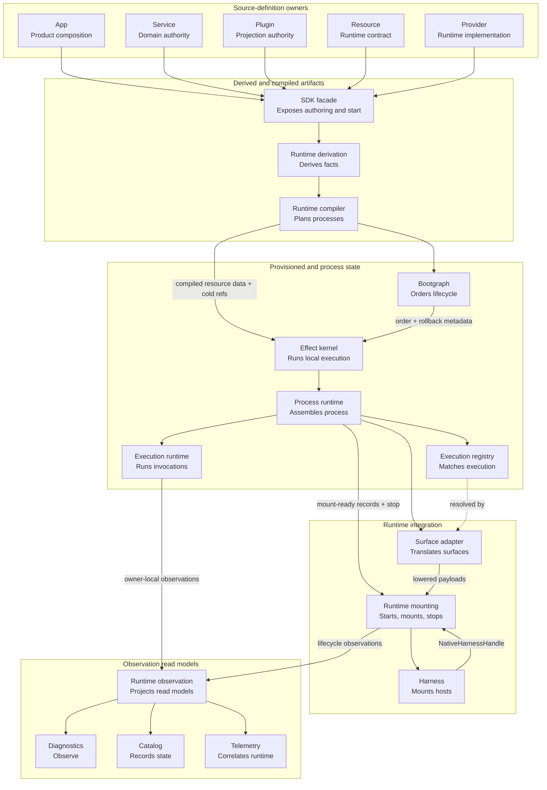

# Habitat Runtime Realization Specification

Status: Canonical  
Scope: Runtime realization, selected authoring declarations, the public SDK facade, runtime derivation, runtime compilation, bootgraph ordering, Effect-backed provisioning and process-local execution, process runtime binding, process execution, adapter lowering, harness mounting, diagnostics, telemetry, and deterministic finalization

Authority note: this file is the sole exact canonical document for Habitat
runtime-realization mechanics and artifacts. It supersedes older indexed
runtime/effect documents; archived or quarantined documents that still call
themselves canonical are provenance only unless explicitly subordinated and
routed from this specification. `HABITAT_ARCHITECTURE.md` remains the canonical
ontology, ownership, lifecycle-vocabulary, and integration-handoff authority,
but its runtime-mechanics summaries are conceptual. OpenSpec scenarios are
archive-safe acceptance mirrors, not a second exact semantic authority. Task
4.8 is governed by this document's combined §§11.8, 13.5, 15, 23.1, and 27;
no one of those sections alone owns all of its mechanics.

## 1. Purpose and scope

This specification defines the mechanics and artifacts that turn selected app
composition into one started, typed, observable, stoppable process per
`startApp(...)` invocation. It operates inside the ontology, source ownership,
lifecycle boundaries, and handoffs fixed by `HABITAT_ARCHITECTURE.md`.

Runtime realization makes execution explicit without creating a second public semantic architecture. It owns the bridge from selected declarations to a running process. It does not own service domain authority, projection meaning, app identity, deployment placement, public API semantics, durable workflow semantics, shell governance, desktop-native behavior, web framework semantics, or native host interiors.

### 1.1 Normative contracts and reference realization

Habitat is the platform and runtime substrate. `apps/habitat` is its
self-hosted, non-core platform realization, not the platform itself, a peer
downstream product, or the source of app law for downstream products. The
independent downstream Rawr repository provides a broad, diverse reference
product, but it is never the normative source of Habitat runtime law and its
source is not retained inside Habitat.

Normative sections define private runtime artifacts, mechanisms, ownership,
phase handoffs, and observable guarantees inside the architecture's canonical
boundaries. Rawr examples exercise those contracts as one
diverse downstream app; their domain names, plugin selection, placement, and
function bodies are illustrative unless their `Exactness` annotation says
otherwise. A `specification://` location is a semantic anchor, not a required
repository path.

The steady-state repository boundary mirrors runtime ownership: Habitat owns
the platform, SDK, CLI, self-host, and reusable platform capabilities; Rawr
owns its downstream product closure in an independent repository; Marketplace
owns curated agent-plugin content in a third repository. Rawr consumes ordinary
published Habitat interfaces. No source checkout, workspace path, or Git
synchronization relation is a runtime interface.

Consumer implementations are proto-evidence only. A candidate lift traces the
exact behavior oracle, maps it to a named Habitat owner and active task, freezes
only generic assertions, re-authors the substrate under Habitat and pinned
vendor law, proves and releases the Habitat artifact, migrates the consumer,
and then removes only the superseded prototype. Magic demonstrates that one
semantic app may lower into independently started processes, each with its
own process identity, resource leases, admission boundary, and stop. Its MCP
endpoint is a `server` surface hosted by one such process and an external
companion seam, not a Habitat role or kind. No native Habitat MCP adapter is
implemented or implied by that evidence.

Habitat blueprints enforce kind-identifying topology and source law. OpenSpec
change records track implementation and migration state. Neither implementation status
nor incidental organization inside a sealed component becomes runtime law by
appearing in a reference example.

File: `specification://runtime-realization/lifecycle.txt`  
Layer: runtime realization lifecycle  
Exactness: normative lifecycle order and phase ownership.

```text
definition -> selection -> derivation -> compilation -> provisioning -> mounting -> observation
```

The broader platform chain is:

File: `specification://runtime-realization/platform-chain.txt`  
Layer: platform cohesion frame  
Exactness: normative semantic-to-runtime ordering.

```text
bind -> project -> compose -> realize -> observe
```

The execution ownership law is:

File: `specification://runtime-realization/execution-ownership-law.txt`  
Layer: execution ownership  
Exactness: normative grammar split. Canonical source of this law: `HABITAT_ARCHITECTURE.md`, §4.0. This section reproduces the law as runtime-realization context; arch-spec §4.0 is authoritative if the two diverge.

```text
Services own domain semantics and service procedure bodies.
Plugins own projection meaning and projection-local bodies.
Apps own product composition, selection, and entrypoints.
Habitat defines platform authoring law and owns execution law, grammar, runtime bridges, and handoffs.
oRPC owns callable contract mechanics.
Effect owns local execution mechanics.
Inngest owns durable async.
Native hosts own host interiors after Habitat adapter lowering.
The SDK exposes the public authoring and start facade.
Runtime schema adapts boundary schemas.
Runtime definition defines cold contracts.
Runtime derivation derives.
Runtime compiler compiles.
Bootgraph orders and records rollback and release metadata.
The Effect substrate acquires, releases, and rolls back.
Process runtime binds, lowers, and executes.
Harnesses mount native hosts and return stop handles.
Runtime observation projects non-authorizing read models.
Runtime mounting starts apps and coordinates cross-owner finalization.
```

Effect is the execution layer for Habitat-managed local execution. Non-oRPC
plugin callbacks, CLI commands, agent tools, desktop background logic,
web-local application execution, resource operations, provider
acquisition/release, process-local coordination resources, and async step-local
execution retain their nearest application, plugin, resource, or provider owner
while using Habitat-defined authoring surfaces and Habitat-managed runtime
bridges.

Effect-backed oRPC operations follow the native vendor boundary instead.
Authors use native `.handler(...)` for synchronous and Promise-returning
operations and the official `.effect(...)` extension for Effect-backed
operations. The implementation owner installs that extension once in the same
physical oRPC module realm. Its internal `handlerGen(...)` mechanism owns the
request fiber, native `effect/context`, native `effect/wrap`, request signal,
Cause mapping, and Promise boundary; `handlerGen(...)` is not an authoring
choice or operation-leaf import. The application/process owns Effect Context
construction, resource lifetime, policy, telemetry, and shutdown through those
native hooks. A manual `Effect.run*`, a custom runner, a Habitat imitation, or
`ProcessExecutionRuntime` MUST NOT execute an oRPC Effect.

There is one Habitat execution terminal for non-oRPC descriptor lanes. The
official oRPC bridge is a native vendor boundary, not a second Habitat terminal:

File: `specification://runtime-realization/single-execution-terminal.txt`  
Layer: execution terminal law  
Exactness: normative.

```text
One authoring interface.
One Habitat execution terminal.
One owner for each source, artifact, and lifecycle state.
```

The non-oRPC plugin executable boundary spine is:

File: `specification://runtime-realization/service-plugin-execution-spine.txt`  
Layer: runtime execution spine  
Exactness: normative handoff sequence for non-oRPC executable boundaries.

```text
non-oRPC plugin executable authoring
  -> EffectExecutionDescriptor
  -> runtime-derivation private NormalizedRuntimeTopology
  -> complete NormalizedAuthoringGraph + ExecutionDescriptorRef/table
  -> runtime compiler
  -> CompiledExecutionPlan
  -> ExecutionRegistry
  -> ProcessExecutionRuntime
  -> EffectRuntimeAccess
  -> ManagedRuntimeHandle
  -> result / exit / diagnostics / telemetry / finalization
```

The native Effect-oRPC spine is:

File: `specification://runtime-realization/native-effect-orpc-spine.txt`  
Layer: native oRPC execution spine  
Exactness: normative for the selected bridge and ownership handoff.

```text
native oRPC operation
  -> .handler(...) for sync/Promise or .effect(function* ...) for Effect
  -> application/process-owned effect/context
  -> application/process-owned effect/wrap
  -> official extension delegates to vendor-internal handlerGen
  -> Effect.runPromiseExit(effect, { signal: requestSignal })
  -> official Cause mapping
  -> Promise returned to native oRPC
```

The provider spine is:

File: `specification://runtime-realization/provider-effect-spine.txt`  
Layer: runtime provider acquisition spine  
Exactness: normative provider handoff sequence.

```text
RuntimeResource
  -> selected cold RuntimeProvider reference
  -> runtime compiler CompiledResourcePlan + RuntimeCompilationReferenceTable

compiled provider identity/dependency facts
  -> BootgraphInput
  -> bootgraph order/rollback metadata

preflighted config + exact cold RuntimeProvider reference + bootgraph metadata
  -> RuntimeProvider.build(...)
  -> ProviderEffectPlan
  -> runtime-substrate-effect provider lowering
  -> Effect-backed acquisition/release/rollback
  -> ProvisionedProcess
```

The resource operation spine is:

File: `specification://runtime-realization/resource-operation-spine.txt`  
Layer: runtime resource operation spine  
Exactness: normative relation between provisioned resource values and enclosing execution boundaries.

```text
provisioned RuntimeResource value
  -> HabitatEffect-returning operation
  -> composed inside an enclosing EffectExecutionDescriptor or ProviderEffectPlan
  -> executed by the enclosing boundary's runtime path
```

When a `HabitatEffect`-returning resource operation is composed inside a
non-oRPC plugin, CLI command, agent tool, desktop background body, web-local
execution body, or async step-local body, it executes as part of the enclosing
`EffectExecutionDescriptor` through `ProcessExecutionRuntime`. A resource
operation used by an Effect-backed oRPC handler is a native Effect value and
executes through the official bridge instead.

When a `HabitatEffect`-returning resource operation is composed inside provider acquisition or release, it executes as part of the enclosing `ProviderEffectPlan` through `runtime-substrate-effect` provider lowering under bootgraph order metadata, not through `CompiledExecutionPlan` or `ProcessExecutionRuntime`.

Resource operations are not compiled into `CompiledExecutionPlan` merely because they return `HabitatEffect`.

The durable async spine remains separate:

File: `specification://runtime-realization/durable-async-spine.txt`  
Layer: durable async handoff  
Exactness: normative async ownership split.

```text
WorkflowDefinition / ScheduleDefinition / ConsumerDefinition
  -> runtime-derivation normalized async surface plan
  -> runtime compiled async surface plan
  -> async SurfaceAdapter
  -> private FunctionBundle registration factory
  -> Inngest harness
```

Effect may appear inside durable async steps only as local execution. Inngest remains the durable owner of workflow run identity, retry, replay, history, schedules, durable queues, and durable async semantics.

The web route-module channel is distinct from Effect execution:

File: `specification://runtime-realization/web-route-module-spine.txt`  
Layer: native web module-loading handoff  
Exactness: normative separation from the Effect descriptor spine.

```text
cold WebRouteProjection.module loader
  -> WebRouteModuleRef + non-portable WebRouteModuleTable
  -> compiled web surface plan
  -> web surface adapter / selected web host
  -> native module loading
```

The loader is never an `EffectExecutionDescriptor`, never enters
`ExecutionDescriptorTable` or `ExecutionRegistry`, and is never copied into a
portable runtime plan.

Native hosts may require Promise-compatible callbacks. Non-oRPC callbacks are
generated by runtime-process-runtime adapter lowering, owned by a harness, or
exposed through an SDK delegating hook that calls `ProcessExecutionRuntime`.
Effect-backed oRPC callbacks return the Promise produced by official
`.effect(...)` bridge mechanics; adapters do not wrap that Promise in another
Effect runner.
Neither form takes semantic ownership of the application-authored body.

Shutdown, rollback, provider release, harness stop order, finalizers, managed runtime disposal, and final catalog records are deterministic runtime finalization and observation behavior. They are not an eighth lifecycle phase.

## 2. Fixed outcome

Each `startApp(...)` invocation produces exactly one started process runtime assembly.

| Runtime result | Owner | Meaning |
| --- | --- | --- |
| One `ManagedRuntime` | Runtime substrate / Effect provisioning and execution kernel | Owns its internal root/layer scopes, the built resource Context, process-local `HabitatEffect` execution, coordination, and disposal |
| One process execution runtime | Runtime / process runtime | Executes non-oRPC Effect descriptors through the process-owned runtime bridge; never oRPC service Effects |
| One execution registry | Runtime / process runtime | Pairs compiled execution plans with their matching descriptors for adapter invocation |
| One process runtime assembly | Runtime / process runtime | Bound services, role access, mount-ready surface records, adapter lowering, and its own stop handle |
| Zero or more mounted roles | App-selected process shape | Selected role slices from the app composition |
| Zero or more mounted surfaces | Process runtime and harnesses | Runtime-ready surface payloads mounted into native hosts |
| One runtime catalog stream or record set | Runtime observation | Redacted projection of selected, derived, compiled, provisioned, bound, projected, executed, mounted, observed, and stopped runtime state |
| One deterministic finalization path | Runtime mounting | Reverse-order harness stop followed by the process-runtime stop handle, which releases assembled state and the provisioned substrate; runtime observation independently projects admitted finalization records |

A cohosted development process and a split production process use the same semantic app and plugin definitions. Cohosting changes placement and resource sharing. It does not change species.

Effect-backed is an execution posture. It does not create a second public ontology. There are no public architecture kinds named `EffectService`, `EffectPlugin`, `EffectApp`, `EffectWorkflow`, `EffectProvider`, `EffectResource`, `EffectWorkstream`, or `EffectReviewLoop`.

A runtime that executes owner-authored non-oRPC descriptor, resource, or provider
bodies as ordinary Promise-only business callbacks instead of through the
Habitat-managed Effect bridge is not compliant. Native synchronous or
Promise-returning oRPC `.handler(...)` operations remain valid, and Effect-backed
oRPC operations use the official bridge. Runtime management does not transfer
body ownership away from the nearest semantic owner.

## 3. Owners And Lifecycle Boundaries

Runtime realization is stable only when every source, artifact, and live
lifecycle state has exactly one owner and each layer knows its boundary. There
is exactly one `RuntimeCatalog` read model, projected by runtime observation;
it is not a second source of runtime truth.

The compact ownership law is:

File: `specification://runtime-realization/compact-ownership-law.txt`  
Layer: ownership law  
Exactness: normative.

```text
Domain services own definitions, behavior, and state transitions.
Plugins expose capabilities through runtime surfaces.
Apps select product composition.
Resources declare host capabilities.
Providers implement host capabilities.
Habitat defines authoring/runtime law and owns execution bridges and handoffs.
The SDK exposes authoring and start contracts.
Runtime derivation derives facts.
The compiler plans processes.
Bootgraph orders lifecycle.
The Effect kernel runs local execution.
The process runtime assembles processes.
The registry matches execution.
The execution runtime runs invocations.
Adapters translate surfaces.
Harnesses mount hosts.
Runtime mounting coordinates start, harness mounting, and shutdown.
Runtime observation projects non-authorizing read models.
Diagnostics are topology projections.
```

Dependency graphs and topology constraints are compiler-owned validation
artifacts. They confer no source, semantic, composition, or lifecycle ownership.

### 3.1 Ownership and lifecycle model

File: `specification://runtime-realization/ownership-lifecycle-model.txt`  
Layer: ownership and lifecycle model  
Exactness: normative classification of load-bearing nouns.

```text
Source-definition owners:
  Service
  Plugin
  App
  Resource
  Provider

Selection records:
  RuntimeProfile
  ProviderSelection
  ResourceRequirement
  Entrypoint

Public facade:
  SDK facade

Derived and compiled artifacts:
  Runtime derivation
  Runtime compiler

Provisioned and mounted state:
  Bootgraph
  Effect provisioning/execution kernel
  Process runtime
  Execution registry
  Process execution runtime
  EffectRuntimeAccess

Runtime integration artifacts:
  Surface adapter
  Harness

Observation records and read models:
  Diagnostics
  RuntimeCatalog
  RuntimeTelemetry

Durable async integration artifacts:
  WorkflowDispatcher
  FunctionBundle

Classification fields:
  Role
  Surface
  Capability
```

This model is a reading map, not another ontology or owner. It identifies the
owner, record, artifact, state, or classification role of each noun before
implementation detail is considered.

File: `specification://runtime-realization/ownership-lifecycle-diagram.mmd`  
Layer: ownership and lifecycle diagram  
Exactness: illustrative diagram; normative direction of ownership handoff.



### 3.2 Ownership definitions

Habitat authority in this document is platform authority: authoring grammar,
runtime bridge mechanics, lifecycle handoffs, foundational SDK/CLI tooling, and
enforcement. It does not supersede the nearest semantic or executable owner.
Services retain domain meaning and procedure bodies, plugins retain projection
meaning and projection-local bodies, apps retain product composition and
entrypoints, and resource/provider packages retain contracts and implementation
bodies.

A service is a domain capability boundary. It owns the domain contracts, invariants, schemas, migrations, repositories, domain policy, and authoritative write access for the domain state it governs. It may declare dependencies on runtime resources, sibling services, semantic adapters, config, scope, and invocation context. Those dependencies may have runtime lifecycle, but the service does not provision or release them. The runtime binds and provisions them from app-selected providers and compiled plans. It does not own public API projection, internal API projection, workflow execution, command projection, web projection, agent projection, desktop projection, app membership, provider selection, process placement, harness mounting, raw Effect runtime construction, or custom Effect-oRPC runner wiring. Its operation leaves use native `.handler(...)` for synchronous or Promise work and the implementation-owned official `.effect(...)` extension for Effect work. A domain service is never an Effect Context service or `Layer` node.

A plugin is a lane projection boundary. It projects underlying capabilities into exactly one role/surface/capability lane. The underlying capability may be service-owned domain capability, workflow dispatch capability, host/native capability, agent/shell capability, desktop capability, web/client capability, or another runtime-authorized capability. A plugin owns the lane-native contract, caller shape, boundary policy, authentication/authorization/redaction/transformation, service/resource use declarations, executable boundary, and native mount facts for that lane. It does not own the underlying domain authority, provider implementation, app membership, provider selection, runtime acquisition, or native host runtime.

An app is a product composition boundary. It owns app identity, selected plugin projections, runtime profiles, provider selections, config source selection, entrypoints, process role shapes, publication artifacts, and product-level composition defaults. It composes by selection. It does not acquire resources or run effects. It does not own service domain authority, plugin projection meaning, resource contracts, provider implementation, runtime acquisition, local execution, harness behavior, or deployment placement.

A resource is a runtime capability contract. It declares the identity, value shape, lifetime requirements, and diagnostic-safe snapshot rules for a provisionable runtime capability. Its package owns a closed provider family: the package root exposes the provider-neutral resource contract, and each nested provider has its own direct public face. Each provider owns its config. A resource may expose effectful operations on provisioned values, including operations that return `HabitatEffect`. It does not implement itself, select a provider, own domain authority, acquire runtime values, or become app composition.

A provider is a runtime capability implementation plan. It implements a resource contract through provider-local config, native client construction, acquisition, release, health, refresh, dependency requirements, telemetry, and diagnostics. It returns `ProviderEffectPlan` through `providerFx` and remains cold until provisioning. It does not select itself, redefine resource identity, own domain authority, compose app membership, or construct a local managed runtime.

The SDK is the public authoring and start facade. It re-exports import-safe contracts implemented by `runtime-definition`, supplies type-level inference, exposes delegating hooks backed by `runtime-process-runtime`, exposes observation read facades backed by `runtime-observation`, and exposes the terminal operation backed by `runtime-mounting`. The SDK does not implement cold definitions, derivation, raw Effect lowering, runtime adapter lowering, live start coordination, observation projection, resource acquisition, provider execution, managed-runtime construction, service binding, harness mounting, `HabitatEffect` execution, or domain/projection/app meaning. No private runtime owner imports the SDK facade.

The private `runtime-derivation` owner is the derivation boundary. Its
foundational handoff is one `NormalizedRuntimeTopology`: an exact immutable
copy of `RuntimeLaunchIdentity`, the selected `profileId`, deterministically
sorted plugin identities, role, surface, and resource requirements, and only
`app.plugin`, `plugin.resource`, `service.service`, `service.resource`, and
`service.semantic` edges. It refuses duplicate plugin identities, process-role
literals, surface full tuples, or full edge tuples and cycles in the
`service.service` graph. Shared resource demand across distinct plugin
identities is admitted and projects to one sorted resource-requirement
identity.

Complete derivation incorporates that topology into `NormalizedAuthoringGraph`
and derives provider selections, normalized service uses, service binding
plans, surface runtime plans, workflow dispatcher descriptors, Effect
descriptor refs and their non-portable table, distinct web route-module refs
and their non-portable table, only the exact optional-provider finding, and the
portable plan artifact. Those complete-derivation contracts are exposed through
`@habitat-ai/sdk/runtime/derivation` and consumed by the runtime compiler or the
specific in-process consumers named in §15. The SDK uses authoring declarations
for static inference only; it does not become a second derivation owner.

The runtime compiler is the planning boundary. Its exact input is the selected
`Entrypoint` plus the exact normalized authoring graph. It reaches the selected
cold provider, service, and executable-policy references through that
entrypoint; neither derivation result nor non-portable derivation table passes
through the compiler. It validates the normalized handoff, emits one compiled
process plan plus one private cold provider/service reference table, and
returns inert observation-seed data separately. Invalid input throws built-in
`TypeError` before result. It emits no compiler finding or diagnostic result
and does not acquire resources, read or decode config, build providers, bind
services, execute `HabitatEffect`, lower adapters, mount harnesses, mutate app
membership, or import or publish through `RuntimeObservationPort`.

Bootgraph is the lifecycle ordering boundary. It consumes only compiler-owned provider/resource identity and dependency input and emits deterministic acquisition order, rollback order, and reverse release metadata. It owns ordering and dedupe, not execution: it does not consume `ProviderEffectPlan`, acquire or release providers, execute rollback, register live finalizers, assemble process/role resource contexts, or produce `ProvisionedProcess`.

The Effect provisioning/execution kernel is the process-local execution substrate. It owns exactly one process `ManagedRuntime`, one `Layer.effectContext(...)` provider-lifecycle adapter, raw Effect lowering for non-oRPC descriptor lanes, scoped acquisition/release/rollback mechanics, process-local coordination primitives, interruption, timeout, retry mechanics, and `HabitatEffect` execution under runtime-owned policy. After config preflight, it consumes compiler-owned resource identity data and exact cold provider references plus bootgraph order/rollback metadata, calls each selected provider's `build(...)`, and executes the returned plan in bootgraph order. Provisioning forces the lazy managed runtime's `context()` before it becomes the sole producer of `ProvisionedProcess`. It does not create a second root `Scope` or managed runtime, execute Effect-backed oRPC operations, import the SDK or observation-owned projection types, or own service domain authority, plugin projection, app selection, provider selection, durable async, native host semantics, or public authoring grammar.

The process runtime is the live process assembly boundary. It turns a compiled process plan, non-portable execution descriptor table, and `ProvisionedProcess` into bound service clients, role/surface runtime access, workflow dispatchers, execution registry, process execution runtime, `EffectRuntimeAccess`, mount-ready surface records, adapter-lowered payloads, owner-local findings, and a process-runtime-owned stop handle. It owns service binding, binding cache, invocation-bound client views, execution registry and execution runtime assembly, workflow dispatcher materialization, plugin projection, and runtime adapter lowering. It does not invoke harnesses, collect `StartedHarness`, project observation-owned types, coordinate cross-owner shutdown, or own service/domain/plugin/app/provider/native-host meaning.

The execution registry is the executable-boundary matching boundary. It pairs each compiled execution plan with exactly one matching Effect execution descriptor before adapter invocation. It owns execution identity matching, descriptor/plan boundary agreement, duplicate/missing executable detection, and lookup of matched executable boundaries for adapters. It does not execute `HabitatEffect`, lower Effect, own execution policy, create descriptors, compile plans, or contain business logic.

The process execution runtime is the invocation execution boundary for non-oRPC
descriptor lanes. It receives a matched executable boundary plus an explicit
procedure execution context, supplies runtime-owned error and telemetry
contexts, invokes the Effect descriptor, receives `HabitatEffect`, runs it
through
`EffectRuntimeAccess`, applies execution policy, and returns a host-compatible
result or structured exit. It MUST NOT execute an Effect-backed oRPC operation;
the official `.effect(...)` bridge owns that native boundary. It does not own the
service/plugin/resource/provider body being executed, bind services, acquire
providers, mount harnesses, choose apps, project plugins, own domain authority,
or run native host logic.

A surface adapter is the native-payload translation boundary. It lowers
compiled surface plans into harness-facing native payloads and callbacks. For
non-oRPC descriptor lanes it resolves executable boundaries through the
execution registry and produces host-compatible closures that delegate to
`ProcessExecutionRuntime`. For native oRPC it preserves the procedure and
application/process-owned `effect/context` and `effect/wrap` so the official
`.effect(...)` bridge remains the executor. It owns translation from Habitat
compiled surface shape into native host payload shape. It does not execute
business logic, run `HabitatEffect`, construct managed runtimes, acquire
providers, consume raw authoring declarations, consume normalized authoring
graphs directly, or own native host lifecycle.

A harness is the native host mounting boundary. Runtime mounting invokes it with
`HarnessMountInput` containing adapter-lowered payloads and bounded process
access; it mounts them into a native host such as Elysia, Inngest, OCLIF, web,
agent/OpenShell, or desktop and returns a `NativeHarnessHandle`. It owns native
host lifecycle after Habitat lowering. It does not create `StartedHarness`,
consume normalized authoring graphs or compile plans, acquire providers, bind
services, lower `HabitatEffect`, import observation-owned projection types, own
service/plugin/app meaning, or create managed runtimes.

Runtime mounting is the downstream live lifecycle boundary. It implements
`startApp(...)`, invokes harnesses, creates private `StartedHarness` wrappers
only after successful native mount, and coordinates reverse-order native-handle
shutdown before the process-runtime stop handle. It adapts admitted owner-local
findings into `RuntimeObservationRecord` values and publishes those lifecycle
records through the definition-owned observation boundary. It does not project
observation read models, compose app membership, acquire providers, bind
services, lower adapters, or own native host interiors.

Runtime observation is the downstream, non-authorizing projection boundary. It implements the definition-owned observation port and alone projects admitted `RuntimeObservationRecord` values into `RuntimeDiagnostic`, `RuntimeTelemetry`, `RuntimeTopologyRecord`, and `RuntimeCatalog`. It does not consume unadapted owner-local findings, implement `startApp(...)`, invoke or stop harnesses, coordinate finalization, mutate upstream runtime state, acquire live values, select providers, expose secrets, or become a control plane by itself.

`RuntimeCatalog` is the one runtime diagnostic read model. It records process identity, app identity, selected roles, derived authoring facts, resources, providers, provider dependency graph, service attachments, workflow dispatchers, execution plans, execution registry, surfaces, harnesses, lifecycle status, diagnostics, topology records, execution records, startup records, and finalization records. It is not live access, not a manifest, not app composition, not provider selection, and not mutable runtime authority.

`RuntimeTelemetry` is the correlation boundary for runtime spans, events, and annotations. It carries process, provisioning, binding, execution, adapter, harness, and finalization correlation across runtime realization. It does not own product analytics, service semantic events, app selection, service domain authority, or provider selection.

`WorkflowDispatcher` is the durable-async event-admission boundary. It is materialized by the process runtime from selected workflow definitions and the provisioned async provider. It lets server API/internal projections send selected workflow events and returns event/admission identity, never run identity. Status and cancellation by run identity require a separately selected control capability. The dispatcher does not own workflow definitions, durable workflow semantics, product API meaning, service domain authority, native Inngest functions, provider acquisition, or projection classification.

`FunctionBundle` is the private async harness-facing registration factory. It
captures selected workflow, schedule, and consumer registration plans without
capturing a native client. The Inngest harness materializes it with exactly the
native client supplied to the selected Serve or Connect harness.
`WorkflowDispatcher` is a separate named consumer and process-runtime
materialization; it is not part of `FunctionBundle` materialization. The bundle
owns no product API meaning, workflow semantics, live dispatcher authority, or
app selection.

`Entrypoint` is the sole cold selection artifact. It carries one selected app,
runtime profile, process definition, entrypoint id, and exact five-field launch
identity for one future `startApp(...)` invocation. It owns process-start
selection facts but performs no live start. It does not redefine app membership,
service domain authority, plugin projection, provider implementation, execution
grammar, harness internals, or deployment placement.

A runtime profile is an app-owned runtime selection boundary. It selects provider implementations, config sources, process defaults, and environment-shaped wiring for an app. It does not acquire resources, construct providers, execute `HabitatEffect`, mount harnesses, own service domain authority, or become deployment placement.

`ProviderSelection` is the app/profile-owned binding between a runtime capability contract and a provider implementation for a lifetime, role, and optional instance. It is selection data, not acquisition. It does not construct the provider, validate live config by itself, acquire resources, or become provider implementation.

`ResourceRequirement` is a demand declaration for a runtime capability
contract. At the complete-derivation boundary its normalized owner is exactly
a plugin, service-owned resource dependency key, or provider. Harness and
other runtime-owner requirements may use private definition grammar, but they
do not widen that closed normalized owner union. A requirement is not provider selection,
acquisition, or live access.

A role is a selected process responsibility slice, such as server, async, web, agent, CLI, or desktop. A surface is a lane-specific projection target within a role, such as server API, server internal, workflow, schedule, command, tool, window, menubar, or background. A plugin capability is the named projection capability within one role/surface lane. It is not automatically the same thing as a service domain capability or a runtime resource capability.

Short law:

File: `specification://runtime-realization/lane-classification-law.txt`  
Layer: role/surface/capability classification  
Exactness: normative.

```text
Roles slice processes.
Surfaces target lanes.
Capabilities name projections.
```

### 3.3 Ownership matrix

| Layer | Owns | Does not own |
| --- | --- | --- |
| Habitat platform | Authoring and runtime law, foundational SDK/CLI tooling, execution law and grammar, runtime bridges, lifecycle handoffs, generic reusable platform resources/providers, self-hosted Habitat commands/topics | Downstream app composition, service/domain semantics, plugin projection meaning, owner-authored executable bodies |
| Services | Domain contracts, invariants, schemas, repositories, migrations, domain policy, stable service config, service-to-service dependency declarations, authoritative write access, native oRPC operation implementation through handler or official Effect bridge | Public API projection, app membership, provider selection, harness mounting, process placement, raw Effect runtime construction, custom Effect-oRPC runners |
| Plugins | One role/surface/capability projection, topology-implied caller classification, native builder facts, lane-native contract, boundary policy, service-use declarations, resource-use declarations, projection-local Effect execution bodies | Service domain authority, provider acquisition, app selection, projection reclassification, raw Effect runtime construction, custom Effect-oRPC runners |
| Apps | Product identity, selected projections, runtime profiles, provider selections, config source selection, entrypoints, process role shapes, process defaults, selected publication artifacts | Service domain authority, plugin species, provider implementation, runtime acquisition, `HabitatEffect` execution, managed runtime construction |
| Resources | Runtime capability contract, consumed value shape, lifetime requirement, public resource identity, closed provider family with direct contract/provider public faces, diagnostic-safe snapshot contribution rules, `HabitatEffect`-returning value operations where effectful | Provider implementation, domain authority, app selection, raw Effect runtime construction |
| Providers | Runtime capability implementation plan, acquisition/release plan, native client construction, health, refresh, provider-local config schema and redaction metadata, telemetry, diagnostics | Resource identity, app selection, service domain authority, raw managed runtime construction |
| Runtime schema | TypeBox/Standard Schema adaptation and canonical boundary validation mechanics | Semantic schema ownership, domain policy, derivation, acquisition, execution, mounting |
| Runtime definition | Cold `HabitatEffect`, execution-policy, app/profile/entrypoint, service, plugin, resource, provider, execution-descriptor, observation-record, and observation-port contracts | Live start coordination, derivation, acquisition, execution, mounting, service/plugin/app meaning |
| Runtime derivation | Foundational `NormalizedRuntimeTopology`; complete `NormalizedAuthoringGraph`; normalized provider, service-binding, surface, and workflow artifacts; Effect refs/table; distinct web route-module refs/table; exact-field portable plan artifact | Resource acquisition, provider execution, managed runtime construction, harness mounting, service/plugin/app meaning, web-loader execution, deployment placement policy |
| SDK facade | Public re-exports of definition-owned authoring contracts, type inference, delegating runtime hooks, observation read facades, and the mounting-backed start terminal | Private definition/derivation implementation, raw Effect lowering, runtime adapter lowering, observation projection, resource acquisition, provider execution, managed runtime construction, harness mounting, service/plugin/app meaning |
| Runtime compiler | Private synchronous compilation of one selected entrypoint plus normalized graph into one compiled process plan, one exact cold provider/service reference table, and separate inert observation-seed data; normalized-handoff, dependency, and relation validation | Public SDK compiler surface, compiler finding/diagnostic result, observation-port use, adapter/harness compatibility invention, config resolution, provider build/acquisition, live binding, execution, mounting, app mutation |
| Bootgraph | Lifecycle identity, dependency ordering, dedupe, acquisition/release order, and rollback metadata | Provider-plan consumption or execution, acquisition, release, live rollback, finalizer registration, `ProvisionedProcess`, service/app/plugin/native-host authority |
| Effect kernel | Single process managed runtime, raw Effect lowering, provider plan execution, process-local coordination, acquisition/release/rollback, interruption, timeout, retry, `HabitatEffect` execution under runtime-owned bridges, sole production of `ProvisionedProcess` | Service domain authority, plugin projection, app selection, provider selection, durable async, native host semantics |
| Process runtime | Runtime access scoping, service binding, binding cache, invocation-bound client views, workflow dispatcher materialization, execution registry and `EffectRuntimeAccess` assembly, plugin projection, runtime adapter lowering, mount-ready records, owner-local findings, process-runtime stop handle | Harness invocation, `StartedHarness` collection, topology projection, cross-owner shutdown, service/public API/app/provider/durable-workflow authority |
| Execution registry | Matching compiled execution plans to Effect descriptors, identity/boundary agreement, executable boundary lookup | `HabitatEffect` execution, Effect lowering, plan compilation, descriptor construction, business logic |
| Process execution runtime | Invocation-time execution through `EffectRuntimeAccess`, bridge resolution, policy application, result/exit mapping for non-oRPC descriptor lanes | oRPC Effect execution, service binding, provider acquisition, harness mounting, app selection, plugin projection, domain authority |
| Surface adapters | Lowering compiled surface plans to host payloads, resolving executable boundaries through registry, producing native callbacks | Business logic, `HabitatEffect` execution, managed runtime construction, provider acquisition, raw authoring consumption |
| Harnesses | Native host mounting and native lifecycle after adapter lowering, `HarnessMountInput`, `NativeHarnessHandle`, owner-local reports and idempotent stop | `StartedHarness` creation, normalized-authoring-graph consumption, runtime compilation, provider acquisition, topology projection, service domain authority, `HabitatEffect` lowering, managed runtime construction |
| Runtime mounting | Live `startApp(...)` coordination, harness invocation, private `StartedHarness` creation/collection, reverse-order native-handle stop, and cross-owner finalization | Observation projection, composition authority, provider acquisition, service binding, adapter lowering, native host interiors |
| Runtime observation | Definition-port implementation and non-authorizing projection of diagnostics, telemetry, topology records, catalog views, and finalization records | Live start, harness invocation or stop, cross-owner finalization, composition authority, acquisition, binding, adapter lowering |

Shared infrastructure does not transfer schema ownership, write authority, service domain authority, resource identity, plugin identity, or app membership. Multiple services may share a process, machine, database instance, connection pool, telemetry installation, cache infrastructure, or host runtime. That sharing is infrastructure. It is not shared domain authority.

Habitat defines boundary grammar and owns runtime handoff mechanics. The
service, plugin, app, resource, or provider at each boundary retains semantic
and executable-body authority. Native framework interiors own native execution
semantics after Habitat hands them runtime-realized payloads.

## 4. Canonical topology and package authority

The physical topology is locked as a kind grammar. It applies in two distinct
source-ownership regions and does not turn every conforming component into Habitat
platform source:

```text
Habitat platform source
  packages/core/**
  resources/<generic-reusable-capability>/**
  services/<platform-capability>/**
  plugins/cli/topics/<habitat-self-host-topic>/**
  apps/habitat/**

downstream product source
  packages/<application-support>/**
  resources/<application-specific-capability>/**
  services/<application-domain>/**
  plugins/<application-projection>/**
  apps/<downstream-app>/**
```

`apps/habitat` is Habitat's self-hosted, non-core app realization and the source
app for the foundational CLI distribution; it is not a peer downstream
product. Rawr is a reference product in its independent downstream repository
and remains downstream product source. A canonical root defines a component kind, allowed dependencies, and
runtime handoff. It does not transfer downstream semantic, projection,
composition, package implementation, or executable-body ownership to Habitat.

File: `specification://runtime-realization/canonical-topology.txt`  
Layer: repository topology  
Exactness: normative for roots, package authority, and ownership placement.

```text
packages/
  core/
    sdk/                         # publishes @habitat-ai/sdk
    runtime/                     # private package-less runtime owners
      schema/
      definition/
      derivation/
      compiler/
      bootgraph/
      substrate/
        effect/
      process-runtime/
      harnesses/
        elysia/
        inngest/
        web/
        agent/
        desktop/
      observation/
      mounting/

resources/
  <capability>/                  # resource package
    <contract-face>              # provider-neutral public face
    providers/
      <provider>/
        <provider-face>          # direct provider public face

services/
  <service>/                     # domain capability boundary

plugins/
  server/
    api/
      <capability>/              # public server API projection
    internal/
      <capability>/              # trusted first-party/internal server API projection
  async/
    workflows/
      <capability>/              # durable workflow projection
    schedules/
      <capability>/              # durable scheduled projection
    consumers/
      <capability>/              # durable consumer projection
  cli/
    topics/
      <topic>/                   # selected Oclif plugin projection
        commands/                # native command contributions
  web/
    app/
      <capability>/              # web app projection
  agent/
    channels/
      <capability>/              # agent channel projection
    shell/
      <capability>/              # OpenShell projection
    tools/
      <capability>/              # agent tool projection
  desktop/
    menubar/
      <capability>/              # desktop menubar projection
    windows/
      <capability>/              # desktop window projection
    background/
      <capability>/              # desktop background projection

apps/
  <app>/
    <app>.app.ts                 # app composition
    <entrypoint>.ts              # mount or process-role entrypoint
    runtime/
      profiles/
      <app-runtime-modules>
```

Platform machinery lives under `packages/core/*`. Authored provisionable capability contracts live under `resources/*`. In both source-ownership regions, the nearest resource/provider, service, plugin, or app remains the source and meaning owner.

The public SDK is published as `@habitat-ai/sdk` from `packages/core/sdk`.
Each immediate capability root shown beneath `packages/core/runtime` is a
private, package-less Nx owner; `substrate/effect` is the one Effect-substrate
owner and `harnesses` is the one harness-family owner. These roots have no
registry identity or release membership. `schema`, `definition`, and
`derivation` own the upstream implementations required by later phases. No
private runtime owner imports the terminal public SDK facade. The SDK exposes
only the public families below, so the build graph remains acyclic while
consumers install one package. Task 5 creates no compiler facade or SDK source
edge. Only task 10.6's later real terminal SDK `startApp(...)` composition
source may add `@habitat-ai/sdk -> runtime-compiler` when it actually imports and calls
`compileRuntimePlan(...)`; neither runtime mounting nor transitive
process-runtime reachability is a substitute.

The closed private implementation graph is:

| Private owner | Responsibility | Direct private dependencies |
| --- | --- | --- |
| `runtime-schema` | TypeBox/Standard Schema adaptation only | none |
| `runtime-definition` | cold `HabitatEffect`, policy, authoring, descriptor, observation-record, and observation-port contracts | `runtime-schema` |
| `runtime-derivation` | foundational normalized topology, then complete authoring-graph and plan derivation | `runtime-schema`, `runtime-definition` |
| `runtime-compiler` | complete process-plan admission and compilation | `runtime-definition`, `runtime-derivation` |
| `runtime-bootgraph` | provider/resource order, identity, dedupe, and rollback order | `runtime-compiler` |
| `runtime-substrate-effect` | one Effect scope, acquisition, registration, and release | `runtime-definition`, `runtime-compiler`, `runtime-bootgraph` |
| `runtime-process-runtime` | service binding, execution, `EffectRuntimeAccess`, adapter lowering, mount-ready records, and its stop handle | `runtime-derivation`, `runtime-compiler`, `runtime-substrate-effect` |
| `runtime-harnesses` | generic harness contract and non-CLI native harness realizations | `runtime-definition`, `runtime-compiler`, `runtime-process-runtime` |
| `runtime-observation` | definition-port implementation and non-authorizing diagnostic, telemetry, topology-record, and catalog projection | `runtime-definition` |
| `runtime-mounting` | live `startApp(...)`, harness invocation, `StartedHarness` collection, reverse stop, and cross-owner finalization | `runtime-definition`, `runtime-process-runtime`, `runtime-harnesses` |

Dependency direction is consumer to dependency, and no other private edge is
admitted. `runtime-definition` remains cold: it does not implement
`startApp(...)`. `runtime-observation` implements the definition-owned
observation port without controlling lifecycle. `runtime-mounting` implements
the live terminal and publishes through a definition-owned observation port
supplied by the SDK composition root; it does not import `runtime-observation`.
The terminal SDK wires the observation implementation into mounting and exposes
all observation reads through facade modules.
The foundational Oclif loader and harness are an explicit carve-out implemented
and distributed by `@habitat-ai/cli`. Oclif lowering remains in
`runtime-process-runtime`, so neither the CLI package nor `runtime-harnesses`
creates a second adapter.

The normative public SDK facade module layout is:

File: `specification://runtime-realization/sdk-facade-module-layout.txt`  
Layer: public SDK facade module layout  
Exactness: normative for public module families and for keeping native adapters
inside `runtime-process-runtime`, behind SDK delegating hooks rather than inside
the public facade.

```text
packages/core/sdk/src/
  app/
  effect/
    context.ts
    wrap.ts
  execution/
  service/
  plugins/
    server/
      effect/
    async/
      effect/
    cli/
      effect/
    web/
      effect/
    agent/
      effect/
    desktop/
      effect/
  runtime/
    derivation/
    harnesses/
    observation/
    resources/
    providers/
      effect/
    profiles/
    schema/
```

A conforming reference realization of that public facade module layout is:

File: `packages/core/sdk/src/_facade-module-layout.txt`  
Layer: public SDK facade module-layout reference realization  
Exactness: illustrative for filenames and private interiors. The public import
surfaces listed after the tree are normative; Habitat blueprints own the exact
closed source topology.

```text
packages/core/sdk/src/
  app/
    index.ts

  effect/
    index.ts
    errors.ts
    policy.ts
    context.ts
    wrap.ts

  execution/
    index.ts
    descriptor.ts
    context.ts
    policy.ts
    error-bridge.ts
    telemetry-bridge.ts

  service/
    index.ts
    define-service.ts
    implement-service.ts
    procedure-context.ts
    service-client.ts
    service-binding-types.ts
    schema.ts

  plugins/
    server/
      index.ts
      implement-server-api-plugin.ts
      implement-server-internal-plugin.ts
      effect/
        index.ts
        internal/
          runtime-delegation.ts

    async/
      index.ts
      define-workflow-plugin.ts
      define-schedule-plugin.ts
      define-consumer-plugin.ts
      effect/
        index.ts
        internal/
          runtime-delegation.ts

    cli/
      index.ts
      define-cli-topic-plugin.ts
      schema.ts
      effect/
        index.ts
        internal/
          runtime-delegation.ts

    web/
      index.ts
      define-web-app-plugin.ts
      effect/
        index.ts
        internal/
          runtime-delegation.ts

    agent/
      index.ts
      define-agent-plugin.ts
      define-tool.ts
      schema.ts
      effect/
        index.ts
        internal/
          runtime-delegation.ts

    desktop/
      index.ts
      define-desktop-plugin.ts
      effect/
        index.ts
        internal/
          runtime-delegation.ts

  runtime/
    derivation/
      index.ts
    harnesses/
      index.ts
    observation/
      index.ts
    resources/
      index.ts
      define-runtime-resource.ts
      resource-requirement.ts
    providers/
      index.ts
      define-runtime-provider.ts
      provider-effect-plan.ts
      effect/
        index.ts
        internal/
          runtime-delegation.ts
    profiles/
      index.ts
      define-runtime-profile.ts
      provider-selection.ts
    schema/
      index.ts
```

Files in this tree are public facade modules, author-facing re-exports, or
SDK-internal delegating hooks. A facade re-exports the contract implemented by
its private runtime owner; a delegating hook calls that owner without
reimplementing definition, derivation, raw Effect lowering, or runtime adapter
lowering inside the SDK.

The execution registry is a process-runtime-owned live artifact and lives in `packages/core/runtime/process-runtime/execution-registry.ts`. `runtime-derivation` owns Effect descriptor refs and their non-portable table plus the distinct web route-module refs and their non-portable table. The complete-derivation contracts are exposed from `@habitat-ai/sdk/runtime/derivation`; the SDK does not import runtime compiler types into public SDK authoring surfaces. A web route-module loader never enters the Effect descriptor table or `ExecutionRegistry`.

Canonical public import surfaces include:

| Public surface | Owner |
| --- | --- |
| `@habitat-ai/sdk/app` | App and entrypoint authoring |
| `@habitat-ai/sdk/effect` | Curated native-shaped Effect authoring facade |
| `@habitat-ai/sdk/effect/context` | Application/process-owned Effect Context composition for the official native bridge |
| `@habitat-ai/sdk/effect/wrap` | Application/process-owned Effect wrapper composition for the official native bridge |
| `@habitat-ai/sdk/execution` | Cold execution descriptor authoring and boundary-policy contracts; no derived refs or tables |
| `@habitat-ai/sdk/service` | Service authoring |
| `@habitat-ai/sdk/service/schema` | Service-owned callable data schema facade |
| `@habitat-ai/sdk/plugins/server` | Server projection authoring |
| `@habitat-ai/sdk/plugins/server/effect` | Server projection executable authoring helpers |
| `@habitat-ai/sdk/plugins/async` | Async projection authoring |
| `@habitat-ai/sdk/plugins/async/effect` | Async step-local executable authoring helpers |
| `@habitat-ai/sdk/plugins/cli` | CLI projection authoring |
| `@habitat-ai/sdk/plugins/cli/effect` | CLI command executable authoring helpers |
| `@habitat-ai/sdk/plugins/cli/schema` | CLI command schema facade |
| `@habitat-ai/sdk/plugins/web` | Web projection authoring |
| `@habitat-ai/sdk/plugins/web/effect` | Web-local executable authoring helpers |
| `@habitat-ai/sdk/plugins/agent` | Agent projection authoring |
| `@habitat-ai/sdk/plugins/agent/effect` | Agent tool executable authoring helpers |
| `@habitat-ai/sdk/plugins/agent/schema` | Agent tool schema facade |
| `@habitat-ai/sdk/plugins/desktop` | Desktop projection authoring |
| `@habitat-ai/sdk/plugins/desktop/effect` | Desktop-local executable authoring helpers |
| `@habitat-ai/sdk/runtime/resources` | Runtime resource declarations |
| `@habitat-ai/sdk/runtime/providers` | Runtime provider declarations |
| `@habitat-ai/sdk/runtime/providers/effect` | Runtime provider Effect plan authoring |
| `@habitat-ai/sdk/runtime/profiles` | Runtime profile declarations |
| `@habitat-ai/sdk/runtime/schema` | `RuntimeSchema` facade |
| `@habitat-ai/sdk/runtime/derivation` | Closed complete-derivation face: one derivation operation, exactly three runtime value exports, and the exact finite type-only contract inventory |
| `@habitat-ai/sdk/runtime/harnesses` | Import-safe companion harness contracts; no live handle, registry, or lifecycle owner |
| `@habitat-ai/sdk/runtime/observation` | Read-only runtime diagnostic, telemetry, topology-record, and catalog facades |

`@habitat-ai/sdk/runtime/derivation` is the sole public derivation face, and
`deriveRuntimeArtifacts(...)` is its sole derivation operation. The SDK root
and `@habitat-ai/sdk/execution` expose neither the private topology operation
nor derived graph, plan, reference, or table contracts, and neither
non-portable table is serialized.

That face has this exact closed export inventory:

- runtime values, exactly three: `deriveRuntimeArtifacts`,
  `PortableRuntimePlanArtifactSchema`, and
  `decodePortableRuntimePlanArtifact`;
- type-only exports, exactly:
  `RuntimeDerivationInput`, `RuntimeDerivationResult`,
  `NormalizedPluginIdentity`, `NormalizedSurfaceRequirement`,
  `NormalizedResourceRequirementIdentity`, `NormalizedRuntimeTopologyEdge`,
  `NormalizedRuntimeTopology`, `NormalizedAppDefinition`,
  `NormalizedPluginDefinition`, `DerivedRoleSurfaceIndex`,
  `NormalizedServiceUse`, `NormalizedServiceDependency`,
  `NormalizedSemanticDependency`, `ResourceRequirement`,
  `ProviderSelection`, `NormalizedRuntimeProfile`, `ServiceBindingPlan`,
  `SurfaceRuntimePlan`, `WorkflowDispatcherDescriptor`,
  `ExecutionDescriptorRef`, `ExecutionDescriptorTable`,
  `WebRouteModuleRef`, `WebRouteModuleTableEntry`, `WebRouteModuleTable`,
  `PortableRuntimePlanArtifact`, and `DerivationFinding`.

The schema and decoder are validation values, not additional derivation
operations. No other runtime value or type-only name is exported from this
subpath. In particular, `NormalizedRuntimeTopologySchema`,
`ExecutionDescriptorRefSchema`, other nested schema constants,
`NormalizedAuthoringGraph`, its config/binding/JSON/owner/index nested aliases,
`IdentityPolicy`, derived helper aggregates, and a named execution-table entry
type remain private implementation vocabulary and do not widen the face.
Structural reachability through `RuntimeDerivationResult` or another exported
type does not make one of those names importable.

The `/effect` SDK submodules do not denote optional terminal modes. They contain the executable authoring helpers for Habitat-managed local execution in their lanes. Non-`/effect` plugin modules declare projection facts, contracts, service uses, resource requirements, topology, and other cold facts. Any owner-authored executable body managed by Habitat for a lane is authored through that lane's executable Effect helpers; use of the helper does not transfer body ownership to Habitat.

Only `@habitat-ai/sdk` public imports are locked public package export conventions in this document. Non-`@habitat-ai/sdk` imports shown in examples are illustrative package aliases unless a code block labels them otherwise.

## 5. Import safety and declaration discipline

All declarations are import-safe.

A service, plugin, resource, provider, app, or profile module declares facts,
factories, descriptors, selection values, schemas, contracts, and cold
execution plans. Importing a declaration does not acquire resources, read
secrets, connect providers, start processes, register globals, mutate app
composition, execute `HabitatEffect`, or mount native hosts.

| Module kind | Import-safe content |
| --- | --- |
| Service modules | Boundary schemas, service declarations, service contracts, router factories, native handlers, and official Effect-oRPC bridge calls |
| Plugin modules | One plugin factory, lane-specific definitions, native oRPC routers/contracts where selected, workflow definitions, command definitions, web/agent/desktop surface definitions, and non-oRPC Effect execution descriptors |
| Resource modules | `RuntimeResource` descriptors, requirement helpers, value types, and no provider imports |
| Provider modules | Cold `RuntimeProvider` descriptors, provider-local config schemas, and `ProviderEffectPlan` acquisition/release plans behind direct package public faces |
| App modules | App membership, runtime profile, and process declarations |
| Entrypoint authoring modules | Synchronous `defineEntrypoint(...)` production of one cold selected process-shape artifact; no live start |

`HabitatEffect` values are lazy execution descriptions. They are not running work.

Provider configuration and its `RuntimeSchema` are provider-local. App profiles
select the direct resource and provider faces through the generic SDK helper.

Ordinary authoring modules must not construct an Effect runtime or call a manual
Effect runner. Effect-backed oRPC operation leaves may import native Effect
authoring primitives and the exact official bridge; non-oRPC descriptor lanes
use the curated Habitat facade.

File: `specification://runtime-realization/raw-effect-import-ban.txt`  
Layer: import law  
Exactness: normative.

```text
Raw Effect runtime construction and execution imports are forbidden in authored
service, plugin, app, ordinary resource, provider implementation, profile, and
entrypoint modules.

This includes:

services/**
plugins/**
apps/**
apps/*/runtime/profiles/**
resources/**
entrypoints
```

Forbidden ordinary authoring imports:

File: `specification://runtime-realization/forbidden-imports.ts`  
Layer: import law  
Exactness: normative for ordinary authoring.

```ts
import { Effect, ManagedRuntime } from "effect";
import { makeEffectORPC } from "effect-orpc";

Effect.runPromise(program);
ManagedRuntime.make(layer);
```

Native Effect constructors and combinators remain valid inside an Effect-backed
oRPC operation authored through official `.effect(...)`.

Canonical public Effect import:

File: `specification://runtime-realization/canonical-effect-import.ts`  
Layer: public SDK import law  
Exactness: normative.

```ts
import { Effect, TaggedError, type HabitatEffect } from "@habitat-ai/sdk/effect";
```

Provider plan authoring remains specialized because provider acquisition returns `ProviderEffectPlan`, not general `HabitatEffect`.

File: `specification://runtime-realization/canonical-provider-effect-import.ts`  
Layer: provider authoring import law  
Exactness: normative for provider effect plan authoring.

```ts
import { defineRuntimeProvider } from "@habitat-ai/sdk/runtime/providers";
import { providerFx } from "@habitat-ai/sdk/runtime/providers/effect";
```

Provider implementations use `providerFx` for acquisition/release plans. They may use the curated `@habitat-ai/sdk/effect` facade for returned resource value operations. They must not import raw `effect`, `@effect/*`, or construct `ManagedRuntime`.

Raw Effect runtime construction and generic descriptor lowering are allowed
only in:

File: `specification://runtime-realization/raw-effect-import-allowlist.txt`  
Layer: import law  
Exactness: normative.

```text
packages/core/runtime/substrate/effect/**
```

The official Effect-oRPC side-effect import is allowed only in the
implementation-owned bootstrap:

File: `specification://runtime-realization/effect-orpc-import-allowlist.txt`  
Layer: import law  
Exactness: normative.

```text
one admitted bootstrap in the selected physical oRPC realm:
  terminal SDK consumers import "@habitat-ai/sdk/plugins/server/effect"
  an SDK-internal service that cannot depend on the terminal SDK may import
  "@orpc/experimental-effect/extensions/effect" directly under its selected law

service and oRPC plugin operation leaves:
  use the patched native implementer's .effect(function* ...) method
  do not import handlerGen
```

Community `effect-orpc`, direct bridge `runPromise`, manual `Effect.run*`, and
custom runner imports remain invalid. The extension is valid only with
one physical `@orpc/server`/bridge realm proof. A generated plain-handler service
does not need the experimental package. The extension is installed once by the
implementation owner, not once per operation leaf.

No service, plugin, resource, provider, app, or entrypoint creates or receives
its own `ManagedRuntime`. `runtime-substrate-effect` owns
`ManagedRuntimeHandle` and raw Effect lowering for non-oRPC descriptor lanes.
`runtime-process-runtime` owns `EffectRuntimeAccess` and non-oRPC runtime adapter
lowering. The application/process instead owns the Effect Context and scoped
resources supplied to the official oRPC `.effect(...)` bridge through native
hooks; it does not replace that bridge with its managed runtime.

## 6. Layered naming and artifact ownership

Names remain layer-specific. Similar concepts in different layers use different terms because they have different owners.

| Layer | Canonical terms | Consumer |
| --- | --- | --- |
| App authoring and selection | `defineApp(...)`, `defineEntrypoint(...)`, `startApp(...)`, `AppDefinition`, `ProcessDefinition`, `Entrypoint`, `RuntimeProfile` | `defineEntrypoint(...)` produces the cold selection artifact; future `startApp(...)` consumes that exact artifact and delegates live realization to runtime mounting |
| Service authoring | `defineService(...)`, `resourceDep(...)`, `serviceDep(...)`, `semanticDep(...)`, `deps`, `scope`, `config`, `invocation`, `provided` | Runtime derivation and service binding |
| Plugin authoring | `PluginFactory`, `PluginDefinition`, `useService(...)`, `ServiceUse`, lane-specific builders, lane-native definitions, `.effect(...)` terminal bodies | Runtime derivation and surface runtime plans |
| Author-facing Effect facade | `Effect`, `HabitatEffect`, `TaggedError`, `HabitatRetryPolicy`, `HabitatTimeoutPolicy`, `HabitatConcurrencyPolicy` | Services, plugins, resources, providers, repositories where allowed |
| Resource/provider/profile authoring | `RuntimeResource`, `ResourceRequirement`, `ResourceLifetime`, `RuntimeProvider`, `ProviderSelection`, `RuntimeProfile`, `ProviderEffectPlan`, `providerFx` | Runtime derivation; compiler consumes only normalized requirement/selection data and exact cold references; provisioning alone calls provider `build(...)` and consumes `ProviderEffectPlan` |
| Runtime derivation | Private `NormalizedRuntimeTopology`; exact complete graph structurally reachable through `RuntimeDerivationResult`; `ServiceBindingPlan`, `SurfaceRuntimePlan`, `WorkflowDispatcherDescriptor`, `ExecutionDescriptorRef` / `ExecutionDescriptorTable`, `WebRouteModuleRef` / `WebRouteModuleTable`, and `PortableRuntimePlanArtifact` through `@habitat-ai/sdk/runtime/derivation` | Complete derivation consumes the topology foundation; compiler consumes only the graph alongside the original entrypoint; process runtime consumes the Effect table; web adapter consumes the web table; pre-runtime tooling consumes the portable artifact |
| Runtime-definition execution model, re-exported by SDK | `HabitatEffect`, `ExecutionDescriptor`, `EffectExecutionDescriptor`, `ExecutionBoundaryKind`, `ProviderEffectBoundaryKind`, `RuntimeEffectBoundaryKind`, `EffectExecutionPolicy` | Runtime derivation, runtime compiler for exact ref/policy agreement only, process execution runtime, substrate provider lowering |
| Runtime compilation | Private `compileRuntimePlan(...)`, `CompiledProcessPlan`, `RuntimeCompilationReferenceTable`, `CompilationObservationSeed`, and the closed §16 compiler DTO inventory | Bootgraph, process runtime, surface adapters, and later terminal composition through private owner edges; no public compiler face |
| Lifecycle ordering | `Bootgraph`, `BootResourceKey`, `BootResourceModule`, acquisition/release order, rollback order | Runtime substrate |
| Provisioning | `ProvisionedProcess`, `ManagedRuntimeHandle` | Process runtime |
| Runtime execution context | `ExecutionRegistry`, `ProcessExecutionRuntime`, `EffectRuntimeAccess`, `ProcedureExecutionContext`, `BoundaryErrors`, `BoundaryTelemetry` | Process runtime adapter lowering and SDK delegating hooks |
| Live access | `RuntimeAccess`, `ProcessRuntimeAccess`, `RoleRuntimeAccess`, `SurfaceRuntimeAccess` | Service binding, plugin projection, harness adapters |
| Runtime binding | `ServiceBindingCache`, `ServiceBindingCacheKey`, `bindService(...)` | Process runtime and plugin projection |
| Adapter lowering | `SurfaceAdapter`, `AdapterLoweringResult`, adapter-lowered payloads, `FunctionBundle` | Harnesses |
| Dispatcher integration | `WorkflowDispatcherDescriptor`, `WorkflowDispatcher` | Server API/internal projections and async harness integration |
| Harness/native boundary | `HarnessDescriptor`, `HarnessMountInput`, `NativeHarnessHandle`, `HarnessHealthReport`, native host payloads, owner-local harness findings | Runtime mounting and native host framework |
| Observation input | `RuntimeObservationRecord`, `RuntimeObservationPort` | Runtime observation |
| Observation projection | `RuntimeCatalog`, `RuntimeDiagnostic`, `RuntimeTelemetry`, `RuntimeTopologyRecord` | Diagnostic readers, topology tools, control-plane touchpoints |

The authoring layer does not admit `ProcessView`, `RoleView`, `ServiceBoundary`,
or author-facing `ServiceBinding` declarations. Live access retains the canonical
`RuntimeAccess`, `ProcessRuntimeAccess`, and `RoleRuntimeAccess` contracts in
§18.1. The sole cold plugin-to-service relation is `ServiceUse`; derived,
compiled, and live service-binding nouns remain distinct downstream artifacts.

`HabitatEffect`, `ExecutionDescriptor`, `CompiledExecutionPlan`, `ExecutionDescriptorTable`, `ExecutionRegistry`, `ProcessExecutionRuntime`, `EffectRuntimeAccess`, and `ProviderEffectPlan` are operational execution nouns. They are not top-level ontology kinds.

`defineEntrypoint(...)` is the synchronous cold definition-to-selection
producer. `startApp(...)` is the distinct canonical live app start operation;
its future contract consumes the exact accepted `Entrypoint` rather than
receiving or reconstructing the artifact's constituent selection facts. There
is no role-specific public start verb.

## 7. Code block exactness rule

Every illustrated code or type block in this specification includes `File:`, `Layer:`, and `Exactness:` labels immediately before it.

Code and type blocks are normative for locked names, ownership boundaries,
required fields, producer/consumer shape, lifecycle handoff, layer handoff,
public `HabitatEffect`/`Effect` import surfaces, Effect runtime-authority
confinement, admitted official Effect-oRPC imports, terminal ownership,
execution descriptor producer/consumer shape, `ExecutionDescriptorTable`,
`ExecutionRegistry` matching, non-oRPC `ProcessExecutionRuntime` ownership,
process-local coordination semantics, and bridge ownership. They are
illustrative for overloads, generic parameters, helper placement, and
non-`@habitat-ai/sdk` import paths unless a block states otherwise.

Where this document shows public facade helper generics, the public helper name, public import path, export/forbidden-export law, and architectural authority are normative. Exact generic spellings and overloads are illustrative unless explicitly labeled implementation-proven.

## 8. Schema ownership and `RuntimeSchema`

`RuntimeSchema` is the canonical SDK-facing schema facade for runtime-owned and runtime-carried boundary schema declarations.

TypeBox owns structural schema declarations. The private `runtime-schema`
adapter wraps TypeBox schemas for runtime-carried data and provides Standard
Schema adaptation for oRPC-compatible boundaries. The terminal SDK exposes
those facades. The semantic owner authors the TypeBox schema; `runtime-schema`
adapts it; and the owning runtime boundary invokes decoding and validation while
applying the schema's redaction policy to diagnostic, telemetry, and catalog
projections.

It appears where the runtime must derive validation, type projection, config decoding, redaction, diagnostics, or harness payload contracts from an authored declaration. That includes provider config, runtime profile config, service boundary `scope`, service boundary `config`, service boundary `invocation`, runtime diagnostics payloads, and harness-facing runtime payloads.

`RuntimeSchema` has this minimum contract.

File: `packages/core/runtime/schema/src/runtime-schema.ts`  
Layer: private runtime schema adapter, exposed through the SDK runtime schema facade  
Exactness: normative for required capabilities; illustrative for generic spelling.

```ts
import type { Static, TSchema as TypeBoxSchema } from "typebox";

export interface RuntimeSchema<TValue = unknown> {
  readonly kind: "runtime.schema";
  readonly serializable: unknown;
  readonly description?: string;
  readonly redaction?: RuntimeRedactionPolicy;

  decode(input: unknown): RuntimeSchemaResult<TValue>;
  validate(input: unknown): RuntimeSchemaResult<TValue>;
  toRedactedShape(): RuntimeRedactedShape;
}

export type RuntimeSchemaValue<TSchema extends RuntimeSchema<unknown>> =
  TSchema extends RuntimeSchema<infer TValue> ? TValue : never;

export namespace RuntimeSchema {
  export function fromTypeBox<const TSchema extends TypeBoxSchema>(
    schema: TSchema,
    options?: { readonly redaction?: RuntimeRedactionPolicy },
  ): RuntimeSchema<Static<TSchema>>;

  export type Infer<TSchema extends RuntimeSchema<unknown>> =
    RuntimeSchemaValue<TSchema>;
}
```

`RuntimeSchema.fromTypeBox(...)` is the explicit adaptation boundary. It uses
the one private `runtime-schema` TypeBox adapter, exposed through the SDK, for
validation and Standard Schema projection; it does not introduce another
schema grammar.

`RuntimeSchema` does not transfer service domain schema ownership to the runtime. Service procedure payloads, plugin API payloads, plugin-native contracts, and workflow payloads remain schema-backed contracts owned by their service or plugin boundary.

When an SDK generic needs the decoded value type of a runtime-carried schema, it uses `RuntimeSchema.Infer<typeof Schema>` or the equivalent `RuntimeSchemaValue<typeof Schema>`. `typeof Schema` names the schema value itself, not the decoded config, scope, invocation, diagnostic, or harness payload value. Static type projection is a TypeScript helper, not a runtime field on the schema object.

`HabitatEffect` is not a schema form. A `HabitatEffect`-returning operation still uses the existing schema owner for input, output, and error data. `RuntimeSchema` remains for runtime-carried config, diagnostics, and harness-facing runtime payloads.

| Schema-bearing boundary | Schema owner | Schema form |
| --- | --- | --- |
| Provider config | Provider boundary | `RuntimeSchema` |
| Runtime profile config | App/runtime profile boundary | `RuntimeSchema` |
| Service `scope`, `config`, `invocation` lanes | Service boundary as runtime-carried lanes | `RuntimeSchema` |
| Service callable procedure input/output/errors | Service package | Service-owned schema-backed oRPC-compatible contracts |
| Public server API input/output/errors | Server API plugin | Plugin-owned schema-backed oRPC-compatible contracts |
| Server internal API input/output/errors | Server internal plugin | Plugin-owned schema-backed oRPC-compatible contracts |
| Workflow payloads read from event data | Async plugin or projected service boundary | Schema-backed payload contract |
| Harness-facing runtime payloads | Runtime adapter/harness boundary | `RuntimeSchema` |
| Diagnostics payloads | Runtime diagnostics | `RuntimeSchema` |

Plain string labels may name capabilities, routes, ids, triggers, cron expressions, policies, event names, and diagnostic codes. They must not stand in for data schemas.

## 9. Effect execution components

Sections 9.1 through 9.6 define Habitat's non-oRPC descriptor runtime and
provider substrate. They do not define or imitate the native Effect-oRPC
request executor. Effect-backed oRPC operations stay native and use official
`.effect(...)` authoring as specified in section 1. Its `handlerGen(...)`
delegation is vendor-internal mechanics only.

### 9.1 `HabitatEffect` and curated `Effect`

`HabitatEffect` is the author-facing execution value type. It represents a lazy effectful program without exposing raw Effect runtime ownership.

`runtime-definition` owns the cold `HabitatEffect` value, curated `Effect` authoring contract, tagged-error helper contract, and execution-policy descriptors. The SDK re-exports those public authoring facades. They are not raw Effect and export no runtime authority.

`HabitatEffect` is generator-yield-compatible. Generator-native
`.effect(function*)` bodies in non-oRPC lanes produce cold definition-owned
descriptors; yielded `HabitatEffect` values remain cold until
`runtime-substrate-effect` performs raw Effect lowering. Authors may use
`yield*` with `HabitatEffect` values inside those sanctioned bodies and helper
functions. The public type must preserve success, failure, and requirement
inference through the non-oRPC descriptor body. Native oRPC `.effect(...)` is a
different vendor method that delegates internally to the official bridge and
consumes native Effect, not `HabitatEffect`.

File: `packages/core/runtime/definition/src/effect/habitat-effect.ts`  
Layer: private runtime-definition cold Effect contract re-exported by `@habitat-ai/sdk/effect`  
Exactness: normative for public import path, public names, yieldability contract, inference preservation, and forbidden raw runtime construction; illustrative for exact generic spelling, overloads, and iterator implementation.

```ts
export interface HabitatEffect<
  TSuccess,
  TError = never,
  TRequirements = never,
> extends HabitatYieldable<TSuccess, TError, TRequirements> {
  readonly kind: "habitat.effect";
  readonly __success?: TSuccess;
  readonly __error?: TError;
  readonly __requirements?: TRequirements;
}

export interface HabitatYieldable<
  TSuccess,
  TError = never,
  TRequirements = never,
> {
  [Symbol.iterator](): HabitatEffectYieldIterator<TSuccess, TError, TRequirements>;
}

export interface HabitatEffectYieldIterator<
  TSuccess,
  TError = never,
  TRequirements = never,
> extends Generator<unknown, TSuccess, unknown> {
  readonly __error?: TError;
  readonly __requirements?: TRequirements;
}

export const Effect: HabitatEffectFacade = createHabitatEffectFacade();

export interface HabitatEffectFacade {
  succeed<T>(value: T): HabitatEffect<T>;

  fail<E>(error: E): HabitatEffect<never, E>;

  gen<TSuccess, TError = never, TRequirements = never>(
    body: () => Generator<unknown, TSuccess, unknown>,
  ): HabitatEffect<TSuccess, TError, TRequirements>;

  tryPromise<TSuccess, TError>(input: {
    try: () => Promise<TSuccess> | TSuccess;
    catch: (cause: unknown) => TError;
  }): HabitatEffect<TSuccess, TError>;

  all<T extends Record<string, HabitatEffect<any, any, any>>>(
    effects: T,
    options?: {
      concurrency?: number | "unbounded";
      discard?: boolean;
    },
  ): HabitatEffect<
    HabitatEffectSuccessRecord<T>,
    HabitatEffectErrorUnion<T>,
    HabitatEffectRequirementUnion<T>
  >;

  timeout<TSuccess, TError, TRequirements>(
    effect: HabitatEffect<TSuccess, TError, TRequirements>,
    duration: HabitatDurationInput,
  ): HabitatEffect<TSuccess, TError | HabitatTimeoutError, TRequirements>;

  retry<TSuccess, TError, TRequirements>(
    effect: HabitatEffect<TSuccess, TError, TRequirements>,
    policy: HabitatRetryPolicy,
  ): HabitatEffect<TSuccess, TError, TRequirements>;

  mapError<TSuccess, TError, TNextError, TRequirements>(
    effect: HabitatEffect<TSuccess, TError, TRequirements>,
    map: (error: TError) => TNextError,
  ): HabitatEffect<TSuccess, TNextError, TRequirements>;

  catchTag<TSuccess, TError, TTag extends string, TNextSuccess, TNextError, TRequirements>(
    effect: HabitatEffect<TSuccess, TError, TRequirements>,
    tag: TTag,
    handler: (error: Extract<TError, { readonly _tag: TTag }>) =>
      HabitatEffect<TNextSuccess, TNextError, TRequirements>,
  ): HabitatEffect<TSuccess | TNextSuccess, Exclude<TError, { readonly _tag: TTag }> | TNextError, TRequirements>;

  catchTags<TSuccess, TError, TNextSuccess, TNextError, TRequirements>(
    effect: HabitatEffect<TSuccess, TError, TRequirements>,
    handlers: HabitatCatchTagsHandlers<TError, TNextSuccess, TNextError, TRequirements>,
  ): HabitatEffect<TSuccess | TNextSuccess, TNextError, TRequirements>;

  orElse<TSuccess, TError, TNextSuccess, TNextError, TRequirements>(
    effect: HabitatEffect<TSuccess, TError, TRequirements>,
    fallback: (error: TError) => HabitatEffect<TNextSuccess, TNextError, TRequirements>,
  ): HabitatEffect<TSuccess | TNextSuccess, TNextError, TRequirements>;

  match<TSuccess, TError, TNextSuccess, TRequirements>(
    effect: HabitatEffect<TSuccess, TError, TRequirements>,
    handlers: {
      onSuccess: (value: TSuccess) => TNextSuccess;
      onFailure: (error: TError) => TNextSuccess;
    },
  ): HabitatEffect<TNextSuccess, never, TRequirements>;

  withSpan<TSuccess, TError, TRequirements>(
    name: string,
    effect: HabitatEffect<TSuccess, TError, TRequirements>,
    attributes?: HabitatTelemetryAttributes,
  ): HabitatEffect<TSuccess, TError, TRequirements>;

  interruptible<TSuccess, TError, TRequirements>(
    effect: HabitatEffect<TSuccess, TError, TRequirements>,
  ): HabitatEffect<TSuccess, TError, TRequirements>;
}
```

Exact `catchTags` generic spelling is illustrative. The implementation must preserve residual unhandled error members unless handlers are exhaustive.

`@habitat-ai/sdk/effect` must not export:

File: `specification://runtime-realization/forbidden-effect-exports.txt`  
Layer: SDK author-facing Effect facade  
Exactness: normative forbidden public exports.

```text
ManagedRuntime
ManagedRuntime.make
Runtime.run*
Effect.runPromise
Layer.launch
raw Context key construction
raw Scope construction
raw Queue constructors
raw PubSub constructors
raw Fiber constructors
raw Stream constructors
raw Schedule constructors
raw Cache constructors
unsafe daemon/fork constructors
```

The global `fx` authoring spelling is not canonical. Canonical examples use `Effect`.

File: `packages/core/runtime/definition/src/effect/tagged-error.ts`  
Layer: private runtime-definition tagged-error contract re-exported by the SDK  
Exactness: normative for public tagged error helper location and public tagged-error role; illustrative for exact class-extension generic spelling.

```ts
export type TaggedErrorConstructor<TTag extends string> =
  new <const TFields extends Record<string, unknown> = {}>(
    fields: keyof TFields extends never ? void : TFields,
  ) => TFields & { readonly _tag: TTag };

export function TaggedError<const TTag extends string>(
  tag: TTag,
): TaggedErrorConstructor<TTag>;
```

`TaggedError` is a definition-owned cold contract re-exported by the SDK. It preserves the Effect-style `class X extends TaggedError("X")<Fields> {}` authoring shape and `_tag` discriminant without exporting raw Effect `Data.TaggedError` or transferring raw Effect runtime authority to ordinary authoring.

File: `packages/core/runtime/definition/src/effect/policy.ts`  
Layer: private runtime-definition execution policy descriptors re-exported by the SDK  
Exactness: normative for policy categories.

```ts
export interface HabitatRetryPolicy {
  readonly times?: number;
  readonly backoff?: "fixed" | "exponential" | "none";
  readonly delay?: HabitatDurationInput;
}

export interface HabitatTimeoutPolicy {
  readonly duration: HabitatDurationInput;
}

export interface HabitatConcurrencyPolicy {
  readonly concurrency: number | "unbounded";
}
```

Internal lowering remains non-public.

File: `packages/core/runtime/substrate/effect/src/lower-habitat-effect.ts`  
Layer: private runtime-substrate-effect raw Effect lowering  
Exactness: normative for confinement to the Effect-substrate owner
and non-public status; illustrative for the filename and raw
Effect API spelling.

```ts
import { Effect as RawEffect } from "effect";

import type { HabitatEffect } from "../../../definition/src/effect/habitat-effect";

export function lowerHabitatEffect<TSuccess, TError, TRequirements>(
  effect: HabitatEffect<TSuccess, TError, TRequirements>,
): RawEffect.Effect<TSuccess, TError, TRequirements> {
  return internalHabitatEffectLowering.lower(effect);
}
```

This function is not exported from public SDK surfaces. The SDK does not lower
raw Effect, and no private runtime owner imports the SDK to reach it.

### 9.2 Execution descriptors

Execution descriptors are the private runtime-definition representation of
executable bodies owned by their service or plugin and managed by the Habitat
runtime. The SDK exposes their public authoring contract. They are Effect-only.

Provider acquisition and release are not ordinary procedure execution descriptors. Provider acquisition/release use `ProviderEffectPlan` and runtime-substrate-effect provider lowering under bootgraph order metadata. Provider boundaries may share definition-owned policy and correlation vocabulary with execution boundaries, but provider acquire/release are not service/plugin procedure descriptors and do not pass through `CompiledExecutionPlan`.

File: `packages/core/runtime/definition/src/execution/descriptor.ts`  
Layer: private runtime-definition execution model exposed through the SDK facade  
Exactness: normative for descriptor kind, identity, provider separation, and boundary separation.

```ts
export type ExecutionBoundaryKind =
  | "plugin.async-step"
  | "plugin.cli-command"
  | "plugin.web-surface"
  | "plugin.agent-tool"
  | "plugin.desktop-background";

export type ProviderEffectBoundaryKind =
  | "provider.acquire"
  | "provider.release";

export type RuntimeEffectBoundaryKind =
  | ExecutionBoundaryKind
  | ProviderEffectBoundaryKind
  | "resource.operation";

export type ExecutionDescriptor<TInput, TOutput, TError, TContext> =
  EffectExecutionDescriptor<TInput, TOutput, TError, TContext>;

export interface EffectExecutionDescriptor<TInput, TOutput, TError, TContext> {
  readonly kind: "execution.effect";
  readonly executionId: string;
  readonly boundary: ExecutionBoundaryKind;
  readonly policy: EffectExecutionPolicy;

  run(
    input: ProcedureExecutionContext<TInput, TContext>,
  ): HabitatEffect<TOutput, TError, any>;
}
```

The complete-derivation reference contract has a different owner and public
face:

File: `packages/core/runtime/derivation/src/execution-descriptor-ref.ts`  
Layer: private runtime-derivation reference artifact whose
`ExecutionDescriptorRef` type is exposed only through
`@habitat-ai/sdk/runtime/derivation`; its schema value remains owner-internal  
Exactness: normative for the Effect-only reference union and identity
ingredients; illustrative for dependent helper spelling.

```ts
import { ReadonlyObject, Type, type Static } from "typebox";

const closedExecutionRef = { additionalProperties: false } as const;
const executionDescriptorRefBase = {
  kind: Type.Literal("execution.descriptor-ref"),
  executionId: Type.String({
    pattern: "^execution-descriptor:sha256:[0-9a-f]{64}$",
  }),
  ownerId: Type.String({
    pattern: "^plugin-owner:sha256:[0-9a-f]{64}$",
  }),
} as const;

export const ExecutionDescriptorRefSchema = Type.Union([
  ReadonlyObject(Type.Object({
    ...executionDescriptorRefBase,
    boundary: Type.Literal("plugin.async-step"),
    workflowId: Type.String(),
    stepId: Type.String(),
  }), closedExecutionRef),
  ReadonlyObject(Type.Object({
    ...executionDescriptorRefBase,
    boundary: Type.Literal("plugin.async-step"),
    scheduleId: Type.String(),
    stepId: Type.String(),
  }), closedExecutionRef),
  ReadonlyObject(Type.Object({
    ...executionDescriptorRefBase,
    boundary: Type.Literal("plugin.async-step"),
    consumerId: Type.String(),
    stepId: Type.String(),
  }), closedExecutionRef),
  ReadonlyObject(Type.Object({
    ...executionDescriptorRefBase,
    boundary: Type.Literal("plugin.cli-command"),
    commandId: Type.String(),
  }), closedExecutionRef),
  ReadonlyObject(Type.Object({
    ...executionDescriptorRefBase,
    boundary: Type.Literal("plugin.web-surface"),
    surfaceId: Type.String(),
  }), closedExecutionRef),
  ReadonlyObject(Type.Object({
    ...executionDescriptorRefBase,
    boundary: Type.Literal("plugin.agent-tool"),
    toolId: Type.String(),
  }), closedExecutionRef),
  ReadonlyObject(Type.Object({
    ...executionDescriptorRefBase,
    boundary: Type.Literal("plugin.desktop-background"),
    backgroundId: Type.String(),
  }), closedExecutionRef),
]);

export type ExecutionDescriptorRef =
  Static<typeof ExecutionDescriptorRefSchema>;

export type DistributiveOmit<T, K extends PropertyKey> =
  T extends unknown ? Omit<T, K> : never;

export type ExecutionDescriptorIdentityInput =
  DistributiveOmit<ExecutionDescriptorRef, "kind" | "executionId">;
```

The closed TypeBox union above remains exact. `ExecutionDescriptorRef` is a
type-only export from `@habitat-ai/sdk/runtime/derivation`;
`ExecutionDescriptorRefSchema`, `DistributiveOmit`, and
`ExecutionDescriptorIdentityInput` do not widen that subpath's public export
inventory.

`ExecutionDescriptorRef` is a discriminated union keyed by `boundary`, not an
optional-field bag. Native oRPC service, server API, and server-internal
operations are intentionally absent because the official bridge executes their
Effect bodies. The closed five-variant ref vocabulary can represent the
remaining lane-native authoring facts, but task 4.8 complete derivation emits
refs only for reachable async-step occurrences. No admitted definition-owned
carrier or membership relation yet makes CLI, web-local, agent, or desktop
non-async descriptors reachable. A later owner must land that relation before
complete derivation can emit those variants; authors do not construct refs
manually.
For `plugin.async-step` refs, exactly one of `workflowId`, `scheduleId`, or
`consumerId` identifies the enclosing async definition, and `stepId` identifies
the step-local executable body. `executionId` remains the canonical derived id,
but the boundary-specific fields are required identity ingredients for
diagnostics, descriptor lookup, and registry matching.

An authored `AsyncStepEffectDescriptor` is cold definition input, not the
operational descriptor stored for an async ref. Complete derivation lowers each
occurrence in a workflow, schedule, or consumer `steps` tuple into the distinct
frozen `EffectExecutionDescriptor` fixed by §15.3 for that occurrence's full
boundary-specific ref.

For every plugin boundary, `ownerId` is the canonical owner identity of the
plugin that owns the executable body. An actual web-local Effect body uses the
`plugin.web-surface` variant and its required `surfaceId`; that ref is still
distinct from a lazy route-module loader and from `WebRouteModuleRef`.

A web route's lazy module loader is also intentionally absent. Complete runtime
derivation represents that loader with `WebRouteModuleRef` and
`WebRouteModuleTable`, not with `ExecutionDescriptorRef` or
`ExecutionDescriptorTable`. Loading a web route module is native web-host
module loading, not Effect execution.

`RuntimeEffectBoundaryKind` is policy and telemetry vocabulary. Its inherited
`plugin.web-surface` member describes actual web-local Effect work; it does not
classify or execute a web route-module loader. The vocabulary does not mean
every web, resource, or provider operation has a compiled execution plan.

`resource.operation` is policy and telemetry vocabulary for resource-value operations. It does not create an independent compiled execution plan. Resource operations inherit the execution path and policy of their enclosing `EffectExecutionDescriptor` or `ProviderEffectPlan` unless a resource facade explicitly narrows local policy.

The public executable terminal for a non-oRPC plugin descriptor lane may be
Habitat `.effect(...)`. Native oRPC keeps its own terminals: `.handler(...)` for
synchronous or Promise operations and official `.effect(...)` for Effect-backed
operations. Its `handlerGen(...)` delegation remains vendor-internal. The two `.effect`
spellings have different owners and must not be implemented by imitating each
other. `Effect.gen(...)` remains valid for native Effect helpers, repositories,
resource operations, provider-local composition where appropriate, generated
code, and lower-level composition.

File: `packages/core/sdk/src/execution/context.ts`  
Layer: SDK operational execution context  
Exactness: normative for common invocation fields and execution-context relation.

```ts
export interface ProcedureExecutionContext<TInput, TBoundaryContext> {
  readonly input: TInput;
  readonly context: TBoundaryContext;
  readonly telemetry: BoundaryTelemetry;
  readonly errors: BoundaryErrors;
  readonly execution: EffectBoundaryContext;
}

export interface EffectBoundaryContext {
  readonly appId: string;
  readonly processId: string;
  readonly entrypointId: string;
  readonly profileId: string;
  readonly role: AppRole;
  readonly surface?: string;
  readonly capability?: string;
  readonly ownerId: string;
  readonly executionId: string;
  readonly requestId?: string;
  readonly traceId: string;
  readonly caller?: RuntimeCallerRef;
}

export interface BoundaryTelemetry {
  span<TSuccess, TError, TRequirements>(
    name: string,
    effect: HabitatEffect<TSuccess, TError, TRequirements>,
    attributes?: Record<string, string | number | boolean>,
  ): HabitatEffect<TSuccess, TError, TRequirements>;

  event(
    name: string,
    attributes?: Record<string, string | number | boolean | null>,
  ): HabitatEffect<void>;
}

export interface BoundaryErrors {
  runtime(error: unknown): RuntimeBoundaryError;
  domain(error: unknown): DomainBoundaryError;
}
```

`EffectBoundaryContext.traceId` is required for Habitat-managed executable invocation boundaries. If the native host does not supply a trace, the adapter or process execution runtime must mint one before invoking `descriptor.run(...)`. `requestId` remains optional host correlation; `traceId` is the required runtime correlation field passed into invocation schemas and telemetry. Lane-specific invocation facades such as CLI `invocation.traceId` and agent `shell.traceId` expose the same required trace identity guarantee when they feed required invocation schemas.

### 9.3 Execution descriptor table

`ExecutionDescriptorTable` is conceptually the non-portable runtime-derived
association between portable descriptor refs and operational descriptor values.
Portable plan artifacts carry refs only and never serialize executable closures.
The process runtime receives the table in-process and uses it to assemble
`ExecutionRegistry`.

Task 4.8's reachable execution population is exactly the async-step operational
descriptors derived from definition-owned workflow, schedule, and consumer
`steps` membership. Complete derivation reaches those selected declarations
only through the accepted `Entrypoint` and eagerly indexes the derived
operational `EffectExecutionDescriptor` values fixed by §15.3 without executing
them; it does not preserve the authoring
`AsyncStepEffectDescriptor` as the table value.

The closed five-variant ref and table API remains generic and conditional for
later lane carriers. Task 4.8 admits no definition-owned carrier or membership
relation for CLI, web-local, agent, or desktop non-async descriptors, so it emits
no refs or table entries for those lanes. If a later owning task admits such a
relation, complete derivation preserves the reachable non-async operational
descriptor exactly by reference. That preservation is a future conditional
contract, not task-4.8 emitted behavior. Every descriptor remains cold.
Derivation also emits descriptor refs; the complete-derivation public contracts
are exposed through `@habitat-ai/sdk/runtime/derivation`, which is never a
private-owner dependency. Runtime derivation must not acquire
resources, bind services, materialize workflow dispatchers, execute workflow
bodies, invoke web route-module loaders, or statically parse arbitrary user
code to discover executable bodies. Descriptor bodies may close over
import-time constants, schemas, and SDK helper values. They must not close over
runtime-bound clients, request objects, dispatcher handles, resource
instances, `RuntimeAccess`, or `EffectRuntimeAccess`.

Task-4.8 proof must enter through `deriveRuntimeArtifacts(...)` with admitted
definition-owned declarations and membership. Arbitrary property or project-facts
scanning, casts that pretend an unadmitted descriptor is reachable, synthesized
owner or ref values, and direct test-only table injection do not prove
derivation. They prove only an isolated helper or table path and are rejected as
acceptance evidence for `deriveRuntimeArtifacts(...)`.

Section 15.3 is the sole exact authority for the table's public methods,
structural full-ref matching, snapshot shape and identity, canonical ordering,
refusal behavior, and absence of a public named entry type. This section fixes
only the conceptual role, producer/consumer handoff, non-portability, and cold
execution boundary; it does not duplicate the exact table contract.

Producer: complete runtime derivation.  
Consumer: process runtime execution registry assembly.  
Portable artifact status: non-portable; refs only are portable.

Live invocation values are supplied later through `ProcedureExecutionContext`. Bound clients, request context, dispatcher access, resources, telemetry, and execution metadata enter executable bodies through that invocation context, not through descriptor-time closure capture.

#### 9.3a Web route-module reference table

`WebRouteModuleRef` and `WebRouteModuleTable` form a separate, non-portable
module-loading channel. Complete runtime derivation preserves each cold loader
by reference in the table and emits deterministic route facts in the ref. The
web surface adapter consumes the refs and the matching table; neither
`ExecutionRegistry` nor `ProcessExecutionRuntime` consumes them.

The table does not invoke a loader during derivation, compilation, or portable
artifact production. The selected web adapter or host invokes the preserved
loader only at its native module-loading boundary. Neither the ref nor the
table is written to `PortableRuntimePlanArtifact`.

The exact ref, entry, and table contracts, structural lookup rule, and
canonical snapshot order are fixed in §15.4. This separate table follows the
same eager-index and built-in `TypeError` refusal law as
`ExecutionDescriptorTable`; it never becomes an Effect descriptor table.

### 9.4 Execution registry

`ExecutionRegistry` is a process-runtime-owned live artifact that pairs each compiled execution plan with its matching Effect descriptor. Adapters use the registry to obtain matched executable boundaries.

Registry matches execution.

File: `packages/core/runtime/process-runtime/execution-registry.ts`  
Layer: process runtime execution registry contract  
Exactness: normative for matching plan and descriptor before invocation; illustrative for generic spelling.

```ts
export interface ExecutionRegistry {
  readonly kind: "execution.registry";

  get<TInput, TSuccess, TError, TContext>(
    ref: ExecutionDescriptorRef,
  ): CompiledExecutableBoundary<TInput, TSuccess, TError, TContext>;
}

export interface CompiledExecutableBoundary<TInput, TSuccess, TError, TContext> {
  readonly kind: "compiled.executable-boundary";
  readonly ref: ExecutionDescriptorRef;
  readonly plan: CompiledExecutionPlan;
  readonly descriptor: ExecutionDescriptor<TInput, TSuccess, TError, TContext>;
}
```

The process runtime constructs `ExecutionRegistry` after compilation and provisioning and before adapter lowering. It validates that
`CompiledExecutionPlan.ref.executionId`, the
`CompiledExecutableBoundaryInput.executionId`, its exact ref, and the paired
`EffectExecutionDescriptor.executionId` and boundary all agree. A mismatched
pair is a registry-assembly failure and must not be invoked. The compiler has
already validated its own ref/policy input without consuming the descriptor
table.

### 9.5 `EffectRuntimeAccess`

`EffectRuntimeAccess` is the `runtime-process-runtime`-owned handle used by
`ProcessExecutionRuntime` and runtime-owned adapter lowering to execute
non-oRPC `HabitatEffect` descriptor programs against the single process managed
runtime. SDK hooks may delegate to those runtime adapters but do not own or
implement the handle. The native oRPC `.effect(...)` bridge does not call or
receive `EffectRuntimeAccess`.

It is not app authoring, service dependency declaration, plugin projection fact, provider selection, or a public runtime handle.

File: `packages/core/runtime/process-runtime/src/effect-runtime-access.ts`  
Layer: private runtime-process-runtime execution bridge  
Exactness: normative for process-owned execution bridge and forbidden public export.

```ts
export interface EffectRuntimeAccess {
  readonly kind: "effect-runtime.access";
  readonly appId: string;
  readonly processId: string;
  readonly entrypointId: string;
  readonly profileId: string;
  readonly roles: readonly AppRole[];

  run<TSuccess, TError, TRequirements>(
    input: {
      effect: HabitatEffect<TSuccess, TError, TRequirements>;
      context: EffectBoundaryContext;
      policy: EffectExecutionPolicy;
    },
  ): Promise<TSuccess>;

  runExit<TSuccess, TError, TRequirements>(
    input: {
      effect: HabitatEffect<TSuccess, TError, TRequirements>;
      context: EffectBoundaryContext;
      policy: EffectExecutionPolicy;
    },
  ): Promise<EffectExecutionExit<TSuccess, TError>>;
}
```

Services, plugins, harnesses, and SDK facade modules do not receive
`EffectRuntimeAccess` directly. `runtime-process-runtime` supplies it only to
its non-oRPC execution and adapter-lowering interiors; SDK delegating hooks
invoke those interiors without importing or exposing the handle. The
application/process supplies native Effect Context and wrap functions directly
through oRPC context without exposing this handle.

`CompiledExecutionPlan` carries only the exact ref and copied
`EffectExecutionPolicy`. It carries no error context, telemetry context, label,
or resolver reference. `ProcessExecutionRuntime` derives the
`ProcedureExecutionContext` error and telemetry capabilities from
process/invocation state before it calls the descriptor, then passes only the
resulting effect, boundary context, and policy to `EffectRuntimeAccess`.

File: `packages/core/runtime/substrate/effect/managed-runtime-handle.ts`  
Layer: runtime-owned raw Effect managed runtime  
Exactness: normative for one process `ManagedRuntime`, one
`Layer.effectContext(...)` provider-lifecycle adapter, eager context build
before provisioning completes, and no second root `Scope`; illustrative for
exact wrapper generics and helper names.

```ts
import { Context, Effect, Exit, Layer, ManagedRuntime } from "effect";

export interface ManagedRuntimeHandle<TResources, TProvisionError> {
  readonly kind: "managed-runtime.handle";
  readonly processId: string;
  readonly context: Context.Context<TResources>;

  run<TSuccess, TError>(
    effect: Effect.Effect<TSuccess, TError, TResources>,
  ): Promise<TSuccess>;

  runExit<TSuccess, TError>(
    effect: Effect.Effect<TSuccess, TError, TResources>,
  ): Promise<Exit.Exit<TSuccess, TError | TProvisionError>>;

  dispose(): Promise<void>;
}

export async function createManagedRuntimeHandle<TResources, TProvisionError>(input: {
  processId: string;
  providerPlans: readonly CompiledProviderPlan[];
  order: readonly BootResourceKey[];
  rollbackOrder: readonly BootResourceKey[];
}): Promise<ManagedRuntimeHandle<TResources, TProvisionError>> {
  const lifecycleLayer: Layer.Layer<TResources, TProvisionError, never> =
    Layer.effectContext(
      executeProviderPlansInBootgraphOrder<TResources, TProvisionError>({
        plans: input.providerPlans,
        order: input.order,
        rollbackOrder: input.rollbackOrder,
      }),
    );

  const runtime = ManagedRuntime.make(lifecycleLayer);
  const context = await runtime.context();

  return {
    kind: "managed-runtime.handle",
    processId: input.processId,
    context,

    run(effect) {
      return runtime.runPromise(effect);
    },

    runExit(effect) {
      return runtime.runPromiseExit(effect);
    },

    dispose() {
      return runtime.dispose();
    },
  };
}
```

Only runtime substrate code creates `ManagedRuntimeHandle`. In the pinned
Effect source, `ManagedRuntime.make(...)` allocates and owns its internal root
scope and forked layer scope, and builds the layer lazily. The explicit
`runtime.context()` call above is therefore the provisioning barrier: it must
succeed before `ProvisionedProcess` exists or any harness mounts. Disposal of
the managed runtime closes that owned scope hierarchy. Substrate code does not
allocate another root `Scope`, expose `managedRuntime.scope`, or compose a
bootgraph-shaped `Layer` DAG.

### 9.6 Effect execution policy

Execution policy applies to non-oRPC Habitat-managed descriptor execution. It
does not differentiate terminal modes or transfer ownership of an
application-authored body. Native oRPC request policy is composed by the
application/process through oRPC middleware and `effect/wrap`; cancellation is
the native request signal forwarded by the official bridge's internal
mechanism.

File: `specification://runtime-realization/effect-execution-policy.txt`  
Layer: runtime execution policy  
Exactness: normative policy defaults.

```text
plugin.async-step:
  durable retry: Inngest first
  local Effect retry: explicit transient only
  interruption: between-step cancellation only; no synthetic AbortSignal
  detachedFibers: forbidden

plugin.cli-command:
  retry: explicit only
  timeout: command policy
  interruption: interrupt-on-process-stop

plugin.web-surface:
  retry: explicit only
  timeout: host/local policy
  interruption: interrupt-on-host-cancel

plugin.agent-tool:
  retry: explicit only
  timeout: strict tool policy
  interruption: interrupt-on-request-close
  telemetry labels: actorId, traceId, pluginId

plugin.desktop-background:
  retry: explicit only
  cadence: desktop-local
  interruption: interrupt-on-process-stop
  durable semantics: none

provider.acquire:
  retry: provider policy / transient only
  timeout: provider policy
  interruption: complete-before-stop
  detachedFibers: runtime-owned-only

provider.release:
  retry: provider policy / transient only
  timeout: provider policy
  interruption: finalizer policy
  detachedFibers: runtime-owned-only
```

No retries are hidden by default. Timeouts are boundary defaults, not hidden business retries. Detached fibers are forbidden in ordinary authoring. Effect interruption is cooperative and runtime-owned. Async durable retries belong to Inngest unless explicitly modeled as transient step-local Effect retry.

## 10. App and entrypoint authoring contract

Each subsection states the generic contract before its concrete example. Blocks
located under `apps/rawr/**` are relative to the independent downstream Rawr
repository: they exercise a diverse set of Habitat roles and surfaces but do
not define the generic app, profile, or entrypoint kind. `apps/habitat` is the
platform's separate self-hosted app realization.

### 10.1 `AppDefinition`

Apps compose products.

`defineApp(...)` produces `AppDefinition` and declares app identity and selected
plugin membership. It may reference runtime profile definitions, process
defaults, and selected publication artifacts through app-owned runtime modules.
The app owns product composition and app-local source; selected services,
plugins, resources, and providers retain ownership of their own source and
behavior. `AppDefinition` is neither a separate manifest authority nor a
bootgraph input authority. It does not acquire resources or start a process.

File (independent downstream Rawr repository): `apps/rawr/rawr.app.ts`  
Layer: app authoring  
Exactness: normative for the `AppDefinition` membership field, plugin-selection
mechanism, and separation from process shape; illustrative for the Rawr app id,
concrete selected membership, plugin names, and non-`@habitat-ai/sdk` imports.

```ts
import { defineApp } from "@habitat-ai/sdk/app";

import { createPlugin as workItemsPublicApi } from "@rawr/plugins/server/api/work-items";
import { createPlugin as workItemsInternalApi } from "@rawr/plugins/server/internal/work-items-ops";
import { createPlugin as workItemsSyncWorkflow } from "@rawr/plugins/async/workflows/work-items-sync";
import { createPlugin as workItemsDigestSchedule } from "@rawr/plugins/async/schedules/work-items-digest";
import { createPlugin as workItemsCli } from "@rawr/plugins/cli/topics/work-items";
import { createPlugin as workItemsWeb } from "@rawr/plugins/web/app/work-items-board";
import { createPlugin as workItemsAgentTools } from "@rawr/plugins/agent/tools/work-items";
import { createPlugin as diskStatusDesktop } from "@rawr/plugins/desktop/menubar/disk-status";

export const rawrApp = defineApp({
  id: "rawr",
  plugins: [
    workItemsPublicApi(),
    workItemsInternalApi(),
    workItemsSyncWorkflow(),
    workItemsDigestSchedule(),
    workItemsCli(),
    workItemsWeb(),
    workItemsAgentTools(),
    diskStatusDesktop(),
  ],
});
```

The app owns membership. Foundational runtime derivation records the selected
role and surface requirements in `NormalizedRuntimeTopology`; complete
derivation expands them into the role/surface indexes carried by
`NormalizedAuthoringGraph` through the
`@habitat-ai/sdk/runtime/derivation` contract.

This reference deliberately spans public and trusted server APIs, durable
workflow and schedule projections, a CLI topic, web, agent tooling, and a
desktop surface. Its breadth demonstrates that one app can select several
native projection kinds without collapsing their owners or harnesses.

An app definition lives at `apps/<app-id>/<app-id>.app.ts`. The `.app` suffix
names the architectural kind of the file; app identity remains the directory
and definition id.

#### 10.1.1 Process launch identity

`runtime-definition` owns the immutable launch-identity contract. Deployment
supplies an exact identity as a separate `defineEntrypoint(...)` input; it is not
a field of `ProcessDefinition` or a process-catalog record. The resulting frozen
`Entrypoint` carries that identity into one future `startApp(...)` invocation.
The identity is operational app-owned data, not a process kind, live registry,
supervisor, or deployment controller.

File: `packages/core/runtime/definition/src/app.ts`  
Layer: private runtime-definition contract re-exported by `@habitat-ai/sdk/app`
and `@habitat-ai/sdk/runtime/harnesses`  
Exactness: normative for the owner, fields, immutability, and re-exported type
identity.

```ts
export interface RuntimeLaunchIdentity {
  readonly app: string;
  readonly process: string;
  readonly entrypoint: string;
  readonly deployment: string;
  readonly source: string;
}
```

The harness project consumes this exact definition-owned type through its
declared Nx dependency. It does not redeclare or widen it.

### 10.2 `RuntimeProfile` and process defaults

Profiles select supply.

Runtime profiles live under `apps/<app>/runtime/profiles/*`. They select
providers and config sources for the app. The profile field that holds generic
`providerSelection({ resource, provider, config })` results is `providers`,
never `resources`.

Resources, providers, and profiles are separate layers.

A resource declares a capability contract. A provider implements that capability contract. A profile selects which provider implementation satisfies the contract for an app, environment, lifetime, role, and optional instance.

File (independent downstream Rawr repository): `apps/rawr/runtime/profiles/production.ts`  
Layer: app-owned runtime profile selection  
Exactness: normative for the `providers` field, app ownership,
config-source-binding mechanism, direct resource/provider public imports, and
generic `providerSelection({ resource, provider, config })` calls; illustrative
for the Rawr profile id, selected providers and resources, config sources and
keys, provider names, and non-`@habitat-ai/sdk` imports.

The config ref spelling and the five config-source variants are exact. A
normalized profile defaults an authored `env` prefix to `""`, a `dotenv` path
to `".env"`, and `dotenv` / `file` `optional` to `false`; `file.path` is always
required. Section 15.2 contains the closed normalized unions and §23.1 fixes
resolution and refusal semantics.

```ts
import {
  defineRuntimeProfile,
  providerSelection,
} from "@habitat-ai/sdk/runtime/profiles";
import { ClockResource } from "@habitat-ai/resource-clock";
import { systemClockProvider } from "@habitat-ai/resource-clock/providers/system";
import { EmailSenderResource } from "@habitat-ai/resource-email";
import { resendEmailProvider } from "@habitat-ai/resource-email/providers/resend";
import { InngestClientResource } from "@habitat-ai/resource-inngest";
import { cloudInngestProvider } from "@habitat-ai/resource-inngest/providers/cloud";
import { LoggerResource } from "@habitat-ai/resource-logger";
import { openTelemetryLoggerProvider } from "@habitat-ai/resource-logger/providers/open-telemetry";
import { SqlPoolResource } from "@habitat-ai/resource-sql";
import { postgresSqlProvider } from "@habitat-ai/resource-sql/providers/postgres";

export const productionProfile = defineRuntimeProfile({
  id: "rawr.production",
  providers: [
    providerSelection({
      resource: ClockResource,
      provider: systemClockProvider,
    }),
    providerSelection({
      resource: LoggerResource,
      provider: openTelemetryLoggerProvider,
      config: { kind: "runtime.config", key: "telemetry" },
    }),
    providerSelection({
      resource: SqlPoolResource,
      provider: postgresSqlProvider,
      config: { kind: "runtime.config", key: "sql.primary" },
    }),
    providerSelection({
      resource: EmailSenderResource,
      provider: resendEmailProvider,
      config: { kind: "runtime.config", key: "email.primary" },
    }),
    providerSelection({
      resource: InngestClientResource,
      provider: cloudInngestProvider,
      config: { kind: "runtime.config", key: "inngest.primary" },
    }),
  ],
  configSources: [
    { kind: "env" },
    { kind: "file", path: "runtime.production.json", optional: true },
  ],
});
```

The direct resource contract face and direct provider public face are the two
inputs to the generic SDK `providerSelection(...)` helper. Its output populates
the profile's `providers` field.

The clock, logger, SQL, email, and Inngest packages in this Rawr profile are
generic reusable Habitat platform resources and providers. Rawr owns only this
profile's selection, config bindings, and app-level defaults. It does not own
or rename those contracts or provider implementations. Rawr services and
plugins remain application source under `@rawr`.

Complete runtime derivation derives normalized `ProviderSelection` artifacts
from the profile through `@habitat-ai/sdk/runtime/derivation`; the foundational
`NormalizedRuntimeTopology` does not contain provider selection. Complete
derivation refuses missing or ambiguous required authored selection and emits
the sole optional-provider finding. The runtime compiler validates referential
consistency of that normalized handoff plus provider dependency closure and
cycles; it has no second reachable missing-selection outcome. Bootgraph receives
ordering-only provider input. At provisioning preflight, before the first
acquisition, the runtime config component resolves every normalized ref in
authored source order and decodes each winning value through its owning schema. The
provisioning kernel then supplies full validated provider-local config to
acquisition and release, acquires selected providers, and applies provider-owned
redaction metadata to owner-local findings or definition-owned observation
records. Runtime observation alone projects diagnostic, telemetry, topology,
and catalog types.

### 10.3 Entrypoint

`Entrypoint` is the sole cold selection artifact. Entrypoints do not themselves
start processes.

Synchronous `defineEntrypoint(...)` is the definition-to-selection producer. It
receives one real `AppDefinition`, one real `RuntimeProfile`, one real
`ProcessDefinition`, one entrypoint id, and one exact five-field
`RuntimeLaunchIdentity`, then returns the frozen selected artifact. Before any
return or other publication it requires `identity.app === app.id`,
`identity.process === process.id`, and `identity.entrypoint === id`. Any
mismatch throws built-in `TypeError` with no output, external mutation, or
authored executable call. Error text and check order are noncontractual.

The launch identity has no profile field. The profile remains the selected
`entrypoint.profile`, and `profileId === entrypoint.profile.id` remains a
selection-to-derivation agreement check.

`startApp(...)` is the separate canonical live start operation. The terminal
SDK exposes it and `runtime-mounting` owns its live coordination over the
complete private graph. Its future contract consumes the exact accepted
`Entrypoint`, does not reconstruct selection, and starts one process.

File (independent downstream Rawr repository): `apps/rawr/server.ts`  
Layer: entrypoint authoring  
Exactness: normative for `defineEntrypoint(...)` as the synchronous cold
producer, its five input categories and agreement refusal, and future
`startApp(...)` consumption of the exact artifact; illustrative for the Rawr
entrypoint id, profile, process, deployment, and source values.

```ts
import { defineEntrypoint, startApp } from "@habitat-ai/sdk/app";
import { rawrApp } from "./rawr.app";
import { rawrProcesses } from "./runtime/processes";
import { productionProfile } from "./runtime/profiles/production";

const rawrServerEntrypoint = defineEntrypoint({
  id: "rawr.server",
  app: rawrApp,
  profile: productionProfile,
  process: rawrProcesses.server,
  identity: {
    app: "rawr",
    process: "rawr.server",
    entrypoint: "rawr.server",
    deployment: "production",
    source: "rawr-production",
  },
});

await startApp(rawrServerEntrypoint);
```

File (independent downstream Rawr repository): `apps/rawr/dev.ts`  
Layer: cohosted entrypoint authoring  
Exactness: normative for cohosted process shape as one selected
`ProcessDefinition` rather than semantic reclassification; illustrative for
the Rawr entrypoint id, profile, process, deployment, and source values.

```ts
import { defineEntrypoint, startApp } from "@habitat-ai/sdk/app";
import { rawrApp } from "./rawr.app";
import { rawrProcesses } from "./runtime/processes";
import { localProfile } from "./runtime/profiles/local";

const rawrDevEntrypoint = defineEntrypoint({
  id: "rawr.dev",
  app: rawrApp,
  profile: localProfile,
  process: rawrProcesses.dev,
  identity: {
    app: "rawr",
    process: "rawr.dev",
    entrypoint: "rawr.dev",
    deployment: "development",
    source: "rawr-local",
  },
});

await startApp(rawrDevEntrypoint);
```

The entrypoint does not redefine what belongs to the app. It selects which role slices start in this process. App membership, provider selection, execution ownership, and process shape remain distinct facts.

An entrypoint authoring filename names its mount or process role. A surface
suffix such as `<name>.mcp.ts` is valid only when its produced artifact selects
a deliberately single-surface mount. A file that produces an entrypoint
selecting several plugin surfaces must use its mount or role identity rather
than masquerading as one selected surface.

Neither `defineEntrypoint(...)` nor an entrypoint authoring module may construct
`ManagedRuntime`, call raw Effect runtime APIs, run `HabitatEffect` programs,
construct effect-oRPC adapters, or mount service/plugin execution manually.
For this boundary, source-unavailable means that producer-local authoring
bindings or factory scope needed to author a different selection are gone. It
does not mean that implementation source code or already-produced artifacts are
unavailable, and it never authorizes a consumer to reconstruct selection.

## 11. Service runtime boundary contract

The detailed work-items, billing, and entitlements packages in §§11-12 are
reference application source in the independent downstream Rawr repository.
Their `@rawr/services/*` and
`@rawr/plugins/*` identities, domain choices, and bodies are illustrative; the
`Exactness` annotations identify the generic Habitat contracts they exercise.

### 11.1 Service ownership

Services govern domains.

A service is a domain capability boundary. It owns the domain contracts, invariants, schemas, migrations, repositories, domain policy, and authoritative write access for the domain state it governs.

Services are transport-neutral and placement-neutral. API, workflow, process, CLI, web, agent, or desktop placement does not change service species.

A service may declare dependencies on runtime resources, sibling services, semantic adapters, config, scope, and invocation context. Those dependencies may have runtime lifecycle, but the service does not provision or release them. The runtime binds and provisions them from app-selected providers and compiled plans.

A service does not own public API projection, internal API projection, async
workflow execution, command projection, web projection, agent projection,
desktop projection, app membership, provider selection, process placement,
harness mounting, raw Effect runtime construction, or a custom Effect-oRPC
runner. It authors native `.handler(...)` operations for synchronous/Promise
work and official `.effect(...)` operations for Effect work. It does not import
`handlerGen(...)` directly and never becomes an Effect Context service or
`Layer` node.

### 11.2 Service package boundary

This specification defines the runtime-visible service-boundary mechanics and
handoff artifacts. It does not own service-private implementation detail.

A service package produces:

File: `specification://runtime-realization/service-package-produces.txt`  
Layer: service/runtime boundary  
Exactness: normative for runtime-visible service outputs.

```text
service definitions
callable contracts
dependency declarations
runtime-carried lane schemas
service binding inputs
native oRPC operations using handler or the official Effect bridge
service boundary exports
```

Runtime realization owns:

File: `specification://runtime-realization/runtime-owns-service-handoff.txt`  
Layer: service/runtime boundary  
Exactness: normative for runtime-owned responsibilities.

```text
derivation consumption
runtime compilation
provider acquisition
service binding
service binding cache
compiled execution plans
execution registry for non-oRPC process lanes
ProcessExecutionRuntime for non-oRPC process lanes
EffectRuntimeAccess for non-oRPC process lanes
application/process-owned oRPC effect/context and effect/wrap
ManagedRuntimeHandle
adapter lowering
harness handoff
diagnostics
telemetry correlation
deterministic finalization
```

The companion service-package specification owns service-private files, repository implementation, provided-context middleware API, service observability middleware, analytics middleware, module-local context projection, and service-internal gates.

The service package root exports boundary surfaces only. It must not export repositories, migrations, module internals, service-private schemas, service-private middleware, Effect internals, or runtime provider internals.

A realistic service may have multiple internal modules without changing
species. Runtime sees boundary contracts, dependency declarations, lane
schemas, native oRPC operations, and the context/wrap hooks needed by the
official bridge. It does not translate service operation bodies into Habitat
Effect execution descriptors.

The exact service-private topology belongs to the companion service-package
specification and the closed Habitat service blueprint. This runtime
specification deliberately does not repeat an illustrative internal tree that
could become a second structural authority. In particular, no generic
`shared/` directory is part of the service model.

### 11.3 Context lanes and service context projection

The canonical service lanes are:

| Lane | Owner | Runtime status |
| --- | --- | --- |
| `deps` | Service declaration, satisfied by runtime binding | Construction-time |
| `scope` | Service declaration, supplied by app/plugin binding policy | Construction-time |
| `config` | Service declaration, supplied by runtime config/profile | Construction-time |
| `invocation` | Service declaration, supplied per call by caller/harness | Per-call |
| `provided` | Service middleware/module composition | Execution-derived |

Service binding is construction-time over `deps`, `scope`, and `config`.
Invocation does not participate in construction-time binding and never
participates in `ServiceBindingCacheKey`. The service definition remains the
sole owner of the optional `scope`, `config`, and `invocation` schemas;
`useService(...)` owns only declarative runtime-config references for the
schema-backed construction lanes.

For each service binding, `scopeRef` is required exactly when that service has
a `scope` schema and forbidden otherwise. `configRef` follows the same iff rule
against the service's `config` schema. Invocation has no authoring config ref:
when an `invocation` schema exists, the per-call caller/harness must supply and
decode invocation input; when it does not, no invocation value is synthesized.
Schema objects, schema identities, and decoded lane values never enter public
normalized artifacts.

For a direct `serviceDep(...)`, each schema-backed child lane inherits the
nearest effective parent ref unless that exact dependency key supplies an
override. A nested `dependencies` record applies only to its path and recurses
by the child definition's exact `deps`-map keys. A child without a lane schema
does not inherit that lane and rejects an explicit override. A child with a
lane schema refuses derivation if neither its path-local override nor an
inheritable parent ref exists. A nested `instance` selects only that dependency
binding and is never inherited from its parent.

When two dependency paths converge on the same `(serviceId,
serviceInstance ?? "")`, both paths must normalize to the identical complete
`ServiceBindingPlan` and `bindingId`. Unequal refs, dependency closures, or
other identity inputs at that diamond are fatal `TypeError`; derivation does
not pick a winner, duplicate the same binding identity with different values,
or make authored traversal order authoritative.

Runtime and package boundaries may initialize the empty `provided` carrier. Only service middleware may add semantic `provided.*` values.

File: `specification://runtime-realization/provided-carrier.ts`  
Layer: service context lane law  
Exactness: normative for boundary initialization and semantic provided ownership.

```ts
const serviceBoundaryContext = {
  deps,
  scope,
  config,
  invocation,
  provided: {},
};
```

The following is invalid at runtime/package boundary because it seeds semantic `provided.*` values outside service middleware:

File: `specification://runtime-realization/invalid-provided-seeding.ts`  
Layer: service context lane law  
Exactness: normative invalid example.

```ts
const serviceBoundaryContext = {
  deps,
  scope,
  config,
  invocation,
  provided: {
    repo,
    sql,
    actor,
  },
};
```

Runtime depends on `ServiceBoundaryContext`. Procedure bodies may receive a service-projected context after service/module middleware. Projection is service-internal ergonomics. It does not alter runtime binding identity.

File: `packages/core/sdk/src/service/procedure-context.ts`  
Layer: SDK service procedure context  
Exactness: normative for boundary/projected context split; illustrative for generic spelling.

```ts
export interface ServiceBoundaryContext<TDeps, TScope, TConfig, TInvocation, TProvided> {
  readonly deps: TDeps;
  readonly scope: TScope;
  readonly config: TConfig;
  readonly invocation: TInvocation;
  readonly provided: TProvided;
}

export interface ServiceProcedureExecutionContext<
  TInput,
  TProjectedContext,
  TServiceBoundaryContext extends ServiceBoundaryContext<any, any, any, any, any>,
  TErrors,
> {
  readonly input: TInput;

  readonly context: TProjectedContext & {
    readonly serviceBoundary: TServiceBoundaryContext;
  };

  readonly telemetry: BoundaryTelemetry;
  readonly errors: TErrors;
  readonly execution: EffectBoundaryContext;
}
```

Canonical lanes are stable boundary truth. Module projection is service-internal Effect ergonomics. Projection may not overwrite reserved lane names. Projection may not become a package boundary input. Projection belongs to service/package middleware composition, not runtime binding.

The term `RuntimeProvider` is reserved for runtime resources. Service-side middleware that adds values under `context.serviceBoundary.provided.*` is provided-context middleware.

### 11.4 Dependency helper rules

`resourceDep(...)` declares a dependency on a provisionable host capability. It does not construct providers.

`serviceDep(...)` declares a service-to-service client dependency. It does not import sibling service internals and is not selected through a runtime profile.

`semanticDep(...)` names an explicit semantic adapter dependency. It is not a runtime resource, not a provider selection, and not a sibling repository import.

### 11.5 `defineService(...)`

`defineService(...)` declares service identity, dependency lanes, runtime-carried schemas for scope/config/invocation, metadata defaults, service-owned policy vocabulary, and service-local oRPC authoring helpers.

File: `services/work-items/src/service/base.ts`  
Layer: service authoring, domain authority  
Exactness: normative for lane names, dependency helpers, and `RuntimeSchema` use for runtime-carried lanes; illustrative for exact generic spelling and non-`@habitat-ai/sdk` imports.

```ts
import {
  defineService,
  resourceDep,
  serviceDep,
  semanticDep,
  type ServiceOf,
} from "@habitat-ai/sdk/service";
import { RuntimeSchema } from "@habitat-ai/sdk/runtime/schema";
import { Type } from "typebox";

import { ClockResource } from "@habitat-ai/resource-clock";
import { LoggerResource } from "@habitat-ai/resource-logger";
import { SqlPoolResource } from "@habitat-ai/resource-sql";

export const WorkItemsScopeSchema = RuntimeSchema.fromTypeBox(
  Type.Object({
    workspaceId: Type.String({
      minLength: 1,
      description: "Workspace whose work items this binding may access.",
    }),
  }),
);

export const WorkItemsConfigSchema = RuntimeSchema.fromTypeBox(
  Type.Object({
    readOnly: Type.Boolean({
      description: "Whether the service binding refuses writes.",
    }),
    limits: Type.Object({
      maxAllocationsPerItem: Type.Integer({
        minimum: 1,
        description: "Maximum allocations admitted for one work item.",
      }),
    }, {
      description: "Limits applied by work-item policy.",
    }),
  }),
);

export const WorkItemsInvocationSchema = RuntimeSchema.fromTypeBox(
  Type.Object({
    traceId: Type.String({
      description: "Trace identity propagated across this invocation.",
    }),
    actorId: Type.Optional(Type.String({
      description: "Actor identity when the caller supplies one.",
    })),
  }),
);

export const service = defineService({
  id: "work-items",

  deps: {
    dbPool: resourceDep(SqlPoolResource),
    clock: resourceDep(ClockResource),
    logger: resourceDep(LoggerResource),
  },

  scope: WorkItemsScopeSchema,
  config: WorkItemsConfigSchema,
  invocation: WorkItemsInvocationSchema,

  metadataDefaults: {
    idempotent: true,
    domain: "work-items",
    audience: "internal",
    audit: "basic",
  },

  baseline: {
    policy: {
      events: {
        readOnlyRejected: "work-items.policy.read_only_rejected",
        allocationLimitReached: "work-items.policy.allocation_limit_reached",
      },
    },
  },
});

export type WorkItemsService = ServiceOf<typeof service>;

export const ocBase = service.oc;
export const createServiceMiddleware = service.createMiddleware;
export const createServiceImplementer = service.createImplementer;
```

Foundational runtime derivation records `service.service`, `service.resource`,
and `service.semantic` edges in `NormalizedRuntimeTopology` and refuses a
`service.service` cycle. Complete derivation incorporates those edges,
the schema-presence facts retained by the private service-definition carrier,
the exact path-local runtime-config refs, metadata, and boundary identity into
`NormalizedAuthoringGraph` through
`@habitat-ai/sdk/runtime/derivation`, then produces `ServiceBindingPlan`
artifacts and resource requirements. Public normalized data contains refs, not
`RuntimeSchema` objects or decoded values. The runtime compiler resolves each
derived plan into a `CompiledServiceBindingPlan`; config resolution validates
all schema-backed lanes before any provider acquisition. The process runtime
uses only the compiled plan and already-decoded private runtime config state to
construct live service clients.

### 11.6 Service procedure implementation terminal

Service procedures retain the native oRPC implementer. Native
`.handler(...)` is valid for synchronous and Promise-returning operations. An
Effect-backed operation uses the official `.effect(...)` extension installed
once by the implementation owner in `src/service/impl.ts`. Direct
`handlerGen(...)` imports are not an authoring option. Habitat MUST NOT create a
`HabitatServiceProcedureImplementer`, translate the operation into
`HabitatEffect`, or execute it through `ProcessExecutionRuntime`.

File: `node_modules/@orpc/experimental-effect/dist/extensions/effect.mjs`  
Layer: exact published Effect-oRPC service authoring extension  
Exactness: normative for official `.effect(...)` authoring and its delegation
to the vendor bridge; the shared vendor source remains authoritative for
`effect/context`, `effect/wrap`, request signal, Cause mapping, and returned
Promise mechanics.

Canonical Effect-backed examples use `.effect(function*)`. Plain handlers use
`.handler(...)` and do not require the bridge package.

File: `services/work-items/src/service/modules/items/router/create.ts`  
Layer: service module procedure implementation  
Exactness: normative for official `.effect(function*)` and native Effect;
illustrative for service-internal context projection, repository shape, module
names, and business body.

```ts
import { Effect } from "effect";
import { module } from "../module";

export const create = module.create.effect(function* ({ input, context, errors }) {
  if (input.title.trim().length === 0) {
    return yield* Effect.fail(
      errors.INVALID_WORK_ITEM_TITLE({
        data: { title: input.title },
      }),
    );
  }

  return yield* context.repo.insert({
    workspaceId: context.workspaceId,
    title: input.title.trim(),
    description: input.description,
    createdAt: context.clock.nowIso(),
  });
});
```

Read-only or cross-cutting service policy should be middleware-driven from metadata. Procedure-local checks are allowed when they represent procedure-specific behavior, not duplicated global policy.

### 11.7 Service callable contracts

Service callable contracts are service-owned schema-backed contracts. They may be expressed through oRPC primitives. oRPC owns procedure and transport mechanics; the service owns the meaning.

File: `services/work-items/src/service/modules/items/contract/create.ts`  
Layer: service-owned callable contract  
Exactness: normative for schema-backed input, output, and error-data contracts; illustrative for exact oRPC chaining syntax and module placement.

```ts
import { schema } from "@habitat-ai/sdk/service/schema";
import { ocBase } from "../../../base";
import { WorkItemSchema, CreateWorkItemInputSchema, InvalidTitleErrorDataSchema } from "../model/dto";
import { READ_ONLY_MODE, RESOURCE_NOT_FOUND } from "../../../model/errors";

export const contract = {
  create: ocBase
    .meta({ idempotent: false, entity: "item", audit: "full" })
    .input(CreateWorkItemInputSchema)
    .output(WorkItemSchema)
    .errors({
      READ_ONLY_MODE,
      INVALID_WORK_ITEM_TITLE: {
        status: 400,
        message: "Invalid work item title",
        data: InvalidTitleErrorDataSchema,
      },
    }),

  get: ocBase
    .meta({ idempotent: true, entity: "item", audit: "basic" })
    .input(schema.object({ id: schema.uuid() }))
    .output(WorkItemSchema)
    .errors({ RESOURCE_NOT_FOUND }),
};
```

Application/process composition lowers service lanes into native oRPC context,
including `effect/context` and optional `effect/wrap` for Effect-backed
operations. SDK service helpers remain public type/composition facades and do
not implement a runner. This handoff does not transfer service domain authority
to oRPC or runtime.

### 11.8 Service clients

Inside Habitat-managed application execution, injected service clients are Effect-facing. Promise-facing clients are for external/generated clients, adapter internals, tests that deliberately cross external boundaries, or other execution contexts outside the Habitat runtime bridge.

The service binding cache remains construction-time over `deps`, `scope`, and `config`. Invocation-bound Effect clients are per-call views over construction-bound service bindings.

`ServiceUse` is the sole cold plugin-to-service relation. Its string-keyed
public record contains only `kind: "service.use"`, `serviceId`, and optional
`serviceInstance`. The optional instance is present only for a genuinely
distinct selected service instance; it is not a cosmetic alias.

File: `packages/core/runtime/definition/src/service.ts`  
Layer: private `runtime-definition` service-use contract exposed through the SDK service face  
Exactness: normative for public fields, the complete private carrier and
binding-input grammar, TypeScript inference, and the absence of alias or public
definition/contract/binding payloads; illustrative only for the private symbol
spelling.

```ts
declare const serviceUseCarrier: unique symbol;

interface RuntimeConfigRefInput {
  readonly kind: "runtime.config";
  readonly key: string;
}

interface ServiceDependencyBindingInput {
  readonly instance?: string;
  readonly scope?: RuntimeConfigRefInput;
  readonly config?: RuntimeConfigRefInput;
  readonly dependencies?: Readonly<
    Record<string, ServiceDependencyBindingInput>
  >;
}

interface ServiceUseBindingInput {
  readonly scope?: RuntimeConfigRefInput;
  readonly config?: RuntimeConfigRefInput;
  readonly dependencies?: Readonly<
    Record<string, ServiceDependencyBindingInput>
  >;
}

interface ServiceUseCarrier<TContract> {
  readonly definition: ServiceDefinition;
  readonly contract: TContract;
  readonly binding?: ServiceUseBindingInput;
}

export interface ServiceUse<TContract = unknown> {
  readonly kind: "service.use";
  readonly serviceId: string;
  readonly serviceInstance?: string;
  readonly [serviceUseCarrier]: ServiceUseCarrier<TContract>;
}

export function useService<const TContract>(
  serviceDefinition: ServiceDefinition,
  options: {
    readonly contract: TContract;
    readonly instance?: string;
    readonly binding?: ServiceUseBindingInput;
  },
): ServiceUse<TContract>;

export type ServiceUses = Readonly<Record<string, ServiceUse<unknown>>>;

export type ServiceContractOf<TUse> =
  TUse extends ServiceUse<infer TContract> ? TContract : never;
```

`useService(...)` is the sole binding-input insertion point. Its carrier keeps
the exact `serviceDefinition` and `options.contract` witness references; neither
reference is cloned or recursively frozen. It fresh-copies and recursively
freezes only the authored optional `binding` tree and its nested records before
freezing the declaration and private carrier. The symbol property is
non-enumerable and is available only through private runtime-owner accessors;
the SDK does not export the symbol, the carrier types, or a value-level
accessor. Therefore the public record remains exactly `kind`, `serviceId`, and
optional `serviceInstance`; it has no `service`, `definition`, `contract`,
`binding`, `__contract`, or `alias` payload while `ServiceContractOf` still
preserves exact client inference.

`RuntimeConfigRefInput.key` is an opaque, nonempty, case-sensitive ECMAScript
string. No environment-variable identifier grammar, trimming, case folding,
dot-path parsing, or separator semantics apply. Each `dependencies` key must
be the exact key of a `serviceDep(...)` member in the immediately enclosing
service definition's `deps` map. An unknown key or a key naming a
`resourceDep(...)` or `semanticDep(...)` member is fatal `TypeError`.
`ServiceDependencyBindingInput.instance` becomes normalized
`serviceInstance`; no authoring `instance` field survives into normalized
public data.

File: `packages/core/sdk/src/service/service-client.ts`  
Layer: SDK service client execution shape  
Exactness: normative for separation between internal Effect execution and external Promise interop.

```ts
export interface ConstructionBoundServiceClient<TContract> {
  readonly kind: "service.client.construction-bound";
  readonly serviceId: string;

  withInvocation(input: {
    invocation: unknown;
  }): InvocationBoundEffectServiceClient<TContract>;
}

export type InvocationBoundEffectServiceClient<TContract> = ServiceClientMapped<
  TContract,
  "effect"
>;

export type ConstructionBoundServiceClients<
  TServiceUses extends ServiceUses,
> = {
  readonly [K in keyof TServiceUses]: ConstructionBoundServiceClient<
    ServiceContractOf<TServiceUses[K]>
  >;
};

export type InvocationBoundEffectServiceClients<
  TServiceUses extends ServiceUses,
> = {
  readonly [K in keyof TServiceUses]: InvocationBoundEffectServiceClient<
    ServiceContractOf<TServiceUses[K]>
  >;
};

export interface ExternalPromiseServiceClient<TContract> {
  readonly kind: "service.client.external-promise";
  readonly serviceId: string;
  readonly procedures: ExternalPromiseProcedureMap<TContract>;
}
```

`ServiceClientsOf`-style lane context types are projected statically by SDK type contracts from the plugin `services` map authored with `useService(...)`. Contexts that still need to supply per-call invocation data receive `ConstructionBoundServiceClients<TServiceUses>` and call `.withInvocation(...)`. Contexts whose bridge has already applied invocation data receive `InvocationBoundEffectServiceClients<TServiceUses>` and call service procedures directly. This is type-level backing for `context.clients.workItems`; it is not dynamic service lookup and does not expose broader runtime access.

Owner-authored execution bodies managed by Habitat compose Effect-facing service clients:

File: `specification://runtime-realization/internal-effect-client-example.ts`  
Layer: service client execution law  
Exactness: normative for internal Habitat-managed execution.

```ts
const item = yield* context.deps.workItems.items.get({
  id: input.itemId,
});
```

External/generated Promise clients may exist outside Habitat-managed execution:

File: `specification://runtime-realization/external-promise-client-example.ts`  
Layer: external client interop  
Exactness: normative as external/client interop only.

```ts
const item = await externalWorkItemsClient.procedures.items.get(
  { id: input.itemId },
  { invocation: { traceId } },
);
```

A Promise-facing client must not be injected as a peer execution choice inside owner-authored service, plugin, resource, or provider execution bodies managed by the Habitat runtime.

### 11.9 Service-to-service dependency through `serviceDep(...)`

A service may depend on a sibling service by declaring a service dependency. A service dependency is not a runtime resource and is not selected through a runtime profile.

File: `services/user-accounts/src/service/base.ts`  
Layer: service authoring with sibling service dependencies  
Exactness: normative for `serviceDep(...)` and construction-time service dependency lane; illustrative for service names and non-`@habitat-ai/sdk` imports.

```ts
import { defineService, resourceDep, serviceDep } from "@habitat-ai/sdk/service";
import { RuntimeSchema } from "@habitat-ai/sdk/runtime/schema";
import { Type } from "typebox";

import { SqlPoolResource } from "@habitat-ai/resource-sql";
import { service as BillingService } from "@rawr/services/billing";
import { service as EntitlementsService } from "@rawr/services/entitlements";

export const service = defineService({
  id: "user-accounts",

  deps: {
    dbPool: resourceDep(SqlPoolResource),
    billing: serviceDep(BillingService),
    entitlements: serviceDep(EntitlementsService),
  },

  scope: RuntimeSchema.fromTypeBox(Type.Object({
    workspaceId: Type.String({
      description: "Workspace whose user accounts this binding may access.",
    }),
  })),

  config: RuntimeSchema.fromTypeBox(Type.Object({
    allowSelfService: Type.Boolean({
      description: "Whether users may change their own account settings.",
    }),
  })),

  invocation: RuntimeSchema.fromTypeBox(Type.Object({
    traceId: Type.String({
      description: "Trace identity propagated across this invocation.",
    }),
  })),
});
```

Foundational runtime derivation emits `service.service` dependency edges and
refuses cycles before complete authoring-graph derivation. The runtime compiler
consumes that already-acyclic topology and constructs the compiled service
binding DAG. The process runtime binds billing and entitlements clients before
constructing the user-accounts binding.

Complete derivation walks dependency bindings by the exact authored `deps`-map
keys. Billing and entitlements independently inherit the nearest applicable
user-accounts `scope` and `config` refs only for lanes for which their own
definitions declare schemas; a nested private-carrier override replaces one
lane or selects a genuine dependency instance on that path. Unknown keys,
missing required refs, refs for absent schemas, or divergent diamond plans are
fatal `TypeError` before compilation or acquisition.

A service does not import sibling repositories, module routers, module schemas, migrations, service-private middleware, or service-private provider helpers.

### 11.10 Boundary errors and telemetry

oRPC owns declared caller errors. Effect owns the local failure channel. Habitat owns the bridge and diagnostics.

Expected business states may remain values. Procedures convert caller-actionable states into declared boundary errors. Unexpected internals are not typed caller errors by default. Internal failures produce diagnostics and internal/undefined caller errors unless explicitly mapped.

File: `services/work-items/src/service/modules/items/router-error-example.ts`  
Layer: service boundary error bridge  
Exactness: normative for declared error failure through Effect; illustrative for service-internal module placement.

```ts
import { Effect } from "@habitat-ai/sdk/effect";

export const get = module.get.effect(function* ({ input, context, errors }) {
  const item = yield* context.repo.findById({
    workspaceId: context.workspaceId,
    id: input.id,
  });

  if (!item) {
    return yield* Effect.fail(
      errors.RESOURCE_NOT_FOUND({
        data: { entity: "WorkItem", id: input.id },
      }),
    );
  }

  return item;
});
```

Runtime/host owns telemetry bootstrap and correlation. Service/plugin packages own semantic observability enrichment. Product analytics is explicit resource/sink dependency when needed, not a hidden universal baseline.

## 12. Plugin authoring contract

### 12.1 Plugin ownership

Plugins project capabilities.

A plugin is a lane projection boundary. It projects underlying capabilities into exactly one role/surface/capability lane. The underlying capability may be service-owned domain capability, workflow dispatch capability, host/native capability, agent/shell capability, desktop capability, web/client capability, or another runtime-authorized capability.

A plugin owns the lane-native contract, caller shape, boundary policy, authentication/authorization/redaction/transformation, service/resource use declarations, executable boundary, and native mount facts for that lane.

A plugin does not own the underlying domain authority, provider implementation, app membership, provider selection, runtime acquisition, or native host runtime.

### 12.2 `PluginDefinition` and `PluginFactory`

A plugin package exports one canonical `PluginFactory`. That factory is import-safe, runs at app composition time, acquires no resources, and returns exactly one `PluginDefinition`.

Grouped plugin helpers may exist for ergonomics. Grouped plugins are not a runtime architecture kind. They are not used for identity, topology, diagnostics, app composition authority, service binding, or harness mounting.

File: `packages/core/runtime/definition/src/plugin.ts`  
Layer: private `runtime-definition` plugin contract exposed through the SDK facade  
Exactness: normative for owner, producer/consumer, and fields; illustrative for generic spelling.

```ts
export type PluginFactoryArgs<TOptions> =
  [TOptions] extends [void] ? [] : [options: TOptions];

export interface PluginFactory<
  TOptions = void,
  TDefinition extends PluginDefinition = PluginDefinition,
> {
  (...args: PluginFactoryArgs<TOptions>): TDefinition;
}

export interface PluginDefinition<
  TRole extends AppRole = AppRole,
  TSurface extends string = string,
  TCapability extends string = string,
> {
  readonly kind: "plugin.definition";
  readonly id: string;
  readonly role: TRole;
  readonly surface: TSurface;
  readonly capability: TCapability;
  readonly instance?: string;
  readonly services: ServiceUses;
  readonly resourceRequirements: readonly ResourceRequirement[];
  readonly project: PluginProjectionFunction;
}
```

Most authors use lane-specific builders. The generic shape is private `runtime-definition` scaffolding exposed through the SDK, not normal plugin DX.

A plugin exports one `createPlugin` factory, is import-safe, declares service uses through `useService(...)`, declares resource requirements where needed, owns lane-native projection facts, owns projection-local caller and boundary policy, never owns service domain authority, never acquires providers, never selects app membership, and never constructs raw runtime objects. No-option plugin factories are invoked as `createPlugin()`. Optioned plugin factories are invoked as `createPlugin(options)`.

Plugin declarations may produce Effect execution descriptors. They do not execute effects at declaration time.

### 12.3 Topology and builder agreement

Public server API, trusted server internal, async, CLI, web, agent, desktop, and shell projection status is implied by topology plus matching builder. No generic projection-classification object declares status.

| Topology | Matching builder family | Projection |
| --- | --- | --- |
| `plugins/server/api/<capability>` | `defineServerApiPlugin(...)` | Public server API projection |
| `plugins/server/internal/<capability>` | `defineServerInternalPlugin(...)` | Trusted first-party/internal server API projection |
| `plugins/async/workflows/<capability>` | Workflow projection builder | Durable workflow projection |
| `plugins/async/schedules/<capability>` | Schedule projection builder | Durable scheduled projection |
| `plugins/async/consumers/<capability>` | Consumer projection builder | Durable consumer projection |
| `plugins/cli/topics/<topic>` | CLI topic projection builder | Oclif command projections |
| `plugins/web/app/<capability>` | Web app projection builder | Web surface projection |
| `plugins/agent/channels/<capability>` | Agent channel projection builder | Agent channel projection |
| `plugins/agent/shell/<capability>` | Agent shell projection builder | OpenShell projection |
| `plugins/agent/tools/<capability>` | Agent tool projection builder | Agent tool projection |
| `plugins/desktop/menubar/<capability>` | Desktop menubar projection builder | Desktop menubar projection |
| `plugins/desktop/windows/<capability>` | Desktop window projection builder | Desktop window projection |
| `plugins/desktop/background/<capability>` | Desktop background projection builder | Desktop background projection |

Path and builder mismatch is a structural error.

Route, command, function, shell, and native mount facts are builder-specific surface facts. They do not encode public/internal projection status. App selection and harness publication policy may select, mount, publish, or generate artifacts for already-classified projections. They do not reclassify a plugin projection.

Plugin authoring fields named `exposure`, `visibility`, `publication`, `public`, `internal`, `kind`, or `adapter.kind` are invalid when used to declare or reclassify projection status. A `kind` field remains valid only for non-projection discriminants such as `kind: "plugin.definition"`.

A capability that needs both public and trusted internal callable surfaces authors two projection packages.

### 12.4 `useService(...)`

Plugin authoring uses
`useService(serviceDefinition, { contract, instance?, binding? })` to produce
`ServiceUse<TContract>`, the sole cold plugin-to-service relation. `binding` is
private carrier input, not a public `ServiceUse` field. It contains only
schema-gated `scope` / `config` refs of exact shape
`{ kind: "runtime.config", key }` and an optional recursively nested
`dependencies` record keyed by exact `serviceDep(...)` keys.
The key in a plugin's `services` map names the client property available in lane
context. It is not copied into `ServiceUse` and is never a service alias,
service identity, binding identity, or instance identity. Canonical service
identity comes from `serviceId`; optional `serviceInstance` is derived from the
helper's `instance` option and names only a genuinely distinct selected
instance.

`ServiceUse` does not carry a public service definition, contract, client,
binding, callback, or any of the five service context lanes. Its private
non-enumerable symbol carrier retains the exact definition, contract, and
optional recursively frozen binding input for private runtime owners, while
`ServiceContractOf` gives SDK type contracts static lane-context client
inference from the same `services` map.

Runtime derivation resolves that private carrier and lowers each selected
`ServiceUse` into a `ServiceBindingPlan`. The runtime compiler resolves the
derived plan into a `CompiledServiceBindingPlan`. Only the process runtime uses
the compiled plan with live `RuntimeAccess` to bind and cache the selected
client. The plugin projection function remains cold and returns route, command,
tool, or async descriptors; it never binds a client itself.

The containing services-map key is normalized as `localName` on
`NormalizedServiceUse` so the adapter can project the correct client property,
but it is excluded from `bindingId` and `ServiceBindingCacheKey`. Dependency
override map keys are path selectors, not service identities. Complete
inheritance, schema-presence, diamond-convergence, and refusal law is fixed in
§§11.3 and 15.6.

Server, CLI, agent, and similar request contexts receive construction-bound
clients when the author must call `.withInvocation(...)`; async step contexts
receive invocation-bound clients after the step bridge has applied invocation
identity.

File: `plugins/server/api/work-items/src/plugin.ts`  
Layer: public server API plugin authoring  
Exactness: normative for `plugins/server/api/*` plus `defineServerApiPlugin(...)` classification and `useService(...)`; illustrative for route base, function names, and non-`@habitat-ai/sdk` imports.

```ts
import {
  defineServerApiPlugin,
  useService,
} from "@habitat-ai/sdk/plugins/server";

import {
  contract as WorkItemsContract,
  service as WorkItemsService,
} from "@rawr/services/work-items";
import { createWorkItemsPublicRouter } from "./router";

export const createPlugin = defineServerApiPlugin.factory()({
  capability: "work-items",
  routeBase: "/work-items",

  services: {
    workItems: useService(WorkItemsService, { contract: WorkItemsContract }),
  },

  api() {
    return createWorkItemsPublicRouter();
  },
});
```

The plugin owns public API projection. The service owns work-item domain authority. Elysia owns HTTP host mechanics. oRPC owns procedure mechanics.

### 12.5 Server API plugin

A `plugins/server/api/<capability>` package uses `defineServerApiPlugin(...)`. Its public server API projection status comes from topology and builder, not a field.

File: `plugins/server/api/work-items/src/_tree.txt`  
Layer: public server API topology  
Exactness: normative for the public-server-API lane root and its agreement with
`defineServerApiPlugin(...)`; illustrative for the N > 1 private decomposition
and exact filenames. The server API plugin blueprint owns the closed interior.

```text
plugins/server/api/work-items/
  src/
    index.ts
    plugin.ts
    contract.ts
    router.ts
```

Server API routes retain the native oRPC implementer. Synchronous or Promise
routes use native `.handler(...)`; Effect-backed routes use the official
`.effect(...)` extension installed once by the implementation owner. Habitat
MUST NOT publish or implement a `HabitatServerApiRouteImplementer.effect`
imitation. Application/process composition supplies a native
`WithEffectContext`-compatible context containing `effect/context` and optional
`effect/wrap`; the official bridge consumes it.

File: `node_modules/@orpc/experimental-effect/dist/shared/experimental-effect.C9oJcd5q.mjs`  
Layer: exact published native Effect-oRPC bridge mechanics  
Exactness: normative for beta.23 internal bridge mechanics, context/wrap order,
signal forwarding, Cause mapping, and Promise ownership; not an authoring import.

File: `plugins/server/api/work-items/src/router.ts`  
Layer: public server API projection router  
Exactness: normative for official `.effect(function*)`, invocation-bound service
client creation, declared plugin error mapping, and Effect-facing service
boundary calls; illustrative for public API body details.

```ts
import { Effect } from "effect";
import { implementServerApiPlugin } from "@habitat-ai/sdk/plugins/server";

import { workItemsPublicApiContract } from "./contract";

const os = implementServerApiPlugin(workItemsPublicApiContract, {
  pluginId: "server.api.work-items",
});

export function createWorkItemsPublicRouter() {
  return os.router({
    create: os.create.effect(function* ({ input: payload, context, execution, errors }) {
      const actor = yield* context.request.requireActor();

      if (!actor.canCreateWorkItems) {
        return yield* Effect.fail(
          errors.FORBIDDEN({
            data: { reason: "actor_cannot_create_work_items" },
          }),
        );
      }

      const workItems = context.clients.workItems.withInvocation({
        invocation: {
          traceId: execution.traceId,
          actorId: actor.id,
        },
      });

      return yield* workItems.items.create({
        title: payload.title,
        description: payload.description,
      });
    }),

    get: os.get.effect(function* ({ input: payload, context, execution }) {
      const workItems = context.clients.workItems.withInvocation({
        invocation: {
          traceId: execution.traceId,
        },
      });

      return yield* workItems.items.get({
        id: payload.id,
      });
    }),
  });
}
```

The public API plugin may redact, transform, authenticate, authorize, rate-limit, and publish public contracts. It does not own the domain invariant that determines whether a work item may be created.

Effect-oRPC remains native. SDK helpers may supply contracts, bound service
clients, and context/wrap composition, but they do not implement a second
runner. Habitat uses this bridge posture:

File: `specification://runtime-realization/native-effect-orpc-posture.txt`  
Layer: oRPC/effect-oRPC boundary law  
Exactness: normative.

```text
native .handler(...) for synchronous or Promise operation
or official .effect(function*) for Effect
  -> native oRPC validation and middleware
  -> application/process-owned effect/context and effect/wrap
  -> extension delegates to vendor-internal handlerGen
  -> vendor bridge forwards signal and owns runPromiseExit/Cause/Promise
  -> native oRPC result and transport
```

### 12.6 Trusted server internal plugin wrapping `WorkflowDispatcher`

A `plugins/server/internal/<capability>` package uses `defineServerInternalPlugin(...)`. It is eligible for trusted first-party RPC mounting and internal-client generation. It is not a public server API projection.

`WorkflowDispatcher` is runtime integration. When used inside a plugin-owned executable body managed by Habitat, dispatcher interop is supplied through invocation context and wrapped in Effect or a dispatcher Effect facade.

File: `plugins/server/internal/work-items-ops/src/router.ts`  
Layer: server internal plugin router  
Exactness: normative for internal projection wrapping `WorkflowDispatcher`
through official `.effect(...)`; illustrative for exact workflow names.

```ts
import { Effect } from "effect";
import { implementServerInternalPlugin } from "@habitat-ai/sdk/plugins/server";

import { workItemsOpsInternalContract } from "./contract";
import { WorkItemsSyncWorkflow } from "@rawr/plugins/async/workflows/work-items-sync";

const os = implementServerInternalPlugin(workItemsOpsInternalContract, {
  pluginId: "server.internal.work-items-ops",
});

export function createWorkItemsOpsRouter() {
  return os.router({
    triggerSync: os.triggerSync.effect(function* ({ input: payload, context }) {
      return yield* Effect.tryPromise({
        try: () =>
          context.workflows.send(WorkItemsSyncWorkflow, {
            itemId: payload.itemId,
            requestedBy: payload.actorId,
          }),
        catch: (cause) =>
          new WorkflowDispatchBoundaryError({
            workflowId: WorkItemsSyncWorkflow.id,
            cause,
          }),
      });
    }),
  });
}
```

The dispatcher remains durable async integration, not local Effect orchestration.

### 12.7 Async workflow plugin with step-local Effect execution

Workflow, schedule, and consumer plugins project durable async definitions.
They do not expose caller-facing product APIs by themselves. Server
API/internal projections may wrap dispatcher event admission.

File: `plugins/async/workflows/work-items-sync/src/plugin.ts`  
Layer: async workflow plugin authoring  
Exactness: normative for async workflow projection package and service-use declaration.

```ts
import {
  defineAsyncWorkflowPlugin,
  useService,
} from "@habitat-ai/sdk/plugins/async";

import {
  contract as WorkItemsContract,
  service as WorkItemsService,
} from "@rawr/services/work-items";
import { WorkItemsSyncWorkflow } from "./workflows/sync-work-item";

export const createPlugin = defineAsyncWorkflowPlugin.factory()({
  capability: "work-items-sync",

  services: {
    workItems: useService(WorkItemsService, { contract: WorkItemsContract }),
  },

  workflows: [
    WorkItemsSyncWorkflow,
  ],
});
```

Async step-local Effect execution must be mounted through the Inngest step boundary. Step-local executable bodies are declared as cold descriptors at module scope; the native workflow `run` function only invokes selected descriptors through the step bridge.

File: `plugins/async/workflows/work-items-sync/src/workflows/sync-work-item.ts`  
Layer: async step-local Effect execution  
Exactness: normative for Inngest durability and Effect local execution split; illustrative for helper spelling and workflow payload names.

```ts
import {
  defineAsyncStepEffect,
  stepEffect,
} from "@habitat-ai/sdk/plugins/async/effect";

export const SyncWorkItemStep = defineAsyncStepEffect({
  id: "sync-work-item",

  effect: function* ({ event, clients }) {
    const item = yield* clients.workItems.items.get({
      id: event.data.itemId,
    });

    if (item.status === "done") {
      return { skipped: true as const };
    }

    return yield* clients.workItems.items.sync({
      id: event.data.itemId,
      requestedBy: event.data.requestedBy,
    });
  },
});

export const WorkItemsSyncWorkflow = defineWorkflow({
  id: "work-items.sync",

  async run(ctx) {
    return await stepEffect(ctx).run(SyncWorkItemStep);
  },
});
```

The outer async function is native host interop. The step bridge lowers
`stepEffect(ctx).run(SyncWorkItemStep)` to native
`step.run(SyncWorkItemStep.id, callback)`, and that callback delegates the
pre-derived descriptor to `ProcessExecutionRuntime`. The step-local body is
Effect and is derivable before runtime mounting. Replay re-enters the native
function and `step.run(...)` registration rather than resuming a retained
Effect fiber. A completed memoized step returns native memoized state without
invoking the callback or `ProcessExecutionRuntime`; a failed or otherwise
un-memoized attempt invokes the callback anew. Cancellation is
observed between steps; the bridge invents no `AbortSignal` for an in-flight
step. The plugin owns workflow projection, its services own domain meaning, and
Inngest owns durability, retries, replay, schedules, workflow history, and
durable workflow execution semantics.

Schedules and consumers keep the same async ownership law. Cron strings and event names identify triggers only. Any read event data must have a schema-backed payload contract.

### 12.8 CLI topic plugin

CLI topic plugins live under `plugins/cli/topics/<topic>`. A topic groups the
commands and adjacent native Oclif contributions selected as one plugin. Oclif
owns command dispatch semantics. The topic plugin owns projection and command
bodies; the selecting app owns process composition. Habitat owns the CLI
authoring grammar, runtime bridge, and materialization handoff, not an
application topic's command implementation.

`@habitat-ai/cli` owns the foundational Habitat Oclif/Nx loader, CLI harness,
generators, initialization, and self-hosted Habitat commands/topics only. In
this detailed Rawr example, `plugins/cli/topics/work-items` and its command body
are Rawr application artifacts. They are materialized when selected by
`rawrApp` and do not become `@habitat-ai/cli` source. The CLI distribution never
wildcard-includes Rawr or other downstream topic trees.

File: `plugins/cli/topics/work-items/commands/create.ts`  
Layer: Rawr reference CLI command Effect authoring  
Exactness: normative for `defineCommand(...).effect(function*)`, invocation-bound service client creation, and service invocation lane separation; illustrative for command body.

```ts
import { defineCommand } from "@habitat-ai/sdk/plugins/cli/effect";
import { cliSchema } from "@habitat-ai/sdk/plugins/cli/schema";

export const CreateWorkItemArgsSchema = cliSchema.object({
  title: cliSchema.string({ minLength: 1 }),
  description: cliSchema.optional(cliSchema.string()),
});

export const CreateWorkItemCommand = defineCommand({
  id: "work-items.create",
  args: CreateWorkItemArgsSchema,

  effect: function* ({ args, clients, invocation }) {
    const actor = yield* invocation.requireOperator();

    const workItems = clients.workItems.withInvocation({
      invocation: {
        traceId: invocation.traceId,
        actorId: actor.id,
      },
    });

    return yield* workItems.items.create({
      title: args.title,
      description: args.description,
    });
  },
});
```

CLI commands do not import repositories, mutate databases directly, or acquire providers.

### 12.9 Agent tool plugin

Agent plugins live under `plugins/agent/channels/*`, `plugins/agent/shell/*`, and `plugins/agent/tools/*`. Agent tools call service boundaries, internal APIs, or runtime-authorized machine resources. They do not bypass service contracts for domain mutation and do not receive broad runtime access.

File: `plugins/agent/tools/work-items/src/tools.ts`  
Layer: agent tool Effect authoring  
Exactness: normative for `defineTool(...).effect(function*)`, invocation-bound service client creation, and service invocation lane separation; illustrative for tool body.

```ts
import { defineTool } from "@habitat-ai/sdk/plugins/agent/effect";
import { toolSchema } from "@habitat-ai/sdk/plugins/agent/schema";

export const CreateWorkItemToolInputSchema = toolSchema.object({
  title: toolSchema.string({ minLength: 1 }),
  description: toolSchema.optional(toolSchema.string()),
});

export const CreateWorkItemTool = defineTool({
  id: "work-items.create",
  description: "Create a work item through the work-items service.",
  input: CreateWorkItemToolInputSchema,

  effect: function* ({ input, clients, shell }) {
    const actor = yield* shell.requireTrustedOperator();

    const workItems = clients.workItems.withInvocation({
      invocation: {
        traceId: shell.traceId,
        actorId: actor.id,
      },
    });

    return yield* workItems.items.create({
      title: input.title,
      description: input.description,
    });
  },
});
```

Agent/OpenShell governance is a reserved boundary with locked integration hooks. Agent plugins do not acquire providers, do not expose unredacted runtime internals, and do not become a second business execution plane.

### 12.10 Desktop background plugin

Desktop plugins live under `plugins/desktop/menubar/*`, `plugins/desktop/windows/*`, and `plugins/desktop/background/*`. Desktop background loops are process-local. Durable business workflows remain on `async`.

File: `plugins/desktop/background/disk-status/src/background.ts`  
Layer: desktop background Effect authoring  
Exactness: normative for process-local pubsub and process-local desktop background execution; illustrative for disk-status body.

```ts
import { defineDesktopBackground } from "@habitat-ai/sdk/plugins/desktop/effect";

export const DiskStatusBackground = defineDesktopBackground({
  id: "disk-status.refresh",
  cadence: "60 seconds",

  effect: function* ({ resources, host }) {
    const filesystem = yield* resources.require(FileSystemResource);
    const pubsubHub = yield* resources.require(ProcessPubSubHubResource);

    const usage = yield* filesystem.diskUsageSummary();

    const diskStatusTopic = yield* pubsubHub.topic<typeof usage>({
      id: "desktop.disk-status",
      replay: "latest",
    });

    yield* diskStatusTopic.publish(usage);

    yield* host.setMenubarBadge({
      text: usage.percentUsed > 90 ? "!" : "",
    });
  },
});
```

Desktop background loops are process-local. They do not become durable async schedules. If status must survive restart or trigger durable work, it is routed to `async`.

### 12.11 Web app projection contract

Web app plugins live under `plugins/web/app/<capability>` and project generated clients or surface contracts into web surfaces. Web hosts own native rendering and bundling behavior. The plugin does not own server API publication.

File: `plugins/web/app/work-items-board/src/plugin.ts`  
Layer: web app projection authoring  
Exactness: normative for web lane and web projection boundary; illustrative for route module shape and non-`@habitat-ai/sdk` imports.

```ts
import { defineWebAppPlugin } from "@habitat-ai/sdk/plugins/web";

export const createPlugin = defineWebAppPlugin.factory()({
  capability: "work-items-board",

  routes: [
    {
      id: "work-items-board.index",
      path: "/work-items",
      module: () => import("./routes/work-items-board"),
    },
  ],
});
```

Web-local application execution uses Effect where the SDK provides web-local
execution grammar. The web plugin retains its projection and executable-body
authority. Browser rendering, bundling, framework routing, and client-side host
behavior remain web host concerns.

The preserved `module` loader is not an Effect executable body. Complete
runtime derivation assigns it a `WebRouteModuleRef` and retains the loader in a
distinct non-portable `WebRouteModuleTable`. Derivation does not invoke the
loader, the portable runtime plan carries neither the loader nor its ref, and
the Effect descriptor table and execution registry never receive it.

## 13. Resource, provider, and profile model

### 13.1 System model

Resources define runtime contracts. Providers implement runtime contracts. Profiles select supply.

The reusable clock, logger, SQL, email, and Inngest families used throughout
this specification are Habitat platform source and use illustrative Habitat
package identities such as `@habitat-ai/resource-clock` and
`@habitat-ai/resource-email`. A Rawr profile selects and configures their direct
public faces; it does not become their resource or provider owner.

Resources declare provisionable capability contracts and own closed provider
families. Each provider implements one contract and exposes one direct package
public face. Profiles import the resource and provider faces and select them
with generic `providerSelection({ resource, provider, config })`. Runtime
derivation derives resource requirements and provider selections behind the
SDK facade, refuses missing or ambiguous required authored selection, and emits
the sole optional-provider finding. The runtime compiler validates normalized-
handoff referential consistency plus dependency closure and cycles. Bootgraph
emits deterministic order/rollback metadata; runtime-substrate-effect alone
provisions the selected providers.

Resource contracts are provider-neutral. Each provider owns its config type and
optional `RuntimeSchema` beside its implementation.

Resources may expose value operations that return `HabitatEffect`. Raw Effect imports remain forbidden in ordinary resource descriptor modules.

A `RuntimeResource` names a provisionable capability contract consumed by services, plugins, harnesses, providers, or runtime plans. A `RuntimeProvider` implements that contract. A `RuntimeProfile` is app-owned selection of provider implementations, config sources, process defaults, harness choices, and environment-shaped wiring.

Profiles place generic
`providerSelection({ resource, provider, config, lifetime?, role?, instance? })`
results in `providers`. A profile field named `resources` is reserved for
required capabilities, not provider selection.

Resources do not acquire themselves. Providers do not select themselves. Runtime profiles do not acquire anything. Plugins do not acquire providers.

### 13.2 `RuntimeResource`

A `RuntimeResource` owns stable identity, consumed value shape, default and
allowed lifetimes, and observation-safe contributor hooks. Its resource package
also closes the finite provider family and exports the contract plus each
provider as distinct public faces. The contract module imports only
provider-neutral resource types. Provider configuration remains local to each
nested provider.

File: `packages/core/runtime/definition/src/resources/define-runtime-resource.ts`  
Layer: private `runtime-definition` resource contract exposed through the SDK facade  
Exactness: normative for fields, owner, and observation contributor naming; illustrative for TypeScript details.

```ts
export type ResourceLifetime = "process" | "role";

export interface RuntimeObservationContributor<TValue = unknown> {
  toObservationRecord(input: {
    value: TValue;
    redaction: RuntimeRedactionPolicy;
  }): RuntimeObservationRecord;
}

export interface RuntimeResource<
  TId extends string = string,
  TValue = unknown,
> {
  readonly kind: "runtime.resource";
  readonly id: TId;
  readonly title: string;
  readonly purpose: string;
  readonly defaultLifetime: ResourceLifetime;
  readonly allowedLifetimes: readonly ResourceLifetime[];
  readonly observationContributor?: RuntimeObservationContributor<TValue>;
}

export function defineRuntimeResource<
  const TId extends string,
  TValue,
>(input: {
  id: TId;
  title: string;
  purpose: string;
  defaultLifetime?: ResourceLifetime;
  allowedLifetimes?: readonly ResourceLifetime[];
  observationContributor?: RuntimeObservationContributor<TValue>;
}): RuntimeResource<TId, TValue>;
```

Observation contributor hooks produce bounded, redacted definition-owned observation records. Runtime observation alone projects those records into diagnostic and catalog read models. Contributor hooks do not expose live values, raw provider internals, raw Effect handles, or unredacted secrets.

Process and role are acquisition/scoping semantics on requirements and compiled plans. They are not separate public resource-definition species.

### 13.3 `ResourceRequirement`

Requirements declare need.

At the complete-derivation boundary, a `ResourceRequirement` states that a
plugin, a service-owned resource dependency key, or a provider needs a
resource. Other runtime owners may reuse private definition grammar, but they
do not enter or widen the exact normalized owner union in §15.2.

File: `packages/core/runtime/definition/src/resources/resource-requirement.ts`  
Layer: private `runtime-definition` resource-requirement contract exposed through the SDK facade  
Exactness: normative for requirement fields.

```ts
export interface ResourceRequirement<
  TResource extends RuntimeResource = RuntimeResource,
> {
  readonly resource: TResource;
  readonly lifetime?: ResourceLifetime;
  readonly role?: AppRole;
  readonly optional?: boolean;
  readonly instance?: string;
  readonly reason: string;
}
```

This generic definition-owned authoring interface remains authoritative at its
resource authoring face. Complete derivation replaces the resource object with
its effective `NormalizedResourceRequirementIdentity`, defaults `optional` to
`false`, identifies the exact plugin, service-owned resource dependency key,
or provider owner, and emits the closed TypeBox-derived `ResourceRequirement` projection
fixed in §15.2. The normalized public type deliberately has a different shape
while retaining the same export name on the separate
`@habitat-ai/sdk/runtime/derivation` face.

Multiple resource instances require instance keys. An optional requirement with
no selected provider produces the sole nonfatal derivation finding fixed in
§15.2. A required consumer of that unselected identity is instead invalid and
throws `TypeError`; no second optional-resource finding code is admitted.

### 13.4 `RuntimeProvider` and `ProviderEffectPlan`

A `RuntimeProvider` implements acquisition, health, refresh, and release for a
`RuntimeResource`. The provider owns its `TConfig` generic, optional
`configSchema`, and redaction metadata. Provider authors derive that declaration
from TypeBox through the `runtime-schema` adapter exposed by the SDK. The runtime substrate
receives provider config only after the pre-acquisition runtime config component
has resolved and decoded it, then invokes `build(...)` with typed config. The
private config path retains the schema's redaction metadata so diagnostic,
telemetry, and catalog projections receive the redacted view.

File: `packages/core/runtime/definition/src/providers/define-runtime-provider.ts`  
Layer: private `runtime-definition` provider contract exposed through the SDK facade  
Exactness: normative for provider responsibilities, build return, telemetry input, and fields.

```ts
export interface RuntimeProvider<
  TResource extends RuntimeResource = RuntimeResource,
  TConfig = unknown,
> {
  readonly kind: "runtime.provider";
  readonly id: string;
  readonly title: string;
  readonly provides: TResource;
  readonly requires: readonly ResourceRequirement[];
  readonly configSchema?: RuntimeSchema<TConfig>;
  readonly defaultConfigKey?: string;
  readonly health?: RuntimeProviderHealthDescriptor;

  build(input: ProviderBuildContext<TConfig>): ProviderEffectPlan<
    RuntimeResourceValue<TResource>
  >;
}

export interface ProviderBuildContext<TConfig> {
  readonly config: TConfig;
  readonly resources: RuntimeResourceMap;
  readonly scope: ProviderScope;
  readonly observation: RuntimeObservationPort;
}

export function defineRuntimeProvider<
  const TResource extends RuntimeResource,
  TConfig = never,
>(
  input: RuntimeProvider<TResource, TConfig>,
): RuntimeProvider<TResource, TConfig>;
```

Provider descriptors remain cold until provisioning. Secret access is provider-acquisition-local and redacted before diagnostics and catalog emission. Runtime telemetry in provider acquisition is runtime telemetry, not service semantic observability.

File: `packages/core/sdk/src/runtime/providers/effect/index.ts`  
Layer: SDK provider Effect plan facade  
Exactness: normative for provider acquisition/release authoring and `providerFx` name; illustrative for exact generic spelling.

```ts
export const providerFx: ProviderFx = createProviderFxFacade();

export interface ProviderFx {
  acquireRelease<TValue>(input: {
    acquire: ProviderAcquire<TValue>;
    release?: ProviderRelease<TValue>;
  }): ProviderEffectPlan<TValue>;

  tryAcquire<TValue, TError>(input: {
    acquire: () => Promise<TValue> | TValue;
    catch: (cause: unknown) => TError;
  }): ProviderEffectPlan<TValue, TError>;

  withSpan<TValue, TError>(
    name: string,
    plan: ProviderEffectPlan<TValue, TError>,
    attributes?: Record<string, string | number | boolean>,
  ): ProviderEffectPlan<TValue, TError>;
}
```

`providerFx` is provider-plan-specific. It does not make the global `fx` authoring spelling canonical.

Provider acquire/release plans carry definition-owned `ProviderEffectBoundaryKind` labels and owner-local policy/correlation metadata. The compiler emits only compiled resource identity/dependency data and preserves exact cold provider references; it neither calls `build(...)` nor constructs or consumes a `ProviderEffectPlan`. After config preflight, `runtime-substrate-effect` calls the selected provider's `build(...)` and lowers and executes the returned plan under bootgraph order/rollback metadata. Provider plans are not `EffectExecutionDescriptor` procedure descriptors.

### 13.5 `ProviderSelection`

Selections choose supply.

A `ProviderSelection` is the app-owned normalized selection of a provider for a resource at a lifetime, role, and optional instance.

File: `packages/core/runtime/definition/src/profile.ts`  
Layer: private `runtime-definition` provider-selection grammar exposed through the SDK facade  
Exactness: normative for selected-provider fields, generic SDK helper
ownership, the object-shaped helper relation, and the exact config-ref input.
This cold authoring type is distinct from the normalized derivation type of the
same name on `@habitat-ai/sdk/runtime/derivation`.

The public authoring operation is projected only through
`@habitat-ai/sdk/runtime/profiles`; no second provider-selection implementation
or SDK face is admitted. This cold grammar does not admit provider Effect
plans or acquisition; those remain later runtime responsibilities.

```ts
export interface ProviderSelection<
  TProvider extends RuntimeProvider = RuntimeProvider,
> {
  readonly provider: TProvider;
  readonly resource: RuntimeResource;
  readonly lifetime?: ResourceLifetime;
  readonly role?: AppRole;
  readonly instance?: string;
  readonly config?: {
    readonly kind: "runtime.config";
    readonly key: string;
  };
}

export function providerSelection(input: {
  resource: RuntimeResource;
  provider: RuntimeProvider;
  lifetime?: ResourceLifetime;
  role?: AppRole;
  instance?: string;
  config?: {
    readonly kind: "runtime.config";
    readonly key: string;
  };
}): ProviderSelection;
```

The config key is an opaque nonempty case-sensitive ECMAScript string. A
provider with `configSchema` must normalize exactly one `configRef`: the
selection's explicit `config` key wins, otherwise the provider's nonempty
`defaultConfigKey` is used, and absence of both is fatal `TypeError`. A provider
without `configSchema` forbids an explicit selection config, forbids a provider
default config key, and emits no normalized `configRef`. No schema identity or
decoded value appears in normalized public data.

The exact closed TypeBox-derived normalized `ProviderSelection` in §15.2
contains `selectionId`, `providerId`, the effective resource-requirement
identity, and the schema-gated normalized `configRef`; it never carries the
provider object, config schema, acquisition plan, or config value.

Every required resource has exactly one selected provider at the relevant
lifetime and instance unless the requirement is explicitly optional. Complete
derivation refuses a missing or ambiguous required authored selection and emits
the sole optional-provider finding. The compiler receives only that normalized
handoff and validates its referential consistency plus provider dependency
closure and cycles before provisioning.

### 13.6 Resource package and closed provider family

Authored provisionable capability contracts and their finite provider families
live under `resources/*`.

The detailed email family in §§13.6-13.9 is a generic reusable Habitat platform
resource example. The Rawr profile in §13.8 is only the downstream selection
site.

File: `resources/email/_tree.txt`  
Layer: Habitat platform authored resource package topology  
Exactness: normative for one provider-neutral contract face, a closed nested
provider family, one direct public face per provider, and contract-to-provider
import direction; illustrative for filenames, export-map encoding, and provider
names.

```text
resources/email/
  contract.ts
  package.json              # "." -> contract.ts
                            # "./providers/<provider>" -> provider index.ts
  project.json
  providers/
    resend/
      index.ts
      project.json
    smtp/
      index.ts
      project.json
    noop/
      index.ts
      project.json
```

This reference layout realizes the normative public-face relationship. The
package root exposes the provider-neutral contract, each admitted provider is
directly selectable through its own public face, and provider modules import
the contract through the root face. Habitat resource/provider blueprints own
the concrete filenames and package export-map projection.

The private runtime inventory is closed over named capability owners. Reusable
private runtime machinery remains with the owner whose invariant it implements;
app selection names provider public faces under `resources/*`.

### 13.7 Resource value example

File: `resources/email/contract.ts`  
Layer: Habitat platform authored runtime resource contract  
Exactness: normative for the provider-neutral `HabitatEffect`-returning resource
value operation; illustrative for the exact resource family.

```ts
import { TaggedError, type HabitatEffect } from "@habitat-ai/sdk/effect";
import { defineRuntimeResource } from "@habitat-ai/sdk/runtime/resources";

export class EmailSendError extends TaggedError("EmailSendError")<{
  readonly provider: string;
  readonly cause: unknown;
}> {}

export interface EmailSender {
  send(input: {
    to: string;
    subject: string;
    html?: string;
    text?: string;
  }): HabitatEffect<{ providerMessageId: string }, EmailSendError>;
}

export const EmailSenderResource = defineRuntimeResource<
  "habitat.email.sender",
  EmailSender
>({
  id: "habitat.email.sender",
  title: "Email sender",
  purpose: "Process-scoped outbound email sender capability.",
  defaultLifetime: "process",
  allowedLifetimes: ["process"],
});
```

### 13.8 Direct app-owned provider selection

File (independent downstream Rawr repository): `apps/rawr/runtime/profiles/production.ts`  
Layer: app-owned provider selection  
Exactness: normative for direct package public faces and generic
`providerSelection({ resource, provider, config })`; illustrative for provider
names and non-`@habitat-ai/sdk` imports.

```ts
import { providerSelection } from "@habitat-ai/sdk/runtime/profiles";
import { EmailSenderResource } from "@habitat-ai/resource-email";
import { resendEmailProvider } from "@habitat-ai/resource-email/providers/resend";

const emailSelection = providerSelection({
  resource: EmailSenderResource,
  provider: resendEmailProvider,
  config: { kind: "runtime.config", key: "email.primary" },
});
```

A notifications service may declare
`email: resourceDep(EmailSenderResource)`. The app profile decides whether the
provider is Resend, SMTP, or no-op. The service imports only the resource
contract public face.

Because the Resend provider declares a config schema, complete derivation
expands `email.primary` against every normalized profile source, in authored
precedence order, and includes that normalized `configRef` in the provider
selection. A schema-free no-op provider forbids this `config` member instead of
silently ignoring it.

### 13.9 Provider acquire/release example

File: `resources/email/providers/resend/index.ts`  
Layer: Habitat platform provider implementation authoring  
Exactness: normative for the cold provider descriptor,
`providerFx.acquireRelease(...)`, telemetry, curated Effect use on returned
resource operations, and provider-owned redaction metadata; illustrative for
the exact redaction-policy spelling, native client construction, and
non-`@habitat-ai/sdk` imports.

```ts
import { Effect } from "@habitat-ai/sdk/effect";
import { defineRuntimeProvider } from "@habitat-ai/sdk/runtime/providers";
import { providerFx } from "@habitat-ai/sdk/runtime/providers/effect";
import { RuntimeSchema } from "@habitat-ai/sdk/runtime/schema";
import { Type } from "typebox";

import {
  EmailSenderResource,
  EmailSendError,
} from "@habitat-ai/resource-email";

const ResendEmailConfigSchema = RuntimeSchema.fromTypeBox(
  Type.Object({
    apiKey: Type.String({
      minLength: 1,
      description: "Resend credential used only during provider operations.",
    }),
    from: Type.String({
      minLength: 1,
      description: "Default sender identity for outgoing email.",
    }),
  }),
  {
    redaction: { paths: ["apiKey"] },
  },
);

export const resendEmailProvider = defineRuntimeProvider({
  id: "habitat.provider.email.resend",
  title: "Resend email provider",
  provides: EmailSenderResource,
  requires: [],
  configSchema: ResendEmailConfigSchema,
  defaultConfigKey: "email.primary",

  build({ config, telemetry }) {
    return providerFx.acquireRelease({
      acquire: async () => {
        telemetry.event("provider.acquire.start", {
          providerId: "habitat.provider.email.resend",
          resourceId: EmailSenderResource.id,
        });

        const client = createResendClient({
          apiKey: config.apiKey.value,
        });

        return {
          send(input) {
            return Effect.tryPromise({
              try: async () => {
                const result = await client.emails.send({
                  from: config.from,
                  to: input.to,
                  subject: input.subject,
                  html: input.html,
                  text: input.text,
                });

                return {
                  providerMessageId: result.id,
                };
              },
              catch: (cause) =>
                new EmailSendError({
                  provider: "resend",
                  cause,
                }),
            });
          },
        };
      },

      release: async () => {
        telemetry.event("provider.release", {
          providerId: "habitat.provider.email.resend",
          resourceId: EmailSenderResource.id,
        });
      },
    });
  },
});
```

Provider acquisition receives validated provider-local config, already-provisioned dependency resources, provider scope, and runtime telemetry. The runtime retains the provider's redaction metadata. Secret-bearing fields are usable only inside provider acquisition and release hooks. Diagnostic, telemetry, and catalog projections receive redacted snapshots. Providers may construct native clients. They do not become service domain authority and do not select themselves.

Provider acquisition and release callbacks shown inside `providerFx.acquireRelease(...)` are provider-plan authoring, not Promise business execution terminals. The public provider authoring result is `ProviderEffectPlan`.

## 14. Process-local coordination resources

Process-local queue, pubsub, cache, and concurrency limiting are explicit runtime resources with process/role lifetime. They may return `HabitatEffect`. They are process-local coordination resources, not durable coordination systems.

### 14.1 `ProcessQueueHubResource`

File: `resources/process-queue-hub/contract.ts`  
Layer: process-local coordination resource  
Exactness: normative for process-local queue semantics.

```ts
import { TaggedError, type HabitatEffect } from "@habitat-ai/sdk/effect";
import { defineRuntimeResource } from "@habitat-ai/sdk/runtime/resources";

export class ProcessQueueOfferError extends TaggedError("ProcessQueueOfferError")<{
  readonly queueId: string;
  readonly cause: unknown;
}> {}

export class ProcessQueueTakeError extends TaggedError("ProcessQueueTakeError")<{
  readonly queueId: string;
  readonly cause: unknown;
}> {}

export interface ProcessQueue<T> {
  offer(value: T): HabitatEffect<void, ProcessQueueOfferError>;
  take(): HabitatEffect<T, ProcessQueueTakeError>;
}

export interface ProcessQueueHub {
  queue<T>(input: {
    id: string;
    capacity: number;
  }): HabitatEffect<ProcessQueue<T>>;
}

export const ProcessQueueHubResource = defineRuntimeResource<
  "habitat.process.queue-hub",
  ProcessQueueHub
>({
  id: "habitat.process.queue-hub",
  title: "Process queue hub",
  purpose: "Process-local queue registry for bounded local handoff.",
  defaultLifetime: "process",
  allowedLifetimes: ["process", "role"],
});
```

`ProcessQueueHubResource` provides bounded local handoff inside one started process or role.

### 14.2 `ProcessPubSubHubResource`

File: `resources/process-pubsub-hub/contract.ts`  
Layer: process-local coordination resource  
Exactness: normative for process-local pubsub semantics.

```ts
import { defineRuntimeResource } from "@habitat-ai/sdk/runtime/resources";
import type { HabitatEffect } from "@habitat-ai/sdk/effect";

export interface ProcessPubSub<T> {
  publish(value: T): HabitatEffect<void>;
  subscribe(): HabitatEffect<AsyncIterable<T>>;
}

export interface ProcessPubSubHub {
  topic<T>(input: {
    id: string;
    replay?: "none" | "latest";
  }): HabitatEffect<ProcessPubSub<T>>;
}

export const ProcessPubSubHubResource = defineRuntimeResource<
  "habitat.process.pubsub-hub",
  ProcessPubSubHub
>({
  id: "habitat.process.pubsub-hub",
  title: "Process PubSub hub",
  purpose: "Process-local broadcast of runtime state and progress.",
  defaultLifetime: "process",
  allowedLifetimes: ["process", "role"],
});
```

`ProcessPubSubHubResource` broadcasts runtime-local state/progress to in-process participants. Optional latest-value replay is process-local.

### 14.3 `ProcessConcurrencyLimiterResource`

File: `resources/process-concurrency-limiter/contract.ts`  
Layer: process-local coordination resource  
Exactness: normative for process-local concurrency semantics.

```ts
import { defineRuntimeResource } from "@habitat-ai/sdk/runtime/resources";
import type { HabitatEffect } from "@habitat-ai/sdk/effect";

export interface ProcessConcurrencyLimiter {
  withPermit<TSuccess, TError, TRequirements>(
    input: {
      key: string;
      permits: number;
      effect: HabitatEffect<TSuccess, TError, TRequirements>;
    },
  ): HabitatEffect<TSuccess, TError, TRequirements>;
}

export const ProcessConcurrencyLimiterResource = defineRuntimeResource<
  "habitat.process.concurrency-limiter",
  ProcessConcurrencyLimiter
>({
  id: "habitat.process.concurrency-limiter",
  title: "Process concurrency limiter",
  purpose: "Process-local concurrency caps for expensive or rate-limited work.",
  defaultLifetime: "process",
  allowedLifetimes: ["process", "role"],
});
```

Allowed uses include external API fanout limits, browser automation caps, local import transforms, and host-local work caps.

### 14.4 `ProcessCacheHubResource`

File: `resources/process-cache-hub/contract.ts`  
Layer: process-local coordination resource  
Exactness: normative for process-local cache semantics.

```ts
import { defineRuntimeResource } from "@habitat-ai/sdk/runtime/resources";
import type { HabitatEffect } from "@habitat-ai/sdk/effect";

export interface ProcessCache<TKey, TValue> {
  get(key: TKey): HabitatEffect<TValue>;
  refresh(key: TKey): HabitatEffect<TValue>;
  invalidate(key: TKey): HabitatEffect<void>;
  invalidateAll(): HabitatEffect<void>;
}

export interface ProcessCacheHub {
  cache<TKey, TValue>(input: {
    id: string;
    capacity: number;
    ttl: HabitatDurationInput;
    lookup: (key: TKey) => HabitatEffect<TValue>;
  }): HabitatEffect<ProcessCache<TKey, TValue>>;
}

export const ProcessCacheHubResource = defineRuntimeResource<
  "habitat.process.cache-hub",
  ProcessCacheHub
>({
  id: "habitat.process.cache-hub",
  title: "Process cache hub",
  purpose: "Process-local cache registry for request, role, and process scoped caching.",
  defaultLifetime: "process",
  allowedLifetimes: ["process", "role"],
});
```

`ProcessCacheHubResource` caches computed values within one process/role lifetime.

### 14.5 Runtime-owned primitives

Raw Effect `Fiber`, `Ref`, `Schedule`, `Stream`, `Queue`, `PubSub`, and `Cache` APIs remain runtime-internal unless wrapped by a Habitat resource or facade with explicit process-local semantics.

Durable async execution, durable schedules, workflow history, cross-process eventing, and system-of-record state remain outside these process-local coordination resources.

## 15. Runtime derivation and SDK-exposed plan artifacts

Task 4.8 implements this specification as one routed contract. Section 11.8
owns the private `ServiceUse` binding carrier and insertion grammar; §13.5 owns
the cold provider-selection helper; this section owns the complete derivation
schemas, signatures, artifacts, tables, ordering, and refusal law; §23.1 owns
config-source normalization plus the derivation/preflight boundary; and §27
owns the exact project, blueprint, SDK, pack, and proof realization. Section 15
is therefore the exact schema/signature authority, not a claim that it alone
owns every task-4.8 mechanic.

The private `runtime-derivation` owner has one foundational topology handoff and
one complete derivation handoff. The foundational handoff remains private. The
terminal SDK exposes the complete-derivation artifact contracts at
`@habitat-ai/sdk/runtime/derivation`; it does not reimplement derivation. The
runtime compiler consumes the complete normalized graph, not arbitrary
authoring shorthand or the lossy portable projection.

Both derivation handoffs consume the exact `Entrypoint` already produced by
`defineEntrypoint(...)`. They do not recreate selection from declarations or
producer-local authoring bindings.

Every pure lifecycle handoff refuses invalid input before publishing output or
performing executable work. The absence of an external side effect is not
sufficient when a rejected artifact or authored executable call has already
crossed the boundary.

The complete handoff is synchronous and exact. It has no async overload,
options bag, topology-only public sibling, incremental mode, callback, resolver,
or environment input. The closed SDK export inventory remains exactly §4's
three runtime values and listed type-only exports; only
`PortableRuntimePlanArtifactSchema` is a public schema value. Every other
schema constant and every structurally reachable nested alias below remains
private implementation vocabulary.

File: `packages/core/runtime/derivation/src/derive-runtime-artifacts.ts`  
Layer: complete private derivation operation exposed only through
`@habitat-ai/sdk/runtime/derivation`  
Exactness: normative for the sole operation name, exact synchronous signature,
exact result fields, topology reuse, freezing, findings/refusal, and
non-execution behavior.

```ts
export interface RuntimeDerivationInput {
  readonly entrypoint: Entrypoint;
  readonly profileId: string;
}

export interface RuntimeDerivationResult {
  readonly topology: NormalizedRuntimeTopology;
  readonly graph: NormalizedAuthoringGraph;
  readonly executionDescriptorTable: ExecutionDescriptorTable;
  readonly webRouteModuleTable: WebRouteModuleTable;
  readonly portableArtifact: PortableRuntimePlanArtifact;
}

export declare function deriveRuntimeArtifacts(
  input: RuntimeDerivationInput,
): RuntimeDerivationResult;
```

`deriveRuntimeArtifacts(input)` calls the private
`deriveNormalizedRuntimeTopology({ entrypoint: input.entrypoint, profileId:
input.profileId })` exactly once, carries that exact object into complete
derivation, and returns an object with exactly the five shown own enumerable
fields. The result is recursively frozen and satisfies
`result.graph.topology === result.topology`; no second topology call, clone, or
substitution is allowed. Except for that required shared topology identity,
every schema-shaped public object and collection is a fresh recursive copy and
is recursively frozen. Equivalent accepted cold inputs produce deeply equal
public data and canonical table snapshots independent of authored collection
order, except that config-source arrays deliberately preserve authored
precedence.

Derivation inspects only selected cold declarations reachable through the exact
accepted `Entrypoint`. It does not choose
deployment placement, acquire a provider, read or decode config, construct a
managed runtime, bind a service, invoke an Effect body, invoke a web loader,
materialize a workflow dispatcher, mount a host, or retain any live runtime,
request, resource, client, schema, config value, or native-handle value in
public data.

The only nonfatal issue is the exact `DerivationFinding` for an optional
resource requirement with no selected provider. Every other invalid input,
duplicate, missing required relation or binding, schema-presence violation,
identity mismatch, dependency divergence, table mismatch, or noncanonical
derived state throws built-in `TypeError`. Error messages, traversal paths, and
throw ordering are noncontractual. There is no public derivation error class,
error type, error value, or diagnostic API. `deriveNormalizedRuntimeTopology`
remains private; there is no public topology-only operation or second
derivation face.

### 15.1 `NormalizedRuntimeTopology`

`NormalizedRuntimeTopology` is the sole foundational derivation artifact. It
contains only selected runtime topology facts and is the input to complete
authoring-graph derivation.

File: `packages/core/runtime/derivation/src/normalized-runtime-topology.ts`  
Layer: private foundational runtime-derivation artifact  
Exactness: normative for the operation, fields, closed schemas, fact sources,
edge direction, deterministic ordering, copying/freezing, and refusal behavior.

```ts
import { ReadonlyObject, Type, type Static } from "typebox";

const closed = { additionalProperties: false } as const;

export const NormalizedAppRoleSchema = Type.Union([
  Type.Literal("server"),
  Type.Literal("async"),
  Type.Literal("cli"),
  Type.Literal("web"),
  Type.Literal("agent"),
  Type.Literal("desktop"),
]);

const NormalizedResourceLifetimeSchema = Type.Union([
  Type.Literal("process"),
  Type.Literal("role"),
]);

export const NormalizedRuntimeLaunchIdentitySchema = ReadonlyObject(Type.Object({
  app: Type.String(),
  process: Type.String(),
  entrypoint: Type.String(),
  deployment: Type.String(),
  source: Type.String(),
}), closed);

export const NormalizedPluginIdentitySchema = ReadonlyObject(Type.Object({
  pluginId: Type.String(),
  instance: Type.Optional(Type.String()),
}), closed);

export const NormalizedSurfaceRequirementSchema = ReadonlyObject(Type.Object({
  plugin: NormalizedPluginIdentitySchema,
  role: NormalizedAppRoleSchema,
  surface: Type.String(),
  capability: Type.String(),
}), closed);

export const NormalizedResourceRequirementIdentitySchema = ReadonlyObject(Type.Object({
  resourceId: Type.String(),
  lifetime: NormalizedResourceLifetimeSchema,
  role: Type.Optional(NormalizedAppRoleSchema),
  instance: Type.Optional(Type.String()),
}), closed);

export const NormalizedRuntimeTopologyEdgeSchema = Type.Union([
  ReadonlyObject(Type.Object({
    kind: Type.Literal("app.plugin"),
    appId: Type.String(),
    plugin: NormalizedPluginIdentitySchema,
  }), closed),
  ReadonlyObject(Type.Object({
    kind: Type.Literal("plugin.resource"),
    plugin: NormalizedPluginIdentitySchema,
    resource: NormalizedResourceRequirementIdentitySchema,
  }), closed),
  ReadonlyObject(Type.Object({
    kind: Type.Literal("service.service"),
    serviceId: Type.String(),
    dependencyServiceId: Type.String(),
  }), closed),
  ReadonlyObject(Type.Object({
    kind: Type.Literal("service.resource"),
    serviceId: Type.String(),
    resourceId: Type.String(),
  }), closed),
  ReadonlyObject(Type.Object({
    kind: Type.Literal("service.semantic"),
    serviceId: Type.String(),
    adapterId: Type.String(),
  }), closed),
]);

export const NormalizedRuntimeTopologySchema = ReadonlyObject(Type.Object({
  identity: NormalizedRuntimeLaunchIdentitySchema,
  profileId: Type.String(),
  pluginIdentities: ReadonlyObject(Type.Array(NormalizedPluginIdentitySchema)),
  roleRequirements: ReadonlyObject(Type.Array(NormalizedAppRoleSchema)),
  surfaceRequirements: ReadonlyObject(Type.Array(NormalizedSurfaceRequirementSchema)),
  resourceRequirementIdentities: ReadonlyObject(Type.Array(
    NormalizedResourceRequirementIdentitySchema,
  )),
  edges: ReadonlyObject(Type.Array(NormalizedRuntimeTopologyEdgeSchema)),
}), closed);

export type NormalizedPluginIdentity =
  Static<typeof NormalizedPluginIdentitySchema>;
export type NormalizedSurfaceRequirement =
  Static<typeof NormalizedSurfaceRequirementSchema>;
export type NormalizedResourceRequirementIdentity =
  Static<typeof NormalizedResourceRequirementIdentitySchema>;
export type NormalizedRuntimeTopologyEdge =
  Static<typeof NormalizedRuntimeTopologyEdgeSchema>;
export type NormalizedRuntimeTopology =
  Static<typeof NormalizedRuntimeTopologySchema>;

export declare function deriveNormalizedRuntimeTopology(input: {
  readonly entrypoint: Entrypoint;
  readonly profileId: string;
}): NormalizedRuntimeTopology;
```

`deriveNormalizedRuntimeTopology({ entrypoint, profileId })` is the private
task-4.7 operation. `defineEntrypoint(...)` is the primary owner of the three
identity-agreement checks before it publishes the selected artifact. Derivation
retains those checks defensively so a corrupted or substituted selected artifact
cannot cross the next handoff. Before emitting anything it therefore requires
`entrypoint.identity.app === entrypoint.app.id`,
`entrypoint.identity.process === entrypoint.process.id`,
`entrypoint.identity.entrypoint === entrypoint.id`, and
`profileId === entrypoint.profile.id`. The fourth check remains exclusively a
selection-to-derivation agreement because the five-field
`RuntimeLaunchIdentity` contains no profile. It then recursively copies all five
launch-identity fields without sharing references and recursively freezes the
copy. `deployment` and `source` are opaque selected values: they are copied
unchanged and never interpreted or re-derived.

`roleRequirements` comes only from `entrypoint.process.roles`.
`pluginIdentities`, `surfaceRequirements`,
`resourceRequirementIdentities`, `app.plugin`, and `plugin.resource` facts come
from every definition in `entrypoint.app.plugins`, not from a process-role
filter. A plugin identity is exactly `{ pluginId: definition.id, instance? }`.
Each surface requirement carries that identity plus the definition's `role`,
`surface`, and `capability`. Each resource-requirement identity carries
`resourceId: requirement.resource.id`, effective
`lifetime: requirement.lifetime ?? requirement.resource.defaultLifetime`, an
optional `role` only when the requirement authored one, and the authored
optional `instance`.

Service topology starts only from service definitions recovered through the
selected plugins' private `ServiceUse` carriers and traverses their service
definitions transitively. It emits `service.service` from dependent
`serviceId` to `dependencyServiceId`, `service.resource` from service to
resource contract id, and `service.semantic` from service to semantic adapter
id. There is no `plugin.service` edge. A `service.service` self-loop is a cycle
and is refused with every longer directed service cycle.

The task-4.7 cycle proof is limited to order-independent refusal: every
authored-order permutation of the same service graph must make the same
accept/refuse decision, and both self-loops and longer directed cycles are
refused. Task 4.7 prescribes no error class, chosen cycle path, diagnostic
ordering, or finding payload for the private topology-only operation. It
introduces no error API. When the private refusal occurs inside
`deriveRuntimeArtifacts(...)`, the complete operation exposes it as built-in
`TypeError` under the exact §15 preamble; it never becomes a finding.

Before output, derivation refuses duplicate plugin identity
`(pluginId, instance ?? "")`, duplicate role literal, duplicate surface full
tuple `(pluginId, instance ?? "", role, surface, capability)`, or duplicate
edge full structural tuple. Arrays are sorted lexicographically by these
explicit tuples using ascending ECMAScript code-unit string order:

| Array | Sort tuple |
| --- | --- |
| `pluginIdentities` | `(pluginId, instance ?? "")` |
| `roleRequirements` | `(role)` |
| `surfaceRequirements` | `(plugin.pluginId, plugin.instance ?? "", role, surface, capability)` |
| `resourceRequirementIdentities` | `(resourceId, lifetime, role ?? "", instance ?? "")` |
| `app.plugin` edge | `(kind, appId, plugin.pluginId, plugin.instance ?? "")` |
| `plugin.resource` edge | `(kind, plugin.pluginId, plugin.instance ?? "", resource.resourceId, resource.lifetime, resource.role ?? "", resource.instance ?? "")` |
| `service.service` edge | `(kind, serviceId, dependencyServiceId)` |
| `service.resource` edge | `(kind, serviceId, resourceId)` |
| `service.semantic` edge | `(kind, serviceId, adapterId)` |

`resourceRequirementIdentities` is the sorted unique projection of the
resource identities carried by accepted `plugin.resource` edges. Two distinct
plugin identities may carry the same resource-requirement identity; that shared
demand is admitted and projects to one resource identity. An exact repeated
`plugin.resource` edge is still refused by the full-edge duplicate rule.

Missing optionals compare as the empty string and remain absent in emitted
objects. Every output object and collection is a fresh recursive copy and is
recursively frozen. Equivalent cold inputs therefore produce deeply equal,
nonidentical topology regardless of authored collection order.

The private owner adapts `NormalizedRuntimeTopologySchema` through
`RuntimeSchema.fromTypeBox(...)`. Every object schema is a TypeBox 1
`ReadonlyObject(..., { additionalProperties: false })`, and every collection is
an immutable array schema. `Static` therefore derives recursively readonly
objects and arrays consistent with the recursively frozen runtime output.
Unknown fields and edge kinds are refused, and there is no parallel handwritten
type authority.

`NormalizedRuntimeTopology` and its listed nested topology types are type-only
exports because they occur in the complete derivation result. Their schema
constants and the private `deriveNormalizedRuntimeTopology(...)` operation are
not runtime value exports from `@habitat-ai/sdk/runtime/derivation`.

This artifact contains no provider selection, normalized service use, binding
plan, surface plan, workflow descriptor, Effect descriptor ref or table, web
route-module ref or table, portable artifact, placement constraint, executable
value, or live runtime value. Producer: private `runtime-derivation`. Consumer:
complete derivation within the same owner. It is not itself a public authoring
operation and creates no SDK assembly edge or export by itself.

### 15.2 `NormalizedAuthoringGraph`

Complete derivation incorporates `NormalizedRuntimeTopology` and derives the
remaining cold plan artifacts needed by compilation and in-process runtime
assembly.

File: `packages/core/runtime/derivation/src/normalized-authoring-graph.ts`  
Layer: complete private runtime-derivation artifact with a public contract at
`@habitat-ai/sdk/runtime/derivation`  
Exactness: normative for every graph field, every normalized data carrier,
closed TypeBox derivation, singular profile ownership, and export status.

```ts
import { ReadonlyObject, Type, type Static } from "typebox";

const closedComplete = { additionalProperties: false } as const;
const nonemptyConfigString = Type.String({ minLength: 1 });
const appRootRelativePosixPath = Type.String({
  minLength: 1,
  pattern: "^(?!/)(?!.*\\\\)(?!\\.{1,2}(?:/|$))(?!.*\\/\\.{1,2}(?:/|$)).+$",
});

const NormalizedJsonValueSchema = Type.Cyclic({
  NormalizedJsonValue: Type.Union([
    Type.Null(),
    Type.Boolean(),
    Type.Number({ minimum: -Number.MAX_VALUE, maximum: Number.MAX_VALUE }),
    Type.String(),
    ReadonlyObject(Type.Array(Type.Ref("NormalizedJsonValue"))),
    ReadonlyObject(Type.Record(
      Type.String(),
      Type.Ref("NormalizedJsonValue"),
    ), closedComplete),
  ]),
}, "NormalizedJsonValue");

const NormalizedJsonObjectSchema = ReadonlyObject(
  Type.Record(Type.String(), NormalizedJsonValueSchema),
  closedComplete,
);

const NormalizedRuntimeConfigSourceSchema = Type.Union([
  ReadonlyObject(Type.Object({
    kind: Type.Literal("env"),
    prefix: Type.String(),
  }), closedComplete),
  ReadonlyObject(Type.Object({
    kind: Type.Literal("dotenv"),
    path: appRootRelativePosixPath,
    optional: Type.Boolean(),
  }), closedComplete),
  ReadonlyObject(Type.Object({
    kind: Type.Literal("file"),
    path: appRootRelativePosixPath,
    optional: Type.Boolean(),
  }), closedComplete),
  ReadonlyObject(Type.Object({
    kind: Type.Literal("memory"),
  }), closedComplete),
  ReadonlyObject(Type.Object({
    kind: Type.Literal("test"),
  }), closedComplete),
]);

const NormalizedRuntimeConfigSourceRefSchema = Type.Union([
  ReadonlyObject(Type.Object({
    kind: Type.Literal("runtime.config.env"),
    key: nonemptyConfigString,
    name: nonemptyConfigString,
  }), closedComplete),
  ReadonlyObject(Type.Object({
    kind: Type.Literal("runtime.config.dotenv"),
    key: nonemptyConfigString,
    path: appRootRelativePosixPath,
    optional: Type.Boolean(),
  }), closedComplete),
  ReadonlyObject(Type.Object({
    kind: Type.Literal("runtime.config.file"),
    key: nonemptyConfigString,
    path: appRootRelativePosixPath,
    optional: Type.Boolean(),
  }), closedComplete),
  ReadonlyObject(Type.Object({
    kind: Type.Literal("runtime.config.memory"),
    key: nonemptyConfigString,
  }), closedComplete),
  ReadonlyObject(Type.Object({
    kind: Type.Literal("runtime.config.test"),
    key: nonemptyConfigString,
  }), closedComplete),
]);

const NormalizedRuntimeConfigRefSchema = ReadonlyObject(Type.Object({
  kind: Type.Literal("runtime.config-ref"),
  key: nonemptyConfigString,
  sources: ReadonlyObject(Type.Array(NormalizedRuntimeConfigSourceRefSchema)),
}), closedComplete);

const ResourceRequirementOwnerSchema = Type.Union([
  ReadonlyObject(Type.Object({
    kind: Type.Literal("plugin"),
    pluginOwnerId: Type.String({
      pattern: "^plugin-owner:sha256:[0-9a-f]{64}$",
    }),
  }), closedComplete),
  ReadonlyObject(Type.Object({
    kind: Type.Literal("service"),
    serviceId: Type.String(),
    localName: Type.String(),
  }), closedComplete),
  ReadonlyObject(Type.Object({
    kind: Type.Literal("provider"),
    providerId: Type.String(),
  }), closedComplete),
]);

const NormalizedAppDefinitionSchema = ReadonlyObject(Type.Object({
  kind: Type.Literal("normalized.app-definition"),
  appId: Type.String(),
  pluginOwnerIds: ReadonlyObject(Type.Array(Type.String({
    pattern: "^plugin-owner:sha256:[0-9a-f]{64}$",
  }))),
}), closedComplete);

const NormalizedPluginDefinitionSchema = ReadonlyObject(Type.Object({
  kind: Type.Literal("normalized.plugin-definition"),
  ownerId: Type.String({
    pattern: "^plugin-owner:sha256:[0-9a-f]{64}$",
  }),
  plugin: NormalizedPluginIdentitySchema,
  role: NormalizedAppRoleSchema,
  surface: Type.String(),
  capability: Type.String(),
  serviceUseIds: ReadonlyObject(Type.Array(Type.String({
    pattern: "^service-use:sha256:[0-9a-f]{64}$",
  }))),
  resourceRequirementIds: ReadonlyObject(Type.Array(Type.String({
    pattern: "^resource-requirement:sha256:[0-9a-f]{64}$",
  }))),
}), closedComplete);

const DerivedRoleSurfaceIndexEntrySchema = ReadonlyObject(Type.Object({
  role: NormalizedAppRoleSchema,
  surface: Type.String(),
  surfacePlanIds: ReadonlyObject(Type.Array(Type.String({
    pattern: "^surface-plan:sha256:[0-9a-f]{64}$",
  }))),
}), closedComplete);

const DerivedRoleSurfaceIndexSchema = ReadonlyObject(Type.Object({
  kind: Type.Literal("derived.role-surface-index"),
  entries: ReadonlyObject(Type.Array(DerivedRoleSurfaceIndexEntrySchema)),
}), closedComplete);

const NormalizedServiceUseSchema = ReadonlyObject(Type.Object({
  kind: Type.Literal("normalized.service-use"),
  useId: Type.String({
    pattern: "^service-use:sha256:[0-9a-f]{64}$",
  }),
  pluginOwnerId: Type.String({
    pattern: "^plugin-owner:sha256:[0-9a-f]{64}$",
  }),
  localName: Type.String(),
  serviceId: Type.String(),
  serviceInstance: Type.Optional(Type.String()),
}), closedComplete);

const NormalizedServiceDependencySchema = ReadonlyObject(Type.Object({
  kind: Type.Literal("normalized.service-dependency"),
  dependencyId: Type.String({
    pattern: "^service-dependency:sha256:[0-9a-f]{64}$",
  }),
  serviceId: Type.String(),
  localName: Type.String(),
  dependencyServiceId: Type.String(),
}), closedComplete);

const NormalizedSemanticDependencySchema = ReadonlyObject(Type.Object({
  kind: Type.Literal("normalized.semantic-dependency"),
  dependencyId: Type.String({
    pattern: "^semantic-dependency:sha256:[0-9a-f]{64}$",
  }),
  serviceId: Type.String(),
  localName: Type.String(),
  adapterId: Type.String(),
}), closedComplete);

const ResourceRequirementSchema = ReadonlyObject(Type.Object({
  kind: Type.Literal("normalized.resource-requirement"),
  requirementId: Type.String({
    pattern: "^resource-requirement:sha256:[0-9a-f]{64}$",
  }),
  owner: ResourceRequirementOwnerSchema,
  resource: NormalizedResourceRequirementIdentitySchema,
  optional: Type.Boolean(),
  reason: Type.String(),
}), closedComplete);

const ProviderSelectionSchema = ReadonlyObject(Type.Object({
  kind: Type.Literal("normalized.provider-selection"),
  selectionId: Type.String({
    pattern: "^provider-selection:sha256:[0-9a-f]{64}$",
  }),
  providerId: Type.String(),
  resource: NormalizedResourceRequirementIdentitySchema,
  configRef: Type.Optional(NormalizedRuntimeConfigRefSchema),
}), closedComplete);

const NormalizedRuntimeProfileSchema = ReadonlyObject(Type.Object({
  kind: Type.Literal("normalized.runtime-profile"),
  profileId: Type.String(),
  providerSelections: ReadonlyObject(Type.Array(ProviderSelectionSchema)),
  configSources: ReadonlyObject(Type.Array(NormalizedRuntimeConfigSourceSchema)),
  processDefaults: Type.Optional(NormalizedJsonObjectSchema),
  harnesses: ReadonlyObject(Type.Array(Type.String())),
}), closedComplete);

const DerivationFindingSchema = ReadonlyObject(Type.Object({
  kind: Type.Literal("derivation.finding"),
  code: Type.Literal("provider-selection.optional-missing"),
  requirementId: Type.String({
    pattern: "^resource-requirement:sha256:[0-9a-f]{64}$",
  }),
  resource: NormalizedResourceRequirementIdentitySchema,
}), closedComplete);

const NormalizedAuthoringGraphSchema = ReadonlyObject(Type.Object({
  kind: Type.Literal("normalized.authoring-graph"),
  topology: NormalizedRuntimeTopologySchema,
  app: NormalizedAppDefinitionSchema,
  plugins: ReadonlyObject(Type.Array(NormalizedPluginDefinitionSchema)),
  roleSurfaceIndex: DerivedRoleSurfaceIndexSchema,
  serviceUses: ReadonlyObject(Type.Array(NormalizedServiceUseSchema)),
  serviceDependencies: ReadonlyObject(Type.Array(
    NormalizedServiceDependencySchema,
  )),
  semanticDependencies: ReadonlyObject(Type.Array(
    NormalizedSemanticDependencySchema,
  )),
  resourceRequirements: ReadonlyObject(Type.Array(ResourceRequirementSchema)),
  profile: NormalizedRuntimeProfileSchema,
  serviceBindingPlans: ReadonlyObject(Type.Array(ServiceBindingPlanSchema)),
  surfaceRuntimePlans: ReadonlyObject(Type.Array(SurfaceRuntimePlanSchema)),
  workflowDispatcherDescriptors: ReadonlyObject(Type.Array(
    WorkflowDispatcherDescriptorSchema,
  )),
  executionDescriptorRefs: ReadonlyObject(Type.Array(
    ExecutionDescriptorRefSchema,
  )),
  webRouteModuleRefs: ReadonlyObject(Type.Array(WebRouteModuleRefSchema)),
  findings: ReadonlyObject(Type.Array(DerivationFindingSchema)),
}), closedComplete);

type NormalizedJsonValue = Static<typeof NormalizedJsonValueSchema>;
type NormalizedRuntimeConfigSource =
  Static<typeof NormalizedRuntimeConfigSourceSchema>;
type NormalizedRuntimeConfigSourceRef =
  Static<typeof NormalizedRuntimeConfigSourceRefSchema>;
type NormalizedRuntimeConfigRef =
  Static<typeof NormalizedRuntimeConfigRefSchema>;
type ResourceRequirementOwner =
  Static<typeof ResourceRequirementOwnerSchema>;
type DerivedRoleSurfaceIndexEntry =
  Static<typeof DerivedRoleSurfaceIndexEntrySchema>;
type NormalizedAuthoringGraph =
  Static<typeof NormalizedAuthoringGraphSchema>;

export type NormalizedAppDefinition =
  Static<typeof NormalizedAppDefinitionSchema>;
export type NormalizedPluginDefinition =
  Static<typeof NormalizedPluginDefinitionSchema>;
export type DerivedRoleSurfaceIndex =
  Static<typeof DerivedRoleSurfaceIndexSchema>;
export type NormalizedServiceUse =
  Static<typeof NormalizedServiceUseSchema>;
export type NormalizedServiceDependency =
  Static<typeof NormalizedServiceDependencySchema>;
export type NormalizedSemanticDependency =
  Static<typeof NormalizedSemanticDependencySchema>;
export type ResourceRequirement = Static<typeof ResourceRequirementSchema>;
export type ProviderSelection = Static<typeof ProviderSelectionSchema>;
export type NormalizedRuntimeProfile =
  Static<typeof NormalizedRuntimeProfileSchema>;
export type DerivationFinding = Static<typeof DerivationFindingSchema>;
```

The block above is the complete graph field inventory. In particular, the
graph carries exactly one `profile`; `providerSelections` exists only inside
that normalized profile. There is no graph-level provider-selection array,
second profile collection, placement section, native-definition section,
adapter-input section, schema object, decoded value, executable body, or live
handle. `NormalizedAuthoringGraph` and all unexported aliases and schema values
remain structurally reachable implementation declarations, not names added to
the finite SDK export inventory.

The normalized profile source union has exactly five variants. `env.prefix`
is `""` when omitted; `dotenv.path` is `".env"` when omitted; `dotenv.optional`
and `file.optional` are `false` when omitted; and `file.path` is required and
nonempty. Dotenv and file paths are app-root-relative POSIX paths; an absolute
path, backslash, or path segment exactly `.` or `..` throws `TypeError`.
`configSources` and every expanded `NormalizedRuntimeConfigRef.sources` array
preserve authored source order exactly. For an env ref, `name` is exact
ECMAScript string concatenation of normalized `prefix + key`; no delimiter or
case transformation is inserted. Source declarations carry no source content
or resolved value. Omitted authoring `configSources` and `harnesses` become
frozen empty arrays. Omitted resource-requirement `optional` becomes `false`;
other absent optional fields remain absent rather than becoming `undefined`.

`processDefaults`, when present, is a fresh recursively copied and frozen plain
JSON object. Its keys remain opaque. Its values are exactly null, boolean,
finite number, string, recursively readonly arrays, or recursively readonly
plain string-keyed JSON objects. Derivation rejects `undefined`, bigint,
symbol, function, class instances and other non-plain prototypes, `NaN`, and
positive or negative infinity with `TypeError`.

For every binding role through which a reachable service-owned
`resourceDep(...)` key is normalized, the emitted requirement's non-derived
fields are exactly:

```ts
{
  owner: { kind: "service", serviceId, localName },
  resource: {
    resourceId: dependency.resource.id,
    lifetime: dependency.resource.defaultLifetime,
    ...(dependency.resource.defaultLifetime === "role"
      ? { role: bindingRole }
      : {}),
  },
  optional: false,
  reason: localName,
}
```

`resource.instance` is absent. This is the exact service role-lifetime
propagation rule: a role-lifetime dependency carries the enclosing binding
role, while a process-lifetime dependency carries no `role`. Plugin- and
provider-owned requirements retain their exact authored `reason`; only the
service-owned dependency key derives `reason` from `localName`.

Consequently, the same service-owned process-lifetime dependency reached
through multiple binding roles resolves to one requirement id reused by those
bindings, while a role-lifetime dependency resolves to a distinct requirement
id for each propagated binding role. Each binding plan references the
corresponding direct requirement id in `resourceRequirementIds`.

Each normalized provider selection carries `configRef` iff its preserved
provider definition has `configSchema`. The explicit selection key wins; when
absent, the provider's nonempty `defaultConfigKey` supplies the ref; absence of
both throws `TypeError`. A schema-free provider forbids both an explicit config
selection and `defaultConfigKey`. Every required resource identity must have
exactly one matching normalized provider selection. An unselected optional
requirement emits exactly one
`provider-selection.optional-missing` finding and no selection; every other
missing, duplicate, ambiguous, or incompatible selection throws `TypeError`.

Every identity-bearing array is duplicate-free by its complete emitted
structural identity. The two precedence-bearing config-source arrays preserve
every normalized entry in authored order without sorting or deduplication.
All other arrays sort in ascending ECMAScript code-unit order by the following
complete tuples; nested ID arrays and `workflowIds` sort by their string value:

| Collection | Canonical tuple |
| --- | --- |
| `app.pluginOwnerIds` | `(pluginOwnerId)` |
| `plugins` | `(ownerId)` |
| plugin `serviceUseIds` / `resourceRequirementIds` | `(id)` |
| role/surface index entries | `(role, surface)` |
| index `surfacePlanIds` | `(surfacePlanId)` |
| `serviceUses` | `(useId)` |
| service / semantic dependencies | `(dependencyId)` |
| resource requirements | `(requirementId)` |
| profile provider selections | `(selectionId)` |
| profile harnesses | `(harnessId)` |
| service binding / surface / workflow arrays | `(bindingId)` / `(surfacePlanId)` / `(descriptorId)` |
| execution refs | the boundary-specific tuples in §15.9 |
| web route-module refs | `(ownerId, routeId, path)` |
| findings | `(code, requirementId, resource.resourceId, resource.lifetime, resource.role ?? "", resource.instance ?? "")` |

Missing optionals compare as `""` and remain absent. A duplicate full identity,
dangling referenced id, wrong ref target, or second record for one derived id
is fatal `TypeError`. The only admitted repeated semantic reach is an identical
service-binding diamond, which deduplicates to the one identical binding plan
under §15.6.

Producer: private `runtime-derivation`; public contract:
`@habitat-ai/sdk/runtime/derivation`; consumer: runtime compiler. The matching
non-portable Effect descriptor table and web route-module table travel through
the in-process realization path alongside the graph to their specific
consumers. One `PortableRuntimePlanArtifact` is produced alongside the complete
graph as its reduced portable projection; it is not embedded in the graph and
neither non-portable table is embedded in it.

Complete derivation does not acquire resources, execute providers, construct
managed runtime roots, invoke web loaders, construct native harness payloads,
start processes, mount harnesses, or mutate app membership. No parallel
`effectExecutionDescriptors` index or derived aggregate is public authority.

### 15.3 `ExecutionDescriptorTable`

Complete runtime derivation produces a non-portable Effect execution descriptor
table alongside portable descriptor refs. The process runtime receives the
table in-process and uses it to assemble `ExecutionRegistry`.

File: `packages/core/runtime/derivation/src/derive-execution-descriptor-table.ts`  
Layer: complete-derivation non-portable artifact with a public contract
at `@habitat-ai/sdk/runtime/derivation`  
Exactness: normative for every public method, entry shape, lookup behavior,
ordering, producer/consumer split, and non-portability.

```ts
export interface ExecutionDescriptorTable {
  readonly kind: "execution.descriptor-table";

  get(
    ref: ExecutionDescriptorRef,
  ): ExecutionDescriptor<unknown, unknown, unknown, unknown>;

  entries(): readonly (readonly [
    ExecutionDescriptorRef,
    ExecutionDescriptor<unknown, unknown, unknown, unknown>,
  ])[];
}
```

`ExecutionDescriptorTable` is not written to `PortableRuntimePlanArtifact`.
It is passed through the in-process runtime realization path. A process that
mounts Effect-backed executable surfaces must receive the matching table before
`ExecutionRegistry` assembly.

For task 4.8, the table's reachable population is exactly the operational
descriptors derived from async-step membership. No admitted definition-owned
carrier or membership relation exposes CLI, web-local, agent, or desktop
non-async descriptors to `deriveRuntimeArtifacts(...)`. The closed five-variant
ref and table API remains generic for a later owner that admits such a relation;
only then does exact non-async descriptor preservation become emitted behavior.

For every cold `AsyncStepEffectDescriptor` occurrence under an authored
workflow, schedule, or consumer, complete derivation constructs exactly one new
frozen operational `EffectExecutionDescriptor` for that occurrence's full ref.
That ref uses the enclosing plugin's recomputed canonical plugin-owner id as
`ownerId`, the authored descriptor's `id` as `stepId`, and exactly the
enclosing workflow's `id` as `workflowId`, schedule's `id` as `scheduleId`, or
consumer's `id` as `consumerId`.
Its `kind` is `"execution.effect"`; its `executionId` is the canonical §15.5 id
for the ref's exact `ExecutionDescriptorIdentityInput`; its `boundary` is
`"plugin.async-step"`; and its `policy` is the exact authored frozen policy
value by reference. The operational descriptor retains the exact authored
`effect` function by reference. Its `run(invocation)` invokes no authored code
before returning a cold `HabitatEffect`; only execution of that returned Effect
calls `authoredDescriptor.effect(invocation.context)`, passing the exact
reference-identical `invocation.context` and never reconstructing it. A
generator result is normalized through the definition-owned `Effect.gen(...)`,
while the exact returned `HabitatEffect` is yielded by reference inside that
lazy wrapper. The operational wrapper does not pass `invocation.input` to the
authored async-step function.

Reusing one authored async-step descriptor beneath distinct parents produces a
distinct operational descriptor for every distinct full ref; authoring object
identity cannot collapse those entries. The table preserves the derived
operational descriptor for an async ref, never the authoring
`AsyncStepEffectDescriptor`. Derivation invokes neither `run(...)` nor the
authored `effect` function.

Task-4.8 acceptance must exercise `deriveRuntimeArtifacts(...)` from admitted
definition-owned declarations and membership. Arbitrary property or
project-facts scanning, casts, synthesized owner or ref values, and direct
test-only table injection prove neither reachability nor complete derivation and
are not valid acceptance evidence.

The table eagerly indexes all cold operational descriptors without executing
them. `get(ref)` validates and compares the complete closed ref
structure rather than object identity, `executionId` alone, or a partial key;
it returns the exact matching operational descriptor stored in the table or
throws built-in `TypeError` for an invalid or absent ref. Descriptor/ref
identity or boundary disagreement and
duplicate full refs are fatal `TypeError` during derivation.

The table constructs one recursively frozen array snapshot of frozen readonly
`[ref, descriptor]` tuples in the exact §15.9 ref order. `entries()` returns
that same snapshot by reference on every call. Every ref is fresh recursively
frozen public data, while each descriptor is its exact preserved or derived
operational cold value under the current-or-future population rule above.
The snapshot cannot mutate the table. No named entry type, derived aggregate,
schema value, iterator, mutator, size property, partial-key lookup, or
asynchronous lookup is public.

### 15.4 `WebRouteModuleRef` and `WebRouteModuleTable`

Web route-module loaders have their own derivation artifacts. They are not
Effect descriptors and do not enter `ExecutionRegistry`.

File: `packages/core/runtime/derivation/src/web-route-module-table.ts`  
Layer: complete-derivation non-portable web module-loading artifact with
a public contract at `@habitat-ai/sdk/runtime/derivation`  
Exactness: normative for distinct identity, producer/consumer split,
non-portability, closed ref schema, exact public methods, structural matching,
entry ordering, refusal, and non-execution during derivation.

```ts
const WebRouteModuleRefSchema = ReadonlyObject(Type.Object({
  kind: Type.Literal("web.route-module-ref"),
  ownerId: Type.String({
    pattern: "^plugin-owner:sha256:[0-9a-f]{64}$",
  }),
  routeId: Type.String(),
  path: Type.String(),
}), { additionalProperties: false });

export type WebRouteModuleRef = Static<typeof WebRouteModuleRefSchema>;

export interface WebRouteModuleTableEntry {
  readonly ref: WebRouteModuleRef;
  readonly load: () => Promise<unknown>;
}

export interface WebRouteModuleTable {
  readonly kind: "web.route-module-table";
  get(ref: WebRouteModuleRef): WebRouteModuleTableEntry["load"];
  entries(): readonly WebRouteModuleTableEntry[];
}
```

Producer: complete runtime derivation. Consumer: the web surface
adapter/module-loading boundary in process runtime and the selected web host.
The table preserves the exact cold loader reference without invoking it. The
ref and table are both excluded from `PortableRuntimePlanArtifact`; the loader
itself is always non-portable.

`ownerId` is the canonical plugin-owner identity, including any genuine plugin
instance, and intentionally uses the same field name as
`ExecutionDescriptorRef`. `get(ref)` validates and compares all four closed ref
fields structurally. It returns the exact preserved cold loader or throws
built-in `TypeError` for an invalid or absent ref; duplicate full refs are fatal
`TypeError` during derivation. It never matches by object identity, `routeId`
alone, or path alone.

The table constructs one recursively frozen array snapshot sorted by `(ownerId,
routeId, path)`. `entries()` returns that same snapshot by reference on every
call. Each entry object and its fresh copied ref are recursively frozen; the
`load` member is the exact preserved loader reference. The snapshot cannot
mutate the table. The table eagerly indexes loaders but does not call them;
only the selected web adapter or host may invoke `load` at the native
module-loading boundary.

### 15.5 Identity derivation

Complete runtime derivation derives canonical identities for plugin, resource
instance, surface runtime plan, workflow dispatcher descriptor, execution
descriptor, service binding, and normalized graph relations. The foundational
topology uses the same canonical plugin identity ingredients and copies
`RuntimeLaunchIdentity` exactly.

File: `packages/core/runtime/derivation/src/identity-policy.ts`  
Layer: private runtime identity derivation; its effects are reflected in the
public ref/plan types, but `IdentityPolicy` is not an SDK export  
Exactness: normative for every derived-id prefix, identity record, digest
algorithm, inclusion/exclusion rule, and collision refusal.

For every id below, derivation forms exactly the stated record with absent
optionals omitted, encodes it as RFC 8785 canonical JSON, computes SHA-256 over
the UTF-8 bytes, and appends exactly 64 lowercase hexadecimal characters to the
shown prefix:

| Derived id | Exact prefix | Exact identity record |
| --- | --- | --- |
| plugin owner | `plugin-owner:sha256:` | `{ kind: "plugin.owner-identity", plugin: { pluginId, instance? } }` |
| service use | `service-use:sha256:` | `{ kind: "service.use-identity", pluginOwnerId, localName, serviceId, serviceInstance? }` |
| service dependency | `service-dependency:sha256:` | `{ kind: "service.dependency-identity", serviceId, localName, dependencyServiceId }` |
| semantic dependency | `semantic-dependency:sha256:` | `{ kind: "semantic.dependency-identity", serviceId, localName, adapterId }` |
| resource requirement | `resource-requirement:sha256:` | `{ kind: "resource.requirement-identity", owner, resource, optional }` |
| provider selection | `provider-selection:sha256:` | `{ kind: "provider.selection-identity", providerId, resource, configRef? }` |
| surface plan | `surface-plan:sha256:` | `{ kind: "surface.plan-identity", pluginOwnerId, role, surface, capability }` |
| workflow dispatcher | `workflow-dispatcher:sha256:` | `{ kind: "workflow.dispatcher-identity", appId, pluginOwnerId, role, surface, capability, workflowIds }` with `workflowIds` already sorted |
| execution descriptor | `execution-descriptor:sha256:` | `{ kind: "execution.descriptor-identity", ...identityInput }`, where `identityInput` is the exact closed boundary-specific `ExecutionDescriptorIdentityInput` |
| service binding | `service-binding:sha256:` | `{ kind: "service.binding-identity", role, serviceId, serviceInstance?, scopeRef?, configRef?, resourceRequirementIds, serviceBindingIds, semanticDependencyIds }` with all three id arrays already sorted |

`ResourceRequirement.reason` is nonidentity diagnostic text. Two independently
authored requirements with the same requirement identity are a duplicate and
throw `TypeError` even when their reasons differ. The one exception is repeated
reachability of the same normalized service-owned process-lifetime dependency
from multiple binding plans: derivation emits that requirement once before
duplicate refusal and every reaching binding references the same id. A
role-lifetime dependency includes its propagated role and therefore remains a
distinct requirement per role. `NormalizedServiceUse.localName`, the plugin's
injected-client property, is wholly excluded from binding identity. A
service-owned dependency `localName` remains part of its dependency or
service-owned resource-requirement id and therefore may participate indirectly
through the binding's dependency-id arrays; it is not copied as a separate
binding field. Provider config refs, scope refs, and service config refs are
reference identity, not decoded values, and therefore participate only where
the table states.

`executionDescriptorId(identityInput)` accepts only the exact
boundary-discriminated `ExecutionDescriptorIdentityInput` used to derive
`ExecutionDescriptorRef`, excluding only `kind` and the derived `executionId`,
and hashes the exact table record above. It must not accept a looser
optional-field bag that can describe impossible boundary/id combinations.

This amendment does not alter the already exact `ExecutionDescriptorRef`
identity contract or re-hash authored app, service, workflow, route, command,
tool, background, schedule, or consumer ids. Derivation recomputes the
canonical `executionId` from the complete boundary-specific
`ExecutionDescriptorIdentityInput` under that existing contract and throws
`TypeError` on disagreement. For every table pair,
`descriptor.executionId`, `ref.executionId`, and
`executionDescriptorId(identityInput)` are byte-for-byte equal, and
`descriptor.boundary` equals `ref.boundary`. A
`WebRouteModuleRef` is identified structurally by its complete
`(kind, ownerId, routeId, path)` value and has no second derived id.

Authors may supply explicit instance identity when multiple real instances of
the same capability are selected. Cosmetic identity overrides are not app
authoring authority.

The private process-runtime cache identity is exactly
`{ identity, profileId, bindingId }`, where `identity` contains all five exact
`RuntimeLaunchIdentity` fields. It excludes plugin
`NormalizedServiceUse.localName` and the corresponding services-map name as
separate ingredients, plus plugin/surface/capability identity, contract or
schema identity, decoded scope or config values, and invocation. Service-owned
dependency local names may affect `bindingId` indirectly through normalized
dependency or requirement ids; they are never separate cache fields. Section
18.5 fixes the exact public-private boundary.

### 15.6 `ServiceBindingPlan`

`ServiceBindingPlan` is the closed derived recipe for constructing a service
client from provisioned resources, sibling service clients, semantic adapters,
and declarative scope/config refs.

File: `packages/core/runtime/derivation/src/service-binding-plan.ts`  
Layer: complete-derivation service binding artifact exposed through
`@habitat-ai/sdk/runtime/derivation`  
Exactness: normative for every field, the closed schema, construction-time
lane refs, transitive propagation, identity, diamond convergence, and cache
exclusions.

```ts
const ServiceBindingPlanSchema = ReadonlyObject(Type.Object({
  kind: Type.Literal("service.binding-plan"),
  bindingId: Type.String({
    pattern: "^service-binding:sha256:[0-9a-f]{64}$",
  }),
  role: NormalizedAppRoleSchema,
  serviceId: Type.String(),
  serviceInstance: Type.Optional(Type.String()),
  scopeRef: Type.Optional(NormalizedRuntimeConfigRefSchema),
  configRef: Type.Optional(NormalizedRuntimeConfigRefSchema),
  resourceRequirementIds: ReadonlyObject(Type.Array(Type.String({
    pattern: "^resource-requirement:sha256:[0-9a-f]{64}$",
  }))),
  serviceBindingIds: ReadonlyObject(Type.Array(Type.String({
    pattern: "^service-binding:sha256:[0-9a-f]{64}$",
  }))),
  semanticDependencyIds: ReadonlyObject(Type.Array(Type.String({
    pattern: "^semantic-dependency:sha256:[0-9a-f]{64}$",
  }))),
}), { additionalProperties: false });

export type ServiceBindingPlan = Static<typeof ServiceBindingPlanSchema>;
```

The private `ServiceUse` carrier in §11.8 is the only authoring insertion owner.
For each direct selected use, complete derivation normalizes its root service
and recursively reached `serviceDep(...)` definitions. `scopeRef` is present
iff that exact service definition owns a scope schema; `configRef` is present
iff it owns a config schema. The authoring ref key is expanded against every
normalized profile config source into the exact authored-order source refs in
§15.2. A missing required lane ref or a ref authored for an absent lane schema
throws `TypeError`.

For each dependency lane, the nearest explicit path-local override wins;
otherwise a child with that schema inherits its parent's effective ref. A
schema-free child gets no ref and rejects an override. `dependencies` recurses
only through the exact immediately enclosing `serviceDep(...)` keys; an
unknown, resource, or semantic key throws `TypeError`. Nested authoring
`instance` becomes the child's `serviceInstance` and is not inherited.

Each child plan is derived before its parent so `serviceBindingIds` is a sorted
array of already-derived child ids. When two paths reach the same `(serviceId,
serviceInstance ?? "")`, their complete normalized plans, including refs and
all three dependency-id arrays, must be deeply equal and have the same
`bindingId`. An unequal diamond throws `TypeError`; an equal diamond reuses one
plan. Cycles have already been refused by §15.1.

`bindingId` follows the exact §15.5 digest record. It excludes the plugin
services-map `localName`, plugin owner, surface, capability, contract identity,
every `RuntimeSchema` identity, decoded scope or config values, and invocation.
Service-owned dependency keys remain represented only through their normalized
dependency or requirement ids because they define the service's `deps` shape.
The other excluded values do not appear elsewhere in the plan under
replacement fields. The plan has no schema-valued field, prebuilt cache-key
payload, callback, resolver, or live value.

The runtime compiler consumes `ServiceBindingPlan` and emits
`CompiledServiceBindingPlan`; process runtime consumes the compiled form only.

### 15.7 `SurfaceRuntimePlan`

`SurfaceRuntimePlan` describes the selected role/surface/capability projection
before native adapter lowering.

File: `packages/core/runtime/derivation/src/surface-runtime-plan.ts`  
Layer: complete-derivation surface plan exposed through
`@habitat-ai/sdk/runtime/derivation`  
Exactness: normative for every plan field, closed schema, reference channel,
identity, and downstream consumer.

```ts
const SurfaceRuntimePlanSchema = ReadonlyObject(Type.Object({
  kind: Type.Literal("surface.runtime-plan"),
  surfacePlanId: Type.String({
    pattern: "^surface-plan:sha256:[0-9a-f]{64}$",
  }),
  pluginOwnerId: Type.String({
    pattern: "^plugin-owner:sha256:[0-9a-f]{64}$",
  }),
  role: NormalizedAppRoleSchema,
  surface: Type.String(),
  capability: Type.String(),
  serviceBindingIds: ReadonlyObject(Type.Array(Type.String({
    pattern: "^service-binding:sha256:[0-9a-f]{64}$",
  }))),
  resourceRequirementIds: ReadonlyObject(Type.Array(Type.String({
    pattern: "^resource-requirement:sha256:[0-9a-f]{64}$",
  }))),
  workflowDispatcherDescriptorIds: ReadonlyObject(Type.Array(Type.String({
    pattern: "^workflow-dispatcher:sha256:[0-9a-f]{64}$",
  }))),
  executionDescriptorRefs: ReadonlyObject(Type.Array(
    ExecutionDescriptorRefSchema,
  )),
  webRouteModuleRefs: ReadonlyObject(Type.Array(WebRouteModuleRefSchema)),
}), { additionalProperties: false });

export type SurfaceRuntimePlan = Static<typeof SurfaceRuntimePlanSchema>;
```

The runtime compiler turns `SurfaceRuntimePlan` into compiled surface plans.
Surface adapters lower compiled surface plans to native payloads. Effect
executable boundary refs are resolved through `ExecutionRegistry`; web route
module refs are resolved through `WebRouteModuleTable` and never through that
registry.

`pluginOwnerId` already includes the optional genuine plugin instance.
`surfacePlanId` is the exact §15.5 digest of that owner plus `role`, `surface`,
and `capability`. Every id array is sorted and duplicate-free; each referenced
record must exist in the corresponding graph collection. Effect refs use the
§15.9 boundary order and web refs use `(ownerId, routeId, path)`.

These eleven fields are the complete plan. There is no embedded native
declaration, adapter-input carrier, finding array, placement fact, callback,
body, loader, schema, or live value. Native adapter payload construction begins
only after compilation.

### 15.8 `WorkflowDispatcherDescriptor`

`WorkflowDispatcherDescriptor` is the runtime-derivation integration descriptor
for selected workflow definitions that may be wrapped by server API or server
internal projections.

File: `packages/core/runtime/derivation/src/workflow-dispatcher-descriptor.ts`  
Layer: complete-derivation dispatcher descriptor exposed through
`@habitat-ai/sdk/runtime/derivation`  
Exactness: normative for every field, closed schema, identity, ordering, and
producer/consumer split.

```ts
const WorkflowDispatcherDescriptorSchema = ReadonlyObject(Type.Object({
  kind: Type.Literal("workflow.dispatcher-descriptor"),
  descriptorId: Type.String({
    pattern: "^workflow-dispatcher:sha256:[0-9a-f]{64}$",
  }),
  appId: Type.String(),
  pluginOwnerId: Type.String({
    pattern: "^plugin-owner:sha256:[0-9a-f]{64}$",
  }),
  role: Type.Literal("async"),
  surface: Type.Literal("async/workflow"),
  capability: Type.String(),
  workflowIds: ReadonlyObject(Type.Array(Type.String())),
}), { additionalProperties: false });

export type WorkflowDispatcherDescriptor =
  Static<typeof WorkflowDispatcherDescriptorSchema>;
```

Producer: complete runtime derivation from selected workflow definitions and
projections that request dispatcher access. Consumer: runtime compiler and
process runtime.

It is not a product API, native workflow execution, a live dispatcher, or a
second source of async metadata.

`workflowIds` contains the selected authored workflow ids in ascending
ECMAScript code-unit order and refuses duplicates. `descriptorId` is the exact
§15.5 digest over the shown identity fields and that already-sorted array.
These eight fields are complete. There is no nested workflow-reference object,
admission-operation carrier, finding array, workflow body, callback, dispatcher
handle, schema, native client, or live value. Server API or internal admission
projections reference this descriptor's id through their surface plan;
admission behavior remains owned by those projections.

### 15.9 `PortableRuntimePlanArtifact`

`PortableRuntimePlanArtifact` is a narrow reproducible correlation and
pre-runtime inspection artifact. It is not the complete compiler input.

File: `packages/core/runtime/derivation/src/portable-runtime-plan-artifact.ts`  
Layer: complete private runtime-derivation artifact with a public contract at
`@habitat-ai/sdk/runtime/derivation`  
Exactness: normative for the public schema and decoder, every field and
exclusion, canonical ordering, and artifact-id derivation.

```ts
import { ReadonlyObject, Type, type Static } from "typebox";

const closedPortableObject = { additionalProperties: false } as const;

export const PortableRuntimePlanArtifactSchema = ReadonlyObject(Type.Object({
  kind: Type.Literal("portable.runtime-plan-artifact"),
  artifactId: Type.String({ pattern: "^sha256:[0-9a-f]{64}$" }),
  identity: NormalizedRuntimeLaunchIdentitySchema,
  profileId: Type.String(),
  roles: ReadonlyObject(Type.Array(NormalizedAppRoleSchema)),
  surfaces: ReadonlyObject(Type.Array(NormalizedSurfaceRequirementSchema)),
  executionDescriptorRefs: ReadonlyObject(Type.Array(ExecutionDescriptorRefSchema)),
}), closedPortableObject);

export type PortableRuntimePlanArtifact =
  Static<typeof PortableRuntimePlanArtifactSchema>;

export declare function decodePortableRuntimePlanArtifact(
  value: unknown,
): PortableRuntimePlanArtifact;
```

Those seven fields are the complete shape. `identity` is the exact immutable
`RuntimeLaunchIdentity` copy carried by `NormalizedRuntimeTopology`; `roles`
and `surfaces` are its normalized requirements, and
`executionDescriptorRefs` contains Effect execution refs only. The artifact
has no `derivedAt`, graph hash, placement constraints, provider plan or selection,
service binding plan, surface runtime plan, workflow dispatcher plan, web route
module ref or loader, executable closure, live resource or runtime handle,
secret, readiness gate, observation port or read model, supervision field, or
lifecycle authority. Any additional field is non-conforming.

`PortableRuntimePlanArtifactSchema` and
`decodePortableRuntimePlanArtifact(...)` are public only through the sole
`@habitat-ai/sdk/runtime/derivation` face. The outer object and every nested
TypeBox object, including every `ExecutionDescriptorRefSchema` variant, use
`ReadonlyObject(..., { additionalProperties: false })`; every array schema uses
the corresponding immutable-array transformation. The TypeScript artifact and
ref types derive from those schemas with `Static`, so their public contract is
recursively readonly; no handwritten parallel shape is public authority. The
decoder performs closed-schema decoding, canonical ordering validation, and
artifact-id verification. It does not reorder or deduplicate caller input:
duplicate roles, duplicate complete surface tuples, duplicate complete Effect
refs, or any noncanonical array order throws `TypeError`, as does any unknown
field, unknown ref variant, invalid async-owner exclusivity, malformed digest,
or digest mismatch. A successful decode returns a fresh recursively copied and
frozen artifact.

Canonical roles and surfaces retain the §15.1 ordering. Effect refs sort by
the complete tuple for their discriminated boundary using ascending ECMAScript
code-unit string order; an absent optional compares as `""`:

| Effect ref boundary | Complete sort tuple |
| --- | --- |
| `plugin.async-step` | `(boundary, ownerId, workflowId ?? "", scheduleId ?? "", consumerId ?? "", stepId)` |
| `plugin.cli-command` | `(boundary, ownerId, commandId)` |
| `plugin.web-surface` | `(boundary, ownerId, surfaceId)` |
| `plugin.agent-tool` | `(boundary, ownerId, toolId)` |
| `plugin.desktop-background` | `(boundary, ownerId, backgroundId)` |

Exactly one async owner id is present. `executionId` is derived from the full
boundary-specific identity input in §15.5 and must agree with it; it is not a
second ordering input. A `plugin.web-surface` ref identifies actual private
web-local Effect work, requires `surfaceId`, and uses the plugin owner as
`ownerId`. It remains categorically distinct from `WebRouteModuleRef`: a lazy
native web module loader is absent from the Effect refs, the portable artifact,
`ExecutionDescriptorTable`, and `ExecutionRegistry`.

To derive `artifactId`, complete derivation first canonically orders the six
non-`artifactId` fields as described above, forms exactly
`{ kind, identity, profileId, roles, surfaces, executionDescriptorRefs }`, and
encodes that value as RFC 8785 canonical JSON. It computes SHA-256 over those
UTF-8 bytes. `artifactId` is `sha256:` followed by exactly 64 lowercase
hexadecimal SHA-256 characters. The decoder applies
the same ordering and calculation and refuses a supplied `artifactId` that does
not match.

Producer: complete private runtime derivation; public contract:
`@habitat-ai/sdk/runtime/derivation`; consumers: diagnostic tooling, topology
export, and future control-plane or deployment touchpoints. The runtime compiler
consumes `NormalizedAuthoringGraph`, not this reduced artifact. The
`deployment` value inside `identity` is immutable launch correlation only;
deployment placement constraints remain omitted until a companion deployment
authority defines them.

## 16. Runtime compiler and compiled process plan

The compiler plans processes. This section is the sole exact authority for the
task-5 compiler operation, DTO schemas, reference table, validation, ordering,
freezing, project closure, and proof allocation. Architecture §10.5 names and
bounds the phase but does not duplicate these mechanics.

`runtime-compiler` is a private, package-less Nx owner at
`packages/core/runtime/compiler`. Its exact direct private dependencies are
`runtime-definition` and `runtime-derivation`, and no other private dependency
is admitted. Tasks 5.0-5.5 create no public SDK compiler face and no
`@habitat-ai/sdk -> runtime-compiler` source/build edge. Task 10.6's terminal
SDK `startApp(...)` composition source must establish the final direct edge
only when it actually imports and calls `compileRuntimePlan(...)`; publication
metadata, `implicitDependencies`, a speculative facade file, runtime-mounting
ownership, or transitive process-runtime reachability is not an edge.

### 16.1 Exact compiler operation

File: `packages/core/runtime/compiler/src/compile-runtime-plan.ts`  
Layer: private runtime compilation operation  
Exactness: normative for the sole operation name, synchronous signature,
inputs, exact result fields, refusal, freezing, and non-execution behavior.

```ts
export interface RuntimeCompilationInput {
  readonly entrypoint: Entrypoint;
  readonly graph: NormalizedAuthoringGraph;
}

export interface RuntimeCompilationResult {
  readonly plan: CompiledProcessPlan;
  readonly references: RuntimeCompilationReferenceTable;
  readonly observationSeed: CompilationObservationSeed;
}

export declare function compileRuntimePlan(
  input: RuntimeCompilationInput,
): RuntimeCompilationResult;
```

`compileRuntimePlan({ entrypoint, graph })` is synchronous and returns an
object with exactly the three shown own enumerable fields. It consumes the
exact `NormalizedAuthoringGraph`, not `RuntimeDerivationResult`,
`ExecutionDescriptorTable`, `WebRouteModuleTable`,
`PortableRuntimePlanArtifact`, a runtime environment descriptor, or an
options bag. The caller routes the two derivation tables directly to their
§15 consumers; neither table nor table-availability metadata passes through
the compiler.

Before emitting any result, compilation validates closed admission for the
supplied graph, entrypoint/graph launch and profile agreement, and every
normalized reference, provider selection identity, provider dependency target
and cycle, service binding, surface relation, workflow relation, execution ref,
selected role, and selected harness id in the selected process closure. Missing
or ambiguous authored provider
selection has already thrown in derivation and is not a second compiler
outcome. An unselected optional requirement remains represented only by the
derivation-owned `provider-selection.optional-missing` finding; compilation
does not rename, copy, or promote it into a compiler finding.

Compilation is a process projection, never a whole-app copy. After closed
schema admission and entrypoint/graph identity agreement, it duplicate-checks
and canonicalizes `entrypoint.process.roles` by §15.1 role order, then requires
that canonical projection to equal `graph.topology.roleRequirements`. Its roots
are exactly the `graph.surfaceRuntimePlans` whose `role` occurs in that
canonical projection. From those roots it
forms one transitive process closure:

1. include each root surface's referenced workflow dispatcher descriptors,
   Effect execution refs, and web route-module refs;
2. include each root surface's direct service binding ids and recursively every
   `serviceBindingIds` child reached from those bindings; include and validate
   every `semanticDependencyIds` record carried by those reached bindings,
   reconciling it with the corresponding normalized semantic dependency and
   selected cold service definition;
3. include each root surface's resource requirement ids plus every resource
   requirement id carried by the reached service-binding plans;
4. for each reached required requirement, resolve exactly one normalized
   provider selection or throw `TypeError`; for each reached optional
   requirement, follow its one selection when present, or require its exact
   derivation-owned `provider-selection.optional-missing` finding when absent,
   retain the requirement/dependency id without a binding, provider node/edge,
   compiled resource, or cold reference, and stop that branch;
5. for every reached selection, include each provider-owned requirement whose
   `owner.providerId` equals that selection's `providerId`, repeating requirement
   selection and provider-dependency traversal to a fixed point;
6. include only the provider selections and exact cold provider definitions
   reached by that resource closure, and only the exact cold service
   definitions reached by the service-binding closure.

The compiled plan, execution-registry input, bootgraph input, and both
reference-table snapshots contain only that process closure. Graph records for
app roles outside `entrypoint.process.roles` remain valid whole-app derivation
facts but are excluded from this process; they are not provisioned, mounted, or
turned into process-local dependency/cycle outcomes. Closed-schema admission
still applies to the whole supplied graph. Semantic reference, dependency, and
cycle validation applies to the selected process closure. The compiler obtains
cold provider selections from `entrypoint.profile` and cold service definitions
from the selected plugin service uses reachable through `entrypoint.app`; it
reconciles those exact references with the normalized selection and binding
identities rather than treating normalized graph data as executable ownership.

Every invalid compiler input or cold-reference disagreement throws built-in
`TypeError` before any result is returned. Error text, traversal path, and
throw order are noncontractual. Version 1 has no `CompilationFinding`, custom
compiler error, error schema, result union, diagnostic result, or partial-plan
return.

The result shell is frozen. Every data DTO and DTO collection is a fresh
recursive copy and is recursively frozen. Equivalent accepted inputs produce
deeply equal DTO output independent of authored collection order. Freezing
never descends through the reference table into a selected cold object; that
table has the distinct identity-preservation contract in §16.3.

### 16.2 Closed compiler DTO schemas

Every compiler DTO is one closed TypeBox `ReadonlyObject(...,
{ additionalProperties: false })`; every DTO collection uses the immutable
array transformation; and every TypeScript type is derived with `Static` from
its schema. The compiler imports and reuses the exact §15 schema objects for
normalized launch identity, roles, resource identity, config refs, resource
requirements, provider selections, service-binding plans, surface plans,
workflow descriptors, Effect refs, and web refs. It does not restate those
identities as looser string bags or create a parallel handwritten type
authority.

File: `packages/core/runtime/compiler/src/compiled-process-plan.ts`  
Layer: private runtime-compiler DTO authority  
Exactness: normative for every schema, field, literal, nested schema identity,
immutable collection, and `Static` type below.

```ts
import {
  ReadonlyObject,
  Type,
  type Static,
  type TSchema,
  type TUnsafe,
} from "typebox";

import type {
  HabitatDurationInput,
  HabitatRetryPolicy,
} from "../../definition/src/effect";

import {
  NormalizedRuntimeProfileSchema,
  ProviderSelectionSchema,
  ResourceRequirementSchema,
} from "../../derivation/src/normalized-authoring-graph";
import { ExecutionDescriptorRefSchema } from "../../derivation/src/execution-descriptor-ref";
import {
  NormalizedAppRoleSchema,
  NormalizedResourceRequirementIdentitySchema,
  NormalizedRuntimeLaunchIdentitySchema,
} from "../../derivation/src/normalized-runtime-topology";
import {
  NormalizedRuntimeConfigRefSchema,
  ServiceBindingPlanSchema,
} from "../../derivation/src/service-binding-plan";
import { SurfaceRuntimePlanSchema } from "../../derivation/src/surface-runtime-plan";
import { WebRouteModuleRefSchema } from "../../derivation/src/web-route-module-table";
import { WorkflowDispatcherDescriptorSchema } from "../../derivation/src/workflow-dispatcher-descriptor";

const closedCompiler = { additionalProperties: false } as const;
const immutable = <T extends TSchema>(schema: T) =>
  ReadonlyObject(Type.Array(schema));

const ResourceRequirementIdSchema = Type.Index(
  ResourceRequirementSchema,
  ["requirementId"],
);
const ProviderSelectionIdSchema = Type.Index(
  ProviderSelectionSchema,
  ["selectionId"],
);
const ProviderIdSchema = Type.Index(ProviderSelectionSchema, ["providerId"]);
const ServiceBindingIdSchema = Type.Index(
  ServiceBindingPlanSchema,
  ["bindingId"],
);
const ExecutionDescriptorIdSchema = Type.Index(
  ExecutionDescriptorRefSchema,
  ["executionId"],
);

const habitatDurationSuffixes = [" ms", " seconds", " minutes"] as const;
type HabitatRetryTimes = NonNullable<HabitatRetryPolicy["times"]>;

const HabitatRetryTimesSchema = Type.Refine(
  Type.Unknown(),
  (value): value is HabitatRetryTimes => typeof value === "number",
) as unknown as TUnsafe<HabitatRetryTimes>;
const HabitatDurationInputSchema = Type.Refine(
  Type.Unknown(),
  (value): value is HabitatDurationInput => {
    if (typeof value === "number") {
      return true;
    }
    if (typeof value !== "string") {
      return false;
    }
    const suffix = habitatDurationSuffixes.find((candidate) =>
      value.endsWith(candidate),
    );
    if (suffix === undefined) {
      return false;
    }
    const numericPrefix = value.slice(0, -suffix.length);
    return numericPrefix.length > 0 && Number.isFinite(Number(numericPrefix));
  },
) as unknown as TUnsafe<HabitatDurationInput>;
const HabitatRetryPolicySchema = ReadonlyObject(Type.Object({
  times: Type.Optional(HabitatRetryTimesSchema),
  backoff: Type.Optional(Type.Union([
    Type.Literal("fixed"),
    Type.Literal("exponential"),
    Type.Literal("none"),
  ])),
  delay: Type.Optional(HabitatDurationInputSchema),
}), closedCompiler);
const HabitatTimeoutPolicySchema = ReadonlyObject(Type.Object({
  duration: HabitatDurationInputSchema,
}), closedCompiler);
const EffectExecutionPolicySchema = ReadonlyObject(Type.Object({
  retry: Type.Optional(HabitatRetryPolicySchema),
  timeout: Type.Optional(HabitatTimeoutPolicySchema),
  interruptible: Type.Optional(Type.Boolean()),
}), closedCompiler);

export const CompiledResourceBindingSchema = ReadonlyObject(Type.Object({
  requirementId: ResourceRequirementIdSchema,
  selectionId: ProviderSelectionIdSchema,
}), closedCompiler);

export const ProviderDependencyNodeSchema = ReadonlyObject(Type.Object({
  selectionId: ProviderSelectionIdSchema,
  providerId: ProviderIdSchema,
  resource: NormalizedResourceRequirementIdentitySchema,
}), closedCompiler);

export const ProviderDependencyEdgeSchema = ReadonlyObject(Type.Object({
  fromSelectionId: ProviderSelectionIdSchema,
  requirementId: ResourceRequirementIdSchema,
  toSelectionId: ProviderSelectionIdSchema,
}), closedCompiler);

export const ProviderDependencyClosureSchema = ReadonlyObject(Type.Object({
  selectionId: ProviderSelectionIdSchema,
  reachableSelectionIds: immutable(ProviderSelectionIdSchema),
}), closedCompiler);

export const ProviderDependencyGraphSchema = ReadonlyObject(Type.Object({
  kind: Type.Literal("provider.dependency-graph"),
  nodes: immutable(ProviderDependencyNodeSchema),
  edges: immutable(ProviderDependencyEdgeSchema),
  closure: immutable(ProviderDependencyClosureSchema),
}), closedCompiler);

export const CompiledResourcePlanSchema = ReadonlyObject(Type.Object({
  kind: Type.Literal("compiled.resource-plan"),
  selectionId: ProviderSelectionIdSchema,
  providerId: ProviderIdSchema,
  resource: NormalizedResourceRequirementIdentitySchema,
  configRef: Type.Optional(NormalizedRuntimeConfigRefSchema),
  requirementIds: immutable(ResourceRequirementIdSchema),
  dependencyRequirementIds: immutable(ResourceRequirementIdSchema),
}), closedCompiler);

export const CompiledServiceBindingPlanSchema = ReadonlyObject(Type.Object({
  kind: Type.Literal("compiled.service-binding-plan"),
  bindingId: ServiceBindingIdSchema,
  role: Type.Index(ServiceBindingPlanSchema, ["role"]),
  serviceId: Type.Index(ServiceBindingPlanSchema, ["serviceId"]),
  serviceInstance: Type.Optional(
    Type.Index(ServiceBindingPlanSchema, ["serviceInstance"]),
  ),
  scopeRef: Type.Optional(Type.Index(ServiceBindingPlanSchema, ["scopeRef"])),
  configRef: Type.Optional(Type.Index(ServiceBindingPlanSchema, ["configRef"])),
  resources: immutable(CompiledResourceBindingSchema),
  serviceBindingIds: ReadonlyObject(
    Type.Index(ServiceBindingPlanSchema, ["serviceBindingIds"]),
  ),
  semanticDependencyIds: ReadonlyObject(
    Type.Index(ServiceBindingPlanSchema, ["semanticDependencyIds"]),
  ),
}), closedCompiler);

export const CompiledSurfacePlanSchema = ReadonlyObject(Type.Object({
  kind: Type.Literal("compiled.surface-plan"),
  surfacePlanId: Type.Index(SurfaceRuntimePlanSchema, ["surfacePlanId"]),
  pluginOwnerId: Type.Index(SurfaceRuntimePlanSchema, ["pluginOwnerId"]),
  role: Type.Index(SurfaceRuntimePlanSchema, ["role"]),
  surface: Type.Index(SurfaceRuntimePlanSchema, ["surface"]),
  capability: Type.Index(SurfaceRuntimePlanSchema, ["capability"]),
  serviceBindingIds: ReadonlyObject(
    Type.Index(SurfaceRuntimePlanSchema, ["serviceBindingIds"]),
  ),
  resources: immutable(CompiledResourceBindingSchema),
  workflowDispatcherIds: ReadonlyObject(
    Type.Index(SurfaceRuntimePlanSchema, ["workflowDispatcherDescriptorIds"]),
  ),
  executionDescriptorRefs: immutable(ExecutionDescriptorRefSchema),
  webRouteModuleRefs: immutable(WebRouteModuleRefSchema),
}), closedCompiler);

export const CompiledWorkflowDispatcherPlanSchema = ReadonlyObject(Type.Object({
  kind: Type.Literal("compiled.workflow-dispatcher-plan"),
  descriptorId: Type.Index(
    WorkflowDispatcherDescriptorSchema,
    ["descriptorId"],
  ),
  appId: Type.Index(WorkflowDispatcherDescriptorSchema, ["appId"]),
  pluginOwnerId: Type.Index(
    WorkflowDispatcherDescriptorSchema,
    ["pluginOwnerId"],
  ),
  role: Type.Literal("async"),
  surface: Type.Literal("async/workflow"),
  capability: Type.Index(WorkflowDispatcherDescriptorSchema, ["capability"]),
  workflowIds: ReadonlyObject(
    Type.Index(WorkflowDispatcherDescriptorSchema, ["workflowIds"]),
  ),
}), closedCompiler);

export const CompiledExecutionPlanSchema = ReadonlyObject(Type.Object({
  kind: Type.Literal("compiled.execution-plan"),
  ref: ExecutionDescriptorRefSchema,
  policy: EffectExecutionPolicySchema,
}), closedCompiler);

export const CompiledExecutableBoundaryInputSchema = ReadonlyObject(Type.Object({
  executionId: ExecutionDescriptorIdSchema,
  ref: ExecutionDescriptorRefSchema,
}), closedCompiler);

export const CompiledExecutionRegistryInputSchema = ReadonlyObject(Type.Object({
  kind: Type.Literal("compiled.execution-registry-input"),
  boundaries: immutable(CompiledExecutableBoundaryInputSchema),
}), closedCompiler);

export const CompiledHarnessPlanSchema = ReadonlyObject(Type.Object({
  kind: Type.Literal("compiled.harness-plan"),
  harnessId: Type.String(),
}), closedCompiler);

export const BootgraphInputSchema = ReadonlyObject(Type.Object({
  kind: Type.Literal("bootgraph.input"),
  nodes: immutable(ProviderDependencyNodeSchema),
  edges: immutable(ProviderDependencyEdgeSchema),
}), closedCompiler);

export const CompilationObservationSeedSchema = ReadonlyObject(Type.Object({
  kind: Type.Literal("compilation.observation-seed"),
  identity: NormalizedRuntimeLaunchIdentitySchema,
  profileId: Type.Index(NormalizedRuntimeProfileSchema, ["profileId"]),
  roles: immutable(NormalizedAppRoleSchema),
}), closedCompiler);

export const CompiledProcessPlanSchema = ReadonlyObject(Type.Object({
  kind: Type.Literal("compiled.process-plan"),
  identity: NormalizedRuntimeLaunchIdentitySchema,
  profileId: Type.Index(NormalizedRuntimeProfileSchema, ["profileId"]),
  roles: immutable(NormalizedAppRoleSchema),
  resourceRequirements: immutable(ResourceRequirementSchema),
  providerSelections: immutable(ProviderSelectionSchema),
  providerDependencyGraph: ProviderDependencyGraphSchema,
  compiledResources: immutable(CompiledResourcePlanSchema),
  serviceBindings: immutable(CompiledServiceBindingPlanSchema),
  surfaces: immutable(CompiledSurfacePlanSchema),
  workflowDispatchers: immutable(CompiledWorkflowDispatcherPlanSchema),
  harnesses: immutable(CompiledHarnessPlanSchema),
  executionPlans: immutable(CompiledExecutionPlanSchema),
  executionRegistryInput: CompiledExecutionRegistryInputSchema,
  bootgraphInput: BootgraphInputSchema,
}), closedCompiler);

export type CompiledResourceBinding = Static<typeof CompiledResourceBindingSchema>;
export type ProviderDependencyNode = Static<typeof ProviderDependencyNodeSchema>;
export type ProviderDependencyEdge = Static<typeof ProviderDependencyEdgeSchema>;
export type ProviderDependencyClosure = Static<typeof ProviderDependencyClosureSchema>;
export type ProviderDependencyGraph = Static<typeof ProviderDependencyGraphSchema>;
export type CompiledResourcePlan = Static<typeof CompiledResourcePlanSchema>;
export type CompiledServiceBindingPlan =
  Static<typeof CompiledServiceBindingPlanSchema>;
export type CompiledSurfacePlan = Static<typeof CompiledSurfacePlanSchema>;
export type CompiledWorkflowDispatcherPlan =
  Static<typeof CompiledWorkflowDispatcherPlanSchema>;
export type CompiledExecutionPlan = Static<typeof CompiledExecutionPlanSchema>;
export type CompiledExecutableBoundaryInput =
  Static<typeof CompiledExecutableBoundaryInputSchema>;
export type CompiledExecutionRegistryInput =
  Static<typeof CompiledExecutionRegistryInputSchema>;
export type CompiledHarnessPlan = Static<typeof CompiledHarnessPlanSchema>;
export type BootgraphInput = Static<typeof BootgraphInputSchema>;
export type CompilationObservationSeed =
  Static<typeof CompilationObservationSeedSchema>;
export type CompiledProcessPlan = Static<typeof CompiledProcessPlanSchema>;
```

The private closed `EffectExecutionPolicySchema` is the schema-equivalent copy of the
definition-owned `EffectExecutionPolicy` fields. It admits no telemetry label,
error bridge, execution mode, adapter target, or harness-compatibility field.

The DTO meanings are exact:

| DTO | Exact compiler meaning |
| --- | --- |
| `CompiledResourceBinding` | One normalized requirement id paired with the exact normalized selection id that satisfies it. Optional missing requirements have no binding. |
| `ProviderDependencyNode` | One normalized provider selection, carrying its provider id and exact §15 resource identity. |
| `ProviderDependencyEdge` | One provider-owned dependency requirement from the selecting provider node to the selected provider node that satisfies it. |
| `ProviderDependencyClosure` | The sorted transitive reachable selection ids for one selection; the source selection is excluded. |
| `CompiledResourcePlan` | One selected provider/resource identity, its normalized config ref if present, every satisfied requirement id, and the provider's direct dependency requirement ids. |
| `CompiledServiceBindingPlan` | The exact derived binding identity and refs plus resolved selected resource bindings; child binding and semantic ids remain exact §15 ids. |
| `CompiledSurfacePlan` | The exact selected `(role, surface, capability)` lane and owner identity plus validated binding, resource, workflow, Effect-ref, and web-ref relations. |
| `CompiledWorkflowDispatcherPlan` | The exact derivation descriptor fields with only the kind changed to `compiled.workflow-dispatcher-plan`. |
| `CompiledExecutionPlan` | The exact Effect ref plus the exact cold descriptor policy copied as closed data; it contains no descriptor or executable body. |
| `CompiledExecutionRegistryInput` | Exact execution-id/ref pairings for later matching against `ExecutionDescriptorTable`; it contains no table or descriptor. |
| `CompiledHarnessPlan` | One selected harness id only. Version 1 infers no adapter target, compatibility, payload kind, role assignment, surface assignment, config ref, access need, or mount policy. |
| `BootgraphInput` | The provider dependency nodes and direct edges needed for later ordering; it contains no provider plan, build function, acquire/release callback, config decoder, or live value. |
| `CompilationObservationSeed` | Immutable launch identity, selected profile id, and selected roles as correlation data only. It is returned beside, never inside, the compiled plan. |

### 16.3 Cold reference table

The compiler preserves the exact selected cold `RuntimeProvider` and
`ServiceDefinition` objects behind a private non-portable reference table.
Provider entries are keyed by normalized `selectionId`; service entries are
keyed by compiled `bindingId`, so distinct selected service instances retain
their exact binding identity even when they share one service definition.

File: `packages/core/runtime/compiler/src/runtime-compilation-reference-table.ts`  
Layer: private in-process compiler reference artifact  
Exactness: normative for keys, methods, identity preservation, lookup refusal,
snapshot order, stable snapshot identity, and non-execution.

```ts
export interface RuntimeCompilationReferenceTable {
  readonly kind: "runtime.compilation-reference-table";

  getProvider(selectionId: ProviderSelection["selectionId"]): RuntimeProvider;
  getService(bindingId: ServiceBindingPlan["bindingId"]): ServiceDefinition;

  providerEntries(): readonly (readonly [
    ProviderSelection["selectionId"],
    RuntimeProvider,
  ])[];
  serviceEntries(): readonly (readonly [
    ServiceBindingPlan["bindingId"],
    ServiceDefinition,
  ])[];
}
```

Each lookup is eager and exact. An unknown key, duplicate key, mismatched
normalized identity, or disagreement between the normalized record and its
cold definition throws built-in `TypeError` before compilation returns. A
successful lookup returns the exact reference-identical provider or service
object selected through the supplied `Entrypoint`.

The table precomputes one provider snapshot sorted by `selectionId` and one
service snapshot sorted by `bindingId`, both in ascending ECMAScript code-unit
order. The snapshot arrays and tuple entries are recursively frozen as
snapshot structure without descending into their reference-valued members;
`providerEntries()` and `serviceEntries()` return their corresponding same
snapshot by reference on every call. Provider and service objects inside the
tuples remain the exact cold objects by reference: the compiler neither copies,
invokes, builds, nor otherwise evaluates them. There is no execution-descriptor
entry, web-loader entry, iterator, mutator, size property, partial-key lookup,
or asynchronous lookup.

### 16.4 Compilation, ordering, and exclusions

Resource bindings sort by `(requirementId, selectionId)`. Provider nodes sort
by `selectionId`; edges sort by `(fromSelectionId, requirementId,
toSelectionId)`; closure rows sort by `selectionId`; and every
`reachableSelectionIds` array sorts by selection id. Compiled resources,
services, surfaces, workflows, executions, registry boundaries, and harnesses
sort respectively by `selectionId`, `bindingId`, `surfacePlanId`,
`descriptorId`, the §15.9 full Effect-ref tuple, that same ref tuple, and
`harnessId`. Resource and dependency requirement-id arrays sort by id. Roles
retain §15.1 order, and every copied §15 collection retains its owning §15
canonical order. Duplicates or noncanonical disagreement are `TypeError`.

The plan's `roles` and observation seed roles are the exact canonical
`graph.topology.roleRequirements` projection. The selected harness inventory is the
sorted unique union of
`graph.profile.harnesses` and the supplied entrypoint process's optional
`harness`. Version 1 carries only those ids. A compiled surface carries only
the exact already-selected lane tuple and normalized relations; compilation
does not invent an adapter registry, adapter target, harness target, or
adapter/harness compatibility rule.

Provider dependency closure is over normalized selection ids. Every provider-
owned normalized required dependency must resolve to the one normalized
selection admitted by derivation for its exact §15 resource identity. A reached
optional dependency either resolves normally or retains its id plus exact
derivation-owned missing finding while emitting no binding or edge. A direct or
transitive cycle, dangling required requirement or selection, inconsistent
provider id or resource identity, missing optional-selection finding, or
required dependency on an unselected identity throws `TypeError` before result.
`BootgraphInput` copies only the accepted nodes and direct edges; bootgraph
remains the later ordering owner.

Compilation copies `EffectExecutionPolicy` data only after the supplied
entrypoint's cold selected executable occurrence agrees with the exact §15
`ExecutionDescriptorRef`. It does not retain or execute the descriptor.
`CompiledExecutableBoundaryInput.executionId` must equal
`CompiledExecutableBoundaryInput.ref.executionId`, and each registry boundary
must resolve to exactly one compiled execution plan. `ExecutionRegistry` later
pairs those refs with the separate derivation table.

The compiler never imports, consumes, or publishes `RuntimeObservationPort`.
`CompilationObservationSeed` is inert data returned separately so a later
admitted downstream owner may adapt it; it is not an observation record,
diagnostic, telemetry bridge, or publication side effect.

The compiler performs no config-source read, config or schema decode,
provider `build`, `ProviderEffectPlan` construction or consumption, resource
acquisition, service binding, cache construction, execution, adapter lowering,
harness mounting, catalog mutation, observation publication, or retention of a
live value. It invokes no provider, service, Effect body, descriptor `run`, web
loader, adapter, or harness callback.

### 16.5 Task-5 closure and proof allocation

Task 5.0 is documentation-only. It changes no source, project, blueprint,
package, SDK, pack, copied blueprint directory, `.habitat` current-realization
record, or runtime behavior. Before task 5.1, `runtime-compiler` and
`runtime-compiler@1` remain unrealized, the
protocol-1 SDK pack remains at thirteen members, and the SDK blueprint copy set
remains at nine directories.

Task 5.1 creates the immutable root `runtime-compiler@1` blueprint closure:

```text
.habitat/blueprints/runtime-compiler/
  blueprint.toml
  structure.toml
  skill.md
```

Its selected project has exactly the following final closure:

```text
packages/core/runtime/compiler/
  AGENTS.md
  habitat.toml
  project.json
  src/
    compile-runtime-plan.ts
    compiled-process-plan.ts
    index.ts
    runtime-compilation-reference-table.ts
  test/
    compile-runtime-plan.test.ts
    derivation-handoff.test.ts
    nx-cache.test.ts
  tsconfig.json
  tsconfig.test.json
  tsdown.config.ts
```

The project shell contains exactly the eight shown top-level entries; `src/`
contains exactly four files and `test/` exactly three. The blueprint root
contains exactly its three shown files. There is no optional interior,
`package.json`, `versions/` directory, Grit rule or pattern, second blueprint
version, public compiler package, SDK compiler facade, or SDK compiler edge.

The project exposes exactly three focused `nx:run-commands` acceptance targets:
`acceptance:compiled-process-plan`, `acceptance:derivation-handoff`, and
`acceptance:nx-cache`. Each is uncached, has `parallelism: false`, and declares
an empty `outputs` list. They route respectively to
`compile-runtime-plan.test.ts`, `derivation-handoff.test.ts`, and
`nx-cache.test.ts`; no aggregate acceptance target or fourth compiler-specific
target is admitted.

Task 5.1 performs structural activation and implements the complete source
contract plus baseline compilation success, invalid-input refusal, focused
target routing, and owner-cache proof in the three exact test files. It adds
the exact LF rule:

```gitattributes
.habitat/blueprints/runtime-compiler/** text eol=lf
```

Task 5.1's publication/assembly corpus is exactly these eighteen files:

```text
.gitattributes
.habitat/AUTHORITY.md
.habitat/AUTHORITY-ONTOLOGY.md
.habitat/README.md
.habitat/blueprints/runtime-compiler/blueprint.toml
.habitat/blueprints/runtime-compiler/skill.md
.habitat/blueprints/runtime-compiler/structure.toml
packages/core/AGENTS.md
packages/core/runtime/compiler/AGENTS.md
packages/core/runtime/compiler/habitat.toml
packages/core/runtime/compiler/project.json
packages/core/runtime/compiler/tsdown.config.ts
packages/core/sdk/AGENTS.md
packages/core/sdk/README.md
packages/core/sdk/habitat-pack.json
packages/core/sdk/project.json
packages/core/sdk/tsdown.config.ts
apps/habitat/test/installed-package.test.ts
```

That corpus excludes `packages/core/sdk/package.json`, every SDK public-face
test, the product-separation test, root manifests, the lockfile, root Nx
configuration, and `.habitat/index.json`. The remaining compiler source, tests, and
tsconfigs belong to the distinct implementation closure, not the
publication/assembly corpus.

The same task advances the protocol-1 SDK pack from exactly thirteen to
fourteen sorted members by adding `runtime-compiler@1`, and advances the SDK
blueprint-directory copy/input set from exactly nine to ten by adding the one
`runtime-compiler` directory. Installed-package acceptance proves canonical
and packed byte parity, package-owned provenance, exact
`runtime-compiler@1` resolution, and projection/execution of its structure
application. Packing the blueprint is asset assembly only and creates neither
a compiler source/build edge nor a public compiler face.

Tasks 5.2-5.5 add proof only to the existing final task-5.1 test closure. They
do not edit source, add a test file, widen the project or blueprint, create
`runtime-compiler@2`, or change a public surface:

| Task | Exact proof-only addition |
| --- | --- |
| 5.2 | `compile-runtime-plan.test.ts`: normalized provider-handoff agreement; required and selected-optional requirement matching; unselected-optional requirement/dependency id retention with exact finding and no binding/node/edge/resource/reference; missing-finding refusal; dependency closure; dangling required dependency refusal; and direct/transitive cycle refusal before result or acquisition. |
| 5.3 | `compile-runtime-plan.test.ts`: duplicate-check and canonical role agreement; exact process-role roots and transitive process closure across service bindings, semantic dependencies, resources/providers, workflows, execution refs, and web refs; exclusion of unrelated app-role and semantic facts; ordinary identity/reference agreement; explicit empty collections; exact cold-reference identity and stable snapshots; the observation-seed data boundary with no port input, call, or publication; and no invented adapter/harness compatibility. |
| 5.4 | `compile-runtime-plan.test.ts`: deterministic ordering, recursive freezing, exact schema closure, built-in `TypeError`, absent findings/diagnostic API, and zero config/build/execution/mount/observation work. |
| 5.5 | `derivation-handoff.test.ts`: real normalized derivation graph, exact entrypoint/graph agreement, corrupted normalized-graph refusal before compiler result, and successful compilation after producer-local authoring bindings are unavailable. |

`nx-cache.test.ts` remains the task-5.1 owner-cache proof; tasks 5.2-5.5 do not
add another cache target or test file.

## 17. Bootgraph and Effect-backed provisioning/execution kernel

### 17.1 Bootgraph

Bootgraph orders lifecycle.

`Bootgraph` is the Habitat lifecycle ordering graph above provider acquisition. It receives ordering-only `BootgraphInput` from the compiler and emits ordered resource keys plus rollback/reverse-release metadata for `runtime-substrate-effect`.

Bootgraph owns stable lifecycle identity, dependency graph resolution, deterministic ordering, dedupe, and rollback/reverse-release order as metadata. It does not consume provider plans, execute acquisition/release/rollback, register live finalizers, assemble typed live contexts, or produce `ProvisionedProcess`.

File: `packages/core/runtime/bootgraph/_tree.txt`  
Layer: runtime lifecycle placement  
Exactness: normative package placement and owner.

```text
packages/core/runtime/bootgraph/
  src/
    bootgraph.ts
    boot-resource-key.ts
    boot-resource-module.ts
    ordering.ts
    rollback-order.ts
    findings.ts
```

Bootgraph does not own app identity, app composition membership, service domain authority, plugin meaning, public API meaning, durable workflow semantics, native harness behavior, execution descriptor meaning, or deployment placement.

### 17.2 Boot resource key and module

File: `packages/core/runtime/bootgraph/src/boot-resource-module.ts`  
Layer: bootgraph module input  
Exactness: normative for bootgraph module responsibilities.

```ts
export interface BootResourceKey {
  readonly kind: "boot.resource-key";
  readonly resourceId: string;
  readonly lifetime: ResourceLifetime;
  readonly instanceKey?: string;
  readonly owner: RuntimeRequirementOwnerRef;
}

export interface BootResourceModule {
  readonly key: BootResourceKey;
  readonly providerId: string;
  readonly dependencies: readonly BootResourceKey[];
}
```

Bootgraph modules are ordering records emitted from compiler input. Provider authors do not author `BootResourceModule` directly, and these records carry no provider plan or executable callback. The substrate executes startup in bootgraph order, executes failed-startup rollback for already-acquired providers using rollback-order metadata, and releases in reverse order.

### 17.3 Effect provisioning/execution kernel

The Effect kernel runs local execution.

The Effect provisioning/execution kernel consumes compiled resource data,
exact cold provider references, already decoded provider-local config, and
bootgraph order/rollback metadata and creates exactly one `ManagedRuntime` per
started process. It calls each selected provider's `build(...)` only after
config preflight. Its one substrate-owned `Layer.effectContext(...)` lifecycle
adapter executes the returned provider effect plans in bootgraph order and
produces the resource Context. Because `ManagedRuntime.make(...)` is lazy, the substrate forces
`managedRuntime.context()` before producing `ProvisionedProcess` or permitting
mounting. That managed runtime owns its internal root and layer scopes and is
used for process-local `HabitatEffect` execution through process-runtime-owned
`EffectRuntimeAccess`. The substrate creates no second root `Scope` or managed
runtime. The substrate alone produces `ProvisionedProcess`.

File: `packages/core/runtime/substrate/effect/_tree.txt`  
Layer: Effect-backed runtime substrate  
Exactness: normative placement and responsibilities; illustrative for file names.

```text
packages/core/runtime/substrate/effect/
  src/
    managed-runtime-handle.ts
    lower-habitat-effect.ts
    provider-effect-lowering.ts
    provider-lifecycle-layer.ts
    provision-process.ts
    rollback.ts
    release.ts
    config.ts
    secrets.ts
    errors.ts
    observability.ts
    coordination.ts
    runtime-services.ts
```

Bootgraph owns lifecycle identity, deterministic ordering, dedupe, and rollback/release-order metadata only.

Effect substrate owns raw Effect lowering, the one provider-lifecycle layer
adapter, scoped acquisition, release, failed-startup rollback, layer-scoped
finalizers, runtime ownership, process/role resource Context assembly,
process-local coordination, structured runtime execution, typed local failure,
interruption, retry, timeout, and finalization mechanics inside runtime
boundaries. Bootgraph never becomes a `Layer` DAG. Domain services remain live
Habitat bindings outside the resource Context; they are not Effect Context
services or `Layer` nodes.

Effect local fibers, queues, schedules, pubsub, refs, streams, and caches are process-local runtime mechanics. They do not become durable workflow ownership.

### 17.4 `ProvisionedProcess`

File: `packages/core/runtime/substrate/effect/src/provisioned-process.ts`  
Layer: runtime provisioning artifact  
Exactness: normative for provisioning output, access producer, and finalization owner.

```ts
export interface ProvisionedProcess<TResources, TProvisionError> {
  readonly kind: "provisioned.process";
  readonly appId: string;
  readonly processId: string;
  readonly entrypointId: string;
  readonly profileId: string;
  readonly roles: readonly AppRole[];
  readonly managedRuntime: ManagedRuntimeHandle<TResources, TProvisionError>;
  readonly processResources: RuntimeResourceMap;
  readonly roleResources: RoleRuntimeResourceMap;
  readonly findings: readonly ProvisioningFinding[];
}
```

If provider acquisition fails during startup, `runtime-substrate-effect` rolls back already-acquired providers using bootgraph rollback-order metadata, disposes the managed runtime, publishes redacted observation records or returns owner-local provisioning findings, and does not produce `ProvisionedProcess` or permit harness mounting.

`runtime-substrate-effect` is the sole producer of `ProvisionedProcess`; that
artifact contains the already-built `ManagedRuntimeHandle`, resource maps
derived from its resource Context, and owner-local provisioning findings.
Provider finalizers remain in the managed runtime's layer scope rather than a
second finalizer registry. Runtime access scoping, `EffectRuntimeAccess`,
`ExecutionRegistry`, `ProcessExecutionRuntime`, bound service clients,
mount-ready surface records, adapter-lowered payloads, process-runtime stop
handle, and harness handles are not provisioning outputs.

## 18. Process runtime, runtime access, and service binding

### 18.1 Runtime access

`RuntimeAccess` is live operational access to provisioned values and runtime services. It is not diagnostics and not a read model.

File: `packages/core/runtime/process-runtime/src/runtime-access.ts`  
Layer: live runtime access  
Exactness: normative for live access surfaces, identity metadata, sanctioned hooks, and forbidden raw internals.

```ts
export interface RuntimeAccess {
  readonly process: ProcessRuntimeAccess;
  readonly roles: ReadonlyMap<AppRole, RoleRuntimeAccess>;
}

export interface ProcessRuntimeAccess {
  readonly appId: string;
  readonly processId: string;
  readonly entrypointId: string;
  readonly profileId: string;
  readonly roles: readonly AppRole[];

  resource<TResource extends RuntimeResource>(
    resource: TResource,
    input?: { instance?: string },
  ): RuntimeResourceValue<TResource>;

  optionalResource<TResource extends RuntimeResource>(
    resource: TResource,
    input?: { instance?: string },
  ): RuntimeResourceValue<TResource> | undefined;
}

export interface RoleRuntimeAccess {
  readonly role: AppRole;
  readonly process: ProcessRuntimeAccess;
  readonly selectedSurfaces: readonly RoleSurfaceIdentity[];

  resource<TResource extends RuntimeResource>(
    resource: TResource,
    input?: { instance?: string },
  ): RuntimeResourceValue<TResource>;

  optionalResource<TResource extends RuntimeResource>(
    resource: TResource,
    input?: { instance?: string },
  ): RuntimeResourceValue<TResource> | undefined;

  forSurface(input: {
    surface: string;
    capability: string;
    instance?: string;
  }): SurfaceRuntimeAccess;
}

export interface SurfaceRuntimeAccess {
  readonly role: AppRole;
  readonly surface: string;
  readonly capability: string;
  readonly instance?: string;
  readonly roleAccess: RoleRuntimeAccess;
}
```

Runtime access does not expose observation-owned diagnostic, telemetry, topology-record, or catalog APIs. Process-runtime interiors return owner-local findings with their mount-ready handoff; owners that directly depend on `runtime-definition` may instead publish `RuntimeObservationRecord` values through its narrow port. Neither route grants mutation or live-value authority.

Runtime access never exposes raw Effect `Layer`, raw Context keys, `Scope`,
`ManagedRuntime`, provider internals, or unredacted config secrets.
`EffectRuntimeAccess` stays inside `runtime-process-runtime`; SDK delegating
hooks never import or expose it.

Service procedures do not receive broad `RuntimeAccess`. They receive declared `deps`, `scope`, `config`, per-call `invocation`, and execution-derived `provided`.

### 18.2 Process runtime

The process runtime assembles processes.

`ProcessRuntime` consumes `CompiledProcessPlan`, `ExecutionDescriptorTable`, the
distinct `WebRouteModuleTable`, and `ProvisionedProcess`. It returns mount-ready
surface records, adapter-lowered payloads and harness-plan inputs, owner-local
findings, plus its own `stop(): Promise<void>` handle. It neither invokes
harnesses nor returns `StartedHarness`. Only Effect executable boundaries enter
`ExecutionRegistry`; web route-module refs are resolved by the web adapter
against `WebRouteModuleTable`.

File: `packages/core/runtime/process-runtime/_tree.txt`  
Layer: process runtime placement  
Exactness: normative placement and runtime ownership.

```text
packages/core/runtime/process-runtime/
  src/
    create-process-runtime.ts
    runtime-access.ts
    bind-service.ts
    service-binding-cache.ts
    workflow-dispatcher.ts
    execution-registry.ts
    mount-surfaces.ts
    surface-runtime-record.ts
    execution-runtime.ts
    effect-runtime-access.ts
    stop.ts
```

Process runtime owns:

| Responsibility | Input | Output |
| --- | --- | --- |
| Runtime access scoping | `ProvisionedProcess`, `CompiledProcessPlan` | Process, role, and surface runtime access |
| Service binding | `CompiledServiceBindingPlan` values, runtime access | Live service clients |
| Service binding cache | Binding inputs | Cached live service clients |
| Invocation-bound client view creation | Cached construction-bound binding, invocation context | Effect-facing per-call client views |
| Workflow dispatcher materialization | Dispatcher plans, selected workflow definitions, provisioned async client | Live `WorkflowDispatcher` |
| Execution registry assembly | Compiled execution plans, descriptor refs, descriptor table | Live `ExecutionRegistry` |
| Web route-module resolution | Compiled web surface plans, `WebRouteModuleRef` values, `WebRouteModuleTable` | Native web module-loader handoff outside `ExecutionRegistry` |
| Plugin projection | Compiled surface plans, bound clients, role access | `MountReadySurfaceRuntimeRecord` values |
| Runtime adapter lowering | Compiled surface plans, matching Effect descriptor or web route-module channels as required | Adapter-lowered payloads and callbacks |
| Mount-ready handoff | Mount-ready surface runtime records, lowered payloads, harness plans | Records consumed by runtime mounting |
| Process execution runtime | Execution registry, non-oRPC execution plans and descriptors, Effect runtime access | Centralized non-oRPC Effect execution bridge |
| Owner-local observation | Compiler observation seed and process events | Process-runtime findings consumed by runtime mounting and forwarded through the definition-owned observation boundary |
| Process-runtime stop | Bound services, runtime adapters, dispatchers, and provisioned process | Process-owned stop handle; no harness handles |

`MountReadySurfaceRuntimeRecord` is a process-runtime-owned handoff record. It
carries surface identity, a compiled surface-plan reference, bound-service
references, the adapter-lowered payload, and owner-local findings or observation
records. It represents no native mount and carries no `StartedHarness` handle.

Runtime mounting invokes harnesses only after this handoff succeeds. On shutdown it stops collected harnesses in reverse mount order, then invokes the process-runtime stop handle. That handle releases process-runtime state and delegates provisioned role/process release and managed-runtime disposal to the substrate. Runtime mounting is the only cross-owner finalization owner; runtime observation remains read-only.

### 18.3 `ExecutionRegistry`

The registry matches execution.

`ExecutionRegistry` is assembled once per started process after provisioning and
before adapter lowering. It maps every non-oRPC executable boundary ref used by
compiled surfaces to exactly one matched `CompiledExecutionPlan` and
`EffectExecutionDescriptor`. Native oRPC operations are deliberately absent;
their native implementer plus official bridge is already executable.

File: `packages/core/runtime/process-runtime/execution-registry.ts`  
Layer: process runtime execution registry  
Exactness: normative for descriptor/plan matching, descriptor table consumption, and validation.

```ts
export function createExecutionRegistry(input: {
  processId: string;
  registryInput: CompiledExecutionRegistryInput;
  executionPlans: readonly CompiledExecutionPlan[];
  descriptorTable: ExecutionDescriptorTable;
}): ExecutionRegistry;
```

Registry assembly must validate:

File: `specification://runtime-realization/execution-registry-validation.txt`  
Layer: process runtime execution registry  
Exactness: normative.

```text
descriptor table is present
every registry input ref resolves to exactly one descriptor
every registry input ref resolves to exactly one compiled execution plan
registry input executionId === registry input ref.executionId
descriptor.executionId === plan.ref.executionId
descriptor.boundary === plan.ref.boundary
duplicate execution ids are rejected
missing executable boundaries are rejected
```

Adapters do not independently pair plans and descriptors. They resolve executable boundaries through `ExecutionRegistry`.

### 18.4 `ProcessExecutionRuntime`

The execution runtime runs non-oRPC descriptor invocations.

Runtime invocation of non-oRPC Effect descriptors is centralized. Harnesses and
adapters do not independently lower or run `HabitatEffect`. This owner never
executes an Effect-backed oRPC operation; the official `.effect(...)` bridge
does.

File: `packages/core/runtime/process-runtime/execution-runtime.ts`  
Layer: process runtime execution bridge  
Exactness: normative for centralized Effect descriptor execution and explicit invocation input; illustrative for generic spelling.

```ts
export interface ProcessExecutionRuntime {
  execute<TInput, TSuccess, TError, TContext>(input: {
    boundary: CompiledExecutableBoundary<TInput, TSuccess, TError, TContext>;
    invocation: ProcedureExecutionContext<TInput, TContext>;
  }): Promise<TSuccess>;

  executeExit<TInput, TSuccess, TError, TContext>(input: {
    boundary: CompiledExecutableBoundary<TInput, TSuccess, TError, TContext>;
    invocation: ProcedureExecutionContext<TInput, TContext>;
  }): Promise<EffectExecutionExit<TSuccess, TError>>;
}
```

Execution rules:

File: `specification://runtime-realization/process-execution-runtime-rules.txt`  
Layer: process runtime execution bridge  
Exactness: normative.

```text
execution.effect
  -> receive matched CompiledExecutableBoundary
  -> validate boundary.plan.ref, boundary.ref, and descriptor identity/boundary agree
  -> receive explicit ProcedureExecutionContext
  -> construct runtime-owned error and telemetry contexts from process/invocation state
  -> call descriptor.run(invocation)
  -> receive HabitatEffect
  -> run through EffectRuntimeAccess
  -> apply boundary.plan.policy
  -> apply process-runtime-owned error and telemetry contexts
  -> return Promise result or structured exit to adapter/native host interop
```

The process runtime supplies `EffectRuntimeAccess` only to non-oRPC descriptor
lanes. Services and plugins do not receive it, and official Effect-oRPC does not
call it.

### 18.5 `ServiceBindingCache` and `ServiceBindingCacheKey`

Service binding is construction-time over `deps`, `scope`, and `config`. `invocation` is supplied per call and does not participate in `ServiceBindingCacheKey`.

Process runtime consumes `CompiledServiceBindingPlan`, obtains the already
decoded private scope/config values for its normalized refs, resolves resource,
sibling-service, and semantic dependencies against live `RuntimeAccess`, and
alone owns `bindService(...)` plus `ServiceBindingCache`. It does not consume
authoring `ServiceUse` declarations or uncompiled `ServiceBindingPlan`
artifacts, and it never resolves config-source precedence itself.

File: `packages/core/runtime/process-runtime/src/service-binding-cache.ts`  
Layer: runtime service binding cache  
Exactness: normative for the complete cache key, structural equality,
invocation exclusion, and `getOrCreate(...)` ownership.

```ts
export interface ServiceBindingCacheKey {
  readonly identity: RuntimeLaunchIdentity;
  readonly profileId: string;
  readonly bindingId: string;
}

export interface ServiceBindingCache {
  getOrCreate(input: {
    key: ServiceBindingCacheKey;
    plan: CompiledServiceBindingPlan;
    create: () => ConstructionBoundServiceClient<any>;
  }): ConstructionBoundServiceClient<any>;
}
```

`identity` is a fresh frozen copy containing exactly all five
`RuntimeLaunchIdentity` fields: `app`, `process`, `entrypoint`, `deployment`,
and `source`. Cache equality compares those five strings plus exact `profileId`
and the canonical `service-binding:sha256:<64 lowercase hex>` `bindingId`.
There is no partial identity, object-identity comparison, or invocation-local
cache seed.

The key excludes invocation, plugin services-map `localName`, plugin owner,
surface, capability, contract and schema identities, decoded scope/config
values, resource/client object identity, and execution invocation.
Service-owned dependency keys may affect the already-canonical dependency ids
inside `bindingId`; they are not separate cache fields. The normalized config
refs and dependency closure otherwise affect the cache only through
`bindingId`. Call-local memoization is separate from `ServiceBindingCache`.

`bindService(...)` constructs a live service binding from provisioned resource values, sibling service clients, semantic adapters, scope, and config.

File: `packages/core/runtime/process-runtime/src/bind-service.ts`  
Layer: runtime service binding  
Exactness: normative for construction-time inputs and owner; the private
implementation parameter grouping is not a public SDK contract.

`bindService(...)` receives one compiled plan, the matching provisioned
resource values, already-bound sibling clients, semantic adapters, the
already-decoded schema-backed scope/config values (present iff the lane schema
exists), and the process cache. It refuses any id/ref mismatch before calling a
service constructor. It neither accepts invocation nor reads a config source.

Trusted same-process application callers executing through the Habitat runtime use runtime-supplied invocation-aware Effect clients. External or deliberately boundary-crossing callers may use generated Promise clients.

## 19. WorkflowDispatcher and async runtime integration

### 19.1 `WorkflowDispatcher`

Dispatcher bridges workflows.

`WorkflowDispatcher` is a live runtime integration artifact materialized by the process runtime from selected workflow definitions plus the provisioned process async client.

Runtime derivation derives dispatcher descriptors, and the runtime compiler
produces compiled dispatcher plans. The live dispatcher materializes only after
provisioning. Server API and server internal projections may wrap event
admission for caller-facing surfaces. Workflow plugins do not expose
caller-facing product APIs.

File: `packages/core/runtime/process-runtime/src/workflow-dispatcher.ts`  
Layer: live runtime dispatcher integration  
Exactness: normative for producer/consumer boundary and live materialization role; illustrative for method names.

```ts
export interface WorkflowDispatcher {
  send<TPayload>(
    workflow: WorkflowDefinition<TPayload>,
    payload: TPayload,
    options?: WorkflowDispatchOptions,
  ): Promise<WorkflowDispatchResult>;
}

export interface WorkflowDispatchResult {
  readonly ok: boolean;
  readonly eventIds: readonly string[];
  readonly admissionId?: string;
  readonly acceptedAt: string;
  readonly reason?: string;
}
```

`WorkflowDispatcher.send(...)` confirms native event admission and returns event
or admission identity. It MUST NOT label that result as workflow run identity.
Status lookup and cancellation by run identity require a separately named,
selected, and provisioned workflow-control capability. When used inside a
plugin-owned executable body managed by Habitat, dispatcher send interop is
wrapped by `Effect.tryPromise(...)` or a sanctioned dispatcher Effect facade.
The dispatcher does not own workflow semantics, expose product APIs by itself,
construct native functions, classify projection status, acquire the async
provider, inspect runs, or cancel runs.

### 19.2 Async lowering chain

Workflow, schedule, and consumer definitions lower through the runtime chain
into a private `FunctionBundle` registration factory.

File: `specification://runtime-realization/async-lowering-chain.txt`  
Layer: async lowering sequence  
Exactness: normative for producer/consumer order.

```text
WorkflowDefinition / ScheduleDefinition / ConsumerDefinition
  -> runtime-derived async surface plan exposed through the SDK
  -> runtime compiled async surface plan
  -> async SurfaceAdapter
  -> private FunctionBundle registration factory
  -> Inngest harness
```

Ordinary async plugin authoring returns app-owned workflow, schedule, or consumer definitions expressed through Habitat's grammar. It does not manually acquire the Inngest client, call runtime access directly to construct native functions, or construct the harness-facing bundle.

### 19.3 `FunctionBundle`

FunctionBundle carries a private registration factory.

`FunctionBundle` is the async harness-facing derived/lowered registration
factory consumed by the Inngest harness. It remains client-free until the
harness materializes it with exactly the provisioned native Inngest client
supplied to the selected Serve or Connect harness. `WorkflowDispatcher` is a
separate named consumer and process-runtime materialization, not part of this
factory's materialization. `FunctionBundle` is not public authoring, service
API, product invocation contract, or a parallel metadata source.

File: `packages/core/runtime/harnesses/inngest/src/function-bundle.ts`  
Layer: async harness-facing lowered registration factory  
Exactness: normative for private factory role, same-client materialization, and
absence of dispatcher metadata; illustrative for native function types and
factory spelling.

```ts
export interface FunctionBundle {
  readonly kind: "harness.inngest.function-bundle";
  readonly appId: string;
  readonly processId: string;
  readonly runtimePayloadSchemas: readonly RuntimeSchema[];
  readonly findings: readonly AdapterFinding[];
  readonly observations: readonly AdapterObservation[];

  materialize(input: {
    client: InngestNativeClient;
    executionRegistry: ExecutionRegistry;
    processExecutionRuntime: ProcessExecutionRuntime;
  }): readonly InngestNativeFunction[];
}
```

Producer: async `SurfaceAdapter`. Consumer: Inngest harness. Lifecycle phase:
adapter lowering during mounting. The harness passes its already provisioned
client to `materialize(...)`; the factory MUST NOT construct or capture a
second client.

It does not classify projection status, own workflow semantics, expose product
APIs, carry a live `WorkflowDispatcher`, or carry a `dispatcherDescriptor`.
No `dispatcherDescriptor` field may return without a named consumer and an
accepted owner edge.

### 19.4 Async step-local Effect facade

Async step-local Effect execution must be mounted through the Inngest step boundary.

File: `packages/core/sdk/src/plugins/async/effect/index.ts`  
Layer: async step-local Effect facade  
Exactness: normative for step-local ownership and Promise boundary; illustrative for exact generic spelling.

```ts
export interface AsyncStepEffectFacade {
  run<TOutput, TError, TRequirements>(
    descriptor: AsyncStepEffectDescriptor<TOutput, TError, TRequirements>,
  ): Promise<TOutput>;
}

export interface AsyncStepEffectDescriptor<
  TOutput,
  TError,
  TRequirements,
  TServiceUses extends ServiceUses = ServiceUses,
> {
  readonly kind: "async.step-effect";
  readonly id: string;
  readonly effect: (
    ctx: AsyncStepExecutionContext<TServiceUses>,
  ) =>
    | Generator<unknown, TOutput, unknown>
    | HabitatEffect<TOutput, TError, TRequirements>;
}

export interface AsyncStepBridgeInput<
  TServiceUses extends ServiceUses = ServiceUses,
> {
  readonly step: InngestStepApi;
  readonly event: AsyncEventContext;
  readonly clients: InvocationBoundEffectServiceClients<TServiceUses>;
  readonly resources: RuntimeResourceAccess;
  readonly telemetry: BoundaryTelemetry;
  readonly execution: EffectBoundaryContext;
}

export interface AsyncStepExecutionContext<
  TServiceUses extends ServiceUses = ServiceUses,
> {
  readonly event: AsyncEventContext;
  readonly clients: InvocationBoundEffectServiceClients<TServiceUses>;
  readonly resources: RuntimeResourceAccess;
  readonly telemetry: BoundaryTelemetry;
  readonly execution: EffectBoundaryContext;
}

export function defineAsyncStepEffect<
  TOutput,
  TError,
  TRequirements,
  TServiceUses extends ServiceUses = ServiceUses,
>(input: {
  readonly id: string;
  readonly effect: AsyncStepEffectDescriptor<
    TOutput,
    TError,
    TRequirements,
    TServiceUses
  >["effect"];
}): AsyncStepEffectDescriptor<TOutput, TError, TRequirements, TServiceUses>;

export function stepEffect<TServiceUses extends ServiceUses>(
  input: AsyncStepBridgeInput<TServiceUses>,
): AsyncStepEffectFacade;
```

Complete runtime derivation derives async step Effect descriptor refs and their
non-portable table from `defineAsyncStepEffect(...)`; their public contracts
are exposed at `@habitat-ai/sdk/runtime/derivation`.
`stepEffect(input).run(descriptor)` binds a pre-derived descriptor to the native
step invocation. `stepEffect(...)` does not accept inline executable bodies and
does not make descriptor discovery depend on executing workflow `run(...)` or
parsing workflow source code.

The materialized native function implements that call through the exact step
boundary:

File: `packages/core/runtime/harnesses/inngest/src/materialize-function-bundle.ts`  
Layer: private native Inngest step bridge  
Exactness: normative for `step.run(...)` delegating a pre-derived descriptor to
`ProcessExecutionRuntime`; illustrative for helper names.

```ts
return step.run(descriptor.id, () =>
  processExecutionRuntime.execute({
    boundary: executionRegistry.get(executionDescriptorRef(descriptor)),
    invocation: buildAsyncStepExecutionContext(nativeInvocation, descriptor),
  })
);
```

Effect retries inside async steps are local/transient unless explicitly
coordinated with Inngest policy. Inngest owns durability, step replay,
schedules, event history, workflow run identity, and durable async semantics.
Replay re-enters the native function and its `step.run(...)` registration; it
never resumes a retained Effect fiber. A completed memoized step returns native
memoized state without invoking the callback or `ProcessExecutionRuntime`; a
failed or otherwise un-memoized attempt invokes the callback anew. Native
cancellation is observable between
steps. The bridge does not synthesize an `AbortSignal` or claim interruption of
an already-running step callback unless the selected native API supplies and
proves that signal.

## 20. Surface adapter lowering

Adapters translate surfaces.

Surface adapters lower `CompiledSurfacePlan` artifacts emitted by the runtime
compiler into native harness-facing payloads. They do not lower runtime-derived
`SurfaceRuntimePlan` descriptors, raw authoring declarations, or SDK facades
directly. They may produce non-oRPC native payload closures that call
`ProcessExecutionRuntime` at invocation time. For oRPC they preserve the native
procedure and application/process-owned `effect/context` and `effect/wrap`, and
the official `.effect(...)` bridge owns invocation. Its internal
`handlerGen(...)` remains vendor mechanics. Adapters do not execute descriptors
during lowering.

File: `packages/core/runtime/process-runtime/src/surface-adapter.ts`  
Layer: runtime adapter lowering contract  
Exactness: normative for adapter input, execution registry, lowered result, observability, and forbidden sources.

```ts
export interface SurfaceAdapter<
  TPlan extends CompiledSurfacePlan = CompiledSurfacePlan,
  TPayload = unknown,
> {
  readonly role: AppRole;
  readonly surface: string;
  readonly harness: string;

  lower(input: {
    plan: TPlan;
    processAccess: ProcessRuntimeAccess;
    roleAccess: RoleRuntimeAccess;
    serviceBindings: BoundServiceBindingMap;
    executionRegistry: ExecutionRegistry;
    executionRuntime?: ProcessExecutionRuntime;
    effectORPCContext?: WithEffectContext<unknown>;
  }): AdapterLoweringResult<TPayload>;
}

export interface AdapterLoweringResult<TPayload> {
  readonly payload: TPayload;
  readonly payloadSchemas: readonly RuntimeSchema[];
  readonly findings: readonly AdapterFinding[];
  readonly observations: readonly AdapterObservation[];
}
```

Adapter identity does not classify public/internal projection status. Topology plus builder does that before adapter lowering.

Surface adapters are the only runtime layer that translates compiled surface plans into harness-facing native payloads. Harnesses consume mount-ready surface runtime records or adapter-lowered payloads. Harnesses never consume raw authoring declarations, normalized authoring graphs, or compiler plans directly.

Adapter rules:

File: `specification://runtime-realization/adapter-rules.txt`  
Layer: adapter lowering law  
Exactness: normative.

```text
Adapters may produce non-oRPC native payload closures that call ProcessExecutionRuntime at invocation time.
Adapters resolve non-oRPC plan/descriptor pairs through ExecutionRegistry.
Adapters preserve native oRPC procedures and application/process effect/context and effect/wrap.
Adapters never wrap an oRPC Effect in ProcessExecutionRuntime or another runner.
Adapters do not execute descriptors during lowering.
Adapters do not construct raw Effect runtimes.
Adapters do not import raw Effect; raw Effect lowering belongs only to runtime-substrate-effect.
Adapters do not contain application business/capability execution logic.
```

A non-oRPC native host callback is conceptually:

File: `specification://runtime-realization/native-host-callback.ts`  
Layer: native host interop  
Exactness: illustrative shape; normative for non-oRPC registry resolution and delegation rule.

```ts
async function nativeHostCallback(nativeInput: unknown) {
  const boundary = executionRegistry.get(route.executionRef);

  return processExecutionRuntime.execute({
    boundary,
    invocation: buildProcedureExecutionContext(nativeInput),
  });
}
```

The Promise returned by a non-oRPC callback is host interop. The underlying
owner-authored execution body remains Effect and runs through the
Habitat-managed bridge. An oRPC callback instead returns the Promise from
the official bridge without another runner.

Official Effect-oRPC bridge code is selected from:

File: `specification://runtime-realization/effect-orpc-adapter-containment.txt`  
Layer: native bridge import law  
Exactness: normative for the exact selected package.

```text
@orpc/experimental-effect@2.0.0-beta.23 extensions/effect
vendor-internal handlerGen mechanism (source proof only)
```

Service and plugin authors use native `.handler(...)` for synchronous/Promise
operations and official `.effect(...)` for Effect operations. They never import
`handlerGen(...)`, construct an adapter, call bridge `runPromise` directly, use
manual `Effect.run*`, or route oRPC execution through
`ProcessExecutionRuntime`.

## 21. Harness and native boundary contracts

Harnesses mount hosts.

Harnesses own native mounting after runtime realization and adapter lowering. Runtime mounting invokes them with process-runtime mount-ready inputs. They do not consume normalized authoring graphs or compiler plans directly.

File: `packages/core/runtime/harnesses/harness-descriptor.ts`  
Layer: public import-safe runtime harness contract  
Exactness: normative for every exported name, field, return type, and native
ownership boundary.

```ts
import type { RuntimeLaunchIdentity } from
  "../definition/src/app.js";

export type { RuntimeLaunchIdentity };

export interface HarnessFinding {
  readonly code: string;
  readonly message: string;
  readonly severity: "info" | "warning" | "error";
}

export interface RequiredResourceReadinessRecord {
  readonly resource: string;
  readonly ready: boolean;
  readonly findings: readonly HarnessFinding[];
}

export interface RequiredResourceReadiness {
  readonly ready: boolean;
  readonly resources: readonly RequiredResourceReadinessRecord[];
}

export type HarnessHealthKind = "readiness" | "liveness";
export type HarnessHealthStatus =
  | "passing"
  | "failing"
  | "not-applicable"
  | "unknown";

export interface HarnessHealthReport {
  readonly launchIdentity: RuntimeLaunchIdentity;
  readonly harnessId: string;
  readonly kind: HarnessHealthKind;
  readonly status: HarnessHealthStatus;
  readonly findings: readonly HarnessFinding[];
}

export interface HarnessReportSink {
  report(report: HarnessHealthReport): void | Promise<void>;
}

export interface HarnessMountInput<TMountPayload = unknown> {
  readonly launchIdentity: RuntimeLaunchIdentity;
  readonly roles: readonly AppRole[];
  readonly mountReadyPayloads: readonly TMountPayload[];
  readonly processAccess: ProcessRuntimeAccess;
  readonly requiredResources: RequiredResourceReadiness;
  readonly reports: HarnessReportSink;
}

export interface NativeHarnessHandle {
  stop(): Promise<void>;
  readiness?(): Promise<HarnessHealthReport>;
  liveness?(): Promise<HarnessHealthReport>;
}

export interface HarnessDescriptor<TMountPayload = unknown> {
  readonly id: string;
  readonly roles: readonly AppRole[];
  readonly surfaces: readonly string[];

  mount(
    input: HarnessMountInput<TMountPayload>,
  ): Promise<NativeHarnessHandle>;
}
```

Every `NativeHarnessHandle.stop()` is idempotent: repeated or concurrent calls
share the same owner-local stop operation. Readiness and liveness are optional,
distinct probes. Every `HarnessHealthReport`, whether returned by a probe or
sent to `HarnessReportSink`, must carry the exact `RuntimeLaunchIdentity` from
the mount input, the descriptor id as `harnessId`, the truthful probe `kind`,
and an evidence-backed `status` and `findings`. `unknown`, missing, rejected,
timed-out, or mismatched evidence never becomes passing readiness. Required
resource readiness is a read-only input produced before mount; a harness may
not mutate it or use its report sink to promote a failed required resource.

`HarnessMountInput`, `NativeHarnessHandle`, `HarnessHealthReport`,
`HarnessReportSink`, and the supporting interface types are import-safe public
contract types. Exporting `NativeHarnessHandle` as an interface is required;
the public SDK must not export a live handle value, handle accessor, live-handle
registry, or `StartedHarness`.

File: `packages/core/runtime/mounting/src/started-harness.ts`  
Layer: private runtime-mounting lifecycle wrapper  
Exactness: normative for private ownership and construction inputs;
illustrative for mount-metadata fields.

```ts
interface StartedHarness {
  readonly descriptorId: string;
  readonly nativeHandle: NativeHarnessHandle;
  readonly findings: readonly HarnessFinding[];
  readonly launchIdentity: RuntimeLaunchIdentity;
  readonly mount: {
    readonly mountedAt: string;
    readonly roles: readonly AppRole[];
    readonly surfaces: readonly string[];
  };
}
```

Only runtime mounting creates `StartedHarness`, and only after
`HarnessDescriptor.mount(...)` succeeds. It constructs that private wrapper
from descriptor identity, the returned native handle, accepted owner-local
findings, the frozen launch identity, and mount metadata. Runtime mounting
adapts admitted findings into `RuntimeObservationRecord` values, publishes
harness observations through the definition-owned observation boundary, and
on failed startup or normal shutdown stops private wrappers in reverse mount
order before invoking the process-runtime stop handle. Runtime observation
alone projects the admitted records.

### 21.1 Elysia harness

Placement: `packages/core/runtime/harnesses/elysia`.

Input: `HarnessMountInput<MountReadySurfaceRuntimeRecord<ElysiaRoutePayload>>`
carrying mounted server API/internal payloads, server harness config, bounded
process access, launch identity, required-resource readiness, and report sink.

Output: mounted Elysia routes; mounted native oRPC callbacks whose
Effect-backed operations execute through official `.effect(...)`; public
OpenAPI publication for selected public API projections; internal RPC handlers
for selected internal projections; `NativeHarnessHandle` plus truthful
`HarnessHealthReport` values. Non-oRPC descriptor
callbacks may delegate to `ProcessExecutionRuntime`.

Boundary rule: Elysia owns HTTP host lifecycle and request routing. It does not own public API meaning, service construction, provider selection, app membership, or runtime provisioning.

### 21.2 Inngest harness

Placement: `packages/core/runtime/harnesses/inngest`.

The future harness selects native `inngest@4.18.0`. This specification does not
land the dependency; the harness implementation task must add and prove that
exact version at its owner. `effect-inngest` is rejected. Habitat integrates the
native client, function, step, Serve, and Connect APIs directly behind its
runtime boundaries.

Input: `HarnessMountInput<FunctionBundle>` carrying the private registration
factory, launch identity, async roles, required-resource readiness, bounded
process access, and report sink, plus the selected and provisioned native
Inngest client and async harness mode. The harness materializes the factory with
exactly the client supplied to that selected Serve or Connect harness. It does
not construct a second registration client. `WorkflowDispatcher` is a separate
named consumer and process-runtime materialization.

Output: Connect worker or Serve-mode runtime ingress, native Inngest functions,
native async handles used by runtime dispatcher integration, and one
`NativeHarnessHandle` plus truthful `HarnessHealthReport` values. The harness
does not produce or own `WorkflowDispatcher`.

**Step execution.** Each materialized native step calls exactly
`step.run(id, () => ProcessExecutionRuntime...)`; the callback delegates its
pre-derived boundary to `ProcessExecutionRuntime` and returns the resulting
Promise. Replay re-enters the native function and `step.run(...)` registration;
it does not resume an Effect fiber. A completed memoized step returns native
memoized state without invoking the callback or `ProcessExecutionRuntime`; a
failed or otherwise un-memoized attempt invokes the callback anew.
Cancellation is observed between steps. No
adapter-created `AbortSignal` is admitted for an in-flight step callback unless
the selected native API supplies and proves one.

**Serve lifecycle.** The Habitat-owned HTTP host admits the Promise returned by
the native Serve handler into an owner-local active set before returning it to
the server. Stop first closes new HTTP admission, then waits for every admitted
handler Promise to settle, and only then permits process resources and the one
managed runtime to dispose. Handler settlement is a local drain fact, not a
universal claim that every event, checkpoint, or workflow result has been
delivered.

**Connect lifecycle.** Habitat constructs native Connect with
`handleShutdownSignals: []`; runtime mounting remains the sole signal and
cross-owner shutdown coordinator. Exact 4.18 source leaves one callback path
outside native close proof: `RequestProcessor.handleExtendLeaseAck` deletes the
request from `requestLeases` when renewal is denied while explicitly allowing
the user callback to continue; `ConnectionCore.close` and `reconcileLoop` gate
on `requestLeases`; `waitForInProgress` exists, but
`SameThreadStrategy.close` does not call it. The owner-local callback tracker is
therefore required around every materialized native callback. Runtime mounting
owns one outer single-flight stop, invokes and awaits native `close()` exactly
once, then waits for that owner tracker to reach zero before provider release.
Native Connect close or flush is transport lifecycle behavior; it never proves
delivery or callback completion. Reports preserve only evidence-backed
`presented`, `confirmed`, `dropped`, or `unknown` truth.

Boundary rule: Inngest owns durable async execution semantics. It does not own workflow meaning, service domain authority, caller-facing API semantics, app membership, provider selection, or runtime provisioning.

### 21.3 OCLIF harness

Placement: foundational Habitat CLI harness implemented and distributed by
`@habitat-ai/cli` (reference source placement:
`apps/habitat/src/harness/oclif`).

The Oclif `SurfaceAdapter` implementation remains in
`packages/core/runtime/process-runtime`; it lowers the compiled CLI surface
before this harness receives the payload. The CLI package does not implement a
second adapter.

Input: `HarnessMountInput<MountReadySurfaceRuntimeRecord<OclifCommandPayload>>`
carrying adapter-lowered command payloads from the app-selected
`plugins/cli/topics/*` packages, launch identity, role/process access,
required-resource readiness, and report sink.

Output: native OCLIF command registration/materialization, native command
callbacks that delegate to `ProcessExecutionRuntime`, one
`NativeHarnessHandle`, and truthful `HarnessHealthReport` values.

Boundary rule: the selected topic plugin retains projection and command-body
authority; `@habitat-ai/cli` owns the foundational loader, harness, and selected
topic materialization; OCLIF owns command parsing and dispatch semantics. None
owns service semantics or app selection outside its boundary.

### 21.4 Web harness

Placement: `packages/core/runtime/harnesses/web`.

Input: `HarnessMountInput<MountReadySurfaceRuntimeRecord<WebHostPayload>>`
carrying web app surface payloads, launch identity, client publication metadata,
bounded process access, required-resource readiness, and report sink, plus
process profile and web host config.

Output: web app mount/build/serve handoff appropriate to the selected web host,
one `NativeHarnessHandle`, and truthful `HarnessHealthReport` values.

Boundary rule: web hosts own rendering, bundling, routing, and browser-native behavior inside their boundary. They do not own service domain authority, server API projection classification, or provider acquisition.

### 21.5 Agent/OpenShell harness

Placement: `packages/core/runtime/harnesses/agent`.

Input: `HarnessMountInput<MountReadySurfaceRuntimeRecord<AgentHostPayload>>`
carrying agent channel/shell/tool surface payloads, launch identity,
OpenShell-related runtime-resource readiness, bounded process access, report
sink, and policy hooks.

Output: channel mounts, shell mounts, tool mounts, OpenShell host payloads,
native tool callbacks that delegate to `ProcessExecutionRuntime`, one
`NativeHarnessHandle`, and truthful `HarnessHealthReport` values.

Boundary rule: OpenShell and agent hosts own native shell behavior inside their harness boundary. Agent governance remains a reserved boundary with locked integration hooks. Agent plugins do not move service domain authority or broad runtime access into agent-local semantics.

### 21.6 Desktop harness

Placement: `packages/core/runtime/harnesses/desktop`.

Input: `HarnessMountInput<MountReadySurfaceRuntimeRecord<DesktopHostPayload>>`
carrying desktop menubar/window/background surface payloads, launch identity,
bounded process access, required-resource readiness, and report sink, plus
desktop host config.

Output: native desktop mount payloads, host callbacks that delegate to
`ProcessExecutionRuntime`, one `NativeHarnessHandle`, and truthful
`HarnessHealthReport` values.

Boundary rule: desktop hosts own native desktop interiors. Menubar, window, and background surfaces are process-local projections. Durable business execution remains on `async`.

## 22. Diagnostics, telemetry, catalog, and observation

The cold observation contract is upstream of every emitting phase. Its TypeBox
record schema and narrow operational port belong to `runtime-definition`; the
downstream `runtime-observation` owner implements the port and projects admitted
records into diagnostics, telemetry, topology-record, and catalog views.

File: `packages/core/runtime/definition/src/runtime-observation.ts`  
Layer: cold runtime definition  
Exactness: normative for ownership, direction, and non-authorizing behavior;
illustrative for exact record fields.

```ts
import { Type, type Static } from "typebox";
import { RuntimeLifecyclePhaseSchema } from "./runtime-lifecycle-phase";

export const RuntimeObservationRecordSchema = Type.Object({
  phase: RuntimeLifecyclePhaseSchema,
  boundary: Type.String({ description: "Qualified runtime boundary that emitted the record." }),
  kind: Type.String({ description: "Stable observation kind within the emitting boundary." }),
  correlationId: Type.String({ description: "Process or invocation correlation identity." }),
  payload: Type.Unknown({ description: "Owner-produced bounded payload before runtime-observation projection." }),
});

export type RuntimeObservationRecord = Static<typeof RuntimeObservationRecordSchema>;

export interface RuntimeObservationPort {
  publish(record: RuntimeObservationRecord): void;
}
```

An upstream owner either returns findings in its own contract to an admitted
downstream consumer or, where the exact private graph admits a direct
`runtime-definition` dependency, publishes `RuntimeObservationRecord` through
this port. It never imports `RuntimeDiagnostic`, `RuntimeTelemetry`,
`RuntimeTopologyRecord`, `RuntimeCatalog`, or the runtime-observation implementation.
Publication failure cannot select providers, acquire resources, advance
finalization, or replace a product result.

`RuntimeObservationRecord` is observation-only. Publishing or projecting one
cannot select providers, acquire resources, mutate runtime state, advance a
lifecycle, invoke or stop harnesses, or change finalization.

### 22.1 `RuntimeDiagnostic`

Runtime observation projects diagnostics.

`RuntimeDiagnostic` is a structured runtime finding, violation, status, or lifecycle event.

File: `packages/core/runtime/observation/src/runtime-diagnostic.ts`  
Layer: runtime diagnostics  
Exactness: normative for diagnostic sections and canonical phase enum.

```ts
export type RuntimeLifecyclePhase =
  | "definition"
  | "selection"
  | "derivation"
  | "compilation"
  | "provisioning"
  | "mounting"
  | "observation";

export interface RuntimeDiagnostic<TPayload = unknown> {
  readonly id: string;
  readonly severity: "info" | "warning" | "error" | "fatal";
  readonly phase: RuntimeLifecyclePhase;
  readonly recordKind?: "finding" | "status" | "finalization" | "rollback";

  readonly boundary:
    | "service"
    | "plugin"
    | "app"
    | "resource"
    | "provider"
    | "sdk"
    | "runtime-compiler"
    | "bootgraph"
    | "provisioning-kernel"
    | "process-runtime"
    | "execution-registry"
    | "execution-runtime"
    | "surface-adapter"
    | "harness"
    | "runtime-mounting"
    | "runtime-observation";

  readonly code: string;
  readonly message: string;
  readonly payloadSchema?: RuntimeSchema<TPayload>;
  readonly payload?: TPayload;
  readonly redaction: RuntimeDiagnosticRedaction;
  readonly source?: RuntimeSourceRef;
}
```

Diagnostics name the violated boundary or failed lifecycle phase. They explain; they do not compose.

Finalization and rollback diagnostics use phase `observation` with `recordKind` set to `finalization` or `rollback`, or use phase `provisioning`/`mounting` when describing the failure that caused rollback. They do not create another lifecycle phase.

### 22.2 `RuntimeTelemetry`

Telemetry correlates runtime.

`RuntimeTelemetry` is the runtime-observation-owned projection of spans, events, annotations, and lifecycle correlation from admitted observation inputs.

File: `packages/core/runtime/observation/src/runtime-telemetry.ts`  
Layer: runtime telemetry interface  
Exactness: normative for interface shape, phase restriction, and service-observability boundary; illustrative for payload types.

```ts
export interface RuntimeTelemetry {
  span<T>(
    input: RuntimeTelemetrySpanInput,
    run: () => Promise<T>,
  ): Promise<T>;

  event(
    name: string,
    payload?: RuntimeTelemetryPayload,
  ): void;

  annotate(input: RuntimeTelemetryAnnotation): void;
}

export interface RuntimeTelemetrySpanInput {
  readonly name: string;
  readonly phase: RuntimeLifecyclePhase;
  readonly boundary: RuntimeDiagnostic["boundary"];
  readonly attributes?: RuntimeTelemetryPayload;
}

export type RuntimeTelemetryPayload =
  | RuntimeTelemetryPrimitive
  | readonly RuntimeTelemetryPayload[]
  | { readonly [key: string]: RuntimeTelemetryPayload };

export type RuntimeTelemetryPrimitive =
  | string
  | number
  | boolean
  | null;

export interface RuntimeTelemetryAnnotation {
  readonly key: string;
  readonly value: RuntimeTelemetryPayload;
  readonly redaction?: RuntimeDiagnosticRedaction;
}
```

Runtime observation projects correlation across this ordered lifecycle:

File: `specification://runtime-realization/telemetry-chain.txt`  
Layer: runtime telemetry flow  
Exactness: normative telemetry order.

```text
entrypoint
  -> admitted optional-provider derivation finding or outer-boundary observation of TypeError refusal
  -> compiler-returned inert CompilationObservationSeed or outer-boundary observation of TypeError refusal
  -> execution registry findings
  -> bootgraph lifecycle spans/events
  -> Effect runtime annotations
  -> provider acquisition spans/events
  -> HabitatEffect execution spans/events
  -> service binding spans/events
  -> plugin projection spans/events
  -> adapter lowering spans/events
  -> harness ingress/egress spans/events
  -> service oRPC middleware spans/events
  -> async workflow spans/events
  -> finalization spans/events
```

Runtime telemetry provides process, provisioning, execution, and correlation context. Service semantic observability enriches semantic spans and events. Product analytics requires explicit service/resource ownership.

### 22.3 `RuntimeCatalog`

Catalog records state.

`RuntimeCatalog` is the diagnostic read model of selected, derived, compiled, provisioned, bound, projected, executed, mounted, observed, and stopped topology.

File: `packages/core/runtime/observation/src/runtime-catalog.ts`  
Layer: runtime diagnostic catalog  
Exactness: normative minimum catalog sections; illustrative for exact nested field spelling.

```ts
export interface RuntimeCatalog {
  readonly processIdentity: RuntimeProcessIdentity;
  readonly appIdentity: RuntimeAppIdentity;
  readonly entrypointIdentity: RuntimeEntrypointIdentity;

  readonly roles: readonly RuntimeCatalogRole[];
  readonly derivedAuthoring: RuntimeCatalogDerivedAuthoring;

  readonly resources: readonly RuntimeCatalogResource[];
  readonly providers: readonly RuntimeCatalogProvider[];
  readonly providerDependencyGraph: RuntimeCatalogProviderDependencyGraph;
  readonly plugins: readonly RuntimeCatalogPlugin[];
  readonly serviceAttachments: readonly RuntimeCatalogServiceAttachment[];
  readonly workflowDispatchers: readonly RuntimeCatalogWorkflowDispatcher[];
  readonly executionPlans: readonly RuntimeCatalogExecutionPlan[];
  readonly executionRegistry: RuntimeCatalogExecutionRegistry;
  readonly surfaces: readonly RuntimeCatalogSurface[];
  readonly harnesses: readonly RuntimeCatalogHarness[];

  readonly lifecycleTimestamps: RuntimeLifecycleTimestamps;
  readonly lifecycleStatus: RuntimeLifecycleStatus;

  readonly diagnostics: readonly RedactedRuntimeDiagnostic[];
  readonly topologyRecords: readonly RuntimeTopologyRecord[];
  readonly startupRecords: readonly RuntimeStartupRecord[];
  readonly executionRecords: readonly RuntimeExecutionRecord[];
  readonly finalizationRecords: readonly RuntimeFinalizationRecord[];
}
```

Storage backend, indexing, retention, and exact persistence format are reserved. The minimum record sections are not reserved.

### 22.4 Diagnostic failure classes

Runtime diagnostics cover at least:

| Failure class | Example diagnostic code |
| --- | --- |
| Topology and builder mismatch | `plugin.topology.builder_mismatch` |
| Unsupported role, surface, or harness lane | `surface.unsupported_lane` |
| Invalid plugin export or plugin factory shape | `plugin.factory.invalid` |
| Missing service, resource, provider, profile, workflow-dispatcher, or execution target | `reference.target_missing` |
| Provider/resource mismatch | `provider.resource_mismatch` |
| Missing provider coverage | `provider.coverage.missing` |
| Ambiguous provider coverage | `provider.coverage.ambiguous` |
| Unclosed provider dependency | `provider.dependency.unclosed` |
| Provider dependency cycle | `provider.dependency.cycle` |
| Invalid lifetime or scope request | `resource.lifetime.invalid` |
| Duplicate runtime identity or duplicate provisioned instance | `identity.duplicate` |
| Service dependency cycle | `service.dependency.cycle` |
| Service binding cache collision | `service.binding.cache_collision` |
| Config, secret, or redaction coverage failure | `config.redaction.coverage_failure` |
| Bootgraph identity, dependency, or ordering failure | `bootgraph.ordering.failure` |
| Substrate acquisition, rollback, release, or finalizer failure | `substrate.provisioning.failure` |
| Harness mount failure | `harness.mount.failure` |
| Diagnostic catalog emission failure | `catalog.emission.failure` |
| Finalization record failure | `catalog.finalization_record.failure` |
| Missing execution descriptor | `execution.descriptor.missing` |
| Duplicate execution descriptor | `execution.descriptor.duplicate` |
| Missing compiled execution plan | `execution.plan.missing` |
| Missing descriptor table | `execution.registry.descriptor-table.missing` |
| Unresolved descriptor ref | `execution.registry.ref_unresolved` |
| Missing executable boundary | `execution.registry.boundary_missing` |
| Duplicate executable boundary | `execution.registry.boundary_duplicate` |
| Mismatched compiled plan and descriptor | `execution.registry.identity_mismatch` |
| Invalid execution policy | `execution.policy.invalid` |
| Forbidden handler terminal in a non-oRPC descriptor lane | `execution.handler-terminal.forbidden` |
| Forbidden handler descriptor | `execution.handler-descriptor.forbidden` |
| Forbidden execution mode branch | `execution.mode-branch.forbidden` |
| Forbidden noncanonical global `fx` authoring import | `execution.fx-canonical-import.forbidden` |
| Forbidden raw Effect runtime-authority import | `execution.raw-effect-import.forbidden` |
| Forbidden raw Effect run call | `execution.raw-effect-run.forbidden` |
| Forbidden manual, community, or custom Effect-oRPC runner import | `execution.effect-orpc-import.forbidden` |
| Managed runtime construction in authoring | `execution.managed-runtime.authoring-forbidden` |
| Missing process execution bridge for a non-oRPC descriptor lane | `execution.bridge.missing` |
| Invalid `HabitatEffect` yieldability | `execution.habitat-effect-yieldability.invalid` |
| Provider boundary misclassified as ordinary descriptor | `execution.provider-boundary-kind.misclassified` |
| Detached fiber use in authoring | `execution.detached-fiber.forbidden` |
| Promise business execution in a Habitat-managed application body | `execution.promise-business-terminal.forbidden` |
| Process-local coordination used as durable architecture | `coordination.process-local-used-as-durable` |
| Process queue used across process boundary | `coordination.process-queue.cross-process-forbidden` |
| Process PubSub used as durable event bus | `coordination.process-pubsub.durable-event-bus-forbidden` |
| Process cache used as durable business truth | `coordination.process-cache.durable-truth-forbidden` |
| Missing provider effect plan | `provider.effect-plan.missing` |
| Forbidden raw Effect import in provider authoring | `provider.raw-effect-import.forbidden` |

Execution diagnostics are emitted during derivation, execution registry
assembly, adapter lowering, runtime invocation, and observation.
`compileRuntimePlan(...)` emits no diagnostic or finding; a later surrounding
lifecycle owner may adapt its caught built-in `TypeError` and separately
returned inert seed without changing the compiler result contract.
Provider/resource diagnostics remain valid and are not replaced by execution
diagnostics.

The codes in this table are observation vocabulary, not a public complete-
derivation finding or error API. `deriveRuntimeArtifacts(...)` returns only the
one closed optional-provider `DerivationFinding`; every other derivation
failure throws built-in `TypeError`. A surrounding lifecycle owner may later
adapt a caught refusal into a definition-owned observation record without
changing the derivation operation's return or throw contract.

In particular, `provider.coverage.missing` and
`provider.coverage.ambiguous` may describe an adapted derivation refusal in
observation. They are not a second compiler outcome after a normalized graph has
been returned. The compiler can refuse only an inconsistent normalized handoff
or an unclosed/cyclic provider dependency graph.

Execution registry findings use boundary `"execution-registry"`.

## 23. Cross-cutting runtime components

### 23.1 Config and secrets

Config and secrets use app runtime profiles for source selection and runtime substrate components for loading, validation, provider-local access, redaction of observation projections, diagnostics hygiene, and process-local availability.

Locked behavior:

| Rule | Owner |
| --- | --- |
| One normalized profile owns one authored-order source list using exactly `env`, `dotenv`, `file`, `memory`, and `test` | App profile; normalization in runtime derivation |
| Every config key is an opaque nonempty case-sensitive ECMAScript string | Runtime definition and derivation |
| Config sources load once and all referenced values decode before any provider acquisition | Runtime config component before runtime substrate acquisition |
| First source containing the exact key wins; no trimming, folding, dot traversal, or fallback after a winning decode failure | Runtime config component |
| Config validates through the exact preserved service/provider `RuntimeSchema` | Runtime config component |
| Full validated secrets stay provider-local; observation projections redact | Runtime substrate using provider-owned redaction metadata |
| Provider config and schema-backed service scope/config flow only through normalized refs expanded from the app-owned profile | Derivation, runtime config component, then private runtime consumers |
| Raw environment reads are forbidden in service/plugin execution bodies | Enforcement and diagnostics |
| Config is not a global untyped bag | Runtime schema and access rules |

Normalization preserves the source declarations in authored order and expands
every `{ kind: "runtime.config", key }` into one
`NormalizedRuntimeConfigRef.sources` entry per declaration in that same order:

| Source | Normalized declaration | Expanded ref lookup |
| --- | --- | --- |
| env | `{ kind: "env", prefix: authoredPrefix ?? "" }` | `{ kind: "runtime.config.env", key, name: prefix + key }` |
| dotenv | `{ kind: "dotenv", path: authoredPath ?? ".env", optional: authoredOptional ?? false }` | same exact `key`, normalized app-root-relative POSIX `path`, and `optional` |
| file | `{ kind: "file", path, optional: authoredOptional ?? false }`; nonempty app-root-relative POSIX `path` required | same exact `key`, `path`, and `optional` |
| memory | `{ kind: "memory" }` | same exact `key` |
| test | `{ kind: "test" }` | same exact `key` |

The runtime config component materializes each declared source as a
string-keyed lookup without changing its keys. File-format parsing and source
I/O remain private loader mechanics, but the resulting lookup semantics are
not flexible: object-path traversal, dotted-key expansion, environment-name
normalization, interpolation into a different key, and case-insensitive lookup
are forbidden. Derivation rejects an absolute dotenv/file path, any backslash,
or any path segment exactly `.` or `..` before emitting the normalized profile.

Resolution walks the expanded refs in array order. A missing optional dotenv
or file is skipped. A missing required dotenv/file, missing declared
memory/test source, malformed or unreadable present source, or missing key
after all available sources is fatal `TypeError`. Absence is the only condition
that `optional: true` suppresses. A present source without the exact key
continues to the next source. The first source that contains the exact key wins;
its raw value is decoded once through the exact owning schema. Decode failure
is fatal `TypeError` and never falls through to a lower-precedence source.

All source availability checks, lookups, and schema decodes for provider config
and service scope/config refs complete successfully before the first provider
acquisition begins. Raw and decoded values remain in private process config
state; they never enter `NormalizedAuthoringGraph`, either table, the portable
artifact, an identity digest, a cache key, a finding, diagnostic, or catalog.
Provider-specific refresh strategy, retry policy, and refresh mechanics remain
reserved details, but they cannot change this initial precedence and refusal
contract.

Task ownership follows that physical boundary. Task 4.8 proves only normalized
source defaults, preservation of authored order, expansion of every config ref,
and zero source I/O or schema decode during derivation. Task 7.2 owns the
pre-acquisition runtime-config preflight that resolves and decodes every
provider config ref and every service scope/config ref before the first provider
acquisition.

### 23.2 Caching taxonomy

Caching is separated by owner.

| Cache kind | Owner | Scope |
| --- | --- | --- |
| `ServiceBindingCache` | Process runtime | Live service binding reuse across matching construction-time inputs |
| Runtime-local cache primitives | Runtime substrate | Process-local runtime mechanics |
| `ProcessCacheHubResource` | Resource/provider model | Process-local cache capability |
| Semantic service read-model cache | Service | Domain-owned data/cache truth |
| Call-local memoization | Procedure/call-local layer | One invocation or call chain |

Call-local memoization is not `ServiceBindingCache`.

### 23.3 Telemetry

Telemetry separates runtime telemetry, optional telemetry resources, native framework instrumentation, service semantic enrichment, and product analytics.

| Telemetry layer | Owner |
| --- | --- |
| Runtime startup/provisioning/binding/execution/mount/finalization telemetry | Runtime |
| Telemetry provider resources | Resources/providers |
| oRPC middleware traces | Service/plugin oRPC boundary |
| Inngest workflow spans | Async harness/native runtime |
| Elysia HTTP instrumentation | Server harness |
| Service semantic events | Service |
| Product analytics | Explicit service/resource/sink owner |

### 23.4 Policy primitives

Policy separates app membership and process policy, plugin boundary policy, service invariants, runtime enforcement primitives, and native host policy.

| Policy kind | Owner |
| --- | --- |
| App membership and publication policy | App |
| Process defaults and provider selection policy | App runtime profile |
| Projection boundary policy | Plugin |
| Domain invariants and write authority | Service |
| Runtime enforcement primitives | Runtime |
| Native host policy | Harness/native host boundary |

Runtime policy enforcement primitives are reserved, but they must consume compiled process plan, runtime access metadata, topology records, and diagnostics.

### 23.5 Reserved detail boundaries

Reserved boundaries are named architecture surfaces with locked owners and integration hooks. They are not omissions.

A reserved boundary must be locked no later than the first implementation slice that makes its dedicated specification trigger true. Before that slice, only the named integration hook, input/output contract, diagnostics, and enforcement rule may land.

Reserved boundaries include provider refresh and retry mechanics, source-format
loader interiors that preserve §23.1's exact lookup law, call-local
memoization, generic cache resources, process-local coordination provider
details, runtime-owned raw primitive public facades, runtime telemetry
backend/export, `RuntimeCatalog` storage backend/indexing/retention/persistence,
runtime policy enforcement primitives, semantic service dependency adapters,
key/KMS resources, multi-process placement policy, Agent/OpenShell governance,
desktop native host security, and lane-specific native implementation details.

## 24. Normative lifecycle and reference assembly flows

Sections 24.1 and 24.2 state the normative lifecycle. Sections 24.3, 24.4, and
24.6 project that lifecycle through the diverse reference app in the
independent downstream Rawr repository; their named domains and paths are
illustrative. Section 24.5 is a separate generic service
composition example whose named services are illustrative and whose dependency
handoffs are normative as stated by its `Exactness` annotation.

### 24.1 Dynamic lifecycle sequence

File: `specification://runtime-realization/end-to-end-sequence.mmd`  
Layer: runtime realization sequence diagram  
Exactness: normative for handoff order; illustrative for participant labels.

```mermaid
sequenceDiagram
  participant Authoring as Import-safe declarations
  participant SDK as @habitat-ai/sdk facade
  participant Derivation as Runtime derivation
  participant Compiler as Runtime compiler
  participant RuntimeConfig as Runtime config
  participant Bootgraph as Bootgraph
  participant EffectKernel as Effect provisioning/execution kernel
  participant ProcessRuntime as Process runtime
  participant ExecutionRegistry as Execution registry
  participant Callback as Adapter-lowered callback
  participant ExecutionRuntime as Process execution runtime
  participant Adapter as Surface adapter
  participant Mounting as Runtime mounting
  participant Harness as Native harness
  participant Observation as Runtime observation

  Authoring->>SDK: synchronous defineEntrypoint(...) from exact app/profile/process/id/identity inputs
  SDK->>SDK: refuse identity disagreement before output or executable work; otherwise freeze the sole Entrypoint
  SDK->>Derivation: synchronous deriveRuntimeArtifacts({ entrypoint, profileId }) with that exact selected artifact
  Derivation->>Derivation: call topology derivation exactly once; refuse duplicate plugin identities, process-role literals, surface full tuples, full edge tuples, and service cycles
  Derivation->>Derivation: complete frozen graph over that exact topology; derive exact refs, plans, tables, finding, and seven-field artifact
  Derivation->>Compiler: exact NormalizedAuthoringGraph
  Compiler->>Compiler: validate topology, normalized provider-handoff refs, provider dependency closure/cycles, service closure, Effect execution policy
  Compiler->>RuntimeConfig: compiled normalized scope/config refs + private owning schemas
  RuntimeConfig->>RuntimeConfig: authored-order exact-key lookup; decode every winning value or refuse
  Compiler->>Bootgraph: ordering-only bootgraph input
  Compiler->>EffectKernel: compiled resource data + exact cold provider references
  RuntimeConfig->>EffectKernel: all provider/service config validated before first acquisition
  Bootgraph->>EffectKernel: order + rollback/reverse-release metadata
  EffectKernel->>EffectKernel: build then execute provider effect plans in bootgraph order
  EffectKernel->>EffectKernel: force ManagedRuntime.context; scoped acquisition, rollback, release, finalizers
  EffectKernel->>ProcessRuntime: ProvisionedProcess
  ProcessRuntime->>ProcessRuntime: scope RuntimeAccess, bind services, cache bindings, materialize WorkflowDispatcher
  Derivation-->>ProcessRuntime: matching non-portable descriptor and web-loader tables
  ProcessRuntime->>ExecutionRegistry: full-ref pair compiled execution plans with table descriptors
  ProcessRuntime->>ExecutionRuntime: create process execution bridge and EffectRuntimeAccess
  ProcessRuntime->>Adapter: project plugins and lower compiled surface plans
  Adapter->>ProcessRuntime: mount-ready records and payload closures, including private FunctionBundle factory
  ProcessRuntime->>Mounting: mount-ready records + process-runtime stop handle + owner-local findings
  Mounting->>Harness: invoke selected harness with mount-ready payloads; Inngest materializes factory with its client
  Harness->>Mounting: NativeHarnessHandle + truthful owner-local reports
  Mounting->>Mounting: create private StartedHarness after successful mount
  Harness->>Callback: invoke native callback
  Callback->>ExecutionRegistry: resolve executable boundary
  Callback->>ExecutionRuntime: execute matched boundary
  ExecutionRuntime->>EffectKernel: run HabitatEffect through the process managed runtime
  Mounting->>Observation: publish admitted RuntimeObservationRecord values
  Observation->>Observation: project catalog/diagnostic/telemetry/topology records
  Mounting->>Harness: stop StartedHarness handles in reverse mount order
  Mounting->>ProcessRuntime: invoke process-runtime stop handle
  Mounting->>Observation: publish finalization observations
```

### 24.2 Seven-phase realization checklist

| Phase | Required output | Producer | Consumer | Gate |
| --- | --- | --- | --- | --- |
| Definition | Import-safe declarations for services, plugins, resources, providers, apps, profiles, processes, native oRPC operations, cold non-oRPC Effect executable bodies, and cold web route-module loaders | Authors | Selection through `defineEntrypoint(...)`; runtime derivation reaches every selected cold declaration only through the accepted `Entrypoint`; native oRPC implementers consume declaration types during authoring | Declaration import safety, topology/builder check, native handler/official Effect bridge gate, and web-loader/Effect separation |
| Selection | One frozen `Entrypoint` carrying the selected app, profile, process, entrypoint id, and exact five-field launch identity | Synchronous `defineEntrypoint(...)` | Runtime derivation; future `startApp(...)` consumes the exact same artifact without reconstruction | Three identity-agreement checks before output or authored executable work; mismatch is built-in `TypeError` with noncontractual text/order |
| Derivation | Exact once-derived private `NormalizedRuntimeTopology`; exact closed `NormalizedAuthoringGraph` with one normalized profile; normalized refs and service-binding/surface/workflow plans; `ExecutionDescriptorRef` plus non-portable `ExecutionDescriptorTable`; distinct `WebRouteModuleRef` plus non-portable `WebRouteModuleTable`; and exact seven-field `PortableRuntimePlanArtifact` | Private runtime derivation; complete-derivation public contracts through `@habitat-ai/sdk/runtime/derivation` | Complete derivation consumes the topology foundation; compiler consumes the graph; process runtime consumes the Effect table; web adapter/host consumes the web table; pre-runtime tooling consumes the portable artifact | Exact closed schemas and refs; canonical ordering and ids; full-ref table lookup; one optional-provider finding; built-in `TypeError` for every fatal issue; no body/loader execution or live values |
| Compilation | Exact private `{ plan, references, observationSeed }`: closed `CompiledProcessPlan`, exact cold provider/service `RuntimeCompilationReferenceTable`, and separate inert `CompilationObservationSeed` | Private package-less runtime compiler | Bootgraph/process runtime/adapters; later terminal composition through a real private edge | Exact entrypoint/graph agreement, closed schemas, canonical order/freeze, ref and dependency closure, built-in `TypeError` before result for every invalid input, no finding/diagnostic result, no second missing-selection outcome, and no live work |
| Provisioning | Successfully decoded private provider/service config state; bootgraph order/rollback metadata; eagerly built `ProvisionedProcess`, `ManagedRuntimeHandle`, resources, layer-owned finalizers, owner-local provisioning findings | Runtime config before acquisition; bootgraph for metadata; runtime substrate alone for `ProvisionedProcess` | Runtime substrate; then process runtime | Exact-key precedence and winning decode complete before acquisition; ordering validation; one `Layer.effectContext(...)` lifecycle adapter; forced managed-runtime context; scoped acquisition/rollback |
| Mounting | Runtime access, bound services, execution bridge, mount-ready records, adapter-lowered payloads, process-runtime stop handle, returned `NativeHarnessHandle` values, and private `StartedHarness` wrappers | Process runtime/adapters; runtime mounting invokes harnesses and creates wrappers after success | Runtime mounting and native hosts | Binding cache, registry matching, adapter lowering, harness mount |
| Observation | `RuntimeCatalog`, `RuntimeDiagnostic`, `RuntimeTelemetry`, `RuntimeTopologyRecord`, execution/finalization records | Runtime observation projecting admitted definition-owned observation records | Diagnostic readers/control-plane touchpoints | Catalog/diagnostic/telemetry/finalization projection |

### 24.3 Realistic public API with N > 1 service module and provider selection

File: `specification://runtime-realization/work-items-public-api-flow.txt`  
Layer: end-to-end assembly flow  
Exactness: normative for handoff sequence; illustrative for service/module names.

```text
services/work-items
  owns modules: items, labels, allocations
  declares dbPool, clock, logger resource deps
  owns domain contracts and repository writes
  implements native oRPC procedures with the official Effect bridge

plugins/server/api/work-items
  uses workItems service
  owns public oRPC API schemas and public route policy
  composes native effect/context and effect/wrap for public routes

apps/rawr/rawr.app.ts
  selects workItems public API plugin

apps/rawr/runtime/profiles/production.ts
  imports the direct SQL, clock, and logger resource/provider public faces
  places generic providerSelection(...) results only in profile.providers

apps/rawr/server.ts
  produces rawrServerEntrypoint with defineEntrypoint(...) from exact app/profile/process/id/identity inputs
  future startApp(...) consumes that exact artifact without reconstructing selection

deriveRuntimeArtifacts(...) through @habitat-ai/sdk/runtime/derivation
  calls foundational topology derivation once
  derives exact service binding refs and plans, one normalized profile, and surface runtime plan
  refuses missing or ambiguous required authored provider selection
  emits the sole finding for an unselected optional requirement

Runtime compiler
  validates normalized provider-handoff referential consistency
  validates provider dependency closure
  validates native Effect-oRPC bridge authority and import law
  emits provider dependency graph and compiled process plan

Runtime config component
  resolves every provider and service scope/config ref by authored source precedence
  decodes the first exact-key winner through its owning schema
  refuses all missing required sources/keys and winning decode failures before acquisition

Bootgraph
  orders SQL pool, clock, and logger from compiler-owned ordering input

Effect provisioning/execution kernel
  consumes compiled resource data, exact cold provider refs, decoded config, and bootgraph metadata
  acquires SQL pool, clock, and logger and alone produces ProvisionedProcess

Process runtime
  creates RuntimeAccess and application/process-owned oRPC Effect Context and wrap
  binds workItems service client with deps/scope/config
  caches binding by ServiceBindingCacheKey
  projects API plugin into mount-ready surface runtime records

Surface adapter
  lowers server API compiled plan while preserving the native oRPC procedure
  supplies invocation context with request and invocation-bound clients at call time

Elysia harness
  mounts public routes and selected publication artifacts
  invokes the native procedure; official .effect owns Effect authoring while
  its vendor-internal bridge owns request signal, Cause mapping, and Promise return

Runtime mounting
  invokes Elysia harness and collects StartedHarness

Runtime observation
  projects RuntimeCatalog with app, entrypoint, selected profile, resources, providers,
  service attachment, surface, harness, execution plan, execution registry,
  diagnostics, startup status, and finalization records when stopped
```

### 24.4 Realistic workflow trigger through internal API

File: `specification://runtime-realization/workflow-internal-api-flow.txt`  
Layer: end-to-end async dispatcher flow  
Exactness: normative for workflow dispatcher and async boundary; illustrative for capability names.

```text
plugins/async/workflows/work-items-sync
  owns WorkItemsSyncWorkflow
  defines schema-backed event payload with itemId and requestedBy
  uses step-local Effect for local execution
  does not expose product API

plugins/server/internal/work-items-ops
  wraps WorkflowDispatcher for event admission
  requires a separate selected control capability for run status/cancel
  uses defineServerInternalPlugin(...)
  owns trusted internal oRPC input/output/error schemas
  wraps dispatcher Promise interop inside Effect execution

apps/rawr/rawr.app.ts
  selects both projection packages

apps/rawr/runtime/profiles/production.ts
  imports the direct InngestClientResource and cloud-provider public faces
  places the generic providerSelection(...) result only in profile.providers

apps/rawr/server.ts
  realizes trusted internal API surface

apps/rawr/async.ts
  realizes async workflow surface

deriveRuntimeArtifacts(...) through @habitat-ai/sdk/runtime/derivation
  derives exact WorkflowDispatcherDescriptor with sorted workflowIds
  derives async SurfaceRuntimePlan
  derives Effect descriptor refs and descriptor table

Runtime compiler
  compiles dispatcher plan
  compiles async surface plan
  emits FunctionBundle lowering input for async harness

Process runtime
  materializes WorkflowDispatcher from selected workflow definitions
  and provisioned process async client
  injects dispatcher into server internal projection
  binds workflow plugin service clients
  creates ExecutionRegistry for executable boundaries

Surface adapter
  lowers workflow compiled surface plan to private FunctionBundle registration factory

Runtime mounting
  invokes the selected Inngest and server harnesses and collects StartedHarness handles

Inngest harness
  materializes FunctionBundle with the same provisioned client
  mounts native Serve functions or Connect worker

Server internal harness path
  mounts a trusted internal native oRPC procedure that calls the dispatcher
  through official .effect with application/process-owned effect/context and effect/wrap
```

Workflow plugin identity and internal API identity remain separate. The internal API can trigger the workflow; the workflow plugin does not become an API.

### 24.5 Service depending on sibling services

File: `specification://runtime-realization/service-dependency-flow.txt`  
Layer: service binding assembly flow  
Exactness: normative for `serviceDep(...)` binding order.

```text
services/user-accounts
  declares serviceDep(BillingService)
  declares serviceDep(EntitlementsService)
  declares resourceDep(SqlPoolResource)

Foundational private runtime derivation
  records service.service and service.resource edges and refuses service cycles

deriveRuntimeArtifacts(...) through @habitat-ai/sdk/runtime/derivation
  derives resource requirements and exact service binding plans
  applies nearest-parent scope/config ref inheritance and path-local overrides
  requires identical plans when dependency paths converge on one service instance

Runtime compiler
  validates acyclic service binding DAG
  produces compiled binding plans

Bootgraph
  orders SQL and any required process resources

Effect provisioning/execution kernel
  acquires SQL and any required process resources and produces ProvisionedProcess

Process runtime
  binds BillingService and EntitlementsService first
  supplies those clients into UserAccounts deps
  caches binding by exact launch identity + profileId + bindingId

UserAccounts Effect body
  yields calls to context.deps.billing and context.deps.entitlements
  never imports sibling repositories or module internals
```

### 24.6 Async lowering into `FunctionBundle`

File: `specification://runtime-realization/function-bundle-flow.txt`  
Layer: async adapter lowering flow  
Exactness: normative for async derived/compiled/lowered/harness boundary.

```text
Definition
  plugins/async/workflows/work-items-sync defines WorkItemsSyncWorkflow
  with schema-backed payload and SyncWorkItemStep = defineAsyncStepEffect(...)

Selection
  apps/rawr/rawr.app.ts selects work-items-sync plugin

Derivation
  complete runtime derivation derives async SurfaceRuntimePlan, workflow dispatcher metadata,
  async step ExecutionDescriptorRef, and non-portable descriptor table entry

Compilation
  runtime compiler emits CompiledSurfacePlan, CompiledWorkflowDispatcherPlan,
  and CompiledExecutionPlan for the step descriptor

Adapter lowering
  async SurfaceAdapter lowers compiled async plan to private FunctionBundle registration factory

Runtime mounting
  invokes the selected Inngest harness with the private FunctionBundle factory

Harness
  Inngest harness materializes FunctionBundle with its provisioned native client
  and mounts the resulting functions into native durable async runtime

Invocation
  Inngest invokes native callback
  callback enters stepEffect(ctx).run(SyncWorkItemStep)
  bridge calls native step.run(stepId, callback)
  callback runs the pre-derived step descriptor through ProcessExecutionRuntime / EffectRuntimeAccess
```

## 25. Enforcement rules and forbidden patterns

The following rules prevent likely architectural drift.

### 25.1 Projection classification

Plugin projection identity is classified by topology plus lane-specific builder.

A plugin under `plugins/server/api/*` must use `defineServerApiPlugin(...)`. A plugin under `plugins/server/internal/*` must use `defineServerInternalPlugin(...)`. Equivalent topology/builder agreement is required for async, CLI, web, agent, and desktop lanes.

A capability needing both public and trusted internal callable surfaces authors two projection packages.

App selection and harness publication policy may select, mount, publish, or generate artifacts for already-classified projections. They cannot reclassify projection status.

Plugin authoring fields named `exposure`, `visibility`, `publication`, `public`, `internal`, `kind`, or `adapter.kind` are invalid when used to declare or reclassify projection status.

### 25.2 Service boundary

Services use `resourceDep(...)` for provisionable host capabilities, `serviceDep(...)` for service-to-service dependencies, and `semanticDep(...)` for explicit semantic adapters.

Plugins use `useService(...)`.

`useService(...)` produces `ServiceUse` as the sole cold plugin-to-service
relation. A `services` map key is a client property only. The public record has
`kind: "service.use"`, `serviceId`, and optional genuine `serviceInstance`; it
has no alias or public definition/contract payload. Exact definition/contract
retention and the optional schema-gated runtime-config binding tree remain on
the private non-enumerable carrier used by private runtime owners and
`ServiceContractOf` inference. Carrier `dependencies` keys must name exact
`serviceDep(...)` keys; callbacks, resolvers, schemas, and values are forbidden
as binding input.

Service-to-service clients are not runtime resources. They are service dependencies materialized by service binding.

Plugins and apps must not import service repositories, migrations, module routers, module schemas, service-private middleware, or service-private providers.

Multiple services may share a database instance or pool. They do not share table write authority or migration authority by accident.

Runtime and package boundaries may initialize `provided: {}` only. Only service middleware may add semantic `provided.*` values.

### 25.3 Resource/provider/profile

Services and plugins declare resource requirements. Apps import resource and
provider package public faces, call the generic SDK
`providerSelection({ resource, provider, config })` helper, and place its
results only in the runtime profile's `providers` field.

A profile field named `resources` is not the provider-selection field.

Providers do not select themselves. Resources do not acquire themselves. Runtime profiles do not acquire anything.

Provider implementations do not become service domain authority.

A normalized provider selection has `configRef` iff its provider has
`configSchema`: explicit selection key, then provider default key. Config refs
are forbidden for schema-free providers. Runtime profile sources use exactly
the five closed §15.2 variants, preserve authored precedence, and perform exact
case-sensitive key lookup under §23.1.

### 25.4 Runtime/provisioning

No component acquires live runtime values before provisioning.

The SDK does not acquire resources, execute providers, construct managed runtime roots, construct native harness payloads, mount harnesses, or define native framework semantics.

The runtime compiler does not acquire resources or mount harnesses.

Bootgraph owns lifecycle order and rollback/release-order metadata only; it is
never a `Layer` DAG. Runtime-substrate-effect owns one
`Layer.effectContext(...)` lifecycle adapter, executes acquisition, release,
rollback, layer-scoped finalizers, process-local coordination, and structured
execution, and alone produces `ProvisionedProcess`. Neither owns service domain
authority.

Each started process owns exactly one `ManagedRuntime`, one execution registry,
one process execution runtime, and one process runtime assembly. Provisioning
forces the lazy managed runtime's `context()` before mounting; no second root
`Scope` or managed runtime is admitted.

### 25.5 Service binding

`ServiceBindingCacheKey` excludes invocation.

Runtime derivation lowers `ServiceUse` to `ServiceBindingPlan`; the compiler
lowers that plan to `CompiledServiceBindingPlan`; process runtime alone resolves
live access and owns binding/cache mechanics. Scope/config refs are present iff
the service owns the corresponding schema, inherit by nearest parent down a
`serviceDep(...)` path, and may be replaced only by an exact path-local private
carrier override. Equal service-instance diamonds must yield one identical
complete plan; divergent diamonds throw `TypeError`. Callbacks and live values
remain forbidden.

`bindingId` includes role, service/instance identity, normalized scope/config
refs, and sorted resource/sibling/semantic dependency ids. The cache identity
adds all five launch-identity fields and `profileId`. Neither includes local
plugin client names, contract/schema identity, decoded values, plugin or
surface identity, or invocation. Service-owned dependency keys participate only
through their normalized dependency/requirement ids, never as separate cache
fields.

Invocation context is supplied per call through invocation-aware Effect clients, oRPC context, workflow context, command context, shell/tool context, or equivalent native caller context.

Trusted same-process application callers executing through the Habitat runtime use runtime-supplied invocation-aware Effect clients. External or deliberately boundary-crossing callers may use generated Promise clients.

Promise-facing generated clients are external/client interop. They are not a peer execution choice for owner-authored bodies managed by the Habitat runtime.

### 25.6 Async

Workflow, schedule, and consumer plugins do not expose public product APIs directly.

Workflow event-admission APIs may wrap `WorkflowDispatcher` in
`plugins/server/api/*` or `plugins/server/internal/*`. Run status and
cancellation APIs require a separately selected workflow-control capability in
one of those projection lanes; admission identity is not run identity.

Workflow, schedule, and consumer metadata is authored once in an app-owned
async plugin through Habitat's definition grammar and lowered once by the
Habitat runtime bridge.

Async step-local executable bodies are authored once as cold `defineAsyncStepEffect(...)` descriptors. Inline `stepEffect(...).effect(...)` executable bodies are invalid because descriptor-table derivation must not execute workflow `run(...)` or parse arbitrary workflow source code.

`FunctionBundle` is a private harness-facing registration factory. Ordinary
async plugin authoring does not construct it, manually acquire native async
clients, or bypass adapter lowering. The harness materializes it with its one
provisioned native client; the bundle carries no `dispatcherDescriptor`.

Event names, cron strings, and function ids identify triggers only. Any read event data must have a schema-backed payload contract.

Effect local retry, timeout, process queue, process pubsub, process cache, schedule, fiber, stream, and concurrency primitives do not become durable async ownership.

The future harness uses native `inngest@4.18.0`; `effect-inngest` is forbidden.
Native step replay re-enters the function and `step.run(...)` registration,
not an Effect fiber. A completed memoized step returns native memoized state
without invoking `ProcessExecutionRuntime`; a failed or otherwise un-memoized
attempt invokes the callback anew. Cancellation is between steps unless a
native signal is proved. Serve tracks
admitted handler Promises. Connect uses `handleShutdownSignals: []`, the
mounting-owned outer single-flight close, and the separately required
owner-local callback tracker for callbacks that outlive denied lease renewal.
Mounting awaits native close once and then callback-tracker zero before release.
Native close or flush proves neither callback completion nor delivery.

### 25.7 Harness/framework

Effect, oRPC, Elysia, Inngest, OCLIF, web hosts, desktop hosts, OpenShell, and agent hosts are native interiors behind Habitat-shaped boundaries. They are not peer semantic owners.

Harnesses consume mount-ready surface runtime records or adapter-lowered payloads. They do not consume normalized authoring graphs or compiler plans directly.

Surface adapters lower compiled surface plans. They do not lower raw authoring declarations or normalized authoring graphs directly.

Non-oRPC native Promise callbacks are adapter/harness/external-client interop
only and may delegate to `ProcessExecutionRuntime`. Native oRPC handlers and
official `.effect(...)` callbacks remain owned by oRPC and its selected bridge;
`handlerGen(...)` is vendor-internal mechanics only.

### 25.8 Diagnostics

`RuntimeCatalog` is a diagnostic read model, not a second manifest and not live access.

Diagnostics do not compose app membership, acquire live values, mutate runtime state, or choose providers.

Diagnostic payloads are schema-backed and redacted. Secrets do not appear in catalog records.

Complete derivation exposes only the closed
`provider-selection.optional-missing` finding. Every other derivation problem
throws built-in `TypeError`; no owner-local code, detail bag, error class, or
public derivation diagnostic surface may widen that contract.

Runtime access hooks may emit owner-local findings or definition-owned observation records. An admitted downstream consumer adapts findings into records when projection is required; runtime observation alone projects those records into topology records and diagnostics. Neither path acquires resources, retrieves live values for observation, exposes raw Effect/provider/config internals, or mutates running composition.

### 25.9 Effect execution boundaries

Effect runtime construction and manual `Effect.run*` are forbidden in ordinary
authoring. Native Effect constructors and combinators are admitted inside
Effect-backed oRPC operations executed by the official bridge.

File: `specification://runtime-realization/ordinary-authoring-raw-effect-forbidden.txt`  
Layer: enforcement law  
Exactness: normative.

```text
services/**
plugins/**
apps/**
apps/*/runtime/profiles/**
resources/**
entrypoints
```

Effect-oRPC imports are limited to the implementation-owned extension
bootstrap:

File: `specification://runtime-realization/effect-orpc-forbidden-boundary.txt`  
Layer: enforcement law  
Exactness: normative.

```text
admitted terminal-consumer bootstrap: import "@habitat-ai/sdk/plugins/server/effect"
admitted SDK-internal acyclic bootstrap under an earlier selected service law:
  import "@orpc/experimental-effect/extensions/effect"
operation leaf: native .handler(...) or official .effect(...); no handlerGen import
```

`ManagedRuntime.make(...)` is forbidden outside runtime substrate code.

Raw Effect `runPromise`, `runSync`, `runFork`, or equivalent runtime execution calls are forbidden in ordinary authoring.

Provider `build(...)` must return `ProviderEffectPlan`. Ad hoc Promise acquisition as the public provider authoring result is invalid.

Native oRPC `.handler(...)` is valid for synchronous and Promise-returning
operations. Effect-backed oRPC operations use official `.effect(...)`. Its
`handlerGen(...)` delegation is vendor-internal and not author-selectable. No
oRPC handler delegates its Effect to `ProcessExecutionRuntime`.

`HandlerExecutionDescriptor` is invalid.

`execution.handler` is invalid.

`CompiledExecutionPlan.mode` is invalid.

A Promise/handler execution branch is invalid inside Habitat's non-oRPC
descriptor runtime; it remains valid at the native oRPC boundary.

A server route implementation must not use community Effect-oRPC, bridge
`runPromise` directly, manual `Effect.run*`, a custom runner, or a Habitat
imitation. It may use the selected official bridge.

Executable descriptor bodies must not close over runtime-bound clients, request objects, dispatcher handles, resource instances, `RuntimeAccess`, or `EffectRuntimeAccess`. Those values arrive only through invocation context supplied by process runtime and adapter-lowered callbacks.

An entrypoint must not manually run `HabitatEffect`, construct `EffectRuntimeAccess`, construct `ManagedRuntime`, call raw Effect runtime APIs, or manually mount service/plugin execution.

A harness must not lower `HabitatEffect`, construct `EffectRuntimeAccess`, import raw Effect, consume raw authoring declarations, consume normalized authoring graphs, or consume compiler plans directly.

The global `fx` authoring spelling is noncanonical. Non-oRPC descriptor
authoring imports `Effect`, `TaggedError`, and `HabitatEffect` from
`@habitat-ai/sdk/effect`; native oRPC operations use native Effect values with
the official bridge.

### 25.10 Process-local coordination

`ProcessQueueHubResource`, `ProcessPubSubHubResource`, `ProcessCacheHubResource`, and `ProcessConcurrencyLimiterResource` are process-local or role-local runtime resources.

They do not provide cross-process durability, workflow run identity, workflow history, distributed locks, durable queues, durable schedules, durable event logs, or service-owned business truth.

Desktop background cadence is process-local desktop behavior. Business-level durable work belongs on `async`.

### 25.11 Habitat public runtime and consumer initialization

Distribution identities, release composition, and consumer initialization are
outside runtime-realization authority. They are owned by
[the platform and distribution boundary in the architecture specification](HABITAT_ARCHITECTURE.md#161-habitat-platform-and-distribution-boundary)
and by the repository's [Habitat authority boundary](../../.habitat/AUTHORITY.md).
This specification requires only that SDK dependencies conform to the
build-enforced private dependency graph defined in §4, that no private owner
import the SDK, and that the SDK re-export authoring contracts or delegate
runtime operations without implementing a parallel runtime path. Rawr remains
downstream product source and contributes no Habitat distribution authority.

### 25.12 Blueprint evaluator boundary and test layout

Blueprint identity, policy-pack resolution, evaluator authority, and test
layout are not runtime-realization mechanisms. Their canonical contracts live
in [architecture §16](HABITAT_ARCHITECTURE.md#16-mechanical-enforcement-orientation),
the [Habitat authority boundary](../../.habitat/AUTHORITY.md), and the
[Habitat authority ontology](../../.habitat/AUTHORITY-ONTOLOGY.md). This runtime
specification neither restates their distribution rules nor defines the
blueprint evaluator test layout. It contributes only the runtime artifact,
import, behavior, and dependency-boundary acceptance obligations listed in
§25.13.

### 25.13 Acceptance gates

Gate families are:

| Gate family | Required coverage |
| --- | --- |
| Static/import gates | no managed runtime construction outside runtime substrate; no manual `Effect.run*`; no community/custom Effect-oRPC runner; one same-realm official extension bootstrap and `.effect(...)` authoring for Effect-backed oRPC; no operation-leaf `handlerGen` import; contracts/providers cold; no sibling service internals |
| Type gates | `defineService` lane inference, runtime-carried schema inference, `provided` carrier rule, `ServiceContractOf` inference from private-carried `ServiceUse`, non-oRPC descriptor inference, native handler and official bridge inference, `HabitatEffect` yieldability where applicable, contract errors |
| Runtime behavior gates | one lazy `ManagedRuntime` forced through `context()` before mount; one `Layer.effectContext(...)` provider adapter; no second root `Scope`; non-oRPC descriptor execution through `ProcessExecutionRuntime`; native oRPC Effect execution through official `.effect(...)` and its internal bridge; `effect/context` and `effect/wrap`; abort/finalizer/resource-release order; single physical bridge/oRPC realm; `EffectRuntimeAccess` internal-only; service binding cache invocation exclusion; provider acquire/release finalization |
| Registry gates | Effect descriptor table is present; full structural ref lookup returns the exact matching operational descriptor or throws `TypeError`; frozen readonly tuple snapshots use canonical ref order; every Effect ref resolves to one descriptor and one compiled plan; descriptor and plan identities match before invocation; full structural web ref lookup returns the exact preserved loader or throws `TypeError`; frozen web-entry snapshots use `(ownerId, routeId, path)`; web refs never enter `ExecutionRegistry` |
| Fixture/plan gates | primary `defineEntrypoint(...)` identity-agreement refusal before output or authored executable work; private `NormalizedRuntimeTopology` exact-copy and defensive §15.1 agreement law; complete five-field synchronous derivation result with graph/topology identity; exact closed graph and normalized carrier schemas with one profile; deterministic ids/order except authored config precedence; provider config iff schema; service lane iff/inheritance/diamond rules; exact one optional-provider finding and built-in `TypeError` fatal refusal; distinct Effect/web tables; exact seven-field artifact decoder rejection of surplus fields, duplicates, noncanonical order, and digest mismatch; exact three-field synchronous compiler result, closed/frozen DTOs, stable exact-ref table snapshots, compiler `TypeError` before result, and no compiler finding/diagnostic/observation work; no body/loader/acquisition/live-value access; catalog, startup rollback, and finalization records |
| Execution terminal gates | native `.handler(...)` for sync/Promise oRPC; official `.effect(...)` for Effect-backed oRPC; no direct `handlerGen` authoring; no oRPC `ProcessExecutionRuntime`/manual/custom runner; no inline async step executable body hidden inside workflow invocation; native `step.run(...)` delegates pre-derived step execution to `ProcessExecutionRuntime` |
| Inngest harness gates | exact native `inngest@4.18.0` when the harness lands; no `effect-inngest`; same client for registration and selected Serve/Connect harness; replay re-enters function and `step.run` registration, completed memoized steps skip the callback/runtime, and failed or un-memoized attempts invoke it anew; no synthetic step `AbortSignal`; Serve admitted-Promise drain; Connect `handleShutdownSignals: []`, mounting-owned single-flight close, and separate owner-callback drain; close/flush is not universal delivery confirmation |
| Provider separation gates | provider acquire/release represented as `ProviderEffectPlan`; bootgraph modules carry identity/dependency ordering facts only; neither is an ordinary `EffectExecutionDescriptor` procedure plan |
| Private dependency-boundary gates | exact §4 graph only; no private owner imports SDK; no upstream owner imports observation-owned projection types; runtime mounting alone starts, invokes and stops harnesses, and coordinates cross-owner finalization; runtime observation alone projects observation read models |

## 26. Load-bearing foundation and flexible extension matrix

Locked foundation behavior is not reserved. Flexible areas still expose owners, hooks, inputs, outputs, diagnostics, enforcement, and dedicated specification triggers.

| Area | Load-bearing foundation | Flexible extension boundary |
| --- | --- | --- |
| Ownership | Services govern domains, plugins project capabilities, apps compose products, runtime realizes | New service domains, plugin capabilities, provider families |
| Topology | Locked roots, public faces, projection lanes, and closed test directories | Additional private files only through explicitly admitted, versioned blueprint test layout |
| Lifecycle | `definition -> selection -> derivation -> compilation -> provisioning -> mounting -> observation` | Additional owner-local findings, observation records, and derived artifacts within phases |
| App selection and start | `defineApp(...)`, synchronous `defineEntrypoint(...)`, future `startApp(entrypoint)` with no selection reconstruction | Entrypoint count and selected role combinations |
| Service lanes | `deps`, `scope`, `config`, `invocation`, `provided` | Service-specific schemas and middleware |
| Service dependencies | `serviceDep(...)`; no sibling internals | Semantic adapters via `semanticDep(...)` |
| Plugin classification | Topology plus lane-specific builder | Surface-local route, command, workflow, shell, desktop facts |
| Execution | native oRPC handler/official Effect bridge plus cold non-oRPC `.effect(...)` bodies, `defineAsyncStepEffect(...)`, `EffectExecutionDescriptor`, `ExecutionDescriptorTable`, `ExecutionRegistry`, `ProcessExecutionRuntime`, `EffectRuntimeAccess`; web route-module loaders remain on the distinct `WebRouteModuleRef` / `WebRouteModuleTable` channel | Additional definition-owned policies and process-runtime-owned adapters for non-oRPC lanes; application/process-owned oRPC context/wrap composition |
| Resources/providers/profiles | Resource contract, provider implementation, app profile selection | New resource families and providers |
| Runtime compiler | Immutable `runtime-compiler@1`, exact §16 operation/result/DTO/reference-table contract, `TypeError` refusal, no findings, and final task-5.1 source/project/blueprint closure | No task-5 version 2 or compiler finding extension; a later change requires an explicit authority amendment and may not recreate missing/ambiguous authored-selection outcomes |
| Bootgraph | Acquisition/release order and rollback metadata only | Provider-specific refresh and retry strategies |
| Runtime access | `RuntimeAccess`, `ProcessRuntimeAccess`, `RoleRuntimeAccess` live access only | Additional sanctioned redacted handles |
| Service use and binding | `ServiceUse` is the sole cold public relation; its private carrier preserves exact definition/contract inference plus the exact schema-gated runtime-config binding tree; complete derivation emits the closed binding plan, path-local inheritance/override and equal-diamond law; compiler and process-runtime ownership remain fixed; cache identity excludes invocation, plugin client local names as separate ingredients, schemas, and values, while service-owned dependency local names may contribute only through normalized ids inside `bindingId`; callbacks/live values are forbidden | Call-local memoization and service-local caches that do not add authoring nouns, binding-source variants, public findings, or cache ingredients |
| Workflow dispatcher | Descriptor derived before runtime; live event-admission dispatcher materialized after provisioning | Additional event-admission options only; run controls require a separate capability |
| Adapter lowering | Adapters lower compiled plans, not raw authoring | Native payload details |
| Runtime mounting | `startApp(...)`, harness invocation, `StartedHarness` collection, reverse stop, cross-owner finalization | Mount policy details that do not change owner edges |
| Harnesses | Harnesses mount already-lowered payloads | Native host implementation details |
| Observation projection | Runtime observation alone projects `RuntimeCatalog`, `RuntimeDiagnostic`, `RuntimeTelemetry`, and `RuntimeTopologyRecord` | Storage backend, indexing, retention |

## 27. Runtime realization component contract summary

Component identity, owner, producer, consumer, phase, finding/observation channel, and gate are
normative contracts. **Reference placement** shows one conforming realization;
it is not a canonical repository path unless another section explicitly marks
that topology or public face as normative. Habitat blueprints own the exact
closed source topology for each kind.

The canonical task-4.7 blueprint-registry member is the root
`runtime-derivation@1` definition at
`.habitat/blueprints/runtime-derivation/blueprint.toml`, with its root
`structure.toml` runner asset. The immutable version-1 authoring-root closure is
exactly those two files plus the existing root `skill.md`; closure accounting
explicitly excludes `versions/**`, so adding a complete successor cannot change
version 1. Its selected topology-only project is the closed shape below and
remains topology-only forever:

```text
packages/core/runtime/derivation/
  AGENTS.md
  habitat.toml
  project.json
  src/
    index.ts
    normalized-runtime-topology.ts
  test/
    normalized-topology.test.ts
    nx-cache.test.ts
  tsconfig.json
  tsconfig.test.json
  tsdown.config.ts
```

The shell contains exactly the eight top-level entries shown; `src/` and
`test/` contain exactly their two listed files. This registry entry admits no
optional interior, `package.json`, SDK assembly edge, or SDK export. Its source
closes over only private `deriveNormalizedRuntimeTopology(...)` and
`NormalizedRuntimeTopology`; its proof closes over only normalized-topology
acceptance and owner cache behavior.

Task 4.7b is an authority-only correction: this document remains the sole exact
mechanics owner, while active OpenSpec material mirrors its acceptance routing.
It adds no source, test, blueprint, or SDK surface and does not widen either
fixed task-4.8 corpus. In particular,
`packages/core/runtime/definition/src/execution.ts` remains outside task 4.8.

Task 4.7c is also documentation-only and changes no source, test, blueprint,
SDK surface, or task-4.8 behavior/publication corpus. Task-4.8 execution-table
acceptance is limited to async-step descriptors reachable through admitted
definition membership and must enter through `deriveRuntimeArtifacts(...)`;
arbitrary property or project-facts scanning, casts, synthesized owner or ref
values, and direct test-only table injection are not derivation proof.

Task 4.7d is a sealed documentation-only correction before task 4.8. Across
the prior eight authority documents plus
`packages/core/runtime/definition/AGENTS.md`, it admits that existing router as
the eighth behavior-companion file solely for ownership documentation. It
changes no implementation, source, test, blueprint, SDK surface, or
publication/assembly corpus, and immutable `runtime-derivation@1` remains
unchanged. The router records that cold `providerSelection(...)` grammar is
runtime-definition-owned in flat `profile.ts` and projected only through
`@habitat-ai/sdk/runtime/profiles`; provider Effect plans and acquisition
remain later runtime responsibilities.

Task 4.7e is the final documentation-only build-authority correction before
task 4.8. It spans exactly the same eight authority documents used by tasks
4.7a-c and excludes the runtime-definition router. It adds the existing
`packages/core/runtime/derivation/tsdown.config.ts` to the exact task-4.8
publication/assembly corpus without changing the exact source/test or
eight-file behavior-companion corpus, any other publication file, immutable
`runtime-derivation@1`, or any package, blueprint, directory, or export count.
Only after this correction is sealed does task 4.8 become the active source
node.

Task 4.8 implements this document's combined §§11.8, 13.5, 15, 23.1, and 27
contract. It creates exactly the independent complete definition closure below:

```text
.habitat/blueprints/runtime-derivation/versions/2/
  blueprint.toml
  structure.toml
```

That version-2 `blueprint.toml` declares its own `structure.toml` runner asset.
It neither inherits from nor falls back to version 1 and traverses no root or
sibling version asset. Task 4.8 selects version 2 only by updating
`blueprintVersion` in the existing
`packages/core/runtime/derivation/habitat.toml`; it never edits any root
version-1 blueprint file. No `runtime-derivation@3`, new kind, new Nx project,
or private package is admitted. The selected version-2 project law is:

```text
packages/core/runtime/derivation/
  AGENTS.md
  habitat.toml
  project.json
  src/
    index.ts
    normalized-runtime-topology.ts
    derive-runtime-artifacts.ts
    normalized-authoring-graph.ts
    execution-descriptor-ref.ts
    derive-execution-descriptor-table.ts
    identity-policy.ts
    service-binding-plan.ts
    surface-runtime-plan.ts
    web-route-module-table.ts
    workflow-dispatcher-descriptor.ts
    portable-runtime-plan-artifact.ts
  test/
    normalized-topology.test.ts
    complete-derivation.test.ts
    nx-cache.test.ts
  tsconfig.json
  tsconfig.test.json
  tsdown.config.ts
```

Version 2 retains the exact eight-entry root shell. Its `src/` and `test/`
closures are exactly the files shown, with no optional interior or
`package.json`. Task 4.8 alone adds the SDK assembly edge and sole public
derivation face. Task 4.9 is the authority-only audit of frozen Runtime
Realization Lab commit `3147acbdcdd916883cee5b081c0868e3d1bf09b9`, whole
tree `7fff3eaf6d80a4609dd0d511696212a38133753d`, and
`tools/runtime-realization-type-env` subtree
`d35cd11d21abf6831947a57638cbd7de8035bf0d` against landed
`runtime-derivation@2`. It finds no distinct derivation algorithm to port:
task 4.8 already re-authored reference identity and agreement, service-binding
deduplication, surface grouping, workflow inventory, async ownership and
laziness, cold execution and web tables, and refs-only portability through the
canonical owner. The lab's `stableJson`/`exec:*` identity, explicit binding
inputs, mutable shapes, public types, Oracle, alternate `deriveRuntimeSpine`,
and route derivation without an admitted carrier remain rejected. Provider
graph matching, closure, cycles, deterministic ordering, and built-in
`TypeError` refusal remain compiler proof tasks 5.2 and 5.4. Task 4.9 changes no
source, test, project, blueprint, SDK face, public
contract, Oracle, optional interior, blueprint version, or alternate path;
`runtime-derivation@2` remains exact. Tasks 4.10 and 4.11 add their assertions
only to `complete-derivation.test.ts`.

Task 4.8's exact eight-file behavior companion corpus is:

```text
packages/core/runtime/definition/AGENTS.md
packages/core/runtime/definition/src/service.ts
packages/core/runtime/definition/src/profile.ts
packages/core/runtime/definition/test/definition.test.ts
packages/core/sdk/src/service/index.ts
packages/core/sdk/src/runtime/profiles/index.ts
packages/core/sdk/test/runtime-authoring-public-faces.test.ts
apps/habitat/test/installed-package.test.ts
```

Those eight existing files alone evolve, route, or prove the companion
authoring, facade, and installed behavior. The router changes only ownership
documentation. Task 4.8 creates no file, project, blueprint, or blueprint
version for `runtime-definition`. The flat runtime-definition `profile.ts`
owns cold `providerSelection(...)` grammar, which remains projected only
through `@habitat-ai/sdk/runtime/profiles`; provider Effect plans and
acquisition remain later work.

The behavior corpus is distinct from the finite publication/assembly corpus,
which is exactly:

```text
.gitattributes
.habitat/AUTHORITY.md
.habitat/AUTHORITY-ONTOLOGY.md
.habitat/README.md
packages/core/runtime/derivation/AGENTS.md
packages/core/runtime/derivation/habitat.toml
packages/core/runtime/derivation/project.json
packages/core/runtime/derivation/tsdown.config.ts
packages/core/sdk/src/runtime/derivation/index.ts
packages/core/sdk/AGENTS.md
packages/core/sdk/README.md
packages/core/sdk/habitat-pack.json
packages/core/sdk/package.json
packages/core/sdk/project.json
packages/core/sdk/tsdown.config.ts
packages/core/sdk/test/runtime-authoring-public-faces.test.ts
apps/habitat/test/installed-package.test.ts
.habitat/blueprints/runtime-derivation/versions/2/blueprint.toml
.habitat/blueprints/runtime-derivation/versions/2/structure.toml
```

The two acceptance files intentionally belong to both corpora; the distinction
is behavioral responsibility versus publication/assembly responsibility, not
disjoint membership. No other publication or assembly file is part of task
4.8. In particular, `packages/core/runtime/definition/AGENTS.md` is not added
to the publication/assembly corpus.

Within that corpus, the existing runtime-derivation `AGENTS.md` describes the
complete owner, the existing `habitat.toml` changes only its selected version,
and the existing `project.json` adds
`acceptance:deployment-cold-plan`. The project identity, root, package-less
status, and its two direct private dependency edges remain unchanged.

The existing runtime-derivation `tsdown.config.ts` may change only by adding
`node:crypto` exactly once to `deps.onlyImport`. Its final array is exactly:

```ts
["@orpc/contract", "@orpc/server", "@standard-schema/spec", "node:crypto", "typebox"]
```

The config retains `platform: "neutral"`, every prior `onlyImport` entry, and
every other option. Complete derivation's synchronous RFC 8785/SHA-256 identity
uses Node's native `createHash`; pinned tsdown 0.22.14's neutral-platform
`onlyImport` audit otherwise rejects the emitted `node:crypto` builtin. Task
4.8 MUST NOT change the platform, hand-roll a digest, use Bun-only crypto or
async WebCrypto, add a dependency or package, alter Nx or a public surface, or
change source semantics to avoid this exact build admission.

The new SDK `src/runtime/derivation/index.ts` directly re-exports the private
owner's public contract and creates the real `@habitat-ai/sdk ->
runtime-derivation` source/build edge; `implicitDependencies` or publication
metadata is not a substitute. `package.json` adds only the
`./runtime/derivation` export, `tsdown.config.ts` adds its source build entry and
adds `runtime-derivation` once to the blueprint copy set, and `project.json`
adds exactly
`{workspaceRoot}/.habitat/blueprints/runtime-derivation/**/*` as the build
input. The SDK face remains exactly the three runtime values and finite
type-only inventory fixed in §4 and §15, with no public error API or additional
name.

The protocol-1 SDK pack advances from exactly eleven to thirteen sorted members
by adding immutable root `runtime-derivation@1` and independent
`runtime-derivation@2`. The tsdown blueprint-directory copy set advances from
exactly eight to nine entries by adding the one `runtime-derivation` directory,
which carries both complete members. `.gitattributes` adds exactly:

```gitattributes
.habitat/blueprints/runtime-derivation/** text eol=lf
```

Installed-package acceptance enumerates the immutable version-1 authoring-root
closure with `versions/**` excluded and proves its bytes remain equal to both
the sealed task-4.7 provenance and packed output. It proves the two-file
version-2 closure is byte-identical between canonical source and packed output,
then proves package-owned provenance, exact `runtime-derivation@2` resolution,
and projection/execution of the version-2 structure-rule application without
version-1 inheritance or fallback.

Task 4.8 derives `bindingId` and proves the later cache-key ingredients and
exclusions, but it does not construct a live cache. Task 8.2 alone implements
and proves `ServiceBindingCache`, cache-key construction, and live binding in
`runtime-process-runtime`.

| Component/artifact | Owner | Reference placement | Produced by | Consumed by | Phase | Finding / observation channel | Enforcement / acceptance gate |
| --- | --- | --- | --- | --- | --- | --- | --- |
| `RuntimeSchema` | `runtime-schema`, exposed by SDK | `packages/core/runtime/schema` | Runtime schema adaptation | Runtime definition/derivation, config, diagnostics, harness payload validators; compiler has no direct `runtime-schema` edge | Definition through observation | Schema decode/validation/redaction findings | Schema-backed boundary gate |
| `AppDefinition` | App | `apps/<app>/<app>.app.ts` | `defineApp(...)` | `defineEntrypoint(...)`, then runtime derivation through the selected artifact | Definition | App identity and plugin membership findings | App composition snapshot |
| `ProcessDefinition` | App | `apps/<app>/runtime/processes.ts` | `defineProcessCatalog(...)` | `defineEntrypoint(...)`, then runtime derivation through the selected artifact | Definition | Process identity and role-shape findings | Process-definition snapshot |
| `Entrypoint` | `runtime-definition`; app-owned selected data | `apps/<app>/<entrypoint>.ts` | Synchronous `defineEntrypoint(...)` from real `AppDefinition`, `RuntimeProfile`, `ProcessDefinition`, entrypoint id, and exact five-field identity | Runtime derivation; future `startApp(...)` consumes the exact artifact without reconstruction | Selection | Identity mismatch is built-in `TypeError` before output, external mutation, or authored executable call; text/order noncontractual | Frozen sole-selection-artifact and three-way identity-agreement gate |
| `RuntimeProfile` | App runtime profile | `apps/<app>/runtime/profiles/*` | `defineRuntimeProfile(...)` | `defineEntrypoint(...)`, then runtime derivation/compiler through the selected artifact | Definition through compilation | Sole optional-provider derivation finding; all fatal derivation issues are `TypeError` | Exact five-source authored profile snapshot |
| `RuntimeResource` | Resource contract family | Provider-neutral root face of `resources/<capability>` | Resource package `defineRuntimeResource(...)` call | Runtime derivation/compiler/providers | Definition through provisioning | Resource coverage, lifetime, observation contributor findings | Resource contract gate |
| `RuntimeProvider` | Nested provider | Direct public face under `resources/<capability>/providers/<provider>` | Nested provider `defineRuntimeProvider(...)` call | Runtime derivation/compiler/substrate | Definition through provisioning | Derivation-owned selection coverage plus owner-local provider dependency, config, acquisition, and release findings | Provider selection/dependency gate |
| `ProviderSelection` | App/runtime profile, normalized by runtime derivation | `providers` field in `apps/<app>/runtime/profiles/*`; normalized contract in `packages/core/runtime/derivation` | Generic SDK `providerSelection({ resource, provider, config, lifetime?, role?, instance? })`, then complete derivation | Runtime compiler | Selection/compilation | Unselected optional requirement is the sole finding; required missing/ambiguous or config-iff violation is `TypeError` | Exact normalized selection and config-ref iff-schema gate |
| `ProviderEffectPlan` | `runtime-definition`, re-exported by SDK | `packages/core/runtime/definition/src/providers/provider-effect-plan.ts` | Selected provider `build(...)` during provisioning, after config preflight and boot ordering | `runtime-substrate-effect`; never compiler or bootgraph | Provisioning | Owner-local `provider.effect-plan.missing` finding | Provider effect plan gate |
| `HabitatEffect` | `runtime-definition`, re-exported by SDK | `packages/core/runtime/definition/src/effect/habitat-effect.ts` | Definition-owned curated `Effect` facade | Execution descriptors, resource values, substrate raw Effect lowering through process-runtime execution | Definition through invocation | Raw import, yieldability, and owner-local execution findings | `habitat-effect.execution` gate |
| `EffectExecutionDescriptor` | `runtime-definition`, exposed by SDK | `packages/core/runtime/definition/src/execution/descriptor.ts` | Cold `.effect(...)` terminal bodies through the SDK facade; complete derivation lowers each `AsyncStepEffectDescriptor` occurrence into a frozen operational value | Runtime compiler/process execution runtime | Derivation through invocation | Owner-local Effect descriptor findings | Effect descriptor gate |
| `ExecutionDescriptorRef` | `runtime-derivation`, complete-derivation contract at `@habitat-ai/sdk/runtime/derivation` | `packages/core/runtime/derivation` | Complete runtime derivation; task 4.8 reaches async-step membership only | Runtime compiler / execution registry | Derivation/compilation/mounting | Invalid, duplicate, absent, or descriptor-mismatched ref is `TypeError` | Closed five-variant API; current async-step population and future lane carriers remain distinct |
| `ExecutionDescriptorTable` | `runtime-derivation`, complete-derivation contract at `@habitat-ai/sdk/runtime/derivation` | `packages/core/runtime/derivation` | Complete runtime derivation; task 4.8 derives async-step operational descriptors only | Process runtime / execution registry | Derivation/mounting | Full-ref `get` returns the matching operational descriptor or throws `TypeError`; frozen tuple snapshots only | Exact non-portable table gate through the public derivation operation, never direct test injection |
| `WebRouteModuleRef` | `runtime-derivation`, complete-derivation contract at `@habitat-ai/sdk/runtime/derivation` | `packages/core/runtime/derivation` | Complete runtime derivation | Runtime compiler / web surface adapter | Derivation/compilation/mounting | Invalid, duplicate, absent, or loader-mismatched ref is `TypeError` | Exact closed `(kind, ownerId, routeId, path)` gate |
| `WebRouteModuleTable` | `runtime-derivation`, complete-derivation contract at `@habitat-ai/sdk/runtime/derivation` | `packages/core/runtime/derivation` | Complete runtime derivation | Web surface adapter / selected web host module-loading boundary; never `ExecutionRegistry` | Derivation/mounting | Full-ref `get` returns preserved loader or throws `TypeError`; frozen entry snapshots only | Exact non-portable loader-table separation gate |
| `CompiledExecutionPlan` | Private `runtime-compiler` | `packages/core/runtime/compiler/src/compiled-process-plan.ts` | Synchronous `compileRuntimePlan(...)` from exact ref/policy agreement | Execution registry / process execution runtime / adapters | Compilation/mounting/invocation | Invalid ref/policy input is built-in `TypeError` before compiler result; no compiler finding | Exact `{ kind, ref, policy }` closed-schema gate; no telemetry/error bridge or mode |
| `CompiledExecutionRegistryInput` | Private `runtime-compiler` | `packages/core/runtime/compiler/src/compiled-process-plan.ts` | Synchronous `compileRuntimePlan(...)` | Process runtime | Compilation/mounting | Invalid or duplicate execution-id/ref pairing is built-in `TypeError` before compiler result | Exact closed boundaries-only registry-input gate; no table or descriptor |
| `ExecutionRegistry` | Process runtime | `packages/core/runtime/process-runtime/execution-registry.ts` | Process runtime | Adapters and process execution runtime | Mounting/invocation | Owner-local identity mismatch and missing-boundary findings | Registry matching gate |
| `ProcessExecutionRuntime` | `runtime-process-runtime` | `packages/core/runtime/process-runtime/execution-runtime.ts` | Process runtime | Non-oRPC runtime adapter-lowered closures and SDK delegating hooks only | Mounting/invocation | Owner-local non-oRPC execution bridge findings | Execution bridge gate |
| `EffectRuntimeAccess` | `runtime-process-runtime` | `packages/core/runtime/process-runtime/src/effect-runtime-access.ts` | Process runtime | Process execution and process-runtime adapter interiors only | Mounting/invocation | Owner-local `HabitatEffect` execution findings | Effect runtime access gate |
| `ManagedRuntimeHandle` | Runtime substrate | `packages/core/runtime/substrate/effect` | Runtime substrate | `EffectRuntimeAccess`, provisioning/finalization | Provisioning/invocation/finalization | Owner-local managed-runtime findings or definition-owned observation records | Managed runtime ownership gate |
| `ServiceUse` | `runtime-definition`, exposed by SDK | `packages/core/runtime/definition/src/service.ts` | `useService(...)` | Runtime derivation; SDK type inference through `ServiceContractOf` | Definition/derivation | Exact three-field public record plus private non-enumerable definition/contract/schema-gated binding carrier | Service-use public-shape, private-binding, and inference gate |
| `NormalizedRuntimeTopology` | Private `runtime-derivation` foundation | `packages/core/runtime/derivation` | Private runtime derivation from selected launch facts | Complete derivation within the same owner | Derivation | Owner-local refusal channel; task 4.7 proves only order-independent refusal of duplicate facts, service self-loops, and longer service cycles, without prescribing an error class, chosen cycle path, diagnostic order, or finding payload | Owner-local TypeBox decode plus exact-copy, deterministic-order, and refusal gate |
| `RuntimeDerivationResult` | `runtime-derivation`, exact public contract at `@habitat-ai/sdk/runtime/derivation` | `packages/core/runtime/derivation` | Synchronous `deriveRuntimeArtifacts({ entrypoint, profileId })` after exactly one topology call | Compiler consumes only the exact `graph` field alongside the original entrypoint; process runtime, web adapter/host, and pre-runtime tooling consume their exact other fields directly | Derivation | One exact optional-provider finding inside graph; every fatal complete-derivation issue is built-in `TypeError` | Exact five-field frozen result and `graph.topology === topology` gate; result/tables/portable artifact never become compiler input |
| `DerivationFinding` | `runtime-derivation`, type-only SDK export | `packages/core/runtime/derivation` | Complete derivation only when an optional requirement lacks a selection | Derivation caller / admitted observation adapter | Derivation | Exactly `provider-selection.optional-missing` with requirement id and resource identity | Sole nonfatal derivation finding gate; compiler neither copies nor promotes it |
| `NormalizedAuthoringGraph` | `runtime-derivation`; structurally reachable from the complete result but not a named SDK export | `packages/core/runtime/derivation` | Complete runtime derivation from the exact once-produced `NormalizedRuntimeTopology` and selected cold declarations reachable only through the accepted `Entrypoint` | Runtime compiler | Derivation | Exact optional-provider finding array only; every fatal issue is `TypeError` | Closed graph schema, singular profile, canonical id/order, fresh-freeze snapshot |
| `ServiceBindingPlan` | `runtime-derivation`, complete-derivation contract at `@habitat-ai/sdk/runtime/derivation` | `packages/core/runtime/derivation` | Complete runtime derivation from private-carried selected `ServiceUse` declarations | Runtime compiler | Derivation/compilation | Missing/forbidden refs, invalid override keys, or divergent diamonds are `TypeError` | Exact reduced plan, iff-schema, inheritance, identity, and diamond gate |
| `CompiledServiceBindingPlan` | Runtime compiler | `packages/core/runtime/compiler` | Runtime compiler from exact `ServiceBindingPlan` | Process runtime | Compilation/mounting/invocation | Unresolved ids or schema-presence mismatch is `TypeError` | Resolved-ref plan with no decoded value or invocation |
| `SurfaceRuntimePlan` | `runtime-derivation`, complete-derivation contract at `@habitat-ai/sdk/runtime/derivation` | `packages/core/runtime/derivation` | Complete runtime derivation | Runtime compiler | Derivation/compilation | Invalid/dangling/duplicate id or ref is `TypeError` | Exact eleven-field closed surface-plan snapshot |
| `WorkflowDispatcherDescriptor` | `runtime-derivation`, complete-derivation contract at `@habitat-ai/sdk/runtime/derivation` | `packages/core/runtime/derivation` | Complete runtime derivation | Runtime compiler/process runtime | Derivation/mounting | Invalid/dangling/duplicate workflow identity is `TypeError` | Exact eight-field async-workflow descriptor gate |
| `PortableRuntimePlanArtifact` | `runtime-derivation`, complete-derivation contract at `@habitat-ai/sdk/runtime/derivation` | `packages/core/runtime/derivation` | Complete runtime derivation | Diagnostic tooling and topology export; never compiler input or placement authority | Derivation | Decoder throws `TypeError` for closed-schema, duplicate, noncanonical-order, async-owner, or digest failure | Exact seven-field portable plan gate with verified `sha256:` plus 64 lowercase hex |
| `CompiledResourcePlan` / `ProviderDependencyGraph` / `BootgraphInput` | Private `runtime-compiler` | `packages/core/runtime/compiler/src/compiled-process-plan.ts` | Synchronous `compileRuntimePlan(...)` | Bootgraph and runtime substrate through later admitted private handoffs | Compilation/provisioning | Every invalid or cyclic compiler input is built-in `TypeError` before result; no finding | Exact §16 closed schemas; identity/dependency/config-ref data only, no `ProviderEffectPlan`, build, decoder, callback, or live value |
| `CompiledSurfacePlan` / `CompiledWorkflowDispatcherPlan` / `CompiledHarnessPlan` | Private `runtime-compiler` | `packages/core/runtime/compiler/src/compiled-process-plan.ts` | Synchronous `compileRuntimePlan(...)` | Process runtime/adapters/runtime mounting through later admitted handoffs | Compilation/mounting | Invalid relation or selected id is built-in `TypeError` before result; no finding | Exact §16 closed schemas; selected lane tuple and harness ids only, no adapter/harness compatibility invention |
| `RuntimeCompilationReferenceTable` | Private `runtime-compiler` | `packages/core/runtime/compiler/src/runtime-compilation-reference-table.ts` | Synchronous `compileRuntimePlan(...)` from exact entrypoint-selected cold values | Later provisioning and process runtime through private handoffs | Compilation through mounting | Unknown, duplicate, or mismatched key is built-in `TypeError` before result | Exact `selectionId` provider and `bindingId` service lookup; stable sorted frozen snapshots; exact refs never copied or invoked |
| `CompilationObservationSeed` | Private `runtime-compiler` | `packages/core/runtime/compiler/src/compiled-process-plan.ts` | Synchronous `compileRuntimePlan(...)` | Later admitted downstream adapter only | Compilation/observation handoff | No compiler finding or publication channel | Exact `{ kind, identity, profileId, roles }` inert data returned separately; compiler never uses `RuntimeObservationPort` |
| `CompiledProcessPlan` | Private `runtime-compiler` | `packages/core/runtime/compiler/src/compiled-process-plan.ts` | Synchronous `compileRuntimePlan(...)` | Bootgraph/process runtime/adapters | Compilation through mounting | Invalid input is built-in `TypeError` before result; no compiler finding/diagnostic API | Exact closed §16 plan schema; contains neither observation seed nor findings |
| `RuntimeCompilationResult` | Private `runtime-compiler` | `packages/core/runtime/compiler/src/compile-runtime-plan.ts` | Synchronous `compileRuntimePlan({ entrypoint, graph })` | Later real terminal composition and downstream private runtime owners | Compilation | Built-in `TypeError` before any result; text/order noncontractual | Exact frozen result shell `{ plan, references, observationSeed }`, recursively frozen data DTOs, and identity-preserving table; no derivation result/table/portable-artifact input and no public SDK face |
| `Bootgraph` | `runtime-bootgraph` | `packages/core/runtime/bootgraph` | Bootgraph from compiler-owned ordering input | Runtime substrate only | Provisioning | Owner-local ordering/rollback-metadata findings | Bootgraph ordering gate |
| `BootResourceKey` | `runtime-bootgraph` | `packages/core/runtime/bootgraph` | Bootgraph | Runtime substrate | Provisioning | Owner-local resource identity findings | Boot resource key gate |
| `BootResourceModule` | `runtime-bootgraph` | `packages/core/runtime/bootgraph` | Bootgraph from compiler identity/dependency facts | Runtime substrate | Provisioning | Owner-local module ordering findings; no executable plan | Boot module gate |
| `ProvisionedProcess` | `runtime-substrate-effect` | `packages/core/runtime/substrate/effect` | Runtime substrate alone | Process runtime | Provisioning/mounting/finalization | Owner-local provisioning findings or definition-owned observation records | Provisioned process gate |
| `RuntimeAccess` | `runtime-process-runtime` | `packages/core/runtime/process-runtime` | Process runtime | Runtime adapters, harnesses, and runtime mounting | Mounting | Owner-local access findings | Runtime access gate |
| `ProcessRuntime` mount-ready handoff | `runtime-process-runtime` | `packages/core/runtime/process-runtime` | Process runtime | Runtime mounting | Mounting/finalization | Mount-ready records, owner-local findings, and process-owned stop handle; no `StartedHarness` | Process runtime handoff gate |
| `ServiceBindingCache` | Process runtime | `packages/core/runtime/process-runtime` | Process runtime | `bindService(...)` | Mounting/invocation | Owner-local cache-collision findings | Cache key gate |
| `WorkflowDispatcher` | Process runtime | `packages/core/runtime/process-runtime` | Process runtime | Server API/internal projections | Mounting/invocation | Owner-local dispatcher findings | Dispatcher materialization gate |
| `SurfaceAdapter` | `runtime-process-runtime` | `packages/core/runtime/process-runtime` | Process runtime | Runtime mounting handoff, then selected harness | Mounting | Owner-local adapter findings/observations | Adapter lowering gate |
| `FunctionBundle` | Async adapter/harness boundary | `packages/core/runtime/harnesses/inngest` | Async surface adapter | Inngest harness | Mounting | Owner-local async-lowering findings | Function bundle gate |
| `RuntimeMounting` | `runtime-mounting` | `packages/core/runtime/mounting` | SDK terminal delegation | Selected harnesses and process-runtime stop handle | Mounting/finalization | Owner-local lifecycle findings and definition-owned observation records | Start/finalization ownership gate |
| `HarnessDescriptor` / `HarnessMountInput` | Selected harness owner | `packages/core/runtime/harnesses/*`; Oclif: `apps/habitat/src/harness/oclif` | Runtime/harness implementation | Runtime mounting | Mounting/finalization | Owner-local harness findings | Harness mount gate |
| `NativeHarnessHandle` / `HarnessHealthReport` | Selected harness owner | `packages/core/runtime/harnesses/*`; Oclif: `apps/habitat/src/harness/oclif` | Successful harness mount and probes | Runtime mounting | Mounting/finalization | Idempotent stop and truthful process-local health reports | Native handle gate |
| `StartedHarness` | `runtime-mounting` | `packages/core/runtime/mounting` | Runtime mounting after successful native mount | Runtime mounting only | Mounting/finalization | Private descriptor/handle/findings/identity/metadata wrapper | Harness finalization gate |
| `RuntimeObservationRecord` / `RuntimeObservationPort` | `runtime-definition` | `packages/core/runtime/definition` | Cold contract; records published by owners with an admitted direct definition edge | Runtime observation implementation | All phases | Bounded non-authorizing records | Observation-direction gate |
| `RuntimeCatalog` | `runtime-observation` | `packages/core/runtime/observation` | Runtime observation only | Diagnostic readers/control-plane touchpoints | Observation | Projected catalog findings | Catalog snapshot gate |
| `RuntimeDiagnostic` | `runtime-observation` | `packages/core/runtime/observation` | Runtime observation only | Catalog/observability readers | Observation projection over all phases | Projected boundary/phase/finalization findings | Diagnostic coverage gate |
| `RuntimeTelemetry` | `runtime-observation` | `packages/core/runtime/observation` | Runtime observation only | Observability exporters and diagnostic correlation | Observation projection over all phases | Projected spans/events/annotations | Telemetry correlation gate |
| `RuntimeTopologyRecord` | `runtime-observation` | `packages/core/runtime/observation` | Runtime observation only | Runtime catalog/topology readers | Observation | Observation-only structure/read-model record; cannot change runtime state | Topology projection gate |
| `RuntimeObservationContributor` | `runtime-definition` | Resource descriptors through the SDK facade | Resources/providers | Runtime observation port / runtime observation projection | Provisioning/observation | Bounded redacted observation records | Observation contributor gate |

## 28. Canonical runtime realization picture

File: `specification://runtime-realization/canonical-picture.txt`  
Layer: final assembly model  
Exactness: normative.

```text
services
  govern domains
  own domain authority and authoritative writes
  declare service dependencies and resource dependencies
  declare runtime-carried lane schemas
  receive scope/config refs only through a selected ServiceUse private carrier
  produce callable contracts
  produce Effect execution descriptors

plugins
  project capabilities
  into exactly one role/surface/capability lane
  declare service uses and resource requirements
  keep plugin client local names outside binding and cache identity as separate ingredients
  preserve service-owned dependency local names only indirectly through normalized ids in bindingId
  produce Effect execution descriptors for Habitat-managed local execution

apps
  compose products
  select plugins, profiles, publication artifacts, providers, and entrypoints
  profiles own one authored-order list of exactly env/dotenv/file/memory/test config sources

resources
  define runtime contracts
  expose HabitatEffect-returning operations where effectful

providers
  implement runtime contracts
  return ProviderEffectPlan through providerFx
  own optional configSchema and defaultConfigKey
  remain cold until provisioning

runtime definition
  owns cold HabitatEffect, execution-policy, authoring, and descriptor contracts
  owns observation record schemas and the narrow observation port
  owns synchronous defineEntrypoint from exact app/profile/process/id/identity inputs
  refuses app/process/entrypoint identity disagreement before publishing the frozen Entrypoint
  never starts a process

runtime derivation
  exposes only synchronous deriveRuntimeArtifacts({ entrypoint, profileId })
  calls private topology derivation exactly once
  returns exactly topology, graph, executionDescriptorTable, webRouteModuleTable, portableArtifact
  preserves graph.topology === topology
  first emits the exact private NormalizedRuntimeTopology
  copies RuntimeLaunchIdentity exactly and carries profileId
  sorts plugin identities and derives role/surface requirements
  emits only app.plugin, plugin.resource, service.service, service.resource,
  and service.semantic topology edges
  refuses duplicate plugin identities, process-role literals, surface full tuples, and full edge tuples
  admits shared resource demand across distinct plugins, and order-independently refuses
  service.service self-loops and longer cycles
  then emits the exact closed fresh/frozen NormalizedAuthoringGraph with one profile
  keeps providerSelections only inside that profile
  normalizes five source declarations and expands opaque exact keys in authored precedence order
  requires provider configRef iff configSchema, using explicit then default key
  derives normalized ServiceUse relations and schema-iff ServiceBindingPlan refs
  applies nearest-parent serviceDep inheritance, path-local override, and equal-diamond convergence
  hashes every derived id through its exact RFC 8785 identity record
  derives exact surface runtime plans and async/workflow dispatcher descriptors
  derives task-4.8 async-step refs and an eager table of operational descriptors
  keeps the closed five-variant ref/table API conditional for later admitted lane carriers
  derives distinct WebRouteModuleRef values and an eager full-ref table preserving loaders
  emits only provider-selection.optional-missing as a finding; every fatal issue is TypeError
  emits the exact seven-field PortableRuntimePlanArtifact without web refs or placement
  never acquires providers, resolves values, executes bodies/loaders, or retains live values

@habitat-ai/sdk
  re-exports stable public authoring contracts
  exposes type inference and delegating runtime hooks
  assembles only admitted public faces and later owns real terminal composition
  has no task-5 compiler face or compiler source/build edge
  owns no cold runtime contract, raw Effect lowering, or runtime adapter lowering
  is never imported by a private runtime owner

runtime compiler
  is private, package-less, and depends directly only on runtime-definition and runtime-derivation
  synchronously compiles exactly { entrypoint, graph }
  accepts no RuntimeDerivationResult, derivation table, or portable artifact
  validates normalized provider/service/surface/workflow/execution/harness closure
  validates provider dependency closure/cycles without a second missing-selection outcome
  returns exactly { plan, references, observationSeed }
  preserves exact cold providers by selectionId and services by bindingId
  emits closed frozen DTOs, compiled execution ref/policy pairs, and ordering-only bootgraph input
  throws built-in TypeError before result for every invalid input
  emits no finding or diagnostic and never imports, consumes, or publishes RuntimeObservationPort
  reads/decodes no config and performs no build, acquisition, binding, execution, lowering, or mounting

runtime config
  loads normalized sources once per process before provider acquisition
  skips only absent optional dotenv/file sources
  refuses absent required sources, missing keys, malformed sources, and winning decode failures
  selects the first source containing the exact case-sensitive key
  decodes through private owning service/provider schemas with no lower-source fallback
  retains raw and decoded values only in private process config state

bootgraph
  orders lifecycle
  consumes compiler ordering input only
  emits acquisition/release order and rollback metadata
  never consumes ProviderEffectPlan or executes lifecycle work

Effect provisioning/execution kernel
  runs local execution
  creates exactly one ManagedRuntime and no second root Scope
  owns one Layer.effectContext provider-lifecycle adapter
  calls selected cold providers' build only after config preflight and dependency readiness
  executes returned provider effect plans in bootgraph order and returns resource Context
  forces managedRuntime.context before mounting
  owns raw Effect and ProviderEffectPlan lowering
  receives already-validated provider config and secrets
  lowers ProviderEffectPlan into scoped acquisition/release
  executes provider/resource acquisition, release, and rollback
  alone produces ProvisionedProcess
  owns process-local coordination substrate
  supplies the managed runtime used for HabitatEffect execution

process runtime
  assembles processes
  scopes runtime access
  creates ExecutionRegistry from compiled registry input and non-portable descriptor table
  resolves web route-module refs through the distinct WebRouteModuleTable outside ExecutionRegistry
  creates ProcessExecutionRuntime for non-oRPC descriptor lanes
  owns EffectRuntimeAccess and supplies it only to non-oRPC process-runtime interiors
  binds services
  caches bindings by all five launch-identity fields + profileId + bindingId
  creates invocation-bound Effect client views
  materializes WorkflowDispatcher
  projects plugins
  owns runtime adapter lowering
  returns mount-ready records, owner-local findings, and its own stop handle

execution registry
  matches execution
  pairs compiled execution plans with matching descriptors
  validates execution identity and boundary agreement
  gives adapters matched executable boundaries

process execution runtime
  runs non-oRPC descriptor invocations
  executes non-oRPC Effect descriptors at invocation time
  receives explicit ProcedureExecutionContext
  uses CompiledExecutionPlan ref and policy only
  constructs error and telemetry contexts from process/invocation state
  runs HabitatEffect through EffectRuntimeAccess
  emits owner-local execution findings or admitted observation records

surface adapters
  translate surfaces
  lower compiled surface plans
  resolve non-oRPC executable boundaries through ExecutionRegistry
  produce non-oRPC harness-facing native payload closures that delegate to ProcessExecutionRuntime
  preserve native oRPC procedures, effect/context, and effect/wrap for official .effect

async surface adapter
  lowers workflow, schedule, and consumer plans
  into a private FunctionBundle registration factory
  carries step-local HabitatEffect execution for the Inngest harness boundary

harnesses
  mount hosts
  are invoked by runtime mounting
  invoke adapter-lowered payloads
  return NativeHarnessHandle values and truthful owner-local reports
  never create StartedHarness
  own native interiors only after Habitat adapter lowering

runtime mounting
  implements the future startApp terminal over the exact accepted Entrypoint without reconstructing selection
  invokes harnesses and creates/collects private StartedHarness wrappers after success
  coordinates reverse-order harness stop before the process-runtime stop handle
  adapts admitted owner-local findings into RuntimeObservationRecord values
  publishes lifecycle observation records through the definition-owned port

runtime observation
  implements the definition-owned observation port
  projects admitted RuntimeObservationRecord inputs
  never invokes or stops harnesses and never coordinates finalization

RuntimeCatalog
  is projected only by runtime observation

RuntimeTelemetry
  is projected only by runtime observation

RuntimeDiagnostic and RuntimeTopologyRecord
  are projected only by runtime observation
```

Habitat stays scale-continuous because semantic identity and runtime placement remain separate. A capability does not change species when it changes process, machine, platform service, app boundary, repository boundary, harness, provider, or substrate. Runtime realization makes execution explicit, typed, observable, and stoppable while preserving the authority laws that make the system legible.

## 29. Canonical Source And Stale-Document Handling

This document is the canonical runtime realization specification. Older indexed
runtime/effect documents that still self-identify as canonical or still describe
superseded Promise-only handler execution for Effect-backed operations, global
`fx` authoring, or runtime-bound descriptor closure patterns must be updated,
renamed as superseded, moved to the appropriate archive/quarantine location,
or explicitly subordinated to this specification before migration-planning
agents rely on indexed docs.

That cross-document containment work is not a new runtime architecture decision. It is a migration-readiness gate that prevents future agents from finding two apparent canonical execution models.
