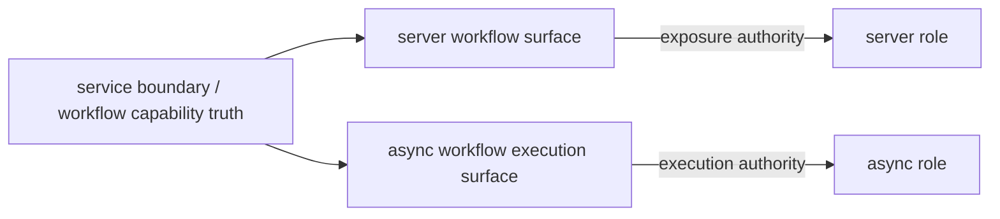
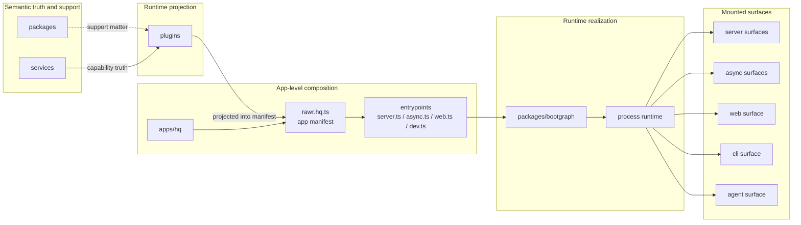

# RAWR Canonical Architecture and Runtime Specification

## 1. Scope

This specification defines the canonical architecture for RAWR HQ and the platform shape it establishes for later apps.

It fixes:

- the durable ontology
- the semantic authoring model
- the service, plugin, app, and bootgraph seams
- the runtime and boot model
- the default topology and scale path
- the operational mapping on service-centric platforms
- the resource and ownership model
- the canonical public SDK family

The architecture is organized around two durable separations.

The first is the semantic separation:

```text
support matter
  != semantic capability truth
  != runtime projection
  != app-level composition authority
```

The second is the realization separation:

```text
stable architecture
  != runtime realization
```

The stable architecture is:

```text
app -> manifest -> role -> surface
```

The runtime realization is:

```text
entrypoint -> bootgraph -> process -> machine
```

On service-centric platforms there is one additional operational mapping:

```text
entrypoint -> service -> replica(s)
```

That last line is an operational mapping, not a core ontology layer.

The point of the shell is simple:

```text
scale changes placement, not semantic meaning
```

---

## 2. Core ontology

### 2.1 Top-level architectural kinds

The canonical top-level architectural kinds are:

```text
packages/   support matter
services/   semantic capability boundaries
plugins/    runtime projections
apps/       app identities, manifests, and entrypoints
```

These are not folder labels. They are the durable nouns the system is built around.

### 2.2 Stable semantic nouns

```text
service   = semantic capability boundary
plugin    = runtime projection package
app       = top-level product/runtime identity
manifest  = app-level composition file
role      = semantic execution class inside an app
surface   = what a role exposes or runs
```

### 2.3 Runtime realization nouns

```text
entrypoint = executable file that chooses one process shape
bootgraph  = process-local lifecycle engine
process    = one running program
machine    = the computer or node running one or more processes
platform service = operational platform unit on Railway and similar platforms
```

### 2.4 Resource and lifetime nouns

```text
process resource   = long-lived resource shared within one process
role resource      = long-lived resource owned by one role inside one process
invocation context = per-request / per-call / per-execution values
call-local value   = temporary value created inside one handler or execution
```

### 2.5 Core definitions

#### `packages`

`packages` hold shared or lower-level support matter.

They may contain:

- shared types
- SDKs and helpers
- adapters and utilities
- lower-level primitives
- reusable support logic that does not itself define a first-class service boundary
- process-local lifecycle infrastructure such as `packages/bootgraph`

`packages` support other kinds. They do not own semantic capability truth, and they do not own app-level composition authority.

#### `services`

`services` hold semantic capability truth.

A service is a contract-bearing, transport-neutral capability boundary. It owns:

- stable boundary contracts
- stable context lane structure
- service-wide middleware semantics
- service-wide assembly seams
- internal module and procedure decomposition
- business-capability truth for that boundary
- authoritative write ownership for its invariants

A service is semantic first. It may be called in-process when caller and callee share a process, and later over RPC when remote, without changing what the service means.

#### `plugins`

`plugins` hold runtime projection.

A plugin exists to mount, expose, adapt, orchestrate, or otherwise project capability into a runtime surface. It owns:

- role-specific integration
- transport and surface adaptation
- runtime middleware
- lifecycle participation within a booted runtime
- runtime-specific orchestration
- runtime-specific exposure policy

Plugins project capability truth that lives in services. They do not replace service ownership.

#### `apps`

An app is the top-level product/runtime identity and code home.

It owns:

- manifest definition
- entrypoints
- runtime identity and config roots
- app-level composition authority
- role selection for each process shape
- transport and surface mounting at the process boundary

Inside an app, two app-internal constructs matter:

- the manifest
- the entrypoints

The manifest and entrypoints are app-internal. They are not additional top-level ontology kinds.

---

## 3. Canonical separations and laws

### 3.1 Semantic direction

The canonical semantic direction is fixed:

```text
packages -> services -> plugins -> apps
```

### 3.2 Stable architecture versus runtime realization

The stable architecture is:

```text
app -> manifest -> role -> surface
```

The runtime realization is:

```text
entrypoint -> bootgraph -> process -> machine
```

`bootgraph` bridges the two. It is not another top-level semantic layer.

### 3.3 Service boundary first

The governing rule is:

```text
service boundary first
placement second
transport third
```

A service boundary is transport-neutral and placement-neutral.

### 3.4 Shared infrastructure is not shared semantic ownership

```text
shared infrastructure != shared semantic ownership
```

Multiple services may share:

- an app
- a process
- a machine
- a database instance
- a connection pool
- telemetry installation

That does not mean they share semantic truth or write ownership.

### 3.5 Projection and assembly law

The assembly law is:

- packages support services, plugins, and apps without becoming capability truth
- service cores depend on packages but never on plugins or apps
- plugins depend on service contracts, service clients, and support matter but do not become truth owners
- apps compose plugins into roles and surfaces but do not redefine service truth
- bootgraph receives process-local boot inputs from entrypoints and does not own app-level composition policy

### 3.6 What remains fixed as scale increases

The following meanings must not change as the system grows:

- what a service is
- what a plugin is
- what an app is
- what a role is
- what a surface is
- what an entrypoint is
- what the bootgraph is

The system is allowed to change placement. It is not allowed to rename the ontology every time placement changes.

---

## 4. Canonical repo topology

The file tree should prioritize the stable semantic layers:

```text
app -> role -> surface
```

The file tree should not primarily encode:

- machine placement
- process count
- deployment layout
- current platform topology

The canonical target-state topology is:

```text
packages/
  bootgraph/
  hq-sdk/
  shared-types/
  ... support packages ...

services/
  <capability>/

plugins/
  server/
    api/
      <capability>/
    internal/
      <capability>/      # only if earned
  async/
    workflows/
      <capability>/
    consumers/
      <capability>/
    schedules/
      <capability>/
  web/
    app/
      <capability>/
  cli/
    commands/
      <capability>/
  agent/
    tools/
      <capability>/

apps/
  hq/
    rawr.hq.ts
    server.ts
    async.ts
    web.ts
    dev.ts
    cli.ts            # optional
    agent.ts          # optional
```

The second-level split under `plugins/<role>/...` exists only when the role composes different contribution shapes differently.

That is why `async` is split into:

- `workflows`
- `consumers`
- `schedules`

and why `server` may also split into:

- `api`
- `internal`

when there is a real trusted-only surface distinction.

---

## 5. Service model

### 5.1 Service posture

The service layer is the semantic capability plane.

The preferred posture is:

```text
services are transport-neutral semantic capability boundaries
with oRPC as the default local-first callable harness
```

That means a service may use oRPC server primitives for:

- procedure definition
- callable contract shape
- context lanes
- server-side local invocation
- eventual remote transport projection when placement changes later

### 5.2 What services own

Services own:

- contracts
- procedures
- service-wide context lanes
- service-wide metadata and policy vocabulary
- business invariants
- capability truth
- authoritative write ownership

### 5.3 What services do not own

Services do not own:

- public API route trees
- trusted internal route trees
- app manifest membership
- process boot
- HTTP listener details
- async runtime harness selection
- Railway service placement

### 5.4 Golden service shell

`services/example-todo` is the canonical service shell.

Its actual package shape establishes the authoring standard:

```text
services/example-todo/
  src/
    service/
      base.ts
      contract.ts
      impl.ts
      router.ts
      shared/
      modules/
    client.ts
    router.ts
    index.ts
```

The semantic split of those files is load-bearing:

```text
service/base.ts   = what the service means
service/impl.ts   = one package-wide runtime assembly seam
service/router.ts = one package-wide router composition seam
client.ts         = one canonical package-boundary client seam
index.ts          = one thin public export seam
```

A normal service author should be able to answer the important questions once:

- what is this service?
- what context lanes does it own?
- what metadata and policy vocabulary does it own?
- where is package-wide middleware attached?
- how does a caller create a client?
- what does the package export publicly?

### 5.5 Canonical service authoring shape

The canonical service shell is:

```ts
// services/<capability>/src/service/base.ts
import { defineService } from "@rawr/hq-sdk";

const service = defineService<{
  initialContext: {
    deps: Record<string, unknown>;
    scope: Record<string, unknown>;
    config: Record<string, unknown>;
  };
  invocationContext: Record<string, unknown>;
  metadata: Record<string, unknown>;
}>({
  metadataDefaults: {
    domain: "<capability>",
  },
  baseline: {
    policy: {},
  },
});

export const ocBase = service.oc;
export const createServiceMiddleware = service.createMiddleware;
export const createServiceObservabilityMiddleware = service.createObservabilityMiddleware;
export const createRequiredServiceObservabilityMiddleware = service.createRequiredObservabilityMiddleware;
export const createServiceAnalyticsMiddleware = service.createAnalyticsMiddleware;
export const createRequiredServiceAnalyticsMiddleware = service.createRequiredAnalyticsMiddleware;
export const createServiceImplementer = service.createImplementer;
```

```ts
// services/<capability>/src/service/impl.ts
import { contract } from "./contract";
import { createServiceImplementer } from "./base";

export const impl = createServiceImplementer(contract, {
  observability,
  analytics,
})
  .use(providerA)
  .use(providerB);
```

```ts
// services/<capability>/src/service/router.ts
import { impl } from "./impl";
import { router as moduleA } from "./modules/module-a/router";
import { router as moduleB } from "./modules/module-b/router";

export const router = impl.router({
  moduleA,
  moduleB,
});
```

```ts
// services/<capability>/src/client.ts
import { defineServicePackage } from "@rawr/hq-sdk/boundary";
import { router } from "./router";

const servicePackage = defineServicePackage(router);

export function createClient(boundary: ServicePackageBoundary<typeof router>) {
  return servicePackage.createClient(boundary);
}
```

### 5.6 Service-internal ownership law

Service-internal structure follows these rules:

- module-local by default
- `service/shared` is an earned exception
- repositories live under the owning module unless sharing has been earned
- policy engines live under the owning module or service, not in generic support packages unless truly infrastructural

Two small services that deeply share entities, policies, and write invariants are often one service with multiple modules, not two services.

### 5.7 Shared DB and ownership law

The important question is not whether two services share the same physical database instance.

The important questions are:

```text
1. do they share storage infrastructure?
2. do they share schema ownership?
3. do they share write authority over the same tables or entities?
4. do they share semantic truth, or only physical persistence?
```

The default policy is:

- multiple services may share one physical Postgres instance and one host-provided `dbPool`
- each service owns its own tables, migrations, repositories, and write invariants
- direct co-ownership of business tables across service boundaries is not the default

This is clean:

```text
shared host
shared dbPool
same Postgres database
separate services
separate tables
separate migrations
separate repositories
```

This is not:

```text
two services
same host
same db
same tables
both write directly
```

If two services need to write the same business entities, one of these is usually true:

- they are actually one service with multiple modules
- one service is the canonical owner and the other should call through that boundary
- the overlap is lower-level support matter and should be extracted into `packages/`

### 5.8 Cross-service calls

Cross-service interaction should go through the owning service boundary using its canonical contract or client shape.

When caller and callee share a process, default to in-process calls.
When the called service is remote, use RPC.

---

## 6. Plugin model

### 6.1 Plugin posture

Plugins are runtime projection.

A plugin translates service truth into role- and surface-specific runtime contributions.

A plugin is not:

- a service
- a bootgraph
- an app manifest
- a process-wide authority object
- a mini-framework

### 6.2 Canonical plugin roots

The canonical role-first plugin roots are:

```text
plugins/server/api/*
plugins/server/internal/*     # optional, only if earned
plugins/async/workflows/*
plugins/async/consumers/*
plugins/async/schedules/*
plugins/web/app/*
plugins/cli/commands/*
plugins/agent/tools/*
```

### 6.3 Plugin authoring law

The plugin shell should feel like the service shell feels.

A plugin author should know exactly:

- what capability is being projected
- what surface family it belongs to
- what exposure authority it owns
- what role-local resources it derives
- what runtime projection it emits

A normal plugin author should not need to think in:

- declaration
- registration
- satisfier
- materialized registration
- host-bound role plan
- manual boot arrays
- manual surface merging

### 6.4 Authoritative plugin seam

Every plugin has one authoritative file:

```text
src/plugin.ts
```

That file is the plugin equivalent of `service/base.ts`.

### 6.5 Public builder families

The public plugin builders are semantic, not generic.

```ts
export const defineServerApiPlugin = ...
export const defineServerInternalPlugin = ...
export const defineAsyncWorkflowPlugin = ...
export const defineAsyncConsumerPlugin = ...
export const defineAsyncSchedulePlugin = ...
export const defineWebAppPlugin = ...
export const defineCliCommandPlugin = ...
export const defineAgentToolPlugin = ...
```

### 6.6 Common plugin semantic lanes

Every plugin family uses the same semantic ideas:

- `capability`
- `exposure` when the plugin owns a callable or visible surface contract
- `resources` for role-local long-lived resources derived from process resources
- one shape-specific projection lane

### 6.7 Shape-specific projection lanes

| Builder | Semantic lanes |
| --- | --- |
| `defineServerApiPlugin` | `capability`, `exposure`, `resources`, `routes` |
| `defineServerInternalPlugin` | `capability`, `exposure`, `resources`, `routes` |
| `defineAsyncWorkflowPlugin` | `capability`, `exposure`, `resources`, `routes?`, `workflows` |
| `defineAsyncConsumerPlugin` | `capability`, `resources`, `consumers` |
| `defineAsyncSchedulePlugin` | `capability`, `resources`, `schedules` |
| `defineWebAppPlugin` | `capability`, `resources`, `app` |
| `defineCliCommandPlugin` | `capability`, `resources`, `command` or `commands` |
| `defineAgentToolPlugin` | `capability`, `resources`, `tool` or `tools` |

### 6.8 Exposure semantics

`exposure` is the public noun.
`declaration` is not.

For callable surfaces the canonical shape is:

```ts
exposure: {
  internal: {
    contract: ...,
  },
  published?: {
    contract: ...,
    routeBase?: ...,
  },
}
```

`exposure` answers surface authority questions.
It does not answer lifecycle or boot questions.

### 6.9 Resource derivation is the common path

Most plugins should not author raw boot modules.

The common authoring path is:

```ts
resources({ process }) {
  return {
    someLongLivedThing: ...
  };
}
```

The runtime compiler turns that into role-lifetime boot material.

### 6.10 `useService(...)`

The canonical helper for the common case is:

```ts
useService(createClient, boundary)
```

That says exactly what matters:

```text
this plugin uses one service boundary
and binds it from booted process resources
```

The helper hides:

- lifecycle conversion into role resource modules
- host binding details
- client resolver plumbing
- registration materialization

### 6.11 Advanced lifecycle escape hatch

An advanced escape hatch remains for unusual cases.

It is explicit and secondary:

```ts
lifecycle: {
  modules: [...]
}
```

The common case remains semantic authoring.
The advanced case is lifecycle authoring.

### 6.12 No register wrapper pattern

The canonical exported value is the plugin itself.

Not:

```ts
export function registerExampleTodoApiPlugin() { ... }
```

But:

```ts
export const exampleTodoApi = defineServerApiPlugin({ ... })
```

### 6.13 Example: canonical server API plugin

```ts
// plugins/server/api/example-todo/src/plugin.ts
import { defineServerApiPlugin, useService } from "@rawr/hq-sdk/plugins";
import { createClient as createExampleTodoClient } from "@rawr/example-todo";
import { exampleTodoApiContract } from "./contract";
import { createExampleTodoApiRouter } from "./router";

export const exampleTodoApi = defineServerApiPlugin({
  capability: "example-todo",

  exposure: {
    internal: {
      contract: exampleTodoApiContract,
    },
    published: {
      contract: exampleTodoApiContract,
    },
  },

  resources({ process }) {
    return {
      exampleTodo: useService(createExampleTodoClient, {
        deps: {
          dbPool: process.dbPool,
          clock: process.clock,
        },
        scope: {
          workspaceId: process.workspaceId,
        },
        config: process.config.exampleTodo,
      }),
    };
  },

  routes({ resources }) {
    const router = createExampleTodoApiRouter(() => resources.exampleTodo);

    return {
      internal: router,
      published: router,
    };
  },
});
```

### 6.14 Example: canonical async workflow plugin

```ts
// plugins/async/workflows/support-example/src/plugin.ts
import { defineAsyncWorkflowPlugin, useService } from "@rawr/hq-sdk/plugins";
import { createClient as createSupportExampleClient } from "@rawr/support-example";
import { supportExampleWorkflowContract } from "./contract";
import { createSupportExampleWorkflowRouter } from "./router";
import { createSupportExampleInngestFunctions } from "./functions/support-example";

export const supportExampleWorkflow = defineAsyncWorkflowPlugin({
  capability: "support-example",

  exposure: {
    internal: {
      contract: supportExampleWorkflowContract,
    },
    published: {
      routeBase: "/support-example/triage",
      contract: supportExampleWorkflowContract,
    },
  },

  resources({ process }) {
    return {
      supportExample: useService(createSupportExampleClient, {
        deps: {
          dbPool: process.dbPool,
          logger: process.logger,
        },
        scope: {
          workspaceId: process.workspaceId,
        },
        config: process.config.supportExample,
      }),
    };
  },

  routes({ resources }) {
    const router = createSupportExampleWorkflowRouter(() => resources.supportExample);

    return {
      internal: router,
      published: router,
    };
  },

  workflows({ runtime, resources }) {
    return createSupportExampleInngestFunctions({
      client: runtime.inngest,
      resolveSupportExampleClient: () => resources.supportExample,
    });
  },
});
```

### 6.15 Plugin authoring invariants

- plugins project service truth; they do not replace it
- plugin code may derive long-lived role resources from process resources
- actual business truth stays in `services/*`
- plugin trees are grouped by role first and contribution shape second
- actual domain logic stays out of plugin roots; plugin roots stay adapters and registrations only

---

## 7. App model

### 7.1 App posture

An app is the top-level product/runtime identity.

The default HQ app is:

```text
apps/hq/
```

### 7.2 Manifest posture

In the target-state HQ topology, the manifest is:

```text
apps/hq/rawr.hq.ts
```

It answers one question:

```text
What roles, shared wiring, and surfaces belong to this app?
```

It is:

- the canonical runtime definition of the app
- the upstream source for every app entrypoint
- the stable place where role and surface membership lives

It is not:

- the bootgraph
- a process
- a Railway service definition
- a machine placement definition
- a control plane

### 7.3 Manifest authoring law

The manifest must author:

- app identity
- shared process modules
- role membership
- explicit surface membership within each role

The manifest must not author:

- boot ordering algorithms
- rollback semantics
- framework listener internals
- Railway placement decisions
- Nx task graph logic
- manual role boot arrays derived from plugin resources
- manual materialized surface arrays
- host binding passes

### 7.4 Manifest shape

The manifest explicitly authors:

```text
role -> surface -> plugin membership
```

It does not collapse all composition into generic role-only `use` arrays.

### 7.5 Canonical manifest shape

```ts
// apps/hq/rawr.hq.ts
import { defineApp } from "@rawr/hq-sdk/app";
import { configModule, telemetryModule, postgresPoolModule } from "./boot/modules";
import { coordinationApi } from "@rawr/plugins/server/api/coordination";
import { stateApi } from "@rawr/plugins/server/api/state";
import { exampleTodoApi } from "@rawr/plugins/server/api/example-todo";
import { coordinationWorkflow } from "@rawr/plugins/async/workflows/coordination";
import { supportExampleWorkflow } from "@rawr/plugins/async/workflows/support-example";

export const rawrHq = defineApp({
  id: "hq",

  shared: {
    process: [configModule, telemetryModule, postgresPoolModule],
  },

  roles: {
    server: {
      api: [coordinationApi, stateApi, exampleTodoApi],
      internal: [],
    },

    async: {
      workflows: [coordinationWorkflow, supportExampleWorkflow],
      consumers: [],
      schedules: [],
    },

    web: {
      app: [],
    },

    cli: {
      commands: [],
    },

    agent: {
      tools: [],
    },
  },
});
```

### 7.6 Why `surface` stays explicit

`surface` is a stable semantic layer:

```text
app -> role -> surface
```

If the manifest stops expressing surface membership, it loses real semantic information.

The app must be able to say, explicitly, whether it is composing:

- public API
- trusted internal API
- workflow triggers
- durable workflows
- consumers
- schedules
- web app mounts
- CLI commands
- agent tools

That is not derived noise. That is composition meaning.

---

## 8. Entrypoints and process shape

### 8.1 Entrypoint posture

An entrypoint is the concrete file that boots one or more roles from the app manifest.

It answers:

```text
Which roles from this app become this process?
```

### 8.2 What an entrypoint authors

An entrypoint authors one thing only:

```text
process shape
```

### 8.3 What an entrypoint does

An entrypoint does three things:

1. reads the app manifest
2. selects one or more roles from that manifest
3. starts the runtime for that process shape and mounts the selected surfaces

### 8.4 What an entrypoint does not do

An entrypoint does not:

- redefine service truth
- redefine role membership
- invent a second manifest
- hide role selection behind framework magic
- manually bind plugins
- manually flatten derived boot arrays
- manually merge surface families

### 8.5 Canonical entrypoint shape

```ts
// apps/hq/server.ts
import { startAppRole } from "@rawr/hq-sdk/app-runtime";
import { rawrHq } from "./rawr.hq";
import { buildServerHttpRuntime } from "./server-runtime";

await startAppRole({
  app: rawrHq,
  role: "server",
  runtime: buildServerHttpRuntime,
});
```

```ts
// apps/hq/dev.ts
import { startAppRoles } from "@rawr/hq-sdk/app-runtime";
import { rawrHq } from "./rawr.hq";
import { buildDevRuntime } from "./dev-runtime";

await startAppRoles({
  app: rawrHq,
  roles: ["server", "async", "web"],
  runtime: buildDevRuntime,
});
```

### 8.6 Runtime compiler posture

A runtime compiler exists.
It must stay hidden.

Its job is:

```text
manifest
  -> select role(s)
  -> collect shared process modules
  -> collect advanced plugin lifecycle modules
  -> derive role resource modules from plugin resources(...)
  -> boot the graph
  -> call shape-specific projection lanes
  -> merge surfaces by role and surface rules
  -> hand the result to the concrete runtime harness
```

Surface merging helpers, manifest compilation types, and derived module plans may exist internally.
They are compiler words, not author words.

---

## 9. Bootgraph

### 9.1 Bootgraph posture

`packages/bootgraph` is the process-local lifecycle engine.

It owns:

- boot-module identity
- dependency graph resolution
- module dedupe by canonical identity
- deterministic boot ordering
- rollback on startup failure
- reverse shutdown ordering
- typed context assembly
- lifetime semantics for process-local and role-local instances
- lifecycle hooks

It does not own:

- app identity
- manifest definition
- role membership
- plugin discovery
- oRPC router composition
- Inngest function composition
- web mount composition
- CLI command composition
- Railway topology
- repo or workspace policy logic

### 9.2 Lifetime model

The bootgraph owns only these lifetimes:

```ts
export type BootLifetime = "process" | "role";
```

`process` means one instance shared inside the current running process.

`role` means one instance owned by one mounted role inside the current running process.

That is the complete lifetime model.

The bootgraph must not pretend there is a lifetime broader than one process.

### 9.3 What is borrowed from TsdkArc

The bootgraph keeps the Arc core where it is strong:

- typed module composition
- dependency declaration
- ordered startup
- rollback on startup failure
- reverse shutdown
- typed shared context assembly
- lifecycle hooks around boot and shutdown

### 9.4 What is adapted for RAWR

The RAWR bootgraph adapts those lifecycle ideas by changing the semantics around:

- identity: `BootModuleKey` instead of raw string `name`
- failure policy: startup failure is fatal even when an error hook exists
- lifetime model: only `process` and `role`
- app authority: bootgraph does not own it
- public API: the common author-facing surface is infrastructure-specific and narrow

### 9.5 What is not borrowed

The public RAWR shell does not allow:

- oRPC to become the bootgraph
- TsdkArc to define the app model
- raw boot-module authoring to become the common plugin authoring model

### 9.6 Canonical bootgraph types

```ts
export type AppRole = "server" | "async" | "web" | "cli" | "agent";

export interface BootModuleKey {
  id: string;
  lifetime: "process" | "role";
  role?: AppRole;
  purpose: string;
  capability?: string;
  surface?: string;
  instance?: string;
}

export interface BootContext<ReadCtx extends object, OwnSlice extends object = {}> {
  readonly current: ReadCtx;
  set(slice: OwnSlice): void;
}

export interface BootModule<ReadCtx extends object, OwnSlice extends object = {}> {
  key: BootModuleKey;
  dependsOn?: readonly BootModule<any, any>[];
  beforeBoot?(ctx: BootContext<ReadCtx, OwnSlice>): Promise<void> | void;
  boot?(ctx: BootContext<ReadCtx, OwnSlice>): Promise<OwnSlice | void> | OwnSlice | void;
  afterBoot?(ctx: BootContext<ReadCtx, OwnSlice>): Promise<void> | void;
  beforeShutdown?(ctx: BootContext<ReadCtx, OwnSlice>): Promise<void> | void;
  shutdown?(ctx: BootContext<ReadCtx, OwnSlice>): Promise<void> | void;
  afterShutdown?(ctx: BootContext<ReadCtx, OwnSlice>): Promise<void> | void;
}

export interface StartBootGraphInput {
  modules: readonly BootModule<any, any>[];
  hooks?: BootGraphHooks;
}

export interface StartedBootGraph<Ctx extends object = {}> {
  ctx: Ctx;
  stop(): Promise<void>;
}
```

### 9.7 Canonical public bootgraph API

```ts
export const defineProcessModule = ...
export const defineRoleModule = ...
export const startBootGraph = ...
```

The bootgraph may expose internal helpers for:

- testing
- identity serialization
- module dedupe
- graph inspection

It should not expose manifest-level abstractions.

### 9.8 Conceptual boot flow inside one process

The bootgraph remains process-local, but it must be able to realize both shared process resources and role-local resources inside that process.

The conceptual flow is:

```text
start selected process modules
start selected role modules
assemble typed process and role context
build surfaces from booted context
mount concrete runtime
```

That orchestration may be implemented by the hidden app runtime/compiler layer above `startBootGraph(...)`.

### 9.9 Resource ownership table

| Kind | Example | Owner | Visibility |
| --- | --- | --- | --- |
| process resource | config, logger, dbPool, telemetry, Inngest client | bootgraph process module | shared within one process |
| role resource | service client, cache, repository wrapper, route-local adapter | bootgraph role module or derived plugin resource | one role inside one process |
| invocation context | request ID, auth decision, trace ID, schedule execution metadata | runtime harness | one request or execution |
| call-local value | transaction handle, temporary accumulator | handler or workflow step | one call |

---

## 10. Runtime roles and surfaces

### 10.1 Canonical runtime roles

The canonical runtime roles are:

- `server`
- `async`
- `web`
- `cli`
- `agent`

These are peer runtime roles.

These are role names, not plugin subtype names.
Labels such as `api`, `workflow`, `consumer`, `command`, `tool`, or `internal` describe surface or contribution shape within a role.

### 10.2 `server`

`server` is the caller-facing synchronous boundary role.

It owns request/response boundary projection:

- public synchronous APIs
- trusted internal synchronous APIs when earned
- transport and auth concerns
- exposure policy
- control or trigger surfaces that must answer callers synchronously

Typical server surfaces include:

- public oRPC APIs
- internal or trusted oRPC APIs
- workflow trigger surfaces that acknowledge quickly and hand off execution
- health and readiness endpoints where needed

### 10.3 `async`

`async` is the non-request execution role.

It covers:

- workflows
- schedules
- consumers
- background jobs
- internal execution bridges
- resident loops where justified

For business-level async work that benefits from retries, durability, scheduling, and execution timelines, Inngest is the default durability harness.

That does not mean:

- every tiny local side effect belongs in Inngest
- Inngest becomes the service model
- Inngest becomes the bootgraph

### 10.4 Workflow responsibility split

Workflow responsibility is split cleanly:

- caller-facing workflow exposure belongs on server surfaces
- durable workflow execution belongs on async surfaces



### 10.5 `web`

`web` is the frontend runtime role.

It owns:

- the web entrypoint
- the web build and runtime pipeline
- client-side lifecycle
- web-facing surface projection over shared semantic truth

`web` is not a folder under `server`.
It is its own role.

### 10.6 `cli`

`cli` is the command execution role.

It hosts:

- operator-facing commands
- local command execution
- terminal presentation
- argument parsing and command dispatch

`cli` is a runtime role even though it is not usually a long-running deployed service.

### 10.7 `agent`

`agent` is the steward execution role.

It is where bounded stewardship becomes runtime placement.
NanoClaw is the runtime backend used for steward execution on this role. It is not a peer ontology kind.

### 10.8 Sidecars are not roles

A sidecar is an infrastructure-support companion process.
It is not a peer runtime role.

Examples of sidecars include:

- telemetry collectors
- reverse proxies
- log shippers
- secrets agents

`async` is not a sidecar of `server`.
It is a peer application role that carries core product behavior.

---

## 11. Runtime harnesses

The runtime harnesses are downstream of the semantic shell.

The default mapping is:

- oRPC = local-first callable boundary harness for services and synchronous callable surfaces
- Elysia = HTTP hosting harness for server runtime composition
- Inngest = durability harness for async workflow execution
- NanoClaw = steward runtime backend for the agent role
- bootgraph = process-local lifecycle engine

None of those technologies becomes a peer ontology kind beside packages, services, plugins, or apps.

### 11.1 Server harness posture

The server process stack is:

```text
services/*
  -> plugins/server/api/* and plugins/server/internal/*
  -> app manifest
  -> entrypoint
  -> bootgraph
  -> mounted server surfaces
  -> Elysia HTTP runtime
```

### 11.2 Async harness posture

The async process stack is:

```text
services/*
  -> plugins/async/workflows/*, consumers/*, schedules/*
  -> app manifest
  -> entrypoint
  -> bootgraph
  -> mounted async surfaces
  -> Inngest and async worker runtime
```

### 11.3 Harness law

Harnesses consume booted resources and mounted surfaces.
They do not define the ontology.

---

## 12. Canonical public SDK family

The public SDK family should feel like one coherent semantic family.

### 12.1 Services

```ts
defineService(...)
defineServicePackage(...)
```

### 12.2 Plugins

```ts
defineServerApiPlugin(...)
defineServerInternalPlugin(...)
defineAsyncWorkflowPlugin(...)
defineAsyncConsumerPlugin(...)
defineAsyncSchedulePlugin(...)
defineWebAppPlugin(...)
defineCliCommandPlugin(...)
defineAgentToolPlugin(...)
useService(...)
```

### 12.3 Apps

```ts
defineApp(...)
startAppRole(...)
startAppRoles(...)
```

### 12.4 Lifecycle infrastructure

```ts
defineProcessModule(...)
defineRoleModule(...)
startBootGraph(...)
```

That is what a strong core SDK should feel like.

Not a bag of low-level primitives.
A family of semantic builders.

---

## 13. Borrow / adapt / do-not-borrow matrix

### 13.1 Borrow from oRPC

Keep native oRPC where it is strongest:

- contract-first callable boundaries
- context lanes
- middleware composition
- local-first invocation
- eventual remote transport projection

That belongs in:

- `services/*` as the default local-first callable harness
- `plugins/server/*` as synchronous surface projection

### 13.2 Borrow from TsdkArc

Keep native TsdkArc where it is strongest:

- typed module composition
- dependency declaration
- ordered startup
- rollback on boot failure
- reverse shutdown
- typed shared context assembly

That belongs only in:

```text
packages/bootgraph/
```

### 13.3 Adapt for RAWR

Adapt these areas rather than exposing raw library semantics directly:

- `BootModuleKey` identity instead of raw module name strings
- fatal startup policy
- the `process` / `role` lifetime model only
- the app runtime/compiler above bootgraph
- semantic plugin builders above raw modules
- semantic app builders above manifest arrays

### 13.4 Do not borrow into the public shell

Do not let:

- oRPC define the boot model
- TsdkArc define the app model
- Elysia define the ontology
- Inngest define service meaning
- Railway define role composition

The public shell is RAWR’s responsibility.

---

## 14. Operational mapping and scale path

### 14.1 Default topology stance

HQ defaults to one app:

```text
apps/hq/
```

with one manifest:

```text
apps/hq/rawr.hq.ts
```

Its baseline long-running runtime set is:

- `server`
- `async`
- `web`

Those roles are scaffolded as distinct entrypoints and distinct long-running process shapes from day one.

### 14.2 Baseline local posture

The baseline local posture is split processes on one machine:

```text
machine: your MacBook

apps/hq/server.ts -> process 1
apps/hq/async.ts  -> process 2
apps/hq/web.ts    -> process 3
```

### 14.3 Optional cohosted dev mode

A dedicated local entrypoint may boot multiple roles together:

```text
apps/hq/dev.ts -> one process containing server + async + web
```

This is allowed because the entrypoint is the explicit mount decision for one process.

In both local modes the semantic model is unchanged:

- HQ is still one app
- `rawr.hq.ts` is still the manifest
- `server`, `async`, and `web` are still roles
- surfaces are still role-local projections

Only process shape changes.

### 14.4 Railway mapping

The semantic architecture remains:

```text
app -> manifest -> role -> surface
```

The Railway mapping becomes:

```text
entrypoint -> Railway service -> replica(s)
```

The control split is:

- the app controls identity, roles, surfaces, and valid process shapes through explicit entrypoints
- Railway controls which entrypoint a service runs, build and start behavior, networking, supervision, and replica count

The correct production default on Railway is:

```text
one Railway service per long-running role
```

For HQ that means:

```text
hq-server -> apps/hq/server.ts
hq-async  -> apps/hq/async.ts
hq-web    -> apps/hq/web.ts
```

Optional cohosted services are valid for development, staging, or intentionally cheap environments, but they couple scaling and failure domains.

### 14.5 Growth model

Start with one app.
Split only at the app boundary.

When a domain earns an independent environment, trust, or ownership boundary, it becomes a new app.

Example:

```text
apps/billing/
  rawr.billing.ts
  server.ts
  async.ts
  web.ts
```

The split happens at the app boundary, not by mutating the role, entrypoint, process, or machine vocabulary.

### 14.6 Scale continuity

The scale-out property is:

```text
semantic truth stays stable
while runtime placement becomes more distributed
```

That means the system can change:

- app count
- process count
- platform placement
- service boundaries on Railway
- replica count

without changing what a service, plugin, app, role, surface, entrypoint, or bootgraph means.

---

## 15. Mechanical enforcement orientation

The architecture is designed to become mechanically enforceable.

The enforcement direction is:

```text
canon -> graph -> proof -> ratchet
```

Where:

- canon fixes the nouns and authority seams
- the Nx graph encodes those seams as kind, app, role, surface, and capability law
- lint, structural checks, and tests prove what the graph cannot
- ratchets make each structural slice verifiable before the next slice moves

The graph is the control plane for structural truth.
It is not a second manifest.

The important enforcement consequences are:

- services never depend on plugins or apps
- plugins never become truth owners
- apps compose but do not redefine service truth
- plugin paths and tags must match `role -> surface -> capability`
- manifest purity and entrypoint thinness are first-class proof obligations
- bootgraph remains downstream and narrow

Exact tag spellings, `depConstraints` syntax, sync-generator implementation, and structural test mechanics remain implementation details.

---

## 16. Canonical invariants

These invariants are load-bearing.

### 16.1 Ontology invariants

```text
app != manifest != role != surface
entrypoint != process != machine
bootgraph bridges the two
```

### 16.2 File-tree invariant

```text
file structure follows: app -> role -> surface
```

It does not primarily encode machine or Railway placement.

### 16.3 Ownership invariants

- services own semantic truth
- plugins own runtime projection
- apps own composition authority
- bootgraph owns lifecycle only

### 16.4 Dependency invariants

- services never depend on plugins or apps
- plugins may depend on services and packages but do not become truth owners
- apps may depend on services, plugins, and packages but do not redefine service truth
- bootgraph remains support infrastructure under `packages/`

### 16.5 Manifest invariants

- manifest is upstream of process boot
- manifest authors explicit `role -> surface -> plugin membership`
- manifest does not own runtime realization

### 16.6 Entrypoint invariants

- entrypoint decides which roles boot in one process
- role selection remains explicit
- entrypoints stay thin

### 16.7 Bootgraph invariants

- bootgraph is process-local only
- bootgraph owns only `process` and `role` lifetimes
- bootgraph does not own app meaning

### 16.8 Plugin invariants

- plugins are not services
- plugins are not mini-frameworks
- plugins are not raw boot-module authoring by default
- plugins do not use declaration, satisfier, or materialized-registration language in the common public shell

### 16.9 Service ownership invariants

- shared database infrastructure is normal
- shared business-table ownership across service boundaries is not the default
- one service owns canonical writes for one invariant set

### 16.10 Control-plane invariant

There is no fake internal control-plane layer by default.
Trusted-only or operational routes remain server surfaces until a different deployment or trust model is concretely earned.

---

## 17. Forbidden patterns

The following patterns are forbidden in the canonical architecture:

- manifest-owned runtime realization
- plugin-owned business truth
- services depending on plugins or apps
- app manifests that manually curate derived boot arrays from plugin resources
- entrypoints that manually bind plugins or manually merge surfaces
- public plugin authoring based on declaration or registration wrappers
- public plugin authoring based on satisfiers or materialized registrations
- bootgraph APIs that pretend to own app identity or manifest authority
- shared direct write ownership across service boundaries as the default database model
- file trees that make deployment shape the primary organizing principle

---

## 18. What remains flexible

These details may vary without reopening the architecture:

- exact helper filenames under `apps/hq/*`
- exact internal structure of individual service packages
- exact internal structure of individual plugin packages
- exact runtime harness wrappers around Elysia, Inngest, NanoClaw, or web tooling
- exact command names for workspace scripts
- exact codegen around route or registry collection
- exact bootgraph internal file decomposition
- exact Nx tag spellings and structural-check implementations
- exact threshold for promoting runtime-specific multi-service composition into a composed service

The architecture is about nouns, boundaries, and responsibility split. Not every subordinate filename is part of the contract.

---

## 19. Final canonical picture



Every running process should be read as:

```text
entrypoint
  -> compile selected role runtime from the manifest
  -> boot process and role resources through the bootgraph
  -> build surfaces from booted context
  -> attach those surfaces to the concrete runtime harness
  -> run as one process
```

The full system should always be interpreted as:

```text
semantic architecture:  app -> manifest -> role -> surface
runtime realization:    entrypoint -> bootgraph -> process -> machine
operational placement:  entrypoint -> service -> replica(s) on service-centric platforms
```

The canonical shell is:

```text
services own capability truth
plugins own runtime projection
manifests own app membership by role and surface
entrypoints own process shape
bootgraph owns lifecycle only
```

The canonical public SDK family is:

```text
service:
  defineService(...)
  defineServicePackage(...)

plugin:
  define<role><surface>Plugin({
    capability,
    exposure?,
    resources?,
    <shape-specific projection lane>
  })
  useService(...)

app:
  defineApp({
    id,
    shared,
    roles: {
      <role>: {
        <surface>: [plugins...]
      }
    }
  })
  startAppRole(...)
  startAppRoles(...)

bootgraph:
  defineProcessModule(...)
  defineRoleModule(...)
  startBootGraph(...)
```

That is the canonical system.
