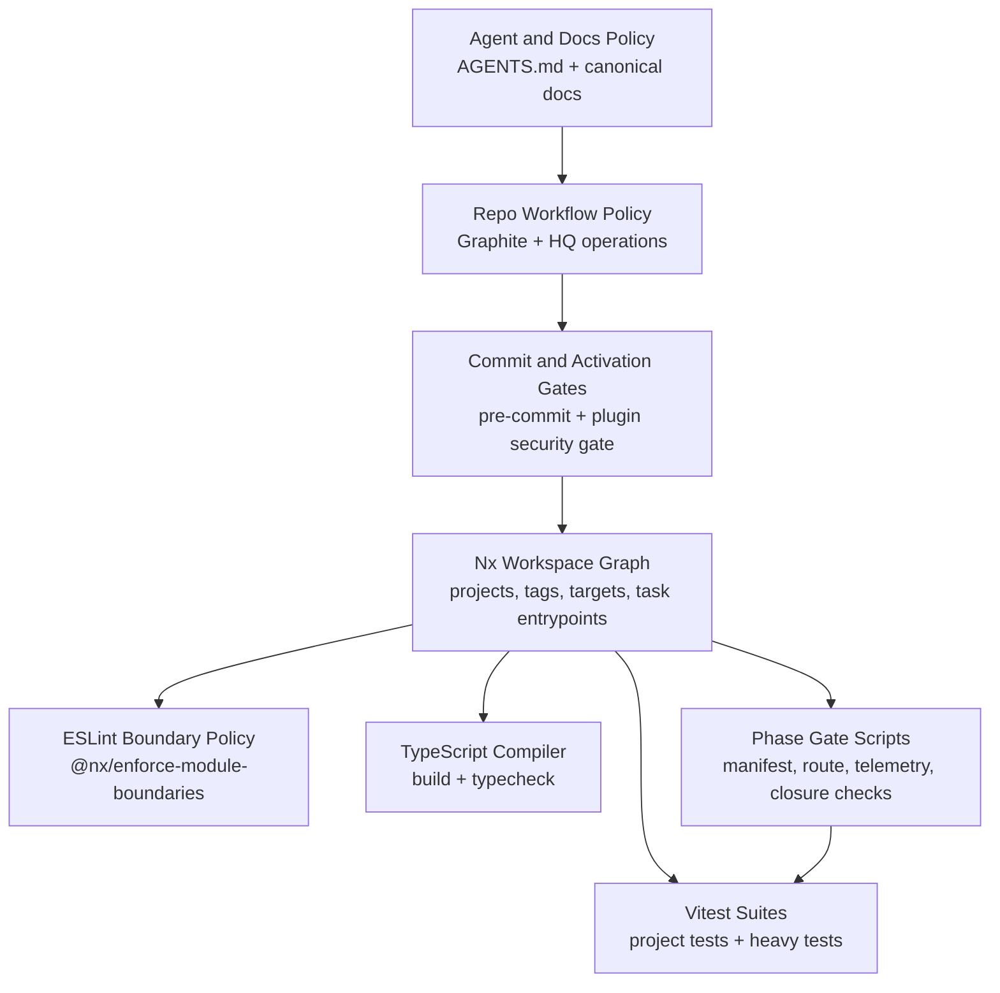
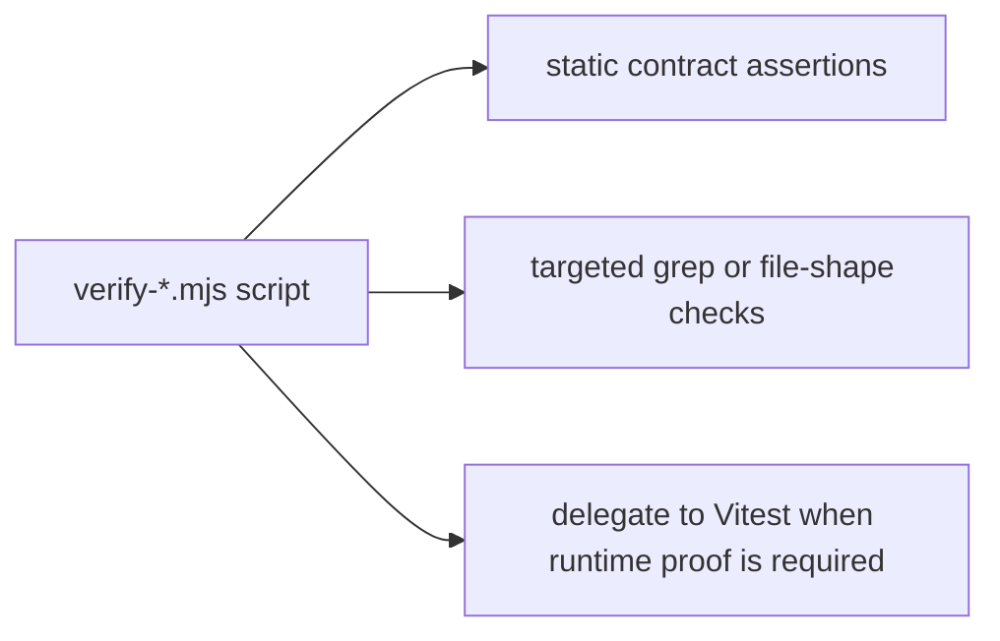
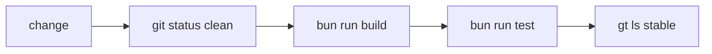
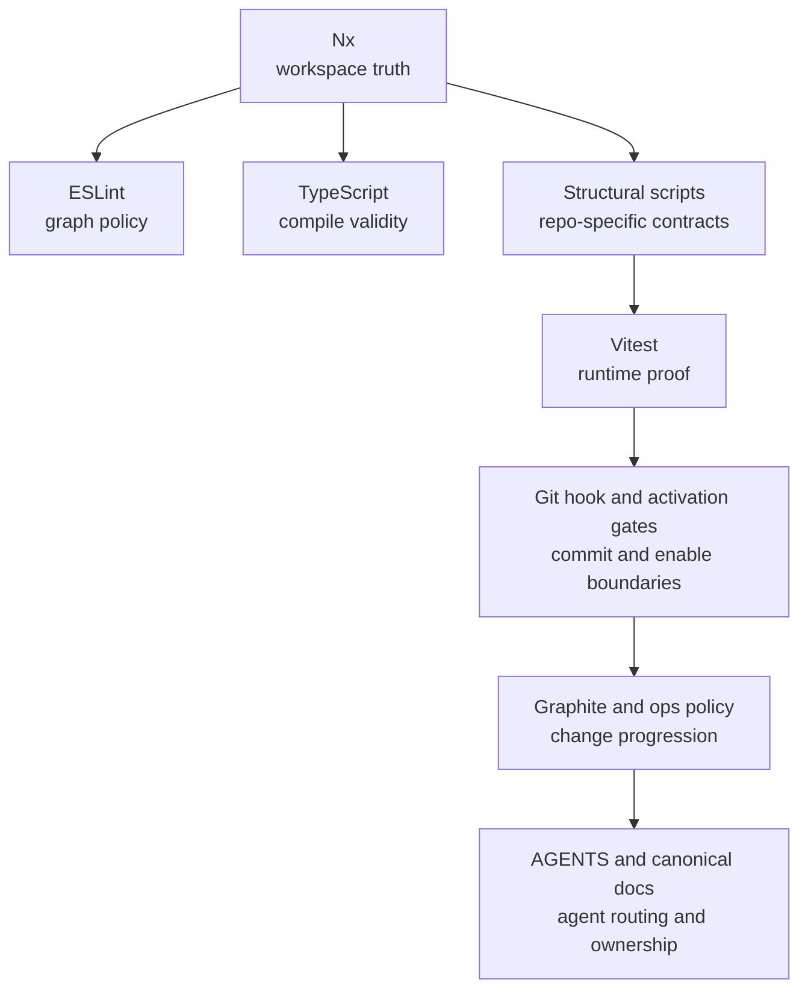

# Enforcement Stack

`RAWR HQ-Template` uses multiple enforcement layers. They do not all prove the same thing.

- Nx defines workspace truth, project identity, and the task surface.
- ESLint enforces import-boundary policy using Nx graph metadata.
- TypeScript enforces compile-time correctness.
- Phase gate scripts enforce architecture- and repo-specific structural contracts.
- Vitest enforces runtime and behavioral contracts.
- Git hooks and plugin-security gates enforce commit-time and activation-time safety checks.
- Process and agent layers constrain how changes are made and where they belong.

## At-a-glance map



## Concern Coverage

| Concern | Primary layer | Blocking mechanism |
| --- | --- | --- |
| Workspace/project identity | Nx | project graph, project names, tags, targets |
| Import direction and slice boundaries | ESLint + Nx metadata | `@nx/enforce-module-boundaries` |
| Compile validity | TypeScript | `tsc -p ...`, `tsc --noEmit` |
| Repo-specific structural contracts | Phase scripts | `scripts/phase-*/verify-*.mjs` |
| Runtime behavior and host composition | Vitest | project-scoped and gate-scoped test runs |
| Secret leakage and plugin drift before commit | Git hook + security/plugin commands | `scripts/githooks/pre-commit` |
| Plugin activation safety | `@rawr/security` gate | `rawr plugins web enable` gate |
| Branch/stack mutation policy | Graphite + ops runbooks | prescribed `gt` flow and acceptance checks |
| Agent routing and destination rules | AGENTS lattice | instruction-layer enforcement in agent sessions |

## 1. Nx as an Enforcement Layer

Nx is the workspace truth layer.

It enforces:
- what counts as a project,
- each project's canonical name,
- each project's tags,
- each project's runnable targets,
- the root-level scripts that are promoted into the task graph.

It enforces this through:
- project discovery from `package.json` and `project.json`,
- project metadata such as `nx.tags`,
- target registration exposed by `bunx nx show project <name> --json`,
- `nx:run-script` executors that make scripts part of the graph,
- root `nx.includedScripts`, which turns selected root scripts into Nx targets.

Current workspace surface:

```json
// nx.json
{
  "namedInputs": {
    "default": ["{projectRoot}/**/*"],
    "production": ["default", "!{projectRoot}/dist/**", "!{projectRoot}/coverage/**"]
  },
  "targetDefaults": {}
}
```

```json
// apps/server/package.json
{
  "name": "@rawr/server",
  "nx": {
    "tags": ["type:app"]
  },
  "scripts": {
    "build": "bunx tsc -p tsconfig.json",
    "typecheck": "bunx tsc -p tsconfig.json --noEmit",
    "test": "vitest run --project server"
  }
}
```

```json
// package.json
{
  "nx": {
    "includedScripts": [
      "lint:boundaries",
      "pretest:vitest",
      "test:vitest",
      "phase-a:gates:baseline",
      "phase-2_5:gates:quick",
      "phase-2_5:gates:exit"
    ]
  }
}
```

### What Nx covers

```text
workspace graph
  -> project identity
  -> tag metadata
  -> target addressability
  -> task orchestration surface
```

### What Nx does not prove by itself

Nx does not currently prove:
- whether an import is allowed,
- whether a manifest is structurally valid,
- whether a host mounted the right routes,
- whether runtime behavior matches the architecture contract.

Those proofs happen in the layers above Nx.

## 2. Linting and Graph-Policy Enforcement

Linting is the first blocking layer that uses Nx graph truth to reject architecture violations.

Current mechanism:

```js
// eslint.config.mjs
const boundaryRule = [
  "error",
  {
    depConstraints: [
      { sourceTag: "type:app", onlyDependOnLibsWithTags: ["*"] },
      { sourceTag: "type:service", notDependOnLibsWithTags: ["type:app", "type:plugin"] },
      { sourceTag: "type:package", notDependOnLibsWithTags: ["type:service"] },
      { sourceTag: "type:plugin", notDependOnLibsWithTags: ["type:plugin"] }
    ]
  }
];
```

Lint currently runs against the structural roots directly:

```bash
eslint apps services packages plugins
```

### What lint enforces

- app, service, package, and plugin import direction,
- plugin-to-plugin runtime import prohibition,
- graph-policy violations backed by Nx tags.

### Important current limitation

`eslint.config.mjs` currently ignores `apps/server/src/rawr.ts`.
That means the most sensitive composition file is partially outside the boundary-lint surface.

## 3. TypeScript as a Compile-Time Enforcement Layer

TypeScript is the compile-validity gate.

Workspace baseline:

```json
// tsconfig.base.json
{
  "compilerOptions": {
    "target": "ES2022",
    "module": "ESNext",
    "moduleResolution": "Bundler",
    "strict": true,
    "skipLibCheck": true
  }
}
```

Per-project enforcement happens through Nx-addressable targets such as:

```bash
bunx tsc -p tsconfig.json
bunx tsc -p tsconfig.json --noEmit
```

### What TypeScript covers

- invalid imports that fail resolution,
- contract drift visible to the type system,
- broken project-local build surfaces,
- incorrect use of generated or shared package types.

### What TypeScript does not cover

- allowed vs forbidden architectural imports,
- manifest composition semantics,
- runtime wiring correctness,
- route/surface availability.

## 4. Structural Gate Scripts

The phase gate scripts are the most repo-specific deterministic enforcement layer.

They exist because some contracts in this repo are architectural and semantic, not just syntactic.

Example gate chain:

```json
// package.json
{
  "scripts": {
    "phase-a:gates:baseline": "bun run phase-a:gate:metadata-contract && bun run phase-a:gate:import-boundary && bun run phase-a:gate:manifest-smoke-baseline && bun run phase-a:gate:host-composition-guard && bun run phase-a:gate:route-negative-assertions && bun run phase-a:gate:harness-matrix && bun run phase-a:gate:observability-contract && bun run phase-a:gate:telemetry-contract"
  }
}
```

Representative gate responsibilities:
- metadata contract checks,
- manifest smoke checks,
- host composition guards,
- route-negative assertions,
- harness matrix checks,
- observability contract checks,
- telemetry contract checks,
- closure and drift checks in later phases.

### Why this layer exists

These checks cover contracts that generic tools do not understand natively:
- "host apps mount manifest outputs and do not author capability composition",
- "forbidden routes stay unavailable at the host boundary",
- "telemetry and observability contracts stay wired through the right runtime seams",
- "migration closure and legacy-key cleanup actually happened".

### Structural gate pattern



## 5. Testing

Vitest is the runtime and behavior proof layer.

The workspace uses one multi-project config and then runs project-targeted suites:

```ts
// vitest.config.ts
projects: [
  { root: r("apps/cli"), test: { name: "cli" } },
  { root: r("apps/server"), test: { name: "server" } },
  { root: r("apps/web"), test: { name: "web" } },
  { root: r("packages/core"), test: { name: "core" } },
  ...
]
```

Active test surfaces:
- fast default suite: `vitest run --config vitest.fast.config.ts`,
- heavy CLI suite,
- heavy visual web suite,
- gate-specific targeted suites such as route-boundary, host-composition, telemetry, ingress-signature, and contract-drift tests.

### What tests enforce

- host composition behavior,
- route and surface availability,
- telemetry and metrics behavior,
- capability/runtime cutover behavior,
- API and workflow contract drift,
- concurrency and state behavior,
- regression protection on repo-specific runtime contracts.

### Relationship to structural scripts

The script layer and the test layer work together:
- scripts prove static or file-shape facts,
- tests prove live runtime behavior,
- many named gates deliberately invoke both.

## 6. Commit-Time and Activation-Time Gates

These are deterministic gates that run at the moments when risk increases: before commit and before plugin activation.

### Pre-commit hook

```bash
# scripts/githooks/pre-commit
bun run rawr -- security check --staged
bun scripts/githooks/check-template-managed.ts
bun run rawr -- plugins status --checks all
```

This hook blocks commits on:
- staged secret or security findings,
- template-managed file violations,
- plugin sync/drift failures.

### Plugin activation gate

The security model treats `rawr plugins web enable <id>` as an activation boundary.

Deterministic checks currently include:
- `bun audit --json`,
- `bun pm untrusted`,
- staged or repo secret scans.

State mutation happens only after the gate passes:
- enabled plugin state is written to `.rawr/state/state.json`.

## 7. Repo Workflow and Acceptance Enforcement

This layer is operational rather than code-level, but it still constrains valid change flow.

Primary mechanisms:
- Graphite stack policy in `docs/process/GRAPHITE.md`,
- repo-boundary and acceptance policy in `docs/process/HQ_OPERATIONS.md`.

They enforce:
- `gt` as the branch/stack mutation surface,
- `main` as trunk,
- no ad hoc history rewriting on Graphite-tracked branches,
- final acceptance checks such as clean worktree, passing build, passing test, and stable stack state.



This layer is not the same as lint/test enforcement. It governs whether a change is allowed to progress through the repo workflow.

## 8. Agent and Documentation Policy Layer

This is the highest layer in the stack.

Primary mechanisms:
- root `AGENTS.md`,
- nested `AGENTS.md` files,
- `docs/process/NX_AGENT_WORKFLOW.md`,
- canonical system/process docs.

This layer enforces, inside agent-driven sessions:
- Nx-first workspace discovery,
- routing by ownership and repo role,
- template-vs-personal destination rules,
- command-surface separation,
- clean-worktree expectations,
- Graphite-first branch operations.

### Important boundary

This layer is deterministic for participating agents because it is instruction-driven.
It is not a runtime or compiler boundary for ordinary program execution.

## Stack Summary



Read this stack from bottom to top when debugging:
1. Is the workspace/project/target identity correct in Nx?
2. Is the import graph allowed by boundary lint?
3. Does the code still typecheck and build?
4. Do the structural scripts still accept the repo shape?
5. Do the runtime tests still prove the behavior?
6. Do commit-time and activation-time gates still pass?
7. Is the change still valid under repo workflow policy?
8. Is the change landing in the correct place under the AGENTS lattice?
