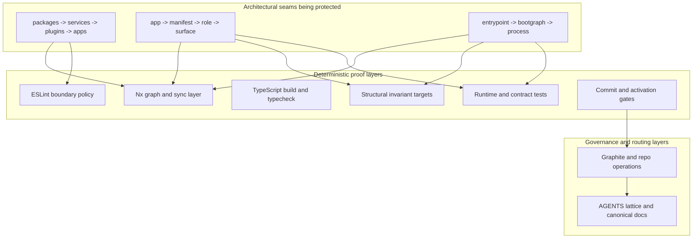
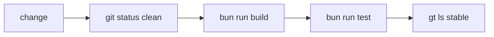

# Enforcement Stack

This document defines the canonical enforcement stack for `RAWR HQ-Template`.

It describes:
- what the repo is mechanically trying to prove,
- which enforcement layers prove which concerns,
- how Nx, linting, testing, and higher-order policy fit together,
- where deterministic enforcement stops and governance/routing begins.

Canonical architecture authority lives in:
- `chatgpt-design-host-shell-architecture/work/docs/canonical/RAWR_Future_Architecture_V2.md`
- `chatgpt-design-host-shell-architecture/work/docs/canonical/RAWR_App_Boot_Spec/README.md`

## What Enforcement Is Protecting

The enforcement stack exists to preserve the canonical repo and runtime seams:

```text
packages  -> support matter
services  -> semantic capability truth
plugins   -> runtime projection
apps      -> app identity, manifest, and entrypoints
```

```text
app -> manifest -> role -> surface
entrypoint -> bootgraph -> process
```

The load-bearing rules are:
- services own semantic truth,
- plugins project services into role- and surface-specific runtime seams,
- apps own manifest and entrypoint composition authority,
- the bootgraph owns process-local lifecycle semantics,
- repo workflow and agent routing preserve where changes are allowed to land.

## Enforcement Topology



## Concern-To-Proof Map

| Concern | What must stay true | Primary proof layer |
| --- | --- | --- |
| Workspace and project identity | The repo has a stable graph, tag surface, and target surface | Nx |
| Dependency direction | `services` do not depend on `plugins` or apps; plugins do not runtime-import other plugins | ESLint with Nx metadata |
| Compile validity | Code resolves, builds, and typechecks | TypeScript |
| Manifest and entrypoint authority | App composition stays manifest-upstream and entrypoint-explicit | Structural invariant targets |
| Bootgraph and runtime seams | Process-local lifecycle stays in the bootgraph/runtime seam | Structural invariant targets and tests |
| Runtime behavior | Routes, surfaces, telemetry, workflows, and cutover behavior remain correct | Tests |
| Commit and activation safety | Secrets, drift, and plugin activation risk are blocked at the edge | Git hook and security gate |
| Repo mutation policy | Stack operations and final acceptance remain controlled | Graphite and HQ operations |
| Destination and routing policy | Changes land in the correct repo, path, and command surface | AGENTS lattice and canonical docs |

## How To Read Failures

When a change fails the enforcement stack, debug in this order:
1. Is the project graph, tag surface, or target surface wrong?
2. Is the import graph violating architectural direction?
3. Does the code still build and typecheck?
4. Are the manifest, entrypoint, and bootgraph invariants still satisfied?
5. Do runtime and contract tests still prove the intended behavior?
6. Do commit-time and activation-time gates still pass?
7. Is the change still valid under repo workflow policy?
8. Is the change landing in the correct place under the AGENTS lattice?

## Deterministic Proof Layers

## 1. Nx Graph And Sync Layer

Nx is the canonical graph and orchestration layer.

It proves:
- what counts as a project,
- each project’s canonical name,
- each project’s tags,
- each project’s runnable targets,
- graph-derived artifacts that must stay in sync with repo structure.

It does this through:
- project discovery from `package.json` and `project.json`,
- `nx.tags`,
- `targetDefaults`,
- `namedInputs`,
- project-owned targets,
- `nx affected`,
- `nx run-many`,
- `nx sync:check`,
- project-graph extensions when import edges alone are insufficient.

Canonical graph language:
- `type:*`
- `capability:*`
- `app:*`
- `role:*`
- `surface:*`
- `migration-slice:*`

Canonical project examples:

```json
{
  "name": "@rawr/services-support",
  "tags": ["type:service", "capability:support", "app:hq"]
}
```

```json
{
  "name": "@rawr/plugins-server-api-support",
  "tags": ["type:plugin", "capability:support", "app:hq", "role:server", "surface:api"]
}
```

Canonical Nx configuration shape:

```json
{
  "namedInputs": {
    "default": ["{projectRoot}/**/*"],
    "structural": [
      "{projectRoot}/**/*",
      "{workspaceRoot}/nx.json",
      "{workspaceRoot}/eslint.config.mjs",
      "{workspaceRoot}/apps/hq/rawr.hq.ts"
    ]
  },
  "targetDefaults": {
    "structural": {
      "cache": true,
      "inputs": ["structural", "^structural"]
    },
    "lint": {
      "inputs": ["default", "{workspaceRoot}/eslint.config.mjs"]
    }
  }
}
```

Canonical Nx verification commands:

```bash
bunx nx sync:check
bunx nx affected -t structural,lint,test
bunx nx run-many -t structural --projects=@rawr/services-support,@rawr/plugins-server-api-support
```

Nx does not define architectural semantics by itself.
It is the graph, orchestration, and graph-derived-proof surface that other deterministic layers build on.

## 2. ESLint Boundary Policy

ESLint is the graph-policy enforcement layer.

It consumes Nx project metadata and rejects dependency direction that violates the architecture.

It proves:
- services do not depend on plugins or apps,
- packages do not absorb service truth,
- plugins do not runtime-import other plugins,
- app-level composition stays at the app layer.

Canonical boundary rule shape:

```js
const boundaryRule = [
  "error",
  {
    depConstraints: [
      {
        sourceTag: "type:service",
        notDependOnLibsWithTags: ["type:plugin", "type:app"]
      },
      {
        sourceTag: "type:plugin",
        notDependOnLibsWithTags: ["type:plugin"]
      },
      {
        allSourceTags: ["type:plugin", "role:server"],
        onlyDependOnLibsWithTags: ["type:service", "type:package", "role:server", "surface:api", "surface:internal"]
      },
      {
        sourceTag: "type:app",
        onlyDependOnLibsWithTags: ["type:service", "type:plugin", "type:package"]
      }
    ]
  }
];
```

Lint proves architectural direction.
It does not prove that the chosen manifest, entrypoint, or runtime behavior is correct after composition.

## 3. TypeScript Build And Typecheck

TypeScript is the compile-validity layer.

It proves:
- imports resolve,
- project build surfaces still compile,
- exported contract shapes still line up,
- generated or shared types remain internally coherent.

Representative commands:

```bash
bunx tsc -p tsconfig.json
bunx tsc -p tsconfig.json --noEmit
```

TypeScript catches compile-time inconsistency.
It does not prove architectural direction, manifest authority, lifecycle ownership, or runtime behavior.

## 4. Structural Invariant Targets

This layer proves repo-specific architecture invariants that generic tooling does not understand.

These are first-class Nx targets owned by the relevant project or slice.
They are not root-script orchestration by default.

They prove:
- manifest definition stays upstream of process boot,
- entrypoint role selection stays explicit,
- app entrypoints and runtime harnesses mount manifest-owned surfaces without re-authoring capability composition,
- forbidden routes remain absent at caller-facing server boundaries,
- telemetry and observability remain wired through the intended seams,
- graph-derived architecture inventories stay aligned with the declared model.

Invariant-first view:

| Invariant proved | Canonical mechanism |
| --- | --- |
| Manifest authority is upstream of entrypoint/runtime realization | project-owned `structural` targets plus `nx sync:check` |
| Role selection remains explicit at the entrypoint | structural targets and targeted tests |
| Plugins contribute descriptors, not app authority | boundary lint plus structural targets |
| Bootgraph owns process-local lifecycle semantics | structural targets and boot/runtime tests |
| Forbidden routes stay absent at caller-facing boundaries | structural targets and route-negative tests |
| Telemetry and observability stay on the intended seams | structural targets and telemetry tests |

Canonical target shape:

```json
{
  "targets": {
    "structural": {
      "executor": "nx:run-commands",
      "options": {
        "command": "bun scripts/verify-server-api-surface.mjs"
      }
    }
  }
}
```

When the graph must reflect manifest-shell or bootgraph relationships that imports do not express directly, Nx graph-derived inventory and sync checks become part of this layer.

## 5. Runtime And Contract Tests

Tests are the runtime-proof layer.

They prove:
- routes and surfaces are mounted correctly,
- telemetry and metrics behavior remain correct,
- workflow and API contracts do not drift,
- entrypoint/runtime composition behaves correctly,
- booted resources interact correctly at runtime,
- state, concurrency, and lifecycle behavior remain valid.

Canonical runtime proof scope follows the canonical runtime roles:
- `server`
- `async`
- `web`
- `cli`
- `agent`

Representative test surface:

```ts
projects: [
  { root: r("apps/hq"), test: { name: "server" } },
  { root: r("apps/hq"), test: { name: "async" } },
  { root: r("apps/hq"), test: { name: "web" } },
  { root: r("apps/hq"), test: { name: "cli" } }
]
```

Tests prove behavior after composition.
They complement, not replace, boundary lint and structural invariant targets.

## 6. Commit And Activation Gates

These gates run at the moments where risk becomes operational:
- before commit,
- before plugin activation.

### Pre-commit

The pre-commit gate proves:
- staged secrets are blocked,
- template-managed surfaces are not silently mutated,
- plugin sync/drift checks still pass before code lands.

Representative gate commands:

```bash
bun run rawr -- security check --staged
bun scripts/githooks/check-template-managed.ts
bun run rawr -- plugins status --checks all
```

### Activation boundary

The activation gate proves:
- plugin security checks ran before enablement,
- enabled-state mutation only happens after the gate passes.

Representative deterministic checks:
- `bun audit --json`
- `bun pm untrusted`
- staged or repo secret scans

These are operational safety gates, not architectural boundary proofs.

## Governance And Routing Layers

These layers remain part of the enforcement stack, but they govern repo mutation and destination rather than runtime or compiler truth.

## 7. Graphite And Repo Operations

This layer proves:
- stack mutation happens through the Graphite workflow,
- trunk remains `main`,
- final acceptance checks are explicit,
- repo boundary and drain-loop policy are respected.

Representative acceptance flow:



## 8. AGENTS Lattice And Canonical Docs

This layer proves, for participating agents:
- Nx is the first hop for workspace truth,
- changes route to the correct repo and path,
- command surfaces are not mixed,
- repo-owned guidance outranks ad hoc local convention,
- clean-worktree expectations hold through the session.

This layer is deterministic inside the agent loop.
It is not a compiler, runtime, or test boundary for ordinary program execution.

## Canonical Enforcement Surfaces

The canonical enforcement surfaces in this repo are:
- [nx.json](/Users/mateicanavra/conductor/workspaces/rawr-hq-template/guangzhou/nx.json)
- [eslint.config.mjs](/Users/mateicanavra/conductor/workspaces/rawr-hq-template/guangzhou/eslint.config.mjs)
- [tsconfig.base.json](/Users/mateicanavra/conductor/workspaces/rawr-hq-template/guangzhou/tsconfig.base.json)
- [vitest.config.ts](/Users/mateicanavra/conductor/workspaces/rawr-hq-template/guangzhou/vitest.config.ts)
- [package.json](/Users/mateicanavra/conductor/workspaces/rawr-hq-template/guangzhou/package.json)
- [scripts/githooks/pre-commit](/Users/mateicanavra/conductor/workspaces/rawr-hq-template/guangzhou/scripts/githooks/pre-commit)
- [SECURITY_MODEL.md](/Users/mateicanavra/conductor/workspaces/rawr-hq-template/guangzhou/docs/SECURITY_MODEL.md)
- [GRAPHITE.md](/Users/mateicanavra/conductor/workspaces/rawr-hq-template/guangzhou/docs/process/GRAPHITE.md)
- [HQ_OPERATIONS.md](/Users/mateicanavra/conductor/workspaces/rawr-hq-template/guangzhou/docs/process/HQ_OPERATIONS.md)
- [AGENTS.md](/Users/mateicanavra/conductor/workspaces/rawr-hq-template/guangzhou/AGENTS.md)
