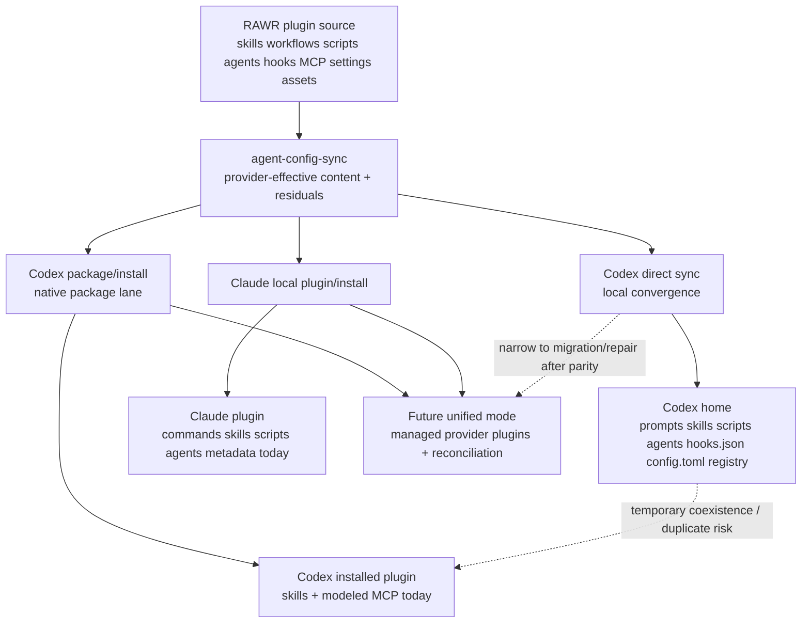

# Agent Config Sync Parity Investigation Report

Status: investigation report for `codex/agent-config-sync-parity-reconciliation-plan`
and child follow-up planning.

## Current State

The service has enough documentation to understand the gap, but the useful
truth is split across current, mixed, and historical artifacts.

| Artifact | Status | Use it for |
| --- | --- | --- |
| `services/agent-config-sync/docs/CURRENT_STATE.md` | Current | First-hop operational truth. It says Codex direct sync and Codex package/install are two unequal tracks, and package install is not full parity. |
| `services/agent-config-sync/test/TESTING_PLAN.md` | Current | Canonical gap/testing register. It names plugin-lane Codex agents/settings/hooks, undo, failure injection, multi-home, Cowork, and personal e2e gaps. |
| `services/agent-config-sync/docs/agent-sync-parity-reconciliation-plan.md` | Partially superseded | Useful reconciliation history and material-vs-semantic contract, but it still contains stale implementation-branch and Graphite wording. |
| `services/agent-config-sync/test/AGENT_SYNC_PARITY_CLOSURE_SPEC.md` | Mixed living spec | Useful acceptance/evidence history, but some "remaining" Codex package/install work has since been implemented. Treat runtime-smoke claims as unproven unless rerun. |
| `plugins/cli/plugins/README.md` and `plugins/cli/plugins/agent-pack/skills/agent-sync/SKILL.md` | Current operator docs | CLI-facing sync behavior, explicit Codex package lane, Claude install, and direct Codex hook/config ownership. |

Concrete branch facts:

- Top branch inspected: `d7aeda1f` (`codex/agent-config-sync-parity-reconciliation-plan`), with this report on child branch `codex/agent-config-sync-parity-investigation-report`.
- The branch already implements provider projections, external source workspace sync, semantic support residuals, Codex runtime skill destination cleanup, Codex package generation/install adapters, Claude install adapters, and direct Codex hook/MCP/settings/config sync.
- The branch does not prove Codex package-installed hook parity, package-installed custom agents, package-installed settings/config fragments, direct/package deduplication, or true provider uninstall/update parity.

## Parity Matrix

Legend:

- `native`: implemented through the provider's current supported path.
- `direct-only`: implemented only through direct filesystem convergence.
- `package`: implemented in provider package/install lane.
- `adapter-required`: modeled, but needs provider-specific install/merge semantics.
- `missing`: not currently implemented.
- `legacy`: useful compatibility/migration behavior, not the future claim.

| Capability | Codex direct sync | Codex package/install | Claude local plugin/install | Notes |
| --- | --- | --- | --- | --- |
| Skills | `native` | `package` | `native` | Codex direct sync writes runtime `.agents/skills`; package lane emits `.codex-plugin/plugin.json` with `skills: "./skills/"`. |
| Workflows/prompts/commands | `legacy` | `missing` | `native` | Codex mirrors workflows into `prompts/`; Claude maps workflows to plugin `commands/`. |
| Scripts | `direct-only` | `missing` | `native` | Codex stores prefixed utility scripts, not provider-native commands. |
| Agents | `direct-only` | `missing` | `native` | Codex direct sync projects Markdown agents to TOML and reports dropped Claude-only semantics. |
| Hooks | `native/direct-only` | `missing` | `adapter-required` | Codex direct sync copies hook scripts, merges `hooks.json`, and enables `codex_hooks`. Codex package lane intentionally omits hooks. Claude projections model hooks as adapter-required; Claude sync execution does not currently write hooks. |
| MCP | `native/direct-only` | `package` for modeled MCP | `adapter-required` | Codex direct sync copies MCP runtime files and merges `config.toml`; Codex package emits `.mcp.json` and files where modeled. Claude projection reports MCP/settings install work as adapter-required. |
| Settings/config | `native/direct-only` | `missing` | `adapter-required` | Codex direct sync merges TOML fragments into `config.toml`. Package lane omits settings/config. |
| Assets | `unknown` direct runtime | `package` | `unknown/package material` | Assets are useful for package surfaces; runtime semantics depend on consumer. |
| Registry/GC | `direct-only` | partial package output pruning | plugin manifest GC for synced Claude material | Codex direct sync has strongest ownership registry and stale retirement. Package lane prunes generated package dirs/marketplace entries, but does not reconcile provider runtime duplicates. |
| Install/update/uninstall | file convergence + undo | install implemented; update/uninstall incomplete | install/enable implemented; update/uninstall incomplete | Codex uses marketplace add + app-server install/verify. Claude uses marketplace add + install + enable. Provider update/remove adapters are not complete. |

## Legacy Vs Go-Forward

The real problem is not "can Codex run hooks." Direct Codex sync already proves
Codex can consume modeled hook material through runtime config. The problem is
that installable provider-plugin parity is incomplete: hooks, custom agents,
settings/config, full reconciliation, and update/uninstall semantics do not yet
work through one Codex/Claude native install process.

Direct sync is legacy in product direction but not disposable:

- It is the complete Codex local convergence path today.
- It owns the current working hook path.
- Removing it before package parity would lose hooks, standalone Codex agents,
settings/config fragments, full `config.toml` merge behavior, and direct-home
GC/registry convergence.

The go-forward path is native provider plugin/package install:

- Codex package/install is already real for skills, modeled MCP, assets,
marketplace registration, app-server install, and verification.
- Claude marketplace install/enable is already real for the current local plugin
material.
- The target abstraction should be "managed provider plugin" with provider
install flows owning delivery, while direct sync narrows to migration/repair.

Ownership boundary:

- `services/agent-config-sync`: source authority, provider-effective content,
projection status, semantic residuals, registry/GC, retirement, and direct-vs-package reconciliation.
- `packages/agent-config-sync-node`: package artifact writers and local provider CLI/app-server adapters.
- `plugins/cli/plugins`: command flags, orchestration, operator output, and process wiring.
- `services/hq-ops`: HQ plugin catalog, command-plugin install health, and lifecycle policy; not provider hook sync.

## Visual

## Recommendation

The next bulk of work should be native package/install parity and
reconciliation, not more feature growth in direct sync.

Use direct sync operationally for hooks right now, because it is the only
implemented full Codex local convergence path. Do not pretend Codex package
install provides hook parity yet. Do not remove direct sync until native package
install can carry hooks, custom agents, settings/config, and reconciliation
without capability loss.

The next workstream should:

1. Make package/install the primary convergence target for Codex and Claude.
2. Add package-provided hooks first: hook scripts, lifecycle config,
   install/update/uninstall, GC, rollback, and status reporting.
3. Add package-provided agents and settings/config fragments, with the same
   material-vs-semantic residual honesty used by direct sync.
4. Add service-owned reconciliation so package-installed material can absorb or
   supersede direct-sync material without duplicate provider-visible output.
5. Keep direct sync as compatibility/migration/repair until package parity is
   proven by tests and real provider install verification.

This is the cleanest path because it converges on one native provider-plugin
process without losing the currently working hook capability.

## Gap Register

| Gap | Owner area | Evidence | Suggested next branch |
| --- | --- | --- | --- |
| Codex package hooks | `agent-config-sync` model + `agent-config-sync-node` package/install adapters | `codex-package.ts` explicitly removes `hooks` and returns `hookCount: 0`; `CURRENT_STATE.md` names package-provided hooks as remaining work. | `codex/agent-config-sync-package-hooks` |
| Claude hook material install | `agent-config-sync` Claude projection/execution + provider package adapter | Claude projections mark hooks adapter-required; `sync-claude-homes.ts` does not currently write hooks. | `codex/agent-config-sync-claude-hooks` |
| Package-installed custom agents | service projection + package writer | Codex package lane omits `agents`; direct sync projects TOML agents only. | `codex/agent-config-sync-package-agents` |
| Package-installed settings/config | service projection + package writer + provider merge semantics | Codex package lane omits `settings`; direct sync merges TOML fragments into `config.toml`. | `codex/agent-config-sync-package-settings` |
| Direct/package reconciliation | new or expanded service reconciliation module | `CURRENT_STATE.md` warns package install plus direct sync can duplicate provider-visible material. | `codex/agent-config-sync-package-reconciliation` |
| Update/uninstall semantics | provider install adapters + service retirement model | Codex and Claude install paths exist; update/remove/uninstall parity is not implemented end to end. | `codex/agent-config-sync-provider-lifecycle` |
| Live provider smoke | CLI/e2e gates | Current tests are strong deterministic unit/adapter tests, but live RAWR Codex temp-home smoke is not proven by committed tests. | `codex/agent-config-sync-live-smoke` |

## Acceptance Answers

- We do have remaining-work material. The reliable current pair is
  `CURRENT_STATE.md` plus `TESTING_PLAN.md`; the reconciliation plan and closure
  spec are useful but partially stale.
- We understand the problem: direct sync has material capability; package/native
  install parity is incomplete, especially for hooks.
- Legacy path: direct filesystem convergence. Go-forward path: managed provider
  plugin/package install through Codex and Claude native flows.
- Gap between paths: hooks, custom agents, settings/config, reconciliation, and
  provider update/uninstall semantics.
- Hooks require package/native install support for scripts, lifecycle config,
  install/update/uninstall, config merge, GC, rollback, and duplicate prevention
  across both Codex and Claude.
- Next bulk work: package/install parity plus reconciliation. Keep direct sync as
  the immediate hook path and fallback until that work is proven.
