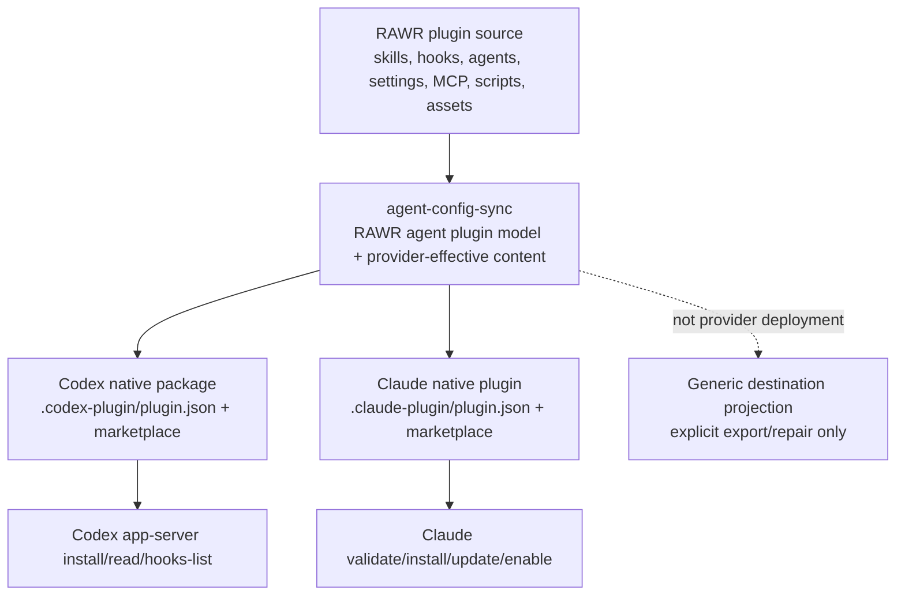

# Agent Config Sync Parity Report

Status: current handoff for
`codex/agent-C-agent-config-sync-managed-provider-plugin-parity`.

## Current State

`agent-config-sync` now has one sanctioned provider-deployment model:
RAWR plugin source is scanned into provider-effective content, then installed
through native provider plugin paths for Codex and Claude. Direct filesystem
sync remains only as generic destination projection/export.

The current reliable planning artifacts are:

| Artifact | Status | Use it for |
| --- | --- | --- |
| `PARITY_INVESTIGATION_REPORT.md` | Current | Provider parity truth and remaining risks. |
| `MANAGED_PROVIDER_PLUGIN_PARITY_WORKSTREAM.md` | Current | Workstream record, evidence, verification, and closure notes. |
| `NATIVE_PROVIDER_CLEANUP_BEHIND_WORKSTREAM.md` | Active | Workstream record for generic cleanup-behind provider sync implementation. |
| `MANAGED_PROVIDER_PLUGIN_PARITY_DECISIONS.md` | Current | Decision log for native-provider vs projection split. |
| `NATIVE_SUPERSEDED_PROJECTION_CLEANUP_HANDOFF.md` | Implemented as generic cleanup-behind | Original handoff for the first cleanup-behind policy: Codex native install superseding direct projection residue. |
| `CURRENT_STATE.md` | Partially stale | Historical service state before this parity workstream. |
| `agent-sync-parity-reconciliation-plan.md` | Superseded history | Reconciliation context only. |
| `TESTING_PLAN.md` and `AGENT_SYNC_PARITY_CLOSURE_SPEC.md` | Mixed | Historical gap register; re-check claims against this report and tests. |

The important provider facts are:

- Claude Code native plugins support commands, skills, agents, hooks, MCP, and
  install/update/enable lifecycle commands.
- Codex official docs and current upstream examples describe plugin-bundled
  hooks via `plugin.json#hooks` and `hooks/hooks.json`.
- Latest native `@openai/codex@0.128.0` exposes `hooks/list` and successfully
  reports installed plugin hooks when app-server is started with
  `--enable plugin_hooks`.
- Current `codex-rawr` / `~/.local/bin/codex` is `0.126.0-alpha.3` and does
  not have that provider surface yet. Use `--codex-bin
  /Users/mateicanavra/.volta/bin/codex` for hook-provider verification until
  the RAWR fork catches up.
- `PluginDetail` still does not include hooks. Provider-visible Codex hook
  proof must use app-server `hooks/list` and match `pluginId`.
- Codex does not currently publish a durable npm TypeScript/API package for
  plugin manifests or app-server plugin/hook methods. The provider-supported
  local type surface is generated from the installed binary with
  `codex app-server generate-ts` or `generate-json-schema`.

## Parity Matrix

Legend: `native` means the provider runtime/install path carries the capability.
`packaged-support` means material is packaged but not provider-activated as a
first-class runtime feature. `projection-only` is auxiliary export/repair, not
provider deployment.

| Capability | Codex native plugin | Claude native plugin | Generic projection/export | Notes |
| --- | --- | --- | --- | --- |
| Skills | `native` | `native` | `projection-only` | Codex package writes `.codex-plugin/plugin.json` + `skills/`; Claude writes plugin `skills/`. Projection output is never counted as provider parity. |
| Commands/workflows | `packaged-support` gap | `native` | `projection-only` | Claude maps workflows to `commands/`. Codex command activation remains a provider gap unless future source proves otherwise. |
| Scripts | `packaged-support` | `native/support` | `projection-only` | Codex package now includes `scripts/` support material. Hook/MCP scripts are referenced by provider configs. |
| Agents | `packaged-support` gap | `native` | `projection-only` | Codex package includes agent files as material, but provider activation is not yet proven. |
| Hooks | `native` in latest Codex with `plugin_hooks`; blocked in current `codex-rawr` | `native` | `projection-only` | Codex package advertises hooks only when lifecycle hook config exists, writes `hooks/hooks.json`, and verifies with `hooks/list`. Hook scripts alone are support material. |
| MCP | `native` for `.mcp.json` | `native` for `.mcp.json` | `projection-only` | Provider configs are generated from modeled MCP material. |
| Settings/config | `packaged-support` gap | `native/support` | `projection-only` | Codex provider-native config fragments remain unproven; do not hide that with direct config writes. |
| Assets/apps | `native/support` where provider consumes them | `native/support` where provider consumes them | `projection-only` | Assets are packaged; activation depends on provider surface. |
| Install/update/uninstall | install + verified hooks; provider update/remove still limited | validate/install/update/enable implemented | n/a | Claude update now runs when install reports already installed. Codex uninstall exists in app-server but is not fully wired as a lifecycle command. |
| Registry/GC | generated marketplace/package pruning | RAWR manifest + marketplace source pruning | managed projection registry/GC | Reconciliation must avoid duplicate active provider claims. |

## Legacy Vs Go-Forward

Go-forward: **managed native provider plugins**.

Direct sync is retained as **generic destination projection** only:

- It can copy RAWR-modeled content to arbitrary mapped destinations.
- It remains useful for fixtures, repair, migration, ad-hoc packaging, and
  non-CLI agent systems.
- It is not allowed as a sanctioned Codex or Claude deployment fallback.
- Export commands require explicit destinations and do not fall back to provider
  homes or environment defaults.
- Any provider-native gap must surface as a blocker or residual, not as a
  silent direct write.

## Implemented Workstream Changes

- Codex package generation now emits:
  - hook lifecycle config at `hooks/hooks.json` only when modeled hook config
    exists,
  - hook scripts under `hooks/`,
  - hook commands rewritten to `${CODEX_PLUGIN_ROOT}/hooks/<script>`,
  - MCP config and server files,
  - scripts, agents, settings, and assets as package material.
- Codex install verification now:
  - starts app-server with `--enable plugin_hooks` only when hook handlers are
    present,
  - verifies hooks through `hooks/list`,
  - counts enabled hooks by `pluginId`,
  - fails rather than claiming parity when provider hook activation is absent.
- Claude local plugin staging now includes hooks, MCP, settings, assets, and
  manifest fields for `hooks` and `mcpServers`.
- Claude install now validates the local marketplace and runs `plugin update`
  when `plugin install` reports the plugin is already installed.
- CLI default `rawr plugins sync` / `sync all` is native provider deployment;
  generic projection is available as `rawr plugins export` / `export all` and
  by explicit `--destination-projection`.
- Codex custom agents are maintained through the native role config lane at
  `<codex-home>/agents/*.toml`; plugin-packaged `agents/*.md` remains
  source/support material, not the active provider registration surface.
- Codex generic destination projections now report `legacy_or_deprecated` or
  adapter-required support instead of native provider support.

## Recommendation

The next bulk work should **not** improve direct sync for Codex/Claude. The
correct path is to keep closing native provider parity and use direct sync only
as generic projection/export.

For immediate hook-blocking work:

1. Use latest native Codex for verification:
   `--codex-bin /Users/mateicanavra/.volta/bin/codex`.
2. Keep `codex-rawr` as the primary/default binary, but record its current
   hook-plugin limitation until the fork rebases to a provider with
   `plugin_hooks`.
3. Treat Codex settings/config and command activation as provider residuals
   unless provider docs/source/runtime prove native semantics. Treat custom
   agents as native through the standalone role TOML config lane, not through
   plugin-packaged agent markdown.

## Evidence

- Official Codex plugin docs describe `hooks: "./hooks/hooks.json"` and say
  Codex also checks `./hooks/hooks.json` by default:
  <https://developers.openai.com/codex/plugins/build>
- Official Codex hooks docs define the top-level `{ "hooks": { ... } }`
  lifecycle config shape:
  <https://developers.openai.com/codex/hooks>
- Official `openai/plugins` examples repo includes plugin companion surfaces:
  <https://github.com/openai/plugins>
- Official app-server docs describe version-specific generated TypeScript and
  JSON Schema outputs:
  <https://developers.openai.com/codex/app-server>
- Open upstream issue documenting the historical docs/runtime mismatch for
  plugin-local hooks:
  <https://github.com/openai/codex/issues/16430>
- Local generated latest native app-server types show `hooks/list` and
  `HookMetadata.pluginId`, while `PluginDetail` omits hooks.
- Live temp-home smoke using `/Users/mateicanavra/.volta/bin/codex`
  `codex-cli 0.128.0` verified a generated RAWR package hook through
  `hooks/list` with `source: "plugin"` and `pluginId: "plugin-demo@rawr"`.

## Gap Register

| Gap | Status | Owner area | Next action |
| --- | --- | --- | --- |
| Codex plugin hooks in current `codex-rawr` | Provider-version gap | Codex fork/runtime | Rebase or upgrade fork to a provider with `plugin_hooks`; use native Codex binary for current verification. |
| Codex command/workflow activation | Provider gap | Codex adapter + provider docs | Research/verify whether Codex plugin commands are active; otherwise keep as package support material only. |
| Codex custom agent activation | Native via role config; plugin-package agents are source/support | Codex adapter + provider docs | Keep `<codex-home>/agents/*.toml` as the active native lane; only claim plugin-package agent activation if Codex exposes and proves that surface. |
| Codex settings/config fragments | Provider gap | Codex adapter + provider docs | Do not direct-merge config as deployment; wait for native config/plugin requirement surface. |
| Provider uninstall/remove lifecycle | Partial | `agent-config-sync-node`, CLI | Wire Codex app-server uninstall and Claude uninstall into explicit lifecycle/retirement commands. |
| Duplicate legacy provider claims | Narrowed | service reconciliation | Generic `cleanupBehindProviderSync` now removes RAWR-managed native-superseded residue after verified provider sync. Codex agent role claims are retained as native role config, not projection residue. Remaining risk is explicit provider uninstall/remove lifecycle and any future provider surface whose activation cannot be proven. |

## Acceptance Answers

- Yes, we had docs/specs/plans, but they were partly stale. This report is now
  the current handoff artifact.
- The problem is precise: provider-native install parity, especially hooks,
  not generic file copying.
- Legacy path: direct filesystem convergence. Retained path: generic
  destination projection/export. Go-forward path: native Codex/Claude provider
  plugin deployment.
- Hooks are installable through Claude native plugins and through latest native
  Codex with `plugin_hooks`; current `codex-rawr` must catch up or be bypassed
  with `--codex-bin` for verification.
- The next workstream should focus on provider-native residuals and lifecycle
  reconciliation, not direct-sync feature growth.
