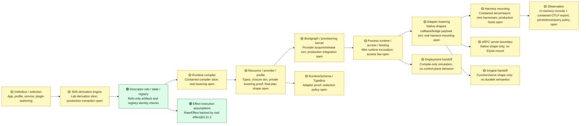

# Runtime Spine Verification Diagnostic

Status: current Lab V2 diagnostic.
Authority: `docs/projects/rawr-final-architecture-migration/resources/spec/RAWR_Effect_Runtime_Realization_System_Canonical_Spec.md`.
Migration input: `docs/projects/rawr-final-architecture-migration/resources/quarantine/RAWR_Architecture_Migration_Plan.md` is directional provenance only.

## Reading Key

| Status | Meaning |
| --- | --- |
| 🟢 Green | Verified by current lab gates at the relevant proof strength. |
| 🟡 Yellow | Partially verified, type-only, vendor-shape-only, simulation-only, or fenced as `xfail`/`todo`. |
| 🔴 Red | Not verified by the lab, unresolved, or not represented in the current container. |

Proof strength is not the same as migration readiness. A `vendor-proof` proves an installed vendor shape or behavior; a `simulation-proof` proves the mini runtime path; neither proves the production runtime path unless the component matrix says so explicitly.

## Spine Map

## Component Matrix

| Runtime spine component | Migration needs to lay down | Current lab evidence | Status | Still needs validation |
| --- | --- | --- | --- | --- |
| Definition and selection | Import-safe `defineApp(...)`, `RuntimeProfile`, `startApp(...)`, service/plugin/resource/provider declarations. | Positive fixtures cover app, service, server plugin, async workflow, resource/provider/profile shapes. | 🟡 | Import-safety runtime guard and real SDK derivation from declarations are not present. |
| RuntimeSchema | Runtime-carried config, diagnostics, redaction, and harness payload schema facade. | TypeBox-backed adapter validates values and rejects raw TypeBox as `RuntimeSchema`; provider provisioning now validates lab runtime-profile config through `RuntimeSchema` before provider build/acquire and keeps validation failures diagnostic-safe. | 🟡 | Final redaction metadata, production config-source binding/precedence, and persisted diagnostic payload policy remain open. |
| Service authoring and dependency lanes | `deps`, `scope`, `config`, `invocation`, `provided`; `resourceDep`, `serviceDep`, `semanticDep`; no private service imports. | Type fixtures and negatives prove core lane shape and invocation-bound client use; the mini cache proves construction-time binding identity, invocation exclusion, explicit service dependency graph validation, missing/ambiguous dependency rejection, cycle rejection, and dependency-before-dependent construction for lab `ServiceBindingPlan` inputs. | 🟡 | Production service binding compilation, resource/semantic dependency closure, and service ownership topology remain open. |
| Plugin authoring and topology | One factory, topology plus lane builder classification, `useService(...)` to service binding requirement. | Server plugin fixture proves a narrow authoring shape. | 🟡 | Topology/builder agreement across all plugin kinds is not enforced by the lab. |
| Descriptor refs, descriptor table, and registry | Discriminated refs, refs-only portable artifacts, non-portable descriptor table, registry identity checks before invocation. | Type/negative fixtures plus mini-runtime registry tests check full ref identity, duplicates, missing descriptors, and mismatches. | 🟢 | Real SDK derivation of descriptors from authoring remains separate and unimplemented. |
| SDK derivation engine | Produce `NormalizedAuthoringGraph`, `ServiceBindingPlan`, `SurfaceRuntimePlan`, `WorkflowDispatcherDescriptor`, portable artifacts without executing arbitrary user code. | A contained derivation slice converts explicit lab declarations and cold server route factories into normalized graph artifacts, descriptor table inputs, service binding plans, surface plans, server route descriptors, dispatcher descriptors with explicit operation inventory, async owner-to-step membership artifacts, and refs-only portable artifacts without executing descriptor bodies. | 🟡 | Production SDK extraction from real declarations, final public route import-safety law, final public async membership metadata channel, and final dispatcher access policy remain unresolved. |
| Runtime compiler and compiled plan | Emit `CompiledProcessPlan`, provider dependency graph, compiled service/surface/dispatcher/harness plans, and `BootgraphInput`. | The compiler slice emits compiled process plans for explicit descriptors and route-factory-derived server descriptors, including explicit async descriptors, provider dependency graph diagnostics, registry input, native-shaped adapter lowering payloads, harness placeholders, scoped bootgraph module input, topology seed, diagnostics, and bootgraph input from derived artifacts. | 🟡 | Production compiler integration remains open; provider lowering is proven only in the contained mini bootgraph path. |
| Resource/provider/profile model | Resources declare contracts, providers acquire/release, profiles select providers; provider coverage closes before provisioning. | Type fixtures prove provider is not an execution plan; compiler simulation catches missing, ambiguous, lifetime/instance-mismatched, and cyclic provider coverage; provider acquire/release now lowers through lab-internal plan internals and mini bootgraph provisioning; provider config validation/redaction is proven in the contained provisioning path; provider acquire/release boundary policy records now capture exact provider boundary kind, retry-attempt metadata, redacted attributes, and Exit/Cause classification. | 🟡 | Final public `ProviderEffectPlan` shape, production config source precedence, provider refresh/retry scheduling, and host/export policy remain open. |
| Effect execution assumptions | RAWR `RawrEffect` is backed by real Effect, with curated public surface and runtime-owned execution. | Real `effect@3.21.2` tests cover `Effect.gen`, `pipe`, `.pipe`, `Exit`, `Cause`, interruption, scoped release, finalizer order, and managed runtime wrapper. | 🟢 | This proves Effect assumptions, not the complete RAWR provisioning kernel. |
| Bootgraph and provisioning kernel | Dependency ordering, dedupe, rollback, reverse finalization, process/role scopes, provider acquisition through Effect. | Fake boot modules prove dependency ordering, rollback of started modules, reverse finalization, finalizer-failure recording, and redacted lifecycle records; provider provisioning modules now fail closed on provider graph diagnostics, validate config before provider build/acquire, and run acquire/release through graph-driven dependencies, real Effect execution, dependency value flow, rollback, reverse finalization, and release-failure recording. | 🟡 | Process/role scope semantics, production config source precedence, production bootgraph integration, and provider policy metadata remain open. |
| Process runtime, runtime access, and service binding | Scope runtime access, bind services, cache construction-time bindings, materialize dispatchers, project plugins. | Mini runtime runs descriptors through registry and real Effect execution; invocation context supplies clients/resources/workflows; runtime access exposes sanctioned resource/optional resource/telemetry/diagnostic/topology hooks; service binding cache validates explicit dependency inputs before construction, constructs dependencies before dependents, uses structural construction identity, excludes invocation, and emits contained executable boundary policy records with timeout metadata, retry-attempt declaration, AbortSignal interruption propagation, Exit/Cause classification, record-only telemetry metadata, and redacted attributes. | 🟡 | Final `RuntimeAccess` method law, production compiled service binding plans, dispatcher materialization, plugin projection, public policy API/DX, production retry scheduling, and host error mapping remain open. |
| Adapter lowering | Lower compiled surface plans into harness payloads; adapters must delegate into process runtime and not execute descriptors directly. | Instrumented adapters now consume native-shaped server callback and async bridge payloads derived from pre-derived route descriptors and async owner-to-step refs, reject widened wrong-boundary or mismatched route/owner metadata before runtime invocation, preserve full ref identity, avoid executable descriptors in payloads, delegate into the mini runtime, and inherit process-runtime boundary policy records without exposing adapter-level policy API. | 🟡 | Production Elysia/oRPC/Inngest callback lifecycle, durable async semantics, and native host error mapping remain unresolved. |
| Server/oRPC boundary | oRPC contract/server handler shapes adapted into Elysia/server harness payloads. | Native oRPC contract/router/handler shape-smoke artifacts are constructible. | 🟡 | No production oRPC adapter, Elysia mount, OpenAPI publication, or real request path proof. |
| Async/Inngest boundary | Workflow/schedule/consumer definitions lower to `FunctionBundle`; dispatcher wraps selected workflows; Inngest harness mounts native functions. | Inngest client/function/`inngest/bun` serve handoff shape is constructible; the lab now proves explicit async owner-to-step membership artifacts, dispatcher operation inventory, and contained async bridge payloads without defaulting access, executing bodies during derivation, or claiming durable host behavior. | 🟡 | Final public dispatcher policy, final async membership metadata syntax, FunctionBundle lowering, durable scheduling/retry/idempotency semantics, and real worker/serve path remain unproven. |
| Harness mounting | Elysia, Inngest, OCLIF, web, agent/OpenShell, desktop harnesses mount already-lowered payloads and return `StartedHarness`. | The lab now proves contained server and async started-harness artifacts that consume only adapter lowering payloads, expose invocation callbacks, preserve full ref identity, record start/invoke/stop lifecycle events, reject raw descriptors/compiler plans, and delegate through `ProcessExecutionRuntime`. | 🟡 | Production Elysia/oRPC/Inngest mounting, real HTTP/worker paths, other harness kinds, durable async semantics, deployment wiring, and final boundary policy remain open. |
| Diagnostics, telemetry, catalog, finalization | `RuntimeDiagnostic`, `RuntimeTelemetry`, `RuntimeCatalog`, topology/startup/finalization records, redaction. | In-memory catalog tests cover startup, rollback, finalization records, failed finalizers, provider config validation failures, redacted config snapshots, redacted provisioning trace attributes, boundary policy records, no secret/live-handle leakage, contained projection of already-redacted process/provider/catalog records into stable OTLP trace payloads, injected-fetch export serialization, and local HyperDX OTLP ingest smoke. | 🟡 | Persisted catalog storage, production correlation/query policy, product observability policy, production OpenTelemetry bootstrap, production diagnostic classes, native host telemetry/error mapping, durable async run history, and arbitrary free-form provider diagnostic string policy remain open. |
| Deployment/control-plane handoff | Compile-only handoff with portable artifacts and compiled plans; no live handles or descriptor table leakage. | Mini-runtime handoff keeps portable artifacts refs-only, negative fixtures reject object-literal live handles, and runtime validation rejects app id mismatches, widened descriptor tables, runtime access, live handles, executable closures, and raw secret fields. | 🟡 | Control-plane placement, deployment semantics, and stale deployment-plan alignment are not tested. |
| Enforcement and forbidden patterns | Reject raw runtime leakage, `.handler(...)` authoring, `fx`, portable closures, provider-as-execution-plan, live handles in portable artifacts. | Negative fixtures cover the core authoring misuse set. | 🟡 | Full topology/builder enforcement, raw env reads, diagnostics redaction, local HTTP self-call, and harness source restrictions remain broader migration gates. |

## Test-Theater Audit

| Item | Action | Why |
| --- | --- | --- |
| Native oRPC `.effect(...)` negative assertion | Removed | oRPC has no Effect-native `.effect(...)` API; asserting that absence tests a fictional behavior, not RAWR. RAWR `.effect(...)` remains tested in the SDK authoring lane. |
| Standalone “Bun exists” vendor-boundary test | Removed | It confirmed the test runner environment, not a RAWR runtime handoff or SDK boundary. Inngest/Bun serve-shape remains tested through the Inngest probe. |
| Direct raw Effect Queue/PubSub/Ref/Deferred/Schedule/Stream demo | Removed | It re-tested Effect primitives. The surviving process-local proof runs those primitives only through the lab's RAWR-owned process-local resource probe. |
| oRPC `serverHasNativeHandler: false` assertion | Replaced | The old assertion was an implementation artifact. The surviving check only proves native oRPC contract/router/server payload shapes are constructible; adapter compatibility is still unproven. |

## Current Position

The lab is meaningful, but it is not production runtime readiness and it is not enough to claim the whole migration spine is green. It now proves the load-bearing middle through contained simulation where the spec is already explicit enough:

1. The public authoring/type surface can reject several bad patterns.
2. The runtime can run real Effect values in a miniature descriptor/registry path.
3. Vendor boundary smoke checks for TypeBox, oRPC, and Inngest are available without pretending they are RAWR runtime behavior.
4. Explicit lab declarations and cold route factories can flow through derivation, compilation, adapter lowering payloads, contained server/async harness mounts, bootgraph/catalog records, runtime access/cache checks, adapter delegation, and deployment handoff boundaries.

The lab still does not prove production SDK derivation from real declarations, final public `ProviderEffectPlan` shape, production config source precedence or secret-store integration, final dispatcher access policy, final async membership authoring syntax, final route import-safety law, production adapter/harness mounting, durable scheduling, product observability/query policy, catalog persistence, deployment placement, or production runtime readiness.

## Next Validation Moves

### Resolve Now

| Decision | Default resolution |
| --- | --- |
| oRPC `.effect(...)` testing | Do not test this. RAWR `.effect(...)` is SDK-owned; oRPC native proof is contract/router/handler shape only. |
| Raw vendor primitive tests | Do not count direct vendor primitive demos as spine proof. They must pass through RAWR-owned wrappers or be removed. |
| Vendor-proof label | Treat `vendor-proof` as vendor compatibility evidence, not proof of production runtime path. |
| Stale migration plan language | Mine sequencing intent only. Target names come from the current runtime realization spec: `@rawr/sdk`, `startApp(...)`, `packages/core/runtime/*`. |

### Container Experiments

| Experiment | Why it matters |
| --- | --- |
| Async step membership | Resolve how workflow/schedule/consumer definitions own statically declarable step effects without executing workflow bodies. |
| Provider diagnostics and runtime profile config redaction | Contained provider config validation/redaction proof now exists; production config-source precedence, platform secret stores, and persisted observation remain fenced. |
| `ProviderEffectPlan` public shape | Decide the final producer/consumer fields only when the public runtime API needs to surface them. |
| `RuntimeResourceAccess` law | The lab now preserves a sanctioned access facade while proving service binding DAG behavior; final method law still needs explicit architecture acceptance or revision. |
| Dispatcher access declaration | Explicit operation inventory is proven for lab dispatcher descriptors; final access policy and public SDK/DX shape remain architecture decisions. |
| Server route derivation | Contained route factory derivation proof now exists; final route import-safety law, native oRPC/Elysia payload lowering, OpenAPI publication, and real HTTP paths remain fenced. |
| Boundary policy matrix | Contained record-only policy proof exists for exact executable/provider boundary kind, timeout metadata, retry-attempt declaration, AbortSignal interruption propagation/classification, Exit/Cause classification, and redacted attributes. Final public policy API/DX, production retry/backoff, durable async policy, native host error mapping, HyperDX export/query, and catalog persistence remain open. |
| Runtime profile config redaction | Extend only when production config-source precedence, platform secret stores, or persisted observation become migration targets. |
| RuntimeCatalog/diagnostics/finalization | Contained projection/export now exists; decide production observation shape, telemetry correlation/query policy, persistence boundaries, and config redaction before migration treats records as durable. |

### Migration-Only Or Later

| Gap | Why not solved by this lab yet |
| --- | --- |
| Durable Inngest scheduling/retry/idempotency semantics | Requires real Inngest runtime/host behavior; current lab only proves constructible handoff shape. |
| Production Elysia/oRPC request path | Requires real server harness and HTTP path; current lab only proves vendor shapes. |
| External provider integrations | Requires real providers or contract test doubles for Resend/Postgres/etc.; current lab only proves model shape. |
| Product telemetry and catalog persistence | Reserved detail boundary; current lab proves contained OTLP projection/export only, not product storage, query policy, dashboards, retention, or durable catalog semantics. |
| Deployment placement/control plane | Runtime realization emits records; placement decisions belong to deployment/control plane. |

## Verdict

Current status: **the contained lab now gives simulation-level confidence in the already-specified middle spine, with explicit yellow/red gaps reserved for unresolved design and production integration.**

The highest-value next lab iteration is not more vendor probing. It is narrowing the remaining negative space: migration/control-plane observation, production host mounting, durable async behavior, catalog persistence, product telemetry/query policy, native host error mapping, and deployment placement.
