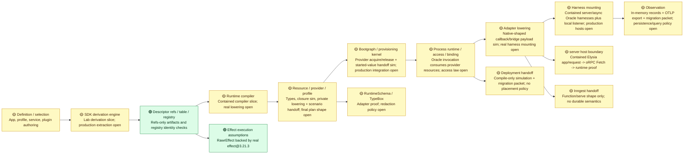

# Runtime Spine Verification Diagnostic

Status: current Lab V2 diagnostic.
Authority: `docs/projects/rawr-final-architecture-migration/resources/spec/RAWR_Effect_Runtime_Realization_System_Canonical_Spec.md`.
Migration input: `docs/projects/rawr-final-architecture-migration/resources/quarantine/RAWR_Architecture_Migration_Plan.md` is directional provenance only.

## Reading Key

| Status | Meaning |
| --- | --- |
| 🟢 Green | Verified by current lab gates at the relevant proof strength. |
| 🟡 Yellow | Partially verified, type-only, vendor-shape-only, simulation-only, or fenced as `xfail`/`todo`. |
| 🔴 Red | Not verified by the lab, unresolved, or not represented in the current container. |

Proof strength is not the same as Lab-Production Proof or Parent-Repo
Migration authorization. A `vendor-proof` proves an installed vendor shape or
behavior; a current `simulation-proof` proves the named Oracle or compatibility
path named by its test oracle. A future Reference Runtime gate must name its
own proof ceiling before any Lab-Production Proof claim promotes.

## Spine Map

## Component Matrix

| Runtime spine component | Migration needs to lay down | Current lab evidence | Status | Still needs validation |
| --- | --- | --- | --- | --- |
| Definition and selection | Import-safe `defineApp(...)`, `RuntimeProfile`, `startApp(...)`, service/plugin/resource/provider declarations. | Positive fixtures cover app, service, server plugin, async workflow, resource/provider/profile shapes. | 🟡 | Import-safety runtime guard and real SDK derivation from declarations are not present. |
| RuntimeSchema | Runtime-carried config, diagnostics, redaction, and harness payload schema facade. | TypeBox-backed adapter validates values and rejects raw TypeBox as `RuntimeSchema`; provider provisioning now validates lab runtime-profile config through `RuntimeSchema` before provider build/acquire and keeps validation failures diagnostic-safe. | 🟡 | Final redaction metadata, production config-source binding/precedence, and persisted diagnostic payload policy remain open. |
| Service authoring and dependency lanes | `deps`, `scope`, `config`, `invocation`, `provided`; `resourceDep`, `serviceDep`, `semanticDep`; no private service imports. | Type fixtures and negatives prove core lane shape and invocation-bound client use; the Oracle cache proves construction-time binding identity, invocation exclusion, explicit service dependency graph validation, missing/ambiguous dependency rejection, cycle rejection, and dependency-before-dependent construction for lab `ServiceBindingPlan` inputs. | 🟡 | Production service binding compilation, resource/semantic dependency closure, and service ownership topology remain open. |
| Plugin authoring and topology | One factory, topology plus lane builder classification, `useService(...)` to service binding requirement. | Server plugin fixture proves a narrow authoring shape. | 🟡 | Topology/builder agreement across all plugin kinds is not enforced by the lab. |
| Descriptor refs, descriptor table, and registry | Discriminated refs, refs-only portable artifacts, non-portable descriptor table, registry identity checks before invocation. | Type/negative fixtures plus Oracle registry tests check full ref identity, duplicates, missing descriptors, and mismatches. | 🟢 | Real SDK derivation of descriptors from authoring remains separate and unimplemented. |
| SDK derivation engine | Produce `NormalizedAuthoringGraph`, `ServiceBindingPlan`, `SurfaceRuntimePlan`, `WorkflowDispatcherDescriptor`, portable artifacts without executing arbitrary user code. | A contained derivation slice converts explicit lab declarations and cold server route factories into normalized graph artifacts, descriptor table inputs, service binding plans, surface plans, server route descriptors, dispatcher descriptors with explicit operation inventory, async owner-to-step membership artifacts, and refs-only portable artifacts without executing descriptor bodies. | 🟡 | Production SDK extraction from real declarations, final public route import-safety law, final public async membership metadata channel, and final dispatcher access policy remain unresolved. |
| Runtime compiler and compiled plan | Emit `CompiledProcessPlan`, provider dependency graph, compiled service/surface/dispatcher/harness plans, and `BootgraphInput`. | The compiler slice emits compiled process plans for explicit descriptors and route-factory-derived server descriptors, including explicit async descriptors, provider dependency graph diagnostics, registry input, native-shaped adapter lowering payloads, harness placeholders, scoped bootgraph module input, topology seed, diagnostics, and bootgraph input from derived artifacts. | 🟡 | Production compiler integration remains open; provider lowering is proven only in the contained Oracle bootgraph path. |
| Resource/provider/profile model | Resources declare contracts, providers acquire/release, profiles select providers; provider coverage closes before provisioning. | Type fixtures prove provider is not an execution plan; compiler simulation catches missing, ambiguous, lifetime/instance-mismatched, and cyclic provider coverage; provider acquire/release now lowers through lab-internal plan internals and Oracle bootgraph provisioning; provider config validation/redaction is proven in the contained provisioning path; provider acquire/release boundary policy records now capture exact provider boundary kind, retry-attempt metadata, redacted attributes, and Exit/Cause classification; a Phase Two scenario proves provisioned provider values can be handed into sanctioned runtime resource access for `ProcessExecutionRuntime` invocation without leaking config secrets or live handles into observation records. | 🟡 | Final public `ProviderEffectPlan` shape, production config source precedence, platform secret-store integration, provider refresh/retry scheduling, and host/export policy remain open. |
| Effect execution assumptions | RAWR `RawrEffect` is backed by real Effect, with curated public surface and runtime-owned execution. | Real `effect@3.21.3` tests cover `Effect.gen`, `pipe`, `.pipe`, `Exit`, `Cause`, interruption, scoped release, finalizer order, and managed runtime wrapper. | 🟢 | This proves Effect assumptions, not the complete RAWR provisioning kernel. |
| Bootgraph and provisioning kernel | Dependency ordering, dedupe, rollback, reverse finalization, process/role scopes, provider acquisition through Effect. | Fake boot modules prove dependency ordering, rollback of started modules, reverse finalization, finalizer-failure recording, and redacted lifecycle records; provider provisioning modules now fail closed on provider graph diagnostics, validate config before provider build/acquire, and run acquire/release through graph-driven dependencies, real Effect execution, dependency value flow, rollback, reverse finalization, release-failure recording, and an internal live started-value handoff used only for contained process assembly tests. | 🟡 | Process/role scope semantics, production config source precedence, production bootgraph integration, final `ProvisionedProcess` shape, and provider policy metadata remain open. |
| Process runtime, runtime access, and service binding | Scope runtime access, bind services, cache construction-time bindings, materialize dispatchers, project plugins. | Oracle runs descriptors through registry and real Effect execution; invocation context supplies clients/resources/workflows; runtime access exposes sanctioned resource/optional resource/telemetry/diagnostic/topology hooks; service binding cache validates explicit dependency inputs before construction, constructs dependencies before dependents, uses structural construction identity, excludes invocation, and emits contained executable boundary policy records with timeout metadata, retry-attempt declaration, AbortSignal interruption propagation, Exit/Cause classification, record-only telemetry metadata, and redacted attributes; a Phase Two scenario shows a descriptor consuming provisioned provider resources through runtime access while provider and executable effects share runtime-owned `EffectRuntimeAccess`. | 🟡 | Final `RuntimeAccess` method law, production compiled service binding plans, dispatcher materialization, plugin projection, public policy API/DX, production retry scheduling, and host error mapping remain open. |
| Adapter lowering | Lower compiled surface plans into harness payloads; adapters must delegate into process runtime and not execute descriptors directly. | Instrumented adapters now consume native-shaped server callback and async bridge payloads derived from pre-derived route descriptors and async owner-to-step refs, reject widened wrong-boundary or mismatched route/owner metadata before runtime invocation, preserve full ref identity, avoid executable descriptors in payloads, delegate into the Oracle, and inherit process-runtime boundary policy records without exposing adapter-level policy API. A contained Elysia route-forwarding host now delegates a raw `Request` into the contained oRPC Fetch boundary, a contained local Elysia/Bun listener now starts around that host and reaches the same path by direct network fetch, and a contained Inngest Bun serve/function/step path now delegates into the async harness rather than directly into descriptors or runtime internals. | 🟡 | Production Elysia/oRPC/Inngest callback lifecycle, production/deployed listen/port/server lifecycle, durable async semantics, and native host error mapping remain unresolved. |
| Server/oRPC/Elysia boundary | Elysia host/request/listener and oRPC contract/server handler shapes adapted into contained server harness payloads. | Native oRPC contract/router/handler shape-smoke artifacts are constructible; a lab-contained `@orpc/server/fetch` `RPCHandler` handles a real Fetch `Request`, matches `/rpc`, assembles runtime invocation context server-side from JSON-shaped request data, delegates through the Oracle server harness into `ProcessExecutionRuntime`, and rejects unmatched paths before harness invocation. Phase Three additionally proves that oRPC HTTP `200` transport can coexist with a RAWR failure body while runtime, adapter, harness, boundary, and telemetry records preserve failure status without turning the request into deployed-host proof. Child 5 adds a real Elysia app/request host passage by calling `Elysia.handle(new Request(...))`, routing `/rpc*` through `.all(..., { parse: "none" })`, forwarding raw `context.request` into the existing oRPC Fetch boundary, rejecting host-unmatched routes before oRPC/runtime delegation, preserving Elysia host records separately from oRPC/runtime records, and keeping runtime failure distinct from host delegation success. Child 6 adds a real local Elysia/Bun listener proof: `app.listen({ hostname: "127.0.0.1", port: 0 })`, direct real network `globalThis.fetch(...)` into `/rpc/invoke`, listener start/request/stop records from Elysia lifecycle/request hooks, `app.stop(true)`, `app.server === null`, and no further host/oRPC/harness/runtime delegation after stop. Child 7 composes that local listener path with the started provider/runtime/server/async/telemetry/stop/finalization passage in one contained run, using one shared counted `EffectRuntimeAccess` for provider provisioning and process execution and observing actual provider-started resource access as successful `requireResource` calls in server and async invocation contexts. | 🟡 | Deployed HTTP serving under deployment/process supervision, final oRPC adapter lifecycle, TLS/proxy/load-balancer behavior, OpenAPI publication, product API policy, auth/logging semantics, native host telemetry/error mapping, final route topology/import-safety law, and Parent-Repo Migration authorization remain unproven. |
| Async/Inngest boundary | Workflow/schedule/consumer definitions lower to `FunctionBundle`; dispatcher wraps selected workflows; Inngest harness mounts native functions. | Inngest client/function/`inngest/bun` serve handoff shape is constructible; a lab-contained `inngest/bun` serve handler now receives a real Fetch `Request`, routes to a real `Inngest.createFunction` handler by absolute function id, crosses `step.run` with the stable async step id, and delegates through a started Oracle async harness into `ProcessExecutionRuntime`. Phase Three additionally proves that HTTP `206` plus vendor operation `StepRun` can carry a RAWR payload failure, and the boundary records `protocolPayloadRuntimeStatus` without treating that nested status as durable Inngest semantics. Existing derivation evidence still proves explicit async owner-to-step membership artifacts and dispatcher operation inventory without executing bodies during derivation. | 🟡 | Final public dispatcher policy, final async membership metadata syntax, production FunctionBundle/worker lowering, durable scheduling/retry/idempotency/run-history semantics, production worker topology, and product async policy remain unproven. |
| Harness mounting | Elysia, Inngest, OCLIF, web, agent/OpenShell, desktop harnesses mount already-lowered payloads and return `StartedHarness`. | The lab now proves contained server and async started-harness artifacts that consume only adapter lowering payloads, expose invocation callbacks, preserve full ref identity, record start/invoke/stop lifecycle events, reject raw descriptors/compiler plans, and delegate through `ProcessExecutionRuntime`. The server harness is reached through a contained oRPC Fetch boundary, through a real contained Elysia app/request route-forwarding host in child 5, and through a real contained local Elysia/Bun listener in child 6; the async harness is reached through a contained Inngest Bun serve/function/step boundary. Phase Three adds a started-process passage that stops both mounted harnesses, finalizes provider/runtime resources, then proves valid post-stop oRPC and Inngest boundary requests reject before runtime delegation by stopped harness records, unchanged runtime invocation count, explicit runtime disposal evidence, and failure-classified Inngest StepError observation despite HTTP `206`. Child 7 proves the listener path and async path can coexist in the same derived/compiled spine, shared `EffectRuntimeAccess`, provider-started resource envelope, counted runtime, actual server/async `requireResource` observations, telemetry/control-plane packet, and shutdown sequence. | 🟡 | Production/deployed Elysia `listen(...)`/port/server lifecycle, production oRPC/Inngest mounting, real worker paths, other harness kinds, durable async semantics, deployment wiring, native host error/status taxonomy, and final boundary policy remain open. |
| Diagnostics, telemetry, catalog, finalization | `RuntimeDiagnostic`, `RuntimeTelemetry`, `RuntimeCatalog`, topology/startup/finalization records, redaction. | In-memory catalog tests cover startup, rollback, finalization records, failed finalizers, provider config validation failures, redacted config snapshots, redacted provisioning trace attributes, boundary policy records, no secret/live-handle leakage, contained runtime-access telemetry/diagnostic/resource records from provider-backed invocation, contained projection of already-redacted process/provider/catalog records into stable OTLP trace payloads, injected-fetch export serialization, local HyperDX OTLP ingest smoke, and a non-persistent migration observation packet that summarizes safe catalog and telemetry facts without copying payload bodies. Phase Two composes derivation/compilation, provider finalization, oRPC server boundary records, Inngest async boundary records, runtime events, catalog records, injected-fetch OTLP export, and migration/control-plane packet summaries in one integrated rehearsal with executable falsifiers for provider config, unmatched server paths, unknown async function ids, and telemetry run correlation. Phase Three adds stop/finalization and post-stop rejection records to the same redacted observation/control-plane path, and child 4 proves telemetry projection preserves failure status for runtime, adapter, harness, oRPC, and Inngest records before OTLP export failure is considered. | 🟡 | Persisted catalog storage, production correlation/query policy, product observability policy, production OpenTelemetry bootstrap, production diagnostic classes, native host telemetry/error mapping, durable async run history, arbitrary free-form provider diagnostic string policy, and arbitrary DLP remain open. |
| Deployment/control-plane handoff | Compile-only handoff with portable artifacts and compiled plans; no live handles or descriptor table leakage. | Oracle handoff keeps portable artifacts refs-only, negative fixtures reject object-literal live handles, runtime validation rejects app id mismatches, widened descriptor tables, runtime access, live handles, executable closures, and raw secret fields, and the migration observation packet correlates safe handoff/catalog/telemetry summaries with candidate-only placement hints. Phase Two integrated rehearsal builds the handoff from the compiled process plan and derived portable artifact, verifies packet summaries do not copy OTLP payload or export response bodies, rejects telemetry run-id drift, and keeps placement facts candidate-only. Phase Three child 4 keeps the packet at run/source/name/export summary correlation; it does not preserve per-layer status attributes or become placement, persistence, or product observability authority. | 🟡 | Control-plane placement policy, deployment orchestration, production control-plane topology, storage/indexing/retention, normalized status summaries, and stale deployment-plan alignment remain untested. |
| Enforcement and forbidden patterns | Reject raw runtime leakage, `.handler(...)` authoring, `fx`, portable closures, provider-as-execution-plan, live handles in portable artifacts. | Negative fixtures cover the core authoring misuse set. | 🟡 | Full topology/builder enforcement, raw env reads, diagnostics redaction, local HTTP self-call, and harness source restrictions remain broader migration gates. |

## Test-Theater Audit

| Item | Action | Why |
| --- | --- | --- |
| Native oRPC `.effect(...)` negative assertion | Removed | oRPC has no Effect-native `.effect(...)` API; asserting that absence tests a fictional behavior, not RAWR. RAWR `.effect(...)` remains tested in the SDK authoring lane. |
| Standalone “Bun exists” vendor-boundary test | Removed | It confirmed the test runner environment, not a RAWR runtime handoff or SDK boundary. Inngest/Bun serve-shape remains tested through the Inngest probe. |
| Direct raw Effect Queue/PubSub/Ref/Deferred/Schedule/Stream demo | Removed | It re-tested Effect primitives. The surviving process-local proof runs those primitives only through the lab's RAWR-owned process-local resource probe. |
| oRPC `serverHasNativeHandler: false` assertion | Replaced | The old assertion was an implementation artifact. The surviving check only proves native oRPC contract/router/server payload shapes are constructible; adapter compatibility is still unproven. |

## Current Position

The Lab is meaningful, but it has not yet earned Lab-Production Proof and it is
not enough to claim the whole Parent-Repo Migration spine is green. It now
proves the load-bearing middle through contained simulation where the spec is
already explicit enough:

1. The public authoring/type surface can reject several bad patterns.
2. The runtime can run real Effect values in an Oracle descriptor/registry path.
3. Vendor boundary smoke checks for TypeBox, oRPC, and Inngest are available without pretending they are production runtime behavior.
4. Explicit lab declarations and cold route factories can flow through derivation, compilation, adapter lowering payloads, a contained oRPC Fetch request boundary, contained server/async harness mounts, bootgraph/catalog records, runtime access/cache checks, adapter delegation, deployment handoff boundaries, telemetry export, and a non-persistent migration observation packet.
5. A Phase Three started-process passage now proves the lab can stop mounted server/async harnesses, finalize provider/runtime resources, and reject post-stop oRPC and Inngest boundary calls before runtime delegation while recording safe observation evidence.
6. A Phase Three layer-disagreement proof now shows that HTTP transport,
   vendor operation/body, RAWR runtime result, adapter/harness records,
   boundary records, telemetry projection, OTLP export result, and
   control-plane summary correlation can remain distinct in the contained lab.
7. Phase Three child 5 and child 6 now prove the server side can cross from
   real contained Elysia app/request handling into oRPC and from a real local
   Bun/Elysia listener into that same path, while production deployed host
   lifecycle remains fenced.
8. Phase Three child 7 now proves those focused slices compose in one
   contained Oracle live-runtime-passage rehearsal: derived/compiled spine,
   provider bootgraph, shared `EffectRuntimeAccess`, real local listener,
   oRPC/server harness/runtime, contained Inngest async harness/runtime,
   successful provider-resource `requireResource` calls through server and
   async contexts, redacted telemetry/control-plane packet, ordered
   stop/finalization, and post-stop non-delegation.

The Lab still does not prove SDK derivation from real declarations, final public
`ProviderEffectPlan` shape, config source precedence or secret-store
integration, final dispatcher access policy, final async membership authoring
syntax, final route import-safety law, final adapter/harness mounting, durable
scheduling, product observability/query policy, catalog persistence, deployment
placement, or Lab-Production Proof.

## Next Validation Moves

### Resolve Now

| Decision | Default resolution |
| --- | --- |
| oRPC `.effect(...)` testing | Do not test this. RAWR `.effect(...)` is SDK-owned; oRPC native proof is contract/router/handler/request-boundary behavior only where explicitly gated. |
| Raw vendor primitive tests | Do not count direct vendor primitive demos as spine proof. They must pass through RAWR-owned wrappers or be removed. |
| Vendor-proof label | Treat `vendor-proof` as vendor compatibility evidence, not Lab-Production Proof. |
| Stale migration plan language | Mine sequencing intent only. Target names come from the current runtime realization spec: `@rawr/sdk`, `startApp(...)`, `packages/core/runtime/*`. |

### Container Experiments

| Experiment | Why it matters |
| --- | --- |
| Async step membership | Resolve how workflow/schedule/consumer definitions own statically declarable step effects without executing workflow bodies. |
| Provider diagnostics and runtime profile config redaction | Contained provider config validation/redaction proof now exists; config-source precedence, platform secret stores, and persisted observation remain fenced. |
| Provider/config/Effect process spine | Use the contained scenario proof as child workstream 3 backing evidence only; it shows provider values feeding runtime access and process execution, not final provider API or policy readiness. |
| `ProviderEffectPlan` public shape | Decide the final producer/consumer fields only when the public runtime API needs to surface them. |
| `RuntimeResourceAccess` law | The lab now preserves a sanctioned access facade while proving service binding DAG behavior; final method law still needs explicit architecture acceptance or revision. |
| Dispatcher access declaration | Explicit operation inventory is proven for lab dispatcher descriptors; final access policy and public SDK/DX shape remain architecture decisions. |
| Server route derivation | Contained route factory derivation, contained oRPC Fetch request proof, contained Elysia route-forwarding host proof, and contained Elysia local listener lifecycle proof now exist; final route import-safety law, deployed host lifecycle, OpenAPI publication, and deployed HTTP paths remain fenced. |
| Boundary policy matrix | Contained record-only policy proof exists for exact executable/provider boundary kind, timeout metadata, retry-attempt declaration, AbortSignal interruption propagation/classification, Exit/Cause classification, and redacted attributes. Final public policy API/DX, retry/backoff, durable async policy, native host error mapping, HyperDX export/query, and catalog persistence remain open. |
| Runtime profile config redaction | Extend only when config-source precedence, platform secret stores, or persisted observation become Reference Runtime or Parent-Repo Migration targets. |
| RuntimeCatalog/diagnostics/finalization | Contained projection/export and migration packet summaries now exist; decide observation shape, telemetry correlation/query policy, persistence boundaries, and config redaction before the Reference Runtime or Parent-Repo Migration treats records as durable. |

### Reference Runtime Or Parent-Repo Migration Gates

| Gap | What current contained evidence has not proven yet |
| --- | --- |
| Durable Inngest scheduling/retry/idempotency semantics | Requires a production-shaped Inngest host slice or explicit vendor-backed gate; current Lab proof has not yet exercised durable host behavior. |
| Deployed Elysia/oRPC request path | Requires a production-shaped host integration gate and explicit HTTP lifecycle policy; current Lab proof covers contained Elysia `app.handle`, contained oRPC Fetch, and contained local Elysia/Bun listener start/request/stop behavior only. |
| External provider integrations | Requires real providers or contract test doubles for Resend/Postgres/etc.; current lab only proves model shape. |
| Product telemetry and catalog persistence | Reserved detail boundary; current lab proves contained OTLP projection/export plus non-persistent packet summaries only, not product storage, query policy, dashboards, retention, or durable catalog semantics. |
| Deployment placement/control plane | Runtime realization emits records and candidate-only packet hints; placement and orchestration decisions belong to deployment/control plane. |

## Verdict

Current status: **Phase Three is closed as contained live-runtime-passage
`simulation-proof`.** Phase Two remains closed as contained spine-composition
proof. Phase Three child 2 adds contained simulation evidence that Oracle can
assemble a started passage, invoke through oRPC and Inngest boundaries, observe
safe records, stop/finalize, and reject post-stop boundary calls before runtime
delegation. Phase Three child 4 adds contained simulation evidence that layer
disagreement survives representative oRPC/Inngest failure cases, telemetry
projection, export failure, and control-plane summary correlation without
becoming Lab-Production Proof. Phase Three child 5 and child 6 add contained
server-side Elysia evidence: app/request route-forwarding and local Bun/Elysia
listen/request/stop lifecycle, still fenced below deployed host lifecycle.
Phase Three child 7 composes the earned slices into one inspectable contained
Oracle passage and reconciles the remaining residuals for the next phase.

This remains contained `simulation-proof`, not Lab-Production Proof and not
Parent-Repo Migration authorization. The highest-value next step is the
Reference Runtime program: build the first full runtime-in-a-folder inside the
Lab, resolve externality/design residuals when they block that build, and keep
Parent-Repo Migration separate until explicit authorization.

Future work should still open explicit residual decision packets or
Parent-Repo Migration workstreams for deployed host mounting, durable async
behavior, catalog persistence, product telemetry/query policy, native host
error mapping, deployment placement, control-plane topology, public API/DX
laws, config/secret-store policy, and the first production resource/provider
catalog cut.
