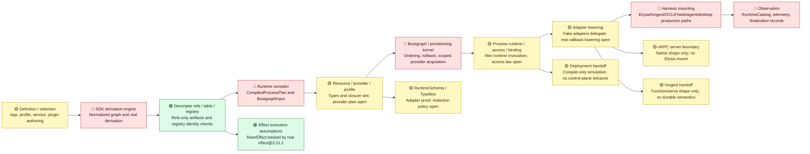

# Runtime Spine Verification Diagnostic

Status: current Lab V2 diagnostic.
Authority: `docs/projects/rawr-final-architecture-migration/resources/spec/RAWR_Effect_Runtime_Realization_System_Canonical_Spec.md`.
Migration input: `docs/projects/rawr-final-architecture-migration/resources/quarantine/RAWR_Architecture_Migration_Plan.md` is directional provenance only.

## Reading Key

| Status | Meaning |
| --- | --- |
| 🟢 Green | Verified by current lab gates at the relevant proof strength. |
| 🟡 Yellow | Partially verified, type-only, vendor-shape-only, simulation-only, or fenced as `xfail`/`todo`. |
| 🔴 Red | Not verified by the lab, unresolved, or not represented in the current container. |

Proof strength is not the same as migration readiness. A `vendor-proof` proves an installed vendor shape or behavior; a `simulation-proof` proves the mini runtime path; neither proves the production runtime path unless the component matrix says so explicitly.

## Spine Map

## Component Matrix

| Runtime spine component | Migration needs to lay down | Current lab evidence | Status | Still needs validation |
| --- | --- | --- | --- | --- |
| Definition and selection | Import-safe `defineApp(...)`, `RuntimeProfile`, `startApp(...)`, service/plugin/resource/provider declarations. | Positive fixtures cover app, service, server plugin, async workflow, resource/provider/profile shapes. | 🟡 | Import-safety runtime guard and real SDK derivation from declarations are not present. |
| RuntimeSchema | Runtime-carried config, diagnostics, redaction, and harness payload schema facade. | TypeBox-backed adapter validates values and rejects raw TypeBox as `RuntimeSchema`. | 🟡 | Redaction metadata, config-source binding, and diagnostic payload coverage remain untested. |
| Service authoring and dependency lanes | `deps`, `scope`, `config`, `invocation`, `provided`; `resourceDep`, `serviceDep`, `semanticDep`; no private service imports. | Type fixtures and negatives prove core lane shape and invocation-bound client use. | 🟡 | Real service binding DAG, dependency cycle diagnostics, and service binding cache behavior are not implemented. |
| Plugin authoring and topology | One factory, topology plus lane builder classification, `useService(...)` to service binding requirement. | Server plugin fixture proves a narrow authoring shape. | 🟡 | Topology/builder agreement across all plugin kinds is not enforced by the lab. |
| Descriptor refs, descriptor table, and registry | Discriminated refs, refs-only portable artifacts, non-portable descriptor table, registry identity checks before invocation. | Type/negative fixtures plus mini-runtime registry tests check full ref identity, duplicates, missing descriptors, and mismatches. | 🟢 | Real SDK derivation of descriptors from authoring remains separate and unimplemented. |
| SDK derivation engine | Produce `NormalizedAuthoringGraph`, `ServiceBindingPlan`, `SurfaceRuntimePlan`, `WorkflowDispatcherDescriptor`, portable artifacts without executing arbitrary user code. | Hand-authored artifacts and fixtures simulate outputs. | 🔴 | Actual derivation engine, cold route derivation rule, and async step membership association need container experiments. |
| Runtime compiler and compiled plan | Emit `CompiledProcessPlan`, provider dependency graph, compiled service/surface/dispatcher/harness plans, and `BootgraphInput`. | Only stubs and provider-closure simulation exist. | 🔴 | Compiler behavior, diagnostics, and compiled artifact snapshots need real lab implementation. |
| Resource/provider/profile model | Resources declare contracts, providers acquire/release, profiles select providers; provider coverage closes before provisioning. | Type fixtures prove provider is not an execution plan; provider closure simulation catches missing dependency. | 🟡 | `ProviderEffectPlan` shape, lowering, acquire/release diagnostics, config redaction, and refresh/retry policy are open. |
| Effect execution assumptions | RAWR `RawrEffect` is backed by real Effect, with curated public surface and runtime-owned execution. | Real `effect@3.21.2` tests cover `Effect.gen`, `pipe`, `.pipe`, `Exit`, `Cause`, interruption, scoped release, finalizer order, and managed runtime wrapper. | 🟢 | This proves Effect assumptions, not the complete RAWR provisioning kernel. |
| Bootgraph and provisioning kernel | Dependency ordering, dedupe, rollback, reverse finalization, process/role scopes, provider acquisition through Effect. | Effect scoped/finalizer semantics are proven as vendor behavior. | 🔴 | RAWR bootgraph, provider lowering, startup rollback, and final catalog records are not implemented. |
| Process runtime, runtime access, and service binding | Scope runtime access, bind services, cache construction-time bindings, materialize dispatchers, project plugins. | Mini runtime runs descriptors through registry and real Effect execution; invocation context supplies clients/resources/workflows. | 🟡 | `RuntimeAccess` method law, `ServiceBindingCache`, service binding DAG, and dispatcher materialization are open. |
| Adapter lowering | Lower compiled surface plans into harness payloads; adapters must delegate into process runtime and not execute descriptors directly. | Fake server and async adapters delegate into mini runtime. | 🟡 | Real server route derivation, callback lowering, and async bridge lowering are still `xfail`. |
| Server/oRPC boundary | oRPC contract/server handler shapes adapted into Elysia/server harness payloads. | Native oRPC contract/router/handler shape-smoke artifacts are constructible. | 🟡 | No production oRPC adapter, Elysia mount, OpenAPI publication, or real request path proof. |
| Async/Inngest boundary | Workflow/schedule/consumer definitions lower to `FunctionBundle`; dispatcher wraps selected workflows; Inngest harness mounts native functions. | Inngest client/function/`inngest/bun` serve handoff shape is constructible. | 🟡 | Async step membership, dispatcher access, FunctionBundle lowering, durable scheduling/retry/idempotency semantics, and real worker/serve path are unproven. |
| Harness mounting | Elysia, Inngest, OCLIF, web, agent/OpenShell, desktop harnesses mount already-lowered payloads and return `StartedHarness`. | No real harness mount exists in the lab. | 🔴 | Server and async harnesses need first; other harnesses can remain downstream unless migration scope promotes them. |
| Diagnostics, telemetry, catalog, finalization | `RuntimeDiagnostic`, `RuntimeTelemetry`, `RuntimeCatalog`, topology/startup/finalization records, redaction. | Mini runtime emits simple invocation events only. | 🔴 | Catalog shape, diagnostic classes, telemetry correlation, redacted payloads, rollback records, and finalization records need lab tests. |
| Deployment/control-plane handoff | Compile-only handoff with portable artifacts and compiled plans; no live handles or descriptor table leakage. | Mini-runtime handoff keeps portable artifacts refs-only and excludes descriptor table/live handles. | 🟡 | Control-plane placement, deployment semantics, and stale deployment-plan alignment are not tested. |
| Enforcement and forbidden patterns | Reject raw runtime leakage, `.handler(...)` authoring, `fx`, portable closures, provider-as-execution-plan, live handles in portable artifacts. | Negative fixtures cover the core authoring misuse set. | 🟡 | Full topology/builder enforcement, raw env reads, diagnostics redaction, local HTTP self-call, and harness source restrictions remain broader migration gates. |

## Test-Theater Audit

| Item | Action | Why |
| --- | --- | --- |
| Native oRPC `.effect(...)` negative assertion | Removed | oRPC has no Effect-native `.effect(...)` API; asserting that absence tests a fictional behavior, not RAWR. RAWR `.effect(...)` remains tested in the SDK authoring lane. |
| Standalone “Bun exists” vendor-boundary test | Removed | It confirmed the test runner environment, not a RAWR runtime handoff or SDK boundary. Inngest/Bun serve-shape remains tested through the Inngest probe. |
| Direct raw Effect Queue/PubSub/Ref/Deferred/Schedule/Stream demo | Removed | It re-tested Effect primitives. The surviving process-local proof runs those primitives only through the lab's RAWR-owned process-local resource probe. |
| oRPC `serverHasNativeHandler: false` assertion | Replaced | The old assertion was an implementation artifact. The surviving check only proves native oRPC contract/router/server payload shapes are constructible; adapter compatibility is still unproven. |

## Current Position

The lab is meaningful, but it is not yet enough to claim the migration spine is green. It now proves three important things:

1. The public authoring/type surface can reject several bad patterns.
2. The runtime can run real Effect values in a miniature descriptor/registry path.
3. Vendor boundary smoke checks for TypeBox, oRPC, and Inngest are available without pretending they are RAWR runtime behavior.

The lab does not yet prove the load-bearing middle of the migration: real SDK derivation, runtime compiler, bootgraph/provisioning, provider lowering, service binding cache, production adapter lowering, harness mounting, RuntimeCatalog, telemetry, or finalization.

## Next Validation Moves

### Resolve Now

| Decision | Default resolution |
| --- | --- |
| oRPC `.effect(...)` testing | Do not test this. RAWR `.effect(...)` is SDK-owned; oRPC native proof is contract/router/handler shape only. |
| Raw vendor primitive tests | Do not count direct vendor primitive demos as spine proof. They must pass through RAWR-owned wrappers or be removed. |
| Vendor-proof label | Treat `vendor-proof` as vendor compatibility evidence, not proof of production runtime path. |
| Stale migration plan language | Mine sequencing intent only. Target names come from the current runtime realization spec: `@rawr/sdk`, `startApp(...)`, `packages/core/runtime/*`. |

### Container Experiments

| Experiment | Why it matters |
| --- | --- |
| SDK derivation engine slice | Prove cold declarations produce normalized graph, descriptor refs/table, service binding plans, surface plans, and portable artifacts. |
| Async step membership | Resolve how workflow/schedule/consumer definitions own statically declarable step effects without executing workflow bodies. |
| `ProviderEffectPlan` shape and lowering | Prove provider acquire/release, telemetry, errors, rollback, and diagnostics before provisioning. |
| `RuntimeResourceAccess` law | Lock require/optional/metadata methods without exposing raw runtime internals. |
| Dispatcher access declaration | Decide whether workflow dispatcher access is explicit or ambient before compiling dispatcher operations. |
| Server route derivation | Prove cold route factories are derivable and invocation-time values arrive through context. |
| Adapter callback lowering | Prove native host callbacks resolve registry boundaries and delegate into process runtime. |
| Async bridge lowering | Prove async step callbacks run pre-derived descriptors through process runtime while durable semantics stay with Inngest. |
| Runtime profile config redaction | Prove config validation, secret use, redacted diagnostics, and no live secret leakage. |
| RuntimeCatalog/diagnostics/finalization | Prove observations are records, not live access, and finalization/rollback are visible. |

### Migration-Only Or Later

| Gap | Why not solved by this lab yet |
| --- | --- |
| Durable Inngest scheduling/retry/idempotency semantics | Requires real Inngest runtime/host behavior; current lab only proves constructible handoff shape. |
| Production Elysia/oRPC request path | Requires real server harness and HTTP path; current lab only proves vendor shapes. |
| External provider integrations | Requires real providers or contract test doubles for Resend/Postgres/etc.; current lab only proves model shape. |
| Telemetry export and catalog persistence | Reserved detail boundary; current lab should prove hooks before product storage/export semantics. |
| Deployment placement/control plane | Runtime realization emits records; placement decisions belong to deployment/control plane. |

## Verdict

Current status: **migration planning can proceed with explicit yellow/red gaps, but runtime implementation should not claim the core spine is pre-verified yet.**

The highest-value next lab iteration is not more vendor probing. It is the middle-spine proof: SDK derivation -> runtime compilation -> bootgraph/provisioning -> process runtime/service binding -> adapter lowering -> harness handoff -> catalog/finalization records.
